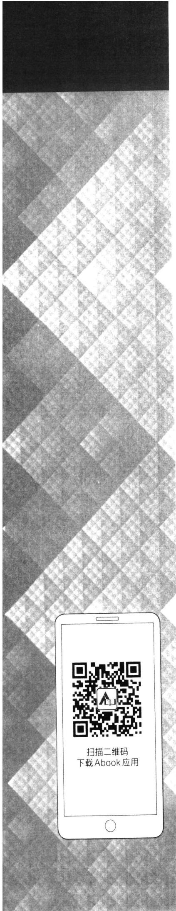

--- Part1 ---
# 概率论与数理统计教程

第三版

茆诗松程依明 濮晓龙编著

谨以此书纪念魏宗舒教授

第三版

茆诗松程依明 濮晓龙编著

## 内容提要

本书为“十二五”普通高等教育本科国家级规划教材。全书共八章，前四章为概率论部分，主要叙述各种概率分布及其性质，后四章为数理统计部分，主要叙述各种参数估计与假设检验。本次修订适当补充了数字资源（以符号标识）。

本书的编写从实例出发，图文并茂，通俗易懂，注重讲清楚基本概念与统计思想，强调各种方法的应用，适合初次接触概率统计的读者阅读。全书插图100多幅，例题250多道，习题600余道。

本书可供高等学校数学类专业与统计学专业作为教材使用，亦可供其他专业类似课程参考，也适合自学使用。

## 图书在版编目（CIP）数据

概率论与数理统计教程/茆诗松，程依明，濮晓龙编著．--3版.--北京：高等教育出版社，2019.11（2020.4重印）

ISBN 978-7-04-051148-2

I.①概Ⅱ.①茆…②程…③濮…Ⅲ.①概率论-高等学校-教材②数理统计-高等学校-教材IV.①021

中国版本图书馆CIP数据核字（2019)第009658号

策划编辑李蕊

版式设计马云

责任编辑李蕊

插图绘制于博

特约编辑高旭

责任校对王雨

封面设计王凌波

责任印制刘思涵

出版发行高等教育出版社

社址北京市西城区德外大街4号

网址http://www.hep.edu.cn

邮政编码100120

http://www.hep.com.cn

印刷肥城新华印刷有限公司

网上订购http://www.hepmall.com.cn

开本787mm×1092mm1/16

http://www.hepmall.com

印张30.5

http://www.hepmall.cn

字数670千字

版次2004年10月第1版

购书热线 010-58581118

2019年11月第3版

咨询电话 400-810-0598

印次2020年4月第2次印刷

定价59.00元

本书如有缺页、倒页、脱页等质量问题，请到所购图书销售部门联系调换

版权所有侵权必究

物料号51148-00

# 概率论与数理统计教程

第三版

茆诗松程依明濮晓龙编著

1.计算机访问http://abook.hep.com.cn/1225539，或手机扫描二维码、下载并安装Abook应用。

2.注册并登录，进入“我的课程”。

3.输入封底数字课程账号（20位密码，刮开涂层可见)，或通过Abook应用扫描封底数字课程账号二维码，完成课程绑定。

4.单击“进入课程”按钮，开始本数字课程的学习。

要请知

概率论与数理统计教程

第三版

概率论与数理统计数字课程与纸质教材一体化设计，紧密配合。数字课程提供数学史料、拓展阅读类数字资源，充分运用多种媒体资源，丰富了知识的呈现形式，拓展了教材内容，在提升课程教学效果的同时，为学生学习提供思维与探索的空间。

课程绑定后一年为数字课程使用有效期。受硬件限制，部分内容无法在手机端显示，请按提示通过计算机访问学习。

如有使用问题，请发邮件至abook@hep.com.cn。

  
概率论简史

  
数理统计简史

http://abook.hep.com.cn/1225539

## 第三版前言

本书是概率论与数理统计的入门书，在选材和编写上尽量使之适合初学者阅读和教师讲解。本版仍保留前两版的特色，修改的重点放在概念和结论的叙述、解释及应用上，对一些过时的叙述和例题(包括习题)做了适当的更新和修改。

本书前四章由程依明负责修改，后四章由濮晓龙负责修改，全书由茆诗松统稿。修改中听取了不少同行的意见，复旦大学徐勤丰老师提了不少好的建议，我们对此特别感谢。还望广大教师和学生不断提出意见，使本书不断改进，更好地为教学服务。

茆诗松、程依明、濮晓龙

2018年6月

本书第一版发行以来各方面反映尚好，同行也提出了一些意见和建议，我们在教学中也发现了一些值得改进的地方。在高等教育出版社李蕊女士的鼓励下，我们着手修改教材，修改的重点放在概念和结论的叙述和解释上，目的是使学生易学、教师易教，从而更好地帮助学生能用随机观念和统计思想去思考问题和处理问题。

第二版教材保留了第一版教材的体系，在内容上作了一些局部调整和改进。在概率论部分更强调了随机变量的设置和分布的概念，离散分布在古典概率的计算中出现，密度函数用动画形式在频率的稳定中形成，分位数是解概率不等式F（x）≤p不可或缺的概念。改写了分布的偏度与峰度，使之能更好地解释分布的形状。在极限定理中改变了叙述的次序，先讲随机变量序列的两种收敛性，随后简要介绍了复随机变量，引出特征函数，这使得大数定律和中心极限定理的叙述和证明更为自然。

在数理统计部分，我们把估计的各种评价标准分散在各种估计思想和方法中。在矩法估计中建立相合性，在无偏估计中强调有效性，在有偏估计中强调均方误差准则，在最大似然估计中建立渐近正态性，并重视其渐近方差和EM算法。假设检验是统计学的精华部分，能否自如地运用假设检验是检阅一个学生是否真正理解了统计学原理的试金石，为此我们对假设检验部分作了大调整，在假设检验开始时就建立检验的P值，在随后的使用中，拒绝域与P值并重，哪个方便就使用哪个。此外，还增加了成对数据的比较、似然比检验的基本思想和几种基本的非参数检验方法。

第二版的习题仍按节设立，但有改、有增、有减，总量比第一版增加了100多道。

本书前四章仍由程依明负责修改，后四章仍由濮晓龙负责修改，全书由茆诗松统稿。我们几经阅读与讨论定下第二版书稿。本次修订得到广大教师与学生的关心和支持，在此表示感谢。由于水平所限，不当之处在所难免，还恳请广大教师和学生提出批评意见，我们将不断改进，与时俱进，把这项教材建设的工作做好。

茆诗松、程依明、濮晓龙

2010年8月

概率论与数理统计是全国高等院校数学系与统计系的基础课程。这门课的任务是以丰富的背景、巧妙的思维和有趣的结论吸引读者，使学生在浓厚的兴趣中学习和掌握概率论与数理统计的基本概念、基本方法和基本理论。我们正是抱着这样的心愿编写这本教科书，并努力去实现它。很幸运，2003年该书先后被列入“普通高等教育‘十五’国家级规划教材”和“高等教育百门精品课程教材建设项目”。这使我们信心倍增，同时也深感责任重大，定要同心协力编写好此书，以适应祖国日益发展的经济形势的需要。

本书内容为八章，前四章为概率论，后四章为数理统计。在编写上作了一些尝试，我们把随机变量的定义分两步完成，其直观定义在第一章就出现了，用来表示事件，较为严格的定义在第二章中给出。这样可使学生对随机变量有较具体又完整的概念。在随机变量层次上，我们更强调分布的概念。另外在概率的定义上，我们采用了公理化系统，而把频率、古典概率、几何概率和主观概率作为确定概率的四种方法。在数理统计部分，我们尽量从数据出发提出问题和研究问题，对总体、抽样分布、检验的拒绝域等概念的叙述都作了一些改进，增加了描述性统计的基本内容和贝叶斯统计初步，让学生能较为全面地认识统计。另外对分位数、检验的P值、零概率事件（几乎处处）和渐近分布等都作了较为详尽和具体的叙述。在叙述中我们尽力做到图文并茂，全书共有图100多幅，相信这对内容的理解会有帮助。

作为概率论与数理统计的入门书，我们不想一进门就把学生引入数学天堂，而是在“野外”先浏览概率统计的各种风景之后，再进入数学天堂，使各种概念和定理成为有源之水、有本之木。这样可使学生感到读此书的趣味，感到与读数学教科书有不同的味道。当然我们也十分注意从偶然性中提炼出来的一些规律性的证明和论述，因为只有理解了的东西才能更深刻地感受它。

本书给出的例子，总量达到近250个，其中很多例子更贴近人们的社会、经济、生活和生产管理，更具有时代气息。这些例子是我们日常教学和研究中收集起来的，它能把概率统计基本内容渗透到各种实际中去。

本书的习题分节设立，这样可使习题更具针对性，并通过习题增强能力和扩大视野。习题数量也明显增多，全书有500多道习题。这些习题中一半左右是基本题，大多数学生在掌握基本知识后都能做出，还有一部分习题经过努力大多也能做出，这样安排习题是希望培养学生兴趣与能力，提高学生学好这门课程的信心。另外，配合本书的教与学，我们还编了一本“概率论与数理统计习题与解答”，将于近期出版。这本辅助读物有助于把学生的兴趣和能力引向更深的层次，亦起到“解惑”的作用。

使用本书有两个建议方案，若概率论与数理统计分两学期开设，每学期60学时，本书可在120学时左右全部讲完。这正是本书编写的初衷。若概率论与数理统计作为一门课程在一学期开设，可选择部分内容组织教学，譬如：

·概率论部分可选第一、二章大部分内容加上数学期望与方差运算性质、伯努利大数定律和中心极限定理。

·统计部分可选第五、六、七章大部分内容，其中充分统计量、最小方差无偏估计、两样本的假设检验均可略去。

在此我们首先感谢华东师范大学统计系领导和全体教师，他（她）们的关心、支持和鼓励使我们能以充沛的精力去完成此书。我们还要感谢葛广平教授，他在百忙之中审阅了全部书稿，提出了宝贵意见。由于采纳了他的改进意见，本书的质量进一步得到了提高。最后要感谢高等教育出版社理科分社对本书的支持和督促，没有他（她）们的热心指导和出色编辑，不可能使本书迅速问世。

本书前四章由程依明编写，后四章由濮晓龙编写，全书由茆诗松统稿。我们经常讨论、切磋写法、选择例题、相互补充，终于完成此书。由于水平有限，不当之处在所难免，恳请广大教师和学生提出宝贵意见，我们将作进一步改进。

茆诗松、程依明、濮晓龙

2004年3月

## 目录

第一章随机事件与概率 1  
1.1随机事件及其运算 1  
1.1.1随机现象 1  
1.1.2样本空间 1  
1.1.3随机事件 2  
1.1.4 随机变量  
1.1.5 事件间的关系  
1.1.6事件间的运算  
1.1.7事件域  
习题1.1… 10  
1.2概率的定义及其确定方法 11  
1.2.1概率的公理化定义 …11  
1.2.2排列与组合公式  
1.2.3确定概率的频率方法 13  
1.2.4 确定概率的古典方法  
1.2.5确定概率的几何方法 22  
1.2.6确定概率的主观方法  
习题1.2 27  
1.3概率的性质 28  
1.3.1概率的可加性 .29  
1.3.2概率的单调性 30  
1.3.3概率的加法公式 ....31  
1.3.4概率的连续性 …33  
习题1.3. 35  
1.4条件概率 36  
1.4.1条件概率的定义 36  
1.4.2乘法公式 38  
1.4.3全概率公式 40  
1.4.4贝叶斯公式 43  
习题1.4  
1.5独立性 47  
1.5.1两个事件的独立性  
1.5.2多个事件的相互独立性  
1.5.3试验的独立性  
习题1.5 52  
第二章随机变量及其分布  
§2.1随机变量及其分布 ...55  
2.1.1随机变量的概念 .…. 55  
2.1.2随机变量的分布函数 56  
2.1.3离散随机变量的概率分布列 59  
2.1.4连续随机变量的概率密度函数 62  
习题2.1 67  
2.2 随机变量的数学期望 69  
2.2.1数学期望的概念 69  
2.2.2数学期望的定义 70  
2.2.3数学期望的性质 73  
习题2.2. 75  
2.3 随机变量的方差与标准差 77  
2.3.1方差与标准差的定义 77  
2.3.2方差的性质  
2.3.3切比雪夫不等式  
习题2.3  
2.4常用离散分布  
2.4.1 二项分布  
2.4.2泊松分布 85  
2.4.3超几何分布  
2.4.4几何分布与负二项分布  
习题2.4  
§2.5常用连续分布  
2.5.1正态分布  
2.5.2均匀分布 .99  
2.5.3 指数分布  
2.5.4伽马分布 102  
2.5.5贝塔分布 ……104  
习题2.5  
§2.6随机变量函数的分布 109  
2.6.1离散随机变量函数的分布 109  
2.6.2连续随机变量函数的分布 110  
习题2.6 .  
§2.7分布的其他特征数 116  
2.7.1k阶矩 116  
2.7.2变异系数 117  
2.7.3分位数 117  
2.7.4中位数 119  
2.7.5偏度系数 120  
2.7.6峰度系数 121  
习题2.7 ...123  
第三章多维随机变量及其分布  
§3.1多维随机变量及其联合分布 125  
3.1.1多维随机变量 125  
3.1.2联合分布函数  
3.1.3联合分布列  
3.1.4联合密度函数  
3.1.5常用多维分布 ...........·130  
习题3.1  
§3.2边际分布与随机变量的独立性  
3.2.1边际分布函数…  
3.2.2边际分布列  
3.2.3边际密度函数  
3.2.4随机变量间的独立性 140  
习题3.2  
3.3多维随机变量函数的分布  
3.3.1离散随机变量函数的分布145  
3.3.2最值的分布…47  
3.3.3连续场合的卷积公式 149  
3.3.4变量变换法  
习题3.3 154  
§3.4多维随机变量的特征数 155  
3.4.1多维随机变量函数的数学期望156  
3.4.2数学期望与方差的运算性质 .......·157  
3.4.3协方差 159  
3.4.4相关系数 …….…162  
3.4.5随机向量的数学期望向量与协方差矩阵168  
习题3.4 ....…169  
§3.5条件分布与条件期望 ….173  
3.5.1条件分布…  
3.5.2条件数学期望  
习题3.5  
第四章大数定律与中心极限定理….186  
§4.1随机变量序列的两种收敛性  
4.1.1依概率收敛  
4.1.2按分布收敛、弱收敛  
习题4.1  
4.2特征函数  
4.2.1特征函数的定义  
4.2.2特征函数的性质  
4.2.3特征函数决定分布函数…198  
习题4.2  
§4.3大数定律  
4.3.1伯努利大数定律  
4.3.2常用的几个大数定律 205  
习题4.3 209  
§4.4中心极限定理... 210  
4.4.1独立随机变量和  
4.4.2独立同分布下的中心极限定理  
4.4.3二项分布的正态近似 ..214  
4.4.4独立不同分布下的中心极限定理  
习题4.4  
第五章统计量及其分布  
§5.1总体与样本  
5.1.1总体与个体 .3  
5.1.2样本 *225  
习题5.1 226  
§5.2样本数据的整理与显示 227  
5.2.1经验分布函数 *227  
5.2.2频数频率..  
5.2.3样本数据的图形..  
习题5.2  
§5.3统计量及其分布  
5.3.1统计量与抽样分布  
5.3.2样本均值及其抽样分布.  
5.3.3样本方差与样本标准差  
5.3.4样本矩及其函数  
5.3.5次序统计量及其分布.  
5.3.6样本分位数与样本中位数  
5.3.7五数概括与箱线图. 241  
习题5.3 246  
§5.4三大抽样分布  
5.4.1χ²分布250  
5.4.2F分布… 252  
5.4.3t分布  
习题5.4  
§5.5充分统计量  
5.5.1充分性的概念  
5.5.2因子分解定理  
习题5.5  
第六章参数估计  
§6.1 点估计的概念与无偏性  
6.1.1点估计的概念及无偏性  
6.1.2有效性  
习题6.1  
§6.2矩估计及相合性  
6.2.1替换原理和矩估计…272  
6.2.2概率函数已知时未知参数的矩估计 .·273  
6.2.3相合性  
§6.3最大似然估计与EM算法  
6.3.1最大似然估计…277  
6.3.2EM算法  
6.3.3渐进性质…  
习题6.3  
§6.4最小方差无偏估计…286  
6.4.1  
6.4.2 一致最小方差无偏估计…287  
6.4.3 充分性原则  
6.4.4克拉默-拉奥不等式  
习题6.4  
§6.5贝叶斯估计  
6.5.1贝叶斯推断的基础  
6.5.2 贝叶斯公式的密度函数形式  
6.5.3贝叶斯估计. ·..…296  
6.5.4共轭先验分布  
习题6.5  
§6.6区间估计…  
6.6.1区间估计的概念  
6.6.2.．\*...….30  
6.6.3 单个正态总体参数的置信区间  
6.6.4本信.6  
6.6.5样本量的确定  
6.6.6两个正态总体下的置信区间  
习题6.6  
第七章假设检验  
§7.1假设检验的基本思想与概念…314  
7.1.1假设检验问题 ….314  
7.1.2假设检验的基本步骤…315  
7.1.3假设检验的两类错误…319  
习题7.1  
§7.2正态总体参数的假设检验321  
7.2.1单个正态总体均值的检验  
7.2.2假设检验与置信区间的关系  
7.2.3两个正态总体均值差的检验…… 326  
7.2.4成对数据检验. .329  
7.2.5总体方差的检验331  
习题7.2 …  
§7.3其他分布参数的假设检验…337  
7.3.1分布参数的假设检验…337  
7.3.2比率p的检验. … 337  
7.3.3 大样本检验  
习题7.3  
§7.4似然比检验与分布拟合检验  
7.4.1似然比检验的思想341  
7.4.2分类数据的χ²拟合优度检验.  
7.4.3分布的 $\chi ^ { 2 }$ 拟合优度检验  
7.4.4列联表的独立性检验348  
习题7.4  
§7.5正态性检验.  
7.5.1正态概率图.352  
7.5.2W检验......355  
7.5.3其他检验...359  
习题7.5  
7.6非参数检验  
7.6.1游程检验  
7.6.2符号检验363  
7.6.3秩和检验..366  
习题7.6  
第八章方差分析与回归分析  
§8.1方差分析  
8.1.1问题的提出  
8.1.2单因子方差分析的统计模型 373  
8.1.3平方和分解  
8.1.4\*7  
8.1.5参数估计  
8.1.6重复数不等情形  
习题8.1  
§8.2多重比较  
8.2.1均值差的置信区间385  
8.2.2多重比较问题 …386  
8.2.3 重复数相等场合的Tukey法…386  
8.2.4重复数不等场合的Tukey法…388  
习题8.2  
§8.3方差齐性检验  
8.3.1Hartley检验  
8.3.2巴特利特检验  
8.3.3修正的巴特利特检验  
习题8.3 395  
§8.4一元线性回归  
8.4.1变量间的两类关系  
8.4.2一元线性回归模型  
8.4.3回归系数的最小二乘估计…398  
8.4.4回归方程的显著性检验  
8.4.5估计与预测. 406  
习题8.4 …411  
§8.5一元非线性回归 … 413  
8.5.1确定可能的函数形式 414  
8.5.2参数估计 416  
8.5.3曲线回归方程的比较· 417  
习题8.5 419  
附表… 420  
表1泊松分布函数表 420  
表2标准正态分布函数表 … 422  
表3 $\chi ^ { 2 }$ 分布分位数 $\chi _ { _ p } ^ { 2 } ( \mathfrak { n } )$ 表 424  
表4t分布分位数 $t _ { _ { P } } ( n )$ 426  
表5.1F分布0.90分位数 $F _ { 0 . 9 0 } ( f _ { 1 } , f _ { 2 } )$ 表 428  
表5.2F分布0.95分位数 $F _ { 0 , 9 5 } ( f _ { 1 } , f _ { 2 } )$ 表 429  
表5.3F分布0.975分位数 $F _ { 0 , 9 7 5 } ( f _ { 1 } , f _ { 2 } )$ 表 430  
表5.4F分布0.99分位数 $F _ { 0 . 9 9 } ( f _ { 1 } , f _ { 2 } )$ 431  
表6正态性检验统计量W的系数 $a _ { i } ( n )$ 数值表 432  
表7正态性检验统计量W的α分位数 $\boldsymbol { \mathsf { W } } _ { \alpha }$ 表… 436  
表8t化极差统计量的分位数 $\boldsymbol { q } _ { 1 - \alpha } \left( \boldsymbol { r } , \boldsymbol { f } \right)$ 表 437  
表9检验相关系数的临界值表 440  
表10统计量H的分位数 $H _ { _ { 1 - \alpha } } ( r , f )$ …441  
表11检验统计量 $T _ { _ { \tt E P } }$ 的1-α分位数 $T _ { \scriptscriptstyle { 1 - \alpha , \tt E P } } ( n )$ 表 442  
表12游程总数检验临界值表. 442  
表13威尔科克森符号秩和检验统计量的分位数表 …443  
表14威尔科克森秩和检验临界值表.  
习题参考答案…  
参考文献…：466

