## 第一章随机事件与概率

概率论与数理统计研究的对象是随机现象.概率论研究随机现象的模型（即概率分布)及其性质,详见前四章，数理统计研究随机现象的数据收集、处理及统计推断，详见后四章.下面从随机现象开始逐步叙述这些内容.

## §1.1随机事件及其运算

## 1.1.1随机现象

在一定的条件下，并不总是出现相同结果的现象称为随机现象，如抛一枚硬币与掷一颗骰子.随机现象有两个特点：

（1）结果不止一个；

（2）哪一个结果出现，人们事先并不知道.

只有一个结果的现象称为确定性现象.例如，太阳从东方升起，水往低处流，异性电荷相吸，一个口袋中有十只完全相同的白球，从中任取一只必然为白球.

例1.1.1随机现象的例子.

（1）抛一枚硬币，有可能正面朝上,也有可能反面朝上.

（2）掷一颗骰子，出现的点数.

（3）一天内进入某商场的顾客数.

（4）某种型号电视机的寿命.

（5）测量某物理量（长度、直径等）的误差.

随机现象到处可见.

对在相同条件下可以重复的随机现象的观察、记录、实验称为随机试验.也有很多随机现象是不能重复的，例如某场足球赛的输贏是不能重复的，某些经济现象（如失业、经济增长速度等)也不能重复.概率论与数理统计主要研究能大量重复的随机现象，但也十分注意研究不能重复的随机现象.

## 1.1.2样本空间

随机现象的一切可能基本结果组成的集合称为样本空间，记为 $\Omega = \{ \omega \}$ ，其中ω表示基本结果，又称为样本点.样本点是今后抽样的最基本单元.认识随机现象首先要列出它的样本空间.

例1.1.2下面给出例1.1.1中随机现象的样本空间.

（1）抛一枚硬币的样本空间为 $\varOmega _ { 1 } = \left. \omega _ { 1 } , \omega _ { 2 } \right.$ ,其中 $\omega _ { 1 }$ 表示正面朝上， $\omega _ { 2 }$ 表示反面朝上.

（2）掷一颗骰子的样本空间为 $\Omega _ { 2 } = \left\{ \omega _ { 1 } , \omega _ { 2 } , \cdots , \omega _ { 6 } \right\}$ ,其中 $\omega _ { i }$ 表示出现i点， $i = 1$ 2,,6.也可更直接明了地记此样本空间为 $\Omega _ { 2 } = \left\{ 1 , 2 , \cdots , 6 \right\}$

（3）一天内进人某商场的顾客数的样本空间为

$$
\varOmega _ { 3 } = \left\{ 0 , 1 , 2 , \cdots , 5 0 0 , \cdots , 1 0 ^ { 5 } , \cdots \right\} ,
$$

其中 $" 0 "$ 表示“一天内无人进入此商场”，而 $" 1 0 ^ { 5 , }$ 表示“一天内有十万人进入此商场”.虽然此两种情况很少发生，但我们无法说此两种情况不可能发生，甚至于我们不能确切地说出一天内进入该商场的最多人数，所以该样本空间用非负整数集表示，既不脱离实际情况，又便于数学上的处理.

（4）电视机寿命的样本空间为 $\varOmega _ { 4 } = \left. \ t : t \geq 0 \right.$ ，其中t为一台电视机开始工作到首次发生故障的时间间隔.

（5）测量误差的样本空间为 $\Omega _ { 5 } = \left\{ x : - \infty < x < \infty \right\}$ ,其中x为测量值y与真值 $\mu$ 之间的差，即 $x = y - \mu$

需要注意的是：

（1）样本空间中的元素可以是数也可以不是数.

（2）随机现象的样本空间至少有两个样本点，如果将确定性现象放在一起考虑，则含有一个样本点的样本空间对应的为确定性现象.

（3）从样本空间含有样本点的个数来区分，样本空间可分为有限与无限两类，譬如以上样本空间Ω，和Ω中样本点的个数为有限个，而 $\varOmega _ { \imath }$ $\varOmega _ { 2 }$ $\varOmega _ { 3 } , \varOmega _ { 4 }$ 及 $\varOmega _ { s }$ 中样本点的个数为无限个.但中样本点的个数为可列个，而Ω和Ω中的样本点的个数为不可列无 $\varOmega _ { 3 }$ $\Omega _ { \mathfrak { 4 } }$ $\varOmega _ { s }$ 限个.在以后的数学处理上，我们往往将样本点的个数为有限个或可列的情况归为一类，称为离散样本空间.而将样本点的个数为不可列无限个的情况归为另一类，称为连续样本空间.由于这两类样本空间有着本质上的差异，故分别称呼之.

## 1.1.3随机事件

随机现象的某些样本点组成的集合称为随机事件，简称事件，常用大写字母A，B，$C , \cdots$ 表示.如在掷一颗骰子中,A=“出现奇数点”是一个事件，即 $A = "$ $A = \{ 1 , 3 , 5 \}$ ,它是相应样本空间 $\varOmega = \left. 1 , 2 , 3 , 4 , 5 , 6 \right.$ 的一个子集.

在以上事件的定义中,要注意以下几点：

（1）任一事件A是相应样本空间的一个子集.在概率论中常用一个长方形表示样

本空间Ω,用其中一个圆或其他几何图形表示事件A，见图1.1.1,这类图形称为维恩(Venn)图.

（2）当子集A中某个样本点出现了，就说事件A发生了，或者说事件A发生当且仅当A中某个样本点出现了.

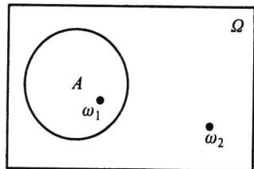

（3）事件可以用集合表示，也可用明白无误的语言描述.

图1.1.1事件A的维恩图

（4）由样本空间Ω中的单个元素组成的子集称为基本事件.而样本空间的最大子集（即Ω本身）称为必然事件.样本空间Ω的最小子集（即空集）称为不可能事件. $\varnothing )$

例1.1.3掷一颗骰子的样本空间为 $\Omega = \left\{ 1 , 2 , \cdots , 6 \right\}$

事件 $A = ^ { \ast }$ 出现1点”，它由Ω的单个样本点“1"组成.

事件 $B = { } ^ { * }$ 出现偶数点”，它由Ω的三个样本点 $^ { * } 2 , 4 , 6 "$ 组成.

事件 $C = ^ { 6 6 }$ 出现的点数小于 $7 "$ ,它由Ω的全部样本点 $^ { \ast } 1 , 2 , 3 , 4 , 5 , 6 ^ { \prime \prime }$ 组成，即必然事件

事件 $D = ^ { * }$ 出现的点数大于 $\boldsymbol { 6 } ^ { \prime \prime } , \boldsymbol { \mathcal { \Omega } }$ 中任一样本点都不在D中，所以D是空集，即不可能事件.

## 1.1.4随机变量

用来表示随机现象结果的变量称为随机变量，常用大写字母X，Y,Z表示.很多事件都可用随机变量表示，表示时应写明随机变量的含义.而随机变量的含义是人们按需要设置出来的.下面通过一些例子来说明是如何进行设置的.

例1.1.4很多随机现象的结果本身就是数，把这些数看作某特设变量的取值就可获得随机变量.如掷一颗骰子，可能出现1,2,3,4,5,6诸点.若设置X=“掷一颗骰子 $X = ^ { 6 }$ 出现的点数”，则1,2,3,4,5,6就是随机变量X的可能取值，这时

·事件“出现3点”可用 ${ } ^ { * } X = 3 { } ^ { * }$ 表示.

·事件“出现点数超过3点”可用 $\ " { \cal X } > 3 \ "$ 表示.

$" X \leqslant 6 "$ 是必然事件.

$" X = 7 "$ 是不可能事件.

在这个随机现象中，若再设Y=“掷一颗骰子6点出现的次数”，则Y是仅取0或1 $Y = ^ { \ast }$ 两个值的随机变量，这是与X不同的另一个随机变量.这时

${ } ^ { \ast } Y = 0 { } ^ { \prime }$ 表示事件“没有出现6点”.

$" Y = 1 "$ 表示事件“出现6点”.

$" Y \leqslant 1 "$ 是必然事件.

$" Y \geqslant 2 "$ 是不可能事件.

上述讨论表明：在同一个随机现象中，不同的设置可获得不同的随机变量，如何设置可按需要进行.

例1.1.5有些随机现象的结果虽然不是数，但仍可根据需要设计出有意义的随机变量.如检验一件产品的可能结果有两个：合格品与不合格品.若我们把注意点放在不合格品上，则设置X=“检查一件产品所得的不合格品数”，X是仅取0与1的随机变 $X = ^ { * }$ 量，且 ${ } ^ { 6 } X = 0 ^ { \prime \prime }$ 表示事件“出现合格品”； $^ { * } X = 1 ^ { * }$ 表示事件“出现不合格品”.

若检查10件产品,其中不合格品数Y是一个随机变量，它仅可能取0,1,2,，,10等11个值，且

·事件“不合格品数不多于1件”可用“ $Y { \leqslant } 1 ^ { \prime \prime }$ 表示.

$\mathbf { \partial } ^ { : 6 } Y = 0 \mathbf { \partial } ^ { \prime }$ 表示事件“全是合格品”.

${ } ^ { \circ } Y = 1 0 ^ { \circ }$ 表示事件“全是不合格品”.

$Y { < } 0 ^ { " }$ 是不可能事件.

6 $Y \leqslant 1 0 ^ { \prime \prime }$ 是必然事件Ω.

由此可见，随机变量是人们根据研究和需要设置出来的，若把它用等号或不等号与某些实数联结起来就可以表示很多事件.这种表示方法形式简洁、含义明确、使用方便.今后遇到的大量事件都将用随机变量表示，这里关键在于随机变量的设置要事先说明.

## 1.1.5事件间的关系

下面的讨论总是假设在同一个样本空间Ω（即同一个随机现象）中进行.事件间的关系与集合间的关系一样，主要有以下几种：

## 一、包含关系

如果属于A的样本点必属于B,则称A被包含在B中（见图1.1.2），或称B包含A，记为 $A \subset B$ ，或 $B \supset A .$ 用概率论的语言说：事件A发生必然导致事件B发生.

譬如掷一颗骰子,事件 $A = ^ { \ast }$ 出现4点”的发生必然导致事件 $B = { } ^ { 6 6 }$ 出现偶数点”的发生，故 $A \subset B$

又如电视机的寿命T超过10000h（记为事件 $A = \left\{ \begin{array} { r l r } \end{array} \right.$ )和T超过20000h（记为事件 $B = \left\{ \begin{array} { c c c } { T > 2 0 } & { 0 0 0 } \end{array} \right\} \mathrm { ) }$ ，则 $A \supset B$ ，见图1.1.3.

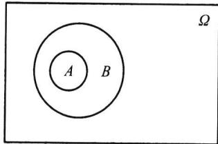  
图1.1.2 ACB

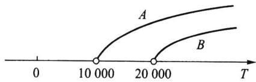  
图1.1.3 $\{ \ T > 1 0 \ 0 0 0 \} \supset \{ \ T > 2 0 \ 0 0 0 \}$

对任一事件A,必有 $\varnothing \subset A \subset \varOmega .$

## 二、相等关系

如果事件A与事件B满足：属于A的样本点必属于B，而且属于B的样本点必属于A，即 $A \subset B$ 且 $B \subset A$ ,则称事件A与B相等，记为 $A = B ,$

从集合论观点看，两个事件相等就意味着这两事件是同一个集合.下例说明：有时不同语言描述的事件也可能是同一事件.

例1.1.6掷两颗骰子，以A记事件“两颗骰子的点数之和为奇数”，以B记事件“两颗骰子的点数为一奇一偶”.很容易证明：A发生必然导致B发生，而且B发生也必然导致A发生，所以 $A = B$

例1.1.7口袋中有a个黑球，b个白球(a与b都大于零），从中不返回地一个一个摸球，直到摸完为止.以A记事件“最后摸出的几个球全是黑球”，以B记事件“最后摸出的一个球是黑球”.对于此题粗看好像是 $A \neq B$ ，但只要设想将球全部摸完为止，则明显有：A发生必然会导致B发生，即 $A \subset B$ ；反之注意到事件A中所述的“几个”最少是1个，也可以是2个，，最多为a个，则B发生时A也必然会发生（对于这点请读者仔细体会），即 $B \subset A$ ,由此得 $A = B$

## 三、互不相容

如果A与B没有相同的样本点（见图1.1.4），则称A与B互不相容.用概率论的语

言说：A与B互不相容就是事件A与事件B不可能同时发生.

如在电视机寿命试验中，“寿命小于1万小时”与“寿命大于5万小时”是两个互不相容的事件，因为它们不可能同时发生.

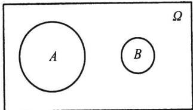  
图1.1.4A与B互不相容

## 1.1.6事件间的运算

事件的运算与集合的运算相当，有并、交、差和余四种运算.

## 一、事件A与B的并

记为AUB.其含义为"由事件A与B中所有的样本点(相同的只计人一次)组成的新事件"（见图1.1.5).或用概率论的语言说“事件A与B中至少有一个发生”.

如在掷一颗骰子的试验中，记事件 $A = { } ^ { \circ }$ 出现奇数点 $" = \left\{ \ 1 , 3 , 5 \right\}$ ，记事件$B = { } ^ { * }$ 出现的点数不超过 $3 ^ { \prime \prime } = \left\{ \ 1 , 2 , 3 \right\}$ ，则A与B的并为 $A \cup B = \{ 1 , 2 , 3 , 5 \}$

## 二、事件A与B的交

记为AnB,或简记为AB.其含义为"由事件A与B中公共的样本点组成的新事件”（见图1.1.6).或用概率论的语言说“事件A与B同时发生”.

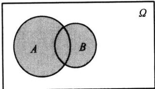  
图1.1.5A与B的并

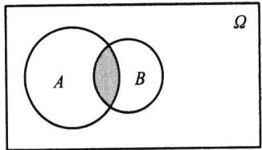  
图1.1.6A与B的交

如在掷一颗骰子的试验中，记事件 $A = { } ^ { \ast }$ 出现奇数点 $\ " = \{ 1 , 3 , 5 \}$ ，记事件 $B = { } ^ { * }$ 出现的点数不超过 $3 ^ { \prime \prime } = \{ 1 , 2 , 3 \}$ ，则A与B的交为 $A B = \{ 1 , 3 \}$

若事件A与B互不相容，则其交必为不可能事件，即 $A B = \emptyset$ ，反之亦然.这表明：$A B = \emptyset$ 就意味着A与B是互不相容事件.

事件的并与交运算可推广到有限个或可列个事件，譬如有事件 $A _ { 1 } , A _ { 2 } , \cdots$ ，则 $\bigcup _ { i = 1 } ^ { n } A _ { i }$ 称为有限并， $\bigcup _ { i = 1 } ^ { \infty } A _ { i }$ 称为可列并， $\bigcap _ { i = 1 } ^ { n } A _ { i }$ 称为有限交， $\bigcap _ { i = 1 } ^ { \infty } A _ { i }$ 称为可列交.

## 三、事件A对B的差

记为A-B.其含义为“由在事件A中而不在B中的样本点组成的新事件”（见图1.1.7).或用概率论的语言说“事件A发生而B不发生”.

如在掷一颗骰子的试验中，记事件 $A = ^ { * }$ 出现奇数点 $\ " = \{ 1 , 3 , 5 \}$ ，记事件 $B = { } ^ { 6 6 }$ 出现的点数不超过 $3 ^ { \prime \prime } = \left\{ 1 , 2 , 3 \right\}$ ，则A对B的差为 $A - B = \{ 5 \}$

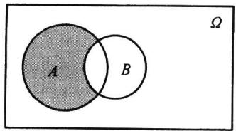  
(a)A-B

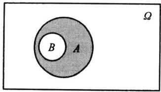  
图1.1.7  
(b)A-B(AUB)

若设X为随机变量，则有

$$
\left\{ X = a \right\} = \left\{ X \leqslant a \right\} - \left\{ X < a \right\} , \quad \left\{ a < X \leqslant b \right\} = \left\{ X \leqslant b \right\} - \left\{ X \leqslant a \right\} .
$$

## 四、对立事件

事件A的对立事件，记为A，即“由在Ω中而不在A中的样本点组成的新事件”（见 $\overline { { A } }$ 图1.1.8),或用概率论的语言说“A不发生”,即 ${ \overline { { A } } } = { \mathcal { Q } } - A .$ 注意,对立事件是相互的，即A的对立事件是A,而A的对立事件是A，即A=A.必然事件Ω与不可能事件互为对立 $\overset { - } { A }$ $\overset { - } { A }$ $\overline { { \overline { { A } } } } = A$ 事件，即 $\overline { { \Omega } } = \infty , \overline { { \emptyset } } = \Omega .$

如在掷一颗骰子的试验中，事件 $A = ^ { * }$ 出现奇数点 $^ { \mathbf { \theta } } \mathbf { \Sigma } ^ { \mathbf { \theta } } =$ {1,3,5}的对立事件是 $\stackrel { \cdot } { A } = \left\{ 2 , 4 , 6 \right\}$ ，事件 $B = { } ^ { 6 6 }$ 出现的点数不超过 $3 ^ { \prime \prime } = \{ 1 , 2 , 3 \}$ 的对立事件是 $\overline { { B } } = \{ 4 , 5 , 6 \}$

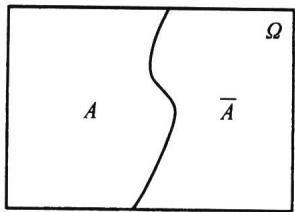

A与B互为对立事件的充要条件是； $\ A \cap B = \varnothing$ ，且 $A \cup$ $B = { \mathfrak { N } } .$

图1.1.8A的对立事件A

此性质也可作为对立事件的另一种定义，即如果事件

A与B满足 $: A \cap B = \emptyset$ ，且 $A \cup B = \varOmega$ ,则称A与B互为对立事件,记为 $\stackrel { - } { A } = B , \stackrel { - } { B } = A$

需要注意的是：

（1）对立事件一定是互不相容的事件，即 $A \cap { \overline { { A } } } = \emptyset$ .但互不相容的事件不一定是对立事件.

（2）A-B可以记为 $A \ { \overline { { B } } } .$

例1.1.8从数字1,2，,9中可重复地任取n次 $\left( \begin{array} { l l l } { n \geqslant 2 } \right) \end{array}$ ，以A表示事件“所取的n个数字的乘积能被10整除”.因为乘积能被10整除必须既取到数字5，又要取到偶数，所以A的对立事件A为“所取的n个数字中或者没有5，或者没有偶 $\overset { - } { A }$ 数”.如果记 $B = { } ^ { 6 6 }$ 所取的n个数字中没有 $5 " , C = "$ 所取的n个数字中没有偶数”，则 ${ \overline { { A } } } = B \cup C$

例1.1.9设A,B,C是某个随机现象的三个事件,则

（1）事件 $^ { * } A$ 与B发生,C不发生"可表示为： $A B \stackrel { \_ } { C } = A B - C .$

（2）事件“A,B,C中至少有一个发生”可表示为： $A \cup B \cup C$

（3）事件“A,B,C中至少有两个发生"可表示为： $A B \cup A C \cup B C .$

（4）事件“A,B,C中恰好有两个发生”可表示为： $A B \ { \overline { { C } } } \cup A \ { \overline { { B } } } C \cup { \overline { { A } } } B C .$

（5）事件“A,B,C同时发生”可表示为 $: A B C .$

（6）事件“A,B,C都不发生"可表示为 $: { \overline { { A } } } { \overline { { B } } } { \overline { { C } } } .$

（7）事件“A,B,C不全发生"可表示为 ${ \overline { { A } } } \cup { \overline { { B } } } \cup { \overline { { C } } } .$

## 五、事件的运算性质

1.交换律

$$
A \ \cup \ B = B \ \cup \ A , \quad A B = B A .\tag{1.1.1}
$$

2.结合律

$$
( A \cup B ) \cup C = A \cup ( B \cup C ) ,\tag{1.1.2}
$$

$$
\left( A B \right) C = A \left( B C \right) .\tag{1.1.3}
$$

3.分配律

$$
( A \cup B ) \cap C = A C \cup B C ,
$$

此性质也可推广到多项

(1.1.4)

$$
( A \cap B ) \cup C = ( A \cup C ) \cap ( B \cup C ) .\tag{1.1.5}
$$

$$
A \cap \bigcup _ { k = 1 } ^ { \infty } B _ { k } = \bigcup _ { k = 1 } ^ { \infty } ( A \cap B _ { k } ) .
$$

4.对偶律（德摩根公式）

$$
\overline { { A \cup B } } = \overline { { A } } \cap \overline { { B } } ,\tag{1.1.6}
$$

$$
\overline { { A \cap B } } = \overline { { A } } \cup \overline { { B } } .\tag{1.1.7}
$$

事件运算的对偶律是很有用的公式.这些性质是不难证明的，在此我们用集合论的语言证明其中的（1.1.6)式.

(1.1.6)式的证明

设 $\omega \in A \cup B$ ,即 $\omega \not \in A \cup B$ ，这表明@既不属于A，也不属于B，这意味着 $\omega \not \in A$ 和$\omega \not \in B$ 同时成立，所以 $\omega \in { \overline { { A } } }$ 与 $\omega \in B$ 同时成立，于是有 $\omega \in \overline { { A } } \cap \overline { { B } }$ ，这说明

$$
{ \overline { { A \cup B } } } \subset { \overline { { A } } } \cap { \overline { { B } } } .
$$

反之，设 $\omega \in \overline { { A } } \cap \overline { { B } }$ ,即同时有 $\omega \in { \overline { { A } } }$ 和 $\omega \in \overline { { B } }$ ，从而同时有 $\omega \not \in A$ 和 $\omega \not \in B$ ，这意味着$\pmb { \omega }$ 不属于A与B中的任一个，即 $\omega \not \in A \cup B$ ，也就是有 $\omega \in { \overline { { A \cup B } } }$ ，这说明

$$
{ \overline { { A \cup B } } } \supset { \overline { { A } } } \cap { \overline { { B } } } .
$$

综合上述两方面，可得

$$
{ \overline { { A \cup B } } } = { \overline { { A } } } \cap { \overline { { B } } } .
$$

(1.1.6)式得证.

德摩根公式可推广到多个事件及可列个事件场合：

$$
\begin{array} { r } { \overline { { \bigcup _ { i = 1 } ^ { n } A _ { i } } } = \bigcap _ { i = 1 } ^ { n } \overline { { A } } _ { i } , \qquad \overline { { \bigcup _ { i = 1 } ^ { \infty } A _ { i } } } = \bigcap _ { i = 1 } ^ { \infty } \overline { { A } } _ { i } , } \end{array}\tag{1.1.8}
$$

$$
\bigcap _ { i = 1 } ^ { n } A _ { i } = \bigcup _ { i = 1 } ^ { n } \overline { { A } } _ { i } , \qquad \bigcap _ { i = 1 } ^ { \infty } A _ { i } = \bigcup _ { i = 1 } ^ { \infty } \overline { { A } } _ { i } .\tag{1.1.9}
$$

## 1.1.7事件域

在此我们要给出的“事件域”概念，目的是为下一节定义事件的概率作准备.

所谓的“事件域”从直观上讲就是一个样本空间中某些子集及其运算（并、交、差、对立）结果而组成的集合类，以后记事件域为这里“某些子集”可以是全体子集，也 $\mathcal { F }$ 可以是部分子集.这要看样本空间的性质而定.

对离散样本空间，用其所有子集的全体就可构成所需的事件域.而对连续样本空间，构造事件域就不那么简单.如当样本空间是实数轴上的一个区间时，可以人为地构造出无法测量其长度的子集，这样的子集常被称为不可测（不可度量)集.如果将这些不可测集也看成是事件，那么这些事件将无概率可言，这是我们不希望出现的现象，为了避免这种现象出现，我们没有必要将连续样本空间的所有子集都看成是事件，只需将我们可“度量”的子集（又称可测集)看成是事件即可.

现在的问题是：我们应该对哪些子集感兴趣，或换句话说，9中应该有哪些元素？ $\mathcal { F }$ 首先 $\mathcal { F }$ 应该包括Ω和 $\emptyset$ ，其次应该保证事件经过前面所定义的各种运算（并、交、差、对立）后仍然是事件，特别，对可列并和可列交运算也有封闭性，总之，要对集合的运 $\mathcal { F }$ 算都有封闭性.经过研究人们发现

·交的运算可通过并与对立来实现(德摩根公式）.

·差的运算可通过对立与交来实现 $( A - B = A \ { \overline { { B } } } )$

这样一来,并与对立是最基本的运算,于是可给出事件域的定义如下.

定义1.1.1设Ω为一样本空间，为Ω的某些子集所组成的集合类.如果 $\mathcal { F }$ $\mathcal { F }$ 满足：

(1) $\varOmega \in \mathcal { F } ;$

(2）若 $A \in { \mathcal { F } } ,$ 则对立事件 $\overset { - } { A } \in \mathcal { F } ;$

（3）若 $A _ { n } \in { \mathcal { F } } , n = 1 , 2 , \cdots$ ，则可列并 $\bigcup _ { n = 1 } ^ { \infty } A _ { n } \in { \mathcal { F } } ,$ 则称.9为一个事件域，又称为 $\sigma$ 域或 $\sigma$ 代数.

在概率论中，又称 $( \Omega , { \mathcal { F } } )$ 为可测空间,在可测空间上才可定义概率.这时 $\mathcal { F }$ 中都是有概率可言的事件.

例1.1.10常见的事件域

（1）若样本空间只含两个样本点 $\varOmega = \left. \omega _ { 1 } , \omega _ { 2 } \right.$ ，记 $A = \left\{ \omega _ { 1 } \right\} , \overline { { A } } = \left\{ \omega _ { 2 } \right\}$ ,则其事件域为 $\mathcal { F } = \{  \emptyset , A , \overline { { A } } \mathrm { , } \varOmega \}$

（2）若样本空间含有n个样本点 $\varOmega = \left\{ \omega _ { 1 } , \omega _ { 2 } , \cdots , \omega _ { n } \right\}$ ,则其事件域 $\mathcal { F }$ 是由空集 $\emptyset$ n个单元素集、个双元素集、个三元素集和Ω组成的集合类，这时中共有 $\binom { n } { 2 }$ $\binom { n } { 3 }$ $\mathcal { F }$ ${ \binom { n } { 0 } } + { \binom { n } { 1 } } + { \binom { n } { 2 } } + \cdots + { \binom { n } { n } } = 2 ^ { n }$ 个事件.

（3）若样本空间含有可列个样本点 $\varOmega = \left\{ \omega _ { 1 } , \omega _ { 2 } , \cdots , \omega _ { n } , \cdots \right\}$ ,则其事件域 $\mathcal { F }$ 是由空 集、可列个单元素集、可列个双元素集…可列个n元素集和组成的集合类， $\emptyset$ $\varOmega$ 这时由可列个的可列个（仍为可列个)元素(事件)组成. $\mathcal { F }$

（4）若样本空间含有全体实数 $\varOmega = ( - \infty , \infty ) = \mathbf { R }$ 这时事件域 $\mathcal { F }$ 中的元素无法一一列出，而是由一个基本集合类逐步扩展形成，具体操作如下：

·取基本集合类 $\mathcal { P } { = } ^ { { \bullet } }$ 全体半直线组成的类”,即

$$
{ \mathcal P } = \{ \{ \textbf { ( - \infty , x ) } | - \infty < x < \infty \} \} .
$$

·利用事件域的要求，首先把有限的左闭右开区间扩展进来

$[ \ a , b ) = ( \ - \ \infty \ , b ) \ - ( \ - \ \infty \ , a )$ ，其中a,b为任意实数.

·再把闭区间、单点集、左开右闭区间、开区间扩展进来

$$
\left[ a , b \right] = \bigcap _ { n = 1 } ^ { \infty } \left[ a , b + { \frac { 1 } { n } } \right) ,
$$

$$
\left\{ b \right\} = \left[ a , b \right] - \left[ a , b \right) ,
$$

$$
( a , b ] = \left[ a , b \right] - \left\{ a \right\} ,
$$

$$
\left( a , b \right) = \left[ a , b \right) \ - \ \left\{ a \right\} .
$$

基本运算是余与并（由德摩根公式，交运算可由余与并导出）

·最后用（有限个或可列个）运算和交运算把实数集中一切有限集、可列集、开 集、闭集都扩展进来.

经过上述几步扩展所得之集的全体就是人们希望得到的事件域，因为它满足事 ${ \mathcal { F } } ,$ 件域的定义.这样的事件域又称为博雷尔(Borel)事件域，域中的每个元素(集合）又称为博雷尔集，或称为可测集，这种可测集都是有概率可言的事件.

定义1.1.2（样本空间的分割） 对样本空间Ω,如果有n个事件 $D _ { 1 } , D _ { 2 } , \cdots , D _ { r }$ 满足：

公式

$$
D _ { i } D _ { j } = \varnothing \ ( i \neq j ) , \quad \bigcup _ { i = 1 } ^ { n } D _ { i } = \Omega .
$$

则称 $D _ { 1 } , D _ { 2 } , \cdots , D _ { n }$ 为样本空间Ω的一组分割.也可以是可列个互不相容的事件D $D _ { \iota }$ $D _ { 2 } , \cdots , D _ { n } , \cdots$ 组成2的一个分割.

分割常在概率与统计研究中使用，因为它可以化简被研究的问题（具体可见1.4.3节的全概率公式).譬如，电视机的彩色浓度x是重要的质量指标，它的目标值是m.彩色浓度过大或过小都是不适当的，由于随机性，要在生产中把彩色浓度控制在点m上也是不可能的.因为没有必要对彩色浓度的每个可能出现的值进行考察，所以常把彩色浓度按顾客可接受的情况分为如下几档（其中a为某个常数）：

$$
\begin{array} { l } 
D _ { 1 } = \{ | x - m | \leqslant a \} , \\ 
D _ { 2 } = \{ a < | x - m | \leqslant 2 a \} , \\ 
D _ { 3 } = \{ 2 a < | x - m | \leqslant 3 a \} , \\ 
D _ { 4 } = \{ | x - m | > 3 a \} .
\end{array}
$$

这样就把彩色浓度的样本空间 $\varOmega = \left( \ - \infty \ , \infty \ \right)$ 划分成四个互不相容的事件，产生一个分割 $\mathcal { D } = \{ D _ { 1 } , D _ { 2 } , D _ { 3 } , D _ { 4 } \}$ .这时人们的研究只要限制在由分割 $\mathcal { D } { = } \left\{ D _ { \scriptscriptstyle 1 } , D _ { \scriptscriptstyle 2 } , D _ { \scriptscriptstyle 3 } , D _ { \scriptscriptstyle 4 } \right\}$ 中一切可能的并及空集组成的事件域上，因此该事件域称为由分割 $\mathcal { D } ^ { \vec { \mathbf { \nu } } }$ 生的事件域，记为$\pmb { \sigma } ( \mathcal { D } )$ .该事件域仅含 $2 ^ { 4 } = 1 6$ 个不同的事件，研究就简化了.

一般场合，若分割 $\mathcal { D } { = } \left\{ D _ { 1 } , D _ { 2 } , \cdots , D _ { n } \right\}$ 由n个事件组成，则其产生的事件域 $\sigma ( { \mathcal { D } } )$ 共含有 $\textcircled { 2 ^ { n } }$ 个不同的事件.分割方法常在一些问题的研究中被采用,它可使事件域得以简化 7与离散样本室同构造的事件城于中包含的事新数公式一致

## 习题11

1.写出下列随机试验的样本空间：

（1）抛三枚硬币；

（2）抛三颗骰子；

(3）连续抛一枚硬币，直至出现正面为止；

（4）口袋中有黑、白、红球各一个，先从中任取出一个，放回后再任取出一个；

（5）口袋中有黑、白、红球各一个，先从中任取出一个，不放回后再任取出一个.

2.先抛一枚硬币，若出现正面（记为Z），则再掷一颗骰子，试验停止；若出现反面（记为F），则再抛一次硬币，试验停止.那么该试验的样本空间Ω是什么？

3.设A，B，C为三事件，试表示下列事件：

（1）A,B,C都发生或都不发生；

（2）A,B,C中不多于一个发生；

(3）A,B,C中不多于两个发生；

(4）A，B，C中至少有两个发生.

4.指出下列事件等式成立的条件：

(1) $A \cup B = A ;$

(2) $A B = A ;$

(3) $A - B = A .$

5.设X为随机变量，其样本空间为 $\varOmega = \left. 0 \leqslant X \leqslant 2 \right.$ ，记事件 $A = \left\{ 0 . 5 < X \leqslant 1 \right\} , B = \left\{ 0 . 2 5 \leqslant X < 1 . 5 \right\}$ 写出下列各事件：

(1） ${ \overline { { A } } } B _ { ; }$ (2） ${ \overline { { A } } } \cup B ;$ (3) ${ \overline { { A B } } } _ { ; }$ （4） ${ \overline { { A \cup B } } } .$

6.检查三件产品，只区分每件产品是合格品（记为0）与不合格品（记为1），设X为三件产品中的不合格品数，指出下列事件所含的样本点：

$$
A = ^ { u } X = 1 ^ { \mathfrak { n } } ~ , \quad B = ^ { u } X > 2 ^ { \mathfrak { n } } ~ , \quad C = ^ { u } X = 0 ^ { \mathfrak { n } } ~ , \quad D = ^ { u } X = 4 ^ { \mathfrak { n } } ~ .
$$

7.试问下列命题是否成立？

(1） $A - \left( B - C \right) = \left( A - B \right) - C ;$

（2）若 $A B = \emptyset$ 且 $C \subset A$ ，则 $B C = \emptyset$

(3） $( A \cup B ) - B = A ;$

（4） $( A - B ) \cup B = A .$

8.若事件 $A B C = \emptyset$ ，是否一定有 $A B = \varnothing ?$

9.请叙述下列事件的对立事件：

(1） $A = "$ 掷两枚硬币，皆为正面”；

(2) $B = "$ 射击三次，皆命中目标”；

(3） $C = "$ 加工四个零件，至少有一个合格品".

10.证明下列事件的运算公式：

(1） $A = A B \cup A { \overline { { B } } } ;$

(2) $A \cup B = A \cup { \overline { { A } } } B .$

11.设9为一事件域，若 $A _ { n } \in \mathcal { F } , n = 1 , 2 , \cdots$ ，试证：

(1） $\emptyset \in { \mathcal { F } }$

（2）有限并 $\bigcup _ { i = 1 } A _ { i } \in \mathcal { F } \ , n \geqslant 1 ;$

（3）有限交 $\bigcap _ { i = 1 } A _ { i } \in { \mathcal { F } } ~ , ~ n \geqslant 1$

（4）可列交 $\bigcap _ { i = 1 } A _ { i } \in { \mathcal { F } }$

（5）差运算 $A _ { 1 } - A _ { 2 } \in \mathcal { F }$

## 1.2概率的定义及其确定方法

在这一节中，我们要给出概率的定义及其确定方法，这是概率论中最基本的一个问题.简单而直观的说法就是：概率是随机事件发生的可能性大小.对此我们先看下面一些经验事实：

（1）随机事件的发生是带有偶然性的，但随机事件发生的可能性是有大小之分的，例如口袋中有10个相同大小的球，其中9个黑球，1个红球，从口袋中任取1球，人们的共识是：取出黑球的可能性比取出红球的可能性大.

（2）随机事件发生的可能性是可以设法度量的，就好比一根木棒有长度，一块土地有面积一样.例如抛一枚硬币，出现正面与出现反面的可能性是相同的,各为1/2.足球裁判就用抛硬币的方法让双方队长选择场地，以示机会均等.

（3）在日常生活中，人们对一些随机事件发生的可能性大小往往是用百分比（0到1之间的一个数)进行度量的.例如购买彩票后可能中奖，可能不中奖，但中奖的可能性大小可以用中奖率来度量;抽取一件产品可能为合格品,也可能为不合格品,但产品质量的好坏可以用不合格品率来度量；新生婴儿可能为男孩，也可能为女孩，但生男孩的可能性可以用男婴出生率来度量.这些中奖率、不合格品率、男婴出生率等都是概率的原型.

在概率论发展的历史上，曾有过概率的古典定义、概率的几何定义、概率的频率定义和概率的主观定义.这些定义各适合一类随机现象.那么如何给出适合一切随机现象的概率的最一般的定义呢？1900年数学家希尔伯特（Hilbert,1862—1943)提出要建立概率的公理化定义以解决这个问题，即以最少的几条本质特性出发去刻画概率的概念.1933年苏联数学家柯尔莫戈洛夫（Kolmogorov,1903—1987)首次提出了概率的公理化定义，这个定义既概括了历史上几种概率定义中的共同特性，又避免了各自的局限性和含混之处，不管什么随机现象，只有满足该定义中的三条公理，才能说它是概率.这一公理化体系迅速获得举世公认，是概率论发展史上的一个里程碑.有了这个公理化定义后，概率论得到了迅速发展.

## 1.2.1概率的公理化定义

定义1.2.1设Ω为一个样本空间，为Ω的某些子集组成的一个事件域.如果对任一事件 $A \in { \mathcal { F } } ,$ 定义在上的一个实值函数P(A）满足： $\mathcal { F }$

样本空间事件成包含所有样本点，定义所有可划事件满足公理的事件函教

（1)非负性公理若 $A \in { \mathcal { F } } ,$ 则 $P ( A ) \geq 0$

（2）正则性公理 $P ( \varOmega ) = 1$

1）非负92正了)可到可加

（3）可列可加性公理若 $A _ { 1 } , A _ { 2 } , \cdots , A _ { n } , \cdots \underbrace { \mathbb { 1 } } _ { \bigcup } \mathbb { 1 } _ { \substack { \mathbb { 1 } _ { \mathbf { \lambda } } \mathbb { 1 } _ { \mathbf { \lambda } } \mathbb { 1 } _ { \mathbf { \lambda } } } } \mathbb { 2 }$ ，则

<table><tr><td rowspan=1 colspan=1>测度一般形式</td><td rowspan=1 colspan=1>概率测度（特殊情况)</td></tr><tr><td rowspan=1 colspan=1>集合的σ-代数</td><td rowspan=1 colspan=1>事件域F</td></tr><tr><td rowspan=1 colspan=1>μ(A) ≥ 0</td><td rowspan=1 colspan=1>0≤ P(A)≤1</td></tr><tr><td rowspan=1 colspan=1>μ(@)=0</td><td rowspan=1 colspan=1>P(2)= 0</td></tr><tr><td rowspan=1 colspan=1> $\mu ( \bigcup A _ { i } ) = \sum \mu ( A _ { i } )$ </td><td rowspan=1 colspan=1> $P ( \bigcup _ { i \in \Theta \neq 1 } A _ { i } ) - \sum P ( A _ { i } ) \ ( \Xi \qquad $ </td></tr><tr><td rowspan=1 colspan=1>无（可以是无穷大）</td><td rowspan=1 colspan=1>P(Ω)=1 (总测度为1)</td></tr></table>

$$
P \left( \bigcup _ { i = 1 } ^ { \infty } A _ { i } \right) = \sum _ { i = 1 } ^ { \infty } P ( A _ { i } ) ,\tag{1.2.1}
$$

则称P(A)为事件A的概率，称三元素 $( \Omega , { \mathcal { F } } , P )$ 为概率空间.

概率的公理化定义刻画了概率的本质，概率是集合(事件)的函数，若在事件域 $\mathcal { F }$ 上给出一个函数，当这个函数能满足上述三条公理，就被称为概率；当这个函数不能满足上述三条公理中任一条，就被认为不是概率.

公理化定义没有告诉人们如何去确定概率.历史上在公理化定义出现之前，概率的频率定义否典定义几何定义和主观定义都在一定的场合下，有着各自确定概率的方法，所以在有了概率的公理化定义之后，把它们看作确定概率的方法是恰当的.下面先介绍在确定概率的古典方法中大量使用的排列与组合公式，然后分别讲述确定概率的方法.

## 1.2.2排列与组合公式

排列与组合都是计算“从n个元素中任取r个元素”的取法总数公式，其主要区别在于：如果不讲究取出元素间 $A B / / B E$ 则用组合公式，否则用排列公式.而所谓讲究元素间的次序，可以从实际问题中得以辨别，例如两个人相互握手是不讲次序的；而两个人排队是讲次序的，因为“甲右乙左”与“乙右甲左”是两件事.

排列与组合公式的推导都基于如下两条计数原理：

## 1.乘法原理

如果某件事需经k个步骤才能完成,做第一步有m，种方法，做第二步有m2种方 $m _ { 1 }$ $m _ { 2 }$ 法，…,做第k步有mk种方法，那么完成这件事共有 $m _ { k }$ $m _ { 1 } \times m _ { 2 } \times \cdots \times m _ { k }$ 种方法.

譬如，由甲城到乙城有3条旅游线路，由乙城到丙城有2条旅游线路，那么从甲城 经乙城去丙城共有 $3 \times 2 = 6$ 条旅游线路.

## 2.加法原理

如果某件事可由k类不同途径之- 去完成，在第一类途径中有m，种完成方法，在 $m _ { \parallel }$ 第二类途径中有m种完成方法，…，在第k类途径中有mk种完成方法，那么完成这 $m _ { 2 }$ $m _ { k }$ 件事共有 $m _ { 1 } + m _ { 2 } + \cdots + m _ { k }$ 种方法.

譬如，由甲城到乙城去旅游有三类交通工具：汽车、火车和飞机.而汽车有8个班次，火车有5个班次，飞机有3个班次，那么从甲城到乙城共有 $8 + 5 + 3 = 1 6$ 个班次供旅游者选择.

排列与组合的定义及其计算公式如下.

## 1.排列

$$
P e r m u t a t i o n
$$

从n个不同元素中任取 $r \ ( \ r \leqslant n )$ 个元素排成一列（考虑元素先后出现次序），称此为一个排列,此种排列的总数记为 $\mathbf { P } _ { n } ^ { r } .$ .按乘法原理，取出的第一个元素有n种取法，取出的第二个元素有n-1种取法，,取出的第r个元素有n-r+1种取法,所以有

$$
\mathbf { P } _ { n } ^ { r } = { \overbrace { n \times ( n - 1 ) \ \times \ \cdots \ \times \ ( n - r + 1 ) } ^ { \gamma } } = { \frac { n ! } { ( n - r ) \ ! } } .\tag{1.2.2}
$$

若 $r = n$ ，则称为全排列，记为 $\mathrm { ~ P ~ } _ { n } .$ 显然，全排列 $\mathrm { ~ P ~ } _ { n } = n !$

## 2.重复排列

从n个不同元素中每次取出一个，放回后再取下一个，如此连续取r次所得的排列称为重复排列，此种重复排列数共有 $n ^ { ' }$ 个.注意：这里的r允许大于n.

## 3.组合

从n个不同元素中任取 $r \ ( \ r \leqslant n )$ 个元素并成一组（不考虑元素间的先后次序），称Combination此为一个组合，此种组合的总数记为 $\binom { n } { r }$ ${ \overset { \prime } { \operatorname { C } } } _ { n } ^ { r } .$ 按乘法原理此种组合的总数为$P _ { n } ^ { r } = C _ { n } ^ { r } \cdot \underbrace { P _ { r } ^ { r } } _ { \downarrow } \qquad \binom { n } { r } = \frac { \mathrm { P } _ { n } ^ { r } } { r ! } = \frac { n ( n - 1 ) \cdots ( n - r + 1 ) } { r ! } = \frac { n ! } { r ! ( n - r ) ! } .$ (1.2.3)

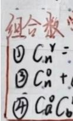

在此规定 $0 ! = 1$ 与 ${ \binom { n } { 0 } } \ = 1$ .组合具有性质：

$$
( \ d u ) = \left( \begin{array} { l } { { n } } \\ { { n - r } } \end{array} \right) \cdot C _ { n } ^ { r } = C _ { n } ^ { n - r } \quad \overrightarrow { x } \ d s C _ { 5 } ^ { 3 } = C _ { 5 } ^ { 2 }
$$

## 4. 重复组合

从n个不同元素中每次取出一个，放回后再取下一个,如此连续取r次所得的组合称为重复组合，此种重复组合总数为 $\binom { n + r - 1 } { r }$ .注意：这里的r也允许大于 $ C _ { n + r - 1 } ^ { r } = C _ { n + r - 1 } ^ { n - 1 } =$

重复组合数的得出可如下考虑:将此n个元素画lOol丨丨 po成n个盒子（用n+1根火柴棒示意，见图1.2.1），如 图1.2.1重复组合示意图果第i个元素取到过一次，则在此盒子中用 $" \bigcirc '$ 作一

记号.图1.2.1所示意味着：第一个元素取到过2次，第2个元素取到过0次，第3个元素取到过1次，，第n个元素取到过3次.因为共取r次，所以共有，个 $" \bigcirc " , n + 1$ 个“|”.如此所有的r个“O”和n+1个“I”中除了两端的那两个“I”不可以动外，共有 $" \bigcirc '$ $n { + 1 }$ $n { + } r { - } 1$ 个 $" \bigcirc '$ 和"I”可随意放置，不同的放置表示不同的取法.因此重复组合数就等于在此 $n { + } r { - } 1$ 个位置上任选个放 $" \bigcirc \ '$ ,或此 $n + r - 1$ 个位置上任选n-1个放“1”，而$\binom { n + r - 1 } { r }$ 和 $\binom { n + r - 1 } { n - 1 }$ 是相等的. “隔板法”

上述四种排列组合及其计算公式,在确定概率的古典方法中经常使用，但在使用中要注意识别是否讲次序、是否重复.

## 1.2.3确定概率的频率方法

确定概率的频率方法是在大量重复试验中，用频率的稳定值去获得概率的一种方法，其基本思想是：

（1）与考察事件A有关的随机现象可大量重复进行.

(2）在n次重复试验中,记n(A)为事件A出现的次数,又称n(A)为事件A的频

数.称

$$
f _ { n } ( A ) = { \frac { n ( A ) } { n } }\tag{1.2.4}
$$

为事件A出现的频率.

（3）人们的长期实践表明：随着试验重复次数n的增加，频率 $f _ { n } ( A )$ 会稳定在某一常数a附近，我们称这个常数为频率的稳定值.这个频率的稳定值就是我们所求的概率.

注意,确定概率的频率方法虽然是很合理的，但此方法的缺点也是很明显的：在现实世界里，人们无法把一个试验无限次地重复下去，因此要精确获得频率的稳定值是困难的.频率方法提供了概率的一个可供想象的具体值，并且在试验重复次数n较大时，可用频率给出概率的一个近似值，这一点是频率方法最有价值的地方.在统计学中就是如此做的，且称频率为概率的估计值.譬如，在足球比赛中，人们很关心罚点球命中的可能性大小.有人曾对1930年至1988年世界各地的53274场重大足球比赛作了统计：在判罚的15382个点球中有11172个命中.由此可得罚点球命中率的估计值为$1 1 ~ 1 7 2 / 1 5 ~ 3 8 2 = 0 . 7 2 6 .$

容易验证：用频率方法确定的概率满足公理化定义，它的非负性与正则性是显然的，而可加性只需注意到：当A与B互不相容时，计算AUB的频数可以分别计算的A的频数和B的频数，然后再相加，这意味着 $n { \bigl ( } A \cup B { \bigr ) } = n { \bigl ( } A { \bigr ) } + n { \bigl ( } B { \bigr ) }$ ，从而有

$$
{ \begin{array} { r l } { f _ { n } ( A \cup B ) = { \frac { n ( A \cup B ) } { n } } = { \frac { n ( A ) \ + \ n ( B ) } { n } } } & { } \\ { \qquad } & { } \\ { \qquad = { \frac { n ( A ) } { n } } + { \frac { n ( B ) } { n } } = f _ { n } ( A ) \ + f _ { n } ( B ) . } \end{array} }
$$

## 例1.2.1说明频率稳定性的例子.

## （1）抛硬币试验（见[3]）

历史上有不少人做过抛硬币试验，其结果见表1.2.1，从表中的数据可以看出：出现正面的频率逐渐稳定在0.5.用频率的方法可以说：出现正面的概率为0.5.

表1.2.1历史上抛硬币试验的若干结果
<table><tr><td>试验者</td><td>抛硬币次数</td><td>出现正面次数</td><td>频率</td></tr><tr><td>德摩根(DeMorgan)</td><td>2048</td><td>1061</td><td>0.5181</td></tr><tr><td>蒲丰（Buffon）</td><td>4040</td><td>2048</td><td>0.506 9</td></tr><tr><td>费勒（Feller）</td><td>10000</td><td>4979</td><td>0.4979</td></tr><tr><td>皮尔逊（Pearson）</td><td>12 000</td><td>6019</td><td>0.501 6</td></tr><tr><td>皮尔逊</td><td>24000</td><td>12 012</td><td>0.5005</td></tr></table>

## （2）英文字母的频率（见[3]）

人们在生活实践中已经认识到：英文中某些字母出现的频率要高于另外一些字母.但26个英文字母各自出现的频率到底是多少？有人对各类典型的英文书刊中字母出现的频率进行统计，发现各个字母的使用频率相当稳定（见表1.2.2).这项研究对计算机键盘的设计（在方便的地方安排使用频率最高的字母键）、信息的编码（用较短的码编排使用频率最高的字母)等方面都是十分有用的.

表1.2.2英文字母的使用频率
<table><tr><td>字母</td><td>使用频率</td><td>字母</td><td>使用频率</td><td>字母</td><td>使用频率</td></tr><tr><td>E</td><td>0.1268</td><td>L</td><td>0.0394</td><td>P</td><td>0.0186</td></tr><tr><td>T</td><td>0.0978</td><td>D</td><td>0.0389</td><td>B</td><td>0.0156</td></tr><tr><td>A</td><td>0.0788</td><td>U</td><td>0.028 0</td><td>V</td><td>0.0102</td></tr><tr><td>0</td><td>0.077 6</td><td>C</td><td>0.0268</td><td>K</td><td>0.0060</td></tr><tr><td>1</td><td>0.0707</td><td>F</td><td>0.0256</td><td>X</td><td>0.0016</td></tr><tr><td>N</td><td>0.0706</td><td>M</td><td>0.0244</td><td>J</td><td>0.0010</td></tr><tr><td>s</td><td>0.0634</td><td>W</td><td>0.0214</td><td>Q</td><td>0.0009</td></tr><tr><td>R</td><td>0.0594</td><td>Y</td><td>0.0202</td><td>Z</td><td>0.000 6</td></tr><tr><td>H</td><td>0.0573</td><td>G</td><td>0.0187</td><td></td><td></td></tr></table>

## （3）女婴出生频率（见[7]）

研究女婴出生频率，对人口统计是很重要的.历史上较早研究这个问题的有拉普拉斯（Laplace,1749—1827），他对伦敦、彼得堡、柏林和全法国的大量人口资料进行研究，发现女婴出生频率总是在21/43左右波动.

统计学家克拉默（Cramer，1893—1985）用瑞典1935年的官方统计资料（见表1.2.3），发现女婴出生频率总是在0.482左右波动.

表1.2.3瑞典1935年各月出生女婴的频率
<table><tr><td>月份</td><td>1</td><td>2</td><td>3</td><td>4</td><td>5 6</td><td></td></tr><tr><td>婴儿数</td><td>7280</td><td>6957</td><td>7883</td><td>7884</td><td>7892 7609</td><td></td></tr><tr><td>女婴数</td><td>3537</td><td>3407</td><td>3866</td><td>3711</td><td>3 775 3665</td><td></td></tr><tr><td>频率</td><td>0.486</td><td>0.490</td><td>0.490</td><td>0.471</td><td>0.478 0.482</td><td></td></tr><tr><td>月份</td><td>7</td><td>8</td><td>9</td><td>10</td><td>11 12</td><td>全年</td></tr><tr><td>婴儿数</td><td>7585</td><td>7393</td><td>7203</td><td>6903</td><td>6552 7132</td><td>88273</td></tr><tr><td>女婴数</td><td>3621</td><td>3596</td><td>3491</td><td>3391</td><td>3160 3371</td><td>42591</td></tr><tr><td>频率</td><td>0.477</td><td>0.486</td><td>0.485</td><td>0.491</td><td>0.482 0.473</td><td>0.482 5</td></tr></table>

## 1.2.4确定概率的古典方法

确定概率的古典方法是概率论历史上最先开始研究的情形.它简单、直观，不需要做大量重复试验，而是在经验事实的基础上，对被考察事件的可能性进行逻辑分析后得出该事件的概率.

古典方法的基本思想如下：

（1）所涉及的随机现象只有有限个样本点，譬如为n个.

（2）每个样本点发生的可能性相等(称为等可能性).例如，抛一枚均匀硬币，“出现正面”与“出现反面”的可能性相等;抛一枚均匀骰子，出现各点(1\~6)的可能性相

等；从一副扑克牌中任取一张，每张牌被取到的可能性相等.

（3）若事件A含有k个样本点，则事件A的概率为

$$
P ( A ) = \frac { k } { n } .\tag{1.2.5}
$$

容易验证，由上式确定的概率满足公理化定义，它的非负性与正则性是显然的.而满足可加性的理由与频率方法类似：当A与B互不相容时，计算AUB的样本点个数可以分别计算A的样本点个数和B的样本点个数，然后再相加，从而有可加性 $P ( A \cup B )$ $= P \left( \boldsymbol { A } \right) + P \left( \boldsymbol { B } \right)$

古典方法是概率论发展初期确定概率的常用方法，故所得的概率又称为古典概率. .在古典方法中，求事件A的概率归结为计算A中含有的样本点的个数和Ω中含有的样本点的总数所以在计算中经常用到排列组合工具.

例1.2.2掷两枚硬币,求出现一个正面一个反面的概率.

解此例的样本空间为 $\varOmega = \left. \left( \mathbb { E } , \mathbb { E } \right) , \left( \mathbb { E } , \mathbb { E } \right) , \left( \mathbb { E } , \mathbb { E } \right) , \left( \mathbb { E } , \mathbb { E } \right) \right.$ .所以Ω中含有样本点的个数为4，事件“出现一个正面一个反面”含有的样本点的个数为2，因此所求概率为1/2.

注意， 如果将此样本空间记成 $\mathcal { \Omega } _ { 1 } = \{ \left( \stackrel { - } { - } \mathbb { E } \right) , \left( \stackrel { - } { - } \sqrt { \Xi } \right) , \left( - \mathbb { E } - \sqrt { \Xi } \right) \}$ ，则此3个样本点不是等可能的. 1

在计算古典概率时，一般不用把样本空间详细写出，但一定要保证样本点为等可能以下是一些较为有用的模型，请读者熟练掌握和灵活运用.

例1.2.3(抽样模型）一批产品共有N件，其中M件是不合格品,N-M件是合格品.从中随机取出n件 $( n \leqslant N )$ ，试求事件 $A _ { _ m } = { } ^ { \ast }$ 取出的n件产品中有m件不合格品”的概率 $( m \leqslant M , n - m \leqslant N - M )$ n-m

解先计算样本空间Ω中样本点的总数：从N件产品中任取n件，因为不讲次序，所以样本点的总数为(.又因为是随机抽取的，所以这(个样本点是等可能的. $\binom { N } { n }$ $\binom { N } { n }$

下面我们先计算事件 $A _ { 0 } , A _ { 1 }$ 的概率，然后再计算 $A _ { { _ m } }$ 的概率.

因为事件 $A _ { 0 } = "$ 取出的n件产品中有0件不合格品”=“取出的n件产品全是合格品”,这意味着取出的n件产品全是从N-M件合格品中抽取,所以有 $\binom { N - M } { n }$ 种取法，故$A _ { 0 }$ 的概率为

$$
P ( A _ { 0 } ) = \frac { \binom { N - M } { n } } { \binom { N } { n } } .
$$

事件A,=“取出的n件产品中有1件不合格品”,要使取出的n件产品中只有1件 $A _ { 1 } = "$ 不合格品，其他n-1件是合格品，那么必须分两步进行：

第一步：从M件不合格品中随机取出1件,共有 $\binom { M } { 1 }$ 种取法.

第二步：从N-M件合格品中随机取出n-1件，共有 $\binom { N - M } { n - 1 }$ 种取法.

所以根据乘法原理， ${ } , A _ { 1 }$ 中共有 $\binom { M } { 1 } \binom { N - M } { n - 1 }$ 个样本点.故A的概率为

$$
P ( A _ { 1 } ) = { \frac { { \binom { M } { 1 } } { \binom { N - M } { n - 1 } } } { \binom { N } { n } } } .
$$

有了以上对A。和A，的分析，我们就容易计算一般事件Am中含有的样本点个数： $A _ { 0 }$ $A _ { 1 }$ $A _ { { _ m } }$ 要使Am发生，必须从M件不合格品中抽m件，再从N-M件合格品中抽n-m件，根据 $A _ { { _ m } }$ $n { - } m$ 乘法原理 $, A _ { { \scriptscriptstyle m } }$ 含有 $\binom { M } { m } \binom { N - M } { n - m }$ 个样本点，由此得 $A _ { { _ m } }$ 的概率为

$$
P \left( A _ { _ m } \right) = \frac { \binom { M } { m } \binom { N - M } { n } } { \binom { N } { n } } , \quad m = 0 , 1 , 2 , \cdots , r , \quad r = \operatorname* { m i n } \left\{ n , M \right\} .\tag{1.2.6}
$$

注意，在此应有 $m \leqslant n , m \leqslant M$ ，所以 $m \leqslant \operatorname* { m i n } \left\{ n , M \right\}$ ，否则其概率为0.

如果取 $N = 9 , M = 3 , n = 4$ ,则有

$$
P \left( A _ { 0 } \right) = { \frac { \binom { 6 } { 4 } } { \binom { 9 } { 4 } } } = { \frac { 1 5 } { 1 2 6 } } = { \frac { 5 } { 4 2 } } ,
$$

$$
P \left( A _ { _ 1 } \right) = \frac { \binom { 6 } { 3 } \binom { 3 } { 1 } } { \binom { 9 } { 4 } } = \frac { 6 0 } { 1 2 6 } = \frac { 2 0 } { 4 2 } ,
$$

$$
P \left( A _ { 2 } \right) = \frac { { \binom { 6 } { 2 } } \binom { 3 } { 2 } } { { \binom { 9 } { 4 } } } = \frac { 4 5 } { 1 2 6 } = \frac { 1 5 } { 4 2 } ,
$$

$$
P \left( A _ { 3 } \right) = { \frac { { \binom { 6 } { 1 } } { \binom { 3 } { 3 } } } { \binom { 9 } { 4 } } } = { \frac { 6 } { 1 2 6 } } = { \frac { 2 } { 4 2 } } .
$$

将以上计算结果列成一个表格（表1.2.4）：

表1.2.4事件 $A _ { { _ m } }$ 的概率
<table><tr><td>m</td><td>0</td><td>1</td><td>2</td><td>3</td></tr><tr><td> $P ( A _ { m } )$ </td><td> $\frac { 5 } { 4 2 }$ </td><td>20-2</td><td>15-2</td><td> $\frac { 2 } { 4 2 }$ </td></tr></table>

由于表中概率之和为1,这意味着m取0,1,2,3等四种情况中必有之一发生.所以可称其为一个概率分布.若把m看作随机变量，则此分布为m的分布

起何分布!!!

从表面上看，概率分布是由一些不相容的事件及其 概率用一个随机变量联系起来而成的一张表，实际上概率分布是全面地（一个不漏）、动态地描述随机变量取值的概率规律，从中可提取更多信息，研究随机现象更深层次的问题.从第二章开始，随机变量及其概率分布将是我们的主要研究对象.

例1.2.4(放回抽样）抽样有两种方式：不放回抽样与放回抽样.上例讨论的是不放回抽样.放回抽样是抽取一件后放回，然后再抽取下一件如此重复直至抽出n件为止.现对例1.2.3在有放回抽样情况下，讨论事件 $B _ { _ m } = { } ^ { * }$ 取出的n件产品中有m件不合格品”的概率.

解同样我们先计算样本空间Ω中样本点的总数：第一次抽取时，可从N件中任取一件，有N种取法.因为是放回抽取，所以第二次抽取时，仍有N种取法如此下去，每一次都有N种取法，一共抽取了n次,所以共有N”个等可能的样 $N ^ { n }$ 本点。 用重复排引公式

事件 $B _ { 0 } = { } ^ { \ast }$ “取出的n件产品全是合格品"发生必须从N-M件合格品中有放回地抽取n次，所以 $B _ { \mathfrak { o } }$ 中含有 $( N { - } M ) ^ { n }$ 个样本点，故 $B _ { \mathfrak { o } }$ 的概率为每一次都是独立有放回抽]

$$
P ( B _ { 0 } ) = \frac { ( \cal { N } - \cal { M } ) ^ { n } } { { \cal { N } } ^ { n } } = \biggl ( 1 - \frac { { \cal { M } } } { { \cal { N } } } \biggr ) ^ { n } .
$$

事件 $B _ { 1 } = "$ 取出的n件产品中恰有1件不合格品发生必须从N-M件合格品中有放回地抽取n-1次，从M件不合格品中抽取1次，这样就有 $M \cdot \left( \Lambda - M \right) ^ { n - 1 }$ 种取法.再考虑到这件不合格品可能在第一次抽取中得到,也可能在第二次抽取中得到…也可能在第n次抽取中得到，总共有种可能所以B，中含有 $B _ { \imath }$ $\boldsymbol { n } \cdot \boldsymbol { M } \cdot \left( \boldsymbol { N } { - } \boldsymbol { M } \right) ^ { n - 1 }$ 个样本点，故 $B _ { \imath }$ 的概率为

$$
P ( B _ { 1 } ) = \frac { \textsf { n } M ( N - M ) ^ { n - 1 } } { N ^ { n } } = n \frac { M } { N } \biggl ( 1 - \frac { M } { N } \biggr ) ^ { n - 1 } \cdot = \stackrel { \gamma } { \mapsto } \sp \zeta \stackrel { C _ { n } ^ { 1 } } { \mapsto } \psi ( 1 - P ) ^ { n - 1 }
$$

事件 $B _ { _ m } = { } ^ { \ast }$ 取出的n件产品中恰有m件不合格品”发生必须从 $N { - } M$ 件合格品中有放回地抽取n-m次，从M件不合格品中有放回地抽取m次，这样就有 $M ^ { \ast } \cdot ( N -$ $M ) ^ { n - m }$ 种取法.再考虑到这m件不合格品可能在n次中的任何m次抽取中得到，总共有$\binom { n } { m }$ 种可能.所以事件 $B _ { { \scriptscriptstyle m } }$ 含有 $\cdot \left( \begin{array} { c } { { n } } \\ { { m } } \end{array} \right) M ^ { n } ( N - M )$ n-"个样本点,故Bm $B _ { { \scriptscriptstyle m } }$ 的概率为

$$
\begin{array} { l } { { P ( B _ { _ n } ) = \left( \displaystyle { n } ^ { n } \right) \displaystyle { \frac { M ^ { n } ( N - M ) ^ { n - m } } { N ^ { n } } } } } \\ { { = \left( \displaystyle { n } ^ { n } \right) \left( \displaystyle { \frac { M } { N } } \right) ^ { _ m } \left( 1 - \displaystyle { \frac { M } { N } } \right) ^ { _ n - m } , \quad m = 0 , 1 , 2 , \cdots , n . } } \end{array}\tag{1.2.7}
$$

由于是放回抽样,不合格品在整批产品中所占比例M/N是不变的，记此比例为p， $p$ 则上式可改写为

$$
P ( B _ { n } ) = \binom { n } { m } p ^ { m } ( 1 - p ) ^ { n - m } , \quad m = 0 , 1 , 2 , \cdots , n . \quad 2 + 7 8 + \textstyle { \widehat { 7 } } + 1 \cdot 1 \cdot
$$

同样取 $N = 9 , M = 3 , n = 4$ ,则有

$$
P ( B _ { 0 } ) = \left( 1 - { \frac { 3 } { 9 } } \right) ^ { 4 } = \left( { \frac { 2 } { 3 } } \right) ^ { 4 } = { \frac { 1 6 } { 8 1 } } ,
$$

$$
P ( B _ { 1 } ) = 4 \cdot \frac { 1 } { 3 } ( \frac { 2 } { 3 } ) ^ { 3 } = \frac { 3 2 } { 8 1 } ,
$$

$$
P ( B _ { 2 } ) = 6 { \left( \frac { 1 } { 3 } \right) } ^ { 2 } { \left( \frac { 2 } { 3 } \right) } ^ { 2 } = \frac { 2 4 } { 8 1 } ,
$$

$$
P ( B _ { 3 } ) = 4 { \left( \frac { 1 } { 3 } \right) } ^ { 3 } \left( \frac { 2 } { 3 } \right) ^ { 1 } = \frac { 8 } { 8 1 } ,
$$

$$
P ( B _ { 4 } ) = \left( \frac { 1 } { 3 } \right) ^ { 4 } = \frac { 1 } { 8 1 } .
$$

将以上计算结果列成一个表格（表1.2.5）：

表1.2.5事件 $B _ { { \scriptscriptstyle m } }$ 的概率
<table><tr><td>m</td><td>0 1</td><td>2</td><td>3</td><td>4</td></tr><tr><td> $P ( B _ { m } )$ </td><td>16 32</td><td>24</td><td>8</td><td> $\frac { 1 } { 8 1 }$ </td></tr><tr><td></td><td>81</td><td>81 81</td><td>81</td><td></td></tr></table>

表中的概率之和为1，它也是一个概率分布.从上表中我们可以看出：

$$
P ( m \leqslant 1 ) = P ( m = 0 ) + P ( m = 1 ) = { \frac { 1 6 } { 8 1 } } + { \frac { 3 2 } { 8 1 } } = { \frac { 1 6 } { 2 7 } } .
$$

例1.2.5(彩票问题）一种福利彩票称为幸运35选7,即购买时从01,02,,35中任选7个号码，开奖时从01,02,,35中不重复地选出7个基本号码和一个特殊号码.中各等奖的规则如下：

表1.2.6幸运35选7的中奖规则
<table><tr><td>中奖级别</td><td>中奖规则</td></tr><tr><td>一等奖</td><td>7个基本号码全中</td></tr><tr><td>二等奖</td><td>中6个基本号码及特殊号码</td></tr><tr><td>三等奖</td><td>中6个基本号码</td></tr><tr><td>四等奖</td><td>中5个基本号码及特殊号码</td></tr><tr><td>五等奖</td><td>中5个基本号码</td></tr><tr><td>六等奖</td><td>中4个基本号码及特殊号码</td></tr><tr><td>七等奖</td><td>中4个基本号码，或中3个基本号码及特殊号码</td></tr></table>

试求各等奖的中奖概率.

解因为不重复地选号码是一种不放回抽样，所以样本空间Ω含有 且无序 $\binom { 3 5 } { 7 }$ 个样本点.要中奖应把抽取看成是在三种类型中抽取：

第一类号码：7个基本号码.

第二类号码：1个特殊号码.

第三类号码：27个无用号码.

注意到例1.2.3中是在两类元素（合格品和不合格品）中抽取，如今在三类号码中抽取，若记 ${ \boldsymbol { p } } _ { i }$ 为中第i等奖的概率 $( i = 1 , 2 , \cdots , 7 )$ ，仿照例1.2.3的方法，可得各等奖的中奖概率如下：

$$
p _ { 1 } = { \frac { { \binom { 7 } { 7 } } \left( { \binom { 1 } { 0 } } \left( { \begin{array} { l } { 2 7 } \\ { 0 } \end{array} } \right) \right) } { { \binom { 3 5 } { 7 } } } } = { \frac { 1 } { 6 \ 7 2 4 \ 5 2 0 } } = 0 . 1 4 9 \times \ 1 0 ^ { - 6 } ,
$$

$$
p _ { 2 } = { \frac { { \binom { 7 } { 6 } } \left( { \begin{array} { c } { 1 } \\ { 1 } \end{array} } \right) { \binom { 2 7 } { 0 } } } { \left( { \begin{array} { c } { 3 5 } \\ { 7 } \end{array} } \right) } } = { \frac { 7 } { 6 \ 7 2 4 \ 5 2 0 } } = 1 . 0 4 \ \times \ 1 0 ^ { - 6 } ,
$$

$$
p _ { 3 } = { \frac { { \binom { 7 } { 6 } } { \binom { 1 } { 0 } } { \binom { 2 7 } { 1 } } } { \binom { 3 5 } { 7 } } } = { \frac { 1 8 9 } { 6 \ 7 2 4 \ 5 2 0 } } = 2 8 . 1 0 6 \times 1 0 ^ { - 6 } ,
$$

$$
p _ { 4 } = { \frac { { \binom { 7 } { 5 } } { \binom { 1 } { 1 } } { \binom { 2 7 } { 1 } } } { { \binom { 3 5 } { 7 } } } } = { \frac { 5 6 7 } { 6 7 2 4 5 2 0 } } = 8 4 . 3 1 8 \times 1 0 ^ { - 6 } ,
$$

$$
p _ { s } = { \frac { { \binom { 7 } { 5 } } { \binom { 1 } { 0 } } { \binom { 2 7 } { 2 } } } { { \binom { 3 5 } { 7 } } } } = { \frac { 7 ~ 3 7 1 } { 6 ~ 7 2 4 ~ 5 2 0 } } = 1 . 0 9 6 ~ \times ~ 1 0 ^ { - 3 } ,
$$

$$
p _ { 6 } = { \frac { { \binom { 7 } { 4 } } { \binom { 1 } { 1 } } { \binom { 2 7 } { 2 } } } { { \binom { 3 5 } { 7 } } } } = { \frac { 1 2 \ 2 8 5 } { 6 \ 7 2 4 \ 5 2 0 } } = 1 . 8 2 7 \times 1 0 ^ { - 3 } ,
$$

$$
p _ { 7 } = { \frac { { \binom { 7 } { 4 } } { \binom { 1 } { 0 } } { \binom { 2 7 } { 3 } } + { \binom { 7 } { 3 } } { \binom { 1 } { 1 } } { \binom { 2 7 } { 3 } } } { \binom { 3 5 } { 7 } } } = { \frac { 2 0 4 \ 7 5 0 } { 6 \ 7 2 4 \ 5 2 0 } } = 3 0 . 4 4 8 \times 1 0 ^ { - 3 } .
$$

若记A为事件“中奖”，则A为事件“不中奖”，且由 ${ \overline { { A } } } .$ $P ( A ) + P ( { \overline { { A } } } ) = P ( \varOmega ) = 1$ 可得

·重复组合：n个一模一样的球，往N个盒子里丢，只数"每个盒子有几个球"的组合类型。

$$
\begin{array} { l } { { P ( \Psi \Psi ) = P ( A ) = p _ { \mathrm { 1 } } + p _ { \mathrm { 2 } } + p _ { \mathrm { 3 } } + p _ { \mathrm { 4 } } + p _ { \mathrm { 5 } } + p _ { \mathrm { 6 } } + p _ { \mathrm { 7 } } } } \\ { { \qquad = \displaystyle \frac { 2 2 5 \ 1 7 0 } { 6 \ 7 2 4 \ 5 2 0 } = 0 . 0 3 3 \ 4 8 5 , } } \end{array}
$$

·本题：n个编号不同的球，每个球独立选盒子，要考虑"1号球放盒1，2号球放盒2"和"2号球放盒1，1号球放盒2"是不同结果。

P(不中奖) $= P ( { \overline { { A } } } ) = 1 - P ( A ) = 0 . 9 6 6 5 1 5 .$

不是相同的球 球不能用重复组合

这就说明：一百个人中约有3人中奖，而中头奖的概率只有 $0 . 1 4 9 \times 1 0 ^ { - 6 }$ ，即两千万个人中约有3人中头奖.因此购买彩票要有平常心，期望值不宜过高.

例1.2.6（盒子模型）设有个球 每个球都等可能地被放到N个不同盒子中的任一个，每个盒子所放球数不限.试录 -个,每个盒子所放球数不限.试录 可为

（1）指定的 $n \ ( n { \leqslant } N )$ 个盒子中各有一球的概率 $p _ { 1 } ; P _ { 1 } = \frac { n ! } { n ! }$

（2）恰好有 $n \ ( n { \leqslant } N )$ 个盒子各有一球的概率 $p _ { 2 } \cdot P _ { 2 } = \frac { c _ { n } ^ { n } \cdot n ! } { N ^ { n } } = \frac { P _ { 2 } ^ { n } } { N ^ { n } }$

解因为每个球都可放到N个盒子中的任一个，所以n个球放的方式共有N”种， $N ^ { n }$ 它们是等可能的.

（1）因为各有一球的n个盒子已经指定，余下的没有球的N-n个盒子也同时被指定，所以只要考虑n个球在这指定的n个盒子中各放1个的放法数.设想第1个球有n种放法，第2个球只有n-1种放法，，第n个球只有1种放法，所以根据乘法原理，其可能总数为n！，于是其概率为

$$
p _ { 1 } = \frac { n ! } { N ^ { n } } .\tag{1.2.8}
$$

（2)与(1)的差别在于：此n个盒子可以在N个盒子中任意选取.此时可分两步做：第一步从N个盒子中任取n个盒子准备放球，共有( $\binom { N } { n }$ 种取法；第二步将n个球放入选中的n个盒子中，每个盒子各放1个球,共有n！种放法.所以根据乘法原理共有

$$
{ \binom { N } { n } } \cdot n !  &  = \mathbf { P } _ { n } ^ { n } = N ( N - 1 ) ( N - 2 ) \cdots ( N - n + 1 )
$$

种放法.其实这个放法数可以更直接地考虑成：第1个球可放在N个盒子中的任一个，第2个球只可放在余下的N-1个盒子中的任一个，，第n个球只可放在余下的N-$n { + 1 }$ 个盒子中的任一个，由乘法原理即可得以上放法数.因此所求概率为

$$
p _ { 2 } = \frac { \mathsf { P } _ { N } ^ { n } } { N ^ { n } } = \frac { N ! } { N ^ { n } ( N - n ) ! } .\tag{1.2.9}
$$

$$
n ^ { k }
$$

表面上看，盒子模型讨论的是球和盒子问题，似乎是一种游戏，但实际上我们可以将这个模型应用到很多实际问题中.譬如将球解释为“粒子”，把盒子解释为相空间中的小“区域”，则这个问题便是统计物理学中的麦克斯威-玻尔兹曼（Maxwell-Boltzmann）统计.若n个“粒子”是不可辨的，便是玻色-爱因斯坦（Bose-Einstein）统计.若n个“粒子”是不可辨的，且每个“盒子”里最多只能放一个“粒子”，这时就是费米一狄拉克 文献[1 $\begin{array}{c} \operatorname { \frac { ( F e r m i - D i r a c ) \# \hat { \mathbb { t } } \dagger . i \mathbb { X } = \mathbb { \hat { t } } \# \frac { \ Z } { 2 \mathbb { t } } } { ] . } } \\ { \mathbb { Z } . } \end{array}$ 计在物理学中有各自的适用范围，详细情况请参看下面我们用盒子模型来讨论概率论历史上颇为有名的“生日问题”.

例1.2.7（生日问题）n个人的生日全不相同的概率pn是多少？

解把n个人看成是n个球，将一年365天看成是 $N = 3 6 5$ 个盒子，则 $\ " { } n$ 个人的生日全不相同”就相当于“恰好有 $n \ ( n { \leqslant } N )$ 个盒子各有一球”，所以n个人的生日全不相同的概率为

$$
\begin{array} { r } { \stackrel { \mathcal { I } } { \displaystyle \mathcal { I } } = \frac { 3 6 5 ! } { 3 6 5 ^ { n } ( 3 6 5 - n ) ! } = \left( 1 - \frac { 1 } { 3 6 5 } \right) \left( 1 - \frac { 2 } { 3 6 5 } \right) \cdots \left( 1 - \frac { n - 1 } { 3 6 5 } \right) . } \end{array}\tag{1.2.10}
$$

上式看似简单，但其具体计算是烦琐的，对此可用以下方法作近似计算：

（1）当 $n \textcircled { \ddag \times 1 }$ 时，（1.2.10)式右边中各因子的第二项之间的乘积 $\frac { i } { 3 6 5 } \times \frac { j } { 3 6 5 }$ 都可以忽略，于是有近似公式 各项相乘，并忽略

$$
p _ { _ n } \approx 1 - { \frac { 1 + 2 + \cdots + ( n - 1 ) } { 3 6 5 } } = 1 - { \frac { n ( n - 1 ) } { 7 3 0 } } .\tag{1.2.11}
$$

较大时用这个似放東事，借气大精皮越低，所以说对较小的X 大

$$
\lim \limits _ { L _ { n }  \infty } \frac { 1 + x } { x } = \frac { 1 } { 2 }
$$

（2）当n较大时，因为对较小的正数x，有 $\ln ( 1 - x ) \approx - x$ ，所以由（1.2.10)式得

对数，将乘和奕成和

$$
\ln p _ { n } \approx - { \frac { 1 + 2 + \cdots + ( n - 1 ) } { 3 6 5 } } = - { \frac { n ( n - 1 ) } { 7 3 0 } } .\tag{1.2.12}
$$

例如当n=10时，由（1.2.12)式给出的近似值为0.8840,而精确值为 $\boldsymbol { p } _ { n } =$ $0 . 8 8 3 \ 1 \cdots ; n = 3 0$ 时,近似值为0.3037,精确值为 ${ \cal P } _ { n } \ : = \ : 0 . 2 9 3 \ : 7$

这个数值结果是令人吃惊的，因为许多人会认为：一年365天，30个人的生日全不相同的可能性是较大的，至少会大于1/2.甚至有人会认为：100个人的生日全不相同的可能性也是较大的.对一些不同的n值，表1.2.7列出用（1.2.12)近似公式计算出的$\boldsymbol { p } _ { n }$ 值

表1.2.7 $\boldsymbol { p } _ { n }$ 的近似值
<table><tr><td>n</td><td>10</td><td>20</td><td>30</td><td>40</td><td>50</td><td>60</td></tr><tr><td> $\boldsymbol { p } _ { n }$ </td><td>0.8840</td><td>0.594 2</td><td>0.3037</td><td>0.1180</td><td>0.0349</td><td>0.0078</td></tr><tr><td> $1 - p _ { n }$ </td><td>0.1160</td><td>0.4058</td><td>0.6963</td><td>0.8820</td><td>0.9651</td><td>0.9922</td></tr></table>

表中最后一行是对立事件“n个人中至少有两个人生日相同”的概率 $^ { * } n$ $1 - p _ { n } .$ 当 $n =$ 60时， $1 - p _ { n } = 0 . 9 9 2 \textit { 2 }$ 表明在60个人的群体中至少有两个人生日相同的概率超过99%， ，这是出乎人们预料的.而通过进一步的计算我们可以得出：当 $n \geqslant 2 3$ 时，有 $1 - p _ { \mathfrak { n } } >$ 0.5.

## 1.2.5确定概率的几何方法

确定概率的几何方法,其基本思想是：

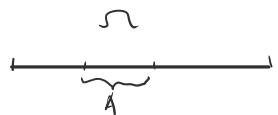

（1）如果一个随机现象的样本空间Ω充满某个区域，其度量（长度、面积或体积等)大小可用 $S _ { \itOmega }$ 表示． 概率 事件

（2）任意一点落在度量相同的子区域内(可能位置不同)是等可能的，譬如在样本空间Ω中有一单位正方形A和直角边为1与2的直角三角形B,而点落在区域A和区域B是等可能的，因为这两个区域面积相等(见图1.2.1).

（3）若事件A为Ω中的某个子区域（见图1.2.2）,且其度量大小可用S表示，则 $S _ { \ / s }$ 事件A的概率为

$$
P ( A ) = { \frac { S _ { A } } { S _ { \it \Omega } } } .\tag{1.2.13}
$$

这个概率称为 $\mathfrak { n }$ 何概率,它满足概率的公理化定义.

求几何概率的关键是对样本空间Ω和所求事件A用图形描述清楚（一般用平面或空间图形).然后计算出相关图形的度量(一般为面积或体积）.

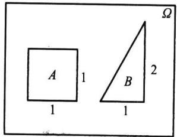  
图1.2.1 落在度量相同的  
子区域内的等可能性

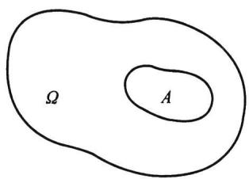  
图1.2.2几何概率

例1.2.8(会面问题）甲乙两人约定在下午6时到7时之间在某处会面，并约定先到者应等候另一个人20min,过时即可离去.求两人能会面的概率.

解以x和y分别表示甲、乙两人到达约会地点的时间（以min为单位），在平面上建立 $_ { x } O y$ 直角坐标系（见图1.2.3). >区域

因为甲、乙都是在0至60min内等可能地到达，所以由等可能性知这是一个几何概率问题. $( x , y )$ 的所有可能取值在边长为60的正方形区域内，其面积为 $S _ { \itOmega } = 6 0 ^ { 2 }$ .而事件 $A = ^ { \ast }$ 两人能够会面”相当于

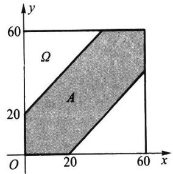

$$
| \ x - y \ | \ \leqslant 2 0 ,
$$

图1.2.3会面问题中的Ω与A

即图中的阴影部分，其面积为 $S _ { _ A } = 6 0 ^ { 2 } - 4 0 ^ { 2 }$ ，由（1.2.13）式知

$$
P ( A ) = { \frac { S _ { A } } { S _ { \itOmega } } } = { \frac { 6 0 ^ { 2 } \ - \ 4 0 ^ { 2 } } { 6 0 ^ { 2 } } } = { \frac { 5 } { 9 } } = 0 . 5 5 5 \ 6 .
$$

结果表明：按此规则约会，两人能会面的概率不超过0.6.若把约定时间改为在下午6时到6时30分，其他不变，则两人能会面的概率提高到0.8889.

例1.2.9(比丰投针问题(见[1])）平面上画有间隔为 $\textit { d } \left( \boldsymbol { d } > 0 \right)$ 的等距平行线，向平面任意投掷一枚长为 $l \ ( l { < } d )$ 的针，求针与任一平行线相交的概率.

解以x表示针的中点与最近一条平行线的距离，又以表示针与此直线间的夹角，见图1.2.4.易知样本空间Ω满足

$$
0 \leqslant x \leqslant d / 2 , \quad 0 \leqslant \varphi \leqslant \pi ,
$$

由这两式可以确定φOx平面上的一个矩形Ω,这就是样本空间，其面积为 $\varphi O x$ $S _ { a } = d \pi / 2$ 这时针与平行线相交(记为事件A)的充要条件是

$$
x \leqslant \frac { l } { 2 } \sin \varphi .
$$

由这个不等式表示的区域是图1.2.5中的阴影部分.

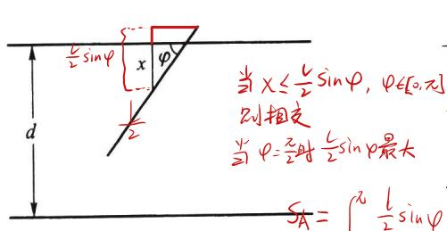

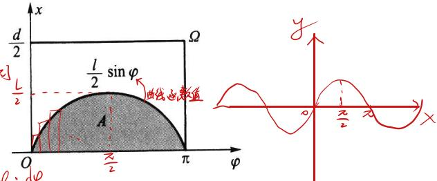

$$
s _ { A } = \int \limits _ { a } ^ { b } \frac { 1 } { 2 } \sin \varphi \cdot \frac { 1 } { 2 4 }
$$

图1.2.4比丰投针问题

$$
= \frac { 1 } { 2 } \cdot - \cos \varphi 1 \frac { \sqrt { \frac { 8 } { 2 } } } { 2 } = 1 . 2 . 5
$$

由于针是向平面任意投掷的，所以由等可能性知这是一个几何概率问题.由此得

$$
P ( A ) = { \cfrac { S _ { A } } { S _ { a } } } = { \cfrac { \displaystyle \int _ { 0 } ^ { \pi } { \cfrac { l } { 2 } } \sin { \varphi } \mathrm { d } \varphi } { \cfrac { d } { 2 } \pi } } = { \cfrac { 2 l } { d \pi } } .
$$

如果l,d为已知，则以π的值代入上式即可计算得P(A)之值.反之，如果已知P(A)的值,则也可以利用上式去求π,而关于P(A)的值,可用从试验中获得的频率去

近似它：即投针N次,其中针与平行线相交n次,则频率 $n / N$ 可作为 $P ( A )$ 的估计值,于是由

$$
{ \frac { n } { N } } \approx P ( A ) = { \frac { 2 l } { d \pi } } ,
$$

可得

$$
\pi \approx { \frac { 2 l N } { d n } } .
$$

历史上有一些学者曾亲自做过这个试验，下表记录了他们的试验结果.

表1.2.8比丰投针试验结果
<table><tr><td>试验者</td><td>年份</td><td> $l / d$ </td><td>投掷次数</td><td>相交次数</td><td>π的近似值</td></tr><tr><td>沃尔夫  $( \mathbb { W } _ { 0 } | \mathbf { f } )$ </td><td>1850</td><td>0.8</td><td>5000</td><td>2532</td><td>3.159 6</td></tr><tr><td>福克斯  $\left( \mathrm { \bf ~ F o x } \right)$ </td><td>1884</td><td>0.75</td><td>1030</td><td>489</td><td>3.159 5</td></tr><tr><td>拉泽里尼（Lazzerini)</td><td>1901</td><td>0.83</td><td>3408</td><td>1808</td><td>3.141 5</td></tr><tr><td>雷娜（Reina）</td><td>1925</td><td>0.54</td><td>2520</td><td>859</td><td>3.179 5</td></tr></table>

这是一个颇为奇妙的方法：只要设计一个随机试验，使一个事件的概率与某个未知数有关，然后通过重复试验，以频率估计概率，即可求得未知数的近似解 一般来说，试验次数越多，则求得的近似解就越精确.随着计算机的出现，人们便可利用计算机来大量重复地模拟所设计的随机试验.这种方法得到了迅速的发展和广泛的应用.人们称这种方法为随机模拟法，也称为蒙特卡罗(Monte Carlo)法.

例1.2.10在长度为a的线段内任取两点将其分为三段,求它们可以构成一个三角形的概率.

解由于是将线段任意分成三段，所以由等可能性知这是一个几何概率问题.分别用$x , y$ 和 $\boldsymbol { a } - \boldsymbol { x } - \boldsymbol { y }$ 表示线段被分成的三段长度(见图1.2.6)，则显然应该有

$$
0 < x < a , \quad 0 < y < a , \quad 0 < a - \left( x + y \right) < a .
$$

第三个式子等价于 $0 < x + y < a .$ 所以样本空间为（见图1.2.7）

$$
\begin{array} { r } { \Omega = \big \{ \big ( x , y \big ) : \quad 0 < x < a , \quad 0 < y < a , \quad 0 < x + y < a \big \} . } \end{array}
$$

Ω的面积为

$$
y = - x + a \frac { 2 } { - r \frac { 1 } { 6 } }
$$

$$
S _ { \itOmega } = { \frac { a ^ { 2 } } { 2 } } .
$$

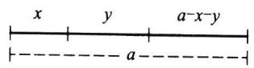  
图1.2.6长度为a的

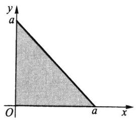  
线段分成三段  
的样本空间

图1.2.7线段分成三段

又根据构成三角形的条件：三角形中任意两边之和大于第三边，得事件A所含样

本点（x，y）必须同时满足

$$
0 ~ < ~ a ~ - ~ ( ~ x ~ + ~ y ~ ) ~ < ~ x ~ + ~ y ~ ,
$$

$$
0 < x < y + ( a - x - y ) ,
$$

$$
0 \leq y < x + ( a - x - y ) .
$$

整理得

$$
\frac { a } { 2 } < x + y < a , \quad 0 < x < \frac { a } { 2 } , \quad 0 < y < \frac { a } { 2 } .
$$

所以事件A可用图1.2.8中的阴影部分表示.

事件A的面积为

$$
S _ { _ A } = { \frac { a ^ { 2 } } { 8 } } .
$$

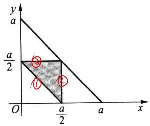  
图1.2.8构成三角形的条件

由此得

$$
P ( A ) = { \frac { 1 } { 4 } } .
$$

例1.2.11(贝特朗奇论(见[1])）在一圆内任取一条弦，问其长度超过该圆内接等边三角形的边长的概率是多少？ 半经尺

R 这是一个几何概率问题，它有三种解法，具体如下：

解法一由于对称性,可只考察某指定方向的弦.作一条直径垂直于这个方向.显然,只有交直径于1/4与3/4之间的弦才能超过正三角形的边长（见图1.2.9(a)），如此，所求概率为1/2.

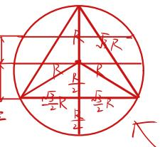

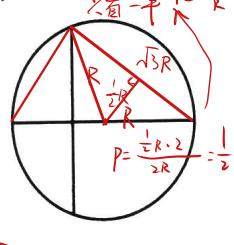

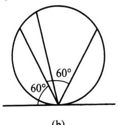

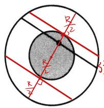

$$
R = \frac { S + B } { S + B } = \frac { \pi ( \frac { R } { 4 } ) ^ { 2 } } { \pi R ^ { 2 } } = \frac { 1 } { 4 }
$$

法中点在小园内即可

图1.2.9贝特朗奇论的三种解法

几中点在直经上

∧点在圆周上

$a _ { 3 }$ 点在大圓内任意位置

①样本点无限(

②每个相同度量柱

解法二由于对称性，可让弦的一端点固定，让另一端点在圆周上作随机移动.若在固定端点作一切线，则与此切线夹角在60 $6 0 ^ { \circ }$ 与120之间的弦才能超过正三角形的边长（见图1.2.9(b)），如此，所求概率为1/3. $p _ { \Delta } = 6 0 ^ { \circ } p = \frac { \Delta } { 1 8 0 ^ { \circ } } = \frac { 1 } { 3 }$

③样本室间不

解法三圆内弦的位置被其中点唯一确定.在圆内作一同心圆，其半径仅为大圆半径的一半，则大圆内弦的中点落在小圆内，此弦长才能超过正三角形的边长（见图1.2.9(c)）,如此，所求概率为1/4.

同一问题有三种不同答案,究其原因在于圆内“取弦”时规定尚不够具体,不同的“等可能性假定”导致了不同的样本空间，具体如下：其中“均匀分布"应理解为“等可能取点” 长度

解法一中假定弦的中点在直径上均匀分布，直径上的点组成样本空间， $\varOmega _ { \iota }$

解法二中假定弦的另一活动端点在圆周上均匀分布，圆周上的点组成样本空

间 $\varOmega _ { 2 }$ 几何概率 (面积)

解法三中假定弦的中点在大圆内均匀分布，大圆内的点组成样本空间 $\varOmega _ { 3 } .$

可见，上述三个答案是针对三个不同样本空间引起的，它们都是正确的，贝特朗奇论引起人们注意，在定义概率时要事先明确指出样本空间是什么

## 1.2.6确定概率的主观方法

$$
\Omega  \mathcal { F }  \mathcal { P }
$$

在现实世界里有一些 随机现象是不能重复的或不能大量重复的，这时有关事件的概率如何确定呢？

统计界的贝叶斯学派认为： 一个事件的概率是人们根据经验对该事件发生的可能性所给出的个人信念.这样给出的概率称为主观概率.

这种利用经验确定随机事件发生可能性大小的例子是很多的，人们也常依据某些主观概率来行事.

例1.2.12用主观方法确定概率的例子.

（1）在气象预报中，往往会说“明天下雨的概率为90%”，这是气象专家根据气象专业知识和最近的气象情况给出的主观概率.听到这一信息的人，大多出门会带伞.

（2）一个企业家根据他多年的经验和当时的一些市场信息，认为“某项新产品在未来市场上畅销”的可能性为80%.

（3）一个外科医生根据自己多年的临床经验和一位患者的病情，认为“此手术成功”的可能性为90%.

（4）一个教师根据自己多年的教学经验和甲、乙两学生的学习情况，认为“甲学生能考取大学”的可能性为95%，“乙学生能考取大学”的可能性为40%.

从以上例子可以看出：

（1）主观概率和主观臆造有着本质上的不同，前者要求当事人对所考察的事件有透彻的了解和丰富的经验，甚至是这一行的专家，并能对历史信息和当时信息进行仔细分析，如此确定的主观概率是可信的.从某种意义上说，不利用这些丰富的经验也是一种浪费.

（2）用主观方法得出的随机事件发生的可能性大小，本质上是对随机事件概率的一种推断和估计.虽然结论的精确性有待实践的检验和修正,但结论的可信性在统计意义上是有其价值的.

（3）在遇到的随机现象无法大量重复时，用主观方法去做决策和判断是适合的.从这点看，主观方法至少是频率方法的一种补充.

另外要说明的是，主观概率的确定除根据自己的经验外，决策者还可以利用别人的经验.例如，对一项有风险的投资，决策者向某位专家咨询的结果为“成功的可能性为60%”.而决策者很熟悉这位专家，认为专家的估计往往是偏保守的、过分谨慎的.为此决策者将结论修改为“成功的可能性为70%”.

主观给定的概率要符合公理化的定义.

## 习题1.2

1.对于组合数 $\cdot \left( \begin{array} { c } { { n } } \\ { { } } \\ { { r } } \end{array} \right)$ ，证明：

（1） $\left( { \begin{array} { l } { n } \\ { r } \end{array} } \right) \ = \left( { \begin{array} { l } { n } \\ { \phantom { - } } \\ { n - r } \end{array} } \right)$

(2) ${ \binom { n } { r } } = { \binom { n - 1 } { r - 1 } } + { \binom { n - 1 } { r } }$

(3) ${ \binom { n } { 0 } } + { \binom { n } { 1 } } + \cdots + { \binom { n } { n } } = 2 ^ { n } ;$

(4） ${ \binom { n } { 1 } } + 2 { \binom { n } { 2 } } + \cdots + n { \binom { n } { n } } = n 2 ^ { n - 1 }$

（5）（）（）（（

(6) ${ \binom { n } { 0 } } ^ { 2 } + { \binom { n } { 1 } } ^ { 2 } + \cdots + { \binom { n } { n } } ^ { 2 } = { \binom { 2 n } { n } }$

2.抛三枚硬币，求至少出现一个正面的概率.

3.任取两个正整数，求它们的和为偶数的概率.

4.掷两颗骰子，求下列事件的概率：

（1）点数之和为6；

（2）点数之和不超过6；

（3）至少有一个6点.

5.考虑一元二次方程 $x ^ { 2 } + B x + C = 0$ ，其中B，C分别是将一颗骰子接连掷两次先后出现的点数，求该方程有实根的概率p和有重根的概率q.

6.从一副52张的扑克牌中任取4张，求下列事件的概率：

（1）全是黑桃；

（2）同花；

（3）没有两张同一花色；

（4）同色.

7.设9件产品中有2件不合格品.从中不返回地任取2件，求取出的2件中全是合格品、仅有一件合格品和没有合格品的概率各为多少？

8.□袋中有7个白球、3个黑球，从中任取两个，求取到的两个球的颜色

（1）相同的概率；

（2）不同的概率.

9.甲□袋有5个白球、3个黑球，乙口袋有4个白球、6个黑球.从两个口袋中各任取一球，求取到的两个球颜色相同的概率.

10.从n个数1,2,,n中任取2个，问其中一个小于k（1<k<n)，另一个大于k的概率是多少？

11.口袋中有10个球，分别标有号码1到10，现从中不返回地任取4个，记下取出球的号码，试求：

（1）最小号码为5的概率；

（2）最大号码为5的概率.

12.掷三颗骰子，求以下事件的概率：

（1）所得的最大点数小于等于5；

（2）所得的最大点数等于5.

13.把10本书任意地放在书架上，求其中指定的4本书放在一起的概率.

14.n个人随机地围一圆桌而坐，求甲、乙两人相邻而坐的概率.

15.同时掷5枚骰子，观察点数，试证明：

（1）P(每枚都不一样)=0.0926； (2）P(-对）=0.4630；  
（3）P(两对）=0.2315； (4）P(三枚一样）=0.1543；  
（5）P(四枚一样）=0.0193； (6）P(五枚一样)=0.0008.

16.一个人把六根草紧握在手中，仅露出它们的头和尾，然后随机地把六个头两两相接，六个尾也两两相接.求放开手后六根草恰巧连成一个环的概率.

17.把n个"0"与n个“1"随机地排列，求没有两个"1"连在一起的概率.

18.设10件产品中有2件不合格品，从中任取4件，设其中不合格品数为X，求X的概率分布.

19.n个男孩，m个女孩 $\left( m \leqslant n + 1 \right)$ 随机地排成一排，试求任意两个女孩都不相邻的概率.

20.将3个球随机地放入4个杯子中去，求杯子中球的最大个数X的概率分布.

21.将12个球随机地放入3个盒子中，试求第一个盒子中有3个球的概率.

22.将n个完全相同的球(这时也称球是不可辨的）随机地放入N个盒子中，试求：

（1）某个指定的盒子中恰好有k个球的概率；

（2）恰好有m个空盒的概率；

（3）某指定的m个盒子中恰好有j个球的概率.

23.在区间(0，1）中随机地取两个数，求事件"两数之和小于 $7 / 5 "$ 的概率.

24.甲乙两艘轮船驶向一个不能同时停泊两艘轮船的码头，它们在一昼夜内到达的时间是等可能的.如果甲船的停泊时间是一小时，乙船的停泊时间是两小时，求它们中任何一艘都不需要等候码头空出的概率是多少？

25.在平面上画有间隔为d的等距平行线，向平面任意投掷一个边长为a，b，c（均小于d)的三角形，求三角形与平行线相交的概率.

26.在半径为R的圆内画平行弦，如果这些弦与垂直于弦的直径的交点在该直径上的位置是等可能的，即交点在直径上一个区间内的可能性与此区间的长度成比例，求任意画弦的长度大于R的概率.

27.设一个质点落在xOy平面上由x轴、y轴及直线x+y=1所围成的三角形内，而落在此三角形内各点处的可能性相等，即落在此三角形内任何区域上的概率与该区域的面积成正比，试求此质点的位置还满足y<2x的概率是多少？

28.设a>0,有任意两数x,y，且 $0 < x < a , 0 < y < a$ ，试求 $x y < a ^ { 2 } / 4$ 的概率.

29.用主观方法确定：大学生中戴眼镜的概率是多少？

30.用主观方法确定：学生中考试作弊的概率是多少？

## 1.3概率的性质

性质

利用概率的公理化定义（非负性、正则性和可列可加性)，可以导出概率的一系列性质.以下我们逐个给出概率的一些常用性质.

首先，在概率的正则性中说明了必然事件5Ω的概率为1.那么可想而知，不可能事根无率为的事件不一定是必然事件，概率为0的事件不一定是不可能事件

件的概率应该为0，下面性质正说明了这一点.

性质1.3.1 $P ( \varnothing ) = 0 .$

证明由于任何事件与不可能事件之并仍是此事件本身，所以

个理所当然的性质却需要如此严格的证明

$$
\Omega = \Omega \cup \bigcup _ { \mathbb { A } \mathbb { B } = \phi } \cup \emptyset \cdots \cup \emptyset \cup \cdots
$$

因为不可能事件与任何事件是不相容的，故由可列可加性公理得

$$
P ( \varOmega ) = P ( \varOmega ) + P ( \emptyset ) + \cdots + P ( \emptyset ) + \cdots ,
$$

从而由 $P ( \varOmega ) = 1$ 得

$$
P ( \emptyset ) + P ( \emptyset ) + \cdots = 0 ,
$$

再由非负性公理,必有

$$
P ( \varnothing ) = 0 .
$$

结论得证.

## 1.3.1概率的可加性

概率的可列可加性说明了对可列个互不相容的事件 $A _ { 1 } , A _ { 2 } , \cdots$ ，其可列并的概率可以分别求之再相加，那么对有限个互不相容的事件 $A _ { 1 } , A _ { 2 } , \cdots , A _ { n }$ ，其有限并的概率是否也可以分别求之再相加呢？下面性质回答了这个问题.

性质1.3.2（有限可加性） 若有限个事件 $A _ { 1 } , A _ { 2 } , \cdots , A _ { n }$ 互不相容，则有

$$
P \left( \bigcup _ { i = 1 } ^ { n } A _ { i } \right) = \sum _ { i = 1 } ^ { n } P ( A _ { i } ) .\tag{1.3.1}
$$

证明对 $A _ { 1 } , A _ { 2 } , \cdots , A _ { n } , \emptyset , \emptyset , \cdots$ 应用可列可加性，得

$$
\begin{array} { r l } & { P ( A _ { 1 } \cup A _ { 2 } \cup \cdots \cup A _ { n } ) = P ( A _ { 1 } \cup A _ { 2 } \cup \cdots \cup A _ { n } \cup \emptyset \cup \emptyset \cup \cdots ) } \\ & { \qquad = P ( A _ { 1 } ) \ + P ( A _ { 2 } ) \ + \cdots + P ( A _ { n } ) \ + \underbrace { P ( \emptyset ) + P ( \emptyset ) } _ { \begin{array} { l } { \displaystyle \downarrow \not \in \emptyset / k \cdot > \cdot } \\ { \displaystyle \downarrow \not \in / k \cdot > \cdot } \end{array} } + \cdots } \end{array}
$$

结论得证.

由有限可加性，我们就可以得到以下求对立事件概率的公式.

性质1.3.3 对任一事件A,有

$$
P ( { \overline { { A } } } ) = 1 - P ( A ) .\tag{1.3.2}
$$

证明因为A与 $\overset { - } { A }$ 互不相容，且 $\Omega { = } A \cup { \overline { { A } } } .$ 所以由概率的正则性和有限可加性得1$= P ( A ) + P ( { \overline { { A } } } )$ .由此得 $P ( A ) = 1 - P ( A ) . \overset { P ( \underset {  } { \Omega } ) = \ P ( A \cup \overline { { A } } ) } { \mid = \ P ( A ) + P ( \overline { { A } } ) }$

有些事件直接考虑较为复杂，而考虑其对立事件则相对比较简单.对此类问题就可以利用性质1.3.3，见下面例子.

例1.3.136只大小、形状相同的灯泡中4只是6W，其余都是4W的.现从中任取3只，求至少取到一只6W灯泡的概率.

解记事件A为“取出的3只中至少有一只 $6 \ W ^ { \prime \prime }$ ，则A包括三种情况：取到一只6W两只4W,或取到两只6W一只4W,或取到三只6W.而A的对立事件A只包括一 $\overbar { \cdot A }$ 种情况，即“取出的3只全部是 $4 \ W ^ { \prime \prime }$ ,由例1.2.3抽样模型可知

$$
P ( { \overline { { A } } } ) = { \frac { \binom { 3 2 } { 3 } } { \binom { 3 6 } { 3 } } } = { \frac { 2 4 8 } { 3 5 7 } } = 0 . 6 9 5 .
$$

所以

$$
P ( A ) = 1 - P ( { \overline { { A } } } ) = { \frac { 1 0 9 } { 3 5 7 } } = 0 . 3 0 5 .
$$

例1.3.2抛一枚硬币5次,求既出现正面又出现反面的概率.

解记事件A为“抛5次硬币中既出现正面又出现反面”，则A的情况较复杂，因为出现正面的次数可以是1次至4次，而A的对立事件A则相对简单：5次全部是正面（记为B），或5次全部是反面（记为C），即 $\stackrel { - } { A } = B \cup C$ ,其中B与C互不相容，所以由对立事件公式和概率的有限可加性得

$$
{ \begin{array} { r l } & { P ( A ) = 1 - P ( { \overline { { A } } } ) = 1 - P ( B \cup C ) = 1 - P ( B ) - P ( C ) } \\ & { \qquad = 1 - { \cfrac { 1 } { 2 ^ { 5 } } } - { \cfrac { 1 } { 2 ^ { 5 } } } = { \cfrac { 1 5 } { 1 6 } } . } \end{array} }
$$

## 1.3.2概率的单调性 差)

可以想象：当B被A包含时（即B发生必然导致A发生）,说明事件A比事件B更容易发生，那么A的概率应该比B的概率大，这可由以下性质1.3.4的推论说明.

性质1.3.4给出了两个有包含关系事件差的概率公式，而性质1.3.5给出了任意两个事件差的概率公式.

性质1.3.4若 $A \supset B$ ,则

$$
P ( A \ - \ B ) = P ( A ) \ - \ P ( B ) .\tag{1.3.3}
$$

证明因为 $A \supset B$ ，所以

$$
A = B \cup \left( A - B \right) ,
$$

且B与A-B互不相容,由有限可加性得

$$
P ( A ) = P ( B ) + P ( A - B ) ,
$$

即得

结论得证.

$$
P ( A - B ) = P ( A ) - P ( B ) = \supset \limits _ { \mathcal { A } } \bigcup _ { \mathcal { A } } \quad + \bigcup _ { \mathcal { X } \in \mathcal { C } } \quad \boxed { \mathcal { A } } \quad \dotsc
$$

推论（单调性） 若 $A \supset B$ ，则 $P ( A ) \geqslant P ( B )$ ：

非性

很容易举例说明：以上推论的逆命题不成立，即由 $P ( A ) \geqslant P ( B )$ 无法推出 $A \supset B .$ 性质1.3.5 对任意两个事件A,B,有

$$
P ( A \mathrm { ~ - ~ } B ) = P ( A ) \mathrm { ~ - ~ } P ( A B ) .\tag{1.3.4}
$$

证明因为 $\overset { A - B } { \mathop { = } } A - A B$ ，且 ${ \underset {  } { A B \subset { \cal A } } }$ ，所以由性质1.3.4得

$$
P ( A \ { } - \ B ) = P ( A \ { } - \ A B ) = P ( A ) \ { } - \ P ( A B ) .
$$

结论得证.

利用性质1.3.4,我们可以求一些较为复杂的事件的概率. $A B = B$

例1.3.3口袋中有编号为1,2,,n的n个球,从中有放回地任取m次,求取出

$$
P = \frac { 1 } { n ^ { m } }
$$

的m个球的最大号码为k的概率.

解记事件A为“取出的m个球的最大号码为k”.如果直接考虑事件Ak,则比较 $A _ { k }$ $k ^ { " }$ $A _ { k }$ 复杂，因为“最大号码为k"可以包括取到1次k、取到2次k、、取到m次k. $k "$

为此我们记事件B为"取出的m个球的最大号码小于等于 $B _ { i }$ $i ^ { \prime \prime } , i { = } 1 , 2 , \cdots , n$ ,则 $B _ { i }$ 发生只需每次从1,2,,i号球中取球即可，所以由古典概率知

$$
P ( B _ { i } ) = { \frac { i ^ { m } } { n ^ { m } } } , \quad i = 1 , 2 , \cdots , n .
$$

又因为 $A _ { k } = B _ { k } - B _ { k - 1 }$ ，且 $B _ { k - 1 } \subset B _ { k }$ ，由性质1.3.4得

$$
{ \begin{array} { r l } { P ( A _ { k } ) = P ( B _ { k } - B _ { k - 1 } ) = P ( B _ { k } ) \ - P ( B _ { k - 1 } ) } & { } \\ { \qquad = { \frac { k ^ { m } \ - \ ( k - 1 ) ^ { m } } { n ^ { m } } } , \quad k = 1 , 2 , \cdots , n . } \end{array} }
$$

譬如， $n = 6 , m = 3 , k = 4$ ，可算得

$$
P ( A _ { 4 } ) = { \frac { 4 ^ { 3 } - 3 ^ { 3 } } { 6 ^ { 3 } } } = { \frac { 3 7 } { 2 1 6 } } = 0 . 1 7 1 3 .
$$

其他的 $P ( A _ { k } )$ 也都可算出，现列表如下：

<table><tr><td>k</td><td>1</td><td>2</td><td>3</td><td>4</td><td>5 6</td><td>和</td></tr><tr><td> $P ( A _ { k } )$ </td><td>0.0046</td><td>0.0324</td><td>0.0880</td><td>0.1713</td><td>0.2824 0.4213</td><td>1.0000</td></tr></table>

这表明：掷三颗骰子，最大点数k是随机变量，k取6的概率是0.4213， 我在!!！$P ( \ k \leqslant 3 ) = 0 . 0 0 4 \ 6 \ + \ 0 . 0 3 2 \ 4 \ + \ 0 . 0 8 8 \ 0 \ = 0 . 1 2 5 \ 0 .$

即掷三颗骰子，最大点数不超过3的概率仅为0.1250.

## 1.3.3概率的加法公式

当事件之间互不相容时，有限可加性或可列可加性给出了求事件并的概率的公式.那么对一般的事件（不一定互不相容），又如何求事件并的概率？以下性质1.3.6中（1.3.5)式给出求任意两个事件并的概率加法公式，（1.3.6)式给出求任意n个事件并的概率加法公式.这些性质在计算概率时是非常有用的.

性质1.3.6（加法公式） 对任意两个事件A,B,有

$$
P ( A \cup B ) = P ( A ) \ + P ( B ) \ - P ( A B ) .\tag{1.3.5}
$$

对任意n个事件 $A _ { 1 } , A _ { 2 } , \cdots , A _ { n }$ ，有

$$
\begin{array} { r l } & { \quad \gamma \overset { \geq } { \underset { i = 1 } { \sum } } \overset { \leq } \underset { i = 1 } { \sum } \underset { \beta \geq 1 } { \sum } \underset { i = 1 } { \sum } \overset { \geq } { \underset { i = 1 } { \sum } } } \\ & { \quad \stackrel { \geq } { \underset { i = 1 } { \sum } } \underset { \beta \geq 1 } { \sum } \underset { i = 1 } { \sum } \gamma ( \underset { i = 1 } { \overset { \wedge } { \bigcup } } A _ { i } ) = \underset { 1 \leq i } { \sum } P ( A _ { i } ) \underset { \underset { i = 1 } { \sum } \underset { j < i } { \sum } \underset { k \in \underset { n } { \sum } } { \overset {  } { \bigcup } } } P ( A _ { i } A _ { j } ) \underset { \underset { i = 1 } { \sum } \underset { j = 1 } { \overset {  } { \operatorname* { \operatorname* { \operatorname* { \box { \box { \box ~ 1 } } } } } } } } { \overset {  } { \underset { i = 1 } { \sum } } } } \\ & { \quad \underset { 1 \leq i } { \sum } \underset { i = 1 } { \sum } \underset { \beta \geq 1 } { \sum } \underset { i = 1 } { \overset {  } { \operatorname* { \boxplus } } } P ( A _ { i } A _ { j } A _ { k } ) \underset { 1 \leq i } { \sum } P ( A _ { 1 } A _ { 2 } \cdots A _ { n } ) . } \end{array}\tag{1.3.6}
$$

应用到柜

证明先证(1.3.5）式.因为

新发

$$
A \cup B = A \cup ( B - A B ) ,
$$

且A与B-AB互不相容，所以由有限可加性和性质1.3.5得

$$
P ( A \cup B ) = P ( A ) \ + \ P ( B - A B ) = P ( A ) \ + \ P ( B ) \ - \ P ( A B ) .
$$

下面用归纳法证明(1.3.6)式.当 $n = 2$ 时，（1.3.6）式即为（1.3.5）式.设（1.3.6）式对n-1成立，则对 $n _ { \mathrm { ~ , ~ } }$ 先对两个事件 $( A _ { 1 } \cup A _ { 2 } \cup \cdots \cup A _ { n - 1 } )$ 与 $A _ { n }$ 用（1.3.5)式，

$$
{ \begin{array} { r l r l r l } { P ( A _ { 1 } \cup A _ { 2 } \cup \cdots \cup A _ { n } ) = P ( A _ { 1 } \cup A _ { 2 } \cup \cdots \cup A _ { n - 1 } ) + P ( A _ { n } ) \ - } \\ & { } & & { \qquad P ( ( A _ { 1 } \cup A _ { 2 } \cup \cdots \cup A _ { n - 1 } ) \ \cap A _ { n } ) } \\ & { } & & { } & & { = P ( A _ { 1 } \cup A _ { 2 } \cup \cdots \cup A _ { n - 1 } ) + P ( A _ { n } ) \ - } \\ & { } & & { } & & { \qquad P ( ( A _ { 1 } A _ { n } ) \cup ( A _ { 2 } A _ { n } ) \cup \cdots \cup ( A _ { n - 1 } A _ { n } ) ) . } \\ & { } & & { } & & { \qquad \underbrace { 1 \not \in \emptyset \land \emptyset \land \emptyset \ \cdots \emptyset \ \cdots \emptyset \ ( A _ { n } \bot _ { n } ) } _ { \not = \emptyset \land \emptyset \land \emptyset } ) . } & & { = } & & { \qquad { \underline { { \mathbb { P } ( { \check { s } } \oplus \{ \check { s } } \oplus \{ \cdots \cup \} } } } } \end{array} 
$$

然后由 归

$$
\begin{array} { r l } & { P ( A _ { 1 } \cup A _ { 2 } \cup \cdots \cup A _ { n - 1 } ) \quad \mathbb { B } \qquad P ( ( A _ { 1 } A _ { n } ) \cup ( A _ { 2 } A _ { n } ) \cup \cdots \cup ( A _ { n - 1 } A _ { n } ) ) \quad \underbrace { \ w \div \atop \leq - \infty } \mathbb { P } ( A _ { n } ) \underbrace { - \sum \tilde { \eta } } _ { s + s + s - \infty } \mathbb { P } ( A _ { n } ) } \end{array}
$$

进行展开,经过整理合并即可知：(1.3.6)式对n也成立,结论得证.

推论（半可加性） 对任意两个事件A,B,有

$$
P ( A \cup B ) \leqslant P ( A ) + P ( B ) .\tag{1.3.7}
$$

对任意𝑛个事件 $A _ { 1 } , A _ { 2 } , \cdots , A _ { n }$ ,有

$$
P \left( \bigcup _ { i = 1 } ^ { n } A _ { i } \right) \leqslant \sum _ { i = 1 } ^ { n } P ( A _ { i } ) .\tag{1.3.8}
$$

例1.3.4已知事件 $A , B , A \cup B$ 的概率分别为0.4,0.3,0.6.求 $P ( A \ { \overline { { B } } } )$

解由加法公式 $P ( A \cup B ) = P ( A ) + P ( B ) - P ( A B )$ 及题设条件知 $P ( A , \bar { B } ) = P ( A - B ) = P ( A ) - P$

$$
0 . 6 = 0 . 4 + 0 . 3 - P ( A B ) ,
$$

$$
P ( A \cup B ) = P ( A ) + P ( B ) - P ( A
$$

由此解得 $P ( A B ) = 0 . 1$ ，所以再由（1.3.4）式得

$$
P ( A { \overline { { B } } } ) = P ( A - B ) = P ( A ) - P ( A B ) = 0 . 4 - 0 . 1 = 0 . 3 .
$$

例1.3.5已知 $P \left( A \right) = P \left( B \right) = P \left( C \right) = 1 / 4 , P \left( A B \right) = 0 , P \left( A C \right) = P \left( B C \right) = 1 / 1 6 .$ 则

A,B,C中至少发生一个的概率是多少？A,B,C都不发生的概率是多少？ $P ( \overline { A } \cup B \cup C ) = P C$

解因为 $P ( A B ) = 0$ ，且 $A B C \subset A B$ ，所以由概率的单调性知 $P ( A B C ) = 0 .$ 再由加法 $> P C \bar { A } \bar { B }$ 公式，得A,B,C中至少发生一个的概率为

$$
\begin{array} { r l r } & { P ( A \cup B \cup C ) = P ( A ) \ + P ( B ) \ + P ( C ) \ - P ( A B ) \ - P ( A C ) \ + P ( A B C ) \ \frac { \rho ^ { \rho } } { \rho } \ \stackrel { \gg } { \underset { \mathrm { W \geq \infty } } { \longrightarrow } } \ \underset { \mathrm { W \geq \infty , \infty } } { \longrightarrow } \ \underset { \mathrm { W \geq \infty , \infty } } { \longrightarrow } \ \underset { \mathrm { W \geq \infty , \infty } } { \longrightarrow } \ \underset { \mathrm { W \geq \infty , \infty } } { \longrightarrow } \ \underset { \mathrm { W \geq \infty , \infty } } { \longrightarrow } \ \underset { \mathrm { W \geq \infty , \infty } } { \longrightarrow } \ \underset { \mathrm { W \geq \infty , \infty } } { \longrightarrow } \ \underset { \mathrm { W \geq \infty , \infty } } { \longrightarrow } \ \underset { \mathrm { W \geq \infty , \infty } } { \longrightarrow } \ \underset { \mathrm { W \geq \infty , \infty } } { \longrightarrow } \ \underset { \mathrm { W \geq \infty , \infty } } { \longrightarrow } \ \underset { \mathrm { W \geq \infty , \infty } } { \longrightarrow } \ \underset { \mathrm { W \geq \infty , \infty } } { \longrightarrow } \ } & \end{array}
$$

又因为 $^ { * } A , B , C$ 都不发生”的对立事件为 ${ } ^ { * } A , B , C$ 中至少发生一个”，所以由对立 $A - B = A - A$ 事件的概率公式得

$$
P ( A , B , C \notin \mathbb { A } \mathbb { B } \mathbb { \cdot } \mathbb { A } \mathbb { \cdot } \mathbb { \frac { 5 } { 8 } } \mathbb { \pmb { \cdot } } ) = 1 - \frac { 5 } { 8 } = \frac { 3 } { 8 } .
$$

般而言求“至少有一个发生"的概率时，用对立事件公式去求较为方便但下面例1.3.6的配对问题却不能用对立事件去求解，而一定要将事件“至少有一个发生”表示成事件的并，然后用一般事件的加法公式去求解.

例1.3.6（配对问题）在一个有n个人参加的晚会上，每个人带了一件礼物，且假定各人带的礼物都不相同.晚会期间各人从放在一起的n件礼物中随机抽取一件，问至少有一个人自己抽到自己礼物的概率是多少？

解以 $A _ { i }$ 记事件“第i个人自己抽到自己的礼物”， $i = 1 , 2 , \cdots , n .$ 所求概率为$P ( A _ { 1 } \cup A _ { 2 } \cup \cdots \cup A _ { n } )$ .因为

$$
P ( A _ { 1 } ) = P ( A _ { 2 } ) = \cdots = P ( A _ { n } ) = \frac { 1 } { n } , \qquad \sum = n \cdot \frac { 1 } { n } = ( n - 1 )
$$

$$
P ( A _ { 1 } A _ { 2 } ) = P ( A _ { 1 } A _ { 3 } ) = \cdots = P ( A _ { n - 1 } A _ { n } ) = \frac { 1 } { n ( n - 1 ) } , \qquad \sum = \binom { 2 } { n } \cdot \frac { 1 } { n ( n - 1 ) } = \frac { 1 } { 2 ! }
$$

$$
P ( A _ { 1 } A _ { 2 } A _ { 3 } ) = P ( A _ { 1 } A _ { 2 } A _ { 4 } ) = \cdots = P ( A _ { n - 2 } A _ { n - 1 } A _ { n } ) = \frac { 1 } { n ( n - 1 ) ( n - 2 ) } , \quad \Sigma = \int _ { n } ^ { 3 } \cdot \frac { 1 } { N ( h + 3 ) ( n - 2 ) }
$$

$$
f ( x ) = f ( x ) + \frac { f ^ { \prime } ( x ) } { 1 ! } ( x - x ) ^ { \prime } + \cdots + \frac { f ^ { ( n ) } ( x - 1 ) } { n ! } ( x - x _ { 0 } ) ^ { n }
$$

$$
P ( A _ { 1 } A _ { 2 } \cdots A _ { n } ) = \frac { 1 } { n ! } .
$$

所以由概率的加法公式（1.3.6）得

$$
S _ { 2 } \times 0 \therefore e ^ { x } = 1 + x + \ldots + \frac { x ^ { n } } { n ! } \Leftrightarrow x = - 1 \therefore e ^ { - 1 } = 1 + ( - 1 )
$$

$$
P ( A _ { 1 } \cup A _ { 2 } \cup \cdots \cup A _ { n } ) = 1 - { \frac { 1 } { 2 ! } } + { \frac { 1 } { 3 ! } } - { \frac { 1 } { 4 ! } } + \cdots + ( - 1 ) ^ { n - 1 } { \frac { 1 } { n ! } } \cdot \underbrace { \qquad \cdots \qquad } _ { n ! } - { \frac { 1 } { 2 ! } } + \cdots
$$

譬如，当n=5时，此概率为0.633 $3 ; { \overset { \underset { \mathrm { R } } { } } { \equiv } } { \overset { \underset { \mathrm { 2 } } { } } { \equiv } } { \overset { \underset { \mathrm { R } } { } } { \longrightarrow } } \infty$ 时，此概率的极限为 $1 - \mathrm { e } ^ { - 1 } = 0 . 6 3 2 \ L .$ 这表明：即使参加晚会的人很多（譬如100人以上），事件“至少有一个人自己抽到自己e7828182845礼物”也不是必然事件.

## 1.3.4概率的连续性

为了讨论概率的连续性，我们先对事件序列的极限给出如下的定义.

定义 1.3.1 （1）对中任一单调不减的事件序列 $F _ { 1 } \subset F _ { 2 } \subset \cdots \subset F _ { n } \subset \cdots$ ，称可列进 $\bigcup _ { n = 1 } ^ { \infty } F _ { n }$ 为 $\left\{ \begin{array} { l } { F _ { n } } \end{array} \right\}$ 的极限事件,记为 事件范围越未越大戎不变

$$
\operatorname * { l i m } _ { n  \infty } { \cal F } _ { n } = \bigcup _ { n = 1 } ^ { \infty } { \cal F } _ { n } .\tag{1.3.9}
$$

（2）对 $\mathcal { F }$ 中任一单调不增的事件序列 $E _ { 1 } \supset E _ { 2 } \supset \cdots \supset E _ { n } \supset \cdots$ ，称可列$\bigcap _ { n = 1 } ^ { \infty } E _ { n }$ 为 $\left\{ E _ { n } \right\}$ 的极限事件，记为 事伴范围越来越小不变

$$
\operatorname* { l i m } _ { n  \infty } E _ { n } = \bigcap _ { n = 1 } ^ { \infty } E _ { n } .\tag{1.3.10}
$$

有了以上极限事件的定义，我们就可给出如下概率函数的连续性定义.

定义1.3.2 对上的一个概率P，

$$
P ( \cdot ) ^ { \prime \prime } \sqrt { W }
$$

$$
\sqrt { I _ { n } \tan \tan ^ { \prime } 1 }
$$

$$
\left\{ \begin{array} { l }  F _ { n } \right\} \end{array}
$$

$$
\operatorname* { l i m } P ( F _ { n } ) = \sqrt { P ( \operatorname* { l i m } F _ { n } ) } = P ( \operatorname* { \overrightarrow { O } } _ { n = 1 } F _ { n } )
$$

$$
\mathcal { F }
$$

$$
\left\{ E _ { n } \right\}
$$

$$
\operatorname* { l i m } _ { n  \infty } P ( E _ { _ n } ) = P ( \operatorname* { l i m } _ { n  \infty } E _ { _ n } ) ,
$$

满水的杯子里取水水的体积(事件)单调递减最后杯子室了

则称概率P是上连续的，批比率做从上方逼近极恨事件的把率

有了以上的定义，我们就可以证明概率的连续性了.

性质1.3.7（概率的连续性） 若P为事件域 $\mathcal { F } .$ 上的概率,则P既是下连续的,又是上连续的.

证明先证P的下连续性.设 $\left\{ \begin{array} { l } { F _ { n } } \end{array} \right\}$ 是 $\mathcal { F }$ 中一个单调不减的事件序列，即

$$
P ( \operatorname* { l i m } _ { n \to \infty } A
$$

$F _ { 0 } \neq \phi ^ { 0 } R ^ { 7 }$

$$
\bigcup _ { i \mathop { = } 1 } ^ { \infty } F _ { i } = \operatorname* { l i m } _ { n \mathop { = } \infty } F _ { n } .
$$

若定义 $F _ { 0 } = \varnothing$ 则

折成互斥增量

$$
\bigcup _ { i = 1 } ^ { \infty } F _ { i } = \bigcup _ { i = 1 } ^ { \infty } \underbrace { ( F _ { i } - F _ { i - 1 } ) } _ { \bigcup _ { i = 1 } ^ { \infty } \neq \mathscr { M } _ { i , 1 } } .
$$

由于 $F _ { _ { i - 1 } } \subset F _ { _ { i } }$ ，显然诸 $\left( \boldsymbol { F } _ { i } - \boldsymbol { F } _ { i - 1 } \right)$ 两两不相容，再由可列可加性得

关键

$$
\overbrace { P ( \bigcup _ { i = 1 } ^ { \infty } F _ { i } ) } ^ { ( \mathrm { ~ \sum ~ } F _ { i } ) } = \sum _ { i = 1 } ^ { \infty } P ( F _ { i } - F _ { i - 1 } ) \overbrace { ( \operatorname* { l i m } _ { n  \infty } ) \sum _ { i = 1 } ^ { n } P ( F _ { i } - F _ { i - 1 } ) } ^ { ( \mathrm { ~ \sum ~ } ) } .
$$

无宅级数的定义部分和的极限

又由有限可加性得

$$
\sum _ { i = 1 } ^ { n } P ( F _ { i } - F _ { i - 1 } ) = P { \biggl ( } \bigcup _ { i = 1 } ^ { n } { \bigl ( } F _ { i } - F _ { i - 1 } { \bigr ) } { \biggr ) } = P ( F _ { n } ) .
$$

所以

这就证得了P的下连续性

$$
P ( \underbrace { \operatorname* { l i m } F _ { _ n } } _ { \stackrel { n  \infty } { \downarrow } } ) = \operatorname* { l i m } _ { n  \infty } P ( F _ { _ n } ) .
$$

再证P的上连续性.设 $\left\{ E _ { n } \right\}$ 是单调不增的事件序列，则 $\{ \overline { { E } } _ { n } \}$ 为单调不减的事件序列，由概率的下连续性得 LinP(En)=P(En)=

$$
\begin{array} { r l } { \underbrace { 1 - \sum _ { \substack { n \leq n } } P ( \widehat { S } _ { n } ^ { * } ; \widehat { \mathcal { E } _ { n } ^ { * } } ) } _ { \mathcal { H } \downarrow \downarrow \downarrow \mathcal { H } \downarrow \mathcal { Z } \downarrow \mathcal { H } } = \underbrace { 1 } _ { n \to \infty } [ 1 - P ( E _ { n } ) ] = \operatorname* { l i m } _ { n \to \infty } P ( \overline { { E _ { n } } } ) = \frac { \big ( \widehat { \mathcal { H } _ { n } ^ { * } } \widehat { \mathcal { H } _ { n } ^ { * } } \big ) _ { n \to \infty } } { \big | \mathcal { H } \big | \mathcal { H } \big | \mathcal { H } \big | } \widehat { L _ { n } ^ { * } } } & { \widehat { \mathcal { E } _ { n } } \big ) = \widehat { \mathcal { P } } \big ( \widehat { L } _ { n  } ^ { \infty } \big ) } \\ { \underbrace { 1 - \widehat { \mathcal { V } } \big ( \widehat { S } \big ) _ { n \gets n } } _ { \mathcal { H } \downarrow \downarrow \mathcal { H } \downarrow \mathcal { Z } \downarrow \mathcal { H } } = \underbrace { 1 } _ { n \to \infty } \Big [ \frac { 1 } { n \to \infty } \Big [ \frac { 1 } { n \to } \overline { { E _ { n } } } \Big ] = P \Big ( \frac { \overline { { \widehat { \mathrm { e } } } } } { \widehat { \widehat { \mathrm { \Theta } } } _ { n \varkappa } } \overline { { E _ { n } } } \Big ) } & { = \widehat { \mathcal { P } } \big ( \frac { \big | \widehat { \mathrm { e } } } { \widehat { \mathrm { \Theta } } _ { n \varkappa } } \overline { { E _ { n } } } \big ) } & { \underbrace { \overline { { \mathbb { E } _ { \varphi } } } \widehat { \mathcal { H } _ { n } ^ { * } } \mathcal { U } \big | \mathcal { H } \big | \mathcal { E } _ { n } } _ { \mathrm { n } \to \infty } = \overline { { \widehat { \mathrm { e } } } } _ { \widehat { \mathrm { n } } \mathcal { V } \big ( \widehat { \mathrm { e } } \big ) } = } \\  \underbrace   \end{array}
$$

注意最后第二个等式用了德摩根公式.至此得

$$
\operatorname* { l i m } _ { n  \infty } P ( E _ { n } ) = P \Big ( \bigcap _ { n = 1 } ^ { \infty } E _ { n } \Big ) .
$$

充要条件是 $Q ^ { \prime \prime }$

这就证得了P的上连续性.

下面我们对可列可加性作进一步讨论.从上面的讨论可知，由可列可加性可推出有限可加性和下连续性，但由有限可加性不能推出可列可加性.这意味着要由有限可加性去推可列可加性，还缺少条件.下面性质说明：所缺少的条件就是下连续性.

充要条件是 性质1.3.8 若P是 $\mathcal { F } .$ 上满足 $\underbrace { P ( \Omega ) = 1 } _ { \frac { \vert \overrightarrow { F } ( \omega ) \vert } { \vert \overrightarrow { E } ( \omega ) \vert } }$ 的非负集合函数，则它具有可列可加性的

有限？

（1）它是有限可加的；（2）它是下连续 的·

证明 必要性可从性质1,3.2和性质1.3，获得，下证充分性右在（右达推士女达充分） 左与右右达对左边是必要

设 $A _ { i } \in { \mathcal { F } } , i = 1 , 2 , \cdots$ 是两两不相容的事件序列,由有限可加性可知：对任意有限的n都有

是P充分的

$$
\begin{array} { r l r } { P ( \underset { i = 1 } { \overset { \circ } { \cup } } A _ { i } ) } & { = \underset { i = 1 } { \overset { \circ } { \sum } } P ( A _ { i } ) . } & { \underset { \ P _ { i = 1 } } { \overset {  } { \cup } } \underset { \ P _ { i = 1 } } { \overset {  } { \cup } } \frac { \underset { \ P _ { i } } { \cdot } } { \mathbb { K } } \underset { \ P _ { i = 1 } } { \overset {  } { \cup } } + \underset { \underset { i = 1 } { \overset { \cdot } { \cup } } \frac { \langle \frac { \frac { \cdot } { \cdot } } { \cdot } \frac { } { \cdot } \frac { } { \cdot } \hat { \eta } _ { i } ^ { \textit { \cdot } } } \Rightarrow \frac { \underset { \ P _ { i } } { \cdot } } { \downarrow } \underset { \psi _ { i }  \frac { \cdot } { \cdot } { \downarrow } } { \downarrow } } ) } \\ { \underset { \subseteq } { \overset {  } { \cup } } \langle \mathcal { N } \rangle = \vert } & { \underset { \mathbb { K } \sim \frac { \mathbb { K } } { \mathbb { K } } \times \frac { \mathbb { K } } { \mathbb { K } } \times \frac { \mathbb { K } } { \mathbb { K } } } { \overbrace { \frac { K } { \cdot } \mathbb { K } } \mathbb { K } \mathbb { K } } \underset { \neq } { \overset {  } { \mathbb { K } } } } \end{array}
$$

单调逆增 有界正项级数un收敛 其部分和数列{Sn}有上界

7极限存在准別之单调有界收敛

1.3概率的性质

这个等式的左边不超过1，因此正项级数 $\sum _ { i = 1 } ^ { \infty } P ( A _ { i } )$ 收敛，即无实级数定义

字到

$$
\bigoplus _ { n \to \infty } \operatorname* { l i m } _ { \bf n } P \left( \bigcup _ { i = 1 } ^ { n } A _ { i } \right) = \operatorname* { l i m } _ { n \to \infty } \sum _ { i = 1 } ^ { n } P ( A _ { i } ) = \sum _ { i = 1 } ^ { \infty } P ( A _ { i } ) .\tag{1.3.11}
$$

记

$$
F _ { _ n } \ = \bigcup _ { i \ = \ 1 } ^ { n } A _ { i } ,
$$

相等

则 $\left\{ \begin{array} { l } { F _ { n } } \end{array} \right\}$ 为单调不减的事件序列，所以由下连续性得

$$
\langle \bigcirc \rangle \operatorname* { l i m } _ { n \to \infty } P \left( \bigcup _ { i = 1 } ^ { n } A _ { i } \right) = \operatorname* { l i m } _ { n \to \infty } P ( F _ { n } ) = P \left( \bigcup _ { n = 1 } ^ { \infty } F _ { n } \right) = P \left( \bigcup _ { n = 1 } ^ { \infty } A _ { n } \right) .\tag{1.3.12}
$$

综合（1.3.11）和（1.3.12）式，即得可列可加性. 即lim Fn 极限事件

从性质1.3.8可以看出：在概率的公理化定叉中，可以将可列可加性换成有限可加性和下连续性.

## 习题1.3

1.设事件A和B互不相容，且 $P ( A ) = 0 . 3 , P ( B ) = 0 . 5$ ，求以下事件的概率：

（1）A与B中至少有一个发生；

(2）A和B都发生；

(3）A发生但B不发生.

2.设 $P \left( \cal { A } \cal { B } \right) = 0$ ，则下列说法哪些是正确的？

（1）A和B不相容；

（2）A和B相容；

（3）AB是不可能事件；

（4）AB不一定是不可能事件；

(5) $P \left( A \right) = 0 ,$ 或 $P ( B ) = 0 ;$

(6) $P \left( \ A - B \right) = P \left( \ A \right)$

3.一批产品分一、二、三级，其中一级品是二级品的三倍，三级品是二级品的一半，从这批产品中随机地抽取一件，试求取到三级品的概率.

4.从 $0 , 1 , 2 , \cdots , 9$ 等十个数字中任意选出三个不同的数字，试求下列事件的概率：

(1) $A _ { 1 } = \left\{ \begin{array} { l l } { \begin{array} { r l r } \end{array} } \end{array} \right.$ 三个数字中不含0和5；

(2) $A _ { 2 } = \left\{ \begin{array} { l l } { \begin{array} { r l r } \end{array} } \end{array} \right.$ 三个数字中不含0或5；

(3) $A _ { 3 } = \left\{ \begin{array} { l l } { \begin{array} { r l r } \end{array} } \end{array} \right.$ 三个数字中含0但不含5.

5.某城市中共发行3种报纸A，B，C.在这城市的居民中有25%订阅A报、20%订阅B报、15%订阅C报，10%同时订阅A报B报、8%同时订阅A报C报、5%同时订阅B报C报、3%同时订阅A，B，C报.求以下事件的概率：

（1）只订阅A报的；

（2）只订阅一种报纸的；

（3）至少订阅一种报纸的；

（4）不订阅任何一种报纸的.

6.某工厂一个班组共有男工9人、女工5人，现要选出3个代表，问选的3个代表中至少有1个女工的概率是多少？

7.一赌徒认为掷一颗骰子4次至少出现一次6点与掷两颗骰子24次至少出现一次双6点的机会是相等的，你认为如何？

8.从数字1,2,.，,9中可重复地任取n次，求n次所取数字的乘积能被10整除的概率.

9.□袋中有n-1个黑球和1个白球，每次从口袋中随机地摸出一球，并换入一个黑球.问第k次摸球时，摸到黑球的概率是多少？

10.若 $P \left( A \right) = 1$ ，证明：对任一事件B，有 $P \left( A B \right) = P \left( B \right)$

11.掷2n+1次硬币，求出现的正面数多于反面数的概率.

12.有三个人，每个人都以同样的概率1/5被分配到5个房间中的任一间中，试求：

（1）三个人都分配到同一个房间的概率；

（2）三个人分配到不同房间的概率.

13.一间宿舍内住有5位同学，求他们之中至少有2个人的生日在同一个月份的概率.

14.某班n个战士各有1支归个人保管使用的枪，这些枪的外形完全一样，在一次夜间紧急集合中，每人随机地取了1支枪，求至少有1人拿到自己的枪的概率.

15.设A，B是两事件，且 $P \left( A \right) = 0 . 6 , P \left( B \right) = 0 . 8$ ，问：

（1）在什么条件下 $P ( A B )$ 取到最大值，最大值是多少？

（2）在什么条件下P（AB）取得最小值，最小值是多少？

16.已知事件A,B满足 $P ( A B ) = P ( \overline { { A } } \cap \overline { { B } } )$ ，记 $P \left( A \right) = p$ ，试求 $P ( B )$

17.已知 $P ( A ) = 0 . 7 , P ( A - B ) = 0 . 4$ ，试求 $P ( \overline { { A B } } )$

18.设 $P \left( A \right) = \alpha , P \left( B \right) = 1 - \alpha$ ，试证 $P ( A B ) = P ( \overline { { A } } \cap \overline { { B } } )$

19.对任意的事件A,B,C,证明：

(1) $P ( A B ) + P ( A C ) - P ( B C ) \leqslant P ( A )$

(2) $P \left( A B \right) + P \left( A C \right) + P \left( B C \right) \geqslant P \left( A \right) + P \left( B \right) + P \left( C \right) - 1 .$

20.设A,B,C为三个事件，且 $P \left( A \right) = a , P \left( B \right) = 2 a , P \left( C \right) = 3 a , P \left( A B \right) = P \left( A C \right) = P \left( B C \right) = b ,$ 证明：$a \leqslant 1 / 4 , b \leqslant 1 / 4 .$

21.设事件A,B,C的概率都是1/2，且 $P ( A B C ) = P ( { \overline { { A } } } \cap { \overline { { B } } } \cap { \overline { { C } } } )$ ，证明：

$$
2 P ( A B C ) ~ = ~ P ( A B ) ~ + ~ P ( A C ) ~ + ~ P ( B C ) ~ - { \frac { 1 } { 2 } } .
$$

22.证明：

(1) $P ( A B ) \geqslant P ( A ) + P ( B ) - 1$

(2） $P ( A _ { 1 } A _ { 2 } \cdots A _ { n } ) \geqslant P ( A _ { 1 } ) + P ( A _ { 2 } ) + \cdots + P ( A _ { n } ) - ( n - 1 )$

23.证明：

$$
\mid P ( A B ) - P ( A ) P ( B ) \mid \leqslant { \frac { 1 } { 4 } } .
$$

## 1.4条件概率

条件概率是概率论中的一个既重要又实用的概念.

## 1.4.1条件概率的定义

所谓条件概率，是指在某事件B发生的条件下，另一事件A发生的概率，记为

$P ( A \mid B )$ ,它与 $P ( A )$ 是不同的两类概率.下面用一个例子说明之.

例1.4.1考察有两个小孩的家庭，其样本空间为 $\varOmega =  { \left\{ \begin{array} { r l r } \end{array} \right. } \left. b b , b g , g b , g g \right\}$ ，其中b代表男孩,g代表女孩，bg表示大的是男孩、小的是女孩.其他样本点可类似说明. $b g$

在Ω中4个样本点等可能情况下，我们来讨论如下一些事件的概率.

（1）事件 $A = ^ { \ast }$ 家中至少有一个女孩”发生的概率为

$$
P ( A ) = { \frac { 3 } { 4 } } .
$$

（2）若已知事件 $B = ^ { * }$ 家中至少有一个男孩”发生，再求事件A发生的概率为

$$
P ( A \mid B ) = { \frac { 2 } { 3 } } .
$$

这是因为事件B的发生，排除了gg发生的可能性，这时样本空间Ω也随之改为 $_ { g g }$ $\varOmega _ { B } =$ $\left\{ b b , b g , g b \right\}$ ，而在 $\varOmega _ { B }$ 中事件A只含2个样本点，故 $P ( A \mid B ) = 2 / 3$ 这就是条件概率，它与（无条件）概率 $P ( A )$ 是不同的两个概念.

（3）若对上述条件概率的分子分母各除以4，则可得

$$
P \ ( A \mid B ) = { \frac { 2 / 4 } { 3 / 4 } } = { \frac { P ( A B ) } { P ( B ) } } ,
$$

其中交事件 $A B = ^ { * }$ 家有一男一女两个小孩”.

这个关系具有一般性，即条件概率是两个无条件概率之商，这就是条件概率的定义.

定义1.4.1设A与B是样本空间Ω中的两事件，若 $P ( B ) { > } 0$ ,则称

$$
P ( A \mid B ) = { \frac { P ( A B ) } { P ( B ) } }\tag{1.4.1}
$$

为“在B发生下A的条件概率”,简称条件概率.

例1.4.2设某样本空间Ω含有25个等可能的样本点，事件A含有15个样本点，事件B含有7个样本点，交事件AB含有5个样本点，具体见图1.4.1.

这时有

$$
P ( A ) = { \frac { 1 5 } { 2 5 } } , P ( B ) = { \frac { 7 } { 2 5 } } ,
$$

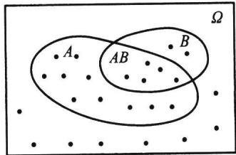  
图1.4.1例1.4.2的维恩图

$$
P ( A B ) = { \frac { 5 } { 2 5 } } .
$$

则在事件B发生的条件下，事件A的条件概率为

$$
P ( A \mid B ) = { \frac { P ( A B ) } { P ( B ) } } = { \frac { 5 / 2 5 } { 7 / 2 5 } } = { \frac { 5 } { 7 } } .
$$

此结果也可以如此考虑：事件B发生，表明事件B不可能发生，因此B中的18个样 $. B .$ $\overline { { B } }$ 本点可以不予考虑，此时在B中7个样本点中属于A的只有5个，所以 $P \left( A \mid B \right) = 5 / 7$ 这意味着，计算条件概率 $P ( A | B )$ 是在样本空间Ω缩小为 $\varOmega _ { B } = B$ 下进行的.

类似地

$$
P ( B \mid A ) = { \frac { P ( A B ) } { P ( A ) } } = { \frac { 5 / 2 5 } { 1 5 / 2 5 } } = { \frac { 5 } { 1 5 } } = { \frac { 1 } { 3 } } .
$$

它也可作如上解释.

我们要注意的是：条件概率 $P ( A \mid B )$ 是在给定B下讨论事件A的概率，那么概率的性质对 $\boldsymbol { P } ( \ \cdot \ | \boldsymbol { B } )$ 而言是否都成立呢？譬如，

$$
\begin{array} { c } { P ( \overline { { A } } \mid B ) = 1 - P ( A \mid B ) , } \\ { P ( A , \cup A _ { 2 } \mid B ) = P ( A _ { 1 } \mid B ) + P ( A _ { 2 } \mid B ) - P ( A _ { 1 } A _ { 2 } \mid B ) } \end{array}
$$

这些概率性质都成立吗？为此我们只要能验证条件概率满足三条公理即可回答这个问题

性质1.4.1条件概率是概率,即若设 $P ( B ) { > } 0$ ，则

(1） $P ( A \mid B ) \geqslant 0 , A \in { \mathcal { F } } .$

(2) $P ( \varOmega | B ) = 1$

（3）若中的 $A _ { 1 } , A _ { 2 } , \cdots , A _ { n } , \cdots$ 互不相容，则

$$
P \left( \bigcup _ { n = 1 } ^ { \infty } A _ { n } \mid B \right) = \sum _ { n = 1 } ^ { \infty } P ( A _ { n } \mid B ) .
$$

证明用条件概率的定义很容易证明(1)和(2），下面来证明(3).因为 $A _ { 1 } , A _ { 2 } , \cdots$ $A _ { n } , \cdots$ 互不相容，所以 $A _ { 1 } B , A _ { 2 } B , \cdots , A _ { n } B , \cdots$ 也互不相容，故

$$
{ \begin{array} { r l } { P \left( \bigcup _ { n = 1 } ^ { \infty } A _ { n } \mid B \right) } & { = { \frac { P \left( { \left( \bigcup _ { n = 1 } ^ { \infty } A _ { n } \right) B } \right) } { P ( B ) } } { = } { \frac { P \left( \bigcup _ { n = 1 } ^ { \infty } \left( A _ { n } B \right) \right) } { P ( B ) } } } \\ & { = \displaystyle \sum _ { n = 1 } ^ { \infty } { \frac { P \left( A _ { n } B \right) } { P ( B ) } } = \sum _ { n = 1 } ^ { \infty } P ( A _ { n } \mid B ) . } \end{array} }
$$

以下给出条件概率特有的三个非常实用的公式：乘法公式、全概率公式和贝叶斯公式.这些公式可以帮助我们计算一些复杂事件的概率.

## 1.4.2乘法公式

性质1.4.2乘法公式

（1）若 $P ( B ) { > } 0$ ，则

$$
P ( A B ) = P ( B ) P ( A \mid B ) .\tag{1.4.2}
$$

（2）若 $P ( A _ { 1 } A _ { 2 } \cdots A _ { n - 1 } ) > 0$ ，则

$$
P ( A _ { 1 } A _ { 2 } \cdots A _ { n } ) = P ( A _ { 1 } ) P ( A _ { 2 } \mid A _ { 1 } ) P ( A _ { 3 } \mid A _ { 1 } A _ { 2 } ) \cdots P ( A _ { n } \mid A _ { 1 } A _ { 2 } \cdots A _ { n - 1 } ) .\tag{1.4.3}
$$

证明由条件概率的定义，整理即得(1.4.2)式.下证(1.4.3)式，因为

$$
P ( A _ { \scriptscriptstyle 1 } ) \geqslant P ( A _ { \scriptscriptstyle 1 } A _ { \scriptscriptstyle 2 } ) \geqslant \cdots \geqslant P ( A _ { \scriptscriptstyle 1 } A _ { \scriptscriptstyle 2 } \cdots A _ { _ { n - 1 } } ) > 0 ,
$$

所以(1.4.3)式中的条件概率均有意义，且按条件概率的定义，(1.4.3)式的右边等于

$$
P ( A _ { 1 } ) \ \cdot { \frac { P ( A _ { 1 } A _ { 2 } ) } { P ( A _ { 1 } ) } } \cdot { \frac { P ( A _ { 1 } A _ { 2 } A _ { 3 } ) } { P ( A _ { 1 } A _ { 2 } ) } } \cdot \cdots \cdot { \frac { P ( A _ { 1 } A _ { 2 } \cdots A _ { n } ) } { P ( A _ { 1 } A _ { 2 } \cdots A _ { n - 1 } ) } } = P ( A _ { 1 } A _ { 2 } \cdots A _ { n } ) .
$$

从而(1.4.3)式成立.

例1.4.3一批零件共有100个,其中有10个不合格品.从中一个一个取出，求第

三次才取得不合格品的概率是多少？

解以A记事件“第i次取出的是不合格品”，i=1,2,3.则所求概率为 $A _ { i }$ $P ( \overline { { A } } _ { 1 } \overline { { A } } _ { 2 } A _ { 3 } )$ ，由乘法公式得

$$
P ( \overline { { A } } _ { 1 } \overline { { A } } _ { 2 } A _ { 3 } ) = P ( \overline { { A } } _ { 1 } ) P ( \overline { { A } } _ { 2 } \mid \overline { { A } } _ { 1 } ) P ( A _ { 3 } \mid \overline { { A } } _ { 1 } \overline { { A } } _ { 2 } ) = \frac { 9 0 } { 1 0 0 } \cdot \frac { 8 9 } { 9 9 } \cdot \frac { 1 0 } { 9 8 } = 0 . 0 8 2 ~ 6 .
$$

其实，例1.4.3是下面例1.4.4的特例.

例1.4.4（罐子模型）设罐中有b个黑球、r个红球，每次随机取出一个球，取出后将原球放回，还加进c个同色球和d个异色球.记B为“第i次取出的是黑球”，R为 $B _ { i }$ $R _ { j }$ “第j次取出的是红球”.

若连续从罐中取出三个球，其中有两个红球、一个黑球.则由乘法公式我们可得

$$
\begin{array} { l } { P ( B _ { 1 } R _ { 2 } R _ { 3 } ) = P ( B _ { 1 } ) P ( R _ { 2 } \mid B _ { 1 } ) P ( R _ { 3 } \mid B _ { 1 } R _ { 2 } ) } \\ { \displaystyle = \frac { b } { b + r } \cdot \frac { r + d } { b + r + c + d } \cdot \frac { r + d + c } { b + r + 2 c + 2 d } , } \\ { P ( R _ { 1 } B _ { 2 } R _ { 3 } ) = P ( R _ { 1 } ) P ( B _ { 2 } \mid R _ { 1 } ) P ( R _ { 3 } \mid R _ { 1 } B _ { 2 } ) } \\ { \displaystyle = \frac { r } { b + r } \cdot \frac { b + d } { b + r + c + d } \cdot \frac { r + d + c } { b + r + 2 c + 2 d } , } \\ { P ( R _ { 1 } R _ { 2 } B _ { 3 } ) = P ( R _ { 1 } ) P ( R _ { 2 } \mid R _ { 1 } ) P ( B _ { 3 } \mid R _ { 1 } R _ { 2 } ) } \\ { \displaystyle = \frac { r } { b + r } \cdot \frac { r + c } { b + r + c + d } \cdot \frac { b + 2 d } { b + r + 2 c + 2 d } } \end{array}
$$

以上概率与黑球在第几次被抽出有关.

罐子模型也称为波利亚(P6lya)模型,这个模型可以有各种变化，具体见下：

（1）当 $c = - 1 , d = 0$ 时，即为不返回抽样.此时前次抽取结果会影响后次抽取结果.但只要抽取的黑球与红球个数确定，则概率不依赖其抽出球的次序，都是一样的.此例中有

$$
P ( B _ { 1 } R _ { 2 } R _ { 3 } ) = P ( R _ { 1 } B _ { 2 } R _ { 3 } ) = P ( R _ { 1 } R _ { 2 } B _ { 3 } ) = { \frac { b r ( r - 1 ) } { ( b + r ) ( b + r - 1 ) ( b + r - 2 ) } } .
$$

例1.4.3可以归结为此种情况.

(2）当 $\scriptstyle c = 0 , d = 0$ 时，即为返回抽样.此时前次抽取结果不会影响后次抽取结果.故上述三个概率相等，且都等于

$$
P ( B _ { 1 } R _ { 2 } R _ { 3 } ) = P ( R _ { 1 } B _ { 2 } R _ { 3 } ) = P ( R _ { 1 } R _ { 2 } B _ { 3 } ) = { \frac { b r ^ { 2 } } { \left( b + r \right) ^ { 3 } } } .
$$

(3）当 $c { > } 0 , d { = } 0$ 时，称为传染病模型.此时，每次取出球后会增加下一次取到同色球的概率，或换句话说，每次发现一个传染病患者，以后都会增加再传染的概率.与（1），(2)一样，以上三个概率都相等，且都等于

$$
P ( B _ { 1 } R _ { 2 } R _ { 3 } ) = P ( R _ { 1 } B _ { 2 } R _ { 3 } ) = P ( R _ { 1 } R _ { 2 } B _ { 3 } ) = { \frac { b r ( r + c ) } { ( b + r ) ( b + r + c ) ( b + r + 2 c ) } } .
$$

从以上(1）、(2)和(3)中可以看出：在罐子模型中只要， $d = 0$ ，则以上三个概率都相等.即只要抽取的黑球与红球个数确定，则概率不依赖其抽出球的次序，都是一样的.但当 $d { > } 0$ 时，就不同了，见下面(4).

（4）当 $c = 0 , d > 0$ 时，称为安全模型.此模型可解释为：每当事故发生了（红球被取出），安全工作就抓紧一些，下次再发生事故的概率就会减少；而当事故没有发生时（黑球被取出），安全工作就放松一些，下次再发生事故的概率就会增大.在这种场合，上述三个概率分别为

$$
P ( B , R , R _ { 2 } R _ { 3 } ) = \frac { b } { b + r } \cdot \frac { r + d } { b + r + d } \cdot \frac { r + d } { b + r + 2 d } ,
$$

$$
P ( R , B , R _ { 3 } ) = \frac { r } { b + r } \cdot \frac { b + d } { b + r + d } \cdot \frac { r + d } { b + r + 2 d } ,
$$

$$
P ( R _ { 1 } R _ { 2 } B _ { 3 } ) = \frac { r } { b + r } \cdot \frac { r } { b + r + d } \cdot \frac { b + 2 d } { b + r + 2 d } .
$$

## 1.4.3全概率公式

全概率公式是概率论中的一个重要公式，它提供了计算复杂事件概率的一条有效途径，使一个复杂事件的概率计算问题化繁就简.

性质1.4.3（全概率公式）设 $B _ { 1 } , B _ { 2 } , \cdots , B _ { r }$ 为样本空间Ω的一个分割（见图1.4.2)，即 $B _ { 1 } , B _ { 2 } , \cdots , B _ { n }$ 互不相容，且 $\bigcup _ { i = 1 } ^ { \cdot } B _ { i } = \Omega$ ，如果 $P ( B _ { i } ) > 0 , i = 1 , 2 , \cdots , n$ ,则对任一事件A有

$$
P ( A ) = \ \sum _ { i = 1 } ^ { n } P ( B _ { i } ) P ( A \mid B _ { i } ) .\tag{1.4.4}
$$

证明因为

$$
A = A \varOmega = A \left( \bigcup _ { i = 1 } ^ { n } B _ { i } \right) = \bigcup _ { i = 1 } ^ { n } \left( A B _ { i } \right) ,
$$

且 $A B _ { 1 } , A B _ { 2 } , \cdots , A B _ { r }$ 互不相容，所以由可加性得

$$
P ( A ) = P \left( \bigcup _ { i = 1 } ^ { n } \left( A B _ { i } \right) \right) = \sum _ { i = 1 } ^ { n } P ( A B _ { i } ) ,
$$

再将 $P ( A B _ { i } ) = P ( B _ { i } ) P ( A \mid B _ { i } ) , i = 1 , 2 , \cdots , n$ ,代人上式即得（1.4.4).

对于全概率公式，我们要注意以下几点：

（1）全概率公式的最简单形式假如 $0 { < } P ( B ) { < } 1$ ，则

$$
P ( A ) = P ( B ) P ( A \mid B ) + P ( \overline { { B } } ) P ( A \mid \overline { { B } } ) .\tag{1.4.5}
$$

见图1.4.3.

（2）条件 $B _ { 1 } , B _ { 2 } , \cdots , B _ { n }$ 为样本空间的一个分割，可改成 $B _ { 1 } , B _ { 2 } , \cdots , B _ { n }$ 互不相容，且 $A C \bigcup _ { i = 1 } ^ { n } B _ { i }$ ,全概率公式仍然成立.

（3）对可列个事件 $B _ { 1 } , B _ { 2 } , \cdots , B _ { n } , \cdots$ 互不相容，且 $A \subset \bigcup _ { i = 1 } ^ { \infty } B _ { i }$ ,则全概率公式仍成立，只要将(1.4.4)式右边写成可列项之和即可.

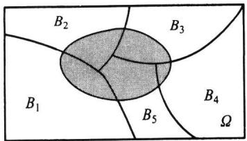  
图1.4.2样本空间的一个分割 $\left( n = 5 \right)$

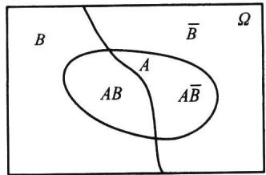  
图1.4.3用B和 $| \overline { { B } } ;$ 来分割样本空间

例1.4.5(摸彩模型）设在n张彩票中有一张可中奖.求第二人摸到中奖彩票的概率是多少？

解设A表示事件“第i人摸到中奖彩票”， $A _ { i }$ $i = 1 , 2 , \cdots , n .$ 现在目的是求 $P ( A _ { 2 } )$ .因为 $A _ { \scriptscriptstyle 1 }$ 是否发生直接关系到 $A _ { 2 }$ 发生的概率，即

$$
P ( A _ { 2 } \mid A _ { 1 } ) = 0 , \quad P ( A _ { 2 } \mid \overline { { { A } } } _ { 1 } ) = \frac { 1 } { n - 1 } .
$$

而 $A _ { \scriptscriptstyle 1 }$ 与 $\cdot { \overline { { A } } } _ { 1 }$ 是两个概率大于0的事件：

$$
P ( A _ { 1 } ) = \frac { 1 } { n } , \quad P ( \overline { { A } } _ { 1 } ) = \frac { n - 1 } { n } .
$$

于是由全概率公式得

$$
P ( A _ { 2 } ) = P ( A _ { 1 } ) P ( A _ { 2 } \mid A _ { 1 } ) + P ( \overline { { A } } _ { 1 } ) P ( A _ { 2 } \mid \overline { { A } } _ { 1 } ) = \frac { 1 } { n } \cdot 0 + \frac { n - 1 } { n } \cdot \frac { 1 } { n - 1 } = \frac { 1 } { n } .
$$

这表明：摸到中奖彩票的机会与先后次序无关.因后者可能处于“不利状况”（前者已摸到中奖彩票），但也可能处于“有利状况”（前者没摸到中奖彩票，从而增加后者摸到中奖彩票的机会），两种状况用全概率公式综合（加权平均）所得结果（机会均等）既公平又合情理.

用类似的方法可得

$$
P ( A _ { 3 } ) = P ( A _ { 4 } ) = \cdots = P ( A _ { n } ) = { \frac { 1 } { n } } .
$$

如果设n张彩票中有 $k \ ( \leqslant n )$ 张可中奖，则可得

$$
P ( A _ { _ 1 } ) = P ( A _ { _ 2 } ) = \cdots = P ( A _ { _ n } ) = { \frac { k } { n } } .
$$

这说明，购买彩票时，不论先买后买，中奖机会是均等的.

例1.4.6保险公司认为某险种的投保人可以分成两类：一类为易出事故者，另一类为安全者.统计表明：一个易出事故者在一年内发生事故的概率为0.4，而安全者这个概率则减少为0.1.若假定易出事故者占此险种投保人的比例为20%.现有一个新的投保人来投保此险种，问该投保人在购买保单后一年内将出事故的概率有多大？

解记 $A = "$ 投保人在一年内出事故”， $B = { } ^ { * }$ 投保人为易出事故者，则 $\overline { { B } } = { } ^ { \ast }$ 投保人为安全者”，且 $P ( \overline { { B } } ) = 0 . 8$ 由全概率公式得

$$
P ( A ) = P ( B ) P ( A \mid B ) + P ( \overline { { B } } ) P ( A \mid \overline { { B } } ) = 0 . 2 \times 0 . 4 + 0 . 8 \times 0 . 1 = 0 . 1 6 .
$$

例1.4.7（敏感性问题调查）学生阅读黄色书刊和观看黄色影像会严重影响其身心健康发展.但这些都是避着教师与家长进行的，属个人隐私行为.现在要设计一个调查方案，从调查数据中估计出学生中看过黄色书刊或影像的比率 $p .$

像这类敏感性问题的调查是社会调查的一类，如一群人中参加赌博的比率、吸毒人的比率、经营者中偷税漏税户的比率、学生中考试作弊的比率等等.

对敏感性问题的调查方案，关键要使被调查者愿意作出真实回答又能保守个人秘密.一旦调查方案设计有误，被调查者就会拒绝配合，所得调查数据将失去真实性.经过多年研究和实践，一些心理学家和统计学家设计了一种调查方案，在这个方案中被调查者只需回答以下两个问题中的一个问题，而且只需回答“是”或“否”

问题A：你的生日是否在7月1日之前？

问题B：你是否看过黄色书刊或影像？

这个调查方案看似简单，但为了消除被调查者的顾虑，使被调查者确信他（她）参加这次调查不会泄露个人秘密，在操作上有以下关键点：

（1）被调查者在没有旁人的情况下,独自一人在一个房间内操作和回答问题.

（2）被调查者从一个罐子中随机抽一只球，看过颜色后即放回.若抽到白球，则回答问题A；若抽到红球，则回答问题B.且罐中只有白球和红球.

被调查者无论回答问题A或问题B，只需在答卷（见图1.4.4)上认可的方框内打钩，然后把答卷放人一只密封的投票箱内.

如此的调查方法，主要在于旁人无法知道被调查者回答的是问题A还是问题B，由此可以极大地消除被调查者的顾虑.

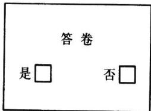  
图1.4.4敏感性  
问题的答卷

现在的问题是如何分析调查的结果.很显然，我们对问题A是不感兴趣的.

首先我们设有n张答卷(n较大，譬如1000以上），其中有k张回答“是”.而我们又无法知道此n张答卷中有多少张是回答问题B的，同样无法知道k张回答“是”的答卷中有多少张是回答问题B的.但有两个信息我们是预先知道的，即

（1）在参加人数较多的场合，任选一人其生日在7月1日之前的概率为0.5.

（2）罐中红球的比率π已知.现在就要利用这4个数据(n,k,0.5,π）求出p.因为 $p .$ 由全概率公式得

$$
P ( \underset { \lambda \in \mathcal { E } } { \boxplus } = P ( \underset { \lambda \not \in \mathcal { E } } { \boxplus } \hat { \pmb { \chi } } ) P ( \underset { \lambda \in \mathcal { E } } { \boxplus } \hat { \pmb { \chi } } ) + P ( \underset { \lambda \not \in \mathcal { E } } { \boxed { \zeta \mathbb { T } } } \hat { \pmb { \chi } } ) P ( \underset { \lambda \not \in \mathcal { E } } { \boxplus } \frac { \not \zeta } { \pmb { \chi } \not  } ) .
$$

所以,将P(红球)=π,P(白球)=1-π,P(是I白球)=0.5,P(是l红球)=p代人上式右边,而上式左边用频率k/n代替，得

$$
\frac { k } { n } = 0 . 5 ( 1 - \pi ) \ + p \cdot \pi .
$$

由此得

$$
p = \frac { k / n \mathrm { ~ - ~ } 0 . 5 ( \mathrm { ~ 1 ~ - ~ } \pi ) } { \pi } .
$$

因为我们用频率k/n代替了概率P(是），所以从上式得到的是p的估计.

例如，在一次实际调查中，罐中放有红球30个、白球20个，则 $\pmb { \pi = 0 . 6 }$ ,调查结束后共收到1583张有效答卷，其中有389张回答“是”，由此可计算得

$$
p = { \frac { 3 8 9 / 1 ~ 5 8 3 ~ - ~ 0 . 5 ~ \times ~ 0 . 4 } { 0 . 6 } } = 0 . 0 7 6 ~ 2 .
$$

这表明：约有7.62%的学生看过黄色书刊或影像.

## 1.4.4贝叶斯公式

在乘法公式和全概率公式的基础上立即可推得如下一个很著名的公式.

性质1.4.4（贝叶斯公式）设 $B _ { 1 } , B _ { 2 } , \cdots , B _ { n }$ 是样本空间5的一个分割，即 $B _ { \imath }$ $B _ { 2 } , \cdots , B _ { n }$ 互不相容，且 $\bigcup _ { i = 1 } ^ { n } B _ { i } = \Omega$ ，如果 $P ( A ) > 0 , P ( B _ { i } ) > 0 , i = 1 , 2 , \cdots , n$ ，则

$$
P ( B _ { i } \mid A ) = { \frac { P ( B _ { i } ) P ( A \mid B _ { i } ) } { \displaystyle \sum _ { j = 1 } ^ { n } P ( B _ { j } ) P ( A \mid B _ { j } ) } } , \quad i = 1 , 2 , \cdots , n .\tag{1.4.6}
$$

证明由条件概率的定义

$$
P ( B _ { i } \mid A ) = { \frac { P ( A B _ { i } ) } { P ( A ) } } .
$$

对上式的分子用乘法公式、分母用全概率公式，

$$
P ( A B _ { i } ) = P ( B _ { i } ) P ( A \mid B _ { i } ) ,
$$

$$
P ( A ) = \ \sum _ { j = 1 } ^ { n } P ( B _ { j } ) P ( A \mid B _ { j } ) ,
$$

即得

$$
P ( B _ { i } \mid A ) = { \frac { P ( B _ { i } ) P ( A \mid B _ { i } ) } { \displaystyle \sum _ { j = 1 } ^ { n } P ( B _ { j } ) P ( A \mid B _ { j } ) } } .
$$

结论得证.

例1.4.8某地区居民的肝癌发病率为0.0004，现用甲胎蛋白法进行普查.医学研究表明，化验结果是可能存有错误的.已知患有肝癌的人其化验结果99%呈阳性（有病），而没患肝癌的人其化验结果99.9%呈阴性(无病).现某人的检查结果呈阳性，问他真的患肝癌的概率是多少？

解记B为事件“被检查者患有肝癌”,A为事件“检查结果呈阳性”.由题设知

$$
P ( B ) = 0 . 0 0 0 ~ 4 , ~ P ( \overline { { B } } ) = 0 . 9 9 9 ~ 6 ,
$$

$$
P ( A \mid B ) = 0 . 9 9 , \quad P ( A \mid \overline { { { B } } } ) = 0 . 0 0 1 .
$$

我们现在的目的是求P(BIA).由贝叶斯公式得

$$
{ \begin{array} { r l } { P ( B \mid A ) = { \cfrac { P ( B ) P ( A \mid B ) } { P ( B ) P ( A \mid B ) + P ( { \overline { { B } } } ) P ( A \mid { \overline { { B } } } ) } } } \\ { \displaystyle } & { = { \cfrac { 0 . 0 0 0 4 \times 0 . 9 9 } { 0 . 0 0 0 4 \times 0 . 9 9 + 0 . 9 9 9 6 \times 0 . 0 0 1 } } = 0 . 2 8 4 . } \end{array} }
$$

这表明，在检查结果呈阳性的人中，真患肝癌的人不到30%.这个结果可能会使人吃惊，但仔细分析一下就可以理解了.因为肝癌发病率很低，在10000个人中约有4人，而约有9996个人不患肝癌.对10000个人用甲胎蛋白法进行检查，按其错检的概率可知,9996个不患肝癌者中约有 $9 ~ 9 9 6 \times 0 . 0 0 1 = 9 . 9 9 6$ 个呈阳性.另外4个真患肝癌者的检查报告中约有 $4 \times 0 . 9 9 = 3 . 9 6$ 个呈阳性.仅从13.956个呈阳性者中看，真患肝癌的3.96人约占28.4%.

进一步降低错检的概率是提高检验精度的关键.在实际中由于技术和操作等种种原因，降低错检的概率又是很困难的.所以在实际中，常采用复查的方法来减少错误率.或用另一些简单易行的辅助方法先进行初查，排除了大量明显不是肝癌的人后，再用甲胎蛋白法对被怀疑的对象进行检查.此时被怀疑的对象群体中，肝癌的发病率已大大提高了，譬如，对首次检查呈阳性的人群再进行复查，此时 $P ( B ) = 0 . 2 8 4$ ，这时再用贝叶斯公式计算得

$$
P ( B \mid A ) = { \frac { 0 . 2 8 4 \times 0 . 9 9 } { 0 . 2 8 4 \times 0 . 9 9 + 0 . 7 1 6 \times 0 . 0 0 1 } } = 0 . 9 9 7 .
$$

这就大大提高了甲胎蛋白法的准确率了.

在上例中，如果我们将事件B（“被检查者患有肝癌”）看作是“原因”，将事件A（“检查结果呈阳性”)看作是“结果”，则我们用贝叶斯公式在已知“结果”的条件下，求出了“原因”的概率 $P ( B | A )$ .而求“结果”的（无条件）概率 $P ( A )$ ，用全概率公式.在上例中若取 $P ( B ) = 0 . 2 8 4$ ,则

$$
{ \begin{array} { r l } & { P ( A ) = P ( B ) P ( A \mid B ) + P ( { \overline { { B } } } ) P ( A \mid { \overline { { B } } } ) } \\ & { \qquad = 0 . 2 8 4 \times 0 . 9 9 + 0 . 7 1 6 \times 0 . 0 0 1 = 0 . 2 8 1 ~ 9 . } \end{array} }
$$

条件概率的三个公式中，乘法公式是求事件交的概率，全概率公式是求一个复杂事件的概率，而贝叶斯公式是求一个条件概率.

在贝叶斯公式中，如果称 $P ( B _ { i } )$ 为 $B _ { i }$ 的先验概率，称 $P ( B _ { i } \mid A )$ 为 $B _ { i }$ 的后验概率，则贝叶斯公式是专门用于计算后验概率的，也就是通过A的发生这个新信息，来对 $B _ { i }$ 的概率作出的修正.下面例子很好地说明了这一点.

例1.4.9伊索寓言“孩子与狼"讲的是一个小孩每天到山上放羊，山里有狼出没.第一天，他在山上喊：“狼来了！狼来了！"山下的村民闻声便去打狼，可到山上，发现狼没有来；第二天仍是如此；第三天，狼真的来了，可无论小孩怎么喊叫，也没有人来救他，因为前两次他说了谎，人们不再相信他了.

现在用贝叶斯公式来分析此寓言中村民对这个小孩的信任程度是如何下降的.

首先记事件A为“小孩说谎”，记事件B为“小孩可信”.不妨设村民过去对这个小孩的印象为

$$
P ( B ) = 0 . 8 , \quad P ( \stackrel {  } { B } ) = 0 . 2 .\tag{1.4.7}
$$

我们现在用贝叶斯公式来求 $P ( B | A )$ ,亦即这个小孩说了一次谎后，村民对他信任程度的改变.

在贝叶斯公式中我们要用到概率P(AIB)和 $P ( A \mid { \overline { { B } } } )$ ,这两个概率的含义是：前者为“可信"（B)的孩子“说谎”（A）的可能性，后者为“不可信 $" ( \overline { { B } } )$ 的孩子“说谎”（A）的

可能性.在此不妨设

$$
P ( A \mid B ) = 0 . 1 , \quad P ( A \mid \overline { { B } } ) = 0 . 5 .
$$

第一次村民上山打狼，发现狼没有来，即小孩说了谎(A).村民根据这个信息，对这个小孩的信任程度改变为（用贝叶斯公式）

$$
P ( B \mid A ) = { \frac { P ( B ) P ( A \mid B ) } { P ( B ) P ( A \mid B ) + P ( \overline { { B } } ) P ( A \mid \overline { { B } } ) } } = { \frac { 0 . 8 \times 0 . 1 } { 0 . 8 \times 0 . 1 + 0 . 2 \times 0 . 5 } } = 0 . 4 4 4 .
$$

这表明村民上了一次当后，对这个小孩的信任程度由原来的0.8调整为0.444，也就是（1.4.7）调整为

$$
P ( B ) = 0 . 4 4 4 , \quad P ( \overline { { B } } ) = 0 . 5 5 6 .\tag{1.4.8}
$$

在此基础上，我们再一次用贝叶斯公式来计算 $P ( B \mid A )$ ，亦即这个小孩第二次说谎后，村民对他的信任程度改变为

$$
P ( B \mid A ) = { \frac { 0 . 4 4 4 \times 0 . 1 } { 0 . 4 4 4 \times 0 . 1 + 0 . 5 5 6 \times 0 . 5 } } = 0 . 1 3 8 .
$$

这表明村民们经过两次上当，对这个小孩的信任程度已经从0.8下降到了0.138，如此低的信任度，村民听到第三次呼叫时怎么会再上山打狼呢？

这个例子启发人们：若某人向银行贷款，连续两次未还，银行还会第三次贷款给他吗？

## 习题1.4

1.某班级学生的考试成绩数学不及格的占8%，语文不及格的占5%，这两门都不及格的占2%.

（1）已知一学生数学不及格，他语文也不及格的概率是多少？

（2）已知一学生语文不及格，他数学也不及格的概率是多少？

2.设一批产品中一、二、三等品各占60%，35%，5%.从中任意取出一件，结果不是三等品，求取到的是一等品的概率.

3.掷两颗骰子，以A记事件“两颗点数之和为10”，以B记事件“第一颗点数小于第二颗点数”， $1 0 ^ { n }$ 试求条件概率P（AIB)和P（BIA）.

4.设某种动物由出生活到10岁的概率为0.8，而活到15岁的概率为0.5.问现年为10岁的这种动物能活到15岁的概率是多少？

5.设10件产品中有3件不合格品，从中任取两件，已知其中一件是不合格品，求另一件也是不合格品的概率.

6.设n件产品中有m件不合格品，从中任取两件，已知两件中有一件是合格品，求另一件也是合格品的概率.

7.掷一颗骰子两次，以x，y分别表示先后掷出的点数，记

$$
A \ = \ \left\{ \ x + y < 1 0 \right\} , B \ = \ \left\{ x > y \right\} ,
$$

求P(BIA),P(AIB).

8.已知 $P ( A ) = 1 / 3 , P ( B \mid A ) = 1 / 4 , P ( A \mid B ) = 1 / 6$ ，求 $P ( A \cup B )$

9.已知 $P ( \overline { { A } } ) = 0 . 3 , P ( B ) = 0 . 4 , P ( A \overline { { B } } ) = 0 . 5$ ，求 $P ( B | A \cup { \overline { { B } } } )$

10.设A,B为两事件 $, P ( A ) = P ( B ) = 1 / 3 , P ( A \mid B ) = 1 / 6 , ☉ P ( \overline { { A } } \mid \overline { { B } } )$

11.口袋中有1个白球，1个黑球.从中任取1个，若取出白球，则试验停止；若取出黑球，则把取出的黑球放回的同时，再加入1个黑球，如此下去，直到取出的是白球为止，试求下列事件的概率：

（1）取到第n次，试验没有结束；

（2）取到第n次，试验恰好结束.

12.一盒晶体管中有8只合格品、2只不合格品.从中不返回地一只一只取出，试求第二次取出的是合格品的概率.

13.甲口袋有a个白球、b个黑球，乙口袋有n个白球、m个黑球.

（1）从甲口袋任取1个球放入乙口袋，再从乙口袋任取1个球.试求最后从乙口袋取出的是白球的概率；

（2）从甲口袋任取2个球放入乙口袋，再从乙口袋任取1个球.试求最后从乙口袋取出的是白球的概率.

14.有n个口袋，每个口袋中均有a个白球、b个黑球.从第一个口袋中任取一球放入第二个□袋，再从第二个口袋中任取一球放入第三个口袋，如此下去，从第n-1个口袋中任取一球放入第n个□袋，最后从第n个口袋中任取一球，求此时取到的是白球的概率.

15.钥匙掉了，掉在宿舍里、教室里、路上的概率分别是50%、30%和20%，而掉在上述三处地方被找到的概率分别是0.8、0.3和0.1.试求找到钥匙的概率.

16.两台车床加工同样的零件，第一台出现不合格品的概率是0.03，第二台出现不合格品的概率是0.06，加工出来的零件放在一起，并且已知第一台加工的零件比第二台加工的零件多一倍.

（1）求任取一个零件是合格品的概率；

（2）如果取出的零件是不合格品，求它是由第二台车床加工的概率.

17.有两箱零件，第一箱装50件，其中20件是一等品.第二箱装30件，其中18件是一等品.现从两箱中随意挑出一箱，然后从该箱中先后任取两个零件，试求：

（1）第一次取出的零件是一等品的概率；

（2）在第一次取出的是一等品的条件下，第二次取出的零件仍然是一等品的概率.

18.学生在做一道有4个选项的单项选择题时，如果他不知道问题的正确答案，就作随机猜测.现从卷面上看题是答对了，试在以下情况下求学生确实知道正确答案的概率：

（1）学生知道正确答案和胡乱猜测的概率都是1/2；

(2）学生知道正确答案的概率是0.2.

19.已知男人中有5%是色盲患者，女人中有0.25%是色盲患者，今从男女比例为22：21的人群中随机地挑选一人，发现恰好是色盲患者，问此人是男性的概率是多少？

20.口袋中有一个球，不知它的颜色是黑的还是白的.现再往口袋中放入一个白球，然后从口袋中任意取出一个，发现取出的是白球，试问口袋中原来那个球是白球的可能性为多少？

21.将n根绳子的2n个头任意两两相接，求恰好结成n个圈的概率.

22.m个人相互传球，球从甲手中开始传出，每次传球时，传球者等可能地把球传给其余m-1个人中的任何一个.求第n次传球时仍由甲传出的概率.

23.甲、乙两人轮流掷一颗骰子，甲先掷.每当某人掷出1点时，则交给对方掷，否则此人继续掷.试求第n次由甲掷的概率.

24.甲口袋有1个黑球、2个白球，乙口袋有3个白球.每次从两口袋中各任取一球，交换后放入另一口袋.求交换n次后，黑球仍在甲口袋中的概率.

25.假设只考虑天气的两种情况：有雨或无雨.若已知今天的天气情况，明天天气保持不变的概率为p，变的概率为1-p.设第一天无雨，试求第n天也无雨的概率.

26.设罐中有b个黑球、r个红球，每次随机取出一个球，取出后将原球放回，再加入c（c>0）个同

色的球.试证：第k次取到黑球的概率为 $b / ( b + r ) , k = 1 , 2 , \cdots$

27.口袋中有α个白球，b个黑球和n个红球，现从中一个一个不返回地取球.试证白球比黑球出现得早的概率为 $a / \left( a + b \right)$ ，与n无关.

28.设 $P \left( A \right) > 0$ ，证明：

$$
P ( B \mid A ) \geqslant 1 - { \frac { P ( { \overline { { B } } } ) } { P ( A ) } } .
$$

29.若事件A与B互不相容，且 $P ( \overline { { B } } ) \neq 0$ ，证明：

$$
P ( A \mid { \overline { { B } } } ) = { \frac { P ( A ) } { 1 - P ( B ) } } .
$$

30.设A，B为任意两个事件，且 $A \subset B , P ( B ) > 0$ ，证明 $P ( A ) \leqslant P \bigl ( A \mid B \bigr )$

31.若 $P \big ( A \mid B \big ) > P \big ( A \mid \overline { { B } } \big )$ ，证明 $P ( B | A ) > P ( B | \overline { { A } } )$

32.设 $P \left( A \right) = p , P \left( B \right) = 1 - \varepsilon$ ，证明：

$$
{ \frac { p - \varepsilon } { 1 - \varepsilon } } \leqslant P ( A \mid B ) \leqslant { \frac { p } { 1 - \varepsilon } } .
$$

33.若 $P ( A \mid B ) = 1$ ，证明 $P ( \overline { { B } } | \overline { { A } } ) = 1$

## \$1.5独立性

独立性是概率论中又一个重要概念，利用独立性可以简化概率的计算.下面先讨论两个事件之间的独立性，然后讨论多个事件之间的相互独立性，最后讨论试验之间的独立性.

## 1.5.1两个事件的独立性

两个事件之间的独立性是指：一个事件的发生不影响另一个事件的发生.这在实际问题中是很多的，譬如在掷两颗骰子的试验中，记事件A为“第一颗骰子的点数为1”,记事件B为“第二颗骰子的点数为4”.则显然A与B的发生是相互不影响的. $4 "$

另外，从概率的角度看，事件A的条件概率 $P ( A | B )$ 与无条件概率 $P ( A )$ 的差别在于：事件B的发生改变了事件A发生的概率，也即事件B对事件A有某种“影响”.如果事件A与B的发生是相互不影响的，则有 $P ( A \mid B ) = P ( A )$ 和 $P ( B | A ) = P ( B )$ ，它们都等价于

$$
P ( A B ) = P ( A ) P ( B ) .\tag{1.5.1}
$$

另外对 $P ( B ) = 0$ ，或 $P ( A ) = 0$ ，(1.5.1)式仍然成立.为此，我们用(1.5.1)式作为两个事件相互独立的定义.

定义1.5.1如果(1.5.1)式成立，则称事件A与B相互独立，简称A与B独立.否则称A与B不独立或相依.

在许多实际问题中，两个事件相互独立大多是根据经验（相互有无影响）来判断的，如上述掷两颗骰子问题中A与B的独立性.但在有些问题中，有时也用(1.5.1)式来判断两个事件间的独立性.

例1.5.1事件独立的例子

（1）从一副52张的扑克牌中任取1张，以A记事件“取到黑桃”，以B记事件“取到J".则因为 $P ( A ) = 1 / 4 , P ( B ) = 4 / 5 2 = 1 / 1 3$ ,而AB表示“取到黑桃 $\mathbf { J } ^ { \prime \prime }$ ,故 $P \left( { \cal A B } \right) =$ 1/52，所以A与B相互独立.

（2）考虑有三个小孩的家庭，并设所有8种情况

$$
b b b , \quad b b g , \quad b g b , \quad g b b , \quad b g g , \quad g b g , \quad g g b , \quad g g g
$$

是等可能的，其中b表示男孩，g表示女孩.以A记事件“家中男女孩都有”，以B记事件“家中至多一个女孩”.则因为 $P \left( A \right) = 6 / 8 , P \left( B \right) = 4 / 8$ ,而AB表示“家中恰有一个女孩”,故 $P ( A B ) = 3 / 8$ ,所以A与B相互独立.

（3）当考察的家庭有两个小孩时，样本空间只含4个样本点，它们是

$$
b b , \quad b g , \quad g b , \quad g g .
$$

若事件A,B仍如(2)所设，则 $P \left( A \right) = 2 / 4 , P \left( B \right) = 3 / 4$ ，而 $P \left( \ A B \right) = 2 / 4$ ，由于$P ( A B ) \neq P ( A ) P ( B )$ ,所以A与B不独立.

性质1.5.1若事件A与B独立，则A与B独立,A与B独立,A与B独立. $\overline { B }$ $\bar { , A }$ $\stackrel { \_ } { , }$

证明由概率的性质知

$$
P ( A { \overline { { B } } } ) = P ( A ) \ - { \cal P } ( A B ) .
$$

又由A与B的独立性知

$$
P ( A B ) = P ( A ) P ( B ) ,
$$

所以

$$
P ( A { \overline { { B } } } ) = P ( A ) - P ( A ) P ( B ) = P ( A ) \left[ 1 - P ( B ) \right] = P ( A ) P ( { \overline { { B } } } ) ,
$$

这表明A与B独立.类似可证A与B独立,A与B独立. $\overline { B }$ $\overset { - } { A }$ $\textstyle { \overline { { , A } } }$ $\overline { { B } }$

对于性质1.5.1的直观理解也是容易的：因为A与B相互独立，则A的发生不影响B的发生，那么A的发生也不会影响B的不发生,A的不发生也不会影响B的发生，A的不发生也不会影响B的不发生.

## 1.5.2多个事件的相互独立性

首先研究三个事件的相互独立性，对此我们先给出以下的定义

定义1.5.2 设A,B,C是三个事件，如果有

$$
\left\{ \begin{array} { l l } { P \left( A B \right) = P \left( A \right) P \left( B \right) , } \\ { P \left( A C \right) = P \left( A \right) P \left( C \right) , } \\ { P \left( B C \right) = P \left( B \right) P \left( C \right) , } \end{array} \right.\tag{1.5.2}
$$

则称A,B,C两两独立.若还有

$$
P ( A B C ) = P ( A ) P ( B ) P ( C ) ,\tag{1.5.3}
$$

则称A,B,C相互独立.

注意：有例子可以证明由（1.5.2)式推不出（1.5.3)式，同样有例子可以证明由(1.5.3)式推不出(1.5.2）式.

由此我们可以定义三个以上事件的相互独立性.

定义1.5.3设有n个事件 $A _ { 1 } , A _ { 2 } , \cdots , A _ { n }$ ,对任意的 $1 \leqslant i < j < k < \cdots \leqslant n$ ，如果以下等式

均成立

$$
\left\{ \begin{array} { l } { P ( A _ { i } A _ { j } ) = P ( A _ { i } ) P ( A _ { j } ) , } \\ { P ( A _ { i } A _ { j } A _ { k } ) = P ( A _ { i } ) P ( A _ { j } ) P ( A _ { k } ) , } \\ { \quad \dots \dots \dots \dots } \\ { P ( A _ { 1 } A _ { 2 } \dots A _ { n } ) = P ( A _ { 1 } ) P ( A _ { 2 } ) \dots P ( A _ { n } ) , } \end{array} \right.\tag{1.5.4}
$$

则称此n个事件 $A _ { 1 } , A _ { 2 } , \cdots , A _ { n }$ 相互独立.

从上述定义可以看出，n个相互独立的事件中的任意一部分内仍是相互独立的，而且任意一部分与另一部分也是独立的.与性质1.5.1类似，可以证明：将相互独立事件中的任一部分换为对立事件，所得的诸事件仍为相互独立的.

例1.5.2设A,B,C三事件相互独立，试证AUB与C相互独立.

证明因为

$$
\begin{array} { r l } & { P ( \left( A \cup B \right) C ) = P ( A C \cup B C ) = P ( A C ) + P ( B C ) - P ( A B C ) } \\ & { \qquad = P ( A ) P ( C ) + P ( B ) P ( C ) - P ( A ) P ( B ) P ( C ) } \\ & { \qquad = \left( P ( A ) + P ( B ) - P ( A ) P ( B ) \right) P ( C ) = P ( A \cup B ) P ( C ) , } \end{array}
$$

所以AUB与C相互独立.

仿照此题的证明，可很容易推得：AB与C独立，A-B与C独立.

注意：若A，B，C间只有两两独立，则不能证明AUB与C独立，也不能证明AB与C独立,A-B与C独立.

例1.5.3两射手彼此独立地向同一目标射击，设甲射中目标的概率为0.9，乙射中目标的概率为0.8，求目标被击中的概率是多少？

解记A为事件“甲射中目标”，B为事件“乙射中目标”.注意到事件“目标被击$4 ^ { \prime \prime } = A \cup B$ ,故

$$
P ( A \cup B ) = P ( A ) \ + P ( B ) \ - P ( A ) P ( B ) = 0 . 9 \ + \ 0 . 8 \ - \ 0 . 9 \times 0 . 8 \ = 0 . 9 8 .
$$

此题也可用对立事件公式求解，具体是

$$
\begin{array} { l } { P ( A \cup B ) = 1 { \neg { P } } ( \overline { { A \cup B } } ) = 1 { \neg { P } } ( \overline { { A } } \ \overline { { B } } ) } \\ { \qquad = 1 { \neg { P } } ( \overline { { A } } ) P ( \overline { { B } } ) = 1 { \ - } ( 1 { - } 0 . 9 ) \left( 1 { - } 0 . 8 \right) } \\ { \qquad = 1 { - } 0 . 1 { \times } 0 . 2 = 0 . 9 8 . } \end{array}
$$

例1.5.4某零件用两种工艺加工，第一种工艺有三道工序，各道工序出现不合格品的概率分别为0.3，0.2，0.1；第二种工艺有两道工序，各道工序出现不合格品的概率分别为0.3，0.2.试问：

（1）用哪种工艺加工得到合格品的概率较大些？

（2）第二种工艺两道工序出现不合格品的概率都是0.3时，情况又如何？

解以 $A _ { i }$ 记事件“用第i种工艺加工得到合格品”,i=1,2.

（1）由于各道工序可看作是独立工作的，所以

$$
P ( A _ { \scriptscriptstyle 1 } ) = 0 . 7 \times 0 . 8 \times 0 . 9 = 0 . 5 0 4 ,
$$

$$
P ( A _ { 2 } ) = 0 . 7 \times 0 . 8 = 0 . 5 6 ,
$$

即第二种工艺得到合格品的概率较大些.这个结果也是可以理解的，因为第二种工艺前两道工序出现不合格品的概率与第一种工艺相同，但少了一道工序，所以减少了出

现不合格品的机会.

（2）当第二种工艺的两道工序出现不合格品的概率都是0.3时，

$$
P ( \mathrm { \cal { A } } _ { 2 } ) = 0 . 7 \times 0 . 7 = 0 . 4 9 ,
$$

即第一种工艺得到合格品的概率较大些.

例1.5.5有两名选手比赛射击，轮流对同一目标进行射击，甲命中目标的概率为α,乙命中目标的概率为 $\beta .$ 甲先射，谁先命中谁得胜.问甲、乙两人获胜的概率各为多少？

解法一记事件 $A _ { i }$ 为"第i次射击命中目标”， $i = 1 , 2 , \cdots$ .因为甲先射，所以事件“甲获胜”可以表示为

$$
A _ { 1 } \cup \overline { { { A } } } _ { 1 } \overline { { { A } } } _ { 2 } A _ { 3 } \cup \overline { { { A } } } _ { 1 } \overline { { { A } } } _ { 2 } \overline { { { A } } } _ { 3 } \overline { { { A } } } _ { 4 } A _ { 5 } \cup \cdots .
$$

又因为各次射击是独立的，所以得

$$
{ \begin{array} { r l } { P \{ \text{甲获胜} \} = \alpha + \left( 1 - \alpha \right) \left( 1 - \beta \right) \alpha + \left( 1 - \alpha \right) ^ { 2 } \left( 1 - \beta \right) ^ { 2 } \alpha + \cdots } & { } \\ { \quad } & { = \alpha \displaystyle \sum _ { i = 0 } ^ { \infty } \left( 1 - \alpha \right) ^ { i } \left( 1 - \beta \right) ^ { i } } \\ & { = \displaystyle { \frac { \alpha } { 1 - \left( 1 - \alpha \right) \left( 1 - \beta \right) } } . } \end{array} }
$$

同理可得

$$
\begin{array} { r l } { P \{ Z _ { \mathrm { \tiny ~ A R } } ^ { \mathrm { q * } } \sharp \sharp \} } & { = P ( \bar { A } _ { 1 } A _ { 2 } \cup \bar { A } _ { 1 } \bar { A } _ { 2 } \bar { A } _ { 3 } A _ { 4 } \cup \cdots ) } \\ & { = ( 1 - \alpha ) \beta + ( 1 - \alpha ) ( 1 - \beta ) ( 1 - \alpha ) \beta + \cdots } \\ & { = \beta ( 1 - \alpha ) \displaystyle \sum _ { i = 0 } ^ { \infty } \left( 1 - \alpha \right) ^ { i } ( 1 - \beta ) ^ { i } } \\ & { = \displaystyle \frac { \beta ( 1 - \alpha ) } { 1 - ( 1 - \alpha ) ( 1 - \beta ) } . } \end{array}
$$

此题在等比级数求和时，应该有条件：公比 $\mid \left( \ 1 - \alpha \right) \left( \ 1 - \beta \right) \mid < 1$ .这一点不难从题目的实际意义中得到.因为对本题而言， $\alpha , \beta$ 取值为零或1均是无意义的.

解法二因为

$$
P ( \mathbb { H } \mathbb { H } ) = \alpha + \left( 1 - \alpha \right) \left( 1 - \beta \right) P ( \mathbb { H } \mathbb { H } )
$$

由此解得

$$
P ( \Psi \ 种 \notin \mathbb { N } \notin \mathbb { N } ) = \frac { \alpha } { 1 - \left( 1 - \alpha \right) \left( 1 - \beta \right) } = \frac { \alpha } { \alpha + \beta - \alpha \beta } .
$$

而

$$
P ( \textsf { Z } \mathbin { \ddag \dag \dag \dag \mathrm { A } \dag \mathrm { A } \dag \mathrm { ~ ) = ~ 1 - ~ } P ( \textsf { H } \mathbin { \ddag \dag \dag \dag \mathrm { B } \dag \mathrm { ~ ) = ~ \frac { \alpha + \beta - \alpha \beta - \alpha } { \alpha + \beta - \alpha \beta } = \frac { \beta ( 1 - \alpha ) } { 1 - ( 1 - \alpha ) ( 1 - \beta ) } . } } }
$$

例1.5.6系统由多个元件组成，且所有元件都独立地工作.设每个元件正常工作的概率都为 $\pmb { p = 0 . 9 }$ ,试求以下系统正常工作的概率.

（1）串联系统 $S _ { \imath }$

$$
0 - \boxed { 1 } - \boxed { 2 } - 0
$$

（2）并联系统S

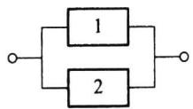

（3）5个元件组成的桥式系统 $S _ { 3 }$

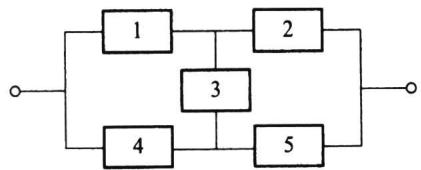

解设 $S _ { i } = { } ^ { \ast }$ 第i个系统正常工作” $A _ { i } = "$ 第i个元件正常工作”.

（1）对串联系统而言，“系统正常工作”相当于“所有元件正常工作”，即 $S _ { 1 } = A _ { 1 } A _ { 2 }$ ，所以

$$
P ( S _ { \mathrm { \scriptscriptstyle 1 } } ) = P ( A _ { \mathrm { \scriptscriptstyle 1 } } A _ { \mathrm { \scriptscriptstyle 2 } } ) = P ( A _ { \mathrm { \scriptscriptstyle 1 } } ) P ( A _ { \mathrm { \scriptscriptstyle 2 } } ) = p ^ { 2 } = 0 . 8 1 .
$$

这也可看出：两个正常工作概率为0.9的元件组成的串联系统，其系统正常工作的概率下降为0.81.

（2）对并联系统而言，“系统正常工作"相当于“至少一个元件正常工作”，即 $S _ { 2 } =$ $A _ { 1 } \cup A _ { 2 }$ ，所以

$$
P ( S _ { 2 } ) = P ( A _ { 1 } \cup A _ { 2 } ) = P ( A _ { 1 } ) + P ( A _ { 2 } ) - P ( A _ { 1 } A _ { 2 } ) = p + p - p ^ { 2 } = 0 . 9 9 .
$$

或

$$
\begin{array} { l } { P ( S _ { 2 } ) = 1 - P ( \overline { { S } } _ { 2 } ) = 1 - P ( \overline { { A _ { 1 } \cup A _ { 2 } } } ) = 1 - P ( \overline { { A } } _ { 1 } \cap \overline { { A } } _ { 2 } ) } \\ { \qquad } \\ { = 1 - P ( \overline { { A } } _ { 1 } ) P ( \overline { { A } } _ { 2 } ) = 1 - ( 1 - p ) ^ { 2 } = 0 . 9 9 . } \end{array}
$$

这也可看出：两个正常工作概率为0.9的元件组成的并联系统，其系统正常工作的概率提高至0.99.

（3）在桥式系统中，第3个元件是关键，我们先用全概率公式得

$$
P ( S _ { 3 } ) = P ( A _ { 3 } ) P ( S _ { 3 } \mid A _ { 3 } ) + P ( \overline { { { A } } } _ { 3 } ) P ( S _ { 3 } \mid \overline { { { A } } } _ { 3 } ) .
$$

因为在“第3个元件正常工作”的条件下，系统成为先并后串系统(见图1.5.1).所以

$$
{ \begin{array} { r l } & { P ( S _ { 3 } \mid A _ { 3 } ) = P ( ( A _ { 1 } \cup A _ { 4 } ) ( A _ { 2 } \cup A _ { 5 } ) ) = P ( A _ { 1 } \cup A _ { 4 } ) P ( A _ { 2 } \cup A _ { 5 } ) } \\ & { } \\ & { \qquad = { \bigl [ } 1 - ( 1 - p ) ^ { 2 } { \bigr ] } ^ { 2 } = 0 . 9 8 0 \ 1 . } \end{array} }
$$

又因为在“第3个元件不正常工作”的条件下，系统成为先串后并系统（见图1.5.2).所以

$$
P ( S _ { 3 } \mid \overline { { { A } } } _ { 3 } ) = P ( A _ { 1 } A _ { 2 } \cup A _ { 4 } A _ { 5 } ) = 1 - ( 1 - p ^ { 2 } ) ^ { 2 } = 0 . 9 6 3 9 .
$$

图1.5.1先并后串系统

图1.5.2先串后并系统

最后我们得

$$
\begin{array} { l } { { P ( S _ { 3 } ) = p [ 1 - ( 1 - p ) ^ { 2 } ] ^ { 2 } + ( 1 - p ) [ 1 - ( 1 - p ^ { 2 } ) ^ { 2 } ] } } \\ { { \qquad = 0 . 9 \times 0 . 9 8 0 1 + 0 . 1 \times 0 . 9 6 3 9 = 0 . 9 7 8 5 . } } \end{array}
$$

## 1.5.3试验的独立性

利用事件的独立性可以定义两个或更多个试验的独立性.

定义1.5.4设有两个试验 $E _ { \parallel }$ 和 $E _ { 2 }$ ,假如试验 $E _ { \scriptscriptstyle 1 }$ 的任一结果(事件)与试验 $E _ { \scriptscriptstyle 2 }$ 的任一结果(事件)都是相互独立的事件，则称这两个试验相互独立.

例如掷一枚硬币（试验 $E _ { \scriptscriptstyle 1 } )$ 与掷一颗骰子（试验 $E _ { 2 } )$ 是相互独立的试验.

类似地可以定义n个试验 $E _ { \scriptscriptstyle 1 } , E _ { \scriptscriptstyle 2 } , \cdots , E _ { \scriptscriptstyle n }$ 的相互独立性：如果 $E _ { \mathrm { \ell } }$ 的任一结果、 $E _ { 2 }$ 的任一结果、…、 $E _ { n }$ 的任一结果都是相互独立的事件，则称试验 $E _ { \scriptscriptstyle 1 }$ ，$E _ { 2 } , \cdots , E _ { n }$ 相互独立.如果这n个独立试验还是相同的，则称其为n重独立重复试验.如果在n重独立重复试验中，每次试验的可能结果为两个：A或 $\overset { \_ } { A }$ ，则称这种试验为n重伯努利（Bernoulli）试验.

例如掷n枚硬币、掷n颗骰子、检查n个产品等,都是n重独立重复试验.

例1.5.7 某彩票每周开奖一次，每次提供十万分之一的中奖机会，且各周开奖是相互独立的.若你每周买一张彩票,坚持十年(每年52周)之久，你从未中奖的可能性是多少？

解按假设,每次中奖的可能性是 $1 0 ^ { - 5 }$ ,于是每次不中奖的可能性是 $1 - 1 0 ^ { - 5 }$ 另外，十年中你共购买彩票520次，每次开奖都是相互独立的，相当于进行了520次独立重复试验.记 $A _ { i }$ 为“第i次开奖不中奖”， $i = 1 , 2 , \cdots , 5 2 0$ ，则 $A _ { 1 } , A _ { 2 } , \cdots , A _ { s 2 0 }$ 相互独立，由此得十年中你从未中奖的可能性是

$$
P ( A _ { 1 } A _ { 2 } ^ { ~ . . . } A _ { s 2 0 } ) = ( 1 ~ - ~ 1 0 ^ { - 5 } ) ^ { 5 2 0 } = 0 . 9 9 4 ~ 8 .
$$

这个概率表明十年中你从未中奖是很正常的事.

如果将上例中每次中奖机会改成“万分之一”,则十年中从未中奖的可能性还是很大的，为0.9493.

## 习题1.5

1.三人独立地破译一个密码，他们能单独译出的概率分别为1/5，1/4，1/3，求此密码被译出的概率.

2.有甲乙两批种子，发芽率分别为0.8和0.9，在两批种子中各任取一粒，求：

（1）两粒种子都能发芽的概率；

（2）至少有一粒种子能发芽的概率；

（3）恰好有一粒种子能发芽的概率.

3.甲、乙两人独立地对同一目标射击一次，其命中率分别为0.8和0.7，现已知目标被击中，求它

是甲射中的概率.

4.设电路由A，B，C三个元件组成，若元件A，B，C发生故障的概率分别是0.3，0.2，0.2，且各元件独立工作，试在以下情况下，求此电路发生故障的概率：

(1) $A , B , C \bar { = }$ 三个元件串联；

(2) $A , B , C$ 三个元件并联；

（3）元件A与两个并联的元件B及C串联.

5.在一周内甲，乙，丙三台机床需维修的概率分别是0.9，0.8和0.85，求一周内

（1）没有一台机床需要维修的概率；

（2）至少有一台机床不需要维修的概率；

（3）至多只有一台机床需要维修的概率.

6.设 $A _ { 1 } , A _ { 2 } , A _ { 3 }$ 相互独立，且 $P ( A _ { i } ) = 2 / 3 , i = 1 , 2 , 3 .$ 试求 $A _ { 1 } , A _ { 2 } , A _ { 3 }$ 中

（1）至少出现一个的概率；

（2）恰好出现一个的概率；

（3）最多出现一个的概率.

7.若事件A与B相互独立且互不相容，试求 $\operatorname* { m i n } { \left\{ P \left( A \right) , P \left( B \right) \right\} }$

8.假设 $P ( A ) = 0 . 4 , P ( A \cup B ) = 0 . 9$ ，在以下情况下求P（B）：

（1）A，B不相容；

（2）A，B独立；

(3) $A \subset B .$

9.设A，B，C两两独立，且 $A B C = \emptyset$

（1）如果 $P \left( A \right) = P \left( B \right) = P \left( C \right) = x$ ，试求x的最大值；

（2）如果 $P \left( A \right) = P \left( B \right) = P \left( C \right) < 1 / 2$ ，且 $P ( A \cup B \cup C ) = 9 / 1 6$ ，求P(A).

10.事件A,B独立，两个事件仅A发生的概率或仅B发生的概率都是1/4，求P(A)及P(B).

11.一实习生用同一台机器接连独立地制造3个同种零件，第i个零件是不合格品的概率为 $p _ { i } =$ $1 / \left( \boldsymbol { i } { + } 1 \right) , \boldsymbol { i } { = } 1 , 2 , 3$ ，以X表示3个零件中合格品的个数，求 $P \left( X { \leqslant } 2 \right)$

12.每门高射炮击中飞机的概率为0.3，独立同时射击时，要以99%的把握击中飞机，需要几门高射炮？

13.投掷一枚骰子，问需要投掷多少次，才能保证至少有一次出现点数为6的概率大于1/2？

14.一射手对同一目标独立地进行四次射击，若至少命中一次的概率为80/81，试求该射手进行一次射击的命中率.

15.每次射击命中率为0.5，试求：射击多少次才能使至少击中一次的概率不小于0.95？

16.设猎人在距离猎物100米处对猎物打第一枪，命中猎物的概率为0.5.若第一枪未命中，则猎人继续打第二枪，此时猎物与猎人已相距150米.若第二枪仍未命中，则猎人继续打第三枪，此时猎物与猎人已相距200米.若第三枪还未命中，则猎物逃脱.假如该猎人命中猎物的概率与距离成反比，试求该猎物被击中的概率.

17.某血库急需AB型血，要从身体合格的献血者中获得，根据经验，每百名身体合格的献血者 中只有2名是AB型血的.

（1）求在20名身体合格的献血者中至少有一人是AB型血的概率；

（2）若要以95%的把握至少能获得一份AB型血，需要多少位身体合格的献血者？

18.一个人的血型为A，B，AB，0型的概率分别为0.37，0.21,0.08,0.34.现任意挑选四个人，试求：

（1）此四人的血型全不相同的概率；

(2）此四人的血型全部相同的概率.

19.甲、乙两选手进行乒乓球单打比赛，已知在每局中甲胜的概率为0.6，乙胜的概率为0.4.比赛

可采用三局二胜制或五局三胜制，问哪一种比赛制度对甲更有利？

20.甲、乙、丙三人进行比赛，规定每局两个人比赛，胜者与第三人比赛，依次循环，直至有一人连胜两次为止，此人即为冠军.而每次比赛双方取胜的概率都是1/2，现假定甲、乙两人先比，试求各人得冠军的概率.

21.甲、乙两个赌徒在每一局获胜的概率都是1/2.两人约定谁先赢得一定的局数就获得全部赌本.但赌博在中途被打断了，请问在以下各种情况下，应如何合理分配赌本：

（1）甲、乙两个赌徒都各需赢k局才能获胜；

（2）甲赌徒还需赢2局才能获胜，乙赌徒还需贏3局才能获胜；

（3）甲赌徒还需贏n局才能获胜，乙赌徒还需赢m局才能获胜.

22.一辆重型货车去边远山区送货.修理工告诉司机，由于车上六个轮胎都是旧的，前面两个轮胎损坏的概率都是0.1，后面四个轮胎损坏的概率都是0.2.你能告诉司机，此车在途中因轮胎损坏而发生故障的概率是多少吗？

23.设 $0 { < } P ( B ) { < } 1$ ，试证事件A与B独立的充要条件是 $P ( A \mid B ) = P ( A \mid \overline { { B } } )$

24.设 $0 { < } P ( A | < 1 , 0 { < } P ( B ) { < } 1 , P ( A | B ) { + } P ( \overline { { A } } | \overline { { B } } ) = 1$ ，试证A与B独立.

25.若 $P ( A ) > 0 , P ( B ) > 0$ ，如果A,B相互独立,试证A,B相容.

本章小结

