## 第二章随机变量及其分布

为了进行定量的数学处理，必须把随机现象的结果数量化.这就是引进随机变量的原因.随机变量概念的引进使得对随机现象的处理更简单与直接，也更统一而有力.本章我们将主要讨论一维随机变量及其分布.

## 2.1随机变量及其分布

在第一章中我们曾提及随机变量，在那里我们把“用来表示随机现象结果的变量”称为随机变量，其中“表示”一词的含义是什么？这是要进一步探讨的问题.

## 2.1.1随机变量的概念

在随机现象中有很多样本点本身就是用数量表示的，由于样本点出现的随机性，其数量呈现为随机变量，譬如

·掷一颗骰子，出现的点数X是一个随机变量.

·每天进人某超市的顾客数Y,顾客购买商品的件数U，顾客排队等候付款的时间V,这里Y,U,V是三个不同的随机变量.

·电视机的寿命T是一个随机变量.

·测量的误差ε是一个随机变量.

在随机现象中还有不少样本点本身不是数，这时可根据研究需要设置随机变量，譬如

·检查一个产品，只考察其合格与否，则其样本空间为Ω={合格品，不合格品}.这时可设置一个随机变量X如下：

<table><tr><td>样本点</td><td>X的取值</td></tr><tr><td>合格品</td><td>0</td></tr><tr><td>不合格品</td><td>1</td></tr></table>

在此X就是“检查一个产品中不合格品数”，它仅可能取值0与1.若此种产品的不合格品率为p,则X取各种值及其概率可列表如下：

<table><tr><td>X</td><td>0</td><td>1</td></tr><tr><td>P</td><td>1-p</td><td>P</td></tr></table>

·检查三个产品，则有8个样本点，若记X为“三个产品中的不合格品数”，则X的取值与样本点之间有如下对应关系：

<table><tr><td>样本点</td><td>X的取值</td><td></td></tr><tr><td>ω=（0,0,0）</td><td></td><td>0</td></tr><tr><td>w=（1,0,0）</td><td></td><td>1</td></tr><tr><td>ω=(0,1,0）</td><td>1</td><td>1</td></tr><tr><td>ω=(0,0,1)</td><td></td><td>1</td></tr><tr><td>ωs=(0,1,1）</td><td></td><td>2</td></tr><tr><td>ω6=(1,0,1）</td><td></td><td>2</td></tr><tr><td>ω,=(1,1,0）</td><td></td><td>2</td></tr><tr><td>ωg=（1,1,1）</td><td></td><td>3</td></tr></table>

这样X取各种值就是如下的互不相容的事件：

$$
\begin{array} { l l } { { \left\{ X = 0 \right\} = \left\{ \omega _ { 1 } \right\} , } } & { { \left\{ X = 1 \right\} = \left\{ \omega _ { 2 } , \omega _ { 3 } , \omega _ { 4 } \right\} , } } \\ { { \left\{ X = 2 \right\} = \left\{ \omega _ { 5 } , \omega _ { 6 } , \omega _ { 7 } \right\} , } } & { { \left\{ X = 3 \right\} = \left\{ \omega _ { 8 } \right\} . } } \end{array}
$$

若此种产品的不合格品率为p,则X取各种值的概率可列表如下：

<table><tr><td>X</td><td>0</td><td>1</td><td>2</td><td>3</td></tr><tr><td>P</td><td>(1-p)</td><td>3p(1-p)²</td><td>3p²（1-p）</td><td>p</td></tr></table>

下面我们给出随机变量的一般定义.

定义 2.1.1 定义在样本空间Ω上的实值函数 $X = X ( \omega )$ 称为随机变量,常用大写字母 $X , Y , Z$ 等表示随机变量，其取值用小写字母 $x , y , z$ 等表示.

假如一个随机变量仅可能取有限个或可列个值，则称其为离散随机变量.假如一个随机变量的可能取值充满数轴上的一个区间 $( a , b )$ ,则称其为连续随机变量,其中a可以是-∞，b可以是∞.

这个定义表明：随机变量X是样本点ω的一个函数，这个函数可以是不同样本点对应不同的实数，也允许多个样本点对应同一个实数.这个函数的自变量（样本点）可以是数，也可以不是数，但因变量一定是实数.

与微积分中的变量不同，概率论中的随机变量X是一种“随机取值的变量且伴随一定的概率”.以离散随机变量为例，我们不仅要知道X可能取哪些值，而且还要知道它取这些值的概率各是多少，这就需要分布的概念.有没有分布是区分一般变量与随机变量的主要标志.

## 2.1.2随机变量的分布函数

随机变量X是样本点ω的一个实值函数，若B是某些 实数组成的集合，即 $B \subset \mathbf { R }$ R表示实数集，则 $\left\{ X \in B \right\}$ 表示如下的随机事件

$$
\left\{ \omega : X ( \omega ) \ \in { \cal B } \right\} \subset \Omega .
$$

特别，用等号或不等号把随机变量X与某些实数连接起来，用来表示事件.如 $\left\{ X \leqslant a \right\}$ $\{ X > b \}$ 和 $\scriptstyle { \left\{ \ a < X < b \right\} }$ 都是随机事件.具体有

·记X表示掷一颗骰子出现的点数，则X的可能取值为1,2,,6.这是一个离散随机变量.事件 $A = "$ 点数小于等于 $3 ^ { \prime \prime }$ ，可以表示为 $A = \left\{ X \leqslant 3 \right\}$

·记Y表示一天内到达某商场的顾客数，则Y的可能取值为 $0 , 1 , 2 , \cdots , n , \cdots$ .这也是一个离散随机变量.事件 $B = ^ { * }$ 至少来1000位顾客”，可以表示为 $B = \left\{ \begin{array} { l l }  Y \geqslant 1 \ 0 0 0 \ \right\} \ \quad \end{array}$

·记T表示某种电器产品的使用寿命，则T的可能取值充满区间 $[ 0 , \infty )$ .这是一  
个连续随机变量.事件 $C = { } ^ { \ast }$ 使用寿命在40000至50000小时之间”，可以表示为 $C =$   
$\{ 4 0 \ 0 0 0 { \leqslant } T { \leqslant } 5 0 \ 0 0 0 \}$ 八

为了掌握X的统计规律性，我们只要掌握X取各种值的概率.由于连

$$
\left\{ a < X \leqslant b \right\} = \left\{ X \leqslant b \right\} - \left\{ X \leqslant a \right\} ,
$$

$$
\left\{ X > c \right\} = \Omega - \left\{ X \leqslant c \right\} ,
$$

因此只要对任意实数x，知道了事件 $\boxed { X \leqslant x } .$ 的概率就 $\textcircled { 4 } \textcircled { > } \pi$ ，这个概率具有累积特性，常用F表示.另外这个概率与x有关，不同的x,此累积概率的值也不同，为此记 $\underline { { \underline { { F } } } }$

$$
F ( x ) = P ( X \leqslant x ) ,
$$

于是 $F ( x )$ 对所有 $x \in \left( { - \infty \mathrm { ~ , ~ } \infty } \right)$ 都有定义，因而 $F ( x )$ 是定义在 $( - \infty , \infty )$ 上、取值于[0,1]的一个函数.这就是我们下面要引人的分布函数.

定义 2.1.2 设X是一个随机变量，对任意实数x，称

$$
F ( x ) = P ( X \leqslant x )\tag{2.1.1}
$$

为随机变量X的分布函数.且称 $X \not \in \mathbb { A } \mathbb { R } \not \Join$ ，记为 $X \sim F ( x )$ .有时也可用 $F _ { \chi } ( x )$ 以表明是X的分布函数(把X写成F的下标）.

例2.1.1向半径为r的圆内随机抛一点，求此点到圆心之距离X的分布函数$F ( x )$ ，并求 $P \left( X > \frac { 2 r } { 3 } \right)$

解事件 $\mathbf { \boldsymbol { \cdot } } \mathbf { \boldsymbol { X } } \leqslant x \mathbf { \boldsymbol { \cdot } }$ 表示所抛之点落在半径为 $x \ ( \ 0 \leqslant x \leqslant r )$ 的圆内，故由 $\Re ( \sqrt { \mathbb { H } } ) + \Re ( - 3 ) =$ 知

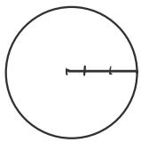

$$
F ( x ) = P ( X \leqslant x ) = { \frac { \pi x ^ { 2 } } { \pi r ^ { 2 } } } = \left( { \frac { x } { r } } \right) ^ { 2 } ,
$$

而当 $x < 0$ 时,有 $F ( x ) = 0$ ；;当x>r时，有 $F ( x ) = 1$

从而

$$
P \Big ( X > \frac { 2 r } { 3 } \Big ) = 1 - P \Big ( X \leqslant \frac { 2 r } { 3 } \Big ) = 1 - F \Big ( \frac { 2 r } { 3 } \Big ) = 1 - \Big ( \frac { 2 } { 3 } \Big ) ^ { 2 } = \frac { 5 } { 9 } .
$$

从分布函数的定义可见，任一随机变量X（离散的或连续的)都有一个分布函数.有了分布函数，就可据此算得与随机变量X有关事件的概率.下面先证明分布函数的三个基本性质

定理2.1.1 任一分布函数 $F ( x )$ 都具有如下三条基本性质：

（1）单调性 $F ( x )$ 是定义在整个实数轴 $( - \infty , \infty )$ 上的单调非减函数，即对任意的 $x _ { 1 } < x _ { 2 }$ ，有 $F ( x _ { 1 } ) \leqslant F ( x _ { 2 } )$

（2）有界性 对任意的x,有 $0 \leqslant F ( x ) \leqslant 1$ ，且

$$
F ( \mathbf { \partial } - \infty ) = \operatorname* { l i m } _ { x  \mathbf { \partial } \infty } F ( x ) = 0 ,
$$

$$
F ( \infty ) = \operatorname* { l i m } _ { x  \infty } F ( x ) = 1 .
$$

（3）右连续性 $F ( x )$ 是x的右连续函数,即对任意的 $x _ { 0 }$ ，有

$$
\operatorname * { l i m } _ { x  x _ { 0 } + 0 } F ( x ) = F ( x _ { 0 } ) ,
$$

即

$$
F ( x _ { 0 } \mathrm { ~ + ~ } 0 ) = F ( x _ { 0 } ) .
$$

卡六使用 证明 （1)是显然的，下证(2）.由于 $F \left( x \right)$ 是事件 $\left\{ X \leqslant x \right\}$ 的概率，所以 $0 \leqslant$ $F ( x ) \overline { { \leqslant 1 } }$ 由F(x)的单调性知,对任意整数m和n,有、

海理定理与推论

$$
\operatorname* { l i m } _ { x  - \infty } F ( x ) = \operatorname* { l i m } _ { m  - \infty } F ( m ) , \ : \ : \ : \ : \ : \ : \operatorname * { l i m } _ { x  \infty } F ( x ) = \operatorname* { l i m } _ { n  \infty } F ( n )
$$

都存在.又由概率的可列可加性得

$$
\begin{array} { r l } {  { 1 = P ( \mathrm { \iota - ~ \infty ~ < ~ } X < \infty ) = P \big ( \underset { \mathrm { \iota ^ { = - \infty } ~ } } { \smile } \lbrace i - 1 < X \leqslant i \rbrace \big ) } } \\ & { = \underset { \mathrm { \iota ^ { = - \infty } } } { \overset { \circ } { \sum } } P ( i - 1 < X \leqslant i ) = \underset { \underset { m  \infty } { \operatorname* { l i m } } } { \operatorname* { l i m } } \underset { \mathrm { \iota ^ { = \infty } } } { \overset { \wedge } { \sum } } P ( i - 1 < X \leqslant i ) } \\ & { = \underset { \mathrm { \iota ^ { = \infty } } } { \operatorname* { l i m } } F ( n ) - \underset { m  \infty } { \operatorname* { l i m } } F ( m ) , } \end{array}
$$

由此可得

$$
\operatorname * { l i m } _ { x  - \infty } F ( x ) = 0 , \operatorname * { l i m } _ { x  \infty } F ( x ) = 1 .
$$

再证(3)，因为 $F ( x )$ 是单调有界非降函数，所以其任一点x。的右极限 $\scriptstyle { \mathfrak { x } } _ { 0 }$ $F ( x _ { 0 } + 0 )$ 必存在.为证右连续性,只要对任意单调下降的数列 $x _ { 1 } > x _ { 2 } > \cdots > x _ { n } > \cdots > x _ { 0 }$ ,当 $\begin{array} { r l } { x _ { n } \longrightarrow x _ { 0 } } & { { } ( n \longrightarrow \pmb { \mathscr { X } } ) } \end{array}$ $\infty )$ 时，证明 $\operatorname* { l i m } _ { n  \infty } F ( x _ { n } ) = F ( x _ { 0 } )$ 成立即可.因为

$$
\begin{array} { r l r } {  { F ( x _ { 1 } ) \ - F ( x _ { 0 } ) = P ( x _ { 0 } < X \leqslant x _ { 1 } ) = P \Big ( \bigcup _ { i = 1 } ^ { \infty } \ \{ x _ { i + 1 } \ < X \leqslant x _ { i } \} \Big ) } } \\ & { } & \\ & { } & { \ = \displaystyle \sum _ { i = 1 } ^ { \infty } P ( x _ { i + 1 } < X \leqslant x _ { i } ) = \displaystyle \sum _ { i = 1 } ^ { \infty } [ F ( x _ { i } ) \ - F ( x _ { i + 1 } ) ] } \\ & { } & \\ & { } & { = \displaystyle \operatorname* { l i m } _ { n \to \infty } [ F ( x _ { 1 } ) \ - F ( x _ { n } ) ] = F ( x _ { 1 } ) \ - \operatorname* { l i m } _ { n \to \infty } F ( x _ { n } ) , } \end{array}
$$

由此得

$$
F ( x _ { _ 0 } ) = \operatorname * { l i m } _ { n  \infty } F ( x _ { _ n } ) = F ( x _ { _ 0 } + 0 ) .
$$

至此三条基本性质全部得证.

以上三条基本性质是分布函数必须具有的性质，还可以证明：满足这三条基本性质的函数必定是某个随机变量的分布函数.从而这三条基本性质成为判别某个函数是否能成为分布函数的充要条件.

有了随机变量X的分布函数，那么有关X的各种事件的概率都能方便地用分布函数来表示了.例如，对任意的实数a与b,有

$$
\begin{array}{c} \begin{array} { r l } { \mathbb { H } \mathcal { H } \mathcal { K } \times \boldsymbol { u }  \boldsymbol { v } , \mathbb { H } } & { } \\ { P ( \boldsymbol { a } < \boldsymbol { X } \leqslant b ) = F ( \boldsymbol { b } ) - F ( \boldsymbol { a } ) , } & { } \\ { P ( \boldsymbol { X } = \boldsymbol { a } ) = F ( \boldsymbol { a } ) - F ( \boldsymbol { a } - \boldsymbol { 0 } ) , } \\ { P ( \boldsymbol { X } \geqslant \boldsymbol { b } ) = 1 - F ( \boldsymbol { b } - \boldsymbol { 0 } ) , } & { } \\ { P ( \boldsymbol { X } > \boldsymbol { b } ) = 1 - F ( \boldsymbol { b } ) , } \end{array} \qquad \begin{array} { r l } { \{ \mathbb { F } ( \boldsymbol { a } + \boldsymbol { 0 } ) = \mathbb { F } ( \boldsymbol { a } ) = 0  } \\ { \{ \mathbb { F } ( \boldsymbol { a } - \boldsymbol { \vartheta } ) = \mathbb { P } ( \boldsymbol { X } \times \boldsymbol { Z } )  } \\ {  } \\ {  \mathbb { F } ( \boldsymbol { a } - \boldsymbol { b } ) = \mathbb { F } ( \boldsymbol { Z } \times \boldsymbol { a } ) + \mathbb { H } ( \boldsymbol { a } - \boldsymbol { a } ) , } \\ {  } \\ { \mathbb { F } ( \boldsymbol { a } - \boldsymbol { b } ) = 1 - F ( \boldsymbol { b } ) , } \end{array}   \end{array}
$$

$$
P ( X < b ) = F ( b - 0 ) ,
$$

$$
P ( a < X < b ) = F ( b - 0 ) - F ( a ) ,
$$

$$
P ( a \leqslant X \leqslant b ) = F ( b ) - F ( a - 0 ) ,
$$

$$
P ( a \leqslant X < b ) = F ( b - 0 ) - F ( a - 0 ) .
$$

特别当 $\boldsymbol { F } ( \boldsymbol { x } )$ 在a与b处连续时，有 它w

左连续 $F ( a - 0 ) = F ( a ) , F ( b - 0 ) = F ( b ) , \Longrightarrow \operatorname { P } ( \times = a ) = \ P ( x = b ) = 0$

这些公式将会在今后的概率计算中经常遇到.

例2.1.2设有一反正切函数

$$
F \left( \ x \right) = \frac { 1 } { \pi } \left( \arctan x + \frac { \pi } { 2 } \right) \ , - \infty \ < x < \infty \ .
$$

它在整个数轴上是连续 严格单调增函数，且$F ( \infty ) = 1 , F ( - \infty ) = 0 .$ 由于此 $\boldsymbol { F } ( \boldsymbol { x } )$ 满足分布函数的三条基本性质，故 $F ( x )$ 是一个分布函数.称这个分布函数为柯西分布函数，其图形见图2.1.1.

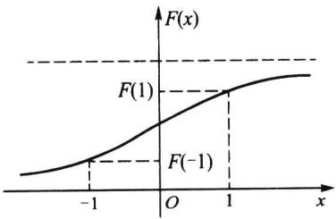  
图2.1.1柯西分布函数

若X服从柯西分布，则

$$
P ( - 1 \leqslant X \leqslant 1 ) = F ( \ 1 ) - F ( - 1 ) = { \frac { 1 } { \pi } } { \Bigl [ } \arctan ( \ 1 ) - \arctan ( \ - 1 ) \ { \Bigl ] } = { \frac { 1 } { \pi } } { \Bigl [ } \ { \frac { \pi } { 4 } } - \left( - { \frac { \pi } { 4 } } \right) { \Bigr ] } \ = { \frac { 1 } { 2 } } .
$$

## 2.1.3离散随机变量的概率分布列

对离散随机变量而言，常用以下定义的分布列来表示其分布.

定义 2.1.3 设X是一个离散随机变量，如果X的所有可能取值是 $x _ { 1 } , x _ { 2 } , \cdots$ $x _ { n } , \cdots$ ，则称X取 $x _ { i }$ 的概率

$$
p _ { i } = p \big ( \boldsymbol { x } _ { i } \big ) = P \big ( \boldsymbol { X } = \boldsymbol { x } _ { i } \big ) , i = 1 , 2 , \cdots , n , \cdots\tag{2.1.2}
$$

为X的概率分布列或简称为分布列,记为 $X \sim \{ p _ { i } \}$

分布列也可用如下列表方式来表示：

<table><tr><td>X</td><td>x</td><td>x</td><td></td><td>xn …</td></tr><tr><td>P</td><td>p(x）</td><td>p（x） ：</td><td>p(x）</td><td>…</td></tr></table>

或记成

$$
\left( \begin{array} { l l l l l } { x _ { 1 } } & { x _ { 2 } } & { \cdots } & { x _ { n } } & { \cdots } \\ { p ( x _ { 1 } ) } & { p ( x _ { 2 } ) } & { \cdots } & { p ( x _ { n } ) } & { \cdots } \end{array} \right)
$$

第一章中我们已见过多个分布列，不同的离散随机变量可能有不同的分布列，甚至在一个样本空间上可以定义几个服从不同分布列的随机变量，这要看我们的研究需要，下面就是在同一样本空间上给出几个不同随机变量的具体例子.

例2.1.3掷两颗骰子,其样本空间Ω含有36个等可能的样本点

$$
\varOmega = \left\{ \left( x , y \right) : x , y = 1 , 2 , \cdots , 6 \right\} .
$$

在Ω上定义如下3个随机变量X，Y和Z：

·X为点数之和,其可能取值为2,3,,12等共11个值,其定义见图2.1.2(a).

·Y为6点的骰子个数，其可能取值为0,1,2等共3个值，其定义见图2.1.2（b).

·Z为最大点数,其可能取值为1,2,,6等共6个值,其定义见图2.1.2(c).

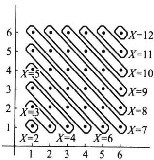  
(a)点数之和X的定义

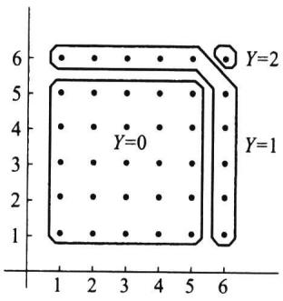  
(b)6点的个数Y的定义

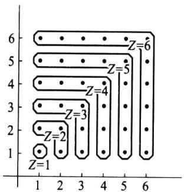  
(c)最大点数Z的定义  
图2.1.2同一样本空间上不同随机变量

这三个随机变量的分布列可用古典方法算得如下：
<table><tr><td>X</td><td>2</td><td>3</td><td>4</td><td>5</td><td>6</td><td>7</td><td>8</td><td>9</td><td>10</td><td>11</td><td>12</td></tr><tr><td rowspan="3">P</td><td>1</td><td>2</td><td>3</td><td>4</td><td>5</td><td>6</td><td>5</td><td>4</td><td>3</td><td>2</td><td>1</td></tr><tr><td>36</td><td>36</td><td>36</td><td>36</td><td>36</td><td>36</td><td>36</td><td>36</td><td>36</td><td>36</td><td>36</td></tr><tr><td>0</td><td>1</td><td>2</td><td></td><td></td><td></td><td></td><td></td><td></td><td></td><td></td></tr><tr><td>Y P</td><td>25</td><td>10</td><td>1</td><td></td><td></td><td></td><td></td><td></td><td></td><td></td><td></td></tr><tr><td></td><td>36</td><td>36</td><td>36</td><td></td><td></td><td></td><td></td><td></td><td></td><td></td><td></td></tr><tr><td>Z</td><td>1</td><td>2</td><td>3</td><td>4</td><td>5</td><td>6</td><td></td><td></td><td></td><td></td><td></td></tr><tr><td rowspan="2">P</td><td></td><td>3</td><td>5</td><td>7</td><td></td><td></td><td></td><td></td><td></td><td></td><td></td></tr><tr><td>1 36</td><td>36</td><td>36</td><td>36</td><td>9 36</td><td>11 36</td><td></td><td></td><td></td><td></td><td></td></tr></table>

类似地,还可以在这个样本空间上定义其他的离散随机变量.

性质2.1.1 分布列的基本性质

(1） 非负性 $p ( \left. x _ { i } \right) \geqslant 0 , i = 1 , 2 , \cdots .$

(2） 正则性 $\sum _ { i \ : = 1 } ^ { \infty } p \big ( \boldsymbol { x } _ { i } \big ) = 1 .$

以上两条基本性质是分布列必须具有的性质，也是判别某个数列是否能成为分布列的充要条件．

由离散随机变量X的分布列很容易写出X的分布函数

$$
F ( x ) = \sum _ { x _ { i } \leqslant x } p \big ( x _ { i } \big ) .
$$

它的图形是有限级（或可列无穷级）的阶梯函数具体见下面的例子.不过在离散场合常用来描述其分布的是分布列，很少用到分布函数.因为求离散随机变量X的有关事件的概率时，用分布列比用分布函数来得更方便.

例2.1.4设离散随机变量X的分布列为
<table><tr><td>X</td><td>-1</td><td>2</td><td>3</td></tr><tr><td>P</td><td>0.25</td><td>0.5</td><td>0.25</td></tr></table>

试求 $P ( X \leq 0 . 5 ) , P ( 1 . 5 < X \leq 2 . 5 )$ ,并写出X的分布函数.

解

$$
P ( X \leqslant 0 . 5 ) = P ( X = - \ 1 ) = 0 . 2 5 ,
$$

$$
F ( x ) = \left\{ \begin{array} { l l } { 0 , } & { x < - 1 , } \\ { 0 . 2 5 , } & { - 1 \leqslant x < 2 , } \\ { 0 . 7 5 , } & { 2 \leqslant x < 3 , } \\ { 1 , } & { x \geqslant 3 . } \end{array} \right.
$$

$F ( x )$ 的图形如图2.1.3所示，它是一条阶梯形的曲线，在X的可能取值-1,2,3处有右连续的跳跃点，其跳跃度分别为X在其可能取值点的概率：0.25,0.5,0.25.

特别，常量c可看作仅取一个值的随机变量X，即

$$
P ( X = c ) = 1 .
$$

这个分布常称为单点分布或退化分布，它的分布函数是

$$
F ( x ) = \int \limits _ { 1 } ^ { 0 } \frac { x < c } { 1 } p ( x \leq x )\tag{2.1.3}
$$

其图形如图2.1.4所示.

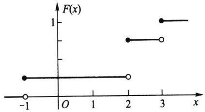

右逆续

图2.1.3离散随机变量的分布函数  
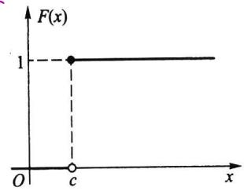  
图2.1.4单点分布函数

以下例子说明：在具体求离散随机变量X的分布列时,关键是求出X的所有可能取值及取这些值的概率.

例2.1.5一汽车沿一街道行驶，需要经过3个设有红绿信号灯的路口，若设每个信号灯显示红绿两种信号的时间相等，且各个信号灯工作相互独立.以X表示该汽车首次遇到红灯前已通过的路口数.试求X的概率分布列.

解由题设可知,X的可能取值为0,1,2,3.又记 $A _ { i } = "$ 汽车在第i个路口遇到红灯”， $i = 1 , 2 , 3 .$ 因为 $A _ { 1 } , A _ { 2 } , A _ { 3 }$ 相互独立，且

$$
P ( A _ { i } ) = P ( \overline { { { A } } } _ { i } ) = \frac { 1 } { 2 } , \quad i = 1 , 2 , 3 .
$$

所以得

$$
P ( X = 0 ) = P ( A _ { 1 } ) = \frac { 1 } { 2 } ,
$$

$$
P ( X = 1 ) = P ( \overline { { A } } _ { 1 } A _ { 2 } ) = P ( \overline { { A } } _ { 1 } ) P ( A _ { 2 } ) = \frac { 1 } { 4 } ,
$$

$$
P ( X = 2 ) = P ( \overline { { A } } _ { 1 } \overline { { A } } _ { 2 } A _ { 3 } ) = P ( \overline { { A } } _ { 1 } ) P ( \overline { { A } } _ { 2 } ) P ( A _ { 3 } ) = \frac { 1 } { 8 } ,
$$

$$
P ( X = 3 ) = P ( \overline { { A } } _ { 1 } \overline { { A } } _ { 2 } \overline { { A } } _ { 3 } ) = P ( \overline { { A } } _ { 1 } ) P ( \overline { { A } } _ { 2 } ) P ( \overline { { A } } _ { 3 } ) = \frac { 1 } { 8 } ,
$$

故X的分布列如下：

<table><tr><td>X</td><td>0 1</td><td>2</td><td>3</td></tr><tr><td>P</td><td>1/2 1/4</td><td>1/8</td><td>1/8</td></tr></table>

## 2.1.4连续随机变量的概率密度函数

前面我们从直观上描述了连续随机变量：一切可能取值充满某个区间 $( a , b )$ ，而在这个区间内有无穷不可列个实数，因此这类随机变量的概率分布不能再用分布列形式表示，而要改用概率密度函数表示.下面用一个例子来分析概率密度函数的由来.

例2.1.6加工机械轴的直径的测量值X是一个随机变量.若我们一个接一个地测量轴的直径，把测量值x一个接一个地放到数轴上去，当累积很多测量值x时，就形成一定的图形.为了使这个图形得以稳定，我们把纵轴由“单位长度上的频数"改为“单位长度上的频率”.由于频率的稳定性，随着测量值x的个数越多和单位长度越小，这个图形就越稳定，其外形就显现出一条光滑曲线(见图2.1.5（a））.这时，这条曲线的纵坐标已是“单位长度上的概率”，当单位长度趋于0时，其纵坐标就是“一点上的概率密度”.这时，这条曲线所表示的函数p(x)称为概率密度函数，它表示出X“在一些地方 $p \left( x \right)$ $X ^ { \ast }$ （如中部)取值的机会大，在另一些地方(如两侧)取值机会小"的一种统计规律性.概率密度函数p(x)有多种形式，有的位置不同，有的散布不同，有的形状不同（见图2.1.5 $p ( x )$ （b)）.这正反映了不同随机变量的取值在统计规律性上的差别.

概率密度函数 $p ( x )$ 的值虽不是概率，但乘微分元dx就可得小区间 $( { \boldsymbol { x } } , { \boldsymbol { x } } { + } \mathrm { d } { \boldsymbol { x } } )$ 上概率的近似值，即

$$
p \left( x \right) \mathrm { d } x \approx P \left( x { < } X { < } x { + } \mathrm { d } x \right) .
$$

在 $( a , b )$ 上很多相邻的微分元的累积就得到 $p ( x )$ 在 $( a , b )$ 上的积分，这个积分值不是别的，就是X在 $( a , b )$ 上取值的概率，即

$$
\int _ { a } ^ { b } p \big ( x \big ) \mathrm { d } x = P \big ( a < X < b \big ) .
$$

特别，在 $\left( \mathbf { \nabla } - \infty \mathbf { \nabla } , x \right]$ 上 $p ( x )$ 的积分就是分布函数 $F ( x )$ ，即

$$
\int _ { - \infty } ^ { x } p \ d ( t ) \mathrm { d } t = P ( X \leqslant x ) = F ( x ) .
$$

这一关系式是连续随机变量X的概率密度函数p(x)最本质的属性.这一切运算成为可 $p ( x )$ 能还要求 $p ( x )$ x)是非负可积函数.综上所述，可得概率密度函数p(x)的如下严格定义. $p ( x )$

定义2.1.4设随机变量X的分布函数为 $F ( x )$ ,如果存在实数轴上的一个非负可积函数 $p ( x )$ ,使得对任意实数x有

$$
F \left( x \right) = \int _ { - \infty } ^ { x } p \left( t \right) \mathrm { d } t ,\tag{2.1.4}
$$

则称p(x)为X的概率密度函数，简称为密度函数或密度.同时称X为连续随机变量，称 $p ( x )$ $F ( x )$ 为连续分布函数.

至此我们完成了连续随机变量及其分布的定义.从(2.1.4)式还可以看出，在 $F ( x )$ 导数存在的点上有

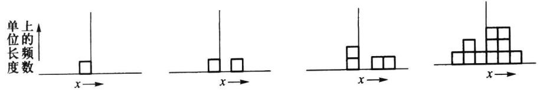

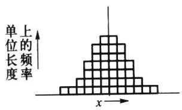

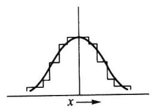

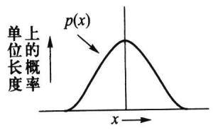  
(a)概率密度函数p(x)的形成过程

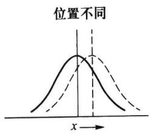

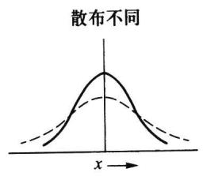  
(b)概率密度函数p(x)的不同形状

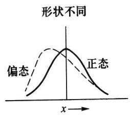  
图2.1.5

$$
F ^ { \prime } ( x ) = p ( x ) .\tag{2.1.5}
$$

F(x)是（累积)概率函数，其导函数 $F ^ { \prime } ( x )$ 是概率密度函数，由此可看出 $p ( x )$ 被称为概率密度函数的理由.

由（2.1.5)式，可从分布函数求得密度函数.譬如例2.1.2给出的柯西分布函数处处可导，故柯西分布的密度函数为

$$
p \left( x \right) = \frac { 1 } { \pi } \frac { 1 } { 1 + x ^ { 2 } } , - \infty < x < \infty .
$$

性质2.1.2密度函数的基本性质

（1）非负性 $p ( x ) \geqslant 0 .$

（2）正则性 $\int _ { - \infty } ^ { \infty } p \left( x \right) \mathrm { d } x = 1 .$ （含有p（x）的可积性）

以上两条基本性质是密度函数必须具有的性质，也是确定或判别某个函数是否成为密度函数的充要条件.譬如已知某个函数 $p ( x )$ 为密度函数，若 $p ( x )$ 中有一个待定常数，则可利用正则性 $\int _ { - \infty } ^ { \infty } p \left( x \right) \mathrm { d } x = 1$ 来确定该常数.

例2.1.7向区间 $( 0 , a )$ 上任意投点，用X表示这个点的坐标.设这个点落在 $( 0 , a )$ 中任一小区间的概率与这个小区间的长度成正比，而与小区间位置无关.求X的分布函数和密度函数.

解记X的分布函数为F（x），则

当 $x { < } 0$ 时,因为 $\left\{ X \leqslant x \right\}$ 是不可能事件，所以 $F ( { \boldsymbol { x } } ) = P ( { \boldsymbol { X } } \leqslant { \boldsymbol { x } } ) = 0$

(a)p(x）的图形

当 $x \geqslant a$ 时，因为 $\left\{ X \leqslant x \right\}$ 是必然事件，所以 $F ( { \boldsymbol { x } } ) = P ( { \boldsymbol { X } } \leqslant { \boldsymbol { x } } ) = 1$

当 $0 \leqslant x < a$ 时，有 $F ( \ x ) = P ( \ X \leqslant x ) = P ( 0 \leqslant X \leqslant x ) = k x$ ，其中k为比例系数.因为 $1 =$ $F ( a ) = k a$ ，所以得 $k = 1 / a$

于是X的分布函数为

$$
F ( x ) = \left\{ \frac { x } { a } , \ 0 \leqslant x < a , \right.
$$

下面求X的密度函数 $p ( x )$

当 $x < 0$ 或 $x > a$ 时 $p ( { \boldsymbol { x } } ) = F ^ { \prime } ( { \boldsymbol { x } } ) = 0$

当 $0 < x < a$ 时 $p ( x ) = F ^ { \prime } ( x ) = 1 / a$

而在x=0和x=a处,p(x)可取任意值，一般就近取值为宜，这不会影响概率（积 $x = 0$ ${ \boldsymbol { x } } = { \boldsymbol { a } }$ $\boldsymbol { \cdot } \boldsymbol { p } \left( \boldsymbol { x } \right)$ 分)的计算.于是X的密度函数为

$$
p ( \boldsymbol { x } ) = \left\{ \begin{array} { l l } { \displaystyle \frac { 1 } { a } , } & { \boldsymbol { 0 } < \boldsymbol { x } < a , } \\ { \boldsymbol { 0 } , } & { \mathrm { ~ } \# \# . } \end{array} \right.
$$

这个分布就是区间(0,a)上的均匀分布，记为 $U ( 0 , a )$ ，其密度函数 $p ( x )$ 和分布函数 $F ( x )$ 的图形见图2.1.6.

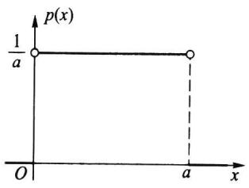

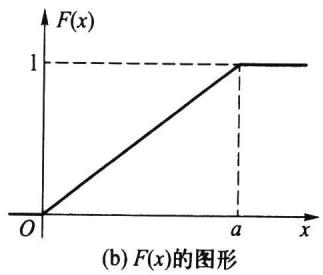  
图2.1.6（0,a)上的均匀分布

其实此例就是第一章中所说的几何概率，这也建立了几何概率与均匀分布的联系.  
下面我们再给出一些连续随机变量的例子.

例2.1.8某种型号电子元件的寿命X（以小时计)具有以下的概率密度函数

$$
p ( x ) = \{ { \begin{array} { l } { \displaystyle \frac { 1 \ 0 0 0 } { x ^ { 2 } } } , \ x \ > \ 1 \ 0 0 0 , } \\  0 , \quad \ \forall \mathrm { ~ } \mathrm { ~ } \mathrm { ~ } \mathrm { ~ } \mathrm { ~ } \mathrm { ~ } \mathrm { ~ } \mathrm { ~ } \mathrm { ~ } \mathrm { ~ } \quad \end{array}
$$

现有一大批此种元件（设各元件工作相互独立），问：

（1）任取1只，其寿命大于1500小时的概率是多少？

（2）任取4只,4只寿命都大于1500小时的概率是多少？

（3）任取4只，4只中至少有1只寿命大于1500小时的概率是多少？

（4）若已知一只元件的寿命大于1500小时，则该元件的寿命大于2000小时的概率是多少？

解先计算X的分布函数，

$$
F ( x ) = \int _ { 1 0 0 0 } ^ { x } p ( t ) \mathrm { d } t = - \frac { 1 0 0 0 } { t } \biggm | _ { 1 0 0 0 } ^ { x } = 1 - \frac { 1 0 0 0 } { x } , \quad x > 1 0 0 0 .
$$

(1） $P ( \mathrm { \cal { X } } > 1 5 0 0 ) = 1 - F ( 1 5 0 0 ) = 1 - \left( 1 - \frac { 2 } { 3 } \right) = \frac { 2 } { 3 } .$

（2）各元件工作独立，因此所求概率为

P（4只元件寿命都大于 $1 \ 5 0 0 ) = { \big [ } { P ( X > 1 \ 5 0 0 ) } { \big ] } ^ { 4 } = { \big [ } 1 - F ( 1 \ 5 0 0 ) { \big ] } ^ { 4 } = \left( { \frac { 2 } { 3 } } \right) ^ { 4 } = { \frac { 1 6 } { 8 1 } } .$

（3）所求概率为

$$
\begin{array} { r l } & { \quad P ( 4 \underset {  } { \boxplus } \frac { \ r \not \in \ r } { \boxplus } \frac { \ z } { \not \exists } \gamma \not \in 1 \underset {  } { \boxplus } \frac { \ z } { \not \boxplus } \frac { \ z } { \not \dotsc } \not \in 1 \ 5 0 0 ) } \\ & { = 1 - P ( 4 \underset {  } { \boxplus } \frac { \ r } { \dotsc } | 4 \not \equiv \frac { \ z } { \not \exists } \frac { \ z } { \not \equiv \not \equiv \not \ r } | \ r | \ r | \not \equiv \frac { \ z \not  \ r } { \not \exists } \mp 1 \ 5 0 0 ) } \\ & { = 1 - \big [ F ( 1 \ 5 0 0 ) \big ] ^ { 4 } } \\ & { = 1 - \bigg ( 1 - \frac { 2 } { 3 } \bigg ) ^ { 4 } = \frac { 8 0 } { 8 1 } . } \end{array}
$$

（4）这是求条件概率 $P ( \ X > 2 \ 0 0 0 \mid X > 1 \ 5 0 0 )$ ，记

$$
A = \left\{ X > 1 5 0 0 \right\} , B = \left\{ X > 2 0 0 0 \right\} .
$$

因为 $P ( A ) = 2 / 3 , P ( B ) = 1 / 2$ ，且 $B \subset A$ ，所以

$$
P ( B \mid A ) = { \frac { P ( A B ) } { P ( A ) } } = { \frac { P ( B ) } { P ( A ) } } = { \frac { 3 } { 4 } } .
$$

以下我们对密度函数与分布列的异同点作一些说明.

在离散随机变量场合，

$$
P ( a < X \leq b ) = \sum _ { a < x _ { i } \leqslant b } p \big ( x _ { i } \big ) ,
$$

其中诸 $x _ { i }$ 为X的可能取值.

而在连续随机变量场合，

$$
P ( a < X \leqslant b ) = \int _ { a } ^ { b } p \ d ( x ) \mathrm { d } x ,
$$

其含义为图2.1.7中区间(a,b]上的曲边梯形面积.

从这个意义上讲，概率密度函数与概率分布列所起的作用是类似的，但它们之间的差别也是明显的,具体有

（1）离散随机变量的分布函数 $F ( x )$ 总是右连续的阶梯函数，而连续随机变量的分布函数 $F ( x )$ 一定是整个数轴上的连续函数，前者已有明示，后者是因为对任意点x的增量△x，相应分布函数的 $\Delta x$ 增量总有

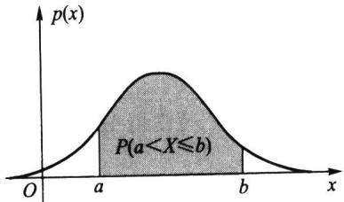  
图2.1.7连续随机变量场合的概率

$$
F ( x + \Delta x ) - F ( x ) = \int _ { x } ^ { x + \Delta x } p ( x ) { \mathrm { d } } x \longrightarrow 0 ( \Delta x \longrightarrow 0 ) .
$$

（2）离散随机变量X在其可能取值的点 $x _ { 1 } , x _ { 2 } , \cdots , x _ { n } , \cdots$ 上的概率不为0，而连续随机变量X在 $( - \infty , \infty )$ 上任一点a的概率恒为0,这是因为

$$
P ( X = a ) = \int _ { a } ^ { a } p ( x ) \mathrm { d } x = 0 .
$$

这表明：不可能事件的概率为0,但概率为0的事件（如 $P \left( X = a \right) = 0 )$ 不一定是不可能事件.类似地，必然事件的概率为1，但概率为1的事件不一定是必然事件.

（3）由于连续随机变量X仅取一点的概率恒为0,从而在事件 $\left\{ a \leqslant X \leqslant b \right\}$ 中剔去${ \boldsymbol { x } } = \mathbf { { \boldsymbol { a } } }$ 或剔去 $x = b$ ,不影响其概率，即

$$
P ( a \leqslant X \leqslant b ) = P ( a < X \leqslant b ) = P ( a \leqslant X < b ) = P ( a < X < b ) .
$$

这给计算带来很大方便.而这个性质在离散随机变量场合是不存在的，在离散随机变量场合计算概率要“点点计较”.

（4）由于在若干点上改变密度函数 $p ( x )$ 的值并不影响其积分的值,从而不影响其分布函数 $F ( x )$ 的值，这意味着一个连续分布的密度函数不唯一.譬如在例2.1.7中，改变 $x = 0$ 和 ${ \boldsymbol { x } } = { \boldsymbol { a } }$ 处 $p ( x )$ 的值如下：

$$
p _ { 1 } ( x ) = \left\{ \begin{array} { l l } { 1 / a , ~ 0 \leqslant x \leqslant a , } \\ { 0 , ~ \quad \ : \ : \mathrm { \# } \mathcal { M } \mathrm { \# } ; } \end{array} \right. \quad p _ { 2 } ( x ) = \left\{ \begin{array} { l l } { 1 / a , ~ 0 ~ < x ~ < ~ a , } \\ { 0 , ~ \quad \ \ : \mathrm { \# } \mathcal { M } \mathrm { \# } , } \end{array} \right.
$$

它们都是 $( 0 , a )$ 上均匀分布的密度函数.但仔细考察这两个函数 $p _ { 1 } ( x )$ 和 $p _ { 2 } ( x )$ ，可以发现

$$
P ( p _ { 1 } ( x ) \neq p _ { 2 } ( x ) ) = P ( X = 0 ) + P ( X = a ) = 0 .
$$

可见这两个函数在概率意义上是无差别的，在此称 $p _ { 1 } ( x )$ 与 $p _ { 2 } ( x ) ^ { \ast }$ 几乎处处相等”,其意义是：在概率论中可剔去概率为0的事件后讨论两个函数相等及其他随机问题.这就是概率论与微积分不同之处，也是概率论的魅力之处.

除了离散分布和连续分布之外，还有既非离散又非连续的分布，见下例.

例2.1.9以下的函数 $F ( x )$ 确是一个分布，它的图形如图2.1.8所示.

$$
F ( x ) = \left\{ \begin{array} { l l } { 0 , } & { x < 0 , } \\ { 1 + x } \\ { 2 } & { 0 \leqslant x < 1 , } \\ { 1 , } & { x \geqslant 1 . } \end{array} \right.
$$

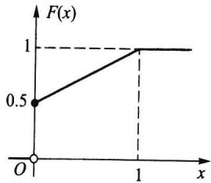

从图上可以看出：它既不是阶梯函数，又不是连续函数，所以它既非离散的又非连续的分布.它是新的一类分布，这

图2.1.8既非离散又非连续的分布函数示例

类分布函数 $F ( x )$ 常可分解为两个分布函数的凸组合，如例2.1.9中的分布函数可分解为

$$
F \left( x \right) = \frac { 1 } { 2 } F _ { \ast } \left( x \right) + \frac { 1 } { 2 } F _ { \ast } \left( x \right) ,
$$

其中

$$
F _ { 1 } ( x ) = \left\{ \begin{array} { l l } { 0 , } & { x < 0 } \\ { 1 , } & { x \geqslant 0 , } \end{array} \right. \quad F _ { 2 } ( x ) = \left\{ \begin{array} { l l } { 0 , } & { x < 0 , } \\ { x , } & { 0 \leqslant x < 1 , } \\ { 1 , } & { x \geqslant 1 . } \end{array} \right.
$$

而 $\boldsymbol { F } _ { 1 } ( \boldsymbol { x } )$ 是(离散)单点分布函数， $\boldsymbol { F } _ { 2 } ( \boldsymbol { x } )$ 是(连续)均匀分布 $U ( 0 , 1 )$ 的分布函数.

本书将不专门研究此类分布，只让大家知道山外有山，需要不断学习与研究.

## 习题2.1

1.口袋中有5个球，编号为1,2,3,4,5.从中任取3个，以X表示取出的3个球中的最大号码.

（1）试求X的分布列；

（2）写出X的分布函数，并作图.

2.一颗骰子抛两次，求以下随机变量的分布列：

（1）X表示两次所得的最小点数；

（2）Y表示两次所得的点数之差的绝对值.

3.□袋中有7个白球、3个黑球.

（1）每次从中任取一个不放回，求首次取出白球时的取球次数X的概率分布列；

（2）如果取出的是黑球则不放回，而另外放入一个白球，求此时X的概率分布列.

4.有3个盒子，第一个盒子装有1个白球、4个黑球；第二个盒子装有2个白球、3个黑球；第三个盒子装有3个白球、2个黑球.现任取一个盒子，从中任取3个球.以X表示所取到的白球数.

（1）试求X的概率分布列；

（2）取到的白球数不少于2个的概率是多少？

5.掷一颗骰子4次，求点数6出现的次数的概率分布.

6.从一副52张的扑克牌中任取5张，求其中黑桃张数的概率分布.

7.一批产品共有100件，其中10件是不合格品.根据验收规则，从中任取5件产品进行质量检验，假如5件中无不合格品，则这批产品被接收，否则就要重新对这批产品逐个检验.

（1）试求5件中不合格品数X的分布列；

（2）需要对这批产品进行逐个检验的概率是多少？

8.设随机变量X的分布函数为

$$
F ( x ) = \left\{ \begin{array} { l l } { 0 , } & { x < 0 , } \\ { 1 / 4 , } & { 0 \leqslant x < 1 , } \\ { 1 / 3 , } & { 1 \leqslant x < 3 , } \\ { 1 / 2 , } & { 3 \leqslant x < 6 , } \\ { 1 , } & { x \geqslant 6 . } \end{array} \right.
$$

试求X的概率分布列及 $P ( X < 3 ) , P ( X \leqslant 3 ) , P ( X > 1 ) , P ( X \geqslant 1 )$

9.设随机变量X的分布函数为

$$
F ( x ) = \left\{ \begin{array} { l l } { 0 , } & { x < 1 , } \\ { \ln { x } , } & { 1 \leqslant x < \mathrm { \bf { e } } , } \\ { 1 , } & { x \geqslant \mathrm { \bf { e } } . } \end{array} \right.
$$

试求 $P ( X < 2 ) , P ( 0 < X \leqslant 3 ) , P ( 2 < X < 2 . 5 )$

10.若 $P ( X \geqslant x _ { 1 } ) = 1 - \alpha , P ( X \leqslant x _ { 2 } ) = 1 - \beta$ ，其中 $\boldsymbol { x } _ { 1 } < \boldsymbol { x } _ { 2 }$ ，试求 $P ( x _ { 1 } < X < x _ { 2 } )$

11.从1,2,3,4,5五个数中任取三个，按大小排列记为 $\boldsymbol { x } _ { 1 } < \boldsymbol { x } _ { 2 } < \boldsymbol { x } _ { 3 }$ ，令 $X = x _ { 2 }$ ，试求：

（1）X的分布函数；

(2）P(X<2）及 $P \left( \ X > 4 \right)$

12.设随机变量X的密度函数为

$$
p \left( x \right) = \left\{ { \begin{array} { l l } { 1 - { \left| \begin{array} { l } { x  } , } & { -\right| 1 \leqslant x \leqslant 1 , } \\ { 0 , } & { \sharp \sharp . } \end{array} } \right. \ } \end{array}
$$

试求X的分布函数.

13.如果随机变量X的密度函数为

$$
\begin{array} { r l } { p ( x ) } & { = \left\{ \begin{array} { l l } { x , } & { 0 \leqslant x < 1 , } \\ { 2 - x , } & { 1 \leqslant x < 2 , } \\ { 0 , } & { \succeq \# \# . } \end{array} \right. } \end{array}
$$

试求 $P \left( \ X \leqslant 1 . 5 \right)$

14.设随机变量X的密度函数为

$$
\begin{array} { r l } { p \left( x \right) } & { = \left\{ \begin{array} { l l } { \displaystyle A \cos x , } & { \displaystyle \left| x \right| \leqslant \frac { \pi } { 2 } , } \\ { \displaystyle } \\ { 0 , } & { \displaystyle \left| x \right| > \frac { \pi } { 2 } . } \end{array} \right. } \end{array}
$$

试求：

（1）系数A；

（2）X落在区间 $( 0 , \pi / 4 )$ 内的概率.

15.设连续随机变量X的分布函数为

$$
\begin{array} { r l } { F ( x ) } & { = \left\{ \begin{array} { l l } { 0 , } & { x < 0 , } \\ { A x ^ { 2 } , } & { 0 \leqslant x < 1 , } \\ { 1 , } & { x \geqslant 1 . } \end{array} \right. } \end{array}
$$

试求：

（1）系数A；

（2）X落在区间(0.3,0.7）内的概率；

（3）X的密度函数.

16.学生完成一道作业的时间X是一个随机变量，单位为小时.它的密度函数为

$$
p \left( x \right) \ = \ \left\{ { { c x } ^ { 2 } } + x , 0 \leqslant x \leqslant 0 . 5 , \right.
$$

（1）确定常数c；

（2）写出X的分布函数；

（3）试求在20min内完成一道作业的概率；

（4）试求10min以上完成一道作业的概率.

17.某加油站每周补给一次油.如果这个加油站每周的销售量（单位：千升）为一随机变量，其密度函数为

$$
p \left( \begin{array} { l } { x } \end{array} \right) = \left\{ \begin{array} { l l } { 0 . 0 5 \bigg ( 1 - \frac { x } { 1 0 0 } \bigg ) ^ { 4 } , } & { 0 < x < 1 0 0 , } \\ { 0 , } & { \sharp \sharp \sharp . } \end{array} \right.
$$

试问该油站的储油罐需要多大，才能把一周内断油的概率控制在5%以下？

18.设随机变量X和Y同分布，X的密度函数为

$$
\begin{array} { r l } { p \left( x \right) } & { = \left\{ \displaystyle \frac { 3 } { 8 } x ^ { 2 } , 0 < x < 2 , \right. } \\ { 0 , } & { \quad \left. \sharp \displaystyle 4 \oplus . \right. } \end{array}
$$

已知事件 $A = \{ \begin{array} { r l } \end{array}  X { > } a \}$ 和 $B = \{ \ Y > a \}$ 独立，且 $P \left( { \cal A } \cup { \cal B } \right) = 3 / 4$ ，求常数a.

19.设连续随机变量X的密度函数p(x)是一个偶函数，F(x)为X的分布函数，求证对任意实数 $p \left( { \boldsymbol { x } } \right)$ $\boldsymbol { F } ( \boldsymbol { x } )$ $a > 0$ ，有

(1） $F ( \mathbf { \partial } - a \mathbf { \partial } ) \ = \ 1 \ - \ F ( a \mathbf { \partial } a ) \ = \ 0 . 5 \ - \int _ { 0 } ^ { a } p \left( \mathbf { \partial } x \right) \mathbf { d } x ;$

(2) $P ( \ | \ X | < a ) = 2 F ( a ) - 1$

(3) $P ( \ | \ X | > a ) = 2 { \bigl [ } \ 1 { - } F ( \ a ) { \bigr ] }$

## 2.2随机变量的数学期望

我们已经知道，每个随机变量都有一个分布（分布列、密度函数或分布函数），不同的随机变量可能拥有不同的分布，也可能拥有相同的分布.分布全面地描述了随机变量取值的统计规律性，由分布可以算出有关随机事件的概率.除此以外由分布还可以算得相应随机变量的均值、方差、分位数等特征数.这些特征数各从一个侧面描述了分布的特征.譬如，初生婴儿的体重是一个随机变量，其平均值就从一个侧面描述了体重的特征.已知随机变量的分布，如何求其均值，是本节需要研究的问题.

本节将介绍随机变量最重要的特征数：数学期望.

## 2.2.1数学期望的概念

“期望”在我们日常生活中常指心中期盼的愿望，而在概率论中，数学期望源于历史上一个著名的分赌本问题.

例2.2.1(分赌本问题）17世纪中叶，一位赌徒向法国数学家帕斯卡（Pascal，1623一1662)提出一个使他苦恼长久的分赌本问题：甲、乙两赌徒赌技不相上下，各出赌注50法郎，每局中无平局.他们约定，谁先贏三局，则得全部赌本100法郎.当甲赢了二局、乙赢了一局时，因故(国王召见)要中止赌博.现问这100法郎如何分才算公平？

这个问题引起了不少人的兴趣.首先大家都认识到：平均分对甲不公平，全部归甲对乙不公平.合理的分法是，按一定的比例，甲多分些，乙少分些.所以问题的焦点在于：按怎样的比例来分？以下有两种分法：

（1）甲得100法郎中的2/3,乙得100 法郎中的1/3.这是基于已赌局数：甲赢了二局、乙赢了一局.

（2）1654年帕斯卡提出如下的分法：设想再赌下去，则甲最终所得X为一个随机变量,其可能取值为0或100.再赌两局必可结束，其结果不外乎以下四种情况之一：

$$
\boxed { 1 } \boxed { 1 } , \boxed { 4 } \boxed { 2 } , \boxed { 4 } , \boxed { 2 } \boxed { 2 }
$$

其中“甲乙"表示第一局甲胜第二局乙胜.在这四种情况中有三种可使甲获100法郎，只有一种情况（乙乙）下甲获0法郎.因为赌技不相上下，所以甲获得100 法郎的可能性为3/4,获得0法郎的可能性为1/4,即X的分布列为

<table><tr><td>X</td><td>0</td><td>100</td></tr><tr><td>P</td><td>0.25</td><td>0.75</td></tr></table>

经上述分析，帕斯卡认为，甲的“期望”所得应为： $0 \times 0 . 2 5 + 1 0 0 \times 0 . 7 5 = 7 5 ( $ （法郎）.即甲得75法郎，乙得25法郎.这种分法不仅考虑了已赌局数，而且还包括了对再赌下去的一种“期望”，它比(1)的分法更为合理.

这就是数学期望这个名称的由来，其实这个名称称为“均值”更形象易懂.对上例而言，也就是再赌下去的话，甲“平均”可以赢75法郎.

现在我们来逐步分析如何由分布来求“均值”.

（1）算术平均如果有n个数 $x _ { 1 } , x _ { 2 } , \cdots , x _ { n }$ ,那么求这n个数的算术平均是很简单的事,只需将此n个数相加后除n即可.

（2）加权平均如果这n个数中有相同的,不妨设其中有ni个取值为 $n _ { i }$ $x _ { i } , i = 1$ 2,,k.将其列表为

<table><tr><td rowspan=1 colspan=1>取值</td><td rowspan=1 colspan=1> $x _ { 1 }$                   $x _ { 2 }$                                       $x _ { k }$ …</td></tr><tr><td rowspan=1 colspan=1>频数</td><td rowspan=1 colspan=1> $n _ { \uparrow }$                   $n _ { 2 }$                                       $n _ { k }$ .</td></tr><tr><td rowspan=1 colspan=1>频率</td><td rowspan=1 colspan=1> $n _ { 1 } / n$                $n _ { 2 } / n$                                    $n _ { k } / n$ …</td></tr></table>

则其“均值”应为

$$
{ \frac { 1 } { n } } \sum _ { i = 1 } ^ { k } n _ { i } x _ { i } = \sum _ { i = 1 } ^ { k } { \frac { n _ { i } } { n } } x _ { i } .
$$

其实这个加权平均的“权数”—就是出现数值x：的频率，而频率在n很大时，就稳定在 $\mathbf { \because } { \frac { n _ { i } } { n } }$ $\boldsymbol { x } _ { i }$ 其概率附近.

（3）对于一个离散随机变量X，如果其可能取值为 $x _ { 1 } , x _ { 2 } , \cdots , x _ { n } .$ 若将这n个数相加后除n作为“均值”，则肯定是不妥的.其原因在于X取各个值的概率一般是不同的，概率大的出现的机会就大，则在计算中其权也应该大.而上例分配赌本问题启示我们：用取值的概率作为一种“权数”作加权平均是十分合理的.

经以上分析，我们就可以给出数学期望的定义.

## 2.2.2数学期望的定义

定义2.2.1设离散随机变量X的分布列为

$$
p \left( \begin{array} { l } { x _ { i } } \end{array} \right) = P \left( \begin{array} { l } { X = x _ { i } } \end{array} \right) , i = 1 , 2 , \cdots , n , \cdots .
$$

如果

$$
\sum _ { i \mathop { = } 1 } ^ { \infty } \mid x _ { i } \mid p ( x _ { i } ) < \infty \ ,
$$

则称

$$
E ( X ) = \sum _ { i = 1 } ^ { \infty } x _ { i } p ( x _ { i } )\tag{2.2.1}
$$

为随机变量X的数学期望，或称为该分布的数学期望，简称期望或均值.若级数$\sum _ { i \ : = 1 } ^ { \infty } \mid x _ { i } \mid p ( x _ { i } )$ 不收敛，则称X的数学期望不存在.

以上定义中，要求级数绝对收敛的目的在于使数学期望唯一.因为随机变量的取值可正可负，取值次序可先可后，由无穷级数的理论知道，如果此无穷级数绝对收敛，则可保证其和不受次序变动的影响.由于有限项的和不受次序变动的影响，故取有限个可能值的随机变量的数学期望总是存在的.

连续随机变量数学期望的定义和含义完全类似于离散随机变量场合，只要将求和改为求积分即可.

定义2.2.2设连续随机变量X的密度函数为 $p ( x )$ .如果

$$
\int \limits _ { - \infty } ^ { \infty } | x | p ( x ) \mathrm { d } x < \infty ,
$$

则称

$$
E ( X ) = \int _ { - \infty } ^ { \infty } x p ( x ) \mathrm { d } x\tag{2.2.2}
$$

为X的数学期望，或称为该分布 $p ( x )$ 的数学期望，简称期望或均值.若 $\int _ { - \infty } ^ { \infty } { \Big | } { x } { \Big | } p ( x ) \mathrm { d } x$ 不收敛，则称X的数学期望不存在.

数学期望E(X)的物理解释是重心.若把概率 $p \left( \boldsymbol { \mathbf { \rho } } _ { x _ { i } } \right) = P \left( \boldsymbol { \mathbf { \mathit { X } } } = \boldsymbol { \mathbf { \mathit { x } } } _ { i } \right)$ 看作点 $x _ { i }$ 上的质量，概率分布看作质量在x轴上的分布，则X的数学期望E(X)就是该质量分布的重心所在位置，详见图2.2.1.

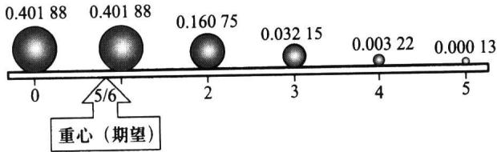  
图2.2.1概率质量模型：同时抛五颗骰子，6点出现个数X的数学期望E(X)=5/6就是重心所在的位置

数学期望的理论意义是深刻的，它是消除随机性的主要手段，这在本书以后各章中会清楚地看出.

数学期望在实际中应用广泛，E(X)常作为X的分布的代表（一种统计指标）参与同类指标的比较.如一盘磁带上的缺陷数有多有少，有随机性，不好比较，但多盘磁带上的平均缺陷数(期望值)可以比较，其越少越好.下面的实际例子将告诉人们数学期望应用的广泛性.

例2.2.2在一个人数为N的人群中普查某种疾病，为此要抽验N个人的血.如果将每个人的血分别检验，则共需检验N次.为了能减少工作量，一位统计学家提出一种方法：按k个人一组进行分组，把同组k个人的血样混合后检验，如果混合血样呈阴性反应，就说明这k个人的血都呈阴性反应，这k个人都无此疾病，因而这k个人只要检验1次就够了，相当于每个人检验1/k次，检验的工作量明显减少了.如果混合血样呈阳性反应，就说明这k个人中至少有一人的血呈阳性反应，则再对这k个人的血样分别进行检验，因而这k个人的血要检验1+k次，相当于每个人检验1+1/k次，这时增加了检验次数.假设该疾病的发病率为p,且得此疾病相互独立.试问此种方法能否减少平均检验次数？

解令X为该人群中每个人需要的验血次数,则X的分布列为

<table><tr><td>X</td><td>1/k</td><td>1+1/k</td></tr><tr><td>P</td><td>(1-p)</td><td>1-(1-p)</td></tr></table>

所以每人平均验血次数为

$$
E ( X ) = { \frac { 1 } { k } } { \left( 1 - p \right) } ^ { k } + \left( 1 + { \frac { 1 } { k } } \right) { \left[ 1 - \left( 1 - p \right) ^ { k } \right] } = 1 - \left( 1 - p \right) ^ { k } + { \frac { 1 } { k } } .
$$

由此可知，只要选择k使

$$
1 - ( 1 - p ) ^ { k } + \frac { 1 } { k } < 1 \frac { \ d } { \ d t } \ d t \frac { \ d H } { \ d t } \left( 1 - p \right) ^ { k } > \frac { 1 } { k } ,
$$

就可减少验血次数，而且还可适当选择k使E（X)达到最小.譬如，当 $p = 0 . 1$ 时,对不同的k,E(X)的值如表2.2.1所示.从表中可以看出：当 $k \geqslant 3 4$ 时,平均验血次数超过1,即比分别检验的工作量还大；而当 $k \leqslant 3 3$ 时，平均验血次数在不同程度上得到了减少，特别在k=4时，平均验血次数最少，验血工作量可减少40%.

表2.2.1 p=0.1时的E(X）值
<table><tr><td>k</td><td>2</td><td>3</td><td>4</td><td>5</td><td>8</td><td>10</td><td>30</td><td>33</td><td>34</td></tr><tr><td>E(X)</td><td>0.690</td><td>0.604</td><td>0.594</td><td>0.610</td><td>0.695</td><td>0.751</td><td>0.991</td><td>0.999 4</td><td>1.0016</td></tr></table>

我们也可以对不同的发病率p计算出最佳的分组人数k。，见下表2.2.2.从表中也 $k _ { 0 }$ 可以看出：发病率p越小，则分组检验的效益越大.譬如在 $p { = } 0 . 0 1$ 时，若取11人为一组进行验血，则验血工作量可减少80%左右.这正是美国二战期间大量征兵时，对新兵验血所采用的减少工作量的措施.

表2.2.2不同发病率p时的最佳分组人数k。及其E（X） $k _ { \mathfrak { o } }$
<table><tr><td> $p$ </td><td>0.14 0.10</td><td>0.08</td><td>0.06</td><td>0.04</td><td>0.02 0.01</td></tr><tr><td> $k _ { 0 }$ </td><td>3 4</td><td>4</td><td>5 6</td><td>8</td><td>11</td></tr><tr><td> $E ( X )$ </td><td>0.697 0.594</td><td>0.534</td><td>0.466</td><td>0.384 0.274</td><td>0.196</td></tr></table>

例2.2.3每张福利彩票售价5元，各有一个兑奖号.每售出100万张设一个开奖组，用摇奖器当众摇出一个6位数的中奖号码（可以认为从000000到999999的每个数都等可能出现),兑奖规则如下：

（1）兑奖号与中奖号码的最后一位相同者获六等奖，奖金10元.

（2）兑奖号与中奖号码的最后二位相同者获五等奖，奖金50元.

（3）兑奖号与中奖号码的最后三位相同者获四等奖，奖金500元.

（4）兑奖号与中奖号码的最后四位相同者获三等奖，奖金5000元.

（5）兑奖号与中奖号码的最后五位相同者获二等奖，奖金50000元.

（6）兑奖号与中奖号码全部相同者获一等奖，奖金500000元.另外规定，只领取其中最高额的奖金.试求每张彩票的平均所得奖金额.

解以X记一张彩票的奖金额，则X的分布列如下：
<table><tr><td>X</td><td>500000</td><td>50000</td><td>5000</td><td>500</td><td>50</td><td>10 0</td></tr><tr><td>P</td><td>0.000 001</td><td>0.000009</td><td>0.000 09</td><td>0.0009</td><td>0.009</td><td>0.09 0.9</td></tr></table>

所以每张彩票的平均所得为

$$
E ( \ X ) = 0 . 5 \ + \ 0 . 4 5 \ + \ 0 . 4 5 \ + \ 0 . 4 5 \ + \ 0 . 4 5 \ + \ 0 . 9 \ + \ 0 \ = 3 . 2 .
$$

这也意味：每一开奖组把筹得的500万元中的320万元以奖金形式返回给彩民，其余180万元则可用于福利事业及管理费用.

从这个例子也可以看出，彩票中奖与否是随机的，但一种彩票的平均所得是可以预先算出的，计算平均所得是设计一种彩票的基础.在我国，彩票发行由民政部门管

理，只有当收益主要用于公益事业才被允许发行彩票.发行任一种彩票事先都要进行周密设计.

例2.2.4 设X服从区间(a,b)上的均匀分布，求E(X).

解由例2.1.7知X的密度函数为

$$
p ^ { } ( x ) = \left\{ { \frac { 1 } { b \ - \ a } } , \ a \ < \ x \ < \ b , \right.
$$

所以

$$
E ( X ) = \int _ { a } ^ { b } x \cdot { \frac { 1 } { b \ - \ a } } \mathrm { d } x = { \frac { 1 } { b \ - \ a } } \cdot { \frac { x ^ { 2 } } { 2 } } \left| _ { a } ^ { b } = { \frac { a \ + \ b } { 2 } } . \right.
$$

这个结果是可以理解的，因为X在区间 $( a , b )$ 上的取值是均匀的，所以它的平均取值当然应该是(a，b)的“中点”，即 $( a + b ) / 2$

例2.2.5柯西分布的数学期望不存在.因为柯西分布的密度函数为

$$
p \left( x \right) = \frac { 1 } { \pi } \frac { 1 } { 1 + x ^ { 2 } } , - \infty < x < \infty .
$$

所以由

$$
\int _ { - \infty } ^ { \infty } \mid x \mid \cdot \frac { 1 } { \pi } \frac { 1 } { 1 + x ^ { 2 } } \mathrm { d } x = \infty ,
$$

知E(X)不存在.

## 2.2.3数学期望的性质

按照随机变量X的数学期望E(X)的定义，E(X)由其分布唯一确定.若要求随机变量X的一个函数g(X)（仍是随机变量)的数学期望，当然要先求出 $Y = g \left( X \right)$ 的分布，再用此分布来求E(Y).这一过程可用下面例子说明.

例2.2.6已知随机变量X的分布列如下：

<table><tr><td>X</td><td>-2 -1</td><td>0</td><td>1</td><td>2</td></tr><tr><td> $P$ </td><td>0.2</td><td>0.1 0.1</td><td>0.3</td><td>0.3</td></tr></table>

要求 $Y = X ^ { 2 }$ 的数学期望，为此要分两步进行：

第一步，先求 $Y = X ^ { 2 }$ 的分布，这可从X的分布导出，即

<table><tr><td> $X ^ { 2 }$ </td><td> $\left( { - 1 } \right) ^ { 2 }$   $( - 2 ) ^ { 2 }$ </td><td> $0 ^ { 2 }$   $1 ^ { 2 }$   $2 ^ { 2 }$ </td></tr><tr><td>P</td><td>0.1 0.1 0.2</td><td>0.3 0.3</td></tr></table>

然后对相等的值进行合并，并把对应的概率相加，可得

<table><tr><td> $X ^ { 2 }$ </td><td>0 1</td><td>4</td></tr><tr><td>P</td><td>0.1 0.4</td><td>0.5</td></tr></table>

第二步，利用 $X ^ { 2 }$ 的分布求 $E \big ( X ^ { 2 } \big )$ ,即得

$$
E ( X ^ { 2 } ) = 0 \times 0 . 1 + 1 \times 0 . 4 + 4 \times 0 . 5 = 2 . 4 .
$$

假如我们用等值合并前的分布求 $E ( \boldsymbol { X } ^ { 2 } )$ ,可得相同的结果

$$
E ( X ^ { 2 } ) = ( - 2 ) ^ { 2 } \times 0 . 2 + ( - 1 ) ^ { 2 } \times 0 . 1 + 0 ^ { 2 } \times 0 . 1 + 1 ^ { 2 } \times 0 . 3 + 2 ^ { 2 } \times 0 . 3 = 2 . 4 .
$$

这两种算法本质上是一回事，但后者的计算实质上是在X的分布 $( - 2 , - 1 , 0 , 1 , 2 )$ 基础上、而将取值改为 $( \mathbf { \Phi } ( \mathbf { - } 2 ) \mathbf { \Phi } ^ { 2 } , ( \mathbf { - } 1 ) \mathbf { \Phi } ^ { 2 } , \mathbf { 0 } ^ { 2 } , 1 \mathbf { \Phi } ^ { 2 } , 2 ^ { 2 } )$ 计算出来的.由此启发我们：若进一步要求 $E ( \boldsymbol { X } ^ { 3 } )$ 和 $E ( \boldsymbol { X } ^ { 4 } )$ ，我们不需要先求X的分布和X的分布，而直接用X的分布来 $X ^ { 3 }$ $X ^ { 4 }$ 求，具体如下：

$$
E ( ~ X ^ { 3 } ) = ~ ( ~ - ~ 2 ) ^ { 3 } ~ \times ~ 0 . 2 ~ + ~ ( ~ - ~ 1 ) ^ { 3 } ~ \times ~ 0 . 1 ~ + ~ 0 ^ { 3 } ~ \times ~ 0 . 1 ~ + ~ 1 ^ { 3 } ~ \times ~ 0 . 3 ~ + ~ 2 ^ { 3 } ~ \times ~ 0 . 3 ~ = ~ 1 .
$$

$$
E ( \ = X ^ { 4 } ) = ( \textrm { -- } 2 ) ^ { 4 } \times 0 . 2 \ + \ ( \textrm { -- } 1 ) ^ { 4 } \times 0 . 1 \ + \ 0 ^ { 4 } \times 0 . 1 \ + \ 1 ^ { 4 } \times 0 . 3 \ + \ 2 ^ { 4 } \times 0 . 3 \ = 8 . 4 .
$$

一般场合，有如下定理.

定理2.2.1若随机变量X的分布用分布列 $p \left( \boldsymbol { x } _ { i } \right)$ 或用密度函数 $p \left( { \boldsymbol { x } } \right)$ 表示，则X的某一函数 $g ( X )$ 的数学期望为

$$
E { \left[ g ( X ) \right] } = \left\{ \begin{array} { l l } { \displaystyle \sum _ { i } g ( x _ { i } ) p ( x _ { i } ) , } & { \mathrm { ~ \# ~ \# \# \# : \# \# ~ \# ~ \# ~ } , } \\ { \displaystyle } \\ { \displaystyle \int _ { - \infty } ^ { \infty } g ( x ) p ( x ) \mathrm { d } x , } & { \mathrm { \# \ i \# \ : \# \# \ : \# \# ~ \# ~ } . } \end{array} \right.\tag{2.2.3}
$$

这里所涉及的数学期望都假定存在.

这个定理的证明涉及更多的工具，在此省略了.现基于这个定理来证明数学期望的几个常用性质，以下均假定所涉及的数学期望是存在的.

性质2.2.1若c是常数，则 $\begin{array} { r } { \boldsymbol { E } ( c ) = c . } \end{array}$

证明如果将常数c看作仅取一个值的随机变量X,则有 $P ( X = c ) = 1$ ,从而其数学期望 $E ( \boldsymbol { \mathbf { \rho } } _ { c } ) = E ( \boldsymbol { \mathbf { \rho } } _ { X } ) = c \times 1 = c .$

性质2.2.2对任意常数a,有

$$
E ( a X ) = a E ( X ) .\tag{2.2.4}
$$

证明在(2.2.3)式中令 $\ g \left( \ x \right) = a x$ ，然后把a从求和号或积分号中提出来即得.

性质2.2.3对任意的两个函数 $g _ { 1 } ( x )$ 和 $g _ { 2 } ( x )$ ，有

$$
E \big [ g _ { 1 } ( X ) \ \pm g _ { 2 } ( X ) \big ] = E \big [ g _ { 1 } ( X ) \big ] \ \pm E \big [ g _ { 2 } ( X ) \big ] .\tag{2.2.5}
$$

证明在(2.2.3)式中令 $g \left( \begin{array} { c c } { x } \end{array} \right) = g _ { 1 } \left( \begin{array} { c c } { x } \end{array} \right) \pm g _ { 2 } \left( \begin{array} { c c } { x } \end{array} \right)$ ，然后把和式分解成两个和式，或把积分分解成两个积分即得.

例2.2.7某公司经销某种原料，根据历史资料表明：这种原料的市场需求量X（单位：吨）服从（300,500)上的均匀分布.每售出1吨该原料，公司可获利1.5（千元）；若积压1吨，则公司损失0.5(千元).问公司应该组织多少货源，可使平均收益最大？

解设公司组织该货源a吨.则显然应该有 $3 0 0 \leqslant a \leqslant 5 0 0$ 又记Y为在a吨货源的条件下的收益额（单位：千元），则收益额Y为需求量X的函数，即 $Y = _ { g } ( \boldsymbol { X } )$ .由题设条件知：当 $X \geqslant a$ 时，则此a吨货源全部售出，共获利1.5a.当 $X { < a }$ 时，则售出X吨（获利1.5X），且还有 $a - X$ 吨积压（获利 $- 0 . 5 ( \ a - X ) \ )$ ，所以共获利 $1 . 5 X - 0 . 5 \left( \ a - X \right)$ ，由此知

$$
g ( X ) = \left\{ \begin{array} { l l } { { 1 . 5 a , } } & { { \ddagger  { X } \gtrsim a , } } \\ { { 1 . 5 X - 0 . 5 ( a - X ) , } } & { { \ddagger  { X } < a = } } \end{array} \right. = \left\{ \begin{array} { l l } { { 1 . 5 a , } } & { { \ddagger  { X } \gtrsim a , } } \\ { { 2 X - 0 . 5 a , } } & { { \ddagger  { X } < a . } } \end{array} \right.
$$

由定理2.2.1和均匀分布可得

$$
E ( Y ) = \int _ { - \infty } ^ { \infty } g ( x ) p _ { X } ( x ) \mathrm { d } x = \int _ { 3 0 0 } ^ { 5 0 0 } g ( x ) \frac { 1 } { 2 0 0 } \mathrm { d } x
$$

$$
\begin{array} { l } { { \displaystyle = \frac { 1 } { 2 0 0 } \Big ( \int _ { a } ^ { 5 0 0 } 1 . 5 a \mathrm { d } x + \int _ { 3 0 0 } ^ { a } \big ( 2 x - 0 . 5 a \big ) \mathrm { d } x \Big ) } } \\ { { \displaystyle = \frac { 1 } { 2 0 0 } \big ( - a ^ { 2 } + 9 0 0 a - 3 0 0 ^ { 2 } \big ) . } } \end{array}
$$

上述计算表明E(Y)是a的二次函数，用通常求极值的方法可以求得：当a=450吨时，能使E(Y)达到最大，即公司应该组织货源450吨.

## 习题2.2

1.设离散型随机变量X的分布列为

<table><tr><td>X</td><td>-2</td><td>0</td><td>2</td></tr><tr><td>P</td><td>0.4</td><td>0.3</td><td>0.3</td></tr></table>

试求E（X）和E（3X+5）.

2.某商店根据历年销售资料得知：一位顾客在商店中消费的金额X（百元）的分布列为

<table><tr><td>X</td><td>0 1</td><td>2</td><td>3</td><td>4</td><td>5</td></tr><tr><td>P</td><td>0.33 0.10</td><td>0.31</td><td>0.13</td><td>0.09</td><td>0.04</td></tr></table>

试求顾客在商店的平均消费金额.

3.某地区一个月内发生重大交通事故数X服从如下分布：

<table><tr><td>X</td><td>0</td><td>1</td><td>2</td><td>3</td><td>4</td><td>5</td><td>6</td></tr><tr><td>P</td><td>0.301</td><td>0.362</td><td>0.216</td><td>0.087</td><td>0.026</td><td>0.006</td><td>0.002</td></tr></table>

试求该地区发生重大交通事故的月平均数.

4.一海运货船的甲板上放着20个装有化学原料的圆桶，现已知其中有5桶被海水污染了.若从中随机抽取8桶，记X为8桶中被污染的桶数，试求X的分布列，并求E(X).

5.用天平称某种物品的质量（砝码仅允许放在一个盘中），现有三组砝码（单位：g）：（甲）1,2,2，5,10；（乙)1,2,3,4,10；（丙)1,1,2,5,10,称重时只能使用一组砝码.问：若物品的质量为1g,2g，，10g的概率是相同的，用哪一组砝码称重所用的平均砝码数最少？

6.假设有十只同种电器元件，其中有两只不合格品.装配仪器时，从这批元件中任取一只，如是 不合格品，则扔掉重新任取一只；如仍是不合格品，则扔掉再取一只，试求在取到合格品之前，已取出 的不合格品只数的数学期望.

7.对一批产品进行检查，如查到第a件全为合格品，就认为这批产品合格；若在前a件中发现不合格品即停止检查，且认为这批产品不合格.设产品的数量很大，可认为每次查到不合格品的概率都是p.问每批产品平均要查多少件？

8.某人参加“答题秀”，一共有问题1和问题2两个问题，他可以自行决定回答这两个问题的顺序.如果他先回答问题i（i=1，2)，那么只有回答正确，他才被允许回答另一题.如果他有60%的把握答对问题1，而答对问题1将获得200元奖励；有80%的把握答对问题2，而答对问题2将获得100元奖励.问他应该先回答哪个问题，才能使获得奖励的期望值最大？

9.某人想用10000元投资于某股票，该股票当前的价格是2元/股，假设一年后该股票等可能地为1元/股和4元/股.而理财顾问给他的建议是：若期望一年后所拥有的股票市值达到最大，则现在就购买；若期望一年后所拥有的股票数量达到最大，则一年以后购买.试问理财顾问的建议是否正

确？为什么？

10.保险公司的某险种规定：如果某个事件A在一年内发生了，则保险公司应付给投保户金额a元，而事件A在一年内发生的概率为p.如果保险公司向投保户收取的保费为ka，则问k为多少，才能 $p .$ 使保险公司期望收益达到a的10%？

11.某厂推土机发生故障后的维修时间T是一个随机变量（单位：h），其密度函数为

$$
p \left( t \right) = \left\{ { \begin{array} { l l } { 0 . 0 2 \mathrm { e } ^ { - 0 . 0 2 t } , t > 0 , } \\ { 0 , t \leqslant 0 , } \end{array} } \right.
$$

试求平均维修时间.

12.某新产品在未来市场上的占有率X是在区间(0,1)上取值的随机变量，它的密度函数为 $\ p ^ { \underline { { \star } } }$

$$
\begin{array} { r } { p \left( x \right) \ = \ \left\{ \begin{array} { l l } { 4 \left( \ 1 \ - \ x \right) ^ { 3 } , } & { 0 \ < \ x \ < \ 1 , } \\ { 0 , } & { \sharp \# , } \end{array} \right. } \end{array}
$$

试求平均市场占有率.

13.设随机变量X的密度函数如下，试求E(2X+5）.

$$
p \left( x \right) = \left\{ { \stackrel { \mathrm { e } ^ { - x } } { 0 } } , x > 0 , \right. \nonumber
$$

14.设随机变量X的分布函数如下，试求E（X）.

$$
F ( x ) = \left\{ \begin{array} { l l } { { \displaystyle { \frac { \mathbf { e } ^ { x } } { 2 } } } , } & { { x < 0 , } } \\ { { } } & { { } } \\ { { \displaystyle { \frac { 1 } { 2 } } , } } & { { 0 \leqslant x < 1 , } } \\ { { } } & { { } } \\ { { \displaystyle { 1 - \frac { 1 } { 2 } \mathbf { e } ^ { - \frac { 1 } { 2 } ( x - 1 ) } } , } } & { { x \geqslant 1 . } } \end{array} \right.
$$

15.设随机变量X的密度函数为

$$
p \left( x \right) = \left\{ { \begin{array} { l l } { a + b x ^ { 2 } , } & { 0 \leqslant x \leqslant 1 , } \\ { 0 , } & { \sharp \sharp \sharp , } \end{array} } \right.
$$

如果 $E \left( X \right) = \frac { 2 } { 3 }$ ，求a和b.

16.某工程队完成某项工程的时间X（单位：月）是一个随机变量，它的分布列为

<table><tr><td>X</td><td>10 11</td><td>12</td><td>13</td></tr><tr><td>P</td><td>0.4 0.3</td><td>0.2</td><td>0.1</td></tr></table>

（1）试求该工程队完成此项工程的平均月数；

（2）设该工程队所获利润为Y=50（13-X），单位为万元，试求工程队的平均利润；

（3）若该工程队调整安排，完成该项工程的时间X（单位：月）的分布为 $X _ { \scriptscriptstyle { 1 } } ($

<table><tr><td>X</td><td>10</td><td>11</td><td>12</td></tr><tr><td>P</td><td>0.5</td><td>0.4</td><td>0.1</td></tr></table>

则其平均利润可增加多少？

17.设随机变量X的概率密度函数为

$$
p \left( x \right) = \left\{ \begin{array} { l l } { \displaystyle \frac { 1 } { 2 } \mathrm { c o s } \frac { x } { 2 } , } & { 0 \leqslant x \leqslant \pi , } \\ { 0 , } & { \sharp \# , } \end{array} \right.
$$

对X独立重复观察4次，Y表示观察值大于 $\pi / 3$ 的次数，求 $Y ^ { 2 }$ 的数学期望.

18.设随机变量X的密度函数为

$$
\begin{array} { r l } { p \left( x \right) } & { = \left\{ \displaystyle \frac { 3 } { 8 } x ^ { 2 } , \quad 0 < x < 2 , \right. } \\ { 0 , } & { \quad \left. \sharp \# , \right. } \end{array}
$$

试求 $\frac { 1 } { X ^ { 2 } }$ 的数学期望.

19.设X为仅取非负整数的离散随机变量，若其数学期望存在，证明：

(1） $E ( X ) \ = \ \sum _ { k \ = 1 } ^ { \infty } P ( X \geqslant k )$

(2) $\ : \sum _ { k \ : = 0 } ^ { \infty } k P ( X > k ) = \frac { 1 } { 2 } ( E ( X ^ { 2 } ) - E ( X ) ) . \ :$

20.设连续随机变量X的分布函数为 $\boldsymbol { F } ( \boldsymbol { x } )$ ，且数学期望存在，证明：

$$
E ( X ) \ = \ \int _ { 0 } ^ { \infty } \left[ \mathbb { 1 } - F ( x ) \right] \mathrm { d } x - \int _ { - \infty } ^ { 0 } F ( x ) \mathrm { d } x .
$$

21.设X为非负连续随机变量，若 $E ( \boldsymbol { X } ^ { n } )$ 存在，试证明：

（1） $E ( X ) \ = \ \int _ { 0 } ^ { \infty } P ( X > x ) { \mathrm { d } } x ;$

(2) $E ( X ^ { n } ) \ = \ \int _ { 0 } ^ { \infty } n x ^ { n - 1 } P ( X > x ) \mathrm { d } x .$

## 82.3随机变量的方差与标准差

随机变量X的数学期望E(X)是分布的一种位置特征数，它刻画了X的取值总在E(X)周围波动.但这个位置特征数无法反映出随机变量取值的“波动大小”，譬如X与Y的分布列分别为

<table><tr><td>X</td><td>-1 0</td><td>1</td><td>Y</td><td>-10</td><td>0</td><td>10</td></tr><tr><td>P</td><td>1/3</td><td>1/3 1/3</td><td>P</td><td>1/3</td><td>1/3</td><td>1/3</td></tr></table>

尽管它们的数学期望都是0,但显然Y取值的波动要比X取值的波动大.如何用数值来反映随机变量取值的“波动”大小，是本节要研究的问题.而以下定义的方差与标准差正是度量此种波动大小的最重要的两个特征数.

## 2.3.1方差与标准差的定义

设随机变量X的均值为 $a = E \left( X \right)$ ,X的取值当然不一定恰好是a，会有偏离.偏离的量 $X { - } a$ 有正有负，为了不使正负偏离彼此抵消，我们一般考虑 $\left( X - a \right) ^ { 2 }$ ，而不去考虑数学上难以处理的绝对值 $\mid X { - } a \mid$ .因为 $\left( X - a \right) ^ { 2 }$ 仍是一个随机变量，所以取其均值 $E ( { \cal X } -$ $a ) ^ { 2 }$ 就可以刻画X的“波动”程度，这个量被称作X的方差，其定义如下：

定义2.3.1若随机变量 $X ^ { 2 }$ 的数学期望 $E ( \boldsymbol { X } ^ { 2 } )$ 存在，则称偏差平方 $\left( X { - } E ( X ) \right) ^ { 2 }$ 的数学期望 $E \left( \boldsymbol { X } - \boldsymbol { E } \left( \boldsymbol { X } \right) \right) ^ { 2 }$ 为随机变量X（或相应分布）的方差，记为

Var(X)=E(X-E(X))²

$$
= \left\{ \begin{array} { l l } { \displaystyle \sum _ { i } \big ( x _ { i } - E ( X ) \big ) ^ { 2 } p \big ( x _ { i } \big ) , } & { \mathrm { ~ \# ~ } _ { \sf R } ^ { \mathrm { s q } } \# \{ \xi _ { \mathcal { W } } ^ { \pm } \pm \xi _ { \mathcal { J } } \triangle _ { \sf H } \} , } \\ { \quad } \\ { \displaystyle \int _ { - \infty } ^ { \infty } \big ( x - E ( X ) \big ) ^ { 2 } p \big ( x \big ) \mathrm { d } x , } & { \mathrm { ~ \# ~ } _ { \sf R } ^ { \mathrm { s q } } \ddag \xi _ { \mathcal { W } } ^ { \pm } \ddag \xi _ { \sf H } . } \end{array} \right.\tag{2.3.1}
$$

称方差的正平方根 $\sqrt { \operatorname { V a r } ( X ) }$ 为随机变量X（或相应分布)的标准差，记为 $\sigma ( X )$ ，或 $\pmb { \sigma } _ { \chi }$

方差与标准差的功能相似，它们都是用来描述随机变量取值的集中与分散程度（即散布大小)的两个特征数.方差与标准差愈小，随机变量的取值愈集中；方差与标准差愈大，随机变量的取值愈分散.

方差与标准差之间的差别主要在量纲上，由于标准差与所讨论的随机变量、数学期望有相同的量纲，其加减 $E ( X ) \pm k \sigma ( X )$ 是有意义的（k为正实数），所以在实际中，人们比较乐意选用标准差，但标准差的计算必须通过方差才能算得.

另外要指出的是：如果随机变量X的数学期望存在,其方差不一定存在;而当X的方差存在时,则E(X)必定存在,其原因在于 $\mid x \mid \leqslant x ^ { 2 } + 1$ 总是成立的.

例2.3.1图2.3.1上有三个分布：三角分布、均匀分布和倒三角分布的密度函数及它们的图形.从图上可以看出，这三个分布都位于区间（-1,1）上，并且关于纵轴对称，从而得知这三个分布的期望均为0.但它们的方差不等（因此标准差也不等），这可分别由各自的分布(见图2.3.1)算得

$$
{ \begin{array} { l } { \displaystyle \operatorname { V a r } ( X _ { 1 } ) = E ( X _ { 1 } ^ { 2 } ) = \int _ { - 1 } ^ { 0 } x ^ { 2 } ( 1 + x ) \mathrm { d } x + \int _ { 0 } ^ { 1 } x ^ { 2 } ( 1 - x ) \mathrm { d } x = { \cfrac { 1 } { 6 } } . } \\ { \displaystyle \operatorname { V a r } ( X _ { 2 } ) = E ( X _ { 2 } ^ { 2 } ) = \int _ { - 1 } ^ { 1 } { \cfrac { x ^ { 2 } } { 2 } } \mathrm { d } x = { \cfrac { 1 } { 3 } } . } \\ { \displaystyle \operatorname { V a r } ( X _ { 3 } ) = E ( X _ { 3 } ^ { 2 } ) = \int _ { - 1 } ^ { 0 } x ^ { 2 } ( - x ) \mathrm { d } x + \int _ { 0 } ^ { 1 } x ^ { 2 } \cdot x \mathrm { d } x = { \cfrac { 1 } { 2 } } . } \end{array} }
$$

这些计算结果与我们对分布的直观认识是一致的.在这三个分布中，三角分布的概率在中间较为集中，故方差最小；而倒三角分布的概率大多分散在两侧，故方差最大；均匀分布介于其中，故方差也介于其中.我们将三个分布的数学期望、方差和标准差都列于图2.3.1的相应分布的右侧,以供比较.

1.三角分布

期望方差标准差

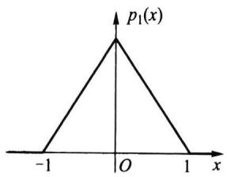

$$
p _ { 1 } ( x ) = \left\{ { 1 - x , \ 0 \leqslant x < 1 } , \atop { 0 , \quad \hfill \mathrm { ~ \# ~ } 1 \leqslant x }  \right.
$$

0 $\frac { 1 } { 6 }$ 0.4082

2.均匀分布

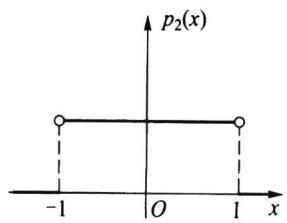

$$
p _ { 2 } ( { \boldsymbol { x } } ) = \left\{ { \begin{array} { l l } { \displaystyle \frac { 1 } { 2 } } , \ \displaystyle - 1 < x < 1 , } \\ { 0 , \ \# 4 \# . } \end{array}  \right.
$$

$$
0 \frac { 1 } { 3 } 0 . 5 7 7 4
$$

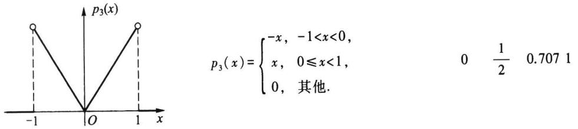

## 3.倒三角分布

图2.3.1比较三个分布的方差与标准差

例2.3.2某人有一笔资金，可投入两个项目：房地产和商业，其收益都与市场状态有关.若把未来市场划分为好、中、差三个等级，其发生的概率分别为0.2、0.7、0.1.通过调查，该投资者认为投资于房地产的收益X(万元)和投资于商业的收益Y(万元)的分布分别为

<table><tr><td>X</td><td>11</td><td>3</td><td>-3</td><td>Y</td><td>6</td><td>4</td><td>-1</td></tr><tr><td>P</td><td>0.2</td><td>0.7</td><td>0.1</td><td>P</td><td>0.2</td><td>0.7</td><td>0.1</td></tr></table>

请问：该投资者如何投资为好？

解我们先考察数学期望（平均收益）

$$
\begin{array} { r l } & { E ( X ) = 1 1 \times 0 . 2 + 3 \times 0 . 7 + ( - 3 ) \times 0 . 1 = 4 . 0 ( \mathcal { F } \overrightarrow { \mathfrak { N } } ) , } \\ & { E ( Y ) = 6 \times 0 . 2 + 4 \times 0 . 7 + ( - 1 ) \times 0 . 1 = 3 . 9 ( \mathcal { H } \overrightarrow { \mathcal { F } } ) . } \end{array}
$$

从平均收益看，投资房地产收益大，可比投资商业多收益0.1万元.下面我们再来计算它们各自的方差

$$
\begin{array} { r l } & { \mathrm { V a r } ( X ) = ( 1 1 - 4 ) ^ { 2 } \times 0 . 2 + ( 3 - 4 ) ^ { 2 } \times 0 . 7 + ( - 3 - 4 ) ^ { 2 } \times 0 . 1 = 1 5 . 4 , } \\ & { \mathrm { V a r } ( Y ) = ( 6 - 3 . 9 ) ^ { 2 } \times 0 . 2 + ( 4 - 3 . 9 ) ^ { 2 } \times 0 . 7 + ( - 1 - 3 . 9 ) ^ { 2 } \times 0 . 1 = 3 . 2 9 , } \end{array}
$$

及标准差

$$
\sigma ( { \chi } ) = \sqrt { 1 5 . 4 } = 3 . 9 2 , \sigma ( { Y } ) = \sqrt { 3 . 2 9 } = 1 . 8 1 .
$$

因为标准差(方差也一样)愈大，则收益的波动大，从而风险也大.资金投向何处不仅要看平均收益多少，还要看风险大小.在这里从标准差看，投资房地产的风险比投资商业的风险大一倍多.若综合权衡收益与风险，该投资者还是选择投资商业为宜，虽然平均收益少0.1万元，但风险要小一半以上.

## 2.3.2方差的性质

以下均假定随机变量的方差是存在的.

性质2.3.1 $\operatorname { V a r } ( X ) = E ( X ^ { 2 } ) - \left[ E ( X ) \right] ^ { 2 } .$

证明因为

$$
\operatorname { V a r } ( X ) = E ( X - E ( X ) ) ^ { 2 } = E ( X ^ { 2 } - 2 X \cdot E ( X ) + ( E ( X ) ) ^ { 2 } ) ,
$$

由数学期望的性质2.2.3可得

$$
\operatorname { V a r } ( X ) = E ( X ^ { 2 } ) - 2 E ( X ) \cdot E ( X ) + { \bigl ( } E ( X ) { \bigr ) } ^ { 2 } = E ( X ^ { 2 } ) - { \bigl ( } E ( X ) { \bigr ) } ^ { 2 } .
$$

在实际计算方差时，这个性质往往比定义 $\operatorname { V a r } ( X ) = E ( X - E ( X ) ) ^ { 2 }$ 更常用.

性质2.3.2常数的方差为0,即 ${ \mathbf V } _ { \mathbf a \mathbf r } ( \mathbf { \Psi } _ { c } ) = 0$ ,其中c是常数.

证明若c是常数，则

$$
\operatorname { V a r } ( c ) = E ( c - E ( c ) ) ^ { 2 } = E ( c - c ) ^ { 2 } = 0 .
$$

性质2.3.3若a,b是常数，则 $\operatorname { V a r } ( a X + b ) = a ^ { 2 } \operatorname { V a r } ( X )$

证明因a,b是常数，则

$$
\operatorname { V a r } ( a X + b ) = E { \bigl ( } a X + b - E ( a X + b ) { \bigr ) } ^ { 2 } = E { \bigl ( } a { \bigl ( } X - E ( X ) { \bigr ) } { \bigr ) } ^ { 2 } = a ^ { 2 } \operatorname { V a r } ( X ) .
$$

另外从 $\operatorname { V a r } ( X ) = E ( X ^ { 2 } ) - [ E ( X ) ] ^ { 2 } \geqslant 0$ 很容易看出：若 $E \big ( \boldsymbol { X } ^ { 2 } \big ) = 0$ ，则 $E ( X ) = 0$ ，且 $\mathbf { V } \mathbf { a r } ( X ) = 0 .$

例2.3.3设X为掷一颗骰子出现的点数，试求 $\operatorname { V a r } ( X )$

解

$$
E ( X ) = { \frac { 1 } { 6 } } ( 1 + 2 + 3 + 4 + 5 + 6 ) = { \frac { 7 } { 2 } } ,
$$

$$
E ( X ^ { 2 } ) = \frac { 1 } { 6 } ( 1 ^ { 2 } + 2 ^ { 2 } + 3 ^ { 2 } + 4 ^ { 2 } + 5 ^ { 2 } + 6 ^ { 2 } ) = \frac { 9 1 } { 6 } ,
$$

$$
\operatorname { V a r } ( X ) = { \frac { 9 1 } { 6 } } - { \frac { 4 9 } { 4 } } = { \frac { 3 5 } { 1 2 } } = 2 . 9 1 7 .
$$

## 2.3.3切比雪夫不等式

下面给出概率论中一个重要的基本不等式.

定理2.3.1（切比雪夫(Chebyshev,1821-1894)不等式）设随机变量X的数学期望和方差都存在,则对任意常数 $\varepsilon > 0$ ,有

$$
P ( \mid X - E ( X ) \mid \geqslant \varepsilon ) \leqslant \frac { \mathrm { V a r } ( X ) } { \varepsilon ^ { ^ 2 } } ,\tag{2.3.2}
$$

或

$$
P ( \mid X - E ( X ) \mid < \varepsilon ) \geqslant 1 - { \frac { \operatorname { V a r } ( X ) } { \varepsilon ^ { 2 } } } .\tag{2.3.3}
$$

证明设X是一个连续随机变量,其密度函数为 $p ( x )$ .记 $E ( X ) = a$ ,我们有

$$
\begin{array} { l } { P ( \mid X - a \mid \geqslant \varepsilon ) = \displaystyle \int _ { \left\{ \vphantom { \frac { 1 } { \varepsilon } } x : \mid x - a \mid \geqslant \varepsilon \right\} } p ( x ) \mathrm { d } x \leqslant \displaystyle \int _ { \left\{ \vphantom { \frac { 1 } { \varepsilon } } x : \mid x - a \mid \geqslant \varepsilon \right\} } \frac { \left( x - a \right) ^ { 2 } } { \varepsilon ^ { 2 } } p ( x ) \mathrm { d } x } \\ { \leqslant \displaystyle \frac { 1 } { \varepsilon ^ { 2 } } \int _ { - \infty } ^ { \infty } \left( x - a \right) ^ { 2 } p ( x ) \mathrm { d } x = \frac { \mathrm { V a r } ( X ) } { \varepsilon ^ { 2 } } . } \end{array}
$$

由此知(2.3.2)式对连续随机变量成立，对于离散随机变量亦可类似进行证明.

在概率论中，事件 $\{ \ | X { - } E ( X ) \mid \geqslant \varepsilon \}$ 称为大偏差，其概率 $P ( \ | X { - } E ( X ) \mid \geqslant \varepsilon )$ 称为大偏差发生概率.切比雪夫不等式给出大偏差发生概率的上界，这个上界与方差成正比，方差愈大上界也愈大.

以下定理进一步说明了方差为0就意味着随机变量的取值几乎集中在一点上.

定理2.3.2若随机变量X的方差存在，则 $\operatorname { V a r } ( X ) = 0$ 的充要条件是X几乎处处为某个常数a，即 $P ( X = a ) = 1$

证明充分性是显然的，下面证必要性.设 $\mathbf { V } \mathbf { a r } ( X ) = 0$ ，这时E（X）存在.因为

$$
\{ \mid X - E ( X ) \mid > 0 \} = \bigcup _ { n = 1 } ^ { \infty } \left\{ \mid X - E ( X ) \mid \geqslant { \frac { 1 } { n } } \right\} ,
$$

所以有

$$
\begin{array} { r l } { P ( \mathbf { \phi } \mid X - E ( X ) \mid \mathbf { \phi } > \mathbf { \phi } 0 ) = P \Big ( \underset { n = 1 } { \overset { \infty } { \bigcup } } \left\{ \mathbf { \phi } | X - E ( X ) \mid \mathbf { \phi } \geqslant \frac { 1 } { n } \right\} \Big ) } & { } \\ { \leqslant } & { \displaystyle \sum _ { n = 1 } ^ { \infty } P \Big ( \mathbf { \phi } | X - E ( X ) \mid \mathbf { \phi } \geqslant \frac { 1 } { n } \Big ) } \\ { \leqslant } & { \displaystyle \sum _ { n = 1 } ^ { \infty } \frac { \operatorname { V a r } ( X ) } { \left( 1 / n \right) ^ { 2 } } = \mathbf { 0 } , } \end{array}
$$

其中最后一个不等式用到了切比雪夫不等式.由此可知

$$
P ( \mathbf { \theta } \mid X - E ( X ) \mid \mathbf { \alpha } > \mathbf { \theta } 0 ) = 0 ,
$$

因而有

$$
P (  { \left| \begin{array} { l } { X - E ( X ) } \end{array} \right| } = 0 ) = 1 ,
$$

即

$$
P ( X = E ( X ) ) = 1 ,
$$

这就证明了结论，且其中的常数a就是 $E ( X )$

## 习题2.3

1.设随机变量X满足 $E ( \boldsymbol { X } ) = \operatorname { V a r } ( \boldsymbol { X } ) = \lambda$ ，已知 $E \left[ \begin{array} { l } { \left( X - 1 \right) \left( X - 2 \right) } \end{array} \right] = 1$ ，试求λ.

2.假设有10只同种电器元件，其中有两只不合格品.装配仪器时，从这批元件中任取一只，如是不合格品，则扔掉重新任取一只；如仍是不合格品，则扔掉再取一只，试求在取到合格品之前，已取出的不合格品数的方差.

3.已知 $E ( \ X ) = - 2 , E ( \ X ^ { 2 } ) = 5$ ，求 $\mathbf { V } \mathbf { a r } ( \mathbf { \beta } \mathbf { l } - 3 X )$

4.设 $P ( \ X = 0 ) = 1 - P ( \ X = 1 )$ ，如果 $E ( X ) = 3 \mathrm { V a r } ( X )$ ，求 $P \left( X = 0 \right)$

5.设随机变量X的分布函数为

$$
F ( x ) = \left\{ \begin{array} { l l } { \displaystyle \frac { \mathrm { e } ^ { x } } { 2 } , } & { x < 0 , } \\ { } & { } \\ { \displaystyle \frac { 1 } { 2 } , } & { 0 \leqslant x < 1 , } \\ { } & { } \\ { \displaystyle 1 - \frac { 1 } { 2 } \mathrm { e } ^ { - \frac { 1 } { 2 } ( x - 1 ) } , } & { x \geqslant 1 , } \end{array} \right.
$$

试求Var（X）.

6.设随机变量X的密度函数为

$$
p ( x ) = \left\{ { \begin{array} { l l } { 1 + x , } & { - 1 < x \leqslant 0 , } \\ { 1 - x , } & { 0 < x \leqslant 1 , } \\ { 0 , } & { \sharp \sharp \sharp , } \end{array} } \right.
$$

试求 $\mathrm { V a r } ( 3 X + 2 )$

7.设随机变量X的密度函数为

$$
p \left( x \right) = \left\{ \begin{array} { l l } { a x + b x ^ { 2 } , } & { 0 < x < 1 , } \\ { 0 , } & { \sharp \sharp \ d _ { \star } , } \end{array} \right.
$$

如果已知 $E \left( \ X \right) = 0 . 5$ ，试计算 $\mathrm { V a r } ( X )$

8.设随机变量X的分布函数为

$$
F ( \ x ) = 1 { - } \mathrm { e } ^ { - x ^ { 2 } } , \quad x { > } 0 ,
$$

试求E（X）和 $\mathbf { V a r } ( X )$

9.试证：对任意的常数 $c { \neq } E ( X )$ ，有

$$
\operatorname { V a r } ( X ) \ = { \cal E } ( X - { \cal E } ( X ) \mathbf { \theta ) } ^ { 2 } \ < { \cal E } ( X - c ) ^ { 2 } .
$$

10.设随机变量X仅在区间 $[ a , b ]$ 上取值，试证

$$
a \leqslant E ( X ) \leqslant b , \ : \mathrm { V a r } ( X ) \leqslant \left( { \frac { b - a } { 2 } } \right) ^ { 2 } .
$$

11.设随机变量X取值 $x _ { 1 } \leqslant x _ { 2 } \leqslant \cdots \leqslant x ,$ 的概率分别是 $p _ { 1 } , p _ { 2 } , \cdots , p _ { n } , \sum _ { k = 1 } ^ { n } p _ { k } \ = \ 1$ 证明

$$
\operatorname { V a r } ( X ) \leq \left( { \frac { x _ { n } - x _ { 1 } } { 2 } } \right) ^ { 2 } .
$$

12.设 ${ \pmb g } \left( { \pmb x } \right)$ 为随机变量X取值的集合上的非负不减函数，且 $E \left( g \left( X \right) \right)$ 存在，证明：对任意的 $\varepsilon >$ $^ { 0 , }$ 有

$$
P ( X > \varepsilon ) \leqslant \frac  E ( g ( X ) \} { g ( \varepsilon ) } .
$$

13.设X为非负随机变量， $a > 0 .$ 若 $E ( \textbf { e } ^ { a X } )$ 存在，证明：对任意的 $x { > } 0$ ，有

$$
P ( X \geqslant x ) \leqslant \frac { E ( \mathrm { ~ e ~ } ^ { a X } ) } { \mathrm { e } ^ { a x } } .
$$

14.已知正常成年男性每升血液中的白细胞数平均是 $7 . 3 \times 1 0 ^ { 9 }$ ，标准差是 $0 . 7 \times 1 0 ^ { 9 }$ 试利用切比雪夫不等式估计每升血液中的白细胞数在 $5 . 2 \times 1 0 ^ { 9 }$ 至 $9 . 4 \times 1 0 ^ { 9 }$ 之间的概率的下界.

## 2.4常用离散分布

每个随机变量都有一个分布，不同的随机变量可以有不同的分布，也可以有相同的分布.随机变量有千千万万个，但常用分布并不是很多，熟悉这些常用分布对认识其他分布会很有启发.常用分布亦分为两类：离散分布和连续分布，本节讲常用离散分布,下节讲常用连续分布.

## 2.4.1 二项分布

## 一、二项分布

如果记X为n重伯努利试验中成功（记为事件A）的次数，则X的可能取值为0,$1 , \cdots , n . { \dot { \mathbb { Z } } } p$ 为每次试验中A发生的概率，即 $P ( A ) = p$ ，则 $P ( \stackrel { \_ } { A } ) = 1 - p$

因为n重伯努利试验的基本结果可以记作

$$
\omega = \left( \omega _ { 1 } , \omega _ { 2 } , \cdots , \omega _ { n } \right) ,
$$

其中ω:或者为A,或者为A.这样的ω共有2"个，这2"个样本点ω组成了样本空间Ω. $\omega _ { i }$ ${ \overline { { A } } } .$ $2 ^ { n }$ $2 ^ { n }$ 下面求X的分布列，即求事件 $\left\{ X = k \right\}$ 的概率.若某个样本点

$$
\omega = \left( \omega _ { 1 } , \omega _ { 2 } , \cdots , \omega _ { n } \right) \in \left\{ X = k \right\}
$$

意味着 $\omega _ { 1 } , \omega _ { 2 } , \cdots , \omega _ { n }$ 中有k个A，n-k个 $\overset { - } { A }$ ，所以由独立性知，

$$
P ( \omega ) = p ^ { k } ( 1 - p ) ^ { n - k } .
$$

而事件{X=k}中这样的ω共有 $\binom { n } { k }$ 个，所以X的分布列为

$$
P ( X = k ) = { \binom { n } { k } } p ^ { k } ( 1 - p ) ^ { n - k } , k = 0 , 1 , \cdots , n .\tag{2.4.1}
$$

这个分布称为二项分布，记为 $X \sim b ( \boldsymbol { n } , \boldsymbol { p } )$

容易验证其和恒为1，即

$$
\sum _ { k = 0 } ^ { n } { \binom { n } { k } } \ p ^ { k } { \left( \ 1 \ - \ p \right) } ^ { n - k } = { \left[ \ p \ + \ \left( 1 \ - \ p \right) \ \right] } ^ { n } = 1 .
$$

由此可见，二项概率 $\binom { n } { k } p ^ { k } \left( \begin{array} { l } { 1 - p } \end{array} \right) ^ { n - k }$ 恰好是n次二项式 $( p + ( \ 1 - p ) \ ) ^ { \ n }$ 的展开式中的第k+1项，这正是其名称的由来.

二项分布是一种常用的离散分布，譬如，

·检查10件产品，10件产品中不合格品的个数X服从二项分布 $b ( 1 0 , p )$ ，其中p为不合格品率.

·调查50个人，50个人中患色盲的人数Y服从二项分布 $b ( 5 0 , p )$ ，其中p为色盲率.

·射击5次，5次中命中次数Z服从二项分布 $b ( 5 , p )$ ,其中p为射手的命中率.

例2.4.1某特效药的临床有效率为0.95,今有10人服用，问至少有8人治愈的概率是多少？

解设X为10人中被治愈的人数，则X～b（10,0.95),而所求概率为

$$
{ \begin{array} { r l } & { P ( X \geqslant 8 ) = P ( X = 8 ) \ + P ( X = 9 ) \ + P ( X = 1 0 ) } \\ & { \qquad = { \left( \begin{array} { l } { 1 0 } \\ { 8 } \end{array} \right) } \ 0 . 9 5 ^ { 8 } 0 . 0 5 ^ { 2 } \ + { \left( \begin{array} { l } { 1 0 } \\ { 9 } \end{array} \right) } \ 0 . 9 5 ^ { 9 } 0 . 0 5 \ + \left( \begin{array} { l } { 1 0 } \\ { 1 0 } \end{array} \right) } \ 0 . 9 5 ^ { 1 0 } } \\ & { \qquad = 0 . 0 7 4 \ 6 \ + 0 . 3 1 5 \ 1 \ 1 + 0 . 5 9 8 \ 7 = 0 . 9 8 8 \ 4 . } \end{array} 
$$

10人中至少有8人被治愈的概率为0.9884.

例2.4.2设随机变量 $X \sim b ( 2 , p ) , Y \sim b ( 3 , p )$ .若 $P ( X \geqslant 1 ) = 5 / 9$ ，试求 $P ( \ Y \geqslant 1 )$

解由 $P ( X \geqslant 1 ) = 5 / 9$ ,知 $P ( X = 0 ) = 4 / 9$ ，所以 $( 1 - p ) ^ { 2 } = 4 / 9$ ,由此得 $p = 1 / 3$ 再由$Y \sim b ( 3 , p )$ 可得

$$
P ( Y \geqslant 1 ) = 1 - P ( Y = 0 ) = 1 - \left( 1 - { \frac { 1 } { 3 } } \right) ^ { 3 } = { \frac { 1 9 } { 2 7 } } .
$$

## 二、二点分布

$n = 1$ 时的二项分布b(1,p)称为二点分布，或称0-1分布,或称伯努利分布，其分布列为

$$
P ( X = x ) = p ^ { x } ( 1 - p ) ^ { 1 - x } , \quad x = 0 , 1 .\tag{2.4.2}
$$

或记为

<table><tr><td>X</td><td>0</td><td>1</td></tr><tr><td>P</td><td>1-p</td><td>P</td></tr></table>

二点分布 $b \left( \boldsymbol { \mathrm { ~ 1 ~ } } , \boldsymbol { p } \right)$ 主要用来描述一次伯努利试验中成功（记为A）的次数（0或1).

很多随机现象的样本空间Ω常可一分为二，记为A与A,由此形成伯努利试验.n $\overset { - } { A }$ 重伯努利试验是由n个相同的、独立进行的伯努利试验组成，若将第i个伯努利试验中A出现的次数记为 $X _ { i } ( i = 1 , 2 , \cdots , n )$ ，由于n重伯努利试验中,每个伯努利试验是相互独立的,故其产生的n个随机变量 $X _ { 1 } , X _ { 2 } , \cdots , X _ { n }$ 也相互独立（随机变量的独立性定义见83.2），且服从相同的二点分布 $b ( 1 , p )$ .此时其和

$$
X = X _ { 1 } + X _ { 2 } + \cdots + X _ { n }
$$

就是n重伯努利试验中A出现的总次数，它服从二项分布 $b \left( \boldsymbol { n } , \boldsymbol { p } \right)$ .这就是二项分布$b ( \boldsymbol { n } , p )$ 与二点分布 $b ( \boldsymbol { 1 } , \boldsymbol { p } )$ 之间的联系，即服从二项分布的随机变量总可分解为n个独立同为二点分布的随机变量之和.

## 三、二项分布的数学期望和方差

设随机变量 $X \sim b ( \boldsymbol { n } , \boldsymbol { p } )$ ,则

$$
\begin{array} { l } { { \displaystyle { E ( X ) = \sum _ { k = 0 } ^ { n } k \binom { n } { k } p ^ { k } \left( 1 - p \right) ^ { n - k } = n p \sum _ { k = 1 } ^ { n } \binom { n - 1 } { k - 1 } p ^ { k - 1 } \left( 1 - p \right) ^ { ( n - 1 ) - ( k - 1 ) } } } } \\ { { \displaystyle { \phantom { \bigg | } } } } \\ { { \phantom { \bigg | } = n p { \left[ p + \left( 1 - p \right) \right] ^ { n - 1 } = n p } . } } \end{array}
$$

又因为

$$
{ \begin{array} { r l } { E \left( X ^ { 2 } \right) = } & { \displaystyle \sum _ { k = 0 } ^ { s } k ^ { 2 } \left( k ^ { n } \right) p ^ { \frac { k } { 2 } } \left( 1 - p \right) ^ { s - k } = \sum _ { k = 1 } ^ { s } \left( k - 1 + 1 \right) k { \Biggl ( } { \frac { n } { k } } { \Biggr ) } p ^ { \frac { k } { 2 } } \left( 1 - p \right) ^ { s - k } } \\ & { = \displaystyle \sum _ { k = 1 } ^ { s } k \left( k - 1 \right) { \Biggl ( } { \frac { n } { k } } { \Biggr ) } p ^ { \frac { k } { 2 } } \left( 1 - p \right) ^ { s - k } + \sum _ { k = 1 } ^ { s } k { \Biggl ( } { \frac { n } { k } } { \Biggr ) } p ^ { \frac { k } { 2 } } \left( 1 - p \right) ^ { n - k } } \\ & { = \displaystyle \sum _ { k = 2 } ^ { s } k \left( k - 1 \right) { \Biggl ( } { \frac { n } { k } } { \Biggr ) } p ^ { \frac { k } { 2 } } \left( 1 - p \right) ^ { n - k } + n p } \\ & { = n \left( n - 1 \right) p ^ { 2 } \displaystyle \sum _ { k = 2 } ^ { n } { \Biggl ( } { \frac { n - 2 } { k } } { \Biggr ) } p ^ { k - 1 } \left( 1 - p \right) ^ { \left( n - 2 \right) - \left( k - 2 \right) } + n p } \\ & { = n \left( n - 1 \right) p ^ { 2 } + n p . } \end{array} }
$$

由此得X的方差为

$$
\operatorname { V a r } ( X ) = E ( X ^ { 2 } ) ~ - ( E ( X ) ) ^ { 2 } = n ( n - 1 ) p ^ { 2 } ~ + n p ~ - ~ ( n p ) ^ { 2 } = n p ( 1 - p ) .
$$

因为二点分布是 $n = 1$ 时的二项分布 $b ( 1 , p )$ ,所以二点分布的数学期望为p,方差为 $p ( 1 - p )$ ：

为了看出不同的p的值，其二项分布 $b \left( \boldsymbol { n } , \boldsymbol { p } \right)$ 的变化情况，表2.4.1给出了 $n = 1 0$ 时，不同p值的二项分布的概率值，其线条图见图2.4.1.

表2.4.1一些二项分布的概率值（空白处为0）
<table><tr><td>k</td><td>0</td><td>1</td><td>2</td><td>3</td><td>4</td><td>5</td><td>6</td><td>7</td><td>8</td><td>9</td><td>10</td></tr><tr><td>b(10,0.2）</td><td>0.1070.2680.302</td><td></td><td></td><td>0.201</td><td>0.088</td><td>0.027</td><td>0.006</td><td>0.001</td><td></td><td></td><td></td></tr><tr><td>b(10,0.5)</td><td>0.001（</td><td>0.0100.044</td><td></td><td>0.117</td><td>0.205</td><td>0.246</td><td>0.205</td><td>50.117</td><td>0.044</td><td></td><td>0.0100.001</td></tr><tr><td>b(10,0.8）</td><td></td><td></td><td></td><td>0.001</td><td>0.006</td><td>0.027</td><td>0.088</td><td>0.201</td><td>0.302</td><td>0.2680.107</td><td></td></tr></table>

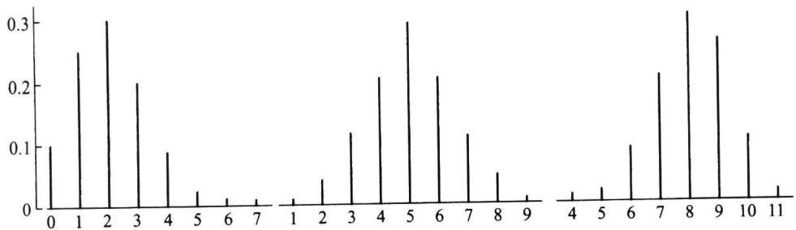  
(a)b(10,0.2)的线条图(右偏）  
(b)b(10,0.5）的线条图（对称）  
图2.4.1二项分布 $b ( \boldsymbol { n } , \boldsymbol { p } )$ 的线条图  
(c)b(10,0.8)的线条图(左偏）

从上图可以看出：

·位于均值np附近概率较大.

·随着p的增加，分布的峰逐渐右移.

例2.4.3甲、乙两棋手约定进行10局比赛，以赢的局数多者为胜.设在每局中甲赢的概率为0.6,乙赢的概率为0.4.如果各局比赛是独立进行的，试问甲胜、乙胜、不分胜负的概率各为多少？

解以X表示10局比赛中甲赢的局数，则X～b（10,0.6).所以

$$
P ( \mathbb { H } \mathbb { H } ) = P ( X \geqslant 6 ) = \sum _ { k = 6 } ^ { 1 0 } { \binom { 1 0 } { k } } 0 . 6 ^ { k } 0 . 4 ^ { 1 0 - k } = 0 . 6 3 3 \ 0 ,
$$

$$
P ( \mathcal { Z } \mathbb { A } \mathbb { \pmb { \mathrm { ) } } } = P ( X \leqslant 4 ) = \sum _ { k = 0 } ^ { 4 } { \binom { 1 0 } { k } } 0 . 6 ^ { k } 0 . 4 ^ { 1 0 - k } = 0 . 1 6 6 \ 3 ,
$$

$$
P ( \mathcal { K } \mathcal { H } \Psi \Psi ) = P ( X = 5 ) = { \binom { 1 0 } { 5 } } 0 . 6 ^ { 5 } 0 . 4 ^ { 5 } = 0 . 2 0 0 \ 7 .
$$

可见甲胜的可能性达63.3%，而乙胜的可能性只有16.63%，它比不分胜负的可能性还要小.后两个概率之和0.3670表示乙不输的概率.

## 2.4.2泊松分布

## 一、泊松分布

泊松分布是1837年由法国数学家泊松（Poisson,1781—1840)首次提出的.泊松分布的概率分布列是

$$
P ( X = k ) = { \frac { \lambda ^ { \ k } } { k ! } } \mathrm { e } ^ { - \lambda } , \ k = 0 , 1 , 2 , \cdots ,\tag{2.4.3}
$$

其中参数 $\lambda { > } 0$ ，记为 $X \sim P ( \boldsymbol { \lambda } )$

对泊松分布而言,很容易验证其和为1

$$
\sum _ { k = 0 } ^ { \infty } { \frac { \lambda ^ { k } } { k ! } } \mathrm { e } ^ { - \lambda } = \mathrm { e } ^ { - \lambda } \sum _ { k = 0 } ^ { \infty } { \frac { \lambda ^ { k } } { k ! } } = \mathrm { e } ^ { - \lambda } \mathrm { e } ^ { \lambda } = 1 .
$$

泊松分布是一种常用的离散分布，它常与单位时间（或单位面积、单位产品等）上的计数过程相联系，譬如，

·在一天内,来到某商场的顾客数.

·在单位时间内，一电路受到外界电磁波的冲击次数.

·1平方米内，玻璃上的气泡数.

·一铸件上的砂眼数.

·在一定时期内，某种放射性物质放射出来的α-粒子数，等等.都服从泊松分布.因此泊松分布的应用面是十分广泛的.

## 二、泊松分布的数学期望和方差

设随机变量 $X \sim P ( \lambda )$ ，则

$$
E ( X ) = \sum _ { k = 0 } ^ { \infty } k { \frac { \lambda ^ { ^ { k } } } { k ! } } \mathrm { e } ^ { - \lambda } = \lambda \mathrm { e } ^ { - \lambda } \sum _ { k = 1 } ^ { \infty } { \frac { \lambda ^ { ^ { k - 1 } } } { \left( k - 1 \right) ! } } = \lambda \mathrm { e } ^ { - \lambda } \mathrm { e } ^ { \lambda } = \lambda .
$$

这表明：泊松分布P(入)的数学期望就是参数入.

又因为

$$
\begin{array} { l } { { \displaystyle E ( X ^ { 2 } ) = \sum _ { k = 0 } ^ { \infty } k ^ { 2 } \frac { \lambda ^ { k } } { k ! } \mathrm { e } ^ { - \lambda } = \sum _ { k = 1 } ^ { \infty } k \frac { \lambda ^ { k } } { ( k - 1 ) ! } \mathrm { e } ^ { - \lambda } } } \\ { { \displaystyle = \sum _ { k = 1 } ^ { \infty } \left[ ( k - 1 ) + 1 \right] \frac { \lambda ^ { k } } { ( k - 1 ) ! } \mathrm { e } ^ { - \lambda } } } \\ { { \displaystyle = \lambda ^ { 2 } \mathrm { e } ^ { - \lambda } \sum _ { k = 2 } ^ { \infty } \frac { \lambda ^ { k - 2 } } { ( k - 2 ) ! } + \lambda \mathrm { e } ^ { - \lambda } \sum _ { k = 1 } ^ { \infty } \frac { \lambda ^ { k - 1 } } { ( k - 1 ) ! } } } \\ { { \displaystyle = \lambda ^ { 2 } + \lambda . } } \end{array}
$$

由此得X的方差为

$$
\operatorname { V a r } ( X ) = E ( X ^ { 2 } ) \ - ( E ( X ) ) ^ { 2 } = \lambda ^ { 2 } + \lambda - \lambda ^ { 2 } = \lambda .
$$

也就是说，泊松分布P(入)中的参数入既是数学期望又是方差.

为了看出不同的入的值，其泊松分布P(入)的变化情况，表2.4.2给出了入=0.8，2.0,4.0时，泊松分布的概率值，其线条图见图2.4.2.

表2.4.2一些泊松分布的概率值(空白处为0）
<table><tr><td>k</td><td>0</td><td>1</td><td>2</td><td>3</td><td>4</td><td>5</td><td>6</td><td>7</td><td>8</td><td>9</td><td>10</td></tr><tr><td>P(0.8）</td><td>0.449</td><td>0.360</td><td>0.144</td><td>0.038</td><td>0.008</td><td>0.001</td><td></td><td></td><td></td><td></td><td></td></tr><tr><td>P(2.0)</td><td>0.135</td><td>0.271</td><td>0.271</td><td>0.180</td><td>0.090</td><td>0.036</td><td>0.012</td><td>0.004</td><td>0.001</td><td></td><td></td></tr><tr><td>P(4.0)</td><td>0.018</td><td>0.073</td><td>0.147</td><td>0.195</td><td>0.195</td><td>0.156</td><td>0.104</td><td>0.060</td><td>0.030</td><td>0.0130.005</td><td></td></tr></table>

从上图可以看出：

·位于均值入附近概率较大.

·随着入的增加，分布逐渐趋于对称.

例2.4.4一铸件的砂眼(缺陷)数服从参数为入=0.5的泊松分布，试求此铸件上 至多有1个砂眼(合格品)的概率和至少有2个砂眼(不合格品)的概率.

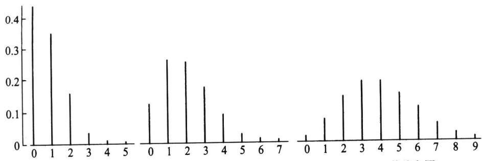  
(a)P(0.8）的线条图  
(b)P(2.0)的线条图  
(c)P(4.0)的线条图  
图2.4.2泊松分布P(入)的线条图

解以X表示这种铸件的砂眼数，由题意知X～P(0.5).则此种铸件上至多有1个砂眼的概率为

$$
P ( X \leqslant 1 ) = { \frac { 0 . 5 ^ { 0 } } { 0 ! } } \mathrm { e } ^ { - 0 . 5 } + { \frac { 0 . 5 ^ { 1 } } { 1 ! } } \mathrm { e } ^ { - 0 . 5 } = 0 . 9 1 .
$$

至少有2个砂眼的概率为

$$
P ( X \geqslant 2 ) = 1 - P ( X \leqslant 1 ) = 0 . 0 9 .
$$

例2.4.5某商店出售某种商品，由历史销售记录分析表明，月销售量（件）服从参数为8的泊松分布.问在月初进货时，需要多少库存量，才能有90%以上的把握可以满足顾客的需求.

解以X表示这种商品的月销售量，则 $X \sim P ( 8 )$ .那么满足要求的是使下式成立的最小正整数n.

$$
P ( X \leqslant n ) \geqslant 0 . 9 0 .
$$

为了寻求此种n,可以利用泊松分布表，附表1对各种入的值，给出了泊松分布函数$P ( X \leqslant k ) = \sum _ { i = 0 } ^ { k } { \frac { \lambda ^ { i } } { i ! } } \mathbf { e } ^ { - \lambda }$ 的数值表.在入=8时，可从附表1中查得

$$
P ( X \leqslant 1 1 ) = 0 . 8 8 8 , P ( X \leqslant 1 2 ) = 0 . 9 3 6 .
$$

所以月初进货12件时，能有90%以上的把握可以满足顾客的需求.

## 三、二项分布的泊松近似

泊松分布还有一个非常实用的特性，即可以用泊松分布作为二项分布的一种近似.在二项分布 $b ( \boldsymbol { n } , \boldsymbol { p } )$ 中,当n较大时,计算量是令人烦恼的.而在n较大且p较小时使用以下的泊松定理，可以减少二项分布中的计算量.

定理2.4.1(泊松定理）在n重伯努利试验中，记事件A在一次试验中发生的概率为p（与试验次数n有关),如果当n→∞时，有 $p _ { n }$ $n p _ { n } \to \lambda$ ,则

$$
\operatorname* { l i m } _ { n \to \infty } { \binom { n } { k } } p _ { n } ^ { k } { \left( { 1 - p _ { n } } \right) ^ { n - k } } = \frac { { \lambda ^ { \prime } } } { k ! } { \mathrm { e } ^ { - \lambda } } .\tag{2.4.4}
$$

证明记 $n p _ { n } = \lambda _ { n }$ ,即 ${ \cal P } _ { n } ^ { \phantom { \dagger } } { } ^ { \phantom { \dagger } } = \lambda _ { n } / n$ ,我们可得

$$
{ \binom { n } { k } } p _ { n } ^ { k } { \left( 1 - p _ { n } \right) } ^ { n - k } = { \frac { n ( n - 1 ) \cdots ( n - k + 1 ) } { k ! } } { \left( { \frac { \lambda _ { n } } { n } } \right) } ^ { k } { \left( 1 - { \frac { \lambda _ { n } } { n } } \right) } ^ { n - k }
$$

$$
= \frac { \lambda _ { n } ^ { \star } } { k ! } \Bigg ( 1 - \frac { 1 } { n } \Bigg ) \Bigg ( 1 - \frac { 2 } { n } \Bigg ) \cdots \Bigg ( 1 - \frac { k - 1 } { n } \Bigg ) \Bigg ( 1 - \frac { \lambda _ { n } } { n } \Bigg ) ^ { n - k } .
$$

对固定的k有

$$
\operatorname * { l i m } _ { n \to \infty } \lambda _ { n } = \lambda ,
$$

$$
\operatorname * { l i m } _ { n  \infty } ( 1 - { \frac { \lambda _ { n } } { n } } ) ^ { n - k } = { \mathrm e } ^ { - \lambda } ,
$$

$$
\operatorname* { l i m } _ { n \to \infty } \left( 1 - { \frac { 1 } { n } } \right) \cdots \left( 1 - { \frac { k - 1 } { n } } \right) = 1 .
$$

从而

$$
\operatorname* { l i m } _ { n \to \infty } { \binom { n } { k } } \ p _ { _ n } ^ { k } ( 1 - p _ { _ n } ) ^ { n - k } \ = \frac { \lambda ^ { ^ k } } { k ! } \mathrm { e } ^ { - \lambda }
$$

对任意的 $k \ ( \ k = 0 , 1 , 2 , \cdots )$ 成立.定理得证.

由于泊松定理是在 $n p _ { n } \to \lambda$ 条件下获得的，故在计算二项分布 $b ( n , p )$ 时，当 $\scriptstyle n$ 很大 $, p$ 很小，而乘积 $\lambda = n p$ 大小适中时，可以用泊松分布作近似，即

$$
{ \binom { n } { k } } p _ { , } ^ { k } { \left( 1 - p _ { , } \right) } ^ { n - k } \approx { \frac { \left( n p \right) ^ { k } } { k ! } } \mathrm { e } ^ { - n p } , \ k = 0 , 1 , 2 , \cdots .\tag{2.4.5}
$$

表2.4.3给出了按二项分布直接计算与利用泊松分布作近似的一些具体数据.从表中可以看出，两者的结果是很接近的，而且当n越大和p越小时，近似程度越好. $p$

表2.4.3二项分布与泊松近似的比较
<table><tr><td rowspan="2"> $k$ </td><td colspan="4">二项分布  $\cdot \left( \begin{array} { l } { { n } } \\ { { } } \\ { { k } } \end{array} \right) p ^ { k } \left( \begin{array} { l } { { 1 - p } } \end{array} \right) ^ { n - k }$  按 计算</td><td rowspan="2">泊松近似  $\frac { \left( n p \right) ^ { k } } { k ! } \mathrm { e } ^ { - n p } .$  按 计算</td></tr><tr><td> $n = 1 0$   $p { = } 0 . 1$ </td><td> $n = 2 0$   $p { = } 0 . 0 5$ </td><td> $n = 4 0$   $p { = } 0 . 0 2 5$ </td><td> $n = 1 0 0$ </td></tr><tr><td>0</td><td>0.349</td><td>0.358</td><td>0.363</td><td> $p { = } 0 . 0 1$  0.366</td><td> $\lambda = n p = 1$ </td></tr><tr><td>1</td><td>0.387</td><td>0.377</td><td>0.373</td><td>0.370</td><td>0.368</td></tr><tr><td>2</td><td>0.194</td><td>0.189</td><td>0.186</td><td>0.185</td><td>0.368</td></tr><tr><td>3</td><td>0.057</td><td>0.060</td><td>0.060</td><td>0.061</td><td>0.184</td></tr><tr><td>4</td><td>0.011</td><td>0.013</td><td>0.014</td><td></td><td>0.061</td></tr><tr><td>&gt;4</td><td>0.002</td><td>0.003</td><td>0.004</td><td>0.015 0.003</td><td>0.015 0.004</td></tr></table>

以下给出一些利用泊松分布作近似计算的例子.

例2.4.6已知某种疾病的发病率为0.001，某单位共有5000人.问该单位患有这种疾病的人数不超过5人的概率为多少？

解设该单位患有这种疾病的人数为X,则有 $X \sim b ( 5 \ 0 0 0 , 0 . 0 0 1 )$ ，而我们所求的为

$$
P ( X \leqslant 5 ) = \sum _ { k = 0 } ^ { 5 } { \binom { 5 0 0 0 } { k } } 0 . 0 0 1 ^ { k } 0 . 9 9 9 ^ { 5 0 0 0 - k } .
$$

这个概率的计算量很大.由于n很大,p很小，且 $\lambda = n p = 5$ 所以用泊松近似得

$$
P ( X \leqslant 5 ) \approx \sum _ { k = 0 } ^ { 5 } { \frac { 5 ^ { k } } { k ! } } \mathrm { e } ^ { - 5 } = 0 . 6 1 6 .
$$

例2.4.7有10000名同年龄段且同社会阶层的人参加了某保险公司的一项人寿保险.每个投保人在每年初需交纳200元保费，而在这一年中若投保人死亡，则受益人可从保险公司获得100000元的赔偿费.据生命表知这类人的年死亡率为0.001.试求保险公司在这项业务上

（1）亏本的概率；

（2）至少获利500000元的概率.

解设X为10000名投保人在一年中死亡的人数，则X服从二项分布b(10000,0.001).保险公司在这项业务上一年的总收人为 $2 0 0 \times 1 0 ~ 0 0 0 = 2 ~ 0 0 0 ~ 0 0 0$ （元）.因为 $n = 1 0 \ 0 0 0$ 很大 $, p = 0 . 0 0 1$ 很小，所以用 $\lambda = n p = 1 0$ 的泊松分布进行近似计算.

（1）保险公司在这项业务上“亏本"就相当于事件 $\left\{ X > 2 0 \right\}$ 发生.因此所求概率为

$$
P ( X > 2 0 ) = 1 - P ( X \leqslant 2 0 ) \approx 1 - \sum _ { k = 0 } ^ { 2 0 } \frac { 1 0 ^ { k } } { k ! } \mathrm { e } ^ { - 1 0 } = 1 - 0 . 9 9 8 = 0 . 0 0 2 .
$$

由此可看出，保险公司在这项业务上亏本的可能性是微小的.

（2）保险公司在这项业务上“至少获利500000元"就相当于事件 $\{ X \leqslant 1 5 \}$ 发生.因此所求概率为

$$
P ( X \leqslant 1 5 ) \approx \sum _ { k = 0 } ^ { 1 5 } { \frac { 1 0 ^ { k } } { k ! } } \mathrm { e } ^ { - 1 0 } = 0 . 9 5 1 .
$$

由此可看出，保险公司在这项业务上至少获利500000元的可能性很大.

例2.4.8为保证设备正常工作，需要配备一些维修工.如果各台设备发生故障是相互独立的，且每台设备发生故障的概率都是0.01.试在以下各种情况下，求设备发生故障而不能及时修理的概率.

（1）1名维修工负责20台设备；

（2）3名维修工负责90台设备；

（3）10名维修工负责500台设备.

解（1）以X,表示20台设备中同时发生故障的台数，则 $X _ { \scriptscriptstyle 1 }$ $X _ { 1 } \sim b ( 2 0 , 0 . 0 1 )$ .用参数为 $\lambda = n p = 2 0 \times 0 . 0 1 = 0 . 2$ 的泊松分布作近似计算，得所求概率为

$$
P ( X _ { 1 } \ > \ 1 ) \approx 1 - \sum _ { k = 0 } ^ { 1 } { \frac { 0 . 2 ^ { k } } { k ! } } \mathrm { e } ^ { - 0 . 2 } = 1 - 0 . 9 8 2 = 0 . 0 1 8 .
$$

（2）以X表示90台设备中同时发生故障的台数，则 $X _ { 2 }$ $X _ { \scriptscriptstyle 2 } \sim b ( 9 0 , 0 . 0 1 )$ .用参数为$\lambda = n p = 9 0 \times 0 . 0 1 = 0 . 9$ 的泊松分布作近似计算，得所求概率为

$$
P ( X _ { 2 } > 3 ) \approx 1 - \sum _ { k = 0 } ^ { 3 } \frac { 0 . 9 ^ { k } } { k ! } \mathrm { e } ^ { - 0 . 9 } = 1 - 0 . 9 8 7 = 0 . 0 1 3 .
$$

注意，此种情况下，不但所求概率比（1)中有所降低，而且3名维修工负责90台设备相当于每个维修工负责30台设备，工作效率是(1)中的1.5倍.

（3）以X表示500台设备中同时发生故障的台数，则 $X _ { 3 }$ $X _ { 3 } \sim 6 ( 5 0 0 , 0 . 0 1 )$ .用参数为$\lambda = n p = 5 0 0 \times 0 . 0 1 = 5$ 的泊松分布作近似计算，得所求概率为

$$
P ( X _ { 3 } \ > \ 1 0 ) \approx 1 - \sum _ { k = 0 } ^ { 1 0 } { \frac { 5 ^ { k } } { k ! } } \mathrm { e } ^ { - 5 } = 1 - 0 . 9 8 6 = 0 . 0 1 4 .
$$

注意，此种情况下所求概率与(2)中基本上一样，而10名维修工负责500台设备相当于每个维修工负责50台设备，工作效率是(2)中的1.67倍，是(1)中的2.5倍.

由此可知：若干维修工共同负责大量设备的维修，将提高工作的效率.

## 2.4.3超几何分布

## 一、超几何分布

从一个有限总体中进行不放回抽样常会遇到超几何分布.

设有N件产品，其中有M件不合格品.若从中不放回地随机抽取n件，则其中含有的不合格品的件数X服从超几何分布，记为 $X \sim h ( n , N , M )$ .超几何分布的概率分布列为（见第一章中例1.2.3）

$$
P ( X = k ) = { \frac { { \binom { M } { k } } { \binom { N - M } { n - k } } } { \binom { N } { n } } } , k = 0 , 1 , \cdots , r .\tag{2.4.6}
$$

其中 $r = \operatorname* { m i n } \left\{ M , n \right\}$ ，且 $M \leqslant N , n \leqslant N , n , N , M$ 均为正整数.

若要验证以上给出的确实为一个概率分布列，只需注意到有组合等式（见习题1. 2)

$$
\sum _ { k = 0 } ^ { r } { \binom { M } { k } } \left( { { N - M } } \right) ^ { N - M } = { \binom { N } { n } }
$$

即可.

超几何分布是一种常用的离散分布，它在抽样理论中占有重要地位.

## 二、超几何分布的数学期望和方差

若 $X \sim h ( n , N , M )$ ,则X的数学期望为

$$
E ( X ) = \sum _ { k = 0 } ^ { r } k { \frac { { \binom { M } { k } } { \binom { N - M } { n - k } } } { \binom { N } { n } } } = n { \frac { M } { N } } \sum _ { k = 1 } ^ { r } { \frac { { \binom { M - 1 } { k - 1 } } { \binom { N - M } { n - k } } } { \binom { N - 1 } { n - 1 } } } = n { \frac { M } { N } } .
$$

又因为

$$
\begin{array} { c } { { E ( X ^ { 2 } ) = \displaystyle \sum _ { k = 1 } ^ { r } k ^ { 2 } \frac { \binom { M } { k } \binom { N - M } { n - k } } { \binom { N } { n } } = \displaystyle \sum _ { k = 2 } ^ { r } k ( k - 1 ) \frac { \binom { M } { k } \binom { N - M } { n - k } } { \binom { N } { n } } + { \displaystyle { n } \frac { M } { N } } } } \\ { { = \displaystyle \frac { M ( M - 1 ) } { \binom { N } { n } } \sum _ { k = 2 } ^ { r } \binom { M - 2 } { k - 2 } \binom { N - M } { n - k } + { \displaystyle n } \frac { M } { N } } } \end{array}
$$

$$
= \frac { M ( \left. M - 1 \right) } { \binom { N } { n } } \binom { N - 2 } { n - 2 } + { } n \frac { M } { N } = \frac { M ( \left. M - 1 \right) n ( n - 1 ) } { N ( N - 1 ) } + { } n \frac { M } { N } ,
$$

由此得X的方差为

$$
\operatorname { V a r } ( X ) = E ( X ^ { 2 } ) - [ E ( X ) ] ^ { 2 } = { \frac { n M ( N - M ) ( N - n ) } { N ^ { 2 } ( N - 1 ) } } .
$$

## 三、超几何分布的二项近似

当 $n \ll N$ 时，即抽取个数n远小于产品总数N时，每次抽取后，总体中的不合格品率 $p { = } M / N$ 改变甚微，所以不放回抽样可近似地看成放回抽样，这时超几何分布可用二项分布近似：

$$
{ \frac { { \binom { M } { k } } { \binom { N - M } { n - k } } } { \binom { N } { n } } } \approx { \binom { n } { k } } p ^ { k } ( 1 - p ) ^ { n - k } , \sharp \sharp p = { \frac { M } { N } } .\tag{2.4.7}
$$

## 2.4.4几何分布与负二项分布

## 一、几何分布

在伯努利试验序列中，记每次试验中事件A发生的概率为p,如果X为事件A首次出现时的试验次数，则X的可能取值为1,2,，称X服从几何分布，记为 $X \sim G e \left( p \right)$ 其分布列为

$$
P ( X = k ) = ( 1 - p ) ^ { k - 1 } p , k = 1 , 2 , \cdots .\tag{2.4.8}
$$

实际问题中有不少随机变量服从几何分布，譬如，

·某产品的不合格率为0.05,则首次查到不合格品的检查次数 $X \sim G e ( 0 . 0 5 )$

·某射手的命中率为0.8,则首次击中目标的射击次数 $Y \sim G e ( 0 . 8 )$

·掷一颗骰子，首次出现6点的投掷次数 $Z \sim G e ( 1 / 6 )$

·同时掷两颗骰子，首次达到两个点数之和为8的投掷次数 $\pmb { \mathbb { W } } \sim G e ( 5 / 3 6 )$

## 二、几何分布的数学期望和方差

设随机变量X服从几何分布 $G e \left( p \right)$ ，令 $q = 1 - p$ ，利用逐项微分可得X的数学期望为

$$
\begin{array} { l } { \displaystyle { E ( X ) = \sum _ { k = 1 } ^ { \infty } k p q ^ { k - 1 } = p \sum _ { k = 1 } ^ { \infty } k q ^ { k - 1 } = p \sum _ { k = 1 } ^ { \infty } \frac { \mathrm { d } q ^ { k } } { \mathrm { d } q } } } \\ { \displaystyle { = p \frac { \mathrm { d } } { \mathrm { d } q } \Big ( \sum _ { k = 0 } ^ { \infty } q ^ { k } \Big ) = p \frac { \mathrm { d } } { \mathrm { d } q } \Big ( \frac { 1 } { 1 - q } \Big ) = \frac { p } { \left( 1 - q \right) ^ { 2 } } = \frac { 1 } { p } } . }  \end{array}
$$

又因为

$$
E ( X ^ { 2 } ) = \sum _ { k = 1 } ^ { \infty } k ^ { 2 } p q ^ { k - 1 } = p \left[ \sum _ { k = 1 } ^ { \infty } k ( k - 1 ) q ^ { k - 1 } + \sum _ { k = 1 } ^ { \infty } k q ^ { k - 1 } \right]
$$

$$
\begin{array} { l } { { \displaystyle = p q \sum _ { k = 1 } ^ { \infty } k \left( k - 1 \right) q ^ { k - 2 } + \frac { 1 } { p } = p q \sum _ { k = 1 } ^ { \infty } \frac { \mathrm { d } ^ { 2 } } { \mathrm { d } q ^ { 2 } } q ^ { k } + \frac { 1 } { p } } } \\ { { \displaystyle = p q \frac { \mathrm { d } ^ { 2 } } { \mathrm { d } q ^ { 2 } } \Big ( \sum _ { k = 0 } ^ { \infty } q ^ { k } \Big ) + \frac { 1 } { p } = p q \frac { \mathrm { d } ^ { 2 } } { \mathrm { d } q ^ { 2 } } \Bigg ( \frac { 1 } { 1 - q } \Bigg ) + \frac { 1 } { p } } } \\ { { \displaystyle = p q \frac { 2 } { \left( 1 - q \right) ^ { 3 } } + \frac { 1 } { p } = \frac { 2 q } { p ^ { 2 } } + \frac { 1 } { p } , } } \end{array}
$$

由此得X的方差为

$$
\operatorname { V a r } ( X ) = E ( X ^ { 2 } ) - [ E ( X ) ] ^ { 2 } = { \frac { 2 q } { p ^ { 2 } } } + { \frac { 1 } { p } } - { \frac { 1 } { p ^ { 2 } } } = { \frac { 1 - p } { p ^ { 2 } } } .
$$

从几何分布的数学期望可以看出：掷一颗骰子，首次出现点数6的平均投掷次数为6次.

## 三、几何分布的无记忆性

定理2.4.2（几何分布的无记忆性）设 $X \sim G e ( p )$ ,则对任意正整数m与n有

$$
P ( X \ > \ m + n \mid X > m ) = P ( X > n ) .\tag{2.4.9}
$$

在证明之前先解释上述概率等式的含义.在一列伯努利试验序列中，若首次成功（A)出现的试验次数X服从几何分布，则事件 $\left\{ X > m \right\}$ 表示前m次试验中A没有出现.假如在接下去的n次试验中A仍未出现，这个事件记为{ $| { \cal X } { > } m { + } n  \}$ .这个定理表明：在前m次试验中A没有出现的条件下，在接下去的n次试验中A仍未出现的概率只与n有关，而与以前的m次试验无关，似乎忘记了前m次试验结果，这就是无记忆性.

证明因为

$$
P ( X > n ) = \sum _ { k = n + 1 } ^ { \infty } \left( 1 - p \right) ^ { k - 1 } p = { \frac { p \left( 1 - p \right) ^ { n } } { 1 - \left( 1 - p \right) } } = \left( 1 - p \right) ^ { n } ,
$$

所以对任意的正整数m与n,条件概率

$$
P ( X > m + n \mid X > m ) = { \frac { P ( X > m + n ) } { P ( X > m ) } } = { \frac { \left( 1 - p \right) ^ { n + n } } { \left( 1 - p \right) ^ { m } } } = \left( 1 - p \right) ^ { n } = P ( X > n ) .
$$

这就证得了（2.4.9）式.

## 四、负二项分布

作为几何分布的一种延伸，我们来讨论下面的负二项分布，亦称帕斯卡分布：

在伯努利试验序列中，记每次试验中事件A发生的概率为p,如果X为事件A第r次出现时的试验次数，则X的可能取值为 $r , r + 1 , \cdots , r + m , \cdots$ .称X服从负二项分布或帕斯卡分布，其分布列为

$$
P ( X = k ) = { \binom { k - 1 } { r - 1 } } p ^ { r } ( 1 - p ) ^ { k - r } , k = r , r + 1 , \cdots .\tag{2.4.10}
$$

记为 $X \sim N b ( r , p )$ .当r=1时,即为几何分布.

这是因为在k次伯努利试验中，最后一次一定是A,而前k-1次中A应出现 $r - 1$ 次，由二项分布知其概率为 ${ \binom { k - 1 } { r - 1 } } p ^ { r - 1 } ( 1 - p ) ^ { k - r }$ ，再乘以最后一次出现A的概率p，即得

(2.4.10).

可以算得负二项分布的数学期望为 $r / p$ ，方差为 $r ( 1 - p ) / { p ^ { 2 } }$ 从直观上看这是合理的,因为首次出现A的平均试验次数是1/p,那么第r个A出现所需的平均试验次数是 $1 / p$ $r / p .$

如果将第一个A出现的试验次数记为X,第二个A出现的试验次数（从第一个A $X _ { \mathfrak { r } }$ 出现之后算起）记为 $X _ { 2 } , \cdots$ ，第r个A出现的试验次数(从第r-1个A出现之后算起）记为X，见图2.4.3.

$$
\underbrace { \overline { { A } } \overline { { A } } \cdots \overline { { A } } A } _ { X _ { 1 } } \underbrace { \overline { { A } } \overline { { A } } \cdots \overline { { A } } A } _ { X _ { 2 } } \cdots \underbrace { \overline { { A } } \overline { { A } } \cdots \overline { { A } } A } _ { X _ { r } }
$$

图2.4.3负二项变量与几何变量的关系

则诸 $X _ { i }$ 独立同分布，且 $X _ { i } \sim G e ( p )$ .此时有 $X = X _ { \scriptscriptstyle 1 } + X _ { \scriptscriptstyle 2 } + \cdots + X _ { \scriptscriptstyle r } \ \sim N b \left( { \mathrm { \Delta } r } , { p } \right)$ ，即负二项分布的随机变量可以分解成r个独立同分布的几何分布随机变量之和.譬如，在连续检查一大批产品中，若该批产品的不合格率为0.05，则在一个接一个的检查中，发现第5个不合格品时的检查次数X服从负二项分布Nb（5，0.05），其平均检查次数为

$$
E ( X ) = \frac { r } { p } = \frac { 5 } { 0 . 0 5 } = 1 0 0 .
$$

常用离散分布表见后面表2.5.1.

## 习题2.4

1.一批产品中有10%的不合格品，现从中任取3件，求其中至多有一件不合格品的概率.

2.一条自动化生产线上产品的一级品率为0.8，现检查5件，求至少有2件一级品的概率.

3.某优秀射手命中10环的概率为0.7，命中9环的概率为0.3.试求该射手三次射击所得的环数 不少于29环的概率.

4.经验表明：预订餐厅座位而不来就餐的顾客比例为20%.如今餐厅有50个座位，但预订给了52位顾客，问到时顾客来到餐厅而没有座位的概率是多少？

5.设随机变量 $X \sim b ( \boldsymbol { n } , \boldsymbol { p } )$ ，已知 $E ( \ X ) = 2 . 4 , \mathrm { V a r } ( X ) = 1 . 4 4$ ，求两个参数n与p各为多少？

6.设随机变量X服从二项分布 $b ( 2 , p )$ ，随机变量Y服从二项分布 $b ( 4 , p )$ .若 $P \left( X \geqslant 1 \right) = 8 / 9$ ，试 求 $P \left( \ Y \geqslant 1 \right)$

7.一批产品的不合格品率为0.02，现从中任取40件进行检查，若发现两件或两件以上不合格品就拒收这批产品.分别用以下方法求拒收的概率：

（1）用二项分布作精确计算；

（2）用泊松分布作近似计算.

8.设X服从泊松分布，且已知 $P \left( X = 1 \right) = P \left( X = 2 \right)$ ，求 $P \left( X = 4 \right)$

9.已知某商场一天来的顾客数X服从参数为入的泊松分布，而每个来到商场的顾客购物的概率 为p，证明：此商场一天内购物的顾客数服从参数为入p的泊松分布.

10.设一个人一年内患感冒的次数服从参数 $\lambda = 5$ 的泊松分布.现有某种预防感冒的药物对75%的人有效（能将泊松分布的参数减少为 $\lambda = 3 )$ ，对另外的25%的人不起作用.如果某人服用了此药，一年内患了两次感冒，那么该药对他(她)有效的可能性是多少？

11.有三个朋友去喝咖啡，他们决定用掷硬币的方式确定谁付账：每人掷一次硬币，如果有人掷

出的结果与其他两人不一样，那么由他付账；如果三个人掷出的结果是一样的，那么就重新掷，一直这样下去，直到确定了由谁来付账.求以下事件的概率：

（1）进行到了第2轮确定了由谁来付账；

（2）进行了3轮还没有确定付账人.

12.从一个装有m个白球、n个黑球的袋中有返回地摸球，直到摸到白球时停止.试求取出黑球 $\mathbf { \Omega } _ { \mathbf { \Omega } } , \mathfrak { n }$ 数的期望.

13.某种产品上的缺陷数X服从下列分布列：

$$
P ( X = k ) = { \frac { 1 } { 2 ^ { k + 1 } } } , \quad k = 0 , 1 , \cdots ,
$$

求此种 $\ncong$ 品上的平均缺陷数.

14.设随机变量X的密度函数为

$$
p \left( x \right) \ = \ \left\{ { { 2 x } , 0 < x < 1 } , \ \right.
$$

以Y表示对X的三次独立重复观察中事件 $\{ X \leqslant 1 / 2 \}$ 出现的次数，试求 $P \left( { \cal Y } = 2 \right)$

15.某产品的不合格品率为0.1，每次随机抽取10件进行检验，若发现其中不合格品数多于1，就去调整设备.若检验员每天检验4次，试问每天平均要调整几次设备？

16.一个系统由多个元件组成，各个元件是否正常工作是相互独立的，且各个元件正常工作的概率为p.若在系统中至少有一半的元件正常工作，那么整个系统就有效.问p取何值时，5个元件的系 ${ p } .$ $p$ 统比3个元件的系统更有可能有效？

17.设随机变量X服从参数为入的泊松分布，试证明

$$
E \left( \ X ^ { n } \right) = \lambda E \left[ \left( \ X + 1 \right) ^ { n - 1 } \right] ,
$$

利用此结果计算 $E ( \boldsymbol { X } ^ { 3 } )$

18.令 $X ( n , p )$ 表示服从二项分布 $b ( n , p )$ 的随机变量，试证明：

$$
P ( X { \big ( } n , p ) \leqslant i ) = 1 - P ( X { \big ( } n , 1 - p { \big ) } \leqslant n - i - 1 ) .
$$

19.设随机变量X服从参数为p的几何分布，试证明：

$$
E { \left( \frac { 1 } { X } \right) } = { \frac { - p \ln p } { 1 - p } }
$$

20.设随机变量 $X \sim b ( \boldsymbol { n } , \boldsymbol { p } )$ ，试证明：

$$
E { \left( \frac { 1 } { X + 1 } \right) } = { \frac { 1 - ( 1 - p ) ^ { n + 1 } } { ( n + 1 ) p } } .
$$

## 2.5常用连续分布

在连续分布场合，密度函数与分布函数是可以相互导出的，含有相同信息，各有各的用处，但在图形上密度函数对各种连续分布的特性能得到直观显示.如正态与偏态、单峰与平顶都是依密度函数图形命名的，因而人们对密度函数更为注意.

## 2.5.1 正态分布

正态分布是概率论与数理统计中最重要的一个分布,高斯(Gauss,1777—1855）在研究误差理论时首先用正态分布来刻画误差的分布，所以正态分布又称为高斯分布.

本书第四章的中心极限定理表明：一个随机变量如果是由大量微小的、独立的随机因素的叠加结果，那么这个变量一般都可以认为服从正态分布.因此很多随机变量可以用正态分布描述或近似描述，譬如测量误差、产品重量、人的身高、年降雨量等都可用正态分布描述.

## 一、正态分布的密度函数和分布函数

若随机变量X的密度函数为

$$
p \left( x \right) = \frac { 1 } { \sqrt { 2 \pi } \sigma } { \mathrm e } ^ { - \frac { \left( x - \mu \right) ^ { 2 } } { 2 \sigma ^ { 2 } } } , \quad - \infty \ < x \ < \ \infty \ ,\tag{2.5.1}
$$

则称X服从正态分布，称X为正态变量，记作 $X \sim N ( \mu , \sigma ^ { 2 } )$ .其中参数 $- \infty < \mu < \infty , \sigma > 0 .$ 其密度函数 $p ( x )$ 的图形如图2.5.1（a）所示 $\boldsymbol { p } ( \boldsymbol { x } )$ 是一条钟形曲线，中间高、两边低、左右关于 ${ \boldsymbol { x } } = \mu $ 对称 ${ } _ { , \mu }$ 是正态分布的中心，且在 $x = \mu$ 附近取值的可能性大，在两侧取值的可能性小 $. \mu \pm \sigma$ 是该曲线的拐点.

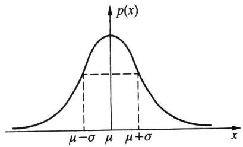  
（a)密度函数p(x）

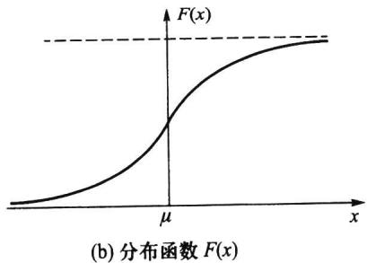  
图2.5.1正态分布

正态分布 $N ( \mu , \sigma ^ { 2 } )$ 的分布函数为

$$
F \left( x \right) = \frac { 1 } { \sqrt { 2 \pi } \sigma } \int _ { - \infty } ^ { x } \mathrm { e } ^ { - \frac { ( t - \mu ) ^ { 2 } } { 2 \sigma ^ { 2 } } } \mathrm { d } t .\tag{2.5.2}
$$

它是一条光滑上升的S形曲线，见图2.5.1(b).

图2.5.2给出了在μ和g变化时，相应正态密度曲线的变化情况. $\pmb { \mu }$ $\pmb { \sigma }$

·从图2.5.2(a)中可以看出：如果固定σ，改变μ的值，则图形沿x轴平移，而不 $\pmb { \sigma }$ $\pmb { \mu }$ 改变其形状.也就是说正态密度函数的位置由参数μ所确定，因此亦称μ为位置参数. $\mu$ $\pmb { \mu }$

·从图2.5.2(b)中可以看出：如果固定μ，改变σ的值，则分布的位置不变，但 $\mu$ $\sigma$ $\pmb { \sigma }$ 愈小，曲线呈高而瘦,分布较为集中;σ愈大，曲线呈矮而胖，分布较为分散.也就是说正 $; \pmb { \sigma }$ 态密度函数的尺度由参数σ所确定，因此称σ为尺度参数. $\pmb { \sigma }$ $\pmb { \sigma }$

## 二、标准正态分布

称 $\mu = 0 , \sigma = 1$ 时的正态分布 $N ( 0 , 1 )$ 为标准正态分布.

通常记标准正态变量为U，记标准正态分布的密度函数为 $U$ $\varphi \left( u \right)$ ，分布函数为$\varPhi ( u )$ ，即

$$
\varphi \left( u \right) = \frac { 1 } { \sqrt { 2 \pi } } { \mathrm { e } } ^ { - \frac { u ^ { 2 } } { 2 } } , \quad - \infty < u < \infty ,
$$

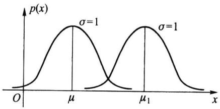  
(a)o固定，μ值改变

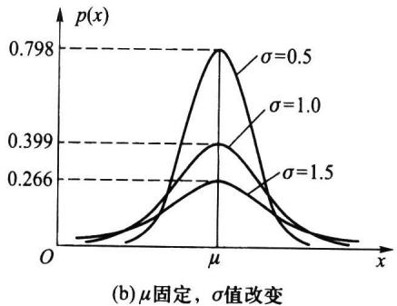  
图2.5.2正态密度函数

$$
\phi \left( \ u \right) = \frac { 1 } { \sqrt { 2 \pi } } \int _ { - \infty } ^ { u } \mathrm { e } ^ { - \frac { t ^ { 2 } } { 2 } } \mathrm { d } t , \mathrm { ~  ~ \bar { ~ } { ~ \phi ~ } ~ } - \infty < u < \infty .
$$

由于标准正态分布的分布函数不含任何未知参数，故其值 $\varPhi \left( \ u \right) = P \left( \ U \leqslant u \right)$ 完全可以算出，附表2对 $u \geqslant 0$ 给出了 $\varPhi ( u )$ 的值.对于 $\varPhi ( u )$ 有

$\begin{array} { r } { \bar { \mathcal { P } } \left( \mathbf { \bar { \Pi } } - u \right) = 1 - \bar { \mathcal { P } } \left( \mathbf { \Delta } u \right) } \end{array}$

$P ( \ U { > } u ) = 1 { - } \varPhi ( \ u )$

$P \left( a < U < b \right) = \varPhi \left( b \right) - \varPhi \left( a \right)$

$P ( \ | U | < c ) = 2 \phi ( \ c ) - 1 \ ( \ c \geqslant 0 )$

这些等式都不难推得.

例2.5.1设 $U \sim N ( 0 , 1 )$ ,利用附表2,求下列事件的概率：

(1) $P ( \ U { < } 1 . 5 2 ) = \phi ( \ 1 . 5 2 ) = 0 . 9 3 5 \ 7 .$

(2) $P ( \ U { > } 1 . 5 2 ) = 1 - { \phi } ( \ 1 . 5 2 ) = 1 - 0 . 9 3 5 \ 7 = 0 . 0 6 4 \ 3 .$

(3) $P ( \ U { < } { - } 1 . 5 2 ) = 1 { - } \varPhi ( \ 1 . 5 2 ) = 0 . 0 6 4 \ 3 .$

(4) $\begin{array} { r l } & { P \left( - 0 . 7 5 \leqslant U \leqslant 1 . 5 2 \right) = \varPhi \left( 1 . 5 2 \right) - \varPhi \left( - 0 . 7 5 \right) } \\ & { \qquad \quad = \varPhi \left( 1 . 5 2 \right) - \left[ 1 - \varPhi \left( 0 . 7 5 \right) \right] } \\ & { \qquad = 0 . 9 3 5 \ 7 - 1 + 0 . 7 7 3 \ 4 = 0 . 7 0 9 \ 1 . } \end{array}$

(5） $P ( \mid U \mid \leqslant 1 . 5 2 ) = 2 \phi { \big ( } 1 . 5 2 { \big ) } - 1 = 2 \times 0 . 9 3 5 \ 7 - 1 = 0 . 8 7 1 \ 4 .$

## 三、正态变量的标准化

正态分布有一个家族

$$
\begin{array} { r } { \mathcal { P } = \left\{ N ( \mu , \sigma ^ { 2 } ) : - \infty < \mu < \infty , \sigma > 0 \right\} , } \end{array}
$$

标准正态分布 $N ( 0 , 1 )$ 是其一个中心成员.以下定理说明：一般正态变量都可以通过一个线性变换(标准化)化成标准正态变量.因此与正态变量有关的一切事件的概率都可通过查标准正态分布函数表获得.可见标准正态分布 $N ( 0 , 1 )$ 对一般正态分布 $N ( \mu$

$\sigma ^ { 2 } )$ 的计算起着关键的作用.

定理2.5.1若随机变量 $X \sim N ( \mu , \sigma ^ { 2 } )$ ，则 $U { = } \left( X { - } \mu \right) / \sigma \sim N ( 0 , 1 )$

证明记X与U的分布函数分别为 $\boldsymbol { F } _ { \boldsymbol { x } } ( \boldsymbol { x } )$ 与 $\boldsymbol { F } _ { \boldsymbol { v } } ( \boldsymbol { u } )$ ，则由分布函数的定义知

$$
F _ { _ { U } } ( u ) = P ( { \mathit { U } } \leqslant u ) = P \Big ( \frac { X - \mu } { \sigma } \leqslant u \Big ) = P ( X \leqslant \mu + \sigma u ) = F _ { _ { X } } ( \mu + \sigma u ) .
$$

由于正态分布函数是严格单调增函数，且处处可导，因此若记X与U的密度函数分别为 $\boldsymbol { p } _ { \boldsymbol { \chi } } ( \boldsymbol { x } )$ 与 $\boldsymbol { p } _ { \scriptscriptstyle { U } } ( \boldsymbol { u } )$ ，则有

$$
p _ { _ { U } } ( u ) = { \frac { \mathrm { d } } { \mathrm { d } u } } F _ { _ { X } } ( \mu + \sigma u ) = p _ { _ X } ( \mu + \sigma u ) \cdot \sigma = { \frac { 1 } { \sqrt { 2 \pi } } } \mathrm { e } ^ { - u ^ { 2 } / 2 } ,
$$

由此得

$$
U = \frac { X \mathrm { ~ - ~ } \mu } { \sigma } \sim N ( 0 , 1 ) .
$$

由以上定理，我们马上可以得到一些在实际中有用的计算公式，若随机变量 $X \sim$ $N ( \mu , \sigma ^ { 2 } )$ ，则

$$
P ( X \leqslant c ) = \phi \left( { \frac { c - \mu } { \sigma } } \right) .\tag{2.5.3}
$$

$$
P ( a < X \leqslant b ) = \phi \biggl ( \frac { b - \mu } { \sigma } \biggr ) - \phi \biggl ( \frac { a - \mu } { \sigma } \biggr ) .\tag{2.5.4}
$$

例2.5.2设随机变量X服从正态分布 $N ( 1 0 8 , 3 ^ { 2 } )$ ，试求：

(1） $P ( \ 1 0 2 < X < 1 1 7 )$

（2）常数a，使得 $P ( X < a ) = 0 . 9 5 .$

解利用公式(2.5.4）及查附表2得

(1）

$$
\begin{array} { l } { { P ( 1 0 2 ~ < ~ X ~ < ~ 1 1 7 ) = \displaystyle \phi \left( \frac { 1 1 7 ~ - ~ 1 0 8 } { 3 } \right) ~ - ~ \phi \left( \frac { 1 0 2 ~ - ~ 1 0 8 } { 3 } \right) } } \\ { { { } } } \\ { { { } = \displaystyle \phi ( 3 ) ~ - \phi ( - 2 ) = \phi ( 3 ) ~ + \phi ( 2 ) ~ - 1 } } \\ { { { } } } \\ { { { } = 0 . 9 9 8 ~ 7 ~ + ~ 0 . 9 7 7 ~ 2 ~ - 1 = 0 . 9 7 5 ~ 9 . } } \end{array}
$$

（2）由

$$
P ( X < a ) = \phi \left( \frac { a - 1 0 8 } { 3 } \right) = 0 . 9 5 , \frac { \ast \ast } { \ast } ( \phi ^ { - 1 } ( 0 . 9 5 ) = \frac { a - 1 0 8 } { 3 } ,
$$

其中 $\bar { \pmb { \phi } } ^ { - 1 }$ 为Φ的反函数.从附表2由里向外反查得

$$
\phi ( 1 . 6 4 ) = 0 . 9 4 9 \ 5 , \qquad \phi ( 1 . 6 5 ) = 0 . 9 5 0 \ 5 ,
$$

再用线性内插法可得 $\Phi ( 1 . 6 4 5 ) = 0 . 9 5$ ,即 $\phi ^ { - 1 } ( 0 . 9 5 ) = 1 . 6 4 5$ ，故

$$
{ \frac { a - 1 0 8 } { 3 } } = 1 . 6 4 5 ,
$$

从中解得a=112.935.

从上例我们可以看出，有些场合下给定 $\varPhi ( x )$ )的值p，可以从附表2中由里向外反 $p$ 查表来得到 $\boldsymbol { x } _ { p }$ ,使 $\pmb { \phi } ( \pmb { x } _ { p } ) = \pmb { p }$ 或 $\Phi ^ { - 1 } \mathopen { } \mathclose \bgroup \left( p \aftergroup \egroup \right) = x _ { p }$ ,这时x。称为标准正态分布的p分位数.在 $x _ { p }$ 上例中1.645就是标准正态分布的0.95分位数，更一般叙述见2.7.3节.分位数在统计

中被大量使用.

例2.5.3在考试中，如果考生的成绩X近似地服从正态分布，则通常认为这次考试（就合理地划分考生成绩的等级而言)是正常的.教师经常把分数超过 $\mu { + } \sigma$ 的评为A等，分数在μ到μ+σ之间的评为B等，分数在μ-σ到μ之间的评为C等，分数在 $\pmb { \mu }$ $\mu { + } \sigma$ ${ \mu } ^ { - } { \sigma }$ $\mu$ $\mu { - } 2 \sigma$ 到 ${ \mu - } \sigma$ 之间的评为D等，分数在 $\mu - 2 \sigma$ 以下的评为F等.由此可计算得：

$$
P ( X \geqslant \mu ^ { + } \sigma ) = P \bigg ( \frac { X { - } \mu } { \sigma } \geqslant 1 \bigg ) = 1 { - } \varPhi \left( 1 \right) \approx 0 . 1 5 8 \ 7 ,
$$

$$
P ( \mu \leqslant X < \mu + \sigma ) = P \bigg ( 0 \leqslant \frac { X - \mu } { \sigma } < 1 \bigg ) = \Phi \left( \ 1 \right) - \Phi \left( \ 0 \right) \approx 0 . 3 4 1 \ 3 ,
$$

$$
P \left( \mu ^ { - } \sigma \leqslant X < \mu \right) = P \bigg ( - 1 \leqslant \frac { X - \mu } { \sigma } < 0 \bigg ) = \varPhi \left( 0 \right) - \varPhi \left( - 1 \right) \approx 0 . 3 4 1 \ 3 ,
$$

$$
P ( \mu ^ { - 2 \sigma \leqslant X < \mu ^ { - } \sigma } ) = P \bigg ( - 2 \leqslant \frac { X ^ { - \mu ^ { \prime } } } { \sigma } < ^ { - 1 } \bigg ) = \Phi \left( - 1 \right) - \Phi \left( - 2 \right) \approx 0 . 1 3 5 ~ 9 ,
$$

$$
P ( X < \mu { - } 2 \sigma ) = P \bigg ( \frac { X { - } \mu } { \sigma } < - 2 \bigg ) = \Phi \left( - 2 \right) \approx 0 . 0 2 2 \ 8 .
$$

这说明：用这种方法划分成绩的等级，获得A等的约占16%,B等的约占34%，C等的约占34%,D等的约占14%,F等的约占2%.

## 四、正态分布的数学期望与方差

设随机变量 $X \sim N ( \mu , \sigma ^ { 2 } )$ ，由于 $U { = } \left( X { - } \mu \right) / \sigma \sim N ( 0 , 1 )$ ,所以U的数学期望为

$$
E ( U ) = { \frac { 1 } { \sqrt { 2 \pi } } } { \int } _ { - \infty } ^ { \infty } u \mathrm { e } ^ { - \frac { u ^ { 2 } } { 2 } } \mathrm { d } u ,
$$

注意到上述积分的被积函数为一个奇函数，所以其积分值等于0,即 $E \left( \ U \right) = 0 .$ 又因为$X = \mu + \sigma U$ ，所以由数学期望的性质得

$$
E ( \boldsymbol { X } ) = \mu + \sigma \times 0 = \mu .
$$

也就是说，正态分布 $N ( \mu , \sigma ^ { 2 } )$ 中的 $\mu$ 为数学期望.

又因为

$$
{ \begin{array} { r l } & { { \mathrm { V a r } } ( U ) \ = E ( \ U ^ { 2 } ) = { \frac { 1 } { \sqrt { 2 \pi } } } { \displaystyle \int _ { - \infty } ^ { \infty } } \ u ^ { 2 } \mathrm { e } ^ { - { \frac { u ^ { 2 } } { 2 } } } \mathrm { d } u = { \frac { 1 } { \sqrt { 2 \pi } } } { \displaystyle \int _ { - \infty } ^ { \infty } } u \mathrm { d } ( \mathrm { \Omega } - \mathrm { e } ^ { - { \frac { u ^ { 2 } } { 2 } } } ) } \\ & { \qquad = { \frac { 1 } { \sqrt { 2 \pi } } } ( \mathrm { \Omega } - u \mathrm { e } ^ { - { \frac { u ^ { 2 } } { 2 } } } | _ { - \infty } ^ { \infty } + \int _ { - \infty } ^ { \infty } \mathrm { e } ^ { - { \frac { u ^ { 2 } } { 2 } } } \mathrm { d } u ) \ = { \frac { 1 } { \sqrt { 2 \pi } } } { \displaystyle \int _ { - \infty } ^ { \infty } } \mathrm { e } ^ { - { \frac { u ^ { 2 } } { 2 } } } \mathrm { d } u = { \frac { 1 } { \sqrt { 2 \pi } } } \sqrt { 2 \pi } \ = 1 , } \end{array} }
$$

且 $X = \mu + \sigma U$ ，所以由方差的性质得

$$
\operatorname { V a r } ( X ) = \operatorname { V a r } ( \mu + \sigma U ) = \sigma ^ { 2 } .
$$

这说明,正态分布 ${ \cal N } ( \mu , \sigma ^ { 2 } )$ 中另一个参数 $\sigma ^ { 2 }$ 就是X的方差.

在求正态分布的数学期望和方差过程中，用到了一种变换：令 $U = \left( X - { \mu } \right) / \sigma$ ，则

$E ( \ U ) = 0 , \operatorname { V a r } ( \ U ) = 1$ .这个变换在很多场合也可使用，也就是对任意非正态随机变量X,如果X的数学期望 $E ( X )$ 和方差 $\mathbf { V a r } ( X )$ 存在，则称

$$
\chi ^ { * } \ = { \frac { X - E ( X ) } { \sqrt { \operatorname { V a r } ( X ) } } }
$$

为X的标准化随机变量，且可得

$$
E ( X ^ { ^ { \bullet } } ) = 0 , \qquad \operatorname { V a r } ( X ^ { ^ { \bullet } } ) = 1 .
$$

## 五、正态分布的3σ原则

设随机变量 $X \sim N ( \mu , \sigma ^ { 2 } )$ ，则

$$
P ( \mu - k \sigma < X < \mu + k \sigma ) = P \bigg ( \left. \left| \frac { X - \mu } { \sigma } \right| < k \right) = \Phi \left( \mathbf { \xi } k \right) - \Phi \left( \mathbf { \xi } - k \right) = 2 \Phi \left( k \right) - 1
$$

当k=1,2,3时，有

$$
\begin{array} { r c l } { { } } & { { } } & { { P ( \mu ^ { - } \sigma < X < \mu ^ { + } \sigma ) = 2 \phi ( 1 ) - 1 = 0 . 6 8 2 \ 6 , } } \\ { { } } & { { } } & { { } } \\ { { } } & { { } } & { { P ( \mu ^ { - } 2 \sigma < X < \mu ^ { + } 2 \sigma ) = 2 \phi ( 2 ) - 1 = 0 . 9 5 4 \ 5 , } } \\ { { } } & { { } } & { { } } \\ { { } } & { { } } & { { P ( \mu ^ { - } 3 \sigma < X < \mu ^ { + } 3 \sigma ) = 2 \phi ( 3 ) - 1 = 0 . 9 9 7 \ 3 . } } \end{array}\tag{2.5.5}
$$

这是正态分布的重要性质.假如某随机变量取值的概率近似满足（2.5.5），则可认为这个随机变量近似服从正态分布；假如(2.5.5）三式中有一个偏差较大，则可以认为这个随机变量不服从正态分布.这就是正态分布的3g原则，这个原则在X的观察值较多（成百上千个)时，常用于判断X的分布是否近似服从正态分布.

在生产中某产品的质量要求常规定其上、下控制限，若上、下控制限能覆盖区间$( \mu - 3 \sigma , \mu + 3 \sigma )$ ，则称该生产过程受控制，并称其比值

$$
C _ { _ { P } } = { \frac { \operatorname { E } \ddagger { 2 } \ddagger { \mathrm { 1 1 } } \jmath \mathbb { B } \mathbb { R } - \mathsf { T } \ddagger { 2 } \sharp \mathbb { 1 } \jmath \mathbb { B } \mathbb { R } } { 6 \sigma } }
$$

为过程能力指数.当 $C _ { p } < 1$ 时，认为生产过程不足；当 $C _ { p } \geqslant 1 . 3 3$ 时，认为生产过程正常；  
当C,为其他值时,常认为生产过程不稳定，需要改进. $C _ { p }$

## 2.5.2均匀分布

## 一、均匀分布的密度函数和分布函数

前面曾以例子形式说明过均匀分布，这里给出一般的叙述：若随机变量X的密度函数（见图2.5.3（a））为

$$
p ( x ) = \left\{ { \frac { 1 } { b - a } } , a < x < b , \right.\tag{2.5.6}
$$

则称X服从区间 $( a , b )$ 上的均匀分布，记作 $X \sim U ( a , b )$ ，其分布函数（见图2.5.3（b)）为

$$
F ( x ) = \left\{ { \frac { \displaystyle 0 , } { \displaystyle - a } } , \quad a \leqslant x < b , \right.\tag{2.5.7}
$$

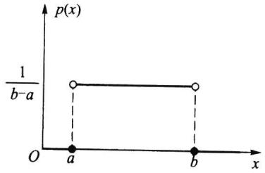  
(a)密度函数p(x)

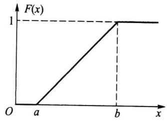  
(b)分布函数F(x)  
图2.5.3(a,b)上的均匀分布

均匀分布又被称为平顶分布，它的背景可视作随机点X等可能地落在区间 $( a , b )$ 上.均匀分布在实际中经常使用，譬如一个半径为r的汽车轮胎，因为轮胎圆周上的任一点接触地面的可能性是相同的，所以轮胎圆周接触地面的位置X服从（0，2πr）上的均匀分布，这只要看一看报废轮胎的四周磨损程度几乎是相同的就可明白均匀分布的含义了.

例2.5.4设随机变量X服从(0,10)上的均匀分布，现对X进行4次独立观测，试求至少有3次观测值大于5的概率.

解设随机变量Y是4次独立观测中观测值大于5的次数，则 $Y \sim b ( 4 , p )$ ,其中$p = P \left( \ X > 5 \right)$ .由 $X \sim U ( 0 , 1 0 )$ ,知X的密度函数为

$$
p ( x ) = \left\{ { \frac { 1 } { 1 0 } } , \quad 0 < x < 1 0 , \right.
$$

所以

$$
p = P ( X > 5 ) = \int _ { 5 } ^ { 1 0 } { \frac { 1 } { 1 0 } } \mathrm { d } x = { \frac { 1 } { 2 } } ,
$$

于是

$$
P ( \ Y \geqslant 3 ) = { \binom { 4 } { 3 } } p ^ { 3 } ( 1 - p ) + { \binom { 4 } { 4 } } p ^ { 4 } = 4 { \left( { \frac { 1 } { 2 } } \right) } ^ { 4 } + { \left( { \frac { 1 } { 2 } } \right) } ^ { 4 } = { \frac { 5 } { 1 6 } } .
$$

## 二、均匀分布的数学期望和方差

设随机变量 $X \sim U ( a , b )$ ，则

$$
E ( X ) = \int _ { a } ^ { b } \frac { x } { b \textrm { - } a } \mathrm { d } x = \frac { b ^ { 2 } - a ^ { 2 } } { 2 ( b \textrm { - } a ) } = \frac { a + b } { 2 } ,
$$

这正是区间(a,b)的中点.

又因为

$$
E ( X ^ { 2 } ) = \int _ { a } ^ { b } \frac { x ^ { 2 } } { b \textrm { - } a } \mathrm { d } x = \frac { b ^ { 3 } - a ^ { 3 } } { 3 ( b \textrm { - } a ) } = \frac { a ^ { 2 } + a b + b ^ { 2 } } { 3 } ,
$$

由此得X的方差为

$$
\operatorname { V a r } ( X ) = E ( X ^ { 2 } ) \ - \ \left[ E ( X ) \ \right] ^ { 2 } = { \frac { a ^ { 2 } \ + \ a b \ + \ b ^ { 2 } } { 3 } } \ - { \frac { \ ( a \ + \ b ) ^ { 2 } } { 4 } } = { \frac { ( b \ - \ a ) ^ { 2 } } { 1 2 } } .
$$

譬如，均匀分布U(1,5)的均值 $E ( X ) = 3$ ，方差 $\mathrm { V a r } ( X ) = 4 / 3$

## 2.5.3指数分布

## 一、指数分布的密度函数和分布函数

若随机变量X的密度函数（见图2.5.4）为

$$
p ( x ) = \left\{ { \begin{array} { l l } { \lambda \mathrm { e } ^ { - \lambda x } , } & { x \geqslant 0 , } \\ { 0 , } & { x < 0 , } \end{array} } \right.\tag{2.5.8}
$$

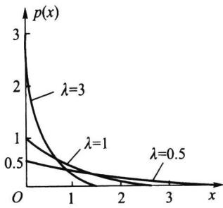

则称X服从指数分布，记作 $X \sim E x p ( \lambda )$ ，其中参数 $\lambda > 0 .$ 指数分布的分布函数为

图2.5.4参数为入的指数

$$
F ( x ) = \left\{ \begin{array} { l l } { 1 - \mathrm { e } ^ { - \lambda x } , } & { x \geqslant 0 , } \\ { 0 , } & { x < 0 . } \end{array} \right.\tag{2.5.9}
$$

分布密度函数

指数分布是一种偏态分布，由于指数分布随机变量只可能取非负实数，所以指数分布常被用作各种“寿命”分布，譬如电子元器件的寿命、动物的寿命、电话的通话时间、随机服务系统中的等待时间等都可假定服从指数分布.指数分布在可靠性与排队论中有着广泛的应用.

## 二、指数分布的数学期望和方差

设随机变量 $X \sim E x p ( \lambda )$ ，则

$$
E ( X ) = \int _ { 0 } ^ { \infty } x \mathrm { { \Large ~ \hat { e } ^ { - \lambda x } } } \mathrm { d } x = \int _ { 0 } ^ { \infty } x \mathrm { { \Large ~ d } } ( - \mathrm { ~ e ~ } ^ { - \lambda x } ) = - \left. x \mathrm { { e } } ^ { - \lambda x } \right| _ { 0 } ^ { \infty } + \int _ { 0 } ^ { \infty } \mathrm { e } ^ { - \lambda x } \mathrm { { \mit \mathrm { d } } x } = - \left. \frac { 1 } { \lambda } \mathrm { e } ^ { - \lambda x } \right| _ { 0 } ^ { \infty } = \frac { 1 } { \lambda } .
$$

在指数分布中，有时记 $\theta = 1 / \lambda$ ，则θ为指数分布的数学期望.

又因为

$$
E ( X ^ { 2 } ) = \int _ { 0 } ^ { \infty } x ^ { 2 } \lambda \mathrm { e } ^ { - \lambda x } \mathrm { d } x = \int _ { 0 } ^ { \infty } x ^ { 2 } \mathrm { d } ( - \mathrm { e } ^ { - \lambda x } ) = - \left. x ^ { 2 } \mathrm { e } ^ { - \lambda x } \right| _ { 0 } ^ { \infty } + 2 \int _ { 0 } ^ { \infty } x \mathrm { e } ^ { - \lambda x } \mathrm { d } x = \frac { 2 } { \lambda ^ { 2 } } ,
$$

由此得X的方差为

$$
\operatorname { V a r } ( X ) = E ( X ^ { 2 } ) - \left[ E ( X ) \right] ^ { 2 } = { \frac { 2 } { \lambda ^ { 2 } } } - { \frac { 1 } { \lambda ^ { 2 } } } = { \frac { 1 } { \lambda ^ { 2 } } } .
$$

譬如，某电子元件的寿命（单位：h)X服从指数分布 $E x p ( \lambda )$ ,其中 $\lambda = 0 . 0 0 1$ ，则平均寿命为1000（h），方差为 $1 0 ^ { 6 } ( \mathrm { h } ^ { 2 } )$ .寿命数据的方差常是很大的.

## 三、指数分布的无记忆性

在离散分布场合下，定理2.4.2给出了几何分布的无记忆性，而在连续分布场合下，下面给出指数分布的无记忆性.

定理2.5.2（指数分布的无记忆性）如果随机变量 $X \sim E x p \left( \lambda \right)$ ，则对任意 $s { > } 0 , t { > }$

0,有

$$
P ( X \ > \ s \ + \ t \mid \ X > \ s ) = P ( X \ > \ t ) .\tag{2.5.10}
$$

上式可以理解为：记X是某种产品的使用寿命（h），若X服从指数分布，那么已知此产品使用了s（h)没发生故障，则再能使用t（h)而不发生故障的概率与已使用的s(h)无关，只相当于重新开始使用t（h)的概率，即对已使用过的s（h)没有记忆.

证明因为 $X \sim E x p ( \lambda )$ ，所以 $P ( X > s ) = \mathrm { e } ^ { - \lambda s } , s > 0 .$ 又因为

$$
\{ X > s + t \} \subset \{ X > s \} ,
$$

于是条件概率

$$
P ( X > s + t \mid X > s ) = { \frac { P ( X > s + t ) } { P ( X > s ) } } = { \frac { \mathrm { e } ^ { - \lambda ( s + t ) } } { \mathrm { e } ^ { - \lambda s } } } = \mathrm { e } ^ { - \lambda t } = P ( X > t ) .
$$

这就证明了（2.5.10)式.

以下例子说明了泊松分布与指数分布的关系.

例2.5.5如果某设备在长为t的时间[0,t]内发生故障的次数 $N ( t )$ （与时间长度t有关)服从参数为入t的泊松分布，则相继两次故障之间的时间间隔T服从参数为入的指数分布.

解设 ${ \cal N } ( t ) \sim { \cal P } ( \lambda t )$ ，即

$$
P ( N ( t ) = k ) = { \frac { \left( \lambda t \right) ^ { k } } { k ! } } \mathrm { e } ^ { - \lambda t } , \qquad k = 0 , 1 , \cdots .
$$

注意到两次故障之间的时间间隔T是非负随机变量，且事件 $\left\{ T \geqslant t \right\}$ 说明此设备在[0,t]内没有发生故障，即 $\left| \begin{array} { l } { T \gtrless t } \end{array} \right\} = \left\{ N ( t ) = 0 \right\}$ ,由此我们得

当t<0时，有 $F _ { _ { T } } ( \varepsilon ) = P ( { \cal T } \varepsilon { } _ { t } ) = 0$

当 $t \geqslant 0$ 时，有

$$
F _ { \tau } ( t ) = P ( T \leqslant t ) = 1 - P ( T > t ) = 1 - P ( N ( t ) = 0 ) = 1 - { \mathrm { e } } ^ { - \lambda t } ,
$$

所以 $T \sim E x p \left( \lambda \right)$ ,即相继两次故障之间的时间间隔T服从参数为入的指数分布，图2.5.5示意其间关系.

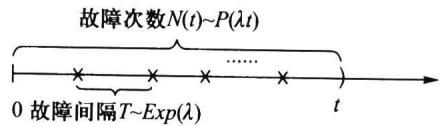  
图2.5.5故障次数与故障间隔之间的关系

## 2.5.4伽马分布

## 一、伽马函数

称以下函数

$$
\Gamma ( \alpha ) = \int _ { 0 } ^ { \infty } { x ^ { \alpha - 1 } } \mathrm { e } ^ { - x } \mathrm { d } x\tag{2.5.11}
$$

为伽马函数，其中参数 $\alpha { > } 0 .$ 伽马函数具有如下性质：

(a)

1. $\Gamma ( 1 ) = 1 , \Gamma \left( \frac { 1 } { 2 } \right) = \sqrt { \pi } .$

2. $\Gamma ( \alpha { + } 1 ) = \alpha \Gamma ( \alpha )$ （可用分部积分法证得).当α为自然数n时，有 $\pmb { \alpha }$ $\Gamma ( n + 1 ) = n \Gamma ( n ) = n !$

## 二、伽马分布

若随机变量X的密度函数为

$$
p ( x ) = \left\{ { \frac { \lambda ^ { \alpha } } { \Gamma ( \alpha ) } } x ^ { \alpha ^ { - 1 } } \mathrm { e } ^ { - \lambda x } , \ x \geqslant 0 , \right.\tag{2.5.12}
$$

则称X服从伽马分布，记作 $X \sim G a ( \alpha , \lambda )$ ，其中 $\alpha { > } 0$ 为形状参数， $\lambda > 0$ 为尺度参数.图2.5.6给出若干条入固定、α不同的伽马分布密度函数曲线，从图中可以看出：

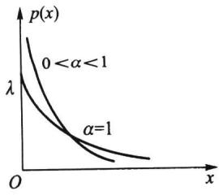

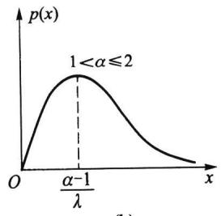

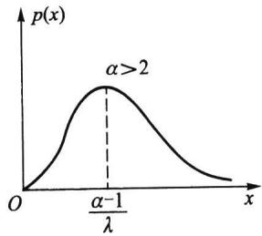  
图2.5.6入固定、不同α的伽马分布密度函数曲线

·当 $0 < \alpha < 1$ 时 ${ \bf \nabla } _ { p } ( { \bf \nabla } _ { x } )$ 是 $\overrightarrow { j }$ 格下降函数，且在 $\scriptstyle x = 0$ 处有奇异点.

·当 $\alpha = 1$ 时 ${ } _ { p } ( x )$ 是严格下降函数，且在 $\scriptstyle x = 0$ 处 $p ( 0 ) = \lambda$

·当 $1 < \alpha \leqslant 2$ 时 $, p ( x )$ 是单峰函数，先上 $\ntrianglerighteq$ 、后下凸

·当2<α时,p(x)是单峰函数,先下凸、中间上凸、后下凸.且α越大,p $2 < \alpha$ $, p ( x )$ $\ntrianglerighteq$ ${ \bf \nabla } _ { p } ( { \bf \mu } _ { x } )$ 越近似于正态密度函数，但伽马分布总是偏态分布,α越小其偏斜程度越严重. $\varlimsup$

## 三、伽马分布 $G a ( \alpha , \lambda )$ 的数学期望和方差

利用伽马函数的性质，不难算得伽马分布 $G a ( \alpha , \lambda )$ 的数学期望为

$$
E ( X ) = { \frac { \lambda ^ { \alpha } } { \Gamma ( \alpha ) } } { \int _ { 0 } ^ { \infty } } x ^ { \alpha } \operatorname { e } ^ { - \lambda x } \operatorname { d } x = { \frac { \Gamma ( \alpha + 1 ) } { \Gamma ( \alpha ) } } { \frac { 1 } { \lambda } } = { \frac { \alpha } { \lambda } } ,
$$

又因为

$$
E ( \mathbf { \nabla } X ^ { 2 } ) = { \frac { \lambda ^ { \alpha } } { \Gamma ( \alpha ) } } { \int _ { 0 } ^ { \infty } } x ^ { \alpha + 1 } \mathbf { e } ^ { - \lambda x } \mathrm { d } x = { \frac { \Gamma ( \alpha + 2 ) } { { \lambda ^ { 2 } } \Gamma ( \alpha ) } } = { \frac { \alpha ( \alpha + 1 ) } { { \lambda } ^ { 2 } } } ,
$$

由此得X的方差为

$$
\operatorname { V a r } ( X ) = E ( X ^ { 2 } ) \ - \ \left[ E ( X ) \right] ^ { 2 } = { \frac { \alpha ( \alpha + 1 ) } { \lambda ^ { 2 } } } - \left( { \frac { \alpha } { \lambda } } \right) ^ { 2 } = { \frac { \alpha } { \lambda ^ { 2 } } } .
$$

## 四、伽马分布的两个特例

伽马分布有两个常用的特例：

(1) $\alpha = 1$ 时的伽马分布就是指数分布，即

$$
G a ( 1 , \lambda ) = E x p ( \lambda ) .\tag{2.5.13}
$$

（2）称 $\alpha = n / 2 , \lambda = 1 / 2$ 时的伽马分布是自由度为n的 $\chi ^ { 2 }$ （卡方)分布，记为$\chi ^ { 2 } ( n )$ ，即

$$
G a \biggl ( \frac { n } { 2 } , \frac { 1 } { 2 } \biggr ) = \chi ^ { 2 } \bigl ( n \bigr ) \ ,\tag{2.5.14}
$$

其密度函数为

$$
p \left( x \right) = \left\{ \begin{array} { l l } { \displaystyle \frac { 1 } { 2 ^ { \frac n 2 } \Gamma \left( \frac n 2 \right) } \mathrm { e } ^ { - \frac { x } { 2 } } x ^ { \frac n 2 - 1 } , } & { x \geqslant 0 , } \\ { \displaystyle 2 ^ { \frac n 2 } \Gamma \left( \frac { n } { 2 } \right) } \\ { \quad 0 , } & { x < 0 . } \end{array} \right.\tag{2.5.15}
$$

这里n是x分布的唯一参数，称为自由度，它可以是正实数，但更多的是取正整数， $\chi ^ { 2 }$ $\chi ^ { 2 }$ 分布是统计应用中的一个重要分布.

因为X分布是特殊的伽马分布，故由伽马分布的期望和方差，很容易得到X分布 $\chi ^ { 2 }$ $\chi ^ { 2 }$ 的期望和方差为

$$
E ( X ) = n , \qquad \operatorname { V a r } ( X ) = 2 n .
$$

例2.5.6电子产品的失效常常是由于外界的"冲击引起”.若在(0,t)内发生冲击 $\scriptstyle { \vec { p } } ^ { \mathbf { a } }$ 的次数N(t)服从参数为入t的泊松分布，试证第n次冲击来到的时间S，服从伽马分布 $S _ { n }$ $G a ( n , \lambda )$

证明因为事件“第n次冲击来到的时间S小于等于t”等价于事件 $S _ { n }$ $\mathbf { \chi } _ { t } ^ { * }$ $^ { * } ( 0 , t )$ 内发生冲击的次数 $N ( t )$ 大于等于 $n ^ { " }$ ,即

$$
\left\{ S _ { n } \leqslant t \right\} \ = \left\{ N ( t ) \geqslant n \right\} .
$$

于是， $S _ { n }$ 的分布函数为

$$
F ( t ) = P ( S _ { n } \leqslant t ) = P ( N ( t ) \geqslant n ) = \sum _ { k = n } ^ { \infty } { \frac { ( \lambda t ) ^ { k } } { k ! } } \mathrm { e } ^ { - \lambda t } .
$$

用分部积分法可以验证下列等式

$$
\sum _ { k = 0 } ^ { n - 1 } { \frac { \left( \lambda t \right) ^ { k } } { k ! } } \mathbf { e } ^ { - \lambda t } = { \frac { \lambda ^ { n } } { \Gamma ( n ) } } { \int _ { t } ^ { \infty } { x ^ { n - 1 } } \mathbf { e } ^ { - \lambda x } \mathrm { d } x } .\tag{2.5.16}
$$

所以

$$
F ( t ) = \frac { \lambda ^ { ' } } { \Gamma ( n ) } \int _ { 0 } ^ { t } x ^ { n - 1 } \mathrm { e } ^ { - \lambda x } \mathrm { d } x ,
$$

这就表明 $S _ { n } \sim G a ( n , \lambda )$ .证毕.

## 2.5.5贝塔分布

## 一、贝塔函数

称以下函数

$$
\operatorname { B } ( a , b ) = \int _ { 0 } ^ { 1 } { x ^ { a - 1 } ( 1 - x ) ^ { b - 1 } } \mathrm { d } x\tag{2.5.17}
$$

为贝塔函数，其中参数 $a > 0 , b > 0$

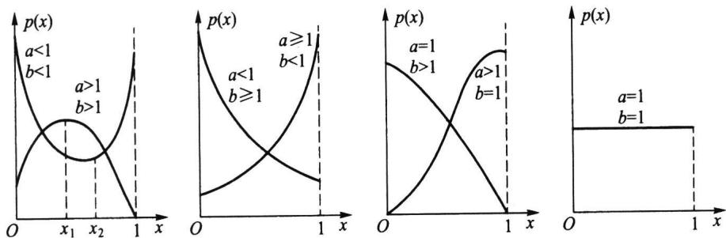

贝塔函数具有如下性质：

(1) $\mathbf { B } \left( \mathbf { \delta } a , b \right) = \mathbf { B } \left( \mathbf { \delta } b , a \right)$

证明在(2.5.17）的积分中令 $\boldsymbol { y } = \boldsymbol { 1 } - \boldsymbol { x }$ ,即得

$$
\mathbf { B } ( a , b ) = \int _ { 1 } ^ { 0 } ( 1 - y ) ^ { a - 1 } y ^ { b - 1 } \big ( - \mathrm { d } y \big ) = \int _ { 0 } ^ { 1 } \bigl ( 1 - y \bigr ) ^ { a - 1 } y ^ { b - 1 } \mathrm { d } y = \mathbf { B } \big ( b , a \big ) .
$$

（2）贝塔函数与伽马函数间有关系

$$
\mathrm { B } \left( a , b \right) = \frac { \Gamma ( a ) \Gamma ( b ) } { \Gamma ( a + b ) } .\tag{2.5.18}
$$

证明由伽马函数的定义知

$$
\Gamma ( a ) \Gamma ( b ) = \int _ { 0 } ^ { \infty } \int _ { 0 } ^ { \infty } x ^ { a - 1 } y ^ { b - 1 } \mathrm { e } ^ { - ( x + y ) } \mathrm { d } x \mathrm { d } y ,
$$

作变量变换 $x = u v , y = u \left( 1 - v \right)$ ，其雅可比行列式 $J = - u .$ 故

$$
\begin{array} { l } { { \displaystyle \Gamma ( a ) \Gamma ( b ) = \int _ { 0 } ^ { 1 } \int _ { 0 } ^ { \infty } \left( u v \right) ^ { a - 1 } \left[ u ( 1 - v ) \right] ^ { b - 1 } \mathrm { e } ^ { - u } u \mathrm { d } u \mathrm { d } v } } \\ { { \displaystyle \qquad = \int _ { 0 } ^ { \infty } u ^ { a + b - 1 } \mathrm { e } ^ { - u } \mathrm { d } u \int _ { 0 } ^ { 1 } v ^ { a - 1 } \left( 1 - v \right) ^ { b - 1 } \mathrm { d } v } } \\ { { \displaystyle \qquad = \Gamma ( a + b ) \mathrm { B } ( a , b ) , } } \end{array}
$$

由此证得(2.5.18）式.

## 二、贝塔分布

若随机变量X的密度函数为

$$
p ( x ) = \left\{ \begin{array} { l l } { \displaystyle \frac { \Gamma \big ( a + b \big ) } { \Gamma \big ( a ) \Gamma \big ( b \big ) } x ^ { a - 1 } \big ( 1 - x \big ) ^ { b - 1 } , } & { 0 < x < 1 , } \\ { \displaystyle 0 , } & { \sharp \sharp , } \end{array} \right.\tag{2.5.19}
$$

则称X服从贝塔分布，记作 $X \sim B e \left( a , b \right)$ ，其中 $a > 0 , b > 0$ 都是形状参数.图2.5.7给出几种典型的贝塔分布密度函数曲线.

图2.5.7贝塔分布密度函数曲线

从上图可以看出：

·当 $a < 1 , b < 1$ 时 ${ \pmb p } ( { \pmb x } )$ 是下凸的U形函数.

·当 $a > 1 \ , b > 1$ 时 ${ \pmb p } ( { \pmb x } )$ 是上凸的单峰函数.

·当 $a < 1 , b \geqslant 1$ 时 ${ \pmb p } ( { \pmb x } )$ 是下凸的单调减函数.

·当 $a \geqslant 1 , b < 1$ 时 ${ \bf \nabla } _ { p } ( { \bf \nabla } _ { x } )$ 是下凸的单调增函数.

·当 $a = 1 , b = 1$ 时， $B e ( \mathrm { ~ 1 ~ } , \mathrm { 1 ~ } ) = U ( 0 , \mathrm { 1 ~ } )$

因为服从贝塔分布 $B e ( a , b )$ 的随机变量是仅在区间(0,1)取值的，所以不合格品率、机器的维修率、市场的占有率、射击的命中率等各种比率选用贝塔分布作为它们的概率分布是恰当的，只要选择合适的参数a与b即可.

## 三、贝塔分布Be(a,b)的数学期望和方差

利用贝塔函数的性质，不难算得贝塔分布 $B e ( a , b )$ 的数学期望为

$$
E ( X ) = { \frac { \Gamma { \big ( } a + b { \big ) } } { \Gamma ( a ) \Gamma ( b ) } } { \int } _ { 0 } ^ { 1 } x ^ { a } { \big ( } 1 - x { \big ) } ^ { b - 1 } \mathrm { d } x = { \frac { \Gamma { \big ( } a + b { \big ) } } { \Gamma { \big ( } a { \big ) } \Gamma ( b ) } } \cdot { \frac { \Gamma { \big ( } a + 1 { \big ) } \Gamma ( b ) } { \Gamma { \big ( } a + b + 1 { \big ) } } } = { \frac { a } { a + b } } .
$$

又因为

$$
\begin{array} { l } { { \displaystyle { E ( X ^ { 2 } ) = \frac { \Gamma \big ( a + b \big ) } { \Gamma ( a ) \Gamma ( b ) } \bigg \int _ { 0 } ^ { 1 } x ^ { a + 1 } \big ( 1 - x \big ) ^ { b - 1 } \mathrm { d } x = \frac { \Gamma \big ( a + b \big ) } { \Gamma ( a ) \Gamma ( b ) } \cdot \frac { \Gamma \big ( a + 2 \big ) \Gamma ( b ) } { \Gamma \big ( a + b + 2 \big ) } } } } \\ { { \displaystyle { \quad = \frac { a \big ( a + 1 \big ) } { \big ( a + b \big ) \big ( a + b + 1 \big ) } . } } } \end{array}
$$

由此得X的方差为

$$
\operatorname { V a r } ( X ) = { \frac { a ( a + 1 ) } { ( a + b ) ( a + b + 1 ) } } - \left( { \frac { a } { a + b } } \right) ^ { 2 } = { \frac { a b } { ( a + b ) ^ { 2 } ( a + b + 1 ) } } .
$$

以下我们将常用分布及其期望和方差以表格形式放在一起.

表2.5.1常用概率分布及其数学期望和方差
<table><tr><td colspan="1" rowspan="1">分布</td><td colspan="1" rowspan="1">分布列 $\boldsymbol { p } _ { \boldsymbol { k } }$ 或分布密度 $p ( x )$ </td><td colspan="1" rowspan="1">期望</td><td colspan="1" rowspan="1">方差</td></tr><tr><td colspan="1" rowspan="1"> $_ { 0 - 1 }$ 分布</td><td colspan="1" rowspan="1"> ${ p _ { \mathrm { \Delta } _ { k } } } = { p ^ { \mathrm { \Delta } _ { k } ^ { k } } } { ( \mathrm { \Omega } 1 - p \mathrm { \Omega } ) } ^ { 1 - k } , \quad k = 0 , 1$ </td><td colspan="1" rowspan="1"> $p$ </td><td colspan="1" rowspan="1"> $p ( 1 - p )$ </td></tr><tr><td colspan="1" rowspan="1">二项分布 $b ( \boldsymbol { n } , \boldsymbol { p } )$ </td><td colspan="1" rowspan="1"> $p _ { _ k } = { \binom { n } { k } } p ^ { _ k } ( 1 { - } p ) ^ { n - k } , \quad k = 0 , 1 , \cdots , n$ </td><td colspan="1" rowspan="1"> $n p$ </td><td colspan="1" rowspan="1"> $n p ( 1 - p )$ </td></tr><tr><td colspan="1" rowspan="1">泊松分布 $P ( \lambda )$ </td><td colspan="1" rowspan="1"> $p _ { k } = { \frac { \lambda ^ { k } } { k ! } } \mathrm { e } ^ { - \lambda } , \quad k = 0 , 1 , \cdots$ </td><td colspan="1" rowspan="1">Λ</td><td colspan="1" rowspan="1">Λ</td></tr><tr><td colspan="1" rowspan="1">超几何分布 $h ( n , N , M )$ </td><td colspan="1" rowspan="1"> $p _ { k } = { \frac { { \binom { M } { k } } { \binom { N - M } { n - k } } } { { \binom { N } { n } } } } , \quad _ { k = 0 , 1 , \cdots , r , \atop r = \operatorname* { m i n } \left\{ M , n \right\} }$ </td><td colspan="1" rowspan="1"> $n { \frac { M } { N } }$ </td><td colspan="1" rowspan="1"> $\frac { n M ( N - M ) \left( N - n \right) } { N ^ { 2 } ( N - 1 ) }$ </td></tr><tr><td colspan="1" rowspan="1">几何分布 $G e ( p )$ </td><td colspan="1" rowspan="1"> $p _ { k } = \left( 1 - p \right) ^ { k - 1 } p , \quad k = 1 , 2 , \cdots$ </td><td colspan="1" rowspan="1"> $\frac { 1 } { p }$ </td><td colspan="1" rowspan="1"> $\frac { 1 - p } { p ^ { 2 } }$ </td></tr><tr><td colspan="1" rowspan="1">负二项分布 $N b ( r , p )$ </td><td colspan="1" rowspan="1"> $p _ { k } = { \binom { k - 1 } { r - 1 } } \left( 1 - p \right) ^ { k - r } p ^ { r } , \quad k = r , r + 1 , \cdots$ </td><td colspan="1" rowspan="1"> $\frac { r } { p }$ </td><td colspan="1" rowspan="1"> $\frac { r ( 1 - p ) } { p ^ { 2 } }$ </td></tr><tr><td colspan="1" rowspan="1">正态分布 ${ \cal N } ( \mu , \sigma ^ { 2 } )$ </td><td colspan="1" rowspan="1"> $p \left( x \right) = \frac { 1 } { \sqrt { 2 \pi } \sigma } \exp \Biggl \{ - \frac { \left( x - \mu \right) ^ { 2 } } { 2 \sigma ^ { 2 } } \Biggr \} ~ , \quad - \infty < x < \infty$ </td><td colspan="1" rowspan="1"> $\pmb { \mu }$ </td><td colspan="1" rowspan="1"> $\sigma ^ { 2 }$ </td></tr><tr><td colspan="1" rowspan="1">均匀分布 $U ( a , b )$ </td><td colspan="1" rowspan="1"> $p ( \ x ) = \frac { 1 } { b - a } , \quad a < x < b$ </td><td colspan="1" rowspan="1"> $\frac { a + b } { 2 }$ </td><td colspan="1" rowspan="1"> $( b - a ) ^ { 2 }$ 12</td></tr><tr><td colspan="1" rowspan="1">分布</td><td colspan="1" rowspan="1">分布列 $\boldsymbol { p } _ { \star }$ 或分布密度 $p ( x )$ </td><td colspan="1" rowspan="1">期望</td><td colspan="1" rowspan="1">方差</td></tr><tr><td colspan="1" rowspan="1">指数分布 $E x p ( \lambda )$ </td><td colspan="1" rowspan="1"> $p ( \mathbf { \Psi } x ) = \lambda \operatorname { e } ^ { - \lambda x } , \quad x \geq 0$ </td><td colspan="1" rowspan="1"> $\frac { 1 } { \lambda }$ </td><td colspan="1" rowspan="1"> $\frac { 1 } { \lambda ^ { 2 } }$ </td></tr><tr><td colspan="1" rowspan="1">伽马分布 $G a ( \alpha , \lambda )$ </td><td colspan="1" rowspan="1"> $p \left( x \right) = \frac { \lambda ^ { \alpha } } { \Gamma \left( \alpha \right) } x ^ { \alpha - 1 } \mathrm { e } ^ { - \lambda x } , \quad x \geqslant 0$ </td><td colspan="1" rowspan="1"> $\frac { \alpha } { \lambda }$ </td><td colspan="1" rowspan="1"> $\frac { \alpha } { \lambda ^ { 2 } }$ </td></tr><tr><td colspan="1" rowspan="1"> $\chi ^ { 2 } ( n )$ 分布</td><td colspan="1" rowspan="1"> $p \left( x \right) = \frac { x ^ { n / 2 - 1 } \mathrm { e } ^ { - x / 2 } } { \Gamma \left( n / 2 \right) 2 ^ { n / 2 } } , \quad x \geqslant 0$ </td><td colspan="1" rowspan="1">n</td><td colspan="1" rowspan="1"> $2 n$ </td></tr><tr><td colspan="1" rowspan="1">贝塔分布 $B e \left( a , b \right)$ </td><td colspan="1" rowspan="1"> $p \left( x \right) = \frac { \Gamma \left( a + b \right) } { \Gamma \left( a \right) \Gamma \left( b \right) } x ^ { a - 1 } \left( 1 - x \right) ^ { b - 1 }$   $0 < x < 1$ </td><td colspan="1" rowspan="1"> $\frac { a } { a + b }$ </td><td colspan="1" rowspan="1"> $\frac { a b } { ( a + b ) ^ { 2 } ( a + b + 1 ) }$ </td></tr><tr><td colspan="1" rowspan="1">对数正态分布 $L N ( \mu , \sigma ^ { 2 } )$ </td><td colspan="1" rowspan="1"> $p \left( x \right) = \frac { 1 } { \sqrt { 2 \pi } \sigma x } \exp \Biggl \{ - \ \frac { \left( \mathrm { l n } \ x - \mu \right) ^ { 2 } } { 2 \sigma ^ { 2 } } \Biggr \} \ , \ x > 0$ </td><td colspan="1" rowspan="1"> $e ^ { \mu + \sigma ^ { 2 } / 2 }$ </td><td colspan="1" rowspan="1"> $\mathbf { e } ^ { 2 \mu + \sigma ^ { 2 } } ( \mathbf { e } ^ { \sigma ^ { 2 } } - 1 )$ </td></tr><tr><td colspan="1" rowspan="1">柯西分布 $\operatorname { C a u } ( \mu , \lambda )$ </td><td colspan="1" rowspan="1"> $p \left( x \right) = \frac { 1 } { \pi } \frac { \lambda } { \lambda ^ { 2 } + \left( x - \mu \right) ^ { 2 } } , - \infty < x < \infty$ </td><td colspan="1" rowspan="1">不存在</td><td colspan="1" rowspan="1">不存在</td></tr><tr><td colspan="1" rowspan="1">韦布尔分布</td><td colspan="1" rowspan="1"> $p \left( x \right) = F ^ { \prime } \left( x \right) , F \left( x \right) = 1 - \exp \Biggl \{ - \Biggl ( \frac { x } { \eta } \Biggr ) ^ { n } \Biggr \} , x > 0$ </td><td colspan="1" rowspan="1"> $\eta \Gamma { \left( 1 + \frac { 1 } { m } \right) }$ </td><td colspan="1" rowspan="1"> ${ \eta } ^ { 2 } \left[ \Gamma \left( 1 + \frac { 2 } { m } \right) - \frac { 1 } { n } \right] ,$  $\Gamma ^ { 2 } { \left( \begin{array} { l } { 1 + { \frac { 1 } { m } } } \end{array} \right) } \ ]$ </td></tr></table>

注：表中仅列出各分布密度函数的非零区域.

## 习题2.5

1.设随机变量X服从区间(2,5)上的均匀分布，求对X进行3次独立观测中，至少有2次的观测值大于3的概率.

2.在（0，1）上任取一点记为X，试求 $P \bigg ( X ^ { 2 } - \frac { 3 } { 4 } X + \frac { 1 } { 8 } \geq 0 \bigg )$

3.设K服从（1，6）上的均匀分布，求方程 $x _ { \mathrm { \ell } } + K x + 1 = 0$ 有实根的概率.

4.若随机变量 $K \sim N ( \mu , \sigma ^ { 2 } )$ ，而方程 $x ^ { 2 } + 4 x + K = 0$ 无实根的概率为0.5，试求 $\mu .$

5.设流经一个2Ω电阻上的电流强度I是一个随机变量，它均匀分布在9A至11A之间.试求此电阻上消耗的平均功率，其中功率 $\boldsymbol { \mathbb { W } } = 2 \boldsymbol { I } ^ { 2 }$

6.某种圆盘的直径在区间（a，b)上服从均匀分布，试求此种圆盘的平均面积.

7.设某种商品每周的需求量X服从区间（10，30）上均匀分布，而商店进货数为区间（10，30）中的某一整数，商店每销售1单位商品可获利500元；若供大于求则降价处理，每处理1单位商品亏损100元；若供不应求，则可从外部调剂供应，此时每1单位商品仅获利300元.为使商店所获利润期望值不少于9280元，试确定最少进货量.

8.统计调查表明，英格兰1875年至1951年期间在矿山发生10人或10人以上死亡的两次事故之间的时间T（以日计）服从均值为241的指数分布.试求 $P ( \ 5 0 < T < 1 0 0 )$

9.若一次电话通话时间X（以min计)服从参数为0.25的指数分布，试求一次通话的平均时间.

10.某种设备的使用寿命X（以年计）服从指数分布，其平均寿命为4年.制造此种设备的厂家规定，若设备在使用一年之内损坏，则可以予以调换.如果设备制造厂每售出一台设备可赢利100元，而调换一台设备制造厂需花费300元.试求每台设备的平均利润.

11.设顾客在某银行的窗口等待服务的时间X（以min计)服从指数分布，其密度函数为

$$
\begin{array} { r l } { p ( x ) } & { = \left\{ \displaystyle \frac { 1 } { 5 } \mathrm { e } ^ { - \frac { x } { 5 } } , \quad x > 0 , \right. } \\ { \quad } & { \left. \mathrm { ~  ~ } } \\ { \right.0 , \quad } & { \big . \big \sharp 4 \big \oplus . } \end{array}
$$

某顾客在窗口等待服务，若超过10min他就离开.他一年要到银行5次，以Y表示一年内他未等到服务而离开窗口的次数，试求 $P \left( \ Y \geqslant 1 \right)$

12.某仪器装了3个独立工作的同型号电子元件，其寿命X（以h计）都服从同一指数分布，密度函数为

$$
p \left( x \right) = { \left\{ \begin{array} { l l } { \displaystyle { \frac { 1 } { 6 0 0 } } \mathrm { e } ^ { - \frac { x } { 6 0 0 } } , } & { x > 0 , } \\ { 0 , } & { \sharp \# . } \end{array} \right. }
$$

试求：此仪器在最初使用的200h内，至少有一个此种电子元件损坏的概率.

13.设随机变量X的密度函数为

$$
\begin{array} { r l } { p \left( x \right) } & { = \left\{ \begin{array} { l l } { \lambda \mathrm { e } ^ { - \lambda x } , } & { x > 0 , } \\ { 0 , } & { x \leqslant 0 } \end{array} \right. \qquad \left( \lambda > 0 \right) . } \end{array}
$$

试求k，使得 $P \left( \ X > k \right) = 0 . 5 $

14.设随机变量X的密度函数为

$$
\begin{array} { r l } { p ( x ) } & { = \left\{ \begin{array} { l l } { 1 / 3 , } & { 0 \leqslant x \leqslant 1 , } \\ { 2 / 9 , } & { 3 \leqslant x \leqslant 6 , } \\ { 0 , } & { \sharp \# . } \end{array} \right. } \end{array}
$$

若 $P ( X \geqslant k ) = 2 / 3$ ，试求k的取值范围.

15.写出以下正态分布的均值和标准差：

$$
p _ { _ 1 } ( x ) = \frac { 1 } { \sqrt { \pi } } { \mathrm e } ^ { - ( x ^ { 2 } + 4 x + 4 ) } , \qquad p _ { _ 2 } ( x ) = \sqrt { \frac { 2 } { \pi } } { \mathrm e } ^ { - 2 x ^ { 2 } } , \qquad p _ { _ 3 } ( x ) = \frac { 1 } { \sqrt { \pi } } { \mathrm e } ^ { - x ^ { 2 } } .
$$

16.某地区18岁女青年的血压X（收缩压，以mmHg计）服从 $N ( 1 1 0 , 1 2 ^ { 2 } )$ .试求该地区18岁女青年的血压在100至120的可能性有多大？

17.某地区成年男子的体重X（以 ${ \bf k } _ { \mathbf { g } }$ 计）服从正态分布 $N ( \mu , \sigma ^ { 2 } )$ .若已知 $P \left( \ X \leqslant 7 0 \right) = 0 . 5$ $P \left( X { \leqslant } 6 0 \right) = 0 . 2 5$

（1）求 $\pmb { \mu }$ 与 $\pmb { \sigma }$ 各为多少？

（2）若在这个地区随机地选出5名成年男子，问其中至少有两人体重超过65kg的概率是多少？

18.由某机器生产的螺栓的长度（以cm计）服从正态分布 $N ( 1 0 . 0 5 , 0 . 0 6 ^ { 2 } )$ ，若规定长度在范围$\left( 1 0 . 0 5 { \scriptstyle \pm 0 . 1 2 } \right) \mathrm { c m }$ 内为合格品，求螺栓不合格的概率.

19.某地抽样调查结果表明，考生的外语成绩(以百分制计)近似地服从 $\mu = 7 2$ 的正态分布，已知96分以上的人数占总数的2.3%，试求考生的成绩大于等于60分的概率.

20.设随机变量 $X \sim N ( 3 , 2 ^ { 2 } )$

（1）求 $P ( 2 < X \leqslant 5 ) ~ ; ( 2 )$ 求 $P ( \mid X \mid > 2 )$ ；（3）确定c使得 $P ( X > c ) = P ( X < c )$

21.若随机变量 $X \sim \mathit { N } ( 4 , 3 ^ { 2 } )$

（1）求 $P ( - 2 < X \leqslant 1 0 ) \ ; \left( 2 \right)$ 求 $P \left( \ X > 3 \right)$ ；（3）设d满足 $P ( \ X { > } d ) \geqslant 0 . 9$ ，问d至多为多少？

22.测量到某一目标的距离时，发生的随机误差X（以m计)具有密度函数

$$
p \left( x \right) = \frac { 1 } { 4 0 \sqrt { 2 \pi } } \mathrm { e } ^ { - \frac { \left( x - 2 0 \right) ^ { 2 } } { 3 2 0 0 } } , \qquad - \infty < x < \infty .
$$

求在三次测量中，至少有一次误差的绝对值不超过30m的概率.

23.从甲地飞往乙地的航班，每天上午10：10起飞，飞行时间X服从均值是4h，标准差是20min的正态分布.

（1）该机在下午2：30以后到达乙地的概率是多少？

（2）该机在下午2：20以前到达乙地的概率是多少？

（3）该机在下午1：50至2：30之间到达乙地的概率是多少？

24.在某场招聘人员的考试中，共有10000人报考.假设考试成绩服从正态分布，且已知90分以上有359人，60分以下有1151人.现按考试成绩从高分到低分依次录用2500人，试问被录用者中最低分为多少？

25.设随机变量X服从正态分布 $N ( 6 0 , 3 ^ { 2 } )$ ，试求实数 $a , b , c , d$ 使得X落在如下五个区间中的概率之比为 $7 : 2 4 : 3 8 : 2 4 : 7 .$

$$
\left( { \bf - \infty } , { \bf 0 } \right] , \qquad \left( a , b \right] , \qquad \left( b , c \right] , \qquad \left( c , d \right] , \qquad \left( d , \infty \right) .
$$

26.设随机变量X与Y均服从正态分布，X服从正态分布 $N ( \mu , 4 ^ { 2 } )$ ，Y服从正态分布 $N ( \mu , 5 ^ { 2 } )$ ，试比较以下p，和 $P _ { 1 }$ ${ { p } _ { 2 } }$ 的大小.

$$
p _ { _ 1 } \ = \ P \{ X \leqslant \mu - 4 \} , \qquad p _ { _ 2 } \ = \ P \{ Y \geqslant \mu + 5 \} .
$$

27.设随机变量X服从正态分布 $N ( 0 , \sigma ^ { 2 } )$ ，若 $P ( \mid X \mid > k ) = 0 . 1$ ，试求 $P \left( X { < } k \right)$

28.设随机变量X服从正态分布 $N ( \mu , \sigma ^ { 2 } )$ ，试问：随着σ的增大，概率 $P \left( \mid X { - } \mu \mid < \sigma \right)$ 是如何变化的？

29.设随机变量X服从参数为 $\mu = 1 6 0$ 和g的正态分布，若要求 $P \left( \ 1 2 0 < X \leqslant 2 0 0 \right) \geqslant 0 . 9 0$ ，允许 $\pmb { \sigma }$ 最大为多少？

30.设随机变量 $X \sim N ( \mu , { \sigma } ^ { 2 } )$ ，求 $E ( \mid X { - } \mu \mid )$

31.设随机变量 $X \sim N ( 0 , \sigma ^ { 2 } )$ ，证明 $E ( \mid X \mid ) = \sigma \sqrt { \frac { 2 } { \pi } }$

32.设随机变量X服从伽马分布 $G a ( 2 , 0 . 5 )$ ，试求 $P \left( { \cal X } { < } 4 \right)$

33.某地区漏缴税款的比例X服从参数 $a = 2 , b = 9$ 的贝塔分布，试求此比例小于10%的概率及平均漏缴税款的比例.

34.某班级学生中数学成绩不及格的比率X服从 $a = 1 , b = 4$ 的贝塔分布，试求 $P \ ( \ X { > } E ( \ X ) \ )$

## 82.6随机变量函数的分布

设 $\scriptstyle y = g ( \pmb { x } )$ 是定义在R上的一个函数，X是一个随机变量，那么 $Y = _ { g } ( X )$ 作为X的函数，同样也是一个随机变量.在实际问题中，我们经常感兴趣的问题是：已知随机变量X的分布，如何求出另一个随机变量 $Y = _ { g } ( X )$ 的分布.

寻求随机变量函数的分布，是概率论的基本技巧，在概率论与数理统计中经常要用到这些技巧.下面对离散和连续两种场合分别讨论随机变量函数的分布.

## 2.6.1离散随机变量函数的分布

离散随机变量函数的分布是比较容易求得的.设X是离散随机变量，X的分布列为

<table><tr><td>X</td><td>x</td><td>x2</td><td></td><td>x n</td><td></td></tr><tr><td>P</td><td>p（x）</td><td>p（x）</td><td></td><td>p（x）</td><td></td></tr></table>

显然 $Y { = } _ { g } ( X )$ 也是一个离散随机变量，此时Y的分布列就可以很简单地表示为

$$
{ \frac { Y \ { \left| \begin{array} { l l l l l l l l l } { g ( x _ { 1 } ) } & { g ( x _ { 2 } ) } & { \quad \dots } & { } & { g ( x _ { n } ) } & { \ \dots } & { } \\ { P } & { p ( x _ { 1 } ) } & { \quad p ( x _ { 2 } ) } & { \ \dots } & { } & { p ( x _ { n } ) } & { \ \dots } \end{array} \right| } } { P ( x _ { 1 } ) } }
$$

当 $g ( x _ { _ 1 } ) , g ( x _ { _ 2 } ) , \cdots , g ( x _ { _ n } )$ ,…中有某些值相等时,则把那些相等的值分别合并，并把对应的概率相加即可.

例2.6.1已知随机变量X的分布列如下，求 $Y = { X } ^ { 2 } + X$ 的分布列.

<table><tr><td>X</td><td>-2</td><td>-1</td><td>0</td><td>1</td><td>2</td></tr><tr><td>P</td><td>0.2</td><td>0.1</td><td>0.1</td><td>0.3</td><td>0.3</td></tr></table>

解 $Y = { X } ^ { 2 } + X$ 的分布列为

<table><tr><td>Y</td><td>2</td><td>0</td><td>0</td><td>2</td><td>6</td></tr><tr><td>P</td><td>0.2</td><td>0.1</td><td>0.1</td><td>0.3</td><td>0.3</td></tr></table>

再对相等的值合并，得

<table><tr><td>Y</td><td>0 2</td><td>6</td></tr><tr><td>P</td><td>0.2 0.5</td><td>0.3</td></tr></table>

## 2.6.2连续随机变量函数的分布

离散随机变量的函数仍是一个离散随机变量.但连续随机变量X的函数 $Y = _ { g } ( X )$ 不一定为连续随机变量，以下我们分几种情况讨论 $Y = _ { g } ( X )$ 的分布.

## 一、当 $Y { = } _ { g } ( X )$ 为离散随机变量

在这种情况下，只须将Y的可能取值一一列出，再将Y取各种可能值的概率求出即可.例如，设 $X \sim N ( \mu , \sigma ^ { 2 } )$

$$
Y = \left\{ { \begin{array} { l l } { 0 , } & { X < \mu , } \\ { 1 , } & { X \geq \mu . } \end{array} } \right.
$$

则很容易计算得：Y服从 $p { = } 0 . 5$ 的0-1分布.

## 二、当 ${ \pmb g } ( { \pmb x } )$ 为严格单调函数时

在这种情况下有以下定理：

定理2.6.1设X是连续随机变量，其密度函数为 $p _ { \chi } ( x ) . \ Y = g ( X )$ 是另一个连续随机变量.若 $\scriptstyle y = g ( x ) { \overline { { p } } }$ 格单调，其反函数 $h ( y )$ 有连续导函数，则 $Y = _ { g } ( X )$ 的密度函数为

$$
\begin{array} { r } { p _ { _ Y } ( { _ y } ) = \left\{ \begin{array} { l l } { p _ { _ X } [ h ( { _ y } ) ] ~ \vert ~ h ^ { \prime } ( { _ y } ) ~ \vert ~ , ~ } & { ~ a ~ < { _ y } ~ < ~ b , } \\ { 0 , ~ } & { ~ \vert \sharp ( \underline { { t } } . } \end{array} \right. } \end{array}\tag{2.6.1}
$$

其中 $a = \operatorname* { m i n } \left\{ g { \big ( } - \infty { \big ) } , g { \big ( } \infty { \big ) } \right\} , b = \operatorname* { m a x } \left\{ g { \big ( } - \infty { \big ) } , g { \big ( } \infty { \big ) } \right\} ,$

证明不妨设 ${ \pmb g } ( { \pmb x } )$ 是严格单调增函数，这时它的反函数 $h ( y )$ 也是严格单调增函数，且 $h ^ { \prime } ( y ) > 0$ 记 $a = g ( - \infty ) , b = g ( \infty )$ ，这意味着 $\scriptstyle { \boldsymbol { y } } = _ { g } ( { \boldsymbol { \mathscr { x } } } )$ 仅在区间 $( a , b )$ 取值,于是

当 $y < a$ 时，

$$
F _ { _ { Y } } ( y ) = P ( Y \leqslant y ) = 0 ;
$$

当 $\gamma > b$ 时，

$$
F _ { _ { Y } } ( y ) = P ( Y \leqslant y ) = 1 ;
$$

当 $a \leqslant y \leqslant b$ 时，

$$
F _ { _ { Y } } ( y ) = P ( Y \leqslant y ) = P ( g ( X ) \leqslant y ) = P ( X \leqslant h ( y ) ) = \int _ { - \infty } ^ { h ( y ) } p _ { x } ( x ) \mathrm { d } x .
$$

由此得Y的密度函数为

$$
\begin{array} { r }  p _ { { \gamma } } ( { \gamma } ) = \{ \begin{array} { l l } { p _ { x } [ { h } ( { \gamma } ) ] h ^ { \prime } ( { \gamma } ) , ~ a ~ < { \gamma } < b , } \\ { 0 , } & { \mathrm { ~ } \mathrm { ~ } \mathrm { ~ } \mathrm { ~ } \mathrm { ~ } \mathrm { ~ } \mathrm { ~ } \mathrm { ~ } \mathrm { ~ } \mathrm { ~ } \mathrm { ~ } \mathrm { ~ } \mathrm { ~ } \mathrm { ~ } \mathrm { ~ } \mathrm { ~ } \mathrm { ~ } \mathrm { ~ } \mathrm { ~ } \mathrm { ~ } \mathrm { ~ } \mathrm { ~ } \mathrm { ~ } \quad } \\ { 0 , } &  \mathrm { ~ } \mathrm { ~ } \mathrm { ~ } \mathrm { ~ } \mathrm { ~ } \mathrm { ~ } \mathrm { ~ } \mathrm { ~ } \mathrm { ~ } \mathrm { ~ } \mathrm { ~ } \mathrm { ~ } \mathrm { ~ } \mathrm { ~ } \mathrm { ~ } \mathrm { ~ } \mathrm { ~ } \mathrm { ~ } \mathrm { ~ } \mathrm { ~ } \mathrm { ~ } \mathrm { ~ } \mathrm { ~ } \mathrm { ~ } \mathrm { ~ } \mathrm { ~ } \mathrm { ~ } \mathrm { ~ } \mathrm { ~ } \mathrm { ~ } \mathrm { ~ } \mathrm { ~ } \mathrm { ~ } \mathrm { ~ } \mathrm { ~ } \mathrm { ~ } \mathrm { ~ } \mathrm { ~ } \mathrm { ~ } \mathrm { ~ } \mathrm { ~ } \mathrm { ~ } \mathrm { ~ } \mathrm { ~ } \mathrm { ~ } \mathrm { ~ } \mathrm { ~ } \mathrm { ~ } \mathrm { ~ } \mathrm { ~ } \mathrm { ~ } \mathrm { ~ } \mathrm { ~ } \mathrm { ~ } \mathrm { ~ } \mathrm { ~ } \mathrm { ~ } \mathrm { ~ } \mathrm { ~ } \mathrm { ~ } \mathrm { ~ } \mathrm { ~ } \mathrm { ~ } \mathrm { ~ } \mathrm { ~ } \mathrm { ~ } \mathrm { ~ } \mathrm { ~ } \mathrm { ~ } \mathrm { ~ } \mathrm { ~ } \mathrm { ~ } \mathrm { ~ } \mathrm { ~ } \mathrm { ~ } \mathrm { ~ } \mathrm { ~ } \mathrm { ~ } \mathrm { ~ } \mathrm { ~ } \mathrm { ~ } \mathrm { ~ } \mathrm { ~ } \mathrm { ~ } \mathrm { ~ } \mathrm { ~ } \mathrm \end{array} \end{array}
$$

同理可证当 ${ \pmb g } ( { \pmb x } )$ 是严格单调减函数时，结论也成立.但此时要注意 $h ^ { \prime } \left( y \right) < 0$ ,故要加绝对值符号，这时 $a = g ( \infty ) , b = g ( - \infty )$ .综上所述，定理得证.

利用以上定理，我们来证明几个很有用的结论，并用定理形式表示.

定理2.6.2设随机变量X服从正态分布 $N ( \mu , \sigma ^ { 2 } )$ ,则当 $\scriptstyle a \neq 0$ 时,有 $Y = a X + b \sim$ $N ( a \mu + b , a ^ { 2 } \sigma ^ { 2 } )$

证明当 $a > 0$ 时， $Y = a X + b$ 是严格增函数，仍在 $( - \infty , \infty )$ 上取值，其反函数为 $X =$ $( Y - b ) / a$ ,由定理2.6.1可得

$$
\begin{array} { l } { { p _ { _ Y } ( y ) = p _ { x } \bigg ( \displaystyle { \frac { y - b } { a } } \bigg ) \displaystyle { \frac { 1 } { a } } = \displaystyle { \frac { 1 } { \sqrt { 2 \pi } \sigma } } \mathrm { e x p } \bigg \{ - \displaystyle { \frac { 1 } { 2 \sigma ^ { 2 } } } \bigg ( \displaystyle { \frac { y - b } { a } } - \mu \bigg ) ^ { 2 } \bigg \} \displaystyle { \frac { 1 } { a } } } } \\ { { = \displaystyle { \frac { 1 } { \sqrt { 2 \pi } \left( a \sigma \right) } } \mathrm { e x p } \bigg \{ - \displaystyle { \frac { \left( y - a \mu - b \right) ^ { 2 } } { 2 a ^ { 2 } \sigma ^ { 2 } } } \bigg \} . } } \end{array}
$$

这就是正态分布 $N ( a \mu + b , a ^ { 2 } \sigma ^ { 2 } )$ 的密度函数.

当 $a < 0$ 时， $Y = a X + b$ 是严格减函数，仍在 $( - \infty , \infty )$ 上取值，其反函数为 $X = \left( \ Y - b \right) /$ a,由定理2.6.1可得

$$
p _ { _ Y } ( { \boldsymbol { y } } ) = { \frac { 1 } { \sqrt { 2 \pi } \mid a \mid \sigma } } \mathrm { e x p } \Bigg \{ - { \frac { \left( { \boldsymbol { y } } - { \boldsymbol { a } } { \boldsymbol { \mu } } - { \boldsymbol { b } } \right) ^ { 2 } } { 2 a ^ { 2 } \sigma ^ { 2 } } } \Bigg \} .
$$

这是正态分布 $N ( a \mu + b , a ^ { 2 } \sigma ^ { 2 } )$ 的密度函数，结论得证.

这个定理表明：正态变量的线性变换仍为正态变量，其数学期望和方差可直接从线性变换求得.若取 $a = 1 / \sigma , b = - \mu / \sigma$ ，则 $Y = a X + b \sim N ( 0 , 1 )$ ，此即上一节的定理2.5.1.

例2.6.2（1）设随机变量 $X \sim N ( 1 0 , 2 ^ { 2 } )$ ，试求 $Y = 3 X + 5$ 的分布；

（2）设随机变量 $X \sim N ( 0 , 2 ^ { 2 } )$ ,试求 $Y = - X$ 的分布.

解（1）由定理2.6.2知Y仍是正态变量，其数学期望和方差分别为

$$
E ( \ Y ) = E ( 3 X + 5 ) = 3 \times 1 0 + 5 = 3 5 ,
$$

$$
\operatorname { V a r } ( Y ) = \operatorname { V a r } ( 3 X + 5 ) = 9 \times 2 ^ { 2 } = 3 6 .
$$

所以 $Y = 3 X + 5$ 的分布为 $N ( 3 5 , 6 ^ { 2 } )$

（2）Y仍是正态变量，其数学期望和方差分别为

$$
E ( \ Y ) = E ( \ - \ X ) = 0 ,
$$

$$
\operatorname { V a r } ( Y ) = \operatorname { V a r } ( - X ) = 2 ^ { 2 } .
$$

所以 $Y = - X$ 的分布仍为 $N ( 0 , 2 ^ { 2 } )$ .这表明X与-X有相同的分布，但这两个随机变量是不相等的.所以我们要明确，分布相同与随机变量相等是两个完全不同的概念.

定理2.6.3（对数正态分布）设随机变量 $X \sim N ( \mu , \sigma ^ { ^ 2 } )$ ，则 $Y = \mathbf { e } ^ { \ X }$ 的概率密度函数为

$$
p _ { _ { Y } } ( { _ { y } } ) = \left\{ { \begin{array} { l l } { \displaystyle { \frac { 1 } { \sqrt { 2 \pi } y \sigma } } \exp \bigg \{ - { \frac { \big ( \ln y - \mu \big ) ^ { 2 } } { 2 \sigma ^ { 2 } } } \bigg \} \ , \ { \textrm { y } } > 0 , } \\ { 0 , \ } & { { \gamma } \leqslant 0 . } \end{array} } \right.\tag{2.6.2}
$$

证明 $y = \mathbf { e } ^ { x }$ 是严格增函数，它仅在 $( 0 , \infty )$ 上取值，其反函数为 $x = \ln { y }$ ，由定理2.6.1可得

当 $ { \boldsymbol { y } } \leqslant 0$ 时， $F _ { _ { Y } } ( y ) = 0$ ，从而 $p _ { _ Y } ( { \boldsymbol { y } } ) = 0$

当 $y { > } 0$ 时,Y的密度函数为

$$
p _ { _ { Y } } ( y ) = { \frac { 1 } { { \sqrt { 2 \pi } } \sigma } } \exp \Biggl \{ - \ { \frac { \left( \ln { y } \ - \mu \right) ^ { 2 } } { 2 \sigma ^ { 2 } } } \Biggr \} \ { \frac { 1 } { y } } \ = { \frac { 1 } { \sqrt { 2 \pi } y \sigma } } \exp \Biggl \{ - \ \frac { \left( \ln { y } \ - \mu \right) ^ { 2 } } { 2 \sigma ^ { 2 } }  \Biggr \} \ .
$$

定理得证.

这个分布被称为对数正态分布，记为 $L N ( \mu , \sigma ^ { 2 } )$ ，其中 $\mu$ 称为对数均值， $\sigma ^ { 2 }$ 称为对数方差.对数正态分布 $L N ( \mu , \sigma ^ { 2 } )$ 是一个偏态分布，也是一个常用分布，实际中有不少随机变量服从对数正态分布，譬如

·绝缘材料的寿命服从对数正态分布.

·设备故障的维修时间服从对数正态分布.

·家中仅有两个小孩的年龄差服从对数正态分布.

定理2.6.4设随机变量X服从伽马分布 $G a \left( \alpha , \lambda \right)$ ，则当 $k > 0$ 时,有 $Y = k X \sim$ $G a ( \alpha , \lambda / k )$

证明因为 $k { > } 0$ ，所以 $y = k x$ 是严格增函数，它仍在 $( 0 , \infty )$ 上取值，其反函数为 $x =$ $y / k$ ，由定理2.6.1可得

$y < 0$ 时 $\mathbfcal { P } _ { Y } ^ { \phantom { } } ( y ) = 0$

当 $y \geqslant 0$ 时，

$$
p _ { \gamma } ( \gamma ) = p _ { x } \bigg ( \frac { \gamma } { k } \bigg ) \frac { 1 } { k } = \frac { \lambda ^ { \alpha } } { k \Gamma ( \alpha ) } \bigg ( \frac { \gamma } { k } \bigg ) ^ { \alpha - 1 } \exp \bigg \{ - \lambda \frac { \gamma } { k } \bigg \} = \frac { \left( \lambda / k \right) ^ { \alpha } } { \Gamma ( \alpha ) } \gamma ^ { \alpha - 1 } \exp \bigg \{ - \frac { \lambda } { k } \gamma \bigg \} .
$$

此即 $G a ( \alpha , \lambda / k )$ 的密度函数，结论得证.

这个结论是很有用的，譬如当 $X \sim G a ( \alpha , \lambda )$ ，则 $2 \lambda X \sim G a \left( \alpha , 1 / 2 \right) = X ^ { 2 } ( 2 \alpha )$ ，即任一伽玛分布可转化为 $\chi ^ { 2 }$ 分布.

定理2.6.5若随机变量X的分布函数 $\boldsymbol { F } _ { \boldsymbol { x } } ( \boldsymbol { x } )$ 为严格单调增的连续函数，其反函数$\boldsymbol { F } _ { \boldsymbol { x } } ^ { - 1 } \big ( \boldsymbol { y } \big )$ 存在，则 $Y = F _ { _ { Y } } ( X )$ 服从(0,1)上的均匀分布 $U ( 0 , 1 )$

证明下求 $Y = F _ { _ { X } } ( X )$ 的分布函数.由于分布函数 $\boldsymbol { F } _ { \boldsymbol { x } } ( \boldsymbol { x } )$ 仅在 $[ 0 , 1 ]$ 区间上取值，故当 $y < 0$ 时，因为 $\left\{ F _ { _ { X } } ( X ) \leqslant y \right\}$ 是不可能事件，所以

$$
F _ { \gamma } ( y ) = P ( Y \leqslant y ) = P ( F _ { \chi } ( X ) \leqslant y ) = 0 .
$$

当 $0 \leqslant y < 1$ 时，有

$$
F _ { _ { \chi } } ( \gamma ) = P ( Y \leqslant y ) = P ( F _ { x } ( X ) \leqslant y ) = P ( X \leqslant F _ { x } ^ { ^ { - 1 } } ( y ) ) = F _ { x } ( F _ { x } ^ { ^ { - 1 } } ( y ) ) = y .
$$

当 $y \geqslant 1$ 时，因为 $\left\{ F _ { _ { X } } ( X ) \leqslant y \right\}$ 是必然事件，所以

$$
F _ { _ { Y } } ( _ { Y } ) = P ( _ { } Y \leqslant y ) = P ( _ { } F _ { _ { X } } ( _ { } X ) \leqslant y ) = 1 .
$$

综上所述， $Y = F _ { _ { X } } ( X )$ 的分布函数为

$$
F _ { _ { Y } } ( y ) = \left\{ { \begin{array} { l l } { 0 , } & { y < 0 , } \\ { y , } & { 0 \leqslant y < 1 , } \\ { 1 , } & { y \geqslant 1 . } \end{array} } \right.
$$

这正是(0，1)上均匀分布的分布函数，所以 $Y \sim U ( 0 , 1 )$

这个定理表明：均匀分布在连续分布类中占有特殊地位.任一个连续随机变量X都可通过其分布函数 $F ( x )$ 与均匀分布随机变量U发生关系.譬如X服从指数分布$E x p ( \lambda )$ ，其分布函数为 $F ( x ) = 1 - \mathrm { e } ^ { - \lambda x }$ ，当x换为X后，有

$$
U = 1 - { \bf e } ^ { - \lambda X } \qquad \quad \equiv \overbrace { \lambda } ^ { \pm \lambda } . \qquad X = \frac { 1 } { \lambda } \ln \frac { 1 } { 1 - U } .
$$

后一式表明：由均匀分布 $U ( 0 , 1 )$ 的随机数（伪观察值） $u _ { i }$ 可得指数分布 $E x p ( \lambda )$ 的随机数 $x _ { i } = { \frac { 1 } { \lambda } } \mathrm { l n } { \frac { 1 } { 1 - u _ { i } } } , i = 1 , 2 , \cdots , n , \cdots$ ·.而均匀分布随机数在任一个统计软件中都可产生，从而指数分布(继而其他分布)随机数也可获得.而各种分布随机数的获得是进行随机模拟法（又称蒙特卡罗法）的基础.

## 三、当 $g ( x )$ 为其他形式时

当使用定理2.6.1寻求连续随机变量 $Y = g \left( \boldsymbol { X } \right)$ 的分布有困难时，可直接由Y的分布函数 $F _ { \gamma } ( \gamma ) = P ( g ( X ) \leqslant y )$ 出发，按函数 $g \left( x \right)$ 的特点作个案处理，具体见下面例子.

例2.6.3 设随机变量X服从标准正态分布N(0,1），试求 $Y = X ^ { 2 }$ 的分布.

解先求Y的分布函数 $\boldsymbol { F } _ { \boldsymbol { Y } } ( \boldsymbol { y } )$ .由于 $Y = { X } ^ { 2 } \geq 0$ ，故当 $y \leqslant 0$ 时,有 $F _ { _ { Y } } ( y ) = 0$ ，从而$p _ { \gamma } ( \gamma ) = 0$ 当 $ { \boldsymbol { y } } { > } 0$ 时，有

$$
F _ { _ { Y } } ( y ) = P ( Y \leqslant y ) = P ( X ^ { ^ { 2 } } \leqslant y ) = P \left( - { \sqrt { y } } \leqslant X \leqslant { \sqrt { y } } \right) = 2 \phi { \sqrt { y } } \ - \ 1 .
$$

因此Y的分布函数为

$$
F _ { _ { Y } } ( { y } ) = \left\{ { \begin{array} { l l } { 2 \varPhi \big ( { \sqrt { y } } \big ) { \mathrm { ~ - ~ } } 1 , } & { { y } > 0 , } \\ { 0 , } & { { y } \leqslant 0 . } \end{array} } \right.
$$

再用求导的方法求出Y的密度函数

$$
p _ { _ { Y } } ( y ) = { \left\{ \begin{array} { l l } { \varphi { \bigl ( } { \sqrt { y } } { \bigr ) } ~ y ^ { - { \frac { 1 } { 2 } } } , ~ y > 0 , } \\ { 0 , } & { y \leqslant 0 } \end{array} \right. } = { \left[ \begin{array} { l } { { \frac { 1 } { \sqrt { 2 \pi } } } y ^ { - { \frac { 1 } { 2 } } } \mathbf { e } ^ { - { \frac { y } { 2 } } } , ~ y > 0 , } \\ { 0 , } \\ { 0 , } & { y \leqslant 0 . } \end{array} \right. }
$$

对照 $\chi ^ { 2 }$ 分布的密度函数,可以看出 $Y \sim \chi ^ { 2 } ( 1 )$

例2.6.4设随机变量X的密度函数为

$$
p _ { x } ( x ) = { \left\{ \begin{array} { l l } { \displaystyle { \frac { 2 x } { \pi ^ { 2 } } } , } & { 0 < x < \pi , } \\ { 0 , } & { \# 1 \# . } \end{array} \right. }
$$

求 $Y = \sin \ X$ 的密度函数 $\boldsymbol { p } _ { \ u { Y } } ( \boldsymbol { y } )$

解由于随机变量X在 $( 0 , \pi )$ 内取值，所以 $Y = \sin \ X$ 的可能取值区间为（0,1].在Y的可能取值区间外 ${ \cal p } _ { Y } ( y ) = 0 .$

当 $0 < y \leqslant 1$ 时，使 $\left\{ Y \leqslant y \right\}$ 的x取值范围为两个互不相交的区间,见图2.6.1.

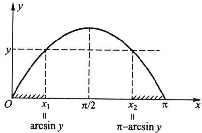  
图2.6.1y=sinx的图形

$$
\Delta _ { \scriptscriptstyle 1 } ( y ) = \left[ 0 , x _ { \scriptscriptstyle 1 } \right] = \left[ 0 , \arcsin y \right] ,
$$

$$
\Delta _ { 2 } ( y ) = \left[ x _ { _ 2 } , \pi \right] = \left[ \pi - \mathrm { a r c s i n } y , \pi \right] .
$$

于是

$$
\begin{array} { l } { { \left\{ Y \leqslant y \right\} = \left\{ X \in \Delta _ { \scriptscriptstyle 1 } ( y ) \right\} \cup \left\{ X \in \Delta _ { \scriptscriptstyle 2 } ( y ) \right\} } } \\ { { \mathrm { } = \left\{ 0 \leqslant X \leqslant \arcsin y \right\} \cup \left\{ \pi - \arcsin y \leqslant X \leqslant \pi \right\} , } } \end{array}
$$

故

$$
\begin{array} { l } { { \displaystyle F _ { _ { \gamma } } ( y ) = P ( Y \leqslant y ) = \int _ { _ { 0 } } ^ { \arcsin y } p _ { _ { \chi } } ( x ) \mathrm { d } x + \int _ { _ { \pi - \arcsin y } } ^ { \pi } p _ { _ { \chi } } ( x ) \mathrm { d } x } } \\ { { \displaystyle \ = \int _ { _ { 0 } } ^ { \arcsin y } \frac { 2 x } { \pi ^ { 2 } } \mathrm { d } x + \int _ { _ { \pi - \arcsin y } } ^ { \pi } \frac { 2 x } { \pi ^ { 2 } } \mathrm { d } x } , } \end{array}
$$

在上式两端对y求导，得

$$
p _ { _ { Y } } ( { y } ) = \frac { 2 \mathrm { a r c } \mathrm { s i n } { y } } { \pi ^ { 2 } \sqrt { 1 - { y } ^ { 2 } } } + \frac { 2 ( \pi - \mathrm { a r c } \mathrm { s i n } { y } ) } { \pi ^ { 2 } \sqrt { 1 - { y } ^ { 2 } } } = \frac { 2 } { \pi \sqrt { 1 - { y } ^ { 2 } } } , \qquad 0 < { y } \leqslant 1 .
$$

## 习题2.6

1.已知离散随机变量X的分布列为

<table><tr><td>X</td><td>-2 -1</td><td>0</td><td></td><td>1</td><td>3</td></tr><tr><td rowspan="2">P</td><td>1</td><td>1</td><td>1</td><td>1</td><td>11</td></tr><tr><td>5</td><td>6</td><td>5</td><td>15</td><td>30</td></tr></table>

试求 $Y = X ^ { 2 }$ 与 $\scriptstyle Z = \mid X \mid$ 的分布列.

2.已知随机变量X的密度函数为

$$
p \left( x \right) = \frac { 2 } { \pi } \cdot \frac { 1 } { e ^ { x } + e ^ { - x } } , \qquad - \infty < x < \infty .
$$

试求随机变量 $Y = _ { g } ( X )$ 的概率分布，其中

$$
\begin{array} { r } { g ( x ) = \left\{ \begin{array} { l l } { - 1 , } & { \exists x < 0 , } \\ { 1 , } & { \Yparallel x \geqslant 0 . } \end{array} \right. } \end{array}
$$

3.设随机变量X服从（-1,2)上的均匀分布，记

$$
Y = \left\{ \begin{array} { l l } { { 1 , } } & { { X \geqslant 0 , } } \\ { { } } & { { } } \\ { { - 1 , } } & { { X < 0 . } } \end{array} \right.
$$

试求Y的分布列.

4.设随机变量 $X \sim U ( 0 , 1 )$ ，试求1-X的分布.

5.设随机变量X服从 $\left( { - \pi / 2 , \pi / 2 } \right)$ 上的均匀分布，求随机变量Y=cosX的密度函数 $\cdot p ( \boldsymbol { y } )$

6.设圆的直径服从区间(0，1）上的均匀分布，求圆的面积的密度函数.

7.设随机变量X服从区间(1,2）上的均匀分布，试求 $Y = { \mathbf { e } } ^ { 2 X }$ 的密度函数.

8.设随机变量X服从区间(0,2）上的均匀分布.

（1）求 $Y = { X } ^ { 2 }$ 的密度函数；（2）求 $P \left( \ Y < 2 \right)$

9.设随机变量X服从区间（-1，1）上的均匀分布，求：

(1） $P { \left( \ | \chi | > \frac { 1 } { 2 } \right) }$

（2）Y=IXI的密度函数.

10.设随机变量X服从(0,1)上的均匀分布，试求以下Y的密度函数：

(1） $Y = - 2 \ln \ X ;$ (2) $Y = 3 X + 1$

(3) $Y = { \mathbf e } ^ { x }$ (4） $Y = \left| \ln { X } \right| .$

11.设随机变量X的密度函数为

$$
p _ { x } ( x ) = { \left\{ \begin{array} { l l } { { \displaystyle \frac { 3 } { 2 } } x ^ { 2 } , } & { - 1 < x < 1 , } \\ { 0 , } & { \sharp \# . } \end{array} \right. }
$$

试求下列随机变量的分布：

(1) $Y _ { _ { \vert } } = 3 X ;$ (2) $Y _ { _ { 2 } } = 3 - X$ (3） $Y _ { _ 3 } { = } X ^ { 2 }$

12.设随机变量 $X \sim \smash { N ( 0 , \sigma ^ { 2 } ) }$ ，求 $Y = X ^ { 2 }$ 的分布.

13.设随机变量 $X \sim N ( \mu , \sigma ^ { 2 } )$ ，求 $Y = { \mathbf e } ^ { \chi }$ 的数学期望与方差.

14.设随机变量X服从标准正态分布 $N ( 0 , 1 )$ ，试求以下Y的密度函数：

(1) $Y = | X |$ (2) $Y = 2 { X } ^ { 2 } + 1$

15.设随机变量X的密度函数为

$$
p ( x ) = \left\{ { \begin{array} { l l } { { \mathrm { e } } ^ { - x } , } & { { \dddot { \Xi } } x > 0 , } \\ { 0 , } & { { \dddot { \Xi } } x \ll 0 . } \end{array} } \right.
$$

试求以下Y的密度函数：

(1) $Y = 2 X + 1$ (2) $Y = { \mathbf e } ^ { X } \ ;$ (3) $Y = X ^ { 2 }$

16.设随机变量X服从参数为2的指数分布，试证 $Y _ { _ { 1 } } = \mathbf { e } ^ { - 2 X }$ 和 $Y _ { 2 } = 1 - e ^ { - 2 X }$ 都服从区间（0，1）上的均匀分布.

17.设随机变量 $X \sim L N ( \mu , \sigma ^ { 2 } )$ ，试证： $Y = \ln X \sim N ( \mu , \sigma ^ { 2 } )$

18.设随机变量 $Y \sim L N ( 5 , 0 . 1 2 ^ { 2 } )$ ，试求 $P \left( \ Y { < } 1 8 8 . 7 \right)$

## 2.7分布的其他特征数

数学期望和方差是随机变量最重要的两个特征数.此外，随机变量还有一些其他的特征数，以下逐一给出它们的定义，且解释它们的含义.

## 2.7.1k阶矩

定义2.7.1设X为随机变量，k为正整数.如果以下的数学期望都存在，则称

$$
\boldsymbol { \mu } _ { k } = E ( \boldsymbol { X } ^ { k } )\tag{2.7.1}
$$

为X的k阶原点矩.称

$$
\nu _ { _ k } = E { ( X - E ( X ) ) } ^ { k }\tag{2.7.2}
$$

为X的k阶中心矩.

显然，一阶原点矩就是数学期望，二阶中心矩就是方差.由于 $\mid X \mid ^ { k - 1 } \leqslant \mid X \mid ^ { k } + 1$ ,故k阶矩存在时，k-1阶矩也存在，从而低于k的各阶矩都存在.

中心矩和原点矩之间有一个简单的关系，事实上

$$
\nu _ { _ k } = E \left( X - E ( X ) \right) ^ { _ k } = E \left( X - \mu _ { _ 1 } \right) ^ { _ k } = \sum _ { i = 0 } ^ { k } { \binom { k } { i } } \mu _ { _ i } ( - \mu _ { _ 1 } ) ^ { ^ { k - i } } ,
$$

故前四阶中心矩可分别用原点矩表示如下：

$$
\begin{array} { r l } & { \nu _ { 1 } = 0 , } \\ & { } \\ & { \nu _ { 2 } = \mu _ { 2 } - \mu _ { 1 } ^ { 2 } , } \\ & { } \\ & { \nu _ { 3 } = \mu _ { 3 } - 3 \mu _ { 2 } \mu _ { 1 } + 2 \mu _ { 1 } ^ { 3 } , } \\ & { } \\ & { \nu _ { 4 } = \mu _ { 4 } - 4 \mu _ { 3 } \mu _ { 1 } + 6 \mu _ { 2 } \mu _ { 1 } ^ { 2 } - 3 \mu _ { 1 } ^ { 4 } . } \end{array}
$$

例2.7.1设随机变量 $X \sim \mathit { N } ( 0 , { \sigma } ^ { 2 } )$ ，则

$$
\mu _ { _ k } = E { \bigl ( } X ^ { k } { \bigr ) } = { \frac { 1 } { \sqrt { 2 \pi } \sigma } } { \int } _ { - \infty } ^ { \infty } x ^ { k } \exp \Biggl \{ - \frac { x ^ { 2 } } { 2 \sigma ^ { 2 } } \Biggr \} \mathrm { d } x = \frac { \sigma ^ { k } } { \sqrt { 2 \pi } } { \int } _ { - \infty } ^ { \infty } u ^ { k } \exp \Biggl \{ - \frac { u ^ { 2 } } { 2 } \Biggr \} \mathrm { d } u .
$$

在k为奇数时，上述被积函数是奇函数，故

$$
\mu _ { \scriptscriptstyle k } = 0 , \quad k = 1 , 3 , 5 , \cdots .
$$

在k为偶数时，上述被积函数是偶函数，再利用变换 $z = { u ^ { 2 } } / { 2 }$ ,可得

$$
\begin{array} { l } { \displaystyle \mu _ { _ k } = \sqrt { \frac { 2 } { \pi } } \sigma ^ { ^ { k } } 2 ^ { ( k - 1 ) / 2 } \int _ { 0 } ^ { \infty } z ^ { ( k - 1 ) / 2 } \mathrm { e } ^ { - z } \mathrm { d } z = \sqrt { \frac { 2 } { \pi } } \sigma ^ { ^ { k } } 2 ^ { ( k - 1 ) / 2 } \Gamma \Big ( \frac { k + 1 } { 2 } \Big ) } \\ { \displaystyle = \sigma ^ { ^ k } ( k - 1 ) \left( k - 3 \right) \cdots 1 . \qquad k = 2 , 4 , 6 , \cdots . } \end{array}
$$

故 $N ( 0 , \sigma ^ { 2 } )$ 分布的前四阶原点矩为

$$
\mu _ { _ 1 } = 0 , \qquad \mu _ { _ 2 } = \sigma ^ { ^ 2 } , \qquad \mu _ { _ 3 } = 0 , \qquad \mu _ { _ 4 } = 3 \sigma ^ { ^ 4 } .
$$

又因为 $E ( X ) = 0$ ，所以有原点矩等于中心矩，即 $\mu _ { _ k } = \nu _ { _ k } , k = 1 , 2 , \cdots$

## 2.7.2变异系数

方差(或标准差)反映了随机变量取值的波动程度，但在比较两个随机变量的波动大小时，如果仅看方差(或标准差）的大小有时会产生不合理的现象.这有两个原因：（1）随机变量的取值有量纲，不同量纲的随机变量用其方差(或标准差)去比较它们的波动大小不太合理.（2）在取值的量纲相同的情况下，取值的大小有一个相对性问题，取值较大的随机变量的方差(或标准差）也允许大一些.

所以要比较两个随机变量的波动大小时，在有些场合使用以下定义的变异系数来进行比较，更具可比性.

定义2.7.2设随机变量X的二阶矩存在，则称比值

$$
C _ { \mathfrak { v } } ( X ) = { \frac { \sqrt { \operatorname { V a r } ( X ) } } { E ( X ) } } = { \frac { \sigma ( X ) } { E ( X ) } }\tag{2.7.3}
$$

为X的变异系数.

因为标准差的量纲与数学期望的量纲是一致的，所以变异系数是一个无量纲的量，从而消除量纲对波动的影响.

例2.7.2用X表示某种同龄树的高度，其量纲是米（m），用Y表示某年龄段儿童的身高，其量纲也是米（m）.设 $E ( \boldsymbol { X } ) = 1 0 , \operatorname { V a r } ( \boldsymbol { X } ) = 1 , E ( \boldsymbol { Y } ) = 1 , \operatorname { V a r } ( \boldsymbol { Y } ) = 0 . 0 4$ ，是否可以从 $\mathbf { V } \mathbf { a r } ( X ) = 1$ 和 $\mathrm { V a r } ( Y ) = 0 . 0 4$ 就认为Y的波动小？这就有一个取值相对大小的问题.在此用变异系数进行比较是恰当的.因为X的变异系数为

$$
C _ { \nu } ( X ) = { \frac { \sigma ( X ) } { E ( X ) } } { = } { \frac { 1 } { 1 0 } } = 0 . 1 ,
$$

而Y的变异系数为

$$
C _ { \circ } ( Y ) = { \frac { \sigma ( Y ) } { E ( Y ) } } = { \frac { \sqrt { 0 . 0 4 } } { 1 } } = 0 . 2 ,
$$

这说明Y（儿童身高）的波动比X（同龄树高)的波动大.

## 2.7.3分位数

定义2.7.3设连续随机变量X的分布函数为 $\boldsymbol { F } ( \boldsymbol { x } )$ ，密度函数为 $p \left( { \boldsymbol { x } } \right)$ .对任意$p \in ( 0 , 1 )$ ，称满足条件

$$
F ( x _ { _ { p } } ) = \int _ { - \infty } ^ { x _ { p } } p ( x ) \mathrm { d } x = p\tag{2.7.4}
$$

的x为此分布的p分位数，又称下侧 $x _ { _ { p } }$ $p$ 分位数.

很多概率统计问题最后都归结为求解满足概率不等式 $\boldsymbol { F } ( \boldsymbol { x } ) \leqslant p$ 的最大x,其解可用分位数x表示.为此人们对常用分布（如正态分布、t分布、X分布等)编制了各种分 $x _ { p }$ $\chi ^ { 2 }$ 位数表（见本书附表）供实际使用.

分位数x，是把密度函数下的面积分为两块，左侧面积恰好为p（见图2.7.1（a））. $x _ { _ p }$ $p$

同理我们称满足条件

$$
1 - F { \bigl ( } x _ { p } ^ { \prime } { \bigr ) } = \int _ { x _ { p } ^ { \prime } } ^ { \infty } p { \bigl ( } x { \bigr ) } \mathrm { d } x = p\tag{2.7.5}
$$

的 $\boldsymbol { x } _ { \ p } ^ { \prime }$ 为此分布的上侧p分位数.

上侧分位数x也是把密度函数下的面积分为两块，但右侧面积恰好为p（见图 $\boldsymbol { x } _ { \ p } ^ { \prime }$ $P$ 2.7.1(b)).

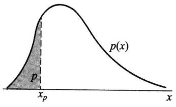  
(a)下侧分位数

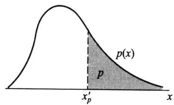  
(b)上侧分位数  
图2.7.1分位数与上侧分位数的区别

要善于区分分位数（即下侧分位数）与上侧分位数的差别，本书指定用分位数表（即下侧分位数表），而有一些书使用的是上侧分位数表，无论用什么表，书中都有说明.

分位数与上侧分位数是可以相互转换的，其转换公式如下.

$$
x _ { _ p } ^ { \prime } = x _ { 1 - p } , x _ { _ p } = x _ { 1 - p } ^ { \prime } .
$$

例2.7.3标准正态分布N(0,1)的p分位数记为up,它是方程 $p$ $\boldsymbol { u } _ { { p } }$

$$
\varPhi ( u _ { p } ) = p\tag{2.7.6}
$$

的唯一解，其解为 $\boldsymbol { u } _ { p } = \boldsymbol { \varPhi } ^ { - 1 } \left( \boldsymbol { p } \right)$ ,其中 $\pmb { \phi } ^ { - 1 } ( \ \cdot \ )$ 是标准正态分布函数的反函数.利用标准正态分布函数表（见附表2），我们可由p查得u.譬如 $p$ $u _ { p }$ $u _ { _ { 0 . 9 7 5 } } = 1 . 9 6$ 常用的标准正态分布的p分位数并不多，现列于表2.7.1上.由于标准正态分布的密度函数是偶函数，故其分 $p$ 位数有如下性质：

·当 $p { < } 0 . 5$ 时， $u _ { p } < 0 .$

·当 $p { > } 0 . 5$ 时， $u _ { p } > 0 .$

·当 $p = 0 . 5$ 时， $u _ { 0 . 5 } = 0 .$

·当 $p _ { 1 } { < } p _ { 2 }$ 时， $u _ { p _ { _ 1 } } < u _ { p _ { _ 2 } }$

·对任意的 $p$ ，有 $\ L _ { u _ { p } } = \ L - u _ { 1 - p }$ ,如 $u _ { 0 . 0 0 1 } = - u _ { 0 . 9 9 9 } = - 3 . 0 9 0$

表2.7.1标准正态分布p分位数表（部分） $p$
<table><tr><td> $p$ </td><td>0.999</td><td>0.995</td><td>0.990</td><td>0.975</td><td>0.950</td><td>0.900</td><td>0.850</td><td>0.800</td></tr><tr><td> $u _ { p }$ </td><td>3.090</td><td>2.576</td><td>2.326</td><td>1.960</td><td>1.645</td><td>1.282</td><td>1.037</td><td>0.842</td></tr></table>

又由定理2.5.1可知：一般正态分布 $N ( \mu , \sigma ^ { 2 } )$ 的p分位数 $x _ { p }$ 是方程

$$
\varPhi \left( \frac { x _ { _ { p } } - \mu } { \sigma } \right) = p
$$

的解，所以由

$$
{ \frac { x _ { _ { p } } - \mu } { \sigma } } = u _ { _ { p } }
$$

可得 $x _ { _ p }$ 与 $\boldsymbol { u } _ { \flat _ { p } }$ 的关系式

$$
\mathbf { \Delta } _ { x _ { p } } = \mu _ { \mathbf { \Delta } } + \sigma _ { } u _ { \mathbf { \Delta } _ { p } } .\tag{2.7.7}
$$

譬如正态分布 $N ( 1 0 , 2 ^ { 2 } )$ 的0.975分位数为

$$
x _ { _ { 0 . 9 7 5 } } = 1 0 + 2 u _ { _ { 0 . 9 7 5 } } = 1 0 + 2 \times 1 . 9 6 = 1 3 . 9 2 .
$$

例2.7.4记某种轴承的寿命为T,t为此寿命分布的p分位数，则 $T , t _ { p }$ $t _ { _ { 0 , 1 } } = 1 \ 0 0 0 \ \mathrm { h }$ 表明此种轴承中约有90%寿命超过1000h.若记另一种轴承的寿命为 $Z , p$ 分位数为 $z _ { p } .$ 则当 $z _ { _ { 0 . 1 } } ^ { } = 1 \ 5 0 0 \ \mathrm { h }$ 时，从0.1的分位数上说明后者的质量比前者更高一些：

## 2.7.4中位数

定义2.7.4设连续随机变量X的分布函数为 $F ( x )$ ,密度函数为 $p \left( { \boldsymbol { x } } \right)$ .称 $p = 0 . 5$ 时的p分位数x。为此分布的中位数，即x。满足 $x _ { 0 . 5 }$ ${ \boldsymbol { x } } _ { _ { 0 . 5 } }$

$$
F ( x _ { _ { 0 . 5 } } ) = \int _ { - \infty } ^ { x _ { 0 . 5 } } p ( x ) { \mathrm { d } } x = 0 . 5 .\tag{2.7.8}
$$

中位数的位置常在分布的中部，见图2.7.2.

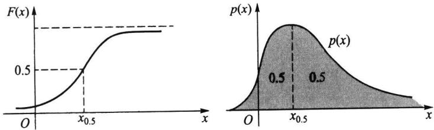  
图2.7.2连续随机变量的中位数

对离散分布也可以同样引人分位数和中位数的概念，但遗憾的是：此时对给定的P,有可能x。不存在或不唯一.所以在离散分布场合很少使用分位数，在这里我们不再 $\boldsymbol { x } _ { p }$ 予以讨论.

中位数与均值一样都是随机变量位置的特征数，但在某些场合可能中位数比均值更能说明问题.譬如，某班级学生的考试成绩的中位数为80分，则表明班级中有一半同学的成绩低于80分，另一半同学的成绩高于80分.而如果考试成绩的均值是80分，则无法得出如此明确的结论.

又譬如，记X为A国人的年龄，Y为B国人的年龄,x。和y。,分别为X和Y的中位 $\boldsymbol { x } _ { 0 . 5 }$ $y _ { 0 . 5 }$ 数，则 ${ x _ { } } _ { 0 , 5 } = 4 0$ 岁说明A国约有一半的人年龄小于等于40岁、一半的人年龄大于等于40岁.而 $y _ { _ { 0 . 5 } } = 5 0$ 岁则说明B国更趋于老龄化.

例2.7.5指数分布Exp(λ）的中位数x。.5是方程 $\boldsymbol { x } _ { 0 , 5 }$

$$
1 \mathrm { ~ - ~ e ~ } ^ { - \lambda x _ { 0 . 5 } } = 0 . 5
$$

的解，解之得

$$
x _ { _ { 0 . 5 } } = { \frac { \ln 2 } { \lambda } } .
$$

假如,某城市电话的通话时间X（以min计）服从均值 $E ( X ) = 2 { \big ( } \operatorname* { m i n } { \big ) }$ 的指数分布，此时由 $\lambda = 0 . 5$ 可得中位数为

$$
x _ { _ { 0 . 5 } } = { \frac { \ln 2 } { 0 . 5 } } = 1 . 3 9 ( \min ) .
$$

它表明：该城市中约有一半的电话在1.39min内结束，另一半的通话时间超过1.39 min.

例2.7.6设连续随机变量X的密度函数为

$$
p \left( x \right) = \left\{ \begin{array} { l l } { 4 x ^ { 3 } , 0 < x < 1 , } \\ { 0 , } \end{array} \right.
$$

试求此分布的0.95分位数 $x _ { 0 . 9 5 }$ 和中位数 $\boldsymbol { x } _ { 0 , 5 }$

解因为X的分布函数为

$$
F ( x ) = \left\{ \begin{array} { l l } { 0 , } & { x < 0 , } \\ { x ^ { 4 } , } & { 0 \leqslant x < 1 , } \\ { 1 , } & { 1 \leqslant x . } \end{array} \right.
$$

所以由 $F ( x _ { 0 . 9 5 } ) = 0 . 9 5$ 可得 $: x _ { 0 . 9 5 } ^ { 4 } = 0 . 9 5$ ,由此得 ${ x _ { 0 . 9 5 } = \sqrt [ 4 ] { 0 . 9 5 } = 0 . 9 8 7 \ 3 }$ 同理由 $F ( x _ { 0 . 5 } ) =$ 0.5得 $\pmb { x } _ { 0 . 5 } ^ { 4 } = 0 . 5$ ，从中解得 ${ x _ { 0 . 5 } = \sqrt [ 4 ] { 0 . 5 } = 0 . 8 4 0 ~ 9 }$

## 2.7.5偏度系数

定义2.7.5设随机变量X的前三阶矩存在，则比值

$$
\beta _ { s } = \frac { \nu _ { 3 } } { \nu _ { 2 } ^ { 3 / 2 } } = \frac { E ( X - E ( X ) ) ^ { 3 } } { \big [ \mathrm { V a r } ( X ) \big ] ^ { 3 / 2 } }
$$

称为X（或分布）的偏度系数，简称偏度.当 $\beta _ { s } { > } 0$ 时，称该分布为正偏，又称右偏；当 $\beta _ { s } <$ 0时，称该分布为负偏，又称左偏.

偏度βs是描述分布偏离对称性程度的一个特征数，这可从以下几方面来认识. $\beta _ { s }$

（1）当密度函数p(x)关于数学期望对称时，即有 $p ( x )$ $p ( E ( \boldsymbol { X } ) - \boldsymbol { x } ) = p ( E ( \boldsymbol { X } ) + \boldsymbol { x } )$ ,则其三阶中心矩v必为0，从而βs=0.这表明关于 $\nu _ { 3 }$ $\beta _ { s } = 0 .$ $E ( X )$ 对称的分布其偏度为0.譬如，正态分布 $N ( \mu , \sigma ^ { 2 } )$ 关于 $E ( X ) = \mu$ 是对称的,故任意正态分布的偏度皆为0.

（2）当偏度 $\beta _ { s } \neq 0$ 时，该分布为偏态分布，偏态分布常有不对称的两个尾部，重尾在右侧(变量在高值处比低值处有较大的偏离中心趋势）必导致 $\beta _ { s } > 0$ ，故此分布又称为右偏分布；重尾在左侧(变量在低值处比高值处有较大的偏离中心趋势)必导致 $\beta _ { s } <$ 0,故又称为左偏分布，参见图2.7.3.

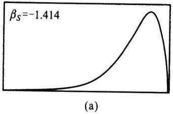

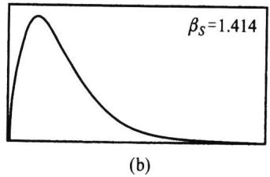  
图2.7.3两个密度函数，（a)为左偏，(b)为右偏

（3）偏度βs是以各自的标准差的三次方 $\beta _ { s }$ $[ \sigma ( X ) ] ^ { 3 }$ 为单位来度量三阶中心矩大小的，从而消去了量纲，使其更具有可比性.简单地说，分布的三阶中心矩v决定偏度的 $\nu _ { 3 }$ 符号,而分布的标准差 $\sigma ( { \boldsymbol { X } } )$ 决定偏度的大小.

例2.7.7讨论三个贝塔分布 $B e ( 2 , 8 ) , B e ( 8 , 2 )$ 和 $B e ( 5 , 5 )$ 的偏度.

解设随机变量X服从贝塔分布 $B e ( a , b )$ ,则可算得其前三阶原点矩：

$$
E \left( \ X \right) = \frac { a } { a + b } ,
$$

$$
E ( X ^ { 2 } ) = { \frac { a \left( a + 1 \right) } { \left( a + b \right) \left( a + b + 1 \right) } } ,
$$

$$
E \left( \begin{array} { l } { { X ^ { 3 } } } \end{array} \right) = \frac { a \left( a + 1 \right) \left( a + 2 \right) } { \left( a + b \right) \left( a + b + 1 \right) \left( a + b + 2 \right) } .
$$

以下为简化 $\beta _ { s }$ 的计算，特用 $a + b = 1 0 , b = 1 0 - a$ 代人可算得前三阶中心矩.

$$
E ( X ) = \frac { a } { 1 0 } , ~ \mathrm { V a r } ( X ) = \frac { a ( 1 0 - a ) } { 1 0 ^ { 2 } \times 1 1 } , ~ E ( X { - } E ( X ) ) ^ { 3 } = \frac { a ( 1 0 { - } a ) ( 5 { - } a ) } { 1 0 ^ { 3 } \times 1 1 \times 3 } .
$$

可得贝塔分布的偏度为

$$
\beta _ { s } = \frac { E \left( X - E \left( X \right) \right) ^ { 3 } } { \left[ \operatorname { V a r } \left( X \right) \right] ^ { 3 / 2 } } { = \frac { \sqrt { 1 1 } \left( 5 - a \right) } { 3 \sqrt { a \left( 1 0 - a \right) } } } ,
$$

把a=2,5,8分别代人可得

$B e ( 2 , 8 )$ 的 $\beta _ { s } = \sqrt { 1 1 } / 4 = 0 . 8 2 9 \ 2$ ，右偏（正偏），

$B e ( 5 , 5 )$ 的 $\beta _ { s } = 0$ ,对称，

$B e ( 8 , 2 )$ 的 $\beta _ { s } = - \sqrt { 1 1 } / 4 = - 0 . 8 2 9 ~ 2$ ,左偏(负偏）.

## 2.7.6峰度系数

定义2.7.6设随机变量X的前四阶矩存在，则

$$
\beta _ { k } = \frac { \nu _ { 4 } } { \nu _ { 2 } ^ { 2 } } - 3 = \frac { E \left( X - E \left( X \right) \right) ^ { 4 } } { \left[ \mathrm { V a r } \left( X \right) \right] ^ { 2 } } - 3
$$

称为X（或分布）的峰度系数，简称峰度.

峰度是描述分布尖峭程度和(或)尾部粗细的一个特征数，这可从以下几方面来认识.

（1）正态分布 $N ( \mu , \sigma ^ { 2 } )$ 的 $\nu _ { _ 2 } = \sigma ^ { 2 } , \nu _ { _ 4 } = 3 \sigma ^ { 4 }$ ，故按上述定义，任一正态分布 $N ( \mu , \sigma ^ { 2 } )$ 的峰度 $\beta _ { k } = 0$ 0.可见这里谈论的“峰度”不是指一般密度函数的峰值高低，因为正态分布$N ( \mu , \sigma ^ { 2 } )$ 的峰值为 $( \sqrt { 2 \pi } \sigma ) ^ { - 1 }$ ，它与正态分布标准差σ成反比，σ愈小，正态分布的峰 $\pmb { \sigma }$ $\pmb { \sigma }$ 值愈高，可这里的“峰度”与σ无关. $\pmb { \sigma }$

（2）假如在上述定义中，分子与分母各除以 $\boldsymbol { \left[ \sigma ( X ) \right] { } ^ { 4 } }$ ，并记X的标准化变量为 $X ^ { \ast }$ $= { \frac { X - E ( X ) } { \sigma ( X ) } }$ ,则 $\beta _ { k }$ 可改写成

$$
{ \beta } _ { k } = \frac { E ( X ^ { \bullet } ) ^ { 4 } } { [ E ( X ^ { \bullet 2 } ) ] ^ { 2 } } - 3 = E ( X ^ { \bullet 4 } ) - E ( U ^ { 4 } ) ,
$$

其中 $E ( X ^ { * 2 } ) = \operatorname { V a r } ( X ^ { * } ) = 1$ ,U为标准正态变量， $\boldsymbol { E } ( \boldsymbol { U } ^ { 4 } ) = 3$

上式表明：峰度β是相对于正态分布而言的超出量，即峰度β是X的标准化变量 $\beta _ { k }$ $\beta _ { k }$ 与标准正态变量的四阶原点矩之差，并以标准正态分布为基准确定其大小.

. $\beta _ { k } > 0$ 表示标准化后的分布比标准正态分布更尖峭和(或)尾部更粗(见图2.7.4（b），图中尖峭的曲线是拉普拉斯分布）.

$\beta _ { k } < 0$ 表示标准化后的分布比标准正态分布更平坦和(或)尾部更细(见图2.7.4

（a),图中方形的曲线是均匀分布）.

$\beta _ { k } = 0$ 表示标准化后的分布与标准正态分布的尖峭程度与尾部粗细相当.

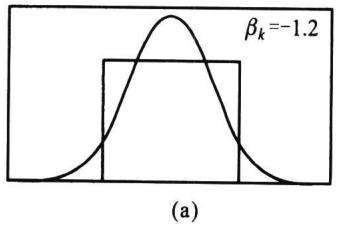

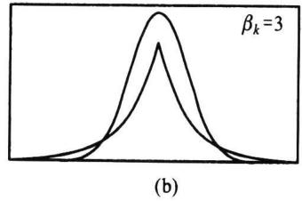  
图2.7.4两个密度函数与标准正态分布密度函数的比较  
它们的均值相等、方差相等、偏度皆为0（对称分布），而峰度有很大差别

（3）偏度与峰度都是描述分布形状的特征数，它们的设置都是以正态分布为基准，正态分布的偏度与峰度皆为0.在实际中一个分布的偏度与峰度皆为0或近似为0时,常认为该分布为正态分布或近似为正态分布.

（4）表2.7.2上列出了几种常见分布的偏度与峰度，其中伽马分布 $G a ( \alpha , \lambda )$ 的偏度与峰度只与α有关，而与入无关，故α常称为形状参数，而入不能称为形状参数.均匀分布 $U ( a , b )$ 与指数分布 $E x p ( \lambda )$ 的偏度与峰度都与其所含参数无关，故均匀分布$U ( a , b )$ 中的参数a与b、指数分布中的参数入均不能称为形状参数.进一步的研究会发现，贝塔分布 $B e ( a , b )$ 的偏度与峰度与其参数a与b都有关，它们都可以称为形状参数.

表2.7.2几种常见分布的偏度与峰度
<table><tr><td>分布</td><td>均值</td><td>方差</td><td>偏度</td><td>峰度</td></tr><tr><td>均匀分布  $U ( a , b )$ </td><td> $( a + b ) / 2$ </td><td> $( b - a ) ^ { 2 } / 1 2$ </td><td>0</td><td>-1.2</td></tr><tr><td>正态分布  $N ( \mu , \sigma ^ { 2 } )$ </td><td>从</td><td> $\sigma ^ { 2 }$ </td><td>0</td><td>0</td></tr><tr><td>指数分布  $E x p ( \lambda )$ </td><td>1/入</td><td> $1 / \lambda ^ { 2 }$ </td><td>2</td><td>6</td></tr><tr><td>伽马分布  $G a ( \alpha , \lambda )$ </td><td>a/1</td><td> $\alpha / \lambda ^ { 2 }$ </td><td> $2 / \sqrt { \alpha }$ </td><td> ${ 6 } / { \alpha }$ </td></tr></table>

例2.7.8计算伽马分布 $G a ( \alpha , \lambda )$ 的偏度与峰度.

解首先计算伽马分布 $G a ( \alpha , \lambda )$ 的k阶原点矩：

$$
\mu _ { k } = E ( X ^ { k } ) = \alpha ( \alpha + 1 ) \cdots ( \alpha + k - 1 ) / { \lambda ^ { k } } .
$$

当k=1,2,3,4时可得前四阶原点矩

$$
\begin{array} { r c l } { { } } & { { } } & { { \mu _ { 1 } = \alpha / \lambda ~ , } } \\ { { } } & { { } } & { { } } \\ { { } } & { { } } & { { \mu _ { 2 } = \alpha ( \alpha + 1 ) / \lambda ^ { 2 } , } } \\ { { } } & { { } } & { { } } \\ { { } } & { { } } & { { \mu _ { 3 } = \alpha ( \alpha + 1 ) \left( \alpha + 2 \right) / \lambda ^ { 3 } , } } \\ { { } } & { { } } & { { } } \\ { { } } & { { } } & { { \mu _ { 4 } = \alpha ( \alpha + 1 ) \left( \alpha + 2 \right) \left( \alpha + 3 \right) / \lambda ^ { 4 } . } } \end{array}
$$

由此可得2、3、4阶中心矩

$$
\begin{array} { r l } & { \nu _ { 2 } = \mu _ { 2 } - \mu _ { 1 } ^ { 2 } = \alpha / \lambda ^ { 2 } , } \\ & { \nu _ { 3 } = \mu _ { 3 } - 3 \mu _ { 2 } \mu _ { 1 } + 2 \mu _ { 1 } ^ { 2 } = 2 \alpha / \lambda ^ { 3 } , } \end{array}
$$

$$
\nu _ { 4 } = \mu _ { 4 } - 4 \mu _ { 3 } \mu _ { 1 } + 6 \mu _ { 2 } \mu _ { 1 } ^ { 2 } - 3 \mu _ { 1 } ^ { 4 } = 3 \alpha \left( \alpha + 2 \right) / \lambda ^ { 4 } .
$$

最后可得伽马分布 $G a ( \alpha , \lambda )$ 的偏度与峰度

$$
\beta _ { s } = \frac { \nu _ { 3 } } { \nu _ { 2 } ^ { 3 / 2 } } = \frac { 2 } { \sqrt { \alpha } } ,
$$

$$
\beta _ { k } = \frac { \nu _ { 4 } } { \nu _ { 2 } ^ { 2 } } - 3 = \frac { 6 } { \alpha } .
$$

可见，伽马分布 $G a ( \alpha , \lambda )$ 的偏度与√成反比.峰度与α成反比.只要α较大，可使β；与 $\sqrt { \alpha }$ $\beta _ { s }$ $\beta _ { k }$ 接近于0,从而伽马分布也愈来愈近似正态分布.

## 习题2.7

1.设随机变量 $X \sim U ( a , b )$ ，对 $k = 1 , 2 , 3 , 4$ ，求 ${ \mu } _ { k } = E ( X ^ { k } )$ 与 $\nu \mathbin { \lrcorner } = E \left( X - E \left( X \right) \right) ^ { k }$ 进一步求此分布的偏度系数和峰度系数.

2.设随机变量 $X \sim U ( 0 , a )$ ，求此分布的变异系数.

3.求以下分布的中位数：

（1）区间(a，b）上的均匀分布；

(2）正态分布 $N ( \mu , \sigma ^ { 2 } )$

（3）对数正态分布 $L N ( \mu , \sigma ^ { 2 } )$

4.设随机变量 $X \sim G a \left( \alpha , \lambda \right)$ ，对k=1,2,3，求 ${ \mu } _ { k } = E ( \boldsymbol { X } ^ { k } )$ 与 $\nu _ { _ { k } } = E { \bigl ( } X - E ( X ) { \bigr ) } ^ { k } ,$

5.设随机变量 $X \sim E x p \left( \lambda \right)$ ，对 $k = 1 , 2 , 3 , 4$ ，求 ${ \mu } _ { _ k } = E ( X ^ { k } )$ 与 $\nu _ { _ { k } } = E \left( \ X - E \left( \ X \right) \ \right) ^ { k }$ .进一步求此分布的变异系数、偏度系数和峰度系数.

6.设随机变量X服从正态分布N（10,9），试求x和 $\boldsymbol { x } _ { 0 , 1 }$ ${ x _ { _ { 0 . 9 } } } ^ { } .$

7.设随机变量X服从双参数韦布尔分布，其分布函数为

$$
F ( x ) ~ = ~ 1 - \exp \left\{ - \left( \frac { x } { \eta } \right) ^ { ~ m } \right\} ~ , \qquad x ~ > ~ 0 ,
$$

其中 $\begin{array} { r } { \eta > 0 , m > 0 . } \end{array}$ 试写出该分布的p分位数x的表达式，且求出当 $x _ { _ { p } }$ $m = 1 . 5 , \eta = 1 \ 0 0 0$ 时的 ${ \boldsymbol { x } } _ { 0 , 1 } , { \boldsymbol { x } } _ { 0 , 5 } , { \boldsymbol { x } } _ { 0 , 8 }$ 的值

8.自由度为2的 $\chi ^ { 2 }$ 分布的密度函数为

$$
p \left( x \right) ~ = ~ \frac { 1 } { 2 } \mathrm { e } ^ { - \frac { x } { 2 } } , ~ x ~ > ~ 0 .
$$

试求出其分布函数及分位数 ${ \pmb x } _ { 0 , 1 } , { \pmb x } _ { 0 , 5 } , { \pmb x } _ { 0 , 8 } .$

9.设随机变量X的分布密度函数 $p ( x )$ 关于直线x=c是对称的，且E（X）存在，试证：

（1）这个对称点c既是均值又是中位数，即 $E \left( \ K \right) = x _ { _ { 0 . 5 } } = c ;$

（2）如果c=0，则 $\boldsymbol { x } _ { p } = - \boldsymbol { x } _ { 1 - p }$

10.试证随机变量X的偏度系数与峰度系数对位移和改变比例尺是不变的，即对任意的实数a，$b \mid b \neq 0 ) , Y = a + b X$ 与X有相同的偏度系数与峰度系数.

11.设某项维修时间T（单位：分）服从对数正态分布 $L N ( \mu , \sigma ^ { 2 } )$

（1）求p分位数 $t _ { p }$

（2）若 $\mu { = } 4 . 1 2 7 \ 1$ ，求该分布的中位数；

（3）若 $\mu = 4 . 1 2 7 \ 1 , \sigma = 1 . 0 3 6 \ 4$ ，求完成95%维修任务的时间.

12.某种绝缘材料的使用寿命T（单位：小时）服从对数正态分布 $L N ( \mu , \sigma ^ { 2 } )$ .若已知分位数 $t _ { 0 , 2 } =$

5000小时， $t _ { 0 . 8 } = 6 5 \ 0 0 0$ 小时，求 $\pmb { \mu }$ 和 $\pmb { \sigma } .$

13.某厂决定按过去生产状况对月生产额最高的5%的工人发放高产奖.已知过去每人每月生产额X（单位：千克）服从正态分布 $N ( 4 ~ 0 0 0 , 6 0 ^ { 2 } )$ ），试问高产奖发放标准应把生产额定为多少？

本章小结

