## 第三章多维随机变量及其分布

在有些随机现象中，对每个样本点ω只用一个随机变量去描述是不够的.譬如要研究儿童的生长发育情况，仅研究儿童的身高X（ω）或仅研究其体重 $Y ( \omega )$ 都是局部的，有必要把 $X ( \omega )$ 和 $Y ( \omega )$ 作为一个整体来考虑，讨论它们同时变化的统计规律性，进一步可以讨论 $X ( \omega )$ 与 $Y ( \omega )$ 之间的关系.在有些随机现象中，甚至要同时研究两个以上随机变量.

如何来研究多维随机变量的统计规律性呢？仿一维随机变量，我们先研究联合分布函数，然后研究离散随机变量的联合分布列、连续随机变量的联合密度函数等.

## §3.1多维随机变量及其联合分布

## 3.1.1多维随机变量

下面我们先给出n维随机变量的定义.

定义3.1.1如果 $X _ { 1 } ( \omega ) , X _ { 2 } ( \omega ) , \cdots , X _ { n } ( \omega )$ 是定义在同一个样本空间 $\Omega = \{ \omega \}$ 上的n个随机变量，则称

$$
X ( \omega ) = ( X _ { 1 } ( \omega ) , X _ { 2 } ( \omega ) , \cdots , X _ { n } ( \omega ) )
$$

为n维随机变量或随机向量.

注意，多维随机变量的关键是定义在同一样本空间上，对于不同样本空间 $\varOmega _ { 1 }$ 和$\varOmega _ { 2 }$ 上的两个随机变量，我们只能在乘积空间 $\begin{array} { r } { \varOmega _ { 1 } \times \varOmega _ { 2 } = \left\{ \left( \omega _ { 1 } , \omega _ { 2 } \right) : \omega _ { 1 } \in \varOmega _ { 1 } , \omega _ { 2 } \in \varOmega _ { 2 } \right\} } \end{array}$ 及其事件域上讨论它们，这一点在以下讨论中是默认的.

在实际问题中，多维随机变量的情况是经常会遇到的.譬如

·在研究四岁至六岁儿童的生长发育情况时，我们感兴趣于每个儿童（样本点ω）的身高 $X _ { \scriptscriptstyle 1 } ( \omega )$ 和体重 $X _ { 2 } ( \omega )$ ，这里 $( X _ { 1 } , X _ { 2 } )$ 是一个二维随机变量.

·在研究每个家庭的支出情况时，我们感兴趣于每个家庭(样本点ω）的衣食住行四个方面，若用 $X _ { 1 } ( \omega ) , X _ { 2 } ( \omega ) , X _ { 3 } ( \omega ) , X _ { 4 } ( \omega )$ 分别表示衣食住行的花费占其家庭总收人的百分比，则 $( X _ { 1 } , X _ { 2 } , X _ { 3 } , X _ { 4 } )$ 就是一个四维随机变量.

## 3.1.2联合分布函数

定义3.1.2对任意的n个实数 $x _ { 1 } , x _ { 2 } , \cdots , x _ { n } , n$ 个事件 $\left\{ X _ { 1 } \leqslant x _ { 1 } \right\} , \left\{ X _ { 2 } \leqslant x _ { 2 } \right\} , \cdots$ $\left\{ X _ { n } \leqslant x _ { n } \right\}$ 同时发生的概率

$$
F ( x _ { 1 } , x _ { 2 } , \cdots , x _ { n } ) = P ( X _ { 1 } \leqslant x _ { 1 } , X _ { 2 } \leqslant x _ { 2 } , \cdots , X _ { n } \leqslant x _ { n } )\tag{3.1.1}
$$

称为n维随机变量 $( X _ { 1 } , X _ { 2 } , \cdots , X _ { n } )$ 的联合分布函数.

本章主要研究二维随机变量，二维以上的情况可类似讨论.

在二维随机变量(X,Y)场合，联合分布函数 $F ( x , y ) = P ( X \leqslant x , Y \leqslant y )$ 是事件 $\left\{ X \leqslant \right.$ $x \}$ 与 $\left\{ Y \leqslant y \right\}$ 同时发生(交)的概率.如果将二维随机变量(X,Y)看成是平面上随机点的坐标，那么联合分布函数 $F ( x , y )$ 在 $( x , y )$ 处的函数值就是随机点(X,Y)落在以 $( x , y )$

为顶点的左下无穷直角区域（见图3.1.1)上的概率.

定理3.1.1任一二维联合分布函数 $F ( x , y )$ 必具有如下四条基本性质：

（1）单调性 $\boldsymbol { F } ( \boldsymbol { x } , \boldsymbol { y } )$ 分别对x或y是单调非减的，即

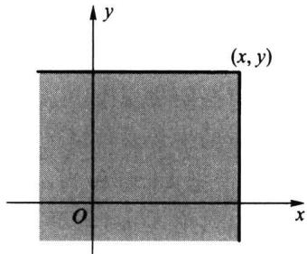

当 $x _ { 1 } \ < \ x _ { 2 }$ 时，有 $F ( x _ { 1 } , y ) \leqslant F ( x _ { 2 } , y )$

当 $y _ { 1 } ~ < ~ y _ { 2 }$ 时,有 $F ( x , y _ { 1 } ) \leqslant F ( x , y _ { 2 } )$

（2）有界性对任意的x和y，有 $0 \leqslant F ( x , y ) \leqslant$ 1,且

图3.1.1以(x,y)为顶点的左下无穷直角区域

$$
\begin{array} { r l } & { F ( { \bf \Phi } - { \bf \Phi } \infty { \bf \Phi } , y ) = \underset { x  { - \infty } } { \operatorname* { l i m } } F ( x , y ) = 0 , } \\ & { F ( x , { \bf \Phi } - { \bf \Phi } \infty { \bf \Phi } ) = \underset { y  { - \infty } } { \operatorname* { l i m } } F ( x , y ) = 0 , } \\ & { F ( \infty { \bf \Phi } , \infty { \bf \Phi } ) = \underset { x , y  { \infty } } { \operatorname* { l i m } } F ( x , y ) = 1 . } \end{array}
$$

（3）右连续性对每个变量都是右连续的，即

$$
\begin{array} { r } { F ( x \ : + \ : 0 \ : , y ) = F ( x \ : , y ) \ : , } \\ { F ( x \ : , y \ : + \ : 0 ) = F ( x \ : , y ) . } \end{array}
$$

（4）非负性对任意的 $a < b , c < d$ 有

$$
P ( a < X \leqslant b , c < Y \leqslant d ) = F ( b , d ) - F ( a , d ) - F ( b , c ) + F ( a , c ) \geqslant 0 .
$$

证明（1）因为当 $x _ { 1 } < x _ { 2 }$ 时，有 $\{ X { \leqslant } x _ { 1 } \} \subset \{ X { \leqslant } x _ { 2 } \}$ ,所以对任意给定的y有

$$
\left\{ X \leqslant x _ { 1 } , Y \leqslant y \right\} \subset \left\{ X \leqslant x _ { 2 } , Y \leqslant y \right\} ,
$$

由此可得

$$
F ( x _ { 1 } , y ) = P ( X \leqslant x _ { 1 } , Y \leqslant y ) \leqslant P ( X \leqslant x _ { 2 } , Y \leqslant y ) = F ( x _ { 2 } , y ) ,
$$

即 $F ( x , y )$ 关于x是单调非减的.同理可证 $F ( x , y )$ 关于y是单调非减的.

（2）由概率的性质可知 $0 \leqslant F ( \boldsymbol { x } , \boldsymbol { y } ) \leqslant 1$ .又因为对任意的正整数n有

$$
\begin{array} { r l r } & { } & { \underset { x  - \infty } { \operatorname* { l i m } } \{ X \leqslant x \} = \underset { n  \infty } { \operatorname* { l i m } } \underset { m = 1 } { \overset { n } { \bigcap } } \{ X \leqslant - m \} = \emptyset , } \\ & { } &  \underset { { \displaystyle \operatorname* { l i m } } \{ X \leqslant x \} = \underset { n  \infty } { \operatorname* { l i m } } \underset { m = 1 } { \overset { n } { \bigcup } } \{ X \leqslant m \} = \Omega , } \end{array}
$$

对 $\vert Y \leqslant y \}$ 也类似可得.再由概率的连续性，就可得

$$
F ( { \textbf { - } } \infty , y ) = F ( x , { \textbf { - } } \infty ) = 0 , \quad F ( \infty , \infty ) = 1 .
$$

（3）固定y,仿一维分布函数右连续的证明，就可得知 $F ( x , y )$ 关于x是右连续的.同样固定x，可证得 $F ( x , y )$ 关于y是右连续的.

（4）只需证：对 $a < b , c < d$ 有

$$
P ( a < X \leqslant b , c < Y \leqslant d ) = F ( b , d ) - F ( a , d ) - F ( b , c ) + F ( a , c ) .
$$

为此记（见图3.1.2）

$$
\begin{array} { r } { A = \left\{ X \leqslant a \right\} , \quad B = \left\{ X \leqslant b \right\} , } \\ { C = \left\{ Y \leqslant c \right\} , \quad D = \left\{ Y \leqslant d \right\} , } \end{array}
$$

这里A是 $\left\{ X \leqslant a , Y < \infty \right\}$ 的简写，C是 $\left\{ X < \infty , Y \leqslant c \right\}$ 的简写，其他类同.考虑到

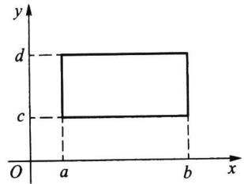

$$
\begin{array} { r } { \left\{ a < X \leqslant b \right\} = B - C = B \cap A , } \\ { \left\{ c < Y \leqslant d \right\} = D - C = D \cap \overline { { C } } , } \end{array}
$$

图3.1.2二维随机变量

（X，Y)落在矩形中的情况

且 $A \subset B , C \subset D$ ,由此可得

$$
\begin{array} { r l } & { 0 \leqslant P ( a \leqslant X \leqslant b , c < Y \leqslant d ) } \\ & { \quad = P ( B \cap \overline { { A } } \cap D \overline { { C } } ) } \\ & { \quad = P ( B D - ( A \cup C ) ) } \\ & { \quad = P ( B D ) - P ( A B D \cup B C D ) } \\ & { \quad = P ( B D ) - P ( A D \cup B C ) } \\ & { \quad = P ( B D ) - P ( A D ) - P ( B C ) + P ( A B C D ) } \\ & { \quad = P ( B D ) - P ( A D ) - P ( B C ) + P ( A C ) } \\ & { \quad = P ( B D ) - P ( A D ) - P ( B C ) + P ( A , c ) . } \\ & { \quad = F ( b , d ) - F ( a , d ) - F ( b , c ) + F ( a , c ) . } \end{array}
$$

还可证明，具有上述四条性质的二元函数 $F ( x , y )$ 一定是某个二维随机变量的分布函数.

任一二维分布函数 $F ( x , y )$ 必具有上述四条性质，其中性质(4)是二维场合特有的,也是合理的.但性质(4)不能由前三条性质推出，必须单独列出，因为存在这样的二元函数 $G ( x , y )$ 满足以上性质(1)（2)（3），但它不满足性质(4），见下面例子.

例3.1.1二元函数

$$
G ( x , y ) = { \left\{ \begin{array} { l l } { 0 , } & { x + y < 0 , } \\ { 1 , } & { x + y \geqslant 0 } \end{array} \right. }
$$

满足二维分布函数的性质(1)（2)（3），但它不满足性质(4).

这从 $G ( x , y )$ 的定义可看出：若用直线 $x + y = 0$ 将平面 $x O y$ 一分为二，则

$G ( x , y )$ 在右上半平面 $( x + y \geqslant 0 )$ 取值为 $1 , G ( x , y )$ 在左下半平面 $( x + y < 0 )$ 取值为$0 , G ( x , y )$ 具有非降性、有界性和右连续性，但在正方形区域 $\left\{ \left( \mathbf { \boldsymbol { \mathscr { x } } } , \boldsymbol { \mathscr { y } } \right) : - 1 \leqslant \boldsymbol { \mathscr { x } } \leqslant 1 , - 1 \leqslant \boldsymbol { \mathscr { y } } \right.$ $\leqslant 1 \big \}$ 的四个顶点上，右上三个顶点位于右上半闭平面，只有左下顶点 $( - 1 , - 1 )$ 位于左下半开平面，故有

$$
G ( 1 , 1 ) \ - \ G ( 1 , \ - \ 1 ) \ - \ G ( - \ 1 , 1 ) \ + \ G ( - \ 1 , \ - \ 1 ) = 1 \ - \ 1 \ - \ 1 \ + \ 0 = - \ 1 \ < \ 0 ,
$$

所以 $G ( x , y )$ 不满足性质（4），故 $G ( x , y )$ 不能成为某二维随机变量的分布函数.

## 3.1.3联合分布列

定义3.1.3如果二维随机变量 $( X , Y )$ 只取有限个或可列个数对 $( x _ { i } , y _ { j } )$ ,则称$(  { \boldsymbol { X } } ,  { \boldsymbol { Y } } )$ 为二维离散随机变量，称

$$
p _ { i j } = P ( X = x _ { i } , Y = y _ { j } ) , \quad i , j = 1 , 2 , \cdots\tag{3.1.2}
$$

为(X,Y)的联合分布列，也可用如下表格形式记联合分布列.
<table><tr><td rowspan="2">X</td><td colspan="4">Y</td></tr><tr><td> $\boldsymbol { y } _ { 1 }$ </td><td> $\boldsymbol { y } _ { 2 }$ </td><td> $\boldsymbol { y } _ { j }$ </td><td></td></tr><tr><td> $x _ { 1 }$ </td><td> ${ \boldsymbol { P } } _ { 1 1 }$ </td><td> ${ p } _ { 1 2 }$ </td><td> ${ { p } _ { 1 j } }$ </td><td></td></tr><tr><td> $\boldsymbol { x } _ { 2 }$ </td><td> $\boldsymbol { p } _ { 2 1 }$ </td><td> $p _ { 2 2 }$ </td><td> $\boldsymbol { p } _ { 2 j }$ </td><td></td></tr><tr><td></td><td></td><td></td><td></td><td></td></tr><tr><td> $\pmb { x } _ { i }$ </td><td> $p _ { i \parallel }$ </td><td> $p _ { i 2 }$ </td><td> $p _ { i j }$ </td><td></td></tr><tr><td></td><td></td><td></td><td>：</td><td></td></tr></table>

性质3.1.1联合分布列的基本性质：

（1）非负性 $p _ { i j } \geqslant 0 .$

（2）正则性 $\sum _ { i = 1 } ^ { \infty } \sum _ { j = 1 } ^ { \infty } p _ { i j } = 1 .$

求二维离散随机变量的联合分布列，关键是写出二维随机变量可能取的数对及其发生的概率.

例3.1.2 从1,2,3,4中任取一数记为X,再从1,2,,X中任取一数记为Y.求(X,Y)的联合分布列及P(X=Y).

解（X,Y)为二维离散随机变量,其中X的分布列为

$$
P ( X = i ) = 1 / 4 , \quad i = 1 , 2 , 3 , 4 .
$$

Y的可能取值也是1,2,3,4,若记j为Y的取值，则

当 $j { > } i$ 时，有 $P ( \ X = i , Y = j ) = P ( \ X ) = 0 .$

当 $1 \leqslant j \leqslant i \leqslant 4$ 时,由乘法公式

$$
P ( \ X = i , Y = j ) = P ( X = i ) P ( \ Y = j \mid X = i ) = { \frac { 1 } { 4 } } \times { \frac { 1 } { i } } .
$$

由此可得(X,Y)的联合分布列为
<table><tr><td rowspan="2">X</td><td colspan="3">Y</td></tr><tr><td>1 2</td><td>3</td><td>4</td></tr><tr><td>1</td><td>1/4</td><td>0 0</td><td>0</td></tr><tr><td>2</td><td>1/8</td><td>1/8 0</td><td>0</td></tr><tr><td>3</td><td>1/12</td><td>1/12 1/12</td><td>0</td></tr><tr><td>4</td><td>1/16</td><td>1/16 1/16</td><td>1/16</td></tr></table>

由此可算得事件{X=Y}的概率为

$$
P ( X = Y ) = p _ { 1 1 } + p _ { 2 2 } + p _ { 3 3 } + p _ { 4 4 } = { \frac { 1 } { 4 } } + { \frac { 1 } { 8 } } + { \frac { 1 } { 1 2 } } + { \frac { 1 } { 1 6 } } = { \frac { 2 5 } { 4 8 } } = 0 . 5 2 0 8 .
$$

## 3.1.4联合密度函数

定义3.1.4如果存在二元非负函数 $p ( x , y )$ ,使得二维随机变量(X,Y)的分布函数 $F ( x , y )$ 可表示为

$$
F ( x , y ) = \int _ { - \infty } ^ { x } \int _ { - \infty } ^ { y } p ( u , v ) \mathrm { d } v \mathrm { d } u ,\tag{3.1.3}
$$

则称（X，Y）为二维连续随机变量，称 $p ( u , v )$ 为（X，Y）的联合密度函数.

在 $F ( x , y )$ 偏导数存在的点上有

$$
p \left( x , y \right) = \frac { \partial ^ { 2 } } { \partial x \partial y } F \left( x , y \right) .
$$

性质3.1.2联合密度函数的基本性质：

（1）非负性 $p ( x , y ) \geqslant 0 .$

（2）正则性 $\int _ { - \infty } ^ { \infty } \int _ { - \infty } ^ { \infty } p \left( x , y \right) \mathrm { d } y \mathrm { d } x = 1 .$

给出联合密度函数 $p ( x , y )$ ，就可以求有关事件的概率了.若G为平面上的一个区域，则事件 $\left\{ \left( X , Y \right) \in G \right\}$ 的概率可表示为在G上对 $p ( x , y )$ 的二重积分

$$
P ( ( X , Y ) \ \in \ G ) = \int _ { \epsilon } \int _ { \cal { S } } \left( x , y \right) \mathrm { d } x \mathrm { d } y .\tag{3.1.4}
$$

在具体使用上式时，要注意积分范围是 $p ( \boldsymbol { x } , \boldsymbol { y } )$ 的非零区域与G的交集部分，然后设法化成累次积分，最后计算出结果.计算中要注意如下事实，“直线的面积为零”，故 $\mathit { \Pi } _ { \widehat { \mathfrak { X } } } ^ { \sharp } \operatorname  \mathrm { : ‰}$ 积分区域的边界线是否在积分区域内不影响积分计算结果.

例3.1.3设(X,Y)的联合密度函数为

$$
p \left( x , y \right) = \left\{ { \begin{array} { l l } { 6 \mathrm { e } ^ { - 2 x - 3 y } , } & { x > 0 , y > 0 , } \\ { } \\ { 0 , } & { \nmid \nmid \nmid . } \end{array} } \right.
$$

试求：（1） $P ( X { < } 1 , Y { > } 1 )$ ；(2) $P ( X { > } Y )$

解（1）积分区域见图3.1.3（a)中的阴影部分） $D _ { \uparrow }$

$$
{ \begin{array} { r l } & { P ( X \ < \ 1 , Y > \ 1 ) = P ( ( \ X , Y ) \ \in \ D _ { 1 } ) = { \displaystyle \int _ { 1 } ^ { \infty } } { \displaystyle \int _ { 0 } ^ { 1 } } 6 \mathrm { e } ^ { - 2 x - 3 y } \mathrm { d } x \mathrm { d } y } \\ & { \qquad = 6 { \displaystyle \int _ { 0 } ^ { 1 } } \mathrm { e } ^ { - 2 x } \mathrm { d } x { \displaystyle \int _ { 1 } ^ { \infty } } \mathrm { e } ^ { - 3 y } \mathrm { d } y } \\ & { \qquad = ( 1 - \mathrm { e } ^ { - 2 } ) \mathrm { e } ^ { - 3 } = 0 . 0 4 3 \ 0 . } \end{array} }
$$

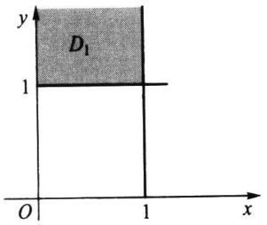  
(a) $\{ x < 1 , y > 1 \}$ 区域D1

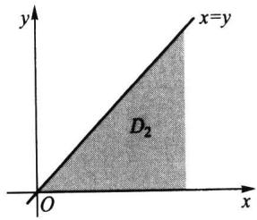  
（b）{x>y}区域D  
图3.1.3 $p ( \boldsymbol { x } , \boldsymbol { y } )$ 的非零区域与有关事件的交集部分

（2）积分区域见图3.1.3(b)中的阴影部分D,从而容易写出累次积分. $D _ { 2 }$

$$
P ( X > Y ) = P ( ( X , Y ) \ \in \ D _ { 2 } ) = \int _ { 0 } ^ { \infty } \int _ { 0 } ^ { x } 6 \mathrm { e } ^ { - 2 x } \mathrm { e } ^ { - 3 y } \mathrm { d } y \mathrm { d } x = \int _ { 0 } ^ { \infty } 2 \mathrm { e } ^ { - 2 x } ( 1 - \mathrm { e } ^ { - 3 x } ) \mathrm { d } x
$$

$$
= { \left( \begin{array} { l l } { - \textrm { e } ^ { - 2 x } + \frac { 2 } { 5 } \mathrm { e } ^ { - 5 x } } \\ { 0 } \end{array} \right) } \ { \left| \begin{array} { l } { \infty } \\ { 0 } \end{array} \right. } = 1 \ - \ { \frac { 2 } { 5 } } = { \frac { 3 } { 5 } } .
$$

## 3.1.5常用多维分布

下面介绍一些多维随机变量的常用分布.

## 一、多项分布

多项分布是重要的多维离散分布,它是二项分布的推广.

进行n次独立重复试验,如果每次试验有，个互不相容的结果 $: A _ { 1 } , A _ { 2 } , \cdots , A _ { r }$ 之一发生，且每次试验中 $A _ { i }$ 发生的概率为 $p _ { i } = P ( A _ { i } ) , i = 1 , 2 , \cdots , r$ 且 $p _ { 1 } { + } p _ { 2 } { + } \cdots { + } p _ { r } = 1$ 记 $X _ { i }$ 为n次独立重复试验中 $A _ { i }$ 出现的次数， $i = 1 , 2 , \cdots , r$ ,则 $( X _ { 1 } , X _ { 2 } , \cdots , X _ { r } )$ 取值 $\left( n _ { 1 } , n _ { 2 } , \cdots \right.$ $n _ { r } )$ 的概率，即 $A _ { 1 }$ 出现 $n _ { \mathrm { \ell } }$ 次 $, A _ { 2 }$ 出现 ${ \boldsymbol { n } } _ { 2 }$ 次 $\cdots A$ 出现 $n _ { \prime }$ 次的概率为

$$
P ( X _ { 1 } = n _ { 1 } , X _ { 2 } = n _ { 2 } , \cdots , X _ { r } = n _ { r } ) = { \frac { n ! } { n _ { 1 } ! n _ { 2 } ! \cdots n _ { r } ! } } p _ { 1 } ^ { n _ { 1 } } p _ { 2 } ^ { n _ { 2 } } \cdots p _ { r } ^ { n _ { r } } ,\tag{3.1.5}
$$

其中 $n = n _ { 1 } + n _ { 2 } + \cdots + n _ { r }$

这个联合分布列称为r项分布，又称多项分布，记为 $M ( n , p _ { 1 } , p _ { 2 } , \cdots , p _ { r } )$ .这个概率是多项式 $( p _ { 1 } + p _ { 2 } + \cdots + p _ { r } ) ^ { n }$ 展开式中的一项,故其和为1.当 $r = 2$ 时,即为二项分布.

注意：二项分布是一维随机变量的分布，而在r项分布中，因为 $p _ { 1 } { + } p _ { 2 } { + } { \cdots } { + } p _ { r } = 1$ ，且$n _ { 1 } + n _ { 2 } + \cdots + n _ { r } = n$ ，所以r项分布是r-1维随机变量的分布.

例3.1.4一批产品共有100件，其中一等品60件、二等品30件、三等品10件.从这批产品中有放回地任取3件，以X和Y分别表示取出的3件产品中一等品、二等品的件数,求二维随机变量(X,Y)的联合分布列.

解因为X和Y的可能取值都是0,1,2,3,所以记(X,Y)的联合分布列为
<table><tr><td rowspan="2">X</td><td colspan="3">Y</td></tr><tr><td>0 1</td><td>2</td><td>3</td></tr><tr><td>0</td><td> $p _ { 0 0 }$   $p _ { 0 1 }$ </td><td> ${ p } _ { 0 2 }$ </td><td> ${ p } _ { 0 3 }$ </td></tr><tr><td>1</td><td> $p _ { 1 0 }$   $p _ { 1 1 }$ </td><td> ${ \boldsymbol { p } } _ { 1 2 }$ </td><td> $p _ { 1 3 }$ </td></tr><tr><td>2</td><td> $p _ { 2 0 }$   $p _ { 2 1 }$ </td><td> ${ { p } _ { 2 2 } }$ </td><td> $p _ { 2 3 }$ </td></tr><tr><td>3</td><td> $p _ { 3 0 }$   ${ \boldsymbol { p } } _ { 3 1 }$ </td><td> ${ \boldsymbol { p } } _ { 3 2 }$ </td><td> ${ { p } _ { 3 3 } }$ </td></tr></table>

当 $i + j > 3$ 时，有 $p _ { i j } = 0$ ,即

$$
p _ { \scriptscriptstyle { 1 3 } } = p _ { \scriptscriptstyle { 2 2 } } = p _ { \scriptscriptstyle { 2 3 } } = p _ { \scriptscriptstyle { 3 1 } } = p _ { \scriptscriptstyle { 3 2 } } = p _ { \scriptscriptstyle { 3 3 } } = 0 .
$$

而当 $i + j \leqslant 3$ 时，事件 $\{ X = i , Y = j \}$ 表示：取出的3件产品中有i件一等品、j件二等品、3-i-j件三等品，所以有放回地抽取时，对 $i + j \leqslant 3$ ,有

$$
p _ { i j } = \frac { 3 ! } { i ! j ! ( 3 \textrm { -- } i \textrm { -- } j ) ! } \bigg ( \frac { 6 } { 1 0 } \bigg ) ^ { i } \bigg ( \frac { 3 } { 1 0 } \bigg ) ^ { j } \bigg ( \frac { 1 } { 1 0 } \bigg ) ^ { 3 - i - j } .
$$

由以上公式，就可具体算出(X,Y)的联合分布列为

<table><tr><td rowspan="2">X</td><td colspan="3">Y</td></tr><tr><td>1 0</td><td>2</td><td>3</td></tr><tr><td>0</td><td>0.001 0.009</td><td>0.027</td><td>0.027</td></tr><tr><td>1</td><td>0.018 0.108</td><td>0.162</td><td>0</td></tr><tr><td>2</td><td>0.108 0.324</td><td>0</td><td>0</td></tr><tr><td>3</td><td>0.216 0</td><td>0</td><td>0</td></tr></table>

有此联合分布列，就可计算有关事件的概率，譬如

$$
P ( X \leqslant 1 , Y \leqslant 1 ) = 0 . 0 0 1 + 0 . 0 0 9 + 0 . 0 1 8 + 0 . 1 0 8 = 0 . 1 3 6 ,
$$

$$
P ( X = 0 ) = \sum _ { j = 0 } ^ { 3 } P ( X = 0 , Y = j ) = 0 . 0 0 1 + 0 . 0 0 9 + 0 . 0 2 7 + 0 . 0 2 7 = 0 . 0 6 4 .
$$

此例是第二章&2.4中的二项分布的推广，差别在于：2.4中讨论的是从“合格品”“不合格品"两种情况中抽取，而在此是从一等品、二等品和三等品三种情况中抽取.这里我们称它为三项分布，它是一个二维随机变量的分布.

## 二、多维超几何分布

以下给出多维超几何分布的描述：袋中有N个球，其中有N：个i号球， $N _ { i }$ $i = 1 , 2 , \cdots$ r，且 $N = N _ { 1 } + N _ { 2 } + \cdots + N _ { r }$ .从中任意取出 $n \left( \leqslant N \right)$ 个，若记X为取出的n个球中i号球的 $X _ { i }$ 个数， $i = 1 , 2 , \cdots , r$ ，则

$$
P ( X _ { 1 } = n _ { 1 } , X _ { 2 } = n _ { 2 } , \cdots , X _ { r } = n _ { r } ) = { \frac { { \binom { N _ { 1 } } { n _ { 1 } } } \binom { N _ { 2 } } { n _ { 2 } } \cdots { \binom { N _ { r } } { n _ { r } } } } { \binom { N } { n } } } ,\tag{3.1.6}
$$

其中 $n _ { 1 } + n _ { 2 } + \cdots + n _ { r } = n , n _ { i } \leqslant N _ { i } , i = 1 , 2 , \cdots , r .$

例3.1.5将例3.1.4改成不放回抽样，即从这批产品中不放回地任取3件，记X和Y分别表示3件产品中一等品和二等品的件数，求二维随机变量(X,Y)的联合分布列.

解记i与j分别为X与Y的取值，此时对 $i + j > 3$ ,有 $p _ { i j } = 0$ ,即

$$
p _ { \scriptscriptstyle { 1 3 } } = p _ { \scriptscriptstyle { 2 2 } } = p _ { \scriptscriptstyle { 2 3 } } = p _ { \scriptscriptstyle { 3 1 } } = p _ { \scriptscriptstyle { 3 2 } } = p _ { \scriptscriptstyle { 3 3 } } = 0 .
$$

对 $i + j \leqslant 3$ ,有

$$
p _ { i j } = \frac { \binom { 6 0 } { i } \binom { 3 0 } { j } \binom { 1 0 } { 3 - i - j } } { \binom { 1 0 0 } { 3 } } .
$$

由此可得(X,Y)的联合分布列，譬如

$$
P ( X = 1 , Y = 2 ) = { \frac { { \binom { 6 0 } { 1 } } \left( \begin{array} { l } { 3 0 } \\ { 2 } \end{array} \right) } { \left( \begin{array} { l } { 1 0 0 } \\ { 3 } \end{array} \right) } } = { \frac { 6 0 \times 3 0 \times 2 9 / 2 } { 1 0 0 \times 9 9 \times 9 8 / 6 } } = { \frac { 8 7 } { 5 3 9 } } = 0 . 1 6 1 ~ 4 .
$$

其他各概率都类似求出，最后得如下联合分布列：

<table><tr><td rowspan="2">X</td><td colspan="3">Y</td></tr><tr><td>0 1</td><td>2</td><td>3</td></tr><tr><td>0</td><td>0.000 7</td><td>0.0083</td><td>0.0269 0.0251</td></tr><tr><td>1</td><td>0.0167</td><td>0.111 3 0.161 4</td><td>0</td></tr><tr><td>2</td><td>0.109 5</td><td>0.328 4 0</td><td>0</td></tr><tr><td>3</td><td>0.211 6</td><td>0</td><td>0 0</td></tr></table>

有此联合分布列，就可计算有关事件的概率，譬如，

$$
P ( X \leqslant 1 , Y \leqslant 1 ) = 0 . 0 0 0 \ 7 \ + \ 0 . 0 1 6 \ 7 \ + \ 0 . 0 0 8 \ 3 \ + \ 0 . 1 1 1 \ 3 = 0 . 1 3 7 \ 0 .
$$

$$
P ( X = 0 ) = \ \sum _ { j = 0 } ^ { 3 } P ( X = 0 , Y = j ) = 0 . 0 6 1 \ 0 .
$$

此例是超几何分布的推广，差别在于：2.4.3中讨论的是从“合格品”“不合格品”两种情况中作不放回地抽取，而在此是从一等品、二等品和三等品三种情况中作不放回地抽取.这里我们称它为三维超几何分布，它是一种特定的多维超几何分布.

## 三、多维均匀分布

设D为R"中的一个有界区域，其度量(平面的为面积,空间的为体积等)为SD,如 $\pmb { { \mathbb { R } } } ^ { n }$ $S _ { p }$ 果多维随机变量 $( X _ { 1 } , X _ { 2 } , \cdots , X _ { n } )$ 的联合密度函数为

$$
p \left( x _ { \mathfrak { i } } , x _ { 2 } , \cdots , x _ { \mathfrak { n } } \right) = \left\{ \begin{array} { l l } { \displaystyle \frac { 1 } { S _ { D } } , } & { \left( x _ { \mathfrak { i } } , x _ { 2 } , \cdots , x _ { \mathfrak { n } } \right) \in D , } \\ { \quad 0 , } & { \mathrm { ~ \# \# } , } \end{array} \right.\tag{3.1.7}
$$

则称 $( X _ { 1 } , X _ { 2 } , \cdots , X _ { n } )$ 服从D上的多维均匀分布，记为 ${ ( X _ { 1 } , X _ { 2 } , \cdots , X _ { n } ) \sim U ( D ) }$

二维均匀分布所描述的随机现象就是向平面区域D中随机投点，如果该点坐标(X,Y)落在D的子区域G中的概率只与G的面积有关，而与G的位置无关，则由第一章知这是几何概率.现在由二维均匀分布来描述，则

$$
P ( ( X , Y ) \ \in \ G ) = \iint _ { \epsilon } p \big ( x , y \big ) \mathrm { d } x \mathrm { d } y = \iint _ { \epsilon } \frac { 1 } { S _ { D } } \mathrm { d } x \mathrm { d } y = \frac { G \ \sharp \sharp \overleftrightarrow { \mathfrak { A } } \sharp \sharp \sharp } { D \ \sharp \sharp \sharp \sharp } \mathrm { . ~ }
$$

这正是几何概率的计算公式.

例3.1.6设D为平面上以原点为圆心、以r为半径的圆内区域,如今向该圆内随机投点，其坐标(X,Y)服从D上的二维均匀分布，其密度函数为

$$
p \left( x , y \right) = \left\{ \frac { 1 } { \pi r ^ { 2 } } , \quad x ^ { 2 } + y ^ { 2 } \leqslant r ^ { 2 } , \right.
$$

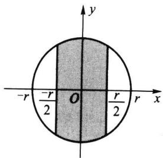

试求概率 $P ( \mid X \mid \leqslant r / 2 )$

解 $p ( x , y )$ 的非零区域与 $\{ \mid X \mid \leqslant r / 2 \}$ 的交集部分见图3.1.4,因此所求概率为

图3.1.4 $p ( \boldsymbol { x } , \boldsymbol { y } )$ 的非零区域与有关事件的交集部分

$$
\begin{array} { r l }  P \bigg ( \{ \begin{array} { l } { X \} \ 1 \leqslant \frac { r } { 2 } \bigg ) = \displaystyle \int _ { - \pi / 2 } ^ { r / 2 } \displaystyle \int _ { - \sqrt { - \pi / 2 } } ^ { r / 2 - 2 } \frac { 1 } { \pi r ^ { 2 } } \mathrm { d } y \mathrm { d } x = \frac { 1 } { \pi r ^ { 2 } } \displaystyle \int _ { - \pi / 2 } ^ { r / 2 } 2 \sqrt { r ^ { 2 } - x ^ { 2 } } \mathrm { d } x } \\ { = \displaystyle \frac { 1 } { \pi r ^ { 2 } } \left[ x \sqrt { r ^ { 2 } - x ^ { 2 } } + r ^ { 2 } \arcsin \frac { x } { r } \right] \bigg | _ { - \pi / 2 } ^ { | r | 2 } } \\ { = \displaystyle \frac { 1 } { \pi r ^ { 2 } } \bigg ( r \sqrt { r ^ { 2 } - \frac { r ^ { 2 } } { 4 } } + 2 r ^ { 2 } \arcsin \frac { 1 } { 2 } \bigg ) } \\ { = \displaystyle \frac { 1 } { \pi } \bigg ( \displaystyle \frac { \sqrt { 3 } } { 2 } + \frac { \pi } { 3 } \bigg ) = 0 . 6 0 9 . } \end{array} \end{array}
$$

## 四、二元正态分布

如果二维随机变量(X，Y)的联合密度函数（见图3.1.5）为

$$
p ( x , y ) = \frac { 1 } { 2 \pi \sigma _ { 1 } \sigma _ { 2 } \sqrt { 1 - \rho ^ { 2 } } } \exp \Biggl \{ - \frac { 1 } { 2 ( 1 - \rho ^ { 2 } ) } \Biggl [ \frac { ( x - \mu _ { 1 } ) ^ { 2 } } { \sigma _ { 1 } ^ { 2 } } - \Biggl . \Biggr .  \\   2 \rho \frac { ( x - \mu _ { 1 } ) ( y - \mu _ { 2 } ) } { \sigma _ { 1 } \sigma _ { 2 } } + \frac { ( y - \mu _ { 2 } ) ^ { 2 } } { \sigma _ { 2 } ^ { 2 } } \Biggr ] \Biggr \} , - \infty < x , y < \infty \ ,\tag{3.1.8}
$$

则称（X，Y）服从二元正态分布，记为 $( X , Y ) \sim N ( \mu _ { 1 } , \mu _ { 2 } , \sigma _ { 1 } ^ { 2 } , \sigma _ { 2 } ^ { 2 } , \rho )$ .其中五个参数的取值范围分别是

$$
- \infty < \mu _ { 1 } , \mu _ { 2 } < \infty , \sigma _ { 1 } , \sigma _ { 2 } > 0 , - 1 \leqslant \rho \leqslant 1 .
$$

以后将指出 $: \mu _ { 1 } , \mu _ { 2 }$ 分别是X与Y的均值， $\sigma _ { 1 } ^ { 2 } , \sigma _ { 2 } ^ { 2 }$ 分别是X与Y的方差 $, \pmb { \rho }$ 是X与Y的相关系数.

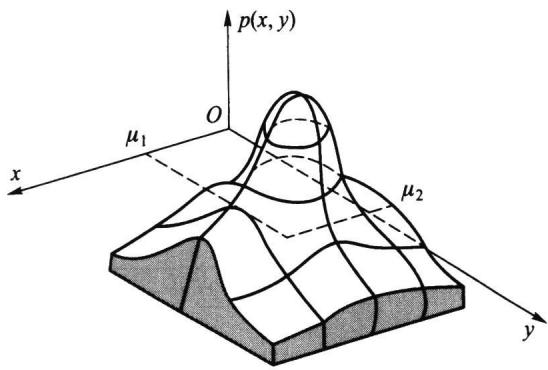  
图3.1.5二元正态密度函数

二元正态密度函数的图形很像一顶四周无限延伸的草帽，其中心点在 $\left( \boldsymbol { \mu } _ { 1 } , \boldsymbol { \mu } _ { 2 } \right)$ 处，其等高线是椭圆.平行 $x O p$ p平面(或平行yOp平面)的截面显示正态曲线(见图3.1.5）.

例3.1.7设二维随机变量 $( X , Y ) \sim N ( \mu _ { 1 } , \mu _ { 2 } , \sigma _ { 1 } ^ { 2 } , \sigma _ { 2 } ^ { 2 } , \rho )$ ,求(X,Y）落在区域

$$
D = \left\{ \left( x , y \right) : \frac { \left( x - \mu _ { 1 } \right) ^ { 2 } } { \sigma _ { 1 } ^ { 2 } } - 2 \rho \frac { \left( x - \mu _ { 1 } \right) \left( y - \mu _ { 2 } \right) } { \sigma _ { 1 } \sigma _ { 2 } } + \frac { \left( y - \mu _ { 2 } \right) ^ { 2 } } { \sigma _ { 2 } ^ { 2 } } \leqslant \lambda ^ { 2 } \right\}
$$

内的概率.

解所求概率为

$$
\begin{array} { l } { { \displaystyle p = \frac { 1 } { 2 \pi \sigma _ { 1 } \sigma _ { 2 } \sqrt { 1 - \rho ^ { 2 } } ~ \frac { \partial } { \partial } p } \Biggl \{ - \frac { 1 } { 2 \left( 1 - \rho ^ { 2 } \right) } \Biggl [ \left( \frac { x - \mu _ { 1 } } { \sigma _ { 1 } } \right) ^ { 2 } - \frac { 1 } { 2 \sigma _ { 2 } } \Biggl ] + } } \\ { { \displaystyle 2 \rho \frac { \left( x - \mu _ { 1 } \right) \left( y - \mu _ { 2 } \right) } { \sigma _ { 1 } \sigma _ { 2 } } + \Biggl ( \frac { y - \mu _ { 2 } } { \sigma _ { 2 } } \Biggl ) ^ { 2 } \Biggr \} ~ \mathrm { d } x \mathrm { d } y . } } \end{array}
$$

作变换

$$
\left\{ \begin{array} { l l } { \displaystyle u = \frac { x - \mu _ { 1 } } { \sigma _ { 1 } } - \rho \frac { y - \mu _ { 2 } } { \sigma _ { 2 } } , } \\ { \displaystyle v = \frac { y - \mu _ { 2 } } { \sigma _ { 2 } } \sqrt { 1 - \rho ^ { 2 } } . } \end{array} \right.
$$

则可得

$$
J ^ { - 1 } = { \frac { \partial { \big ( } u , v { \big ) } } { \partial { \big ( } x , y { \big ) } } } = { \left| \begin{array} { l l } { \displaystyle { \frac { 1 } { \sigma _ { 1 } } } } & { \displaystyle { - \frac { \rho } { \sigma _ { 2 } } } } \\ { \displaystyle { 0 } } & { \displaystyle { \frac { \sqrt { 1 - \rho ^ { 2 } } } { \sigma _ { 2 } } } } \end{array} \right| } = { \frac { \sqrt { 1 - \rho ^ { 2 } } } { \sigma _ { 1 } \sigma _ { 2 } } } ,
$$

由此得

$$
p = \frac { 1 } { 2 \pi \left( 1 - \rho ^ { 2 } \right) } \int \displaylimits _ { u ^ { 2 } + v ^ { 2 } \leqslant \lambda ^ { 2 } } \exp \Bigg \{ - \frac { u ^ { 2 } + v ^ { 2 } } { 2 ( 1 - \rho ^ { 2 } ) } \Bigg \} \mathrm { d } u \mathrm { d } v .
$$

再作极坐标变换

$$
\left\{ \begin{array} { l } { u = r { \sin \alpha } , } \\ { \phantom { } } \\ { v = r { \cos \alpha } , } \end{array} \right.
$$

则可得

$$
J ^ { - 1 } = { \frac { \partial { \big ( } u , v { \big ) } } { \partial { \big ( } r , \alpha { \big ) } } } = \left| { \begin{array} { c c } { \sin \alpha } & { r \cos \alpha } \\ { \cos \alpha } & { - r \sin \alpha } \end{array} } \right| = - \ r { \big ( } \sin ^ { 2 } \alpha + \cos ^ { 2 } \alpha { \big ) } = - \ r ,
$$

最后得

$$
{ \begin{array} { l } { { \boldsymbol { p } } = { \cfrac { 1 } { 2 \pi ( 1 - \rho ^ { 2 } ) } } \displaystyle \int _ { 0 } ^ { 2 \pi } \mathrm { d } \alpha \int _ { 0 } ^ { \lambda } r \exp \Biggl \{ - { \cfrac { r ^ { 2 } } { 2 ( 1 - \rho ^ { 2 } ) } } \Biggr \} \mathrm { d } r } \\ { \displaystyle = \int _ { 0 } ^ { \lambda } \exp \Biggl \{ - { \cfrac { r ^ { 2 } } { 2 ( 1 - \rho ^ { 2 } ) } } \Biggr \} \mathrm { d } \biggl ( { \cfrac { r ^ { 2 } } { 2 ( 1 - \rho ^ { 2 } ) } } \biggr ) } \\ { = - \left. \exp \Biggl \{ - { \cfrac { r ^ { 2 } } { 2 ( 1 - \rho ^ { 2 } ) } } \right\} \Biggr \mid _ { 0 } ^ { \lambda } = 1 - \exp \Biggl \{ - { \cfrac { \lambda ^ { 2 } } { 2 ( 1 - \rho ^ { 2 } ) } } \Biggr \} . } \end{array} }
$$

## 习题3.1

1.100件产品中有50件一等品、30件二等品、20件三等品.从中任取5件，以X，Y分别表示取出的5件中一等品、二等品的件数，在以下情况下求(X，Y)的联合分布列：

(1）不放回抽取；（2）有放回抽取.

2.盒子里装有3个黑球、2个红球、2个白球，从中任取4个，以X表示取到黑球的个数，以Y表示取到红球的个数，试求 $P \left( X = Y \right)$

3.口袋中有5个白球、8个黑球，从中不放回地一个接一个取出3个.如果第i次取出的是白球，则令 $X _ { _ i } = 1$ ，否则令 $X _ { i } = 0 , i = 1 , 2 , 3 .$ 求：

（1） $\{ X _ { 1 } , X _ { 2 } , X _ { 3 } \}$ 的联合分布列；

(2) $\phantom { } ( X _ { 1 } , X _ { 2 } )$ 的联合分布列.

4.设随机变量 $X _ { i } , \ i = 1 , 2$ ，的分布列如下，且满足 $P ( \boldsymbol { X } _ { 1 } , \boldsymbol { X } _ { 2 } = \boldsymbol { 0 } ) = 1$ ，试求 $P ( X _ { 1 } = X _ { 2 } )$

<table><tr><td>X</td><td>-1</td><td>0</td><td>1</td></tr><tr><td>P</td><td>0.25</td><td>0.5</td><td>0.25</td></tr></table>

5.设随机变量（X，Y）的联合密度函数为

$$
\begin{array} { r } { p ( x , y ) = \left\{ \begin{array} { l l } { k ( 6 - x - y ) , } & { 0 < x < 2 , \quad 2 < y < 4 , } \\ { 0 , } & { \nleftarrow \nmid \nleftarrow } \end{array} \right. } \end{array}
$$

试求：

（1）常数k；

(2) $P \left( X < 1 , Y < 3 \right)$

(3) $P ( \ X { < } 1 . 5 )$

（4） $P \left( X + Y \leqslant 4 \right)$

6.设随机变量(X，Y)的联合密度函数为

$$
p \left( x , y \right) \ = \ \left\{ { { k \mathrm { e } } ^ { - \left( 3 x + 4 y \right) } } , \quad x \ > \ 0 , \quad y \ > \ 0 , \right.
$$

试求：

（1）常数k；

（2）（X，Y）的联合分布函数 $F ( \boldsymbol { x } , \boldsymbol { y } )$

(3) $P ( 0 < X \leqslant 1 , 0 < Y \leqslant 2 )$

7.设二维随机变量（X，Y）的联合密度函数为

$$
p ( x , y ) = \left\{ { \begin{array} { l l } { 4 x y , } & { 0 < x < 1 , \quad 0 < y < 1 , } \\ { 0 , } & { \nmid \nmid } \end{array} } \right.
$$

试求：

(1) $P ( 0 < X < 0 . 5 , 0 . 2 5 < Y < 1 )$

(2) $P \left( X = Y \right)$

(3) $P \left( { \cal X } { < } Y \right)$

（4）（X，Y）的联合分布函数.

8.设二维随机变量(X，Y)在边长为2，中心为(0,0)的正方形区域内服从均匀分布，试求 $P ( X ^ { 2 } +$ $Y ^ { 2 } \leqslant 1 )$

9.设二维随机变量（X，Y）的联合密度函数为

$$
p ( x , y ) \ = \ \left\{ { \begin{array} { l l } { k , \quad 0 < x ^ { 2 } < y < x < 1 , } \\ { 0 , \quad \# \# . } \end{array} } \right.
$$

（1）试求常数k；

（2）求 $P ( X { > } 0 . 5 )$ 和 $P ( \ Y { < } 0 . 5 )$

10.设二维随机变量(X，Y)的联合密度函数为

$$
p ( x , y ) \ = \ \left\{ { \begin{array} { l l } { 6 ( 1 - y ) \ , } & { 0 \ < \ x \ < \ y < \ 1 , } \\ { 0 , } & { \sharp \# . } \end{array} } \right.
$$

（1）求 $P ( X { > } 0 . 5 , Y { > } 0 . 5 )$

（2）求 $P \left( \ X { < } 0 . 5 \right)$ 和 $P \left( \ Y { < } 0 . 5 \right)$

（3）求 $P \left( \ X + Y < 1 \right)$

11.设随机变量Y服从参数为λ=1的指数分布，定义随机变量 $X _ { k }$ 如下：

$$
X _ { k } \ = \ \left\{ \begin{array} { l l } { 0 , } & { Y \leqslant k , } \\ { 1 , } & { Y > k , } \end{array} \right. \ k \ = \ 1 , 2 .
$$

求 $X _ { \scriptscriptstyle 1 }$ 和 $X _ { _ 2 }$ 的联合分布列.

12.设二维随机变量(X,Y)的联合密度函数为

$$
\begin{array} { r l } { p ( x , y ) } & { = \left\{ \begin{array} { l l } { \displaystyle x ^ { 2 } + \frac { x y } { 3 } , } & { 0 < x < 1 , \quad 0 < y < 2 , } \\ { 0 , } & { \nparallel \nparallel . } \end{array} \right. } \end{array}
$$

求 $P ( X + Y \geqslant 1 )$

13.设二维随机变量(X，Y)的联合密度函数为

$$
\begin{array} { r l } { p ( x , y ) } & { = \left\{ \begin{array} { l l } { \mathbf { e } ^ { - y } , } & { 0 < x < y , } \\ { 0 , } & { \sharp \sharp . } \end{array} \right. } \end{array}
$$

试求 $P \left( X + Y \leqslant 1 \right)$

14.设二维随机变量(X，Y)的联合密度函数为

$$
p ( x , y ) = \left\{ { \begin{array} { l l } { 1 / 2 , } & { 0 < x < 1 , \quad 0 < y < 2 , } \\ { 0 , } & { \# \# . } \end{array} } \right.
$$

求X与Y中至少有一个小于0.5的概率.

15.从(0，1）中随机地取两个数，求其积不小于3/16，且其和不大于1的概率.

## 3.2边际分布与随机变量的独立性

二维联合分布函数(二维联合分布列、二维联合密度函数也一样)含有丰富的信息，主要有以下三方面信息：

·每个分量的分布（每个分量的所有信息），即边际分布.

·两个分量之间的关联程度，在83.4中用协方差和相关系数来描述.

·给定一个分量时,另一个分量的分布,即条件分布.

我们的目的是将这些信息从联合分布中挖掘出来，本节先讨论边际分布.

## 3.2.1边际分布函数

如果在二维随机变量(X,Y)的联合分布函数 $\boldsymbol { F } ( \boldsymbol { x } , \boldsymbol { y } )$ 中令 $\textstyle \mathbf { \boldsymbol { y } } \longrightarrow \infty$ ，由于 $\left\{ Y < \infty \right\}$ 为必然事件，故可得

$$
\operatorname* { l i m } _ { \gamma \to \infty } F ( x , y ) = P ( X \leqslant x , Y < \infty ) = P ( X \leqslant x ) ,
$$

这是由(X,Y)的联合分布函数 $F ( x , y )$ 求得的X的分布函数，被称为X的边际分布，记为

$$
F _ { \chi } ( x ) = F ( x , \infty ) .\tag{3.2.1}
$$

类似地，在 $F ( x , y )$ 中令x→∞，可得Y的边际分布

$$
F _ { \gamma } ( y ) = F ( \infty , y ) .\tag{3.2.2}
$$

在三维随机变量 $( X , Y , Z )$ 的联合分布函数 $F ( x , y , z )$ 中，用类似的方法可得到更多的边际分布函数：

$$
\begin{array} { r l } & { F _ { x } ( x ) = F ( x , \infty , \infty ) , } \\ & { F _ { \gamma } ( y ) = F ( \infty , y , \infty ) , } \\ & { F _ { z } ( z ) = F ( \infty , \infty , z ) , } \\ & { F _ { x , \gamma } ( x , y ) = F ( x , y , \infty ) , } \\ & { F _ { x , z } ( x , z ) = F ( x , \infty , z ) , } \\ & { F _ { \gamma , z } ( y , z ) = F ( \infty , y , z ) . } \end{array}
$$

在更高维的场合，也可类似地从联合分布函数获得其低维的边际分布函数.譬如，五维联合分布有5个一维边际分布、10个二维边际分布，10个三维边际分布和5个四维边际分布.

例3.2.1设二维随机变量 $( X , Y )$ 的联合分布函数为

$$
F ( x , y ) = \left\{ \begin{array} { l l } { 1 - \mathrm { e } ^ { - x } - \mathrm { e } ^ { - y } + \mathrm { e } ^ { - x - y - \lambda x y } , } & { x > 0 , y > 0 . } \\ { 0 , } & { \sharp \sharp \dag \dag . } \end{array} \right.
$$

这个分布被称为二维指数分布，其中参数 $\lambda { > } 0$

由此联合分布函数 $F ( x , y )$ ，容易获得X与Y的边际分布函数为

$$
\begin{array} { r l r } & { F _ { x } ( x ) = F ( x , \infty ) = \left\{ \begin{array} { l l } { 1 - { \mathrm { e } } ^ { - x } , } & { x > 0 , } \\ { 0 , } & { x \leqslant 0 . } \end{array} \right. } \\ & { F _ { \gamma } ( y ) = F ( \infty , y ) = \left\{ \begin{array} { l l } { 1 - { \mathrm { e } } ^ { - y } , } & { y > 0 , } \\ { 0 , } & { y \leqslant 0 . } \end{array} \right. } \end{array}
$$

它们都是一维指数分布.不同的 $\lambda > 0$ 对应不同的二维指数分布，但它们的两个边际分布与参数入>0无关.这说明：二维联合分布不仅含有每个分量的概率分布，而且还含有两个变量X与Y间关系的信息，这正是人们要研究多维随机变量的原因.

## 3.2.2边际分布列

在二维离散随机变量(X,Y)的联合分布列 $\{ P ( \mathrm { \Phi } X = x _ { i } , Y = y _ { j } )$ 中，对j求和所得的分布列

$$
\sum _ { j = 1 } ^ { \infty } P ( X = x _ { i } , Y = y _ { j } ) = P ( X = x _ { i } ) , \quad i = 1 , 2 , \cdots\tag{3.2.3}
$$

被称为X的边际分布列.类似地，对i求和所得的分布列

$$
\sum _ { i = 1 } ^ { \infty } P ( X = x _ { i } , Y = y _ { j } ) = P ( Y = y _ { j } ) , \quad j = 1 , 2 , \cdots\tag{3.2.4}
$$

被称为Y的边际分布列.

例3.2.2设二维随机变量(X，Y)有如下的联合分布列
<table><tr><td rowspan="2"> $\pmb { \chi }$ </td><td colspan="2">Y</td></tr><tr><td>2 1</td><td>3</td></tr><tr><td>0</td><td>0.09 0.21</td><td>0.24</td></tr><tr><td>1</td><td>0.07 0.12</td><td>0.27</td></tr></table>

求X与Y的边际分布列.

解在上述联合分布列中，对每一行求和得0.54与0.46，并把它们写在对应行的右侧，这就是X的边际分布列.再对每一列求和，得0.16,0.33和0.51，并把它们写在对应列的下侧，这就是Y的边际分布列.

<table><tr><td rowspan="2">X</td><td colspan="2">Y</td><td rowspan="2"> $P ( X = i )$ </td></tr><tr><td>1 2</td><td>3</td></tr><tr><td>0</td><td>0.09 0.21</td><td>0.24</td><td>0.54</td></tr><tr><td>1</td><td>0.07 0.12</td><td>0.27</td><td>0.46</td></tr><tr><td> $P ( \ Y = j )$ </td><td>0.16 0.33</td><td>0.51</td><td>1</td></tr></table>

## 3.2.3边际密度函数

如果二维连续随机变量(X,Y)的联合密度函数为 $p ( \boldsymbol { x } , \boldsymbol { y } )$ ，因为

$$
F _ { \chi } ( \ \boldsymbol { x } ) = F ( \boldsymbol { x } , \infty \ ) = \int _ { - \infty } ^ { \infty } \left( \int _ { - \infty } ^ { \infty } p ( \boldsymbol { u } , \boldsymbol { v } ) \mathrm { d } v \right) \mathrm { d } u = \int _ { - \infty } ^ { \infty } p _ { \chi } ( \boldsymbol { u } ) \mathrm { d } u ,
$$

$$
F _ { \gamma } ( \gamma ) = F ( \infty \mathrm { ~ , } \gamma ) = \int _ { - \infty } ^ { \gamma } \left( \int _ { - \infty } ^ { \infty } p ( u , v ) \mathrm { d } u \right) \mathrm { d } v = \int _ { - \infty } ^ { \gamma } p _ { \gamma } ( v ) \mathrm { d } v ,
$$

其中 $p _ { \chi } ( \boldsymbol { x } )$ 和 $p _ { Y } ( y )$ 分别为

$$
p _ { \chi } ( x ) = \int _ { - \infty } ^ { \infty } p ( x , y ) \mathrm { d } y ,\tag{3.2.5}
$$

$$
p _ { r } ( y ) = \int _ { - \infty } ^ { \infty } p ( x , y ) \mathrm { d } x .\tag{3.2.6}
$$

它们恰好处于密度函数位置，故称上式给出的 $p _ { \chi } ( \boldsymbol { x } )$ 为X的边际密度函数 ${ \bf \nabla } _ { p _ { Y } } ( y )$ 为Y的边际密度函数.

由联合密度函数求边际密度函数时，要注意积分区域的确定.

例3.2.3 设二维随机变量(X,Y)的联合密度函数为

$$
p ( x , y ) = \left\{ { \begin{array} { l l } { 1 , } & { 0 < x < 1 , \mid y \mid < x , } \\ { 0 , } & { \nmid \nmid \nmid . } \end{array} } \right.
$$

试求：（1）边际密度函数 $p _ { \chi } ( \boldsymbol { x } )$ 和 $p _ { Y } ( y ) \ : ; ( 2 ) \ : { \cal P } ( X < 1 / 2 )$ 及 $P ( \ Y { > } 1 / 2 )$

解首先识别 $p ( x , y )$ 的非零区域，它如图3.2.1所示.

（1）求 $p _ { \chi } ( \boldsymbol { x } )$

当 $x \leqslant 0$ ，或 $x \geqslant 1$ 时,有 $p _ { \chi } ( \pmb { x } ) = 0$ 而当 $0 < x < 1$ 时,有

$$
p _ { x } ( x ) = \int _ { - \infty } ^ { \infty } p ( x , y ) { \mathrm { d } } y = \int _ { - x } ^ { x } { \mathrm { d } } y = 2 x .
$$

所以X的边际密度函数为(见图3.2.2）

$$
p _ { \chi } ( \boldsymbol { x } ) = \left\{ \begin{array} { l l } { 2 x , } & { 0 < x < 1 , } \\ { 0 , } & { \sharp \mathcal { M } . } \end{array} \right.
$$

再求 $p _ { Y } ( y )$

当 $\boldsymbol { y } \leqslant - 1$ ,或 $y \geqslant 1$ 时，有 $p _ { Y } ( y ) = 0$ 而当 $- 1 < y < 0$ 时,有

$$
p _ { r } ( y ) = \int _ { - \infty } ^ { \infty } p \ d x ( x , y ) \mathrm { d } x = \int _ { - y } ^ { 1 } \mathrm { d } x = 1 + y ,
$$

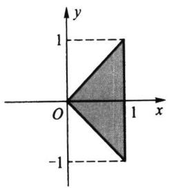  
图3.2.1p(x,y）的非零区域

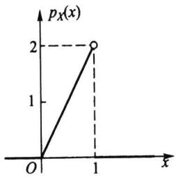  
图3.2.2 X的边际密度函数（Be（2，1））

当 $\scriptstyle 0 < y < 1$ 时,有

$$
p _ { r } ( y ) = \int _ { - \infty } ^ { \infty } p ( x , y ) \mathrm { d } x = \int _ { y } ^ { 1 } \mathrm { d } x = 1 - y .
$$

所以Y的边际密度函数为（见图3.2.3）

$$
p _ { \gamma } ( \gamma ) = \left\{ \begin{array} { l l } { 1 + y , } & { - 1 < y < 0 , } \\ { 1 - y , } & { 0 < y < 1 , } \\ { 0 , } & { \sharp \dag \dag . } \end{array} \right.
$$

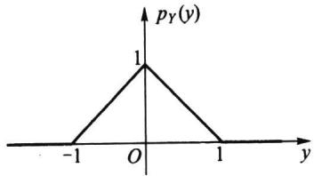  
图3.2.3Y的边际密度函数（三角形分布）

（2）要求的概率分别为

$$
P { \Big ( } X < { \frac { 1 } { 2 } } { \Big ) } = \int _ { - \infty } ^ { 1 / 2 } p _ { X } { \big ( } x { \big ) } \mathrm { d } x = \int _ { 0 } ^ { 1 / 2 } 2 x \mathrm { d } x = { \frac { 1 } { 4 } } .
$$

$$
P { \Big ( } Y > { \frac { 1 } { 2 } } { \Big ) } = \int _ { 1 / 2 } ^ { \infty } p _ { Y } { \big ( } y { \big ) } \mathrm { d } y = \int _ { 1 / 2 } ^ { 1 } { \big ( } 1 - y { \big ) } \mathrm { d } y = { \frac { 1 } { 8 } } .
$$

例3.2.4三项分布的一维边际分布为二项分布

三项分布 $M ( n , p _ { 1 } , p _ { 2 } , p _ { 3 } )$ 实质上是二维随机变量(X,Y)的分布，其联合分布列为

$$
P ( X = i , Y = j ) = { \frac { n ! } { i ! j ! ( n - i - j ) ! } } p _ { 1 } ^ { i } p _ { 2 } ^ { j } ( 1 - p _ { 1 } - p _ { 2 } ) ^ { n - i - j } , \ i , j = 0 , 1 , 2 , \cdots , n , \ i + j \leqslant n .
$$

对上式分别乘和除以 $( 1 - p _ { 1 } ) ^ { n - i } / ( n - i ) !$ ，再对j从0到n-i求和，并记 $p _ { 2 } ^ { \prime } = p _ { 2 } / \left( 1 - p _ { 1 } \right)$ ，则可得

$$
\begin{array} { c } { { \displaystyle \sum _ { j = 0 } ^ { n - i } P ( X = i , Y = j ) = \displaystyle \frac { n ! } { i ! ( n - i ) ! } p _ { 1 } ^ { i } ( 1 - p _ { 1 } ) ^ { n - i } \ . } } \\ { { \mathrm { } } } \\ { { \displaystyle \sum _ { j = 0 } ^ { n - i } { \binom { n - i } { j } } \biggl ( \displaystyle \frac { p _ { 2 } } { 1 - p _ { 1 } } \biggr ) ^ { j } \biggl ( 1 - \displaystyle \frac { p _ { 2 } } { 1 - p _ { 1 } } \biggr ) ^ { n - i - j } } } \\ { { \displaystyle = \frac { n ! } { i ! ( n - i ) ! } p _ { 1 } ^ { i } ( 1 - p _ { 1 } ) ^ { n - i } \bigl [ p _ { 2 } ^ { \prime } \ + \ ( 1 - p _ { 2 } ^ { \prime } ) \ \bigr ] ^ { n - i } } } \end{array}
$$

$$
= \frac { n ! } { i ! ( n - i ) ! } p _ { 1 } ^ { i } ( 1 - p _ { 1 } ) ^ { n - i } .
$$

所以 $X \sim b \left( n , p _ { 1 } \right)$ .同理可证 $Y \sim b \left( n , p _ { 2 } \right)$

用类似的方法可以证明：r项分布 $M ( n , p _ { 1 } , p _ { 2 } , \cdots , p _ { r } )$ 的最低阶边际分布是，个二项分布 $b \left( n , p _ { i } \right) , i = 1 , 2 , \cdots , r .$

## 例3.2.5二维正态分布的边际分布为一维正态分布

设二维随机变量 $( X , Y ) \sim N ( \mu _ { 1 } , \mu _ { 2 } , \sigma _ { 1 } ^ { 2 } , \sigma _ { 2 } ^ { 2 } , \rho )$ .先把(3.1.8)式二维正态密度函数$p ( \boldsymbol { x } , \boldsymbol { y } )$ 的指数部分

$$
- \frac { 1 } { 2 ( 1 - \rho ^ { 2 } ) } \bigg [ \frac { \left( x - \mu _ { 1 } \right) ^ { 2 } } { \sigma _ { 1 } ^ { 2 } } - 2 \rho \frac { \left( x - \mu _ { 1 } \right) \left( y - \mu _ { 2 } \right) } { \sigma _ { 1 } \sigma _ { 2 } } + \frac { \left( y - \mu _ { 2 } \right) ^ { 2 } } { \sigma _ { 2 } ^ { 2 } } \bigg ]
$$

改写成

$$
- \frac { 1 } { 2 } \left( \rho \frac { x - \mu _ { 1 } } { \sigma _ { 1 } \sqrt { 1 - \rho ^ { 2 } } } - \frac { y - \mu _ { 2 } } { \sigma _ { 2 } \sqrt { 1 - \rho ^ { 2 } } } \right) ^ { 2 } - \frac { \left( x - \mu _ { 1 } \right) ^ { 2 } } { 2 \sigma _ { 1 } ^ { 2 } } .
$$

再对积分

$$
\int _ { - \infty } ^ { \infty } \exp \Biggl \{ - \frac { 1 } { 2 } \Biggl ( \rho \frac { x - \mu _ { 1 } } { \sigma _ { 1 } \sqrt { 1 - \rho ^ { 2 } } } - \frac { y - \mu _ { 2 } } { \sigma _ { 2 } \sqrt { 1 - \rho ^ { 2 } } } \Biggr ) ^ { 2 } \Biggr \} \mathrm { d } y
$$

作变换（注意把x看作常量）

$$
t = \rho \frac { x \mathrm { ~ - ~ } \pmb { \mu } _ { 1 } } { \pmb { \sigma } _ { 1 } \sqrt { 1 \mathrm { ~ - ~ } \pmb { \rho } ^ { 2 } } } \mathrm { ~ - ~ } \frac { y \mathrm { ~ - ~ } \pmb { \mu } _ { 2 } } { \pmb { \sigma } _ { 2 } \sqrt { 1 \mathrm { ~ - ~ } \pmb { \rho } ^ { 2 } } } ,
$$

则

$$
\begin{array} { l } { p _ { x } ( x ) = \displaystyle \int _ { - \infty } ^ { \infty } p ( x , y ) \mathrm { d } y } \\ { = \frac { 1 } { 2 \pi \sigma _ { 1 } \sigma _ { 2 } \sqrt { 1 - \rho ^ { 2 } } } \mathrm { e x p } \Bigg \{ - \frac { \left( x - \mu _ { 1 } \right) ^ { 2 } } { 2 \sigma _ { 1 } ^ { 2 } } \Bigg \} \sigma _ { 2 } \sqrt { 1 - \rho ^ { 2 } } \int _ { - \infty } ^ { \infty } \mathrm { e x p } \Bigg \{ - \frac { t ^ { 2 } } { 2 } \Bigg \} \mathrm { d } t . } \end{array}
$$

注意到上式中的积分恰好等于 $\sqrt { 2 \pi }$ ，所以有

$$
p _ { \chi } ( \boldsymbol { x } ) = \frac { 1 } { \sqrt { 2 \pi } \sigma _ { 1 } } \mathrm { e x p } \Bigg \{ - \frac { \left( \boldsymbol { x } - \boldsymbol { \mu } _ { 1 } \right) ^ { 2 } } { 2 \sigma _ { 1 } ^ { 2 } } \Bigg \} .
$$

这正是一维正态分布 $N ( \mu _ { 1 } , \sigma _ { 1 } ^ { 2 } )$ 的密度函数，即 $X \sim N ( \mu _ { 1 } , \sigma _ { 1 } ^ { 2 } )$ .同理可证 $Y \sim N ( \mu _ { 2 } , \sigma _ { 2 } ^ { 2 } )$ 由此可见

·二维正态分布的边际分布中不含参数p. $\rho .$

·这说明二维正态分布 $N ( \mu _ { 1 } , \mu _ { 2 } , \sigma _ { 1 } ^ { 2 } , \sigma _ { 2 } ^ { 2 } , 0 . 1 )$ 与 $N ( \mu _ { 1 } , \mu _ { 2 } , \sigma _ { 1 } ^ { 2 } , \sigma _ { 2 } ^ { 2 } , 0 . 2 )$ 的边际分布是相同的.

·具有相同边际分布的多维联合分布可以是不同的.

## 3.2.4随机变量间的独立性

在多维随机变量中，各分量的取值有时会相互影响，但有时会毫无影响.譬如一个人的身高X和体重Y就会相互影响，但与收入Z一般无影响.当两个随机变量的取值互不影响时，就称它们是相互独立的.

(b) $\{ x y < \frac { 1 } { 4 } , 0 < x , y < 1 \}$

定义3.2.1设n维随机变量 $( X _ { 1 } , X _ { 2 } , \cdots , X _ { n } )$ 的联合分布函数为 $F ( x _ { 1 } , x _ { 2 } , \cdots , x _ { n } )$ $F _ { _ i } ( { \pmb x } _ { i } )$ 为 $X _ { i }$ 的边际分布函数.如果对任意n个实数 $x _ { 1 } , x _ { 2 } , \cdots , x _ { n }$ ，有

$$
F ( x _ { 1 } , x _ { 2 } , \cdots , x _ { n } ) = \prod _ { i = 1 } ^ { n } F _ { i } ( x _ { i } ) ,\tag{3.2.7}
$$

则称 $X _ { 1 } , X _ { 2 } , \cdots , X ,$ 相互独立.

在离散随机变量场合，如果对其任意n个取值 $x _ { 1 } , x _ { 2 } , \cdots , x _ { n }$ ,有

$$
P ( X _ { 1 } = x _ { 1 } , X _ { 2 } = x _ { 2 } , \cdots , X _ { n } = x _ { n } ) = \prod _ { i = 1 } ^ { n } P ( X _ { i } = x _ { i } ) ,\tag{3.2.8}
$$

则称 $X _ { 1 } , X _ { 2 } , \cdots , X _ { n }$ 相互独立.

在连续随机变量场合，如果对任意n个实数 $x _ { 1 } , x _ { 2 } , \cdots , x _ { n }$ ,有

$$
p ( x _ { 1 } , x _ { 2 } , \cdots , x _ { n } ) = \prod _ { i = 1 } ^ { n } p _ { i } ( x _ { i } ) ,\tag{3.2.9}
$$

则称 $X _ { 1 } , X _ { 2 } , \cdots , X _ { n }$ 相互独立.

在前面的讨论中我们知道：由联合分布可以求出边际分布，但由边际分布不一定能求出联合分布.现在如果知道了随机变量间是相互独立的，则由边际分布的乘积就可求出联合分布.

例3.2.6从(0,1)中任取两个数，求下列事件的概率：

（1）两数之和小于1.2；

（2）两数之积小于1/4.

解分别记这两个数为X和Y，则X和Y都服从(0,1)上的均匀分布，由于X与Y的取值相互没有任何影响，故X与Y相互独立，故其联合密度函数为

$$
p ( x , y ) = p _ { x } ( x ) p _ { \gamma } ( y ) = \left\{ { \begin{array} { l l } { 1 , } & { 0 < x < 1 , \quad 0 < y < 1 , } \\ { 0 , } & { \nmid \nmid \nmid . } \end{array} } \right.
$$

利用此联合密度函数可以计算(1)与(2)的概率，具体如下：

（1）事件 $\{ X + Y < 1 . 2 \}$ 的非零区域如图3.2.4（a)所示，其概率为

$$
P ( X + Y < 1 . 2 ) = \ \int _ { 0 } ^ { 0 . 2 } \int _ { 0 } ^ { 1 } \mathrm { d } y \mathrm { d } x + \int _ { 0 . 2 } ^ { 1 } \int _ { 0 } ^ { 1 . 2 - x } \mathrm { d } y \mathrm { d } x = \ 0 . 2 + \int _ { 0 . 2 } ^ { 1 } \left( 1 . 2 - x \right) \mathrm { d } x = \ 0 . 2 + 0 . 4 8 = \ 0 . 6 8 .
$$

（2）事件 $\{ X Y < 1 / 4 \}$ 的非零区域如图3.2.4(b)所示，其概率为

$$
P ( X Y < 1 / 4 ) = \int _ { 0 } ^ { 1 / 4 } \int _ { 0 } ^ { 1 } \mathrm { d } y \mathrm { d } x + \int _ { 1 / 4 } ^ { 1 } \int _ { 0 } ^ { 1 / 4 \pi } \mathrm { d } y \mathrm { d } x = \frac { 1 } { 4 } + \int _ { 1 / 4 } ^ { 1 } \frac { 1 } { 4 x } \mathrm { d } x = \frac { 1 } { 4 } + \frac { 1 } { 4 } \ln 4 = 0 . 5 9 6 6 .
$$

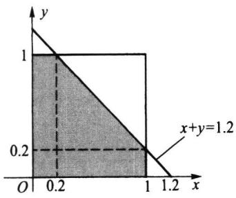  
（a） $\left\{ x + y < 1 . 2 , 0 < x , y < 1 \right\}$

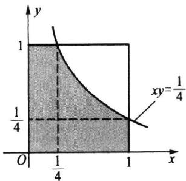  
图3.2.4 $p ( \boldsymbol { x } , \boldsymbol { y } )$ 的非零区域与有关事件的交集部分

这个例子告诉我们，由独立性立即用乘法获得联合密度函数，然后就可求涉及两个随机变量的一些事件的概率.

例3.2.7若二维随机变量 $( X , Y )$ 的联合密度函数为

$$
p ( x , y ) = \left\{ { \begin{array} { l l } { 8 x y , } & { 0 \leqslant x \leqslant y \leqslant 1 , } \\ { 0 , } & { \sharp \sharp ( { \underline { { t } } } . } \end{array} } \right.
$$

问X与Y是否相互独立？

解为判断X与Y是否独立，只需看边际密度函数的乘积是否等于联合密度函数.为此先求边际密度函数.

当 $x { < } 0$ 或 $x { > } 1$ 时 ${ \mathbf { } } p _ { x } ( x ) = 0 .$ 而当 $0 \leqslant x \leqslant 1$ 时,有

$$
p _ { x } { \left( x \right) } = \int _ { x } ^ { 1 } 8 x y \mathrm { d } y = 8 x { \left( \frac { 1 } { 2 } - \frac { x ^ { 2 } } { 2 } \right) } = 4 x { \left( 1 - x ^ { 2 } \right) } .
$$

因此

$$
p _ { x } ( x ) = \left\{ { \begin{array} { l l } { 4 x ( 1 - x ^ { 2 } ) , } & { 0 \leqslant x \leqslant 1 , } \\ { 0 , } & { \sharp \sharp . } \end{array} } \right.
$$

同样，当 $y < 0$ 或 $y { > } 1$ 时， $. p _ { Y } ( y ) = 0$ 而当 $0 \leqslant y \leqslant 1$ 时,有

$$
p _ { r } ( \mathbf { \boldsymbol { y } } ) = \int _ { 0 } ^ { \boldsymbol { y } } 8 { x y } \mathrm { d } x = 4 { \boldsymbol { y } } ^ { 3 } .
$$

因此

$$
\begin{array} { r } { p _ { Y } \left( y \right) = \left\{ \begin{array} { l l } { 4 y ^ { 3 } , } & { 0 \leqslant y \leqslant 1 , } \\ { 0 , } & { \sharp 4 \dag \dag . } \end{array} \right. } \end{array}
$$

由此可见 $: p ( x , y ) \neq p _ { x } ( x ) p _ { Y } ( y )$ ,故X与Y不独立,即相依.

直观上看，联合密度函数 $p ( x , y )$ 似乎可分离变量，但由于其非零区域相互交织,X的取值受Y的取值影响 $( 0 \leqslant x \leqslant y )$ ,Y的取值也受X的取值的影响 $\scriptstyle ( x \leqslant y \leqslant 1 )$ ，最后导致 $p ( x , y )$ 的变量不能分离，从而X与Y不可能相互独立.

例3.2.8设二维随机变量 $( X , Y )$ 的联合密度函数 $p ( x , y )$ 如下所示，判定X与Y的独立性.

$$
( 1 ) ~ p \left( ~ x , y \right) = \left\{  { \begin{array} { l l l } { { 6 x y } ^ { 2 } , } & { { 0 < x < 1 , } } & { { 0 < y < 1 , } } \\ { { 0 , } } & { { \nparallel \nparallel \nparallel } , } \end{array} } \right.
$$

$$
( 2 ) ~ p \big ( \boldsymbol { x } , \boldsymbol { y } \big ) = \left\{ \begin{array} { l l } { 1 2 \boldsymbol { y } ^ { 2 } , } & { 0 \leqslant \boldsymbol { y } \leqslant \boldsymbol { x } \leqslant 1 , } \\ { 0 , } & { \sharp \mathcal { H } \sharp ; } \end{array} \right.
$$

$$
( 3 ) p \left( x , y \right) = \left\{ \begin{array} { l l } { { 6 { \exp } \left\{ \begin{array} { l l } { { - 2 x - 3 y } } \end{array} \right\} , } } & { { x > 0 , \quad y > 0 , } } \\ { { 0 , } } & { { \sharp \sharp / \sharp ; } } \end{array} \right.
$$

$$
( 4 ) ~ p ( x , y ) = \left\{ { x ^ { 2 } + x y / 3 } , \quad 0 < x < 1 , \quad 0 < y < 2 , \right.
$$

解（1）边际分布为

$$
\begin{array} { r l } & { p _ { \mathnormal { X } }  { \left( \begin{array} { l } { x } \end{array} \right) } = 2 x ,  { \boldsymbol { x } } \in D _ { \mathnormal { X } } =  { \left( \begin{array} { l } { 0 } , 1 \end{array} \right) } , } \\ & { p _ { \mathnormal { Y } }  { \left( \begin{array} { l } { y } \end{array} \right) } = 3 y ^ { 2 } ,  { \boldsymbol { y } } \in D _ { \mathnormal { Y } } =  { \left( \begin{array} { l } { 0 } , 1 \end{array} \right) } , } \end{array}
$$

故有 $p \left( x , y \right) = p _ { x } \left( x \right) p _ { Y } \left( y \right) , \left( x , y \right) \in \left\{ \left( x , y \right) : x \in D _ { x } , y \in D _ { Y } \right\}$ ,所以X与Y相互独立.这

种状态称为变量X与Y可分离，它有两方面含义，一是指 $p ( x , y ) = p _ { x } ( x ) \cdot p _ { Y } ( y )$ ，二是指 $p ( x , y )$ 的非零区域亦可分解为两个一维区域的乘积空间.

（2）因X的取值与Y的取值相互影响，故 $p \left( x , y \right)$ 不可分离，所以X与Y不相互独立.

（3）边际分布为

$$
\begin{array} { r l } & { p _ { x } ( x ) = 2 \mathrm { e } ^ { - 2 x } , \ x \in D _ { x } = \left\{ \mathrm { } x > 0 \right\} , } \\ & { p _ { \gamma } ( y ) = 3 \mathrm { e } ^ { - 3 y } , \ \gamma \in D _ { \gamma } = \left\{ \mathrm { } y > 0 \right\} , } \end{array}
$$

且有 $p \left( x , y \right) = p _ { x } \left( x \right) p _ { Y } \left( y \right) , \left( x , y \right) \in \left\{ \left( x , y \right) : x \in D _ { x } , y \in D _ { Y } \right\}$ ，故X与Y可分离，即X与Y相互独立.

（4）边际分布为

$$
p _ { \chi } \left( x \right) = 2 x ^ { 2 } + \frac { 2 } { 3 } x , x \in D _ { \chi } = \left( 0 , 1 \right) ,
$$

$$
p _ { r } ( y ) = \frac { 1 } { 3 } + \frac { 1 } { 6 } y , \ y \in D _ { r } = ( 0 , 2 ) \ ,
$$

由于 $p ( x , y ) \neq p _ { x } ( x ) p _ { Y } ( y )$ ，即X与Y不可分离，所以X与Y不相互独立.

## 习题3.2

1.设二维离散随机变量（X，Y)的可能取值为

$$
( 0 , 0 ) , \quad ( - 1 , 1 ) , \quad ( - 1 , 2 ) , \quad ( 1 , 0 ) ,
$$

且取这些值的概率依次为1/6，1/3，1/12,5/12，试求X与Y各自的边际分布列.

2.设二维随机变量（X，Y）的联合分布函数为

$$
\begin{array} { r l } { F ( x , y ) } & { = \left\{ \begin{array} { l l } { 1 - \mathrm { e } ^ { - \lambda _ { 1 } x } - \mathrm { e } ^ { - \lambda _ { 2 } y } + \mathrm { e } ^ { - \lambda _ { 1 } x - \lambda _ { 2 } y - \lambda _ { 1 2 } \mathrm { m a x } \{ x , y \} } , } & { x > 0 , \quad \mathrm { ~ } y > 0 , } \\ { 0 , } & { \sharp \dag \dag . } \end{array} \right. } \end{array}
$$

试求X和Y各自的边际分布函数.

3.试求以下二维均匀分布的边际分布：

$$
\begin{array} { r l } { p \left( x , y \right) } & { = \displaystyle \left\{ \frac { 1 } { \pi } , \quad x ^ { 2 } + y ^ { 2 } \leqslant 1 , \right. } \\ { \quad \left. \qquad \right\} \oplus \displaystyle \mathcal { H } . } \end{array}
$$

4.设平面区域D由曲线 $y = 1 / x$ 及直线 $y = 0 , x = 1 , x = \mathrm { e } ^ { 2 }$ 所围成，二维随机变量（X，Y）在区域D上服从均匀分布，试求X的边际密度函数.

5.求以下给出的（X，Y）的联合密度函数的边际密度函数 $p _ { \chi } ( \pmb { x } )$ 和 $p _ { Y } ( y )$

(1） $\begin{array} { r l } { p ( x , y ) } & { = \left\{ \begin{array} { l l } { \mathbf { e } ^ { - y } , } & { 0 < x < y , } \\ { 0 , } & { \sharp \sharp \sharp ; } \end{array} \right. } \end{array}$

$$
( 2 ) p ( x , y ) = \left\{ \begin{array} { l l } { \displaystyle \frac { 5 } { 4 } \big ( x ^ { 2 } + y \big ) \ : , } & { 0 < y < 1 - x ^ { 2 } \ : , } \\ { \quad } \\ { 0 \ : , } & { \sharp \# \ : . } \end{array} \right.
$$

(3) $p \left( x , y \right) = \left\{ \begin{array} { l l } { \displaystyle \frac { 1 } { x } , } & { \displaystyle 0 < y < x < 1 , } \\ { \displaystyle 0 , } & { \displaystyle \sharp \# . } \end{array} \right.$

6.设二维随机变量（X，Y)的联合密度函数为

$$
p \left( x , y \right) = \left\{ \begin{array} { l l } { 6 , } & { 0 < x ^ { 2 } < y < x < 1 , } \\ { 0 , } & { \# \# . } \end{array} \right.
$$

试求边际密度函数 $p _ { \chi } ( \boldsymbol { x } )$ 和 $p _ { Y } ( y )$

7.试验证：以下给出的两个不同的联合密度函数，它们有相同的边际密度函数.

$$
\begin{array} { r l } { p ( x , y ) } & { = \left\{ \begin{array} { l l } { x + y , } & { 0 \leqslant x \leqslant 1 , \quad 0 \leqslant y \leqslant 1 , } \\ { 0 , } & { \sharp \sharp \sharp _ { \vdots } } \end{array} \right. } \end{array}
$$

$$
\begin{array} { r l } { g ( x , y ) } & { = \left\{ \begin{array} { l l } { ( 0 . 5 + x ) \left( 0 . 5 + y \right) , } & { 0 \leqslant x \leqslant 1 , \quad 0 \leqslant y \leqslant 1 , } \\ { 0 , } & { \sharp \sharp . } \end{array} \right. } \end{array}
$$

8.设随机变量X和Y独立同分布，且

$$
P ( X = - 1 ) ~ = ~ P ( Y = - 1 ) ~ = ~ P ( X = 1 ) ~ = ~ P ( Y = 1 ) ~ = ~ { \frac { 1 } { 2 } } .
$$

试求 $P \left( X = Y \right)$

9.甲、乙两人独立地各进行两次射击，假设甲的命中率为0.2，乙的命中率为0.5，以X和Y分别表示甲和乙的命中次数，试求 $P \left( X { \leqslant } Y \right)$

10.设随机变量X与Y相互独立，其联合分布列为
<table><tr><td rowspan="2"> $X$ </td><td colspan="2">Y</td></tr><tr><td> $\boldsymbol { y } _ { 1 }$   $\boldsymbol { y } _ { 2 }$ </td><td> $\boldsymbol { y } _ { 3 }$ </td></tr><tr><td> $\boldsymbol { x } _ { \mathrm { 1 } }$ </td><td>a  $1 / 9$ </td><td>C</td></tr><tr><td> $\boldsymbol { x } _ { 2 }$ </td><td>1/9 b</td><td>1/3</td></tr></table>

试求联合分布列中的 $a , b , c .$

11.设X与Y是两个相互独立的随机变量， $X \sim U ( 0 , 1 ) , Y \sim E x p ( 1 )$ .试求：

(1）X与Y的联合密度函数：（2） $P \left( \ Y \leqslant X \right)$ ；(3) $P ( X + Y \leqslant 1 )$

12.设随机变量(X，Y)的联合密度函数为

$$
\begin{array} { r l } { p ( x , y ) } & { = \left\{ \begin{array} { l l } { 3 x , } & { 0 < y < x < 1 , } \\ { 0 , } & { \# \# . } \end{array} \right. } \end{array}
$$

试求：

（1）边际密度函数 $p _ { \chi } ( \pmb { x } )$ 和 $p _ { Y } ( y )$ ；（2）X与Y是否独立？

13.设随机变量(X，Y)的联合密度函数为

$$
p \left( x , y \right) ~ = ~ \left\{ { \begin{array} { l l } { 1 , } & { \mid x \mid < y , ~ 0 < y < 1 , } \\ { 0 , } & { \nmid \nmid \nmid . } \end{array} } \right.
$$

试求：

（1）边际密度函数 $p _ { x } ( { \pmb x } )$ 和 $p _ { \gamma } ( \boldsymbol { y } )$ ；（2）X与Y是否独立？

14.设二维随机变量(X,Y)的联合密度函数如下，试问X与Y是否相互独立？

（1） $p \left( x , y \right) = \left\{ { \begin{array} { l l } { x \mathrm { e } ^ { - \left( x + y \right) } , } & { x > 0 , \quad y > 0 , } \\ { 0 , } & { \sharp \sharp \sharp _ { \div } } \end{array} } \right.$

(2) $p \left( \begin{array} { l } { x , y } \end{array} \right) = \frac { 1 } { \pi ^ { 2 } \left( \begin{array} { l } { 1 + x ^ { 2 } } \end{array} \right) \left( \begin{array} { l } { 1 + y ^ { 2 } } \end{array} \right) } , \quad - \infty < x , y < \infty \ ;$

(3) $p \left( x , y \right) = \left\{ { \begin{array} { l l } { 2 , } & { 0 < x < y < 1 , } \\ { 0 , } & { \sharp \sharp \sharp _ { \div } } \end{array} } \right.$

（4） $p \left( x , y \right) = \left\{ \begin{array} { l l } { 2 4 x y , } & { 0 < x < 1 , \quad 0 < y < 1 , \quad 0 < x + y < 1 , } \\ { 0 , } & { \nmid \nparallel \nparallel _ { ; } } \end{array} \right.$

$$
( 5 ) p \left( x , y \right) = \left\{ \begin{array} { l l } { 1 2 x y \left( 1 - x \right) , } & { 0 < x < 1 , \quad 0 < y < 1 , } \\ { 0 , } & { \sharp \sharp \sharp ; } \end{array} \right.
$$

$$
p \left( x , y \right) = \left\{ \begin{array} { l l } { \displaystyle \frac { 2 1 } { 4 } x ^ { 2 } y \prime , } & { x ^ { 2 } < y < 1 \medskip , } \\ { 0 , } & { \succeq \forall \# . } \end{array} \right.
$$

15.在长为a的线段的中点的两边随机地各选取一点，求两点间的距离小于（ $a / 3$ 的概率.

16.设二维随机变量(X，Y)服从区域

$$
D = \left\{ \begin{array} { l l }  ( x , y ) : a \leqslant x \leqslant b , c \leqslant y \leqslant d \right\} \end{array}
$$

上的均匀分布，试证X与Y相互独立.

## 3.3多维随机变量函数的分布

设 $( X _ { 1 } , X _ { 2 } , \cdots , X _ { n } )$ 为n维随机变量，则 ${ ( X _ { 1 } , X _ { 2 } , \cdots , X _ { n } ) }$ 的函数 $Y = g ( X _ { 1 } , X _ { 2 } , \cdots , X _ { n } )$ 是一维随机变量.现在的问题是：如何由 $( X _ { 1 } , X _ { 2 } , \cdots , X _ { n } )$ 的联合分布，求出Y的分布.这是一类技巧性很强的工作，不仅对离散场合和连续场合有不同方法，而且对不同形式的函数 $\pmb { g } ( X _ { 1 } , X _ { 2 } , \cdots , X _ { n } )$ 要采用不同的方法，甚至有些方法只对特殊形式的 $g ( \mathbf { \theta } \cdot \mathbf { \alpha } )$ 适用.下面分别介绍一些常用的方法.

## 3.3.1多维离散随机变量函数的分布

设 ${ ( X _ { 1 } , X _ { 2 } , \cdots , X _ { n } ) }$ 为n维离散随机变量，则某一函数 $Y = g (  X _ { 1 } , X _ { 2 } , \cdots , X _ { n } )$ 是一维离散随机变量.当 $( X _ { 1 } , X _ { 2 } , \cdots , X _ { n } )$ 所有可能取值较少时，可将Y的取值一一列出，然后再合并整理就可得出结果，见下例.

例3.3.1 设二维随机变量(X,Y)的联合分布列如下所示：
<table><tr><td rowspan="2">X</td><td colspan="2">Y</td></tr><tr><td>-1 1</td><td>2</td></tr><tr><td>-1</td><td>5/20 2/20</td><td>6/20</td></tr><tr><td>2</td><td>3/20 3/20</td><td>1/20</td></tr></table>

试求：（1） $Z _ { \mathrm { 1 } } = X + Y$ (2) $\begin{array} { r } { Z _ { 2 } = X - Y } \end{array}$ (3） $\boldsymbol { Z } _ { 3 } = \operatorname* { m a x } \left\{ \boldsymbol { X } , \boldsymbol { Y } \right\}$ 的分布列.

解将(X,Y)及各个函数的取值对应列于同一表中：

<table><tr><td>P</td><td>2/20 5/20</td><td>6/20 3/20 3/20 1/20</td></tr><tr><td>(x,Y)</td><td>(-1,-1) (-1,1)</td><td>(-1,2） (2,-1) (2,1） (2,2)</td></tr><tr><td> $Z _ { \mathrm { 1 } } = X + Y$ </td><td>-2 0</td><td>1 1 3 4</td></tr><tr><td> $\ b { Z _ { 2 } } = \ b { X } - \ b { Y }$ </td><td>-2 0</td><td>-3 3 1 0</td></tr><tr><td> $\mathcal { Z } _ { 3 } = \operatorname* { m a x } \left\{ X , Y \right\}$ </td><td>-1 1</td><td>2 2 2 2</td></tr></table>

然后经过合并整理就可得最后结果：

<table><tr><td> $Z _ { \mathrm { 1 } } = X + Y$ </td><td>-2 0 1</td></tr><tr><td> $P$  5/20</td><td>3 4 2/20 9/20 3/20 1/20</td></tr></table>

<table><tr><td> $Z _ { 2 } = X - Y$ </td><td>-3 -2</td><td>0 1 3</td></tr><tr><td> $P$ </td><td>6/20 2/20</td><td>6/20 3/20 3/20</td></tr></table>

<table><tr><td> $\boldsymbol { Z } _ { 3 } = \operatorname* { m a x } \left\{ \boldsymbol { X } , \boldsymbol { Y } \right\}$ </td><td>-1 1</td><td>2</td></tr><tr><td>P</td><td>5/20 2/20</td><td>13/20</td></tr></table>

例3.3.2（泊松分布的可加性）设随机变量 $X \sim P ( \lambda _ { 1 } ) , Y \sim P ( \lambda _ { 2 } )$ ，且X与Y独立，证明 $Z = X + Y \sim P ( \lambda _ { 1 } + \lambda _ { 2 } )$

证明首先指出， $Z = X + Y$ 可取0,1,2,所有非负整数.而事件 $\left\{ Z = k \right\}$ 是如下诸互不相容事件

$$
\left\{ X = i , Y = k - i \right\} , \quad i = 0 , 1 , \cdots , k
$$

的并,再考虑到独立性,则对任意非负整数k,有

$$
P ( Z = k ) = \ \sum _ { i = 0 } ^ { k } P ( X = i ) P ( Y = k - i ) .\tag{3.3.1}
$$

这个概率等式被称为离散场合下的卷积公式.利用此公式可得

$$
\begin{array} { r l } { P ( Z = k ) = \displaystyle \sum _ { i = 0 } ^ { k } \left( \frac { \lambda _ { 1 } ^ { i - } } { i ! } \mathrm { e } ^ { - \lambda _ { 1 } } \right) \left( \frac { \lambda _ { 2 } ^ { k - i } } { \left( k - i \right) ! } \mathrm { e } ^ { - \lambda _ { 2 } } \right) } & { } \\ { = \displaystyle \frac { \left( \lambda _ { 1 } + \lambda _ { 2 } \right) ^ { k } } { k ! } \mathrm { e } ^ { - \left( x _ { 1 } + x _ { 2 } \right) ^ { k } } \sum _ { i = 0 } ^ { k } \frac { k ! } { i ! \left( k - i \right) ! } \left( \frac { \lambda _ { 1 } } { \lambda _ { 1 } + \lambda _ { 2 } } \right) ^ { i } \left( \frac { \lambda _ { 2 } } { \lambda _ { 1 } + \lambda _ { 2 } } \right) ^ { k - i } } & { } \\ { = \displaystyle \frac { \left( \lambda _ { 1 } + \lambda _ { 2 } \right) ^ { k } } { k ! } \mathrm { e } ^ { - \left( x _ { 1 } + x _ { 2 } \right) } \left( \frac { \lambda _ { 1 } } { \lambda _ { 1 } + \lambda _ { 2 } } + \frac { \lambda _ { 2 } } { \lambda _ { 1 } + \lambda _ { 2 } } \right) ^ { k } } & { } \\ { = \displaystyle \frac { \left( \lambda _ { 1 } + \lambda _ { 2 } \right) ^ { k } } { k ! } \mathrm { e } ^ { - \left( x _ { 1 } + x _ { 2 } \right) } , \quad k = 0 , 1 , \cdots , } \end{array}
$$

这表明 $X + Y \sim P ( \lambda , + \lambda _ { 2 } )$ ,结论得证.注意X-Y不服从泊松分布.

泊松分布的这个性质可以叙述为：泊松分布的卷积仍是泊松分布，并记为

$$
P ( \lambda _ { 1 } ) * P ( \lambda _ { 2 } ) = P ( \lambda _ { 1 } + \lambda _ { 2 } ) .\tag{3.3.2}
$$

这里卷积是指“寻求两个独立随机变量和的分布运算”.显然这个性质可以推广到有限个独立泊松变量之和的分布上去，即

$$
P ( \lambda _ { 1 } ) * P ( \lambda _ { 2 } ) * \cdots * P ( \lambda _ { n } ) = P ( \lambda _ { 1 } + \lambda _ { 2 } + \cdots + \lambda _ { n } ) .\tag{3.3.3}
$$

特别,当 $\lambda _ { 1 } = \lambda _ { 2 } = \cdots = \lambda _ { n } = \lambda$ 时,有

$$
P ( \lambda ) \ast P ( \lambda ) \ast \dots \ast P ( \lambda ) = P ( n \lambda ) .\tag{3.3.4}
$$

这些结论在理论上和应用上都是重要的.

以后我们称性质“同一类分布的独立随机变量和的分布仍属于此类分布”为此类分布具有可加性.上例说明泊松分布具有可加性，下例又说明二项分布具有可加性.

例3.3.3(二项分布的可加性）设随机变量 $X \sim b \left( \boldsymbol { n } , \boldsymbol { p } \right) , Y \sim b \left( \boldsymbol { m } , \boldsymbol { p } \right)$ ，且X与Y独

立，证明 $Z = X + Y \sim b \left( { n + m \ : , p } \right)$

证明首先指出， ${ \pmb Z } = { \pmb X } + { \pmb Y }$ 可取 $0 , 1 , 2 , \cdots , n + m$ 等 $n + m + 1$ 个不同的值，利用离散场合的卷积公式（3.3.1），可把事件 $\left\{ Z = k \right\}$ 的概率表示为

$$
P ( Z = k ) = \ \sum _ { i = 0 } ^ { k } P ( X = i ) P ( Y = k - i ) .
$$

因为 $X \sim b \left( \boldsymbol { n } , \boldsymbol { p } \right) , Y \sim b \left( \boldsymbol { m } , \boldsymbol { p } \right)$ ，所以上式中只需考虑： $i \leqslant n , k - i \leqslant m$ ,即 $i \leqslant n , i \geqslant k - m$ 因此记

$$
a = \mathrm { m a x } \left\{ 0 , k - m \right\} , \quad b = \mathrm { m i n } \left\{ n , k \right\} ,
$$

则

$$
\begin{array} { r l } { P ( Z = k ) = } & { \displaystyle \sum _ { i = a } ^ { b } P ( X = i ) P ( Y = k - i ) } \\ & { = \sum _ { i = a } ^ { b } \binom { n } { i } p ^ { i } ( 1 - p ) ^ { n - i } \cdot \binom { m } { k - i } p ^ { k - i } ( 1 - p ) ^ { m - ( k - i ) } } \\ & { = p ^ { k } ( 1 - p ) ^ { n + m - k } \sum _ { i = a } ^ { b } \binom { n } { i } \binom { m } { k - i } . } \end{array}
$$

利用超几何分布可证明：

$$
\sum _ { i = a } ^ { b } \frac { \binom { n } { i } \binom { m } { k } } { \binom { n + m } { k } } = 1 \qquad \exists \sharp \qquad \sum _ { i = a } ^ { b } \binom { n } { i } \binom { m } { k - i } = \binom { n + m } { k } .
$$

由此可得

$$
P ( Z = k ) = { \binom { n + m } { k } } p ^ { k } ( 1 - p ) ^ { n + m - k } , \quad k = 0 , 1 , \cdots , n + m .
$$

这表明 $Z = X + Y \sim b ( n + m , p )$ ，即在参数p相同情况下，二项分布的卷积仍是二项分布，即 $b \left( \boldsymbol { n } , \boldsymbol { p } \right) \ast b \left( \boldsymbol { m } , \boldsymbol { p } \right) = b \left( \boldsymbol { n } + \boldsymbol { m } , \boldsymbol { p } \right)$ .这个性质可以推广到有限个场合，即

$$
b ( { \boldsymbol { n } } _ { 1 } , { \boldsymbol { p } } ) * b ( { \boldsymbol { n } } _ { 2 } , { \boldsymbol { p } } ) * \cdots * b ( { \boldsymbol { n } } _ { k } , { \boldsymbol { p } } ) = b ( { \boldsymbol { n } } _ { 1 } + { \boldsymbol { n } } _ { 2 } + \cdots + { \boldsymbol { n } } _ { k } , { \boldsymbol { p } } ) .\tag{3.3.5}
$$

特别当 $n _ { 1 } = n _ { 2 } = \cdots = n _ { k } = 1$ 时,有

$$
b ( 1 , p ) * b ( 1 , p ) \star \cdots \star b ( 1 , p ) = b ( k , p ) ,\tag{3.3.6}
$$

这表明：如果 $X _ { 1 } , X _ { 2 } , \cdots , X _ { n }$ 独立同分布，都服从 $b ( \boldsymbol { 1 } , \boldsymbol { p } )$ 分布，则其和 $\sum _ { i \mathop { = } 1 } ^ { n } X _ { i } \ \sim \ b ( n , p )$ 或者说，服从二项分布 $b ( \boldsymbol { n } , \boldsymbol { p } )$ 的随机变量可以分解成n个相互独立的0-1分布的随机变量之和.

## 3.3.2最大值与最小值的分布

考察某地区的年降雨量X,它是一个随机变量，其分布函数记为 $F ( x )$ .若要研究近五十年内该地区涝灾或干旱发生的可能性，就需要研究近五十年中该地区最大的年降雨量和最小的年降雨量，它们可表示为

$$
\begin{array} { r } { Y = \operatorname* { m a x } \left\{ X _ { 1 } , X _ { 2 } , \cdots , X _ { s _ { 0 } } \right\} , } \\ { Z = \operatorname* { m i n } \left\{ X _ { 1 } , X _ { 2 } , \cdots , X _ { s _ { 0 } } \right\} , } \end{array}
$$

其中X:表示近五十年中第i年的降雨量.由于地区相同,所以诸X:可看成是独立同分 $X _ { i }$ $X _ { i }$

布的随机变量.因此研究若干个独立同分布随机变量的最大值Y与最小值Z的分布是一件很有意义的工作.下面将以例子形式来讨论寻求最大值与最小值的概率分布的方法.

例3.3.4（最大值分布）设 $X _ { 1 } , X _ { 2 } , \cdots , X ,$ ，是相互独立的n个随机变量，若 $Y =$ $\operatorname* { m a x } \left\{ X _ { 1 } , X _ { 2 } , \cdots , X _ { n } \right\}$ .试在以下情况下求Y的分布：

(1) $X _ { i } \sim F _ { i } ( { \boldsymbol { x } } ) \ , i = 1 \ , 2 , \cdots , n$

(2）诸 $X _ { i }$ 同分布，即 $X _ { i } \sim F ( \boldsymbol { \mathrm { \Delta } } _ { x } ) \mathrm { , } i = 1 \mathrm { , } 2 \mathrm { , } \cdots , n$

(3）诸 $X _ { i }$ 为连续随机变量，且诸 $X _ { i }$ 同分布,即 $X _ { \iota }$ 的密度函数均为 $p \left( { \boldsymbol { \mathbf { \mathit { x } } } } \right) , i = 1$ $2 , \cdots , n$

(4) $X _ { i } \sim E x p ( \lambda ) \ , i = 1 , 2 , \cdots , n .$

解（1) $Y { = } \operatorname* { m a x } \left\{ X _ { 1 } , X _ { 2 } , \cdots , X _ { n } \right\}$ 的分布函数为

$$
\begin{array} { l } { { \displaystyle F _ { \gamma } ( \gamma ) = P ( \operatorname* { m a x } \{ X _ { 1 } , X _ { 2 } , \cdots , X _ { n } \} \leqslant \gamma ) = P ( X _ { 1 } \leqslant y , X _ { 2 } \leqslant y , \cdots , X _ { n } \leqslant y ) } } \\ { { \displaystyle \qquad = P ( X _ { 1 } \leqslant y ) P ( X _ { 2 } \leqslant y ) \cdots P ( X _ { n } \leqslant y ) = \prod _ { i = 1 } ^ { n } F _ { i } ( y ) } . } \end{array}\tag{3.3.7}
$$

（2）将 $X _ { i }$ 的共同分布函数F(x)代人上式得

$$
F _ { \mathrm { { } } _ { Y } } ( { \boldsymbol { y } } ) = { \left[ \begin{array} { l } { F ( { \boldsymbol { y } } ) } \end{array} \right] } ^ { \mathrm { { } } n } .\tag{3.3.8}
$$

（3）Y的分布函数仍为上式，密度函数可对上式关于y求导得

$$
p _ { Y } ( { \boldsymbol { y } } ) = F _ { Y } ^ { \prime } ( { \boldsymbol { y } } ) = n { \left[ \ F ( { \boldsymbol { y } } ) \ \right] } ^ { n - 1 } p ( { \boldsymbol { y } } ) .\tag{3.3.9}
$$

（4）将 $E x p ( \lambda )$ 的分布函数和密度函数代人(3.3.8)式和(3.3.9)式得

$$
\begin{array} { r l r } & { F _ { \gamma } ( \gamma ) = \left\{ \begin{array} { l l } { 0 , } & { \gamma < 0 , } \\ { ( 1 - \textnormal { e } ^ { - \lambda \gamma } ) ^ { n } , } & { y \geqslant 0 . } \end{array} \right. } & \\ & { p _ { \gamma } ( y ) = \left\{ \begin{array} { l l } { 0 , } & { y < 0 , } \\ { n ( 1 - \textnormal { e } ^ { - \lambda y } ) ^ { n - 1 } \lambda \textnormal { e } ^ { - \lambda y } , } & { y \geqslant 0 . } \end{array} \right. } \end{array}
$$

例3.3.5（最小值分布）设 $X _ { 1 } , X _ { 2 } , \cdots , X _ { n }$ 是相互独立的n个随机变量，若 $Z =$ $\operatorname* { m i n } \left\{ X _ { 1 } , X _ { 2 } , \cdots , X _ { n } \right\}$ .试在以下情况下求Z的分布：

(1) $X _ { i } \sim F _ { i } ( \boldsymbol { x } ) \ , i = 1 , 2 , \cdots , n ;$

(2）诸 $X _ { i }$ 同分布，即 $X _ { i } \sim F ( \boldsymbol { \mathrm { \pmb { \mathscr { x } } } } ) , i = 1 , 2 , \cdots , n$

（3）诸X：为连续随机变量,且诸X同分布，即X的密度函数均为 $X _ { i }$ $X _ { i }$ $X _ { i }$ $p \left( { \boldsymbol { \mathbf { \mathit { x } } } } \right) , i = 1$ $2 , \cdots , n$

(4) $X _ { i } \sim E x p ( \lambda ) \ , i = 1 , 2 , \cdots , n .$

解（1) $ Z = \operatorname* { m i n } \{ X _ { 1 } , X _ { 2 } , \cdots , X _ { n } \}$ 的分布函数为

$$
\begin{array} { l } { { \displaystyle F _ { z } ( z ) = P ( \operatorname* { m i n } \{ X _ { 1 } , X _ { 2 } , \cdots , X _ { n } \} \ \leqslant z ) } } \\ { { \mathrm { ~ } = 1 - P ( \operatorname* { m i n } \{ X _ { 1 } , X _ { 2 } , \cdots , X _ { n } \} \ > z ) } } \\ { { \mathrm { ~ } = 1 - P ( X _ { 1 } \ > z , X _ { 2 } \ > z , \cdots , X _ { n } \ > z ) } } \\ { { \mathrm { ~ } = 1 - P ( X _ { 1 } \ > z ) P ( X _ { 2 } \ > z ) \cdots P ( X _ { n } \ > z ) } } \\ { { \mathrm { ~ } = 1 - \displaystyle \prod _ { i = 1 } ^ { n } \big [ 1 - F _ { i } ( z ) \big ] . } } \end{array}\tag{3.3.10}
$$

(2）将 $X _ { i }$ 的共同分布函数 $\boldsymbol { F } ( \boldsymbol { x } )$ 代人上式得

$$
F _ { z } ( z ) = 1 \ : - \ : [ \ : 1 \ : - \ : F ( z ) \ : ] ^ { \ : n } .\tag{3.3.11}
$$

（3）Z的分布函数仍为上式，密度函数可对上式关于z求导得

$$
p _ { z } ( z ) = F _ { z } ^ { \prime } ( z ) = n \big [ 1 - F ( z ) \big ] ^ { n - 1 } p ( z ) .\tag{3.3.12}
$$

（4）将 $E x p ( \lambda )$ 的分布函数和密度函数代入（3.3.11）式和(3.3.12）式得

$$
F _ { z } ( z ) = { \left\{ \begin{array} { l l } { 0 , } & { z \ < \ 0 , } \\ { 1 \ - \ \mathrm { e } ^ { - n \lambda z } , } & { z \ \geqslant \ 0 . } \end{array} \right. }
$$

$$
p _ { z } ( z ) = { \left\{ \begin{array} { l l } { 0 , } & { z \ < \ 0 , } \\ { n \lambda \operatorname { e } ^ { - n \lambda z } , } & { z \ \geqslant \ 0 . } \end{array} \right. }
$$

由上面例3.3.4和例3.3.5可以看出：若 $X _ { 1 } , X _ { 2 } , \cdots , X _ { n }$ 独立同分布， $X _ { i }$ 服从参数为入的指数分布，则 $\operatorname* { m a x } \left\{ X _ { 1 } , X _ { 2 } , \cdots , X _ { n } \right\}$ 不服从指数分布，而 $\operatorname* { m i n } \left\{ X _ { 1 } , X _ { 2 } , \cdots , X _ { n } \right\}$ 仍服从指数分布，参数为n.

例3.3.6某段道路原来有5个路灯，道路改建后有20个路灯用于此道路的晚间照明.改建后道路管理人员总认为灯泡更容易坏了，请解释其中原因.

解设所有灯泡的使用寿命是相互独立、同分布的随机变量，其共同分布为指数分布 $E x p ( \lambda )$ ,其平均寿命（即期望值）为 $\lambda ^ { - 1 } = 2 \ 0 0 0$ 小时，则按例3.3.5，道路改建前5个灯泡中第一个灯泡烧坏的时间 $T _ { \scriptscriptstyle 1 } = \operatorname* { m i n } \left\{ X { _ { \scriptscriptstyle 1 } } , X { _ { \scriptscriptstyle 2 } } , X { _ { \scriptscriptstyle 3 } } , X { _ { \scriptscriptstyle 4 } } , X { _ { \scriptscriptstyle 5 } } \right\}$ ，且 $T _ { \scriptscriptstyle 1 } \sim E x p \left( 5 \lambda \right)$ .若每只灯泡每天用10小时，则30天内需换灯泡的概率为

$$
P ( \mathrm { \Delta } T _ { 1 } \leqslant 3 0 0 ) = 1 - \exp \big \{ - 5 \lambda \mathrm { \ } \cdot \ 3 0 0 \big \} = 1 - \exp \biggl \{ - \frac { 1 } { 2 } \frac { 5 0 0 } { 0 0 0 } \biggr \} = 0 . 5 2 7 \ 6 .
$$

而道路改建后，20只灯泡中第一只烧坏的时间 $T _ { \scriptscriptstyle 2 } = \operatorname* { m i n } \big \{ X _ { \scriptscriptstyle 1 } , X _ { \scriptscriptstyle 2 } , \cdots , X _ { \scriptscriptstyle 2 0 } \big \}$ ，且 $T _ { \imath } \sim$ Exp（20λ），则30天内需换灯泡的概率为

$$
P ( \mathrm { \Delta } T _ { 2 } { \leqslant } 3 0 0 ) = 1 - \exp \big \{ - 2 0 \lambda \mathrm { \ } \cdot \mathrm { \ } 3 0 0 \big \} = 1 - \exp \biggl \{ - \frac { 6 \ 0 0 0 } { 2 \ 0 0 0 } \biggr \} = 0 . 9 5 0 \ 2 .
$$

这表明：道路改建后，在30天内需要更换灯泡的概率提高了很多.也就是改建后，道路管理人员认为灯泡“更容易坏”的原因.

设想一条道路上有100个路灯，则30天内需要换灯泡的概率更大.为此路灯要使用高寿命（节能）灯泡，才能减少更换灯泡的次数.

## 3.3.3连续场合的卷积公式

定理3.3.1设X与Y是两个相互独立的连续随机变量，其密度函数分别为 $\Pr ( x )$ 和 $p _ { \gamma } ( y )$ ,则其和 $Z = X + Y$ 的密度函数为

$$
p _ { z } ( z ) = \int _ { - \infty } ^ { \infty } p _ { x } ( z - y ) p _ { r } ( y ) \mathrm { d } y = \int _ { - \infty } ^ { \infty } p _ { x } ( x ) p _ { r } ( z - x ) \mathrm { d } x .\tag{3.3.13}
$$

证明Z=X+Y的分布函数为

$$
\begin{array} { l } { { \displaystyle F _ { z } ( z ) = P ( X + Y \leqslant z ) = \ \iint _ { x + y \leqslant z } ( x ) p _ { Y } ( y ) \mathrm { d } x \mathrm { d } y } } \\ { { \displaystyle \quad = \int _ { - \infty } ^ { \infty } \left\{ \int _ { - \infty } ^ { z - y } p _ { X } ( x ) \mathrm { d } x \right\} p _ { Y } ( y ) \mathrm { d } y = \int _ { - \infty } ^ { \infty } \int _ { - \infty } ^ { z } p _ { X } ( t - y ) p _ { Y } ( y ) \mathrm { d } t \mathrm { d } y } } \\ { { \displaystyle \quad = \int _ { - \infty } ^ { z } \left( \int _ { - \infty } ^ { \infty } p _ { X } ( t - y ) p _ { Y } ( y ) \mathrm { d } y \right) \mathrm { d } t } . } \end{array}
$$

由此可得Z的密度函数为

$$
p _ { z } ( z ) = \int _ { - \infty } ^ { \infty } p _ { x } ( z - y ) p _ { r } ( y ) \mathrm { d } y .
$$

在上式积分中令 $z - y = x$ ，则可得

$$
P _ { z } ( z ) = \int _ { - \infty } ^ { \infty } p _ { x } ( x ) p _ { Y } ( z - x ) \mathrm { d } x .
$$

这就是连续场合下的卷积公式.

注意：卷积公式也可用于X与Y不独立的情况，此时只要将（3.3.13)式（同理对(3.3.1)式）中的边际分布密度(列)的乘积改写成联合分布密度(列）即可.

下面对正态分布和伽马分布分别使用上述卷积公式.

例3.3.7（正态分布的可加性）设随机变量 $X \sim N ( \mu _ { 1 } , \sigma _ { 1 } ^ { 2 } ) , Y \sim N ( \mu _ { 2 } , \sigma _ { 2 } ^ { 2 } )$ ，且X与Y独立，证明 $Z = X + Y { \sim } N ( \mu _ { 1 } + \mu _ { 2 } , { \sigma } _ { 1 } ^ { 2 } + { \sigma } _ { 2 } ^ { 2 } )$

证明首先指出 $Z = X + Y$ 仍在 $( - \infty , \infty )$ 上取值,利用卷积公式(3.3.13）可得

$$
p _ { z } ( z ) = \frac { 1 } { 2 \pi \sigma _ { 1 } \sigma _ { 2 } } \int _ { - \infty } ^ { \infty } \exp \Bigg \{ - \frac { 1 } { 2 } \Bigg [ \frac { \left( z - y - \mu _ { 1 } \right) ^ { 2 } } { \sigma _ { 1 } ^ { 2 } } + \frac { \left( y - \mu _ { 2 } \right) ^ { 2 } } { \sigma _ { 2 } ^ { 2 } } \Bigg ] \Bigg \} \mathrm { d } y ,
$$

对上式被积函数中的指数部分按y的幂次展开，再合并同类项，不难得到

$$
\frac { \left( z - y - \mu _ { 1 } \right) ^ { 2 } } { \sigma _ { 1 } ^ { 2 } } + \frac { \left( y - \mu _ { 2 } \right) ^ { 2 } } { \sigma _ { 2 } ^ { 2 } } = A \bigg ( y - \frac { B } { A } \bigg ) ^ { 2 } + \frac { \left( z - \mu _ { 1 } - \mu _ { 2 } \right) ^ { 2 } } { \sigma _ { 1 } ^ { 2 } + \sigma _ { 2 } ^ { 2 } } ,
$$

其中

$$
A = \frac { 1 } { \sigma _ { 1 } ^ { 2 } } + \frac { 1 } { \sigma _ { 2 } ^ { 2 } } , B = \frac { z - \mu _ { 1 } } { \sigma _ { 1 } ^ { 2 } } + \frac { \mu _ { 2 } } { \sigma _ { 2 } ^ { 2 } } .
$$

代回原式，可得

$$
p _ { z } ( z ) = \frac { 1 } { 2 \pi \sigma _ { 1 } \sigma _ { 2 } } \mathrm { e x p } \Bigg \{ - \frac { 1 } { 2 } \frac { ( z - \mu _ { 1 } - \mu _ { 2 } ) ^ { 2 } } { \sigma _ { 1 } ^ { 2 } + \sigma _ { 2 } ^ { 2 } } \Bigg \} \cdot \int _ { - \infty } ^ { \infty } \mathrm { e x p } \Bigg \{ - \frac { A } { 2 } \bigg ( y - \frac { B } { A } \bigg ) ^ { 2 } \Bigg \} \mathrm { d } y .
$$

利用正态密度函数的正则性，上式中的积分应为 $\sqrt { 2 \pi } / \sqrt { A }$ ,于是

$$
p _ { z } ( z ) = \frac { 1 } { \sqrt { 2 \pi \big ( \sigma _ { 1 } ^ { 2 } + \sigma _ { 2 } ^ { 2 } \big ) } } \mathrm { e x p } \Bigg \{ - \frac { 1 } { 2 } \frac { \big ( z - \mu _ { 1 } - \mu _ { 2 } \big ) ^ { 2 } } { \sigma _ { 1 } ^ { 2 } + \sigma _ { 2 } ^ { 2 } } \Bigg \} \ ,
$$

这正是均值为 $\mu _ { 1 } + \mu _ { 2 }$ ，方差为 $\boldsymbol { \sigma } _ { 1 } ^ { 2 } + \boldsymbol { \sigma } _ { 2 } ^ { 2 }$ 的正态密度函数.

上述结论表明：两个独立的正态变量之和仍为正态变量，其分布中的两个参数分别对应相加，即

$$
N ( \mu _ { 1 } , \sigma _ { 1 } ^ { 2 } ) * N ( \mu _ { 2 } , \sigma _ { 2 } ^ { 2 } ) = N ( \mu _ { 1 } + \mu _ { 2 } , \sigma _ { 1 } ^ { 2 } + \sigma _ { 2 } ^ { 2 } ) .\tag{3.3.14}
$$

显然，这个结论可以推广到有限个独立正态变量之和的场合.

另外我们知道，若随机变量 $X \sim \smash { N ( \mu , \sigma ^ { 2 } ) }$ ，则对任意非零实数a有 $a X \sim$ $N ( a \mu , a ^ { 2 } \sigma ^ { 2 } )$ .由此我们可得另一个重要结论：任意n个相互独立的正态变量的线性组合仍是正态变量，即

$$
a _ { 1 } X _ { 1 } + a _ { 2 } X _ { 2 } + \cdots + a _ { n } X _ { n } \sim N ( \mu _ { 0 } , \sigma _ { 0 } ^ { 2 } ) ,\tag{3.3.15}
$$

若 $X _ { i } \sim N ( \mu _ { i } , \sigma _ { i } ^ { 2 } ) , i = 1 , 2 , \cdots , n$ ，则参数 $\pmb { \mu } _ { 0 }$ 与 $\sigma _ { 0 } ^ { 2 }$ 分别为

$$
\mu _ { 0 } = \sum _ { i = 1 } ^ { n } a _ { i } \mu _ { i } , \quad \sigma _ { 0 } ^ { 2 } = \sum _ { i = 1 } ^ { n } a _ { i } ^ { 2 } \sigma _ { i } ^ { 2 } .
$$

譬如，已知 $X \sim N ( - 3 , 1 ) , Y \sim N ( 2 , 1 )$ ，且X与Y独立，则

$$
Z = X - 2 Y + 7 \sim N ( 0 , 5 ) .
$$

例3.3.8（伽马分布的可加性）设随机变量 $X \sim G a ( \alpha _ { 1 } , \lambda ) , Y \sim G a ( \alpha _ { 2 } , \lambda )$ ，且X与Y独立，证明 $Z = X + Y - G a \left( \alpha _ { 1 } + \alpha _ { 2 } , \lambda \right)$

证明首先指出 $Z = X + Y$ 仍在 $( 0 , \infty )$ 上取值，所以当 $z \leqslant 0$ 时 $\begin{array} { r } { p _ { z } ( z ) = 0 } \end{array}$ 而当 $z > 0$ 时，可用卷积公式（3.3.13），此时被积函数 $p _ { x } ( z { - } y ) p _ { y } ( y )$ 的非零区域为 $0 < y < z$ ,故

$$
\begin{array} { l } { { \displaystyle p _ { z } ( z ) = \frac { \lambda ^ { \alpha _ { 1 } + \alpha _ { 2 } } } { \Gamma ( \alpha _ { 1 } ) \Gamma ( \alpha _ { 2 } ) } \int _ { 0 } ^ { z } ( z - y ) ^ { \alpha _ { 1 } - 1 } { \bf e } ^ { - \lambda ( z - y ) } \cdot { \bf \nabla } y ^ { \alpha _ { 2 } - 1 } { \bf e } ^ { - \lambda y } \mathrm { d } y } } \\ { { \displaystyle \quad \quad = \frac { \lambda ^ { \alpha _ { 1 } + \alpha _ { 2 } } { \bf e } ^ { - \lambda z } } { \Gamma ( \alpha _ { 1 } ) \Gamma ( \alpha _ { 2 } ) } \int _ { 0 } ^ { z } ( z - y ) ^ { \alpha _ { 1 } - 1 } { y ^ { \alpha _ { 2 } - 1 } } \mathrm { d } y } } \\ { { \displaystyle \quad \quad = \frac { \lambda ^ { \alpha _ { 1 } + \alpha _ { 2 } } { \bf e } ^ { - \lambda z } } { \Gamma ( \alpha _ { 1 } ) \Gamma ( \alpha _ { 2 } ) } z ^ { \alpha _ { 1 } + \alpha _ { 2 } - 1 } \int _ { 0 } ^ { 1 } ( 1 - t ) ^ { \alpha _ { 1 } - 1 } t ^ { \alpha _ { 2 } - 1 } \mathrm { d } t , } } \end{array}
$$

最后的积分是贝塔函数，它等于 $\Gamma ( \alpha _ { 1 } ) \Gamma ( \alpha _ { 2 } ) / \Gamma ( \alpha _ { 1 } + \alpha _ { 2 } )$ .代入上式得

$$
p _ { Z } ( z ) = { \frac { \lambda ^ { \alpha _ { 1 } + \alpha _ { 2 } } } { \Gamma ( \alpha _ { 1 } + \alpha _ { 2 } ) } } z ^ { \alpha _ { 1 } + \alpha _ { 2 } - 1 } \mathbf { e } ^ { - \lambda z } .
$$

这正是形状参数为 $\alpha _ { 1 } + \alpha _ { 2 }$ ，尺度参数仍为入的伽马分布.

这个结论表明：两个尺度参数相同的独立的伽马变量之和仍为伽马变量，其尺度参数不变，而形状参数相加，即

$$
G a \left( \alpha _ { 1 } , \lambda \right) \ \ast \ G a \left( \alpha _ { 2 } , \lambda \right) = G a \left( \alpha _ { 1 } \ + \ \alpha _ { 2 } , \lambda \right) .\tag{3.3.16}
$$

显然这个结论可推广到有限个尺度参数相同的独立伽马变量之和上.

另外由第二章中我们知道，伽马分布有两个常用的特例：指数分布和卡方分布，即

$$
E x p \left( \lambda \right) = G a \left( 1 , \lambda \right) , \qquad \chi ^ { 2 } ( n ) = G a \biggl ( \frac { n } { 2 } , \frac { 1 } { 2 } \biggr ) \ ,
$$

由此又可以得到另两个结论：

（1）m个独立同分布的指数变量之和为伽马变量，即

$$
\underbrace { E x p ( \lambda ) ~ * ~ E x p ( \lambda ) ~ * ~ \cdots ~ * ~ E x p ( \lambda ) } _ { m \uparrow } = G a ( m , \lambda ) .\tag{3.3.17}
$$

（2）m个独立的x变量之和为x变量(x²分布的可加性），即 $\chi ^ { 2 }$ $\chi ^ { 2 }$ $( \chi ^ { 2 }$

$$
\chi ^ { 2 } ( n _ { 1 } ) * \chi ^ { 2 } ( n _ { 2 } ) * \cdots * \chi ^ { 2 } ( n _ { m } ) = \chi ^ { 2 } \bigl ( n _ { 1 } + n _ { 2 } + \cdots + n _ { m } \bigr ) .\tag{3.3.18}
$$

例3.3.9设 $X _ { 1 } , X _ { 2 } , \cdots , X _ { n }$ 是n个相互独立同分布的标准正态变量，证明其平方和 $Y = X _ { 1 } ^ { 2 } + X _ { 2 } ^ { 2 } + \cdots + X _ { n } ^ { 2 }$ 服从自由度为n的 $\chi ^ { 2 }$ 分布.

证明由上一章例2.6.3，我们已经证得：当 $X _ { i } \sim N ( 0 , 1 )$ ，有 $X _ { i } ^ { 2 } \sim X ^ { 2 } ( 1 )$ .所以再由 $\chi ^ { 2 }$ 分布的可加性即可得结论.

由此可见， $\chi ^ { 2 } ( n )$ 分布中的参数n就体现在：n是独立的标准正态变量的个数，因此人们称这个参数n为自由度.

## 3.3.4变量变换法

在此我们仅介绍寻求二维连续随机变量函数的分布的方法，而寻求n维连续随机变量函数的分布的方法是类似的.

## 一、变量变换法

设二维随机变量(X,Y)的联合密度函数为 $p ( x , y )$ ，如果函数

$$
\left\{ \begin{array} { l } { { u = g _ { 1 } ( x , y ) , } } \\ { { } } \\ { { v = g _ { 2 } ( x , y ) } } \end{array} \right.
$$

有连续偏导数，且存在唯一的反函数

$$
\left\{ { \begin{array} { l } { x = x ( u , v ) , } \\ { y = y ( u , v ) , } \end{array} } \right.
$$

其变换的雅可比行列式

$$
J = \frac { \partial \left( x , y \right) } { \partial \left( u , v \right) } = \left| \frac { \frac { \partial x } { \partial u } } { \frac { \partial v } { \partial v } } \right. \frac { \partial x } { \partial v } \right| = \left( \frac { \partial \left( u , v \right) } { \partial \left( x , y \right) } \right) ^ { - 1 } = \left| \left| \begin{array} { l l } { \frac { \partial u } { \partial x } } & { \frac { \partial u } { \partial y } } \\ { \frac { \partial v } { \partial x } } & { \frac { \partial v } { \partial y } } \end{array} \right| ^ { - 1 } \neq 0 .\tag{3.3.19}
$$

若

$$
\left\{ { \begin{array} { l } { U = g _ { 1 } \left( X , Y \right) , } \\ { V = g _ { 2 } \left( X , Y \right) , } \end{array} } \right.
$$

则(U,V)的联合密度函数为

$$
p (  u , v ) = p ( x (  u , v ) , y (  u , v ) ) \mid J \mid .\tag{3.3.20}
$$

这个方法实际上就是二重积分的变量变换法，其证明可参阅数学分析教科书.

例3.3.10设随机变量X与Y独立同分布，都服从正态分布 $N ( \mu , \sigma ^ { 2 } )$ .记

$$
\left\{ { \begin{array} { l } { U = X + Y , } \\ { V = X - Y . } \end{array} } \right.
$$

试求（U,V)的联合密度函数，且问U与V是否独立？

解因为

$$
\left\{ { \begin{array} { l } { u = x + y , } \\ { \hfill } } \\ { v = x - y } \end{array}  \right.
$$

的反函数为

$$
\left\{ \begin{array} { l } { \displaystyle x = \frac { u + v } { 2 } , } \\ { \displaystyle y = \frac { u - v } { 2 } , } \end{array} \right.
$$

则

$$
J = \left| { \begin{array} { c c } { \displaystyle { \frac { \partial x } { \partial u } } } & { \displaystyle { \frac { \partial x } { \partial v } } } \\ { \displaystyle { \frac { \partial y } { \partial u } } } & { \displaystyle { \frac { \partial y } { \partial v } } } \end{array} } \right| = \left| { \begin{array} { c c } { \displaystyle { \frac { 1 } { 2 } } } & { \displaystyle { \frac { 1 } { 2 } } } \\ { \displaystyle { \frac { 1 } { 2 } } } & { \displaystyle { - \frac { 1 } { 2 } } } \end{array} } \right| = - \ \frac { 1 } { 2 } .
$$

所以得(U,V)的联合密度函数为

$$
p \left( u , v \right) = p \left( x \left( u , v \right) , y \left( u , v \right) \right) \mid J \mid = p _ { x } \left( \frac { u + v } 2 \right) p _ { Y } \left( \frac { u - v } 2 \right) \ \left. \mathbf { \Sigma } - \frac 1 2 \right.
$$

$$
= \begin{array} { l } { { \displaystyle = \frac { 1 } { 2 \sqrt { 2 \pi } \sigma } \mathrm { e x p } \bigg \{ - \frac { \big [ \big ( u + v \big ) / 2 - \mu \big ] ^ { 2 } } { 2 \sigma ^ { 2 } } \bigg \} \frac { 1 } { \sqrt { 2 \pi } \sigma } \mathrm { e x p } \bigg \{ - \frac { \big [ \big ( u - v \big ) / 2 - \mu \big ] ^ { 2 } } { 2 \sigma ^ { 2 } } \bigg \} } } \\ { { \displaystyle = \frac { 1 } { 4 \pi \sigma ^ { 2 } } \mathrm { e x p } \bigg \{ - \frac { \big ( u - 2 \mu \big ) ^ { 2 } + v ^ { 2 } } { 4 \sigma ^ { 2 } } \bigg \} . } } \end{array}
$$

这正是二元正态分布 $N ( 2 \mu , 0 , 2 \sigma ^ { 2 } , 2 \sigma ^ { 2 } , 0 )$ 的密度函数，其边际分布为 $U \sim N ( 2 \mu , 2 \sigma ^ { 2 } )$ $V { \sim } N ( 0 , 2 \sigma ^ { 2 } )$ ，所以由 $p ( \boldsymbol { u } , \boldsymbol { v } ) = p _ { \boldsymbol { v } } ( \boldsymbol { u } ) p _ { \boldsymbol { v } } ( \boldsymbol { v } )$ 知U与V相互独立.

注意：在变量变换法中，并没有要求X与Y是独立的.所以例3.3.10可改成(X，Y)服从二元正态分布，仍可以计算得 $( U , V )$ 服从二元正态分布.进一步我们可得：多元正态变量经线性变换后仍是多元正态变量.这个结论在统计中经常用到.

## 二、增补变量法

增补变量法实质上是变量变换法的一种应用：为了求出二维连续随机变量 $( X , Y )$ 的函数 $U = g \left( \boldsymbol { X } , \boldsymbol { Y } \right)$ 的密度函数，增补一个新的随机变量 $V = h \left( \boldsymbol { X } , \boldsymbol { Y } \right)$ ，一般令 $V = X$ 或V$= Y .$ 先用变量变换法求出 $( U , V )$ 的联合密度函数 $\mathbf { \omega } _ { p } ( \mathbf { \omega } _ { u } , \pmb { \nu } )$ ，再对 $\mathbf { \Omega } _ { p } ( \mathfrak { u } , \mathfrak { v } )$ 关于v积分，从而得出关于U的边际密度函数.

下面我们以例子形式，给出两个随机变量的积与商的公式.

例3.3.11(积的公式）设随机变量X与Y相互独立,其密度函数分别为 $\ p _ { x } ( x )$ 和$p _ { Y } ( y )$ .则 $U { = } X Y$ 的密度函数为

$$
p _ { U } ( u ) = \int _ { - \infty } ^ { \infty } p _ { X } \biggl ( \frac { u } { v } \biggr ) ~ p _ { Y } ( v ) ~ \frac { 1 } { \mid v \mid } \mathrm { d } v .\tag{3.3.21}
$$

证明记 $V = Y$ ,则 $\left\{ { \begin{array} { l } { u = x y } \\ { v = y } \end{array} } \right.$ 的反函数为 $\left\{ { \begin{array} { l } { \displaystyle x = \frac { u } { v } , } \\ { \displaystyle } \\ { \gamma = v , } \end{array} } \right.$ 雅可比行列式为

$$
J = \left| { \begin{array} { c c } { 1 } & { - \displaystyle { \frac { u } { v ^ { 2 } } } } \\ { 0 } & { 1 } \end{array} } \right| = { \frac { 1 } { v } } ,
$$

所以（U，V的联合密度函数为

$$
p ( \mathbf { \Psi } \mathbf { \Psi } \mathbf { \Psi } \mathbf { \Psi } \mathbf { \Psi } \mathbf { \Psi } \mathbf { \Psi } \mathbf { \Psi } \mathbf { \Psi } \mathbf { \Psi } \mathbf { \Psi } \mathbf { \Psi } \mathbf { \Psi } \mathbf { \Psi } \mathbf { \Psi } \mathbf { \Psi } \mathbf { \Psi } \mathbf { \Psi } \mathbf { \Psi } \mathbf { \Psi } \mathbf { \Psi } \mathbf { \Psi } \mathbf { \Psi } \mathbf { \Psi } \mathbf { \Psi } \mathbf { \Psi } \mathbf { \Psi } \mathbf { \Psi } \mathbf { \Psi } \mathbf { \Psi } \mathbf { \Psi } \mathbf { \Psi } \mathbf { \Psi } \mathbf { \Psi } \mathbf { \Psi } \mathbf { \Psi } \mathbf { \Psi } \mathbf { \Psi } \mathbf { \Psi } \mathbf { \Psi } \mathbf { \Psi } \mathbf { \Psi } \mathbf { \Psi } \mathbf { \Psi } \mathbf { \Psi } \mathbf { \Psi } \mathbf { \Psi } \mathbf { \Psi } \mathbf { \Psi } \mathbf { \Psi } \mathbf { \Psi } \mathbf { \Psi } \mathbf { \Psi } \mathbf { \Psi } \mathbf { \Psi } \mathbf { \Psi } \mathbf { \Psi } \mathbf { \Psi } \mathbf { \Psi } \mathbf { \Psi } \mathbf { \Psi } \mathbf { \Psi } \mathbf { \Psi } \mathbf { \Psi } \mathbf { \Psi } \mathbf { \Psi } \mathbf { \Psi } \mathbf { \Psi } \mathbf { \Psi } \mathbf { \Psi } \mathbf { \Psi } \mathbf { \Psi } \mathbf { \Psi } \mathbf { \Psi } \mathbf { \Psi } \mathbf { \Psi } \mathbf { \Psi } \mathbf { \Psi } \mathbf { \Psi } \mathbf { \Psi } \mathbf { \Psi } \mathbf { \Psi } \mathbf { \Psi } \mathbf { \Psi } \mathbf { \Psi } \mathbf { \Psi } \mathbf { \Psi } \mathbf { \Psi } \mathbf { \Psi } \mathbf { \Psi } \mathbf { \Psi } \mathbf { \Psi } \mathbf { \Psi } \mathbf { \Psi } \mathbf { \Psi } \mathbf { \Psi } \mathbf { \Psi } \mathbf { \Psi } \mathbf { \Psi } \mathbf { \Psi } \mathbf { \Psi } \mathbf { \Psi } \mathbf { \Psi } \mathbf { \Psi } \mathbf { \Psi } \mathbf { \Psi } \mathbf { \Psi } \mathbf { \Psi } \mathbf { \Psi } \mathbf { \Psi } \mathbf { \Psi } \mathbf { \Psi } \mathbf { \Psi } \mathbf { \Psi } \mathbf  \Psi
$$

对 $\pmb { p } ( \pmb { u } , \pmb { v } )$ 关于v积分，就可得 $U { = } X Y$ 的密度函数为（3.3.21）式.

例3.3.12（商的公式）设随机变量X与Y相互独立，其密度函数分别为 $p _ { x } ( x )$ 和$p _ { \gamma } ( y )$ .则 $U { = } X / Y$ 的密度函数为

$$
p _ { v } ( u ) = \int _ { - \infty } ^ { \infty } p _ { x } ( u v ) p _ { \gamma } ( v ) | v | \mathrm { d } v .\tag{3.3.22}
$$

证明记 $V = Y$ ，则 $\left\{ { \begin{array} { l } { u = x / y , } \\ { \upsilon = y } \end{array} } \right.$ 的反函数为 $\left\{ { x = u v \atop y = v , } \right.$ 雅可比行列式为

$$
\begin{array} { r } { J = \left| \begin{array} { l l } { \boldsymbol { v } } & { \boldsymbol { u } } \\ { 0 } & { 1 } \end{array} \right| = \boldsymbol { v } , } \end{array}
$$

所以（U，V的联合密度函数为

$$
p \left( \mathbf { \Phi } \ u , \pmb { v } \right) = p _ { x } ( \mathbf { \Phi } \ u \pmb { v } ) \ \cdot p _ { Y } ( \mathbf { \Phi } \boldsymbol { v } ) \ \mid \ J \mid = p _ { X } ( \mathbf { \Phi } \ u \pmb { v } ) p _ { Y } ( \mathbf { \Phi } \boldsymbol { v } ) \ \mid \ \mathbf { \Phi } \mathbf { \Phi } \boldsymbol { v } \mid .
$$

对 $p ( u , v )$ 关于v积分，就可得 $U { = } X / Y$ 的密度函数为（3.3.22）式.

在以上两个例子中，如果X与Y不是相互独立的，则只需在(3.3.21)式和(3.3.22）式中将边际密度的乘积改写成联合密度即可.

## 习题3.3

1.设二维随机变量(X，Y)的联合分布列为

<table><tr><td rowspan="2">X</td><td colspan="2">Y</td></tr><tr><td>1 2</td><td>3</td></tr><tr><td>0</td><td>0.05 0.15</td><td>0.20</td></tr><tr><td>1</td><td>0.07 0.11</td><td>0.22</td></tr><tr><td>2</td><td>0.04</td><td>0.07 0.09</td></tr></table>

试分别求 $U = \operatorname* { m a x } \left\{ X , Y \right\}$ 和 $V = \operatorname* { m i n } \left\{ X , Y \right\}$ 的分布列.

2.设X和Y是相互独立的随机变量，且 $X \sim E x p \left( \lambda \right) , Y \sim E x p \left( \mu \right)$ .如果定义随机变量

$$
Z = \left\{ { \begin{array} { l l } { 1 , } & { { \stackrel { \cdot \cdot } { = } } { \delta } X \leq Y , } \\ { 0 , } & { { \stackrel { \cdot \cdot } { \equiv } } X > Y . } \end{array} } \right.
$$

求Z的分布列.

3.设随机变量X和Y的分布列分别为

<table><tr><td>X</td><td>-1 0</td><td>1</td></tr><tr><td>P</td><td>1/4 1/2</td><td>1/4</td></tr></table>

<table><tr><td>Y</td><td>0 1</td></tr><tr><td>P</td><td>1/2 1/2</td></tr></table>

已知 $P ( X Y = 0 ) = 1$ ，试求 $Z = \operatorname* { m a x } \left\{ X , Y \right\}$ 的分布列.

4.设随机变量X，Y独立同分布，在以下情况下求随机变量 $Z = \operatorname* { m a x } \left\{ X , Y \right\}$ 的分布列：

（1）X服从 $p = 0 . 5$ 的0-1分布；

（2）X服从几何分布，即 $P ( X = k ) = ( 1 { - } p ) ^ { k - 1 } p , k = 1 , 2 , \cdots$

5.设X和Y为两个随机变量，且

$$
P ( X \geqslant 0 , Y \geqslant 0 ) \ = \ { \frac { 3 } { 7 } } , P ( X \geqslant 0 ) \ = P ( Y \geqslant 0 ) \ = \ { \frac { 4 } { 7 } } .
$$

试求 $P ( \max \{ X , Y \} \geqslant 0 )$

6.设X与Y的联合密度函数为

$$
\begin{array} { r l } { p \left( x , y \right) } & { = \left\{ \begin{array} { l l } { \mathrm { e } ^ { - \left( x + y \right) } , } & { x > 0 , \quad y > 0 , } \\ { 0 , } & { \nVDash 4 \# . } \end{array} \right. } \end{array}
$$

试求以下随机变量的密度函数：

(1) $Z = \left( X + Y \right) / 2 ; \left( 2 \right) \ Z = Y - X .$

7.设X与Y的联合密度函数为

$$
\begin{array} { r l } { p ( x , y ) } & { = \left\{ \begin{array} { l l } { 3 x , \quad 0 < x < 1 , \quad 0 < y < x , } \\ { 0 , \quad \# \# . } \end{array} \right. } \end{array}
$$

试求 $\pmb { Z } = \pmb { X } - \pmb { Y }$ 的密度函数.

8.某种商品一周的需要量是一个随机变量，其密度函数为

$$
\begin{array} { r l } { p _ { 1 } ( t ) } & { = \left\{ \begin{array} { l l } { t \mathbf { e } ^ { - t } , } & { \ t > 0 , } \\ { 0 , } & { \ t \leqslant 0 . } \end{array} \right. } \end{array}
$$

设各周的需要量是相互独立的，试求：

（1）两周需要量的密度函数 $p _ { 2 } ( x )$

（2）三周需要量的密度函数 $p _ { 3 } ( x )$

9.设随机变量X与Y相互独立，试在以下情况下求 $Z = X + Y$ 的密度函数：

(1） $X \sim U ( 0 , 1 ) , Y \sim U ( 0 , 1 ) ; ( 2 ) X \sim U ( 0 , 1 ) , Y \sim E x p ( 1 ) ,$

10.设随机变量X与Y相互独立，试在以下情况下求 $Z = X / Y$ 的密度函数：

(1） $X \sim U ( 0 , 1 ) \ , Y \sim E x p ( 1 ) \ ; ( 2 ) X \sim E x p ( \lambda _ { 1 } ) \ , Y \sim E x p ( \lambda _ { 2 } ) \ .$

11.设 $X _ { 1 } , X _ { 2 } , X _ { 3 }$ 为相互独立的随机变量，且都服从(0，1)上的均匀分布，求三者中最大者大于其他两者之和的概率.

12.设随机变量 $X _ { \iota }$ 与 $X _ { _ 2 }$ 相互独立同分布，其密度函数为

$$
p \left( x \right) = \left\{ { 2 x , \qquad 0 < x < 1 , } \atop { 0 , \qquad \sharp \ : \# . }  \right.
$$

试求 $Z = \operatorname* { m a x } \left\{ X _ { _ 1 } , X _ { _ 2 } \right\} - \operatorname* { m i n } \left\{ X _ { _ 1 } , X _ { _ 2 } \right\}$ 的分布.

13.设某一设备装有3个同类的电器元件，元件工作相互独立，且工作时间都服从参数为入的指数分布.当3个元件都正常工作时，设备才正常工作.试求设备正常工作时间T的密度函数.

14.设二维随机变量（X，Y）在矩形

$$
G \ = \ \left\{ \ \ ( \ x , y ) : 0 \leqslant x \leqslant 2 , \quad 0 \leqslant y \leqslant 1 \right\}
$$

上服从均匀分布，试求边长分别为X和Y的矩形面积Z的密度函数.

15.设二维随机变量(X，Y)服从圆心在原点的单位圆内的均匀分布，求极坐标

$$
R = \sqrt { X ^ { 2 } + Y ^ { 2 } } ~ , ~ \theta = \arctan \mid Y / X \mid
$$

的联合密度函数.

16.设随机变量X与Y独立同分布，其密度函数为

$$
p \left( x \right) \ = \ \left\{ { \mathrm { e } } ^ { - x } , \quad x \ > \ 0 , \right.
$$

（1）求 $U { = } X { + } Y$ 与 $V { = } X / \left( X { + } Y \right)$ 的联合密度函数 $p \left( u , v \right)$

（2）以上的U与V独立吗？

17.设随机变量X与Y独立同分布，且都服从标准正态分布N(0，1），试证： $\boldsymbol { U } = \boldsymbol { X } ^ { 2 } + \boldsymbol { Y } ^ { 2 }$ 与 $V = X / Y$ 相互独立.

18.设随机变量X与Y相互独立，且 $X \sim G a \left( \alpha _ { 1 } , \lambda \right) , Y \sim G a \left( \alpha _ { 2 } , \lambda \right)$ .试证： $U { = } X { + } Y$ 与 $V = X / \left( X + Y \right)$ 相互独立，且 $V \sim B e \mid \alpha _ { 1 } \mid \alpha _ { 2 } )$

19.设随机变量U与U相互独立，且都服从(0,1)上的均匀分布，试证明： $U _ { \mathfrak { r } }$ $U _ { \imath }$

(1) $Z _ { _ 1 } = - 2 { \ln \ U _ { _ 1 } } \sim { \cal E } x p \left( \frac { } { } 1 / 2 \right) , Z _ { _ 2 } = 2 \pi U _ { _ { 2 } } \sim { \cal U } ( 0 , 2 \pi )$

(2) $X = \sqrt { Z _ { 1 } } \cos \ Z _ { 2 }$ 和 $Y = \sqrt { Z _ { \mathrm { 1 } } } \sin Z _ { \mathrm { 2 } }$ 是相互独立的标准正态随机变量.

20.设随机变量 $X _ { 1 } , X _ { 2 } , \cdots , X _ { n }$ 相互独立，且 $X _ { \ i } \sim E x p \left( \lambda _ { \ i } \right)$ ，试证：

$$
P \{ X _ { i } \ = \ \operatorname* { m i n } \{ X _ { 1 } , X _ { 2 } , \cdots , X _ { n } \} \ \} \ = \ { \frac { \lambda _ { i } } { \lambda _ { 1 } \ + \ \lambda _ { 2 } \ + \ \cdots \ + \ \lambda _ { n } } } .
$$

21.设连续随机变量 $X _ { 1 } , X _ { 2 } , \cdots , X _ { n }$ 独立同分布，试证：

$$
P ( X _ { n } \ > \ \operatorname* { m a x } \{ X _ { 1 } , X _ { 2 } , \cdots , X _ { n - 1 } \} \ ) \ = \ \frac { 1 } { n } .
$$

## 3.4多维随机变量的特征数

类似于一维随机变量的特征数,多维随机变量也有特征数，除了各个分量的期望、

方差、标准差以外，还有两个随机变量间的关联程度，即协方差与相关系数，这是一种反映两个随机变量相依关系的特征数，要特别注意.

## 3.4.1多维随机变量函数的数学期望

在第二章中，在求一维随机变量函数 $Y = _ { g } ( X )$ 的数学期望中，定理2.2.1发挥了重要的作用.现在要求多维随机变量函数 $\boldsymbol { Z } = \boldsymbol { g } ( \boldsymbol { X } _ { 1 } , \boldsymbol { X } _ { 2 } , \cdots , \boldsymbol { X } _ { n } )$ 的数学期望 $E ( Z )$ ，下面的定理3.4.1也起着很重要的作用.利用此定理，可以省略求随机变量函数 $Z = g \left( \boldsymbol { X } _ { \mathrm { \ell } } \right)$ ，$X _ { 2 } , \cdots , X _ { n } )$ 的分布.此定理的证明涉及更多的工具，在此省略了.为简单起见，我们用二维随机变量叙述此定理，而对n维随机变量结论是类似的.

定理3.4.1 若二维随机变量(X,Y)的分布用联合分布列 $P ( X = x _ { i } , Y = y _ { j } )$ 或用联合密度函数 $p ( x , y )$ 表示，则 $Z = g \left( \boldsymbol { X } , \boldsymbol { Y } \right)$ 的数学期望为

$$
E ( Z ) = \left\{ \begin{array} { l l } { \displaystyle \sum _ { i } \sum _ { j } g ( x _ { i } , y _ { j } ) P ( X = x _ { i } , Y = y _ { j } ) \medskip , } & { \zeta \ddagger \ddagger \rlap / { \mathbb { A } } \medskip \mathrm { H } \medskip \mathrm { \widehat { J } } \widehat { \boldsymbol { \eta } } \widehat { \boldsymbol { \eta } } } { \widehat { \boldsymbol { \eta } } } ,  \\ { \displaystyle \int _ { - \infty } ^ { \infty } \int _ { - \infty } ^ { \infty } g ( x , y ) p ( x , y ) \mathrm { d } x \mathrm { d } y , } & { \medskip \mathrm { \widehat { \mathrm { H } } \widehat { \boldsymbol { \xi } } \ddagger \ddagger \widehat { \mathcal { H } } \widehat { \boldsymbol { \eta } } \widehat { \boldsymbol { \eta } } } . } \end{array} \right.\tag{3.4.1}
$$

这里所涉及的数学期望都假设存在.

还要指出，在连续场合(离散场合也类似)有：

·当 $g ( X , Y ) = X$ 时，可得X的数学期望为

$$
E ( X ) = \int _ { - \infty } ^ { \infty } \int _ { - \infty } ^ { \infty } x p ( x , y ) { \mathrm { d } } x { \mathrm { d } } y = \int _ { - \infty } ^ { \infty } x p _ { \chi } ( x ) { \mathrm { d } } x .
$$

·当 $g ( X , Y ) = ( X { - } E ( X ) ) ^ { 2 }$ 时,可得X的方差为

$$
{ \begin{array} { r l } & { \operatorname { V a r } ( X ) = E ( X - E ( X ) ) ^ { 2 } = { \displaystyle \int _ { - \infty } ^ { \infty } } { \displaystyle \int _ { - \infty } ^ { \infty } } ( x - E ( X ) ) ^ { 2 } p ( x , y ) \mathrm { d } x \mathrm { d } y } \\ & { \qquad = { \displaystyle \int _ { - \infty } ^ { \infty } } ( x - E ( X ) ) ^ { 2 } p _ { x } ( x ) \mathrm { d } x . } \end{array} }
$$

类似地可给出Y的数学期望与方差的公式.

例3.4.1在长为a的线段上任取两个点X与Y,求此两点间的平均长度.

解因为X与Y都服从 $( 0 , a )$ 上的均匀分布，且X与Y相互独立，所以 $( X , Y )$ 的联合密度函数为

$$
p \left( x , y \right) = \left\{ \begin{array} { l l } { \displaystyle \frac { 1 } { a ^ { 2 } } , } & { 0 < x < a , \quad 0 < y < a , } \\ { 0 , } & { \mathrm { ~ } \# \# . } \end{array} \right.
$$

利用定理3.4.1,得两点间的平均长度为

$$
\begin{array} { l } { { \displaystyle { E ( \mid X - Y \mid ~ ) = \int _ { 0 } ^ { a } \int _ { 0 } ^ { a } \mid ~ x - y \mid ~ \frac { 1 } { a ^ { 2 } } \mathrm { d } x \mathrm { d } y } } \ ~ } \\ { { \displaystyle ~ = \frac { 1 } { a ^ { 2 } } \biggl \{ \int _ { 0 } ^ { a } \int _ { 0 } ^ { x } ( ~ x - y ) \mathrm { d } y \mathrm { d } x + \int _ { 0 } ^ { a } \int _ { x } ^ { a } ( y - x ) \mathrm { d } y \mathrm { d } x \biggr \} } \ ~ } \\ { { \displaystyle ~ = \frac { 1 } { a ^ { 2 } } \biggl \{ \int _ { 0 } ^ { a } \biggl ( x ^ { 2 } ~ - a x ~ + \frac { a ^ { 2 } } { 2 } \biggr ) ~ \mathrm { d } x \biggr \} = \frac { a } { 3 } . } } \end{array}
$$

注意，利用定理3.4.1,虽然可以省略求随机变量函数的分布，但在某些场合所涉及

的求和或求积难以计算，此时只能分两步进行：先求随机变量函数 $Z = g \left( \begin{array} { l } { X _ { 1 } , X _ { 2 } , \cdots } \end{array} \right.$ $X _ { n } )$ 的分布，然后再由Z的分布去求 $E ( Z )$ ，见下例.

例3.4.2设 $X _ { \imath }$ 和 $X _ { 2 }$ 是独立同分布的随机变量，其共同分布为指数分布 $E x p ( \lambda )$ 试求 $Y = \operatorname* { m a x } \left\{ X _ { 1 } , X _ { 2 } \right\}$ 的数学期望.

解在前面例3.3.4中已求得 $Y = \operatorname* { m a x } \left\{ X _ { 1 } , X _ { 2 } \right\}$ 的密度函数为

$$
p _ { { \cal Y } } ( { \cal Y } ) = 2 ( 1 - \mathrm { e } ^ { - \lambda y } ) \lambda \mathrm { e } ^ { - \lambda y } , \quad { \cal Y } > 0 .
$$

这时 $Y = \operatorname* { m a x } \left\{ X _ { 1 } , X _ { 2 } \right\}$ 的数学期望为

$$
\begin{array} { r l } { E \bigl [ \operatorname* { m a x } \big \{ X _ { 1 } , X _ { 2 } \big \} \bigr ] } & { = \displaystyle \int _ { 0 } ^ { \infty } 2 \lambda y ( 1 - \mathrm { e } ^ { - \lambda y } ) \mathrm { e } ^ { - \lambda y } \mathrm { d } y } \\ & { = 2 \displaystyle \int _ { 0 } ^ { \infty } y \mathrm { e } ^ { - \lambda y } \mathrm { d } \bigl ( \lambda y \bigr ) - \int _ { 0 } ^ { \infty } y \mathrm { e } ^ { - 2 \lambda y } \mathrm { d } \bigl ( 2 \lambda y \bigr ) } \\ & { = \displaystyle \frac { 2 } { \lambda } \int _ { 0 } ^ { \infty } u \mathrm { e } ^ { - u } \mathrm { d } u - \frac { 1 } { 2 \lambda } \int _ { 0 } ^ { \infty } v \mathrm { e } ^ { - v } \mathrm { d } v } \\ & { = \displaystyle \frac { 2 } { \lambda } \Gamma ( 2 ) - \frac { 1 } { 2 \lambda } \Gamma ( 2 ) = \frac { 3 } { 2 \lambda } . } \end{array}
$$

## 3.4.2数学期望与方差的运算性质

在第二章中曾给出了数学期望与方差的一些简单性质，在此利用以上定理3.4.1，我们就可以给出数学期望和方差的一些运算性质，以下均假定有关的期望和方差存在.

性质3.4.1设(X，Y)是二维随机变量，则有

$$
E ( \boldsymbol { X } + \boldsymbol { Y } ) = E ( \boldsymbol { X } ) \ + E ( \boldsymbol { Y } ) .\tag{3.4.2}
$$

证明不妨设（X，Y)为连续随机变量（对离散随机变量可类似证明），其联合密度函数为 $p ( x , y )$ ，若令 $g ( X , Y ) = X + Y$ ，则由定理3.4.1可得

$$
\begin{array} { l } { E ( X + Y ) = \displaystyle \int _ { - \infty } ^ { \infty } \int _ { - \infty } ^ { \infty } ( x + y ) p ( x , y ) \mathrm { d } x \mathrm { d } y } \\ { = \displaystyle \int _ { - \infty } ^ { \infty } x \left[ \displaystyle \int _ { - \infty } ^ { \infty } p ( x , y ) \mathrm { d } y \right] \mathrm { d } x + \displaystyle \int _ { - \infty } ^ { \infty } y \left[ \displaystyle \int _ { - \infty } ^ { \infty } p ( x , y ) \mathrm { d } x \right] \mathrm { d } y } \\ { = \displaystyle \int _ { - \infty } ^ { \infty } x p _ { x } ( x ) \mathrm { d } x + \displaystyle \int _ { - \infty } ^ { \infty } y p _ { Y } ( y ) \mathrm { d } y } \\ { = E ( X ) + E ( Y ) . } \end{array}
$$

这个性质可简单叙述为：和的期望等于期望的和.这个性质还可推广到n维随机变量场合，即

$$
E ( X _ { 1 } + X _ { 2 } + \cdots + X _ { n } ) = E ( X _ { 1 } ) + E ( X _ { 2 } ) + \cdots + E ( X _ { n } ) .\tag{3.4.3}
$$

性质3.4.2若随机变量X与Y相互独立，则有

$$
E ( X Y ) = E ( X ) E ( Y ) .\tag{3.4.4}
$$

证明不妨设(X，Y)为连续随机变量（对离散随机变量可类似证明），其联合密度函数为 $p ( x , y )$ ，由X与Y独立可知 $p \left( \boldsymbol { \mathbf { \mathit { x } } } , \boldsymbol { \mathbf { \mathit { y } } } \right) = p _ { \boldsymbol { \chi } } \left( \boldsymbol { \mathbf { \mathit { x } } } \right) p _ { \boldsymbol { \mathrm { \scriptscriptstyle Y } } } ( \boldsymbol { \mathbf { \mathit { y } } } )$ .若令 $g ( X , Y ) = X Y$ ,则由定理3.4.1可得

$$
E ( X Y ) = \int _ { - \infty } ^ { \infty } \int _ { - \infty } ^ { \infty } x y p _ { x } ( x ) p _ { Y } ( y ) \mathrm { d } x \mathrm { d } y = \int _ { - \infty } ^ { \infty } x p _ { x } ( x ) \mathrm { d } x \int _ { - \infty } ^ { \infty } y p _ { Y } ( y ) \mathrm { d } y = E ( X ) E ( Y ) .
$$

这个性质可简单叙述为：在独立场合，随机变量乘积的数学期望等于数学期望的

乘积，这个性质还可推广到n维随机变量场合，即若 $X _ { 1 } , X _ { 2 } , \cdots , X _ { n }$ 相互独立，则有

$$
E ( \ X _ { 1 } X _ { 2 } { \cdots } X _ { n } ) = E ( \ X _ { 1 } ) E ( \ X _ { 2 } ) \cdots E ( \ X _ { n } ) .\tag{3.4.5}
$$

性质3.4.3若随机变量X与Y相互独立，则有

$$
\operatorname { V a r } ( X \ \pm Y ) = \operatorname { V a r } ( X ) \ + \operatorname { V a r } ( Y ) .
$$

证明由性质3.4.1和3.4.2可得

$$
\begin{array} { r l } & { \mathrm { V a r } ( X \pm Y ) = E ( X \pm Y - E ( X \pm Y ) ) ^ { 2 } = E \mathrm { ( } \left( X - E ( X ) \right) \pm \left( Y - E ( Y ) \right) ) ^ { 2 } } \\ & { \qquad = \mathrm { V a r } ( X ) + \mathrm { V a r } ( Y ) \pm 2 E ( X - E ( X ) ) ( Y - E ( Y ) ) , } \end{array}
$$

最后一项因独立性而为零，故证得性质3.4.3.

这个性质表明：独立变量代数和的方差等于各方差之和.但要注意此性质对标准差不成立，即 $\sigma ( X { \pm } Y ) \neq \sigma ( X ) + \sigma ( Y )$ .独立变量代数和的标准差只能通过“先方差，后标准差”求得，即

$$
\sigma ( X { \pm } Y ) = { \sqrt { \operatorname { V a r } ( X ) + \operatorname { V a r } ( Y ) } }
$$

这个性质可推广到n维随机变量场合，即若 $X _ { 1 } , X _ { 2 } , \cdots , X _ { n }$ 相互独立，则有

$$
\operatorname { V a r } ( X _ { 1 } \ \pm X _ { 2 } \ \pm \cdots \ \pm X _ { n } ) = \operatorname { V a r } ( X _ { 1 } ) \ + \operatorname { V a r } ( X _ { 2 } ) \ + \ \cdots \ + \ \operatorname { V a r } ( X _ { n } ) .\tag{3.4.6}
$$

这表明：对独立随机变量来说，它们之间无论是相加或相减，其方差总是逐个累积起来，只会增加，不会减少.

特别,n个相互独立同分布（方差为 $\sigma ^ { 2 } )$ 的随机变量 $X _ { 1 } , X _ { 2 } , \cdots , X _ { n }$ 的算术平均的方差为

$$
\operatorname { V a r } \left( { \frac { 1 } { n } } \sum _ { i = 1 } ^ { n } X _ { i } \right) \ = { \frac { \sigma ^ { 2 } } { n } } .
$$

这说明,若对某物理量 $\pmb { \mu }$ 进行测量(如称重)时，可用n次独立重复测量的平均数来提高测量的精度.

例3.4.3已知随机变量 $X _ { 1 } , X _ { 2 } , X _ { 3 }$ 相互独立，且 $X _ { 1 } { \sim } U ( 0 , 6 ) , X _ { 2 } { \sim } N ( 1 , 3 ) , X _ { 3 } \sim$ Exp(3).求 $Y = X _ { 1 } - 2 X _ { 2 } + 3 X _ { 3 }$ 的数学期望、方差和标准差.

解由数学期望和方差的运算性质得

$$
E { \left( X _ { 1 } \ - \ 2 X _ { 2 } \ + \ 3 X _ { 3 } \right) } = 3 \ - \ 2 \times 1 \ + \ 3 \times { \frac { 1 } { 3 } } = 2 .
$$

$$
\operatorname { V a r } ( X _ { 1 } - 2 X _ { 2 } + 3 X _ { 3 } ) = { \frac { 6 ^ { 2 } } { 1 2 } } + 4 \times 3 + 9 \times { \frac { 1 } { 9 } } = 1 6 .
$$

$$
\sigma ( X _ { \mathrm { \Large _ 1 } } - 2 X _ { \mathrm 2 } + 3 X _ { \mathrm 3 } ) = \sqrt { \mathrm { V a r } ( X _ { \mathrm { \Large _ 1 } } - 2 X _ { \mathrm { \Large _ 2 } } + 3 X _ { \mathrm 3 } ) } = \sqrt { 1 6 } = 4 .
$$

将一个随机变量写成几个随机变量的和,然后再利用数学期望的性质去进行计算,可以使复杂的计算变得简单，下例说明了这一点.

例3.4.4设一袋中装有m个颜色各不相同的球,每次从中任取一个，有放回地摸取n次,以X表示在n次摸球中摸到球的不同颜色的数目,求E(X).

解直接写出X的分布列较为困难,其原因在于：若第i种颜色的球被取到过,则此种颜色的球又可被取到过一次、二次n次,情况较多,而其对立事件"第i种颜色的球没被取到过”的概率容易写出为

P(第i种颜色的球在n次摸球中一次也没被摸到) $= \left( 1 - { \frac { 1 } { m } } \right) ^ { n }$

为此令

$X _ { _ i } = { \left\{ \begin{array} { l l } { 1 , } \\ { 0 , } \end{array} \right. }$ 第i种颜色的球在n次摸球中至少被摸到一次， $i = 1 , 2 , \cdots , m .$ 第i种颜色的球在n次摸球中一次也没被摸到，

这些X相当于是计数器，分别记录下第i种颜色的球是否被取到过，而X是取到过的 $X _ { i }$ 不同颜色总数，所以 $X = \sum _ { i = 1 } ^ { m } X _ { i }$ .由

$$
P ( X _ { i } = 0 ) = \left( 1 - { \frac { 1 } { m } } \right) ^ { n } ,
$$

可得

$$
E ( X _ { i } ) = P ( X _ { i } = 1 ) = 1 - P ( X _ { i } = 0 ) = 1 - \left( 1 - { \frac { 1 } { m } } \right) ^ { n } ,
$$

所以

$$
E ( \ X ) = m E ( \ X _ { i } ) = m \left[ 1 - \left( 1 - { \frac { 1 } { m } } \right) ^ { \ } \ \right] .
$$

譬如，在 $m = n = 6$ 时，

$$
E ( X ) = 6 { \Bigg [ } 1 - { \Bigg ( } { \frac { 5 } { 6 } } { \Bigg ) } ^ { 6 } { \Bigg ] } = 3 . 9 9 \approx 4 { \mathrm { , } }
$$

这表明袋中有6个不同颜色的球，从中有放回地摸取6次，平均只能摸到4种颜色的球.

例3.4.5设随机变量 $X \sim b \left( \boldsymbol { n } , \boldsymbol { p } \right)$ ，试求X的数学期望和方差.

解二项分布的数学期望和方差在第二章中已经求得，但其计算过程较为复杂.在此用另一种简便的方法求之.令 $X _ { 1 } , X _ { 2 } , \cdots , X _ { n }$ 相互独立，诸 $X _ { i }$ 都服从二点分布 $b ( 1$ $p )$ ，则

$$
E ( X _ { i } ) = p , \quad \mathrm { V a r } ( X _ { i } ) = p ( 1 - p ) ,
$$

且 $X = X _ { _ 1 } + X _ { _ 2 } + \cdots + X _ { n } \sim b \left( { } n , p \right)$ ,由此得

$$
E ( X ) = E { \Big ( } \sum _ { i = 1 } ^ { n } X _ { i } { \Big ) } = \sum _ { i = 1 } ^ { n } E ( X _ { i } ) = n p .
$$

$$
\operatorname { V a r } ( X ) = \operatorname { V a r } { \biggl ( } \sum _ { i = 1 } ^ { n } X _ { i } { \biggr ) } = \sum _ { i = 1 } ^ { n } \operatorname { V a r } ( X _ { i } ) = \sum _ { i = 1 } ^ { n } p ( 1 - p ) = n p ( 1 - p ) .
$$

譬如,72次掷骰子中6点出现次数 $X \sim b \left( 7 2 , 1 / 6 \right)$ ，平均次数 $E \left( \raisebox { \depth } { \ ( \chi \ ) } \right) = 7 2 / 6 = 1 2$ ，方差 $\operatorname { V a r } ( X ) = ( 7 2 / 6 ) \times ( 5 / 6 ) = 1 0$ ，标准差 $\sigma ( \ X ) = { \sqrt { 1 0 } } = 3 . 1 6 .$

## 3.4.3协方差

二维联合分布中除含有各分量的边际分布外，还含有两个分量间相互关系的信息.描述这种相互关联程度的一个特征数就是协方差，它的定义如下：

定义3.4.1 设(X,Y)是一个二维随机变量，若 $E \left[ \left( \ X - E ( \ X ) \right) \left( \ Y - E ( \ Y ) \right) \ \right]$ 存在，则称此数学期望为X与Y的协方差，或称为X与Y的相关(中心)矩,并记为

$$
\operatorname { C o v } ( X , Y ) = E { \big [ } \left( X - E ( X ) \right) ( Y - E ( Y ) ) { \big ] } .\tag{3.4.7}
$$

特别有 $\operatorname { C o v } ( X , X ) = \operatorname { V a r } ( X )$

从协方差的定义可以看出，它是X的偏差 ${ } ^ { \cdot } X { - } E ( X ) ^ { \ " }$ 与Y的偏差 $^ { \ast } Y - E ( \ Y ) ^ { \prime \prime }$ 乘积

的数学期望.由于偏差可正可负，故协方差也可正可负，也可为零，其具体表现如下：

·当 $\operatorname { C o v } ( X , Y ) > 0$ 时，称X与Y正相关，这时两个偏差 $\left( X { - } E ( X ) \right)$ 与 $\scriptstyle { \big ( } Y - E ( Y ) { \big ) }$ 有同时增加或同时减少的倾向.由于 $E ( X )$ 与 $E ( Y )$ 都是常数，故等价于X与Y有同时增加或同时减少的倾向，这就是正相关的含义.

·当 $\operatorname { C o v } ( X , Y ) < 0$ 时,称X与Y负相关,这时有X增加而Y减少的倾向,或有Y增加而X减少的倾向,这就是负相关的含义.

·当 $\operatorname { C o v } ( X , Y ) = 0$ 时,称X与Y不相关.这时可能由两类情况导致：一类是X与Y的取值毫无关联(见性质3.4.5），另一类是X与Y间存有某种非线性关系(见例3.4.6).

下面的性质在协方差的计算中是很有用的.

性质3.4.4 $\operatorname { C o v } ( X , Y ) = E ( X Y ) - E ( X ) E ( Y )$

证明由协方差的定义和数学期望的性质可知

$$
\begin{array} { c } { { \mathsf { C o v } ( X , Y ) = E \bigl [ X Y - X E ( Y ) - Y E ( X ) + E ( X ) E ( Y ) \bigr ] } } \\ { { } } \\ { { = E ( X Y ) - E ( X ) E ( Y ) . } } \end{array}
$$

现在我们用下面的性质来说明：“不相关”是比“独立"更弱的一个概念.

性质3.4.5若随机变量X与Y相互独立，则 $\operatorname { C o v } ( X , Y ) = 0$ ，反之不然.

证明这是因为在独立场合有 $E \left( X Y \right) = E \left( X \right) E \left( Y \right)$ ，再由以上性质3.4.4即可得协方差为零.反之不然，可见下面的反例.

例3.4.6设随机变量 $X \sim N ( 0 , \sigma ^ { 2 } )$ ，且令 $Y = X ^ { 2 }$ ,则X与Y不独立.此时X与Y的协方差为

$$
\operatorname { C o v } ( X , Y ) = \operatorname { C o v } ( X , X ^ { 2 } ) = E ( X \cdot X ^ { 2 } ) \ - E ( X ) E ( X ^ { 2 } ) = 0 .
$$

最后的等式是因为正态分布 $N ( 0 , \sigma ^ { 2 } )$ 的奇数阶原点矩均为零，即$E ( X ) = E ( X ^ { 3 } ) = 0 .$

这个例子表明，“独立”必导致“不相关”,而“不相关”不一定导致“独立”（见图3.4.1).独立要求严，不相关要求宽.因为独立性是用分布定义的，而不相关只是用矩定义的.二者之间的差别一定要认识到.

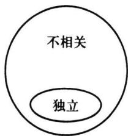

另外可以看出，前面有关数学期望的性质3.4.2：若X与Y相互独立，则 $E ( \boldsymbol { X } \boldsymbol { Y } ) = E ( \boldsymbol { X } ) E ( \boldsymbol { Y } )$ ，现可以将条件“独立”降弱为“不相关”.

图3.4.1不相关与独立的逻辑关系

协方差概念的引人可以完善随机变量和的方差计算，请看下面性质.

性质3.4.6 对任意二维随机变量（X,Y）,有

$$
\operatorname { V a r } ( X \ \pm Y ) = \operatorname { V a r } ( X ) \ + \operatorname { V a r } ( Y ) \ \pm 2 \operatorname { C o v } ( X , Y ) .\tag{3.4.8}
$$

证明由方差的定义知

$$
 \begin{array} { r l } & { \operatorname { V a r } ( X \pm Y ) = E { [ \begin{array} { l } { ( X \pm Y ) - E ( X \pm Y ) } \end{array} ] } ^ { 2 } } \\ & { \qquad = E { \{ \begin{array} { l l } { [ X - E ( X ) ] \pm [ Y - E ( Y ) ] \} ^ { 2 } } \end{array} } } \\ &  \qquad = E { \{ \begin{array} { l l } { [ X - E ( X ) ] ^ { 2 } + [ Y - E ( Y ) ] { \big \} } ^ { 2 } \ \pm 2 { \big [ } X - E ( X ) { \big ] } { \big [ } Y - E ( Y ) { \big ] } { \big \} } } \\ { \qquad = \operatorname { V a r } ( X ) + \operatorname { V a r } ( Y ) \ \pm 2 \operatorname { C o v } ( X , Y ) . } \end{array} } \end{array}
$$

这个性质表明：在X与Y相关的场合，和的方差不等于方差的和.X与Y的正相关会增加和的方差，负相关会减少和的方差，而在X与Y不相关的场合，和的方差等于方

差的和.这又可将前面有关方差的性质3.4.3修改如下：

若X与Y不相关，则 $\operatorname { V a r } ( X \ \pm Y ) = \operatorname { V a r } ( X ) \ + \operatorname { V a r } ( Y )$

以上性质3.4.6还可以推广到更多个随机变量场合，即对任意n个随机变量 $X _ { \imath }$ ，$X _ { 2 } , \cdots , X _ { n }$ ,有

$$
\operatorname { V a r } \Bigl ( \sum _ { i = 1 } ^ { n } X _ { i } \Bigr ) = \sum _ { i = 1 } ^ { n } \operatorname { V a r } \bigl ( X _ { i } \bigr ) + 2 \sum _ { i = 1 } ^ { n } \sum _ { j = 1 } ^ { i - 1 } \operatorname { C o v } \bigl ( X _ { i } , X _ { j } \bigr ) .\tag{3.4.9}
$$

关于协方差的计算，还有下面四条有用的性质.

性质3.4.7协方差Cov（X，Y)的计算与X，Y的次序无关，即

$$
\operatorname { C o v } ( X , Y ) = \operatorname { C o v } ( Y , X ) .
$$

证明这由协方差的定义就可看出.

性质3.4.8任意随机变量X与常数a的协方差为零，即

$$
\operatorname { C o v } ( X , a ) = 0 .
$$

证明这只要用协方差的定义计算一下即可得知.

性质3.4.9对任意常数a,b，有

$$
\operatorname { C o v } ( a X , b Y ) = a b \operatorname { C o v } ( X , Y ) .
$$

证明由协方差的定义知

$$
\operatorname { C o v } ( a X , b Y ) = E { \bigl [ } \left( a X - E ( a X ) \right) \left( b Y - E ( b Y ) \right) { \bigr ] } .
$$

把公因子a与b提出，即得 $a b \mathbf { C o v } ( X , Y )$

性质3.4.10设X，Y，Z是任意三个随机变量，则

$$
\operatorname { C o v } ( X + Y , Z ) = \operatorname { C o v } ( X , Z ) + \operatorname { C o v } ( Y , Z ) .
$$

证明由协方差的性质3.4.4得

$$
{ \begin{array} { r l } & { \operatorname { C o v } ( X + Y , Z ) = E [ ( X + Y ) Z ] - E ( X + Y ) E ( Z ) } \\ & { \qquad = E ( X Z ) + E ( Y Z ) - E ( X ) E ( Z ) - E ( Y ) E ( Z ) } \\ & { \qquad = { \bigl [ } E ( X Z ) - E ( X ) E ( Z ) { \bigr ] } + { \bigl [ } E ( Y Z ) - E ( Y ) E ( Z ) { \bigr ] } } \\ & { \qquad = \operatorname { C o v } ( X , Z ) + \operatorname { C o v } ( Y , Z ) . } \end{array} }
$$

例3.4.7设二维随机变量(X,Y)的联合密度函数为

$$
p ( x , y ) = \left\{ { \begin{array} { l l } { 3 x , } & { 0 < y < x < 1 , } \\ { 0 , } & { \# \nmid \nmid \nmid . } \end{array} } \right.
$$

试求 $\operatorname { C o v } ( X , Y )$

解利用协方差的计算公式，我们需要先计算 $E ( X ) , E ( Y ) , E ( X Y )$ 的值，它们可直接用 $p ( x , y )$ 导出，但要注意积分限的确定，具体如下：

$$
E ( X ) = \int _ { 0 } ^ { 1 } \int _ { 0 } ^ { x } x \cdot 3 x \mathrm { d } y \mathrm { d } x = \int _ { 0 } ^ { 1 } 3 x ^ { 3 } \mathrm { d } x = { \frac { 3 } { 4 } } .
$$

$$
E ( Y ) = \int _ { 0 } ^ { 1 } \int _ { 0 } ^ { x } y \cdot 3 x \mathrm { d } y \mathrm { d } x = \int _ { 0 } ^ { 1 } { \frac { 3 x ^ { 3 } } { 2 } } \mathrm { d } x = { \frac { 3 } { 8 } } .
$$

$$
E { \big ( } X Y { \big ) } = \int _ { 0 } ^ { 1 } \int _ { 0 } ^ { x } x y \cdot 3 x \mathrm { d } y \mathrm { d } x = \int _ { 0 } ^ { 1 } { \frac { 3 x ^ { 4 } } { 2 } } \mathrm { d } x = { \frac { 3 } { 1 0 } } .
$$

因此我们得

$$
\operatorname { C o v } ( X , Y ) = \frac { 3 } { 1 0 } - \frac { 3 } { 4 } \times \frac { 3 } { 8 } = \frac { 3 } { 1 6 0 } > 0 .
$$

由此我们还可以得结论：X与Y不相互独立.

例3.4.8 设二维随机变量(X,Y)的联合密度函数为

$$
p \left( x , y \right) = \left\{ \begin{array} { l l } { \displaystyle \frac { 1 } { 3 } ( x + y ) , } & { 0 < x < 1 , \quad 0 < y < 2 , } \\ { 0 , } & { \nmid \nmid 4 . } \end{array} \right.
$$

试求 $\mathrm { V a r } ( 2 X - 3 Y + 8 )$

解因为

$$
{ \begin{array} { r } { { \mathrm { V a r } } { \mathrm { ( ~ 2 } X \mathrm { ~ - ~ } 3 Y \mathrm { ~ + ~ } 8 \mathrm { ) } } = { \mathrm { V a r } } { \mathrm { ( ~ } } 2 X \mathrm { ~ ) } \mathrm { ~ + ~ } { \mathrm { V a r } } { \mathrm { ( ~ } } 3 Y \mathrm { ~ ) } \mathrm { ~ - ~ } 2 { \mathrm { C o v } } { \mathrm { ( ~ } } 2 X , 3 Y \mathrm { ) } } \\ { = 4 { \mathrm { V a r } } { \mathrm { ( ~ } } X \mathrm { ~ ) } \mathrm { ~ + ~ } 9 { \mathrm { V a r } } { \mathrm { ( ~ } } Y \mathrm { ~ ) } \mathrm { ~ - ~ } 1 2 { \mathrm { C o v } } { \mathrm { ( ~ } } X , Y \mathrm { ~ ) } , } \end{array} }
$$

所以我们先要分别计算 $E ( X ) , E ( X ^ { 2 } ) , E ( Y ) , E ( Y ^ { 2 } ) , E ( X Y )$ .为此先计算两个边际密度函数.

$$
p _ { x } ( x ) = \int _ { 0 } ^ { 2 } \frac { 1 } { 3 } \big ( x + y \big ) \mathrm { d } y = \frac { 2 } { 3 } \big ( x + 1 \big ) , \quad 0 < x < 1 ,
$$

$$
p _ { r } ( y ) = \int _ { 0 } ^ { 1 } \frac { 1 } { 3 } \big ( x + y \big ) \mathrm { d } x = \frac { 1 } { 3 } \Bigg ( \frac { 1 } { 2 } + y \Bigg ) ~ , ~ 0 < y < 2 .
$$

然后再计算一、二阶矩，

$$
E ( X ) = \int _ { 0 } ^ { 1 } { \frac { 2 } { 3 } } x ( x + 1 ) \mathrm { d } x = { \frac { 5 } { 9 } } ,
$$

$$
E ( X ^ { 2 } ) = \int _ { 0 } ^ { 1 } \frac { 2 } { 3 } x ^ { 2 } \big ( x + 1 \big ) \mathrm { d } x = \frac { 7 } { 1 8 } ,
$$

$$
E ( \ Y ) = \int _ { 0 } ^ { 2 } { \frac { 1 } { 3 } } y \left( { \frac { 1 } { 2 } } + y \right) { \mathrm { d } } y = { \frac { 1 1 } { 9 } } ,
$$

$$
E ( \ y ^ { 2 } ) = \int _ { 0 } ^ { 2 } { \frac { 1 } { 3 } } y ^ { 2 } \left( { \frac { 1 } { 2 } } + y \right) { \mathrm { d } } y = { \frac { 1 6 } { 9 } } .
$$

由此得

$$
\operatorname { V a r } ( X ) = { \frac { 7 } { 1 8 } } - \left( { \frac { 5 } { 9 } } \right) ^ { 2 } = { \frac { 1 3 } { 1 6 2 } } , \quad \operatorname { V a r } ( Y ) = { \frac { 1 6 } { 9 } } - \left( { \frac { 1 1 } { 9 } } \right) ^ { 2 } = { \frac { 2 3 } { 8 1 } } .
$$

最后还需要计算E(XY),它只能从联合密度函数导出.

$$
E ( X Y ) = { \frac { 1 } { 3 } } \int _ { 0 } ^ { 1 } \int _ { 0 } ^ { 2 } x y ( x + y ) \mathrm { d } y \mathrm { d } x = { \frac { 1 } { 3 } } \int _ { 0 } ^ { 1 } \left( 2 x ^ { 2 } + { \frac { 8 } { 3 } } x \right) \mathrm { d } x = { \frac { 2 } { 3 } } .
$$

于是得协方差为

$$
\operatorname { C o v } ( X , Y ) = { \frac { 2 } { 3 } } - { \frac { 5 } { 9 } } \times { \frac { 1 1 } { 9 } } = - { \frac { 1 } { 8 1 } } .
$$

代回原式得

$$
\operatorname { V a r } ( 2 X - 3 Y + 8 ) = 4 \times { \frac { 1 3 } { 1 6 2 } } + 9 \times { \frac { 2 3 } { 8 1 } } - 1 2 \times { \bigg ( } - { \frac { 1 } { 8 1 } } { \bigg ) } = { \frac { 2 4 5 } { 8 1 } } .
$$

## 3.4.4相关系数

协方差 $\operatorname { C o v } ( X , Y )$ 是有量纲的量，譬如X表示人的身高，单位是米（m），Y表示人的体重，单位是千克 $\left( \mathbf { \ k g } \right)$ ，则 $\operatorname { C o v } ( X , Y )$ 带有量纲 $( { \bf m } \cdot { \bf k } { \bf g } )$ .为了消除量纲的影响，现对

协方差除以相同量纲的量，就得到一个新的概念一一相关系数，它的定义如下.

定义3.4.2设(X，Y)是一个二维随机变量，且 $\operatorname { V a r } \left( X \right) = \sigma _ { x } ^ { 2 } > 0 , \operatorname { V a r } \left( Y \right) = \sigma _ { \gamma } ^ { 2 } > 0 .$ 则称

$$
\operatorname { C o r r } ( X , Y ) = { \frac { \operatorname { C o v } ( X , Y ) } { { \sqrt { \operatorname { V a r } ( X ) } } ~ { \sqrt { \operatorname { V a r } ( Y ) } } } } = { \frac { \operatorname { C o v } ( X , Y ) } { \sigma _ { x } \sigma _ { Y } } }\tag{3.4.10}
$$

为X与Y的（线性）相关系数.

从以上定义中可看出：相关系数Corr(X,Y)与协方差Cov(X,Y)是同符号的，即同为正，或同为负，或同为零.这说明，从相关系数的取值也可反映出X与Y的正相关、负相关和不相关.

相关系数的另一个解释是：它是相应标准化变量的协方差.若记X与Y的数学期望分别为 $\mu _ { \chi } , \mu _ { \gamma }$ ,其标准化变量为

$$
X ^ { ^ { \ast } } \ = \frac { X - \mu _ { x } } { \sigma _ { x } } , \quad Y ^ { ^ { \ast } } \ = \frac { Y - \mu _ { r } } { \sigma _ { r } } ,
$$

则有

$$
\operatorname { C o v } \big ( X ^ { \bullet } \ , Y ^ { \bullet } \ \big ) = \operatorname { C o v } \bigg ( \frac { X - \mu _ { x } } { \sigma _ { x } } , \frac { Y - \mu _ { Y } } { \sigma _ { Y } } \bigg ) = \frac { \operatorname { C o v } \big ( X , Y \big ) } { \sigma _ { x } \sigma _ { Y } } = \operatorname { C o r r } \big ( X , Y \big ) .
$$

例3.4.9二维正态分布 $N ( \mu _ { 1 } , \mu _ { 2 } , \sigma _ { 1 } ^ { 2 } , \sigma _ { 2 } ^ { 2 } , \rho )$ 的相关系数就是 $\rho .$

解下面先求 $\operatorname { C o v } ( X , Y )$

$$
\begin{array} { r l } & { \mathrm { { C o v } } ( X , Y ) = E \left[ \left( X - E ( X ) \right) \left( Y - E ( Y ) \right) \right] } \\ & { = \frac { 1 } { { 2 \pi \sigma _ { 1 } \sigma _ { 2 } \sqrt { 1 - \rho ^ { 2 } } } ^ { \rho } \int _ { - \infty } ^ { \infty } \int _ { - \infty } ^ { \infty } \left( x - \mu _ { 1 } \right) \left( y - \mu _ { 2 } \right) \ . } } \\ & { \quad \quad \quad \quad \quad \mathrm { { e x p } } \Bigg \{ - \frac { 1 } { { 2 \left( 1 - \rho ^ { 2 } \right) } } { { \left[ \frac { \left( x - \mu _ { 1 } \right) ^ { 2 } } { \sigma _ { 1 } ^ { 2 } } - 2 \rho \frac { \left( x - \mu _ { 1 } \right) \left( y - \mu _ { 2 } \right) } { \sigma _ { 1 } \sigma _ { 2 } } + \right. } } } \\ & { \quad \quad \quad \quad \quad \left. \frac { \left( y - \mu _ { 2 } \right) ^ { 2 } } { \sigma _ { 2 } ^ { 2 } } \right] \Bigg \} \mathrm { d } x \mathrm { d } y . } \end{array}
$$

先将上式中方括号内化成

$$
\left( \frac { x - \mu _ { 1 } } { \sigma _ { 1 } } - \rho \frac { y - \mu _ { 2 } } { \sigma _ { 2 } } \right) ^ { 2 } + \left( \sqrt { 1 - \rho ^ { 2 } } \frac { y - \mu _ { 2 } } { \sigma _ { 2 } } \right) ^ { 2 } ,
$$

再作变量变换

$$
\left\{ \begin{array} { l l } { \displaystyle \boldsymbol { u } = \frac { 1 } { \sqrt { 1 - \rho ^ { 2 } } } \bigg ( \frac { \boldsymbol { x } - \boldsymbol { \mu } _ { 1 } } { \sigma _ { 1 } } - \rho \frac { \boldsymbol { y } - \boldsymbol { \mu } _ { 2 } } { \sigma _ { 2 } } \bigg ) ~ , } \\ { \displaystyle \boldsymbol { v } = \frac { \boldsymbol { y } - \boldsymbol { \mu } _ { 2 } } { \sigma _ { 2 } } , } \end{array} \right.
$$

则

$$
\left\{ \begin{array} { l l } { x - \mu _ { 1 } = \sigma _ { 1 } \big ( u \sqrt { 1 - \rho ^ { 2 } } + \rho v \big ) , } \\ { \qquad \quad } \\ { y - \mu _ { 2 } = \sigma _ { 2 } v , } \end{array} \right.
$$

$$
\mathrm { d } x \mathrm { d } y = \mid J \mid \mathrm { d } u \mathrm { d } v = \sigma _ { 1 } \sigma _ { 2 } \sqrt { 1 - \rho ^ { 2 } } \mathrm { d } u \mathrm { d } v .
$$

由此得

$$
\operatorname { C o v } ( X , Y ) = \frac { \sigma _ { 1 } \sigma _ { 2 } } { 2 \pi } { \int _ { - \infty } ^ { \infty } } \int _ { - \infty } ^ { \infty } \left( u v \sqrt { 1 - { \rho ^ { 2 } } } + \rho v ^ { 2 } \right) \exp \Bigl \{ - \frac { 1 } { 2 } ( u ^ { 2 } + v ^ { 2 } ) \Bigr \} \mathrm { d } u \mathrm { d } v .
$$

上式右端积分可以分为两个积分之和，其中

$$
\int _ { - \infty } ^ { \infty } \int _ { - \infty } ^ { \infty } u v \mathrm { e x p } \Bigg \{ - \frac { 1 } { 2 } \big ( u ^ { 2 } + v ^ { 2 } \big ) \Bigg \} \mathrm { d } u \mathrm { d } v = 0 ,
$$

$$
\int _ { - \infty } ^ { \infty } \int _ { - \infty } ^ { \infty } v ^ { 2 } \exp \bigg \{ - \frac { 1 } { 2 } \big ( u ^ { 2 } + v ^ { 2 } \big ) \bigg \} \mathrm { d } u \mathrm { d } v = 2 \pi .
$$

从而

$$
\operatorname { C o v } ( X , Y ) = { \frac { \sigma _ { 1 } \sigma _ { 2 } } { 2 \pi } } \cdot \rho \cdot 2 \pi = \rho \sigma _ { 1 } \sigma _ { 2 } ,
$$

$$
\operatorname { C o r r } ( X , Y ) = { \frac { \operatorname { C o v } ( X , Y ) } { \sigma _ { 1 } \sigma _ { 2 } } } = \rho .
$$

为了研究相关系数的性质，需要如下引理.

引理3.4.1(施瓦茨(Schwarz)不等式）对任意二维随机变量(X,Y)，若X与Y的方差都存在，且记 ${ \pmb \sigma } _ { x } ^ { 2 } = \mathrm { V a r } ( { \pmb X } ) , { \pmb \sigma } _ { Y } ^ { 2 } = \mathrm { V a r } ( { \pmb Y } )$ ，则有

$$
[ \operatorname { C o v } ( X , Y ) ] ^ { 2 } \leqslant \sigma _ { X } ^ { 2 } \sigma _ { Y } ^ { 2 } .\tag{3.4.11}
$$

证明不妨设 $\sigma _ { x } ^ { 2 } { > } 0$ ，因为当 $\sigma _ { \chi } ^ { 2 } = 0$ 时，则X几乎处处为常数，因而其与Y的协方差亦为零，从而(3.4.11)式两端皆为零，结论成立.若 $\sigma _ { x } ^ { 2 } > 0$ 成立，考虑t的如下二次函数：

$$
g ( t ) = E \big [ \ t ( X - E ( X ) ) \ + \ ( \ Y - E ( Y ) ) \big ] ^ { 2 } = t ^ { 2 } \sigma _ { x } ^ { 2 } + 2 t \cdot \operatorname { C o v } ( X , Y ) \ + \ \sigma _ { Y } ^ { 2 } .
$$

由于上述的二次三项式非负，平方项系数σ为正，所以其判别式小于或等于零，即 $\sigma _ { \chi } ^ { 2 }$

$$
\lbrack 2 \mathrm { C o v } ( X , Y ) ] ^ { 2 } - 4 \sigma _ { \chi } ^ { 2 } \sigma _ { \gamma } ^ { 2 } \leqslant 0 .
$$

移项后即得施瓦茨不等式.

利用施瓦茨不等式立即可得相关系数的一个重要性质.

性质3.4.11 $\begin{array} { r } { - 1 \leqslant \operatorname { C o r r } ( X , Y ) \leqslant 1 , \frac { \pi } { \mathcal { Z } } \vert \operatorname { C o r r } ( X , Y ) \vert \leqslant 1 . } \end{array}$

这个性质表明：相关系数介于-1与1之间.当相关系数为±1时，有另一重要性质.

性质3.4.12 $\operatorname { C o r r } ( X , Y ) = \pm 1$ 的充要条件是X与Y间几乎处处有线性关系，即存在 $a ( \neq 0 )$ 与b,使得

$$
P ( \ Y = a X + b ) = 1 .
$$

其中当 $\operatorname { C o r r } ( X , Y ) = 1$ 时，有 $\scriptstyle a > 0$ ；当 $\operatorname { C o r r } ( X , Y ) = - 1$ 时，有 $a < 0 .$

证明充分性.若 $Y = a X + b ( X = c Y + d$ 也一样)，则将

$$
\operatorname { V a r } ( Y ) = a ^ { 2 } \operatorname { V a r } ( X ) , \quad \operatorname { C o v } ( X , Y ) = a \operatorname { C o v } ( X , X ) = a \operatorname { V a r } ( X )
$$

代人相关系数的定义中得

$$
\operatorname { C o r r } ( X , Y ) = \frac { \operatorname { C o v } ( X , Y ) } { \sigma _ { x } \sigma _ { Y } } = \frac { a \operatorname { V a r } ( X ) } { \mid a \mid \operatorname { V a r } ( X ) } = \left\{ \begin{array} { l l } { 1 , } & { a > 0 , } \\ { - 1 , } & { a < 0 . } \end{array} \right.
$$

必要性.因为

$$
\operatorname { V a r } \left( { \frac { X } { \sigma _ { x } } } \ \pm { \frac { Y } { \sigma _ { Y } } } \right) = 2 [ 1 \ \pm \operatorname { C o r r } ( X , Y ) ] ,\tag{3.4.12}
$$

所以当 $\operatorname { C o r r } ( X , Y ) = 1$ 时,有

$$
\operatorname { V a r } \biggl ( \frac { X } { \sigma _ { \chi } } - \frac { Y } { \sigma _ { \it Y } } \biggr ) = 0 ,
$$

由此得

$$
P \Big ( \frac { X } { \sigma _ { x } } - \frac { Y } { \sigma _ { \gamma } } = c \Big ) = 1 ,
$$

或

$$
P \bigg ( { \cal Y } = { \frac { \sigma _ { \gamma } } { \sigma _ { \chi } } } { \cal X } - c \sigma _ { \gamma } \bigg ) = 1 .
$$

这就证明了：当 $\operatorname { C o r r } ( X , Y ) = 1$ 时，Y与X几乎处处为线性正相关.

当 $\operatorname { C o r r } ( X , Y ) = - 1$ 时，由（3.4.12）式得

$$
\operatorname { V a r } \Biggl ( \frac { X } { \sigma _ { \chi } } + \frac { Y } { \sigma _ { \gamma } } \Biggr ) = 0 ,
$$

由此得

$$
P \Big ( \frac { X } { \sigma _ { x } } + \frac { Y } { \sigma _ { y } } = c \Big ) = 1 ,
$$

或

$$
P \bigg ( { Y = - \frac { { \pmb \sigma } _ { Y } } { \pmb \sigma } X + c \pmb \sigma _ { Y } } \bigg ) = 1 .
$$

这也证明了：当 $\operatorname { C o r r } ( X , Y ) = - 1$ 时，Y与X几乎处处为线性负相关.

对于这个性质可作以下几点说明：

·相关系数Corr(X,Y)刻画了X与Y之间的线性关系强弱,因此也常称其为“线 性相关系数”.

·若 $\operatorname { C o r r } ( X , Y ) = 0$ ，则称X与Y不相关.不相关是指X与Y之间没有线性关系，但X与Y之间可能有其他的函数关系，譬如平方关系、对数关系等.

·若 $\operatorname { C o r r } ( X , Y ) = 1$ ，则称X与Y完全正相关；若 $\operatorname { C o r r } ( X , Y ) = - 1$ ，则称X与Y完全 负相关.

·若 $0 < \mathsf { I C o r r } ( X , Y ) \mid < 1$ ，则称X与Y有“一定程度"的线性关系.ICorr(X,Y)|越接近于1，则线性相关程度越高； $| \operatorname { C o r r } ( X , Y )$ 1越接近于0，则线性相关程度越低.而协方差看不出这一点.若协方差很小，而其两个标准差σx和σy也很小，则其比值就不一定很 $\pmb { \sigma } _ { \chi }$ $\sigma _ { Y }$ 小，这可从下面例3.4.10看出.

例3.4.10已知随机向量(X,Y)的联合密度函数为

$$
p ( x , y ) = \left\{ \begin{array} { l l } { \frac { 8 } { 3 } , } & { 0 < x - y < 0 . 5 , 0 < x , y < 1 , } \\ { 0 , } & { \nmid \nmid \nmid . } \end{array} \right.
$$

求X,Y的相关系数 $\operatorname { C o r r } ( X , Y )$

解先计算两个边际密度函数.

当 $0 < x < 0 . 5$ 时，

$$
p _ { x } { \left( x \right) } = \int _ { - \infty } ^ { \infty } p { \left( x , y \right) } \mathrm { d } y = \int _ { 0 } ^ { x } { \frac { 8 } { 3 } } \mathrm { d } y = { \frac { 8 } { 3 } } x ,
$$

当0.5<x<1时，

$$
p _ { x } ( x ) = \int _ { - \infty } ^ { \infty } p ( x , y ) \mathrm { d } y = \int _ { x - 0 . 5 } ^ { x } \frac { 8 } { 3 } \mathrm { d } y = \frac { 4 } { 3 } ,
$$

所以得X的边际密度函数为

$$
p _ { x } ( x ) = \left\{ \begin{array} { l l } { \frac { 8 } { 3 } x , } & { 0 < x < 0 . 5 , } \\ { } \\ { \frac { 4 } { 3 } , } & { 0 . 5 < x < 1 , } \\ { 0 , } & { \nmid \nmid \nmid . } \end{array} \right.
$$

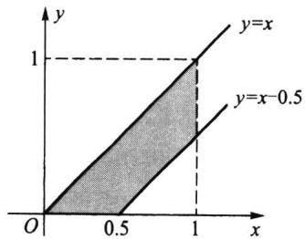  
图3.4.2例3.4.10中 $p ( \boldsymbol { x } , \boldsymbol { y } )$ 的非零区域

当 $0 < y < 0 . 5$ 时，

$$
p _ { _ { Y } } ( y ) = \int _ { - \infty } ^ { \infty } p ( x , y ) \mathrm { d } x = \int _ { y } ^ { y + 0 . 5 } { \frac { 8 } { 3 } } \mathrm { d } x = { \frac { 4 } { 3 } } ,
$$

当0.5<y<1时，

$$
p _ { _ Y } ( y ) = \int _ { - \infty } ^ { \infty } p ( x , y ) \mathrm { d } x = \int _ { \gamma } ^ { 1 } \frac { 8 } { 3 } \mathrm { d } x = \frac { 8 } { 3 } ( 1 - y ) ,
$$

所以得Y的边际密度函数为

$$
\begin{array} { r } { p _ { \gamma } ( \gamma ) = \left\{ \begin{array} { l l } { \displaystyle \frac { 4 } { 3 } , } & { 0 < \gamma < 0 . 5 , } \\ { \displaystyle } \\ { \displaystyle \frac { 8 } { 3 } ( 1 - \gamma ) , } & { 0 . 5 < \gamma < 1 , } \\ { 0 , } & { \mathrm { \nmid \nmid \ell . } } \end{array} \right. } \end{array}
$$

然后分别计算X与Y的一、二阶矩

$$
\begin{array} { l } { E ( X ) = \displaystyle \int _ { 0 } ^ { 0 . 5 } \frac { 8 } { 3 } x ^ { 2 } \mathrm { d } x + \displaystyle \int _ { 0 . 5 } ^ { 1 } \frac { 4 } { 3 } x \mathrm { d } x = \frac { 1 1 } { 1 8 } , } \\ { E ( Y ) = \displaystyle \int _ { 0 } ^ { 0 . 5 } \frac { 4 } { 3 } y \mathrm { d } y + \displaystyle \int _ { 0 . 5 } ^ { 1 } \frac { 8 } { 3 } y ( 1 - y ) \mathrm { d } y = \frac { 7 } { 1 8 } , } \\ { E ( X ^ { 2 } ) = \displaystyle \int _ { 0 } ^ { 0 . 5 } \frac { 8 } { 3 } x ^ { 3 } \mathrm { d } x + \displaystyle \int _ { 0 . 5 } ^ { 1 } \frac { 4 } { 3 } x ^ { 2 } \mathrm { d } x = \frac { 3 1 } { 7 2 } , } \\ { E ( Y ^ { 2 } ) = \displaystyle \int _ { 0 } ^ { 0 . 5 } \frac { 4 } { 3 } y ^ { 2 } \mathrm { d } y + \displaystyle \int _ { 0 . 5 } ^ { 1 } \frac { 8 } { 3 } y ^ { 2 } ( 1 - y ) \mathrm { d } y = \frac { 5 } { 2 4 } . } \end{array}
$$

由此可得X与Y各自的方差

$$
{ \begin{array} { r l } & { \operatorname { V a r } ( X ) = { \cfrac { 3 1 } { 7 2 } } - \left( { \cfrac { 1 1 } { 1 8 } } \right) ^ { 2 } = { \cfrac { 3 7 } { 6 4 8 } } , } \\ & { \operatorname { V a r } ( Y ) = { \cfrac { 5 } { 2 4 } } - \left( { \cfrac { 7 } { 1 8 } } \right) ^ { 2 } = { \cfrac { 3 7 } { 6 4 8 } } . } \end{array} }
$$

最后还需要计算E(XY),它只能从联合密度函数导出.

$$
\begin{array} { l l l } { { \displaystyle { E ( X Y ) = \int _ { 0 } ^ { 0 . 5 } \int _ { 0 } ^ { \times } \frac { 8 } { 3 } x y \mathrm { d } y \mathrm { d } x + \int _ { 0 . 5 } ^ { 1 } \int _ { x - 0 . 5 } ^ { \times } \frac { 8 } { 3 } x y \mathrm { d } y \mathrm { d } x = \int _ { 0 } ^ { 0 . 5 } \frac { 4 } { 3 } x ^ { 3 } \mathrm { d } x + \int _ { 0 . 5 } ^ { 1 } \frac { 4 } { 3 } x \biggl ( x - \frac { 1 } { 4 } \biggr ) \mathrm { d } x } } } \\ { { \displaystyle { \quad \quad = \frac { 1 } { 4 8 } + \frac { 7 } { 1 8 } - \frac { 1 } { 8 } = \frac { 4 1 } { 1 4 4 } . } } } \end{array}
$$

最后得协方差和相关系数为

$$
\operatorname { C o v } ( X , Y ) = { \frac { 4 1 } { 1 4 4 } } - { \frac { 1 1 } { 1 8 } } \times { \frac { 7 } { 1 8 } } = { \frac { 6 1 } { 1 ~ 2 9 6 } } = 0 . 0 4 7 ~ 1 .
$$

$$
\operatorname { C o r r } ( X , Y ) = { \frac { \operatorname { C o v } ( X , Y ) } { \sigma _ { x } \sigma _ { y } } } = { \frac { 6 1 } { 1 \ 2 9 6 } } \times { \frac { 6 4 8 } { 3 7 } } = { \frac { 6 1 } { 7 4 } } = 0 . 8 2 4 \ 3 .
$$

这里协方差很小，但其相关系数并不小.

上例中，从相关系数 $\operatorname { C o r r } ( X , Y ) = 0 . 8 2 4 \ 3$ 看，X与Y有较高程度的正相关；但从相应的协方差 $\operatorname { C o v } ( X , Y ) = 0 . 0 4 7 \ 1$ 看,X与Y的相关性很微弱，几乎可以忽略不计.造成这种错觉的原因在于没有考虑标准差，若两个标准差都很小，即使协方差小一些，相关系数也能显示一定程度的相关性.由此可见，在协方差的基础上加工形成的相关系数是更为重要的相关性的特征数.

在一般场合，独立必导致不相关，但不相关推不出独立.但也有例外，下面的性质指出了这个例外.

性质3.4.13在二维正态分布 $N ( \pmb \mu _ { 1 } , \pmb \mu _ { 2 } , \pmb \sigma _ { 1 } ^ { 2 } , \pmb \sigma _ { 2 } ^ { 2 } , \pmb \rho )$ 场合，不相关与独立是等价的.

证明由上面例3.4.9知，二维正态分布 $N ( \mu _ { 1 } , \mu _ { 2 } , \sigma _ { 1 } ^ { 2 } , \sigma _ { 2 } ^ { 2 } , \rho )$ 的相关系数是 $\pmb { \rho }$ ，因此我们只需证 $\rho = 0$ 与独立是等价的.因为二维正态分布 $N ( \mu _ { 1 } , \mu _ { 2 } , \sigma _ { 1 } ^ { 2 } , \sigma _ { 2 } ^ { 2 } , \rho )$ 的两个边际分布为 $N ( \mu _ { _ { 1 } } , { \sigma _ { _ { 1 } } ^ { ^ { 2 } } } )$ 和 $N ( \mu _ { _ 2 } , { \sigma _ { _ 2 } ^ { 2 } } )$ ，所以记其联合密度函数为 $p ( x , y )$ ，边际密度函数为$p _ { \chi } ( \boldsymbol { x } )$ 与 $p _ { _ Y } ( { \boldsymbol { y } } )$

当 $\rho = 0$ 时，可从正态密度函数的表达式中看出

$$
p ( x , y ) = p _ { _ { X } } ( x ) p _ { _ { Y } } ( y ) ,
$$

即X与Y相互独立.

反之,若X与Y相互独立,则X与Y不相关,从而有p=0.结论得证. $\rho = 0$

例3.4.11（投资组合的风险）设有一笔资金，总量记为1（可以是1万元，也可以是100万元等），如今要投资甲、乙两种证券.若将资金x，投资于甲证券，将余下的资金 $x _ { _ 1 }$ $\boldsymbol { 1 - x } _ { _ { 1 } } = \boldsymbol { x } _ { _ { 2 } }$ 投资于乙证券，于是 ${ ( x _ { _ { 1 } } , x _ { _ { 2 } } ) }$ 就形成了一个投资组合.记X为投资甲证券的收益率，Y为投资乙证券的收益率，它们都是随机变量.如果已知X和Y的均值（代表平 $\textsf { Z }$ 均收益)分别为μ和μ,方差(代表风险)分别为σ²和g²,X和Y间的相关系数为 $\mu _ { \scriptscriptstyle 1 }$ $\boldsymbol { \mu } _ { 2 }$ $\boldsymbol { \sigma } _ { 1 } ^ { 2 }$ $\boldsymbol { \sigma } _ { 2 } ^ { 2 }$ $\rho .$ 试求该投资组合的平均收益与风险（方差），并求使投资组合风险最小的x，是多少？ $x _ { _ 1 }$

解因为组合收益为

$$
Z = x _ { _ 1 } X + x _ { _ 2 } Y = x _ { _ 1 } X + \left( 1 - x _ { _ 1 } \right) Y ,
$$

所以该组合的平均收益为

$$
E ( Z ) = x _ { 1 } E ( X ) \ + \ ( 1 - x _ { 1 } ) E ( Y ) = x _ { 1 } \mu _ { 1 } + ( 1 - x _ { 1 } ) \mu _ { 2 } .
$$

而该组合的风险（方差）为

$$
{ \begin{array} { r l } & { \operatorname { V a r } ( Z ) = \operatorname { V a r } \left[ x _ { 1 } X + ( 1 - x _ { 1 } ) Y \right] } \\ & { \qquad = x _ { 1 } ^ { 2 } \operatorname { V a r } ( X ) + { \left( 1 - x _ { 1 } \right) } ^ { 2 } \operatorname { V a r } ( Y ) + 2 x _ { 1 } ( 1 - x _ { 1 } ) \operatorname { C o v } ( X , Y ) } \\ & { \qquad = x _ { 1 } ^ { 2 } \sigma _ { 1 } ^ { 2 } + { \bigl ( } 1 - x _ { 1 } { \bigr ) } ^ { 2 } \sigma _ { 2 } ^ { 2 } + 2 x _ { 1 } ( 1 - x _ { 1 } ) \rho \sigma _ { 1 } \sigma _ { 2 } . } \end{array} }
$$

求最小的组合风险，即求 $\mathrm { V a r } ( Z )$ 关于 $x _ { _ { 1 } }$ 的极小点，为此令

$$
\frac { \mathrm { d } ( \mathrm { V a r } ( Z ) ) } { \mathrm { d } x _ { 1 } } = 2 x _ { 1 } \sigma _ { 1 } ^ { 2 } - 2 ( 1 - x _ { 1 } ) \sigma _ { 2 } ^ { 2 } + 2 \rho \sigma _ { 1 } \sigma _ { 2 } - 4 x _ { 1 } \rho \sigma _ { 1 } \sigma _ { 2 } = 0 ,
$$

从中解得

$$
x _ { 1 } ^ { \cdot } = \frac { \sigma _ { 2 } ^ { 2 } - \rho \sigma _ { 1 } \sigma _ { 2 } } { \sigma _ { 1 } ^ { 2 } + \sigma _ { 2 } ^ { 2 } - 2 \rho \sigma _ { 1 } \sigma _ { 2 } } .
$$

它与 $\mu _ { _ 1 } , \mu _ { _ 2 }$ 无关.又因为 $\mathrm { V a r } ( Z )$ 中 $x _ { _ { 1 } } ^ { ^ { 2 } }$ 的系数为正,所以以上的 $x _ { 1 } ^ { * }$ 可使组合风险达到最小

譬如， $\sigma _ { _ 1 } ^ { ^ 2 } = 0 . 3 , \sigma _ { _ 2 } ^ { ^ 2 } = 0 . 5 , \rho = 0 . 4$ ，则

$$
x _ { 1 } ^ { * } = \frac { 0 . 5 \mathrm { ~ - ~ } 0 . 4 \sqrt { 0 . 3 \times 0 . 5 } } { 0 . 3 + 0 . 5 \mathrm { ~ - ~ } 2 \times 0 . 4 \sqrt { 0 . 3 \times 0 . 5 } } = 0 . 7 0 4 .
$$

这说明应把全部资金的70%投资于甲证券，而把余下的30%资金投向乙证券，这样的投资组合风险最小.

## 3.4.5随机向量的数学期望向量与协方差矩阵

以下我们用矩阵形式给出n维随机变量的数学期望与方差.

定义3.4.3记n维随机向量为 $\mathbf { X } = ( \mathbf { \Sigma } _ { X _ { 1 } } ^ { \phantom { ' } } , \mathbf { \Sigma } _ { X _ { 2 } } ^ { \phantom { ' } } , \cdots , \mathbf { \Sigma } _ { X _ { n } } ^ { \phantom { ' } } ) ^ { \prime }$ ,若其每个分量的数学期望都存在,则称

$$
E ( \boldsymbol { X } ) = ( E ( \boldsymbol { X } _ { \ u { \cdot } } ) , E ( \boldsymbol { X } _ { \ u { \cdot } } ) , \cdots , E ( \boldsymbol { X } _ { \ u { \cdot } } ) ) ^ { \prime }
$$

为n维随机向量X的数学期望向量，简称为X的数学期望，而称

$$
\begin{array} { r l } & { E [ \left( X - E ( X ) \right) ( X - E ( X ) ) ^ { \prime } ] } \\ & { = \left( \begin{array} { c c c c } { { \mathrm { V a r } ( X _ { 1 } ) } } & { { \mathrm { C o v } ( X _ { 1 } , X _ { 2 } ) } } & { { \cdots } } & { { \mathrm { C o v } ( X _ { 1 } , X _ { n } ) } } \\ { { \mathrm { C o v } ( X _ { 2 } , X _ { 1 } ) } } & { { \mathrm { V a r } ( X _ { 2 } ) } } & { { \cdots } } & { { \mathrm { C o v } ( X _ { 2 } , X _ { n } ) } } \\ { { \vdots } } & { { \vdots } } & { { } } & { { \vdots } } \\ { { \mathrm { C o v } ( X _ { n } , X _ { 1 } ) } } & { { \mathrm { C o v } ( X _ { n } , X _ { 2 } ) } } & { { \cdots } } & { { \mathrm { V a r } ( X _ { n } ) } } \end{array} \right) } \end{array}
$$

为该随机向量的方差-协方差矩阵，简称协方差阵，记为Cov(X).

至此我们可以看出,n维随机向量的数学期望是各分量的数学期望组成的向量.而其方差就是由各分量的方差与协方差组成的矩阵，其对角线上的元素就是方差，非对角线元素为协方差.

以下给出协方差矩阵的一个重要性质.

定理3.4.2n维随机向量的协方差矩阵 $\operatorname { C o v } \left( X \right) = \left( \operatorname { C o v } \left( X _ { _ i } , X _ { _ i } \right) \right) _ { _ { n \times n } }$ 是一个对称的非负定矩阵.

证明因为 $\operatorname { C o v } ( X _ { _ i } , X _ { _ i } ) = \operatorname { C o v } ( X _ { _ i } , X _ { _ i } )$ ，所以对称性是显然的.下证非负定性.因为对任意的n维实向量 $\pmb { c } = ( c _ { _ 1 } , c _ { _ 2 } , \cdots , c _ { _ n } ) ^ { \prime }$ ，有

$$
\begin{array} { r } { c ^ { \prime } \mathrm { C o v } \left( X \right) c = \left( c _ { _ 1 } , c _ { _ 2 } , \cdots , c _ { n } \right) \left( \begin{array} { c c c } { \mathrm { V a r } \left( X _ { _ 1 } \right) } & { \cdots } & { \mathrm { C o v } \left( X _ { _ 1 } , X _ { n } \right) } \\ { \mathrm { C o v } \left( X _ { _ 2 } , X _ { 1 } \right) } & { \cdots } & { \mathrm { C o v } \left( X _ { _ 2 } , X _ { n } \right) } \\ { \vdots } & { } & { \vdots } \\ { \mathrm { C o v } \left( X _ { _ n } , X _ { 1 } \right) } & { \cdots } & { \mathrm { V a r } \left( X _ { _ n } \right) } \end{array} \right) \left( \begin{array} { c } { c _ { _ 1 } } \\ { c _ { _ 2 } } \\ { \vdots } \\ { c _ { _ n } } \end{array} \right) } \end{array}
$$

$$
\begin{array} { r l } & { \displaystyle = \sum _ { i = 1 } ^ { N } \sum _ { j = 1 } ^ { K } c _ { i } \zeta _ { i } \mathrm { C o v } ( X _ { i } , X _ { j } ) } \\ & { = \displaystyle \sum _ { i = 1 } ^ { K } \sum _ { j = 1 } ^ { K } E \left\{ \left[ c _ { i } ( X _ { i } - E ( X _ { i } ) ) \right] \left[ c _ { j } ( X _ { j } - E ( X _ { j } ) ) \right] \right\} } \\ & { = E \Big \{ \displaystyle \sum _ { i = 1 } ^ { N } \sum _ { j = 1 } ^ { N } \left[ c _ { i } ( X _ { i } - E ( X _ { i } ) ) \right] \left[ c _ { j } ( X _ { i } - E ( X _ { j } ) ) \right] \Big \} } \\ & { = E \Big \{ \Big [ \displaystyle \sum _ { i = 1 } ^ { N } c _ { i } ( X _ { i } - E ( X _ { i } ) ) \Big ] \left[ \displaystyle \sum _ { j = 1 } ^ { N } c _ { j } ( X _ { j } - E ( X _ { j } ) ) \right] \Big \} } \\ & { = E \Big \{ \Big [ \displaystyle \sum _ { i = 1 } ^ { N } c _ { i } ( X _ { i } - E ( X _ { i } ) ) \Big ] \Big [ \displaystyle \sum _ { j = 1 } ^ { N } c _ { j } ( X _ { j } - E ( X _ { j } ) ) \Big ] \Big \} } \\ & { = E \Big [ \displaystyle \sum _ { i = 1 } ^ { N } c _ { i } ( X _ { i } - E ( X _ { i } ) ) \Big ] ^ { 2 } \succcurlyeq 0 . } \end{array}
$$

所以矩阵Cov(X)是非负定的，定理得证.

例3.4.12（n元正态分布）设n维随机变量 $\mathbf { { X } } = ( \mathbf { { \textrm { X } } _ { 1 } } , \mathbf { { X } } _ { _ { 2 } } , \cdots , \mathbf { { X } } _ { _ { n } } )$ '的协方差矩阵B$\mathbf { \tau } = \mathbf { C o v } ( X )$ 是正定的，数学期望向量为 $\mathbf { \alpha } _ { \pmb { a } } = ( \mathbf { \alpha } _ { a _ { 1 } } , \mathbf { \alpha } _ { 1 } , \cdots , \mathbf { \alpha } _ { a _ { n } } )$ .又记 $\pmb { x } = \left( \begin{array} { l } { x _ { _ 1 } , x _ { _ 2 } , \cdots , x _ { _ n } } \end{array} \right) ^ { \prime }$ ,则由密度函数

$$
p ( \left( x _ { _ 1 } , x _ { _ 2 } , \cdots , x _ { n } \right) = p ( \left( \mathbf { \Delta x } \right) = \frac { 1 } { \left( 2 \pi \right) ^ { \frac { n } { 2 } } \mid B \mid ^ { \frac { 1 } { 2 } } } \mathrm { e x p } \Bigg \{ - \frac { 1 } { 2 } ( \mathbf { \Delta x } - \mathbf { a } ) ^ { \prime } B ^ { - 1 } ( \mathbf { \Delta x } - \mathbf { a } ) \Bigg \}\tag{3.4.13}
$$

定义的分布称为n元正态分布，记为 $\pmb { X } \sim \pmb { N } ( \pmb { a } , \pmb { B } )$ .其中IBI表示B的行列式 $, { \pmb B } ^ { - 1 }$ 表示B的逆阵，(x-a)'表示向量(x-a)的转置.

若记 $\boldsymbol { B } ^ { - 1 } = ( \boldsymbol { r } _ { i j } )$ ，则（3.4.13）式可写成

$$
p \left( x _ { _ 1 } , x _ { _ 2 } , \cdots , x _ { n } \right) = { \frac { 1 } { \left( 2 \pi \right) ^ { \frac { n } { 2 } } \mid B \mid ^ { \frac { 1 } { 2 } } } } \mathrm { e x p } \Bigg \{ - \ \frac { 1 } { 2 } \sum _ { i , j = 1 } ^ { n } r _ { i j } \left( x _ { _ i } - a _ { i } \right) \left( x _ { _ j } - a _ { j } \right) \Bigg \} .\tag{3.4.14}
$$

在n=2的场合，若取数学期望向量和协方差矩阵分别为

$$
\pmb { a } = \binom { \pmb { \mu } _ { 1 } } { \pmb { \mu } _ { 2 } } , \quad \pmb { B } = \left( \begin{array} { c c } { \pmb { \sigma } _ { 1 } ^ { 2 } } & { \pmb { \sigma } _ { 1 } \pmb { \sigma } _ { 2 } \pmb { \rho } } \\ { \pmb { \sigma } _ { 1 } \pmb { \sigma } _ { 2 } \pmb { \rho } } & { \ \pmb { \sigma } _ { 2 } ^ { 2 } } \end{array} \right) ,
$$

代人（3.4.13)式，则可得到(3.1.8)式给出的二元正态密度函数.

n元正态分布是一种最重要的多维分布，它在概率论、数理统计和随机过程中都占有重要地位.

## 习题3.4

1.掷一颗均匀的骰子2次，其最小点数记为X，求E（X）.

2.求掷n颗骰子出现点数之和的数学期望与方差.

3.从数字0,1，，n中任取两个不同的数字，求这两个数字之差的绝对值的数学期望.

4.设在区间(0，1)上随机地取n个点，求相距最远的两点间的距离的数学期望.

5.盒中有n个不同的球，其上分别写有数字1,2，，n.每次随机抽出一个，记下其号码，放回去再抽.直到抽到有两个不同的数字为止.求平均抽球次数.

6.设随机变量（X，Y)的联合分布列为

<table><tr><td rowspan="2">X</td><td colspan="2">Y</td></tr><tr><td>0</td><td>1</td></tr><tr><td>0</td><td>0.1</td><td>0.15</td></tr><tr><td>1</td><td>0.25</td><td>0.2</td></tr><tr><td>2</td><td>0.15</td><td>0.15</td></tr></table>

试求 $Z = \sin \left[ { \frac { \pi } { 2 } } ( X + Y ) \right]$ 的数学期望.

7.随机变量(X,Y)服从以点(0,1)，(1,0)，（1,1)为顶点的三角形区域上的均匀分布，试求$E \left( \boldsymbol { X } { + } \boldsymbol { Y } \right)$ 和 $\operatorname { V a r } ( X + Y )$

8.设X,Y为(0,1)上独立的均匀随机变量，试证：

$$
E ( \ | \ X - Y | ^ { \alpha } ) = { \frac { 2 } { ( \alpha + 1 ) \ ( \ \alpha + 2 ) } } , \ \alpha > 0 .
$$

9.设X与Y是独立同分布的随机变量，且

$$
P \left( X = i \right) = \frac { 1 } { m } , \qquad i = 1 , 2 , \cdots , m .
$$

试证：

$$
E \left( \mid X - Y \mid \ \right) = \frac { \left( m - 1 \ \right) \left( m + 1 \ \right) } { 3 m } .
$$

10.设随机变量X与Y独立同分布，且 $E ( X ) = \mu , \operatorname { V a r } ( X ) = \sigma ^ { 2 }$ .试求 $E \big ( X { - } Y \big ) \ ^ { 2 }$

11.设随机变量(X，Y)的联合密度函数为

$$
\begin{array} { r } { p ( x , y ) = \left\{ \begin{array} { l l } { x \hfill ( 1 + 3 y ^ { 2 } ) / 4 , } & { 0 < x < 2 , \quad 0 < y < 1 , } \\ { 0 , } & { \nleftarrow \nleftarrow } \end{array} \right. } \end{array}
$$

试求 $E ( Y / X )$

12.设 $X _ { 1 } , X _ { 2 } , \cdots , X _ { s }$ 是独立同分布的随机变量，其共同的密度函数

$$
p ( x ) \ = \ \left\{ { \begin{array} { l l } { 2 x , } & { 0 \ < \ x \ < \ 1 , } \\ { 0 , } & { \sharp \sharp . } \end{array} } \right.
$$

试求 $Y = \operatorname* { m a x } \{ X _ { 1 } , X _ { 2 } , \cdots , X _ { s } \}$ 的密度函数、数学期望和方差.

13.系统由n个部件组成.记 $X _ { i }$ 为第i个部件能持续工作的时间，如果 $X _ { 1 } , X _ { 2 } , \cdots , X ,$ 独立同分布，且 $X _ { i } \sim E x p \left( \lambda \right)$ ，试在以下情况下求系统持续工作的平均时间：

（1）如果有一个部件停止工作，系统就不工作了；

(2）如果至少有一个部件在工作，系统就工作.

14.设 $X , Y$ 独立同分布，都服从标准正态分布 $N ( 0 , 1 )$ ，求 $E ( \operatorname* { m a x } \{ X , Y \} )$

15.设随机变量 $X _ { 1 } , X _ { 2 } , \cdots , X _ { n }$ 相互独立，且都服从(0,0)上的均匀分布，记

$$
Y = \mathrm { m a x } \bigl \{ X _ { 1 } , X _ { 2 } , \cdots , X _ { n } \bigr \} , \qquad Z = \mathrm { m i n } \bigl \{ X _ { 1 } , X _ { 2 } , \cdots , X _ { n } \bigr \} .
$$

试求E(Y)和E（Z).

16.设随机变量U服从（-2,2)上的均匀分布，定义X和Y如下：

$$
X = \left\{ \begin{array} { l l } { - 1 , } & { \notin U < - 1 , } \\ { 1 , } & { \notin U \geqslant - 1 , } \end{array} \right. \quad \quad Y = \left\{ \begin{array} { l l } { - 1 , } & { \notin U < 1 , } \\ { 1 , } & { \notin U \geqslant 1 . } \end{array} \right.
$$

试求 $\mathbf { V _ { a r } } ( \mathbf { \nabla } X { + } Y )$

17.一商店经销某种商品，每周进货量X与顾客对该种商品的需求量Y是相互独立的随机变量，且都服从区间(10，20)上的均匀分布.商店每售出一单位商品可得利润1000元；若需求量超过了进货量，则可从其他商店调剂供应，这时每单位商品获利润为500元.试求此商店经销该种商品每周的平均利润.

18.设随机变量X与Y独立，都服从正态分布 $N ( a , \sigma ^ { 2 } )$ ，试证：

$$
E { \left( \min \left\{ X , Y \right\} \right) } = a + { \frac { \sigma } { \sqrt { \pi } } } .
$$

19.设二维随机变量(X，Y)的联合分布列为
<table><tr><td rowspan="2">X</td><td colspan="2">Y</td></tr><tr><td>-1 0</td><td>1</td></tr><tr><td>0</td><td>0.07</td><td>0.18 0.15</td></tr><tr><td>1</td><td>0.08 0.32</td><td>0.20</td></tr></table>

试求 $X ^ { 2 }$ 与 $Y ^ { 2 }$ 的协方差.

20.把一颗骰子独立地掷n次，求1点出现的次数与6点出现次数的协方差及相关系数.

21.掷一颗骰子两次，求其点数之和与点数之差的协方差.

22.某箱装100件产品，其中一、二和三等品分别为80，10和10件.现从中随机取一件，定义两个随机变量 $X _ { _ 1 } , X _ { _ 2 }$ 如下

$$
X _ { i } \ = \ \left\{ \begin{array} { l l } { { 1 , } } & { { \not \exists \equiv \dagger \# \not \equiv \dagger \mid i \ \not \equiv \not \sqsubseteq \ \bigcirc , } } \\ { { } } & { { i \ = \ 1 , 2 . } } \\ { { 0 , } } & { { \not \equiv \# \not \equiv , } } \end{array} \right.
$$

试求随机变量 $X _ { \mathfrak { r } }$ 和 $X _ { 2 }$ 的相关系数 $\operatorname { C o r r } ( X _ { 1 } , X _ { 2 } )$

23.将一枚硬币重复掷n次，以X和Y分别表示正面向上和反面向上的次数，试求X和Y的协方差及相关系数.

24.设随机变量X和Y独立同服从参数为入的泊松分布，令

$$
U = 2 X + Y , \qquad V = 2 X - Y .
$$

求U和V的相关系数 $\textstyle \mathbf { C o r r } ( U , V )$

25.在一个有n个人参加的晚会上，每个人带了一件礼物，且假定各人带的礼物都不相同.晚会期间各人从放在一起的n件礼物中随机抽取一件，试求抽中自己礼品的人数X的均值和方差.

26.设随机变量X和Y的数学期望分别为-2和2，方差分别为1和4，而它们的相关系数为-0.5. 试根据切比雪夫不等式，估计 $P \left( \mid X + Y \mid \geqslant 6 \right)$ 的上限.

27.设二维随机变量（X，Y）的联合密度函数为

$$
p \left( x , y \right) ~ = ~ \left\{ { \begin{array} { l l } { 1 , } & { \mid ~ y \mid ~ < ~ x , ~ 0 ~ < ~ x ~ < ~ 1 , } \\ { 0 , } & { \nmid \nmid ~ } \end{array} } \right.
$$

求E（X）,E(Y）,Cov(X,Y）.

28.设二维随机变量（X，Y）的联合密度函数为

$$
\begin{array} { r l } { p ( x , y ) } & { = \left\{ \begin{array} { l l } { 3 x , } & { 0 < y < x < 1 , } \\ { 0 , } & { \sharp \# . } \end{array} \right. } \end{array}
$$

求X与Y的相关系数.

29.已知随机变量X与Y的相关系数为 $\pmb { \rho }$ 求 $X _ { _ 1 } = a X + b$ 与 $Y _ { \mathrm { 1 } } = c Y + d$ 的相关系数，其中 $a , b , c , d$ 均为非零正常数.

30.设随机变量 $X _ { 1 }$ 与 $X _ { 2 }$ 独立同分布，其共同分布为Exp(λ).试求 $Y _ { 1 } = 4 X _ { 1 } - 3 X _ { 2 }$ 与 $Y _ { 2 } = 3 X _ { 1 } + X _ { 2 }$ 的相关系数.

31.设随机变量X与X独立同分布，其共同分布为 $X _ { \imath }$ $X _ { 2 }$ $N ( \mu , \sigma ^ { 2 } )$ .试求 $Y = a X _ { 1 } + b X _ { 2 }$ 与 $\begin{array} { r } { Z = a X _ { 1 } - b X _ { 2 } } \end{array}$ 的相关系数，其中a与b为非零常数.

32.设二维随机变量(X，Y)服从二维正态分布N(0,0,1，1,p).

（1）求 $E ( \operatorname* { m a x } \left\{ X , Y \right\} )$

（2）求X-Y与XY的协方差及相关系数.

33.设二维随机变量(X，Y)服从区域 $D = \left\{ \begin{array} { c } { { \left( \begin{array} { c } { { x , y } } \end{array} \right) } } \end{array} | 0 < x < 1 , 0 < x < y < 1 \right\}$ 上的均匀分布，求X与Y的协方差及相关系数.

34.设二维随机变量(X，Y)的联合密度函数为

$$
\begin{array} { r } { p ( x , y ) = \left\{ \begin{array} { l l } { \displaystyle \frac { 6 } { 7 } \bigg ( x ^ { 2 } + \frac { x y } { 2 } \bigg ) ~ , } & { 0 < x < 1 , \quad 0 < y < 2 , } \\ { 0 , } & { \sharp \sharp . } \end{array} \right. } \end{array}
$$

求X与Y的协方差及相关系数.

35.设二维随机变量(X，Y)在矩形

$$
G \ = \ \left\{ \ ( \ x , y ) \mid \ 0 \leqslant x \leqslant 2 , \quad 0 \leqslant y \leqslant 1 \right\}
$$

上服从均匀分布，记

$$
U = \left\{ \begin{array} { l l } { { 1 , } } & { { X > Y , } } \\ { { 0 , } } & { { X \leqslant Y , } } \end{array} \right. \quad \quad V = \left\{ \begin{array} { l l } { { 1 , } } & { { X > 2 Y , } } \\ { { 0 , } } & { { X \leqslant 2 Y . } } \end{array} \right.
$$

求U和V的相关系数.

36.设二维随机变量(X，Y)的联合密度函数如下，试求(X，Y)的协方差矩阵：

(1) $p _ { 1 } ( x , y ) \ = \ \left\{ \begin{array} { l l } { 6 x y ^ { 2 } , } & { 0 < x < 1 , 0 < y < 1 , } \\ { 0 , } & { \sharp \# \sharp , } \end{array} \right.$

$$
( 2 ) p _ { 2 } ( x , y ) \ = \ \left\{ \begin{array} { l l } { \displaystyle \frac { x + y } { 8 } , } & { 0 < x < 2 , 0 < y < 2 , } \\ { 0 , } & { \quad \sharp \notin \underline { { \varphi } } . } \end{array} \right.
$$

37.设a为区间(0，1）上的一个定点，随机变量X服从区间(0，1)上的均匀分布，以Y表示点X到a的距离.问a为何值时X与Y不相关.

38.设随机向量 $\{ X _ { 1 } , X _ { 2 } , X _ { 3 } \}$ 满足条件

$$
\begin{array} { l } { { a X _ { \iota \ } + b X _ { \iota \ } + c X _ { \iota \ } = \ 0 , } } \\ { { { } } } \\ { { E ( X _ { \iota \ } ) \ = \ E ( X _ { \iota \ } ) \ = \ E ( X _ { \iota \ } ) \ = \ d , } } \\ { { { } } } \\ { { \mathrm { V a r } ( X _ { \iota \ } ) \ = \ \mathrm { V a r } ( X _ { \iota \ } ) \ = \ \mathrm { V a r } ( X _ { \iota \ } ) \ = \ \sigma ^ { 2 } . } } \end{array}
$$

其中 $a , b , c , d , \sigma ^ { 2 }$ 均为常数，求相关系数 $\rho _ { 1 2 } , \rho _ { 2 3 } , \rho _ { 1 3 }$

39.设随机变量X与Y都只能取两个值，试证：X与Y独立与不相关是等价的.

40.设随机变量X服从区间（-0.5,0.5）上的均匀分布， $Y = \cos \ X$ ，则X与Y有函数关系.试求Cov(X,Y).

41.设二维随机变量(X，Y)服从单位圆内的均匀分布，其联合密度函数为

$$
\begin{array} { r l } { p ( x , y ) } & { = \{ \displaystyle \frac { 1 } { \pi } , \quad x ^ { 2 } + y ^ { 2 } < 1 ,  } \\ { \quad \quad } & { } \\ { \quad \quad } & { = \{ \displaystyle \frac { 1 } { \pi } , \quad  x ^ { 2 } + y ^ { 2 } \geqslant 1 .  } \end{array}
$$

试证X与Y不独立且X与Y不相关.

42.设随机向量 $\{ X _ { 1 } , X _ { 2 } , X _ { 3 } \}$ 的相关系数分别为 $\rho _ { 1 2 } \ldots \rho _ { 2 3 } \ldots \rho _ { 3 1 }$ ，证明

$$
\rho _ { 1 2 } ^ { 2 } + \rho _ { 2 3 } ^ { 2 } + \rho _ { 3 1 } ^ { 2 } \leqslant 1 + 2 \rho _ { 1 2 } \rho _ { 2 3 } \rho _ { 3 1 } .
$$

43.设随机向量 $\{ X _ { 1 } , X _ { 2 } , X _ { 3 } \}$ 的相关系数分别为 $\rho _ { 1 2 } \ldots \rho _ { 2 3 } \ldots \rho _ { 3 1 }$ ，且

$$
E ( X _ { 1 } ) ~ = ~ E ( X _ { 2 } ) ~ = ~ E ( X _ { 3 } ) ~ = ~ 0 , ~ { \mathrm { ~ V a r } } ( X _ { 1 } ) ~ = ~ { \mathrm { V a r } } ( X _ { 2 } ) ~ = ~ { \mathrm { V a r } } ( X _ { 3 } ) ~ = ~ \sigma ^ { 2 } ,
$$

令

$$
Y _ { \scriptscriptstyle 1 } \ = \ X _ { \scriptscriptstyle 1 } \ + \ X _ { \scriptscriptstyle 2 } , \quad Y _ { \scriptscriptstyle 2 } \ = \ X _ { \scriptscriptstyle 2 } \ + \ X _ { \scriptscriptstyle 3 } , \quad Y _ { \scriptscriptstyle 3 } \ = \ X _ { \scriptscriptstyle 3 } \ + \ X _ { \scriptscriptstyle 1 } .
$$

证明 $Y _ { \scriptscriptstyle 1 } , Y _ { \scriptscriptstyle 2 } , Y _ { \scriptscriptstyle 3 }$ 两两不相关的充要条件为 $\rho _ { 1 2 } + \rho _ { 2 3 } + \rho _ { 3 1 } = - 1$

44.设随机变量 $X \sim N \left( 0 , 1 \right)$ ，Y各以0.5的概率取值±1，且假定X与Y相互独立.令 $\boldsymbol { Z } = \boldsymbol { X } \cdot \boldsymbol { Y } ,$

证明：

(1) $Z \sim N ( 0 , 1 )$

(2）X与Z不相关，但不独立.

45.设随机变量X有密度函数 $p \left( { \boldsymbol { x } } \right)$ ，且密度函数 $p \left( \boldsymbol { x } \right)$ 是偶函数，假定 $E \left( \mid X \mid ^ { 3 } \right) < + \infty$ .证明X与$Y = X ^ { 2 }$ 不相关，但不独立.

46.设二维随机向量(X，Y）服从二维正态分布，且

$$
E ( \ : X ) = E ( \ : Y ) = 0 , \quad E ( \ : X Y ) < 0 .
$$

证明：对任意正常数a，b有

$$
P ( X \geqslant a , Y \geqslant b ) \leqslant P ( X \geqslant a ) P ( Y \geqslant b ) .
$$

47.设随机向量（X，Y）满足

$$
E ( X ) ~ = ~ E ( { \mathit { Y } } ) ~ = ~ 0 , ~ \operatorname { V a r } ( X ) ~ = ~ \operatorname { V a r } ( { \mathit { Y } } ) ~ = ~ 1 , ~ \operatorname { C o v } ( X , Y ) ~ = ~ \rho .
$$

证明： $E ( \operatorname* { m a x } \left\{ X ^ { 2 } , Y ^ { 2 } \right\} ) \leqslant 1 + \sqrt { 1 - { \rho } ^ { 2 } }$

48.设随机变量 $X _ { 1 } , X _ { 2 } , \cdots , X _ { n }$ 中任意两个的相关系数都是 $\pmb { \rho }$ ，试证 $: \rho \geqslant - 1 / \left( n - 1 \right)$

49.设 $X _ { 1 } , X _ { 2 } , \cdots , X _ { n }$ 是独立同分布的正值随机变量.证明

$$
E { \Bigg ( } { \frac { X _ { 1 } + X _ { 2 } + \cdots + X _ { k } } { X _ { 1 } + X _ { 2 } + \cdots + X _ { n } } } { \Bigg ) } = { \frac { k } { n } } , \quad k \leq n .
$$

## §3.5条件分布与条件期望

二维随机变量(X，Y)之间主要表现为独立与相依两类关系.由于在许多问题中有关的随机变量取值往往是彼此有影响的，这就使得条件分布成为研究变量之间的相依关系的一个有力工具.

## 3.5.1条件分布

对二维随机变量(X,Y)而言，所谓随机变量X的条件分布，就是在给定Y取某个值的条件下X的分布.譬如，记X为人的体重，Y为人的身高，则X与Y之间一般有相依关系.现在如果限定 $Y = 1 . 7 \left( \mathrm { \bf ~ m } \right)$ ，在这个条件下，体重X的分布显然与X的无条件分布（无此限制下体重的分布)会有很大的不同.本节将给出条件分布的定义，以便进一步在条件分布的基础上给出条件期望的概念.

## 一、离散随机变量的条件分布

设二维离散随机变量(X，Y)的联合分布列为

$$
p _ { i j } = P \big ( \boldsymbol { X } = \boldsymbol { x } _ { i } , \boldsymbol { Y } = \boldsymbol { y } _ { j } \big ) , \quad i = 1 , 2 , \cdots , \quad j = 1 , 2 , \cdots .
$$

仿照条件概率的定义，我们很容易地给出如下离散随机变量的条件分布列.

定义3.5.1 对一切使 $P ( \ Y = y _ { j } ) = p _ { \cdot j } = \sum _ { i = 1 } ^ { \infty } p _ { i j } > 0$ 的 $\boldsymbol { \mathscr { Y } } _ { j }$ ,称

$$
p _ { i \mid j } = P ( X = x _ { i } \mid Y = y _ { j } ) = { \frac { P ( X = x _ { i } , Y = y _ { j } ) } { P ( Y = y _ { j } ) } } = { \frac { p _ { i j } } { p _ { \cdot j } } } , \quad i = 1 , 2 , \cdots\tag{3.5.1}
$$

为给定 $Y = y _ { j }$ 条件下X的条件分布列.

同理,对一切使 $P ( X = x _ { i } ) = p _ { i } . \ = \ \sum _ { j = 1 } ^ { \infty } p _ { i j } \ > \ 0$ 的 $x _ { i }$ ，称

$$
p _ { j i } = P \big ( Y = \gamma _ { j } \mid X = x _ { i } \big ) = \frac { P ( X = x _ { i } , Y = y _ { j } ) } { P ( X = x _ { i } ) } = \frac { p _ { i j } } { p _ { i } } , \quad j = 1 , 2 , \cdots\tag{3.5.2}
$$

为给定 $X = x _ { i }$ 条件下Y的条件分布列.

有了条件分布列,我们就可以给出离散随机变量的条件分布函数.

定义3.5.2给定 $Y = y _ { j }$ 条件下X的条件分布函数为

$$
F ( x \mid y _ { j } ) = \sum _ { x _ { i } \leqslant x } P ( X = x _ { i } \mid Y = y _ { j } ) = \sum _ { x _ { i } \leqslant x } p _ { i \mid j } ,\tag{3.5.3}
$$

给定 $X = x _ { i }$ 条件下Y的条件分布函数为

$$
F ( \boldsymbol { y } \mid \boldsymbol { x } _ { i } ) = \sum _ { y _ { j } \in \boldsymbol { y } } P ( \boldsymbol { Y } = y _ { j } \mid \boldsymbol { X } = \boldsymbol { x } _ { i } ) = \sum _ { y _ { j } \in \boldsymbol { y } } p _ { j \mid i } .\tag{3.5.4}
$$

例3.5.1 设二维离散随机变量(X,Y)的联合分布列为
<table><tr><td rowspan="2">X</td><td>Y</td><td rowspan="2"> $p _ { i } .$ </td></tr><tr><td>1 2 3</td></tr><tr><td>1</td><td>0.1 0.3 0.2</td><td>0.6</td></tr><tr><td>2</td><td>0.2 0.05 0.15</td><td>0.4</td></tr><tr><td> ${ \boldsymbol { p } } _ { \cdot j }$ </td><td>0.3 0.35 0.35</td><td>1.0</td></tr></table>

因为 $P ( X = 1 ) = p _ { 1 } . = 0 . 6$ ，所以用第一行各元素分别除以0.6,就可得给定 $X = 1$ 下，Y的条件分布列为

<table><tr><td> $Y | X = 1$ </td><td>1 2</td><td>3</td></tr><tr><td>P</td><td> $1 / 6$  1/2</td><td>1/3</td></tr></table>

用第二行各元素分别除以0.4，就可得给定 $X = 2$ 下 $, Y$ 的条件分布列为

<table><tr><td> $Y | X = 2$ </td><td>1 2</td><td>3</td></tr><tr><td> $P$ </td><td>1/2 1/8</td><td>3/8</td></tr></table>

用第一列各元素分别除以0.3,就可得给定 $Y = 1$ 下,X的条件分布列为

<table><tr><td> $X | Y = 1$ </td><td>1 2</td></tr><tr><td>P</td><td>1/3 2/3</td></tr></table>

用第二列各元素分别除以0.35,就可得给定 $Y = 2$ 下,X的条件分布列为

<table><tr><td> $X \mid Y = 2$ </td><td>1</td><td>2</td></tr><tr><td>P</td><td>6/7</td><td>1/7</td></tr></table>

用第三列各元素分别除以0.35，就可得给定 $Y = 3$ 下,X的条件分布列为

<table><tr><td>X1Y=3</td><td>1 2</td></tr><tr><td>P</td><td>4/7 3/7</td></tr></table>

从这个例子看出，二维联合分布列只有一个，而条件分布列有5个.若X与Y的取值更多，则条件分布也更多.每个条件分布都从一个侧面描述了一种状态下的特定分布.可见条件分布的内容丰富，其应用也更广.

例3.5.2设随机变量X与Y相互独立，且 $X \sim P ( \lambda _ { 1 } ) , Y \sim P ( \lambda _ { 2 } )$ .在已知 $X + Y = n$ 的条件下，求X的条件分布.

解因为独立泊松变量的和仍为泊松变量，即 $X + Y \sim P ( \lambda _ { 1 } + \lambda _ { 2 } )$ ，所以

$$
\begin{array} { r l } { P ( X = \dot { k } \mid X + Y = n ) = } & { \frac { P ( X = \dot { k } , X + Y = n ) } { P ( X + Y = n ) } } \\ & { = \frac { P ( X = \dot { k } ) P ( Y = n - k ) } { P ( X + Y = n ) } } \\ & { = \frac { \frac { \lambda _ { 1 } } { \lambda _ { 1 } } \mathrm { e } ^ { - \lambda _ { 2 } } \mathrm { e } ^ { - \lambda _ { 3 } } } { ( \lambda _ { 1 } + \lambda _ { 2 } ) ^ { \epsilon _ { \mathrm { ~ e } } } } \mathrm { e } ^ { - \lambda _ { 3 } } } \\ & { = \frac { \frac { \lambda _ { 1 } } { \lambda _ { 2 } } \mathrm { e } ^ { - \lambda _ { 3 } } } { ( \lambda _ { 1 } + \lambda _ { 2 } ) ^ { \epsilon _ { \mathrm { ~ e } } } } \mathrm { e } ^ { - ( \lambda _ { 1 } + \lambda _ { 2 } ) ^ { \epsilon _ { \mathrm { ~ e } } } } } \\ & { = \frac { n ! } { 6 ! ( n - k ) ! } \frac { \lambda _ { 1 } ^ { 2 } \lambda _ { 2 } ^ { 2 } } { ( \lambda _ { 1 } + \lambda _ { 2 } ) ^ { \epsilon _ { \mathrm { ~ e } } } } } \\ & { = \left( \frac { n ! } { k \sinh \left( \frac { \lambda _ { 1 } } { \lambda _ { 1 } + \lambda _ { 2 } } \right) ^ { k } } \right) ^ { \epsilon } \left( \frac { \lambda _ { 2 } } { \lambda _ { 1 } + \lambda _ { 2 } } \right) ^ { \epsilon - \lambda } , k = 0 , 1 , \cdots , n . } \end{array}
$$

即在 $X + Y = n$ 的条件下，X服从二项分布 $b ( \boldsymbol { n } , \boldsymbol { p } )$ ,其中 $p { = } \lambda _ { 1 } / \left( \lambda _ { 1 } { + } \lambda _ { 2 } \right)$

例3.5.3设在一段时间内进入某一商店的顾客人数X服从泊松分布 $P ( \lambda )$ ，每个顾客购买某种物品的概率为p,并且各个顾客是否购买该种物品相互独立，求进入商店的顾客购买这种物品的人数Y的分布列.

解由题意知

$$
P ( X = m ) = \frac { \lambda ^ { ^ m } } { m ! } \mathrm { e } ^ { - \lambda } , \quad m = 0 , 1 , 2 , \cdots .
$$

在进入商店的人数X=m的条件下，购买某种物品的人数Y的条件分布为二项分布 $b ( \boldsymbol { m } , p )$ ，即

$$
P ( \ Y = k \mid \ X = m ) = { \binom { m } { k } } p ^ { k } ( \ 1 - p ) ^ { m - k } , \quad k = 0 , 1 , 2 , \cdots , m .
$$

由全概率公式有

$$
{ \begin{array} { r l } & { P ( Y = k ) = \displaystyle \sum _ { m = k } ^ { \infty } P ( X = m ) P ( Y = k \mid X = m ) } \\ & { \qquad = \displaystyle \sum _ { m = k } ^ { \infty } { \frac { \lambda ^ { m } } { m ! } } \mathrm { e } ^ { - \lambda } \cdot { \frac { m ! } { k ! ( m - k ) ! } } p ^ { k } ( 1 - p ) ^ { m - k } } \\ & { \qquad = \mathrm { e } ^ { - \lambda } \displaystyle \sum _ { m = k } ^ { \infty } { \frac { \lambda ^ { m } } { k ! ( m - k ) ! } } p ^ { k } ( 1 - p ) ^ { m - k } } \end{array} }
$$

$$
\begin{array} { l } { \displaystyle = \mathrm { e } ^ { - \lambda } \displaystyle \frac { \left( \lambda p \right) ^ { k } } { k ! } \sum _ { m = k } ^ { \infty } \frac { \left[ \left( 1 - p \right) \lambda \right] ^ { m - k } } { \left( m - k \right) ! } } \\ { \displaystyle = \frac { \left( \lambda p \right) ^ { k } } { k ! } \mathrm { e } ^ { - \lambda } \mathrm { e } ^ { \lambda \left( 1 - p \right) } } \\ { \displaystyle = \frac { \left( \lambda p \right) ^ { k } } { k ! } \mathrm { e } ^ { - \lambda p } , \quad k = 0 , 1 , 2 , \cdots . } \end{array}
$$

即Y服从参数为 $\lambda p$ 的泊松分布.

这个例子告诉我们：在直接寻求Y的分布有困难时,有时借助条件分布可把困难克服.

## 二、连续随机变量的条件分布

设二维连续随机变量（X,Y）的联合密度函数为 $p \left( { \boldsymbol { x } } , { \boldsymbol { y } } \right)$ ，边际密度函数为$p _ { \chi } ( \chi ) \lrcorner p _ { \gamma } ( \chi )$

在离散随机变量场合，其条件分布函数为 $P ( X \leqslant x \mid Y = y )$ .但是，因为连续随机变量取某个值的概率为零，即 $P ( \ { Y = y } ) = 0$ ,所以无法用条件概率直接计算 $P ( X \leqslant x \mid Y = y )$ ，一个很自然的想法是：将 $P \left( X \leqslant x \mid Y = y \right)$ 看成是 $h \to 0$ 时 $P \left( X \leqslant x \vert y \leqslant Y \leqslant y + h \right)$ 的极限，即

$$
\begin{array} { r l } { P ( X \leqslant x \mid Y = y ) = } & { \varlimsup _ { \mathbf { x } \neq \mathbf { x } } P ( X \leq x \mid Y \leqslant Y \leqslant y + h ) } \\ & { = \varlimsup _ { \mathbf { x } \neq \mathbf { x } } \frac { P \left( X \leq x , y \leqslant Y \leqslant y + h \right) } { P \left( y \leqslant Y \leqslant y + h \right) } } \\ & { = \varlimsup _ { \mathbf { x } \neq \mathbf { x } } \frac { \displaystyle \int _ { - \mathbf { x } } ^ { x \left( x \right) } P \left( u , v \right) \mathrm { d r d } u } { \displaystyle \int _ { - \mathbf { x } } ^ { x \left( x \right) } P \left( v \right) \mathrm { d } v } } \\ & { = \varlimsup _ { \mathbf { x } \neq \mathbf { x } } \frac { \displaystyle \int _ { - \mathbf { x } } ^ { x \left( x \right) } \int _ { - \mathbf { x } } ^ { x \left( x \right) } \left( \mathbf { x } \right) \mathrm { d } u } { \displaystyle \int _ { - \mathbf { x } } ^ { x \left( x \right) } \left( \mathbf { x } \right) \mathrm { d } u } , } \end{array}
$$

当 $p _ { Y } ( \gamma ) , p ( x , y )$ 在y处连续时,由积分中值定理可得

$$
\operatorname* { l i m } _ { h \to 0 } \frac { 1 } { h } { \int _ { \gamma } ^ { y + h } p _ { \gamma } ( v ) \mathrm { d } v } = p _ { \gamma } ( y ) \ : ,
$$

$$
\operatorname* { l i m } _ { h  0 } \frac { 1 } { h } { \int _ { \gamma } ^ { \gamma + h } { p ( u , v ) \mathrm { d } v } } = p ( u , y ) .
$$

所以

$$
P ( X \leqslant x \mid Y = y ) = \int _ { - \infty } ^ { x } \frac { p ( u , y ) } { p _ { Y } ( y ) } \mathrm { d } u .
$$

上式左端就是在 $Y { = } y$ 条件下X的条件分布函数，可记为 $F ( x \mid y )$ .再由密度函数定义知，上式右端的被积函数不是别的，正是在Y=y条件下X的条件密度函数，它可记 $Y = y$ 为 $p ( { \boldsymbol { x } } | { \boldsymbol { y } } )$ .至此，连续随机变量的条件分布函数与条件密度函数可定义如下.

定义3.5.3对一切使 $p _ { \gamma } ( \gamma ) > 0$ 的y，给定 $Y = y$ 条件下X的条件分布函数和条件密度函数分别为

$$
F ( x \mid y ) = \int _ { - \infty } ^ { x } \frac { p ( u , y ) } { p _ { Y } ( y ) } \mathrm { d } u ,\tag{3.5.5}
$$

$$
p ( \boldsymbol { x } \mid \boldsymbol { y } ) = \frac { p ( \boldsymbol { x } , \boldsymbol { y } ) } { p _ { \boldsymbol { Y } } ( \boldsymbol { y } ) } .\tag{3.5.6}
$$

同理对一切使 $p _ { \chi } ( \ x ) > 0$ 的x，给定 $X = x$ 条件下Y的条件分布函数和条件密度函数分别为

$$
F ( \boldsymbol { y } \mid \boldsymbol { x } ) = \int _ { \mathbb { - \infty } } ^ { \boldsymbol { y } } \frac { p ( \boldsymbol { x } , \boldsymbol { v } ) } { p _ { \chi } ( \boldsymbol { x } ) } \mathrm { d } \boldsymbol { v } ,\tag{3.5.7}
$$

$$
p ( \gamma \mid x ) = { \frac { p ( x , y ) } { p _ { X } ( x ) } } .\tag{3.5.8}
$$

要注意：无论条件分布函数 $F ( x \mid y )$ ，还是条件密度函数 $p ( { \boldsymbol { x } } \vert { \boldsymbol { y } } )$ ,它们还是条件 $Y =$ y的函数，不同的条件（如 $Y = y _ { 1 }$ 和 $Y = \boldsymbol { y } _ { 2 } )$ 下，其分布函数 $F ( x \mid y _ { 1 } )$ 和 $F ( x | y _ { 2 } )$ 是不同的，条件密度函数 $p \left( \boldsymbol { x } \mid \boldsymbol { y } _ { 1 } \right)$ 和 $p \left( \boldsymbol { x } \mid \boldsymbol { y } _ { 2 } \right)$ 也是不同的.由此可见，条件分布（密度）函数$F ( x \mid y ) \ ( p ( x \mid y ) \ ) $ 表示一簇分布（密度）函数.对 $F ( \boldsymbol { y } \vert \boldsymbol { x } )$ 和 $p ( \boldsymbol { y } \vert \boldsymbol { x } )$ 也可作出类似的认识，这些都可以从下面例子中具体看出.

例3.5.4设(X，Y)服从二维正态分布 $N ( \mu _ { 1 } , \mu _ { 2 } , \sigma _ { 1 } ^ { 2 } , \sigma _ { 2 } ^ { 2 } , \rho )$ ，由边际分布知X服从正态分布 $N ( \mu _ { 1 } , \sigma _ { 1 } ^ { 2 } )$ ,Y服从正态分布 $N ( \mu _ { 2 } , { \sigma } _ { 2 } ^ { 2 } )$ .现在来求条件分布.根据(3.5.6）式得

$$
\begin{array} { r l } & { p ( x \mid \gamma ) = \frac { p ( x , \gamma ) } { p _ { \gamma } ( \gamma ) } } \\ & { \qquad = \frac { 1 } { 2 \pi \sigma _ { 1 } \sigma _ { 2 } \sqrt { 1 - \rho ^ { 2 } } } \exp \Biggl \{ - \frac { 1 } { 2 ( 1 - \rho ^ { 2 } ) } \biggl [ \frac { \left( x - \mu _ { 1 } \right) ^ { 2 } } { \sigma _ { 1 } ^ { 2 } } - 2 \rho \frac { \left( x - \mu _ { 1 } \right) \left( \gamma - \mu _ { 2 } \right) } { \sigma _ { 1 } \sigma _ { 2 } } + \frac { \left( \gamma - \mu _ { 2 } \right) ^ { 2 } } { \sigma _ { 2 } ^ { 2 } } \biggr ] \Biggr \} } \\ & { \qquad = \frac { 1 } { \sqrt { 2 \pi } \sigma _ { 1 } \sqrt { 1 - \rho ^ { 2 } } } \exp \Biggl \{ - \frac { 1 } { \sqrt { 2 \pi } \sigma _ { 2 } } \exp \Biggl \{ - \frac { \left( \gamma - \mu _ { 2 } \right) ^ { 2 } } { 2 \sigma _ { 2 } ^ { 2 } } \Biggr \} } \\ & { \qquad = \frac { 1 } { \sqrt { 2 \pi } \sigma _ { 1 } \sqrt { 1 - \rho ^ { 2 } } } \exp \Biggl \{ - \frac { 1 } { 2 \sigma _ { 1 } ^ { 2 } ( 1 - \rho ^ { 2 } ) } \Biggl [ x - \left( \mu _ { 1 } + \rho \frac { \sigma _ { 1 } } { \sigma _ { 2 } } ( \gamma - \mu _ { 2 } ) \right) \biggr ] ^ { 2 } \Biggr \} , } \end{array}
$$

这正是正态密度函数，其均值 $\pmb { \mu } _ { 3 }$ 和方差 $\sigma _ { _ 3 } ^ { ^ 2 }$ 分别为

$$
\mu _ { 3 } = \mu _ { 1 } + \rho \frac { \sigma _ { 1 } } { \sigma _ { 2 } } ( y - \mu _ { 2 } ) , \qquad \sigma _ { 3 } ^ { 2 } = \sigma _ { 1 } ^ { 2 } ( 1 - \rho ^ { 2 } ) .
$$

类似可得，在给定 $X = x$ 的条件下，Y的条件分布仍为正态分布 $N ( \mu _ { 4 } , { \sigma _ { 4 } ^ { 2 } } )$ ,其均值和方差分别为

$$
\mu _ { 4 } = \mu _ { 2 } + \rho \frac { \sigma _ { _ 2 } } { \sigma _ { 1 } } \big ( x - \mu _ { 1 } \big ) , \qquad \sigma _ { _ 4 } ^ { 2 } = \sigma _ { _ 2 } ^ { 2 } \big ( 1 - \rho ^ { 2 } \big ) .
$$

由此也可以看出：二维正态分布的边际分布和条件分布都是一维正态分布，这是正态分布的一个重要性质.

例3.5.5设二维随机变量(X，Y)服从 $G = \{ \begin{array} { r l } { ( \begin{array} { r l } \end{array} )  | x ^ { 2 } + y ^ { 2 }  \leqslant 1 } \end{array} \}$ 上的均匀分布，试求

给定 $Y = y$ 条件下X的条件密度函数 $p ( x | y )$

解因为

$$
p ( x , y ) = \left\{ { \frac { 1 } { \pi } } , \quad x ^ { 2 } + y ^ { 2 } \leqslant 1 , \right.
$$

由此得Y的边际密度函数为

$$
p _ { \gamma } ( y ) = \left\{ \begin{array} { l l } { \displaystyle \frac { 2 } { \pi } \sqrt { 1 - y ^ { 2 } } , } & { \mathrm { ~ - ~ } 1 \leqslant y \leqslant 1 , } \\ { \displaystyle 0 , } & { \mathrm { ~ } \sharp _ { 1 } ( \sharp . } \end{array} \right.
$$

所以当-1<y<1时，有

$$
\begin{array} { l l } { p ( x \mid y ) = \displaystyle \frac { p ( x , y ) } { p _ { \gamma } ( y ) } } \\ { \displaystyle } \\ { \displaystyle } & { =  \frac { 1 / \pi } { ( 2 / \pi ) \ \sqrt { 1 - y ^ { 2 } } } = \frac { 1 } { 2 \sqrt { 1 - y ^ { 2 } } } , \quad - \sqrt { 1 - y ^ { 2 } } \leqslant x \leqslant \sqrt { 1 - y ^ { 2 } } ,  } \\ { \displaystyle } & {  \mathrm { \rbrace } \mathrm { t } \mathrm { \rbrace } \mathrm { t } \mathrm { \rbrace } . } \end{array}
$$

将 $\scriptstyle y = 0$ 和 $y = 0 . 5$ 分别代人上式可得(两个均匀分布）

$$
p ( x \mid y = 0 ) = \{ { \frac { 1 } { 2 } } , \quad - 1 \leqslant x \leqslant 1 ,  \leqslant 1 \leqslant 1 \leqslant 1 \leqslant \varnothing \} .
$$

$$
p \left( x \mid y = 0 . 5 \right) = { \left\{ \frac { 1 } { \sqrt { 3 } } , \quad - { \frac { \sqrt { 3 } } { 2 } } \leqslant x \leqslant \frac { \sqrt { 3 } } { 2 } , \right. }
$$

进一步有:当-1<y<1时，给定 $Y = y$ 条件下，X服从 $( - \sqrt { 1 - y ^ { 2 } } , \sqrt { 1 - y ^ { 2 } } )$ 上的均匀分布.同理有：当 $- 1 < x < 1$ 时，给定 $X = x$ 条件下，Y服从 $( - \sqrt { 1 - x ^ { 2 } } , \sqrt { 1 - x ^ { 2 } } )$ 上的均匀分布.

## 三、连续场合的全概率公式和贝叶斯公式

有了条件分布密度函数的概念,我们可以给出连续随机变量场合的全概率公式和贝叶斯公式.将(3.5.6)式和(3.5.8)式改写为

$$
p ( \boldsymbol { x } , \boldsymbol { y } ) = p _ { x } ( \boldsymbol { x } ) p ( \boldsymbol { y } \mid \boldsymbol { x } ) ,\tag{3.5.9}
$$

$$
p ( x , y ) = p _ { r } ( y ) p ( x \mid y ) .\tag{3.5.10}
$$

再对 $p ( x , y )$ 求边际密度函数，就得全概率公式的密度函数形式：

$$
p _ { \gamma } ( \gamma ) = \int _ { - \infty } ^ { \infty } p _ { \chi } ( \boldsymbol { x } ) p ( \gamma \mid \boldsymbol { x } ) \mathrm { d } \boldsymbol { x } ,\tag{3.5.11}
$$

$$
p _ { \chi } ( \chi ) = \int _ { - \infty } ^ { \infty } p _ { \gamma } ( \gamma ) p ( x \mid \gamma ) \mathrm { d } y .\tag{3.5.12}
$$

将(3.5.9)式代人(3.5.6)式的分子，(3.5.11)式代人(3.5.6)式的分母，就得贝叶斯公式的密度函数形式：

$$
p ( \boldsymbol { x } \mid \boldsymbol { y } ) = \frac { p _ { \boldsymbol { x } } ( \boldsymbol { x } ) p ( \boldsymbol { y } \mid \boldsymbol { x } ) } { \displaystyle \int _ { - \infty } ^ { \infty } p _ { \boldsymbol { x } } ( \boldsymbol { x } ) p ( \boldsymbol { y } \mid \boldsymbol { x } ) \mathrm { d } \boldsymbol { x } } ,\tag{3.5.13}
$$

或

$$
p ( \boldsymbol { y } \mid \boldsymbol { x } ) = \frac { p _ { \boldsymbol { r } } ( \boldsymbol { y } ) p ( \boldsymbol { x } \mid \boldsymbol { y } ) } { \displaystyle \int _ { - \infty } ^ { \infty } p _ { \boldsymbol { r } } ( \boldsymbol { y } ) p ( \boldsymbol { x } \mid \boldsymbol { y } ) \mathrm { d } \boldsymbol { y } } .\tag{3.5.14}
$$

注意，虽然由边际分布无法得到联合分布，但(3.5.9)式和(3.5.10)式说明，由边际分布和条件分布就可以得到联合分布.

例3.5.6设随机变量 $X \sim N ( \mu , \sigma _ { _ 1 } ^ { ^ 2 } )$ ，在 $X = x$ 下Y的条件分布为 $N (  { \boldsymbol { { x } } } ,  { \boldsymbol { { \sigma } } } _ { 2 } ^ { 2 } )$ .试求Y的（无条件）密度函数 $p _ { Y } ( y )$

解由题意知

$$
\begin{array} { l } { \displaystyle p _ { x } \big ( \boldsymbol { x } \big ) = \frac { 1 } { \sqrt { 2 \pi } \sigma _ { 1 } } \mathrm { e x p } \Bigg \{ - \frac { \big ( \boldsymbol { x } - \boldsymbol { \mu } \big ) ^ { 2 } } { 2 \sigma _ { 1 } ^ { 2 } } \Bigg \} ~ , } \\ { \displaystyle p \big ( \boldsymbol { y } \mid \boldsymbol { x } \big ) = \frac { 1 } { \sqrt { 2 \pi } \sigma _ { 2 } } \mathrm { e x p } \Bigg \{ - \frac { \big ( \boldsymbol { y } - \boldsymbol { x } \big ) ^ { 2 } } { 2 \sigma _ { 2 } ^ { 2 } } \Bigg \} ~ , } \end{array}
$$

所以由（3.5.11）式得

$$
\begin{array} { l } { { p _ { \gamma } ( y ) = \displaystyle \int _ { - \infty } ^ { \infty } p _ { \chi } ( x ) p ( y \mid x ) \mathrm { d } x } } \\ { { { } } } \\ { { = \displaystyle \frac { 1 } { 2 \pi \sigma _ { 1 } \sigma _ { 2 } } \displaystyle \int _ { - \infty } ^ { \infty } \exp \Biggl \{ - \frac { \displaystyle \left( x - \mu \right) ^ { 2 } } { 2 \sigma _ { 1 } ^ { 2 } } - \frac { \displaystyle \left( y - x \right) ^ { 2 } } { 2 \sigma _ { 2 } ^ { 2 } } \Biggr \} \mathrm { d } x } } \\ { { { } } } \\ { { { } = \displaystyle \frac { 1 } { 2 \pi \sigma _ { 1 } \sigma _ { 2 } } \displaystyle \int _ { - \infty } ^ { \infty } \exp \Biggl \{ - \displaystyle \frac { 1 } { 2 } \left[ \left( \frac { 1 } { \sigma _ { 1 } ^ { 2 } } + \frac { 1 } { \sigma _ { 2 } ^ { 2 } } \right) x ^ { 2 } - 2 \left( \frac { y } { \sigma _ { 2 } ^ { 2 } } + \frac { \mu } { \sigma _ { 1 } ^ { 2 } } \right) x + \frac { \displaystyle \gamma ^ { 2 } } { \sigma _ { 2 } ^ { 2 } } + \frac { \mu ^ { 2 } } { \sigma _ { 1 } ^ { 2 } } \right] \Biggr \} \mathrm { d } x . } } \end{array}
$$

记 $c = \frac { \sigma _ { 1 } ^ { 2 } \sigma _ { 2 } ^ { 2 } } { \sigma _ { 1 } ^ { 2 } + \sigma _ { 2 } ^ { 2 } }$ ，则上式化成

$$
{ \begin{array} { r l } & { p _ { \gamma } ( \gamma ) = { \cfrac { 1 } { 2 \pi \sigma _ { 1 } \sigma _ { 2 } } } { \cfrac { \ c } { 2 \cdot \infty } } \exp \Biggl \{ - \displaystyle { \cfrac { 1 } { 2 } } c ^ { - 1 } \left[ { \boldsymbol { x } } - c { \cfrac { \left( { \frac { \mu } { 2 } } \right. + \left. { \frac { \gamma } { \sigma _ { 2 } ^ { 2 } } } \right) } { \sigma _ { 1 } ^ { 2 } } } \right] ^ { 2 } } - { \cfrac { 1 } { 2 } } \left. { \cfrac { \left( \gamma - \mu \right) ^ { 2 } } { \sigma _ { 1 } ^ { 2 } + \sigma _ { 2 } ^ { 2 } } } \right\} \mathrm { d } { \boldsymbol { x } } } \\ & { \qquad = { \cfrac { 1 } { 2 \pi \sigma _ { 1 } \sigma _ { 2 } } } { \sqrt { 2 \pi c } } \exp \Biggl \{ - \left. { \cfrac { \left( \gamma - \mu \right) ^ { 2 } } { 2 ( \sigma _ { 1 } ^ { 2 } + \sigma _ { 2 } ^ { 2 } ) } } \right\} = { \cfrac { 1 } { \sqrt { 2 \pi } { \sqrt { \sigma _ { 1 } ^ { 2 } + \sigma _ { 2 } ^ { 2 } } } } } \exp \Biggl \{ - \left. { \cfrac { \left( \gamma - \mu \right) ^ { 2 } } { 2 ( \sigma _ { 1 } ^ { 2 } + \sigma _ { 2 } ^ { 2 } ) } } \right\} . } \end{array} 
$$

这表明Y仍服从正态分布 $N ( \mu , { \sigma } _ { 1 } ^ { 2 } + { \sigma } _ { 2 } ^ { 2 } )$

## 3.5.2条件数学期望

条件分布的数学期望称为条件数学期望，它的定义如下.

定义3.5.4条件分布的数学期望(若存在)称为条件期望，其定义如下：

$$
E ( X \mid Y = y ) = \left\{ \begin{array} { l l } { \displaystyle \sum _ { i } x _ { i } P ( X = x _ { i } \mid Y = y ) \ , } & { ( X , Y ) \ \not \to \not \to \not \to \not { p } \not \to \not { p } \not \equiv \not \to \not { p } \not \equiv \not \emptyset \ [ \not \exists \not \in \not \exists C = \not { p } \not \to \not \emptyset ] } \\ { \displaystyle } \\ { \displaystyle \int _ { - \infty } ^ { \infty } x p ( x \mid \gamma ) \mathrm { d } x , } & { ( X , Y ) \ \not \to \not \to \not \emptyset \not \to \not \equiv \not \emptyset \not \equiv \not \emptyset \not \to \emptyset ] } \\ { \displaystyle } \end{array} \right. \tag{3.5.15}
$$

$$
E ( Y \mid X = x ) = \{ \begin{array} { l l } { \displaystyle \sum _ { j } y _ { j } P ( Y = y _ { j } \mid X = x ) \mathrm { , } } & { \quad ( X , Y ) \mathcal { H } _ { - } \overset {  } { \operatorname { \mathbb { X } } } \notin \frac { \partial \star } { \partial \Psi } \underset { \mathrm { H } } { \mathbb { W } } \notin \mathfrak { X } \notin \mathfrak { X } } { \mathbb { W } } \mid \mathfrak { X } \notin \varXi \mathrm { . ~ }  \\ { \displaystyle \int _ { - \infty } ^ { \infty } y p ( y \mid x ) \mathrm { d } y \mathrm { , } } & { \quad ( X , Y ) \mathcal { H } _ { - } \overset {  } { \operatorname { \mathbb { X } } } \notin \frac { \partial \star } { \partial \Psi } \underset { \mathrm { H } } { \mathbb { W } } \notin \mathfrak { X } \notin \mathfrak { X } \mathrm { . ~ } } \end{array} \tag{3.5.16}
$$

注意：条件期望 $E ( X \mid Y = y )$ 是y的函数,它与无条件期望E(X)的区别，不仅在于计算公式上，而且在于其含义上.譬如，X表示中国成年人的身高，则 $E ( X )$ 表示中国成年人的平均身高.若用Y表示中国成年人的足长（脚趾到脚跟的长度），则 $E \big ( \boldsymbol { X } \boldsymbol { \mid } \boldsymbol { Y } = \boldsymbol { y } \big )$ 表示足长为y的中国成年人的平均身高，我国公安部门研究获得

$$
E (  { X } |  { Y } =  { y } ) = 6 . 8 7 6 y .
$$

这个公式对公安部门破案起着重要的作用，例如，测得案犯留下的足印长为25.3cm，则由此公式可推算出此案犯身高约174cm.

其实以上公式的得出并不复杂，一般认为人的身高和足长(X,Y)可以当作一个二维正态变量来处理，即(X,Y)服从二维正态分布 $N ( \mu _ { 1 } , \mu _ { 2 } , \sigma _ { 1 } ^ { 2 } , \sigma _ { 2 } ^ { 2 } , \rho )$ .由例3.5.4知，在给定 $Y = y$ 的条件下，X服从一维正态分布

$$
N ( \mu _ { 1 } + \rho \frac { \sigma _ { 1 } } { \sigma _ { 2 } } ( y - \mu _ { 2 } ) , \sigma _ { 1 } ^ { 2 } ( 1 - \rho ^ { 2 } ) ) .
$$

由此得

$$
E ( X \mid Y = y ) = \mu _ { 1 } + \rho { \frac { \sigma _ { 1 } } { \sigma _ { 2 } } } ( y - \mu _ { 2 } ) ,
$$

这是y的线性函数.再用统计的方法（后面第六章的内容），从大量实际数据中得出μ $\mu _ { 1 }$ $\mu _ { 2 } , \sigma _ { 1 } , \sigma _ { 2 } , \rho$ 的估计后，就可得以上公式.

因为条件期望是条件分布的数学期望，所以它具有数学期望的一切性质，例如

$$
E ( \ a _ { 1 } X _ { 1 } \ + \ a _ { 2 } X _ { 2 } \ | \ Y = y ) = a _ { 1 } E ( X _ { 1 } \mid \ Y = y ) \ + \ a _ { 2 } E ( X _ { 2 } \mid \ Y = y ) .
$$

其他性质在此不一一列举，读者可以自行写出.

我们特别要强调的是： $E \left( { \cal { X } } \mid { \cal { Y } } = { \gamma } \right)$ 是y的函数，对y的不同取值，条件期望$E ( X \mid Y = y )$ 的取值也在变化.为此我们可以记

$$
g ( y ) = E ( X \mid Y = y ) .
$$

进一步还可以将条件期望看成是随机变量Y的函数，记为 $E \left( \ X \mid Y \right) = g \left( \ Y \right)$ ,而将$E ( X \mid Y = y )$ 看成是 $Y = y$ $E ( \boldsymbol { X } | \boldsymbol { Y } )$ 的一个取值，由此看出：E(XIY)本身也是一个随机变量.

引进 $E ( \boldsymbol { X } | \boldsymbol { Y } )$ 不仅使我们前面所定义的 $E \big ( X \mid Y = y \big )$ 得到了统一的处理，而且可以得到更深刻的结果.

定理3.5.1(重期望公式）设(X,Y)是二维随机变量，且E(X)存在，则

$$
E ( X ) = E { \bigl ( } E ( X \mid Y ) { \bigr ) } .\tag{3.5.17}
$$

证明在此仅对连续场合进行证明，而离散场合可类似证明.设二维连续随机变量 $( X , Y )$ 的联合密度函数为 $p ( x , y )$ .记 $g \left( \boldsymbol { y } \right) = E \left( \boldsymbol { X } \mid \boldsymbol { Y } = \boldsymbol { y } \right)$ ，则 $g \left( \ Y \right) = E \left( \ X \mid Y \right)$ .由此利用 $p ( \mathfrak { x } , \mathfrak { y } ) = p ( \mathfrak { x } \mid \mathfrak { y } ) p _ { \mathfrak { r } } ( \mathfrak { y } )$ ，可得

$$
E ( X ) = \int _ { - \infty } ^ { \infty } \int _ { - \infty } ^ { \infty } x p ( x , y ) { \mathrm { d } } x { \mathrm { d } } y = \int _ { - \infty } ^ { \infty } \int _ { - \infty } ^ { \infty } x p ( x \mid y ) p _ { Y } ( y ) { \mathrm { d } } x { \mathrm { d } } y
$$

$$
= \int _ { - \infty } ^ { \infty } \left\{ \int _ { - \infty } ^ { \infty } x p \left( x \mid y \right) { \mathrm { d } } x \right\} p _ { r } ( y ) { \mathrm { d } } y .
$$

其中花括号中的积分不是别的，正是条件期望 $E \big ( X \mid Y = y \big )$ ，所以

$$
E ( X ) = \int _ { - \infty } ^ { \infty } E ( X \mid Y = \gamma ) p _ { Y } ( y ) \mathrm { d } y = \int _ { - \infty } ^ { \infty } g ( y ) p _ { Y } ( y ) \mathrm { d } y = E ( g ( Y ) ) = E ( E ( X \mid Y ) ) .
$$

这就证明了（3.5.17）式.

重期望公式是概率论中较为深刻的一个结论，它在实际中很有用.譬如，要求在一个取值于很大范围上的指标X的均值E（X），这时会遇到计算上的各种困难.为此，我们换一种思维方式，去找一个与X有关的量Y，用Y的不同取值把大范围划分成若干个小区域，先在小区域上求X的平均，再对此类平均求加权平均，即可得大范围上X的平均E(X).如要求全校学生的平均身高，可先求出每个班级学生的平均身高，然后再对各班级的平均身高作加权平均，其权重就是班级人数在全校学生中所占的比例.

重期望公式的具体使用如下：

（1）如果Y是一个离散随机变量，则(3.5.17）式成为

$$
E ( \boldsymbol { X } ) = \ \sum _ { j } E ( \boldsymbol { X } \mid \boldsymbol { Y } = y _ { j } ) P ( \boldsymbol { Y } = y _ { j } ) .\tag{3.5.18}
$$

（2）如果Y是一个连续随机变量，则(3.5.17)式成为

$$
E ( X ) = \int _ { - \infty } ^ { \infty } E ( X \mid Y = y ) p _ { Y } ( y ) \mathrm { d } y .\tag{3.5.19}
$$

例3.5.7一矿工被困在有三个门的矿井里.第一个门通一坑道，沿此坑道走3小时可到达安全区；第二个门通一坑道，沿此坑道走5小时又回到原处；第三个门通一坑道，沿此坑道走7小时也回到原处.假定此矿工总是等可能地在三个门中选择一个，试求他平均要用多少时间才能到达安全区.

解设该矿工需要X小时到达安全区，则X的可能取值为

$$
3 , 5 + 3 , 7 + 3 , 5 + 5 + 3 , 5 + 7 + 3 , 7 + 7 + 3 , \cdots ,
$$

要写出X的分布列是困难的，所以无法直接求E(X).为此记Y表示第一次所选的门， $\left\{ \begin{array} { r l } \end{array} \right. Y = i \big \}$ 就是选择第i个门.由题设知

$$
P ( Y = 1 ) = P ( Y = 2 ) = P ( Y = 3 ) = { \frac { 1 } { 3 } } .
$$

因为选第一个门后3小时可到达安全区，所以 $E \left( X \mid Y = 1 \right) = 3$

又因为选第二个门后5小时回到原处，所以 $E ( \ X | Y = 2 ) = 5 { + } E ( \ X )$

又因为选第三个门后7小时也回到原处，所以 $E ( \boldsymbol { X } | \boldsymbol { Y } = 3 ) = 7 { + } E ( \boldsymbol { X } )$

综上所述，由（3.5.18）式得

$$
E ( \xi ) = \frac 1 3 \big [ 3 + 5 + E ( X ) + 7 + E ( X ) \big ] = 5 + \frac 2 3 E ( X ) ,
$$

解得 $E ( X ) = 1 5$ ，即该矿工平均要15小时才能到达安全区.

上例的解题方法带有某种普遍性，请读者从下例中再体会一下这种方法.

例3.5.8口袋中有编号为1,2,,n的n个球,从中任取1球.若取到1号球，则得1分，且停止摸球；若取到i号球 $\left( i \geqslant 2 \right)$ ，则得i分，且将此球放回，重新摸球.如此下去，试求得到的平均总分数.

解记X为得到的总分数,Y为第一次取到的球的号码.则

$$
P ( \ Y = \ 1 ) = P ( \ Y = 2 ) = \cdots = P ( Y = n ) = { \frac { 1 } { n } } .
$$

又因为 $E \big ( \mit X \mid \mit Y = 1 \big ) = 1$ ,而当 $i \geqslant 2$ 时， $E (  X | Y = i ) = i + E (  X )$ .所以

$$
E ( X ) = \ \sum _ { i = 1 } ^ { n } E ( X \mid Y = i ) P ( Y = i ) = { \frac { 1 } { n } } { \big [ } 1 + 2 + \cdots + n + ( n - 1 ) E ( X ) { \big ] } .
$$

由此解得

$$
E ( X ) = \frac { n ( n + 1 ) } { 2 } .
$$

例3.5.9设电力公司每月可以供应某工厂的电力X服从（10,30）（单位： $1 0 ^ { 4 }$ kW）上的均匀分布，而该工厂每月实际需要的电力Y服从（10,20）（单位： $1 0 ^ { 4 } \mathrm { \bf ~ k } \mathbb { W } )$ 上的均匀分布.如果工厂能从电力公司得到足够的电力，则每 $1 0 ^ { 4 } \textbf { k W }$ 电可以创造30万元的利润，若工厂从电力公司得不到足够的电力，则不足部分由工厂通过其他途径解决，由其他途径得到的电力每 $1 0 ^ { 4 } \mathrm { \bf ~ k W }$ 电只有10万元的利润.试求该厂每个月的平均利润.

解从题意知,每月供应电力 $X \sim \mathit { U } ( \mathit { \Omega } 1 0 , 3 0 )$ ，而工厂实际需要电力 $Y \sim U ( 1 0 , 2 0 )$ 若设工厂每个月的利润为Z万元，则按题意可得

$$
Z = { \left\{ \begin{array} { l l } { 3 0 Y , } & { { \stackrel { \mathrm { 2 } } { = } } Y \leqslant X , } \\ { 3 0 X + 1 0 ( Y - X ) , } & { { \stackrel { \mathrm { 2 } } { = } } Y > X . } \end{array} \right. }
$$

在 $X = x$ 给定时,Z仅是Y的函数，于是当 $1 0 \leqslant x < 2 0$ 时,Z的条件期望为

$$
\begin{array} { l } { { \displaystyle E ( Z \mid X = x ) = \int _ { 1 0 } ^ { x } 3 0 y p _ { \gamma } ( y ) \mathrm { d } y + \int _ { x } ^ { 2 0 } ( 1 0 y + 2 0 x ) p _ { \gamma } ( y ) \mathrm { d } y } } \\ { { \displaystyle \qquad = \int _ { 1 0 } ^ { x } 3 0 y \frac { 1 } { 1 0 } \mathrm { d } y + \int _ { x } ^ { 2 0 } ( 1 0 y + 2 0 x ) \frac { 1 } { 1 0 } \mathrm { d } y } } \\ { { \displaystyle \qquad = \frac { 3 } { 2 } ( x ^ { 2 } - 1 0 0 ) + \frac { 1 } { 2 } ( 2 0 ^ { 2 } - x ^ { 2 } ) + 2 x ( 2 0 - x ) } } \\ { { \displaystyle \qquad = 5 0 + 4 0 x - x ^ { 2 } } . } \end{array}
$$

当 $2 0 \leqslant x \leqslant 3 0$ 时,Z的条件期望为

$$
E ( Z \mid X = x ) = \int _ { 1 0 } ^ { 2 0 } 3 0 y p _ { \gamma } ( y ) { \mathrm { d } } y = \int _ { 1 0 } ^ { 2 0 } 3 0 y { \frac { 1 } { 1 0 } } { \mathrm { d } } y = 4 5 0 .
$$

然后用X的分布对条件期望 $E { \big ( } Z | X = x { \big ) }$ 再作一次平均,即得

$$
{ \begin{array} { l } { E ( Z ) = E { \bigl ( } E ( Z \mid X ) { \bigr ) } } \\ { \displaystyle = \int _ { 1 0 } ^ { 2 0 } E { \bigl ( } Z \mid X = x { \bigr ) } p _ { x } { \bigl ( } x { \bigr ) } \mathrm { d } x + \int _ { 2 0 } ^ { 3 0 } E { \bigl ( } Z \mid X = x { \bigr ) } p _ { x } { \bigl ( } x { \bigr ) } \mathrm { d } x } \\ { \displaystyle = { \frac { 1 } { 2 0 } } { \int _ { 1 0 } ^ { 2 0 } } { \bigl ( } 5 0 + 4 0 x - x ^ { 2 } { \bigr ) } \mathrm { d } x + { \frac { 1 } { 2 0 } } { \int _ { 2 0 } ^ { 3 0 } } 4 5 0 \mathrm { d } x } \\ { \displaystyle = 2 5 + 3 0 0 - { \frac { 7 0 0 } { 6 } } + 2 2 5 \approx 4 3 3 . } \end{array} }
$$

所以该厂每月的平均利润为433万元.

例3.5.10（随机个随机变量和的数学期望）设 $X _ { 1 } , X _ { 2 } , \cdots$ 为一列独立同分布的随机变量，随机变量N只取正整数值，且N与{X}独立，证明 $\{ X _ { n } \}$

$$
E { \Big ( } \sum _ { i \ = \ 1 } ^ { N } X _ { i } { \Big ) } \ = E { \big ( } X _ { 1 } { \big ) } E { \big ( } N { \big ) } .
$$

证明由定理3.5.1知

$$
\begin{array} { r l } { E \Big ( \displaystyle \sum _ { i = 1 } ^ { N } X _ { i } \Big ) } & { = E \Big [ E \Big ( \displaystyle \sum _ { i = 1 } ^ { N } X _ { i } \mid N \Big ) \Big ] ~ = \displaystyle \sum _ { n = 1 } ^ { \infty } E \Big ( \displaystyle \sum _ { i = 1 } ^ { N } X _ { i } \mid N = n \Big ) ~ P ( \displaystyle N = n ) } \\ { } & { = \displaystyle \sum _ { n = 1 } ^ { \infty } E \Big ( \displaystyle \sum _ { i = 1 } ^ { n } X _ { i } \Big ) ~ P ( N = n ) = \displaystyle \sum _ { n = 1 } ^ { \infty } n E \big ( X _ { 1 } \big ) P ( \displaystyle N = n ) } \\ { } & { = E \big ( X _ { 1 } \big ) \displaystyle \sum _ { n = 1 } ^ { \infty } n P ( N = n ) = E \big ( X _ { 1 } \big ) E \big ( N \big ) . } \end{array}
$$

得证.

利用此题的结论，我们可以解很多实际问题，下面列举几个：

（1）设一天内到达某商场的顾客数N是仅取非负整数值的随机变量，且 $E ( N ) =$ 35000.又设进人此商场的第i个顾客的购物金额为X,可以认为诸X是独立同分布 $X _ { i }$ $X _ { i }$ 的随机变量，且 $E ( \left. X _ { i } \right) = 8 2 ( \overrightarrow { \mathrm { \pi } } )$ .假设N与X相互独立是合理的，则此商场一天的平均 $X _ { i }$ 营业额为

$$
E { \Big ( } \sum _ { i = 1 } ^ { N } X _ { i } { \Big ) } = E { \big ( } X _ { 1 } { \big ) } E { \big ( } N { \big ) } = 8 2 \times 3 5 0 0 0 = 2 8 7 ( { \mathcal { H } } { \overline { { \mathcal { T } } } } { \big ) } .
$$

（2）一只昆虫一次产卵数N服从参数为入的泊松分布，每个卵能成活的概率是p,可设X服从0-1分布，而 $X _ { i }$ $\left\{ X _ { i } = 1 \right\}$ 表示第i个卵成活，则一只昆虫一次产卵后的平均成活卵数为

$$
E \Big ( \sum _ { i = 1 } ^ { N } X _ { i } \Big ) \ = E ( X _ { 1 } ) E ( N ) = \lambda p .
$$

## 习题3.5

1.以X记某医院一天内诞生婴儿的个数，以Y记其中男婴的个数.设X与Y的联合分布列为

$$
P ( X = n , Y = m ) = { \frac { \mathrm { e } ^ { - 1 4 } ( 7 . 1 4 ) ^ { n } ( 6 . 8 6 ) ^ { n - m } } { m ! ( n - m ) ! } } , \quad m = 0 , 1 , \cdots , n , \quad n = 0 , 1 , 2 , \cdots .
$$

试求条件分布列 $P \left( \ Y = m \vert X = n \right)$

2.一射手单发命中目标的概率为 $p \ ( \ 0 < p < 1 \ )$ ，射击进行到命中目标两次为止.设X为第一次命中目标所需的射击次数，Y为总共进行的射击次数，求（X，Y)的联合分布和条件分布.

3.已知（X，Y）的联合分布列如下：

$$
P \left( X = 1 , Y = 1 \right) = P \left( X = 2 , Y = 1 \right) = \frac { 1 } { 8 } ,
$$

$$
P \left( X = 1 , Y = 2 \right) = \frac { 1 } { 4 } , P \left( X = 2 , Y = 2 \right) = \frac { 1 } { 2 } .
$$

试求：

（1）已知Y=i的条件下，X的条件分布列， $\cdot i = 1 , 2$

（2）X与Y是否独立？

4.设随机变量X与Y独立同分布，试在以下情况下求 $P \left( \ X = k \mid X + Y = m \right)$

（1）X与Y都服从参数为p的几何分布；

(2）X与Y都服从参数为 $\scriptstyle ( n , p )$ 的二项分布.

5.设二维连续随机变量(X,Y)的联合密度函数为

$$
\begin{array} { r l } { p \left( x , y \right) } & { = \left\{ \begin{array} { l l } { 3 x , } & { 0 < x < 1 , \quad 0 < y < x , } \\ { 0 , } & { \# \# . } \end{array} \right. } \end{array}
$$

试求条件密度函数 $p \left( \boldsymbol { y } \mid \boldsymbol { x } \right)$

6.设二维连续随机变量(X，Y）的联合密度函数为

$$
\begin{array} { r } { p \left( x , y \right) \ = \ \left\{ \begin{array} { l l } { 1 , } & { \mathrm { \ } ^ { | } \mathrm {  ~ | ~ } y \mathrm {  ~ | ~ } < \mathrm {  ~ x ~ } , \mathrm {  ~ \xi ~ } 0 \mathrm {  ~ < ~ } x < 1 , } \\ { 0 , } & { \ddag \mathrm {  ~ \xi ~ } \mathrm {  ~ \xi ~ } } \end{array} \right. } \end{array}
$$

求条件密度函数 $p ( \boldsymbol { x } | \boldsymbol { y } )$

7.设二维连续随机变量(X,Y)的联合密度函数为

$$
\begin{array} { r l } { p \left( x , y \right) } & { = \left\{ \displaystyle \frac { 2 1 } { 4 } x ^ { 2 } y , \quad x ^ { 2 } \leqslant y \leqslant 1 , \right. } \\ & { \left. \qquad \quad \right\} 0 , \quad \quad \quad \quad \quad \quad \quad \quad \quad \quad \quad \quad } \end{array}
$$

求条件概率 $P ( \ Y \geqslant 0 . 7 5 | X = 0 . 5 )$

8.已知随机变量Y的密度函数为

$$
\begin{array} { r l } { p _ { \gamma } ( \gamma ) } & { = \left\{ \begin{array} { l l } { 5 \gamma ^ { 4 } , } & { 0 < \gamma < 1 , } \\ { 0 , } & { \sharp \sharp . } \end{array} \right. } \end{array}
$$

在给定 $\scriptstyle { Y = y }$ 条件下，随机变量X的条件密度函数为

$$
p \left( x \mid y \right) = \left\{ { \frac { 3 x ^ { 2 } } { y ^ { 3 } } } , \quad 0 < x < y < 1 , \right.
$$

求概率 $P ( X { > } 0 . 5 )$

9.设随机变量X服从(1，2)上的均匀分布，在X=x的条件下，随机变量Y的条件分布是参数为x的指数分布，证明：XY服从参数为1的指数分布.

10.设二维离散随机变量 $( X , Y )$ 的联合分布列为

<table><tr><td rowspan="2">X</td><td colspan="3">Y</td></tr><tr><td>0 1</td><td>2</td><td>3</td></tr><tr><td>0</td><td>0 0.01</td><td>0.01</td><td>0.01</td></tr><tr><td>1</td><td>0.01 0.02</td><td>0.03</td><td>0.02</td></tr><tr><td>2</td><td>0.03 0.04</td><td>0.05</td><td>0.04</td></tr><tr><td>3</td><td>0.05 0.05</td><td>0.05</td><td>0.06</td></tr><tr><td>4</td><td>0.07 0.06</td><td>0.05</td><td>0.06</td></tr><tr><td>5</td><td>0.09 0.08</td><td>0.06</td><td>0.05</td></tr></table>

试求E（XIY=2）和 $E \big ( \mit Y \mid \mit X = 0 \big )$

11.设随机变量X与Y相互独立，分别服从参数为入，和入的泊松分布，试求 $\lambda _ { \iota }$ $\lambda _ { 2 }$ $E \left( \left. X \right| X + Y = n \right)$

12.设二维连续随机变量(X，Y)的联合密度函数为

$$
\begin{array} { r l } { p ( x , y ) } & { = \left\{ \begin{array} { l l } { x + y , } & { 0 < x , y < 1 , } \\ { 0 , } & { \sharp \# . } \end{array} \right. } \end{array}
$$

试求 $E \left( \ X \mid Y = 0 . 5 \right)$

13.设二维连续随机变量（X，Y)的联合密度函数为

$$
\begin{array} { r l } { p \left( x , y \right) } & { = \left\{ \begin{array} { l l } { 2 4 \left( \begin{array} { l l } { 1 - x } \end{array} \right) y , } & { 0 < y < x < 1 , } \\ { 0 , } & { \nVDash \# \# . } \end{array} \right. } \end{array}
$$

试在 $\scriptstyle 0 < y < 1$ 时，求 $E \big ( \boldsymbol { X } \boldsymbol { \mid } \boldsymbol { Y } = \boldsymbol { y } \big )$

14.设 $E \left( \boldsymbol { Y } \right) , E \left( h \left( \boldsymbol { Y } \right) \right)$ 存在，试证 $E \left( h \left( \ Y \right) \mid Y \right) = h \left( \ Y \right)$

15.设以下所涉及的数学期望均存在，试证：

（1） $E \left( \varrho \left( X \right) Y | X \right) = \varrho \left( X \right) E \left( Y | X \right)$

(2) $E ( \ X Y ) = E ( \ X E ( \ Y | X ) \ )$

(3） $\operatorname { C o v } \left( X , E ( Y \mid X ) \right) = \operatorname { C o v } \left( X , Y \right)$

16.设随机变量X与Y独立同分布，都服从参数为入的指数分布.令

$$
Z = \left\{ \begin{array} { l l } { 3 X + 1 , } & { X \geqslant Y , } \\ { 6 Y , } & { X < Y . } \end{array} \right.
$$

求E(Z).

17.设随机变量 $X \sim N ( \pmb { \mu } , 1 ) , Y \sim N ( 0 , 1 )$ ，且X与Y相互独立，令

$$
I = \left\{ \begin{array} { l l } { { 1 , } } & { { Y < X , } } \\ { { 0 , } } & { { X \leqslant Y . } } \end{array} \right.
$$

试证明：

(1） $E \left( \ I | \ X = x \right) = \varPhi \left( \ x \right)$

(2) $E ( \phi ( X ) \mid ) = P ( Y { < } X )$

(3) $E { \big ( } { \hat { \phi } } ( X ) \mid = { \hat { \phi } } ( \mu / { \sqrt { 2 } } )$

（提示 $: X { - } Y$ 的分布是什么？）

18.设 $X _ { 1 } , X _ { 2 } , \cdots$ 为独立同分布的随机变量序列，且方差存在.随机变量N只取正整数值， ${ \tt V a r } ( N )$ 存在，且N与 $\{ X _ { n } \}$ 独立.证明

$$
\begin{array} { r l } { \operatorname { V a r } \Bigg ( \displaystyle \sum _ { i = 1 } ^ { N } X _ { i } \Bigg ) } & { = \operatorname { V a r } ( N ) \big [ E ( X _ { 1 } ) \big ] ^ { 2 } + E ( N ) \operatorname { V a r } ( X _ { 1 } ) . } \end{array}
$$

本章小结

