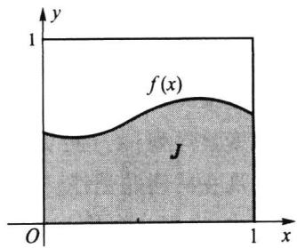
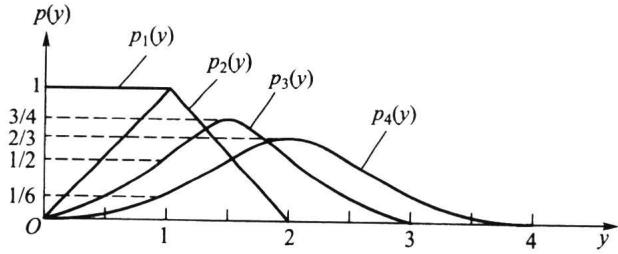
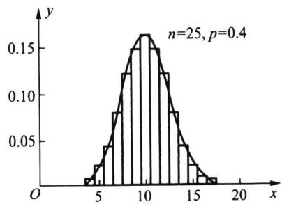

## 4.1随机变量序列的两种收敛性

随机变量序列的收敛性有多种，其中常用的是两种：依概率收敛和按分布收敛.本章讨论的大数定律涉及的是一种依概率收敛，中心极限定理涉及按分布收敛.这些极限定理不仅是概率论研究的中心议题，而且在数理统计中有广泛的应用.本节将给出这两种收敛性的定义及其有关性质，读者应从中吸收其思考问题的方法.

## 4.1.1依概率收敛

在第一章用频率确定概率时，我们提出“概率是频率的稳定值”，或“频率稳定于概率”.现在我们来解释“稳定”的含义及其数学表达式.

设有一大批产品，其不合格品率为p.现一个接一个地检查产品的合格性，记前n $p .$ 次检查发现 $S _ { n }$ 个不合格品，而 $\textstyle v _ { n } = S _ { n } / n$ 为不合格品出现的频率.当检查继续下去，我们就发现频率序列 $\left\{ \upsilon _ { n } \right\}$ 有如下两个现象：

（1）频率 ${ \boldsymbol { v } } _ { n }$ 对概率 $p$ 的绝对偏差 $\mid { v _ { n } - p }$ 将随n增大而呈现逐渐减小的趋势，但无法说它收敛于零.

（2）由于频率的随机性，绝对偏差 $\mid v _ { n } - p$ 1时大时小.虽然我们无法排除大偏差发生的可能性，但随着n不断增大，大偏差发生的可能性会越来越小.这是一种新的极限概念.

下面我们用数学式子将上述概念表达出来.对任意给定的ε>0,事件 $\left\{ \mid v _ { n } - p \mid \geqslant \varepsilon \right\}$ 出现了就认为大偏差发生了.而大偏差发生的可能性越来越小，相当于

$$
P ( \mid v _ { n } - p \mid \geqslant \varepsilon ) \to 0 , ( n \longrightarrow \infty \ ) .
$$

这时就可称频率序列 $\left\{ v _ { n } \right\}$ 依概率收敛.这就是“频率稳定于概率”的含义.

下面给出一般的随机变量序列 $\left\{ \boldsymbol { X } _ { n } \right\}$ 依概率收敛于一个随机变量X的定义.

定义4.1.1 设{X}为一随机变量序列,X为一随机变量,如果对任意的ε>0,有 $\left\{ \boldsymbol { X } _ { n } \right\}$ $\varepsilon > 0$

$$
P ( \mid X _ { n } - X \mid \geqslant \varepsilon ) \to 0 \ ( n \to \infty \ ) ,\tag{4.1.1}
$$

则称序列 $\{ X _ { n } \}$ 依概率收敛于X,记作 $\displaystyle X _ { n } { \xrightarrow { P } } X .$

依概率收敛的含义是：X对X的绝对偏差不小于任一给定量的可能性将随着n $X _ { n }$

增大而愈来愈小.或者说，绝对偏差 $\mid X _ { n } - X \mid$ 小于任一给定量的可能性将随着n增大而愈来愈接近于1，即(4.1.1)等价于

$$
P \left( \ | \ X _ { \ n } - X \mid < \varepsilon \right) \to 1 \ \left( \ n \to \infty \ \right) .
$$

特别当X为退化分布时，即 $P ( X = c ) = 1$ ,则称序列 $\left\{ \left. X _ { n } \right. \right\}$ 依概率收敛于c,即 $\displaystyle X _ { n } { \xrightarrow { P } } c .$

以下我们先给出依概率收敛于常数的四则运算性质.

定理4.1.1设 $\left\{ X _ { n } \right\} , \left\{ Y _ { n } \right\}$ 是两个随机变量序列，a，b是两个常数.如果

$$
X _ { n } \xrightarrow { P } a , \qquad Y _ { n } \xrightarrow { P } b ,
$$

则有：（1） $\displaystyle X _ { n } \pm Y _ { n } \xrightarrow { P } a \pm b$

(2) $\boldsymbol { X } _ { n } \times \boldsymbol { Y } _ { n } \xrightarrow { \textit { P } } \boldsymbol { a } \times \boldsymbol { b }$

(3) $\displaystyle X _ { n } \div Y _ { n } \xrightarrow { P } a \div b ( b \neq 0 )$

证明（1）因为

$$
\{ \mid \left( X _ { n } + Y _ { n } \right) \mathrm { ~ - ~ } ( a + b ) \mid \geqslant \varepsilon \} \subset \left\{ \mid X _ { n } - a \mid \geqslant \frac { \varepsilon } { 2 } \right\} \cup \left\{ \mid Y _ { n } - b \mid \geqslant \frac { \varepsilon } { 2 } \right\} ,
$$

所以

$$
\begin{array} { r l } { 0 \leqslant P ( \mathrm {  ~ \xi ~ } | \mathrm {  ~ ( ~ } X _ { n } \mathrm {  ~ + ~ } Y _ { n } \mathrm {  ~ ) ~ } - \mathrm {  ~ ( ~ } a + b \mathrm {  ~ ) ~ } | \geqslant \varepsilon ) } & { } \\ { \leqslant P \bigg ( \mathrm {  ~ \xi ~ } | X _ { n } - a | \geqslant \frac { \varepsilon } { 2 } \bigg ) + P \bigg ( \mathrm {  ~ \xi ~ } | Y _ { n } - b | \geqslant \frac { \varepsilon } { 2 } \bigg )  0 } & { \mathrm {  ~ ( ~ } n  \infty \mathrm {  ~ ) ~ } , } \end{array}
$$

即

$$
P (  { \mid } ( X _ { n } + Y _ { n } ) - ( a + b )  { \mid } < \varepsilon ) \to 1 \quad ( n \to \infty ) ,
$$

由此得 $\displaystyle X _ { n } + Y _ { n } { \xrightarrow { \quad P \quad } } a + b$ .类似可证 $\displaystyle X _ { n } - Y _ { n } \xrightarrow [ n ] { P } a - b$

（2）为了证明 $\boldsymbol { X } _ { n } \times \boldsymbol { Y } _ { n } \xrightarrow { \boldsymbol { P } } \boldsymbol { a } \times \boldsymbol { b }$ ，我们分几步进行：

i)若 $X _ { n } { \xrightarrow { \quad P \quad } } 0$ ，则有 $X _ { n } ^ { 2 } { \xrightarrow { \cal P } } 0 .$ 这是因为对任意 $\varepsilon { > } 0$ ,有

$$
P (  { \mid } X _ { n } ^ { 2 } \mid \geqslant \varepsilon ) = P (  { \mid } X _ { n } \mid \geqslant \sqrt { \varepsilon } ) \to 0 \quad ( n \to \infty ) .
$$

ii)若 $\displaystyle X _ { n } { \xrightarrow { \quad P \quad } } a$ ，则有 $c X _ { n } \longrightarrow c a$ 这是因为在 $c \neq 0$ 时,有

$$
P (  { \left| \ c X _ { n } - c a \right| } \geqslant \varepsilon ) = P (  { \left| \ X _ { n } - a \right| } \geqslant \varepsilon / | c | ) \to 0 \quad ( n \longrightarrow \infty ) ,
$$

而当 $c = 0$ 时，结论显然成立.

ii）若 $\displaystyle X _ { n } { \xrightarrow { \quad P \quad } } a$ ，则有 $X _ { n } ^ { 2 } \xrightarrow { P } a ^ { 2 }$ .这是因为有以下一系列结论：

$$
X _ { _ { n } } \ - \ a \ { \overset { P } { \longrightarrow } } \ 0 , \qquad \left( X _ { _ { n } } \ - \ a \right) ^ { 2 } \ { \overset { P } { \longrightarrow } } \ 0 , \qquad 2 a ( X _ { _ { n } } \ - \ a ) \ { \overset { P } { \longrightarrow } } \ 0 ,
$$

$$
( X _ { _ { n } } - a ) ^ { 2 } + 2 a ( X _ { _ { n } } - a ) = X _ { _ { n } } ^ { 2 } - a ^ { 2 } { \overset { P } { \longrightarrow } } 0 , \qquad { \mathrm { R J ~ } } X _ { _ { n } } ^ { 2 } { \overset { P } { \longrightarrow } } a ^ { 2 } .
$$

iv）由ii）及（1）知

$$
X _ { n } ^ { 2 } \longrightarrow a ^ { 2 } , \qquad Y _ { n } ^ { 2 } \longrightarrow b ^ { 2 } , \qquad ( X _ { n } + Y _ { n } ) ^ { 2 } \longrightarrow ( a + b ) ^ { 2 } .
$$

从而有

$$
X _ { _ { n } } \times Y _ { _ { n } } = { \frac { 1 } { 2 } } { \big [ } ( X _ { _ { n } } + Y _ { _ { n } } ) ^ { 2 } - X _ { _ { n } } ^ { 2 } - Y _ { _ { n } } ^ { 2 } { \big ] } \ { \overset { P } { \longrightarrow } } \ { \frac { 1 } { 2 } } { \big [ } \left( a + b \right) ^ { 2 } - a ^ { 2 } - b ^ { 2 } { \big ] } \ = a b .
$$

（3）为了证明 $\displaystyle X _ { n } / Y _ { n } \xrightarrow [ n ] { P } a / b$ ,我们先证： $1 / Y _ { n } { \xrightarrow { P } } 1 / b$ 这是因为对任意 $\varepsilon > 0$ ,有

$$
\begin{array} { r l } & { P \Big ( | \displaystyle \frac { 1 } { Y _ { n } } - \displaystyle \frac { 1 } { b } | \geqslant \varepsilon \Big ) = P \Big ( | \displaystyle \frac { Y _ { n } - b } { Y _ { n } b } | \geqslant \varepsilon \Big ) } \\ & { = P \Big ( | \displaystyle \frac { Y _ { n } - b } { b ^ { 2 } + b ( Y _ { n } - b ) } | \geqslant \varepsilon , \big | Y _ { n } - b \big | < \varepsilon \Big ) + P \Big ( | \displaystyle \frac { Y _ { n } - b } { b ^ { 2 } + b ( Y _ { n } - b ) } | \geqslant \varepsilon , \big | Y _ { n } - b \big | \geqslant \varepsilon \Big ) } \\ & { \leqslant P \Big ( \displaystyle \frac { \big | Y _ { n } - b \big | } { b ^ { 2 } - \varepsilon \big | b \big | } \geqslant \varepsilon \Big ) + P ( | Y _ { n } - b | \geqslant \varepsilon ) = P ( | Y _ { n } - b | \geqslant ( b ^ { 2 } - \varepsilon \big | b \big | ) \varepsilon ) + P ( | Y _ { n } - b | \geqslant \varepsilon )  0 ( n  \infty ) . } \end{array}
$$

这就证明了 $1 / Y _ { n } { \xrightarrow { P } } 1 / b$ ，再与 $X _ { n } { \xrightarrow { \quad P \quad } } a$ 结合，利用(2)即得 $X _ { n } / Y _ { n } \xrightarrow [ ] { P } a / b$ 这就完成了全部证明.

由此定理可以看出，随机变量序列在概率意义上的极限（即依概率收敛于常数a）在四则运算下仍然成立.这与数学分析中的数列极限十分类似.类似结论对依概率收敛于X(随机变量)也成立(见习题4.1第2题).

## 4.1.2按分布收敛、弱收敛

我们知道分布函数全面描述了随机变量的统计规律，因此讨论一个分布函数序列$\{ F _ { n } ( x ) \}$ 收敛到一个极限分布函数 $F ( x )$ 是有实际意义的.现在的问题是：如何来定义$\{ F _ { n } ( x )$ }的收敛性呢？很自然地，由于 $\left\{ F _ { _ n } ( x ) \right\}$ 是实变量函数序列，我们的一个猜想是：对所有的x，要求 $F _ { _ n } ( { \boldsymbol { x } } ) { \longrightarrow } F ( { \boldsymbol { x } } ) \ ( n { \longrightarrow } \infty \ )$ 都成立，也即数学分析中的点点收敛.然而遗憾的是，以下例子告诉我们这个要求过严了.

例4.1.1设随机变量序列 $\left\{ { \cal X } _ { n } \right\}$ 服从如下的退化分布

$$
P \left( X _ { n } = { \frac { 1 } { n } } \right) = 1 , \qquad n = 1 , 2 , \cdots ,
$$

它们的分布函数分别为

$$
F _ { n } ( x ) = \left\{ { \begin{array} { l l } { 0 , } & { x < { \frac { 1 } { n } } , } \\ { } \\ { 1 , } & { x \geqslant { \frac { 1 } { n } } . } \end{array} } \right.
$$

首先我们指出：在点点收敛这个要求下， $\{ F _ { n } ( x )$ }的极限函数

$$
\begin{array} { r } { g ( x ) = \left\{ \begin{array} { l l } { 0 , } & { x \leqslant 0 , } \\ { 1 , } & { x > 0 . } \end{array} \right. } \end{array}
$$

不满足右连续性，即 $g ( x )$ 不是一个分布函数.

这说明对分布函数序列 $\{ F _ { n } ( x ) \}$ 而言，要求其点点收敛到一个极限分布函数太苛刻了.如何把点点收敛这要求减弱一些呢？

因为 $\smash {  { F _ { n } } ( x ) }$ 是在点 $x = { \frac { 1 } { n } }$ 处有跳跃，所以当 $n { \longrightarrow } \infty$ 时,跳跃点位置趋于0,于是我们很自然地认为 $\left\{ F _ { n } ( x ) \right\}$ 应该收敛于点 $x = 0$ 处的退化分布，即

$$
F ( x ) = \left\{ { \begin{array} { l l } { 0 , } & { x < 0 , } \\ { 1 , } & { x \geqslant 0 . } \end{array} } \right.
$$

但是，对任意的n,有 $F _ { \mathrm { {  } } } ( \mathrm { { 0 } } ) = 0$ ,而 $F ( 0 ) = 1$ ，所以

$$
\operatorname* { l i m } _ { n  \infty } F _ { n } ( 0 ) = 0 \neq 1 = F ( 0 ) .
$$

从这个例子我们得到启示：收敛关系不成立的点 $x = 0$ 恰好是 $F ( x )$ 的间断点.这就启示我们，可以撇开这些间断点而只考虑 $F ( x )$ 的连续点.这就是以下给出的关于分布函数列的弱收敛定义.

定义4.1.2设随机变量 $X , X _ { 1 } , X _ { 2 } , \cdots$ 的分布函数分别为 $F ( x ) , F _ { 1 } ( x ) , F _ { 2 } ( x ) , \cdots ,$ 若对 $F ( x )$ 的任一连续点x,都有

$$
\operatorname * { l i m } _ { n  \infty } F _ { n } ( x ) = F ( x ) ,\tag{4.1.2}
$$

则称 $\{ F _ { n } ( x ) \}$ 弱收敛于 $F ( x )$ ，记作

$$
F _ { n } ( x ) \xrightarrow { \quad \varnothing } F ( x ) .\tag{4.1.3}
$$

也称相应的随机变量序列 $\left\{ \left. X \right. _ { n } \right\}$ 按分布收敛于X，记作

$$
X _ { n } { \xrightarrow { \ L } } X .\tag{4.1.4}
$$

以上定义的“弱收敛”是自然的，因为它比在每一点上都收敛的要求的确“弱”了些.若 $F ( x )$ 是直线上的连续函数，则弱收敛就是点点收敛.

注意，在上述定义中，分布函数序列 $\left\{ F _ { \mathfrak { n } } ( x ) \right.$ }称为弱收敛，而随机变量序列 $\{ X _ { n } \}$ 则称为按分布收敛，这是在两种不同场合给出的两个不同名称，但其本质含义是一样的，都要求在 $F ( x )$ 的连续点上有（4.1.2）式.

下面的定理说明依概率收敛是一种比按分布收敛更强的收敛性.

定理4.1.2 $X _ { n } { \xrightarrow { \ P } } X \ \Longrightarrow X _ { n } { \xrightarrow { \ L } } X .$

证明设随机变量 $X , X _ { 1 } , X _ { 2 } , \cdots$ 的分布函数分别为 $F ( x ) , F _ { 1 } ( x ) , F _ { 2 } ( x ) , \cdots$ .为证$\displaystyle X _ { n } { \xrightarrow { \ L } } X$ ,相当于证 $F _ { n } \left( x \right) { \xrightarrow { \ W } } F \left( x \right)$ ，所以只需证：对所有的x，有

$$
F ( x - 0 ) \leqslant \operatorname* { l i m } _ { n  \infty } F _ { n } ( x ) \leqslant \operatorname* { l i m } _ { n  \infty } F _ { n } ( x ) \leqslant F ( x + 0 ) .\tag{4.1.5}
$$

因为若上式成立，则当x是 $F ( x )$ 的连续点时，有 $F ( \ x - 0 ) = F ( \ x + 0 )$ ,由此即可得 $\boldsymbol { F } _ { n } ( \boldsymbol { x } )$ $\xrightarrow { W } F ( { \boldsymbol { \mathbf { \mathit { x } } } } )$

为证(4.1.5）式，先令 $x ^ { \prime } < x$ ，则

$$
\begin{array} { c } { { \left\{ X \leqslant x ^ { \prime } \right\} = \left\{ X _ { n } \leqslant x , X \leqslant x ^ { \prime } \right\} \cup \left\{ X _ { n } > x , X \leqslant x ^ { \prime } \right\} } } \\ { { \subset \left\{ X _ { n } \leqslant x \right\} \cup \left\{ \left. X _ { n } - X \right. \geqslant x - x ^ { \prime } \right\} , } } \end{array}
$$

从而有

$$
F ( x ^ { \prime } ) \leqslant F _ { \mathrm { \Large _ { \circ } } } ( x ) + P ( \mathrm { \Large ~ | ~ } X _ { \mathrm { \Large _ { \circ } } } - X \mathrm { \Large ~ | ~ } \geqslant x - x ^ { \prime } ) .
$$

由 $\displaystyle X _ { n } { \xrightarrow { P } } X$ ，得 $P (  { \left| \begin{array} { l l } { X _ { n } - X } \end{array} \right| } \geqslant x - x ^ { \prime } ) \to 0 \ \left( n \to \infty \ \right)$ .所以有

$$
F ( x ^ { \prime } ) \leqslant \varinjlim _ { n  \infty } F _ { n } ( x ) .
$$

再令 $x ^ { \prime } {  } x$ ,即得

$$
F ( x - 0 ) \leqslant \varinjlim _ { n  \infty } F _ { n } ( x ) .
$$

同理可证,当 $x ^ { \prime \prime } { > } x$ 时，有

$$
\operatorname * { l i m } _ { n  \infty } F _ { n } ( x ) \leqslant F \bigl ( x ^ { \prime \prime } \bigr ) .
$$

令 $x ^ { \prime \prime } { \xrightarrow { } } x$ ，即得

$$
\ : \overline { { \operatorname * { l i m } _ { n  \infty } } } F _ { { \bf \Phi } _ { n } } ( x ) \ : \leqslant F ( { \bf \Phi } _ { x } \ : + \ : 0 ) . \ :
$$

这就证明了定理.

注意,以上定理的逆命题不成立,即由按分布收敛无法推出依概率收敛，见下例.

例4.1.2设随机变量X的分布列为

$$
P ( X = - \ 1 ) = { \frac { 1 } { 2 } } , \qquad P ( X = 1 ) = { \frac { 1 } { 2 } } .
$$

令 $X _ { n } = - X$ ，则 $X _ { n }$ 与X同分布,即 $X _ { n }$ 与X有相同的分布函数,故 $\displaystyle X _ { n } { \xrightarrow { \ L } } X .$

但对任意的 $0 < \varepsilon < 2$ ，有

$$
P (  { \left| X _ { n } - X \right| } \geqslant \varepsilon ) = P ( 2  { \left| X \right| } \geqslant \varepsilon ) = 1 \not \prec 0 ,
$$

即 $X _ { n }$ 不依概率收敛于X.

以上例子说明：一般按分布收敛与依概率收敛是不等价的.而下面的定理则说明：当极限随机变量为常数(服从退化分布)时，按分布收敛与依概率收敛是等价的.

定理4.1.3若c为常数，则 $X _ { n } { \xrightarrow { \quad P \quad } } c$ 的充要条件是 $: X , \xrightarrow { L } c$

证明必要性已由定理4.1.2给出，下证充分性.记 $X _ { n }$ 的分布函数为$F _ { n } ( x ) \ , n = 1 , 2 , \cdots$ 因为常数c的分布函数(退化分布）为

$$
F ( x ) = { \binom { 0 , \quad x < c , } { 1 , \quad x \geqslant c . } }
$$

所以对任意的 $\pmb { \varepsilon } { > } 0$ ，有

$$
\begin{array} { r l } & { P ( \mathbf { \Phi } \left| \ X _ { n } { - } c \right| \geqslant \varepsilon ) = P ( X _ { n } \geqslant c { + } \varepsilon ) + P ( X _ { n } \leqslant c { - } \varepsilon ) \leqslant P ( X _ { n } > c { + } \varepsilon / 2 ) + P ( X _ { n } \leqslant c { - } \varepsilon ) } \\ & { \qquad = 1 - F _ { n } \left( c { + } \varepsilon / 2 \right) + F _ { n } ( c { - } \varepsilon ) . } \end{array}
$$

由于 $x = c + \varepsilon / 2$ 和 $x = c - \varepsilon$ 均为 $F ( x )$ 的连续点，且 $F _ { n } \left( x \right) \xrightarrow { \ W } F \left( x \right)$ ，所以当 $n { \longrightarrow } \infty$ 时,有

$$
F _ { n } ( c + \varepsilon / 2 ) \to F ( c + \varepsilon / 2 ) = 1 , \qquad F _ { n } ( c - \varepsilon ) \to F ( c - \varepsilon ) = 0 .
$$

由此得

即 $\displaystyle X _ { n } { \xrightarrow { \quad P \quad } } c .$ 定理证毕.

$$
P (  { \left| \begin{array} { l l } { X } & { - \ c } \end{array} \right| } \geq \varepsilon ) \to 0 .
$$

## 习题4.1

1.如果 $\displaystyle X _ { n } { \xrightarrow { P } } X$ ，且 $X _ { n } { \xrightarrow { \quad P \quad } } Y .$ 试证： $P \left( X = Y \right) = 1$

2.如果 $X _ { n } { \xrightarrow { \overset { P } { } } } X , Y _ { n } { \xrightarrow { \overset { P } { } } } Y$ 试证：

(1） $X _ { n } + Y _ { n } { \xrightarrow { P } } X + Y ;$

(2) $X , Y , { \xrightarrow { P } } X Y .$

3.如果 $\displaystyle X _ { n } \xrightarrow { P } X , g ( { \boldsymbol { x } } )$ 是直线上的连续函数，试证 $g \left( X _ { n } \right) { \overset { P } { \longrightarrow } } g \left( X \right)$

4.如果 $\displaystyle X _ { n } { \xrightarrow { \quad P \quad } } a$ ，则对任意常数 $^ { c , }$ 有

$$
c X _ { n } \longrightarrow c a .
$$

5.试证 $: X , { \xrightarrow { \overset { } { P } } } \quad$ X的充要条件为：当 $n { \longrightarrow } \infty$ 时，有

$$
E { \Bigg ( } { \frac { \mid X _ { n } - X \mid } { 1 + \mid X _ { n } - X \mid } } { \Bigg ) } \to 0 .
$$

6.设D(x）为退化分布：

$$
\begin{array} { r l } { D ( x ) } & { = \left\{ \begin{array} { l l } { 0 , } & { x < 0 , } \\ { 1 , } & { x \geqslant 0 . } \end{array} \right. } \end{array}
$$

试问下列分布函数列的极限函数是否仍是分布函数？（其中 $n = 1 , 2 , \cdots ,$

(1） $\{ D ( x + n ) \mid$ (2） $\left\{ D ( { \boldsymbol { x } } + 1 / n ) \right\}$ (3) $\left\{ D ( { \boldsymbol { x } } { - } 1 / n ) \right\}$

7.设分布函数列 $\{ F _ { n } ( x ) \}$ 弱收敛于连续的分布函数 $\boldsymbol { F } ( \boldsymbol { x } )$ ，试证： $\left\{ \begin{array} { l l }  F _ { n } \left( x \right) \ \right\} \end{array}$ 在 $( - \infty , \infty )$ 上一致收敛于分布函数 $\boldsymbol { F } ( \boldsymbol { x } )$

8.如果 $\displaystyle X _ { n } { \xrightarrow { \ L } } X$ ，且数列 $a _ { n } { \longrightarrow } ~ a , b _ { n } { \longrightarrow } ~ b .$ 试证 $\cdot a _ { n } X _ { n } + b _ { n } \xrightarrow { L } a X + b .$

9.如果 $\ X _ { n } \longrightarrow X , Y _ { n } \longrightarrow a$ ，试证 $\cdot X _ { n } + Y _ { n } \xrightarrow { L } X + a .$

10.如果 $X _ { n } \longrightarrow X , Y _ { n } \longrightarrow 0$ ，试证 $\displaystyle { \cdot \cdot X _ { n } Y _ { n } { \longrightarrow } 0 . }$

11.如果 $\ X _ { n } \longrightarrow X , Y _ { n } \longrightarrow a$ ，且 $Y _ { n } \neq 0$ ，常数 $\begin{array} { r } { \mathbf { \boldsymbol { a } } \neq \mathbf { \boldsymbol { 0 } } . } \end{array}$ 试证 $\displaystyle { \cdot X , \gamma , \xrightarrow [ ] { L } X / a }$

12.设随机变量 $X _ { n }$ 服从柯西分布，其密度函数为

$$
p _ { n } ( x ) = \frac { n } { \pi ( 1 + n ^ { 2 } x ^ { 2 } ) } , \qquad - \infty < x < \infty .
$$

试证： $\displaystyle { X , { \xrightarrow { P } } 0 }$

13.设随机变量序列 $\{ X _ { n } \}$ 独立同分布，其密度函数为

$$
p \left( x \right) \ = \ \left\{ { { \begin{array} { l l } { 1 / \beta , } & { 0 < x < \beta , } \\ { 0 , } & { \sharp \sharp . } \end{array} } } \right.
$$

其中常数 $\beta { > } 0$ ，令 $Y _ { _ n } = \operatorname* { m a x } \left\{ X _ { _ 1 } , X _ { _ 2 } , \cdots , X _ { _ n } \right\}$ ，试证 $Y _ { n } { \xrightarrow { \quad P \quad } } \beta .$

14.设随机变量序列 $\{ X _ { n } \}$ 独立同分布，其密度函数为

$$
p \left( x \right) \ = \ \left\{ \begin{array} { l l } { \mathrm { e } ^ { - \left( x - \alpha \right) } \ , } & { x \geqslant \alpha , } \\ { 0 , } & { x < \alpha . } \end{array} \right.
$$

令 $Y _ { _ n } = \operatorname* { m i n } \{ X _ { 1 } , X _ { 2 } , \cdots , X _ { _ n } \}$ ，试证 $\cdot Y _ { n } { \xrightarrow { \overset { } { P } } } \alpha$

15.设随机变量序列 $\{ X _ { n } \}$ 独立同分布，且 $X _ { i } \sim U ( 0 , 1 )$ .令 $Y _ { n } \ = \ { \biggl ( } \prod _ { i \ = 1 } ^ { n } X _ { i } { \biggr ) } ^ { \frac { 1 } { n } }$ ，试证明 $Y _ { n } { \xrightarrow { \pmb { P } } } c$ 其中c为常数，并求出c.

16.设分布函数列 $\{ F _ { n } ( x ) \}$ 弱收敛于分布函数 $\boldsymbol { F } ( \boldsymbol { x } )$ ，且 $\smash {  { F _ { n } } ( x ) }$ 和 $\pmb { F } ( \pmb { x } )$ 都是连续、严格单调函数，又设服从 $( 0 , 1 )$ 上的均匀分布，试证 $F _ { n } ^ { - 1 } ( \pmb { \xi } ) \xrightarrow { P } F ^ { - 1 } ( \pmb { \xi } )$

17.设随机变量序列 $\{ X , \}$ 独立同分布，数学期望、方差均存在，且 $E \left( { \cal X } _ { n } \right) = \mu .$ 试证：

$$
{ \frac { 2 } { n \left( n + 1 \right) } } \sum _ { k = 1 } ^ { n } k \cdot X _ { k } { \xrightarrow { P } } \mu .
$$

18.设随机变量序列 $\{ X , \}$ 独立同分布，数学期望、方差均存在，且

$$
E ( X _ { n } ) \ = \ 0 , \qquad \mathrm { V a r } ( X _ { n } ) \ = \ \sigma ^ { 2 } .
$$

试证：

$$
{ \frac { 1 } { n } } \sum _ { k \ = \ 1 } ^ { n } X _ { k } ^ { 2 } \longrightarrow \sigma ^ { 2 } .
$$

19.设随机变量序列 $\{ X , \}$ 独立同分布，且 $\operatorname { V a r } ( X _ { n } ) = \sigma ^ { 2 }$ 存在，令

$$
\overline { { { X } } } \ = \ \frac { 1 } { n } \sum _ { i = 1 } ^ { n } X _ { i } , \qquad S _ { n } ^ { 2 } \ = \ \frac { 1 } { n } \sum _ { i = 1 } ^ { n } ( X _ { i } \ - \ \overline { { { X } } } ) ^ { \ 2 } .
$$

试证： $S _ { n } ^ { 2 } \xrightarrow { \cal P } \sigma ^ { 2 }$

20.将n个编号为1至n的球放入n个编号为1至n的盒子中，每个盒子只能放一个球，记

$$
X _ { i } = \left\{ \begin{array} { l l } { { 1 , } } & { { \frac { 4 } { 9 9 } \stackrel { \triangledown } { \cdot } \frac { \partial } { \partial \tau } \lambda \stackrel { \triangledown } { \partial \tau } \frac { \lambda } { \partial \lambda } \hat { \chi } \lambda \stackrel { \triangledown } { \partial \tau } \lambda \stackrel { \triangledown } { \partial \tau } i \stackrel { \triangledown } { \partial \tau } \hat { \Pi } } , }  \\ { { 0 , } } & { { \ddag \left\{ \pmb { \Psi } \right. , } }  \end{array} \right.
$$

$\ S _ { n } \ = \ \sum _ { i \ = 1 } ^ { n } X _ { i }$ ，试证明：

$$
{ \frac { S _ { n } - E ( S _ { n } ) } { n } } { \xrightarrow { P } } 0 .
$$

## 4.2特征函数

设p(x)是随机变量X的密度函数，则 $p ( x )$ 的傅里叶（Fourier)变换是

$$
\varphi ( t ) = \int _ { - \infty } ^ { \infty } \mathrm { e } ^ { \mathrm { i } t x } p ( x ) \mathrm { d } x ,
$$

其中 $\mathrm { i } = \sqrt { - 1 }$ 是虚数单位.由数学期望的概念知， $\varphi \left( t \right)$ 恰好是 $E ( \boldsymbol { \mathrm { \textbf { e } } } ^ { \mathrm { i } t X } )$ .这就是本节要讨论的特征函数,它是处理许多概率论问题的有力工具.它能把寻求独立随机变量和的分布的卷积运算（积分运算)转换成乘法运算，还能把求分布的各阶原点矩（积分运算)转换成微分运算，特别地,它能把寻求随机变量序列的极限分布转换成一般的函数极限问题.下面从特征函数的定义开始介绍它们.

## 4.2.1特征函数的定义

先介绍一下复随机变量的概念.

特征函数除考虑取实数值的随机变量外，还要考虑取复数值的随机变量，后者简称为复随机变量.复随机变量定义为 $Z = Z ( w ) = X ( w ) + \mathrm { i } Y ( w )$ ,其中 $X ( w )$ 与 $Y ( w )$ 是定义在Ω上的实随机变量.而 $\overline { { Z } } ( w ) = X ( w ) - \mathrm { i } Y ( w )$ 称为 $Z ( w )$ 的复共轭随机变量.复随机变量 $Z = X + \mathrm { i } Y$ 的模IZI定义为 $\sqrt { \boldsymbol { X } ^ { 2 } + \boldsymbol { Y } ^ { 2 } }$ ，或 $\begin{array} { r } { | Z | \ ^ { 2 } = X ^ { 2 } + Y ^ { 2 } } \end{array}$ ，且 $\scriptstyle Z \ { \overline { { Z } } } = X ^ { 2 } + Y ^ { 2 } = \mid Z \mid ^ { 2 }$

与随机变量有关的一些概念和定义，一般都可类似地移到复随机变量场合.例如，若随机变量X与Y的数学期望E(X)与E(Y)都存在,则复随机变量 $Z = X + \mathrm { i } Y$ 的数学期望定义为 $E ( Z ) = E ( X ) + \mathrm { i } E ( Y )$ .又如复随机变量 $Z _ { 1 } = X _ { 1 } + \mathrm { i } Y _ { 1 }$ 与 $\begin{array} { r } { Z _ { { \scriptscriptstyle 2 } } = X _ { { \scriptscriptstyle 2 } } + \mathrm { i } Y _ { { \scriptscriptstyle 2 } } } \end{array}$ 相互独立当且仅当 $( X _ { 1 } , Y _ { 1 } )$ 与 $( X _ { _ 2 } , Y _ { _ 2 } )$ 相互独立 $( \mathbf { \Psi } (  { \boldsymbol { X } } _ { 1 } ,  { \boldsymbol { Y } } _ { 1 } ,  { \boldsymbol { X } } _ { 2 } ,  { \boldsymbol { Y } } _ { 2 } )$ 的联合分布 $F _ { \chi _ { 1 } , Y _ { 1 } , \chi _ { 2 } , Y _ { 2 } } ( \textbf { \em x } _ { 1 } , y _ { 1 } , x _ { 2 }$ $y _ { 2 } )$ 等于其边际分布 $F _ { x _ { 1 } , Y _ { 1 } } \left( \begin{array} { l } { x _ { 1 } , y _ { 1 } } \end{array} \right)$ 和 $F _ { \chi _ { _ 2 } , \gamma _ { 2 } } \left( \begin{array} { c c } { { x _ { 2 } , y _ { _ 2 } } } \end{array} \right)$ 的乘积）.在欧拉公式 ${ \mathbf e } ^ { \mathrm { i } X } =$ $\cos \ X + \mathrm { i } \ \sin$ X中若X是实随机变量，则 $E \left( \textbf { e } ^ { \mathrm { i } X } \right) = E \left( \cos \ X \right) + \mathrm { i } E \left( \sin \ X \right)$ ，其模 $\vert \mathrm { e } ^ { \mathrm { i } \boldsymbol { X } } \vert =$ $\sqrt { \cos ^ { 2 } X + \sin ^ { 2 } X } = 1$ .若X与Y独立，则 $\mathbf { e } ^ { \mathrm { i } \boldsymbol { X } }$ 与 $\mathbf { e } ^ { \mathrm { i } Y }$ 也独立.

下面我们给出特征函数的定义.

定义4.2.1设X是一个随机变量，称

$$
\varphi \left( t \right) = E \left( \mathrm { e } ^ { \mathrm { i } t X } \right) , \qquad - \infty < t < \infty ,\tag{4.2.1}
$$

为X的特征函数.

因为 $\left| \textrm { e } ^ { \mathrm { i } t X } \right| = 1$ ，所以 $E ( \mathrm { ~ e ~ } ^ { \mathrm { i } t X } )$ 总是存在的，即任一随机变量的特征函数总是存在的.当离散随机变量X的分布列为 $p _ { k } = P \left( \ X = x _ { k } \right) , k = 1 , 2 , \cdots$ ，则X的特征函数为

$$
\varphi ( t ) = \sum _ { k = 1 } ^ { \infty } \mathrm { e } ^ { \mathrm { i } t x _ { k } } p _ { k } , \qquad - \infty < t < \infty .\tag{4.2.2}
$$

当连续随机变量X的密度函数为 $p ( x )$ ，则X的特征函数为

$$
\varphi ( t ) = \int _ { - \infty } ^ { \infty } \mathrm { e } ^ { \mathrm { i } t x } p ( x ) \mathrm { d } x , \qquad - \infty < t < \infty .\tag{4.2.3}
$$

与随机变量的数学期望、方差及各阶矩一样，特征函数只依赖于随机变量的分布，分布相同则特征函数也相同，所以我们也常称为某分布的特征函数.

例4.2.1常用分布的特征函数（一）

（1）单点分布 $P ( X = a ) = 1$ ,其特征函数为

$$
\varphi ( t ) = \mathrm { e } ^ { \mathrm { i } t a } .
$$

(2）0-1分布 $P ( \ X = x ) = p ^ { x } ( \ 1 - p ) ^ { 1 - x } , x = 0 , 1$ ,其特征函数为

$$
\varphi ( t ) = p \mathrm { e } ^ { \mathrm { i } t } + q , \qquad \ncong \mathrm { i } \oplus q = 1 - p .
$$

（3）泊松分布P(入） $P ( X = k ) = { \frac { \lambda ^ { k } } { k ! } } \mathrm { e } ^ { - \lambda } , k = 0 , 1 , \cdots$ ,其特征函数为

$$
\varphi \left( t \right) = \sum _ { k = 0 } ^ { \infty } \mathrm { e } ^ { \mathrm { i } k t } \frac { \lambda ^ { k } } { k ! } \mathrm { e } ^ { - \lambda } = \mathrm { e } ^ { - \lambda } \mathrm { e } ^ { \lambda \mathrm { e } ^ { \mathrm { i } t } } = \mathrm { e } ^ { \lambda \left( \mathrm { e } ^ { \mathrm { i } t } - 1 \right) } .
$$

（4）均匀分布 $U ( a , b )$ 因为密度函数为

$$
p ( x ) = \left\{ { \begin{array} { l l } { \displaystyle { \frac { 1 } { b \mathrm { ~ - ~ } a } } , } & { a < x < b , } \\ { 0 , } & { \sharp \nmid \mathrm { ~ + ~ } \ell , } \end{array} } \right.
$$

所以其特征函数为

$$
\varphi \left( t \right) = \int _ { a } ^ { b } \frac { \mathrm { e } ^ { \mathrm { i } t x } } { b \mathrm { ~ - ~ } a } \mathrm { d } x = \frac { \mathrm { e } ^ { \mathrm { i } b t } \mathrm { ~ - ~ } \mathrm { e } ^ { \mathrm { i } a t } } { \mathrm { i } t ( b \mathrm { ~ - ~ } a ) } .
$$

（5）标准正态分布N（0，1）因为密度函数为

$$
p \left( x \right) = \frac { 1 } { \sqrt { 2 \pi } } \mathrm { e } ^ { - \frac { x ^ { 2 } } { 2 } } , \qquad - \infty < x < \infty ,
$$

所以其特征函数为

$$
\varphi \left( t \right) = \frac { 1 } { \sqrt { 2 \pi } } \int _ { - \infty } ^ { \infty } \mathrm { e } ^ { \mathrm { i } \pi } \mathrm { e } ^ { - \frac { \mathrm { e } ^ { 2 } } { 2 } } \mathrm { d } x = \frac { 1 } { \sqrt { 2 \pi } } \int _ { - \infty } ^ { \infty } \sum _ { n = 0 } ^ { \infty } \frac { \left( \mathrm { i } t x \right) ^ { n } } { n ! } \mathrm { e } ^ { - \frac { \mathrm { e } ^ { 2 } } { 2 } } \mathrm { d } x = \sum _ { n = 0 } ^ { \infty } \frac { \left( \mathrm { i } t \right) ^ { n } } { n ! } \bigg [ \frac { 1 } { \sqrt { 2 \pi } } \int _ { - \infty } ^ { \infty } x ^ { n } \mathrm { e } ^ { - \frac { \mathrm { e } ^ { 2 } } { 2 } } \mathrm { d } x \bigg ] \mathrm { ~ , ~ }
$$

上式中方括号内正是标准正态分布的n阶矩 $E ( X ^ { n } )$ .当n为奇数时 $E \left( \boldsymbol { X } ^ { n } \right) = 0$ ；当n为偶数时，如 $n = 2 m$ 时，

$$
E ( X ^ { n } ) = E ( X ^ { 2 m } ) = \left( 2 m - 1 \right) ! ! \ = { \frac { \left( 2 m \right) ! } { 2 ^ { m } \ \cdot \ m ! } } ,
$$

代回原式，可得标准正态分布的特征函数

$$
\varphi \left( t \right) = \sum _ { m = 0 } ^ { \infty } { \frac { \left( { \mathrm { i } } t \right) ^ { 2 m } } { \left( 2 m \right) ! } } \cdot { \frac { \left( 2 m \right) ! } { 2 ^ { m } \cdot m ! } } = \sum _ { m = 0 } ^ { \infty } \left( - { \frac { t ^ { 2 } } { 2 } } \right) ^ { m } { \frac { 1 } { m ! } } = { \mathrm { e } } ^ { - { \frac { t ^ { 2 } } { 2 } } }
$$

有了标准正态分布的特征函数，再利用下节给出的特征函数的性质,就很容易得到一般正态分布 $N ( \mu , \sigma ^ { 2 } )$ 的特征函数，见例4.2.2.

（6）指数分布 $E x p ( \lambda )$ 因为密度函数为

$$
p ( x ) = \left\{ { \begin{array} { l l } { \lambda \mathrm { e } ^ { - \lambda x } , } & { x \geqslant 0 , } \\ { 0 , } & { x < 0 , } \end{array} } \right.
$$

所以其特征函数为

$$
\begin{array} { l } { { \displaystyle \varphi ( t ) = \int _ { 0 } ^ { \infty } \mathrm { e } ^ { \mathrm { i } \varepsilon } \lambda \mathrm { e } ^ { - \lambda x } \mathrm { d } x = \lambda \left[ \int _ { 0 } ^ { \infty } \cos ( t x ) \mathrm { e } ^ { - \lambda x } \mathrm { d } x \mathrm { ~ + ~ } \mathrm { i } \int _ { 0 } ^ { \infty } \sin ( t x ) \mathrm { e } ^ { - \lambda x } \mathrm { d } x \right] } } \\ { { \displaystyle \qquad = \lambda \left( \frac \lambda { \lambda ^ { 2 } + t ^ { 2 } } + \mathrm { i } \frac { t } { \lambda ^ { 2 } + t ^ { 2 } } \right) = \left( 1 - \frac { \mathrm { i } t } { \lambda } \right) ^ { - 1 } . } } \end{array}
$$

以上积分中用到了复变函数中的欧拉公式 $\mathrm { e } ^ { \mathrm { i } t x } = \cos \left( t x \right) + \mathrm { i } \ \sin \left( { t x } \right)$

## 4.2.2特征函数的性质

现在我们来研究特征函数的一些性质，其中 $\varphi _ { \chi } \left( t \right)$ 表示X的特征函数，其他类似.

性质4.2.1 $\mid \varphi ( t ) \mid \leqslant \varphi ( 0 ) = 1$

(4.2.4)

性质4.2.2 $\varphi \left( { - t } \right) = \varphi \left( { t } \right)$ ，其中 $\varphi ( t )$ 表示 $\varphi ( t )$ 的共轭.

(4.2.5)

性质4.2.3若 $Y = a X + b$ ,其中a,b是常数，则

$$
\varphi _ { Y } ( t ) = \operatorname { e } ^ { \mathrm { i } b t } \varphi _ { X } ( a t ) .\tag{4.2.6}
$$

性质4.2.4独立随机变量和的特征函数为每个随机变量的特征函数的积，即设X与Y相互独立，则

$$
\varphi _ { x + Y } ( t ) = \varphi _ { x } ( t ) \varphi _ { Y } ( t ) .\tag{4.2.7}
$$

性质4.2.5若 $E ( X ^ { l } )$ 存在，则X的特征函数 $\varphi ( t )$ 可l次求导，且对 $1 \leqslant k \leqslant l$ ,有

$$
{ \varphi ^ { ( k ) } } ( 0 ) = \mathrm { i } ^ { k } E ( X ^ { k } ) .\tag{4.2.8}
$$

上式提供了一条求随机变量的各阶矩的途径,特别可用下式去求数学期望和方差.

$$
E ( X ) = \frac { \varphi ^ { \prime } ( 0 ) } { \mathrm { i } } , \qquad \mathrm { V a r } ( X ) = - \varphi ^ { \prime \prime } ( 0 ) + ( \varphi ^ { \prime } ( 0 ) ) ^ { 2 } .\tag{4.2.9}
$$

证明在此我们仅对连续场合进行证明,而在离散场合的证明是类似的.

$$
( 1 ) \ | \ \varphi ( t ) \ | = \ | \int _ { - \infty } ^ { \infty } \mathrm { e } ^ { i x } p ( x ) \mathrm { d } x | \leqslant \int _ { - \infty } ^ { \infty } | \mathrm { e } ^ { i x } | p ( x ) \mathrm { d } x  = \int _ { - \infty } ^ { \infty } p ( x ) \mathrm { d } x = \varphi ( 0 ) = 1 .
$$

(2) $\varphi \left( - \ t \right) = \int _ { - \infty } ^ { \infty } \mathrm { e } ^ { - \mathrm { i } t x } p \left( x \right) \mathrm { d } x = \int _ { - \infty } ^ { \infty } \mathrm { e } ^ { \mathrm { i } t x } p \left( x \right) \mathrm { d } x = \overline { { \varphi \left( t \right) } } .$

(3） $\varphi _ { Y } ( t ) = E ( \mathrm { e } ^ { \mathrm { i } t ( a X + b ) } ) = \mathrm { e } ^ { \mathrm { i } b t } E ( \mathrm { e } ^ { \mathrm { i } a t X } ) = \mathrm { e } ^ { \mathrm { i } b t } \varphi _ { \chi } ( a t )$

（4）因为X与Y相互独立，所以 $\mathbf { e } ^ { \mathrm { i } t \boldsymbol { X } }$ 与 $\mathbf { e } ^ { \mathrm { i } t Y }$ 也是独立的,从而有

$$
E ( { \bf e } ^ { \mathrm { i } t ( X + Y ) } ) = E ( { \bf e } ^ { \mathrm { i } t X } { \bf e } ^ { \mathrm { i } t Y } ) = E ( { \bf e } ^ { \mathrm { i } t X } ) E ( { \bf e } ^ { \mathrm { i } t Y } ) = \varphi _ { X } ( t ) \cdot \varphi _ { Y } ( t ) .
$$

（5）因为 $E ( X ^ { l } )$ 存在，也就是

$$
\int _ { - \infty } ^ { \infty } { \mid } x { \mid } ^ { l } p ( x ) \mathrm { d } x < \infty ,
$$

于是含参变量t的广义积分 $\int _ { \mathrm { ~ - ~ } \infty } ^ { \infty } \mathrm { e } ^ { \mathrm { i } t x } p ( x ) \mathrm { d } x$ 可以对t求导l次，于是对 $0 \leqslant k \leqslant l$ ，有

$$
\varphi ^ { ( k ) } \left( t \right) = \int _ { - \infty } ^ { \infty } \mathrm { i } ^ { k } x ^ { k } \mathrm { e } ^ { \mathrm { i } t x } p \left( x \right) \mathrm { d } x = \mathrm { i } ^ { k } E ( X ^ { k } \mathrm { e } ^ { \mathrm { i } t X } ) \mathrm { , }
$$

令 $\scriptstyle t = 0$ 即得

$$
{ \varphi ^ { ( k ) } } ( 0 ) = \mathrm { i } ^ { k } E ( X ^ { k } ) .
$$

至此上述5条性质全部得证.

下例是利用性质4.2.3和性质4.2.4来求另一些常用分布的特征函数.

例4.2.2 常用分布的特征函数（二）

（1）二项分布 $b ( \boldsymbol { n } , \boldsymbol { p } )$ 设随机变量 $Y \sim b \left( n , p \right)$ ，则 $Y = X _ { 1 } + X _ { 2 } + \cdots + X _ { n }$ ,其中诸 $X _ { i }$ 是相互独立同分布的随机变量，且 $X _ { i } \sim b ( 1 , p )$ .由例4.2.1（2）知

$$
\varphi _ { X _ { i } } ( t ) = p \mathrm { e } ^ { \mathrm { i } t } + q .
$$

所以由独立随机变量和的特征函数为特征函数的积，得

$$
\varphi _ { Y } ( t ) = ( p \mathrm { e } ^ { \mathsf { i } t } + q ) ^ { n } .
$$

（2）正态分布 $N ( \mu , \sigma ^ { 2 } )$ 设随机变量 $Y \sim N ( \mu , \sigma ^ { 2 } )$ ，则 $X = \left( \mathbf { \nabla } Y - \pmb { \mu } \right) / \pmb { \sigma } \sim N ( \mathbf { 0 } , 1 )$ .由例4.2.1知

$$
\varphi _ { \chi } ( t ) = \mathrm { e } ^ { - \frac { t ^ { 2 } } { 2 } } .
$$

所以由 $Y = \sigma X + \mu$ 和性质4.2.3得

$$
\varphi _ { Y } ( t ) = \varphi _ { \sigma X + \mu } ( t ) = \operatorname { e } ^ { \mathsf { i } \mu t } \varphi _ { X } ( \sigma t ) = \exp \left\{ \mathsf { i } \mu t - { \frac { \sigma ^ { 2 } t ^ { 2 } } { 2 } } \right\} .
$$

（3）伽马分布 $G a ( n , \lambda )$ 设随机变量 $Y \sim G a \left( n , \lambda \right)$ ，则 $Y = X _ { 1 } + X _ { 2 } + \cdots + X _ { n }$ ,其中 $X _ { i }$ 独立同分布，且 $X _ { i } \sim E x p ( \lambda )$ .由例4.2.1知

$$
\varphi _ { \chi _ { i } } ( t ) = \left( 1 - \frac { \mathrm { i } t } { \lambda } \right) ^ { - 1 } .
$$

所以由独立随机变量和的特征函数为特征函数的积，得

$$
\varphi _ { Y } ( t ) = { \big ( } \varphi _ { X _ { 1 } } ( t ) { \big ) } ^ { n } = { \Bigg ( } 1 - { \frac { \mathrm { i } t } { \lambda } } { \Bigg ) } ^ { - n } .
$$

进一步，当 $\pmb { \alpha }$ 为任一正实数时，我们可得 $G a ( \alpha , \lambda )$ 分布的特征函数为

$$
\varphi ( t ) = \left( 1 - \frac { \mathrm { i } t } { \lambda } \right) ^ { - \alpha } .
$$

(4) $\chi ^ { 2 } ( n )$ 分布因为 $\chi ^ { 2 } ( n ) = G a \left( n / 2 , 1 / 2 \right)$ ，所以 $\chi ^ { 2 } ( n )$ 分布的特征函数为

$$
\varphi ( t ) = ( 1 - 2 \mathrm { i } t ) \ O ^ { - n / 2 } .
$$

上述常用分布的特征函数汇总在表4.2.1中.

表4.2.1常用分布的特征函数
<table><tr><td rowspan=1 colspan=1>分布</td><td rowspan=1 colspan=1>分布列 $p _ { k }$ 或分布密度 $p ( x )$ </td><td rowspan=1 colspan=1>特征函数 $\varphi ( t )$ </td></tr><tr><td rowspan=1 colspan=1>单点分布</td><td rowspan=1 colspan=1> $P ( X = a ) = 1 .$ </td><td rowspan=1 colspan=1> $\mathrm { e } ^ { \mathrm { i } t a }$ </td></tr><tr><td rowspan=1 colspan=1>0-1分布</td><td rowspan=1 colspan=1> $p _ { k } = { p ^ { k } q ^ { 1 - k } , q } = 1 - p , k = 0 , 1 .$ </td><td rowspan=1 colspan=1> $p e ^ { " t } { + q }$ </td></tr><tr><td rowspan=1 colspan=1>二项分布 $b ( \boldsymbol { n } , p )$ </td><td rowspan=1 colspan=1> $p _ { k } = { \binom { n } { k } } \ p ^ { k } q ^ { n - k } , \quad k = 0 , 1 , \cdots , n .$ </td><td rowspan=1 colspan=1> $( p \mathrm { e } ^ { \mathrm { i } t } + q ) ^ { n }$ </td></tr><tr><td rowspan=1 colspan=1>泊松分布 $P ( \lambda )$ </td><td rowspan=1 colspan=1> $p _ { k } = { \frac { \lambda ^ { k } } { k ! } } \mathrm { e } ^ { - \lambda } , \quad k = 0 , 1 , \cdots .$ </td><td rowspan=1 colspan=1> $\mathrm { e } ^ { \lambda ( \mathrm { e } ^ { \mathrm { i } t } - 1 ) }$ </td></tr><tr><td rowspan=1 colspan=1>几何分布 $G e ( p )$ </td><td rowspan=1 colspan=1> $p _ { k } = p q ^ { k - 1 } , \quad k = 1 , 2 , \cdots .$ </td><td rowspan=1 colspan=1> $p / ( \mathrm { ~ 1 - q e ~ } ^ { \ast } )$ </td></tr><tr><td rowspan=1 colspan=1>负二项分布 $N b ( r , p )$ </td><td rowspan=1 colspan=1> $p _ { k } = { \binom { k - 1 } { r - 1 } } p ^ { \prime } q ^ { k - r } , \quad k = r , r + 1 , \cdots .$ </td><td rowspan=1 colspan=1> $\left( \frac { p } { 1 - q \mathrm { e } ^ { \mathrm { i } t } } \right) ^ { \prime }$ </td></tr><tr><td rowspan=1 colspan=1>均匀分布 $U ( a , b )$ </td><td rowspan=1 colspan=1> $p \left( \begin{array} { l } { x } \end{array} \right) = \frac { 1 } { b - a } , \quad a < x < b .$ </td><td rowspan=1 colspan=1> $\frac { \mathrm { e } ^ { \mathrm { i } b t } - \mathrm { e } ^ { \mathrm { i } a t } } { \mathrm { i } t ( b - a ) }$ </td></tr><tr><td rowspan=1 colspan=1>正态分布 $N ( \mu , \sigma ^ { 2 } )$ </td><td rowspan=1 colspan=1> $p \left( x \right) = \frac { 1 } { \sqrt { 2 \pi } \sigma } \exp \Biggl \{ - \frac { \left( x - \mu \right) ^ { 2 } } { 2 \sigma ^ { 2 } } \Biggr \}$ </td><td rowspan=1 colspan=1> $\exp \biggl ( \mathrm { i } \mu t - { \frac { \sigma ^ { 2 } t ^ { 2 } } { 2 } } \biggr )$ </td></tr><tr><td rowspan=1 colspan=1>指数分布 $E x p ( \lambda )$ </td><td rowspan=1 colspan=1> $p ( \boldsymbol { x } ) = \lambda \mathrm { e } ^ { - \lambda x } , \quad \boldsymbol { x } \geq 0 .$ </td><td rowspan=1 colspan=1> $\left( 1 - \frac { \mathrm { i } t } { \lambda } \right) ^ { - 1 }$ </td></tr><tr><td rowspan=1 colspan=1>伽马分布 $G a ( \alpha , \lambda )$ </td><td rowspan=1 colspan=1> $p \left( x \right) = \frac { \lambda ^ { \alpha } } { \Gamma \left( \alpha \right) } x ^ { \alpha - 1 } \mathrm { e } ^ { - \lambda x } , \quad x \geqslant 0 .$ </td><td rowspan=1 colspan=1> $\left( 1 - \frac { \mathrm { i } t } { \lambda } \right) ^ { - \alpha }$ </td></tr><tr><td rowspan=1 colspan=1> $\chi ^ { 2 } ( n )$ 分布</td><td rowspan=1 colspan=1> $p \left( x \right) = \frac { x ^ { n / 2 - 1 } \mathrm { e } ^ { - x / 2 } } { \Gamma \left( n / 2 \right) 2 ^ { n / 2 } } , \quad x \geqslant 0 .$ </td><td rowspan=1 colspan=1> $( 1 - 2 \mathrm { i } t ) ^ { - n / 2 }$ </td></tr><tr><td rowspan=2 colspan=1>贝塔分布 $B e ( a , b )$ </td><td rowspan=2 colspan=1> $p \left( x \right) = \frac { \Gamma \left( a + b \right) } { \Gamma \left( a \right) \Gamma \left( b \right) } x ^ { a - 1 } \left( 1 - x \right) ^ { b - 1 }$     $0 < x < 1$ </td><td rowspan=1 colspan=1>r(a+b）（it）T(a+）</td></tr><tr><td rowspan=1 colspan=1>Γ(a)≌0k!Γ(a+b+k)Γ(k+1）</td></tr><tr><td rowspan=1 colspan=1>柯西分布 $\mathrm { C a u } ( 0 , 1 )$ </td><td rowspan=1 colspan=1> $p \left( \begin{array} { l } { x } \end{array} \right) = \frac { 1 } { \pi \left( \begin{array} { l } { 1 + x ^ { 2 } } \end{array} \right) } , \quad - \infty \ < x < \infty$ </td><td rowspan=1 colspan=1> $\mathbf { e } ^ { - | t | }$ </td></tr></table>

下例是利用性质4.2.5来求分布的数学期望和方差.  
例4.2.3利用特征函数的方法求伽马分布 $G a ( \alpha , \lambda )$ 的数学期望和方差.

解因为伽马分布 $G a ( \alpha , \lambda )$ 的特征函数及其一、二阶导数为

$$
\varphi ( t ) = \left( 1 - \frac { \mathrm { i } t } { \lambda } \right) ^ { - \alpha } ,
$$

$$
\varphi ^ { \prime } ( t ) = { \frac { \alpha \mathrm { i } } { \lambda } } { \bigg ( } 1 - { \frac { \mathrm { i } t } { \lambda } } { \bigg ) } ^ { - \alpha - 1 } , \quad \varphi ^ { \prime } ( 0 ) = { \frac { \alpha \mathrm { i } } { \lambda } } ,
$$

$$
\varphi ^ { \prime \prime } ( t ) = { \frac { \alpha ( \alpha + 1 ) \operatorname { i } ^ { 2 } } { \lambda ^ { 2 } } } { \bigg ( } 1 - { \frac { \operatorname { i } t } { \lambda } } { \bigg ) } ^ { - \alpha - 2 } , \quad \varphi ^ { \prime \prime } ( 0 ) = - { \frac { \alpha ( \alpha + 1 ) } { \lambda ^ { 2 } } } ,
$$

所以由（4.2.9）式得

$$
\begin{array} { r l } & { \displaystyle E ( X ) = \frac { \varphi ^ { \prime } ( 0 ) } { \mathrm { i } } = \frac { \alpha } { \lambda } , } \\ & { \displaystyle \mathrm { V a r } ( X ) = - \varphi ^ { \prime \prime } ( 0 ) + \big ( \varphi ^ { \prime } ( 0 ) \big ) ^ { 2 } = \frac { \alpha \big ( \alpha + 1 \big ) } { \lambda ^ { 2 } } + \bigg ( \frac { \alpha \mathrm { i } } { \lambda } \bigg ) ^ { 2 } } \\ & { \quad \quad \quad = \frac { \alpha \big ( \alpha + 1 \big ) } { \lambda ^ { 2 } } - \frac { \alpha ^ { 2 } } { \lambda ^ { 2 } } = \frac { \alpha } { \lambda ^ { 2 } } . } \end{array}
$$

特征函数还有以下一些优良性质.

定理4.2.1（一致连续性）随机变量X的特征函数 $\varphi ( t )$ 在 $( - \infty , \infty )$ 上一致连续.

证明设X是连续随机变量（离散随机变量的证明是类似的），其密度函数为$p ( x )$ ，则对任意实数t,h和正数 $a > 0$ ，有

$$
\begin{array} { r l } { \displaystyle | \varphi ( t + h ) - \varphi ( t ) | = } & { \bigg | \int _ { - \infty } ^ { \infty } ( \mathrm { e } ^ { \mathrm { i } h x } - 1 ) \mathrm { e } ^ { \mathrm { i } x } p ( x ) \mathrm { d } x \bigg | } \\ { \displaystyle } & { \leqslant \int _ { - \infty } ^ { \infty } | \mathrm { e } ^ { \mathrm { i } h x } - 1 | p ( x ) \mathrm { d } x } \\ { \displaystyle } & { \leqslant \int _ { - a } ^ { a } | \mathrm { e } ^ { \mathrm { i } h x } - 1 | p ( x ) \mathrm { d } x + 2 \int _ {  x  \geqslant a } p ( x ) \mathrm { d } x .  } \end{array}
$$

对任意的 $\varepsilon { > } 0$ ，先取定一个充分大的a，使得

$$
2 \int _ { \stackrel { . } { x } } p \big ( { x } \big ) \mathrm { d } { x } < \frac { \varepsilon } { 2 } ,
$$

然后对任意的 $x \in \left[ - a , a \right]$ ，只要取 $\delta = \frac { \varepsilon } { 2 a }$ ，则当 $\mid h \mid < \delta$ 时,便有

$$
\left| \textrm { e } ^ { \mathrm { i } k x } - 1 \right| = \ \left| \textrm { e } ^ { \mathrm { i } \frac { h } { 2 } x } \big ( \textrm { e } ^ { \mathrm { i } \frac { h } { 2 } x } - \textrm { e } ^ { - \mathrm { i } \frac { h } { 2 } x } \big ) \left| = 2 \right| \sin \frac { h x } { 2 } \right| \leqslant 2 \left| \frac { h x } { 2 } \right| \leqslant h a \ < \ \frac { \varepsilon } { 2 } .
$$

从而对所有的 $t \in \left( - \infty , \infty \right)$ ，有

$$
\big | \varphi ( t + h ) - \varphi ( t ) \big | < \int _ { - a } ^ { a } \frac { \varepsilon } { 2 } p ( x ) \mathrm { d } x + \frac { \varepsilon } { 2 } \leqslant \varepsilon ,
$$

即 $\varphi ( t )$ 在 $( - \infty , \infty )$ 上一致连续.

定理4.2.2（非负定性）随机变量X的特征函数 $\varphi \left( t \right)$ 是非负定的，即对任意正整数n及n个实数 $t _ { 1 } , t _ { 2 } , \cdots , t _ { n }$ 和n个复数 $z _ { 1 } , z _ { 2 } , \cdots , z _ { n }$ ，有

$$
\sum _ { k = 1 } ^ { n } \sum _ { j = 1 } ^ { n } \varphi \big ( t _ { k } - t _ { j } \big ) z _ { k } \overline { { z _ { j } } } \geqslant 0 .\tag{4.2.10}
$$

证明仍设X是连续随机变量（离散随机变量的证明是类似的），其密度函数为$p ( x )$ ，则有

$$
\begin{array} { r l } { \displaystyle \sum _ { k = 1 } ^ { n } \displaystyle \sum _ { j = 1 } ^ { n } \varphi \left( t _ { k } - t _ { j } \right) z _ { k } \overline { z _ { j } } = \displaystyle \sum _ { k = 1 } ^ { n } \displaystyle \sum _ { j = 1 } ^ { n } z _ { k } \overline { z _ { j } } \Bigg | _ { - \infty } ^ { \infty } \mathrm { e } ^ { \mathrm { i } ( t _ { k } - t _ { j } ) x } p \left( x \right) \mathrm { d } x } & { } \\ { = \displaystyle \int _ { - \infty } ^ { \infty } \displaystyle \sum _ { k = 1 } ^ { n } \displaystyle \sum _ { j = 1 } ^ { n } z _ { k } \overline { z _ { j } } \mathrm { e } ^ { - \mathrm { i } ( t _ { k } - t _ { j } ) x } p \left( x \right) \mathrm { d } x } & { } \\ { = \displaystyle \int _ { - \infty } ^ { \infty } \left( \displaystyle \sum _ { k = 1 } ^ { n } z _ { k } \mathrm { e } ^ { \mathrm { i } t _ { k } x } \right) \left( \displaystyle \sum _ { j = 1 } ^ { n } z _ { j } \mathrm { e } ^ { - \mathrm { i } t _ { j } } \right) p \left( x \right) \mathrm { d } x } & { } \end{array}
$$

$$
= \int _ { - \infty } ^ { \infty } { \bigg | } \sum _ { k = 1 } ^ { n } z _ { k } \mathrm { e } ^ { \mathrm { i } t _ { k } x } { \bigg | } ^ { 2 } p \left( x \right) \mathrm { d } x \geqslant 0 .
$$

这就证明了（4.2.10)式.

## 4.2.3特征函数唯一决定分布函数

由特征函数的定义可知，随机变量的分布唯一地确定了它的特征函数.前面的讨论实际上都是从随机变量的分布出发，讨论特征函数及其性质.要注意的是：如果两个分布的数学期望、方差及各阶矩都相等，也无法证明此两个分布相等.但特征函数却不同，它有着比数学期望、方差及各阶矩更优良的性质：即特征函数完全决定了分布，也就是说，两个分布函数相等当且仅当它们所对应的特征函数相等.下面来讨论这个问题.

定理4.2.3（逆转公式）设 $\boldsymbol { F } ( \boldsymbol { x } )$ 和 $\varphi ( t )$ 分别为随机变量X的分布函数和特征函数，则对 $F ( x )$ 的任意两个连续点 $\boldsymbol { x } _ { 1 } < \boldsymbol { x } _ { 2 }$ ，有

$$
F ( x _ { 2 } ) \ - \ F ( x _ { 1 } ) = \operatorname* { l i m } _ { T \to \infty } { \frac { 1 } { 2 \pi } } { \int _ { - T } ^ { T } { \frac { \mathrm { e } ^ { - \mathrm { i } t x _ { 1 } } \ - \ \mathrm { e } ^ { - \ \mathrm { i } t x _ { 2 } } } { \ \mathrm { i } t } } \varphi ( t ) \mathrm { d } t } .\tag{4.2.11}
$$

证明设X是连续随机变量（离散随机变量的证明是类似的），其密度函数为$\pmb { p } ( \pmb { x } )$ .记

$$
J _ { \tau } = \frac { 1 } { 2 \pi } \int _ { - \tau } ^ { \tau } \frac { \mathrm { e } ^ { - \mathrm { i } \kappa _ { 1 } } - \mathrm { e } ^ { - \mathrm { i } \kappa _ { 2 } } } { \mathrm { i } t } \varphi ( t ) \mathrm { d } t = \frac { 1 } { 2 \pi } \int _ { - \tau } ^ { \tau } \left[ \int _ { - \infty } ^ { \infty } \frac { \mathrm { e } ^ { - \mathrm { i } \kappa _ { 1 } } - \mathrm { e } ^ { - \mathrm { i } \kappa _ { 2 } } } { \mathrm { i } t } \mathrm { e } ^ { \mathrm { i } \kappa _ { p } } ( x ) \mathrm { d } x \right] \mathrm { d } t .
$$

对任意的实数 $^ { a }$ ,有

$$
\left| \textrm { e } ^ { i a } - 1 \right| \leqslant \left| \ a \right| ,
$$

事实上，对 $a \geqslant 0$ 有

$$
\left| \mathrm { e } ^ { \mathrm { i } a } - 1 \right| = \ \left| \int _ { 0 } ^ { a } \mathrm { e } ^ { \mathrm { i } x } \mathrm { d } x \right| \leqslant \int _ { 0 } ^ { a } \left| \mathrm { e } ^ { \mathrm { i } x } \right| \mathrm { d } x = a ,
$$

对 $a < 0$ 有

$$
{ | \begin{array} { l l } { \mathbf { e } ^ { \mathrm { i } a } - 1 } \end{array} | } = { | \begin{array} { l l } { \mathbf { e } ^ { \mathrm { i } a } ( \mathbf { ( \mathbf { ( } \mathbf { \mathbf { e } } ^ { \mathrm { ~ i ~ } | a } | \mathbf { ( \begin{array} { ~ - ~ } 1 ) } \end{array} ) } - 1 ) } \end{array} | } = { | \begin{array} { l l } { \mathbf { e } ^ { \mathrm { ~ i ~ } | a | } - 1 } \end{array} | } \leqslant { | \begin{array} { l l } { a } \end{array} | } .
$$

因此

$$
\left| \frac { \mathrm { e } ^ { - \mathrm { i } t x _ { 1 } } - \mathrm { e } ^ { - \mathrm { i } t x _ { 2 } } } { \mathrm { i } t } \mathrm { e } ^ { \mathrm { i } t x } \right| \leqslant x _ { 2 } - x _ { 1 } ,
$$

即J中被积函数有界，所以可以交换积分次序，从而得 $J _ { r }$

$$
\begin{array} { c l } { \displaystyle { J _ { r } = \frac { 1 } { 2 \pi } \int _ { - \infty } ^ { \infty } \left[ \int _ { - \tau } ^ { \tau } \frac { \mathrm { e } ^ { - \mathrm { i } \kappa _ { 1 } } - \mathrm { e } ^ { - \mathrm { i } \kappa _ { 2 } } } { \mathrm { i } t } \mathrm { e } ^ { \mathrm { i } \kappa } \mathrm { d } t \right] p \left( x \right) \mathrm { d } x } } \\ { \displaystyle { = \frac { 1 } { 2 \pi } \int _ { - \infty } ^ { \infty } \left[ \int _ { 0 } ^ { \tau } \frac { \mathrm { e } ^ { \mathrm { i } ( \tau - x _ { 1 } ) } - \mathrm { e } ^ { - \mathrm { i } ( \tau - x _ { 1 } ) } - \mathrm { e } ^ { \mathrm { i } ( \tau - x _ { 2 } ) } + \mathrm { e } ^ { - \mathrm { i } ( \tau - x _ { 2 } ) } } { \mathrm { i } t } \mathrm { e } ^ { \mathrm { i } \kappa } \mathrm { d } t \right] p \left( x \right) \mathrm { d } x } } \\ { \displaystyle { = \frac { 1 } { \pi } \int _ { - \infty } ^ { \infty } \left[ \int _ { 0 } ^ { \tau } \left( \frac { \sin { t \left( x - x _ { 1 } \right) } } { t } - \frac { \sin { t \left( x - x _ { 2 } \right) } } { t } \right) \mathrm { d } t \right] p \left( x \right) \mathrm { d } x } . }  \end{array}
$$

又记

$$
\ g ( \ T , x , x _ { 1 } , x _ { 2 } ) = { \cfrac { 1 } { \pi } } \int _ { 0 } ^ { T } \left[ { \cfrac { \sin { \ t ( x - x _ { 1 } ) } } { t } } - { \cfrac { \sin { \ t ( x - x _ { 2 } ) } } { t } } \right] { \mathrm d } t ,
$$

则由数学分析中的狄利克雷（Dirichlet）积分

$$
D ( a ) = \frac { 1 } { \pi } { \int _ { 0 } ^ { \infty } } \frac { \sin a t } { t } \mathrm { d } t = \left\{ \begin{array} { l l } { \displaystyle \frac { 1 } { 2 } , } & { \displaystyle a > 0 , } \\ { \displaystyle 0 , } & { \displaystyle a = 0 , } \\ { \displaystyle - \frac { 1 } { 2 } , } & { \displaystyle a < 0 . } \end{array} \right.
$$

知

$$
\operatorname * { l i m } _ { T  \infty } g ( T , x , x _ { 1 } , x _ { 2 } ) = D ( x - x _ { 1 } ) - D ( x - x _ { 2 } ) .
$$

分别考察x在区间 $( x _ { 1 } , x _ { 2 } )$ 的端点及内外时相应狄利克雷积分的值即可得

$$
\operatorname* { l i m } _ { T \to \infty } g ( T , x , x _ { 1 } , x _ { 2 } ) = \left\{ \begin{array} { l l } { 0 , \ } & { x < x _ { 1 } \xrightarrow { \mathtt { d } } \hat { x } _ { \begin{array} { c } { x } \end{array} } > x _ { 2 } , } \\ { 1 } \\ { 2 , \ } & { x = x _ { 1 } \xrightarrow { \mathtt { d } } \hat { x } _ { \begin{array} { c } { x } \end{array} } x = x _ { 2 } , } \\ { 1 , \ } & { x _ { 1 } < x < x _ { 2 } , } \end{array} \right.
$$

且 $\mid _ { g ( T , x , x _ { 1 } , x _ { 2 } ) }$ |有界，从而可以把积分号与极限号交换，故有

$$
\operatorname* { l i m } _ { T \to \infty } J _ { T } = \int _ { - \infty } ^ { \infty } \operatorname* { l i m } _ { T \to \infty } g ( T , x , x _ { 1 } , x _ { 2 } ) p ( x ) \mathrm { d } x = \int _ { x _ { 1 } } ^ { x _ { 2 } } p ( x ) \mathrm { d } x = F ( x _ { 2 } ) - F ( x _ { 1 } ) .
$$

定理得证.

定理4.2.4（唯一性定理）随机变量的分布函数由其特征函数唯一决定.

证明对 $\boldsymbol { F } ( \boldsymbol { x } )$ 的每一个连续点x，当y沿着 $\boldsymbol { F } ( \boldsymbol { x } )$ 的连续点于 $- \infty$ 时，由逆转公式得

$$
F ( x ) = \operatorname* { l i m } _ { y  - \infty } \operatorname* { l i m } _ { T  \infty } \frac { 1 } { 2 \pi } \int _ { - T } ^ { T } \frac { \mathrm { e } ^ { - \mathrm { i } t y } - \mathrm { e } ^ { - \mathrm { i } t x } } { \mathrm { i } t } \varphi ( t ) \mathrm { d } t ,
$$

而分布函数由其连续点上的值唯一决定,故结论成立.

特别，当X为连续随机变量，有下述更强的结果.

定理4.2.5若X为连续随机变量，其密度函数为 $p \left( { \pmb x } \right)$ ，特征函数为 $\varphi ( t )$ .如果$\int _ { - \infty } ^ { \infty } { \Big | } \varphi ( t ) \left| \mathrm { d } t < \infty \right.$ ,则

$$
p ( \mathbf { \Psi } x ) = \frac { 1 } { 2 \pi } \int _ { \mathbf { \Psi } - \infty } ^ { \infty } \mathbf { e } ^ { - \mathrm { i } t x } \boldsymbol \varphi ( t ) \mathrm { d } t .\tag{4.2.12}
$$

证明记X的分布函数为 $\pmb { F } ( \pmb { x } )$ ，由逆转公式知

$$
p ( x ) = \operatorname* { l i m } _ { \mathbf { a } \times \to 0 } { \frac { F ( x + \Delta x ) - F ( x ) } { \Delta x } } = \operatorname* { l i m } _ { \mathbf { a } \times \to 0 } { \frac { 1 } { 2 \pi } } { \int _ { - \infty } ^ { \infty } { \frac { \mathbf { e } ^ { - \mathrm { i } \pi x } - \mathbf { e } ^ { - \mathrm { i } ( x + \Delta x ) } } { \mathrm { i } t \cdot \Delta x } } \varphi ( t ) \mathrm { d } t } .
$$

再次利用不等式 $\left| \textrm { e } ^ { \mathrm { i } a } - 1 \right| \leqslant \left| a \right|$ ,就有

$$
\left| \frac { \mathrm { e } ^ { - \mathrm { i } t x } - \mathrm { e } ^ { - \mathrm { i } t ( x + \Delta x ) } } { \mathrm { i } t \cdot \Delta x } \right| \leqslant 1 .
$$

又因为 $\int _ { - \infty } ^ { \infty } { \Big | } \varphi ( t ) \left| \mathrm { d } t < \infty \right.$ ，所以可以交换极限号和积分号，即

$$
p ( x ) = \frac { 1 } { 2 \pi } \int _ { - \infty } ^ { \infty } \operatorname* { l i m } _ { \Delta x  0 } \frac { \mathrm { e } ^ { - \mathrm { i } \varepsilon x } - \mathrm { e } ^ { - \mathrm { i } \varepsilon ( x + \Delta x ) } } { \mathrm { i } t \cdot \Delta x } \varphi ( t ) \mathrm { d } t = \frac { 1 } { 2 \pi } \int _ { - \infty } ^ { \infty } \mathrm { e } ^ { - \mathrm { i } \varepsilon } \varphi ( t ) \mathrm { d } t .
$$

定理得证.

(4.2.12）式在数学分析中也称为傅里叶逆变换，所以(4.2.3）式和(4.2.12)式实质上是一对互逆的变换：

$$
\varphi ( t ) = \int _ { - \infty } ^ { \infty } \mathrm { e } ^ { i t x } p ( x ) \mathrm { d } x ,
$$

$$
p \left( x \right) = \frac { 1 } { 2 \pi } { \int _ { - \infty } ^ { \infty } { \mathrm { e } ^ { - \mathrm { i } t x } \varphi \left( t \right) \mathrm { d } t } } .
$$

即特征函数是密度函数的傅里叶变换，而密度函数是特征函数的傅里叶逆变换.

在此着重指出：在概率论中，独立随机变量和的问题占有“中心"地位，用卷积公式去处理独立随机变量和的问题相当复杂，而引人了特征函数可以很方便地用特征函数相乘求得独立随机变量和的特征函数，再由唯一性定理，从独立随机变量和的特征函数来识别独立随机变量和的分布.由此大大简化了处理独立随机变量和的难度.读者可从下例中体会出这一点.

例4.2.4在3.3节中，我们用卷积公式通过复杂的计算证明了二项分布、泊松分布、伽马分布和X分布的可加性.现在用特征函数方法(性质4.2.4和唯一性定理)可以 $\chi ^ { 2 }$ 很方便地证明正态分布的可加性.

设随机变量 $X \sim N ( \mu _ { 1 } , \sigma _ { 1 } ^ { 2 } ) , Y \sim N ( \mu _ { 2 } , \sigma _ { 2 } ^ { 2 } )$ ,且X与Y独立,其特征函数分别为

$$
\varphi _ { X } ( t ) = \mathrm { e } ^ { \mathrm { i } t \mu _ { 1 } - \frac { \sigma _ { 1 } ^ { 2 } t ^ { 2 } } { 2 } } , \quad \varphi _ { Y } ( t ) = \mathrm { e } ^ { \mathrm { i } t \mu _ { 2 } - \frac { \sigma _ { 2 } ^ { 2 } t ^ { 2 } } { 2 } } ,
$$

所以由性质4.2.4得

$$
\varphi _ { X + Y } ( t ) = \varphi _ { X } ( t ) \ \cdot \ \varphi _ { Y } ( t ) = { \mathrm { e } } ^ { { \mathrm { i } } t ( \mu _ { 1 } + \mu _ { 2 } ) - { \frac { ( \sigma _ { 1 } ^ { 2 } + \sigma _ { 2 } ^ { 2 } ) t ^ { 2 } } { 2 } } } .
$$

这正是 $N ( \mu _ { 1 } + \mu _ { 2 } , \sigma _ { 1 } ^ { 2 } + \sigma _ { 2 } ^ { 2 } )$ 的特征函数，再由特征函数的唯一性定理，即知

$$
X \ + \ Y \ \sim \ N ( \mu _ { 1 } \ + \cdot \mu _ { 2 } , \sigma _ { 1 } ^ { 2 } \ + \sigma _ { 2 } ^ { 2 } ) .
$$

同理可证：若 $X _ { j }$ 相互独立，且 $X _ { j } \sim N ( \mu _ { j } , \sigma _ { j } ^ { 2 } ) \ : , j = 1 \ : , 2 \ : , \cdots , n$ ,则

$$
\sum _ { j = 1 } ^ { n } X _ { j } \ \sim \ N \Big ( \sum _ { j \ = \ 1 } ^ { n } \mu _ { j } \ : , \ : \sum _ { j \ = \ 1 } ^ { n } \sigma _ { j } ^ { 2 } \Big ) \ .
$$

例4.2.5已知连续随机变量的特征函数如下，求其分布：

(1) $\varphi _ { 1 } ( t ) = \mathrm { e } ^ { - 1 ( t ) }$ (2) $\varphi _ { 2 } ( \mathrm { \Delta } t ) = \frac { \sin \mathrm { \Delta } a t } { a t } .$

解（1）由逆转公式(4.2.12)可知其密度函数为

$$
{ \begin{array} { r l } & { p \left( { \boldsymbol { x } } \right) = { \cfrac { 1 } { 2 \pi } } { \displaystyle \int _ { - \infty } ^ { \infty } } \mathbf { e } ^ { - \mathrm { i } \pi } \cdot \mathbf { e } ^ { - \mathrm { i } \pi } \mid \mathbf { d } t } \\ & { \qquad = { \cfrac { 1 } { 2 \pi } } { \displaystyle \int _ { 0 } ^ { \infty } } \mathbf { e } ^ { - \left( 1 + \mathrm { i } \pi \right) t } \mathrm { d } t + { \cfrac { 1 } { 2 \pi } } { \displaystyle \int _ { - \infty } ^ { 0 } } \mathbf { e } ^ { \left( 1 - \mathrm { i } \pi \right) t } \mathrm { d } t } \\ & { \qquad = { \cfrac { 1 } { 2 \pi } } { \displaystyle \left( { \cfrac { 1 } { 1 + \mathrm { i } x } } + { \cfrac { 1 } { 1 - \mathrm { i } x } } \right) } = { \cfrac { 1 } { \pi \left( 1 + { \boldsymbol { x } } ^ { 2 } \right) } } . } \end{array} }
$$

这是柯西分布，所以特征函数 $\varphi _ { 1 } ( t ) = \mathrm { e } ^ { - 1 t }$ 对应的是柯西分布.

(2) $\varphi _ { 2 } ( t ) = { \frac { \sin a t } { a t } }$ 是均匀分布 $U ( - a , a )$ 的特征函数，由唯一性定理知,该特征函数

对应的分布不是别的，只能是均匀分布 $U ( - a , a )$

下面的定理指出：分布函数序列的弱收敛性与相应的特征函数序列的点点收敛性是等价的.

定理4.2.6分布函数序列 $\left\{ \begin{array} { l l }  F _ { n } \left( x \right) \ \right\} \end{array}$ 弱收敛于分布函数 $F \left( x \right)$ 的充要条件是$\left\{ \begin{array} { l l } { F _ { n } ( x ) } \end{array} \right.$ 的特征函数序列 $\left\{ \varphi _ { n } ( t ) \right\}$ 收敛于 $F ( x )$ 的特征函数 $\varphi \left( t \right)$

这个定理的证明只涉及数学分析的一些结果，且证明比较冗长（参阅文献[1]），在此就不介绍了.通常把以上定理称为特征函数的连续性定理，因为它表明分布函数与特征函数的一一对应关系有连续性.

例4.2.6若 $X _ { \lambda }$ 服从参数为入的泊松分布，证明：

$$
\operatorname* { l i m } _ { \lambda \to \infty } P \left( { \frac { X _ { \lambda } - \lambda } { \sqrt { \lambda } } } \leqslant x \right) = { \frac { 1 } { \sqrt { 2 \pi } } } { \int _ { - \infty } ^ { x } { \mathrm { e } ^ { - { \frac { t ^ { 2 } } { 2 } } } \mathrm { d } t } } .
$$

证明已知 $X _ { \lambda }$ 的特征函数为 $\varphi _ { \lambda } ( t ) = \exp \big \{ \lambda \big ( \mathrm { e } ^ { \mathrm { i } t } - 1 \big ) \big \}$ ,故 $Y _ { \lambda } = \frac { X _ { \lambda } - \lambda } { \sqrt { \lambda } }$ 的特征函数为

$$
g _ { \lambda } ( t ) = \varphi _ { \lambda } \left( \frac { t } { \sqrt { \lambda } } \right) \exp \big \{ - \mathrm { i } \sqrt { \lambda } t \big \} = \exp \bigg \{ \lambda \bigg ( \mathrm { e } ^ { \mathrm { i } \frac { t } { \sqrt { \lambda } } } - 1 \bigg ) - \mathrm { i } \sqrt { \lambda } t \bigg \} .
$$

对任意的t,有

$$
\exp \biggl \{ i \frac { t } { \sqrt { \lambda } } \biggr \} = 1 + \frac { \mathrm { i } t } { \sqrt { \lambda } } - \frac { t ^ { 2 } } { 2 ! \lambda } + o \biggl ( \frac { 1 } { \lambda } \biggr ) ,
$$

于是

$$
\lambda ( \mathrm { e } ^ { \mathrm { i } \frac { t } { \lambda } } - 1 ) - \mathrm { i } \sqrt { \lambda } t = - \frac { t ^ { 2 } } { 2 } + \lambda \cdot o ( \frac { 1 } { \lambda } )  - \frac { t ^ { 2 } } { 2 } , \qquad \lambda  \infty { . }
$$

从而有

$$
\operatorname* { l i m } _ { \lambda \to \infty } g _ { \lambda } ( t ) = \mathrm { e } ^ { - t ^ { 2 } / 2 } ,
$$

而 $\mathbf { e } ^ { - t ^ { 2 } / 2 }$ 正是标准正态分布N(0,1)的特征函数，由定理4.2.6即知结论成立.

## 习题4.2

1.设离散随机变量X的分布列如下，试求X的特征函数.

<table><tr><td>X</td><td>1 2 0</td><td>3</td></tr><tr><td>P</td><td>0.4 0.3</td><td>0.2 0.1</td></tr></table>

2.设离散随机变量X服从几何分布

$$
P ( X \ = \ k ) \ = \ ( \ 1 \ - p ) ^ { \ k - 1 } p , \qquad k \ = \ 1 , 2 , \cdots .
$$

试求X的特征函数，并以此求E（X）和 $\mathbf { V a r } ( X )$

3.设离散随机变量X服从帕斯卡分布

$$
P ( X = k ) \ = { \binom { k - 1 } { r - 1 } } p ^ { \prime } ( 1 - p ) ^ { k - r } , \qquad k = r , r + 1 , \cdots .
$$

试求X的特征函数.

4.求下列分布函数的特征函数，并由特征函数求其数学期望和方差：

$$
( 1 ) \ F _ { _ { 1 } } ( x ) = \frac { a } { 2 } { \int } _ { - { \infty } } ^ { x } \operatorname { e } ^ { - a ! \prime ! } \mathrm { d } t \qquad ( a \ > \ 0 ) \ ;
$$

(2) $F _ { _ 2 } ( x ) = \frac { a } { \pi } { \int } ^ { x } \frac { 1 } { t ^ { 2 } + a ^ { 2 } } { \mathrm { d } } t \qquad ( a > 0 ) ,$

5.设随机变量 $X \sim N ( \mu , \sigma ^ { 2 } )$ ，试用特征函数的方法求X的3阶及4阶中心矩.

6.试用特征函数的方法证明二项分布的可加性：若随机变量 $X \sim b \left( \boldsymbol { n } , \boldsymbol { p } \right) , Y \sim b \left( \boldsymbol { m } , \boldsymbol { p } \right)$ ，且X与Y独立，则 $X + Y - b \left( \mathfrak { n } + m , p \right)$

7.试用特征函数的方法证明泊松分布的可加性：若随机变量 $X \sim P ( \lambda _ { 1 } ) , Y \sim P ( \lambda _ { 2 } )$ ，且X与Y独立，则 $X + Y \sim P ( \lambda , + \lambda _ { 2 } )$

8.试用特征函数的方法证明伽马分布的可加性：若随机变量 $X \sim G a \left( \alpha _ { 1 } , \lambda \right) , Y \sim G a \left( \alpha _ { 2 } , \lambda \right)$ ，且X与Y独立，则 $X + Y - G a \left( \alpha _ { 1 } + \alpha _ { 2 } , \lambda \right)$

9.试用特征函数的方法证明X分布的可加性：若随机变量 $\chi ^ { 2 }$ $X { \sim } X ^ { 2 } ( n ) , Y { \sim } X ^ { 2 } ( m )$ ，且X与Y独立，则 $X + Y - X ^ { 2 } \left( n + m \right)$

10.设随机变量 $X _ { i }$ 独立同分布，且 $X _ { i } \sim E x p \left( \lambda \right) , i = 1 , 2 , \cdots , n .$ 试用特征函数的方法证明：

$$
Y _ { _ n } = \ \sum _ { i \ = 1 } ^ { n } X _ { i } \ \sim \ G a \left( \ n , \lambda \ \right) .
$$

11.设连续随机变量X服从柯西分布，密度函数如下：

$$
p \left( x \right) = \frac { 1 } { \pi } \cdot \frac { \lambda } { \lambda ^ { 2 } + \left( x - \mu \right) ^ { 2 } } , \mathrm { ~ \ ~ \ } - \infty < x < \infty ,
$$

其中参数 $\lambda > 0 , - \infty < \mu < \infty$ ，常记为 $X \sim \operatorname { C a u } \left( \lambda , \mu \right)$

（1）试证X的特征函数为 $\exp \left\{ \left. \dot { \psi } \mu t - \lambda \mid t \right. \right\}$ ，且利用此结果证明柯西分布的可加性；

（2）当 $\mu = 0 , \lambda = 1$ 时，记 $Y = X$ ，试证 $\varphi _ { \chi _ { + } \gamma } ( t ) = \varphi _ { \chi } ( t ) \ \cdot \varphi _ { \gamma } ( t )$ ，但是X与Y不独立；

（3）若 $X _ { 1 } , X _ { 2 } , \cdots , X _ { n }$ 相互独立，且服从同一柯西分布，试证 $: \frac { 1 } { n } ( X _ { 1 } + X _ { 2 } + \cdots + X _ { n } )$ 与 $X _ { \mathfrak { r } }$ 同分布.

12.设连续随机变量X的密度函数为 $p \left( { \pmb x } \right)$ ，试证 $: p \left( x \right)$ 关于原点对称的充要条件是它的特征函数是实的偶函数.

13.设随机变量 $X _ { 1 } , X _ { 2 } , \cdots , X _ { n }$ 独立同分布，且都服从 $N ( \mu , \sigma ^ { 2 } )$ 分布，试求 $\overline { { \boldsymbol X } } = \frac { 1 } { n } \sum _ { i \ : = 1 } ^ { n } \boldsymbol X _ { i }$ 的分布.

14.利用特征函数方法证明如下的泊松定理：设有一列二项分布 $\left\{ b ( k , n , p _ { n } ) \right\}$ ，若 $\operatorname* { l i m } _ { n \to \infty } n p _ { n } = \lambda$ ，则

$$
\operatorname * { l i m } _ { n  \infty } b ( k , n , p _ { n } ) = \frac { \lambda ^ { k } } { k ! } \mathrm { e } ^ { - \lambda } , \quad k = 0 , 1 , 2 , \cdots .
$$

15.设随机变量 $X \sim G a \left( \alpha , \lambda \right)$ ，证明：当 $\pmb { \alpha } \longrightarrow \infty$ 时，随机变量 $( \lambda X { - } \alpha ) / \sqrt { \alpha }$ 按分布收敛于标准正态变量.

## \$4.3大数定律

大数定律有多种形式，下面从最简单的伯努利大数定律说起，逐步介绍各种大数定律.

## 4.3.1伯努利大数定律

记S,为n重伯努利试验中事件A出现的次数,称—为事件A出现的频率. $S _ { n }$ $\frac { S _ { n } } { n }$

如果记一次试验中A发生的概率为p,则S,服从二项分布 $P$ $S _ { n }$ $b \left( \boldsymbol { n } , \boldsymbol { p } \right)$ ，因此频率 $\frac { S _ { n } } { n }$ 的数学期望与方差分别为

$$
E { \Bigg ( } { \frac { S _ { \circ } } { n } } { \Bigg ) } = p , \quad \operatorname { V a r } { \Bigg ( } { \frac { S _ { \circ } } { n } } { \Bigg ) } = { \frac { p ( 1 - p ) } { n } } .\tag{4.3.1}
$$

下面我们讨论 $n { \longrightarrow } \infty$ 时，频率 $\frac { S _ { n } } { n }$ 与概率p的绝对偏差 $\left| { \frac { S _ { _ { n } } } { n } } \mathrm { - } p \right|$ 的极限状态.

按数学分析中的数列极限概念，若 $\{ S _ { n } \}$ 为数列，则数列 $\left\{ { \frac { S _ { n } } { n } } \right\}$ 的极限为p意味着对任意的 $\pmb { \varepsilon } { > } 0$ ,当n充分大时，绝对偏差必定会小于 $\pmb { \varepsilon }$ ，即

$$
\left| { \frac { S _ { n } } { n } } - p \right| < \varepsilon .
$$

然而，当S为n重伯努利试验中成功(A出现)的次数(是一个随机变量)时，上述现象 $S _ { n }$ 不会再现，即不能指望对任意样本点ω（长为n的0,1序列），频率S/n $S _ { n } / n$ 对成功概率 $p$ 的绝对偏差都小于 $\pmb { \varepsilon }$ ，即使充分小的 $\varepsilon > 0$ 和很大的n,也不能指望对任意样本点ω，不 $\omega$ 等式

$$
\left| \frac { S _ { n } } { n } - p \right| \leqslant \varepsilon , \quad \omega \in \varOmega\tag{4.3.2}
$$

都成立.譬如，对 $0 < p < 1$ 有

$$
\begin{array} { r l r } & { } & { P \left( \frac { S _ { n } } { n } = 1 \right) = P \left( X _ { 1 } = 1 , X _ { 2 } = 1 , \cdots , X _ { n } = 1 \right) = p ^ { n } , } \\ & { } & { P \left( \frac { S _ { n } } { n } = 0 \right) = P \left( X _ { 1 } = 0 , X _ { 2 } = 0 , \cdots , X _ { n } = 0 \right) = \left( 1 - p \right) ^ { n } . } \end{array}
$$

对充分小的 $\varepsilon { > } 0$ ，不等式（4.3.2)式并不能永远成立.

不过，应该看到，当n很大时，事件 $\left\{ S _ { \mathfrak { n } } / { \mathfrak { n } } = 1 \right\}$ 和 $\{ S _ { n } / n = 0 \}$ 的概率都很微小，当然希望大偏差 $\mid S _ { n } / n { - p } \mid \geqslant \varepsilon$ 的概率也很小，且随着n增大而愈来愈小.特别希望有如下的概率陈述.

$$
\operatorname* { l i m } _ { n \to \infty } P \Bigg | \Bigg | \frac { S _ { { n } } } { n } - p \Bigg | \geqslant \varepsilon \Bigg ) = 0 .\tag{4.3.3}
$$

下面的伯努利大数定律就对上述讨论作了一个很好的总结，并作出了肯定的回答.

定理4.3.1（伯努利大数定律）设S为n重伯努利试验中事件A发生的次数， $S _ { n }$ ${ } _ { p }$ 为每次试验中A出现的概率,则对任意的ε>0,有 $\varepsilon { > } 0$

$$
\operatorname* { l i m } _ { n \to \infty } P \Bigg ( \Bigg | \frac { S _ { n } } { n } - p \Bigg | < \varepsilon \Bigg ) = 1 .
$$

证明因为 $S _ { n } \sim b \left( n , p \right)$ ，且一的数学期望和方差如(4.3.1)式所示.所以由切比雪 $\frac { S _ { n } } { n }$ 夫不等式得

$$
1 \geqslant P \Bigg ( \left| \frac { S _ { \circ } } { n } - p \right| < \varepsilon \Bigg ) \geqslant 1 - \frac { \operatorname { v a r } \left( \frac { S _ { \circ } } { n } \right) } { \varepsilon ^ { 2 } } = 1 - \frac { p ( 1 - p ) } { n \varepsilon ^ { 2 } } .\tag{4.3.4}
$$

当n→∞时,上式右端趋于1,因此

$$
\operatorname* { l i m } _ { n  \infty } P \Bigg ( \Bigg | \frac { S _ { { n } } } { n } - p \Bigg | < \varepsilon \Bigg ) = 1 .
$$

结论得证.

伯努利大数定律说明：随着n的增大，事件A发生的频率—与其概率p的偏差 $\frac { S _ { _ n } } { n }$ $\left| { \frac { S _ { n } } { n } } - p \right|$ 大于预先给定的精度ε的可能性愈来愈小，要多小有多小.这就是频率稳定于概率的含义.

譬如,抛一枚硬币出现正面的概率 $p = 0 . 5 .$ 若把这枚硬币连抛10次，则因为n较小，发生偏差的可能性有时会大一些，有时会小一些.若把这枚硬币连抛10万次，由切比雪夫不等式知：正面出现的频率与0.5的偏差大于预先给定的精度ε（若取精度 $\pmb { \varepsilon }$ $\varepsilon =$ 0.01）的可能性

$$
P \Bigg ( \left| \frac { S _ { n } } { n } - 0 . 5 \right| > 0 . 0 1 \Bigg ) \leqslant \frac { 0 . 5 \times 0 . 5 } { n 0 . 0 1 ^ { 2 } } = \frac { 1 0 ^ { 4 } } { 4 n } .
$$

大偏差发生的可能性小于 $1 / 4 0 = 2 . 5 \%$ .当 $n = 1 0 ^ { 6 }$ 时,大偏差发生的可能性小于 $1 / 4 0 0 =$ 0.25%.可见试验次数愈多，大偏差发生的可能性愈小.

伯努利大数定律提供了用频率来确定概率的理论依据.譬如要估计某种产品的不合格品率p,则可从该种产品中随机抽取n件，当n很大时，这n件产品中的不合格品 $p$ 的比例可作为不合格品率p的估计值.

例4.3.1（用蒙特卡罗方法计算定积分（随机投点法））设 $0 \leqslant f ( \boldsymbol { x } ) \leqslant 1$ ，求 $f ( x )$ 在区间[0,1]上的积分值

$$
J = \int _ { 0 } ^ { 1 } f ( x ) { \mathrm { d } } x .
$$

设二维随机变量(X,Y)服从正方形 $\left\{ 0 \leqslant x \leqslant 1 , 0 \leqslant y \leqslant 1 \right\}$ 上的均匀分布，则可知X服从[0,1]上的均匀分布，Y也服从[0,1]上的均匀分布，且X与Y独立.又记事件

$$
A = \left\{ Y \leqslant f \left( X \right) \right\} ,
$$

则A的概率为

$$
p = P ( Y \leqslant f ( X ) \ ) = \int _ { 0 } ^ { 1 } \int _ { 0 } ^ { f ( x ) } \mathrm { d } y \mathrm { d } x = \int _ { 0 } ^ { 1 } f ( x ) \mathrm { d } x = J ,
$$

即定积分的值J就是事件A的概率p（见图4.3.1).由伯努利大数定律，我们可以用重复试验中A出现的频率作为p的估计值.这种求定积分的方法也称为随机投点法，即将(X,Y)看成是向正方形 $\left\{ 0 \leqslant x \leqslant 1 , 0 \leqslant y \leqslant 1 \right\}$ 内随机投的点，用随机点落在区域 $\{ y \leqslant$ f（x)}中的频率作为定积分的近似值.

下面用蒙特卡罗方法得到A出现的频率：

（1）先用计算机产生(0,1)上均匀分布的2n个随机数，组成n对随机数 $( x _ { i } , y _ { i } )$

$i = 1 , 2 , \cdots , n$ ，这里n可以很大，譬如 $n = 1 0 ^ { 4 }$ ,甚至 $n = 1 0 ^ { 5 }$

（2）对n对数据 $( x _ { i } , y _ { i } ) , i = 1 , 2 , \cdots , n$ ，记录满足如下不等式

$$
\boldsymbol { y } _ { i } \leqslant f ( \boldsymbol { x } _ { i } )
$$

的次数，这就是事件A发生的频数 $S _ { n }$ .由此可得事件A发生的频率 $\frac { S _ { n } } { n }$ ,则 $J { \approx } \frac { S _ { n } } { n }$

图4.3.1随机投点法

譬如计算 $\int _ { 0 } ^ { 1 } \mathrm { e } ^ { - x ^ { 2 } / 2 } / \sqrt { 2 \pi } \mathrm { d } x$ ,其精确值和在 $n = 1 0 ^ { 4 } , n =$ $1 0 ^ { 5 }$ 时的模拟值如下：

<table><tr><td rowspan=1 colspan=1>精确值</td><td rowspan=1 colspan=1> $n = { 1 0 } ^ { 4 }$ </td><td rowspan=1 colspan=1> $n = 1 0 ^ { 5 }$ </td></tr><tr><td rowspan=1 colspan=1>0.341 344</td><td rowspan=1 colspan=1>0.340 698</td><td rowspan=1 colspan=1>0.341355</td></tr></table>

注意，对于一般区间 $[ a , b ]$ 上的定积分

$$
J ^ { \prime } = \int _ { a } ^ { b } g \left( \frac { } { } x \right) \mathrm { d } x ,
$$

作线性变换 $y = (  x - a ) / (  b - a )$ ，即可化成[0,1]区间上的积分.进一步若 $c \leqslant g \left( \textbf { \em x } \right) \leqslant d$ 可令

$$
f ( y ) = \frac { 1 } { d - c } \big [ g ( a + ( b - a ) y ) - c \big ] ,
$$

则 $0 \leqslant f ( \boldsymbol { y } ) \leqslant 1$ .此时有

$$
J ^ { \prime } = \int _ { a } ^ { b } g \big ( \boldsymbol { x } \big ) \mathrm { d } \boldsymbol { x } = S _ { 0 } \int _ { 0 } ^ { 1 } f \big ( \boldsymbol { y } \big ) \mathrm { d } \boldsymbol { y } + c \big ( \boldsymbol { b } - \boldsymbol { a } \big ) ,
$$

其中 $S _ { \nu _ { 0 } } = \left( \frac { } { } b { - } a \right) \left( \begin{array} { r } { { d - c } } \end{array} \right)$ .这说明以上用蒙特卡罗方法计算定积分的方法带有普遍意义.

## 4.3.2常用的几个大数定律

## 一、大数定律的一般形式

伯努利大数定律讨论的是一个相互独立同分布的随机变量序列 $\left\{ X _ { n } \right\}$ ,其共同分布为二点分布 $b ( 1 , p )$ .即记

$$
X _ { i } = \left\{ \begin{array} { l l } { 1 , } & { \frac { \hbar \omega } { \sqrt { 2 } } i \stackrel { \triangledown } { \operatorname { W } } \dot { 1 } \dot { \lambda } \stackrel { \triangledown } { \operatorname { W } } \dot { \ y } \Leftrightarrow \ddag \ddag \langle A \stackrel { \triangledown } { \operatorname { W } } \dot { \Sigma } \Phi , } \\ { 0 , } & { \frac { \hbar \omega } { \sqrt { 2 } } i \stackrel { \triangledown } { \operatorname { W } } \dot { 1 } \dot { \lambda } \stackrel { \triangledown } { \operatorname { W } } \Psi \not \equiv \ddag \ddag \langle A \stackrel { \triangledown } { \operatorname { W } } \dot { \Sigma } \Phi , } \end{array} \right. \ i = 1 , 2 , \cdots , n , \cdots ,
$$

则 $\left\{ \left. X _ { n } \right. \right\}$ 是独立的二点分布随机变量序列，现考察该序列的前n个随机变量之和$S _ { n } = \sum _ { i = 1 } ^ { n } X _ { i }$ ，则

$$
{ \frac { S _ { n } } { n } } = { \frac { 1 } { n } } \sum _ { i = 1 } ^ { n } X _ { i } , \qquad p = E { \bigg ( } { \frac { 1 } { n } } \sum _ { i = 1 } ^ { n } X _ { i } { \bigg ) } = { \frac { 1 } { n } } \sum _ { i = 1 } ^ { n } E ( X _ { i } ) .
$$

那么伯努利大数定律的结论为：对任意的 $\varepsilon > 0$ ,有

$$
\operatorname* { l i m } _ { n \to \infty } P \bigg ( \left| \frac { 1 } { n } \sum _ { i = 1 } ^ { n } X _ { i } - \frac { 1 } { n } \sum _ { i = 1 } ^ { n } E ( X _ { i } ) \right| < \varepsilon \bigg ) = 1 .\tag{4.3.5}
$$

一般的大数定律都涉及一个随机变量序列 $\left\{ \left. X _ { n } \right. \right\}$ ，大数定律的结论都形如（4.3.5）式,为此我们给出如下定义.

定义4.3.1设有一随机变量序列 $\{ X _ { n } \}$ ,假如它具有形如(4.3.5)式的性质，则称该随机变量序列 $\{ X , \}$ 服从大数定律.

现在的问题是：随机变量序列 $\{ X _ { n } \}$ 在什么条件下服从大数定律？以下给出一些大数定律，它们之间的差别表现在条件上：有的是相互独立的随机变量序列，有的是相依的随机变量序列，有的是同分布的随机变量序列，有的是不同分布的随机变量序列，等等.

## 二、切比雪夫大数定律

利用切比雪夫不等式就可证明下面的切比雪夫大数定律.

定理4.3.2（切比雪夫大数定律）设 $\left\{ \left. X _ { n } \right. \right\}$ 为一列两两不相关的随机变量序列，若每个 $X _ { i }$ 的方差存在,且有共同的上界,即 $\operatorname { V a r } ( X _ { i } ) \leqslant c , i = 1 , 2 , \cdots$ $\left\{ \left. X _ { n } \right. \right\}$ 服从大数定律，即对任意的 $\varepsilon > 0$ ，(4.3.5）式成立.

证明因为 $\{ X _ { n } \}$ 两两不相关，故

$$
\operatorname { V a r } \left( { \frac { 1 } { n } } \sum _ { i = 1 } ^ { n } X _ { i } \right) \ = { \frac { 1 } { n ^ { 2 } } } \sum _ { i = 1 } ^ { n } \operatorname { V a r } ( X _ { i } ) \ \leqslant { \frac { c } { n } } .
$$

再由切比雪夫不等式得到：对任意的 $\varepsilon > 0$ ，有

$$
P \bigg ( \bigg | \frac { 1 } { n } \sum _ { i = 1 } ^ { n } X _ { i } - \frac { 1 } { n } \sum _ { i = 1 } ^ { n } E ( X _ { i } ) \bigg | < \varepsilon \bigg ) \geqslant 1 - \frac { \mathrm { V a r } \Big ( \frac { 1 } { n } \sum _ { i = 1 } ^ { n } X _ { i } \Big ) } { \varepsilon ^ { 2 } } \geqslant 1 - \frac { c } { n \varepsilon ^ { 2 } } .
$$

于是当 $n { \longrightarrow } \infty$ 时,有

$$
\operatorname* { l i m } _ { n \to \infty } P \bigg ( \left| \frac { 1 } { n } \sum _ { i = 1 } ^ { n } X _ { i } - \frac { 1 } { n } \sum _ { i = 1 } ^ { n } E ( X _ { i } ) \right| < \varepsilon \bigg ) = 1 .
$$

注意，切比雪夫大数定律只要求 $\{ X _ { n } \}$ 互不相关，并不要求它们是同分布的.因此，我们很容易推出：如果{X是独立同分布的随机变量序列，且方差有限，则 $\left\{ \left. X \right. _ { n } \right\}$ $\left\{ \left. X \right. _ { n } \right\}$ 必定服从大数定律.伯努利大数定律是切比雪夫大数定律的特例.

例4.3.2设 $\left\{ \left. X _ { n } \right. \right\}$ 是独立同分布的随机变量序列， $E \left( \begin{array} { l } { { { \cal { X } } _ { n } ^ { 4 } } } \end{array} \right) < \infty$ .若令 $E ( X _ { n } ) = \mu$ $\operatorname { V a r } ( X _ { n } ) = \sigma ^ { 2 }$ ,考察

$$
Y _ { _ n } = \left( X _ { _ n } - \mu \right) ^ { 2 } , \qquad n = 1 , 2 , \cdots ,
$$

则随机变量序列 $\{ Y _ { n } \}$ 服从大数定律，即对任意的 $\pmb \varepsilon > 0$ ,有

$$
\operatorname* { l i m } _ { n \to \infty } P \Bigg ( \left| { \frac { 1 } { n } } \sum _ { i = 1 } ^ { n } { \big ( } X _ { i } - \mu { \big ) } ^ { 2 } - \sigma ^ { 2 } \right| \geqslant \varepsilon \Bigg ) = 0 .
$$

证明显然 $\{ Y _ { n } \}$ 是独立同分布随机变量序列，其方差

$$
\operatorname { V a r } ( Y _ { n } ) = \operatorname { V a r } ( X _ { n } - \mu ) ^ { 2 } = E ( X _ { n } - \mu ) ^ { 4 } - \sigma ^ { 4 } .
$$

由于 $E \big ( X _ { n } ^ { 4 } \big )$ 存在,故 $E ( X _ { n } ^ { 3 } ) , E ( X _ { n } ^ { 2 } ) , E ( X _ { n } { - } \mu ) ^ { 4 }$ 也都存在.由切比雪夫大数定律知

$$
\operatorname* { l i m } _ { n \to \infty } P \Bigg ( \left| { \frac { 1 } { n } } \sum _ { i = 1 } ^ { n } Y _ { i } - { \frac { 1 } { n } } \sum _ { i = 1 } ^ { n } E ( Y _ { i } ) \right| \geqslant \varepsilon \Bigg ) = 0 .
$$

其中

$$
{ \frac { 1 } { n } } \sum _ { i = 1 } ^ { n } Y _ { i } = { \frac { 1 } { n } } \sum _ { i = 1 } ^ { n } \left( X _ { i } - \mu \right) ^ { 2 } , \quad { \frac { 1 } { n } } \sum _ { i = 1 } ^ { n } E ( Y _ { i } ) = \sigma ^ { 2 } .
$$

故 $\{ Y _ { n } \}$ 服从大数定律.

## 三、马尔可夫（Markov）大数定律

注意到以上大数定律的证明中，只要有

$$
{ \frac { 1 } { n ^ { 2 } } } \mathrm { V a r } \Big ( \sum _ { i \ = 1 } ^ { n } X _ { i } \Big ) \to 0 ,\tag{4.3.6}
$$

则大数定律就能成立.这个条件(4.3.6)被称为马尔可夫条件.

定理4.3.3（马尔可夫大数定律）对随机变量序列 $\{ X _ { n } \}$ ，若（4.3.6）式成立，则$\left\{ \left. X _ { n } \right. \right\}$ 服从大数定律，即对任意的ε>0,（4.3.5)式成立. $\varepsilon > 0$

证明利用切比雪夫不等式即可证得.

马尔可夫大数定律的重要性在于：对 $\{ X _ { n } \}$ 已经没有任何同分布、独立性、不相关的假定.切比雪夫大数定律显然可由马尔可夫大数定律推出.

例4.3.3设{X}为一同分布、方差存在的随机变量序列，且X仅与相邻的 $\{ X _ { n } \}$ $X _ { n }$ $X _ { n - }$ 和X相关,而与其他的X不相关.试问该随机变量序列{X是否服从大数定律？ $X _ { n + 1 }$ $X _ { i }$ $\left\{ X _ { n } \right\}$

解 $\{ X _ { n } \}$ 为相依随机变量序列，考虑其马尔可夫条件

$$
{ \frac { 1 } { n ^ { 2 } } } \mathrm { V a r } \Bigl ( \sum _ { i = 1 } ^ { n } X _ { i } \Bigr ) = { \frac { 1 } { n ^ { 2 } } } \Bigl [ \sum _ { i = 1 } ^ { n } \mathrm { V a r } \bigl ( X _ { i } \bigr ) + 2 \sum _ { i = 1 } ^ { n - 1 } \mathrm { C o v } \bigl ( X _ { i } , X _ { i + 1 } \bigr ) \Bigr ] \ .
$$

记 $\operatorname { V a r } ( X _ { n } ) = \sigma ^ { 2 }$ ，则 $\big | \operatorname { C o v } \big ( X _ { i } , X _ { j } \big ) \big | \leqslant \sigma ^ { 2 }$ ,于是有

$$
\frac { 1 } { n ^ { 2 } } \mathrm { V a r } \Big ( \sum _ { i = 1 } ^ { n } X _ { i } \Big ) \leqslant \frac { 1 } { n ^ { 2 } } \big [ n \sigma ^ { 2 } + 2 ( n - 1 ) \sigma ^ { 2 } \big ]  0 \ ( n  \infty ) ,
$$

即马尔可夫条件成立，故 $\left\{ \left. X \right. _ { n } \right\}$ 服从大数定律.

## 四、辛钦（Khinchin）大数定律

我们已经知道，一个随机变量的方差存在，则其数学期望必定存在；但反之不成立,即一个随机变量的数学期望存在，则其方差不一定存在.以上几个大数定律均假设随机变量序列 $\left\{ X _ { n } \right\}$ 的方差存在,以下的辛钦大数定律去掉了这一假设，仅设每个X的 $X _ { i }$ 数学期望存在，但同时要求 $\{ X _ { n } ^ { \cdot } \}$ 为独立同分布的随机变量序列.伯努利大数定律也是辛钦大数定律的特例.

定理4.3.4（辛钦大数定律）设{X}为一独立同分布的随机变量序列，若X的数 $\left\{ \left. X \right. _ { n } \right\}$ $X _ { i }$ 学期望存在，则 $\{ X _ { n } \}$ 服从大数定律，即对任意的ε>0，（4.3.5)式成立. $\varepsilon > 0$

证明设 $\{ X _ { n } \}$ 独立同分布，且 $E ( \left. X _ { i } \right) = a { \mathrm { , } } i = 1 , 2 , \cdots$ .现在要证明

$$
{ \frac { 1 } { n } } \sum _ { k = 1 } ^ { n } X _ { k } { \xrightarrow { P } } a , \qquad n \to \infty .
$$

为此记

$$
Y _ { _ n } = { \frac { 1 } { n } } \sum _ { k = 1 } ^ { n } X _ { k } .
$$

由定理4.1.3知，只需证 $Y _ { n } { \xrightarrow { \ L } } a ,$ 又由定理4.2.6知，只需证 $\varphi _ { Y _ { n } } ( t ) \to \mathrm { e } ^ { \mathrm { i } a t }$

因为 $\{ X _ { n } \}$ 同分布,所以它们有相同的特征函数,记这个特征函数为 $\varphi \left( \ t \right)$ .又因为$\varphi ^ { \prime } ( 0 ) / \mathrm { i } = E ( X _ { \iota } ) = a$ ，从而 $\varphi ( t )$ 在0点展开式为

$$
\varphi ( t ) = \varphi ( 0 ) + \varphi ^ { \prime } ( 0 ) t + o ( t ) = 1 + \mathrm { i } a t + o \big ( t \big ) .
$$

再由 $\{ X _ { n } \}$ 的独立性知 $Y _ { n }$ 的特征函数为

$$
\varphi _ { _ { Y _ { n } } } ( t ) = \left[ \varphi \left( { \frac { t } { n } } \right) \ \right] ^ { n } = { \Bigg [ } 1 + \mathrm { i } a { \frac { t } { n } } + o \left( { \frac { 1 } { n } } \right) { \Bigg ] } ^ { n } .
$$

对任意的t有

$$
\operatorname* { l i m } _ { n \to \infty } { \left[ \varphi { \left( \frac { t } { n } \right) } \ \right] } ^ { n } = \operatorname* { l i m } _ { n \to \infty } { \left[ 1 + \mathrm { i } a \frac { t } { n } + o { \left( \frac { 1 } { n } \right) } \ \right] } ^ { n } = \mathrm { e } ^ { \mathrm { i } a t } .
$$

而 $\mathbf { e } ^ { \mathsf { ^ { \mathrm { { i } } } } a t }$ 正是退化分布的特征函数,由此证得了 $Y _ { n } { \xrightarrow { \quad P \quad } } a .$ 至此定理得证.

辛钦大数定律提供了求随机变量数学期望 $E ( X )$ 的近似值的方法：设想对随机变量X独立重复地观察n次，第k次观察值为X,则 $X _ { k }$ $X _ { 1 } , X _ { 2 } , \cdots , X _ { n }$ 应该是相互独立的，且它们的分布应该与X的分布相同.所以，在 $E ( X )$ 存在的条件下，按照辛钦大数定律，当n足够大时，可以把平均观察值

$$
{ \frac { 1 } { n } } \sum _ { i = 1 } ^ { n } X _ { i }
$$

作为 $E ( X )$ 的近似值.这种做法的一个优点是我们可以不必去管X的分布究竟是怎样的,我们的目的只是寻求数学期望的近似值.

事实上，用观察值的平均去近似随机变量的均值在实际生活中是常用的方法.臂如，用观察到的某地区5000个人的平均寿命作为该地区的人均寿命的近似值是合适的,这种做法的依据就是辛钦大数定律.

由辛钦大数定律我们很容易地得出：如果 $\left\{ \left. X \right. _ { n } \right\}$ 为一独立同分布的随机变量序列，且 $E \left( \mid X _ { i } \mid ^ { k } \right)$ 存在,其中k为正整数，则 $\{ X _ { n } ^ { k } \}$ 服从大数定律.这个结论在数理统计中是很有用的，也就是我们可以将 ${ \frac { 1 } { n } } \sum _ { i = 1 } ^ { n } X _ { i } ^ { k }$ 作为 $E ( X _ { i } ^ { k } )$ 的近似值.

例4.3.4（用蒙特卡罗方法计算定积分（平均值法））计算定积分

$$
J = \int _ { 0 } ^ { 1 } f ( x ) { \mathrm { d } } x .
$$

设随机变量X服从(0,1)上的均匀分布，则 $Y { = } f ( X )$ 的数学期望为

$$
E ( f ( X ) ) = \int _ { 0 } ^ { 1 } f ( x ) \mathrm { d } x = J .
$$

所以估计J的值就是估计f（X)的数学期望的值.由辛钦大数定律，可以用f(X)的观察值的平均去估计f(X)的数学期望的值.具体做法如下：先用计算机产生n个(0,1)上均匀分布的随机数 $x _ { i } , i = 1 , 2 , \cdots , n$ ，然后对每个 $x _ { i }$ 计算 $f ( x _ { i } )$ ,最后得J的估计值为

$$
J \approx \frac { 1 } { n } \sum _ { i \ : = 1 } ^ { n } f ( x _ { i } ) .
$$

譬如计算 $\int \limits _ { 0 } ^ { 1 } \mathrm { e } ^ { - x ^ { 2 } / 2 } / \sqrt { 2 \pi } \mathrm { d } x$ ,其精确值和在 $n = 1 0 ^ { 4 } , n = 1 0 ^ { 5 }$ 时的一次模拟值如下：

<table><tr><td rowspan=1 colspan=1>精确值</td><td rowspan=1 colspan=1> $n = { 1 0 } ^ { 4 }$ </td><td rowspan=1 colspan=1> $n = 1 0 ^ { 5 }$ </td></tr><tr><td rowspan=1 colspan=1>0.341 344</td><td rowspan=1 colspan=1>0.341329</td><td rowspan=1 colspan=1>0.341 334</td></tr></table>

正如例4.3.1中所说明的，可以通过线性变换将 $[ a , b ]$ 区间上的定积分化成[0,1]区间上的定积分，所以以上计算定积分的方法带有普遍意义.

## 习题4.3

1.设 $\{ X _ { k } \}$ 为独立随机变量序列，且

$$
P \{ X _ { k } \ = \ \pm \ \sqrt { \ln k } \} = \frac { 1 } { 2 } , \qquad k = \ 1 , 2 , \cdots .
$$

证明 $\{ X _ { k } \}$ 服从大数定律.

2.设 $\{ X _ { k } \}$ 为独立随机变量序列，且

$$
P \left( X _ { k } \ = \ \pm \ 2 ^ { k } \right) \ = \ { \frac { 1 } { 2 ^ { 2 k + 1 } } } , P \left( X _ { k } \ = \ 0 \right) \ = \ 1 \ - { \frac { 1 } { 2 ^ { 2 k } } } , k \ = \ 1 , 2 , \cdots .
$$

证明 $\{ X _ { k } \}$ 服从大数定律.

3.设 $\{ X _ { n } \}$ 为独立随机变量序列，且 $P \left( X _ { 1 } = 0 \right) = 1$

$$
P \left( X _ { n } \ = \ \pm { \sqrt { n } } \right) \ = { \frac { 1 } { n } } , P \left( X _ { n } \ = \ 0 \right) \ = \ 1 - { \frac { 2 } { n } } , n = \ 2 , 3 , \cdots .
$$

证明 $\{ X _ { n } \}$ 服从大数定律.

4.在伯努利试验中，事件A出现的概率为p，令 $p _ { \mathrm { ~ t ~ } }$

1， 若在第n次及第n+1次试验中A出现，X= 0, 其他.

证明 $\{ X _ { n } \}$ 服从大数定律.

5.设 $\{ X _ { n } \}$ 为独立的随机变量序列，且

$$
P \{ X _ { n } ~ = ~ 1 \} ~ = { p _ { n } } , \quad ~ P \{ X _ { n } ~ = ~ 0 \} ~ = ~ 1 - p _ { n } , ~ n ~ = ~ 1 , 2 , \cdots .
$$

证明 $\left| { { X } _ { n } } \right\}$ 服从大数定律.

6.设 $\{ X _ { n } \}$ 为独立同分布的随机变量序列，其共同的分布函数为

$$
F ( x ) = \frac { 1 } { 2 } + \frac { 1 } { \pi } \arctan \frac { x } { a } , - \infty < x < \infty .
$$

试问：辛钦大数定律对此随机变量序列是否适用？

7.设 $\left\{ \left. X \right. _ { n } \right\}$ 为独立同分布的随机变量序列，其共同分布为

$$
P \bigg ( X _ { n } \ = \ \frac { 2 ^ { k } } { k ^ { 2 } } \bigg ) \ = \ \frac { 1 } { 2 ^ { k } } , \qquad k \ = \ 1 , 2 , \cdots .
$$

试问 $\{ X , \}$ 是否服从大数定律？

8.设 $\{ X _ { n } \}$ 为独立同分布的随机变量序列，其共同分布为

$$
P ( X _ { n } \ = \ k ) \ = { \frac { c } { k ^ { 2 } \cdot \lg ^ { 2 } k } } , \qquad k \ = \ 2 , 3 , \cdots .
$$

其中

$$
c = \Bigg ( \sum _ { k = 2 } ^ { \infty } \frac { 1 } { k ^ { 2 } \cdot \mathrm { l g } ^ { 2 } k } \Bigg ) ^ { - 1 } ,
$$

试问 $\{ X _ { n } \}$ 是否服从大数定律？

9.设 $\{ X _ { n } \}$ 为独立的随机变量序列，其中 $X _ { n }$ 服从参数为 $\sqrt { n }$ 的泊松分布，试问 $\{ X , \}$ 是否服从大数定律？

10.设 $\{ X _ { n } \}$ 为独立的随机变量序列，证明：若诸X的方差σ²一致有界，即存在常数c，使得 $X _ { n }$ $\boldsymbol { \sigma } _ { n } ^ { 2 }$

$$
\sigma _ { n } ^ { 2 } \leqslant c , \qquad n \ = \ 1 , 2 , \cdots ,
$$

则 $\{ X _ { n } \}$ 服从大数定律.

11.（泊松大数定律）设S，为n次独立试验中事件A出现的次数，而事件A在第i次试验时出 $S _ { \eta }$ 现的概率为 $p _ { i } , { i = 1 , 2 , \cdots , n , \cdots }$ ，则对任意的 $\varepsilon { > } 0$ ，有

$$
\operatorname* { l i m } _ { n  \infty } P \Bigg ( | \frac { S _ { n } } { n } - \frac { 1 } { n } \sum _ { i = 1 } ^ { n } p _ { i } | < \varepsilon \Bigg ) = 1 .
$$

12.（伯恩斯坦（Bernstein)大数定律）设{X是方差一致有界的随机变量序列，且当 $\{ X , \}$ $| \ k - l | $ $\infty$ 时，一致地有 $\operatorname { C o v } \big ( X _ { k } , X _ { l } \big ) \longrightarrow 0$ ，证明 $\{ X , \}$ 服从大数定律.

13.（格涅坚科（Gnedenko）大数定律）设 $\{ X _ { n } \}$ 是随机变量序列，若记

$$
Y _ { _ n } \ = \ { \frac { 1 } { n } } \sum _ { i \ = 1 } ^ { n } X _ { i } , \qquad a _ { _ n } \ = \ { \frac { 1 } { n } } \sum _ { i \ = 1 } ^ { n } E ( X _ { i } ) .
$$

则 $\left\{ \left. X _ { n } \right. \right\}$ 服从大数定律的充要条件是

$$
\operatorname* { l i m } _ { n  \infty } E \Bigg ( \frac { ( Y _ { n } - a _ { n } ) ^ { 2 } } { 1 + ( Y _ { n } - a _ { n } ) ^ { 2 } } \Bigg ) = 0 .
$$

14.设 $\{ X , \}$ 为独立同分布的随机变量序列，方差存在.又设 $\sum _ { n \mathop { = } 1 } ^ { \infty } a _ { \prime }$ 为绝对收敛级数.令$Y _ { n } \ = \ \sum _ { i \ = 1 } ^ { n } X _ { i }$ ，证明 $\{ a , Y , \}$ 服从大数定律.

15.设 $\{ X _ { n } \}$ 为独立同分布的随机变量序列，方差存在，令 $Y _ { n } = \ \sum _ { i = 1 } ^ { n } X _ { i }$ .又设 $\{ a _ { n }$ 为一列常数，如果存在常数 $c > 0$ ，使得对一切n有 $\mid n a _ { n } \mid \leqslant c$ 证明 $\{ a , Y , \}$ 服从大数定律.

16.设{X为独立同分布的随机变量序列，其方差有限，且X不恒为常数.如果 $\{ X _ { n } \}$ $X _ { n }$ $S _ { n } = \sum _ { i \mathop { = } 1 } ^ { n } X _ { i }$ ，试证：随机变量序列 $\{ S _ { n } \}$ 不服从大数定律.

17.分别用随机投点法和平均值法计算下列定积分：

$$
J _ { _ { 1 } } = \int _ { 0 } ^ { 1 } { \frac { \mathrm { e } ^ { x } - 1 } { \mathrm { e } - 1 } } \mathrm { d } x , \qquad J _ { _ { 2 } } = \int _ { _ { - 1 } } ^ { 1 } \mathrm { e } ^ { x } \mathrm { d } x .
$$

## \$4.4中心极限定理

## 4.4.1独立随机变量和

大数定律讨论的是在什么条件下，随机变量序列的算术平均依概率收敛到其均值的算术平均.现在我们来讨论在什么条件下，独立随机变量和

$$
Y _ { n } = \sum _ { i = 1 } ^ { n } X _ { i }
$$

的分布函数会收敛于正态分布.以下我们先给出一个独立随机变量和的例子.

例4.4.1误差是人们经常遇到且感兴趣的随机变量，大量的研究表明，误差的产生是由大量微小的相互独立的随机因素叠加而成的.譬如一位操作者在机床上加工机械轴，使其直径符合规定要求，但加工后的机械轴与规定要求总有一定的误差，这是因为在加工时受到一些随机因素的影响，它们是

·在机床方面有机床振动与转速的影响.

·在刀具方面有装配与磨损的影响.

·在材料方面有钢材的成分、产地的影响.

·在操作者方面有注意力集中程度、当天的情绪的影响.

·在测量方面有量具误差、测量技术的影响.

·在环境方面有车间的温度、湿度、照明、工作电压的影响.

·在具体场合还可列出许多其他影响因素.

由于这些因素很多，每个因素对加工精度的影响都是很微小的，每个因素的出现都是随机的、是人们无法控制的、时有时无、时大时小、时正时负.这些因素的综合影响最后使每个机械轴的直径产生误差，若将这个误差记为Y,那么Y是随机变量，且可 $Y _ { n }$ $Y _ { n }$ 以将 $Y _ { n }$ 看作很多微小的随机波动 $X _ { 1 } , X _ { 2 } , \cdots , X _ { n }$ 之和，即

$$
Y _ { _ n } = X _ { _ 1 } + X _ { _ 2 } + \cdots + X _ { _ n } ,
$$

这里n是很大的，人们关心的是当 $n { \longrightarrow } \infty$ 时， ${ } ^ { w } Y _ { n }$ 的分布是什么？”

当然，我们可以用卷积公式去计算Y的分布.但是这样的计算是相当复杂的、不易 $Y _ { n }$ 实现的.从下面例子可以看出这一点.

例4.4.2设 $\left\{ \left. X _ { n } \right. \right\}$ 为独立同分布的随机变量序列，其共同分布为区间(0,1)上的均匀分布.记 $Y _ { n } = \sum _ { i \mathop { = } 1 } ^ { n } X _ { i } , p _ { n } ( y )$ 为 $Y _ { n }$ 的密度函数，用卷积公式可以求出

$$
p _ { 1 } ( y ) = \left\{ { \begin{array} { l l } { 1 , } & { 0 < y < 1 , } \\ { 0 , } & { \sharp \dag \dag . } \end{array} } \right.
$$

$$
p _ { 2 } ( y ) = \left\{ \begin{array} { l l } { y , } & { 0 \ < y \ < \ 1 , } \\ { 2 \ - y , } & { 1 \ \leqslant y \ < \ 2 , } \\ { 0 , } & { \sharp \sharp \sharp . } \end{array} \right.
$$

$$
\begin{array} { r } { p _ { 3 } ( y ) = \left\{ \begin{array} { l l } { y ^ { 2 } / 2 , } & { 0 < y < 1 , } \\ { - \left( y - 3 / 2 \right) ^ { 2 } + 3 / 4 , } & { 1 \leqslant y < 2 , } \\ { ( 3 - y ) ^ { 2 } / 2 , } & { 2 \leqslant y < 3 , } \\ { 0 , } & { \sharp \sharp . } \end{array} \right. } \end{array}
$$

$$
\begin{array} { r } { p _ { 4 } ( y ) = \left\{ \begin{array} { l l } { y ^ { 3 } / 6 , } & { 0 < y < 1 , } \\ { \left[ y ^ { 3 } - 4 ( y - 1 ) ^ { 3 } \right] / 6 , } & { 1 \leqslant y < 2 , } \\ { \left[ \begin{array} { l } { ( 4 - y ) ^ { 3 } - 4 ( 3 - y ) ^ { 3 } } \end{array} \right] / 6 , } & { 2 \leqslant y < 3 , } \\ { ( 4 - y ) ^ { 3 } / 6 , } & { 3 \leqslant y < 4 , } \\ { 0 , } & { \sharp \sharp . } \end{array} \right. } \end{array}
$$

将 $p _ { 1 } ( y ) , p _ { 2 } ( y ) , p _ { 3 } ( y ) , p _ { 4 } ( y )$ 表示在图4.4.1中.从图上我们可以看出：随着n的增加 $p _ { n } ( y )$ 的图形愈来愈光滑，且愈来愈接近正态曲线.

  
图4.4.1 均匀分布的卷积

可以设想,当 $n = 1 0 0$ 时， ${ \bf \nabla } _ { p _ { 1 0 0 } } ( { \bf \mu } _ { x } )$ 的非零区域为（0，100），若用卷积公式可以分100段求出 $p _ { 1 0 0 } ( x )$ 的表达式，它们分别是99次多项式.如此复杂的形式即使求出（当然没有人去求），也无法使用.这就迫使人们去寻求近似分布.若记Y的分布函数为 $Y _ { n }$ $F _ { n } ( x )$ 在弱收敛的含义下，求出其极限分布 $F ( x )$ ，那么当n很大时，就可用 $F ( x )$ 作为 $F _ { n } ( x )$ 的近似分布.

为了使寻求Y的极限分布有意义，有必要先研究一下问题的提法.在图4.4.1上可 $Y _ { n }$ 以看出：当n增大时 $, p _ { n } ( y )$ 的中心右移，且 $p _ { n } ( y )$ 的方差增大.这意味着当 $n { \longrightarrow } \infty$ 时， $Y _ { n }$ 的分布中心会趋向×，其方差也趋向×，分布极不稳定.为了克服这个缺点，在中心极 $\infty$ $\infty$ 限定理的研究中均对 $Y _ { n }$ 进行标准化

$$
Y _ { n } ^ { * } \ = { \frac { Y _ { n } \ - { E } ( Y _ { n } ) } { \sqrt { \operatorname { V a r } ( Y _ { n } ) } } } ,
$$

由于 $E ( \ Y _ { n } ^ { * } \ ) = 0 , \mathrm { V a r } ( \ Y _ { n } ^ { * } \ ) = 1$ ，这就有可能看出Y的极限分布是否为标准正态分布 $Y _ { _ n } ^ { \ast }$ $N ( 0 , 1 )$

中心极限定理就是研究随机变量和的极限分布在什么条件下为正态分布的问题.

## 4.4.2独立同分布下的中心极限定理

定理4.4.1（林德伯格-莱维(Lindeberg-Levy）中心极限定理）设 $\left\{ \left. X _ { n } \right. \right\}$ 是独立同分布的随机变量序列，且 $E ( X _ { i } ) = \mu , \operatorname { V a r } ( X _ { i } ) = \sigma ^ { 2 } > 0$ 存在，若记

$$
Y _ { _ n } ^ { \ast } = \frac { X _ { _ 1 } + X _ { _ 2 } + \cdots + X _ { _ n } - n \mu } { \sigma \sqrt { _ n } } ,
$$

则对任意实数 $y$ ,有

$$
\operatorname* { l i m } _ { n \to \infty } P ( Y _ { n } ^ { \ast } \leqslant y ) = \varPhi ( y ) = \frac { 1 } { \sqrt { 2 \pi } } { \int _ { - \infty } ^ { y } { \mathrm { e } ^ { - \frac { t ^ { 2 } } { 2 } } \mathrm { d } t } } .\tag{4.4.1}
$$

证明为证(4.4.1)式，只需证{Y}的分布函数列弱收敛于标准正态分布.又由定 $Y _ { _ n } ^ { \ast } \}$ 理4.2.6,只需证{Y}的特征函数列收敛于标准正态分布的特征函数.为此设 $\{ Y _ { n } ^ { \bullet } \}$ $X _ { n } - \mu$ 的特征函数为 $\varphi ( t )$ ，则 $Y _ { _ n } ^ { \ast }$ 的特征函数为

$$
\varphi _ { _ { Y _ { n } ^ { * } } } ( \mathbf { \Psi } _ { t } ) = { \left[ \varphi { \left( \frac { \mathbf { \Psi } _ { t } } { \sigma { \sqrt { n } } } \right) } \right] } ^ { \mathbf { \Psi } } .
$$

又因为 $E ( X _ { n } - \mu ) = 0 , \mathrm { V a r } ( X _ { n } - \mu ) = \sigma ^ { 2 }$ ,所以有

$$
\varphi ^ { \prime } ( 0 ) = 0 , \qquad \varphi ^ { \prime \prime } ( 0 ) = - \sigma ^ { 2 } .
$$

于是特征函数φ(t)有展开式

$$
\varphi ( t ) = \varphi ( 0 ) + \varphi ^ { \prime } ( 0 ) t + \varphi ^ { \prime \prime } ( 0 ) \frac { t ^ { 2 } } { 2 } + o ( t ^ { 2 } ) = 1 - \frac { 1 } { 2 } \sigma ^ { 2 } t ^ { 2 } + o \left( t ^ { 2 } \right) .
$$

从而有

$$
\operatorname* { l i m } _ { n \to \infty } \varphi _ { { } _ { Y _ { n } ^ { \ast } } } ( t ) = \operatorname* { l i m } _ { n \to \infty } \left[ 1 - { \frac { t ^ { 2 } } { 2 n } } + o \left( { \frac { t ^ { 2 } } { n } } \right) \ \right] ^ { n } = { \mathrm { e } } ^ { - t ^ { 2 } / 2 } ,
$$

而 $\mathbf { e } ^ { - \iota ^ { 2 } / 2 }$ 正是N(0,1)分布的特征函数，定理得证.

定理4.4.1只假设 $\left\{ X _ { n } \right\}$ 独立同分布、方差存在，不管原来的分布是什么，只要n充分大，就可以用正态分布去逼近随机变量和的分布，所以这个定理有着广泛的应用.它同时揭示了这样的事实：测量误差近似地服从正态分布.以下给出一些林德伯格-莱维中心极限定理的应用例子.

例4.4.3（正态随机数的产生）在随机模拟（蒙特卡罗方法）中经常需要产生正态分布 $N ( \mu , \sigma ^ { 2 } )$ 的随机数，一般统计软件都有产生正态随机数的功能.它是如何产生的呢？下面介绍用中心极限定理通过（0，1）上均匀分布的随机数来产生正态分布$N ( \mu , \sigma ^ { 2 } )$ 的随机数的一种方法.

设随机变量X服从（0，1）上的均匀分布，则其数学期望与方差分别为1/2和1/12.由此得12个相互独立的(0，1)上均匀分布随机变量和的数学期望与方差分别为6和1.因此我们可以如下产生正态分布 $N ( \mu , \sigma ^ { 2 } )$ 的随机数.

（1）从计算机中产生12个(0,1)上均匀分布的随机数，记为 $x _ { 1 } , x _ { 2 } , \cdots , x _ { 1 2 }$

（2）计算 $y = x _ { 1 } + x _ { 2 } + \cdots + x _ { 1 2 } - 6$ ,则由林德伯格-莱维中心极限定理知，可将y近似看成来自标准正态分布 $N ( 0 , 1 )$ 的一个随机数.

（3）计算 $z = \mu + \sigma y$ ，则可将z看成来自正态分布 $N \ ( \ \mu , \ \sigma ^ { 2 } \ )$ 的一个随机数.

（4）重复(1）—（3）n次，就可得到 $N ( \mu , \sigma ^ { 2 } )$ 分布的n个随机数.

从这个例子可以看出，由12个均匀分布的随机数得到1个正态分布的随机数是利用了林德伯格-莱维中心极限定理.

例4.4.4（数值计算中的误差分析）在数值计算中，任何实数x都只能用一定位数的小数 $x ^ { \prime }$ 来近似.譬如在计算中取5位小数，第6位以后的小数都用四舍五入的方法舍去，如 $\pi = 3 . 1 4 1 \ 5 9 2 \ 6 5 4 \cdots$ 和e=2.718281828.的近似数为 $\pi ^ { \prime } = 3 . 1 4 1 \ 5 9$ 和 ${ \bf { e } } ^ { \prime } = { \bf { \Psi } }$ 2.718 28.

现在如果要求n个实数 $x _ { i } \left( { i = 1 , 2 , \cdots , n } \right)$ 的和S，在数值计算中，只能用 $x _ { i }$ 的近似数 $\pmb { x } _ { i } ^ { \prime }$ 来得到S的近似数 $S ^ { \prime }$ ，记个别误差为 $\pmb { \mathscr { E } } _ { i } = \pmb { x } _ { i } - \pmb { x } _ { i } ^ { \prime }$ ，则总误差为

$$
S - S ^ { \prime } = \sum _ { i = 1 } ^ { n } x _ { i } - \sum _ { i = 1 } ^ { n } x _ { i } ^ { \prime } = \sum _ { i = 1 } ^ { n } \varepsilon _ { i } .
$$

若在数值计算中，取k位小数，则可认为 $\pmb { \varepsilon } _ { i }$ 服从区间 $( - 0 . 5 { \times } 1 0 ^ { - k } , 0 . 5 { \times } 1 0 ^ { - k } )$ 上的均匀分布，且相互独立.下面我们来估计总误差.一种粗略的估计方法是：由于 $\mid \varepsilon _ { i } \mid \leqslant 0 . 5 \times$ $1 0 ^ { - k }$ ，所以

$$
{ \biggl | } \sum _ { i = 1 } ^ { n } \varepsilon _ { i } { \biggr | } \leqslant n \times 0 . 5 \times 1 0 ^ { - k } .\tag{4.4.2}
$$

现在用中心极限定理来估计：因为 $\left\{ \varepsilon _ { i } \right\}$ 独立同分布，且

$$
E ( \varepsilon _ { i } ) = 0 , \qquad \mathrm { V a r } ( \varepsilon _ { i } ) = \frac { 1 0 ^ { - 2 k } } { 1 2 } .
$$

因此对总误差有

$$
E { \Big ( } \sum _ { i = 1 } ^ { n } \varepsilon _ { i } { \Big ) } = 0 , \qquad \mathrm { V a r } { \Big ( } \sum _ { i = 1 } ^ { n } \varepsilon _ { i } { \Big ) } = { \frac { n 1 0 ^ { - 2 k } } { 1 2 } } .
$$

由林德伯格-莱维中心极限定理知，对任意的z>0,有

$$
P \Big ( \Big | \sum _ { i = 1 } ^ { n } \pmb { \varepsilon } _ { i } \Big | \leqslant z \Big ) \approx \phi \left( \frac { z \sqrt { 1 2 } } { \sqrt { n { 1 0 } ^ { - 2 k } } } \right) - \phi \left( - \frac { z \sqrt { 1 2 } } { \sqrt { n { 1 0 } ^ { - 2 k } } } \right) = 2 \phi \left( \frac { z \sqrt { 1 2 } } { \sqrt { n { 1 0 } ^ { - 2 k } } } \right) - 1 .
$$

要从上式中求出总误差的上限z,可令上式右边的概率为0.99,由此得

$$
\phi \left( \frac { z \sqrt { 1 2 } } { \sqrt { n { 1 0 } ^ { - 2 k } } } \right) = 0 . 9 9 5 ,
$$

再查标准正态分布函数的0.995分位数得

$$
\frac { z \sqrt { 1 2 } } { \sqrt { n { 1 0 } ^ { - 2 k } } } = 2 . 5 7 6 ,
$$

由此解得

$$
z = { \frac { 2 . 5 7 6 { \sqrt { n \times 1 0 } } ^ { - 2 k } } { \sqrt { 1 2 } } } = 0 . 7 4 3 \ 6 \times { \sqrt { n \times 1 0 } } ^ { - 2 k } \ = 0 . 7 4 3 \ 6 \times { \sqrt { n } } \times 1 0 ^ { - \star } .
$$

也就是我们有99%的把握，可以说

$$
\biggl | \sum _ { i = 1 } ^ { n } { \pmb \varepsilon } _ { i } \biggr | \leqslant 0 . 7 4 3 \ 6 \ \times \sqrt { n } \ \times \ 1 0 ^ { - k } .\tag{4.4.3}
$$

譬如在数值计算中保留5位小数,求10000个近似数之和的总误差，用（4.4.2）式估计为0.05，而用(4.4.3)式估计，可以概率0.99保证为0.0007436，即万分之七左右.

从上例可以看出，利用中心极限定理不但可以求总误差的上限，还可以给出一定的可信程度.

## 4.4.3二项分布的正态近似

由林德伯格-莱维中心极限定理,马上就可以得到下面的棣莫弗-拉普拉斯中心极限定理.

定理4.4.2（棣莫弗-拉普拉斯(deMoivre-Laplace）中心极限定理）设n重伯努利试验中，事件A在每次试验中出现的概率为 $p \ ( \ 0 < p < 1 )$ ，记 $S _ { n }$ 为n次试验中事件A出现的次数，且记

$$
Y _ { _ n } ^ { \bullet } = { \frac { S _ { _ n } - n p } { \sqrt { n p q } } } .
$$

则对任意实数y，有

$$
\operatorname* { l i m } _ { n \to \infty } P ( Y _ { n } ^ { \ast } \leqslant y ) = \varPhi ( y ) = \frac { 1 } { \sqrt { 2 \pi } } { \int _ { - \infty } ^ { y } { \mathrm { e } ^ { - \frac { t ^ { 2 } } { 2 } } \mathrm { d } t } } .
$$

棣莫弗-拉普拉斯中心极限定理是概率论历史上的第一个中心极限定理，它是专门针对二项分布的，因此称为“二项分布的正态近似”.前面第二章中定理2.4.1（泊松定理)给出了“二项分布的泊松近似”.两者相比，一般在p较小时，用泊松分布近似较好；而在 $n p { > } 5$ 和 $n \left( 1 - p \right) > 5$ 时，用正态分布近似较好.

下面在给出棣莫弗-拉普拉斯中心极限定理的应用之前，先说明两点：

（1）因为二项分布是离散分布，而正态分布是连续分布，所以用正态分布作为二项分布的近似计算中，作些修正可以提高精度.若 $k _ { 1 } < k _ { 2 }$ 均为整数，一般先作如下修正后再用正态近似 $P ( k _ { 1 } \leqslant$ $S _ { n } \leqslant k _ { 2 } ) = P ( k _ { 1 } - 0 . 5 < S _ { n } < k _ { 2 } + 0 . 5 )$

臂如 $S _ { n } \sim b ( 2 5 , 0 . 4 ) , P ( 5 \leqslant S _ { n } \leqslant 1 5 )$ 的值为图4.4.2中5至15上长条矩形的面积之和，其精确值为0.9780.

使用修正的正态近似

图4.4.2二项分布正态近似时的修正

$$
{ \begin{array} { r l } & { P ( 5 \leqslant S _ { n } \leqslant 1 5 ) = P ( 5 - 0 . 5 < S _ { n } < 1 5 + 0 . 5 ) } \\ & { \qquad \approx \phi \left( { \frac { 1 5 + 0 . 5 - 1 0 } { \sqrt { 6 } } } \right) - \phi \left( { \frac { 5 - 0 . 5 - 1 0 } { \sqrt { 6 } } } \right) } \\ & { \qquad = 2 \phi ( 2 . 2 4 5 ) - 1 = 0 . 9 7 5 4 . } \end{array} }
$$

不用修正的正态近似

$$
P ( 5 \leqslant S _ { n } \leqslant 1 5 ) \approx \phi \mathopen { } \mathclose \bgroup \left( \frac { 1 5 - 1 0 } { \sqrt { 6 } } \aftergroup \egroup \right) - \phi \mathopen { } \mathclose \bgroup \left( \frac { 5 - 1 0 } { \sqrt { 6 } } \aftergroup \egroup \right) = 2 \phi \mathopen { } \mathclose \bgroup \left( 2 . 0 4 1 \aftergroup \egroup \right) - 1 = 0 . 9 5 8 ~ 8 .
$$

可见不用修正的正态近似误差较大.

（2）对于二项分布的计算，用修正的正态近似还可得

$$
{ \begin{array} { r l } & { P ( { \mathrm {  { S } } } _ { n } = k ) = P ( { \mathrm {  { k - 0 . 5 < S } } } _ { n } < { \mathrm {  { k + 0 . 5 } } } ) = P { \left( { \frac { k - 0 . 5 - n p } { \sqrt { n p q } } } < { \frac { S _ { n } - n p } { \sqrt { n p q } } } < { \frac { k + 0 . 5 - n p } { \sqrt { n p q } } } \right) } } \\ & { \approx \int _ { { \frac { k - 0 . 5 - n p } { \sqrt { n p q } } } } ^ { { \frac { k + 0 . 5 - n p } { \sqrt { n p q } } } } { \frac { 1 } { \sqrt { 2 \pi } } } \mathrm { e } ^ { - { \frac { x ^ { 2 } } { 2 } } } \mathrm { d } x \approx { \frac { 1 } { \sqrt { 2 \pi } } } \mathrm { e } ^ { - { \frac { 1 } { 2 } } \left( { \frac { k - n p } { \sqrt { n p q } } } \right) { \mathrm {  { \cdot } } } } { \frac { 1 } { \sqrt { n p q } } } . } \end{array} }\tag{4.4.4}
$$

譬如， $S _ { n } \sim b ( 2 5 , 0 . 4 )$ ，则 $P ( S _ { n } = 1 0 )$ 的精确值为0.1612，而用（4.4.4)式计算出的 近似值为0.1629.

在中心极限定理的应用中，若记 $\beta = \varPhi \left( \gamma \right)$ ，则由棣莫弗-拉普拉斯中心极限定理给出的近似式

$$
P ( Y _ { n } ^ { \ast } \leq y ) \approx \varPhi ( y ) = \beta ,
$$

可用来解决三类计算问题：①已知n,y求β;②已知n,β求y;③已知y,β求n. $n , y$ $\beta ; \textcircled { 2 }$ $^ { n , \beta }$ $y : \textcircled { 3 }$ $y , \beta$

以下我们就分这三类情况给出一些具体的例子.

## 一、给定n,y求 $\beta ($ 求概率）

例4.4.5一复杂系统由100个相互独立工作的部件组成，每个部件正常工作的概率为0.9.已知整个系统中至少有85个部件正常工作，系统才能正常工作.试求系统正常工作的概率.

解记 $n = 1 0 0 , Y _ { \scriptscriptstyle { n } }$ 为100个部件中正常工作的部件数，则

$$
Y _ { n } \ \sim \ b ( 1 0 0 , 0 . 9 ) , E ( Y _ { n } ) = 9 0 , \ V \mathrm { a r } ( Y _ { n } ) = 9 .
$$

所求概率为

$$
P ( Y _ { n } \geqslant 8 5 ) \approx 1 - \phi \bigg ( \frac { 8 5 - 0 . 5 - 9 0 } { 3 } \bigg ) = 1 - \phi \bigg ( - \frac { 5 . 5 } { 3 } \bigg ) = \phi \big ( 1 . 8 3 \big ) = 0 . 9 6 6 4 .
$$

例4.4.6某药厂生产的某种药品，声称对某疾病的治愈率为80%.现为了检验此治愈率，任意抽取100个此种疾病患者进行临床试验，如果至少有75人治愈，则此药通过检验.试在以下两种情况下，分别计算此药通过检验的可能性.

（1）此药的实际治愈率为80%；

（2）此药的实际治愈率为70%.

解记 $n = 1 0 0 , Y _ { n }$ 为100个临床受试者中的治愈者人数.

（1）因为 $Y _ { \mathfrak { n } } \sim b \left( \ 1 0 0 , 0 . 8 \right) , E \left( \ Y _ { \mathfrak { n } } \right) = 8 0 , \mathrm { V a r } \left( Y _ { \mathfrak { n } } \right) = 1 6 .$ 所以通过检验的可能性为

$$
P ( Y _ { n } \geqslant 7 5 ) \approx 1 - \phi \Big ( \frac { 7 5 - 0 . 5 - 8 0 } { 4 } \Big ) = 1 - \phi \Big ( - \frac { 5 . 5 } { 4 } \Big ) = \Phi ( 1 . 3 7 5 ) = 0 . 9 1 5 5 .
$$

即此药通过检验的可能性是较大的.

（2）因为 $Y _ { \mathrm { * } } \sim b \left( \ 1 0 0 , 0 . 7 \right) , E ( \ Y _ { \mathrm { * } } ) = 7 0 , \mathrm { V a r } ( \ Y _ { \mathrm { * } } ) = 2 1$ .所以通过检验的可能性为

$$
P ( Y _ { n } \geqslant 7 5 ) \approx 1 - \phi \mathopen { } \mathclose \bgroup \left( \frac { 7 5 - 0 . 5 - 7 0 } { \sqrt { 2 1 } } \aftergroup \egroup \right) = 1 - \phi \mathopen { } \mathclose \bgroup \left( 0 . 9 8 2 \aftergroup \egroup \right) = 1 - 0 . 8 3 7 \ 0 = 0 . 1 6 3 \ 0 .
$$

即此药通过检验的可能性是很小的.

## 二、给定 $^ { n , \beta }$ 求y（求分位数）

例4.4.7某车间有同型号的机床200台，在一小时内每台机床约有70%的时间是工作的.假定各机床工作是相互独立的，工作时每台机床要消耗电能15kW.问至少要多少电能，才可以有95%的可能性保证此车间正常生产 $\vec { r } ^ { z }$

解记 $n = 2 0 0 , Y _ { n }$ 为 200台机床中同时工作的机床数，则 $Y _ { \scriptscriptstyle n } \sim b ( 2 0 0 , 0 . 7 )$ $E ( \ Y _ { n } ) = 1 4 0 , \mathrm { V a r } ( Y _ { n } ) = 4 2$

因为 $Y _ { n }$ 台机床同时工作需消耗 $1 5 Y _ { _ n } ( \mathbf { k } \mathbb { W } )$ 电能，设供电量为 $y ( \mathbf { k } \mathbb { W } )$ ,则保证正常生 $\vec { \cal J } ^ { \pm }$ 可用事件 $\left\{ 1 5 Y _ { n } \leqslant y \right\}$ 表示，由题设 $P ( 1 5 Y _ { n } \leqslant y ) \geqslant 0 . 9 5$ ,其中

$$
P ( 1 5 Y _ { n } \leqslant y ) \approx \phi \mathopen { } \mathclose \bgroup \left( \frac { y \prime 1 5 + 0 . 5 - 1 4 0 } { \sqrt { 4 2 } } \aftergroup \egroup \right) \geqslant 0 . 9 5 .
$$

查标准正态分布表可得标准正态分布的0.95分位数为1.645，故有

$$
{ \frac { y / 1 5 + 0 . 5 - 1 4 0 } { \sqrt { 4 2 } } } \geqslant 1 . 6 4 5 ,
$$

从中解得 $y \geqslant 2 2 5 \ 3 ( \mathbf { \ k W } )$ ，即此车间每小时至少需要2253（kW）电量，才有95%的可能性保证此车间正常生产.

## 三、给定 ${ \boldsymbol { y } } , { \boldsymbol { \beta } }$ 求n(求样本量)

例4.4.8某调查公司受委托，调查某电视节目在S市的收视率p,调查公司将所

有调查对象中收看此节目的频率作为p的估计p.现在要保证有90%的把握，使得调查 ${ \cdot } \hat { p } .$ 所得收视率p与真实收视率p之间的差异不大于5%.问至少要调查多少对象（样本 $\hat { p }$ $p$ 量）？

解设共调查n个对象，记

$$
X _ { i } = \left\{ \begin{array} { l l } { { 1 , } } & { { \rlap / \sum / \hat { i } \mathrm {  ~ \cdot ~ } \mathrm {  ~ \hat { \romannumeral 1 } ~ } } { \sf E q } \mathrm {  ~ \cdot ~ } { \sf H } \chi \mp \mathrm {  ~ \underline { { { \sf t } } } ~ } { \sf H } \mathrm {  ~ \not \equiv ~ } { \sf H } \mathrm {  ~ \mp ~ } { \sf H } \mathrm {  ~ \mp ~ } { \sf H } \mathrm {  ~ \cdot ~ } { \sf H } } \\ { { 0 , } } & { { \rlap / \sum \hat { i } \mathrm {  ~ \cdot ~ } \mathrm {  ~ \hat { \romannumeral 1 } ~ } } { \sf E q } \mathrm {  ~ \cdot ~ } { \sf H } \mathrm {  ~ \mp ~ } { \sf H } \mathrm {  ~ \mp ~ } { \sf H } \mathrm {  ~ \mp ~ } { \sf H } \mathrm {  ~ \mp ~ } { \sf H } \mathrm {  ~ \mp ~ } { \sf H } } \end{array} \right. ,
$$

则 $X _ { i }$ 独立同分布，且 $P ( \ X _ { i } = 1 ) = p , P ( \ X _ { i } = 0 ) = 1 - p , i = 1 , 2 , \cdots , n .$

又记n个被调查对象中，收看此电视节目的人数为 $Y _ { n }$ ，则有

$$
Y _ { _ n } = \sum _ { i \mathop { = } 1 } ^ { n } X _ { _ i } \sim b ( n , p ) .
$$

由大数定律知，当n很大时，频率 $Y _ { n } / n$ 与概率 $P$ 很接近，即用频率作为 $p$ 的估计是合适的.但 $Y _ { n } / n$ 与p的接近程度可用中心极限定理算出，根据题意有

$$
P \bigg ( \left| \frac { 1 } { n } \sum _ { i = 1 } ^ { n } X _ { i } - p \right| < 0 . 0 5 \bigg ) \approx 2 \varPhi \bigg ( 0 . 0 5 \sqrt { \frac { n } { p ( 1 - p ) } } \bigg ) - 1 \approx 0 . 9 0 ,
$$

所以

$$
\phi \biggl ( 0 . 0 5 \sqrt { \frac { n } { p ( 1 - p ) } } \biggr ) \geq 0 . 9 5 ,
$$

查标准正态分布表可得标准正态分布的0.95分位数为1.645,故有

$$
0 . 0 5 \sqrt { \frac { n } { p ( 1 - p ) } } \geqslant 1 . 6 4 5 ,
$$

从中解得

$$
n \geqslant p ( 1 \ - \ p ) \ \frac { 1 . 6 4 5 ^ { 2 } } { 0 . 0 5 ^ { 2 } } = p ( 1 \ - \ p ) \ \times 1 \ 0 8 2 . 4 1 .
$$

又因为 $p ( 1 - p ) \leqslant 0 . 2 5$ ，所以 $n \geqslant 2 7 0 . 6$ ，即至少调查271个对象.

## 4.4.4独立不同分布下的中心极限定理

前面我们已经在独立同分布的条件下，解决了随机变量和的极限分布问题.在实际问题中说诸X具有独立性是常见的，但是很难说诸X是“同分布”的随机变量.正如 $X _ { i }$ $X _ { i }$ 前面所提到的测量误差Y的产生是由大量“微小的”相互独立的随机因素叠加而成 $Y _ { n }$ $\vec { \cal J } ^ { \mathrm { ~ z ~ } }$ 的，即 $Y _ { n } = \ \sum _ { i = 1 } ^ { n } X _ { i }$ i,则诸X间具有独立性,但不一定同分布.本节研究独立不同分布随机 $X _ { i }$ 变量和的极限分布问题，目的是给出极限分布为正态分布的条件.

为使极限分布是正态分布，必须对 $Y _ { n } = \ \sum _ { i = 1 } ^ { n } X _ { i }$ 的各项有一定的要求.譬如若允许从第二项起都等于0,则极限分布显然由X，的分布完全确定，这时就很难得到什么有意 $0$ $X _ { \scriptscriptstyle 1 }$ 思的结果.这就告诉我们，要使中心极限定理成立，在和的各项中不应有起突出作用的项，或者说，要求各项在概率意义下“均匀地小”.下面我们来分析如何用数学式子来明确表达这个要求.

设 $\{ X _ { n } \}$ 是一个相互独立的随机变量序列，它们具有有限的数学期望和方差：

$$
E ( \ X _ { i } ) = \mu _ { i } , \quad \mathrm { V a r } ( \ X _ { i } ) = \sigma _ { i } ^ { 2 } , \quad \quad i = 1 , 2 , \cdots .
$$

要讨论随机变量的和 $Y _ { n } = \sum _ { i = 1 } ^ { n } X _ { i }$ ，我们先将其标准化，即将它减去均值、除以标准差,由于

$$
E ( \bigtriangledown Y _ { n } ) = \mu _ { 1 } + \mu _ { 2 } + \dots + \mu _ { n } ,
$$

$$
\sigma ( \mathrm {  ~ \cal { Y } ~ } _ { n } ) = \sqrt { \mathrm {  ~ V a r } ( \mathrm {  ~ \cal { Y } ~ } _ { n } ) } = \sqrt { \sigma _ { 1 } ^ { 2 } + \sigma _ { 2 } ^ { 2 } + \cdots + \sigma _ { n } ^ { 2 } } ,
$$

且记 $\sigma ( \ Y _ { n } ) = B ,$ ，则 $Y _ { n }$ 的标准化为

$$
Y _ { n } ^ { \ast } = \frac { Y _ { n } - ( \mu _ { 1 } + \mu _ { 2 } + \cdots + \mu _ { n } ) } { B _ { n } } = \sum _ { i = 1 } ^ { n } \frac { X _ { i } - \mu _ { i } } { B _ { n } } .
$$

如果要求 $Y _ { _ n } ^ { \ast }$ 中各项 $\frac { X _ { i } - \mu _ { i } } { B _ { n } } \overset { . . } { }$ 均匀地小”,即对任意的 $\tau { > } 0$ ,要求事件

$$
A _ { _ { n i } } = \left\{ { \frac { \mid X _ { i } - \mu _ { i } \mid } { B _ { _ { n } } } } ~ > ~ \tau \right\} = \left\{ ~ \mid X _ { i } ~ - \mu _ { i } \mid > ~ \tau B _ { _ n } \right\}
$$

发生的可能性小,或直接要求其概率趋于0.为达到这个目的,我们要求

$$
\operatorname* { l i m } _ { n \to \infty } P ( \operatorname* { m a x } _ { 1 \leqslant i \leqslant n } \left| X _ { i } - \mu _ { i } \right| > \tau B _ { n } ) = 0 .
$$

因为

$$
P ( \underset { 1 \leqslant i \leqslant n } { \operatorname* { m a x } } \big | X _ { i } - \mu _ { i } \big | > \tau B _ { n } ) = P \Big ( \underset { i = 1 } { \overset { n } { \bigcup } } \big ( \big | X _ { i } - \mu _ { i } \big | > \tau B _ { n } \big ) \Big ) \leqslant \underset { i = 1 } { \overset { n } { \sum } } P ( \big | X _ { i } - \mu _ { i } \big | > \tau B _ { n } ) ,
$$

若设诸 $X _ { i }$ 为连续随机变量，其密度函数为 $p _ { i } ( x )$ ，则

$$
\operatorname { L } { \vec { \mathbf { x } } } { \hat { \mathbf { x } } } { \hat { \mathbf { \mathcal { G } } } } { \hat { \mathbf { y } } } { \hat { \mathbf { \mathcal { Y } } } } = \sum _ { i = 1 } ^ { n } \int _ { \left| \mathbf { \mu } _ { \left\{ \mathbf { \bar { x } } ^ { } \mu _ { i } ^ { } \right\} > \tau B _ { n } ^ { } } \right. } p _ { i } ( x ) \mathrm { d } x \leqslant { \frac { 1 } { { \tau } ^ { 2 } B _ { n } ^ { 2 } } } \sum _ { i = 1 } ^ { n } \int _ { \left| \mathbf { \mu } _ { \left\{ \mathbf { \bar { x } } ^ { } \mu _ { i } ^ { } \right\} > \tau B _ { n } ^ { } } \right. } ( x - \mu _ { i } ) ^ { 2 } p _ { i } ( x ) \mathrm { d } x .
$$

因此，只要对任意的 $\tau { > } 0$ ,有

$$
\operatorname* { l i m } _ { n  \infty } \frac { 1 } { \tau ^ { 2 } B _ { n } ^ { 2 } } \sum _ { i = 1 } ^ { n } \int _ { \mid x - \mu _ { i } \mid > \tau B _ { n } } ( x - \mu _ { i } ) ^ { 2 } p _ { i } ( x ) \mathrm { d } x = 0 ,\tag{4.4.5}
$$

就可保证 $Y _ { _ n } ^ { \ast }$ 中各加项“均匀地小”.

上述条件(4.4.5)称为林德伯格条件.林德伯格证明了满足(4.4.5)条件的Y的极 $Y _ { _ { n } } ^ { * }$ 限分布是正态分布，这就是下面给出的林德伯格中心极限定理，由于这个定理的证明需要更多的数学工具,所以以下仅叙述定理,略去其证明.

定理4.4.3（林德伯格中心极限定理）设独立随机变量序列 $\left\{ \left. X _ { n } \right. \right\}$ 满足林德伯格条件,则对任意的x,有

$$
\operatorname* { l i m } _ { n \to \infty } P \bigg ( \frac { 1 } { B _ { n } } \sum _ { i = 1 } ^ { n } \big ( X _ { i } - \mu _ { i } \big ) \leqslant x \bigg ) = \frac { 1 } { \sqrt { 2 \pi } } \int _ { - \infty } ^ { x } \mathrm { e } ^ { - t ^ { 2 } / 2 } \mathrm { d } t .
$$

假如独立随机变量序列 $\left\{ \left. X _ { n } \right. \right\}$ 具有同分布和方差有限的条件，则必定满足以上(4.4.5)林德伯格条件，也就是说定理4.4.1是定理4.4.3的特例.这一点是很容易证明的：

设 $\left\{ \left. X \right. _ { n } \right\}$ 是独立同分布的随机变量序列,为确定起见，设诸 $X _ { i }$ 是连续随机变量，其共同的密度函数为 $p ( \boldsymbol { x } ) , \mu _ { i } = \mu , \sigma _ { i } = \sigma$ 这时 $B _ { n } = \sigma { \sqrt { n } }$ ，由此得

$$
{ \frac { 1 } { B _ { n } ^ { 2 } } } \sum _ { i = 1 } ^ { n } \int _ { \mid x - \mu _ { i } \mid > \tau B _ { n } } ( x - \mu _ { i } ) ^ { 2 } p ( x ) \mathrm { d } x = { \frac { n } { n \sigma ^ { 2 } } } { \Biggl \{ } _ { \mid x - \mu \mid > \tau \sigma { \sqrt { n } } } ( x - \mu ) ^ { 2 } p ( x ) \mathrm { d } x .
$$

因为方差存在，即

$$
\operatorname { V a r } ( X _ { i } ) = \int _ { - \infty } ^ { \infty } { \bigl ( } x - \mu { \bigr ) } ^ { 2 } p ( x ) \mathrm { d } x < \infty \ ,
$$

所以其尾部积分一定有

$$
\operatorname* { l i m } _ { n \to \infty } \int _ { \mid x - \mu \mid > \tau \sigma { \sqrt { n } } } ( x - \mu ) ^ { 2 } p ( x ) \mathrm { d } x = 0 ,
$$

故林德伯格条件满足.

林德伯格条件虽然比较一般，但该条件较难验证，下面的李雅普诺夫（Lyapunov）条件则比较容易验证，因为它只对矩提出要求，因而便于应用.下面我们仅叙述其结论，证明从略.

定理4.4.4（李雅普诺夫中心极限定理）设{X}为独立随机变量序列，若存在 $\left\{ X _ { n } \right\}$ $\delta >$ 0,满足

$$
\operatorname* { l i m } _ { n \to \infty } \frac { 1 } { B _ { n } ^ { 2 + \delta } } \sum _ { i = 1 } ^ { n } E (  { \mid } X _ { i } - \mu _ { i }  { \mid } ^ { 2 + \delta } ) = 0 ,\tag{4.4.6}
$$

则对任意的x，有

$$
\operatorname* { l i m } _ { n \to \infty } P \Bigg ( \frac { 1 } { B _ { n } } \sum _ { i = 1 } ^ { n } \left( X _ { i } - \mu _ { i } \right) \leqslant x \Bigg ) = \frac { 1 } { \sqrt { 2 \pi } } \int _ { - \infty } ^ { x } \mathrm { e } ^ { - t ^ { 2 } / 2 } \mathrm { d } t ,
$$

其中 $\pmb { \mu } _ { i }$ 与 $B _ { n }$ 如前所述.

例4.4.9一份考卷由99个题目组成，并按由易到难顺序排列.某学生答对第1题的概率为0.99,答对第2题的概率为0.98.一般地，他答对第i题的概率为 $1 - i / 1 0 0 , i = 1$ ，$2 , \cdots$ .假如该学生回答各题目是相互独立的，并且要正确回答其中60个以上（包括60个）题目才算通过考试.试计算该学生通过考试的可能性多大.

解设

$$
X _ { i } = \left\{ \begin{array} { l l } { 1 , } & { \sharp \sharp \sharp \sharp _ { \mathsf { A } } \sharp _ { \mathsf { A } } ^ { \mathtt { A } } \sharp _ { \mathsf { A } } ^ { \mathtt { A } } i _ { \mathsf { A } } ^ { \mathtt { B } } \sharp _ { \mathsf { A } } ^ { \mathtt { A } } , } \\ { 0 , } & { \sharp \sharp _ { \mathsf { A } } ^ { \mathtt { A } } \sharp _ { \mathsf { A } } ^ { \mathtt { A } } \sharp _ { \mathsf { A } } ^ { \mathtt { A } } \sharp _ { \mathsf { A } } ^ { \mathtt { A } } i _ { \mathsf { A } } ^ { \mathtt { B } } \sharp _ { \mathsf { A } } ^ { \mathtt { A } } . } \end{array} \right.
$$

于是诸 $X _ { i }$ 相互独立，且服从不同的二点分布：

$$
P ( X _ { i } = 1 ) = p _ { i } = 1 - { \frac { i } { 1 0 0 } } , \qquad P ( X _ { i } = 0 ) = 1 - p _ { i } = { \frac { i } { 1 0 0 } } , \quad i = 1 , 2 , \cdots , 9 9 .
$$

而我们要求的是

$$
P \Big ( \sum _ { i = 1 } ^ { 9 9 } X _ { i } \geqslant 6 0 \Big ) .
$$

为使用中心极限定理，我们可以设想从X00开始的随机变量都与X99同分布，且相 $X _ { 1 0 0 }$ $X _ { \mathfrak { g g } }$ 互独立.下面我们用δ=1来验证随机变量序列{X}满足李雅普诺夫条件(4.4.6），因为 $\{ X _ { n } \}$

$$
B _ { n } = { \sqrt { \sum _ { i = 1 } ^ { n } \operatorname { V a r } ( X _ { i } ) } } = { \sqrt { \sum _ { i = 1 } ^ { n } p _ { i } ( 1 - p _ { i } ) } } \to \infty \ ( n \to \infty ) \ ,
$$

$$
E ( \mid X _ { i } - p _ { i } \mid ^ { 3 } ) = ( 1 - p _ { i } ) ^ { 3 } p _ { i } + p _ { i } ^ { 3 } ( 1 - p _ { i } ) \leqslant p _ { i } ( 1 - p _ { i } ) ,
$$

于是

$$
\frac { 1 } { B _ { n } ^ { 3 } } \sum _ { i = 1 } ^ { n } E (  { | \ : X _ { i } \ : - \ : p _ { i } \ : | ^ { 3 } } ) \leqslant \frac { 1 } {  { \big [ \ : \sum _ { i = 1 } ^ { n } p _ { i } ( 1 - p _ { i } ) \big ] } ^ { 1 / 2 } } \to 0 \ ( n \to \infty ) ,
$$

即 $\left\{ \left. X _ { n } \right. \right\}$ 满足李雅普诺夫条件(4.4.6)，所以可以使用中心极限定理.

又因为在n=99时，

$$
E { \Big ( } \sum _ { i = 1 } ^ { 9 9 } X _ { i } { \Big ) } = \sum _ { i = 1 } ^ { 9 9 } p _ { i } = \sum _ { i = 1 } ^ { 9 9 } \left( 1 - { \frac { i } { 1 0 0 } } \right) = 4 9 . 5 ,
$$

$$
B _ { 9 9 } ^ { 2 } = \sum _ { i = 1 } ^ { 9 9 } { \mathrm { V a r } } ( X _ { i } ) = \sum _ { i = 1 } ^ { 9 9 } \left( 1 - { \frac { i } { 1 0 0 } } \right) \left( { \frac { i } { 1 0 0 } } \right) = 1 6 . 6 6 5 ,
$$

所以该学生通过考试的可能性为

$$
P { \Big ( } \sum _ { i = 1 } ^ { 9 9 } X _ { i } \geqslant 6 0 { \Big ) } = P \left( { \frac { \sum _ { i = 1 } ^ { 9 9 } X _ { i } - 4 9 . 5 } { \sqrt { 1 6 . 6 6 5 } } } \geqslant { \frac { 6 0 - 4 9 . 5 } { \sqrt { 1 6 . 6 6 5 } } } \right) \approx 1 - \phi ( 2 . 5 7 ) = 0 . 0 0 5 .
$$

由此看出：此学生通过考试的可能性很小，大约只有千分之五.

## 习题4.4

1.某保险公司多年的统计资料表明，在索赔户中被盗索赔户占20%，以X表示在随机抽查的100个索赔户中因被盗向保险公司索赔的户数.

（1）写出X的分布列；

（2）求被盗索赔户不少于14户且不多于30户的概率的近似值.

2.某电子计算机主机有100个终端，每个终端有80%的时间被使用.若各个终端是否被使用是相互独立的，试求至少有15个终端空闲的概率.

3.有一批建筑房屋用的木柱，其中80%的长度不小于3m，现从这批木柱中随机地取出100根，问其中至少有30根短于3m的概率是多少？

4.掷一颗骰子100次，记第i次掷出的点数为 $X _ { i } , i = 1 , 2 , \cdots , 1 0 0$ ，点数之平均为 ${ \overline { { X } } } = { \frac { 1 } { 1 0 0 } } \sum _ { i = 1 } ^ { 1 0 0 } X _ { i }$ ，试求概率 $P ( 3 \leqslant { \overline { { X } } } \leqslant 4 )$

5.连续地掷一颗骰子80次，求点数之和超过300的概率.

6.有10个灯泡，设每个灯泡的寿命服从指数分布，其平均寿命为60天.每次用一个灯泡，当使用的灯泡坏了以后立即换上一个新的，求这些灯泡总共可使用450天以上的概率.

7.设 $X _ { 1 } , X _ { 2 } , \cdots , X _ { 4 8 }$ 为独立同分布的随机变量，共同分布为U(0,5），其算术平均为 ${ \overline { { X } } } = { \frac { 1 } { 4 8 } } \sum _ { i = 1 } ^ { 4 8 } X _ { i }$ 试求概率 $P ( 2 \leqslant { \overline { { X } } } \leqslant 3 )$

8.某汽车销售点每天出售的汽车数服从参数为入=2的泊松分布.若一年365天都经营汽车销售，且每天出售的汽车数是相互独立的，求一年中售出700辆以上汽车的概率.

9.某餐厅每天接待400名顾客，设每位顾客的消费额（单位：元）服从（20，100）上的均匀分布，且顾客的消费额是相互独立的.试求：

（1）该餐厅每天的平均营业额；

（2）该餐厅每天的营业额在平均营业额±760元内的概率.

10.一仪器同时收到50个信号，其中第i个信号的长度为 $U _ { i } , i = 1 , 2 , \cdots , 5 0 .$ 设 $U _ { i }$ 是相互独立的，且都服从(0，10）内的均匀分布，试求 $P \Big ( \sum _ { i \ = \ 1 } ^ { 5 0 } U _ { i } \ > \ 3 0 0 \Big )$

11.计算机在进行加法运算时对每个加数取整数（取最为接近于它的整数）.设所有的取整误差是相互独立的，且它们都服从（-0.5，0.5）上的均匀分布.

（1）若将1500个数相加，求误差总和的绝对值超过15的概率；

（2）最多几个数加在一起可使得误差总和的绝对值小于10的概率不小于90%？

12.设各零件的重量都是随机变量，它们相互独立，且服从相同的分布，其数学期望为0.5kg，标准差为0.1kg，问5000只零件的总重量超过2510kg的概率是多少？

13.某种产品由20个相同部件连接而成，每个部件的长度是均值为2mm、标准差为0.02mm的 随机变量.假如这20个部件的长度相互独立同分布，且规定产品总长为（40±0.2）mm时为合格品， 求该产品的不合格品率.

14.一个保险公司有10000个汽车投保人，每个投保人平均索赔280元，标准差为800元.求总索赔额超过2700000元的概率.

15.有两个班级同时上一门课，甲班有25人，乙班有64人.该门课程期末考试平均成绩为78分，标准差为14分.试问：甲班的平均成绩超过80分的概率大，还是乙班的平均成绩超过80分的概率大？

16.进行独立重复试验，每次试验中事件A发生的概率为0.25.试问能以95%的把握保证1000次试验中事件A发生的频率与概率相差多少？此时A发生的次数在什么范围内？

17.设某生产线上组装每件产品的时间服从指数分布，平均需要10min，且各件产品的组装时间是相互独立的.

（1）试求组装100件产品需要15h至20h的概率；

（2）保证有95%的可能性，问16个小时内最多可以组装多少件产品？

18.某种福利彩票的奖金额X由摇奖决定，其分布列为

<table><tr><td>X（万元）</td><td>5 10 20 30</td></tr><tr><td>P 0.2</td><td>40 50 100 0.2 0.2 0.1 0.1 0.1 0.1</td></tr></table>

若一年中要开出300个奖，问需要多少奖金总额，才有95%的把握能够发放奖金.

19.一家有500间客房的大旅馆的每间客房装有一台2kW（千瓦）的空调机.若开房率为80%，需要多少千瓦的电力才能有99%的可能性保证有足够的电力使用空调机？

20.设某元件是某电气设备的一个关键部件，当该元件失效后立即换上一个新的元件.假定该元件的平均寿命为100小时，标准差为30小时，试问：应该有多少备件，才能有0.95以上的概率，保证这个系统能连续运行2000小时以上？

21.独立重复地对某物体的长度a进行n次测量，设各次测量结果X服从正态分布 $N ( a , 0 . 2 ^ { 2 } )$ 记X为n次测量结果的算术平均值，为保证有95%的把握使平均值与实际值a的差异小于0.1，问至少需要测量多少次？

22.某工厂每月生产10000台液晶投影机，但它的液晶片车间生产液晶片合格品率为90%，为了以99.7%的可能性保证出厂的液晶投影机都能装上合格的液晶片，试问该液晶片车间每月至少应该生产多少片液晶片？

23.某产品的合格品率为99%，问包装箱中应该装多少个此种产品，才能有95%的可能性使每箱中至少有100个合格产品.

24.为确定某城市成年男子中吸烟者的比例p，任意调查n个成年男子，记其中的吸烟人数为m，

问n至少为多大才能保证m/n与 $p$ 的差异小于0.01的概率大于95%.

25.设 $X \sim G a \left( n , 1 \right)$ ，试问n应该多大，才能满足

$$
P { \Big ( } \left| { \frac { X } { n } } - 1 \right| > 0 . 1 { \Big ) } < 0 . 0 1 .
$$

26.设 $\{ X _ { n } \}$ 为一独立同分布的随机变量序列，已知 $E ( X _ { i } ^ { k } ) = \alpha _ { k } , k = 1 , 2 , 3 , 4 .$ 试证明：当n充分大时， $Y _ { n } = \frac { 1 } { n } \sum _ { i = 1 } ^ { n } X _ { i } ^ { 2 }$ 近似服从正态分布，并指出此正态分布的参数.

27.用概率论的方法证明：

$$
\operatorname* { l i m } _ { n \to \infty } \left( 1 + n + { \frac { n ^ { 2 } } { 2 ! } } + \cdots + { \frac { n ^ { n } } { n ! } } \right) { \mathrm { e } } ^ { - n } = { \frac { 1 } { 2 } } .
$$

本章小结

