## 第五章统计量及其分布

前四章的研究属于概率论的范畴.我们已经看到，随机变量及其概率分布全面地描述了随机现象的统计性质.在概率论的许多问题中，概率分布通常被假定为已知的，而一切计算及推理均基于这个已知的分布进行.在实际问题中，情况往往并非如此，看一个例子.

例5.0.1某公司要采购一批产品，每件产品不是合格品就是不合格品，但该批产品总有一个不合格品率p.由此，若从该批产品中随机抽取一件，用X表示抽出产品的不合格品数，不难看出X服从一个二点分布b(1,p），但分布中的参数p却是不知道的.显然，p的大小决定了该批产品的质量，它直接影响采购行为的经济效益.因此，人们会对p提出一些问题，比如，

·p的大小如何.

·p大概落在什么范围内.

·能否认为p满足设定要求（如 $p { \leqslant } 0 . 0 5 )$

诸如例5.0.1研究的问题属于统计学的范畴.统计学是一门应用性非常强的学科，它的历史已有三百多年，即使从皮尔逊（K.Pearson，1857一1936)和费希尔（R.A.Fisher，1890一1962)的工作算起，统计学的发展也已有近二百年的历史，并且取得了良好的社会和经济效益.

一般认为，统计学是一门研究如何有效地收集和分析受到随机影响数据的学科.经过多年的研究和发展，统计学已深人到了多个学科中，可以说，凡是一个实际问题涉及一批数据，我们都可以且应该利用统计学方法去分析它、解决它.随着统计学的发展和完善，其研究内容已非常丰富，且形成了多个学科分支，如抽样调查、试验设计、回归分析、多元统计分析、时间序列分析、非参数统计、贝叶斯（Bayes)方法，等等.

下面我们从统计学最基本的概念一—总体和样本开始介绍统计学内容.

## §5.1总体与样本

## 5.1.1总体与个体

在一个统计问题中，我们把研究对象的全体称为总体，构成总体的每个成员称为个体.对多数实际问题,总体中的个体是一些实在的人或物.比如，我们要研究某大学的学生身高情况，则该大学的全体学生构成问题的总体，而每一个学生即是一个个体.事实上，每个学生有许多特征：性别、年龄、身高、体重、民族、籍贯，等等，而在该问题中，我们关心的只是该校学生的身高如何，对其他的特征暂不予考虑.这样，每个学生（个体)所具有的数量指标值一身高就是个体，而将所有身高全体看成总体.这样一来，若抛开实际背景，总体就是一堆数，这堆数中有大有小，有的出现的机会大，有的出现机会小，因此用一个概率分布去描述和归纳总体是恰当的，从这个意义看，总体就是一个分布，而其数量指标就是服从这个分布的随机变量.以后说“从总体中抽样”与“从某分布中抽样"是同一个意思.

例5.1.1 磁带的一个质量指标是一卷磁带(20m）上的伤痕数.每卷磁带都有一个伤痕数，全部磁带的伤痕数构成一个总体.这个总体中相当一部分是0（无伤痕，合格品），但也有1,2,3等，但多于8个的伤痕数非常少见.研究表明，一卷磁带上的伤痕数X服从泊松分布 $P ( \lambda )$ ，但分布中的参数入却是不知道的.显然，入的大小决定了一批产品的质量，它直接影响生产方的经济效益.

本例中总体分布的类型是明确的，是泊松分布，但总体还含有未知参数入，故总体还不是一个特定的泊松分布.要确定最终的总体分布，就是要确定入，这是统计学科的任务.

例5.1.2考察常见的测量问题.一个测量者对一个物理量μ进行重复测量，此时 $\mu$ 每次可能的测量结果是 $( - \infty , \infty )$ 中的一个实数，因此总体是一个取值于 $( - \infty , \infty )$ 的随机变量X，关于该总体的分布我们可以知道些什么呢？

有一点是可以确定的，测量结果X可以看作物理量μ与测量误差ε的叠加，即 $\mu$ $\varepsilon$

$$
X = \mu + \varepsilon ,
$$

这里μ是一个确定的但未知的量，我们称之为参数,ε是随机变量.于是关于总体分布 $\mu$ $\pmb { \varepsilon }$ 的假定主要是关于ε的分布的假定.如下几种假定分别在一些场合是合理的. $\pmb { \varepsilon }$

（1）由中心极限定理，最常见的是假定随机误差 $\varepsilon \sim N ( 0 , \sigma ^ { 2 } )$ ，于是测量值的总体就是一个正态分布，即 $X \sim N ( \mu , \sigma ^ { 2 } )$ ），这里总体中有两个未知参数μ,σ.如何推断μ与 $\mu , \sigma .$ $\mu$ $\sigma$ 是统计学要研究的问题.

（2）假如我们不仅知道误差服从正态分布，还知道分布的方差（这通常可由测量系统本身的精度决定）,于是,就可假定 $\varepsilon \sim N ( 0 , \sigma _ { 0 } ^ { 2 } )$ ,其中 $\sigma _ { 0 }$ 是一个已知的常数，如此，总体仍是一个正态分布族 $N ( \mu , \sigma _ { 0 } ^ { 2 } )$ ,但总体中只有一个未知参数 $\mu .$ 如何推断 $\mu$ 是统计学要研究的问题.

（3）假如我们并没有理由认定误差服从正态分布，但可以认为误差的分布是关于0对称的，则总体分布就变为一个分布类型未知但带有某种限制的分布，通常它不能被有限个参数所描述，常称为非参数分布.这个方面的研究有专题讨论，本课程将在第七章作一些探讨.

在有些问题中，我们对每一研究对象可能要观测两个甚至更多个指标，此时可用多维随机向量及其联合分布来描述总体，这种总体称为多维总体.譬如，我们要了解某校大学生的三个指标：年龄、身高、体重，则我们可用一个三维随机向量描述该总体.这是一个三维总体，它是多元分析所研究的对象.

一维和二维总体是基本的，对它们认识清楚了，对研究更高维总体十分有利，因

此，本书中主要研究一维总体，某些地方也会涉及二维总体.

总体还有有限总体和无限总体，本书将以无限总体作为主要研究对象.

## 5.1.2样本

为了了解总体的分布，我们从总体中随机地抽取n个个体，记其指标值为 $x _ { 1 } , x _ { 2 } , \cdots$ $x _ { n }$ ,则 $x _ { 1 } , x _ { 2 } , \cdots , x _ { n }$ ，称为总体的一个样本，n称为样本容量，或简称样本量，样本中的个体称为样品.

我们首先指出，样本具有所谓的二重性：一方面，由于样本是从总体中随机抽取的，抽取前无法预知它们的数值，因此，样本是随机变量，用大写字母 $X _ { 1 } , X _ { 2 } , \cdots , X _ { n }$ 表示；另一方面，样本在抽取以后经观测就有确定的观测值，因此，样本又是一组数值.此时用小写字母 $x _ { 1 } , x _ { 2 } , \cdots , x _ { n }$ 表示是恰当的.简单起见，无论是样本还是其观测值，本书中样本一般均用 $x _ { 1 } , x _ { 2 } , \cdots , x _ { n }$ 表示，读者应能从上下文中加以区别.

例5.1.3啤酒厂生产的瓶装啤酒规定净含量为640ml，由于随机性，事实上不可能使得所有的啤酒净含量均为640ml.现从某厂生产的啤酒中随机抽取10瓶测定其净含量，得到如下结果（单位：ml）：

$$
6 4 1 \quad 6 3 5 \quad 6 4 0 \quad 6 3 7 \quad 6 4 2 \quad 6 3 8 \quad 6 4 5 \quad 6 4 3 \quad 6 3 9 \quad 6 4 0
$$

这是一个容量为10的样本的观测值,对应的总体为该厂生产的瓶装啤酒的净含量.

例5.1.4（分组样本）我们考察某厂生产的某种电子元件的寿命，该厂生产的以及将要生产的所有该种元件的寿命是总体（通常可以认为是无限总体），我们选了100只进行寿命试验，由于一些原因，我们不可能每时每刻对试验进行观测，而只能定期（比如每隔24h)进行观测，于是，对每个元件，我们只能观测到其寿命落在某个范围内，这就产生了表5.1.1所示的一组样本：

表5.1.1100只元件的寿命数据
<table><tr><td>寿命范围</td><td>元件数</td><td>寿命范围</td><td>元件数</td><td>寿命范围</td><td>元件数</td></tr><tr><td>（0,24]</td><td>4</td><td>(192,216]</td><td>6</td><td>（384,408]</td><td>4</td></tr><tr><td>(24,48]</td><td>8</td><td>（216,240]</td><td>3</td><td>（408,432]</td><td>4</td></tr><tr><td>（48,72]</td><td>6</td><td>(240,264]</td><td>3</td><td>(432,456]</td><td>1</td></tr><tr><td>（72,96]</td><td>5</td><td>（264,288]</td><td>5</td><td>（456,480]</td><td>2</td></tr><tr><td>（96,120]</td><td>3</td><td>（288,312]</td><td>5</td><td>（480,504]</td><td>2</td></tr><tr><td>（120,144]</td><td>4</td><td>（312,336]</td><td>3</td><td>（504,528]</td><td>3</td></tr><tr><td>（144,168]</td><td>5</td><td>（336,360]</td><td>5</td><td>(528,552]</td><td>1</td></tr><tr><td>（168,192]</td><td>4</td><td>（360,384]</td><td>1</td><td>&gt;552</td><td>13</td></tr></table>

表5.1.1中的样本观测值没有具体的数值，只有一个范围，这样的样本称为分组样本，它是一种不完全样本.相应地，例5.1.3中的10个啤酒净含量称为完全样本.分组样本与完全样本相比在信息上总有损失，这是分组样本的缺点.为了获得更多信息，应尽量设法获得完全样本，在不得已场合可使用分组样本(如本例).但在实际中，在样本量特别大时（如 $n \geqslant 1 0 0 )$ ，又常用分组样本来代替完全样本，这时需要对样本进行分组整理,它能简明扼要地表示样本，使人们能更好地认识总体，这是分组样本的优点.

从总体中抽取样本可以有不同的抽法，为了能由样本对总体作出较可靠的推断，就希望样本能很好地代表总体.这就需要对抽样方法提出一些要求，最常用的“简单随机抽样"有如下两个要求：

·样本具有代表性，即要求总体中每一个个体都有同等机会被选人样本，这便意味着每一样品 $\boldsymbol { x } _ { i }$ 与总体X有相同的分布.

·样本要有独立性,即要求样本中每一样品的取值不影响其他样品的取值，这意味着 $x _ { 1 } , x _ { 2 } , \cdots , x _ { n }$ 相互独立.

用简单随机抽样方法得到的样本称为简单随机样本，也简称样本.除非特别指明，本书中的样本皆为简单随机样本.于是，样本 $x _ { 1 } , x _ { 2 } , \cdots , x _ { n }$ 可以看成是相互独立的具有同一分布的随机变量，又称为i.i.d.样本,其共同分布即为总体分布.

设总体X具有分布函数 $F ( x ) , x _ { 1 } , x _ { 2 } , \cdots , x _ { n }$ 为取自该总体的容量为n的样本，则样本联合分布函数为

$$
F ( x _ { 1 } , x _ { 2 } , \cdots , x _ { n } ) = \prod _ { i = 1 } ^ { n } F ( x _ { i } ) .
$$

对无限总体，代表性与独立性容易实现，关键在于排除有意或无意的人为干扰.对有限总体，只要总体所含个体数很大，特别是与样本量相比很大，则独立性也可基本得到满足.

例5.1.5设有一批产品共N个,需要进行抽样检验以了解其不合格品率 $p$ ，现从中抽出n个逐一检查它们是否是不合格品.如果把合格品记为0,不合格品记为1,则总体为一个二点分布，

$$
P ( X = 1 ) = p , P ( X = 0 ) = 1 - p ,
$$

设想样本是一个一个抽出的,结果记为 $x _ { 1 } , x _ { 2 } , \cdots , x _ { n }$ 如果采取有放回抽样，则 $x _ { 1 } , x _ { 2 } , \cdots , x _ { n }$ 为独立同分布.若采取不放回抽样（实际抽样常是这种），这时，第二次抽到不合格品的概率依赖于第一次抽到的是否是不合格品，如果第一次抽到不合格品，则第二次抽到不合格品的概率为

$$
P ( x _ { 2 } = 1 \mid x _ { 1 } = 1 ) = \frac { N p - 1 } { N - 1 } ,
$$

而若第一次抽到的是合格品,则第二次抽到不合格品的概率为

$$
P ( x _ { 2 } = 1 \mid x _ { 1 } = 0 ) = \frac { N p } { N - 1 } .
$$

显然，如此得到的样本不是简单随机样本.但是，当N很大时，我们可以看到上述两种情形的概率都近似等于 $p .$ 所以当N很大，而n不大（一个经验法则是 $n / N { \leqslant } 0 . 1 )$ 时可以把该样本近似地看成简单随机样本.

## 习题5.1

1.某地电视台想了解某电视栏目（如：每日晚九点至九点半的体育节目）在该地区的收视率情况，于是委托一家市场咨询公司进行一次电话访查.

（1）该项研究的总体是什么？

（2）该项研究的样本是什么？

2.某市要调查成年男子的吸烟率，特聘请50名统计专业本科生作街头随机调查，要求每位学生调查100名成年男子，问该项调查的总体和样本分别是什么，总体用什么分布描述为宜？

3.设某厂大量生产某种产品，其不合格品率p未知，每m件产品包装为一盒.为了检查产品的质量，任意抽取n盒，查其中的不合格品数，试说明什么是总体，什么是样本，并指出样本的分布.

4.为估计鱼塘里有多少条鱼，一位统计学家设计了一个方案如下：从鱼塘中打捞出一网鱼，计有n条，涂上不会被水冲刷掉的红漆后放回，一天后再从鱼塘里打捞一网，发现共有m条鱼，而涂有红漆的鱼则有k条，你能估计出鱼塘里大概有多少鱼吗？该问题的总体和样本又分别是什么呢？

5.某厂生产的电容器的使用寿命服从指数分布，为了解其平均寿命，从中抽出n件产品测其实际使用寿命，试说明什么是总体，什么是样本，并指出样本的分布.

6.美国某高校根据毕业生返校情况记录，宣布该校毕业生的年平均工资为5万美元，你对此有何评论？

## §5.2样本数据的整理与显示

## 5.2.1经验分布函数

设 $x _ { 1 } , x _ { 2 } , \cdots , x _ { n }$ 是取自总体分布函数为 $\pmb { F } ( \pmb { x } )$ 的样本，若将样本观测值由小到大进行排列，记为 ${ \pmb x } _ { ( 1 ) } , { \pmb x } _ { ( 2 ) } , \cdots , { \pmb x } _ { ( n ) }$ ，则 ${ \pmb x } _ { ( 1 ) } , { \pmb x } _ { ( 2 ) } , \cdots , { \pmb x } _ { ( n ) }$ 称为有序样本，用有序样本定义如下函数

$$
F _ { _ { n } } ( x ) = \left\{ { \begin{array} { l l } { 0 , } & { { \stackrel { \mathrm { a v } } { = } } x \ll x _ { ( 1 ) } , } \\ { k / n , } & { { \stackrel { \mathrm { a v } } { = } } x _ { ( k ) } \leqslant x < x _ { ( k + 1 ) } , k = 1 , 2 , \cdots , n - 1 , } \\ { 1 , } & { { \stackrel { \mathrm { a v } } { = } } x \gg x _ { ( n ) } , } \end{array} } \right.
$$

则 $\boldsymbol { F } _ { n } ( \boldsymbol { x } )$ 是一非减右连续函数，且满足

$$
F _ { _ n } ( { \textrm { - } } \infty ) = 0 \Re { \cal F } _ { \mathrm { { n } } } ( \infty ) = 1 .
$$

由此可见， ${ \cal { F } } _ { n } ( x )$ 是一个分布函数，称 ${ \cal { F } } _ { n } ( x )$ 为该样本的经验分布函数.

例5.2.1某食品厂生产听装饮料，现从生产线上随机抽取5听饮料，称得其净重（单位：g）为

$$
3 5 1 3 4 7 3 5 5 3 4 4 3 5 1
$$

这是一个容量为5的样本，经排序可得有序样本：

$$
x _ { ( 1 ) } = 3 4 4 , \quad x _ { ( 2 ) } = 3 4 7 , \quad x _ { ( 3 ) } = 3 5 1 , \quad x _ { ( 4 ) } = 3 5 1 , \quad x _ { ( 5 ) } = 3 5 5 ,
$$

其经验分布函数（其图形如图5.2.1所示）为

$$
F _ { _ { n } } ( x ) = \left\{ \begin{array} { l l } { 0 , } & { x < 3 4 4 , } \\ { 0 . 2 , } & { 3 4 4 \leqslant x < 3 4 7 , } \\ { 0 . 4 , } & { 3 4 7 \leqslant x < 3 5 1 , } \\ { 0 . 8 , } & { 3 5 1 \leqslant x < 3 5 5 , } \\ { 1 , } & { x \geqslant 3 5 5 . } \end{array} \right.
$$

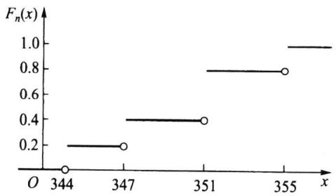  
图5.2.1经验分布函数

对每一固定的 $x , F _ { n } ( x )$ 是样本中事件 $\{ x _ { i } \leqslant x \}$ 发生的频率.当n固定时， $\smash {  { F _ { n } } ( x ) }$ 是样本的函数，它是一个随机变量.若对任意给定的实数x,定义

$$
I _ { i } ( x ) = \left\{ { \begin{array} { l l } { 1 , \quad x _ { i } \leqslant x , } \\ { 0 , \quad x _ { i } > x , } \end{array} } \right.
$$

则由经验分布函数的定义可以看出，对任意给定的实数x

$$
F _ { _ n } ( x ) = { \frac { 1 } { n } } \sum _ { i \ = 1 } ^ { n } I _ { i } ( x ) .
$$

注意到诸 $I _ { i } ( x )$ 是独立同分布的随机变量,其共同分布为 $b \big ( 1 , F ( x ) \big )$ ,由伯努利大数定律：只要n相当大， $\smash {  { F _ { n } } ( x ) }$ 依概率收敛于 $F ( x )$ .更深刻的结果也是存在的，这就是格利文科定理,下面我们不加证明地加以介绍.

定理5.2.1（格利文科（Glivenko）定理）设 $x _ { 1 } , x _ { 2 } , \cdots , x _ { n }$ 是取自总体分布函数为$F ( x )$ 的样本， $\smash {  { F _ { n } } ( x ) }$ 是其经验分布函数,当n→8时,有

$$
P ( \operatorname* { s u p } _ { - \infty } \mid F _ { \mathfrak { n } } ( \mathfrak { x } ) - F ( \mathfrak { x } ) \mid  0 ) = 1 .
$$

定理5.2.1表明，当n相当大时，经验分布函数是总体分布函数 $F ( x )$ 的一个良好的近似.经典统计学中一切统计推断都以样本为依据，其理由就在于此.

## 5.2.2频数频率表

样本数据的整理是统计研究的基础，整理数据的最常用方法之一是给出其频数表或频率表.我们从一个例子开始介绍.

例5.2.2为研究某厂工人生产某种产品的能力，我们随机调查了20位工人某天生产的该种产品的数量，数据如下

<table><tr><td>160 196</td><td>164</td><td>148</td><td>170</td></tr><tr><td>175 178</td><td>166</td><td>181</td><td>162</td></tr><tr><td>161</td><td>168</td><td>166 162</td><td>172</td></tr><tr><td>156</td><td>170</td><td>157 162</td><td>154</td></tr></table>

对这20个数据(样本)进行整理,具体步骤如下：

（1）对样本进行分组.首先确定组数k,作为一般性的原则，组数通常在5\~20个，对容量较小的样本，通常将其分为5组或6组，容量为100左右的样本可分7到10组，容量为200左右的样本可分9到13组，容量为300左右及以上的样本可分12到20

--- Part2 ---

组，目的是使用足够的组来表示数据的变异.本例中只有20个数据，我们将之分为5组，即k=5.

（2）确定每组组距.每组区间长度可以相同也可以不同，实用中常选用长度相同的区间以便于进行比较，此时各组区间的长度称为组距，其近似公式为

组距d=（样本最大观测值－样本最小观测值)/组数.

本例中，数据最大观测值为196，最小观测值为148，故组距近似为

$$
d = \frac { 1 9 6 - 1 4 8 } { 5 } = 9 . 6 ,
$$

方便起见，取组距为10.

（3）确定每组组限.各组区间端点为 $a _ { 0 } , a _ { 0 } + d = a _ { 1 } , a _ { 0 } + 2 d = a _ { 2 } , \cdots , a _ { 0 } + k d = a _ { k }$ ,形成如下的分组区间

$$
\left( a _ { 0 } , a _ { 1 } \right] , \left( a _ { 1 } , a _ { 2 } \right] , \cdots , \left( a _ { k - 1 } , a _ { k } \right] ,
$$

其中a。略小于最小观测值， $a _ { 0 }$ $\boldsymbol { a } _ { k }$ 略大于最大观测值，本例中可取 $a _ { 0 } = 1 4 7 , a _ { 5 } = 1 9 7$ ,于是本例的分组区间为：

$$
\left( 1 4 7 , 1 5 7 \right) , \left( 1 5 7 , 1 6 7 \right) , \left( 1 6 7 , 1 7 7 \right] , \left( 1 7 7 , 1 8 7 \right) , \left( 1 8 7 , 1 9 7 \right] ,
$$

通常可用每组的组中值来代表该组的变量取值，组中值=（组上限+组下限）/2.

（4）统计样本数据落入每个区间的个数一频数，并列出其频数频率表.本例的频数频率表见表5.2.1.从表中可以读出很多信息，如：40%的工人产量在157到167之间；产量少于167个的有12人，占60%；产量高于177的有3人，占15%.

表5.2.1例5.2.2的频数频率表
<table><tr><td>组序</td><td>分组区间</td><td>组中值</td><td>频数</td><td>频率</td><td>累计频率/%</td></tr><tr><td>1</td><td>（147,157]</td><td>152</td><td>4</td><td>0.20</td><td>20</td></tr><tr><td>2</td><td>（157,167]</td><td>162</td><td>8</td><td>0.40</td><td>60</td></tr><tr><td>3</td><td>（167,177]</td><td>172</td><td>5</td><td>0.25</td><td>85</td></tr><tr><td>4</td><td>(177,187]</td><td>182</td><td>2</td><td>0.10</td><td>95</td></tr><tr><td>5</td><td>(187,197]</td><td>192</td><td>1</td><td>0.05</td><td>100</td></tr><tr><td>合计</td><td></td><td></td><td>20</td><td>1</td><td></td></tr></table>

## 5.2.3样本数据的图形显示

前面我们介绍了频数频率分布的表格形式，它也可以用图形表示，这在许多场合更直观.

## 一、直方图

频数分布最常用的图形表示是直方图，它在组距相等场合常用宽度相等的长条矩形表示，矩形的高低表示频数的大小.在图形上，横坐标表示所关心变量的取值区间，纵坐标表示频数，这样就得到频数直方图，图5.2.2画出了例5.2.2的频数直方图.若把

纵轴改成频率就得到频率直方图.

为使诸长条矩形面积和为1，可将纵轴取为频率/组距，如此得到的直方图称为单位频率直方图，或简称频率直方图.凡此三种直方图的差别仅在于纵轴刻度的选择，直方图本身并无变化.

## 二、茎叶图

除直方图外，另一种常用的方法是茎叶图，下面我们从一个例子谈起.

例5.2.3某公司对应聘人员进行能力测

图5.2.2例5.2.2的频数直方图

试,测试成绩总分为150分.下面是50位应聘人员的测试成绩（已经过排序）：

<table><tr><td>64</td><td>67</td><td>70</td><td>72</td><td>74</td><td>76</td><td>76</td><td>79</td><td>80</td><td>81</td></tr><tr><td>82</td><td>82</td><td>83</td><td>85</td><td>86</td><td>88</td><td>91</td><td>91</td><td>92</td><td>93</td></tr><tr><td>93</td><td>93</td><td>95</td><td>96</td><td>96</td><td>97</td><td>97</td><td>99</td><td>100</td><td>100</td></tr><tr><td>102</td><td>104</td><td>106</td><td>106</td><td>107</td><td>108</td><td>108</td><td>112</td><td>112</td><td>114</td></tr><tr><td>116</td><td>118</td><td>119</td><td>119</td><td>122</td><td>123</td><td>125</td><td>126</td><td>128</td><td>133</td></tr></table>

我们用这批数据给出一个茎叶图.把每一个数值分为两部分，前面一部分（百位和十位）称为茎，后面部分（个位）称为叶，如

<table><tr><td>数值</td><td>分开</td><td></td><td>茎</td><td>和</td><td>叶</td></tr><tr><td>112</td><td>→ 1112</td><td>→</td><td>11</td><td>和</td><td>2</td></tr></table>

然后画一条竖线，在竖线的左侧写上茎，右侧写上叶，就形成了茎叶图.应聘人员测试成绩的茎叶图见图5.2.3.

茎叶图的外观很像横放的直方图，但茎叶图中叶增加了具体的数值，使我们对数据的具体取值一目了然，从而保留了数据中全部的信息.

在要比较两组样本时，可画出它们的背靠背的茎叶图,这是一个简单直观而有效的对比方法.

6 47   
7 024669   
8 01223568   
9 112333566779   
10 002466788   
11 2246899   
12 23568   
13 3

例5.2.4下面的数据是某厂两个车间某天各40名员工生产的产品数量(表5.2.2).为对其进行比较，我们将这些数据放到一个背靠背茎叶图上(图5.2.4).

图5.2.3测试成绩的茎叶图  
表5.2.2某厂两个车间40名员工的产量
<table><tr><td></td><td></td><td>甲</td><td>车间</td><td></td><td></td><td colspan="5">乙车间</td></tr><tr><td>50</td><td>52</td><td>56</td><td>61</td><td>61</td><td>62</td><td>56</td><td>67</td><td>67</td><td>68</td><td>68</td></tr><tr><td>64</td><td>65</td><td>65</td><td>65</td><td>67</td><td>67</td><td>72</td><td>74</td><td>75</td><td>75</td><td>75</td></tr><tr><td>67</td><td>68</td><td>71</td><td>72</td><td>74</td><td>74</td><td>75 76</td><td>76</td><td>76</td><td>76</td><td>78</td></tr><tr><td>76</td><td>76</td><td>77</td><td>77</td><td>78</td><td>82</td><td>78</td><td>80</td><td>81</td><td>81</td><td>83</td></tr><tr><td>83</td><td>85</td><td>86</td><td>86</td><td>87</td><td>88</td><td>83</td><td>84</td><td>84</td><td>84</td><td>86</td></tr><tr><td>90</td><td>91</td><td>92</td><td>93</td><td>93</td><td>97</td><td>86</td><td>87</td><td>88</td><td>92</td><td>92</td></tr><tr><td>100</td><td>100</td><td>103</td><td>105</td><td></td><td></td><td>93</td><td>98</td><td>107</td><td></td><td></td></tr></table>

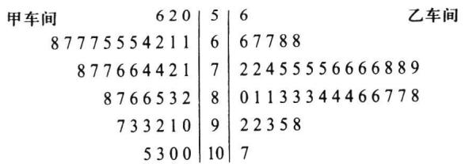  
图5.2.4两车间产量的背靠背茎叶图

在图5.2.4中，茎在中间，左边表示甲车间的数据，右边表示乙车间的数据.从茎叶图可以看出，甲车间员工的产量偏于上方，而乙车间员工的产量大多位于中间，乙车间的平均产量要高于甲车间，乙车间各员工的产量比较集中，而甲车间员工的产量则比较分散.

## 习题5.2

1.以下是某工厂通过抽样调查得到的10名工人一周内生产的产品数

$$
1 4 9 \quad 1 5 6 \quad 1 6 0 \quad 1 3 8 \quad 1 4 9 \quad 1 5 3 \quad 1 5 3 \quad 1 6 9 \quad 1 5 6 \quad 1 5 6 \quad
$$

试由这批数据构造经验分布函数并作图.

2.下表是经过整理后得到的分组样本：

<table><tr><td>组序</td><td>1</td><td>2</td><td>3</td><td>4</td><td>5</td></tr><tr><td>分组区间</td><td>(38,48]</td><td>（48,58]</td><td>（58,68]</td><td>(68,78]</td><td>（78,88]</td></tr><tr><td>频数</td><td>3</td><td>4</td><td>8</td><td>3</td><td>2</td></tr></table>

试写出此分组样本的经验分布函数.

3.假若某地区30名2018年某专业毕业生实习期满后的月薪数据如下：

<table><tr><td>9090</td><td>10860</td><td>11 200</td><td>9990</td><td>13200</td><td>10910</td></tr><tr><td>10710</td><td>10810</td><td>11 300</td><td>13360</td><td>9670</td><td>15720</td></tr><tr><td>8250</td><td>9140</td><td>9920</td><td>12320</td><td>9500</td><td>7750</td></tr><tr><td>12030</td><td>10250</td><td>10960</td><td>8080</td><td>12 240</td><td>10 440</td></tr><tr><td>8710</td><td>11 640</td><td>9710</td><td>9500</td><td>8660</td><td>7380</td></tr></table>

（1）构造该批数据的频率分布表（分6组）；

（2）画出直方图.

4.某公司对其250名职工上班所需时间（单位：min）进行了调查，下面是其不完整的频率分布表：

<table><tr><td>所需时间</td><td>频率</td></tr><tr><td>0~10</td><td>0.10</td></tr><tr><td>10~20</td><td>0.24</td></tr><tr><td>20~30</td><td></td></tr><tr><td>30~40</td><td>0.18</td></tr><tr><td>40~50</td><td>0.14</td></tr></table>

（1）试将频率分布表补充完整；

（2）该公司上班所需时间在半小时以内的有多少人？

5.40种刊物的月发行量（单位：百册）如下：

<table><tr><td>5954</td><td>5022</td><td>14 667</td><td>6582</td><td>6870</td><td>1840</td><td>2662</td><td>4508</td></tr><tr><td>1208</td><td>3852</td><td>618</td><td>3008</td><td>1268</td><td>1 978</td><td>7963</td><td>2048</td></tr><tr><td>3077</td><td>993</td><td>353</td><td>14263</td><td>1 714</td><td>11 127</td><td>6926</td><td>2047</td></tr><tr><td>714</td><td>5923</td><td>6006</td><td>14267</td><td>1697</td><td>13876</td><td>4001</td><td>2280</td></tr><tr><td>1223</td><td>12 579</td><td>13588</td><td>7315</td><td>4538</td><td>13304</td><td>1615</td><td>8612</td></tr></table>

（1）建立该批数据的频数分布表，取组距为1700（百册）；

(2）画出直方图.

6.对下列数据构造茎叶图：

<table><tr><td>472</td><td>425</td><td>447</td><td>377</td><td>341</td><td>369</td><td>412</td><td>399</td></tr><tr><td>400</td><td>382</td><td>366</td><td>425</td><td>399</td><td>398</td><td>423</td><td>384</td></tr><tr><td>418</td><td>392</td><td>372</td><td>418</td><td>374</td><td>385</td><td>439</td><td>408</td></tr><tr><td>429</td><td>428</td><td>430</td><td>413</td><td>405</td><td>381</td><td>403</td><td>479</td></tr><tr><td>381</td><td>443</td><td>441</td><td>433</td><td>399</td><td>379</td><td>386</td><td>387</td></tr></table>

7.根据调查，某集团公司的中层管理人员的年薪（单位：万元）数据如下：

<table><tr><td>40.6</td><td>39.6</td><td>37.8</td><td>36.2</td><td>38.8</td></tr><tr><td>38.6</td><td>39.6</td><td>40.0</td><td>34.7</td><td>41.7</td></tr><tr><td>38.9</td><td>37.9</td><td>37.0</td><td>35.1</td><td>36.7</td></tr><tr><td>37.1</td><td>37.7</td><td>39.2</td><td>36.9</td><td>38.3</td></tr></table>

试画出茎叶图.

## §5.3统计量及其分布

## 5.3.1统计量与抽样分布

样本来自总体，因此样本中含有总体各方面的信息，但这些信息较为分散,有时显得杂乱无章.为将这些分散在样本中的有关总体的信息集中起来以反映总体的各种特征,需要对样本进行加工，表和图是一类加工形式，它使人们从中获得对总体的初步认识.当人们需要从样本获得对总体各种参数的认识时，更有效的加工方法是构造样本的函数，不同的样本函数反映总体的不同特征.

定义5.3.1设 $x _ { 1 } , x _ { 2 } , \cdots , x _ { n }$ 为取自某总体的样本，若样本函数 $T = T ( x _ { 1 } , x _ { 2 } , \cdots , x _ { n } )$ 中不含有任何未知参数，则称T为统计量.统计量的分布称为抽样分布.

按照这一定义，若 $x _ { 1 } , x _ { 2 } , \cdots , x _ { n }$ 为样本,则 $\sum _ { i \ : = 1 } ^ { n } x _ { i } , \sum _ { i \ : = 1 } ^ { n } x _ { i } ^ { 2 }$ 以及5.2.1节中的 $\smash {  { F _ { n } } ( x ) }$ 都是统计量.而当 $\mu , \sigma ^ { ^ 2 }$ 未知时， $x _ { 1 } - \mu , x _ { 1 } / \sigma$ 等均不是统计量.必须指出的是：尽管统计量不依赖于未知参数，但是它的分布是依赖于未知参数的.

下面几小节及5.4节我们介绍一些常见的统计量及其抽样分布.

## 5.3.2样本均值及其抽样分布

定义5.3.2设 $x _ { 1 } , x _ { 2 } , \cdots , x _ { n }$ 为取自某总体的样本，其算术平均值称为样本均值，一般用 $\stackrel { - } { x }$ 表示，即

$$
{ \overline { { x } } } = { \frac { x _ { 1 } + x _ { 2 } + \cdots + x _ { n } } { n } } = { \frac { 1 } { n } } \sum _ { i = 1 } ^ { n } x _ { i } .\tag{5.3.1}
$$

在分组样本场合，样本均值的近似公式为

$$
{ \frac { - } { x } } = { \frac { x _ { 1 } f _ { 1 } + x _ { 2 } f _ { 2 } + \cdots + x _ { k } f _ { k } } { n } } \qquad \left( n = \sum _ { i = 1 } ^ { k } f _ { i } \right) ~ .\tag{5.3.2}
$$

其中k为组数 $, x _ { i }$ 为第i组的组中值 $\mathbf { \mathcal { f } } _ { i }$ 为第i组的频数.

例5.3.1某单位收集到20名青年人某月的娱乐支出费用数据：

$$
\begin{array} { c c c c c c c c c c c c c c c c c c c c c c } { { 7 9 0 } } & { { 8 4 0 } } & { { 8 4 0 } } & { { 8 8 0 } } & { { 9 2 0 } } & { { 9 3 0 } } & { { 9 4 0 } } & { { 9 7 0 } } & { { 9 8 0 } } & { { 9 9 0 } } & { { } } & { { } } & { { } } & { { } } & { { } } & { { } } & { { } } & { { } } & { { } } & { { } } & { { } } & { { } } & { { } } & { { } } & { { } } & { { } } & { { } } & { { } } & { { } } & { { } } & { { } } & { { } } & { { } } & { { } } & { { } } & { { } } & { { } } & { { } } & { { } } & { { } } & { { } } & { { } } & { { } } & { { } } & { { } } & { { } } & { { } } & { { } } & { { } } & { { } } & { { } } & { { } } & { { } } & { { } } & { { } } & { { } } & { { } } & { { } } & { { } } & { { } } & { { } } & { { } } & { { } } & { { } } & { { } } & { { } } & { { } } & { { } } & { { } } & { { } } & { { } } & { { } } & { { } } & { { } } & { { } } & { { } } & { { } } & { { } } & { { } } & { { } } & { { } } & { { } } & { { } } & { { } } & { { } } & { { } } & { { } } & { { } } & { { } } & { { } } & { { } } & { { } } & { { } } & { { } } & { { } } & { { } } & { { } } & { { } } & { { } } & { { } } & { { } } & { { } } & { { } } & { { } } & { { } } & { { } } & \end{array}
$$

则该月这20名青年的平均娱乐支出为

$$
{ \overline { { x } } } = { \frac { 1 } { 2 0 } } ( 7 9 0 + 8 4 0 + \cdots + 1 2 5 0 ) = 9 9 4 .
$$

将这20个数据分组可得到如下频数频率表：

表5.3.1例5.3.1的频数频率分布表
<table><tr><td>组序</td><td>分组区间</td><td>组中值</td><td>频数</td><td>频率（%）</td></tr><tr><td>1</td><td>(770,870]</td><td>820</td><td>3</td><td>15</td></tr><tr><td>2</td><td>(870,970]</td><td>920</td><td>5</td><td>25</td></tr><tr><td>3</td><td>（970,1070]</td><td>1020</td><td>7</td><td>35</td></tr><tr><td>4</td><td>（1070,1170]</td><td>1120</td><td>3</td><td>15</td></tr><tr><td>5</td><td>（1170,1270]</td><td>1220</td><td>2</td><td>10</td></tr><tr><td>合计</td><td></td><td></td><td>20</td><td>100</td></tr></table>

对表5.3.1的分组样本，使用公式(5.3.2)进行计算可得

$$
{ \overline { { x } } } = { \frac { 1 } { 2 0 } } ( 8 2 0 \times 3 + 9 2 0 \times 5 + \cdots + 1 2 2 0 \times 2 ) = 1 0 0 0 .
$$

我们看到两种计算结果不同.事实上，由于(5.3.2)式未用到真实的样本观测数据，因而给出的是近似结果.

关于样本均值，有如下几个性质.

性质5.3.1若把样本中的数据与样本均值之差称为偏差，则样本所有偏差之和为0,即 $\sum _ { i \mathop { = } 1 } ^ { n } \left( x _ { i } - { \overline { { x } } } \right) = 0 .$

从均值的计算公式看，它使用了所有的数据，而且每一个数据在计算公式中处于平等的地位.所有数据与样本中心x的偏差可正可负，且被互相抵消，从而样本的所有偏差之和必为零.

性质5.3.2数据观测值与样本均值的偏差平方和最小，即在形如 $\sum \left( x _ { i } - c \right) ^ { 2 }$ 的函

数中， $\sum { ( x _ { i } - \overline { { x } } ) } ^ { 2 }$ 最小，其中c为任意给定常数.

证明对任意给定的常数c，

$$
\begin{array} { r l } & { \sum \left( x _ { i } – c \right) ^ { 2 } = \sum \left( x _ { i } – \overline { { x } } + \overline { { x } } - c \right) ^ { 2 } } \\ & { \qquad = \sum \left( x _ { i } – \overline { { x } } \right) ^ { 2 } + n \left( \overline { { x } } - c \right) ^ { 2 } + 2 \sum \left( x _ { i } – \overline { { x } } \right) \left( \overline { { x } } - c \right) } \\ & { \qquad = \sum \left( x _ { i } – \overline { { x } } \right) ^ { 2 } + n \left( \overline { { x } } - c \right) ^ { 2 } \geqslant \sum \left( x _ { i } – \overline { { x } } \right) ^ { 2 } . } \end{array}
$$

下面考察样本均值的分布.

<table><tr><td>11、 8 12 13</td><td>样本1</td><td>样本2</td><td>样本3</td><td>样本4</td></tr><tr><td>8 9</td><td></td><td>8</td><td>13</td><td>12</td></tr><tr><td>11 10 9 1</td><td>→11</td><td>13</td><td>11</td><td>9</td></tr><tr><td>10 8</td><td>9</td><td>10</td><td>11</td><td>10</td></tr><tr><td>10 12</td><td>10</td><td>11</td><td>10</td><td>10</td></tr><tr><td>11 9</td><td>8</td><td>9</td><td>9</td><td>11</td></tr><tr><td>8 1 10 13</td><td>样本均值 9.8</td><td>10.2</td><td>10.8</td><td>10.4</td></tr></table>

图5.3.14个样本的样本均值

例5.3.2设有一个由20个数组成的总体，现从该总体同时取出容量为5的样本.图5.3.1画出第一个样本的抽样过程,左侧是该总体,右侧是从总体中随机地抽出的样本,记录后，放回,再抽第二个样本.这里一共抽出4个样本，每个样本有5个观测值，我们计算了各个样本的样本均值.由抽样的随机性，每一个样本的样本均值都有差别.

设想类似抽取样本5、样本6每次都计算样本均值 $\overline { { x } }$ ,它们之间的差异是由于抽样的随机性引起的.假如无限制地抽下去，这样我们可以得到大量的x的值，图5.3.2就是用这样得到的500个 $\overline { { x } }$ 的值所形成的直方图，它反映了x的抽样分布.

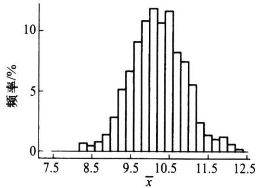

它的外形很像正态分布，这不是偶然的，有下面定理保证.

图5.3.2500个样本均值形成的直方图

定理5.3.1设 $x _ { 1 } , x _ { 2 } , \cdots , x _ { n }$ 是来自某个总 体的样本， $\overline { { x } }$ 为样本均值.

（1）若总体分布为 $N ( \mu , \sigma ^ { 2 } )$ ，则 $\overset { \vartriangle } { \boldsymbol { x } }$ 的精确分布为 $N ( \mu , \sigma ^ { 2 } / n )$

（2）若总体分布未知或不是正态分布， $E ( \mathbf { \theta } x ) = \mu , \operatorname { V a r } ( \mathbf { \theta } x ) = \sigma ^ { 2 }$ 存在，则n较大时 $\stackrel { - } { x }$ 的渐近分布为 $N ( \mu , \sigma ^ { 2 } / n )$ ，常记为 $\overline { { x } } \overset { \cdot } { \sim } N ( \mu , \sigma ^ { 2 } / n )$ .这里渐近分布是指n较大时的近似分布.

证明（1）利用卷积公式，可得知 $\sum _ { i \mathop { = } 1 } ^ { n } x _ { i } \sim N ( n \mu , n \sigma ^ { 2 } )$ ,由此可知 $\overline { { x } } \sim N ( \mu , \sigma ^ { 2 } / n )$

（2）由中心极限定理 $\sqrt { n } \left( \stackrel { \_ } { x } - \mu \right) / \sigma \stackrel { L } { \longrightarrow } N ( 0 , 1 )$ ，这表明n较大时 $\overline { { x } }$ 的渐近分布为$N ( \mu , \sigma ^ { 2 } / n )$ ，证明完成.

例5.3.3图5.3.3给出三个不同总体样本均值的分布密度函数.三个总体分别是：

①均匀分布 $\textcircled{2}$ 倒三角分布③指数分布，随着样本量的增加，样本均值x的抽样分布逐渐向正态分布逼近，它们的均值保持不变，而方差则缩小为原来的1/n.当样本量为30时，我们看到三个抽样分布都近似于正态分布.下面对之进行具体说明.

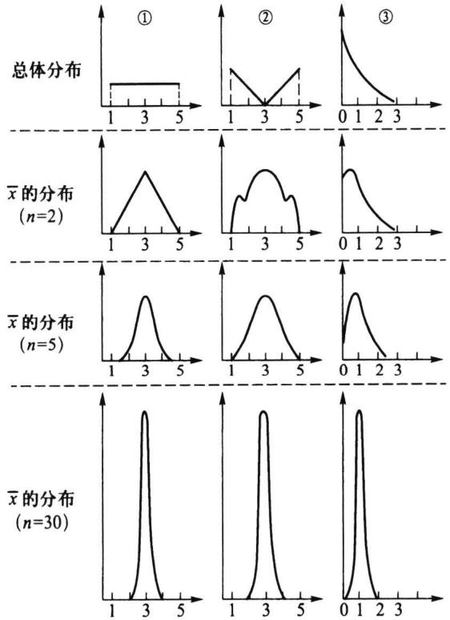  
图5.3.3不同总体样本均值的分布

①的总体分布为均匀分布U（1,5），该总体的均值和方差分别为3和4/3，若从该总体抽取样本容量为30的样本，则其样本均值的渐近分布为

$$
\overline { { { x } } } _ { 1 } \dot { \sim } N \bigg ( 3 , \frac { 4 } { 3 \times 3 0 } \bigg ) = N ( 3 , 0 . 2 1 ^ { 2 } ) .
$$

②的总体分布的概率密度函数为

$$
p \left( x \right) = \left\{ \begin{array} { l l } { \left( 3 - x \right) / 4 , } & { 1 \leqslant x < 3 , } \\ { \left( x - 3 \right) / 4 , } & { 3 \leqslant x \leqslant 5 , } \\ { 0 , } & { \sharp / \sharp . } \end{array} \right.
$$

这是一个倒三角分布，可以算得其均值与方差分别为3和2，若从该总体抽取样本容量为30的样本，则其样本均值的渐近分布为

$$
\overline { { { x } } } _ { 2 } \dot { - } \ N \bigg ( 3 , \frac { 2 } { 3 0 } \bigg ) = N ( 3 , 0 . 2 6 ^ { 2 } ) .
$$

③的总体分布为指数分布 $E x p ( 1 )$ ,其均值与方差都等于1,若从该总体抽取样本容量为30的样本，则其样本均值 $\overline { { \boldsymbol { x } } } _ { 3 }$ 的分布近似为

$$
\overline { { { x } } } _ { 3 } \dot { - } \ N \bigg ( 1 , \frac { 1 } { 3 0 } \bigg ) = N ( 1 , 0 . 1 8 ^ { 2 } ) .
$$

这三个总体都不是正态分布，但其样本均值的分布都近似于正态分布，差别表现

在均值与标准差上.图5.3.3所示曲线既展示它们的共同之处，又显示它们之间的差别.

## 5.3.3样本方差与样本标准差

定义5.3.3设 $x _ { 1 } , x _ { 2 } , \cdots , x _ { n }$ 为取自某总体的样本，则它关于样本均值 $\stackrel { - } { x }$ 的平均偏差平方和

$$
s _ { n } ^ { 2 } = \frac { 1 } { n } \sum _ { i \ = \ 1 } ^ { n } (  x _ { i }  -  \overline { { x } } ) ^ { 2 }\tag{5.3.3}
$$

称为样本方差.其算术根 $s _ { n } = { \sqrt { s _ { n } ^ { 2 } } }$ 称为样本标准差.相对样本方差而言，样本标准差通常更有实际意义,因为它与样本均值具有相同的度量单位.在n不大时，常用

$$
s ^ { 2 } = \frac { 1 } { n - 1 } \sum _ { i = 1 } ^ { n } { \bigl ( } x _ { i } - { \overline { { x } } } { \bigr ) } ^ { 2 }\tag{5.3.4}
$$

作为样本方差（也称无偏方差，其含义在第六章讲述），其算术根 $s = \sqrt { s ^ { 2 } }$ 也称为样本标准差.在实际中 $, s ^ { 2 }$ 比 $s _ { n } ^ { 2 }$ 更常用，在以后讲样本方差通常指的是 $s ^ { 2 }$

样本方差 ${ \left( { \begin{array} { l } { s } ^ { 2 } } \end{array} \right) }$ 或 $s _ { n } ^ { 2 } )$ 是度量样本散布大小的统计量,使用广泛,在它的这个定义中，n为样本量， $\sum _ { i \mathop { = } 1 } ^ { n } \left( x _ { i } - { \overline { { x } } } \right) ^ { 2 }$ 称为偏差平方和,n-1称为偏差平方和的自由度.其含义是：在 $\overset { \_ } { x }$ 确定后，n个偏差 $x _ { 1 } - { \overline { { x } } } , x _ { 2 } - { \overline { { x } } } , \cdots , x _ { n } - { \overline { { x } } }$ 中只有 $n - 1$ 个偏差可以自由变动，而第 $\pmb { n }$ 个则不能自由取值，因为 $\sum { \left( x _ { i } - \overline { { x } } \right) } = 0$

样本偏差平方和有三个常用的表达式：

$$
\begin{array} { r } { \sum \left( { { x } _ { i } } - { \overline { { x } } } \right) ^ { 2 } = \sum { { x } _ { i } ^ { 2 } } - \frac { \displaystyle \left( \begin{array} { l } { \sum { { x } _ { i } } } \end{array} \right) ^ { 2 } } { \displaystyle n } = \sum { { x } _ { i } ^ { 2 } } - n { \overline { { x } } ^ { 2 } } . } \end{array}\tag{5.3.5}
$$

它们都可用来计算样本方差.

在分组样本场合，样本方差的近似计算公式为

$$
s ^ { 2 } = \frac { 1 } { n - 1 } \sum _ { i = 1 } ^ { k } f _ { i } ( x _ { i } - \overline { { x } } ) ^ { 2 } = \frac { 1 } { n - 1 } \bigg ( \sum _ { i = 1 } ^ { k } f _ { i } x _ { i } ^ { 2 } - n \overline { { x } } ^ { 2 } \bigg ) ,\tag{5.3.6}
$$

其中 $x _ { i } , f _ { i }$ 分别为第i个区间的组中值和频数， $\overline { { x } }$ 为(5.3.2)式给出的样本均值近似值.

例5.3.4考察例5.3.1的样本，我们已经算得 $\overline { { x } } = 9 9 4$ ，其样本方差与样本标准差分别为

$$
\begin{array} { l } { { \displaystyle s ^ { 2 } = \frac { 1 } { 2 0 - 1 } \big [ \left( 7 9 0 - 9 9 4 \right) ^ { 2 } + \big ( 8 4 0 - 9 9 4 \big ) ^ { 2 } + \cdots + \big ( 1 2 5 0 - 9 9 4 \big ) ^ { 2 } \big ] = 1 3 ~ 3 9 3 . 6 8 , } } \\ { { \displaystyle s = \sqrt { 1 3 ~ 3 9 3 . 6 8 } = 1 1 5 . 7 3 1 , } } \end{array}
$$

对表5.3.1的分组样本，我们可以如表5.3.2计算(样本均值也由分组样本计算）：

表5.3.2分组样本方差的计算表
<table><tr><td>组中值x</td><td>频数f</td><td> $x f$ </td><td> $x - { \overline { { x } } }$ </td><td> $( x - \overline { { x } } ) ^ { 2 } f$ </td></tr><tr><td>820</td><td>3</td><td>2460</td><td>-180</td><td>97 200</td></tr><tr><td>920</td><td>5</td><td>4 600</td><td>-80</td><td>32 000</td></tr><tr><td>1020</td><td>7</td><td>7140</td><td>20</td><td>2800</td></tr></table>

续表

<table><tr><td>组中值x</td><td>频数f</td><td> $x f$   $x { - } \overline { { x } }$ </td><td> $( x - \overline { { x } } ) ^ { 2 } f$ </td></tr><tr><td>1120</td><td>3</td><td>3360 120</td><td>43200</td></tr><tr><td>1220</td><td>2</td><td>2440 220</td><td>96800</td></tr><tr><td>和</td><td>20</td><td>20000</td><td>272 000</td></tr></table>

于是 $\overline { { x } } = \frac { 2 0 \ 0 0 0 } { 2 0 } = 1 \ 0 0 0 , s ^ { 2 } = \frac { 2 7 2 \ 0 0 0 } { 2 0 - 1 } = 1 4 \ 3 1 6 , s = \sqrt { 1 4 \ 3 1 6 } = 1 1 9 . 6 .$

下面的定理给出样本均值的数学期望和方差以及样本方差的数学期望，它不依赖于总体的分布形式.

定理5.3.2设总体X具有二阶矩，即 $E ( \ X ) = \pmb { \mu } , \operatorname { V a r } ( \ X ) = \pmb { \sigma } ^ { 2 } < \infty \ , x _ { 1 } , x _ { 2 } , \cdots , x _ { n }$ 为从该总体得到的样本 $\overline { { x } }$ 和 $s ^ { 2 }$ 分别是样本均值和样本方差，则

$$
E ( \stackrel { \_ } { x } ) = \mu , \qquad \operatorname { V a r } ( \stackrel { \_ } { x } ) = \sigma ^ { 2 } / n ,\tag{5.3.7}
$$

$$
E ( s ^ { 2 } ) = \sigma ^ { 2 } .\tag{5.3.8}
$$

此定理表明，样本均值的期望与总体均值相同，而样本均值的方差是总体方差的1/n.

证明由于

$$
E ( \stackrel { \_ } { x } ) = \frac { 1 } { n } E \Big ( \sum _ { i \ = \ 1 } ^ { n } x _ { i } \Big ) \ = \frac { n \mu } { n } = \mu ,
$$

$$
\mathrm { V a r } \bigl ( \overline { { x } } \bigr ) = \frac { 1 } { n ^ { 2 } } \mathrm { V a r } \biggl ( \sum _ { i = 1 } ^ { n } x _ { i } \biggr ) = \frac { n \sigma ^ { 2 } } { n ^ { 2 } } = \frac { \sigma ^ { 2 } } { n } ,
$$

故（5.3.7)式成立.下证(5.3.8）式，注意到

$$
\sum _ { i = 1 } ^ { n } { \left( x _ { i } - { \overline { { x } } } \right) } ^ { 2 } = \sum _ { i = 1 } ^ { n } x _ { i } ^ { 2 } - n { \overline { { x } } } ^ { 2 } { \mathrm { , } }
$$

而 $E ( \mathbf { \Phi } _ { x _ { i } } ^ { 2 } ) = { \bigl ( } E ( \mathbf { \Phi } _ { x _ { i } } ) { \bigr ) } ^ { 2 } + \mathrm { V a r } ( \mathbf { \Phi } _ { x _ { i } } ) = \mu ^ { 2 } + \sigma ^ { 2 } , E ( \mathbf { \Phi } _ { x } ^ { - 2 } ) = { \bigl ( } E ( { \frac { - \mathbf { \Phi } } { x } } ) { \bigr ) } ^ { 2 } + \mathrm { V a r } ( { \frac { - \mathbf { \Phi } } { x } } ) = \mu ^ { 2 } + \sigma ^ { 2 } / n$ ，于是

$$
E \Big ( \sum _ { i = 1 } ^ { n } \big ( x _ { i } - \overline { { x } } \big ) ^ { 2 } \Big ) = n \big ( \mu ^ { 2 } + \sigma ^ { 2 } \big ) - n \big ( \mu ^ { 2 } + \sigma ^ { 2 } / n \big ) = \big ( n - 1 \big ) \sigma ^ { 2 } ,
$$

两边各除以 $n - 1$ ，即得（5.3.8）式.

## 5.3.4样本矩及其函数

样本均值和样本方差的更一般的推广是样本矩，这是一类常见的统计量.

定义5.3.4设 $x _ { 1 } , x _ { 2 } , \cdots , x _ { n }$ 是样本，k为正整数，则统计量

$$
a _ { k } = \frac { 1 } { n } \sum _ { i = 1 } ^ { n } x _ { i } ^ { k }\tag{5.3.9}
$$

称为样本k阶原点矩，特别，样本一阶原点矩就是样本均值.统计量

$$
b _ { k } = \frac { 1 } { n } \sum _ { i \ = 1 } ^ { n } \left( \boldsymbol { x } _ { i } - \overbar { \boldsymbol { x } } \right) ^ { k }\tag{5.3.10}
$$

称为样本k阶中心矩.特别，样本二阶中心矩就是样本方差.

当总体关于分布中心对称时，我们用 $\overline { { x } }$ 和s刻画样本特征很有代表性，而当其不对称时，只用 $\overset { - } { x }$ s就显得很不够.为此，需要一些刻画分布形状的统计量（参见2.7.5和2.7.6).这里我们介绍样本偏度和样本峰度，它们都是样本中心矩的函数.

定义5.3.5设 $x _ { 1 } , x _ { 2 } , \cdots , x _ { n }$ 是样本，则称统计量

$$
\hat { \beta } _ { s } = b _ { 3 } / b _ { 2 } ^ { 3 / 2 }\tag{5.3.11}
$$

为样本偏度.

样本偏度 $\hat { \beta } _ { s }$ 反映了样本数据与对称性的偏离程度和偏离方向.如果数据完全对称，则不难看出 $b _ { _ 3 } = 0 .$ 对不对称的数据则 $b _ { 3 } \neq 0 .$ 这里用 $b _ { 3 }$ 除以 $b _ { 2 } ^ { 3 / 2 }$ 是为了消除量纲的影响，$\hat { \beta } _ { s }$ 是个相对数,它很好地刻画了数据分布的偏斜方向和程度.如果 $\hat { \beta } _ { s } = 0$ ，表示样本对称（见图5.3.4(a））；如果 $\hat { \beta } _ { s }$ 明显大于0,表示样本的右尾长,即样本中有几个较大的数,这反映总体分布是正偏的或右偏的（见图5.3.4（b)）；如果 $\hat { \beta } _ { s }$ 明显小于0,表示分布的左尾长,即样本中有几个特小的数,这反映总体分布是负偏的或左偏的（见图5.3.4（c）).

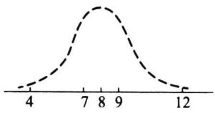  
(a)样本(4,7,8,9,12)的偏度$\hat { \beta } _ { S } { = } 0$

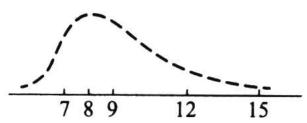

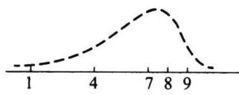  
(c)样本(1,4,7,8,9）的偏度 βs=-0.5692  
图5.3.4样本偏度 $\hat { \beta } _ { s }$ 的例子（样本量n=5)

定义5.3.6设 $x _ { 1 } , x _ { 2 } , \cdots , x _ { n }$ 是样本,则称统计量

$$
\hat { \beta } _ { k } = \frac { b _ { 4 } } { b _ { 2 } ^ { 2 } } - 3\tag{5.3.12}
$$

为样本峰度.

样本峰度 $\hat { \beta } _ { k }$ 是反映总体分布密度曲线在其峰值附近的陡峭程度和尾部粗细的统计量.当β明显大于0时，分布密度曲线在其峰值附近比正态分布来得陡，尾部更细， $\hat { \beta } _ { k }$ 称为尖顶型；当β明显小于0时，分布密度曲线在其峰值附近比正态分布来得平坦，尾 $\hat { \beta } _ { k }$ 部更粗，称为平顶型.

例5.3.5表5.3.3是两个班(每班50名同学)的英语课程的考试成绩.

表5.3.3两个班级的英语成绩
<table><tr><td>成绩</td><td>组中值</td><td>甲班人数  $f _ { \oplus }$ </td><td>乙班人数  $f _ { Z }$ </td></tr><tr><td>90~100</td><td>95</td><td>5</td><td>4</td></tr><tr><td>80~89</td><td>85</td><td>10</td><td>14</td></tr><tr><td>70~79</td><td>75</td><td>22</td><td>16</td></tr><tr><td>60~69</td><td>65</td><td>11</td><td>14</td></tr><tr><td>50~59</td><td>55</td><td>1</td><td>2</td></tr><tr><td>40~49</td><td>45</td><td>1</td><td>0</td></tr></table>

下面我们分别计算两个班级的平均成绩、标准差、样本偏度及样本峰度.表5.3.4和表5.3.5分别给出甲班和乙班的计算过程.

表5.3.4甲班成绩的计算过程
<table><tr><td>x</td><td> $f _ { \sharp }$ </td><td> $x \cdot f _ { \# }$ </td><td> $( x - \overline { { x } } _ { \mho } ) ^ { 2 } f _ { \ m \sharp }$ </td><td> $( x - \overline { x } _ { \ m _ { \ m } } ) \vphantom { \sum } ^ { 3 } f _ { \ m \ m }$ </td><td> $( x - \overline { x } _ { \ m _ { \mathbb { P } } } ) ^ { 4 } f _ { \sharp }$ </td></tr><tr><td>95</td><td>5</td><td>475</td><td>1843.20</td><td>35 389.440</td><td>679477.2480</td></tr><tr><td>85</td><td>10</td><td>850</td><td>846.40</td><td>7 786.880</td><td>71 639.2960</td></tr><tr><td>75</td><td>22</td><td>1 650</td><td>14.08</td><td>-11.264</td><td>9.011 2</td></tr><tr><td>65</td><td>11</td><td>715</td><td>1283.04</td><td>-13 856.832</td><td>149 653.7856</td></tr><tr><td>55</td><td>1</td><td>55</td><td>432.64</td><td>-8 998.912</td><td>187 177.369 6</td></tr><tr><td>45</td><td>1</td><td>45</td><td>948.64</td><td>-29 218.112</td><td>899 917.849 6</td></tr><tr><td>和</td><td>50</td><td>3790</td><td>5368</td><td>-8908.8</td><td>1987 874.56</td></tr></table>

表5.3.5乙班成绩的计算过程
<table><tr><td>x</td><td> $f _ { z }$ </td><td> ${ \boldsymbol { x } } \cdot { \boldsymbol { f } } _ { Z }$ </td><td> $( x - \overline { { x } } _ { Z } ) ^ { 2 } f _ { Z }$ </td><td> $( x - \overline { { x } } _ { Z } ) ^ { 3 } f _ { Z }$ </td><td> $( x - \overline { { x } } _ { Z } ) ^ { 4 } f _ { Z }$ </td></tr><tr><td>95</td><td>4</td><td>380</td><td>1 474.56</td><td>28 311.552</td><td>543 581.798 4</td></tr><tr><td>85</td><td>14</td><td>1190</td><td>1184.96</td><td>10 901.632</td><td>100295.0144</td></tr><tr><td>75</td><td>16</td><td>1200</td><td>10.24</td><td>-8.192</td><td>6.5536</td></tr><tr><td>65</td><td>14</td><td>910</td><td>1 632.96</td><td>-17 635.968</td><td>190 468.454 4</td></tr><tr><td>55</td><td>2</td><td>110</td><td>865.28</td><td>-17 997.824</td><td>374 354.7392</td></tr><tr><td>和</td><td>50</td><td>3790</td><td>5168</td><td>3 571.2</td><td>1 208 706.56</td></tr></table>

可算得两个班的平均成绩、标准差、偏度、峰度分别为：

$$
\overline { { { x } } } _ { \oplus } \ : = \frac { 3 \ : 7 9 0 } { 5 0 } = 7 5 . 8 ,
$$

$$
\overline { { { x } } } _ { Z } = \frac { 3 7 9 0 } { 5 0 } = 7 5 . 8 ,
$$

$$
s _ { _ { \mathrm { H } } } = \sqrt { \frac { 5 ~ 3 6 8 } { 4 9 } } = 1 0 . 4 7 , \qquad s _ { _ Z } = \sqrt { \frac { 5 ~ 1 6 8 } { 4 9 } } = 1 0 . 2 7 ,
$$

$$
\widehat { \beta } _ { s _ { \scriptscriptstyle \Psi } } = \frac { - \mathrm { ~ 8 ~ } 9 0 8 . 8 / 5 0 } { \left( 5 \mathrm { ~ } 3 6 8 / 5 0 \right) ^ { 3 / 2 } } = - \mathrm { ~ 0 . 1 6 ~ } , ~ \widehat { \beta } _ { s _ { \scriptscriptstyle Z } } = \frac { \mathrm { ~ 3 ~ } 5 7 1 . 2 / 5 0 } { \left( 5 \mathrm { ~ } 1 6 8 / 5 0 \right) ^ { 3 / 2 } } = 0 . 0 6 8 ,
$$

$$
\hat { \beta } _ { \scriptscriptstyle { k _ { \scriptscriptstyle 4 4 } } } = \frac { 1 9 8 7 8 7 4 . 5 6 / 5 0 } { \left( 5 \mathrm { ~ } 3 6 8 / 5 0 \right) ^ { \mathrm { ~ 2 ~ } } } - 3 = 0 . 4 5 , \quad \hat { \beta } _ { \scriptscriptstyle { k _ { \scriptscriptstyle 2 } } } = \frac { 1 \mathrm { ~ } 2 0 8 7 0 6 . 5 6 / 5 0 } { \left( 5 \mathrm { ~ } 1 6 8 / 5 0 \right) ^ { \mathrm { ~ 2 ~ } } } - 3 = - 0 . 7 4 .
$$

由此可见，两个班级的平均成绩相同，标准差也几乎相同，样本偏度分别为-0.16和0.068，显示两个班的成绩都是基本对称的.但两个班的样本峰度明显不同.乙班的成绩分布比较平坦，而甲班则稍显尖顶.

## 5.3.5次序统计量及其分布

除了样本矩以外，另一类常见的统计量是次序统计量，它在实际和理论中都有广泛的应用.

## 一、定义

定义5.3.7设 $x _ { 1 } , x _ { 2 } , \cdots , x _ { n }$ 是取自总体X的样本，x称为该样本的第i个次序统 $\boldsymbol { x } _ { ( i ) }$ 计量，它的取值是将样本观测值由小到大排列后得到的第i个观测值.其中 $x _ { ( 1 ) } =$ $\operatorname* { m i n } { \{ x _ { 1 } , x _ { 2 } , \cdots , x _ { n } \} }$ 称为该样本的最小次序统计量， $\boldsymbol { x } _ { ( n ) } = \operatorname* { m a x } \{ \boldsymbol { x } _ { 1 } , \boldsymbol { x } _ { 2 } , \cdots , \boldsymbol { x } _ { n } \}$ 称为该样本

的最大次序统计量. ${ \left( { { x } _ { \left( 1 \right) } } , { { x } _ { \left( 2 \right) } } , \cdots , { { x } _ { \left( n \right) } } \right) }$ 称为该样本的次序统计量.

我们知道，在一个（简单随机)样本中， $x _ { 1 } , x _ { 2 } , \cdots , x _ { n }$ 是独立同分布的，而次序统计量 $x _ { ( 1 ) } , x _ { ( 2 ) } , \cdots , x _ { ( n ) }$ 则既不独立，分布也不相同，看下例.

例5.3.6设总体X的分布为仅取0,1,2的离散均匀分布，分布列为

<table><tr><td>x</td><td>0</td><td>1</td><td>2</td></tr><tr><td>p</td><td>1/3</td><td>1/3</td><td>1/3</td></tr></table>

现从中抽取容量为3的样本，其一切可能取值有 $3 ^ { 3 } = 2 7$ 种，现将它们列在表5.3.6左侧,其右侧是相应的次序统计量观测值.

表5.3.6例5.3.6中样本取值及其次序统计量取值
<table><tr><td> $x _ { 1 }$ </td><td> $\boldsymbol { x } _ { 2 }$ </td><td> ${ \pmb x } _ { 3 }$ </td><td> $\pmb { x } _ { ( 1 ) }$ </td><td> $\boldsymbol { x } _ { ( 2 ) }$ </td><td> $x _ { ( 3 ) }$ </td><td> $x _ { 1 }$ </td><td> $\boldsymbol { x } _ { 2 }$ </td><td> ${ \pmb x } _ { 3 }$ </td><td> $\pmb { x } _ { ( 1 ) }$ </td><td> $\boldsymbol { x } _ { ( 2 ) }$ </td><td> $x _ { ( 3 ) }$ </td></tr><tr><td>0</td><td>0</td><td>0</td><td>0</td><td>0</td><td>0</td><td>1</td><td>2</td><td>0</td><td>0</td><td>1</td><td>2</td></tr><tr><td>0</td><td>0</td><td>1</td><td>0</td><td>0</td><td>1</td><td>2</td><td>1</td><td>0</td><td>0</td><td>1</td><td>2</td></tr><tr><td>0</td><td>1</td><td>0</td><td>0</td><td>0</td><td>1</td><td>0</td><td>2</td><td>2</td><td>0</td><td>2</td><td>2</td></tr><tr><td>1</td><td>0</td><td>0</td><td>0</td><td>0</td><td>1</td><td>2</td><td>0</td><td>2</td><td>0</td><td>2</td><td>2</td></tr><tr><td>0</td><td>0</td><td>2</td><td>0</td><td>0</td><td>2</td><td>2</td><td>2</td><td>0</td><td>0</td><td>2</td><td>2</td></tr><tr><td>0</td><td>2</td><td>0</td><td>0</td><td>0</td><td>2</td><td>1</td><td>1</td><td>2</td><td>1</td><td>1</td><td>2</td></tr><tr><td>2</td><td>0</td><td>0</td><td>0</td><td>0</td><td>2</td><td>1</td><td>2</td><td>1</td><td>1</td><td>1</td><td>2</td></tr><tr><td>0</td><td>1</td><td>1</td><td>0</td><td>1</td><td>1</td><td>2</td><td>1</td><td>1</td><td>1</td><td>1</td><td>2</td></tr><tr><td>1</td><td>0</td><td>1</td><td>0</td><td>1</td><td>1</td><td>1</td><td>2</td><td>2</td><td>1</td><td>2</td><td>2</td></tr><tr><td>1</td><td>1</td><td>0</td><td>0</td><td>1</td><td>1</td><td>2</td><td>1</td><td>2</td><td>1</td><td>2</td><td>2</td></tr><tr><td>0</td><td>1</td><td>2</td><td>0</td><td>1</td><td>2</td><td>2</td><td>2</td><td>1</td><td>1</td><td>2</td><td>2</td></tr><tr><td>0</td><td>2</td><td>1</td><td>0</td><td>1</td><td>2</td><td>1</td><td>1</td><td>1</td><td>1</td><td>1</td><td>1</td></tr><tr><td>1</td><td>0</td><td>2</td><td>0</td><td>1</td><td>2</td><td>2</td><td>2</td><td>2</td><td>2</td><td>2</td><td>2</td></tr><tr><td>2</td><td>0</td><td>1</td><td>0</td><td>1</td><td>2</td><td></td><td></td><td></td><td></td><td></td><td></td></tr></table>

由于样本取上述每一组观测值的概率相同,都为1/27,由此可给出 $\pmb { x } _ { ( 1 ) } , \pmb { x } _ { ( 2 ) } , \pmb { x } _ { ( 3 ) }$ 的分布列如下：

<table><tr><td> $\pmb { x } _ { ( 1 ) }$ </td><td>0</td><td>1</td><td>2</td><td> $\pmb { x } _ { ( 2 ) }$ </td><td>0</td><td>1</td><td>2</td><td> $\pmb { x } _ { ( 3 ) }$ </td><td>0</td><td>1</td><td>2</td></tr><tr><td>P</td><td>1-7</td><td>7-7</td><td>1 27</td><td>P</td><td>7-7</td><td>B-7</td><td>77</td><td>P</td><td>1-7</td><td>7-5</td><td>1-5</td></tr></table>

我们可以清楚地看到这三个次序统计量的分布是不相同的.

进一步,我们可以给出两个次序统计量的联合分布，如 $, x _ { ( 1 ) }$ 和 $\pmb { x } _ { ( 2 ) }$ 的联合分布列为

<table><tr><td rowspan="2"> $\boldsymbol { x } _ { ( 1 ) }$ </td><td colspan="2"> $\boldsymbol { x } _ { ( 2 ) }$ </td></tr><tr><td>0 1</td><td>2</td></tr><tr><td>0</td><td>7/27 9/27</td><td>3/27</td></tr><tr><td>1</td><td>0 4/27</td><td>3/27</td></tr><tr><td>2</td><td>0 0</td><td>1/27</td></tr></table>

因为 $P ( x _ { ( 1 ) } = 0 ) P ( x _ { ( 2 ) } = 0 ) = \frac { 1 9 } { 2 7 } \times \frac { 7 } { 2 7 }$ ,而 $P ( x _ { ( 1 ) } = 0 , x _ { ( 2 ) } = 0 ) = \frac { 7 } { 2 7 }$ ，两者不等，由此可看出$\boldsymbol { x } _ { ( 1 ) }$ 和 $\boldsymbol { x } _ { ( 2 ) }$ 是不独立的.

接下来我们讨论次序统计量的抽样分布，它们常用在连续总体上，故我们仅就总体X的分布为连续的情况进行叙述.

## 二、单个次序统计量的分布

定理5.3.3设总体X的密度函数为 $p \left( { \boldsymbol { x } } \right)$ ，分布函数为 $F \left( { \boldsymbol { \textbf { x } } } \right) , x _ { 1 } , x _ { 2 } , \cdots , x _ { n }$ 为样本，则第k个次序统计量 $x _ { ( k ) }$ 的密度函数为

$$
p _ { k } ( { \boldsymbol { x } } ) = { \frac { n ! } { ( k - 1 ) ! ( n - k ) ! } } { \big ( } F ( { \boldsymbol { x } } ) { \big ) } ^ { k - 1 } ( 1 - F ( { \boldsymbol { x } } ) ) ^ { n - k } p ( { \boldsymbol { x } } ) .\tag{5.3.13}
$$

证明对任意的实数x，考虑次序统计量 ${ \pmb x } _ { ( k ) }$ 取值落在小区间 $\left( { \boldsymbol { x } } , { \boldsymbol { x } } + \Delta { \boldsymbol { x } } \right]$ 内这一事件，它等价于“样本容量为n的样本中有1个观测值落在 $\left( { \boldsymbol { x } } , { \boldsymbol { x } } + \Delta { \boldsymbol { x } } \right]$ 之间（多于一个观测值落在区间 $\left( \boldsymbol { \mathbf { \rho } } _ { \boldsymbol { x } } , \boldsymbol { x } + \Delta \boldsymbol { x } \right]$ 的概率是△x的高阶无穷小量，后同），而有k-1个观测值小于等于x，有n-k个观测值大于 $x { + } \Delta x ^ { \prime \prime }$ ，其直观示意见图5.3.5.

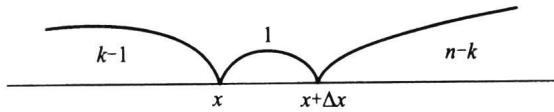  
图5.3.5 $\pmb { x } _ { ( k ) }$ 取值的示意图

样本的每一个分量小于等于x的概率为 $F ( x )$ ，落入区间 $\left( { \boldsymbol { x } } , { \boldsymbol { x } } + \Delta { \boldsymbol { x } } \right]$ 的概率为 $F ( x +$ $\Delta x ) - F ( x )$ ，大于 $x + \Delta x$ 的概率为 $1 - F \left( { x + \Delta x } \right)$ ，而将n个分量分成这样的三组，总的分法有 $\frac { n ! } { \left( k - 1 \right) ! 1 ! \left( n - k \right) ! }$ 种.于是，若以 $\boldsymbol { F } _ { \boldsymbol { k } } ( \boldsymbol { x } )$ 记 $x _ { ( k ) }$ 的分布函数，则由多项分布可得

$$
\begin{array} { c } { { F _ { k } ( x + \Delta x ) - F _ { k } ( x ) \approx \displaystyle \frac { n ! } { ( k - 1 ) ! ( n - k ) ! } ( F ( x ) ) ^ { k - 1 } ( F ( x + \Delta x ) - \frac { 1 + \Delta x } { ( k - 1 ) ! } ) } } \\ { { F ( x ) ) ( 1 - F ( x + \Delta x ) ) ^ { n - k } , } } \end{array}
$$

两边除以△x，并令△x→0,即有

$$
\begin{array} { l } { \displaystyle p _ { k } ( \boldsymbol { x } ) = \operatorname* { l i m } _ { \Delta x \to 0 } \frac { \boldsymbol { F } _ { k } ( \boldsymbol { x } + \Delta \boldsymbol { x } ) - \boldsymbol { F } _ { k } ( \boldsymbol { x } ) } { \Delta x } } \\ { \displaystyle = \frac { n ! } { \left( k - 1 \right) ! \left( n - k \right) ! } ( F ( \boldsymbol { x } ) ) ^ { k - 1 } p ( \boldsymbol { x } ) \left( 1 - F ( \boldsymbol { x } ) \right) ^ { n - k } , } \end{array}
$$

其中 $p _ { k } ( x )$ 的非零区间与总体的非零区间相同.特别，令k=1和 $k = n$ 即得到最小次序统计量 $\boldsymbol { x } _ { ( 1 ) }$ 和最大次序统计量 $\boldsymbol { x } _ { ( n ) }$ 的密度函数分别为

$$
p _ { 1 } ( x ) = n \cdot ( 1 - F ( x ) ) ^ { \scriptscriptstyle n - 1 } p ( x ) ,\tag{5.3.14}
$$

$$
p _ { \mathfrak { n } } ( x ) = { \mathfrak { n } } \cdot ( F ( x ) ) ^ { { \mathfrak { n } } - { \mathfrak { l } } } p ( x ) .\tag{5.3.15}
$$

例5.3.7设总体密度函数为

$$
p ( x ) = 3 x ^ { 2 } , \qquad 0 < x < 1 ,
$$

现从该总体抽得一个容量为5的样本，试计算 $P ( x _ { ( 2 ) } < 1 / 2 )$

解我们首先应求出x(2)的分布.由总体密度函数不难求出总体分布函数为 $\boldsymbol { x } _ { ( 2 ) }$

$$
F ( x ) = \left\{ \begin{array} { l l } { 0 , } & { x \leqslant 0 , } \\ { x ^ { 3 } , } & { 0 < x < 1 , } \\ { 1 , } & { x \geqslant 1 . } \end{array} \right.
$$

由公式（5.3.13）可以得到 $\boldsymbol { x } _ { ( 2 ) }$ 的密度函数为

$$
\begin{array} { l } { p _ { 2 } ( x ) = \displaystyle \frac { 5 ! } { \left( 2 - 1 \right) ! \ \left( 5 - 2 \right) ! } { \left( F ( x ) \right) ^ { 2 - 1 } p ( x ) \left( 1 - F ( x ) \right) ^ { 5 - 2 } } } \\ { = 2 0 \cdot x ^ { 3 } \cdot 3 x ^ { 2 } \cdot ( 1 - x ^ { 3 } ) ^ { 3 } } \\ { = 6 0 x ^ { 5 } ( 1 - x ^ { 3 } ) ^ { 3 } , \qquad 0 < x < 1 , } \end{array}
$$

于是

$$
\begin{array} { r l r } { P ( x _ { ( 2 ) } \ < \ 1 / \ 2 ) = \displaystyle \int _ { 0 } ^ { 1 / 2 } 6 0 x ^ { 5 } ( \ 1 \ - x ^ { 3 } ) ^ { 3 } \mathrm { d } x } \\ { \displaystyle } & { } & \\ { \displaystyle } & { = \displaystyle \int _ { 0 } ^ { 1 / 8 } 2 0 y ( \ 1 \ - y ) ^ { 3 } \mathrm { d } y = \displaystyle \int _ { \gamma , \ / 8 } ^ { 1 } 2 0 ( z ^ { 3 } \ - z ^ { 4 } ) \mathrm { d } z } \\ { \displaystyle } & { } & \\ { \displaystyle } & { = 5 \bigg ( 1 \ - \bigg ( \displaystyle \frac { 7 } { 8 } \bigg ) ^ { 4 } \bigg ) \ - \ 4 \bigg ( 1 \ : - \bigg ( \displaystyle \frac { 7 } { 8 } \bigg ) ^ { 5 } \bigg ) = 0 . 1 2 0 \ 7 . } \end{array}
$$

例5.3.8设总体分布为 $U ( 0 , 1 ) , x _ { 1 } , x _ { 2 } , \cdots , x _ { n }$ 为样本，则其第k个次序统计量的密度函数为

$$
p _ { k } ( x ) = { \frac { n ! } { ( k - 1 ) ! { \mathrm { ~ ( } n - k ) ! } } } x ^ { k - 1 } ( 1 - x ) ^ { n - k } , \qquad 0 < x < 1 ,
$$

这就是82.5中介绍的贝塔分布 $B e ( k , n { - } k { + } 1 )$ ，从而有 $E ( x _ { ( k ) } ) = \frac { k } { n + 1 } .$

## 三、多个次序统计量及其函数的分布

下面我们讨论任意两个次序统计量的联合分布.对三个或三个以上次序统计量的分布可参照进行.

定理5.3.4在定理5.3.3的记号下，次序统计量 $\begin{array} { r l } { \left( \pmb { x } _ { ( i ) } , \pmb { x } _ { ( j ) } \right) } & { { } ( i \pmb { < } j ) } \end{array}$ 的联合分布密度函数为

$$
\begin{array} { l }  { p _ { i j } ( y , z ) = \displaystyle \frac { n ! } { ( i - 1 ) ! \begin{array} { l } { { ( j - i - 1 ) ! } } \end{array} ( n - j ) ! \begin{array} {array} { l } { { \displaystyle \left[ F ( y ) \right] ^ { i - 1 } \left[ F ( z ) - F ( y ) \right] ^ { j - i - 1 } \ . } } \end{array} } } \\ { { \left[ 1 - F ( z ) \right] ^ { n - j } p ( y ) p ( z ) \ , \quad \quad y \leqslant z , } } \end{array} \nonumber\tag{.3.16}
$$

证明对增量 $\Delta y , \Delta z$ 以及 $y < z$ ,事件 $\left\{ x _ { _ { ( i ) } } \in \left( \gamma , y + \Delta y \right] , x _ { _ { ( j ) } } \in \left( z , z + \Delta z \right] \right\}$ 可以表述为“容量为n的样本 $x _ { 1 } , x _ { 2 } , \cdots , x _ { n }$ 中有i-1个观测值小于等于 $y , -$ 个落人区间 $( \boldsymbol { y } , \boldsymbol { y } +$ $\Delta y ] , j - i - 1$ 个落人区间 $\left( y + \Delta y , z \right]$ ，一个落入区间 $\left( z , z + \Delta z \right]$ ，而余下 $n { - } j$ 个大于 $z + \Delta z "$ （见图5.3.6）.

于是由多项分布可得

$$
\begin{array} { c l } { { } } & { { P ( x _ { ( i ) } \in \left( y , y + \Delta y \right) , x _ { ( j ) } \in \left( z , z + \Delta z \right) ) } } \\ { { } } & { { } } \\ { { } } & { { \approx \displaystyle \frac { n ! } { \left( i - 1 \right) ! 1 ! \left( j - i - 1 \right) ! 1 ! \left( n - j \right) ! } \big [ F ( y ) \big ] ^ { i - 1 } p ( y ) \Delta y \big [ F ( z ) - f ( z ) \big ] ^ { i } } } \\ { { } } & { { } } \\ { { } } & { { F ( y + \Delta y ) \big ] ^ { j - i - 1 } p ( z ) \Delta z \big [ 1 - F ( z + \Delta z ) \big ] ^ { n - j } , } } \end{array}
$$

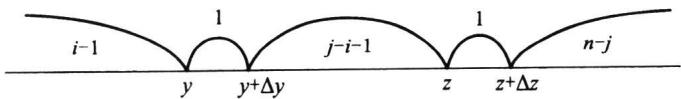  
图5.3.6 $\pmb { x } _ { ( i ) }$ 与 $\boldsymbol { x } _ { ( j ) }$ 取值的示意图

考虑到 $\boldsymbol { F } ( \boldsymbol { x } )$ 的连续性，当 $\Delta y {  } 0 , \Delta z {  } 0$ 时有 $F ( \gamma + \Delta y ) {  } F ( \gamma ) , F ( z + \Delta z ) {  } F ( z )$ ,于是

$$
\begin{array} { l } { \displaystyle p _ { i j } ( y , z ) = \operatorname* { l i m } _ { \Delta y \to 0 , \Delta z \to 0 } \frac { P ( x _ { ( i ) } \ \in \ b ( \gamma , y + \Delta y ) , x _ { ( j ) } \ \in \ ( z , z + \Delta z ) ) } { \Delta y \cdot \Delta z } } \\ { \displaystyle = \frac { n ! } { ( i - 1 ) ! \ ( j - i - 1 ) ! \ ( n - j ) ! } \big [ F ( y ) \big ] ^ { i - 1 } \big [ F ( z ) \ - \big ] } \\ { \displaystyle F ( y ) \big ] ^ { j - i - 1 } \big [ 1 - F ( z ) \big ] ^ { n - j } p ( y ) p ( z ) . } \end{array}
$$

定理得证.

在实际问题中会用到一些次序统计量的函数，如： $\begin{array} { r } { R _ { n } = x _ { ( n ) } - x _ { ( 1 ) } } \end{array}$ 称为样本极差，是一个很常用的统计量，要推导这个统计量的分布原则上并不难，我们只要使用定理5.3.4以及第三章讲过的随机变量函数的分布求法即可解决.但它们的分布常用积分表示，只在很少几种场合可用初等函数表示，下面是一个样本极差的分布可用初等函数表示的例子.

例5.3.9设总体分布为 $U ( 0 , 1 ) , x _ { 1 } , x _ { 2 } , \cdots , x _ { n }$ 为其样本，则 $( Y , Z ) = ( x _ { ( 1 ) } , x _ { ( n ) } )$ 的联合密度函数为

$$
p \left( y , z \right) = n \left( n - 1 \right) \left( z - y \right) ^ { n - 2 } , \qquad 0 < y < z < 1 .
$$

令 $R = Z - Y$ ，由 $R { > } 0 , 0 { < } Y { < } Z { < } 1$ ，可以推出 $0 < Y = Z - R \leqslant 1 - R$ ,则（Y,R）的联合分布密度为$p (  y , r ) = n ( n - 1 ) r ^ { n - 2 } , \qquad y > 0 , r > 0 , y + r < 1 ,$

于是R的边际密度函数为

$$
p _ { R } ( r ) = \int _ { 0 } ^ { 1 - r } n ( n - 1 ) r ^ { n - 2 } \mathrm { d } y = n ( n - 1 ) r ^ { n - 2 } ( 1 - r ) , \quad 0 < r < 1 ,
$$

这正是参数为(n-1,2)的贝塔分布.

## 5.3.6样本分位数与样本中位数

样本中位数mo.s也是一个很常见的统计量,它也是次序统计量的函数，通常如下 $m _ { 0 . 5 }$ 定义：

$$
m _ { 0 . 5 } = \left\{ \begin{array} { l l } { { \displaystyle x _ { \left( \frac { n + 1 } { 2 } \right) } ~ , } } & { { ~ n ~ \lambda \nrightarrow j \nrightarrow \infty } } \\ { { \displaystyle \frac { 1 } { 2 } \left( \begin{array} { l l } { { \displaystyle x _ { \left( \frac { n } { 2 } \right) } } } & { { \displaystyle + ~ x _ { \left( \frac { n } { 2 } + 1 \right) } } } \end{array} \right) ~ , } } & { { ~ n ~ \lambda \nrightarrow j \nrightarrow \infty } } \end{array} \right.
$$

譬如，若 $n = 5$ ，则 $m _ { 0 . 5 } = x _ { ( 3 ) }$ ，若 $n = 6$ ,则 ${ m _ { 0 . 5 } = \frac { 1 } { 2 } ( \pmb { x } _ { ( 3 ) } + \pmb { x } _ { ( 4 ) } ) }$

更一般地，样本p分位数 $m _ { p }$ 可如下定义：

$$
m _ { p } = \left\{ \begin{array} { l l } { { \displaystyle x _ { ( [ n p + 1 ] ) } , } } & { { \stackrel { \scriptscriptstyle + \pm } { \in } n p \stackrel { \scriptscriptstyle } { \wedge } \stackrel { \scriptscriptstyle } { \in } \frac { \scriptscriptstyle + \ast } { \scriptscriptstyle \mathscr { E } } \stackrel { \scriptscriptstyle + \ast } { \scriptscriptstyle \mathscr { E } } \stackrel { \scriptscriptstyle } { \times } \big \} \big \{ \big \} , } } \\ { { \displaystyle \frac { 1 } { 2 } \big ( x _ { ( n p ) } + x _ { ( n p + 1 ) } \big ) , } } &  { \stackrel { \scriptscriptstyle + \pm } { \in } n p \stackrel { \scriptscriptstyle } { \underset { \mathscr { A } } { \wedge } \stackrel { \scriptscriptstyle } { \in } \frac { \scriptscriptstyle + \ast } { \scriptscriptstyle \mathscr { E } } \stackrel { \scriptscriptstyle + \ast } { \scriptscriptstyle \mathscr { E } } \big \} \big \{ \big \} . } } \end{array} \right.
$$

譬如，若 $n = 1 0 , p = 0 . 3 5$ ,则 $m _ { 0 . 3 5 } = x _ { ( 4 ) }$ ，若 $n = 2 0 , p = 0 . 4 5$ ，则 $m _ { 0 . 4 5 } = \frac { 1 } { 2 } \big ( \pmb { x } _ { ( 9 ) } + \pmb { x } _ { ( 1 0 ) } \big )$

对多数总体而言，要给出样本p分位数的精确分布通常不是一件容易的事.幸运的是当 $n { \longrightarrow } \infty$ 时样本p分位数的渐近分布有比较简单的表达式，我们这里不加证明地给 $p$ 出如下定理.

定理5.3.5设总体密度函数为 $p ( \boldsymbol { x } ) , \boldsymbol { x } _ { p }$ 为其p分位数 ${ \bf \nabla } , p ( { \bf \nabla } x )$ 在 $\boldsymbol { x } _ { p _ { } }$ 处连续且 $p ( \pmb { x } _ { p } ) >$ 0,则当 $n { \longrightarrow } \infty$ 时样本p分位数 $m _ { p }$ 的渐近分布为

$$
m _ { p } \therefore N \bigg ( x _ { p } , \frac { p ( 1 - p ) } { n \cdot p ^ { 2 } ( x _ { p } ) } \bigg ) .\tag{5.3.17}
$$

特别,对样本中位数,当n→时近似地有

$$
m _ { 0 . 5 } \stackrel { . } { \sim } N \bigg ( x _ { 0 . 5 } , \frac { 1 } { 4 n \cdot p ^ { 2 } ( x _ { 0 . 5 } ) } \bigg ) .\tag{(5.3.18}
$$

例5.3.10设总体为柯西分布,密度函数为

$$
p \left( x ; \theta \right) = \frac { 1 } { \pi \left( 1 + \left( x - \theta \right) \right) ^ { 2 } } , \qquad - \infty < x < \infty \ ,
$$

其分布函数为

$$
F \left( x ; \theta \right) = \frac { 1 } { 2 } + \frac { 1 } { \pi } \mathbf { a r c t a n } \left( x - \theta \right) .
$$

不难看出θ是该总体的中位数，即 $\qquad x _ { 0 . 5 } = \theta .$ 设 $x _ { 1 } , x _ { 2 } , \cdots , x _ { n }$ 是来自该总体的样本，当样本量n较大时，样本中位数mo.s的渐近分布为 $m _ { 0 . 5 }$

$$
m _ { 0 . 5 } \stackrel { . } { \sim } N \bigg ( \theta , { \frac { \pi ^ { 2 } } { 4 n } } \bigg ) \ .
$$

通常，样本均值在概括数据方面具有一定的优势.但样本均值也有其不足之处.设我们有5个数3,5,9,10,13,则其均值为 $( 3 + 5 + 9 + 1 0 + 1 3 ) / 5 = 8$ 如果我们不小心将13错输入为133（比如在计算机输入时将3连按2下），则均值即变为（3+5+9+10+133）/5$= 3 2 .$ .这说明均值受极端数值影响较大，与之相对应，中位数则不受极端值的影响，因此，当数据中含有极端值时，使用中位数比使用均值更好，中位数的这种抗干扰性在统计中称为具有稳健性.

## 5.3.7五数概括与箱线图

次序统计量的应用之一是五数概括与箱线图.在得到有序样本后，容易计算如下五个值：最小观测值 ${ x _ { \operatorname* { m i n } } } = { x _ { ( 1 ) } }$ ，最大观测值 $x _ { \mathfrak { m a x } } = x _ { ( { \mathfrak { n } } ) }$ ，中位数 $m _ { 0 . 5 }$ ，第一4分位数 $Q _ { 1 } =$ $m _ { 0 . 2 5 }$ 和第三4分位数 $Q _ { 3 } = m _ { 0 . 7 5 } ,$ 所谓五数概括就是指用这五个数

$$
x _ { \_ 0 \_ s } , \qquad Q _ { _ 1 } , \qquad m _ { _ 0 . 5 } , \qquad Q _ { _ 3 } , \qquad x _ { _ { m a x } }
$$

来大致描述一批数据的轮廓.

例5.3.11表5.3.7是某厂160名销售人员某月的销售量数据的有序样本，由该批数据可计算得到： $x _ { \_ } = 4 5 , x _ { \_ } = 3 1 9 , m _ { _ { 0 . 5 } } = 1 8 1 , Q _ { _ { 1 } } = 1 4 4 , Q _ { _ { 3 } } = 2 1 2$

表5.3.7某厂160名销售员的月销售量的有序样本
<table><tr><td>45</td><td>74</td><td>76</td><td>80</td><td>87</td><td>91</td><td>92</td><td>93</td><td>95</td><td>96</td></tr><tr><td>98</td><td>99</td><td>104</td><td>106</td><td>111</td><td>113</td><td>117</td><td>120</td><td>122</td><td>122</td></tr><tr><td>124</td><td>126</td><td>127</td><td>127</td><td>129</td><td>129</td><td>130</td><td>131</td><td>131</td><td>133</td></tr><tr><td>134</td><td>134</td><td>135</td><td>136</td><td>137</td><td>137</td><td>139</td><td>141</td><td>141</td><td>143</td></tr><tr><td>145</td><td>148</td><td>149</td><td>149</td><td>149</td><td>150</td><td>150</td><td>153</td><td>153</td><td>153</td></tr><tr><td>153</td><td>154</td><td>157</td><td>160</td><td>160</td><td>162</td><td>163</td><td>163</td><td>165</td><td>165</td></tr><tr><td>167</td><td>167</td><td>168</td><td>170</td><td>171</td><td>172</td><td>173</td><td>174</td><td>175</td><td>175</td></tr><tr><td>176</td><td>178</td><td>178</td><td>178</td><td>179</td><td>179</td><td>179</td><td>180</td><td>181</td><td>181</td></tr><tr><td>181</td><td>182</td><td>182</td><td>185</td><td>185</td><td>186</td><td>186</td><td>187</td><td>188</td><td>188</td></tr><tr><td>188</td><td>189</td><td>189</td><td>191</td><td>191</td><td>191</td><td>192</td><td>192</td><td>194</td><td>194</td></tr><tr><td>194</td><td>194</td><td>195</td><td>196</td><td>197</td><td>197</td><td>198</td><td>198</td><td>198</td><td>199</td></tr><tr><td>200</td><td>201</td><td>202</td><td>204</td><td>204</td><td>205</td><td>205</td><td>206</td><td>207</td><td>210</td></tr><tr><td>214</td><td>214</td><td>215</td><td>215</td><td>216</td><td>217</td><td>218</td><td>219</td><td>219</td><td>221</td></tr><tr><td>221</td><td>221</td><td>221</td><td>221</td><td>222</td><td>223</td><td>223</td><td>224</td><td>227</td><td>227</td></tr><tr><td>228</td><td>229</td><td>232</td><td>234</td><td>234</td><td>238</td><td>240</td><td>242</td><td>242</td><td>242</td></tr><tr><td>244</td><td>246</td><td>253</td><td>253</td><td>255</td><td>258</td><td>282</td><td>290</td><td>314</td><td>319</td></tr></table>

五数概括的图形表示称为箱线图，由箱子和线段组成.图5.3.7是例5.3.11中样本数据的箱线图，其作法如下：

（1）画一个箱子，其两侧恰为第一4分位数和第三4分位数，在中位数位置上画一条竖线，它在箱子内.这个箱子包含了样本中50%的数据；

（2）在箱子左右两侧各引出一条水平线，分别至最小值和最大值为止.每条线段包含了样本中25%的数据.

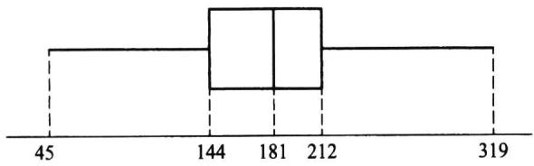  
图5.3.7月销售量数据的箱线图

箱线图可用来对样本数据分布的形状进行大致的判断.图5.3.8给出三种常见的箱线图，分别对应左偏分布、对称分布和右偏分布.

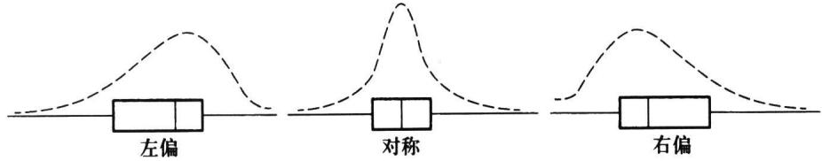  
图5.3.8三种常见的箱线图及其对应的分布轮廓

如果我们要对几批数据进行比较，则可以在一张纸上同时画出这几批数据的箱线图.图5.3.9是根据某厂20天生产的某种产品的直径数据画成的箱线图，从图中可以清楚地看出，第18天的产品出现了异常.

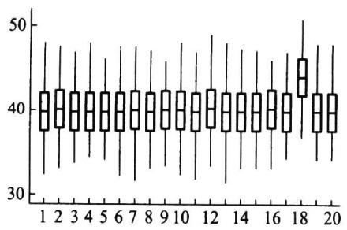  
图5.3.920天生产的某产品的直径的箱线图

## 习题5.3

1.在一本书上我们随机地检查了10页，发现每页上的错误数为：

## 4560314214

试计算其样本均值、样本方差和样本标准差.

2.证明：对任意常数 $c , d$ 有

$$
\sum _ { i = 1 } ^ { n } \left( x _ { i } - c \right) \left( y _ { i } - d \right) \ = \ \sum _ { i = 1 } ^ { n } \left( x _ { i } - { \overline { { x } } } \right) \left( y _ { i } - { \overline { { y } } } \right) \ + n \left( { \overline { { x } } } - c \right) \left( { \overline { { y } } } - d \right) .
$$

3.设 $x _ { 1 } , x _ { 2 } , \cdots , x _ { n }$ 和 $y _ { 1 } , y _ { 2 } , \cdots , y _ { n }$ 是两组样本观测值，且有如下关系：

$$
y _ { i } = 3 x _ { i } - 4 , i = 1 , 2 , \cdots , n ,
$$

试求样本均值x和y间的关系以及样本方差 ${ \ s } _ { \star } ^ { 2 }$ 和 $s _ { y } ^ { 2 }$ 间的关系.

4.记 ${ \overline { { x } } } _ { n } = { \frac { 1 } { n } } \sum _ { i = 1 } ^ { n } x _ { i } , s _ { n } ^ { 2 } \ = { \frac { 1 } { n - 1 } } \sum _ { i = 1 } ^ { n } \left( x _ { i } - { \overline { { x } } } _ { n } \right) ^ { 2 } , n \ = \ 1 , 2 , \cdots$ ，证明：

$$
\overline { { { x } } } _ { n + 1 } \ = \ \overline { { { x } } } _ { n } \ + \frac { 1 } { n \ + \ 1 } ( \ x _ { n + 1 } \ - \ \overline { { { x } } } _ { n } ) \ ,
$$

$$
s _ { n + 1 } ^ { 2 } \ = \frac { n - 1 } { n } s _ { n } ^ { 2 } \ + \frac { 1 } { n \ + \ 1 } \big ( \ x _ { n + 1 } \ - \ \overline { { x } } _ { n } \big ) \ ^ { 2 } .
$$

5.从同一总体中抽取两个容量分别为n,m的样本，样本均值分别为 $\overline { { \boldsymbol { x } } } _ { 1 } , \overline { { \boldsymbol { x } } } _ { 2 }$ ，样本方差分别为 $s _ { \scriptscriptstyle 1 } ^ { 2 }$ $s _ { 2 } ^ { 2 }$ ，将两组样本合并，其均值、方差分别为 ${ \overline { { x } } } , s ^ { 2 }$ ，证明：

$$
\begin{array} { l } { \displaystyle \overline { { x } } = \frac { n \overline { { x } } _ { 1 } + m \overline { { x } } _ { 2 } } { n + m } , } \\ { \displaystyle s ^ { 2 } = \frac { \left( n - 1 \right) s _ { 1 } ^ { 2 } + \left( m - 1 \right) s _ { 2 } ^ { 2 } } { n + m - 1 } + \frac { n m \left( \overline { { x } } _ { 1 } - \overline { { x } } _ { 2 } \right) ^ { 2 } } { \left( n + m \right) \left( n + m + 1 \right) } . } \end{array}
$$

6.设有容量为n的样本A，它的样本均值为x，样本标准差为s，样本极差为R，样本中位数为 $\overline { { \pmb { x } } } _ { A }$ $s _ { A }$ $R _ { \scriptscriptstyle A }$ $m _ { \iota }$ .现对样本中每一个观测值施行变换

$$
y = a x + b ,
$$

如此得到样本B,试写出样本B的均值、标准差、极差和中位数.

7.证明：容量为2的样本 $x _ { 1 } , x _ { 2 }$ 的方差为

$$
s ^ { 2 } = \frac { 1 } { 2 } ( x _ { 1 } - x _ { 2 } ) ^ { 2 } .
$$

8.设 $x _ { 1 } , x _ { 2 } , \cdots , x _ { n }$ 是来自U（-1,1）的样本，试求 $E ( \stackrel { - } { x } )$ 和 $\mathbf { V } \mathbf { a r } ( { \overline { { x } } } )$

9.设总体二阶矩存在 $, x _ { 1 } , x _ { 2 } , \cdots , x _ { n }$ 是样本，证明 $\pmb { x } _ { i } - \overline { { \pmb { x } } }$ 与 $\begin{array} { r l r l } { x _ { j } - \overline { { x } } } & { { } ( i \neq j ) } \end{array}$ 的相关系数为 $- \left( n - 1 \right) ^ { - 1 }$

10.设 $x _ { 1 } , x _ { 2 } , \cdots , x _ { n }$ 为一个样本， $s ^ { 2 } = \frac { 1 } { n - 1 } \sum _ { i = 1 } ^ { n } ( x _ { i } - \overline { x } ) ^ { 2 }$ 是样本方差，试证：

$$
\frac { 1 } { n \left( n - 1 \right) } \sum _ { i < j } \left( x _ { i } - x _ { j } \right) ^ { 2 } \ = \ s ^ { 2 } .
$$

11.设总体4阶中心矩 $\nu _ { \scriptscriptstyle 4 } = E \big [ x - E ( x ) \big ] ^ { \scriptscriptstyle 4 }$ 存在，试证：对样本方差 $s ^ { 2 } = \frac { 1 } { n - 1 } \sum _ { i = 1 } ^ { n } ( x _ { i } - \overline { x } ) ^ { 2 }$ ，有

$$
\operatorname { V a r } { \left( s ^ { 2 } \right) } = { \frac { n \left( \nu _ { 4 } - \sigma ^ { 4 } \right) } { \left( n - 1 \right) ^ { 2 } } } - { \frac { 2 \left( \nu _ { 4 } - 2 \sigma ^ { 4 } \right) } { \left( n - 1 \right) ^ { 2 } } } + { \frac { \nu _ { 4 } - 3 \sigma ^ { 4 } } { n \left( n - 1 \right) ^ { 2 } } } ,
$$

其中 $\sigma ^ { 2 }$ 为总体X的方差.

12.设总体X的3阶矩存在，若 $x _ { 1 } , x _ { 2 } , \cdots , x _ { n }$ 是取自该总体的简单随机样本 $, { \overline { { x } } }$ 为样本均值 $, s ^ { 2 }$ 为样本方差，试证 $\operatorname { C o v } ( \overline { x } , s ^ { 2 } ) = \frac { \nu _ { 3 } } { n }$ ，其中 ${ \pmb { \nu } } _ { 3 } = E { \left[ \begin{array} { l } { { \pmb { x } } - E { \left( \begin{array} { l } { x } \end{array} \right) } } \end{array} \right] } ^ { 3 }$

13.设 $\overline { { \pmb { x } } } _ { 1 }$ 与 $\overline { { \pmb { x } } } _ { 2 }$ 是从同一正态总体 $N ( \mu , \sigma ^ { 2 } )$ 独立抽取的容量相同的两个样本均值.试确定样本容量n，使得两样本均值的差超过 $_ { \sigma }$ 的概率不超过0.01.

14.利用切比雪夫不等式求抛均匀硬币多少次才能使正面朝上的频率落在(0.4，0.6)间的概率至少为0.9.如何才能更精确地计算这个次数？是多少？

15.从指数总体Exp（1/0）抽取了40个样品，试求x的渐近分布.

16.设 $x _ { 1 } , x _ { 2 } , \cdots , x _ { 2 5 }$ 是从均匀分布U（0，5)抽取的样本，试求样本均值 $\overline { { x } }$ 的渐近分布.

17.设 $x _ { 1 } , x _ { 2 } , \cdots , x _ { 2 0 }$ 是从二点分布 $b ( \boldsymbol { \textbf { l } } , p )$ 抽取的样本，试求样本均值 $\stackrel { - } { x }$ 的渐近分布.

18.设 $x _ { 1 } , x _ { 2 } , \cdots , x _ { 8 }$ 是从正态总体 $N ( \ 1 0 , 9 )$ 中抽取的样本，试求样本均值x的标准差.

19.切尾均值也是一个常用的反映样本数据的特征量，其想法是将数据的两端的值舍去，而用剩下的当中的值来计算样本均值，其计算公式是

$$
\overline { { { x } } } _ { \alpha } ~ = ~ \frac { x _ { \left( \left[ n \alpha \right] + 1 \right) } ~ + ~ x _ { \left( \left[ n \alpha \right] + 2 \right) } ~ + ~ \cdots ~ + ~ x _ { \left( n - \left[ n \alpha \right] \right) } } { n ~ - ~ 2 \left[ n \alpha \right] } ,
$$

其中 $0 < \alpha < 1 / 2$ 是切尾系数， $x _ { ( 1 ) } \leqslant x _ { ( 2 ) } \leqslant \cdots \leqslant x _ { ( n ) }$ 是有序样本.现我们在某高校采访了16名大学生， $\daleth$ 解他们平时的学习情况，以下数据是大学生每周用于看电视的时间（单位：h）：

$$
\begin{array} { r } { 1 5 \quad 1 4 \quad 1 2 \quad 9 \quad 2 0 \quad 4 \quad 1 7 \quad 2 6 \quad 1 5 \quad 1 8 \quad 6 \quad 1 0 \quad 1 6 \quad 1 5 \quad 5 \quad 8 } \end{array}
$$

取 $\alpha = 1 / 1 6$ ，试计算其切尾均值.

20.有一个分组样本如下：
<table><tr><td>区间</td><td>组中值 频数</td></tr><tr><td>（145,155]</td><td>150 4</td></tr><tr><td>(155,165]</td><td>160 8</td></tr><tr><td>（165,175]</td><td>170 6</td></tr><tr><td>（175,185]</td><td>180 2</td></tr></table>

试求该分组样本的样本均值、样本标准差、样本偏度和样本峰度.

21.检查四批产品，其批量与不合格品率如下：

<table><tr><td>批号</td><td>批量</td><td>不合格品率</td></tr><tr><td>1</td><td>100</td><td>0.05</td></tr><tr><td>2</td><td>300</td><td>0.06</td></tr><tr><td>3</td><td>250</td><td>0.04</td></tr><tr><td>4</td><td>150</td><td>0.03</td></tr></table>

试求这四批 $\scriptstyle { \vec { r } } ^ { \pm }$ 品的总不合格品率.

22.设总体以等概率取1,2,3,4,5，现从中抽取一个容量为4的样本，试分别求 $\boldsymbol { x } _ { ( 1 ) }$ 和 $x _ { ( 4 ) }$ 的分布.

23.设总体X服从几何分布，即 $P \left( \boldsymbol { X } = \boldsymbol { k } \right) = p q ^ { k - 1 } , k = 1 , 2 , \cdots$ ，其中 $\scriptstyle 0 < p < 1 , q = 1 - p , x _ { 1 } , x _ { 2 } , \cdots , x _ { n }$ 为该总体的样本.求 ${ \mathfrak { X } } _ { ( n ) } \ , { \mathfrak { X } } _ { ( 1 ) }$ 的概率分布.

24.设 ${ \pmb x } _ { 1 } , { \pmb x } _ { 2 } , \cdots , { \pmb x } _ { 1 6 }$ 是来自N(8,4）的样本，试求下列概率：

(1) $P ( x _ { ( 1 6 ) } > 1 0 )$

(2) $P ( x _ { ( 1 ) } > 5 )$

25.设总体为韦布尔分布，其密度函数为

$$
p \left( x ; m , \eta \right) \ = \ \frac { m x ^ { m - 1 } } { \eta ^ { m } } \mathrm { e x p } \biggl \{ - \left( \frac { x } { \eta } \right) ^ { m } \biggr \} \ , \qquad x > 0 , m > 0 , \eta > 0 .
$$

现从中得到样本 $x _ { 1 } , x _ { 2 } , \cdots , x _ { n }$ ，证明 $\pmb { x } _ { ( 1 ) }$ 仍服从韦布尔分布，并指出其参数.

26.设总体密度函数为 $p \left( x \right) = 6 x \left( 1 - x \right) , 0 < x < 1 , x _ { \scriptscriptstyle 1 } , x _ { \scriptscriptstyle 2 } , \cdots , x _ { \scriptscriptstyle 9 }$ 是来自该总体的样本，试求样本中位数的分布.

27.证明公式

$\sum _ { k = 0 } ^ { r } { \binom { n } { k } } \ p ^ { k } ( \ 1 \ - \ p ) ^ { n - k } \ = { \frac { n ! } { r ! \ ( n - r - 1 ) ! } } { \int _ { p } ^ { 1 } } x ^ { \prime } ( \ 1 \ - \ x ) ^ { n - r - 1 } \mathrm { d } x$ ，其中 $0 \leqslant p \leqslant 1$

28.设总体X的分布函数F（x）是连续的， $x _ { ( 1 ) } , x _ { ( 2 ) } , \cdots , x _ { ( n ) }$ 为取自此总体的次序统计量，设$\pmb { \eta } _ { i } = \pmb { F } \big ( \pmb { x } _ { ( i ) } \big )$ ，试证：

（1） $\eta _ { 1 } \leq \eta _ { 2 } \leqslant \cdots \leqslant \eta _ { n }$ ，且 $\pmb { \eta } _ { i }$ 是来自均匀分布U(0,1)总体的次序统计量；

(2) $E { (  \eta _ { i }  ) } = \frac { i } { n + 1 } , \operatorname { V a r } { (  \eta _ { i }  ) } = \frac { i (  n + 1 - i ) } { ( n + 1 ) ^ { 2 } ( n + 2 ) } , 1 \leqslant i \leqslant n ;$

(3） $\pmb { \eta } _ { i }$ 和 $\pmb { \eta } _ { j }$ 的协方差矩阵为

$$
\left( \begin{array} { l l } { \frac { a _ { 1 } ( 1 - a _ { 1 } ) } { n + 2 } } & { \frac { a _ { 1 } ( 1 - a _ { 2 } ) } { n + 2 } } \\ { \frac { a _ { 1 } ( 1 - a _ { 2 } ) } { n + 2 } } & { \frac { a _ { 2 } ( 1 - a _ { 2 } ) } { n + 2 } } \end{array} \right) ,
$$

其中 $a _ { 1 } = \frac { i } { n + 1 } , a _ { 2 } = \frac { j } { n + 1 } .$

29.设总体X服从N(O,1)，从此总体获得一组样本观测值 $x _ { 1 } = 0 , x _ { 2 } = 0 . 2 , x _ { 3 } = 0 . 2 5 , x _ { 4 } = - 0 . 3$ $x _ { 5 } = - 0 . 1 , x _ { 6 } = 2 , x _ { 7 } = 0 . 1 5 , x _ { 8 } = 1 , x _ { 9 } = - 0 . 7 , x _ { 1 0 } = - 1$

（1）计算 $x = 0 . 1 5$ （即 $\pmb { x } _ { ( 6 ) } \mathinner { | { \pmb { \chi } } _ { ( 6 ) } \rangle }$ 处的 ${ \cal E } \{ F ( x _ { ( 6 ) } ) \} , \mathrm { V a r } \{ F ( x _ { ( 6 ) } ) \}$

（2）计算 $F \left( x _ { \scriptscriptstyle ( 6 ) } \right)$ 在x=0.15的分布函数值.

30.在下列密度函数下分别寻求容量为n的样本中位数 $m _ { 0 . 5 }$ 的渐近分布：

(1) $p \left( \begin{array} { l } { x } \end{array} \right) = 6 x \left( \begin{array} { l } { 1 - x } \end{array} \right) , 0 < x < 1$

(2) $p \left( x \right) = \frac { 1 } { \sqrt { 2 \pi } \sigma } \exp \Biggl \{ - \frac { \left( x - \mu \right) ^ { 2 } } { 2 \sigma ^ { 2 } } \Biggr \}$

(3) $p \left( x \right) = \left\{ { \begin{array} { l l } { 2 x , \quad 0 < x < 1 } \\ { 0 , \quad \quad \sharp \sharp \sharp _ { \cdot } ; } \end{array} } \right.$

（4） $p (  x ) = \frac { \lambda } { 2 } \mathrm { e } ^ { - \lambda | x | }$

## 31.设总体X服从双参数指数分布，其分布函数为

$$
F ( \mathbf { \Phi } x ) = \left\{ { 1 - \exp \left\{ - { \frac { x - \mu } { \sigma } } \right\} } , \quad x > \mu , \quad \right. 
$$

其中 $, - \infty < \mu < \infty , \sigma > 0 , x _ { _ { ( 1 ) } } \leqslant x _ { _ { ( 2 ) } } \leqslant \cdots \leqslant x _ { _ { ( n ) } }$ 为样本的次序统计量.试证明： $\left( n - i - 1 \right) \frac { 2 } { \sigma } \left( x _ { \left( i \right) } - x _ { \left( i - 1 \right) } \right)$ 服从自由度为2的 $\chi ^ { 2 }$ 分布 $\left( { i = 2 , 3 , \cdots , n } \right)$

32.设总体X的密度函数为

$$
p \left( x \right) = \left\{ { { 3 x } ^ { 2 } } , \quad 0 < x < 1 , \right.
$$

$x _ { ( 1 ) } \leqslant x _ { ( 2 ) } \leqslant \cdots \leqslant x _ { ( 5 ) }$ 为容量为5的取自此总体的次序统计量，试证 $\cdot \frac { x _ { ( 2 ) } } { x _ { ( 4 ) } }$ 与 $x _ { ( 4 ) }$ 相互独立.

33.（1）设 $\boldsymbol { x } _ { ( 1 ) }$ 和 $\boldsymbol { x } _ { ( n ) }$ 分别为容量n的样本的最小和最大次序统计量，证明极差 $R _ { n } = x _ { ( n ) } - x _ { ( 1 ) }$ 的分布函数

$$
F _ { _ { R _ { n } } } ( x ) = n { \int _ { - { \infty } } ^ { \infty } } \left[ F ( y + x ) - F ( y ) \right] ^ { n - 1 } p ( y ) \mathrm { d } y { \mathrm { , } }
$$

其中 $F ( y )$ 与p(y)分别为总体的分布函数与密度函数；

（2）利用(1）的结论，求总体为指数分布 $E x p \left( \lambda \right)$ 时，样本极差 $R _ { \mathfrak { n } }$ 的分布.

34.设 $x _ { 1 } , x _ { 2 } , \cdots , x _ { n }$ 是来自 $U ( 0 , \pmb \theta )$ 的样本 $x _ { ( 1 ) } \leqslant x _ { ( 2 ) } \leqslant \cdots \leqslant x _ { ( n ) }$ 为次序统计量，令

$$
\gamma _ { i } \ = \ \frac { \displaystyle x _ { ( i ) } } { \displaystyle x _ { ( i + 1 ) } } , i \ = \ 1 , 2 , \cdots , n \ - \ 1 , \qquad \gamma _ { n } \ = \ x _ { ( n ) } \ ,
$$

证明 $y _ { 1 } , y _ { 2 } , \cdots , y _ { n }$ 相互独立.

35.对下列数据构造箱线图：

<table><tr><td>472</td><td>425</td><td>447</td><td>377</td><td>341</td><td>369</td><td>412</td><td>419</td></tr><tr><td>400</td><td>382</td><td>366</td><td>425</td><td>399</td><td>398</td><td>423</td><td>384</td></tr><tr><td>418</td><td>392</td><td>372</td><td>418</td><td>374</td><td>385</td><td>439</td><td>428</td></tr><tr><td>429</td><td>428</td><td>430</td><td>413</td><td>405</td><td>381</td><td>403</td><td>479</td></tr><tr><td>381</td><td>443</td><td>441</td><td>433</td><td>419</td><td>379</td><td>386</td><td>387</td></tr></table>

36.根据调查，某集团公司的中层管理人员的年薪数据如下（单位：万元）：

<table><tr><td>40.6</td><td>39.6</td><td>43.8</td><td>36.2</td><td>40.8</td><td>37.3</td><td>39.2</td><td>42.9</td></tr><tr><td>38.6</td><td>39.6</td><td>40.0</td><td>34.7</td><td>41.7</td><td>45.4</td><td>36.9</td><td>37.8</td></tr><tr><td>44.9</td><td>45.4</td><td>37.0</td><td>35.1</td><td>36.7</td><td>41.3</td><td>38.1</td><td>37.9</td></tr><tr><td>37.1</td><td>37.7</td><td>39.2</td><td>36.9</td><td>44.5</td><td>40.4</td><td>38.4</td><td>38.9</td></tr><tr><td>39.9</td><td>42.2</td><td>43.5</td><td>44.8</td><td>37.7</td><td>34.7</td><td>36.3</td><td>39.7</td></tr><tr><td>42.1</td><td>41.5</td><td>40.6</td><td>38.9</td><td>42.2</td><td>40.3</td><td>35.8</td><td>39.2</td></tr></table>

试画出箱线图.

## §5.4三大抽样分布

大家很快会看到，有很多统计推断是基于正态分布的假设，以标准正态变量为基石而构造的三个著名统计量在实际中有广泛的应用，这是因为这三个统计量不仅有明确背景，而且其抽样分布的密度函数有显式表达式，它们被称为统计中的“三大抽样分布”.

若设 $x _ { 1 } , x _ { 2 } , \cdots , x _ { n }$ 和 $y _ { 1 } , y _ { 2 } , \cdots , y _ { m }$ 是来自标准正态分布的两个相互独立的样本，则此三个统计量的构造及其抽样分布如表5.4.1所示.

表5.4.1三个著名统计量的构造及其抽样分布
<table><tr><td>统计量的构造</td><td>抽样分布密度函数</td><td>期望</td><td>方差</td></tr><tr><td> $\chi ^ { 2 } = x _ { 1 } ^ { 2 } + x _ { 2 } ^ { 2 } + \cdots + x _ { n } ^ { 2 }$ </td><td> $p ( \gamma ) = \frac { 1 } { \Gamma \Big ( \displaystyle \frac { n } { 2 } \Big ) 2 ^ { n / 2 } } y ^ { \frac { n } { 2 } - 1 } \mathrm { e } ^ { - \frac { \gamma } { 2 } } \left( \gamma > 0 \right)$ </td><td>n</td><td> $_ { 2 n }$ </td></tr><tr><td> $F { = } \frac { ( y _ { 1 } ^ { 2 } + y _ { 2 } ^ { 2 } + \cdots + y _ { m } ^ { 2 } ) / m } { ( x _ { 1 } ^ { 2 } + x _ { 2 } ^ { 2 } + \cdots + x _ { n } ^ { 2 } ) / n }$ </td><td> $p \left( \gamma \right) = \frac { \Gamma \left( \displaystyle \frac { m + n } { 2 } \right) \left( \displaystyle \frac { m } { n } \right) ^ { m / 2 } } { \Gamma \left( \displaystyle \frac { m } { 2 } \right) \Gamma \left( \displaystyle \frac { n } { 2 } \right) } y ^ { \frac { m } { 2 } - 1 } \mathrm { ~ . ~ }$ </td><td> $\frac { n } { n - 2 }$ </td><td> $2 n ^ { 2 } ( m + n - 2 )$   $m ( n - 2 ) ^ { 2 } ( n - 4 )$ </td></tr><tr><td></td><td> $\left( 1 + { \frac { m } { n } } y \right) ^ { - { \frac { m + n } { 2 } } } ( y > 0 )$ </td><td> $( n > 2 )$ </td><td>(n&gt;4)</td></tr><tr><td> $t = { \frac { y _ { 1 } } { \sqrt { \left( { x _ { 1 } ^ { 2 } } + { x _ { 2 } ^ { 2 } } + \cdots + { x _ { n } ^ { 2 } } \right) / n } } }$ </td><td> $p \left( y \right) = \frac { \Gamma \left( \displaystyle \frac { n + 1 } { 2 } \right) } { \sqrt { n \pi } \Gamma \left( \displaystyle \frac { n } { 2 } \right) } \left( 1 + \frac { y ^ { 2 } } { n } \right) ^ { - \frac { n + 1 } { 2 } }$  (n&gt;1)</td><td>0</td><td> $\frac { n } { n - 2 }$ </td></tr></table>

下面我们将对它们逐个进行推导与说明.

## 5.4.1 $\chi ^ { 2 }$ 分布(卡方分布)

定义5.4.1设 $X _ { 1 } , X _ { 2 } , \cdots , X _ { n }$ 独立同分布于标准正态分布 $N \left( 0 , 1 \right)$ ，则$\chi ^ { 2 } = X _ { 1 } ^ { 2 } + X _ { 2 } ^ { 2 } + \cdots + X _ { n } ^ { 2 }$ 的分布称为自由度为n的 $\chi ^ { 2 }$ 分布，记为 $\chi ^ { 2 } \sim \chi ^ { 2 } ( n )$

在第三章我们已经指出，若随机变量 $X \sim N ( 0 , 1 )$ ，则 $X ^ { 2 } \sim G a \ l ( 1 / 2 , 1 / 2 )$ ，根据伽马分布的可加性立有 $\chi ^ { 2 } \sim G a \left( \pi / 2 , 1 / 2 \right) = \chi ^ { 2 } \left( \pi \right)$ ，由此可见 $\mathcal { X } ^ { 2 } \left( \mathfrak { n } \right)$ 分布是伽马分布的特例，故 $\chi ^ { 2 } ( n )$ 分布的密度函数为

$$
p \left( y \right) = \frac { \left( 1 / 2 \right) ^ { \frac { n } { 2 } } } { \Gamma \left( n / 2 \right) } y ^ { \frac { n } { 2 } - 1 } \mathrm { e } ^ { - \frac { y } { 2 } } , \qquad \gamma > 0 .\tag{5.4.1}
$$

该密度函数的图像是一个只取非负值的偏态分布，见图5.4.1,其期望等于自由度，方差等于2倍自由度，即 $E ( \chi ^ { 2 } ) = n , \mathrm { V a r } ( \chi ^ { 2 } ) = 2 n$

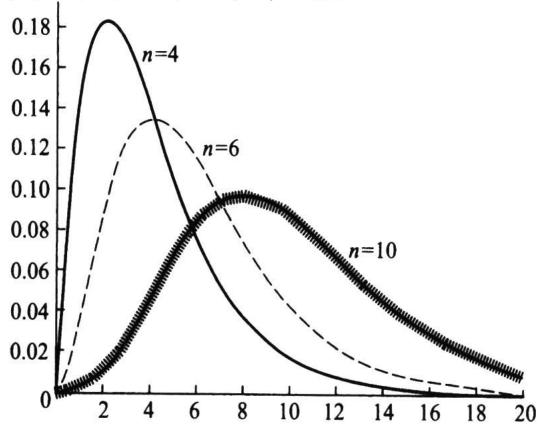  
图5.4.1 $\chi ^ { 2 } ( n )$ 分布的密度函数

例5.4.1设 $x _ { 1 } , x _ { 2 } , \cdots , x _ { n }$ 是来自正态分布 $N ( \mu , \sigma ^ { 2 } )$ 的一个样本，其中 $\pmb { \mu }$ 是已知常数,求统计量

$$
T = \sum _ { i = 1 } ^ { n } \left( x _ { i } - \mu \right) ^ { 2 }\tag{5.4.2}
$$

的分布.

解令 $y _ { i } = \left( x _ { i } – \mu \right) / \sigma , i = 1 , 2 , \cdots , n$ ,则 $y _ { 1 } , y _ { 2 } , \cdots , y _ { n }$ 是独立同分布随机变量，其共同分布为 $N ( 0 , 1 )$ ，于是由定义5.4.1知

$$
{ \frac { T } { { \sigma } ^ { 2 } } } = \sum _ { i = 1 } ^ { n } \left( { \frac { x _ { i } - \mu } { \sigma } } \right) ^ { 2 } = \sum _ { i = 1 } ^ { n } y _ { i } ^ { 2 } \sim \chi ^ { 2 } ( n ) ,
$$

而 $T$ 的密度函数为

$$
p \left( { \mathit { \Omega } } t \right) = { \frac { 1 } { \left( 2 \sigma ^ { 2 } \right) ^ { n / 2 } \Gamma \left( { \mathit { \Omega } } n / 2 \right) } } \mathrm { e } ^ { - { \frac { \mathit { \Omega } ^ { \prime } } { 2 \sigma ^ { 2 } } } t ^ { { \frac { n } { 2 } } - 1 } } , \quad t > 0 ,\tag{5.4.3}
$$

这就是伽马分布 $G a { \biggl ( } { \frac { n } { 2 } } , { \frac { 1 } { 2 \sigma ^ { 2 } } } { \biggr ) }$ .(5.4.3)式与(5.4.1)式在变量上只相差一个因子 $\sigma ^ { 2 }$

$\chi ^ { 2 }$ 分布有用的一个重要原因即是下面的定理.

定理5.4.1设 $x _ { 1 } , x _ { 2 } , \cdots , x _ { n }$ 是来自正态总体 $N ( \mu , \sigma ^ { 2 } )$ 的样本，其样本均值和样本方差分别为

$$
{ \overline { { x } } } = { \frac { 1 } { n } } \sum _ { i = 1 } ^ { n } x _ { _ i } \ { \hat { \ast } } \ / \parallel s ^ { ^ { 2 } } = { \frac { 1 } { n - 1 } } \sum _ { i = 1 } ^ { n } \left( x _ { _ i } - { \overline { { x } } } \right) ^ { 2 } ,
$$

则有

(1） $\overline { { x } }$ 与 $s ^ { 2 }$ 相互独立；

(2) $\overline { { x } } \sim N ( \mu , \sigma ^ { 2 } / n )$

(3) $\frac { \left( n - 1 \right) s ^ { 2 } } { \sigma ^ { 2 } } { \sim } \chi ^ { 2 } ( n { - } 1 ) .$

证明 $x _ { 1 } , x _ { 2 } , \cdots , x _ { n }$ 的联合密度函数为

$$
p \left( x _ { 1 } , x _ { 2 } , \cdots , x _ { n } \right) = \left( 2 \pi \sigma ^ { 2 } \right) ^ { - n / 2 } { \mathrm e } ^ { - \sum _ { i = 1 } ^ { n } \frac { \left( x _ { i } - \mu \right) ^ { 2 } } { 2 \sigma ^ { 2 } } } = \left( 2 \pi \sigma ^ { 2 } \right) ^ { - n / 2 } \exp \left\{ - \frac { \displaystyle \sum _ { i = 1 } ^ { n } x _ { i } ^ { 2 } - 2 n \overline { { x } } \mu + n \mu ^ { 2 } } { 2 \sigma ^ { 2 } } \right\}
$$

记 $\pmb { X } \equiv \left( \pmb { x } _ { 1 } , \pmb { x } _ { 2 } , \cdots , \pmb { x } _ { n } \right) ^ { \top }$ ,取一个n维正交矩阵A,其第一行的每一个元素均为 $1 / { \sqrt { n } }$ ，如

$$
A = { \left( \begin{array} { l l l l l } { { \frac { 1 } { \sqrt { n } } } } & { { \frac { 1 } { \sqrt { n } } } } & { { \frac { 1 } { \sqrt { n } } } } & { \cdots } & { { \frac { 1 } { \sqrt { n } } } } \\ { { \frac { 1 } { \sqrt { 2 } \cdot 1 } } } & { { \frac { 1 } { \sqrt { 2 \cdot 1 } } } } & { 0 } & { \cdots } & { 0 } \\ { { \frac { 1 } { \sqrt { 3 \cdot 2 } } } } & { { \frac { 1 } { \sqrt { 3 \cdot 2 } } } } & { { \frac { 2 } { \sqrt { 3 \cdot 2 } } } } & { \cdots } & { 0 } \\ { \vdots } & { \vdots } & { \vdots } & { \vdots } \\ { { \frac { 1 } { \sqrt { n ( n - 1 ) } } } } & { { \frac { 1 } { \sqrt { n ( n - 1 ) } } } } & { { \frac { 1 } { \sqrt { n ( n - 1 ) } } } } & { \cdots } & { - { \frac { n - 1 } { \sqrt { n ( n - 1 ) } } } } \end{array} \right) } ,
$$

令 $\pmb { Y } \pmb { = } \left( \ b { y } _ { 1 } , \pmb { y } _ { 2 } , \cdots , \pmb { y } _ { n } \right) ^ { \top } = \pmb { A } \pmb { X }$ ,则该变换的雅可比(Jacobi)行列式为1,且注意到

$$
\overline { { { x } } } = \frac { 1 } { \sqrt { n } } y _ { 1 } ,
$$

$$
\sum _ { i = 1 } ^ { n } y _ { i } ^ { 2 } = Y ^ { \operatorname { T } } Y = X ^ { \operatorname { T } } A ^ { \operatorname { T } } A X = \ \sum _ { i = 1 } ^ { n } x _ { i } ^ { 2 } ,
$$

于是 $y _ { 1 } , y _ { 2 } , \cdots , y _ { i }$ ，的联合密度函数为

$$
\begin{array} { l } { { \displaystyle p ( y _ { 1 } , y _ { 2 } , \cdots , y _ { n } ) = ( 2 \pi \sigma ^ { 2 } ) ^ { - n / 2 } \exp \Bigg \{ - \frac { \displaystyle \sum _ { i = 1 } ^ { n } y _ { i } ^ { 2 } - 2 \sqrt { n } y _ { 1 } \mu + n \mu ^ { 2 } } { 2 \sigma ^ { 2 } } \Bigg \} } } \\ { { = ( 2 \pi \sigma ^ { 2 } ) ^ { - n / 2 } \exp \Bigg \{ - \frac { \displaystyle \sum _ { i = 2 } ^ { n } y _ { i } ^ { 2 } + ( y _ { 1 } - \sqrt { n } \mu ) ^ { 2 } } { 2 \sigma ^ { 2 } } \Bigg \} } } \end{array}
$$

由此， $\pmb { Y } = ( \pmb { y } _ { 1 } , \pmb { y } _ { 2 } , \cdots , \pmb { y } _ { n } ) ^ { \top }$ 的各个分量相互独立，且都服从正态分布，其方差均为$\sigma ^ { 2 }$ ，而均值并不完全相同， $y _ { 2 } , \cdots , y _ { n }$ 的均值为 $0 , y _ { 1 }$ 的均值为 $\sqrt { n } \mu$ ，这就证明了结论(2).由于

$$
\bigl ( n - 1 \bigr ) s ^ { 2 } = \sum _ { i = 1 } ^ { n } \bigl ( x _ { i } - \overline { { x } } \bigr ) ^ { 2 } = \sum _ { i = 1 } ^ { n } x _ { i } ^ { 2 } - \bigl ( \sqrt { n } \overline { { x } } \bigr ) ^ { 2 } = \sum _ { i = 1 } ^ { n } y _ { i } ^ { 2 } - y _ { 1 } ^ { 2 } = \sum _ { i = 2 } ^ { n } y _ { i } ^ { 2 } ,
$$

这证明了结论(1），由于 $y _ { 2 } , \cdots , y _ { n }$ 独立同分布于 $N ( 0 , \sigma ^ { 2 } )$ ，于是

$$
{ \frac { \left( n - 1 \right) s ^ { 2 } } { { \pmb \sigma } ^ { 2 } } } = \sum _ { i = 2 } ^ { n } \left( { \frac { y _ { i } } { \pmb \sigma } } \right) ^ { 2 } \ \sim \chi ^ { 2 } ( n - 1 ) .
$$

定理证明完成.

当随机变量 $\chi ^ { 2 } \sim \chi ^ { 2 } ( n )$ 时，对给定 $\alpha ( 0 < \alpha < 1 )$ ,称满足概率等式 $P ( \chi ^ { 2 } \leqslant \chi _ { _ { 1 - \alpha } } ^ { 2 } ( n ) ) =$ $_ { 1 - \alpha }$ 的 $\chi _ { _ { 1 - \alpha } } ^ { 2 } ( \mathfrak { n } )$ 是自由度为n的 $\chi ^ { 2 }$ 分布的1-α分位数.分位数 $\chi _ { _ { 1 - \alpha } } ^ { 2 } ( \mathfrak { n } )$ 可以从附表3中查到.譬如 $n = 1 0 , \alpha = 0 . 0 5$ ，那么从附表3上查得

$$
\chi _ { _ { 1 - 0 . 0 5 } } ^ { 2 } ( 1 0 ) = \chi _ { _ { 0 . 9 5 } } ^ { 2 } ( 1 0 ) = 1 8 . 3 1 .
$$

## 5.4.2 F分布

定义5.4.2设随机变量 $X _ { 1 } { \sim } \chi ^ { 2 } ( m ) , X _ { 2 } { \sim } \chi ^ { 2 } ( n ) , X _ { 1 }$ 与 $X _ { _ 2 }$ 独立，则称 $F = \frac { X _ { 1 } / m } { X _ { 2 } / n }$ 的分布是自由度为m与n的F分布，记为 $F \sim F \left( m , n \right)$ ,其中m称为分子自由度,n称为分母自由度.

下面分两步来导出F分布的密度函数.

第一步，我们导出 $Z = { \frac { X _ { 1 } } { X _ { 2 } } }$ 的密度函数，若记 $p _ { 1 } ( x )$ 和 $p _ { 2 } \left( \boldsymbol { x } \right)$ 分别为 $\chi ^ { 2 } \left( \mathbf { \nabla } m \right)$ 和$\chi ^ { 2 } ( \mathbf { \chi } _ { n } )$ 的密度函数，根据独立随机变量商的分布的密度函数的公式（3.3.22），Z的密度函数为

$$
p _ { z } ( z ) = \int _ { 0 } ^ { \infty } x _ { 2 } p _ { 1 } ( z x _ { 2 } ) p _ { 2 } ( x _ { 2 } ) \mathrm { d } x _ { 2 }
$$

$$
= \frac { z ^ { \frac { m } { 2 } - 1 } } { \Gamma \Big ( \displaystyle \frac { m } { 2 } \Big ) ~ \Gamma \Big ( \displaystyle \frac { n } { 2 } \Big ) ~ 2 ^ { \frac { m + n } { 2 } } } \int _ { 0 } ^ { \infty } x _ { 2 } ^ { \frac { m + n } { 2 } - 1 } \mathrm { e } ^ { - \frac { x _ { 2 } } { 2 } ( 1 + z ) } \mathrm { d } x _ { 2 } ,
$$

运用变换 $u = \frac { x _ { 2 } } { 2 } \big ( 1 + z \big )$ ，可得

$$
p _ { z } ( z ) = { \frac { z ^ { \frac { m } { 2 } - 1 } ( 1 + z ) ^ { - { \frac { m + n } { 2 } } } } { \Gamma \left( { \frac { m } { 2 } } \right) \Gamma \left( { \frac { n } { 2 } } \right) } } { \int _ { 0 } ^ { \infty } u ^ { \frac { m + n } { 2 } - 1 } } \mathrm { e } ^ { - u } \mathrm { d } u ,
$$

最后的定积分为伽马函数 $\Gamma \left( { \frac { m + n } { 2 } } \right)$ ，从而

$$
p _ { z } ( z ) = \frac { \Gamma \Big ( \displaystyle \frac { m \ : + \ : n } { 2 } \Big ) } { \Gamma \Big ( \displaystyle \frac { m } { 2 } \Big ) \ : \Gamma \Big ( \displaystyle \frac { n } { 2 } \Big ) } z ^ { \frac { m } { 2 } - 1 } ( 1 + z ) ^ { - \frac { m + n } { 2 } } , \quad z \geqslant 0 .
$$

第二步，我们导出 $F = { \frac { n } { m } } Z$ 的密度函数，设F的取值为y，对 $\scriptstyle y \geq 0$ ，,有

$$
\begin{array} { c } { \displaystyle { p _ { r } ( y ) = p _ { z } \bigg ( \frac { m } { n } y \bigg ) \cdot \frac { m } { n } = \frac { \Gamma \bigg ( \frac { m + n } { 2 } \bigg ) } { \Gamma \bigg ( \frac { m } { 2 } \bigg ) \Gamma \bigg ( \frac { n } { 2 } \bigg ) } \bigg ( \frac { m } { n } y \bigg ) ^ { \frac { n } { 2 } - 1 } \bigg ( 1 + \frac { m } { n } y \bigg ) ^ { - \frac { n + s } { 2 } } \cdot \frac { m } { n } } } \\ { \displaystyle { = \frac { \Gamma \bigg ( \frac { m + n } { 2 } \bigg ) \bigg ( \frac { m } { n } \bigg ) ^ { \frac { n } { 2 } } } { \Gamma \bigg ( \frac { m } { 2 } \bigg ) \Gamma \bigg ( \frac { n } { 2 } \bigg ) } \gamma ^ { \frac { n } { 2 } - 1 } \bigg ( 1 + \frac { m } { n } y \bigg ) ^ { - \frac { n + s } { 2 } } . } } \end{array}
$$

这就是自由度为m与n的F分布的密度函数.该密度函数的图像是一个只取非负值的偏态分布（见图5.4.2）.

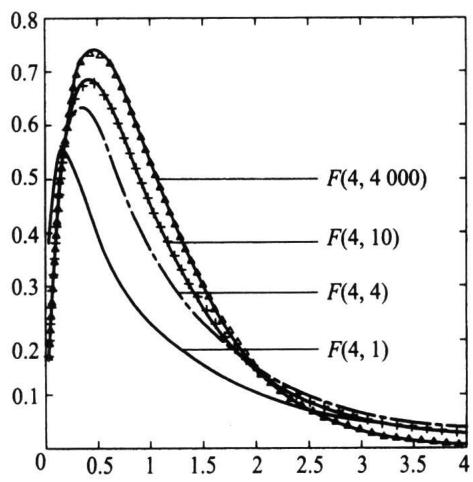  
图5.4.2F分布的密度函数

当随机变量 $F \sim F \left( m , n \right)$ 时，对给定 $\alpha ( 0 < \alpha < 1 )$ ，称满足概率等式 $P ( F \leqslant F _ { _ { 1 - \alpha } } ( m$ $n ) { \bf \Phi } ) = 1 - \alpha$ 的 $F _ { _ { 1 - \alpha } } ( m , n )$ 是自由度为m与n的F分布的1-α分位数.

由F分布的构造知,若 $F \sim F ( m , n )$ ,则有 $1 / F { \sim } F ( n , m )$ ，故对给定 $\alpha ( 0 < \alpha < 1 )$

$$
\alpha = P \bigg ( \frac { 1 } { F } \leqslant F _ { \alpha } ( n , m ) \bigg ) = P \bigg ( F \geqslant \frac { 1 } { F _ { \alpha } ( n , m ) } \bigg ) \ .
$$

从而

$$
P \bigg ( F \leqslant \frac { 1 } { F _ { \alpha } ( n , m ) } \bigg ) = 1 - \alpha ,
$$

这说明

$$
F _ { _ { \alpha } } ( n , m ) = { \frac { 1 } { F _ { _ { 1 - \alpha } } ( m , n ) } } .\tag{5.4.4}
$$

对小的 $\pmb { \alpha }$ ，分位数 $F _ { _ { 1 - \alpha } } ( \pmb { m } , \pmb { n } )$ 可以从附表5中查到，而分位数 $F _ { \alpha } \left( m , n \right)$ 则可通过(5.4.4)式得到.

例5.4.2若取 $m = 1 0 , n = 5 , \alpha = 0 . 0 5$ ,那么从附表5上查得

$$
{ F } _ { _ { 1 - 0 . 0 5 } } ( 1 0 , 5 ) = F _ { _ { 0 . 9 5 } } ( 1 0 , 5 ) = 4 . 7 4 ,
$$

利用（5.4.4）式可得到

$$
F _ { _ { 0 . 0 5 } } ( 1 0 , 5 ) = { \frac { 1 } { F _ { _ { 0 . 9 5 } } ( 5 , 1 0 ) } } = { \frac { 1 } { 3 . 3 3 } } = 0 . 3 .
$$

推论5.4.1设 $x _ { 1 } , x _ { 2 } , \cdots , x _ { m }$ 是来自 $N ( \mu _ { _ { 1 } } , \sigma _ { _ { 1 } } ^ { ^ { 2 } } )$ 的样本， $\boldsymbol { y } _ { 1 } , \boldsymbol { y } _ { 2 } , \cdots , \boldsymbol { y } _ { n }$ 是来自$N ( \mu _ { _ 2 } , { \sigma _ { _ 2 } ^ { 2 } } )$ 的样本,且此两样本相互独立，记

$$
s _ { x } ^ { ^ 2 } = \frac { 1 } { m - 1 } \sum _ { i = 1 } ^ { m } \left( x _ { i } - \overline { { x } } \right) ^ { 2 } , \quad s _ { y } ^ { ^ 2 } = \frac { 1 } { n - 1 } \sum _ { i = 1 } ^ { n } \left( y _ { i } - \overline { { y } } \right) ^ { 2 } ,
$$

其中

$$
{ \overline { { x } } } = { \frac { 1 } { m } } \sum _ { i = 1 } ^ { m } x _ { i } , { \overline { { y } } } = { \frac { 1 } { n } } \sum _ { i = 1 } ^ { n } y _ { i } ,
$$

则有

$$
F = \frac { s _ { x } ^ { 2 } / \sigma _ { 1 } ^ { 2 } } { s _ { _ { \gamma } } ^ { 2 } / \sigma _ { 2 } ^ { 2 } } \sim F ( m - 1 , n - 1 ) .\tag{5.4.5}
$$

特别，若 $\sigma _ { 1 } ^ { 2 } = { \sigma } _ { 2 } ^ { 2 }$ ，则 $F = { s _ { x } } ^ { 2 } / { s _ { , } ^ { 2 } } \sim F \left( m - 1 , n - 1 \right)$

证明由两样本独立可知 $s _ { x } ^ { 2 }$ 与 $s _ { , \gamma } ^ { 2 }$ 相互独立，由定理5.4.1知，

$$
\frac { ( m - 1 ) s _ { x } ^ { 2 } } { \sigma _ { _ { 1 } } ^ { 2 } } \sim \chi ^ { 2 } ( m - 1 ) , \quad \frac { ( n - 1 ) s _ { _ { y } } ^ { 2 } } { \sigma _ { _ { 2 } } ^ { 2 } } \sim \chi ^ { 2 } ( n - 1 ) .
$$

由F分布定义可知 $F \sim F ( m ^ { - 1 } , n - 1 )$

## 5.4.3t分布

定义5.4.3设随机变量 $X _ { \mathfrak { r } }$ 与 $X _ { 2 }$ 独立且 $X _ { 1 } \sim N ( 0 , 1 ) , X _ { 2 } \sim X ^ { 2 } ( n )$ ,则称 $t = \frac { X _ { 1 } } { \sqrt { X _ { 2 } / n } }$ 的分布为自由度为n的t分布，记为 $t \sim t ( n )$

下面导出t分布的密度函数.由标准正态密度函数的对称性知， $X _ { \iota }$ 与 $- X _ { 1 }$ 有相同分布，从而t与-t有相同分布.这意味着：对任意正实数y有

$$
P ( 0 < t < y ) = P ( 0 < - t < y ) = P ( - y < t < 0 ) ,
$$

于是

$$
P ( 0 < t < y ) = \frac { 1 } { 2 } P ( t ^ { 2 } < y ^ { 2 } ) .
$$

由F变量构造可知， ${ \mathrm { \Delta } } _ { , t } { } ^ { 2 } = { \frac { X _ { 1 } ^ { 2 } } { X _ { 2 } / n } } \sim F ( { \mathrm { \Delta } } 1 { \mathrm { \Delta } } , n )$ ，将上式两边关于y求导可得t分布的密度函数为

$$
\begin{array} { l } { \displaystyle { p _ { \varepsilon } ( y ) = y p _ { \varepsilon } ( y ^ { 2 } ) = \frac { \Gamma \left( \frac { 1 + n } { 2 } \right) \left( \frac { 1 } { n } \right) ^ { \frac { 1 } { 2 } } } { \Gamma \left( \frac { 1 } { 2 } \right) \Gamma \left( \frac { n } { 2 } \right) } ( y ^ { 2 } ) ^ { \frac { 1 } { 2 } - 1 } \Bigg ( 1 + \frac { 1 } { n } y ^ { 2 } \Bigg ) ^ { - \frac { 1 + n } { 2 } } y } } \\ { \displaystyle { = \frac { \Gamma \left( \frac { n + 1 } { 2 } \right) } { \sqrt { n \pi } \Gamma \left( \frac { n } { 2 } \right) } \Bigg ( 1 + \frac { y ^ { 2 } } { n } \Bigg ) ^ { \frac { - \ast \ast 1 } { 2 } } , \quad \mathrm { ~ \ f ~ o ~ \to ~ \ast ~ \gamma ~ < ~ \infty ~ . ~ } } } \end{array}
$$

这就是自由度为n的t分布的密度函数.

t分布的密度函数的图像是一个关于纵轴对称的分布（见图5.4.3），与标准正态分布的密度函数形状类似，只是峰比标准正态分布低一些，尾部的概率比标准正态分布的大一些.

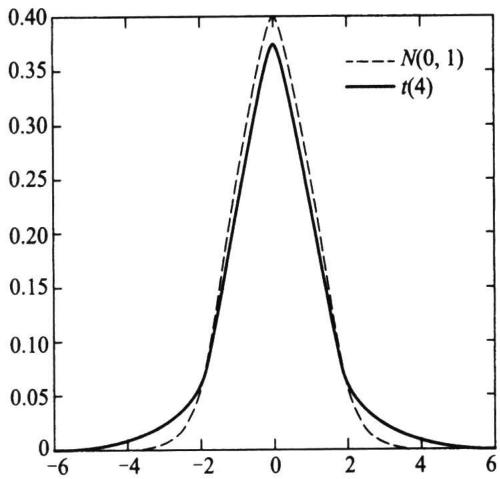  
图5.4.3t分布与N(0,1)的密度函数

·自由度为1的t分布就是标准柯西分布，它的均值不存在.

$n { > } 1$ 时，t分布的数学期望存在且为0.

$n { > } 2$ 时，t分布的方差存在，且为 $n / ( n - 2 )$

·当自由度较大（如 $n \geqslant 3 0 )$ 时,t分布可以用 $N ( 0 , 1 )$ 分布近似.

t分布是统计学中的一类重要分布，它与标准正态分布的微小差别是由英国统计学家戈塞特(Gosset)发现的.在1908年以前,统计学的主要用武之地先是社会统计，尤其是人口统计，后来加入生物统计问题.这些问题的特点是，数据一般都是大量的、自然采集的，所用的方法多以中心极限定理为依据，总是归结到正态，K.皮尔逊就是此时统计界的权威，他认为正态分布是上帝赐给人们唯一正确的分布.但到了20世纪，受人工控制的试验条件下所得数据的统计分析问题日渐引人注意.此时的数据量一般不大,故那种仅依赖于中心极限定理的传统方法开始受到质疑.这个方向的先驱就是戈塞特和费希尔.

戈塞特年轻时在牛津大学学习数学和化学，1899年开始在一家酿酒厂担任酿酒化学技师,从事试验和数据分析工作.由于戈塞特接触的样本容量都较小，只有四五个，通过大量试验数据的积累，戈塞特发现 $t = \sqrt { n } ( \overline { { x } } - \mu ) / s$ 的分布与传统认为的N（0,1）分布并不同，特别是尾部概率相差较大，表5.4.2列出了标准正态分布N(0,1)和自由度为4的t分布的一些尾部概率.

表5.4.2N(0,1）和t(4)的尾部概率 $P ( \mid X \mid \geqslant c )$
<table><tr><td></td><td> $c = 2$ </td><td>c=2.5</td><td> $c = 3$ </td><td> $c = 3 . 5$ </td></tr><tr><td> $X \sim N ( 0 , 1 )$ </td><td>0.0455</td><td>0.012 4</td><td>0.0027</td><td>0.000 465</td></tr><tr><td> $X \sim t ( 4 )$ </td><td>0.1161</td><td>0.0668</td><td>0.039 9</td><td>0.024 9</td></tr></table>

由此,戈塞特怀疑是否有另一个分布族存在,但他的统计学功底不足以解决他发现的问题,于是,戈塞特于1906年到1907年到K.皮尔逊那里学习统计学，并着重研究少量数据的统计分析问题,1908年他在Biometrics杂志上以笔名Student（工厂不允许其发表论文)发表了使他名垂统计史册的论文：均值的或然误差.在这篇文章中，他提出了如下结果：设 $x _ { 1 } , x _ { 2 } , \cdots , x _ { n }$ 是来自 $N ( \mu , \sigma ^ { 2 } )$ 的独立同分布样本 ${ } , \mu , \sigma ^ { 2 }$ 均未知，则$\frac { { \sqrt { n } } ( { \overline { { x } } } - \mu ) } { s }$ 服从自由度为n-1的t分布.可以说,t分布的发现在统计学史上具有划时代的意义，打破了正态分布一统天下的局面，开创了小样本统计推断的新纪元,小样本统计分析由此引起了广大统计科研工作者的重视.事实上，戈塞特的证明存在着漏洞，费希尔注意到这个问题并于1922年给出了此问题的完整证明，并编制了t分布的分位数表.

推论5.4.2设 $x _ { 1 } , x _ { 2 } , \cdots , x _ { n }$ 是来自正态分布 $N ( \mu , \sigma ^ { 2 } )$ 的一个样本， $\mathbf { \Pi } _ { \cdot } ^ { - }$ 与 $s ^ { 2 }$ 分别是该样本的样本均值与样本方差，则有

$$
t = { \frac { { \sqrt { n } } \left( { \frac { \ d T } { \ d x } } - \mu \right) } { s } } \sim t ( n - 1 ) .\tag{5.4.6}
$$

证明由定理5.4.1(2)可以推出

$$
\frac { \overline { { { x } } } - \mu } { \sigma / \sqrt { n } } \sim N ( 0 , 1 ) ,
$$

将(5.4.6)左端改写为

$$
{ \frac { { \sqrt { n } } ( { \overline { { x } } } - \mu ) } { s } } = { \frac { \frac { { \overline { { x } } } - \mu } { \sigma / { \sqrt { n } } } } { \sqrt { \frac { \left( n - 1 \right) s ^ { 2 } / \sigma ^ { 2 } } { n - 1 } } } } .
$$

由于分子是标准正态变量，分母的根号里是自由度为n-1的 $\chi ^ { 2 }$ 变量除以它的自由度，且分子与分母相互独立，由t分布定义可知 $t \sim t \left( n { - } 1 \right)$ ,推论证完.

推论5.4.3在推论5.4.1的记号下，设 ${ \boldsymbol { \sigma } } _ { 1 } ^ { 2 } = { \boldsymbol { \sigma } } _ { 2 } ^ { 2 } = { \boldsymbol { \sigma } } ^ { 2 }$ ，并记

$$
s _ { \nu } ^ { ^ 2 } = \frac { \left( m - 1 \right) s _ { _ x } ^ { ^ 2 } + \left( n - 1 \right) s _ { _ y } ^ { 2 } } { m + n - 2 } = \frac { \displaystyle \sum _ { i = 1 } ^ { m } \left( x _ { _ i } - \overline { { x } } \right) ^ { 2 } + \displaystyle \sum _ { i = 1 } ^ { n } \left( y _ { _ i } - \overline { { y } } \right) ^ { 2 } } { m + n - 2 } ,
$$

则

$$
\frac { \displaystyle ( \ : \overline { { x } } - \ : \overline { { y } } ) - ( \mu _ { \scriptscriptstyle 1 } - \mu _ { \scriptscriptstyle 2 } ) } { \displaystyle s _ { \scriptscriptstyle w } \sqrt { \frac { 1 } { m } + \frac { 1 } { n } } } \sim t ( m + n - 2 ) .\tag{5.4.7}
$$

证明由 $\overline { { x } } \sim N ( \mu _ { _ 1 } , \sigma ^ { 2 } / m ) , \overline { { y } } \sim N ( \mu _ { _ 2 } , \sigma ^ { 2 } / n )$ ，x与 $\overline { { y } }$ 独立,故有

$$
\overline { { { x } } } ~ - ~ \overline { { { y } } } ~ \sim ~ N \bigg ( \mu _ { _ 1 } ~ - \mu _ { _ 2 } , \bigg ( \frac { 1 } { m } ~ + ~ \frac { 1 } { n } \bigg ) ~ \sigma ^ { 2 } \bigg ) ~ ,
$$

所以

$$
\frac { \displaystyle ( \frac { \ d } { \ d x } - \frac { \ d } { \ d y } ) \ - \ ( \mu _ { 1 } \ - \mu _ { 2 } ) } { \displaystyle \sigma \sqrt { \frac { 1 } { m } + \frac { 1 } { n } } } \ \sim \ N ( \ 0 , 1 ) .
$$

由定理5.4.1知， $\frac { \left( m - 1 \right) s _ { x } ^ { 2 } } { \sigma ^ { 2 } } \sim \chi ^ { 2 } \left( m - 1 \right) , \frac { \left( n - 1 \right) s _ { y } ^ { 2 } } { \sigma ^ { 2 } } \sim \chi ^ { 2 } \left( n - 1 \right) $ ，且它们相互独立，则由可加性知

$$
\frac { \left( m + n - 2 \right) s _ { w } ^ { 2 } } { \sigma ^ { 2 } } = \frac { \left( m - 1 \right) s _ { x } ^ { 2 } + \left( n - 1 \right) s _ { y } ^ { 2 } } { \sigma ^ { 2 } } \sim \chi ^ { 2 } ( m + n - 2 ) .
$$

由于 $\overline { { x } } - \overline { { y } }$ 与 ${ s } _ { \ast } ^ { 2 }$ 相互独立，根据t分布的定义即可得到(5.4.7)式.

当随机变量 $t \sim t \left( n \right)$ 时，对给定的 $\alpha ( 0 < \alpha < 1 )$ ，称满足概率公式 $P ( \mathbf { \xi } _ { t \leqslant t _ { 1 - \alpha } } ( \mathbf { \xi } _ { n } ) \ ) =$ 1-α的 $t _ { 1 - \alpha } ( n )$ 是自由度为n的t分布的1-α分位数.分位数 $t _ { 1 - \alpha } ( n )$ 可以从附表4中查到.譬如 $n = 1 0 , \alpha = 0 . 0 5$ ,那么从附表4上查得 $t _ { _ { 1 - 0 . 0 5 } } ( 1 0 ) = t _ { 0 . 9 5 } ( 1 0 ) = 1 . 8 1 2 \ 5$

由于t分布的密度函数关于0对称，故其分位数间有如下关系

$$
t _ { { \alpha } } ( n ) = - \ t _ { 1 - \alpha } ( n ) .\tag{5.4.8}
$$

譬如 $, t _ { _ { 0 . 0 5 } } ( 1 0 ) = - t _ { _ { 0 . 9 5 } } ( 1 0 ) = - 1 . 8 1 2 \ 5 .$

当n较大时（如 $n \geqslant 3 0 )$ ，t分布的分位数常可用标准正态分布分位数代替，如$t _ { 0 . 9 5 } ( 4 0 ) = u _ { 0 . 9 5 } = 1 . 6 4 5$

## 习题5.4

1.在总体 $N ( 7 . 6 , 4 )$ 中抽取容量为n的样本，如果要求样本均值落在(5.6，9.6)内的概率不小于0.95，则n至少为多少？

2.设 $x _ { 1 } , x _ { 2 } , \cdots , x _ { n }$ 是来自 $N ( \mu , 1 6 )$ 的样本，问n多大时才能使得 $P ( \mathbf { \varepsilon } \mid \overline { { x } } - \mu \mid < 1 ) \geqslant 0 . 9 5$ 成立？

3.由正态总体N(100,4)抽取两个独立样本，样本均值分别为 $\overline { { x } } , \overline { { y } }$ 样本容量分别为15,20，试求$P ( \mid \overline { { x } } - \overline { { y } } \mid > 0 . 2 )$

4.由正态总体 $N ( \mu , \sigma ^ { 2 } )$ 抽取容量为20的样本，试求 $P \left( 1 0 \sigma ^ { 2 } \leqslant \sum _ { i = 1 } ^ { 2 0 } \left( x _ { i } - \mu \right) ^ { 2 } \leqslant 3 0 \sigma ^ { 2 } \right)$

5.设 ${ \pmb x } _ { 1 } , { \pmb x } _ { 2 } , \cdots , { \pmb x } _ { 1 6 }$ 是来自 $N ( \mu , \sigma ^ { 2 } )$ 的样本，经计算 $\overline { x } = 9 , s ^ { 2 } = 5 . 3 2$ ，试求 $P ( \mid \overline { { x } } - \mu \mid < 0 . 6 )$

6.设 $x _ { 1 } , x _ { 2 } , \cdots , x _ { n }$ 是来自 $N \left( \mu , 1 \right)$ 的样本，试确定最小的常数c，使得对任意的 $\mu \geqslant 0$ 有 $P ( \mid \overline { { x } } \mid < c ) \leqslant \alpha .$

7.设随机变量 $X \sim F \left( \ n , n \right)$ ，证明 $P \left( X { < } 1 \right) = 0 . 5 .$

8.设随机变量 $X \sim F \left( n , m \right)$ ，证明 $\cdot Z = \frac { n } { m } X \left( 1 + \frac { n } { m } X \right)$ 服从贝塔分布，并指出其参数.

9.设 $x _ { 1 } , x _ { 2 }$ 是来自 $N ( 0 , \sigma ^ { 2 } )$ 的样本，试求 $Y = \left( { \frac { x _ { _ { 1 } } + x _ { _ { 2 } } } { x _ { _ { 1 } } - x _ { _ { 2 } } } } \right) ^ { }$ 2 的分布.

10.设总体为 $N ( 0 , 1 ) , x _ { 1 } , x _ { 2 }$ 为样本，试求常数k，使得

$$
P \left( { \frac { \left( x _ { _ 1 } + x _ { _ 2 } \right) ^ { 2 } } { \left( x _ { _ 1 } - x _ { _ 2 } \right) ^ { 2 } + \left( x _ { _ 1 } + x _ { _ 2 } \right) ^ { 2 } } } > k \right) = 0 . 0 5 .
$$

11.设 $x _ { 1 } , x _ { 2 } , \cdots , x _ { n }$ 是来自 $N ( \mu _ { _ { 1 } } , \sigma ^ { ^ { 2 } } )$ 的样本 $, \boldsymbol { y } _ { 1 } , \boldsymbol { y } _ { 2 } , \cdots , \boldsymbol { y } _ { m }$ 是来自 $N ( \mu _ { _ 2 } , { \sigma } ^ { 2 } )$ 的样本 $, c , d$ 是任意两个不为0的常数，证明：

$$
t = { \frac { c ( { \overline { { x } } } - \mu _ { \scriptscriptstyle 1 } ) + d ( { \overline { { y } } } - \mu _ { \scriptscriptstyle 2 } ) } { s _ { \scriptscriptstyle { \it \bf v } } \sqrt { { \frac { c ^ { 2 } } { n } } + { \frac { d ^ { 2 } } { m } } } } } \sim t ( n + m - 2 ) ,
$$

其中 $s _ { \frac { w } { w } } ^ { 2 } = \frac { \left( n - 1 \right) s _ { \frac { \pi } { x } } ^ { 2 } + \left( m - 1 \right) s _ { y } ^ { 2 } } { n + m - 2 } .$

12.设 $x _ { 1 } , x _ { 2 } , \cdots , x _ { n } , x _ { n + 1 }$ 是来自 $N ( \mu , \sigma ^ { 2 } )$ 的样本， ${ \overline { { x } } } _ { _ n } = { \frac { 1 } { n } } \sum _ { i = 1 } ^ { n } { x _ { _ i } } , s _ { _ n } ^ { ^ 2 } = { \frac { 1 } { n - 1 } } \sum _ { i = 1 } ^ { n } { \left( x _ { _ i } - { \overline { { x } } } _ { _ n } \right) } ^ { 2 }$ ，试求常数c使得 $t _ { _ c } = c \frac { x _ { _ { n + 1 } } - \overline { { x } } _ { _ n } } { s _ { _ n } }$ 服从t分布，并指出分布的自由度.

13.设从方差相等的两个独立正态总体中分别抽取容量为15,20的样本，其样本方差分别为 $s _ { , 1 } ^ { 2 }$ $s _ { 2 } ^ { 2 }$ ，试求 $P ( { s } _ { 1 } ^ { 2 } / { s } _ { 2 } ^ { 2 } > 2 )$

14.设 $x _ { 1 } , x _ { 2 } , \cdots , x _ { 1 s }$ 是总体 $N ( 0 , \sigma ^ { 2 } )$ 的一个样本，求

$$
y = \frac { x _ { 1 } ^ { 2 } + x _ { 2 } ^ { 2 } + \dots + x _ { 1 0 } ^ { 2 } } { 2 \big ( \boldsymbol { x } _ { 1 1 } ^ { 2 } + \boldsymbol { x } _ { 1 2 } ^ { 2 } + \dots + \boldsymbol { x } _ { 1 5 } ^ { 2 } \big ) }
$$

的分布.

15.设 ${ ( \pmb { x } _ { 1 } , \pmb { x } _ { 2 } , \cdots , \pmb { x } _ { 1 7 } ) }$ 是来自正态分布 $N ( \mu , \sigma ^ { 2 } )$ 的一个样本 $, { \overline { { x } } }$ 与 $s ^ { 2 }$ 分别是样本均值与样本方差.求k，使得 $P ( \stackrel { \_ } { x } > \mu + k s ) = 0 . 9 5$

16.设总体X服从 $N ( \mu , \sigma ^ { 2 } ) , \sigma ^ { 2 } > 0$ ，从该总体中抽取样本 $x _ { 1 } \mid x _ { 2 } \mid \cdots , x _ { 2 n } ( n \geqslant 1 )$ ，其样本均值为$\overline { { x } } \ = \ \frac { 1 } { 2 n } \sum _ { i \ = 1 } ^ { 2 n } x _ { i }$ ，求统计量 $y = \sum \limits _ { i = 1 } ^ { n } ( x _ { i } + x _ { n + i } - 2 \overline { x } ) ^ { 2 }$ 的数学期望.

17.证明：若随机变量 $t \sim t \left( k \right)$ ，则对r<k有

$$
E \left( t ^ { \prime } \right) = \left\{ \begin{array} { l l } { \displaystyle 0 , } & { \displaystyle r \neq \frac { \neq } { \omega } \frac { \neq \omega } { \omega } \neq \frac { \omega } { \omega } , } \\ { \displaystyle k ^ { \frac { r } { 2 } } \Gamma \left( \frac { r + 1 } { 2 } \right) \Gamma \left( \frac { k - r } { 2 } \right) } \\ { \displaystyle \sqrt { \pi } \Gamma \left( \frac { k } { 2 } \right) } \end{array} \right. ,  &  \left. r \neq j \right\} \omega \neqq \frac { \omega } { \omega } \Bigg \} ,
$$

并由此写出E(t）与 $\mathbf { V a r } ( \mathbf { \nabla } _ { t } )$

18.证明：若随机变量 $\boldsymbol { F } \sim \boldsymbol { F } \left( \boldsymbol { k } , \boldsymbol { m } \right)$ ，则当 $- \frac { k } { 2 } < r < \frac { m } { 2 }$ 时有

$$
E \left( F ^ { r } \right) = \frac { m ^ { \prime } \Gamma \left( \displaystyle \frac { k } { 2 } + r \right) \Gamma \left( \displaystyle \frac { m } { 2 } - r \right) } { k ^ { \prime } \Gamma \left( \displaystyle \frac { k } { 2 } \right) \Gamma \left( \displaystyle \frac { m } { 2 } \right) } .
$$

由此写出E（F）与 $\mathbf { V a r } ( F )$

19.设 $x _ { 1 } , x _ { 2 } , \cdots , x _ { n }$ 是来自某连续总体的一个样本.该总体的分布函数F（x）是连续严增函数，证明：统计量 $T = - 2 \sum _ { i = 1 } ^ { n } \ln { F ( x _ { i } ) }$ 服从 $\chi ^ { 2 } ( 2 n )$

20.设 $x _ { 1 } , x _ { 2 } , \cdots , x _ { n }$ 是来自正态总体 $N ( \mu , \sigma ^ { 2 } )$ 的一个样本. $s _ { n } ^ { 2 } = \frac { 1 } { n - 1 } \sum _ { i = 1 } ^ { n } \left( x _ { i } - \overline { { x } } \right) ^ { 2 }$ 是样本方差，试求满足 $P { \Bigg ( } { \frac { s _ { n } ^ { 2 } } { \sigma ^ { 2 } } } { \leqslant } 1 . 5 { \Bigg ) } \geqslant 0 . 9 5$ 的最小n值.

21.设 $x _ { 1 } , x _ { 2 } , \cdots , x _ { n }$ 独立同分布服从 $N ( \mu , \sigma ^ { 2 } ) { \mathrm { ~ , ~ } } \overline { { x } } = \frac { 1 } { n } \sum _ { i = 1 } ^ { n } x _ { i } { \mathrm { , ~ } } s ^ { 2 } = \frac { 1 } { n - 1 } \sum _ { i = 1 } ^ { n } { \big ( } x _ { i } - \overline { { x } } { \big ) } ^ { 2 }$ ，记 ${ \pmb \xi } = ( { \pmb x } _ { 1 } -$ x)/s.试找出与t分布的联系，因而定出的密度函数（提示：作正交变换 $y _ { 1 } = { \sqrt { n } } { \overline { { x } } } , y _ { 2 } = { \sqrt { \frac { n } { n - 1 } } } \left( x _ { 1 } - \right.$ x）， $y _ { i } ~ = ~ \sum _ { j ~ = ~ 1 } ^ { n } c _ { i j } x _ { j } , i ~ = ~ 3 , \cdots , n )$

22.设 $x _ { 1 } , x _ { 2 } , \cdots , x _ { n }$ 相互独立 $, x _ { i }$ 服从 $\chi ^ { 2 } ( n _ { i } ) , i = 1 , 2 , \cdots , m .$ 令 $U _ { 1 } = { \frac { \pmb { x } _ { 1 } } { \pmb { x } _ { 1 } + \pmb { x } _ { 2 } } } , U _ { 2 } = { \frac { \pmb { x } _ { 1 } + \pmb { x } _ { 2 } } { \pmb { x } _ { 1 } + \pmb { x } _ { 2 } + \pmb { x } _ { 3 } } } , \cdots , U _ { m - 1 } =$ $\frac { x _ { 1 } + x _ { 2 } + \cdots + x _ { m - 1 } } { x _ { 1 } + x _ { 2 } + \cdots + x _ { m } }$ .证明： $U _ { 1 } , U _ { 2 } , \cdots , U _ { m - 1 }$ 相互独立，且 $U _ { i }$ 服从 $B e \left( \frac { n _ { 1 } + n _ { 2 } + \cdots + n _ { i } } { 2 } , \frac { n _ { i + 1 } } { 2 } \right) , i = 1 , 2 , \cdots , m - 1$ （提示：令 $U _ { m } = x _ { 1 } + x _ { 2 } + \cdots + x _ { m }$ ，作变换 $ { \boldsymbol { x } } _ { 1 } = U _ { 1 } U _ { 2 } \cdots U _ { m } ,  { \boldsymbol { x } } _ { 2 } = U _ { 2 } U _ { 3 } \cdots U _ { m } - U _ { 1 } U _ { 2 } \cdots U _ { m } , \cdots ,  { \boldsymbol { x } } _ { m } = U _ { m } - U _ { m - 1 } U _ { m }  { \boldsymbol { \cdot } } \nabla ^ { ( 0 . 0 ) / 2 } ,$

## 5.5充分统计量

## 5.5.1充分性的概念

构造统计量就是对样本进行加工，去粗取精，简化样本，便于统计推断.但在加工过程中是否会丢失样本中关于感兴趣问题的信息？如果某个统计量包含了样本中关于感兴趣问题的所有信息，则这个统计量对将来的统计推断会非常有用，这就是充分统计量的直观含义,它是费希尔于1922年正式提出的,而其思想则源于他与天文学家埃丁顿（Eddington）的有关估计标准差的争论中.设 $x _ { 1 } , x _ { 2 } , \cdots , x _ { n }$ 为来自 $N ( \mu , \sigma ^ { 2 } )$ 的独立同分布样本，现要估计 $\sigma .$ 费希尔主张用样本标准差s,而埃丁顿则主张用如下的平均绝对偏差

$$
d = \sqrt { \frac { \pi } { 2 } } \ \frac { 1 } { n } \sum _ { i \ = 1 } ^ { n } \ | \ x _ { i } \ - \ \overline { { { x } } } \ | \ .\tag{5.5.1}
$$

费希尔认为“在s中包含了样本中有关 $\sigma$ 的全部信息，而d则否”，换句话说,s是充分统计量,而d不是，故应选用s.

在给出充分统计量的严格定义之前，我们先看一个例子.

例5.5.1为研究某个运动员的打靶命中率θ,我们对该运动员进行测试，观测其10次打靶结果,发现除第3、6次未命中外，其余8次都命中.这样的观测结果包含了两种信息：

（1）打靶10次命中8次；

（2）2次不命中分别出现在第3次和第6次打靶上.

第二种信息(序号)对了解该运动员的命中率是没有什么帮助的：设想我们对该运动员的观测结果是第1、2次未命中，其余都命中，虽然样本观测值是不一样的，但它们提供的关于命中率θ的信息是一样的.因此，在大多数实际问题中，试验编号信息常常对了解总体或其参数是无关紧要的.

一般地，设我们对该运动员进行n次观测，得到 $x _ { 1 } , x _ { 2 } , \cdots , x _ { n }$ ，每个 $\boldsymbol { x } _ { i }$ 取值非0即1,命中为1,不命中为0,令 $T = x _ { _ 1 } + x _ { _ 2 } + \cdots + x _ { _ n } , T$ 为观测到的命中次数，在这种场合仅仅记录、使用T不会丢失任何与命中率θ有关的信息，统计上将这种“样本加工不损失信息”称为“充分性”.

上面我们直观地给出了关于“充分性"的叙述，接下来我们从概率层面对之进行分析.我们知道，样本 $X = ( \boldsymbol { x } _ { 1 } , \boldsymbol { x } _ { 2 } , \cdots , \boldsymbol { x } _ { n } )$ 有一个样本联合分布 $\boldsymbol { F } _ { \theta } ( \boldsymbol { X } )$ ，这个分布包含了样本中一切有关θ的信息.统计量 $T = T ( \boldsymbol { x } _ { 1 } , \boldsymbol { x } _ { 2 } , \cdots , \boldsymbol { x } _ { n } )$ 也有一个抽样分布 $\boldsymbol { F } _ { \theta } ^ { T } ( t )$ ,当我们期望用统计量T代替原始样本X并且不损失任何有关θ的信息时,也就是期望抽样分布$\boldsymbol { F } _ { \boldsymbol { \theta } } ^ { T } ( \mathbf { \Sigma } _ { t } )$ 像 $\boldsymbol { F } _ { \mathfrak { g } } ( \boldsymbol { X } )$ 一样概括了有关θ的一切信息.换言之,我们考察在统计量T的取值为t的情况下样本X的条件分布 $F _ { \mathbf { \Omega } _ { \theta } } ( \boldsymbol { \cal X } \mid T = t )$ ，可能有两种情况：

$\boldsymbol { F } _ { \flat } ( X \mid T = t )$ 依赖于参数θ,此条件分布仍含有θ的信息.

$F _ { \theta } ( X \mid T = t )$ 不依赖于参数θ,此条件分布已不含θ的信息.

后者表明，条件“ $T = t ^ { \prime \prime }$ 的出现使得从样本联合分布 $\boldsymbol { F } _ { \theta } ( \boldsymbol { X } )$ 到条件分布 $F _ { _ \theta } ( \boldsymbol { X } \mid T = t )$ ，有关θ的信息消失了，这说明有关θ的信息都含在统计量T之中.当已知统计量T的取值之后，也就知道了样本中关于θ的所有信息，这正是统计量具有充分性的含义.

例5.5.2设总体为二点分布 $b ( 1 , \pmb \theta ) , X _ { _ 1 } , X _ { _ 2 } , \cdots , X _ { _ n }$ 为样本，令 $T = X _ { _ { 1 } } + X _ { _ { 2 } } + \cdots + X _ { _ { n } }$ 则在给定T的取值后，对任意的一组 $x _ { _ 1 } , x _ { _ 2 } , \cdots , x _ { _ n } \quad \left( \sum _ { i = 1 } ^ { n } x _ { _ i } = t \right)$ ，有

$$
\begin{array} { r l } & { P ( X _ { 1 } , \alpha _ { 1 } , X _ { 2 } , \alpha _ { 2 } , X _ { 3 } , \alpha _ { 3 } , X _ { 4 } , \ldots , X _ { n } , \gamma = \varnothing ) } \\ & { = \frac { \Gamma ( X _ { 1 } , \alpha _ { 1 } , X _ { 2 } , \alpha _ { 3 } , X _ { 3 } , \ldots , X _ { n } , \alpha _ { 4 } , X _ { 3 } , \ldots , \alpha _ { 5 } , X _ { 4 } ) } { \Gamma ( \frac { \sum _ { j = 1 } ^ { n } \alpha _ { 1 } } { \sqrt { \alpha _ { 1 } } } ) } } \\ & { \phantom { m m m m m m m m m m m m } \frac { \Gamma ( \frac { 1 } { 2 } ) ^ { n } ( X _ { 1 } , \alpha _ { 1 } , X _ { 2 } , \alpha _ { 3 } , X _ { 3 } , \ldots , X _ { n } , \alpha _ { 5 } , X _ { 4 } ) } { \Gamma ( \frac { 1 } { 2 } ) ^ { n } ( \varnothing ( X _ { 1 } , \alpha _ { 1 } , X _ { 2 } , \alpha _ { 3 } ) ) } } \\ & { \phantom { m m m m m m m m m m m } } \\ & { \phantom { m m m m m m m m m m m m } \frac { [ \frac { 1 } { 2 } ] ^ { n } ( \varnothing ( X _ { 1 } , \alpha _ { 1 } , X _ { 2 } , \alpha _ { 3 } ) ) ^ { n } ( \varnothing ( X _ { 1 } , \alpha _ { 1 } , X _ { 2 } , \alpha _ { 3 } ) ) } { [ \frac { 1 } { 2 } ] ^ { n } ( \varnothing ( X _ { 1 } , \alpha _ { 1 } , X _ { 2 } , \alpha _ { 3 } ) ) } } \\ &  = \frac  \frac  \alpha _ { 1 } ^ { 2 } ( 1 - \alpha _ { 1 } ) ^ { n } ( \alpha _ { 1 } , X _ { 2 } , \alpha _ { 3 } ) ^ { n } - \alpha _ { 1 } ^ { 2 } \alpha _ { 1 } ^ { 2 } ( \varnothing ( X _ { 1 } , \alpha _ { 1 } , X _ { 2 } , \alpha _  3  \end{array}
$$

该条件分布与0无关.若令 $S = X _ { _ 1 } + X _ { _ 2 } \ ( \ n > 2 )$ ，由于S只是用了前面两个样本观测值，显然没有包含样本中所有关于θ的信息，在给定S的取值 $S = s$ 后，对任意的一组 $x _ { 1 } , x _ { 2 } , \cdots$ $x _ { _ n } \left( x _ { _ 1 } + x _ { _ 2 } = s \right)$ ，有

$$
\begin{array} { c } { { P ( X _ { 1 } = x _ { 1 } , X _ { 2 } = x _ { 2 } , \cdots , X _ { n } = x _ { n } \mid S = s ) } } \\ { { \ } } \\  { = \displaystyle { \frac { P ( X _ { 1 } = x _ { 1 } , X _ { 2 } = s - x _ { 1 } , X _ { 3 } = x _ { 3 } , \cdots , X _ { n } = x _ { n } ) } { P ( X _ { 1 } + X _ { 2 } = s ) } } } \\ { { \ } } \\ { { = \displaystyle { \frac { \theta ^ { \ast + \frac { s } { \iota ^ { 3 } } x _ { i } } \left( 1 - \theta \right) ^ { n - s - \frac { n } { \iota ^ { 3 } } x _ { i } } } { \left( \displaystyle { \frac { 2 } { s } } \right) \theta ^ { \prime } \left( 1 - \theta \right) ^ { 2 - s } } } = \displaystyle { \frac { \theta ^ { \frac { s } { \iota ^ { 3 } } x _ { i } } \left( 1 - \theta \right) ^ { n - 2 - \frac { n } { \iota ^ { 3 } } x _ { i } } } { \left( \displaystyle { \frac { 2 } { s } } \right) } } , } } \end{array}
$$

这个分布依赖于未知参数θ,这说明样本中有关θ的信息没有完全包含在统计量S中.

从上例可以直观地看出，用条件分布与未知参数无关来表示统计量不损失样本中有价值的信息是妥当的.由此可给出充分统计量的定义.

定义5.5.1设 $x _ { 1 } , x _ { 2 } , \cdots , x _ { n }$ 是来自某个总体的样本，总体分布函数为 $F ( x ; \theta )$ ，统计量 $T \ d T = T ( \ d x _ { 1 } , \ d x _ { 2 } , \cdots , \ d x _ { n } )$ 称为θ的充分统计量，如果在给定T的取值后 $, x _ { 1 } , x _ { 2 } , \cdots , x _ { n }$ 的条件分布与0无关.

定义5.5.1中的未知参数θ可以是一维的，也可以是多维的.应用中条件分布可用条件分布列或条件密度函数来表示.

例5.5.3设 $x _ { 1 } , x _ { 2 } , \cdots , x _ { n }$ 是来自 $N ( \mu , 1 )$ 的样本， $\scriptstyle { T = { \overline { { x } } } }$ ，则 $T \sim N ( \mu , 1 / n )$ ，作变换

$$
x _ { 1 } = x _ { 1 } , x _ { 2 } = x _ { 2 } , \cdots , x _ { n - 1 } = x _ { n - 1 } , t = \overline { { { x } } } .
$$

其雅可比行列式为n,故 $x _ { 1 } , x _ { 2 } , \cdots , x _ { n - 1 }$ ,t的联合密度函数为

$$
p \left( x _ { 1 } , x _ { 2 } , \cdots , x _ { n - 1 } , t ; \mu \right) = n \left( 2 \pi \right) ^ { - n / 2 } \exp \Biggl \{ - \frac { 1 } { 2 } \bigg [ \sum _ { i = 1 } ^ { n - 1 } \left( x _ { i } - \mu \right) ^ { 2 } + \left( n t - \sum _ { i = 1 } ^ { n - 1 } x _ { i } - \mu \right) ^ { 2 } \bigg ] \Biggr \}
$$

$$
\begin{array} { l } { { \displaystyle = { \it n } \left( 2 \pi \right) ^ { - \nu / 2 } \exp \bigg \{ - \displaystyle \frac { 1 } { 2 } \left[ \sum _ { i = 1 } ^ { n - 1 } x _ { i } ^ { 2 } + n \mu ^ { 2 } + \left( n t \right) ^ { 2 } + \left( \sum _ { i = 1 } ^ { n - 1 } x _ { i } \right) ^ { 2 } - 2 n t \mu - 2 n t \sum _ { i = 1 } ^ { n - 1 } x _ { i } \right] \bigg \} , } } \\ { { \displaystyle = { \it n } \left( 2 \pi \right) ^ { - \nu / 2 } \exp \bigg \{ - \frac { 1 } { 2 } \left[ n \left( t - \mu \right) ^ { 2 } + \sum _ { i = 1 } ^ { n - 1 } x _ { i } ^ { 2 } + \left( \sum _ { i = 1 } ^ { n - 1 } x _ { i } - n t \right) ^ { 2 } - n t ^ { 2 } \right] \bigg \} , } } \end{array}
$$

从而条件密度函数 $p _ { \mu } ( x _ { 1 } , x _ { 2 } , \cdots , x _ { n - 1 } \mid T { = } t )$ 为

$$
\begin{array} { l } { { \displaystyle p _ { \mu } ( x _ { 1 } , x _ { 2 } , \cdots , x _ { n - 1 } \mid T = t ) = \frac { p _ { \mu } ( x _ { 1 } , x _ { 2 } , \cdots , x _ { n - 1 } , t ) } { p _ { \mu } ( t ) } } } \\ { { \displaystyle = \frac { n ( 2 \pi ) ^ { - n / 2 } \exp \left\{ - \frac { 1 } { 2 } \left[ n ( t - \mu ) ^ { 2 } + \sum _ { i = 1 } ^ { n - 1 } x _ { i } ^ { 2 } + \left( \sum _ { i = 1 } ^ { n - 1 } x _ { i } - n t \right) ^ { 2 } - n t ^ { 2 } \right] \right\} } { ( 2 \pi / n ) ^ { - n / 2 } \exp \left\{ - \displaystyle \frac { n } { 2 } ( t - \mu ) ^ { 2 } \right\} } } } \\ { { \displaystyle = \sqrt { n } ( 2 \pi ) ^ { - ( n - 1 ) / 2 } \exp \Biggl \{ - \frac { 1 } { 2 } \left[ \sum _ { i = 1 } ^ { n - 1 } x _ { i } ^ { 2 } + \left( \sum _ { i = 1 } ^ { n - 1 } x _ { i } - n t \right) ^ { 2 } - n t ^ { 2 } \right] \Biggr \} , } } \end{array}
$$

该分布与 $\pmb { \mu }$ 无关，这说明 $\overline { { x } }$ 是 $\pmb { \mu }$ 的充分统计量.

## 5.5.2因子分解定理

在统计学中有一个基本原则：在充分统计量存在的场合，任何统计推断都可以基于充分统计量进行，这可以简化统计推断的程序，通常将该原则称为充分性原则.然而在一般场合直接由定义5.5.1出发验证一个统计量是充分的是困难的，因为条件分布的计算通常不那么容易.幸运的是，我们有一个简单的办法判断一个统计量是否充分，这就是下面的因子分解定理，它由统计学家奈曼（Neyman）给出.为简便起见，我们引人一个在两种分布类型通用的概念—概率函数.f(x)称为随机变量X的概率函数：在连续场合 $\boldsymbol { \mathcal { f } } ( \boldsymbol { x } )$ 表示X的概率密度函数；在离散场合 $\mathcal { I } ( x )$ 表示X的概率分布列.

定理5.5.1设总体概率函数为 $f ( \boldsymbol { x } ; \boldsymbol { \theta } ) , x _ { 1 } , x _ { 2 } , \cdots , x _ { n }$ 为样本，则 $T = T ( \boldsymbol { x } _ { 1 } , \boldsymbol { x } _ { 2 } , \cdots$ ，$x _ { n } ) ( T$ 可以是一维的,也可以是多维的)为充分统计量的充分必要条件是：存在两个函数 ${ \boldsymbol { g } } ( t , \theta )$ 和h $( x _ { _ 1 } , x _ { _ 2 } , \cdots , x _ { _ n } )$ 使得对任意的θ和任一组观测值 $x _ { 1 } , x _ { 2 } , \cdots , x _ { n }$ ，有

$$
\begin{array} { r } { f ( x _ { \mathfrak { x } _ { 1 } } , x _ { \mathfrak { x } _ { 2 } } , \cdots , x _ { \mathfrak { n } _ { \mathfrak { n } } } ; \theta ) = g ( T ( x _ { \mathfrak { x } _ { 1 } } , x _ { \mathfrak { x } _ { 2 } } , \cdots , x _ { \mathfrak { n } } ) , \theta ) h ( x _ { \mathfrak { x } _ { 1 } } , x _ { \mathfrak { x } _ { 2 } } , \cdots , x _ { \mathfrak { n } } ) , } \end{array}\tag{5.5.2}
$$

其中 ${ \boldsymbol { g } } ( t , \theta )$ 是通过统计量T的取值而依赖于样本的.

证明一般性结果的证明超出本课程范围,此处我们将给出离散随机变量下的证明,此时 $, f ( x _ { _ { 1 } } , x _ { _ { 2 } } , \cdots , x _ { _ { n } } ; \theta ) = P ( X _ { _ { 1 } } = x _ { _ { 1 } } , X _ { _ { 2 } } = x _ { _ { 2 } } , \cdots , X _ { _ { n } } = x _ { _ { n } } ; \theta )$

先证必要性.设T是充分统计量,则在 $T = t \textsf { T } , P ( X _ { _ 1 } = x _ { _ { 1 } } , X _ { _ 2 } = x _ { _ { 2 } } , \cdots , X _ { _ n } = x _ { _ n } \mid T = t )$ 与θ无关，记为 $h ( x _ { _ 1 } , x _ { _ 2 } , \cdots , x _ { _ n } )$ 或h(X），令 $A (  t ) = \{ X \mid T ( X ) = t \}$ ，当 $\pmb { X } \in \pmb { A } \left( t \right)$ 时有

$$
\left\{ \begin{array} { l } { T = t } \end{array} \right\} \supset \ \left\{ \begin{array} { l } { X _ { _ 1 } = x _ { _ 1 } , X _ { _ 2 } = x _ { _ 2 } , \cdots , X _ { _ n } = x _ { _ n } } \end{array} \right\} ,
$$

故

$$
\begin{array} { r l } & { P ( X _ { _ 1 } = x _ { _ 1 } , X _ { _ 2 } = x _ { _ 2 } , \cdots , X _ { _ n } = x _ { _ n } ; \theta ) = P ( X _ { _ 1 } = x _ { _ 1 } , X _ { _ 2 } = x _ { _ 2 } , \cdots , X _ { _ n } = x _ { _ n } , T = t ; \theta ) } \\ & { \qquad = P ( X _ { _ 1 } = x _ { _ 1 } , X _ { _ 2 } = x _ { _ 2 } , \cdots , X _ { _ n } = x _ { _ n } \mid T = t ) P ( T = t ; \theta ) } \\ & { \qquad = h ( x _ { _ 1 } , x _ { _ 2 } , \cdots , x _ { _ n } ) g ( t , \theta ) , } \end{array}
$$

其中 $g ( t , \theta ) = P ( T = t ; \theta )$ ，而 $h ( \textbf { \em X } ) = P ( \textbf { \em X } _ { 1 } = x _ { \textbf { \em \ i } } , X _ { \textbf { \em 2 } } = x _ { \textbf { \em 2 } } , \cdots , X _ { \textbf { \em n } } = x _ { \textbf { \em n } } \mid T = t )$ 与θ无关，必要性得证.

对充分性，由于

$$
\begin{array} { l } { P ( \mathit { T } = t ; \theta ) = \displaystyle \sum _ { \{ ( x _ { 1 } , x _ { 2 } , \cdots , x _ { n } ) : T ( x _ { 1 } , x _ { 2 } , \cdots , x _ { n } ) = t \} } P ( \mathit { X } _ { \mathrm { \theta } _ { 1 } } = x _ { 1 } , \mathit { X } _ { \mathrm { \theta } _ { 2 } } = x _ { 2 } , \cdots , \mathit { X } _ { \mathrm { \theta } } = x _ { n } ; \theta ) } \\ { \displaystyle = \sum _ { \{ ( x _ { 1 } , x _ { 2 } , \cdots , x _ { n } ) : T ( x _ { 1 } , x _ { 2 } , \cdots , x _ { n } ) = t \} } g ( t , \theta ) h ( x _ { 1 } , x _ { 2 } , \cdots , x _ { n } ) , } \end{array}
$$

对任给 $\pmb { X } = ( \pmb { x } _ { 1 } , \pmb { x } _ { 2 } , \cdots , \pmb { x } _ { n } )$ 和t，满足 $\pmb { X } \in \pmb { A } ( t )$ ，有

$$
\begin{array} { r l } & { \quad P ( X _ { 1 } = x _ { 1 } , X _ { 2 } = x _ { 2 } , \cdots , X _ { n } = x _ { n } , \ T = t ) } \\ & { = \frac { P ( X _ { 1 } = x _ { 1 } , X _ { 2 } = x _ { 2 } , \cdots , X _ { n } = x _ { n } , T = t ; \theta ) } { P ( T = t ; \theta ) } } \\ & { = \frac { P ( X _ { 3 } = x _ { 1 } , X _ { 2 } = x _ { 3 } , \cdots , X _ { n } = x _ { 3 } , \theta ) } { P ( T = t ; \theta ) } } \\ & { = \frac { E ( t , \theta ) h ( x _ { 1 } , x _ { 2 } , \cdots , x _ { n } ) } { g ( t , \theta ) \sum _ { | \mathcal { X } _ { 1 } | , \mathcal { X } _ { 2 } | , \cdots , \mathcal { X } _ { n } = x _ { 2 } , \cdots , x _ { n } = x _ { 2 } , \cdots , h } ( y _ { 1 } , y _ { 2 } , \cdots , y _ { n } ) } } \\ &  = \frac { h ( x _ { 1 } , x _ { 2 } , \cdots , x _ { n } , x _ { 3 } ) } { \sum _ { \{ | y _ { 1 } , y _ { 2 } , \cdots , y _ { 2 } , y _ { 1 } , y _ { 1 } , y _ { 2 } , y _ { 2 } , x _ { 2 } , y _ { 2 } \} = h \} } , } \end{array}
$$

该分布与θ无关，这证明了充分性.

例5.5.4设 $x _ { 1 } , x _ { 2 } , \cdots , x _ { n }$ 是取自总体U(0,0)的样本，即总体的密度函数为

$$
p \left( x ; \theta \right) = \left\{ \begin{array} { l l } { 1 / \theta , } & { 0 < x < \theta , } \\ { 0 , } & { \# \# . } \end{array} \right.
$$

于是样本的联合密度函数为

$$
p ( x _ { \mathfrak { i } } ; \theta ) p ( x _ { \mathfrak { i } } ; \theta ) \cdots p ( x _ { \mathfrak { i } } ; \theta ) = { \left\{ \begin{array} { l l } { \left( 1 / \theta \right) ^ { n } , } & { 0 < \operatorname* { m i n } \{ x _ { \mathfrak { i } } \} \leqslant \operatorname* { m a x } \{ x _ { \mathfrak { i } } \} < \theta , } \\ { 0 , } & { { \mathbb { H } } \nmid \oplus . } \end{array} \right. }
$$

由于诸 $x _ { _ i } { > } 0$ ，所以我们可将上式改写为

$$
p ( x _ { _ 1 } ; \theta ) p ( x _ { _ 2 } ; \theta ) \cdots p ( x _ { _ n } ; \theta ) = ( 1 / \theta ) ^ { n } I _ { \{ x _ { ( n ) } < \theta ) } \} ,
$$

取 ${ T = } x _ { { \mathbf { \Gamma } } _ { ( n ) } }$ ，并令 $g (  t , \theta ) = ( 1 / \theta ) ^ { n } I _ { \{ \iota < \theta \} } , h ( X ) = 1$ ，由因子分解定理知 $\scriptstyle { T = x _ { \scriptscriptstyle ( n ) } }$ 是0的充分统计量.

例5.5.5设 $x _ { 1 } , x _ { 2 } , \cdots , x _ { n }$ 是取自总体 $N ( \mu , \sigma ^ { 2 } )$ 的样本， $\theta = ( \mu , \sigma ^ { ^ 2 } )$ 是未知的，则联合密度函数为

$$
\begin{array} { l } { { p \left( x _ { _ 1 } , x _ { _ 2 } , \cdots , x _ { _ n } ; \theta \right) = \displaystyle \left( 2 \pi \sigma ^ { ^ 2 } \right) ^ { - n / 2 } \exp \Biggl \{ - \displaystyle \frac { 1 } { 2 \sigma ^ { ^ 2 } } \sum _ { i = 1 } ^ { n } \left( x _ { _ i } - \mu \right) ^ { 2 } \Biggr \} } } \\ { { = \displaystyle \left( 2 \pi \sigma ^ { ^ 2 } \right) ^ { - n / 2 } \exp \Biggl \{ - \displaystyle \frac { n \mu ^ { ^ 2 } } { 2 \sigma ^ { ^ 2 } } \Biggr \} \exp \Biggl \{ - \displaystyle \frac { 1 } { 2 \sigma ^ { ^ 2 } } \Biggr ( \sum _ { i = 1 } ^ { n } x _ { _ i } ^ { ^ 2 } - 2 \mu \sum _ { i = 1 } ^ { n } x _ { _ i } \Biggr ) \Biggr \} ~ , } } \end{array}
$$

取 $t _ { _ { 1 } } = \sum _ { i = 1 } ^ { n } x _ { _ { i } } , t _ { _ { 2 } } = \sum _ { i = 1 } ^ { n } x _ { _ { i } } ^ { ^ { 2 } }$ ，并令

$$
g ( t _ { _ 1 } , t _ { _ 2 } , \theta ) = { ( 2 \pi \sigma ^ { ^ 2 } ) } ^ { - n / 2 } \exp \Biggl \{ - \frac { n \mu ^ { ^ 2 } } { 2 \sigma ^ { ^ 2 } } \Biggr \} \exp \Biggl \{ - \frac { 1 } { 2 \sigma ^ { ^ 2 } } { ( t _ { _ 2 } - 2 \mu t _ { _ 1 } ) } \Biggr \} , h ( X ) = 1 ,
$$

则由因子分解定理， $T = ( t _ { _ { 1 } } , t _ { _ { 2 } } ) = \ \bigg ( \sum _ { i = 1 } ^ { n } x _ { _ { i } } , \sum _ { i = 1 } ^ { n } x _ { _ { i } } ^ { 2 } \bigg )$ 是充分统计量.进一步，我们指出这个统计量与 $( \overline { { x } } , s ^ { 2 } )$ 是一一对应的,所以,正态总体下常用的 $( \overline { { x } } , s ^ { 2 } )$ 是 $\theta = ( \mu , \sigma ^ { 2 } )$ 的充分统计量.事实上，本例中不难看出有如下分解：

$$
p \left( x _ { 1 } , x _ { 2 } , \cdots , x _ { n } ; \theta \right) = \left( 2 \pi \sigma ^ { 2 } \right) ^ { - n / 2 } \exp \Biggl \{ - \frac { n ( \overline { { x } } - \mu ) ^ { 2 } + ( n - 1 ) s ^ { 2 } } { 2 \sigma ^ { 2 } } \Biggr \}
$$

更一般地，有如下命题.

定理5.5.2若统计量T是充分统计量，存在某个函数h（·），使得T可以表示为t$\scriptstyle = h ( s )$ ,则统计量S也是充分统计量.

证明由于T是充分统计量，由因子分解定理,有如下分解

$$
p \left( \mathfrak { x } _ { 1 } , \mathfrak { x } _ { 2 } , \cdots , \mathfrak { x } _ { n } ; \theta \right) = g \left( T \left( \mathfrak { x } _ { 1 } , \mathfrak { x } _ { 2 } , \cdots , \mathfrak { x } _ { n } \right) , \theta \right) h \left( \mathfrak { x } _ { 1 } , \mathfrak { x } _ { 2 } , \cdots , \mathfrak { x } _ { n } \right) .
$$

由于 $\scriptstyle t = h \left( s \right)$ ,于是上式变为

$$
p \left( \mathfrak { x } _ { 1 } , \mathfrak { x } _ { 2 } , \cdots , \mathfrak { x } _ { n } ; \theta \right) = g ^ { \bullet } \left( S \left( \mathfrak { x } _ { 1 } , \mathfrak { x } _ { 2 } , \cdots , \mathfrak { x } _ { n } \right) , \theta \right) h \left( \mathfrak { x } _ { 1 } , \mathfrak { x } _ { 2 } , \cdots , \mathfrak { x } _ { n } \right) ,
$$

其中 $g _ { ( \cdot \cdot , \theta ) } ^ { * } = g ( h ( \cdot ; \theta ) )$ ，这说明统计量S也是充分统计量.

## 习题5.5

1.设 $x _ { 1 } , x _ { 2 } , \cdots , x _ { n }$ 是来自几何分布

$$
P ( \boldsymbol { X } \ = \ \boldsymbol { x } ) \ = \ \theta \big ( \mathrm { \scriptsize ~ 1 ~ } - \theta \big ) ^ { \mathrm { ~ \scriptsize ~ * ~ } } , \quad \boldsymbol { x } \ = \ 0 , 1 , 2 , \cdots
$$

的样本，证明 $T = \sum _ { i = 1 } ^ { n } x _ { i }$ 是充分统计量.

2.设 $x _ { 1 } , x _ { 2 } , \cdots , x _ { n }$ 是来自泊松分布P(入)的一个样本，证明 $T = \sum _ { i = 1 } ^ { n } x _ { i }$ 是充分统计量.

3.设总体为如下离散分布：

<table><tr><td>x</td><td>a</td><td>a</td><td></td><td>a</td></tr><tr><td>p</td><td>P</td><td>P</td><td></td><td>P</td></tr></table>

$x _ { 1 } , x _ { 2 } , \cdots , x _ { n }$ 是来自该总体的样本，

（1）证明次序统计量 $( x _ { \scriptscriptstyle ( 1 ) } , x _ { \scriptscriptstyle ( 2 ) } , \cdots , x _ { \scriptscriptstyle ( n ) } )$ 是充分统计量；

（2）以 $n _ { _ j }$ 表示 $x _ { 1 } , x _ { 2 } , \cdots , x _ { n }$ 中等于 $a _ { _ { j } }$ 的个数，证明 $( n _ { \mathrm { ~ } _ { 1 } } , n _ { \mathrm { ~ } _ { 2 } } , \cdots , n _ { \mathrm { ~ } _ { k } } )$ 是充分统计量.

4.设 $x _ { 1 } , x _ { 2 } , \cdots , x _ { n }$ 是来自正态分布 $N ( \mu , 1 )$ 的样本，证明 $T = \sum _ { i = 1 } ^ { n } x _ { i }$ 是充分统计量.

5.设 $x _ { 1 } , x _ { 2 } , \cdots , x _ { n }$ 是来自

$$
p \left( { \textbf { \em x } } ; { \boldsymbol { \theta } } \right) ~ = ~ { \boldsymbol { \theta } } \cdot { \textbf { \em x } } ^ { \theta - 1 } , ~ 0 < x < 1 , \theta > 0
$$

的样本，试给出一个充分统计量.

6.设 $x _ { 1 } , x _ { 2 } , \cdots , x _ { n }$ 是来自韦布尔分布

$$
p \left( \left. x ; \theta \right) \right. \ = \ m x ^ { m - 1 } \theta ^ { - m } \mathrm { e } ^ { - ( x / \theta ) ^ { m } } , \quad x \ > \ 0 , \theta \ > \ 0
$$

的样本（m>0已知），试给出一个充分统计量.

7.设 $x _ { 1 } , x _ { 2 } , \cdots , x _ { n }$ 是来自帕雷托（Pareto）分布

$$
p \left( x : \theta \right) = \theta \cdot a ^ { \theta } x ^ { - ( \theta + 1 ) } , \quad x \ > \ a , \theta \ > \ 0
$$

的样本(a>0已知），试给出一个充分统计量.

8.设 $x _ { 1 } , x _ { 2 } , \cdots , x _ { n }$ 是来自拉普拉斯（Laplace）分布

$$
p \left( { \boldsymbol x } ; { \boldsymbol \theta } \right) ~ = ~ \frac { 1 } { 2 { \boldsymbol \theta } } { \mathrm { e } } ^ { - { \mathrm { ~ \scriptsize ~ 1 ~ } } x \mathrm { ~ } | \prime \boldsymbol \theta } , ~ { \boldsymbol \theta } > 0
$$

的样本，试给出一个充分统计量.

9.设 $x _ { 1 } , x _ { 2 } , \cdots , x _ { n }$ 独立同分布 $, x _ { 1 }$ 服从以下分布，求相应的充分统计量：

（1）负二项分布 $\begin{array} { r } { x _ { 1 } \sim p ( x _ { 1 } ; \theta ) = ( { x _ { 1 } } ^ { + } { r - 1 } ) \theta ^ { \prime } (  1 - \theta ) ^ { x _ { 1 } } , x _ { 1 } = 0 , 1 , 2 , \cdots , r } \end{array}$ 已知；

（2）离散均匀分布 $x _ { 1 } \sim p \left( x _ { 1 } ; m \right) = \frac { 1 } { m } , x _ { 1 } = 1 , 2 , \cdots , m , m$ 未知；

（3）对数正态分布 $x _ { 1 } \sim p \left( x _ { 1 } ; \mu , \sigma \right) = \frac { 1 } { \sqrt { 2 \pi } \sigma x _ { 1 } } \mathrm { e x p } \Biggl \{ - \frac { 1 } { 2 \sigma ^ { 2 } } ( \ln x _ { 1 } - \mu ) ^ { 2 } \Biggr \} \ , x _ { 1 } > 0 \ ,$

（4）瑞利（Rayleigh）分布 $x _ { 1 } \sim p ( x _ { 1 } ; \lambda ) = 2 \lambda x _ { 1 } \mathrm { e } ^ { - \lambda x _ { 1 } ^ { 2 } } \cdot I _ { | x _ { 1 } | \geqslant 0 | } .$

10.设 $x _ { 1 } , x _ { 2 } , \cdots , x _ { n }$ 是来自正态分布 $N ( \mu , \sigma ^ { 2 } )$ 的样本.

（1）在 $\pmb { \mu }$ 已知时给出 $\sigma ^ { 2 }$ 的一个充分统计量；

(2）在 $\sigma ^ { 2 }$ 已知时给出 $\mu$ 的一个充分统计量.

11.设 $x _ { 1 } , x _ { 2 } , \cdots , x _ { n }$ 是来自均匀分布 $U ( \pmb \theta _ { 1 } , \pmb \theta _ { 2 } )$ 的样本，试给出一个充分统计量.

12.设 $x _ { 1 } , x _ { 2 } , \cdots , x _ { n }$ 是来自均匀分布 $U ( \theta , 2 \theta ) , \theta > 0$ 的样本，试给出充分统计量.

13.设 $x _ { 1 } , x _ { 2 } , \cdots , x _ { n }$ 是来自伽马分布族 $\{ G a ( \alpha , \lambda ) \mid \alpha > 0 , \lambda > 0 \}$ 的一个样本，寻求 $( \alpha , \lambda )$ 的充分统计量

14.设 $x _ { 1 } , x _ { 2 } , \cdots , x _ { n }$ 是来自贝塔分布族 $\{ B e ( a , b ) \mid a > 0 , b > 0 \}$ 的一个样本，寻求（a，b）的充分统计量

15.若 $\pmb { x } = ( \pmb { x } _ { 1 } , \pmb { x } _ { 2 } , \cdots , \pmb { x } _ { n } )$ 为从分布族 $f ( x , \pmb \theta ) = C ( \theta ) \exp \ \Bigg \{ \sum _ { i = 1 } ^ { k } Q _ { i } ( \pmb \theta ) T _ { i } ( x ) \Bigg \} \ h ( \pmb x )$ 中抽取的简单样

本，试证 $T ( x ) = \Big ( \sum _ { j = 1 } ^ { n } T _ { 1 } ( x _ { j } ) \ , \ \sum _ { j = 1 } ^ { n } T _ { 2 } ( x _ { j } ) \ , \cdots , \ \sum _ { j = 1 } ^ { n } T _ { k } ( x _ { j } ) \Big )$ 为充分统计量.

16.设 $x _ { 1 } , x _ { 2 } , \cdots , x _ { n }$ 是来自正态总体 $N ( \mu , \sigma _ { 1 } ^ { 2 } )$ 的样本 $, y _ { 1 } , y _ { 2 } , \cdots , y _ { m }$ 是来自另一正态总体 $N ( \mu$ ，$\sigma _ { 2 } ^ { 2 } )$ 的样本，这两个样本相互独立，试给出 $( \mu , \sigma _ { 1 } ^ { 2 } , \sigma _ { 2 } ^ { 2 } )$ 的充分统计量.

17.设 $\left( { \begin{array} { c } { x _ { i } } \\ { y _ { i } } \end{array} } \right) \ , i = 1 \ , 2 , \cdots , n$ 是来自正态分布族

$$
\left\{ N \left( \left( { \begin{array} { c } { \theta _ { 1 } } \\ { \theta _ { 2 } } \end{array} } \right) \ , \left( { \begin{array} { c c } { \sigma _ { 1 } ^ { 2 } } & { \rho \sigma _ { 1 } \sigma _ { 2 } } \\ { \rho \sigma _ { 1 } \sigma _ { 2 } } & { \sigma _ { 2 } ^ { 2 } } \end{array} } \right) \right) \ , - \infty < \theta _ { 1 } \ , \theta _ { 2 } < \infty \ , \sigma _ { 1 } \ , \sigma _ { 2 } > 0 \ , | \rho | \leqslant 1 \right\}
$$

的一个二维样本，寻求 $( \theta _ { 1 } , \sigma _ { 1 } , \theta _ { 2 } , \sigma _ { 2 } , \rho )$ 的充分统计量.

18.设二维随机变量 $\pmb { X } = \left( \begin{array} { l } { X _ { 1 } } \\ { } \\ { X _ { 2 } } \end{array} \right)$ 服从二元正态分布，其均值向量为零向量，协方差阵为

$$
\left( { \begin{array} { c c } { { \sigma ^ { 2 } + r ^ { 2 } } } & { { \sigma ^ { 2 } - r ^ { 2 } } } \\ { { \sigma ^ { 2 } - r ^ { 2 } } } & { { \sigma ^ { 2 } + r ^ { 2 } } } \end{array} } \right) , \sigma > 0 , r > 0 .
$$

证明：二维统计量 $T = \{ \{ \ : ( x _ { 1 } + x _ { 2 } \} ^ { 2 } , \ : ( x _ { 1 } - x _ { 2 } ) \ : ^ { 2 } \}$ 是该二元正态分布族的充分统计量.

19.设 $x _ { 1 } , x _ { 2 } , \cdots , x _ { n }$ 是来自两参数指数分布

$$
p \left( x : \theta , \mu \right) = \frac { 1 } { \theta } \mathrm { e } ^ { - \left( x - \mu \right) / \theta } , \quad x > \mu , \theta > 0
$$

的样本，证明 $\big ( \overline { { \boldsymbol { x } } } , \boldsymbol { x } _ { ( 1 ) } \big )$ 是充分统计量.

20.设随机变量 $Y _ { _ { i } } \sim N ( \beta _ { _ 0 } + \beta _ { _ 1 } x _ { _ { i } } , \sigma ^ { ^ 2 } ) , i = 1 , 2 , \cdots , n$ ，诸 $Y _ { _ i }$ 独立， $x _ { 1 } , x _ { 2 } , \cdots , x _ { n }$ 是已知常数，证明$\Bigg ( \sum _ { i = 1 } ^ { n } Y _ { _ i } , \sum _ { i = 1 } ^ { n } x _ { _ i } Y _ { _ i } , \sum _ { i = 1 } ^ { n } Y _ { _ i } ^ { 2 } \Bigg )$ 是充分统计量.

本章小结

