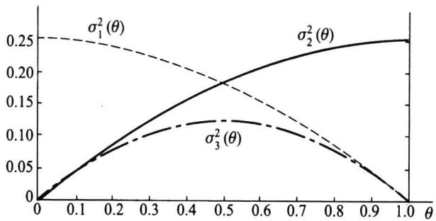
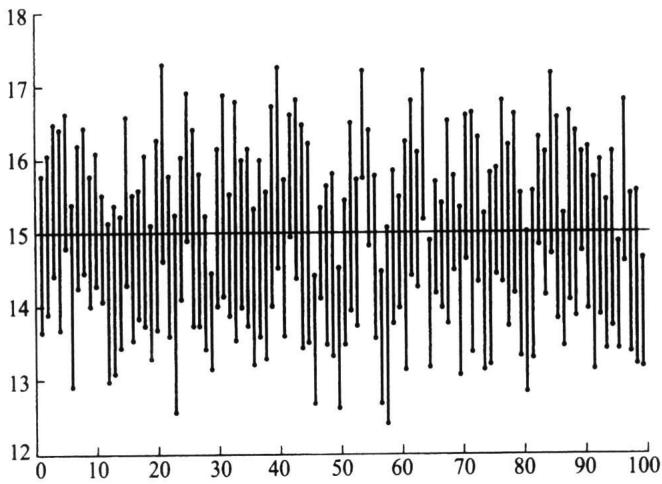
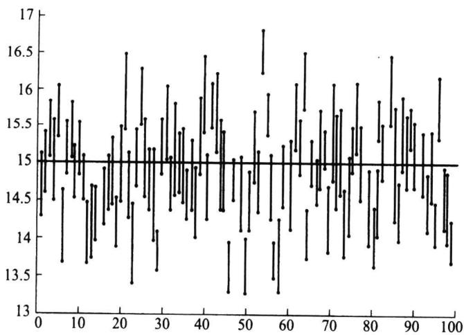
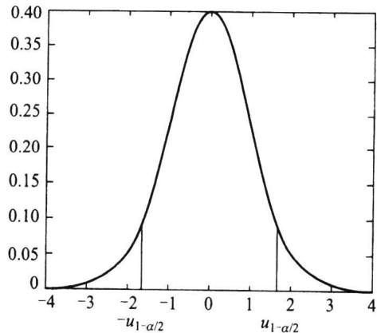
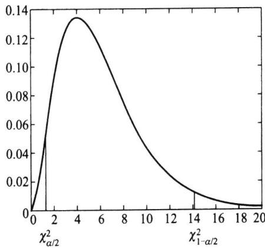
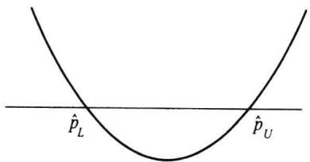

## 第六章参数估计

在上一章中，我们主要讲述了几个常用统计量的抽样分布及充分统计量.我们回想一下，引进统计量的目的在于对感兴趣的问题进行统计推断，而在实际中，我们感兴趣的问题多是与分布族中的未知参数有关的.从本章开始，我们将讨论参数的估计和检验问题.本章将介绍参数的估计问题.

这里参数是指如下三类未知参数：

·分布中所含的未知参数0.如：二点分布 $b ( \boldsymbol { 1 } , \boldsymbol { p } )$ 中的概率p，正态分布 $N ( \mu , \sigma ^ { 2 } )$ 中的 $\mu$ 和 $\sigma ^ { 2 }$

·分布中所含的未知参数θ的函数.如：服从正态分布 $N ( \mu , \sigma ^ { 2 } )$ 的变量X不超过某给定值a的概率 $P ( X \leqslant a ) = \phi \left( { \frac { a - \mu } { \sigma } } \right)$ 是未知参数 $\mu , \sigma$ 的函数；单位产品的缺陷数X通常服从泊松分布P(入），则单位产品合格（无缺陷）的概率 $P ( X = 0 ) = \mathtt { e } ^ { - \lambda }$ 是未知参数入的函数.

·分布的各种特征数也都是未知参数.如：均值E(X），方差 $\mathbf { V a r } ( X )$ ，分布中位数等.

一般场合，常用θ表示参数，参数θ所有可能取值组成的集合称为参数空间，常用表示.参数估计问题就是根据样本构造适当的统计量对上述各种未知参数作出估计.

参数估计的形式有两种：点估计与区间估计.这里我们从点估计开始.

## g6.1点估计的概念与无偏性

## 6.1.1点估计及无偏性

定义6.1.1设 $x _ { 1 } , x _ { 2 } , \cdots , x _ { n }$ 是来自总体的一个样本，用于估计未知参数θ的统计量 $\widehat { \theta } = \widehat { \theta } \left( x _ { 1 } , x _ { 2 } , \cdots , x _ { n } \right)$ 称为θ的估计量，或称为θ的点估计，简称估计.

在这里如何构造统计量θ并没有明确的规定，只要它满足一定的合理性即可.最 $\hat { \theta }$ 常见的合理性要求是所谓的无偏性.

定义6.1.2设 $\hat { \theta } = \hat { \theta } \left( x _ { 1 } , x _ { 2 } , \cdots , x _ { n } \right)$ 是θ的一个估计，0的参数空间为@，若对任意

的 $\theta \in \Theta$ ，有

$$
E _ { \theta } \big ( \hat { \theta } \big ) = \theta ,\tag{6.1.1}
$$

则称 $\hat { \theta }$ 是 $\theta$ 的无偏估计，否则称为有偏估计.

无偏性要求可以改写为 $E _ { _ { \theta } } ( \ { \hat { \theta } } - \theta ) = 0$ ，这表示无偏估计没有系统偏差.当我们使用$\hat { \theta }$ 估计θ时，由于样本的随机性，θ与θ总是有偏差的，这种偏差时而（对某些样本观测 $\pmb \theta$ $\hat { \theta }$ $\theta$ 值)为正，时而(对另一些样本观测值)为负，时而大，时而小.无偏性表示，把这些偏差平均起来其值为0,这就是无偏估计的含义.而若估计不具有无偏性，则无论使用多少次，其平均也会与参数真值有一定的距离，这个距离就是系统误差.

例6.1.1对任一总体而言，样本均值是总体均值的无偏估计.当总体k阶矩存在时，样本k阶原点矩ak是总体k阶原点矩μk的无偏估计.但对k阶中心矩则不一样，譬 $\boldsymbol { a } _ { k }$ $\mu _ { k }$ 如，样本方差s就不是总体方差g的无偏估计，因由定理5.3.2可得 $s _ { n } ^ { 2 }$ $\sigma ^ { 2 }$

$$
E ( s _ { n } ^ { 2 } ) = { \frac { n - 1 } { n } } \sigma ^ { 2 } .
$$

对此，有如下两点说明：

（1）当样本量趋于无穷时，有 $E ( s _ { n } ^ { 2 } ) \to \sigma ^ { 2 }$ ,我们称 $s _ { n } ^ { 2 }$ 为 $\sigma ^ { 2 }$ 的渐近无偏估计，这表明当样本量较大时， $s _ { n } ^ { 2 }$ 可近似看作 $\sigma ^ { 2 }$ 的无偏估计.

（2）若对 $s _ { n } ^ { 2 }$ 作如下修正：

$$
s ^ { ^ { 2 } } = { \frac { n s _ { n } ^ { ^ { 2 } } } { n - 1 } } = { \frac { 1 } { n - 1 } } \sum _ { i = 1 } ^ { n } { \bigl ( } x _ { i } - { \overline { { x } } } { \bigr ) } ^ { 2 } ,\tag{6.1.2}
$$

则s²是总体方差的无偏估计.这种简单的修正方法在一些场合常被采用.(6.1.2)式定 $s ^ { 2 }$ 义的 $s ^ { 2 }$ 也称为样本方差，它比 $s _ { _ n } ^ { 2 }$ 更常用.这是因为在 $n \geqslant 2$ 时， $s _ { n } ^ { 2 } < s ^ { 2 }$ ，因此用 $s _ { n } ^ { 2 }$ 估计 $\sigma ^ { 2 }$ 有偏小的倾向,特别在小样本场合要使用 $s ^ { 2 }$ 估计 $\sigma ^ { 2 }$

无偏性不具有不变性.即若 $\hat { \theta }$ 是θ的无偏估计,一般而言,其函数 $g ( \hat { \pmb \theta } )$ 不是 $g ( \theta )$ 的无偏估计，除非g(θ)是θ的线性函数.譬如,s是σ²的无偏估计，但s不是σ的无偏 $g ( \theta )$ $s ^ { 2 }$ $\sigma ^ { 2 }$ $\pmb { \sigma }$ 估计.下面我们以正态分布为例加以说明.

例6.1.2设总体为 $N ( \mu , \sigma ^ { 2 } ) , x _ { 1 } , x _ { 2 } , \cdots , x _ { n }$ 是样本，我们已经指出 $s ^ { 2 }$ 是 $\sigma ^ { 2 }$ 的无偏估计.下面来考察s是否是 $\sigma$ 的无偏估计.由定理5.4.1知， $Y { = } \frac { \left( n { - } 1 \right) { s ^ { 2 } } } { { \sigma ^ { 2 } } } { \sim } X ^ { 2 } ( n { - } 1 )$ ,其密度函数为

$$
p \left( y \right) = \frac { 1 } { 2 ^ { \frac { n - 1 } { 2 } } \Gamma \left( \frac { n - 1 } { 2 } \right) } y ^ { \frac { n - 1 } { 2 } - 1 } \mathbf { e } ^ { - \frac { y } { 2 } } , \quad y > 0 .
$$

从而

$$
E (  Y ^ { 1 / 2 } ) = \int _ { 0 } ^ { \infty } y ^ { 1 / 2 } p ( y ) \mathrm d y = \frac { 1 } { 2 ^ { \frac { n - 1 } { 2 } } \Gamma \Big ( \frac { n - 1 } { 2 } \Big ) } { \int _ { 0 } ^ { \infty } y ^ { \frac { n } { 2 } - 1 } \mathrm e ^ { - \frac { y } { 2 } } } \mathrm d y
$$

$$
= { \frac { 2 ^ { \frac { n } { 2 } } \Gamma { \Big ( } { \frac { n } { 2 } } { \Big ) } } { 2 ^ { \frac { n - 1 } { 2 } } \Gamma { \Big ( } { \frac { n - 1 } { 2 } } { \Big ) } } } = { \sqrt { 2 } } { \frac { \Gamma { \Big ( } { \frac { n } { 2 } } { \Big ) } } { \Gamma { \Big ( } { \frac { n - 1 } { 2 } } { \Big ) } } } .
$$

由此,我们有

$$
E ( s ) = { \frac { \sigma } { \sqrt { n - 1 } } } E ( Y ^ { 1 / 2 } ) = { \sqrt { \frac { 2 } { n - 1 } } } \cdot { \frac { \Gamma ( n / 2 ) } { \Gamma ( ( n - 1 ) / 2 ) } } \cdot \sigma \equiv { \frac { \sigma } { c _ { n } } } .
$$

这说明s不是 $\pmb { \sigma }$ 的无偏估计，利用修正技术可得 $c _ { n } \cdot s$ 是 $\pmb { \sigma }$ 的无偏估计，其中 $c _ { n } =$ ${ \sqrt { \frac { n - 1 } { 2 } } } \cdot { \frac { \Gamma ( ( n - 1 ) / 2 ) } { \Gamma ( n / 2 ) } }$ 是修偏系数，表6.1.1给出了 $c _ { n }$ 的部分取值.可以证明，当 $n { \longrightarrow } \infty$ 时有 $c _ { n } \to 1$ ，这说明s是 $\sigma$ 的渐近无偏估计，从而在样本容量较大时，不经修正的s也是$\pmb { \sigma }$ 的一个很好的估计.

表6.1.1正态标准差的修偏系数表
<table><tr><td>n</td><td> $c _ { n }$ </td><td>n</td><td> $c _ { n }$ </td><td>n</td><td> $c _ { n }$ </td><td>n</td><td> $c _ { n }$ </td><td>n</td><td> $c _ { n }$ </td></tr><tr><td></td><td></td><td>7</td><td>1.0424</td><td>13</td><td>1.0210</td><td>19</td><td>1.0140</td><td>25</td><td>1.0105</td></tr><tr><td>2</td><td>1.2533</td><td>8</td><td>1.0362</td><td>14</td><td>1.0194</td><td>20</td><td>1.0132</td><td>26</td><td>1.010 0</td></tr><tr><td>3</td><td>1.1284</td><td>9</td><td>1.031 7</td><td>15</td><td>1.0180</td><td>21</td><td>1.012 6</td><td>27</td><td>1.009 7</td></tr><tr><td>4</td><td>1.085 4</td><td>10</td><td>1.0281</td><td>16</td><td>1.0168</td><td>22</td><td>1.012 0</td><td>28</td><td>1.009 3</td></tr><tr><td>5</td><td>1.0638</td><td>11</td><td>1.0253</td><td>17</td><td>1.0157</td><td>23</td><td>1.011 4</td><td>29</td><td>1.009 0</td></tr><tr><td>6</td><td>1.0509</td><td>12</td><td>1.0230</td><td>18</td><td>1.0148</td><td>24</td><td>1.0109</td><td>30</td><td>1.008 7</td></tr></table>

大偏差通常被视为估计的一种不足，有人提出了多种缩小偏差的方法.下面的刀切法就是由Quenouille于1949年和1956年提出的，而正式命名则由图基（Tukey）于1958年给出.

例6.1.3(刀切法，jackknife）设T（x）是基于样本 ${ \pmb x } = ( { \pmb x } _ { 1 } , { \pmb x } _ { 2 } , \cdots , { \pmb x } _ { n } )$ 的关于参数$g ( \theta )$ 的估计量，且满足 $E _ { _ { \theta } } ( { \cal T } ( x ) ) = g ( \theta ) + { \cal O } \left( \frac { 1 } { n } \right)$ .如以 $\pmb { x } _ { ( - i ) }$ 表示从样本中删去 $\boldsymbol { x } _ { i }$ 后的向量，则 $T ( { \pmb x } )$ 的刀切统计量定义为

$$
T _ { \jmath } ( { \pmb x } ) = n T ( { \pmb x } ) - \frac { n - 1 } { n } \sum _ { i = 1 } ^ { n } T ( { \pmb x } _ { ( - i ) } ) .\tag{6.1.3}
$$

可以证明：由(6.1.3)式定义的刀切统计量具有如下性质：

$$
E _ { \theta } ( T _ { \jmath } ( x ) ) = g ( \theta ) + O \bigg ( \frac { 1 } { n ^ { 2 } } \bigg ) \ ,
$$

并且其方差不会增大.

譬如，设总体为 $b \left( 1 , \theta \right) , x _ { 1 } , x _ { 2 } , \cdots , x _ { n }$ 是其样本，又设 $g \left( \theta \right) = \theta ^ { 2 }$ ，则 $T ( x ) = { \bar { x } } ^ { 2 }$ 是$g ( \theta )$ 的一个估计，且

$$
E ( T ( x ) { \it \Psi } ) = \theta ^ { 2 } + \frac { \theta ( 1 - \theta ) } { n } = g \left( \theta \right) + { \cal O } \left( \frac { 1 } { n } \right) .
$$

下面应用刀切法，注意到

$$
T ( \pmb { x } _ { ( \cdot \circ i ) } ) = \left( \frac { \displaystyle \sum _ { j = 1 } ^ { n } \pmb { x } _ { j } - \pmb { x } _ { i } } { n - 1 } \right) ^ { 2 } = \frac { n ^ { 2 } \ \overline { { x } } ^ { 2 } + x _ { i } ^ { 2 } - 2 n x _ { i } \ \overline { { x } } } { \left( n - 1 \right) ^ { 2 } } ,
$$

于是

$$
T _ { \ j } ( { \pmb x } ) = n \ { \overline { x } } ^ { 2 } - \frac { n - 1 } { n } \sum _ { i = 1 } ^ { n } \frac { n ^ { 2 } \ { \overline { x } } ^ { 2 } + x _ { i } ^ { 2 } - 2 n x _ { i } \ { \overline { x } } } { \left( n - 1 \right) ^ { 2 } } = \frac { n \ { \overline { x } } ^ { 2 } } { n - 1 } - \frac { \sum _ { i = 1 } ^ { n } x _ { i } ^ { 2 } } { n \left( n - 1 \right) } .
$$

可以验证 $E T _ { J } ( { \pmb x } ) = { \pmb g } ( { \pmb \theta } )$ .关于刀切法的详细介绍,有兴趣的读者可参考 Efron 的专著[20].

并不是所有的参数都存在无偏估计，当参数存在无偏估计时,我们称该参数是可估的,否则称它是不可估的.下面是一个参数不可估的例子.

例6.1.4设总体为二点分布 $b ( 1 , p ) , 0 < p < 1 , x _ { 1 } , x _ { 2 } , \cdots , x _ { n }$ 是样本，我们说明参数$\theta = 1 / p$ 是不可估的.

首先， $T = x _ { 1 } + x _ { 2 } + \cdots + x _ { n }$ 是充分统计量， $T \sim b \left( \land , p \right)$ .若有一个 $\widehat { \theta } = \widehat { \theta } \left( t \right)$ 是θ的无偏估计,则有

$$
E _ { \theta } \big ( \hat { \theta } \big ) = \sum _ { i = 1 } ^ { n } \binom { n } { i } \hat { \theta } ( i ) p ^ { i } \big ( 1 - p \big ) ^ { n - i } = \frac { 1 } { p }
$$

或

$$
\displaystyle \sum _ { i = 1 } ^ { n } { \binom { n } { i } } \hat { \theta } ( i ) p ^ { i + 1 } ( 1 - p ) ^ { n - i } - 1 = 0 , \quad 0 < p < 1 .
$$

这是p的n+1次方程，最多有n+1个实根,要使它对(0,1)中所有的p都成立是不可能 $p$ 的，故参数 $\theta = 1 / p$ 是不可估的.

其次,若有某个 $h ( x _ { 1 } , x _ { 2 } , \cdots , x _ { n } )$ 是θ的无偏估计，则令 $\widetilde { \theta } { = } E ( h ( x _ { 1 } , x _ { 2 } , \cdots , x _ { n } ) / T )$ 由重期望公式知 $E _ { p } ( \widetilde { \boldsymbol { \theta } } ) = E _ { p } ( E ( \boldsymbol { h } ( \boldsymbol { x } _ { 1 } , \boldsymbol { x } _ { 2 } , \cdots , \boldsymbol { x } _ { n } ) / T ) ) = E _ { p } ( \boldsymbol { h } ( \boldsymbol { x } _ { 1 } , \boldsymbol { x } _ { 2 } , \cdots , \boldsymbol { x } _ { n } ) ) = \boldsymbol { \theta }$ ，这说明$ { \widetilde { \theta } } ( T )$ 是θ的无偏估计,由前述,这是不可能的.

## 6.1.2有效性

当参数可估时，其无偏估计可以有很多，如何在无偏估计中进行选择？直观的想法是希望该估计围绕参数真值的波动越小越好，波动大小可以用方差来衡量，因此人们常用无偏估计的方差的大小作为度量无偏估计优劣的标准，这就是有效性.

定义6.1.3设 $\hat { \theta } _ { 1 } , \hat { \theta } _ { 2 }$ 是θ的两个无偏估计，如果对任意的 $\theta \in \Theta$ 有

$$
\begin{array} { r } { \mathrm { V a r } ( \hat { \theta } _ { 1 } ) \leqslant \mathrm { V a r } ( \hat { \theta } _ { 2 } ) , } \end{array}
$$

且至少有一个 $\pmb { \theta } \in \pmb { \theta }$ 使得上述不等号严格成立,则称 $\widehat { \theta } _ { 1 }$ 比 $\widehat { \theta } _ { 2 }$ 有效.

例6.1.5设 $x _ { 1 } , x _ { 2 } , \cdots , x _ { n }$ 是取自某总体的样本，记总体均值为μ,总体方差为 $\pmb { \mu }$ $\sigma ^ { 2 }$

则 $\hat { \mu } _ { 1 } = x _ { 1 } , \hat { \mu } _ { 2 } = \overline { { x } }$ 都是 $\pmb { \mu }$ 的无偏估计，但

$$
\mathrm { V a r } ( \hat { \mu } _ { 1 } ) = \sigma ^ { 2 } , \quad \mathrm { V a r } ( \hat { \mu } _ { 2 } ) = \sigma ^ { 2 } / n .
$$

显然，只要 $n > 1 , \hat { \mu } _ { 2 }$ 比μ,有效.这表明，用全部数据的平均估计总体均值要比只使用部 $\hat { \mu } _ { 1 }$ 分数据更有效.

例6.1.6设 $x _ { 1 } , x _ { 2 } , \cdots , x _ { n }$ 是来自均匀总体U（0，0)的样本，人们常用最大观测值$\boldsymbol { x } _ { ( n ) }$ 来估计 $\pmb \theta$ （参见例6.3.5），由于 $E ( x _ { ( n ) } ) = \frac { n } { n + 1 } \pmb { \theta }$ ，所以 ${ \pmb x } _ { ( \pmb n ) }$ 不是θ的无偏估计，但它是$\pmb \theta$ 的渐近无偏估计.经过修偏后可以得到θ的一个无偏估计 $\widehat { \theta } _ { 1 } = \frac { n + 1 } { n } x _ { ( n ) }$ .且

$$
\operatorname { V a r } ( { \widehat { \theta } } _ { 1 } ) = \left( { \frac { n + 1 } { n } } \right) ^ { 2 } \operatorname { V a r } ( x _ { ( n ) } ) = \left( { \frac { n + 1 } { n } } \right) ^ { 2 } { \frac { n } { \left( n + 1 \right) ^ { 2 } \left( n + 2 \right) } } \theta ^ { 2 } = { \frac { \theta ^ { 2 } } { n \left( n + 2 \right) } } .
$$

另一方面，由于总体均值为0/2，人们也可以使用样本均值估计总体均值（见6.2节），于是可得到θ的另一个无偏估计 $\widehat { \theta } _ { 2 } = 2 \overline { { x } }$ ，且

$$
\operatorname { V a r } \left( { \widehat { \theta } } _ { 2 } \right) = 4 \operatorname { V a r } \left( { \overline { { x } } } \right) = { \frac { 4 } { n } } \operatorname { V a r } \left( X \right) = { \frac { 4 } { n } } \cdot { \frac { \theta ^ { 2 } } { 1 2 } } = { \frac { \theta ^ { 2 } } { 3 n } } ,
$$

两项比较知道，当n>1时， $\hat { \theta } _ { 1 }$ 比 $\widehat { \theta } _ { 2 }$ 有效.

## 习题6.1

1.设 $x _ { 1 } , x _ { 2 } , x _ { 3 }$ 是取自某总体容量为3的样本，试证下列统计量都是该总体均值μ的无偏估计， $\pmb { \mu }$ 在方差存在时指出哪一个估计的有效性最差.

(1） $\widehat { \mu } _ { 1 } = \frac { 1 } { 2 } x _ { 1 } + \frac { 1 } { 3 } x _ { 2 } + \frac { 1 } { 6 } x _ { 3 } ;$

(2) $\widehat { \mu } _ { 2 } = \frac { 1 } { 3 } x _ { 1 } + \frac { 1 } { 3 } x _ { 2 } + \frac { 1 } { 3 } x _ { 3 } ;$

(3) $\widehat { \mu } _ { 3 } = \frac { 1 } { 6 } x _ { 1 } + \frac { 1 } { 6 } x _ { 2 } + \frac { 2 } { 3 } x _ { 3 } .$

2.设 $x _ { 1 } , x _ { 2 } , \cdots , x _ { n }$ 是来自Exp(入）的样本，已知x为1/入的无偏估计，试说明1/x是否为入的无偏估计.

3.设 $\hat { \pmb \theta }$ 是参数θ的无偏估计，且有 $\operatorname { V a r } ( { \hat { \pmb { \theta } } } ) > 0$ ，试证 $( \hat { \pmb \theta } ) ^ { 2 }$ 不是 $\theta ^ { 2 }$ 的无偏估计.

4.设总体 $X \sim N ( \pmb { \mu } , \pmb { \sigma } ^ { 2 } ) , \pmb { x } _ { 1 } , \pmb { x } _ { 2 } , \cdots , \pmb { x } _ { n }$ 是来自该总体的一个样本.试确定常数c使 $c \sum _ { i = 1 } ^ { n - 1 } { \bigl ( } x _ { i + 1 } - x _ { i } { \bigr ) } ^ { 2 }$ 为 $\sigma ^ { 2 }$ 的无偏估计.

5.设 $x _ { 1 } , x _ { 2 } , \cdots , x _ { n }$ 是来自下列总体的简单样本，

$$
p \left( x , \theta \right) = \left\{ \begin{array} { l l } { \displaystyle 1 , \theta - \frac { 1 } { 2 } \leqslant x \leqslant \theta + \frac { 1 } { 2 } , } & \\ { \displaystyle - \infty < \theta < \infty \ , } \\ { \displaystyle 0 , \sharp \sharp \neq \ell , } \end{array} \right.
$$

证明样本均值x及 $\frac { 1 } { 2 } ( x _ { ( 1 ) } + x _ { ( n ) } )$ 都是θ的无偏估计，问何者更有效？

6.设 $x _ { 1 } , x _ { 2 } , x _ { 3 }$ 服从均匀分布U(0,0），试证 $\frac { 4 } { 3 } x _ { ( 3 ) }$ 及 $4 x _ { ( 1 ) }$ 都是θ的无偏估计，哪个更有效？

7.设从均值为 $\pmb { \mu }$ ，方差为 $\sigma ^ { 2 } > 0$ 的总体中分别抽取容量为 $n _ { \parallel }$ 和 $n _ { 2 }$ 的两独立样本 $, \overline { { x } } _ { 1 }$ 和x分别是这两个样本的均值.试证，对于任意常数 $a , b \ ( \ a + b = 1 ) \ , Y = a \ \overline { { { x } } } _ { 1 } + b \ \overline { { { x } } } _ { 2 }$ 都是 $\mu$ 的无偏估计，并确定常数a，b使 $\mathbf { V } _ { \mathsf { a r } } ( \boldsymbol { Y } )$ 达到最小.

8.设总体X的均值为 $\mu$ ，方差为 $\sigma ^ { 2 } , x _ { 1 } , x _ { 2 } , \cdots , x _ { n }$ 是来自该总体的一个样本， $T ( x _ { 1 } , x _ { 2 } , \cdots , x _ { n } )$ 为 $\mu$ 的任一线性无偏估计量.证明：x与T的相关系数为 $\sqrt { \operatorname { V a r } ( { \overline { { x } } } ) / \operatorname { V a r } ( T ) }$

9.设有k台仪器，已知用第i台仪器测量的标准差为 $\sigma _ { i } ( i = 1 , 2 , \cdots , k )$ .用这些仪器独立地对某一物理量θ各观察一次，分别得到 $x _ { 1 } , x _ { 2 } , \cdots , x _ { k }$ ，设仪器都没有系统偏差.问 $a _ { 1 } , \ d a _ { 2 } , \cdots , a _ { k }$ 应取何值，方能使 $\widehat { \theta } \ = \ \sum _ { i \ = \ 1 } ^ { k } a _ { i } x _ { i }$ 成为θ的无偏估计，且方差达到最小？

10.设 $x _ { 1 } , x _ { 2 } , \cdots , x _ { n }$ 是来自 $N \left( \theta , 1 \right)$ 的样本，证明 $g \left( \theta \right) = \left| \theta \right|$ 没有无偏估计（提示：利用 $g \left( \theta \right)$ 在0=0处不可导).

11.设总体X服从正态分布 $N ( \mu , \sigma ^ { 2 } ) \ , x _ { 1 } \ , x _ { 2 } \ , \cdots , x _ { n }$ 为来自总体X的样本，为了得到标准差 $\pmb { \sigma }$ 的估计量，考虑统计量：

$$
y _ { 1 } ~ = ~ { \frac { 1 } { n } } \sum _ { i = 1 } ^ { n } ~ \mid ~ x _ { i } ~ - ~ { \overline { { x } } } ~ \mid ~ , { \overline { { x } } } ~ = ~ { \frac { 1 } { n } } \sum _ { i = 1 } ^ { n } x _ { i } , n \geqslant 2 ,
$$

$$
y _ { 2 } \ = \ \frac { 1 } { n \left( n \ - \ 1 \ \right) } \sum _ { i \ = \ 1 } ^ { n } \ \sum _ { j \ = \ 1 } ^ { n } \ \left. \textbf { \em x } _ { i } \ - \ \mathbf { x } _ { j } \ \right. \ , n \ \geqslant \ 2 ,
$$

求常数 $C _ { \iota }$ 与 $C _ { 2 }$ ，使得 $C _ { \imath } \boldsymbol { y } _ { \imath }$ 与 $C _ { 2 } y _ { 3 }$ 都是 $\pmb { \sigma }$ 的无偏估计.

## 6.2矩估计及相合性

## 6.2.1替换原理和矩法估计

1900 年K.皮尔逊提出了一个替换原理,后来人们称此方法为矩法.

替换原理常指如下两句话：

·用样本矩去替换总体矩，这里的矩可以是原点矩也可以是中心矩.

·用样本矩的函数去替换相应的总体矩的函数.

根据这个替换原理,在总体分布形式未知场合也可对各种参数作出估计，譬如：

·用样本均值x估计总体均值E(X).

·用样本方差 $s ^ { 2 }$ 估计总体方差 $\operatorname { V a r } ( X )$

·用事件A出现的频率估计事件A发生的概率.

·用样本的p分位数估计总体的p分位数,特别，用样本中位数估计总体中位数.

例6.2.1对某型号的20辆汽车记录其每5L汽油的行驶里程(单位：km）,观测数据如下：

<table><tr><td>29.827.628.327.930.128.729.928.027.9 28.7 28.427.229.5 28.528.030.029.129.829.626.9</td><td></td><td></td><td></td><td></td><td></td><td></td><td></td><td></td><td></td></tr></table>

这是一个容量为20的样本观测值，对应总体是该型号汽车每5L汽油的行驶里程，其分布形式尚不清楚，可用矩法估计其均值、方差和中位数等.本例中经计算有

$$
\overline { { { x } } } = 2 8 . 6 9 5 , \quad s ^ { 2 } = 0 . 9 6 6 8 , \quad m _ { 0 . 5 } = 2 8 . 6 ,
$$

由此给出总体均值、方差和中位数的估计分别为28.695,0.9668和28.6.

矩法估计的统计思想(替换原理)十分简单明确，众人都能接受，使用场合甚广.它的实质是用经验分布函数去替换总体分布，其理论基础是格利文科定理.

## 6.2.2概率函数已知时未知参数的矩估计

设总体具有已知的概率函数 $p \left( \textnormal { \em x } ; \theta _ { 1 } , \theta _ { 2 } , \cdots , \theta _ { k } \right) , \left( \begin{array} { l }  \theta _ { 1 } , \theta _ { 2 } , \cdots , \theta _ { k } \right) \in \Theta \end{array}$ 是未知参数或参数向量， $x _ { 1 } , x _ { 2 } , \cdots , x _ { n }$ 是样本，假定总体的k阶原点矩 $\scriptstyle \mu _ { k }$ 存在，则对所有的j，$0 < j < k , \mu _ { j }$ 都存在，若假设 $\theta _ { 1 } , \theta _ { 2 } , \cdots , \theta _ { k }$ 能够表示成 $\mu _ { 1 } , \mu _ { 2 } , \cdots , \mu _ { k }$ 的函数 $\theta _ { j } = \theta _ { j } \left( \mu _ { 1 } \right.$ $\mu _ { 2 } , \cdots , \mu _ { k } )$ ，则可给出诸 $\theta _ { j }$ 的矩估计：

$$
\begin{array} { r } { \hat { \theta } _ { j } = \theta _ { j } ( a _ { 1 } , a _ { 2 } , \cdots , a _ { k } ) , \quad j = 1 , 2 , \cdots , k , } \end{array}
$$

其中 $a _ { 1 } , , a _ { 2 } , \cdots , a _ { k }$ 是前k阶样本原点矩 $a _ { j } = \frac { 1 } { n } \sum _ { i = 1 } ^ { n } x _ { i } ^ { j }$ .进一步，如果我们要估计$\theta _ { 1 } , \theta _ { 2 } , \cdots , \theta _ { k }$ 的函数 $\eta = g ( \theta _ { 1 } , \theta _ { 2 } , \cdots , \theta _ { k } )$ ,则可直接得到η的矩估计

$$
\hat { \eta } = g ( \hat { \theta } _ { 1 } , \hat { \theta } _ { 2 } , \cdots , \hat { \theta } _ { k } ) ,
$$

当k=1时，我们通常可以由样本均值出发对未知参数进行估计；如果k=2,我们可以由 $k = 2$ 一阶、二阶原点矩（或二阶中心矩）出发估计未知参数.

例6.2.2设总体为指数分布，其密度函数为

$$
p ( x ; \lambda ) = \lambda \mathrm { e } ^ { - \lambda x } , \quad x \geqslant 0 ,
$$

$x _ { 1 } , x _ { 2 } , \cdots , x _ { n }$ 是样本，此处k=1,由于 $E ( X ) = 1 / \lambda$ ,亦即 $\lambda = 1 / E ( X )$ ,故入的矩估计为

$$
\hat { \lambda } = 1 / \bar { x } .
$$

另外，由于 $\operatorname { V a r } ( X ) = 1 / \lambda ^ { 2 }$ ,其反函数为 $\lambda = 1 / \sqrt { \mathrm { V a r } ( X ) }$ ,因此，从替换原理来看，入的矩估计也可取为

$$
\begin{array} { r } { \hat { \lambda } _ { 1 } = 1 / s , } \end{array}
$$

s为样本标准差.这说明矩估计可能是不唯一的，此时通常应该尽量采用低阶矩给出未知参数的估计.

例6.2.3设 $x _ { 1 } , x _ { 2 } , \cdots , x _ { n }$ 是来自均匀分布 $U ( a , b )$ 的样本，a与b均是未知参数，这里 $k = 2$ ，由于

$$
E ( X ) = { \frac { a + b } { 2 } } , \quad \operatorname { V a r } ( X ) = { \frac { \left( b - a \right) ^ { 2 } } { 1 2 } } ,
$$

不难推出

$$
a = E ( X ) - \sqrt { 3 \mathrm { V a r } ( X ) } , b = E ( X ) + \sqrt { 3 \mathrm { V a r } ( X ) } ,
$$

由此即可得到a，b的矩估计：

$$
\widehat { \boldsymbol { a } } = \overline { { \boldsymbol { x } } } - \sqrt { 3 } \boldsymbol { s } , \widehat { \boldsymbol { b } } = \overline { { \boldsymbol { x } } } + \sqrt { 3 } \boldsymbol { s } ,
$$

若从均匀分布总体 $U ( a , b )$ 获得如下一个容量为5的样本：

## 4.55.04.7 4.04.2

经计算，有 $\overline { { x } } = 4 . 4 8 , s = 0 . 3 9 6 2$ ，于是可得a,b的矩估计为

$$
\widehat { a } = 4 . 4 8 \mathrm { ~ - ~ } 0 . 3 9 6 2 \sqrt { 3 } = 3 . 7 9 3 8 ,
$$

$$
{ \widehat { b } } = 4 . 4 8 + 0 . 3 9 6 2 { \sqrt { 3 } } = 5 . 1 6 6 2 .
$$

## 6.2.3相合性

我们知道，点估计是一个统计量，因此它是一个随机变量，在样本量一定的条件下，我们不可能要求它完全等同于参数的真实取值.但如果我们有足够的观测值，根据格利文科定理，随着样本量的不断增大，经验分布函数逼近真实分布函数，因此完全可以要求估计量随着样本量的不断增大而逼近参数真值，这就是相合性,其定义如下.

定义6.2.1设 $\pmb { \theta } \in \pmb { \theta }$ 为未知参数， $\widehat { \theta } _ { n } = \widehat { \theta } _ { n } ( x _ { 1 } , x _ { 2 } , \cdots , x _ { n } )$ 是θ的一个估计量,n是样本容量,若对任何一个 $\varepsilon > 0$ ,有

$$
\operatorname* { l i m } _ { n  \infty } P (  { | \hat { \theta } _ { n } - \theta | } \geqslant \varepsilon ) = 0 ,\tag{6.2.1}
$$

则称 $\widehat { \theta } _ { n }$ 为参数θ的相合估计.

相合性被认为是对估计的一个最基本要求，如果一个估计量，在样本量不断增大时，它都不能把被估参数估计到任意指定的精度，那么这个估计是很值得怀疑的.通常，不满足相合性要求的估计不予考虑.

若把依赖于样本量n的估计量θ看作一个随机变量序列，相合性就是θ,依概率 $\widehat { \theta } _ { n }$ $\widehat { \theta } _ { r }$ 收敛于θ,所以证明估计的相合性可应用依概率收敛的性质及各种大数定律. $\theta _ { ; }$

例6.2.4设 $x _ { 1 } , x _ { 2 } , \cdots$ 是来自正态总体 $N ( \mu , \sigma ^ { 2 } )$ 的样本序列，则由辛钦大数定律及依概率收敛的性质知：

·x是 $\pmb { \mu }$ 的相合估计.

${ \mathfrak { s } } _ { n } ^ { 2 }$ 是 $\sigma ^ { 2 }$ 的相合估计.

$s ^ { 2 }$ 也是 $\sigma ^ { 2 }$ 的相合估计.

由此可见参数的相合估计不止一个.

在判断估计的相合性时下述两个定理是很有用的.

定理6.2.1设 $\widehat { \theta } _ { n } = \widehat { \theta } _ { n } ( x _ { 1 } , x _ { 2 } , \cdots , x _ { n } )$ 是θ的一个估计量,若

$$
\operatorname * { l i m } _ { n  \infty } E ( \widehat { \theta } _ { n } ) = \theta , \operatorname * { l i m } _ { n  \infty } \mathrm { V a r } ( \widehat { \theta } _ { n } ) = 0 ,\tag{6.2.2}
$$

则 $\widehat { \theta } _ { n }$ 是θ的相合估计.

证明对任意的 $\pmb { \varepsilon } { > } 0$ ,由切比雪夫不等式有

$$
P \bigg ( \big | \widehat { \theta } _ { n } - E ( \widehat { \theta } _ { n } ) \big | \geqslant \frac { \varepsilon } { 2 } \bigg ) \leqslant \frac { 4 } { \varepsilon ^ { 2 } } \mathrm { V a r } ( \widehat { \theta } _ { n } ) .
$$

另一方面，由 $\operatorname* { l i m } _ { n \to \infty } E ( \hat { \pmb { \theta } } _ { n } ) = \pmb { \theta }$ 可知,当n充分大时有

$$
\vert E ( \hat { \theta } _ { n } ) - \theta \vert < \frac { \varepsilon } { 2 } .
$$

注意到此时如果 $\mid \hat { \theta } _ { n } - E ( \hat { \theta } _ { n } ) \mid < \frac { \varepsilon } { 2 }$ ,就有

$$
\mid \hat { \theta } _ { n } - \theta \mid \leqslant \mid \hat { \theta } _ { n } - E ( \hat { \theta } _ { n } ) \mid + \mid E ( \hat { \theta } _ { n } ) - \theta \mid < \varepsilon ,
$$

故

$$
\left\{ \mid \hat { \theta } _ { \mathfrak { n } } - E ( \hat { \theta } _ { \mathfrak { n } } ) \mid < \frac { \varepsilon } { 2 } \right\} \subset \{ \mid \hat { \theta } _ { \mathfrak { n } } - \theta \mid < \varepsilon \} \ ,
$$

等价地

$$
\left\{ \mid \hat { \theta } _ { n } - E ( \hat { \theta } _ { n } ) \mid \geqslant \frac { \varepsilon } { 2 } \right\} \supset \left\{ \mid \hat { \theta } _ { n } - \theta \mid \geqslant \varepsilon \right\} .
$$

由此即有

$$
P ( \mathbf { \alpha } \mid { \hat { \theta } } _ { n } - \theta \mid \geqslant \varepsilon ) \leqslant P { \Big ( } \mid { \hat { \theta } } _ { n } - E ( { \hat { \theta } } _ { n } ) \mid \geqslant { \frac { \varepsilon } { 2 } } { \Big ) } \leqslant { \frac { 4 } { \varepsilon ^ { 2 } } } \mathrm { V a r } ( { \hat { \theta } } _ { n } ) \to 0 ( n \to \infty ) ,
$$

定理得证.

例6.2.5设 $x _ { 1 } , x _ { 2 } , \cdots , x _ { n }$ 是来自均匀总体 $U ( 0 , \theta )$ 的样本，证明 $\boldsymbol { x } _ { ( n ) }$ 是 $\pmb \theta$ 的相合 估计.

证明由次序统计量的分布，我们知道 $\widehat { \theta } = x _ { \scriptscriptstyle ( n ) }$ 的分布密度函数为

$$
p ( y ) = n y ^ { n - 1 } / \theta ^ { n } , \quad y \textless \theta .
$$

故有

$$
E ( \hat { \theta } ) = \int _ { 0 } ^ { \theta } n y ^ { n } \mathrm { d } y / \theta ^ { n } = \frac { n } { n + 1 } \theta \to \theta \left( n \to \infty \right) ,
$$

$$
E ( \hat { \theta } ^ { 2 } ) = \int _ { 0 } ^ { \theta } n y ^ { n + 1 } \mathrm { d } y / \theta ^ { n } = \frac { n } { n + 2 } \theta ^ { 2 } ,
$$

$$
\operatorname { V a r } ( { \hat { \theta } } ) = { \frac { n } { n + 2 } } \theta ^ { 2 } \ - \ \left( { \frac { n } { n + 1 } } \theta \right) ^ { 2 } = { \frac { n } { \left( n + 1 \right) ^ { 2 } ( n + 2 ) } } \theta ^ { 2 } \to 0 \quad ( n \to \infty \ ) .
$$

由定理6.2.1可知 $\boldsymbol { \mathscr { x } } _ { ( n ) }$ 是 $\theta$ 的相合估计.

定理6.2.2若 $\hat { \theta } _ { n 1 } , \hat { \theta } _ { n 2 } , \cdots , \hat { \theta } _ { n k }$ 分别是 $\theta _ { 1 } , \theta _ { 2 } , \cdots , \theta _ { k }$ 的相合估计， $\eta = g ( \theta _ { 1 } , \theta _ { 2 } , \cdots , \theta _ { k } )$ 是 $\theta _ { 1 } , \theta _ { 2 } , \cdots , \theta _ { k }$ 的连续函数，则 $\hat { \pmb { \eta } } _ { n } = \pmb { g } ( \hat { \pmb { \theta } } _ { n 1 } , \hat { \pmb { \theta } } _ { n 2 } , \cdots , \hat { \pmb { \theta } } _ { n k } )$ 是 $\pmb { \eta }$ 的相合估计.

证明由函数 $\pmb { \mathrm { \delta } }$ 的连续性,对任意给定的 $\pmb { \varepsilon } { > } 0$ ,存在一个 $\delta { > } 0$ ,当 $\mid \hat { \theta } _ { n j } - \theta _ { j } \mid < \delta , j = 1$ $2 , \cdots , k$ 时,有

$$
\mid g ( \hat { \theta } _ { n 1 } , \hat { \theta } _ { n 2 } , \cdots , \hat { \theta } _ { n k } ) \mid - g ( \theta _ { 1 } , \theta _ { 2 } , \cdots , \theta _ { k } ) \mid < \varepsilon .\tag{6.2.3}
$$

又由 $\hat { \theta } _ { n 1 } , \hat { \theta } _ { n 2 } , \cdots , \hat { \theta } _ { n k }$ 的相合性,对给定的δ>0,对任意给定的v>0,存在正整数N,使得 $\delta { > } 0$ $v { > } 0$ $n \geqslant N$ 时，

$$
P \left( \ | \ \hat { \theta } _ { n j } - \theta _ { j } \ | \ \geqslant \delta \right) \ < \ v / k , \quad j = 1 , 2 , \cdots , k .
$$

从而有

$$
P \Big ( \bigcap _ { j = 1 } ^ { k } \big \{ \big | \widehat { \theta } _ { n j } - \theta _ { j } \big | < \delta \big \} \Big ) = 1 - P \Big ( \bigcup _ { j = 1 } ^ { k } \big \{ \big | \widehat { \theta } _ { n j } - \theta _ { j } \big | \geqslant \delta \big \} \Big )
$$

$$
\begin{array} { l } { \displaystyle \geqslant 1 - \sum _ { j = 1 } ^ { k } P ( \bigm | \hat { \theta } _ { n j } - \theta _ { j } \bigm | \geqslant \delta ) } \\ { \displaystyle > 1 - k \cdot v / k = 1 - v . } \end{array}
$$

根据(6.2.3）， $\bigcap _ { j = 1 } ^ { k } \{ | \hat { \theta } _ { n j } - \theta _ { j } | < \delta \} \subset \{ | \hat { \eta } _ { n } - \eta | < \varepsilon \}$ ,故有

$$
P \left( \lvert \hat { \eta } _ { n } - \eta \rvert < \varepsilon \right) > 1 - \nu ,
$$

由u的任意性，定理得证.

由大数定律及定理6.2.2,我们可以看到，矩估计一般都具有相合性.比如：

·样本均值是总体均值的相合估计.

·样本标准差是总体标准差的相合估计.

·样本变异系数s/x是总体变异系数的相合估计.

例6.2.6设一个试验有三种可能结果，其发生概率分别为

$$
p _ { 1 } = \theta ^ { 2 } , \quad p _ { 2 } = 2 \theta ( 1 - \theta ) , \quad p _ { 3 } = ( 1 - \theta ) ^ { 2 } .
$$

现做了n次试验，观测到三种结果发生的次数分别为 $n _ { 1 } , n _ { 2 } , n _ { 3 }$ ，可以采用频率替换方法估计θ.由于可以有三个不同的θ的表达式

$$
\theta = \sqrt { p _ { 1 } } , \quad \theta = 1 - \sqrt { p _ { 3 } } , \quad \theta = p _ { 1 } + p _ { 2 } / 2 .
$$

从而可以给出θ的三种不同的频率替换估计，它们分别是

$$
\hat { \theta } _ { 1 } = \sqrt { n _ { 1 } / n } , \quad \hat { \theta } _ { 2 } = 1 - \sqrt { n _ { 3 } / n } , \quad \hat { \theta } _ { 3 } = \left( n _ { 1 } + n _ { 2 } / 2 \right) / n .
$$

由大数定律 $n _ { 1 } / n , n _ { 2 } / n , n _ { 3 } / n$ 分别是 $p _ { 1 } , p _ { 2 } , p _ { 3 }$ 的相合估计，由定理6.2.2知，上述三个估计都是θ的相合估计.

## 习题6.2

1.从一批电子元件中抽取8个进行寿命测试，得到如下数据（单位：h）：

$$
\begin{array} { r l r l r l r l r l } { { 1 } } & { { } 0 5 0 } & { } & { { } 1 } & { 1 0 0 } & { } & { { } 1 } & { 1 3 0 } & { } & { { } 1 } & { 0 4 0 } & { } & { { } 1 } & { 2 5 0 } & { } & { { } 1 } & { 3 0 0 } & { } & { { } 1 } & { 2 0 0 } & { } & { { } 1 } & { 0 8 0 } \end{array}
$$

试对这批元件的平均寿命以及寿命分布的标准差给出矩估计.

2.设总体X\~U（0,0），现从该总体中抽取容量为10的样本，样本值为：

0.51.30.61.72.21.20.81.52.01.6

试对参数θ给出矩估计.

3.设总体分布列如下 $, x _ { 1 } , x _ { 2 } , \cdots , x _ { n }$ 是样本，试求未知参数的矩估计：

（1） $P \left( X = k \right) = \frac { 1 } { N } , k = 0 , 1 , 2 , \cdots , N - 1 , N$ （正整数）是未知参数；

(2) $P ( \ X = k ) = ( k - 1 ) \theta ^ { 2 } ( \ 1 - \theta ) ^ { k - 2 } , k = 2 , 3 , \cdots , 0 < \theta < 1 .$

4.设总体密度函数如下 $, x _ { 1 } , x _ { 2 } , \cdots , x _ { n }$ 是样本，试求未知参数的矩估计：

(1) $p \left( x : \theta \right) = \frac { 2 } { \theta ^ { 2 } } \left( \theta - x \right) , 0 < x < \theta , \theta > 0 ;$

(2) $p \left( \begin{array} { l } { x : \theta } \end{array} \right) = \left( \theta + 1 \ \right) x ^ { \theta } , 0 < x < 1 \ , \theta > 0 \ ;$

(3) $p \left( x ; \theta \right) = \sqrt { \theta } x ^ { \sqrt { \theta } - 1 } , 0 < x < 1 , \theta > 0 ;$

$$
( 4 ) \ p \ ( \ x ; \theta , \mu ) = { \frac { 1 } { \theta } } \mathrm { e } ^ { - { \frac { x - \mu } { \theta } } } , x { > } \mu , \theta { > } 0 .
$$

5.设总体为 $N ( \mu , 1 )$ ，现对该总体观测n次，发现有k次观测值为正，使用频率替换方法求μ的 $\pmb { \mu }$ 估计.

6.甲、乙两个校对员彼此独立对同一本书的样稿进行校对，校完后，甲发现a个错字，乙发现b个错字，其中共同发现的错字有c个，试用矩估计给出如下两个未知参数的估计：

（1）该书样稿的总错字个数；

（2）未被发现的错字数.

7.设总体X服从二项分布 $b ( \boldsymbol { m } , p )$ ，其中 $m , p$ 为未知参数 $, x _ { 1 } , x _ { 2 } , \cdots , x _ { n }$ 为X的一个样本，求m与$p$ 的矩估计.

## §6.3最大似然估计与EM算法

最大似然估计（MLE)最早是由德国数学家高斯（Gauss）在1821年针对正态分布提出的，但一般将之归功于费希尔，因为费希尔在1922年再次提出了这种想法并证明了它的一些性质而使得最大似然法得到了广泛的应用.本节将给出最大似然估计的定义与计算及求取某些复杂情况下MLE的一种有效算法一—EM算法，并介绍最大似然估计的渐近正态性.

## 6.3.1最大似然估计

为了叙述最大似然原理的直观想法，先看两个例子.

例6.3.1设有外形完全相同的两个箱子，甲箱中有99个白球和1个黑球，乙箱中有99个黑球和1个白球，今随机地抽取一箱，并从中随机抽取一球，结果取得白球，问这球是从哪一个箱子中取出？

解不管是哪一个箱子，从箱子中任取一球都有两个可能的结果：A表示“取出白球”，B表示“取出黑球”.如果我们取出的是甲箱，则A发生的概率为0.99,而如果取出的是乙箱，则A发生的概率为0.01.现在一次试验中结果A发生了，人们的第一印象就是：“此白球(A)最像从甲箱取出的”，或者说，应该认为试验条件对结果A出现有利，从而可以推断这球是从甲箱中取出的.这个推断很符合人们的经验事实，这里“最像”就是“最大似然”之意.这种想法常称为“最大似然原理”.

本例中假设的数据很极端.一般地，我们可以这样设想：有两个箱子中各有100只球，甲箱中白球的比例是 $p _ { 1 } , Z$ 箱中白球的比例是 ${ { p } _ { 2 } }$ ，已知 $p _ { 1 } > p _ { 2 }$ ，现随机地抽取一个箱子并从中抽取一球，假定取到的是白球，如果我们要在两个箱子中进行选择，由于甲箱中白球的比例高于乙箱，根据最大似然原理，我们应该推断该球来自甲箱.

例6.3.2设产品分为合格品与不合格品两类，我们用一个随机变量X来表示某个产品经检查后的不合格品数，则 $X = 0$ 表示合格品，X=1表示不合格品，则X服从二点分布 $b ( 1 , p )$ ,其中p是未知的不合格品率.现抽取n个产品看其是否合格，得到样本$x _ { 1 } , x _ { 2 } \cdots , x _ { n }$ ，这批观测值发生的概率为

$$
P ( X _ { 1 } = x _ { 1 } , X _ { 2 } = x _ { 2 } , \cdots , X _ { n } = x _ { n } ; p ) = \ \prod _ { i = 1 } ^ { n } { p ^ { x _ { i } } ( 1 - p ) } ^ { 1 - x _ { i } } = p ^ { { \Sigma } _ { i = 1 } ^ { n } x _ { i } } ( 1 - p ) ^ { { n } ^ { - { \Sigma } _ { i = 1 } ^ { n } } x _ { i } } ,\tag{6.3.1}
$$

由于p是未知的，根据最大似然原理，我们应选择p使得(6.3.1)表示的概率尽可能大. $p$ $p$ 将(6.3.1)看作未知参数p的函数，用 $L ( p )$ 表示，称作似然函数，亦即

$$
L ( p ) = p ^ { \Sigma _ { i = 1 } ^ { n } x _ { i } } ( 1 \mathrm { - } p ) ^ { n \mathrm { - } \Sigma _ { i = 1 } ^ { n } x _ { i } } ,\tag{6.3.2}
$$

要求(6.3.2)的最大值点不是难事，将(6.3.2)两端取对数并关于p求导令其为0,即得如下方程，又称似然方程：

$$
\frac { \partial \ln { \cal L } ( p ) } { \partial p } = \frac { \displaystyle \sum _ { i = 1 } ^ { n } x _ { i } } { p } - \frac { { n - \sum _ { i = 1 } ^ { n } x _ { i } } } { 1 - p } = 0 .\tag{6.3.3}
$$

解之即得 $p$ 的最大似然估计，为

$$
\hat { \mathnormal { p } } = \hat { \mathnormal { p } } \left( x _ { 1 } , x _ { 2 } , \cdots , x _ { n } \right) = \sum _ { i = 1 } ^ { n } x _ { i } / n = \overline { { { x } } } .
$$

由例6.3.2我们可以看到求最大似然估计的基本思路.对离散总体，设有样本观测值 $x _ { 1 } , x _ { 2 } , \cdots , x _ { n }$ ,我们写出该观测值出现的概率,它一般依赖于某个或某些参数，用 $\theta$ 表示，将该概率看成θ的函数，用 $L ( \theta )$ 表示，又称似然函数，即

$$
L ( \theta ) = P ( X _ { \scriptscriptstyle 1 } = x _ { \scriptscriptstyle 1 } , X _ { \scriptscriptstyle 2 } = x _ { \scriptscriptstyle 2 } , \cdots , X _ { \scriptscriptstyle n } = x _ { \scriptscriptstyle n } ; \theta ) ,
$$

求最大似然估计就是找θ的估计值 $\hat { \theta } = \hat { \theta } \left( x _ { 1 } , x _ { 2 } , \cdots , x _ { n } \right)$ 使得上式的 $L ( \theta )$ 达到最大.

对连续总体，样本观测值 $x _ { 1 } , x _ { 2 } , \cdots , x _ { n }$ 出现的概率总是为0的，但我们可用联合概率密度函数来表示随机变量在观测值附近出现的可能性大小，也将其称为似然函数，由此，我们给出如下定义.

定义6.3.1设总体的概率函数为 $p ( x ; \theta ) , \theta \in \Theta$ ,其中θ是一个未知参数或几个未知参数组成的参数向量，Θ是参数空间， $x _ { 1 } , x _ { 2 } , \cdots , x _ { r }$ 是来自该总体的样本，将样本的联合概率函数看成θ的函数，用 $L ( \theta ; x _ { 1 } , x _ { 2 } , \cdots , x _ { n } )$ 表示，简记为 $L ( \theta )$ ，

$$
L ( \mathbf { \Psi } \theta ) = L ( \mathbf { \Psi } _ { \theta } ; x _ { 1 } , x _ { 2 } , \cdots , x _ { n } ) = p ( x _ { 1 } ; \theta ) p ( x _ { 2 } ; \theta ) \cdots p ( x _ { n } ; \theta ) ,\tag{6.3.4}
$$

L(θ)称为样本的似然函数.如果某统计量 $\hat { \theta } = \hat { \theta } \left( x _ { 1 } , x _ { 2 } , \cdots , x _ { n } \right)$ 满足

$$
L ( { \hat { \theta } } ) = \operatorname* { m a x } _ { \theta \in \Theta } L ( \theta ) ,\tag{6.3.5}
$$

则称θ是θ的最大似然估计，简记为MLE（maximumlikelihood estimate）. $\hat { \theta }$ $\theta$

由于lnx是x的单调增函数，因此，使对数似然函数ln $L ( \theta )$ 达到最大与使L（0)达到最大是等价的.人们通常更习惯于由lnL(θ)出发寻找θ的最大似然估计.当 $L ( \theta )$ 是可微函数时，求导是求最大似然估计最常用的方法，此时对对数似然函数求导更加简单些.

注意，从最大似然估计的定义可以看出，若 $L ( \theta )$ 与联合概率函数相差一个与0无关的比例因子，不会影响最大似然估计，因此，可以在 $L ( \theta )$ 中剔去与θ无关的因子.

例6.3.3(续例6.2.6）在例6.2.6中我们给出了0的三个矩估计，这里考虑θ的最大似然估计.似然函数为

$$
L ( \theta ) = ( \theta ^ { 2 } ) ^ { n _ { 1 } } \bigl [ 2 \theta ( 1 - \theta ) \bigr ] ^ { n _ { 2 } } \bigl [ \bigl ( 1 - \theta \bigr ) ^ { 2 } \bigr ] ^ { n _ { 3 } } = 2 ^ { n _ { 2 } } \theta ^ { 2 n _ { 1 } + n _ { 2 } } \bigl ( 1 - \theta \bigr ) ^ { 2 n _ { 3 } + n _ { 2 } } ,
$$

其对数似然函数为

$$
\ln { \cal L } ( \theta ) = ( 2 n _ { 1 } + n _ { 2 } ) \ln \theta + ( 2 n _ { 3 } + n _ { 2 } ) \ln ( 1 - \theta ) + n _ { 2 } \ln 2 .
$$

将之关于θ求导并令其为0得到似然方程

$$
\frac { 2 n _ { 1 } + n _ { 2 } } { \theta } - \frac { 2 n _ { 3 } + n _ { 2 } } { 1 - \theta } = 0 .
$$

解之，得

$$
{ \widehat { \theta } } = { \frac { 2 n _ { 1 } + n _ { 2 } } { 2 { \big ( } n _ { 1 } + n _ { 2 } + n _ { 3 } { \big ) } } } = { \frac { 2 n _ { 1 } + n _ { 2 } } { 2 n } } .
$$

由于

$$
\frac { \partial ^ { 2 } \ln L ( \theta ) } { \partial { \theta } ^ { 2 } } = - \ \frac { 2 n _ { 1 } + n _ { 2 } } { { \theta } ^ { 2 } } - \ \frac { 2 n _ { 3 } + n _ { 2 } } { \left( 1 - \theta \right) ^ { 2 } } < 0 ,
$$

所以 $\hat { \theta }$ 是极大值点.

例6.3.4对正态总体 $N ( \mu , \sigma ^ { 2 } ) , \theta = ( \mu , \sigma ^ { 2 } )$ 是二维参数，设有样本 $\cdot x _ { 1 } , x _ { 2 } , \cdots , x _ { n }$ 则似然函数及其对数分别为

$$
L ( \mu , \sigma ^ { 2 } ) = \prod _ { i = 1 } ^ { n } \left( \frac { 1 } { \sqrt { 2 \pi } \sigma } \exp \Biggl \{ - \ \frac { \left( x _ { i } - \mu \right) ^ { 2 } } { 2 \sigma ^ { 2 } } \Biggr \} \right) = \left( 2 \pi \sigma ^ { 2 } \right) ^ { - n / 2 } \exp \Biggl \{ - \ \frac { 1 } { 2 \sigma ^ { 2 } } \sum _ { i = 1 } ^ { n } \left( x _ { i } - \mu \right) ^ { 2 } \Biggr \} \ ,
$$

$$
\ln L ( \mu , \sigma ^ { 2 } ) = - \ \frac { 1 } { 2 \sigma ^ { 2 } } \sum _ { i = 1 } ^ { n } \left( x _ { i } - \mu \right) ^ { 2 } \ - \ \frac { n } { 2 } \mathrm { l n } \ \sigma ^ { 2 } \ - \ \frac { n } { 2 } \mathrm { l n } \ \left( 2 \pi \right) ,
$$

将ln $L ( \mu , \sigma ^ { 2 } )$ 分别关于两个分量求偏导并令其为0即得到似然方程组

$$
\frac { \partial { \ln { \cal L } } ( \mu , \sigma ^ { 2 } ) } { \partial \mu } = \frac { 1 } { \sigma ^ { 2 } } \sum _ { i = 1 } ^ { n } \left( x _ { i } - \mu \right) = 0 ,\tag{6.3.6}
$$

$$
{ \frac { \partial { \ln \ } { \cal L } ( \mu , \sigma ^ { 2 } ) } { { \partial \sigma } ^ { 2 } } } = { \frac { 1 } { 2 \sigma ^ { 4 } } } \sum _ { i = 1 } ^ { n } \left( x _ { i } - \mu \right) ^ { 2 } - { \frac { n } { 2 \sigma ^ { 2 } } } = 0 .\tag{6.3.7}
$$

解此方程组，由（6.3.6）式可得 $\mu$ 的最大似然估计为

$$
\hat { \mu } = \frac { 1 } { n } \sum _ { i \ : = 1 } ^ { n } x _ { i } \ : = \overline { { x } } ,
$$

将之代人（6.3.7）式给出 $\sigma ^ { 2 }$ 的最大似然估计

$$
{ \widehat { \sigma } } ^ { 2 } = { \frac { 1 } { n } } \sum _ { i = 1 } ^ { n } \left( x _ { i } - { \overline { { x } } } \right) ^ { 2 } = s _ { n } ^ { 2 } ,
$$

利用二阶导函数矩阵的非正定性可以说明上述估计使得似然函数取极大值.

虽然求导函数是求最大似然估计最常用的方法，但并不是在所有场合求导都是有效的，下面的例子说明了这个问题.

例6.3.5设 $x _ { 1 } , x _ { 2 } , \cdots , x _ { n }$ 是来自均匀总体 $U ( 0 , \theta )$ 的样本，试求θ的最大似然 估计.

解似然函数

$$
L ( \theta ) = \frac { 1 } { \theta ^ { n } } \prod _ { i = 1 } ^ { n } I _ { \{ 0 < x _ { i } \leqslant \theta \} } = \frac { 1 } { \theta ^ { n } } I _ { \{ x _ { ( n ) } \leqslant \theta \} } ,
$$

要使 $L ( \theta )$ 达到最大，首先一点是示性函数取值应该为1,其次是 $1 / \theta ^ { n }$ 尽可能大.由于$1 / \theta ^ { n }$ 是θ的单调减函数，所以θ的取值应尽可能小，但示性函数为1决定了 $\theta$ 不能小于 $\boldsymbol { x } _ { ( n ) }$ ,由此给出θ的最大似然估计 $\widehat { \theta } = x _ { \scriptscriptstyle ( n ) }$

最大似然估计有一个简单而有用的性质：如果 $\hat { \theta }$ 是θ的最大似然估计，则对任一函数 $g ( \theta ) , g ( \hat { \theta } )$ 是其最大似然估计.该性质称为最大似然估计的不变性，从而使一些复杂结构的参数的最大似然估计的获得变得容易了.

例6.3.6设 $x _ { 1 } , x _ { 2 } , \cdots , x _ { n }$ 是来自正态总体 $N ( \mu , \sigma ^ { 2 } )$ 的样本，在例6.3.4中已求得 $\mu$ 和 $\sigma ^ { 2 }$ 的最大似然估计为

$$
\hat { \mu } = \stackrel { - } { x } , \hat { \sigma } ^ { 2 } = s _ { n } ^ { 2 } .
$$

于是由最大似然估计的不变性可得如下参数的最大似然估计，它们是

·标准差σ的MLE是 $\scriptstyle { \hat { \sigma } } = s _ { n }$

·概率 $P ( X < 3 ) = \phi \left( \frac { 3 - \mu } { \sigma } \right)$ 的MLE是 $\phi \left( { \frac { 3 - { \overline { { x } } } } { s _ { n } } } \right)$

·总体0.90分位数 $x _ { 0 . 9 0 } = \mu + \sigma u _ { 0 . 9 0 }$ 的MLE是x+ ${ \bf \ddot { s } } _ { n } u _ { 0 . 9 0 }$ ,其中 $u _ { 0 . 9 0 }$ 为标准正态分布的0.90分位数.

## 6.3.2EM算法

MLE 是一种非常有效的参数估计方法,但当分布中有多余参数或数据为截尾或缺失时,其MLE的求取是比较困难的.Dempster等人于1977年提出了EM算法,其出发点是把求MLE的过程分两步走,第一步求期望，以便把多余的部分去掉,第二步求极大值.本小节将简单介绍这种非常有用的方法.

例6.3.7设一次试验可能有四个结果，其发生的概率分别为 $\frac { 1 } { 2 } - \frac { \theta } { 4 } , \frac { 1 - \theta } { 4 } , \frac { 1 + \theta } { 4 } , \frac { \theta } { 4 }$ 其中 $\theta \in \left( 0 , 1 \right)$ ,现进行了197次试验，四种结果的发生次数分别为75,18,70,34.试求$\theta$ 的MLE.

解以 $y _ { 1 } , y _ { 2 } , y _ { 3 } , y _ { 4 }$ 表示四种结果发生的次数，此时总体分布为多项分布，故其似然函数

$$
L ( \theta ; y ) \propto \bigg ( \frac { 1 } { 2 } - \frac { \theta } { 4 } \bigg ) ^ { \gamma _ { 1 } } \bigg ( \frac { 1 - \theta } { 4 } \bigg ) ^ { \gamma _ { 2 } } \bigg ( \frac { 1 + \theta } { 4 } \bigg ) ^ { \gamma _ { 3 } } \bigg ( \frac { \theta } { 4 } \bigg ) ^ { \gamma _ { 4 } } \propto ( 2 - \theta ) ^ { \gamma _ { 1 } } ( 1 - \theta ) ^ { \gamma _ { 2 } } ( 1 + \theta ) ^ { \gamma _ { 3 } } \theta ^ { \gamma _ { 4 } } .
$$

要由此式求解θ的MLE是比较麻烦的,由于其对数似然方程是一个三次多项式.

我们可以通过引人2个变量 $z _ { 1 } , z _ { 2 }$ 后，使得求解变得比较容易.现假设第一种结果可以分成两部分,其发生概率分别为 $\frac { 1 - \theta } { 4 }$ 和 $\frac { 1 } { 4 }$ ，令 $z _ { 1 }$ 和 ${ \boldsymbol { y } } _ { 1 } - { \boldsymbol { z } } _ { 1 }$ 分别表示落入这两部分的次数；再假设第三种结果分成两部分，其发生概率分别为 $\frac { \theta } { 4 }$ 和 $\frac { 1 } { 4 }$ ，令 $z _ { 2 }$ 和 ${ \boldsymbol { y } } _ { 3 } - { \boldsymbol { z } } _ { 2 }$ 分别表示落人这两部分的次数.显然， $, z _ { 1 } , z _ { 2 }$ 是我们人为引人的，它是不可观测的（在文献中称之为latentvariable，即潜变量）.也称数据 $( \boldsymbol { y } , \boldsymbol { z } )$ 为完全数据（completedata），而观测到的数据y称为不完全数据.此时，完全数据的似然函数

$$
L ( \mathbf { \boldsymbol { \theta } } ; y , z ) \propto \bigg ( \frac { 1 } { 4 } \bigg ) ^ { y _ { 1 } - z _ { 1 } } \bigg ( \frac { 1 - \theta } { 4 } \bigg ) ^ { z _ { 1 } + y _ { 2 } } \bigg ( \frac { 1 } { 4 } \bigg ) ^ { y _ { 3 } - z _ { 2 } } \bigg ( \frac { \theta } { 4 } \bigg ) ^ { z _ { 2 } + y _ { 4 } } \propto \theta ^ { z _ { 2 } + y _ { 4 } } ( 1 - \theta ) ^ { z _ { 1 } + y _ { 2 } } ,
$$

其对数似然为

$$
l ( \theta ; y , z ) = \left( z _ { 2 } + y _ { 4 } \right) \ln \theta + \left( z _ { 1 } + y _ { 2 } \right) \ln \left( 1 - \theta \right) .
$$

如果 $( \boldsymbol { y } , \boldsymbol { z } )$ 均已知，则由上式很容易求得θ的MLE，但遗憾的是，我们仅知道y，而不知道z的值.但是我们注意到，当y及θ已知时， $z _ { 1 } { \sim } b \left( y _ { 1 } , { \frac { 1 - \theta } { 2 - \theta } } \right) , z _ { 2 } { \sim } \ b \left( y _ { 3 } , { \frac { \theta } { 1 + \theta } } \right)$ ，于是，Dempster等人建议分如下两步进行迭代求解：

E步：在已有观测数据y及第i步估计值 $\pmb { \theta } = \pmb { \theta } ^ { ( i ) }$ 的条件下，求基于完全数据的对数似然函数的期望（即把其中与z有关的部分积分掉）：

$$
Q ( \theta ^ { | } y , \theta ^ { ( i ) } ) = E _ { z } l ( \theta ; y , z ) .\tag{6.3.8}
$$

M步：求 $Q ( \theta ^ { \mid } y , \theta ^ { ( i ) } )$ 关于θ的最大值 $\theta ^ { ( i + 1 ) }$ ，即找 $\theta ^ { ( i + 1 ) }$ 使得

$$
Q \big ( \theta ^ { ( i + 1 ) } \mid \boldsymbol { y } , \theta ^ { ( i ) } \big ) = \operatorname* { m a x } _ { \theta } \ Q \big ( \theta \mid \boldsymbol { y } , \theta ^ { ( i ) } \big ) .\tag{6.3.9}
$$

这样就完成了由0(到θ(i+的一次迭代.重复(6.3.8)和(6.3.9)式，直至收敛即可得到 $\theta ^ { ( i ) }$ $\theta ^ { ( i + 1 ) }$ $\theta$ 的MLE.

对于本例，其E步为：

$$
\begin{array} { r l } & { Q ( \theta | y , \theta ^ { ( i ) } ) = \big ( E \big ( z _ { 2 } | y , \theta ^ { ( i ) } \big ) + y _ { 4 } \big ) \ln \theta + \big ( E \big ( z _ { 1 } | y , \theta ^ { ( i ) } \big ) + y _ { 2 } \big ) \ln ( 1 - \theta ) } \\ & { \qquad = \Bigg ( \frac { \theta ^ { ( i ) } } { 1 + \theta ^ { ( i ) } } y _ { 3 } + y _ { 4 } \Bigg ) \ln \theta + \Bigg ( \frac { 1 - \theta ^ { ( i ) } } { 2 - \theta ^ { ( i ) } } y _ { 1 } + y _ { 2 } \Bigg ) \ln ( 1 - \theta ) . } \end{array}
$$

其M步即为上式关于θ求导，并令其等于0，即

$$
\frac { \theta ^ { ( i ) } } { 1 + \theta ^ { ( i ) } } y _ { 3 } + y _ { 4 }  { \theta ^ { ( i + 1 ) } } - \frac { \frac { 1 - \theta ^ { ( i ) } } { 2 - \theta ^ { ( i ) } } y _ { 1 } + y _ { 2 } } { 1 - \theta ^ { ( i + 1 ) } } = 0 ,
$$

解之，得如下迭代公式：

$$
\theta ^ { ( i + 1 ) } = \frac { \displaystyle { \frac { \theta ^ { ( i ) } } { 1 + \theta ^ { ( i ) } } } \gamma _ { 3 } + y _ { 4 } } { \displaystyle { \frac { \theta ^ { ( i ) } } { 1 + \theta ^ { ( i ) } } } \gamma _ { 3 } + y _ { 4 } + \frac { 1 - \theta ^ { ( i ) } } { 2 - \theta ^ { ( i ) } } \gamma _ { 1 } + y _ { 2 } } ,
$$

开始时可取任意一个初值进行迭代.如取 $\theta ^ { ( 0 ) } = 0 . 5$ ，则13次迭代后可求得θ的MLE为0.606747，迭代过程如下表：

<table><tr><td>序号i</td><td> $\pmb { \theta } ^ { ( i ) }$ </td><td> $\frac { \theta ^ { ( i ) } } { 1 + \theta ^ { ( i ) } } y _ { 3 } + y _ { 4 }$ </td><td> $\frac { 1 - \theta ^ { ( i ) } } { 2 - \theta ^ { ( i ) } } y _ { 1 } + y _ { 2 }$ </td><td> $\theta ^ { ( i + 1 ) }$ </td></tr><tr><td>0</td><td>0.5</td><td>57.333 333</td><td>43.000 000</td><td>0.571 429</td></tr><tr><td>1</td><td>0.571429</td><td>59.454 545</td><td>40.500 000</td><td>0.594 816</td></tr><tr><td>2</td><td>0.594 816</td><td>60.107 784</td><td>39.626 214</td><td>0.602 681</td></tr><tr><td>3</td><td>0.602 681</td><td>60.323 186</td><td>39.325 786</td><td>0.605 357</td></tr><tr><td>4</td><td>0.605 357</td><td>60.395 987</td><td>39.222 803</td><td>0.606 271</td></tr><tr><td>5</td><td>0.606 271</td><td>60.420 804</td><td>39.187 529</td><td>0.606 584</td></tr><tr><td>6</td><td>0.606 584</td><td>60.429 289</td><td>39.175 449</td><td>0.606 691</td></tr><tr><td>7</td><td>0.606 691</td><td>60.432 193</td><td>39.171 312</td><td>0.606 728</td></tr><tr><td>8</td><td>0.606 728</td><td>60.433 187</td><td>39.169 896</td><td>0.606 740</td></tr><tr><td>9</td><td>0.606 740</td><td>60.433527</td><td>39.169 411</td><td>0.606 744</td></tr><tr><td>10</td><td>0.606 744</td><td>60.433 644</td><td>39.169 245</td><td>0.606 746</td></tr><tr><td>11</td><td>0.606 746</td><td>60.433 684</td><td>39.169 188</td><td>0.606 746</td></tr><tr><td>12</td><td>0.606 746</td><td>60.433 697</td><td>39.169 168</td><td>0.606 747</td></tr><tr><td>13</td><td>0.606 747</td><td>60.433 702</td><td>39.169 162</td><td>0.606 747</td></tr></table>

说明：（1）我们以z为例说明它的分布.以A,表示第一种结果出现， $z _ { 1 }$ $A _ { 1 }$ $B _ { 1 } , B _ { 2 }$ 分别表示我们所定义的两个事件， $A _ { 1 } = B _ { 1 } \cup B _ { 2 }$ .由定义知它们是独立的，且 $P ( A _ { 1 } ) = \frac { 1 } { 2 } - \frac { \theta } { 4 }$ $P ( B _ { \scriptscriptstyle 1 } ) = \frac { 1 - \theta } { 4 } , P \left( B _ { \scriptscriptstyle 2 } \right) = \frac { 1 } { 4 }$ ，故 $P \left( B _ { 1 } \mid A _ { 1 } \right) = \frac { P ( B _ { 1 } ) } { P ( A _ { 1 } ) } = \frac { 1 - \theta } { 2 - \theta }$ ，从而在 $Y _ { \imath } = y _ { \imath }$ 的条件下，$z _ { 1 } \sim b \Bigg ( y _ { 1 } , \frac { 1 - \theta } { 2 - \theta } \Bigg )$

(2）（6.3.8)式右边的期望是关于Z在 $\pmb { \theta } = \pmb { \theta } ^ { ( i ) }$ 的条件下求取的，而其余的参数不变,故左边与 $\pmb { \theta } ^ { ( i ) }$ 有关.

（3）在很一般的条件下，EM算法是收敛的，参见文献[22].

## 6.3.3渐近正态性

最大似然估计有一个良好的性质：它通常具有渐近正态性.

定义6.3.2参数θ的相合估计θ称为渐近正态的，若存在趋于0的非负常数序 $\widehat { \theta } _ { \mathfrak { n } }$ 列 ${ \pmb \sigma } _ { n } ( \pmb \theta )$ ，使得 $\frac { \hat { \theta } _ { n } - \theta } { \sigma _ { n } ( \theta ) }$ -依分布收敛于标准正态分布.这时也称θ，服从渐近正态分布 $\widehat { \theta } _ { n }$ $N ( \theta , \sigma _ { n } ^ { 2 } ( \theta ) )$ ，记为 $\widehat { \theta } _ { n } { \sim } A N ( \theta , \sigma _ { n } ^ { 2 } ( \theta ) ) . \sigma _ { n } ^ { 2 } ( \theta )$ 称为 $\widehat { \theta } _ { n }$ 的渐近方差.

上述定义中趋于0的数列 $\smash { \sigma _ { n } ( \theta ) }$ 表示着估计量 $\widehat { \theta } _ { n }$ 依概率收敛于θ的速度.因为只有当 $" \sigma _ { n } ( \theta )$ 趋于0的速度”与 $\ddot { \mathbf { \nabla } } \cdot \hat { \mathbf { \theta } } _ { n }$ 依概率收敛于θ的速度”相当（即同阶），其比值$( \hat { \pmb { \theta } } _ { n } - \pmb { \theta } ) / \pmb { \sigma } _ { n } ( \pmb { \theta } )$ 的分布才可能稳定地收敛于标准正态分布 $N ( 0 , 1 )$ .倘若 $\sigma _ { n } ( \theta )$ 趋于0的速度过快，则其比值会趋于 $\infty$ ；倘若 $\sigma _ { n } ( \theta )$ 趋于0的速度过慢，则其比值会趋于0；只有当 $\sigma _ { n } ( \theta )$ 趋于0的速度不快不慢时，其比值才可能按分布收敛于 $N ( 0 , 1 )$ .所以 $\sigma _ { n } \left( \theta \right)$ 趋于0的速度就是 $\widehat { \theta } _ { n }$ 依概率收敛于θ的速度.故把 $\sigma _ { n } ^ { 2 } ( { \boldsymbol { \theta } } )$ 称为渐近方差是适当的.

例6.3.8设总体为泊松分布 $P ( \lambda )$ ，无论是矩估计还是最大似然估计，我们都得到一样的入的估计：样本均值，即

$$
{ \widehat { \lambda } } _ { n } = { \overline { { x } } } _ { n } = { \frac { 1 } { n } } \sum _ { i = 1 } ^ { n } x _ { i } .
$$

由中心极限定理， $( \hat { \lambda } _ { n } - \lambda ) / \sqrt { \lambda / n }$ 依分布收敛于N(0,1），因此 $\hat { \lambda }$ 是渐近正态的，且

$$
\hat { \lambda } _ { n } { \sim } A N ( \lambda , \lambda / n ) ,
$$

这里常数序列 $\sigma _ { { n } } ( \lambda ) = \sqrt { \lambda / n } \longrightarrow 0 .$ 它表示 $\hat { \lambda } _ { \textsc { i } }$ ，依概率收敛于入的速度为 $1 / { \sqrt { n } }$ ，以后会看到，大多数渐近正态估计都是以 $1 / { \sqrt { n } }$ 速度依概率收敛于被估参数.

关于渐近正态性的详细的讨论超出本课程范围，我们主要指出两点：其一是不加证明地给出关于最大似然估计的渐近正态性的结论，其二说明渐近正态性常被用来对不同的相合估计进行比较，主要比较其渐近方差大小.

定理6.3.1设总体X有密度函数 $p ( x ; \theta ) , \theta \in \Theta , \Theta$ 为非退化区间，假定

（1）对任意的x，偏导数 ${ \frac { \partial \ln p } { \partial \theta } } , { \frac { \partial ^ { 2 } \ln p } { \partial \theta ^ { 2 } } }$ 和 $\frac { \partial ^ { 3 } \ln p } { \partial \theta ^ { 3 } }$ 对所有 $\theta \in \Theta$ 都存在；

(2) $\forall \ : \theta \in \Theta$ ，有

$$
\left| \frac { \partial p } { \partial \theta } \right| < F _ { 1 } ( x ) , \left| \frac { \partial ^ { 2 } p } { \partial \theta ^ { 2 } } \right| < F _ { 2 } ( x ) , \left| \frac { \partial ^ { 3 } \ln p } { \partial \theta ^ { 3 } } \right| < F _ { 3 } ( x ) ,
$$

其中函数 $F _ { \mathrm { 1 } } ( x ) , F _ { \mathrm { 2 } } ( x ) , F _ { \mathrm { 3 } } ( x )$ 满足

$$
\int _ { - \infty } ^ { \infty } F _ { 1 } ( x ) \mathrm { d } x < \infty \ , \quad \int _ { - \infty } ^ { \infty } F _ { 2 } ( x ) \mathrm { d } x < \infty \ ,
$$

$$
\operatorname* { s u p } _ { \theta \in \Theta } \int _ { - \infty } ^ { \infty } F _ { 3 } ( x ) p ( x ; \theta ) \mathrm { d } x < \infty ;
$$

$$
( 3 ) \forall \theta \in \Theta , 0 < I ( \theta ) \equiv \int _ { - \infty } ^ { \infty } \biggl ( \frac { \partial { \ln p } } { \partial \theta } \biggr ) ^ { 2 } p ( x ; \theta ) \mathrm { d } x < \infty .
$$

若 $x _ { 1 } , x _ { 2 } , \cdots , x _ { n }$ 是来自该总体的样本，则存在未知参数θ的最大似然估计 $\widehat { \theta } _ { n } =$ ${ \hat { \theta } } _ { n } ( x _ { 1 } , x _ { 2 } , \cdots , x _ { n } )$ ，且 $\widehat { \theta } _ { n }$ 具有相合性和渐近正态性， $\hat { \theta } _ { n } { \sim } A N \bigg ( \theta , \frac { 1 } { n I ( \theta ) } \bigg )$

定理6.3.1表明，最大似然估计通常是渐近正态的，且其渐近方差 $\sigma _ { n } ^ { 2 } \left( \theta \right) =$ $\left( n I ( \theta ) \right) ^ { - 1 }$ 有一个统一的形式，其中 $I ( \theta )$ 称为费希尔信息量.它的具体定义在下节给出.这里只要求按总体分布 $p ( \boldsymbol { x } ; \boldsymbol { \theta } )$ 去计算费希尔信息量和渐近方差即可.

例6.3.9设 $x _ { 1 } , x _ { 2 } , \cdots , x _ { n }$ 是来自 $N ( \mu , \sigma ^ { 2 } )$ 的样本，可以验证该总体分布在 $\sigma ^ { 2 }$ 已知或μ已知时均满足定理6.3.1的三个条件. $\mu$

（1）在 $\sigma ^ { 2 }$ 已知时 $, \mu$ 的MLE为 $\stackrel { \wedge } { \mu } = \stackrel { - } { x }$ ，由定理6.3.1知 $\hat { \mu }$ 服从渐近正态分布，下面求 $I ( \mu )$

$$
\ln p ( x ) = - \ln \sqrt { 2 \pi } - \frac { 1 } { 2 } { \ln \sigma ^ { 2 } } - \frac { ( x - \mu ) ^ { 2 } } { 2 \sigma ^ { 2 } } ,
$$

$$
{ \frac { \partial \ln p } { \partial \mu } } = { \frac { x - \mu } { \sigma ^ { 2 } } } ,
$$

$$
I ( \mu ) = E { \Bigg ( } { \frac { x - \mu } { \sigma ^ { 2 } } } { \Bigg ) } ^ { 2 } = { \frac { 1 } { \sigma ^ { 2 } } } .
$$

从而有 $\hat { \mu } { \sim } A N ( \mu , \sigma ^ { 2 } / n )$ ，这与 $\mu$ 的精确分布相同.

(2）在 $\pmb { \mu }$ 已知时， $\cdot \sigma ^ { 2 }$ 的MLE为 $\hat { \pmb { \sigma } } ^ { 2 } = \frac { 1 } { n } \sum _ { i \mathop { = } 1 } ^ { n } \left( { \pmb x } _ { i } - { \pmb \mu } \right) ^ { 2 }$ ，下求 $I ( \sigma ^ { 2 } )$

$$
{ \frac { \partial \ln p } { \partial \sigma ^ { ^ { 2 } } } } = - \ { \frac { 1 } { 2 \sigma ^ { ^ { 2 } } } } + { \frac { 1 } { 2 \sigma ^ { ^ { 4 } } } } ( x - \mu ) ^ { 2 } = { \frac { ( x - \mu ) ^ { 2 } - \sigma ^ { ^ { 2 } } } { 2 \sigma ^ { ^ { 4 } } } } ,
$$

$$
I ( \sigma ^ { 2 } ) = { \frac { E [ \left( x - \mu \right) ^ { 2 } - \sigma ^ { 2 } ] ^ { 2 } } { 4 \sigma ^ { 8 } } } = { \frac { \mathrm { V a r } ( \left( x - \mu \right) ^ { 2 } ) } { 4 \sigma ^ { 8 } } } = { \frac { 1 } { 2 \sigma ^ { 4 } } } ,
$$

从而有 $\hat { \pmb { \sigma } } ^ { 2 } \sim A N ( { \pmb { \sigma } } ^ { 2 } , 2 { \pmb { \sigma } } ^ { 4 } / n )$

在有多个相合估计时，常用其渐近正态分布的方差比较好坏.

例6.3.10(续例6.2.6）在那里我们给出θ的三种不同的相合估计，它们分别是：

$$
\widehat { \theta } _ { 1 } = \sqrt { n _ { 1 } / n } \ , \quad \widehat { \theta } _ { 2 } = 1 - \sqrt { n _ { 3 } / n } \ , \quad \widehat { \theta } _ { 3 } = \left( n _ { 1 } + n _ { 2 } / 2 \right) / n ,
$$

可以证明它们都是渐近正态估计，即

$$
\frac { \sqrt { n } ( \hat { \theta } _ { i } { - } \theta ) } { \sigma _ { i } ( \theta ) } { \sim } A N ( 0 , 1 ) , \ i = 1 , 2 , 3 .
$$

诸 $\sigma _ { i } ^ { 2 } ( { \boldsymbol { \theta } } )$ 分别为（见[15]）

$$
\sigma _ { 1 } ^ { 2 } \left( \theta \right) = \frac { 1 - \theta ^ { 2 } } { 4 } , \quad \sigma _ { 2 } ^ { 2 } \left( \theta \right) = \frac { 1 - \left( 1 - \theta \right) ^ { 2 } } { 4 } , \quad \sigma _ { 3 } ^ { 2 } \left( \theta \right) = \frac { \theta \left( 1 - \theta \right) } { 2 } ,
$$

比较三个渐近方差可以知道(见图6.3.1),前两个估计各有优劣，而第三个估计一致好于前两个估计，而第三个估计正是最大似然估计.

  
图6.3.1三个相合估计的渐近方差的比较

## 习题6.3

1.设总体概率函数如下 $, x _ { 1 } , x _ { 2 } , \cdots , x _ { n }$ 是样本，试求未知参数的最大似然估计.

(1） $p \left( x : \pmb { \theta } \right) = \sqrt { \theta } x ^ { \sqrt { \theta } - 1 } , 0 < x < 1 , \theta > 0$

（2）p(x;0）=0cx-（0+1） $x > c , c > 0$ 已知， $\theta > 1$

2.设总体概率函数如下 $, x _ { 1 } , x _ { 2 } , \cdots , x _ { n }$ 是样本，试求未知参数的最大似然估计.

(1） $p \left( \mathbf { \Phi } x ; \theta \right) = c \theta ^ { c } x ^ { - \left( c + 1 \right) } , x { > } \theta , \theta { > } 0 , c { > } 0$ 已知；

(2) $p \left( x ; \theta , \mu \right) = \frac { 1 } { \theta } \mathrm { e } ^ { - \frac { x - \mu } { \theta } } , x { > } \mu , \theta { > } 0 ;$

(3) $p \left( \boldsymbol { x } ; \boldsymbol { \theta } \right) = \left( \begin{array} { l } { k \boldsymbol { \theta } } \end{array} \right) ^ { - 1 } , \boldsymbol { \theta } < \boldsymbol { x } < \left( \begin{array} { l } { k + 1 } \end{array} \right) \boldsymbol { \theta } , \boldsymbol { \theta } > 0 , \boldsymbol { k } > 0$ 已知.

3.设总体概率函数如下 $, x _ { 1 } , x _ { 2 } , \cdots , x _ { n }$ 是样本，试求未知参数的最大似然估计.

(1） $p \left( \boldsymbol { \mathscr { x } } ; \boldsymbol { \theta } \right) = \frac { 1 } { 2 \theta } \mathrm { e } ^ { - \left| \boldsymbol { \mathscr { x } } \right| / \theta } , \boldsymbol { \theta } { > } 0 ;$

(2) $p \left( \boldsymbol { x } ; \boldsymbol { \theta } \right) = 1 , \theta ^ { - 1 / 2 < x < \theta + 1 / 2 } ;$

(3) $p \left( x : \theta _ { 1 } , \theta _ { 2 } \right) = \frac { 1 } { \theta _ { 2 } - \theta _ { 1 } } , \theta _ { 1 } < x < \theta _ { 2 } .$

4.一地质学家为研究密歇根湖的湖滩地区的岩石成分，随机地自该地区取100个样品，每个样品有10块石子，记录了每个样品中属石灰石的石子数.假设这100次观察相互独立，求这地区石子中石灰石的比例p的最大似然估计.该地质学家所得的数据如下：

<table><tr><td>样本中的石子数</td><td>0 1</td><td></td><td>2</td><td>3</td><td>4</td><td>5</td><td>6</td><td>7</td><td>8</td><td>9</td><td>10</td></tr><tr><td>样品个数</td><td>0</td><td>1</td><td>6</td><td>7</td><td>23</td><td>26</td><td>21</td><td>12</td><td>3</td><td>1</td><td>0</td></tr></table>

5.在遗传学研究中经常要从截尾二项分布中抽样，其总体概率函数为

$$
P ( X = k _ { ; } p ) = { \frac { { \binom { m } { k } } p ^ { k } ( 1 - p ) ^ { m - k } } { 1 - ( 1 - p ) ^ { m } } } , \quad k = 1 , 2 , \cdots , m .
$$

若已知 $m = 2 , x _ { 1 } , x _ { 2 } , \cdots , x _ { n }$ 是样本，试求p的最大似然估计.

6.已知在文学家萧伯纳的"TheIntelligentWoman’sGuidetoSocialismandCapitalism"-书中，一个句子的单词数X近似地服从对数正态分布，即 $Z = \ln X \sim N ( \mu , \sigma ^ { 2 } )$ .今从该书中随机地取20个句子，这些句子中的单词数分别为

<table><tr><td>52</td><td>24</td><td>15</td><td>67</td><td>15</td><td>22</td><td>63</td><td>26</td><td>16</td><td>32</td></tr><tr><td>7</td><td>33</td><td>28</td><td>14</td><td>7</td><td>29</td><td>10</td><td>6</td><td>59</td><td>30</td></tr></table>

求该书中一个句子单词数均值 $E \left(  { X } \right) = \mathrm { e } ^ { \mu + \sigma ^ { 2 } / 2 }$ 的最大似然估计.

7.设总体 $X \sim \mathit { U } \left( \theta , 2 \theta \right)$ ，其中0>0是未知参数 $, x _ { 1 } , x _ { 2 } , \cdots , x _ { n }$ 为取自该总体的样本，x为样本均值.

（1）证明 $\widehat { \theta } = \frac { 2 } { 3 }$ 是参数θ的无偏估计和相合估计；

（2）求θ的最大似然估计，它是无偏估计吗？是相合估计吗？

8.设 $x _ { 1 } , x _ { 2 } , \cdots , x _ { n }$ 是来自密度函数为 $p \left( x ; \theta \right) = \mathrm { e } ^ { - \left( x - \theta \right) }$ $x { > } \theta$ 的总体的样本.

（1）求θ的最大似然估计θ，，它是否是相合估计？是否是无偏估计？ $\hat { \boldsymbol { \theta } } _ { 1 }$

(2）求θ的矩估计 $\hat { \pmb { \theta } } _ { 2 }$ ，它是否是相合估计？是否是无偏估计？

9.为了估计湖中有多少条鱼，从中捞出1000条，标上记号后放回湖中，然后再捞出150条鱼发现其中有10条鱼有记号.问湖中有多少条鱼，才能使150条鱼中出现10条带记号的鱼的概率最大？

10.证明：对正态分布 $N ( \mu , \sigma ^ { 2 } )$ ，若只有一个观测值，则 $\mu , \sigma ^ { 2 }$ 的最大似然估计不存在.

## 6.4最小方差无偏估计

我们已经看到，寻求点估计有各种不同的方法，为了在不同的点估计间进行比较选择，就必须对各种点估计的好坏给出评价标准.统计学中给出了众多的估计量评价标准，对同一估计量使用不同的评价标准可能会得到完全不同的结论，因此，在评价某一个估计好坏时首先要说明是在哪一个标准下，否则所论好坏则毫无意义.

## 6.4.1均方误差

相合性和渐近正态性是在大样本场合下评价估计好坏的两个重要标准，在样本量不是很大时,人们更加倾向于使用一些基于小样本的评价标准，此时，对无偏估计常使用方差，对有偏估计常使用均方误差.

一般而言，在样本量一定时，评价一个点估计的好坏使用的度量指标总是点估计值 $\hat { \theta }$ 与参数真值θ的距离的函数,最常用的函数是距离的平方.由于 $\hat { \theta }$ 具有随机性，可以对该函数求期望，这就是下式给出的均方误差

$$
\mathbf { M S E } ( \hat { \pmb { \theta } } ) = E ( \hat { \pmb { \theta } } - \pmb { \theta } ) ^ { 2 } .\tag{6.4.1}
$$

均方误差是评价点估计的最一般的标准.自然，我们希望估计的均方误差越小越好.注意到

$$
\begin{array} { r l } & { \mathrm { M S E } ( \hat { \pmb \theta } ) = E \big [ ( \hat { \pmb \theta } - E ( \hat { \pmb \theta } ) ) + ( E ( \hat { \pmb \theta } ) - { \pmb \theta } ) \big ] ^ { 2 } } \\ & { \quad \quad \quad = E ( \hat { \pmb \theta } - E ( \hat { \pmb \theta } ) ) ^ { 2 } + ( E ( \hat { \pmb \theta } ) - { \pmb \theta } ) ^ { 2 } + 2 E \big [ ( \hat { \pmb \theta } - E ( \hat { \pmb \theta } ) ) ( E ( \hat { \pmb \theta } ) - { \pmb \theta } ) \big ] } \\ & { \quad \quad \quad = \mathrm { V a r } ( \hat { \pmb \theta } ) + ( E ( \hat { \pmb \theta } ) - { \pmb \theta } ) ^ { 2 } . } \end{array}
$$

因此，均方误差由点估计的方差与偏差 $\vert E ( \hat { \boldsymbol { \theta } } ) - \boldsymbol { \theta } \vert$ 的平方两部分组成.如果 $\hat { \theta }$ 是 $\pmb \theta$ 的无偏估计,则 $\mathbf { M S E } ( \hat { \boldsymbol { \theta } } ) = \mathbf { V a r } ( \hat { \boldsymbol { \theta } } )$ ,此时用均方误差评价点估计与用方差是完全一样的,这也说明了用方差考察无偏估计有效性是合理的.当 $\hat { \theta }$ 不是θ的无偏估计时，就要看其均方误差 $\mathbf { M S E } ( \hat { \boldsymbol { \theta } } )$ ,即不仅要看其方差大小,还要看其偏差大小.下面的例子说明在均方误差的含义下有些有偏估计优于无偏估计.

例6.4.1在例6.1.6中我们曾指出：对均匀总体U(0,0),由θ的最大似然估计得

到的无偏估计是 $\widehat { \theta } = \left( n + 1 \right) x _ { \left( n \right) } / n$ ，它的均方误差

$$
\operatorname { M S E } ( \hat { \boldsymbol { \theta } } ) = \operatorname { V a r } ( \hat { \boldsymbol { \theta } } ) = \frac { \boldsymbol { \theta } ^ { 2 } } { n ( n + 2 ) } .
$$

现我们考虑θ的形如 $\hat { \theta } _ { \alpha } = \alpha \cdot x _ { \scriptscriptstyle ( n ) }$ 的估计，其均方误差为

$$
\begin{array} { l } { \displaystyle \mathrm { M S E } ( \hat { \theta } _ { \alpha } ) = \mathrm { V a r } ( \alpha \cdot x _ { ( n ) } ) + \big ( \alpha E x _ { ( n ) } - \theta \big ) ^ { 2 } } \\ { \displaystyle = \alpha ^ { 2 } \mathrm { V a r } \big ( x _ { ( n ) } \big ) + \bigg ( \alpha \frac { n } { n + 1 } \theta - \theta \bigg ) ^ { 2 } } \\ { \displaystyle = \alpha ^ { 2 } \frac { n } { \big ( n + 1 \big ) ^ { 2 } \big ( n + 2 \big ) } \theta ^ { 2 } + \bigg ( \frac { n \cdot \alpha } { n + 1 } - 1 \bigg ) ^ { 2 } \theta ^ { 2 } . } \end{array}
$$

用求导的方法不难求出当 $\alpha _ { 0 } = \frac { n + 2 } { n + 1 }$ 时上述均方误差达到最小，且 $\mathbf { M S E } \bigg ( \frac { n + 2 } { n + 1 } x _ { ( n ) } \bigg ) =$ $\frac { \theta ^ { 2 } } { \left( n + 1 \right) ^ { 2 } }$ ，这表明， $\hat { \theta } _ { 0 } = \frac { n + 2 } { n + 1 } x _ { ( n ) }$ 虽是θ的有偏估计，但在 $n \geqslant 2$ 时其均方误差 $\mathbf { M S E } ( \widehat { \pmb { \theta } } _ { 0 } ) =$ $\frac { \theta ^ { 2 } } { \left( n + 1 \right) ^ { 2 } } < \frac { \theta ^ { 2 } } { n \left( n + 2 \right) } = \mathrm { M S E } ( \hat { \theta } )$ .所以在均方误差的标准下，有偏估计 $\widehat { \theta } _ { 0 }$ 优于无偏估计 ${ \widehat { \theta } } .$

定义6.4.1设有样本 $x _ { 1 } , x _ { 2 } , \cdots , x _ { n }$ ，对待估参数θ，设有一个估计类，称$\hat { \theta } ( x _ { 1 } , x _ { 2 } , \cdots , x _ { n } )$ 是该估计类中θ的一致最小均方误差估计，如果对该估计类中另外任意一个θ的估计 $\widetilde { \pmb { \theta } }$ ，在参数空间 $\Theta$ 上都有

$$
\begin{array} { r } { \mathbf { M S E } _ { \theta } ( \widehat \theta ) \leqslant \mathbf { M S E } _ { \theta } ( \widetilde \theta ) . } \end{array}\tag{6.4.2}
$$

一致最小均方误差估计通常是在一个确定的估计类中进行的，正如例6.4.1所示，在例6.4.1中我们把估计限制在x(n)的倍数中.若不对估计加以限制（即考虑所有可能 $\boldsymbol { x } _ { ( n ) }$ 的估计）,则一致最小均方误差估计是不存在的，从而没有意义.事实上，若θ是θ的所 $\hat { \pmb \theta }$ $\pmb \theta$ 有估计中的一致最小均方误差估计，取定任一个 $\theta _ { 0 } \in \Theta$ ，令 $\stackrel { \sim } { \theta } \equiv \theta _ { 0 }$ ,它是θ的一个有特别倾向的估计，且 $\mathbf { M S E } _ { \theta _ { 0 } } \left( \mathbf { \Delta } \widetilde { \pmb { \theta } } \right) = 0$ ，于是要求一致最小均方误差估计θ在 $\hat { \theta }$ $\theta _ { 0 }$ 处也有$\mathbf { M S E } _ { \theta _ { 0 } } ( \hat { \pmb { \theta } } ) = 0$ ，由 $\theta _ { 0 }$ 的任意性，这意味着 $\mathbf { M S E } _ { \theta } ( \hat { \theta } )$ 处处为0，这显然是做不到的.

既然一致最小均方误差估计一般都不存在，人们通常就对估计提一些合理性要求，前述无偏性就是一个最常见的合理性要求.

## 6.4.2一致最小方差无偏估计

我们已经指出，均方误差由点估计的方差与偏差的平方两部分组成.当要求θ是 $\hat { \pmb \theta }$ $\pmb \theta$ 的无偏估计时，均方误差就简化为估计的方差，此时一致最小均方误差估计即为一致最小方差无偏估计.它的一般定义如下：

定义6.4.2对参数估计问题，设 $\hat { \theta }$ 是θ的一个无偏估计，如果对另外任意一个θ的无偏估计 $\widetilde { \pmb { \theta } }$ ，在参数空间上都有

$$
\begin{array} { r } { \mathbf { V a r } _ { \theta } \big ( \widehat \theta \big ) \ \leqslant \mathbf { V a r } _ { \theta } \big ( \widetilde \theta \big ) \ , \ } \end{array}
$$

则称 $\hat { \pmb \theta }$ 是θ的一致最小方差无偏估计，简记为UMVUE.

关于UMVUE，有如下一个判断准则.

定理6.4.1设 $\pmb { X } = ( \pmb { x } _ { 1 } , \pmb { x } _ { 2 } , \cdots , \pmb { x } _ { n } )$ 是来自某总体的一个样本， $\hat { \theta } { = } \hat { \theta } ( X )$ 是θ的一个无偏估计， $\operatorname { V a r } ( { \hat { \theta } } ) < \infty$ .则 $\hat { \theta }$ 是θ的UMVUE的充要条件是，对任意一个满足 $E ( \varphi ( \pmb { X } ) )$ $= 0$ 和 $\operatorname { V a r } ( \varphi ( X ) ) < \infty$ 的 $\varphi ( { \pmb X } )$ ,都有

$$
\begin{array} { r } { \mathbf { C o v } _ { \theta } ( \hat { \theta } , \varphi ) = 0 , \quad \forall \theta \in \theta . } \end{array}
$$

这个定理表明：θ的UMVUE必与任一零的无偏估计不相关，反之亦然，这是UMVUE的重要特征.

证明先证充分性.对θ的任意一个无偏估计 $\widetilde { \pmb { \theta } } ,$ 令 $\varphi = \stackrel { \sim } { \theta } - \hat { \theta }$ ，则

$$
E ( \varphi ) = E ( \widetilde { \theta } ) - E ( \widehat { \theta } ) = 0 .
$$

于是

$$
\operatorname { V a r } ( \widetilde { \theta } ) = E ( \widetilde { \theta } - \theta ) ^ { 2 } = E \big [ \big ( \widetilde { \theta } - \widehat { \theta } \big ) + \big ( \widehat { \theta } - \theta \big ) \big ] ^ { 2 } = E \big ( \varphi ^ { 2 } \big ) + \operatorname { V a r } \big ( \widehat { \theta } \big ) + 2 \operatorname { C o v } \big ( \varphi , \widehat { \theta } \big ) \geqslant \operatorname { V a r } \big ( \widehat { \theta } \big ) .
$$

这表明 $\hat { \pmb \theta }$ 在θ的无偏估计类中方差一致最小.

采用反证法证必要性.设 $\hat { \theta }$ 是0的UMVUE,（X）满足 $E _ { \theta } \left( \varphi \left( X \right) \right) = 0$ $\operatorname { V a r } _ { \theta } { \big ( } \varphi ( X ) { \big ) } < \infty$ ,倘若在参数空间 $\pmb { \theta }$ 中有一个 $\pmb { \theta } _ { 0 }$ 使得 $\operatorname { C o v } _ { \theta _ { 0 } } ( \hat { \theta } , \varphi \left( X \right) ) \overset { \Delta } { = } a \neq 0$ ，取 $b = - { \frac { a } { \operatorname { V a r } _ { \theta _ { 0 } } ( \varphi ( X ) ) } } \neq 0$ ，则

$$
b ^ { 2 } \operatorname { V a r } _ { \theta _ { 0 } } ( \varphi ( X ) ) + 2 a b = b ( - a + 2 a ) = - { \frac { a ^ { 2 } } { \operatorname { V a r } _ { \theta _ { 0 } } ( \varphi ( X ) ) } } < 0
$$

令 $\stackrel { \sim } { \theta } = \stackrel { \wedge } { \theta } + b \varphi \left( X \right)$ ，则 $E _ { \theta } (  { { \widetilde { \theta } } } ) = E _ { \theta } (  { { \widehat { \theta } } } ) + b E _ { \theta } ( \varphi ( X ) ) = \theta$ ，这说明 $\widetilde { \pmb { \theta } }$ 也是θ的无偏估计，但其方差

$$
\begin{array} { r l } & { \operatorname { V a r } _ { \theta _ { 0 } } \bigl ( \widetilde \theta \bigr ) = E _ { \theta _ { 0 } } \bigl ( \widehat \theta + b \varphi ( X ) - \theta \bigr ) ^ { 2 } = E _ { \theta _ { 0 } } \bigl ( \widehat \theta - \theta \bigr ) ^ { 2 } + b ^ { 2 } E _ { \theta _ { 0 } } \bigl ( \varphi \bigl ( X \bigr ) ^ { 2 } \bigr ) + 2 b E _ { \theta _ { 0 } } \bigl ( \bigl ( \widehat \theta - \theta \bigr ) \varphi ( X ) \bigr ) } \\ & { \qquad = \operatorname { V a r } _ { \theta _ { 0 } } \bigl ( \widehat \theta \bigr ) + b ^ { 2 } \operatorname { V a r } _ { \theta _ { 0 } } \bigl ( \varphi ( X ) \bigr ) + 2 a b < \operatorname { V a r } _ { \theta _ { 0 } } \bigl ( \widehat \theta \bigr ) , } \end{array}
$$

这与 $\hat { \pmb \theta }$ 是θ的UMVUE矛盾，这就证明了对参数空间 $\Theta$ 中任意的θ都有 $\operatorname { C o v } _ { \theta } ( \hat { \theta }$ $\varphi ( { \pmb X } ) ) = 0$ 定理得证.

例6.4.2设 $x _ { 1 } , x _ { 2 } , \cdots , x _ { n }$ 是来自指数分布 $E x p ( 1 / \theta )$ 的样本，则根据因子分解定理可知， $T = x _ { 1 } + x _ { 2 } + \cdots + x _ { n }$ 是θ的充分统计量，由于 $E ( T ) = n \theta$ ，所以 $\overline { { x } } = T / n$ 是θ的无偏估计.设 $ \varphi = \varphi \left( \boldsymbol { x } _ { 1 } , \boldsymbol { x } _ { 2 } , \cdots , \boldsymbol { x } _ { n } \right)$ 是0的任一无偏估计，则

$$
E ( \varphi ( x _ { 1 } , \cdots , x _ { n } ) ) = \int _ { 0 } ^ { \infty } \cdots \int _ { 0 } ^ { \infty } \varphi ( x _ { 1 } , \cdots , x _ { n } ) \cdot \prod _ { i = 1 } ^ { n } \left\{ { \frac { 1 } { \theta } } \cdot \mathrm { e } ^ { - x _ { i } / \theta } \right\} \mathrm { d } x _ { 1 } \cdots \mathrm { d } x _ { n } = 0 ,
$$

即

$$
\int _ { 0 } ^ { \infty } \cdots \int _ { 0 } ^ { \infty } \varphi ( x _ { 1 } , \cdots , x _ { n } ) \ \cdot \ \mathrm { e } ^ { - ( x _ { 1 } + \cdots + x _ { n } ) / \theta } \mathrm { d } x _ { 1 } \cdots \mathrm { d } x _ { n } = 0 ,
$$

两端对θ求导，得

$$
\int _ { 0 } ^ { \infty } \cdots \int _ { 0 } ^ { \infty } { \frac { n \stackrel { \_ } { x } } { \theta ^ { 2 } } } \varphi ( x _ { 1 } , \cdots , x _ { n } ) \cdot \mathrm { e } ^ { - ( x _ { 1 } + \cdots + x _ { n } ) / \theta } \mathrm { d } x _ { 1 } \cdots \mathrm { d } x _ { n } = 0 .
$$

这说明 $E ( { \overline { { x } } } \cdot \varphi ) = 0$ ，从而

$$
\operatorname { C o v } ( { \bar { x } } , \varphi ) = E ( { \bar { x } } \cdot \varphi ) - E ( { \bar { x } } ) \cdot E ( \varphi ) = 0 .
$$

由定理6.4.1,是θ的UMVUE.

## 6.4.3充分性原则

我们在例6.1.6中比较了均匀分布U(0，0)的两个无偏估计 $\widehat { \theta } _ { 1 } = \frac { n + 1 } { n } x _ { ( n ) }$ 与 $\widehat { \theta } _ { 2 } = 2 \overline { { x } }$ 的优劣，注意到较好的那个无偏估计是充分统计量的函数，这不是偶然的，事实上，若充分统计量和UMVUE存在，则UMVUE一定可以表示为充分统计量的函数.下面我们介绍这方面的有关结论.

定理6.4.2设总体概率函数是 $p \left( \boldsymbol { \mathscr { x } } ; \boldsymbol { \theta } \right) , \boldsymbol { \mathscr { x } } _ { 1 } , \boldsymbol { \mathscr { x } } _ { 2 } , \cdots , \boldsymbol { \mathscr { x } } _ { n }$ 是其样本， $T = T ( x _ { 1 } , x _ { 2 } , \cdots$ $\textstyle { \mathfrak { x } } _ { n } ~ )$ 是θ的充分统计量，则对θ的任一无偏估计 $\widehat { \theta } = \widehat { \theta } \left( x _ { 1 } , x _ { 2 } , \cdots , x _ { n } \right)$ ，令 ${ \overset { \sim } { \theta } } = E ( \hat { \boldsymbol { \theta } } \mid T )$ ，则 $\widetilde { \pmb { \theta } }$ 也是θ的无偏估计，且

$$
\operatorname { V a r } ( \widetilde { \theta } ) \leqslant \operatorname { V a r } ( \widehat { \theta } ) .
$$

证明由于 $T = T ( x _ { 1 } , x _ { 2 } , \cdots , x _ { n } )$ 是充分统计量，故而 $\stackrel { \sim } { \theta } = E ( \stackrel { \wedge } { \theta } | T )$ 与θ无关，因此它也是θ的一个估计（统计量），根据重期望公式，有

$$
E (  { \widetilde { \theta } } ) = E \bigl [ E (  { \hat { \theta } } \mid T ) \bigr ] = E \bigl (  { \hat { \theta } } \bigr ) = \theta ,
$$

故 $\widetilde { \pmb { \theta } }$ 是θ的无偏估计.再考察其方差

$$
\operatorname { V a r } \left( \widehat { \theta } \right) = E \big [ \big ( \widehat { \theta } - \widetilde { \theta } \big ) + \big ( \widetilde { \theta } - \theta \big ) \big ] ^ { 2 } = E \big ( \widehat { \theta } - \widetilde { \theta } \big ) ^ { 2 } + E \big ( \widetilde { \theta } - \theta \big ) ^ { 2 } + 2 E \big [ \big ( \widehat { \theta } - \widetilde { \theta } \big ) \big ( \widetilde { \theta } - \theta \big ) \big ] \ ,
$$

由于

$$
E \big [ \big ( \widehat { \theta } - \widetilde { \theta } \big ) \big ( \widetilde { \theta } - \theta \big ) \big ] = E \big \{ E \big [ \big ( \widehat { \theta } - \widetilde { \theta } \big ) \big ( \widetilde { \theta } - \theta \big ) \big | T \big ] \big \} = E \big \{ \big ( \widetilde { \theta } - \theta \big ) E \big [ \big ( \widehat { \theta } - \widetilde { \theta } \big ) \big | T \big ] \big \} = 0 ,
$$

由此即有

$$
\operatorname { V a r } ( \hat { \theta } ) = E ( \hat { \theta } - \widetilde { \theta } ) ^ { 2 } + \operatorname { V a r } ( \widetilde { \theta } ) ,
$$

由于上式右端第一项非负，这就证明了第二个结论.

定理6.4.2说明，如果无偏估计不是充分统计量的函数，则将之对充分统计量求条件期望可以得到一个新的无偏估计，该估计的方差比原来的估计的方差要小，从而降低了无偏估计的方差.换言之，考虑θ的估计问题只需要在基于充分统计量的函数中进行即可，该说法对所有的统计推断问题都是成立的，这便是所谓的充分性原则.

例6.4.3设 $x _ { 1 } , x _ { 2 } , \cdots , x _ { n }$ 是来自 $b ( 1 , p )$ 的样本，则x（或 $T = n \stackrel { \textstyle - } { x } )$ 是p的充分统计量.为估计 $\scriptstyle \theta = { p ^ { 2 } }$ ,可令

$$
\widehat { \theta } _ { 1 } = \left\{ \begin{array} { l l } { 1 , } & { x _ { 1 } = 1 , x _ { 2 } = 1 , } \\ { } & { } \\ { 0 , } & { \pounds 1 \notin \mathcal { A } . } \end{array} \right.
$$

由于

$$
E (  { \hat { \theta } } _ { 1 } ) = P ( x _ { 1 } = 1 , x _ { 2 } = 1 ) = p \cdot p = \theta ,
$$

所以 $\hat { \theta } _ { 1 }$ 是θ的无偏估计.这个估计并不好,它只使用了两个观测值,但便于我们用定理6.4.2对之加以改进：求 $\widehat { \theta } _ { 1 }$ 关于充分统计量 $T = \ \sum _ { i \ = 1 } ^ { n } x _ { i }$ 的条件期望，过程如下.

$$
\begin{array} { l } { { \hat { \theta } = E ( \hat { \theta _ { 1 } } \mid T = t ) = P ( \hat { \theta _ { 1 } } = 1 \mid T = t ) = { \frac { P ( x _ { 1 } = 1 , x _ { 2 } = 1 , T = t ) } { P ( T = t ) } } } } \\  { = { \frac { P ( x _ { 1 } = 1 , x _ { 2 } = 1 , \displaystyle \sum _ { i = 3 } ^ { n } x _ { i } = t - 2 ) } { P ( T = t ) } } = { \frac { P \cdot P \cdot ( { n - 2 } ) { { p ^ { \iota - 2 } } _ { t } } ( 1 - { p } ) ^ { n - t } } { ( { n } ) { { p ^ { \iota } } ( 1 - { p } ) ^ { n - t } } } } } \\ { { = ( { n - 2 } ) / ( { n } ) = { \frac { t ( t - 1 ) } { n ( n - 1 ) } } , } } \end{array}
$$

其中 $t = \ \sum _ { i = 1 } ^ { n } x _ { i }$ .可以验证， $\hat { \theta }$ 是θ的无偏估计，且 $\operatorname { V a r } ( \hat { \boldsymbol { \theta } } ) < \operatorname { V a r } ( \hat { \boldsymbol { \theta } } _ { 1 } )$

## 6.4.4克拉默-拉奥不等式

我们在定理6.3.1中已指出,最大似然估计的渐近方差主要由费希尔信息量1（θ)决定.本节先介绍I(θ)，然后讲述克拉默-拉奥(Cramer-Rao)不等式，有时它可用来判断UMVUE.

定义6.4.3设总体的概率函数 $p ( \boldsymbol { x } ; \boldsymbol { \theta } ) , \boldsymbol { \theta } \in \boldsymbol { \Theta }$ 满足下列条件：

（1）参数空间是直线上的一个开区间；

（2）支撑 $S = \left\{ x : p ( x : \theta ) > 0 \right\}$ 与θ无关；

（3）导数 $\frac { \partial } { \partial \theta } p ( x ; \theta )$ 对一切 $\theta \in \Theta$ 都存在；

（4）对 $p ( \boldsymbol { x } ; \boldsymbol { \theta } )$ ，积分与微分运算可交换次序，即

$$
\left. { \frac { \partial } { \partial \theta } } \right. _ { - \infty } ^ { \infty } p \left( { \boldsymbol { x } } ; { \boldsymbol { \theta } } \right) \mathrm { d } x = \int _ { - \infty } ^ { \infty } { \frac { \partial } { \partial \theta } } p \left( { \boldsymbol { x } } ; { \boldsymbol { \theta } } \right) \mathrm { d } x ;
$$

（5）期望 $E { \left[ \frac { \partial } { \partial \theta } \mathrm { l n } \ p \left( { \boldsymbol { x } } ; { \boldsymbol { \theta } } \right) \right] } ^ { 2 }$ 存在，

$$
I ( \theta ) = E { \Bigg [ } { \frac { \partial } { \partial \theta } } { \ln _ { \ P } } ( \ x ; \theta ) { \Bigg ] } ^ { 2 }\tag{6.4.3}
$$

为总体分布的费希尔信息量.

费希尔信息量是统计学中一个基本概念，很多的统计结果都与费希尔信息量有关.如最大似然估计的渐近方差，无偏估计的方差的下界等都与费希尔信息量 $I ( \pmb \theta )$ 有关.I(0）的种种性质显示， $^ { * } I ( \theta )$ 越大”可被解释为总体分布中包含未知参数θ的信息越多.

例6.4.4设总体为泊松分布 $P ( \lambda )$ ,其分布列为

$$
p \left( x ; \lambda \right) = \frac { \lambda ^ { \prime } } { x ! } \mathrm { e } ^ { - \lambda } , \quad x = 0 , 1 , \cdots ,
$$

可以验证定义6.4.3的条件满足，且

$$
\ln p ( x ; \lambda ) = x \ln \lambda - \lambda - \ln ( x ! ) ,
$$

$$
\frac { \partial } { \partial \lambda } \mathrm { l n } ~ p ( \mathrm {  ~ \biggr . ~ } x ; \lambda ) = \frac { \mathrm {  ~ \biggr . ~ } x } { \lambda } - 1 .
$$

于是

$$
I ( \lambda ) = E \biggl ( \frac { x - \lambda } { \lambda } \biggr ) ^ { 2 } = \frac { 1 } { \lambda } .
$$

例6.4.5设总体为指数分布，其密度函数为

$$
p \left( x ; \theta \right) = \frac { 1 } { \theta } \mathbf { e x p } \bigg \{ - \ \frac { x } { \theta } \bigg \} \ , x \ > \ 0 , \theta \ > \ 0 .
$$

可以验证定义6.4.3的条件满足，且

$$
\frac { \partial } { \partial \theta } \mathrm { l n } \ p \big ( \boldsymbol { x } ; \theta \big ) = - \mathrm { \scriptsize ~ \frac { 1 } { \theta } ~ } + \frac { \boldsymbol { x } } { \theta ^ { 2 } } = \frac { \boldsymbol { x } \ - \ \theta } { \theta ^ { 2 } } ,
$$

于是

$$
I ( \theta ) = E \bigg ( \frac { x - \theta } { \theta ^ { 2 } } \bigg ) ^ { 2 } = \frac { \mathrm { V a r } ( x ) } { \theta ^ { 4 } } = \frac { 1 } { \theta ^ { 2 } } ,
$$

定理6.4.3（克拉默-拉奥不等式）设总体分布 $p ( \boldsymbol { x } ; \boldsymbol { \theta } )$ 满足定义6.4.3的条件， $\boldsymbol { x } _ { 1 }$ $x _ { 2 } , \cdots , x _ { n }$ 是来自该总体的样本， $T = T ( x _ { 1 } , x _ { 2 } , \cdots , x _ { n } )$ 是 $g ( \theta )$ 的任一个无偏估计， $. g ^ { \prime } ( \theta ) =$ $\frac { \partial g ( \theta ) } { \partial \theta }$ 存在，且对@中一切θ，对

$$
g ( \pmb \theta ) = \int _ { - \infty } ^ { \infty } \cdots \int _ { - \infty } ^ { \infty } T ( x _ { 1 } , \cdots , x _ { n } ) \prod _ { i = 1 } ^ { n } p ( x _ { i } ; \pmb \theta ) \mathrm d x _ { 1 } \cdots \mathrm d x _ { n }
$$

的微商可在积分号下进行，即

$$
\begin{array} { l } { \displaystyle { g ^ { \prime } \left( \theta \right) = \int _ { - \infty } ^ { \infty } \cdots \int _ { - \infty } ^ { \infty } T ( x _ { 1 } , \cdots , x _ { n } ) \ \frac { \partial } { \partial \theta } \Big ( \prod _ { i = 1 } ^ { n } p ( x _ { i } ; \theta ) \Big ) \ \mathrm { d } x _ { 1 } \cdots \mathrm { d } x _ { n } } } \\ { \displaystyle { = \int _ { - \infty } ^ { \infty } \cdots \int _ { - \infty } ^ { \infty } T ( x _ { 1 } , \cdots , x _ { n } ) \left[ \frac { \partial } { \partial \theta } \mathrm { l n } \prod _ { i = 1 } ^ { n } p ( x _ { i } ; \theta ) \right] \ \prod _ { i = 1 } ^ { n } p ( x _ { i } ; \theta ) \mathrm { d } x _ { 1 } \cdots \mathrm { d } x _ { n } . } } \end{array}\tag{6.4.4}
$$

对离散总体，则将上述积分改为求和符号后，等式仍然成立.则有

$$
\operatorname { V a r } ( T ) \geqslant { \bigl [ } g ^ { \prime } ( \theta ) { \bigr ] } ^ { 2 } / { \bigl ( } n I ( \theta ) { \bigr ) } .\tag{6.4.5}
$$

(6.4.5)称为克拉默-拉奥(C-R)不等式， $[ g ^ { \prime } ( \theta ) ] ^ { 2 } / ( n I ( \theta ) )$ 称为 $g \left( \theta \right)$ 的无偏估计的

方差的C-R下界，简称 $g \left( \theta \right)$ 的C-R下界.特别，对θ的无偏估计 $\hat { \theta }$ ，有 ${ \hat { \mathrm { V a r } } } ( { \hat { \theta } } ) \geqslant$ $\left( n I ( \theta ) \right) ^ { - 1 }$

证明以连续总体为例加以证明.由 $\int _ { - \infty } ^ { \infty } p \left( x _ { i } ; \theta \right) \mathrm { d } x _ { i } = 1 , i = 1 , 2 , \cdots , n$ ，两边对θ求导，由于积分与微分可交换次序,于是有

$$
0 = \int _ { - \infty } ^ { \infty } \frac { \partial } { \partial \theta } p ( x _ { i } ; \theta ) \mathrm { d } x _ { i } = \int _ { - \infty } ^ { \infty } \left[ \frac { \partial } { \partial \theta } { \ln { p ( x _ { i } ; \theta ) } } \right] p ( x _ { i } ; \theta ) \mathrm { d } x _ { i } = E \left[ \frac { \partial } { \partial \theta } { \ln { p ( x _ { i } ; \theta ) } } \right] ,
$$

记 $Z = \frac { \partial } { \partial \theta } \mathrm { l n } \prod _ { i = 1 } ^ { n } p (  x _ { i } ; \theta ) = \ \sum _ { i = 1 } ^ { n } \frac { \partial } { \partial \theta } \mathrm { l n } \ p (  x _ { i } ; \theta )$ ，则 $E ( Z ) = \sum _ { i = 1 } ^ { n } E \bigg [ \frac { \partial } { \partial \theta } \mathrm { l n } p ( x _ { i } ; \theta ) \bigg ] = 0$ ，从而

$$
E ( Z ^ { 2 } ) = \operatorname { V a r } ( Z ) = \ \sum _ { i = 1 } ^ { n } \operatorname { V a r } \left( { \frac { \partial } { \partial \theta } } \ln p \left( x _ { i } ; \theta \right) \right) = \ \sum _ { i = 1 } ^ { n } E \left[ { \frac { \partial } { \partial \theta } } \ln p \left( x _ { i } ; \theta \right) \right] ^ { 2 } = n I ( \theta )
$$

又由（6.4.4）， $g ^ { \prime } \left( \theta \right) = E \left( \mathit { T Z } \right) = E \left( \mathit { \left( T - g \left( \theta \right) \right) Z } \right)$ ,据施瓦茨不等式，有

$$
{ \left[ { g ^ { \prime } ( \theta ) } \right] ^ { 2 } } \leqslant E { \left[ { \left( { T - g ( \theta ) } \right) ^ { 2 } } \right] } E { \left( { Z ^ { 2 } } \right) } = \mathrm { V a r } { \left( { T } \right) } \mathrm { V a r } { \left( { Z } \right) } ,
$$

由此，(6.4.5)得证.关于离散总体可类似证明.

注意，如果(6.4.5）中等号成立，则称 $T = T ( x _ { 1 } , x _ { 2 } , \cdots , x _ { n } )$ 是g(θ)的有效估计，有效估计一定是UMVUE.

例6.4.6设总体分布列为 $p ( \boldsymbol { x } ; \boldsymbol { \theta } ) = \boldsymbol { \theta } ^ { \boldsymbol { x } } ( \mathbf { \theta } ( \boldsymbol { 1 } - \boldsymbol { \theta } ) ^ { \mathbf { \theta } - \boldsymbol { x } } , \boldsymbol { x } = 0 , \boldsymbol { 1 }$ ，它满足定义6.4.3的所有条件，可以算得该分布的费希尔信息量为 $I ( \theta ) = { \frac { 1 } { \theta ( 1 - \theta ) } }$ ，若 $x _ { 1 } , x _ { 2 } , \cdots , x _ { n }$ 是该总体的样本，则θ的C-R下界为 $\left( n I ( \theta ) \right) ^ { - 1 } = \theta ( 1 - \theta ) / n$ 大家知道 $\overline { { x } } = \frac { 1 } { n } \sum _ { i \ : = 1 } ^ { n } x _ { i }$ 是θ的无偏估计，且其方差等于 $\theta ( 1 - \theta ) / n$ ，故 $\bar { . _ { x } } \bar $ 的方差达到了C-R下界，所以，x是θ的有效估计，它也是 $\theta$ 的UMVUE.

例6.4.7设总体为指数分布 $E x p ( 1 / \theta )$ ，它满足定义6.4.3的所有条件，例6.4.5中已经算出该分布的费希尔信息量为 $I ( \theta ) = { \theta } ^ { - 2 }$ ，若 $x _ { 1 } , x _ { 2 } , \cdots , x _ { n }$ 是样本，则θ的C-R下界为 $\ O ( n I ( \theta ) ) ^ { - 1 } = \theta ^ { 2 } / \dot { n }$ 而 ${ \overline { { x } } } = { \frac { 1 } { n } } \sum _ { i = 1 } ^ { n } x _ { i }$ 是θ的无偏估计，且其方差等于 $\theta ^ { 2 } / n$ ，达到了C-R下界，所以,x是θ的有效估计，它也是θ的UMVUE.

应该指出，能达到C-R下界的无偏估计(如上两例)并不多.大多数场合无偏估计都达不到其C-R下界，下面是一个这样的例子.

例6.4.8设总体为正态分布 $N ( 0 , \sigma ^ { 2 } )$ ,它满足定义6.4.3的所有条件，下面计算它的费希尔信息量.由于 $p \left( x ; \sigma ^ { 2 } \right) = { \left( \ 2 \pi \sigma ^ { 2 } \right) } ^ { - 1 / 2 } \exp \Biggl \{ - \frac { x ^ { 2 } } { 2 \sigma ^ { 2 } } \Biggr \}$ ，注意到 $x ^ { 2 } / \sigma ^ { 2 } \sim \chi ^ { 2 } ( \mathrm { ~ 1 ~ } )$ ,故

$$
I ( \sigma ^ { 2 } ) = E \bigg [ \frac { \partial } { \partial \sigma ^ { 2 } } \mathrm { l n } ~ p \big ( \boldsymbol { x } ; \boldsymbol { \sigma ^ { 2 } } \big ) \bigg ] ^ { 2 } = E \bigg ( \frac { \boldsymbol { x ^ { 2 } } } { 2 \sigma ^ { 4 } } - \frac { 1 } { 2 \sigma ^ { 2 } } \bigg ) ^ { 2 } = \frac { 1 } { 4 \sigma ^ { 4 } } \mathrm { V a r } \bigg ( \frac { \boldsymbol { x ^ { 2 } } } { \sigma ^ { 2 } } \bigg ) = \frac { 1 } { 2 \sigma ^ { 4 } } .
$$

若 $x _ { 1 } , x _ { 2 } , \cdots , x _ { n }$ 是样本，则 $\sigma ^ { 2 }$ 的无偏估计的C-R下界为 $\frac { 2 \sigma ^ { 4 } } { n }$ ，而 $\hat { \sigma } ^ { 2 } = \frac { 1 } { n } \sum _ { i \ : = 1 } ^ { n } x _ { i } ^ { 2 }$ 是 $\sigma ^ { 2 }$ 的无偏估计,其方差达到了C-R下界，故 $\scriptstyle { \hat { \sigma } } ^ { 2 }$ 是 $\sigma ^ { 2 }$ 的UMVUE.另一方面，令 $\scriptstyle \sigma = g ( \sigma ^ { 2 } ) =$

$\sqrt { { \sigma } ^ { 2 } }$ ，则 $\pmb { \sigma }$ 的C-R下界为

$$
{ \frac { \left[ g ^ { \prime } ( \sigma ^ { 2 } ) \right] ^ { 2 } } { n I ( \sigma ^ { 2 } ) } } = { \frac { \left[ 1 / ( 2 \sigma ) \right] ^ { 2 } } { n / ( 2 \sigma ^ { 4 } ) } } = { \frac { \sigma ^ { 2 } } { 2 n } } ,
$$

$\pmb { \sigma }$ 的无偏估计（参见例6.1.2）为

$$
\hat { \dot { \sigma } } = \sqrt { \frac { n } { 2 } } \cdot \frac { \Gamma ( ( n - 1 ) / 2 ) } { \Gamma ( n / 2 ) } \sqrt { \frac { 1 } { n } \sum _ { i = 1 } ^ { n } x _ { i } ^ { 2 } } .
$$

可以证明,这是σ的UMVUE，且其方差大于C-R下界.这表明所有σ的无偏估计的方 $\pmb { \sigma }$ 差都大于其C-R下界.

## 习题6.4

1.设总体概率函数是 $p \left( { \boldsymbol { \mathscr { x } } } ; { \boldsymbol { \theta } } \right) , { \boldsymbol { \mathscr { x } } } _ { 1 } , { \boldsymbol { \mathscr { x } } } _ { 2 } , \cdots , { \boldsymbol { \mathscr { x } } } _ { n }$ 是其样本， $T = T ( x _ { 1 } , x _ { 2 } , \cdots , x _ { n } )$ 是θ的充分统计量，则对 $g \left( \theta \right)$ 的任一估计 ${ \hat { \Vec { g } } } , { \widehat { \Vec { \mathbf { \zeta } } } } \otimes { \vec { E } } { = } E { \widehat { \left( { \textbf { \zeta } } \right| } { T } } )$ ，证明： $\mathbf { M S E } \left( \boldsymbol { \widetilde { g } } \right) \leqslant \mathbf { M S E } \left( \boldsymbol { \hat { g } } \right)$ .这说明，在均方误差准则下，人们只需要考虑基于充分统计量的估计.

2.设 $T _ { \scriptscriptstyle 1 } , T _ { \scriptscriptstyle 2 }$ 分别是 $\theta _ { 1 } , \theta _ { 2 }$ 的UMVUE，证明：对任意的（非零）常数 $a , b , a T _ { 1 } + b T _ { 2 }$ 是 $a \theta _ { \mathrm { i } } + b \theta _ { 2 }$ 的 UMVUE.

3.设T是 $g \left( \theta \right)$ 的UMVUE $\hat { , } \pmb { \mathrm { \delta } }$ 是 $g \left( \theta \right)$ 的无偏估计，证明，若 $\hat { \operatorname { V a r } ( g ) } < \infty$ ，则 $\mathrm { C o v } ( T , \hat { g } ) \geqslant 0 .$

4.设总体 $X \sim N ( \mu , \sigma ^ { 2 } ) , x _ { 1 } , x _ { 2 } , \cdots , x _ { n }$ 为样本，证明 ${ \overline { { x } } } = { \frac { 1 } { n } } \sum _ { i = 1 } ^ { n } x _ { i } , s ^ { 2 } \ = { \frac { 1 } { n \ - \ 1 } } \sum _ { i \ = \ 1 } ^ { n } \ ( \ x _ { i } \ - \ { \overline { { x } } } ) ^ { 2 }$ 分别为 $\mu , \sigma ^ { 2 }$ 的UMVUE.

5.设总体 $p \left( { \pmb x } ; { \pmb \theta } \right)$ 的费希尔信息量存在，若二阶导数 $\frac { \partial ^ { 2 } } { { \partial \theta } ^ { 2 } } p \left( \boldsymbol { x } ; \boldsymbol { \theta } \right)$ 对一切的 $\theta \in \Theta$ 存在，证明费希尔信息量

$$
I ( \theta ) = - E \Bigg ( \frac { \partial ^ { 2 } } { \partial \theta ^ { 2 } } \mathrm { l n } ~ p \left( \boldsymbol { x } ; \theta \right) \Bigg ) ~ .
$$

6.设总体密度函数为 $p \left( \boldsymbol { \textbf { \em x } } ; \theta \right) = \theta x ^ { \theta - 1 } , 0 { < } x { < } 1 , \theta { > } 0 , x _ { 1 } , x _ { 2 } , \cdots , x _ { n }$ 是样本.

（1）求 $g ( \theta ) = 1 / \theta$ 的最大似然估计；

（2）求g(θ)的有效估计.

7.设总体密度函数为 $p \left( x ; \theta \right) = \frac { 2 \theta } { x ^ { 3 } } \mathrm { e } ^ { - \theta / x ^ { 2 } } , x { > } 0 , \theta { > } 0$ ，求θ的费希尔信息量1（0）.

8.设总体密度函数为 $p \left( \boldsymbol { x } ; \boldsymbol { \theta } \right) = \theta c ^ { \theta } \boldsymbol { x } ^ { - ( \theta + 1 ) } , \boldsymbol { x } > c , c > 0$ 已知，0>0，求θ的费希尔信息量1（θ）.

9.设总体分布列为 $P \left( \ X = x \right) = \left( \ x - 1 \right) \theta ^ { 2 } \left( \ 1 - \theta \right) ^ { { x - 2 } } , x = 2 , 3 , \cdots , 0 < \theta < 1$ ，求θ的费希尔信息量1（0）

10.设 $x _ { 1 } , x _ { 2 } , \cdots , x _ { n }$ 是来自 $G a \left( \alpha , \lambda \right)$ 的样本， $\alpha > 0$ 已知，试证明，x/a是 $g \left( \lambda \right) = 1 / \lambda$ 的有效估计，从而也是UMVUE.

11.设 $x _ { 1 } , x _ { 2 } , \cdots , x _ { m } \ \mathrm { i . i . d . } \sim N ( a , \sigma ^ { 2 } ) \ , y _ { 1 } \ , y _ { 2 } , \cdots , y _ { n } \ \mathrm { i . i . d . } \sim N ( a , 2 \sigma ^ { 2 } ) \nonumber$ ，求a和 $\sigma ^ { 2 }$ 的UMVUE.

12.设 $x _ { 1 } , x _ { 2 } , \cdots , x _ { n } { \mathrm { ~ i . i . d . } } \sim N ( \mu , 1 )$ ，求μ²的UMVUE.证明此UMVUE达不到C-R不等式的下界， $\mu ^ { 2 }$ 即它不是有效估计。

13.对泊松分布P(θ).

（1）求 $I { \Bigg ( } { \frac { 1 } { \theta } } { \Bigg ) }$

(2）找一个函数g(·），使g(0)的费希尔信息量与θ无关.

14.设 $x _ { 1 } , x _ { 2 } , \cdots , x _ { n }$ 为独立同分布变量， $\scriptstyle 0 < \theta < 1$

$$
P \left( x _ { _ 1 } = - 1 \right) = \frac { 1 - \theta } { 2 } , \quad P \left( x _ { _ 1 } = 0 \right) = \frac { 1 } { 2 } , \quad P \left( x _ { _ 1 } = 1 \right) = \frac { \theta } { 2 } .
$$

（1）求θ的MLE $\hat { \theta } _ { 1 }$ 并问 $\hat { \theta } _ { 1 }$ 是否是无偏的；

（2）求θ的矩估计 $\hat { \pmb { \theta } } _ { 2 }$ ：

（3）计算θ的无偏估计的方差的C-R下界.

15.设总体 $X \sim E x p \left( \ 1 / \theta \right) \ , x _ { 1 } \ , x _ { 2 } \ , \cdots \ , x _ { n }$ 是样本，θ的矩估计和最大似然估计都是x，它也是θ的相合估计和无偏估计，试证明在均方误差准则下存在优于x的估计（提示：考虑 $\displaystyle { \hat { \theta } } _ { a } = a { \overline { { x } } }$ ，找均方误差最小者）.

## 6.5贝叶斯估计

在统计学中有两个大的学派：频率学派（也称经典学派）和贝叶斯学派.本书主要介绍频率学派的理论和方法，此一小节将对贝叶斯学派做些介绍.

## 6.5.1统计推断的基础

我们在前面已经讲过，统计推断是根据样本信息对总体分布或总体的特征数进行推断，事实上，这是经典学派对统计推断的规定，这里的统计推断使用到两种信息：总体信息和样本信息；而贝叶斯学派认为，除了上述两种信息以外，统计推断还应该使用第三种信息：先验信息.下面我们先把三种信息加以说明.

## 1.总体信息

总体信息即总体分布或总体所属分布族提供的信息.譬如，若已知“总体是正态分布”,则我们就知道很多信息.譬如：总体的一切阶矩都存在，总体密度函数关于均值对称，总体的所有性质由其一、二阶矩决定，有许多成熟的统计推断方法可供我们选用等.总体信息是很重要的信息，为了获取此种信息往往耗资巨大.比如，我国为确认国产轴承寿命分布为韦布尔分布前后花了五年时间，处理了几千个数据后才定下的.

## 2.样本信息

样本信息即抽取样本所得观测值提供的信息.譬如，在有了样本观测值后，我们可以根据它大概知道总体的一些特征数，如总体均值、总体方差等在一个什么范围内.这是最“新鲜”的信息，并且越多越好，希望通过样本对总体分布或总体的某些特征作出较精确的统计推断.没有样本就没有统计学可言.

## 3.先验信息

如果我们把抽取样本看作做一次试验，则样本信息就是试验中得到的信息.实际中，人们在试验之前对要做的问题在经验上和资料上总是有所了解的，这些信息对统计推断是有益的.先验信息即是抽样(试验)之前有关统计问题的一些信息.一般说来，先验信息来源于经验和历史资料.先验信息在日常生活和工作中是很重要的.先看一个例子.

例6.5.1在某工厂的产品中每天要抽检n件以确定该厂产品的质量是否满足要求.产品质量可用不合格品率p来度量，也可以用n件抽查产品中的不合格品件数θ表示.由于生产过程有连续性，可以认为每天的产品质量是有关联的，即是说，在估计现在的p时，以前所积累的资料应该是可供使用的，这些积累的历史资料就是先验信息.为了能使用这些先验信息，需要对它进行加工.譬如，在经过一段时间后，就可根据历史资料对过去n件产品中的不合格品件数θ构造一个分布

$$
P ( \theta = i ) = \pi _ { i } , \quad i = 1 , 2 , \cdots , n .\tag{6.5.1}
$$

这种对先验信息进行加工获得的分布今后称为先验分布.这种先验分布是对该厂过去产品的不合格品率的一个全面看法.

基于上述三种信息进行统计推断的统计学称为贝叶斯统计学.它与经典统计学的差别就在于是否利用先验信息.贝叶斯统计在重视使用总体信息和样本信息的同时，还注意先验信息的收集、挖掘和加工，使它数量化，形成先验分布，参加到统计推断中来.忽视先验信息的利用，有时是一种浪费，有时还会导出不合理的结论.

贝叶斯学派的基本观点是：任一未知量θ都可看作随机变量，可用一个概率分布去描述，这个分布称为先验分布；在获得样本之后，总体分布、样本与先验分布通过贝叶斯公式结合起来得到一个关于未知量θ的新分布一后验分布；任何关于θ的统计推断都应该基于θ的后验分布进行.

关于未知量是否可看作随机变量在经典学派与贝叶斯学派间争论了很长时间.因为任一未知量都有不确定性，而在表述不确定性的程度时，概率与概率分布是最好的语言，因此把它看成随机变量是合理的.如今经典学派已不反对这一观点：著名的美国经典统计学家莱曼（Lehmann,E.L.）在他的《点估计理论》一书中写道：“把统计问题中的参数看作随机变量的实现要比看作未知参数更合理一些”.如今两派的争论焦点是：如何利用各种先验信息合理地确定先验分布.这在有些场合是容易解决的，但在很多场合是相当困难的，关于这方面问题的讨论可参阅文献[11].

## 6.5.2贝叶斯公式的密度函数形式

贝叶斯公式的事件形式已在81.4节中叙述.这里用随机变量的概率函数再一次叙述贝叶斯公式，并从中介绍贝叶斯学派的一些具体想法.

（1）总体依赖于参数θ的概率函数在经典统计中记为 $p ( x ; \theta )$ ，它表示参数空间中不同的θ对应不同的分布.在贝叶斯统计中应记为 $p ( x | \theta )$ ，它表示在随机变量θ取某个给定值时总体的条件概率函数.

（2）根据参数θ的先验信息确定先验分布 $\pi ( \theta )$

（3）从贝叶斯观点看，样本 $\mathbf { \boldsymbol { X } } = \left( \mathbf { \boldsymbol { x } } _ { 1 } , \mathbf { \boldsymbol { x } } _ { 2 } , \cdots , \mathbf { \boldsymbol { x } } _ { n } \right)$ 的产生要分两步进行.首先设想从先验分布 $\pi ( \theta ) ^ { \sharp z }$ 生一个个体θ.这一步是“老天爷”做的，人们是看不到的，故用“设想” $\theta _ { 0 } .$ 二字.第二步从 $p ( \pmb { X } | \pmb { \theta } _ { 0 } )$ 中产生一组样本.这时样本 $\pmb { X } = ( \pmb { x } _ { 1 } , \pmb { x } _ { 2 } , \cdots , \pmb { x } _ { n } )$ 的联合条件概率函数为

$$
p \left(  { \boldsymbol { X } } \mid \theta _ { 0 } \right) = p \left( x _ { 1 } , x _ { 2 } , \cdots , x _ { n } \mid \theta _ { 0 } \right) = \prod _ { i = 1 } ^ { n } p \left( x _ { i } \mid \theta _ { 0 } \right) ,
$$

这个分布综合了总体信息和样本信息.

（4）由于 $\theta _ { 0 }$ 是设想出来的，仍然是未知的，它是按先验分布 $\pi ( \theta )$ 产生的.为把先验信息综合进去，不能只考虑0。，对θ的其他值发生的可能性也要加以考虑，故要用 $\theta _ { 0 }$ $\pi ( \theta )$ 进行综合.这样一来，样本X和参数θ的联合分布为

$$
h \left( \boldsymbol { X } , \theta \right) = p \left( \boldsymbol { X } \mid \theta \right) \pi \left( \theta \right) .
$$

这个联合分布把总体信息、样本信息和先验信息三种可用信息都综合进去了.

（5）我们的目的是要对未知参数θ作统计推断.在没有样本信息时，我们只能依据先验分布对θ作出推断.在有了样本观测值 $X = ( \mathbf { \Phi } _ { x _ { 1 } } , x _ { 2 } , \cdots , x _ { n } )$ 之后，我们应依据 $h \left( X \right)$ 0)对θ作出推断.若把h(X,0)作如下分解：

$$
h ( \boldsymbol { X } , \theta ) = \pi ( \theta \mid \boldsymbol { X } ) m ( \boldsymbol { X } ) ,
$$

其中m(X)是X的边际概率函数

$$
m ( \boldsymbol { X } ) = \int _ { \boldsymbol { \theta } } h ( \boldsymbol { X } , \boldsymbol { \theta } ) \mathrm { d } \boldsymbol { \theta } = \int _ { \boldsymbol { \theta } } p ( \boldsymbol { X } \mid \boldsymbol { \theta } ) \pi ( \boldsymbol { \theta } ) \mathrm { d } \boldsymbol { \theta } ,\tag{6.5.2}
$$

它与θ无关，或者说 $m ( { \pmb X } )$ 中不含θ的任何信息.因此能用来对θ作出推断的仅是条件分布 ${ \pmb { \pi } } ( \pmb { \theta } | \pmb { X } )$ ,它的计算公式是

$$
\pi ( \theta \mid X ) = { \frac { h ( X , \theta ) } { m ( X ) } } = { \frac { p ( X \mid \theta ) \pi ( \theta ) } { \displaystyle \int _ { \theta } p ( X \mid \theta ) \pi ( \theta ) \mathrm { d } \theta } } .\tag{6.5.3}
$$

这个条件分布称为θ的后验分布，它集中了总体、样本和先验中有关θ的一切信息.（6.5.3)式就是用密度函数表示的贝叶斯公式，它也是用总体和样本对先验分布 $\pi ( \theta )$ 作调整的结果，它要比 $\pi ( \theta )$ 更接近θ的实际情况.

## 6.5.3贝叶斯估计

由后验分布π(0IX)估计θ有三种常用的方法：

·使用后验分布的密度函数最大值点作为θ的点估计的最大后验估计.

·使用后验分布的中位数作为θ的点估计的后验中位数估计.

·使用后验分布的均值作为θ的点估计的后验期望估计.

用得最多的是后验期望估计，它一般也简称为贝叶斯估计，记为 $\widehat { \theta } _ { B } .$

例6.5.2设某事件A在一次试验中发生的概率为θ,为估计θ,对试验进行了n次独立观测,其中事件A发生了X次,显然 $X \mid \theta { \sim } b ( n , \theta )$ ，即

$$
P \left( \boldsymbol { X } = \boldsymbol { x } \mid \boldsymbol { \theta } \right) = \binom { n } { \boldsymbol { x } } \ \theta ^ { x } ( \mathrm { 1 } - \theta ) ^ { n - x } , \quad \boldsymbol { x } = 0 , \mathrm { 1 } , \cdots , n .
$$

假若我们在试验前对事件A没有什么了解，从而对其发生的概率θ也没有任何信息.在这种场合，贝叶斯本人建议采用“同等无知”的原则使用区间（0,1）上的均匀分布$U ( 0 , 1 )$ 作为θ的先验分布，因为它取(0,1)上的每一点的机会均等.贝叶斯的这个建议被后人称为贝叶斯假设.由此即可利用贝叶斯公式求出θ的后验分布.具体如下：先写出X和θ的联合分布

$$
h \left( x , \theta \right) = \binom { n } { x } \theta ^ { x } \left( 1 - \theta \right) ^ { n - x } , \quad x = 0 , 1 , \cdots , n , \quad 0 < \theta < 1 ,
$$

然后求X的边际分布

$$
m ( x ) = { \binom { n } { x } } \int _ { 0 } ^ { 1 } \theta ^ { x } ( 1 - \theta ) ^ { n - x } \mathrm { d } \theta = { \binom { n } { x } } { \frac { \Gamma ( x + 1 ) \Gamma ( n - x + 1 ) } { \Gamma ( n + 2 ) } } ,
$$

最后求出0的后验分布

$$
\pi \left( \theta \mid x \right) = \frac { h ( x , \theta ) } { m ( x ) } = \frac { \Gamma ( n + 2 ) } { \Gamma ( x + 1 ) \Gamma ( n - x + 1 ) } \theta ^ { ( x + 1 ) - 1 } ( 1 - \theta ) ^ { ( n - x + 1 ) - 1 } , \quad 0 < \theta < 1 .
$$

最后的结果说明 $\theta \mid x { \sim } B e ( x + 1 , n { - } x + 1 )$ ，其后验期望估计为

$$
{ \widehat { \theta } } _ { B } = E \left( \theta \mid x \right) = { \frac { x + 1 } { n + 2 } } .\tag{6.5.4}
$$

假如不用先验信息，只用总体信息与样本信息，那么事件A发生的概率的最大似然估计为

$$
{ \hat { \theta } } _ { M } = { \frac { x } { n } } ,
$$

它与贝叶斯估计是不同的两个估计.某些场合，贝叶斯估计要比最大似然估计更合理一点.比如,在产品抽样检验中只区分合格品和不合格品,θ表示不合格品率,对质量好的产品批，抽检的产品常为合格品,但"抽检3个全是合格品”与“抽检10个全是合格品"这两个事件在人们心目中留下的印象是不同的，后者的质量比前者更信得过.这种差别在不合格品率θ的最大似然估计θm中反映不出来（两者都为0），而用贝叶斯估 $\hat { \theta } _ { \pmb { M } }$ 计 $\hat { \theta } _ { { \scriptscriptstyle B } }$ 则有所反映，两者分别是 $1 / ( 3 + 2 ) = 0 . 2 0$ 和 $1 / ( 1 0 + 2 ) = 0 . 0 8 3$ 类似地，对质量差的产品批,抽检的产品常为不合格品，这时“抽检3个全是不合格品”与“抽检10个全是不合格品”也是有差别的两个事件，前者质量很差，后者则不可救药.这种差别用 $\hat { \theta } _ { \pmb { M } }$ 也反映不出（两者都是1），而 $\hat { \pmb { \theta } } _ { B }$ 则分别是 $( 3 + 1 ) / \big ( 3 + 2 \big ) = 0 . 8 0$ 和 $\left( 1 0 + 1 \right) / \left( 1 0 + 2 \right) =$ 0.917.由此可以看到，在这些极端情况下，贝叶斯估计比最大似然估计更符合人们的理念.

例6.5.3设 $x _ { 1 } , x _ { 2 } , \cdots , x _ { n }$ 是来自正态分布 $N ( \mu , \sigma _ { 0 } ^ { 2 } )$ 的一个样本，其中 $\sigma _ { 0 } ^ { 2 }$ 已知 ${ } _ { , \pmb { \mu } }$ 未知，假设 $\pmb { \mu }$ 的先验分布亦为正态分布 $N ( \theta , \tau ^ { 2 } )$ ，其中先验均值θ和先验方差 $\tau ^ { 2 }$ 均已知，试求 $\pmb { \mu }$ 的贝叶斯估计.

解样本X的分布和 $\pmb { \mu }$ 的先验分布分别为

$$
p \left( \boldsymbol { X } \mid \mu \right) = \left( 2 \pi \sigma _ { 0 } ^ { 2 } \right) ^ { - n / 2 } \exp \biggl \{ - \mathrm { \small ~ \displaystyle \frac { 1 } { 2 \sigma _ { 0 } ^ { 2 } } \sum _ { i = 1 } ^ { n } \left( \boldsymbol { x } _ { i } - \mu \right) ^ { 2 } \biggr \} } \ ,
$$

$$
\pi ( \mu ) = ( 2 \pi \tau ^ { 2 } ) ^ { - 1 / 2 } \exp \Biggr \{ - \frac { 1 } { 2 \tau ^ { 2 } } ( \mu - \theta ) ^ { 2 } \Biggr \} \ ,
$$

由此可以写出X与 $\pmb { \mu }$ 的联合分布

$$
h ( { \bf { \cal { X } } } , \mu ) = k _ { 1 } \cdot \exp \Bigg \{ - { \frac { 1 } { 2 } } \left[ { \frac { n \mu ^ { 2 } - 2 n \mu \bar { x } + \sum _ { i = 1 } ^ { n } x _ { i } ^ { 2 } } { \sigma _ { 0 } ^ { 2 } } } + { \frac { \mu ^ { 2 } - 2 \theta \mu + \theta ^ { 2 } } { \tau ^ { 2 } } } \right] \Bigg \} .
$$

其中 $\overline { { { x } } } = \frac { 1 } { n } \sum _ { i = 1 } ^ { n } x _ { i } , k _ { 1 } = \left( 2 \pi \right) ^ { - ( n + 1 ) / 2 } { \tau ^ { - 1 } } \sigma _ { 0 } ^ { - n }$ .若记

$$
A = \frac { n } { \sigma _ { 0 } ^ { 2 } } + \frac { 1 } { \tau ^ { 2 } } , \quad B = \frac { n ~ \overline { { x } } } { \sigma _ { 0 } ^ { 2 } } + \frac { \theta } { \tau ^ { 2 } } , \quad C = \frac { \displaystyle \sum _ { i = 1 } ^ { n } x _ { i } ^ { 2 } } { \sigma _ { 0 } ^ { 2 } } + \frac { \theta ^ { 2 } } { \tau ^ { 2 } } ,
$$

则有

$$
h \left( { X } , \mu \right) = k _ { \mathrm { t } } \exp \Biggl \{ - \mathrm { \small ~ \displaystyle \frac { 1 } { 2 } } \big [ A \mu ^ { 2 } \mathrm { \small ~ - ~ } 2 B \mu \mathrm { \small ~ + ~ } C \big ] \Biggl \} = k _ { \mathrm { t } } \exp \Biggl \{ - \mathrm { \small ~ \displaystyle \frac { \Gamma \big ( \mu - B \ne A \big ) ^ 2 } { } ~ } - \mathrm { \small ~ \displaystyle \frac { 1 } { 2 } } \big ( C - B ^ { 2 } \ne A \big ) \Biggr \} .
$$

注意到A,B,C均与μ无关，由此容易算得样本的边际密度函数 $\pmb { \mu }$

$$
m \left( \boldsymbol { X } \right) = \int _ { - \infty } ^ { \infty } h ( \boldsymbol { X } , \mu ) \mathrm { d } \mu = k _ { 1 } \mathrm { e x p } \bigg \{ - \mathrm { \small ~ \displaystyle } \frac { 1 } { 2 } \big ( \boldsymbol { C } - B ^ { 2 } / A \big ) \bigg \} \left( 2 \pi / A \right) ^ { 1 / 2 } ,
$$

应用贝叶斯公式即可得到后验分布

$$
\pi ( \mu \mid X ) = { \frac { h ( X , \mu ) } { m ( X ) } } = ( 2 \pi / A ) ^ { - 1 / 2 } \mathrm { e x p } \bigg \{ - { \frac { 1 } { 2 / A } } ( \mu - B / A ) ^ { 2 } \bigg \} .
$$

这说明在样本给定后 ${ , \pmb { \mu } }$ 的后验分布为 $N ( B / A , 1 / A )$ ，即

$$
\mu \mid X \sim N \left( \frac { n \ \overline { { { x } } } \sigma _ { 0 } ^ { - 2 } \ + \theta \tau ^ { - 2 } } { n \sigma _ { 0 } ^ { - 2 } \ + \ \tau ^ { - 2 } } , \frac { 1 } { n \sigma _ { 0 } ^ { - 2 } \ + \ \tau ^ { - 2 } } \right) \ ,
$$

后验均值即为其贝叶斯估计

$$
\widehat { \mu } = \frac { n / \sigma _ { 0 } ^ { 2 } } { n / \sigma _ { 0 } ^ { 2 } + 1 / \tau ^ { 2 } } \ : \overline { { x } } + \frac { 1 / \tau ^ { 2 } } { n / \sigma _ { 0 } ^ { 2 } + 1 / \tau ^ { 2 } } \theta .
$$

它是样本均值x与先验均值θ的加权平均.当总体方差σ较小或样本量n较大时，样本 $\sigma _ { 0 } ^ { 2 }$ 均值x的权重较大；当先验方差r较小时，先验均值θ的权重较大，这一综合很符合人 $\tau ^ { 2 }$ 们的经验.

## 6.5.4共轭先验分布

从贝叶斯公式可以看出，整个贝叶斯统计推断只要先验分布确定后就没有理论上的困难.关于先验分布的确定有多种途径，此处我们介绍一类最常用的先验分布类—共轭先验分布.

定义6.5.1设θ是总体分布 $p \left( { \boldsymbol { x } } ; { \boldsymbol { \theta } } \right)$ 中的参数， $\pi ( \theta )$ 是其先验分布，若对任意来自 $p ( \boldsymbol { x } ; \boldsymbol { \theta } )$ 的样本观测值得到的后验分布 ${ \boldsymbol { \pi } } ( \theta \mid X )$ 与 $\pi ( \theta )$ 属于同一个分布族，则称该分布族是θ的共轭先验分布(族).

例6.5.4在例6.5.2中，我们知道(0,1）上的均匀分布就是贝塔分布的一个特例$B e ( 1 , 1 )$ ,其对应的后验分布则是贝塔分布 $B e \left( x + 1 , n - x + 1 \right)$ .更一般地,设θ的先验分布是 $B e \left( \ a , b \right) , a { > } 0 , b { > } 0 , a , b$ 均已知，则由贝叶斯公式可以求出后验分布为 $B e ( x + a$ $n ^ { - } { \boldsymbol { x } } { \boldsymbol { + } } { \boldsymbol { b } } )$ ,这说明贝塔分布是伯努利试验中成功概率的共轭先验分布.

类似地，由例6.5.3可以看出，在方差已知时正态总体均值的共轭先验分布是正态分布.

## 习题6.5

1.设一页书上的错别字个数服从泊松分布P（入），入有两个可能取值：1.5和1.8，且先验分布为

$$
P ( \lambda ~ = ~ 1 . 5 ) ~ = ~ 0 . 4 5 , ~ P ( \lambda ~ = ~ 1 . 8 ) ~ = ~ 0 . 5 5 ,
$$

现检查了一页，发现有3个错别字，试求入的后验分布.

2.设总体为均匀分布U(0,0+1），0的先验分布是均匀分布U(10,16).现有三个观测值：11.7，12.1，12.0.求0的后验分布.

3.设 $x _ { 1 } , x _ { 2 } , \cdots , x _ { n }$ 是来自几何分布的样本，总体分布列为

$$
P ( X \ = \ k \mid \ \theta ) = \theta ( 1 - \theta ) ^ { k } , \quad k \ = \ 0 , 1 , 2 , \cdots ,
$$

θ的先验分布是均匀分布U（0，1）.

（1）求0的后验分布；

（2）若4次观测值为4，3，1，6，求θ的贝叶斯估计.

4.验证：泊松分布的均值入的共轭先验分布是伽马分布.

5.验证：正态总体方差(均值已知)的共轭先验分布是倒伽马分布(称X服从倒伽马分布，如果1/X服从伽马分布）.

6.设 $x _ { 1 } , x _ { 2 } , \cdots , x _ { n }$ 是来自如下总体的一个样本

$$
p \left( x \mid \theta \right) = { \frac { 2 x } { \theta ^ { 2 } } } , \quad 0 < x < \theta .
$$

（1）若θ的先验分布为均匀分布 $U ( 0 , 1 )$ ，求θ的后验分布；

（2）若θ的先验分布为 $\pi \left( \theta \right) = 3 \theta ^ { 2 } , 0 < \theta < 1$ ，求θ的后验分布.

7.设 $x _ { 1 } , x _ { 2 } , \cdots , x _ { n }$ 是来自如下总体的一个样本

$$
p \left( x \mid \theta \right) ~ = ~ \theta x ^ { \theta ^ { - 1 } } , ~ 0 ~ < ~ x ~ < ~ 1 .
$$

若取θ的先验分布为伽马分布，即 $\theta \sim G a \left( \alpha , \lambda \right)$ ，求θ的后验期望估计.

8.设 $x _ { 1 } , x _ { 2 } , \cdots , x _ { n }$ 是来自均匀分布 $U ( 0 , \pmb \theta )$ 的样本，θ的先验分布是帕雷托分布，其密度函数为$\pi \left( \theta \right) = \frac { \beta \theta _ { 0 } ^ { \beta } } { \theta ^ { \beta + 1 } } , \theta > \theta _ { 0 }$ ，其中 $\beta , \theta _ { 0 }$ 是两个已知的常数.

（1）验证：帕雷托分布是θ的共轭先验分布；

（2）求θ的贝叶斯估计.

9.设指数分布 $E x p \left( \theta \right)$ 中未知参数θ的先验分布为伽马分布 $G a \left( \alpha , \lambda \right)$ ，现从先验信息得知：先验均值为0.0002，先验标准差为0.01，试确定先验分布.

10.设 $x _ { 1 } , x _ { 2 } , \cdots , x _ { n }$ 为来自如下幂级数分布的样本，总体分布密度为

$$
p \left( x _ { 1 } : c , \theta \right) = c x _ { 1 } ^ { c - 1 } \theta ^ { - c } I \left\{ 0 \leqslant x _ { 1 } \leqslant \theta \right\} \left( c > 0 , \theta > 0 \right) ,
$$

证明：（1）若c已知，则θ的共轭先验分布为帕雷托分布；

（2）若θ已知，则c的共轭先验分布为伽马分布.

11.某人每天早上在汽车站等公共汽车的时间（单位：min）服从均匀分布 $U ( 0 , \pmb \theta )$ ，其中θ未知，假设θ的先验分布为

$$
\pi \left( \theta \right) = \left\{ \begin{array} { l l } { { 1 9 2 / \theta ^ { 4 } } } & { { \theta \geqslant 4 , } } \\ { { 0 , } } & { { \theta < 4 . } } \end{array} \right.
$$

假如此人在三个早上等车的时间分别为5，3，8min，求θ的后验分布.

12.从正态总体 $N ( \theta , 2 ^ { 2 } )$ 中随机抽取容量为100的样本，又设θ的先验分布为正态分布，证明：不管先验分布的标准差为多少，后验分布的标准差一定小于1/5.

13.设随机变量X服从负二项分布，其概率分布为

$$
f ( x \mid p ) = { \binom { x - 1 } { k - 1 } } p ^ { k } ( 1 - p ) ^ { x - k } , \quad x = k , k + 1 , \cdots .
$$

证明其成功概率p的共轭先验分布族为贝塔分布族.

14.从一批产品中抽检100个，发现3个不合格，假定该产品不合格率θ的先验分布为贝塔分布$B e \left( 2 , 2 0 0 \right)$ ，求θ的后验分布.

## \$6.6区间估计

参数的点估计给出了一个具体的数值,便于计算和使用，但其精度如何,点估计本身不能回答，需要由其分布来反映.实际中，度量一个点估计的精度的最直观的方法就是给出未知参数的一个区间，这便产生区间估计的概念.

## 6.6.1区间估计的概念

设θ是总体的一个参数 $, x _ { 1 } , x _ { 2 } , \cdots , x _ { n }$ 是样本,所谓区间估计就是要找两个统计量$\widehat { \pmb { \theta } } _ { L } = \widehat { \pmb { \theta } } _ { L } ( x _ { 1 } , x _ { 2 } , \cdots , x _ { n } )$ 和 $\widehat { \pmb { \theta } } _ { U } = \widehat { \pmb { \theta } } _ { U } ( x _ { 1 } , x _ { 2 } , \cdots , x _ { n } )$ ，使得 $\hat { \theta } _ { \iota } < \hat { \theta } _ { \iota }$ ,在得到样本观测值之后，就把θ估计在区间 $[ \hat { \boldsymbol { \theta } } _ { \iota } , \hat { \boldsymbol { \theta } } _ { \iota } ]$ 内.由于样本的随机性,区间 $[ \hat { \boldsymbol { \theta } } _ { \iota } , \hat { \boldsymbol { \theta } } _ { \iota } ]$ 盖住未知参数θ的可能性并不确定，人们通常要求区间 $[ \hat { \boldsymbol { \theta } } _ { \iota } , \hat { \boldsymbol { \theta } } _ { \iota } ]$ 盖住θ的概率 $\hat { P } ( \hat { \pmb \theta } _ { L } \leqslant \pmb \theta \leqslant \hat { \pmb \theta } _ { U } )$ 尽可能大,但这必然导致区间长度增大，为解决此矛盾，把区间 $[ \hat { \pmb { \theta } } _ { L } , \hat { \pmb { \theta } } _ { U } ]$ 盖住θ的概率（以后称为置信水平)事先给定，这就引入如下置信区间的概念.

定义6.6.1 设θ是总体的一个参数，其参数空间为 $\Theta , x _ { 1 } , x _ { 2 } , \cdots , x _ { n }$ 是来自该总体的样本，对给定的一个 $\alpha \ \left( \ 0 < \alpha < 1 \right)$ ,假设有两个统计量 $\hat { \pmb { \theta } } _ { L } = \hat { \pmb { \theta } } _ { L } ( { \pmb x } _ { 1 } , { \pmb x } _ { 2 } , \cdots , { \pmb x } _ { n } )$ 和 $\widehat { \theta } _ { v } =$ ${ \hat { \theta } } _ { U } ( x _ { 1 } , x _ { 2 } , \cdots , x _ { n } )$ ,若对任意的 $\pmb { \theta } \in \pmb { \mathcal { P } }$ ,有

$$
P _ { \theta } ( \hat { \theta } _ { L } \leqslant \theta \leqslant \hat { \theta } _ { v } ) \geqslant 1 - \alpha ,\tag{6.6.1}
$$

则称随机区间 $\hat { \boldsymbol { \theta } } _ { \iota } , \hat { \boldsymbol { \theta } } _ { \iota } ]$ 为θ的置信水平为 $_ { 1 - \alpha }$ 的置信区间，或简称 $[ \hat { \boldsymbol { \theta } } _ { L } , \hat { \boldsymbol { \theta } } _ { U } ]$ 是θ的 $1 - \alpha$ 置信区间， $\hat { \pmb { \theta } } _ { \iota }$ 和 $\hat { \theta } _ { \upsilon }$ 分别称为θ的(双侧)置信下限和置信上限.

置信水平1-α有一个频率解释：在大量重复使用θ的置信区间 $[ \hat { \pmb { \theta } } _ { L } , \hat { \pmb { \theta } } _ { U } ]$ 时，每次得到的样本观测值是不同的，从而每次得到的区间也是不一样的.对一次具体的观测值而言，0可能在 $[ \hat { \pmb { \theta } } _ { \iota } , \hat { \pmb { \theta } } _ { \upsilon } ]$ 内,也可能不在.平均而言,在这大量的区间估计观测值中，至少有 $1 0 0 ( 1 - \alpha )$ %包含0.下例中的图6.6.1和图6.6.2直观地显示了该种频率意义.

例6.6.1设 $x _ { 1 } , x _ { 2 } , \cdots , x _ { 1 0 }$ 是来自 $N ( \mu , \sigma ^ { 2 } )$ 的样本,则 $\pmb { \mu }$ 的置信水平为 $_ { 1 - \alpha }$ 的置信区间为

$$
\left[ \overline { { { x } } } - t _ { 1 - \alpha / 2 } ( 9 ) s / \sqrt { 1 0 } , \quad \overline { { { x } } } + t _ { 1 - \alpha / 2 } ( 9 ) s / \sqrt { 1 0 } \right] ,
$$

其中x，s分别为样本均值和样本标准差.这个置信区间的由来将在6.6.3节中说明，这里用它来说明置信区间与置信水平的含义.

若取 $\alpha = 0 . 1 0$ ，则 $t _ { 0 . 9 5 } ( 9 ) = 1 . 8 3 3 \ 1$ ,上式化为

$$
\left[ \frac { \ d s } { \ d x } - 0 . 5 7 9 \ 7 s , \frac { \ d s } { \ d x } + 0 . 5 7 9 \ 7 s \right] .
$$

现假定 $\mu = 1 5 , \sigma ^ { 2 } = 4$ ，则我们可以用随机模拟方法由N（15,4）产生一个容量为10的样本，如下即是这样一个样本：

$$
1 4 . 8 5 \quad 1 3 . 0 1 \quad 1 3 . 5 0 \quad 1 4 . 9 3 \quad 1 6 . 9 7
$$

$$
1 3 . 8 0 1 7 . 9 5 1 3 . 3 7 1 6 . 2 9 1 2 . 3 8
$$

由该样本可以算得

$$
\begin{array} { r } { \overline { { x } } = 1 4 . 7 0 5 , \quad s = 1 . 8 4 3 . } \end{array}
$$

从而得到 $\mu$ 的一个区间估计为

$$
\left[ 1 4 . 7 0 5 \mp 0 . 5 7 9 7 \times 1 . 8 4 3 \right] = \left[ 1 3 . 6 3 7 , 1 5 . 7 7 3 \right] ,
$$

该区间包含μ的真值—15.现重复这样的方法100次，可以得到100个样本，也就得 $\mu$ 到100个区间，我们将这100个区间画在图6.6.1上.由图6.6.1可以看出，这100个区间中有91个包含参数真值15，另外9个不包含参数真值.这是置信水平 $1 - \alpha = 0 . 9 0$ 的一个合理解释.

若取 $\alpha { = } 0 . 5 0$ ，则 $t _ { \scriptscriptstyle { 0 . 7 5 } } ( 9 ) = 0 . 7 0 2 \ 7$ ，于是 $\mu$ 的置信水平为0.50的置信区间为

$$
[ \stackrel { - } { x } - 0 . 2 2 2 2 s , \quad \stackrel { - } { x } + 0 . 2 2 2 2 s ] .
$$

  
图6.6.1 $\mu$ 的置信水平为0.90的置信区间

对上述样本 ${ } _ { , \mu }$ 的区间估计为

$$
\left[ 1 4 . 7 0 5 \mp 0 . 2 2 2 \ 2 \times 1 . 8 4 3 \right] = \left[ 1 4 . 2 9 5 , 1 5 . 1 1 5 \right] ,
$$

该区间也包含了参数真值，类似地，我们也可以给出100个这样的区间，见图6.6.2.由图6.6.2可以看出，这100个区间中有50个包含参数真值15，另外50个不包含参数真值.这是置信水平 $1 - \alpha = 0 . 5 0$ 的一个合理解释.当然，若换100个样本，也不一定正好50%包含真值，但应差不多，譬如，49个或51个都是合理的.

在定义6.6.1中使用不等式给出了区间估计的定义，主要是照顾到总体为离散分布场合.而当总体为连续分布场合，为了用足置信水平，实际中常用的都是等式，这便

  
图6.6.2 $\pmb { \mu }$ 的置信水平为0.50的置信区间

给出如下一个定义.

定义6.6.2沿用定义6.6.1的记号,如对给定的 $\alpha \ ( 0 < \alpha { < } 1 )$ ，对任意的 $\pmb { \theta } \in \Theta$ ,有

$$
P _ { \theta } ( \hat { \theta } _ { L } \leqslant \theta \leqslant \hat { \theta } _ { U } ) = 1 - \alpha ,\tag{6.6.2}
$$

则称 $[ \hat { \boldsymbol { \theta } } _ { \iota } , \hat { \boldsymbol { \theta } } _ { \iota } ]$ 为θ的1-α同等置信区间.

在一些实际问题中，人们感兴趣的有时仅仅是未知参数的一个下限或一个上限.譬如，对某种产品的平均寿命来说，我们希望它越大越好，因此人们关心的是它的0.90置信下限是多少，此下限标志了该产品的质量，它的一般定义如下.

定义6.6.3设 $\hat { \pmb { \theta } } _ { L } = \hat { \pmb { \theta } } _ { L } ( { \pmb x } _ { 1 } , { \pmb x } _ { 2 } , \cdots , { \pmb x } _ { n } )$ 是统计量,对给定的 $\alpha \in ( 0 , 1 )$ 和任意的$\theta \in \Theta$ ,有

$$
P _ { \theta } ( \hat { \theta } _ { L } \leqslant \theta ) \geqslant 1 - \alpha , \qquad \forall \theta \in \theta ,\tag{6.6.3}
$$

则称θ为θ的置信水平为1-α的(单侧)置信下限.假如等号对一切 $\widehat { \theta } _ { \iota }$ $\pmb \theta$ $\theta \in \Theta$ 成立，则称$\widehat { \theta } _ { \iota }$ 为θ的1-α同等置信下限.

类似地,对某些指标人们希望它越小越好.比如，某种药品的毒性.这引出了置信上 限的概念.

定义6.6.4设 $\widehat { \pmb { \theta } } _ { U } = \widehat { \pmb { \theta } } _ { U } \left( \pmb { x } _ { 1 } , \pmb { x } _ { 2 } , \cdots , \pmb { x } _ { n } \right)$ 是统计量，对给定的 $\alpha \in ( 0 , 1 )$ 和任意的$\theta \in \Theta$ ,有

$$
P _ { { \theta } _ { \theta } } ( \hat { \theta } _ { { U } } \geqslant \theta ) \geqslant 1 - \alpha ,\tag{6.6.4}
$$

则称θu为θ的置信水平为1-α的(单侧)置信上限.若等号对一切 $\hat { \theta } _ { v }$ $\theta \in \Theta$ 成立,则称 $\hat { \theta } _ { v }$ 为θ的1-α同等置信上限.

不难看出，单侧置信下限和单侧置信上限都是置信区间的特殊情形.因此，寻求置信区间的方法可以用来寻找置信限.接下来我们主要介绍寻找置信区间的方法.

## 6.6.2枢轴量法

构造未知参数θ的置信区间的最常用的方法是枢轴量法，其步骤可以概括为如下

三步：

（1）设法构造一个样本和θ的函数 $G = G ( x _ { 1 } , x _ { 2 } , \cdots , x _ { n } , \theta )$ 使得G的分布不依赖于未知参数.一般称具有这种性质的G为枢轴量.

（2）适当地选择两个常数 $c , d$ ，使对给定的 $\alpha \ ( \ 0 < \alpha < 1 )$ ，有

$$
P ( c \leqslant G \leqslant d ) = 1 - \alpha .\tag{6.6.5}
$$

在离散场合，上式等号改为大于等于 $( \geqslant )$

（3）假如能将 $c \leqslant G \leqslant d$ 进行不等式等价变形化为 $\widehat { \theta } _ { \iota } \leqslant \theta \leqslant \widehat { \theta } _ { \iota }$ ,则有

$$
P _ { \theta } ( \hat { \theta } _ { L } \leqslant \theta \leqslant \hat { \theta } _ { U } ) = 1 - \alpha ,\tag{6.6.6}
$$

这表明 $[ \hat { \boldsymbol { \theta } } _ { \iota } , \hat { \boldsymbol { \theta } } _ { \iota } ]$ 是θ的1-α同等置信区间.

上述构造置信区间的关键在于构造枢轴量G，故把这种方法称为枢轴量法.枢轴量的寻找一般从θ的点估计出发.而满足(6.6.5)的c,d可以有很多，选择的目的是希望(6.6.6)中的平均长度 $E _ { \scriptscriptstyle \theta } ( \hat { \pmb \theta } _ { \scriptscriptstyle U } - \hat { \pmb \theta } _ { \scriptscriptstyle L } )$ 尽可能短.

假如可以找到这样的c,d使 $E _ { \theta } ( \hat { \pmb \theta } _ { v } - \hat { \pmb \theta } _ { L } )$ 达到最短当然是最好的，不过在不少场合很难做到这一点.故常这样选择c和d,使得两个尾部概率各为 $\propto / 2$ ,即

$$
P _ { \theta } \left( G < c \right) = P _ { \theta } \left( G > d \right) = \alpha / 2 ,\tag{6.6.7}
$$

这样得到的置信区间称为等尾置信区间.实用的置信区间大都是等尾置信区间.

例6.6.2设 $x _ { 1 } , x _ { 2 } , \cdots , x _ { n }$ 是来自均匀总体 $U ( 0 , \pmb \theta )$ 的一个样本，试对设定的 $\alpha \ ( 0 <$ $\alpha { < } 1 )$ 给出θ的1-α同等置信区间.

解我们采用枢轴量法分三步进行.

（1）我们已知θ的最大似然估计为样本的最大次序统计量x()，而 $\boldsymbol { x } _ { ( n ) }$ $\pmb { x } _ { ( n ) } / \pmb { \theta }$ 的密度函数为

$$
p ( \gamma ; \theta ) = n y ^ { n - 1 } , \qquad 0 < y < 1 ,
$$

它与参数θ无关，故可取 $\boldsymbol { x } _ { ( n ) } / \boldsymbol { \theta }$ 作为枢轴量G.

(2）由于 $\boldsymbol { x } _ { ( n ) } / \boldsymbol { \theta }$ 的分布函数为 $F ( \gamma ) = y ^ { n } , 0 < y < 1$ ，故 $P ( c \leqslant x _ { ( n ) } / \theta \leqslant d ) = d ^ { n } - c ^ { n }$ ,因此我们可以选择适当的c和d满足

$$
d ^ { n } - c ^ { n } = 1 - \alpha .
$$

（3）利用不等式变形可容易地给出θ的1-α同等置信区间为 $[ x _ { ( n ) } / d , x _ { ( n ) } / c ]$ ，该区间的平均长度为 $\left( \frac { 1 } { c } - \frac { 1 } { d } \right) E ( x _ { ( n ) } )$ .不难看出，在 $0 \leqslant c < d \leqslant 1$ 及 $d ^ { n } - c ^ { n } = 1 - \alpha$ 的条件下，当 $d = 1 , c = \sqrt [ n ] { \alpha }$ 时， ${ \frac { 1 } { c } } - { \frac { 1 } { d } }$ 取最小值，这说明 $\left[ x _ { \left( n \right) } , x _ { \left( n \right) } / \sqrt [ n ] { \alpha } \right]$ 是θ的此类区间估计中置信水平为1-α最短置信区间.

## 6.6.3单个正态总体参数的置信区间

正态总体 $N ( \mu , \sigma ^ { 2 } )$ 是最常见的分布，本小节中我们讨论它的两个参数的置信区间.

## 一、 $\sigma$ 已知时 $\mu$ 的置信区间

在这种情况下，由于μ的点估计为x,其分布为 $\pmb { \mu }$ $\overset { - } { x }$ $N ( \mu , \sigma ^ { 2 } / n )$ ,因此枢轴量可选为

$G = { \frac { { \overline { { x } } } - \mu } { \sigma / { \sqrt { n } } } } { \sim } N ( 0 , 1 )$ ,c和d应满足 $P ( c \leqslant G \leqslant$ $d \mathbf { \Psi } ) = \phi \left( \mathbf { \Psi } d \mathbf { \Psi } \right) - \phi \left( \mathbf { \Psi } c \mathbf { \Psi } \right) = 1 - \alpha$ ，经过不等式变形可得$P _ { \mu } ( \bar { x } - d \sigma / \sqrt { n } \leqslant \mu \leqslant \bar { x } - c \sigma / \sqrt { n } ) = 1 - \alpha$ 该区间长度为 $\left( d - c \right) \sigma / { \sqrt { n } }$ .由于标准正态分布为单峰对称的，从图6.6.3上不难看出在$\begin{array} { r } { \begin{array} { r } { \phi \mathopen { } \mathclose \bgroup \left( d \aftergroup \egroup \right) - \phi \mathopen { } \mathclose \bgroup \left( c \aftergroup \egroup \right) = 1 - \alpha } \end{array} } \end{array}$ 的条件下，当 $d = - c = u _ { 1 - \alpha / 2 }$ 时， $d - c$ 达到最小,由此给出了 $\mu$ 的 $1 - \alpha$ 同等置信区间为

$$
\left[ \overline { { { x } } } { - } u _ { { _ { 1 - \alpha / 2 } } } \sigma / \sqrt { n } ~ , ~ \overline { { { x } } } { + } u _ { { _ { 1 - \alpha / 2 } } } \sigma / \sqrt { n } ~ \right] ,\tag{6.6.8}
$$

图6.6.3标准正态分布示意图

这是一个以x为中心，半径为 $u _ { 1 - \alpha / 2 } \sigma / \sqrt { n }$ 的对称区间，常将之表示为 $x \pm u _ { 1 - \alpha / 2 } \sigma / \sqrt { n }$

例6.6.3用天平称量某物体的质量9次，得平均值为 $\overline { { x } } = 1 5 . 4 \left( \mathbf { \sigma g } \right)$ ，已知天平称量结果为正态分布，其标准差为 $0 . 1 ( \mathbf { \^ { g } } )$ .试求该物体质量的0.95置信区间.

解此处 $1 - \alpha = 0 . 9 5 , \alpha = 0 . 0 5$ ，查表知 $u _ { 0 . 9 7 5 } = 1 . 9 6$ ,于是该物体质量 $\mu$ 的0.95置信区间为

$$
\overline { { { x } } } \ \pm u _ { 1 - \alpha / 2 } \sigma / \sqrt { n } \ = \ 1 5 . 4 \ \pm \ 1 . 9 6 \times 0 . 1 / \sqrt { 9 } \ = \ 1 5 . 4 \ \pm 0 . 0 6 5 \ 3 ,
$$

从而该物体质量的0.95置信区间为[15.3347,15.4653].

例6.6.4设总体为正态分布 $N ( \mu , 1 )$ ,为得到 $\mu$ 的置信水平为0.95的置信区间且长度不超过1.2，样本容量应为多大？

解由题设条件知 $\mu$ 的0.95置信区间为

$$
[ \bar { x } - u _ { 1 - \alpha / 2 } / \sqrt { n } , \bar { x } + u _ { 1 - \alpha / 2 } / \sqrt { n } ] ,
$$

其区间长度为 $2 u _ { 1 - \alpha / 2 } / \sqrt { n }$ ，它仅依赖于样本容量n而与样本具体取值无关.现要求$2 u _ { 1 - \alpha / 2 } / \sqrt { n } \leqslant 1 . 2$ ,立即有 $n \geqslant \big ( 2 / 1 . 2 \big ) ^ { 2 } u _ { 1 - \alpha / 2 } ^ { 2 } .$ 现 $1 - \alpha = 0 . 9 5$ ，故 $u _ { 1 - \alpha / 2 } = 1 . 9 6$ ，从而 $n \geqslant$ $( 5 / 3 ) ^ { 2 } \times 1 . 9 6 ^ { 2 } = 1 0 . 6 7 \approx 1 1$ .即样本容量至少为11时才能使得μ的置信水平为0.95的 $\mu$ 置信区间长度不超过1.2.

## 二、 $\sigma$ 未知时 $\mu$ 的置信区间

这时可用t统计量，因为 $t = { \frac { \sqrt { n } \left( { \overline { { x } } } - \mu \right) } { s } } \sim t ( n - 1 )$ ,因此t可以用来作为枢轴量.完全类似于上一小节，可得到 $\mu$ 的 $1 - \alpha$ 置信区间为

$$
\overline { { { x } } } ~ \pm t _ { 1 - \alpha / 2 } ( n - 1 ) s / \sqrt { n }\tag{6.6.9}
$$

此处 $s ^ { 2 } = \frac { 1 } { n - 1 } \sum _ { i = 1 } ^ { n } { \left( x _ { i } - \overline { x } \right) ^ { 2 } }$ 是 $\sigma ^ { 2 }$ 的无偏估计.

例6.6.5假设轮胎的寿命服从正态分布.为估计某种轮胎的平均寿命，现随机地抽12只轮胎试用，测得它们的寿命（单位：万千米）如下：

试求平均寿命的0.95置信区间.

解此处正态总体标准差未知，可使用t分布求均值的置信区间.本例中经计算有${ \overline { { x } } } = 4 . 7 0 9 \ 2 , s ^ { 2 } = 0 . 0 6 1 \ 5$ 取 $\alpha = 0 . 0 5$ ,查表知 $t _ { \scriptscriptstyle 0 . 9 7 5 } ( 1 1 ) = 2 . 2 0 1 \ 0$ ，于是平均寿命的0.95置信区间为

$$
4 . 7 0 9 \ 2 \ \pm 2 . 2 0 1 \ 0 \cdot { \sqrt { 0 . 0 6 1 \ 5 } } / { \sqrt { 1 2 } } \ = [ 4 . 5 5 1 \ 6 , 4 . 8 6 6 \ 8 ] .
$$

在实际问题中，由于轮胎的寿命越长越好，因此可以只求平均寿命的置信下限，也即构造单侧的置信下限.由于

$$
P \Bigg ( \frac { \sqrt { n } \left( \frac { - } { x } - \mu \right) } { s } < t _ { 1 - \alpha } ( n - 1 ) \Bigg ) = 1 - \alpha .
$$

由不等式变形可知 $\mu$ 的1-α置信下限为 $\overline { { x } } - t _ { 1 - \alpha } \left( \mathfrak { n } - 1 \right) \mathfrak { s } / \sqrt { n }$ 将 $t _ { 0 . 9 5 } ( 1 1 ) = 1 . 7 9 5 9$ 代人计算可得平均寿命 $\pmb { \mu }$ 的0.95置信下限为4.5806（万千米）.

## 三、 $\sigma ^ { 2 }$ 的置信区间

此时虽然也可以就μ是否已知分两种情况讨论 $\mu$ $\sigma ^ { 2 }$ 的置信区间，在实际中 $\sigma ^ { 2 }$ 未知

时 $\mu$ 已知的情形是极为罕见的，所以我们只在 $\mu$ 未知的条件下讨论 $\sigma ^ { 2 }$ 的置信区间.

枢轴量不难给出.大家知道， $\sigma ^ { 2 }$ 可用样本方差 $s ^ { 2 }$ 估计.在85.4中我们已经证明 ${ \frac { \left( n - 1 \right) s ^ { 2 } } { \sigma ^ { 2 } } } \sim$ $\chi ^ { 2 } \big ( n { - } 1 \big )$ ，由于 $\chi ^ { 2 }$ 分布是偏态分布，寻找平均长度最短区间很难实现，一般都改为寻找等尾置信区间：把α平分为两部分，在 $\chi ^ { 2 }$ 分布两侧各截面积为 $\alpha / \textit { 2 }$ 的部分，即采用 $\chi ^ { 2 }$ 的两个分位数$\chi _ { _ { \alpha / 2 } } ^ { 2 } ( n - 1 )$ 和 $\ell _ { 1 - \alpha / 2 } ^ { 2 } ( n - 1 )$ （见图6.6.4），它们满足

  
图6.6.4 $\chi ^ { 2 }$ 分布置信区间示意图

$$
P \bigg ( \chi _ { _ { \alpha / 2 } } ^ { 2 } \leqslant \frac { \left( n - 1 \right) s ^ { 2 } } { \sigma ^ { 2 } } \leqslant \chi _ { _ { 1 - \alpha / 2 } } ^ { 2 } \bigg ) = 1 - \alpha .
$$

由此给出 $\sigma ^ { 2 }$ 的1-α置信区间为

$$
[ \left( n - 1 \right) s ^ { 2 } / \chi _ { _ { 1 - \alpha / 2 } } ^ { 2 } ( n - 1 ) , \left( n - 1 \right) s ^ { 2 } / \chi _ { _ { \alpha / 2 } } ^ { 2 } ( n - 1 ) ] .\tag{6.6.10}
$$

将(6.6.10)的两端开方即得到标准差 $\pmb { \sigma }$ 的1-α置信区间.

例6.6.6某厂生产的零件重量服从正态分布 $N ( \mu , \sigma ^ { 2 } )$ ，现从该厂生产的零件中抽取9个，测得其质量（单位 $_ { ; \mathbf { g } ) }$ 为

$$
4 5 . 3 \quad 4 5 . 4 \quad 4 5 . 1 \quad 4 5 . 3 \quad 4 5 . 5 \quad 4 5 . 7 \quad 4 5 . 4 \quad 4 5 . 3 \quad 4 5 . 6
$$

试求总体标准差 $\pmb { \sigma }$ 的0.95置信区间.

解由数据可算得 $s ^ { 2 } = 0 . 0 3 2 \ 5 \ , \left( { n - 1 } \right) { s ^ { 2 } } = 8 \times 0 . 0 3 2 \ 5 = 0 . 2 6$ ，这里 $\alpha = 0 . 0 5$ ,查表知$\chi _ { _ { 0 . 0 2 5 } } ^ { 2 } ( 8 ) = 2 . 1 7 9 7 , \chi _ { _ { 0 . 9 7 5 } } ^ { 2 } ( 8 ) = 1 7 . 5 3 4 5$ ，代人（6.6.10）式可得 $\sigma ^ { 2 }$ 的0.95置信区间为

$$
{ \biggl [ } { \frac { 0 . 2 6 } { 1 7 . 5 3 4 ~ 5 } } , { \frac { 0 . 2 6 } { 2 . 1 7 9 ~ 7 } } { \biggr ] } = [ 0 . 0 1 4 ~ 8 , 0 . 1 1 9 ~ 3 ] .
$$

从而 $\sigma$ 的0.95置信区间为[0.1218,0.3454].

## 6.6.4大样本置信区间

在有些场合，寻找枢轴量及其分布比较困难.在样本量充分大时，可用渐近分布来构造近似的置信区间，一个典型的例子是关于比例p的置信区间. $p$

设 $x _ { 1 } , x _ { 2 } , \cdots , x _ { n }$ 是来自二点分布 $b ( \boldsymbol { 1 } , \boldsymbol { p } )$ 的样本，现要求 $P$ 的 $1 - \alpha$ 置信区间.由中心极限定理知,样本均值 $\bar { x }$ 的渐近分布为 $N { \Bigg ( } p , { \frac { p ( 1 - p ) } { n } } { \Bigg ) }$ ,因此有

$$
u = \frac { \overline { { x } } - p } { \sqrt { p ( 1 - p ) / n } } \dot { = } N ( 0 , 1 ) .
$$

这个u可作为近似枢轴量,对给定α,利用标准正态分布的 $1 - \alpha / 2$ 分位数 $u _ { 1 - \alpha / 2 }$ 可得

$$
P \bigg ( \left| \frac { \overline { { x } } - p } { \sqrt { p ( 1 - p ) / n } } \right| \leqslant u _ { 1 - \alpha / 2 } \bigg ) \approx 1 - \alpha ,
$$

括号里的事件等价于

$$
\begin{array} { r } { ( \overline { { x } } - p ) ^ { 2 } \leqslant u _ { 1 - \alpha / 2 } ^ { 2 } p ( 1 - p ) / n , } \end{array}
$$

记 $\lambda = { u ^ { 2 } } _ { 1 - \alpha / 2 }$ ,上述不等式可化为

$$
\left( 1 + \frac { \lambda } { n } \right) p ^ { 2 } - \left( 2 \overline { { { x } } } + \frac { \lambda } { n } \right) p + \overline { { { x } } } ^ { 2 } \leqslant 0 ,
$$

左侧p的二次三项式的判别式

$$
\left( 2 \stackrel { - } { x } + \frac { \lambda } { n } \right) ^ { 2 } - 4 \left( 1 + \frac { \lambda } { n } \right) \stackrel { - } { x } ^ { 2 } = \frac { 4 \stackrel { - } { x } ( 1 - \stackrel { - } { x } ) } { n } \lambda + \frac { \lambda ^ { 2 } } { n ^ { 2 } } > 0 ,
$$

故此二次三项式的图形是开口向上并与x轴有两个交点的曲线(见图6.6.5).记此两个交点的横坐标为 $\hat { \boldsymbol p } _ { \iota }$ 和 $\hat { \boldsymbol { p } } _ { \upsilon }$ ，则有

$$
\begin{array} { r } { P ( \hat { p } _ { \iota } \leqslant p \leqslant \hat { p } _ { \iota } ) = 1 - \alpha . } \end{array}
$$

这里 $\hat { \boldsymbol p } _ { \iota }$ 和 $\hat { \boldsymbol { p } } _ { \upsilon }$ 是该二次三项式的两个根,它们可表示为

$$
\frac { 1 } { 1 + \displaystyle \frac { \lambda } { n } } \left( \overline { { { x } } } + \frac { \lambda } { 2 n } { \bf \nabla } \pm \sqrt { \frac { \overline { { { x } } } ( 1 - \overline { { { x } } } ) } { n } \lambda { \bf \nabla } + \frac { \lambda ^ { 2 } } { 4 n ^ { 2 } } } \right) .
$$

  
图6.6.5二次三项式及其根示意图

由于n比较大,在实用中通常略去 $\lambda / n$ 项,于是可将置信区间近似为

$$
\left[ \overline { { { x } } } - u _ { 1 - \alpha / 2 } \sqrt { \frac { \overline { { { x } } } ( 1 - \overline { { { x } } } ) } { n } } , \quad \overline { { { x } } } + u _ { 1 - \alpha / 2 } \sqrt { \frac { \overline { { { x } } } ( 1 - \overline { { { x } } } ) } { n } } \right] .\tag{6.6.11}
$$

例6.6.7对某事件A作120次观察,A发生36次.试给出事件A发生概率p的 $p$ 0.95置信区间.

解此处 $n = 1 2 0 , \overline { { x } } = 3 6 / 1 2 0 = 0 . 3$ ,而 $u _ { 0 . 9 7 5 } = 1 . 9 6$ ，于是p的0.95（双侧）置信下限和上限分别为

$$
\hat { p } _ { L } = 0 . 3 - 1 . 9 6 \times \sqrt { \frac { 0 . 3 \times 0 . 7 } { 1 2 0 } } = 0 . 2 1 8 { , }
$$

$$
\hat { p } _ { v } = 0 . 3 + 1 . 9 6 \times \sqrt { \frac { 0 . 3 \times 0 . 7 } { 1 2 0 } } = 0 . 3 8 2 ,
$$

故所求的近似置信区间为[0.218，0.382].

关于泊松分布中参数入的置信区间亦可用类似方法确定，见习题6.6第7题.

## 6.6.5样本量的确定

在统计中，样本量越大，估计的精度越高，但大样本量需要的经费高，实施的时间也长，投入人力也多，所以实用中人们往往关心如下问题：在一定要求下，至少需要多大的样本量？这就是样本量的确定问题.

样本量的确定有多种方法，不同场合使用不同方法.这里介绍估计比率p所需样本量.很多实际问题都需要估计比率，如不合格品率、吸烟率、新生儿中男婴出生率、某项政策支持率等.在这些场合至少需要多大样本量才能保证所得估计得到一定精度呢？下面通过一个具体例子讨论该问题.

例6.6.8某传媒公司欲调查电视台某综艺节目收视率p,为使得p的1-α置信区间长度不超过 $2 d _ { \phantom { } _ { 0 } }$ ，问应至少调查多少用户？

这是典型的抽样调查问题，在抽样调查中，置信水平1-α也称为保证概率，置信区间的半径（长度的一半） $d _ { \mathfrak { o } }$ 也称为绝对误差.

解这是关于二点分布比例p的置信区间问题，由(6.6.11)式知,p的1-α近似置 $p$ 信区间半径为 $u _ { 1 - \alpha / 2 } \sqrt { \overline { { x } } \big ( 1 - \overline { { x } } \big ) / n }$ ，这是一个随机变量，但由于 $\overset { - } { x } \in \left( 0 , 1 \right)$ ，所以对任意的观测值有x $( 1 - \overline { { x } } ) \leqslant 0 . 5 ^ { 2 } = 0 . 2 5$ 5.这也就是说p的1-α的置信区间半径不会超过$u _ { 1 - \alpha / 2 } / ( 2 \sqrt { n } )$ .现要求p的1-α的置信区间半径不超过 $d _ { \mathfrak { o } }$ ，只需要 $u _ { 1 - \alpha / 2 } / ( 2 \sqrt { n } ) \leqslant d _ { 0 }$ 即可，从而

$$
n \geq \left( \frac { u _ { 1 - \alpha / 2 } } { 2 d _ { 0 } } \right) ^ { 2 } .\tag{6.6.12}
$$

这是在估计比例p场合确定样本量的公式.比如，若取 $d _ { \scriptscriptstyle 0 } = 0 . 0 2 , \alpha = 0 . 0 5$ ,则

$$
n \geqslant { \left( \frac { u _ { 0 . 9 7 5 } } { 0 . 0 4 } \right) } ^ { 2 } = { \left( \frac { 1 . 9 6 } { 0 . 0 4 } \right) } ^ { 2 } = 2 \ 4 0 1 .
$$

这表明，要使综艺节目收视率p的0.95置信区间的半径不超过0.02，则至少需要对2401个用户作调查.或者说，至少需调查2401个用户，才能以概率0.95保证调查所得比例估计值 $\hat { p }$ 与真值p的差异不大于0.02.

表6.6.1给出了部分常见的要求下样本量的结果，可以看到，若要置信区间长度小而置信水平高，则可能需要很大的样本量.

表6.6.1部分 $\left( \begin{array} { l l l } { 1 - \alpha , d _ { 0 } } \end{array} \right)$ 组合下的样本量
<table><tr><td rowspan="2"> $_ { 1 - \alpha }$ </td><td colspan="7"> $2 d _ { \phantom { } _ { 0 } }$ </td></tr><tr><td>0.005</td><td>0.01</td><td>0.02</td><td>0.03</td><td>0.04</td><td>0.05</td><td>0.1</td><td>0.2</td></tr><tr><td>0.8</td><td>65695</td><td>16424</td><td>4106</td><td>1825</td><td>1027</td><td>657</td><td>165</td><td>42</td></tr><tr><td>0.85</td><td>82891</td><td>20723</td><td>5181</td><td>2303</td><td>1296</td><td>829</td><td>208</td><td>52</td></tr><tr><td>0.9</td><td>108222</td><td>27056</td><td>6764</td><td>3007</td><td>1691</td><td>1083</td><td>271</td><td>68</td></tr><tr><td>0.95</td><td>153 659</td><td>38415</td><td>9604</td><td>4269</td><td>2401</td><td>1537</td><td>385</td><td>97</td></tr><tr><td>0.99</td><td>265396</td><td>66349</td><td>16588</td><td>7373</td><td>4147</td><td>2654</td><td>664</td><td>166</td></tr></table>

说明：表6.6.1中的结果是使用软件直接计算得到的，其计算使用的正态分布分位数是精确值，故结果与使用正态分布分位数近似值得到的结果略有差别.

譬如，若要求置信水平为0.99，置信区间长度不超过0.01，则要求样本量为66349，这是一个很大的样本量.有时，若对比率p有所了解，则可以适当减少对样本量 $p$ 的要求.比如，我们知道任意电视节目的收视率都不会很大，若已知p不会达到0.2，则由大数定律，我们可近似认为 $\overline { { x } } \leqslant 0 . 2$ ，于是x $\left( \begin{array} { l l } { 1 - \overline { { x } } } \end{array} \right) \leqslant 0 . 1 6$ ,从而p的1-α的置信区间半径 $u _ { 1 - \alpha / 2 } \sqrt { \overline { { x } } ( 1 - \overline { { x } } ) / n }$ 的上界由 $u _ { 1 - \alpha / 2 } / ( 2 \sqrt { n } )$ 变为 $0 . 4 u _ { 1 - \alpha / 2 } / \sqrt { n }$ 现要求 $P$ 的1-α的置信区间半径不超过 $d _ { 0 }$ ，只需要0 $4 u _ { 1 - \alpha / 2 } / \sqrt { n } \leqslant d _ { 0 }$ ，从而 $n \geqslant \left( \frac { 0 . 4 u _ { 1 - \alpha / 2 } } { d _ { 0 } } \right) ^ { 2 }$ 即可，这可大大降低样本量，譬如，若要求置信水平为0.99，置信区间长度不超过0.01，则样本量从66349降为42463.

## 6.6.6两个正态总体下的置信区间

设 $x _ { 1 } , x _ { 2 } , \cdots , x _ { m }$ 是来自 $N ( \mu _ { 1 } , { \sigma } _ { 1 } ^ { 2 } )$ 的样本， $y _ { 1 } , y _ { 2 } , \cdots , y _ { n }$ 是来自 $N ( \mu _ { 2 } , { \sigma } _ { 2 } ^ { 2 } )$ 的样本，且两个样本相互独立.x与y分别是它们的样本均值， $\overline { { x } }$ $\overline { { y } }$ $s _ { _ x } ^ { ^ 2 } \ = \ \frac 1 { m \ - \ 1 } \sum _ { i \ = \ 1 } ^ { m } \ ( \ x _ { i } \ - \ \overline { { x } } ) ^ { 2 }$ 和$s _ { _ { y } } ^ { 2 } = { \frac { 1 } { n - 1 } } \sum _ { i = 1 } ^ { n } { \bigl ( } y _ { i } - { \bar { y } } { \bigr ) } ^ { 2 }$ 分别是它们的样本方差.下面讨论两个均值差和两个方差比的置信区间.

## $- , \mu _ { 1 } - \mu _ { 2 }$ 的置信区间

它的几种特殊情况已获得圆满的解决.下面我们对此问题分几种情况分别叙述，读者应留意它们之间的差别及其处理方法.

1. $\boldsymbol { \sigma } _ { 1 } ^ { 2 }$ 和 $\boldsymbol { \sigma } _ { 2 } ^ { 2 }$ 已知时

此时有 $\overline { { x } } - \overline { { y } } \sim N \bigg ( \mu _ { 1 } - \mu _ { 2 } , \frac { \sigma _ { 1 } ^ { 2 } } { m } + \frac { \sigma _ { 2 } ^ { 2 } } { n } \bigg )$ ,取枢轴量为

$$
u = \frac { \overline { { { x } } } - \overline { { { y } } } - ( \mu _ { 1 } - \mu _ { 2 } ) } { \displaystyle \sqrt { \frac { \sigma _ { 1 } ^ { 2 } } { m } + \frac { \sigma _ { 2 } ^ { 2 } } { n } } }  \sim N ( 0 , 1 ) ,
$$

沿用前面多次用过的方法可以得到 $\pmb { \mu } _ { 1 } - \pmb { \mu } _ { 2 }$ 的1-α置信区间为

$$
\overline { { { x } } } \ : - \ : \overline { { { y } } } \ : \pm \ : u _ { 1 - \alpha / 2 } \sqrt { \frac { \sigma _ { 1 } ^ { 2 } } { m } + \frac { \sigma _ { 2 } ^ { 2 } } { n } }
$$

2. ${ \boldsymbol { \sigma } } _ { 1 } ^ { 2 } = { \boldsymbol { \sigma } } _ { 2 } ^ { 2 } = { \boldsymbol { \sigma } } ^ { 2 }$ 未知时

此时有

$$
\begin{array} { c } { { \displaystyle \overline { { { x } } } - \overline { { { y } } } \sim N \bigg ( \mu _ { 1 } - \mu _ { 2 } , \bigg ( \frac 1 m + \frac 1 n \bigg ) \sigma ^ { 2 } \bigg ) ~ , } } \\ { { \displaystyle \frac { \big ( m - 1 \big ) s _ { _ x } ^ { 2 } + \big ( n - 1 \big ) s _ { _ y } ^ { 2 } } { \sigma ^ { 2 } } { \sim } \chi ^ { 2 } ( m + n - 2 ) , } } \end{array}
$$

由于 $\cdot { \overline { { x } } } , { \overline { { y } } } , s _ { x } ^ { 2 } , s _ { y } ^ { 2 }$ 相互独立，故可构造如下服从t分布t(m+n-2)的枢轴量

$$
t = \sqrt { \frac { m n ( m + n - 2 ) } { m + n } } \frac { \overline { { x } } - \overline { { y } } - ( \mu _ { 1 } - \mu _ { 2 } ) } { \sqrt { ( m - 1 ) s _ { \ast } ^ { 2 } + ( n - 1 ) s _ { \ast } ^ { 2 } } } \sim t ( m + n - 2 ) .
$$

记 $s _ { _ w } ^ { ^ 2 } = { \frac { \left( m - 1 \right) s _ { _ x } ^ { ^ 2 } + \left( n - 1 \right) s _ { _ y } ^ { ^ 2 } } { m + n - 2 } }$ ，则 $\mu _ { 1 } - \mu _ { 2 }$ 的1-α置信区间为

$$
\overline { { { x } } } ~ - ~ \overline { { { y } } } ~ \pm \sqrt { \frac { m ~ + ~ n } { m n } } s _ { w } t _ { 1 - \alpha / 2 } \big ( m ~ + ~ n ~ - ~ 2 \big )
$$

3. $\sigma _ { 2 } ^ { ^ 2 } / \sigma _ { 1 } ^ { ^ 2 } = c$ 已知时

此时的处理方法与2中完全类似，只需注意到

$$
\overline { { x } } - \overline { { y } } \sim N \left( \mu _ { 1 } - \mu _ { 2 } , \frac { \sigma _ { 1 } ^ { 2 } } { m } + \frac { \sigma _ { 2 } ^ { 2 } } { n } \right) = N \left( \mu _ { 1 } - \mu _ { 2 } , \sigma _ { 1 } ^ { 2 } \left( \frac { 1 } { m } + \frac { c } { n } \right) \ \right) ,
$$

$$
\frac { \left( m - 1 \right) s _ { x } ^ { 2 } + \left( n - 1 \right) s _ { y } ^ { 2 } / c } { \sigma _ { _ 1 } ^ { 2 } } = \frac { \left( m - 1 \right) s _ { x } ^ { 2 } } { \sigma _ { _ 1 } ^ { 2 } } + \frac { \left( n - 1 \right) s _ { y } ^ { 2 } } { \sigma _ { _ 2 } ^ { 2 } } \sim \chi ^ { 2 } \left( m + n - 2 \right) ,
$$

由于 $\cdot \overline { { x } } , \overline { { y } } , s _ { x } ^ { 2 } , s _ { y } ^ { 2 }$ 相互独立，仍可构造如下服从t分布 $t ( m + n - 2 )$ 的枢轴量

$$
t = \frac { \overline { { x } } - \overline { { y } } - \left( \mu _ { 1 } - \mu _ { 2 } \right) } { \sqrt { \left( m - 1 \right) s _ { x } ^ { 2 } + \left( n - 1 \right) s _ { y } ^ { 2 } / c } } \sqrt { \frac { m n \left( m + n - 2 \right) } { m c + n } } \sim t \left( m + n - 2 \right) ,
$$

记 $s _ { _ w } ^ { ^ 2 } = \frac { \left( m - 1 \right) s _ { _ x } ^ { ^ 2 } + \left( n - 1 \right) s _ { _ y } ^ { ^ 2 } / c } { m + n - 2 }$ ,则 $\pmb { \mu } _ { 1 } - \pmb { \mu } _ { 2 }$ 的1-α置信区间为

$$
\overline { { { x } } } - \overline { { { y } } } \pm \sqrt { \frac { m c + n } { m n } } s _ { w } t _ { 1 - \alpha / 2 } \big ( m + n - 2 \big ) ,
$$

4.当m和n都很大时的近似置信区间

若对 $\sigma _ { 1 } ^ { 2 } , \sigma _ { 2 } ^ { 2 }$ 没有什么信息，当m，n都很大时，由中心极限定理知

$$
\frac { \overline { { { x } } } - \overline { { { y } } } - ( \mu _ { 1 } - \mu _ { 2 } ) } { \sqrt { \frac { s _ { x } ^ { 2 } } { m } + \frac { s _ { y } ^ { 2 } } { n } } } \prec N ( 0 , 1 ) .
$$

由此可给出 ${ \pmb { \mu } } _ { 1 } - { \pmb { \mu } } _ { 2 }$ 的1-α近似置信区间为

$$
\overline { { { x } } } - \overline { { { y } } } \pm u _ { 1 - \alpha / 2 } \sqrt { \frac { s _ { x } ^ { 2 } } { m } + \frac { s _ { y } ^ { 2 } } { n } } .
$$

## 5.一般情况下的近似置信区间

若对 $\sigma _ { 1 } ^ { 2 } , \sigma _ { 2 } ^ { 2 }$ 没有什么信息，m,n也不很大，求 $\mu _ { 1 } - \mu _ { 2 }$ 的精确置信区间是历史上著名的贝伦斯-费希尔（Behrens-Fisher）问题，它是贝伦斯在1929年从实际中提出的问题，至今还有学者在做研究.这里介绍一种近似方法：令 $s _ { _ { 0 } } ^ { ^ { 2 } } { = } s _ { _ x } ^ { ^ 2 } / m + s _ { _ y } ^ { ^ 2 } / n$ ,取近似枢轴量

$$
T = \big [ \frac { \ d e } { \ d x } - \frac { \ d e } { \ d y } - \frac { \ d e } { \ d y } ( \mu _ { 1 } - \mu _ { 2 } ) \big ] / s _ { 0 } ,
$$

此时T不服从N(0,1)，但近似服从自由度为l的t分布，其中l由公式

$$
l = \frac { s _ { _ 0 } ^ { 4 } } { \displaystyle { \frac { s _ { _ x } ^ { 4 } } { m ^ { 2 } ( m - 1 ) } + \frac { s _ { _ y } ^ { 4 } } { n ^ { 2 } ( n - 1 ) } } }
$$

决定，l一般不为整数,可以取与l最接近的整数代替之.于是,近似地有 $T \sim t ( l )$ ，从而可得 $\pmb { \mu } _ { 1 } - \pmb { \mu } _ { 2 }$ 的1-α近似置信区间为

$$
\overline { { x } } \ : - \ : \overline { { y } } \ : \pm \ : s _ { 0 } t _ { 1 - \alpha / 2 } ( l ) .
$$

例6.6.9为比较两个小麦品种的产量，选择18块条件相似的试验田，采用相同的耕作方法做试验,结果播种甲品种的8块试验田的单位面积产量和播种乙品种的10块试验田的单位面积产量(单位：kg)分别为

$$
\begin{array} { l l l l l l l l l l l } { { \Psi _ { \mathrm { \tiny ~ a n } } ^ { \mathrm { \tiny ~ E 1 } } \vec { \hbar } ^ { \mathrm { \tiny ~ d 1 } } : } } & { { 6 2 8 } } & { { 5 8 3 } } & { { 5 1 0 } } & { { 5 5 4 } } & { { 6 1 2 } } & { { 5 2 3 } } & { { 5 3 0 } } & { { 6 1 5 } } & { { } } \\ { { \sum _ { \mathrm { \tiny ~ m } } \vec { \hbar } ^ { \mathrm { \tiny ~ d 1 } } : } } & { { 5 3 5 } } & { { 4 3 3 } } & { { 3 9 8 } } & { { 4 7 0 } } & { { 5 6 7 } } & { { 4 8 0 } } & { { 4 9 8 } } & { { 5 6 0 } } & { { 5 0 3 } } & { { 4 2 6 } } \end{array}
$$

假定每个品种的单位面积产量均服从正态分布，试求这两个品种平均单位面积产量差的1-α置信区间(取α=0.05）.

解以 $x _ { 1 } , x _ { 2 } , \cdots , x _ { 8 }$ 记甲品种的单位面积产量， $y _ { 1 } , y _ { 2 } , \cdots , y _ { 1 0 }$ 记乙品种的单位面积产量，由样本数据可计算得到

$$
\begin{array} { l l } { { \overline { { { x } } } = 5 6 9 . 3 8 , } } & { { s _ { x } ^ { 2 } = 2 \ 1 4 0 . 5 5 , \quad m = 8 , } } \\ { { \overline { { { y } } } = 4 8 7 . 0 0 , } } & { { s _ { y } ^ { 2 } = 3 \ 2 5 6 . 2 2 , \quad n = 1 0 , } } \end{array}
$$

下面分两种情况讨论.

（1）若已知两个品种单位面积产量的标准差相等，则可采用二样本t区间.此处

$$
\begin{array} { r l } & { s _ { \scriptscriptstyle \kappa } = \sqrt { \displaystyle \frac { \left( m - 1 \right) s _ { \scriptscriptstyle \kappa } ^ { 2 } + \left( n - 1 \right) s _ { \scriptscriptstyle \gamma } ^ { 2 } } { m + n - 2 } } = \sqrt { \displaystyle \frac { 7 \times 2 ~ 1 4 0 . 5 5 + 9 \times 3 ~ 2 5 6 . 2 2 } { 1 6 } } = 5 2 . 6 1 2 ~ 9 , } \\ & { t _ { 1 - \alpha { \prime } 2 } ( m + n - 2 ) = t _ { 0 , 9 7 5 } ( 1 6 ) = 2 . 1 1 9 ~ 9 , } \end{array}
$$

$$
t _ { 1 - \alpha { ' } 2 } ( m + n - 2 ) s _ { \overline { { { w } } } } \sqrt { \frac { 1 } { m } + \frac { 1 } { n } } = 2 . 1 1 9 9 \times 5 2 . 6 1 2 9 \times \sqrt { \frac { 1 } { 8 } + \frac { 1 } { 1 0 } } = 5 2 . 9 1 ,
$$

故 $\mu _ { 1 } - \mu _ { 2 }$ 的0.95置信区间为

$$
{ \left[ 5 6 9 . 3 8 - 4 8 7 \pm 5 2 . 9 1 \right] = \left[ 2 9 . 4 7 , 1 3 5 . 2 9 \right] } .
$$

（2）若两个品种单位面积产量的方差不等，则可采用近似t区间.此处

$$
s _ { \scriptscriptstyle 0 } ^ { 2 } = 2 \ 1 4 0 . 5 5 / 8 \ + \ 3 \ 2 5 6 . 2 2 / 1 0 = 5 9 3 . 1 9 , \quad s _ { \scriptscriptstyle 0 } = 2 4 . 3 6 ,
$$

$$
l = { \cfrac { 5 9 3 . 1 9 ^ { 2 } } { { \cfrac { 2 \ 1 4 0 . 5 5 ^ { 2 } } { 8 ^ { 2 } \ \times \ 7 } } + { \cfrac { 3 \ 2 5 6 . 2 2 ^ { 2 } } { 1 0 ^ { 2 } \ \times \ 9 } } } } = 1 5 . 9 9 \approx 1 6 ,
$$

$$
s _ { 0 } t _ { 0 . 9 7 5 } ( l ) = 2 4 . 3 6 \times 2 . 1 1 9 9 = 5 1 . 6 4 ,
$$

于是 $\mu _ { 1 } - \mu _ { 2 }$ 的0.95近似置信区间为

$$
[ 5 6 9 . 3 8 - 4 8 7 \pm 5 1 . 6 4 ] = [ 3 0 . 7 4 , 1 3 4 . 0 2 ] .
$$

## $= . \sigma _ { 1 } ^ { 2 } / \sigma _ { 2 } ^ { 2 }$ 的置信区间

由于 $\left( m - 1 \right) s _ { \ast } ^ { 2 } / \sigma _ { 1 } ^ { ^ 2 } { \sim } \chi ^ { 2 } ( m { - } 1 ) , \left( n { - } 1 \right) s _ { \ast } ^ { 2 } / \sigma _ { 2 } ^ { ^ 2 } { \sim } \chi ^ { 2 } ( n { - } 1 )$ ，且 ${ s } _ { x } ^ { 2 }$ 与 $s _ { y } ^ { 2 }$ 相互独立，故可仿照F变量构造如下枢轴量：

$$
F = \frac { s _ { x } ^ { 2 } / \sigma _ { 1 } ^ { 2 } } { s _ { y } ^ { 2 } / \sigma _ { 2 } ^ { 2 } } \sim F ( m - 1 , n - 1 ) ,
$$

对给定的置信水平1-α，由

$$
{ \cal P } \biggl ( F _ { \alpha / 2 } ( m - 1 , n - 1 ) \leqslant \frac { s _ { x } ^ { 2 } } { s _ { y } ^ { 2 } } \cdot \frac { \sigma _ { 2 } ^ { 2 } } { \sigma _ { 1 } ^ { 2 } } \leqslant F _ { 1 - \alpha / 2 } ( m - 1 , n - 1 ) \biggr ) = 1 - \alpha ,
$$

经不等式变形即给出 $\sigma _ { 1 } ^ { 2 } / \sigma _ { 2 } ^ { 2 }$ 的如下的1-α置信区间：

$$
\left[ \frac { s _ { x } ^ { 2 } } { s _ { y } ^ { 2 } } \cdot \frac { 1 } { F _ { 1 - \alpha / 2 } ( m - 1 , n - 1 ) } , ~ \frac { s _ { x } ^ { 2 } } { s _ { y } ^ { 2 } } \cdot \frac { 1 } { F _ { \alpha / 2 } ( m - 1 , n - 1 ) } \right] .
$$

例6.6.10某车间有两台自动机床加工一类套筒，假设套筒直径服从正态分布.现在从两个班次的产品中分别检查了5个和6个套筒，得其直径（单位：cm）数据如下：

$$
\mathbb { H } \sharp \sharp \sharp : 5 . 0 6 5 . 0 8 5 . 0 3 5 . 0 0 5 . 0 7
$$

$$
\ Z I \Sigma : 4 . 9 8 5 . 0 3 4 . 9 7 4 . 9 9 5 . 0 2 4 . 9 5
$$

试求两班加工套筒直径的方差比 $\sigma _ { \oplus } ^ { 2 } / \sigma _ { \mathrm { ~ Z ~ } } ^ { 2 }$ 的0.95置信区间.

解此处， $m = 5 , n = 6$ ,若取 $1 - \alpha = 0 . 9 5$ ，则查表知

$$
\begin{array} { l } { { F _ { _ { 0 . 0 2 5 } } ( 4 , 5 ) = \displaystyle \frac { 1 } { F _ { _ { 0 . 9 7 5 } } ( 5 , 4 ) } = \displaystyle \frac { 1 } { 9 . 3 6 } , } } \\ { { } } \\ { { F _ { _ { 0 . 9 7 5 } } ( 4 , 5 ) = 7 . 3 9 , } } \end{array}
$$

由数据算得 $s _ { _ { \perp } } ^ { 2 } = 0 . 0 0 1 \ 0 7 \mathrm { ~ , } s _ { _ Z } ^ { 2 } = 0 . 0 0 0 \ 9 2$ ，故置信区间的两端分别为

$$
\frac { s _ { _ { \scriptscriptstyle \Psi } } ^ { 2 } } { s _ { _ { Z } } ^ { 2 } } \cdot \frac { 1 } { F _ { _ { 0 . 9 7 5 } } ( 4 , 5 ) } = \frac { 0 . 0 0 1 ~ 0 7 } { 0 . 0 0 0 ~ 9 2 } \times \frac { 1 } { 7 . 3 9 } = 0 . 1 5 7 ~ 4 ,
$$

$$
\frac { s _ { _ { \scriptscriptstyle \Psi } } ^ { 2 } } { s _ { _ Z } ^ { 2 } } \cdot \frac { 1 } { F _ { _ { 0 . 0 2 5 } } ( 4 , 5 ) } = \frac { 0 . 0 0 1 \ 0 7 } { 0 . 0 0 0 \ 9 2 } \times 9 . 3 6 = 1 0 . 8 8 6 \ 1 ,
$$

由此可知 $\sigma _ { \oplus } ^ { 2 } / \sigma _ { 2 } ^ { 2 }$ 的0.95置信区间为[0.1574,10.8861].

## 习题6.6

1.某厂生 $\vec { \cal J } ^ { \pm }$ 的化纤强度服从正态分布，长期以来其标准差稳定在 $\sigma = 0 . 8 5$ ，现抽取了一个容量为n=25的样本，测定其强度，算得样本均值为 $\overline { { x } } = 2 . 2 5$ ，试求这批化纤平均强度的置信水平为0.95的置信区间

2.总体 $X \sim N ( \mu , \sigma ^ { 2 } ) , \sigma ^ { 2 }$ 已知，问样本容量n取多大时才能保证 $\mu$ 的置信水平为95%的置信区 间的长度不大于k.

3.0.50，1.25，0.80，2.00是取自总体X的样本，已知Y=lnX服从正态分布 $N ( \mu , 1 )$

（1）求 $\mu$ 的置信水平为95%的置信区间；

（2）求X的数学期望的置信水平为95%的置信区间.

4.用一个仪表测量某一物理量9次，得样本均值 $\overline { { x } } = 5 6 . 3 2$ ，样本标准差s=0.22.

（1）测量标准差g的大小反映了测量仪表的精度，试求g的置信水平为0.95置信区间；

（2）求该物理量真值的置信水平为0.99的置信区间.

5.已知某种材料的抗压强度 $X \sim N \left( \mu , \sigma ^ { 2 } \right)$ ，现随机地抽取10个试件进行抗压试验，测得数据如下：

$$
4 8 2 \quad 4 9 3 \quad 4 5 7 \quad 4 7 1 \quad 5 1 0 \quad 4 4 6 \quad 4 3 5 \quad 4 1 8 \quad 3 9 4 \quad 4 6 9 .
$$

（1）求平均抗压强度 $\pmb { \mu }$ 的置信水平为95%的置信区间；

（2）若已知σ=30，求平均抗压强度 $\mu$ 的置信水平为95%的置信区间；

（3）求 $\sigma$ 的置信水平为95%的置信区间.

6.在一批货物中随机抽取80件，发现有11件不合格品，试求这批货物的不合格品率的置信水平为0.90的置信区间.

7.设 $x _ { 1 } , x _ { 2 } , \cdots , x _ { n }$ 是来自泊松分布P(入）的样本，证明：入的近似1-α置信区间为

$$
\left[ \frac { 2 \bar { x } + \displaystyle \frac { 1 } { n } u _ { 1 - \alpha / 2 } ^ { 2 } - \sqrt { \left( 2 \bar { x } + \frac { 1 } { n } u _ { 1 - \alpha / 2 } ^ { 2 } \right) ^ { 2 } - 4 \bar { x } ^ { 2 } } } { 2 } , \frac { 2 \bar { x } + \displaystyle \frac { 1 } { n } u _ { 1 - \alpha / 2 } ^ { 2 } + \sqrt { \left( 2 \bar { x } + \frac { 1 } { n } u _ { 1 - \alpha / 2 } ^ { 2 } \right) ^ { 2 } - 4 \bar { x } ^ { 2 } } } { 2 } \right] .
$$

8.某商店某种商品的月销售量服从泊松分布，为合理进货，必须了解销售情况.现记录了该商店过去的一些销售量，数据如下：

<table><tr><td>月销售量</td><td>10 11 12 13 14 15</td></tr><tr><td>9 月份数</td><td>16</td></tr><tr><td></td><td></td></tr><tr><td>1 6 13 12</td><td>9 4 2 1</td></tr></table>

试求平均月销售量的置信水平为0.95的置信区间.

9.设从总体 $X \sim N ( \mu _ { 1 } , \sigma _ { 1 } ^ { 2 } )$ 和总体 $Y \sim N \left( \mu _ { 2 } , \sigma _ { 2 } ^ { ^ { 2 } } \right)$ 中分别抽取容量为 $n _ { \mathrm { \ell } _ { 1 } } = 1 0 , n _ { \mathrm { \ell } _ { 2 } } = 1 5$ 的独立样本，可计算得 $: \overline { { x } } = 8 2 , \overset { 2 } { s } = 5 6 . 5 , \overline { { y } } = 7 6 , \overset { 2 } { s } = 5 2 . 4 ,$

（1）若已知 $\sigma _ { _ 1 } ^ { ^ 2 } = 6 4 , \sigma _ { _ 2 } ^ { ^ 2 } = 4 9$ ，求 $\mu _ { 1 } - \mu _ { 2 }$ 的置信水平为95%的置信区间；

（2）若已知 ${ \boldsymbol { \sigma } } _ { 1 } ^ { 2 } = { \boldsymbol { \sigma } } _ { 2 } ^ { 2 }$ ，求 $\mu _ { 1 } - \mu _ { 2 }$ 的置信水平为95%的置信区间；

（3）若对 $\sigma _ { _ 1 } ^ { ^ 2 } , \sigma _ { _ 2 } ^ { ^ 2 }$ 一无所知，求 $\mu _ { 1 } - \mu _ { 2 }$ 的置信水平为95%的近似置信区间；

（4）求 $\sigma _ { 1 } ^ { 2 } / \sigma _ { 2 } ^ { 2 }$ 的置信水平为95%的置信区间.

10.假设人体身高服从正态分布，今抽测甲、乙两地区18岁\~25岁女青年身高得数据如下：甲地区抽取10名，样本均值1.64m，样本标准差0.2m；乙地区抽取10名，样本均值1.62m，样本标准差0.4m.求：

（1）两正态总体方差比的置信水平为95%的置信区间；

（2）两正态总体均值差的置信水平为95%的置信区间.

11.设总体X的密度函数为 $\lambda \mathrm { e } ^ { - \lambda x } I _ { _ { ( x > 0 ) } }$ ，其中 $\lambda > 0$ 为未知参数 $, x _ { 1 } , x _ { 2 } , \cdots , x _ { n }$ 为抽自此总体的简单随机样本，求入的置信水平为1-α的置信区间.

12.设某电子产品的寿命服从指数分布，其密度函数为 $\lambda \mathrm { e } ^ { - \lambda x } I _ { _ { ( x > 0 ) } }$ ，现从此批 $\vec { r }$ 品中抽取容量为9的样本，测得寿命为（单位：千小时）

$$
1 5 \quad 4 5 \quad 5 0 \quad 5 3 \quad 6 0 \quad 6 5 \quad 7 0 \quad 8 3 \quad 9 0
$$

求平均寿命1/入的置信水平为0.9的置信区间和置信上、下限.

13.设总体X的密度函数为

$$
p \left( x ; \theta \right) = \frac { 1 } { \pi \left[ 1 + \left( x - \theta \right) ^ { 2 } \right] } , - \infty < x < \infty \ , - \infty < \theta < \infty \ ,
$$

$x _ { 1 } , x _ { 2 } , \cdots , x _ { n }$ 为抽自此总体的简单随机样本，求位置参数θ的置信水平近似为1-α的置信区间.

14.设 $x _ { 1 } , x _ { 2 } , \cdots , x _ { n }$ 为抽自正态总体 $N ( \mu , 1 6 )$ 的简单随机样本，为使得 $\mu$ 的置信水平为1-α的置信区间的长度不大于给定的L，试问样本容量n至少要多少？

15.设 $x _ { 1 } , x _ { 2 } , \cdots , x _ { n }$ 为抽自正态总体 $N ( \mu , \sigma ^ { 2 } )$ 的简单随机样本.试证：

$$
\Big [ \frac { - } { x } - ( \mu + k \sigma ) \Big ] \Bigg / \left[ \begin{array} { c } { { \displaystyle \sum _ { i = 1 } ^ { n } \big ( x _ { i } - \overline { { x } } \big ) ^ { 2 } } } \end{array} \right] ^ { 1 / 2 }
$$

为枢轴量，其中k为已知常数.

16.设 $x _ { 1 } , x _ { 2 } , \cdots , x _ { n }$ 是来自 $U \big ( \theta { - } 1 / 2 , \theta { + } 1 / 2 \big )$ 的样本，求θ的置信水平为1-α的置信区间（提示：证明 $\frac { x _ { ( n ) } + x _ { ( 1 1 ) } } { 2 } - \theta$ 为枢轴量，并求出对应的密度函数）.

17.设 $x _ { 1 } , x _ { 2 } , \cdots , x _ { n }$ 为抽自均匀分布 $U ( \boldsymbol { \theta } _ { 1 } , \boldsymbol { \theta } _ { 2 } )$ 的简单随机样本，记 $x _ { ( 1 ) } \leqslant x _ { ( 2 ) } \leqslant \cdots \leqslant x _ { ( n ) }$ 为其次序统计量.求：

（1） $\theta _ { 2 } - \theta _ { 1 }$ 的置信水平为1-α的置信区间；

(2) $\frac { \theta _ { 2 } + \theta _ { 1 } } { 2 }$ 的置信水平为1-α的置信区间.

18.设 $x _ { 1 } , x _ { 2 } , \cdots , x _ { m } \mathbf { i } . \mathbf { i } . \mathbf { d } . \sim U ( 0 , \theta _ { 1 } ) , y _ { 1 } , y _ { 2 } , \cdots , y _ { n } \mathbf { i } . \mathbf { i } . \mathbf { d } \sim U ( 0 , \theta _ { 2 } ) , \theta _ { 1 } > 0 , \theta _ { 2 } > 0$ 皆未知，且两样本独立.求 $\frac { \theta _ { 1 } } { \theta _ { 2 } }$ 的一个置信水平为1-α的置信区间（提示：令 $T _ { \scriptscriptstyle 1 } = x _ { \scriptscriptstyle ( m ) } \ , T _ { \scriptscriptstyle 2 } = y _ { \scriptscriptstyle ( n ) }$ ，证明 $\frac { T _ { 2 } } { T _ { 1 } } \frac { \theta _ { 1 } } { \theta _ { 2 } }$ 的分布与 $\theta _ { 1 } , \theta _ { 2 }$ 无关，并求出对应的密度函数）.

19.设总体X的密度函数为

$$
\begin{array} { r } { p \left( \begin{array} { l } { x , \theta } \end{array} \right) = \mathrm { e } ^ { - \frac { \rvert \mathbf { \sigma } \left( x - \theta \right) } { 2 } \hat { I } _ { \left\{ x > \theta \right\} } \ , \ \begin{array} { l } { \mathbf { \sigma } - \infty < \theta < \infty \ , } \end{array} } } \end{array}
$$

$x _ { 1 } , x _ { 2 } , \cdots , x _ { n }$ 为抽自此总体的简单随机样本.

（1）证明 $: x _ { ( 1 ) } - \theta$ 的分布与θ无关，并求出此分布；

（2）求θ的置信水平为1-α的置信区间.

本章小结

统计推断的另一个主要内容是（统计)假设检验（hypothesistest).在这一章里我们将讨论(统计)假设的建立及其各种检验.

假设检验是由K.皮尔逊（K.Pearson)于20世纪初提出的，之后由费希尔进行了细化,并最终由奈曼(Neyman）和E.皮尔逊(E.Pearson)提出了较完整的假设检验理论.

