## §7.1假设检验的基本思想与概念

## 7.1.1假设检验问题

先从一个实例来考察假设检验的基本思想.

例7.1.1(女士品茶试验）一种奶茶由牛奶与茶按一定比例混合而成，可以先倒茶后倒奶(记为TM），也可以反过来（记为MT).某女士声称她可以鉴别是TM还是MT,周围品茶的人对此产生了议论，“这怎么可能呢?”“她在胡言乱语.”“不可想象.”在场的费希尔也在思索这个问题,他提议做一项试验来检验如下假设(命题)是否可以接受：

$$
1 \sharp \dot { \mathfrak { k } } \mathfrak { k } H : \dot { \mathfrak { k } } \mathfrak { k } \pm \mathfrak { k } \mathfrak { l } \mathfrak { k } \sharp \ddag \mathfrak { s } H \dot { \mathfrak { k } } \mathfrak { l } H .
$$

他准备了10杯调制好的奶茶,TM与MT都有.服务员一杯一杯地奉上,让该女士品尝，说出是TM还是MT,结果那位女士竟然正确地分辨出10杯奶茶中的每一杯.这时该如何对此作出判断呢？

费希尔的想法是：假如假设H是正确的，即该女士无此种鉴别能力，她只能猜，每次猜对的概率为1/2,10次都猜对的概率为 $2 ^ { - 1 0 } < 0 . 0 0 1$ ，这是一个很小的概率，在一次试验中几乎不会发生，如今该事件竟然发生了，这只能说明原假设H不当，应予以拒绝,而认为该女士确有辨别奶茶中TM与MT的能力.费希尔用试验结果对假设H的对错进行判断的思维方式可归纳如下：

## 假如试验结果与假设H发生矛盾就拒绝原假设H,否则就接受原假设.

当然，实际操作远非这么简单，假如该女士说对了9杯(或8杯等）,又该如何对H作出判断呢？判断会发生错误吗？发生错误的概率是多少？能被控制吗？这里还有很多细节需要研究，费希尔对这些细节作了周密的研究，提出一些新的概念，建立一套可行的方法,形成假设检验理论,为进一步发展假设检验理论与方法打下了牢固基础.

本章将详细讨论其中基础和实用部分，进一步结果可参阅文献[15].

下面再用一个实例引出假设检验中的一些基本概念和操作步骤.

例7.1.2某厂生产的合金强度服从正态分布N(θ,16），其中θ的设计值为不低于110Pa.为保证质量，该厂每天都要对生产情况做例行检查，以判断生产是否正常进行，即该合金的平均强度是否不低于110Pa.某天从生产的产品中随机抽取25块合金，测得其强度值为 $x _ { 1 } , x _ { 2 } , \cdots , x _ { 2 5 }$ ，均值为 $\overline { { x } } = 1 0 8 . 2 \mathrm { \ P a }$ ，问当日生产是否正常？

对这个实际问题可作如下分析：

（1）这不是一个参数估计问题.

（2）这是在给定总体与样本下，要求对命题“合金平均强度不低于 $1 1 0 \mathrm { ~ P a ~ } ^ { \prime \prime }$ 作出回答：“是”还是“否”？这类问题称为统计假设检验问题，简称假设检验问题.

（3）命题：“合金平均强度不低于 $1 1 0 \mathrm { ~ P a ~ } ^ { \prime \prime }$ 仅涉及参数θ范围，因此该命题是否正确将涉及如下两个参数集合：

$$
\Theta _ { 0 } = \big \{ \theta : \theta \geq 1 1 0 \big \} , \qquad \Theta _ { 1 } = \big \{ \theta : \theta < 1 1 0 \big \} .
$$

命题成立对应于“ $\forall \in \Theta _ { 0 } ^ { \ \prime \prime }$ ，命题不成立则对应 $\ " \theta \in \Theta _ { 1 } \ "$ .在统计学中这两个非空不相交参数集合都称作统计假设，简称假设.

（4）我们的任务是利用所给总体N（θ，16）和样本均值 $\overline { { x } } = 1 0 8 . 2 \mathrm { ~ P a ~ }$ 判断假设（命题） $\ " \theta \in \Theta _ { 0 } \ : \prime$ 是否成立.通过样本对一个假设作出“对”或“不对”的具体判断规则就称为该假设的一个检验或检验法则.检验的结果若是否定该命题，则称拒绝这个假设，否则就称接受该假设.

（5）若假设可用一个参数的集合表示，该假设检验问题称为参数假设检验问题，否则称为非参数假设检验问题.例7.1.2就是一个参数假设检验问题，而对假设“总体为正态分布”作出检验的问题就是一个非参数假设检验问题.

## 7.1.2假设检验的基本步骤

接下来我们来叙述假设检验的基本步骤.

## 一、建立假设

这里主要叙述参数假设检验问题.设有来自某一个参数分布族 $\{ F (  x , \theta ) | \theta \in \Theta \}$ 的样本 $x _ { 1 } , x _ { 2 } , \cdots , x _ { n }$ ,其中 $\Theta$ 为参数空间，设 $\Theta _ { 0 } \subset \Theta$ ，且 $\Theta _ { 0 } \neq \emptyset$ ，则命题 $\boldsymbol { H } _ { 0 } : \boldsymbol { \theta } \in \mathcal { O } _ { 0 }$ 称为一个假设或原假设或零假设（nullhypothesis），若有另一个 $\pmb { \theta } _ { 1 } ( \pmb { \theta } _ { 1 } \subset \pmb { \theta } , \pmb { \theta } _ { 1 } \pmb { \theta } _ { 0 } = \pmb { \mathcal { O } }$ ，常见的一种情况是 $\boldsymbol { \Theta } _ { 1 } = \boldsymbol { \Theta } - \boldsymbol { \Theta } _ { 0 } )$ ，则命题 $H _ { \mathrm { 1 } } : \theta \in \Theta$ 称为 $H _ { \mathfrak { o } }$ 的对立假设或备择假设（alternativehypothesis）.于是，我们感兴趣的一对假设就是

$$
H _ { 0 } : \theta \in \Theta _ { 0 } \quad \mathrm { ~ v s ~ } \quad H _ { 1 } : \theta \in \Theta _ { 1 }\tag{7.1.1}
$$

其中“vs”是versus 的缩写，是“对”的意思,即表示 $H _ { 0 }$ 对 $H _ { \mathfrak { r } }$ 的假设检验问题.

对于假设（7.1.1），如果 $\theta _ { 0 }$ 只含一个点，则我们称之为简单(simple)原假设，否则就称为复杂(composite)或复合原假设.同样，对于备择假设也有简单与复杂之别.当 $H _ { \mathfrak { o } }$ 为简单假设时，其形式可写成 $H _ { 0 } : \theta = \theta _ { 0 }$ 此时的备择假设通常有如下三种可能：

$$
\begin{array} { r } { H _ { 1 } ^ { \prime } : \theta \neq \theta _ { 0 } , \quad H _ { 1 } ^ { \prime \prime } : \theta < \theta _ { 0 } , \quad H _ { 1 } ^ { \prime \prime } : \theta > \theta _ { 0 } . } \end{array}
$$

我们称 $H _ { \mathfrak { o } }$ vs $H _ { 1 } ^ { \prime }$ 为双侧假设或双边假设(因备择假设分散在原假设两侧而得名）， $H _ { \mathfrak { o } }$ vs$H _ { 1 } ^ { \prime \prime }$ 以及 $H _ { 0 } \ \mathbf { v } \mathbf { s } \ H _ { \ 1 } ^ { m }$ 为单侧假设或单边假设（因备择假设位于原假设的一侧而得名）.

在假设检验中，通常将不宜轻易加以否定的假设作为原假设.在例7.1.2中，我们可建立如下一对假设：

$$
H _ { 0 } : \theta \in \Theta _ { 0 } = \left\{ \theta : \theta \geq 1 1 0 \right\} \quad \mathrm { { v s } } \quad H _ { 1 } : \theta \in \Theta _ { 1 } = \left\{ \theta : \theta < 1 1 0 \right\}
$$

或简写为

$$
H _ { \scriptscriptstyle 0 } : \theta \geq 1 1 0 \quad \mathrm { ~ v s ~ } \quad H _ { \scriptscriptstyle 1 } : \theta < 1 1 0 .
$$

## 二、选择检验统计量，给出拒绝域形式

对于假设(7.1.1)的检验就是指这样的一个法则：当有了具体的样本后，按该法则就可决定是接受 $H _ { 0 }$ 还是拒绝 $H _ { \mathfrak { o } }$ ，即检验就等价于把样本空间划分成两个互不相交的部分W和 $\overline { { \mathbb { W } } }$ ，当样本属于W时，拒绝 $H _ { \mathfrak { o } }$ ；否则接受 $H _ { 0 } .$ 于是，我们称W为该检验的拒绝域,而 $\overline { { \pmb { W } } }$ 称为接受域.

由样本对原假设进行检验总是通过一个统计量完成的，该统计量称为检验统计量.比如，在例7.1.2中，样本均值x就是一个很好的检验统计量，因为要检验的假设是正态总体均值，在方差已知场合，样本均值x是总体均值的充分统计量.在例7.1.2中，总体均值θ越大，x取大值的概率越大.亦即，x越大越支持原假设，x越小越支持备择假设，所以拒绝域形如

$$
W = { \left\{ \ \left( x _ { _ 1 } , x _ { _ 2 } , \cdots , x _ { n } \right) : { \overline { { x } } } \leqslant c \right\} } = { \left\{ \ \overline { { x } } \right\} \leqslant c } 
$$

是合理的，其中临界值c待定.

当拒绝域确定了，检验的判断准则跟着也确定了：

·如果 $( x _ { 1 } , x _ { 2 } , \cdots , x _ { n } ) \in \mathbb { W }$ ，则拒绝 $H _ { \mathfrak { o } }$

·如果 $( x _ { 1 } , x _ { 2 } , \cdots , x _ { n } ) \in \overline { { \mathbb { W } } }$ ，接受 $H _ { 0 } .$

由此可见，一个拒绝域W唯一确定一个检验法则,反之，一个检验法则也唯一确定

一个拒绝域.在两个观测值(n=2)场合，图7.1.1给出拒绝域的示意图.

通常我们将注意力放在拒绝域上.正如在数学上不能用一个例子去证明一个结论一样，用一个样本(例子)不能证明一个命题(假设)是成立的，但可以用一个例子(样本)推翻一个命题.因此，从逻辑上看，注重拒绝域是适当的.事实上，在“拒绝原假设”和“拒绝备择假设（从而接受原假设）”之间还有一个模糊域，如今我们把它并人接受域（参

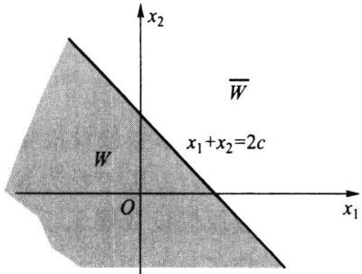  
图7.1.1拒绝域示意图

见图7.1.1），所以接受域是复杂的，将之称为保留域也许更恰当，但习惯上已把它称为接受域，没有必要再进行改变，只是应注意它的含义.

## 三、选择显著性水平

由于样本是随机的,故当我们应用某种检验作判断时，可能做出正确的判断，也可能做出错误的判断，因此，可能犯如下两种错误：当 $\theta \in \Theta _ { \mathfrak { d } }$ 时，样本由于随机性却落入了拒绝域W,于是我们采取了拒绝 $H _ { 0 }$ 的错误决策，称这样的错误为第一类错误（type

Ierror）；当 $\theta \in \Theta _ { \scriptscriptstyle 1 }$ 时，样本却落人了接受域 $\overline { { \mathbb { W } } } .$ ，于是我们采取了接受 $H _ { \mathfrak { o } }$ 的错误决策，称这样的错误为第二类错误（typeⅡerror).具体的可见表7.1.1.

表7.1.1检验的两类错误
<table><tr><td rowspan="2">观测数据情况</td><td colspan="2">总体情况</td></tr><tr><td> $H _ { 0 }$  为真</td><td> $H _ { \mathrm { \Omega _ { l } } }$  为真</td></tr><tr><td> $( x _ { 1 } , x _ { 2 } , \cdots , x _ { n } ) \in W$ </td><td>犯第一类错误</td><td>正确</td></tr><tr><td> $( x _ { 1 } , x _ { 2 } , \cdots , x _ { n } ) \in \overline { { \mathbb { W } } }$ </td><td>正确</td><td>犯第二类错误</td></tr></table>

在实际中，分别称第一类、第二类错误为拒真错误与取伪错误.

由于检验结果受样本的影响，具有随机性，于是，可用总体分布定义犯第一类、第二类错误概率如下：

犯第一类错误概率 $: \alpha ( \theta ) = P _ { \theta } \left\{ X \in W \right\} , \theta \in \Theta _ { 0 }$

犯第二类错误概率 $: \beta ( \theta ) = P _ { \theta } \left\{ X \in W \right\} , \theta \in \Theta _ { 1 }$

事实上，每一个检验都无法避免犯错误的可能，那能否找到一个检验，使其犯两类错误的概率都尽可能地小呢？实际上，我们也做不到这一点.为了说明其原因，先引进如下的势函数或功效函数（powerfunction）的概念.

定义7.1.1设检验问题

$$
H _ { 0 } : \theta \in \Theta _ { 0 } \quad \mathrm { ~ v s ~ } \quad H _ { 1 } : \theta \in \Theta _ { 1 }
$$

的拒绝域为 $\pmb { W }$ ，则样本观测值X落在拒绝域W内的概率称为该检验的势函数，记为

$$
\begin{array} { r } { g \left( \theta \right) = P _ { \theta } \left( X \in \mathbb { W } \right) , \quad \theta \in \theta = \Theta _ { \scriptscriptstyle 0 } \cup \Theta _ { \scriptscriptstyle 1 } . } \end{array}\tag{7.1.2}
$$

显然，势函数 $g ( \theta )$ 是定义在参数空间 $\Theta$ 上的一个函数.当 $\theta \in \Theta _ { \mathfrak { o } }$ 时， $g ( \theta ) = \alpha ( \theta )$ 当 $\theta \in \Theta _ { \mathrm { 1 } }$ 时 $g \left( \theta \right) = 1 - \beta \left( \theta \right)$ .由此可见，犯两类错误的概率都是参数 $\theta$ 的函数，并可由势函数得到，即

$$
g ( \theta ) = \{ \begin{array} { l l } { \alpha ( \theta ) , } & { \theta \in \theta _ { 0 } , } \\ { 1 - \beta ( \theta ) , } & { \theta \in \theta _ { 1 } , } \end{array}  \quad \begin{array} { l l } { \underline { { \pi } } ( \theta ) = g ( \theta ) , } & { \theta \in \theta _ { 0 } , } \\ { \big \{ \beta ( \theta ) = 1 - g ( \theta ) , } & { \theta \in \theta _ { 1 } . } \end{array} 
$$

下面通过例7.1.2说明无法使一个检验犯第一类、第二类错误概率同时变小.对例7.1.2，其拒绝域为 $W = \left\{ { \overline { { x } } } \leqslant c \right\}$ ，由（7.1.2）可以算出该检验的势函数

$$
g \left( \mathbf { \nabla } \theta \right) = P _ { \mathbf { \Phi } _ { \theta } } ( \mathit { \overline { { x } } } \leqslant c ) = P _ { \theta } \bigg ( \frac { \mathit { \overline { { x } } } - \theta } { 4 / 5 } \leqslant \frac { c - \theta } { 4 / 5 } \bigg ) = \varPhi \bigg ( \frac { c - \theta } { 4 / 5 } \bigg ) \ ,
$$

注意到 $\overline { { x } } \sim N ( \theta , 1 6 / 2 5 )$ ，这个势函数是0的减函数（见图7.1.2）.

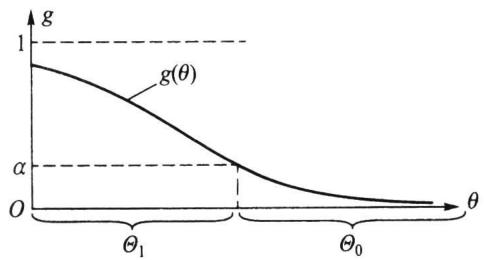

图7.1.2例7.1.2的势函数 $g ( \theta )$

利用这个势函数容易写出其犯两类错误的概率分别为

$$
\alpha \left( \theta \right) = \phi { \left( \frac { c - \theta } { 4 / 5 } \right) } \ , \quad \theta \in { \Theta } _ { \circ } \ ,\tag{7.1.3}
$$

$$
\beta \left( \theta \right) = 1 - \phi \left( \frac { c - \theta } { 4 / 5 } \right) , \quad \theta \in \theta _ { 1 } .\tag{7.1.4}
$$

由上述两个式子可以看出犯两类错误的概率 ${ \pmb { \alpha } ( \theta ) , \pmb { \beta } ( \theta ) }$ 间的关系：

·当 ${ \pmb { \alpha } } ( \pmb { \theta } )$ 减小时，由(7.1.3)知,c也随之减小，再由（7.1.4)知,c的减小必导致 $\beta ( \theta )$ 的增大.

·当 $\beta ( \theta )$ 减小时，由(7.1.4)知,c会增大，再由(7.1.3)知,c的增大必导致 $\alpha ( \theta )$ 的增大.

这一现象说明：在样本量给定的条件下， $\alpha ( \theta )$ 与 $\beta ( \theta )$ 中一个减小必导致另一个增大，这不是偶然的，而具有一般性.这进一步说明：在样本量一定的条件下不可能找到一个使 ${ \pmb { \alpha } ( \pmb { \theta } ) } , { \pmb { \beta } ( \pmb { \theta } ) }$ 都小的检验.还应注意，犯第二类错误的概率在不少场合不易求出.

既然我们不可能同时控制一个检验的犯第一类、第二类错误的概率，在此背景下，只能采取折中方案.通常的做法是仅限制犯第一类错误的概率，这就是费希尔的显著性检验，下面给出正式定义.

定义7.1.2对检验问题 $H _ { 0 } : \theta \in \Theta _ { 0 } \quad \mathrm { ~ v s ~ } \quad H _ { 1 } : \theta \in \Theta _ { 1 }$ ，如果一个检验满足对任意的$\theta \in \Theta _ { 0 }$ ,都有

$$
g ( \theta ) \leqslant \alpha ,
$$

则称该检验是显著性水平为α的显著性检验，简称水平为α的检验.

提出显著性检验的概念就是要控制犯第一类错误的概率 $\pmb { \alpha }$ ，但也不能使得α过小$( \alpha$ 过小会导致 $\beta$ 过大),在适当控制α中制约 $\beta .$ 最常用的选择是 $\alpha = 0 . 0 5$ ，有时也选择$\alpha = 0 . 1 0$ 或 $\alpha = 0 . 0 1$

## 四、给出拒绝域

在确定显著性水平后,我们可以定出检验的拒绝域W.在例7.1.2中,对给定的显著性水平 $\pmb { \alpha }$ ，则要求对任意的 $\theta \geqslant 1 1 0$ 有 $g \left( \theta \right) = \phi { \left( \frac { 5 \left( c - \theta \right) } { 4 } \right) } \leqslant \alpha $ ，由于 $g ( \theta )$ 是关于 $\pmb \theta$ 的单调减函数（见图7.1.2），只需要

$$
g ( 1 1 0 ) = \phi \bigg ( \frac { 5 \big ( c - 1 1 0 \big ) } { 4 } \bigg ) = \alpha
$$

成立即可.用标准正态分布分位数可把上式改写为 $\frac { \pmb { 5 } ( c - 1 1 0 ) } { 4 } = u _ { \alpha }$ ，从而c的值为 $c = 1 1 0 +$ $0 . 8 u _ { \alpha }$ ，检验的拒绝域为

$$
\begin{array} { r } { W = \left\{ \overline { { x } } \leqslant 1 1 0 + 0 . 8 u _ { \alpha } \right\} . } \end{array}
$$

若取 $\alpha = 0 . 0 5$ ,则 $u _ { 0 . 0 5 } = - u _ { 0 . 9 5 }$ ,具体c值为

$$
c = 1 1 0 + 0 . 8 u _ { 0 . 0 5 } = 1 1 0 - 0 . 8 \times 1 . 6 4 5 = 1 0 8 . 6 8 4 .
$$

所以，检验的拒绝域为

$$
W = \left\{ \overline { { x } } \leqslant 1 0 8 . 6 8 4 \right\} .
$$

若令 $u = { \frac { { \overline { { x } } } - 1 1 0 } { 4 / 5 } }$ ，则拒绝域有另一种表示，即

$$
W = \left\{ u \leqslant u _ { 0 , 0 5 } \right\} = \left\{ u \leqslant - 1 . 6 4 5 \right\} .
$$

今后主要用检验统计量u表示拒绝域.

## 五、做出判断

在有了明确的拒绝域W后，根据样本观测值我们可以作出判断：

·当 $u \leqslant - 1 . 6 4 5$ 时，则拒绝 $H _ { 0 }$ ,即接受 $H _ { \mathfrak { r } }$

·当 $u > - 1 . 6 4 5$ 时,则接受 $H _ { \mathfrak { o } }$

在例7.1.2中，由于

$$
u _ { 0 } = \frac { 1 0 8 . 2 - 1 1 0 } { 4 / 5 } = - 2 . 2 5 < - 1 . 6 4 5
$$

因此拒绝原假设，即认为该日生产不正常.

综上，一般情况下，寻找某对假设的显著性检验的步骤如下：

·根据实际问题，建立统计假设 $H _ { 0 } \mathrm { ~ \textbf ~ { ~ v s ~ } ~ } H _ { 1 }$

·选取一个合适的检验统计量 $T ( X )$ ，使当 $H _ { \mathfrak { o } }$ 成立时（或 $H _ { 0 }$ 中某个具体参数下），T的分布完全已知，并根据 $H _ { 0 }$ 及 $H _ { \mathfrak { r } }$ 的特点，确定拒绝域W的形式.

·选择合适的显著性水平α,确定具体的拒绝域W.

·由样本观测值 $x _ { 1 } , x _ { 2 } , \cdots , x _ { n }$ ，计算检验统计量的 $T ( x _ { 1 } , x _ { 2 } , \cdots , x _ { n } )$ ，由 $T ( x _ { \iota }$ $x _ { 2 } , \cdots , x _ { n } )$ 是否属于 $\pmb { \mathbb { W } }$ ，作出最终判断.

## 7.1.3检验的p值

假设检验的结论通常是简单的.在给定的显著性水平下，不是拒绝原假设就是接受原假设.然而有时也会出现这样的情况：在一个较大的显著性水平（比如 $\alpha = 0 . 0 5 )$ 下得到拒绝原假设的结论，而在一个较小的显著性水平（比如 $\alpha = 0 . 0 1 )$ 下却会得到相反的结论.这种情况在理论上很容易解释：因为显著性水平变小后会导致检验的拒绝域变小，于是原来落在拒绝域中的观测值就可能落入接受域，但这种情况在应用中会带来一些麻烦：假如这时一个人主张选择显著性水平 $\alpha = 0 . 0 5$ ，而另一个人主张选 $\alpha =$ 0.01,则第一个人的结论是拒绝H。，而后一个人的结论是接受H。，我们该如何处理这 $H _ { 0 }$ $H _ { 0 }$ 一问题呢？下面用例7.1.2来讨论这个问题.

在上一小节中，我们给出了例7.1.2的检验统计量及拒绝域 $W = \left. \overline { { x } } \leqslant 1 1 0 + 0 . 8 u _ { \alpha } \right.$ ，或表示为 $W = \left\{ u \leqslant u _ { \alpha } \right\}$ ,其中 $u _ { 0 } = 1 . 2 5 \left( { \overline { { x } } } - 1 1 0 \right) = - 2 . 2 5 ,$ 对一些显著性水平，表7.1.2列出了相应的拒绝域和检验结论.

表7.1.2例7.1.2中的拒绝域
<table><tr><td>显著性水平</td><td>拒绝域</td><td>对应的结论(  $u _ { 0 } = - 2 . 2 5 )$ </td></tr><tr><td> $\alpha = 0 . 1$ </td><td> $u \leqslant - 1 . 2 8 2$ </td><td>拒绝  $H _ { \mathfrak { g } }$ </td></tr><tr><td> $\alpha = 0 . 0 5$ </td><td> $u \leqslant - 1 . 6 4 5$ </td><td>拒绝  $H _ { 0 }$ </td></tr><tr><td> $\alpha = 0 . 0 2 5$ </td><td> $u \leqslant - 1 . 9 6$ </td><td>拒绝  $H _ { 0 }$ </td></tr><tr><td>显著性水平</td><td>拒绝域</td><td>对应的结论  $\left( u _ { 0 } = - 2 . 2 5 \right)$ </td></tr><tr><td> $\alpha = 0 . 0 1$ </td><td> $u \leqslant - 2 . 3 2 6$ </td><td>接受  $H _ { \mathrm { o } }$ </td></tr><tr><td> $\alpha = 0 . 0 0 5$ </td><td> $u \leqslant - 2 . 5 7 6$ </td><td>接受  $H _ { \mathfrak { o } }$ </td></tr></table>

我们看到，不同的α有不同的结论.

现在换一个角度来看，在 $\mu = 1 1 0$ 时，检验统计量u的分布是N(0,1).此时由样本可算得u的值 $u _ { 0 } = - 2 . 2 5$ ，据此可算得一个概率 $p = P \left( \ u \leqslant u _ { 0 } \right) = \ P ( \ u \leqslant - 2 . 2 5 ) =$ $\pmb { \mathscr { P } } \left( - 2 . 2 5 \right) = 0 . 0 1 2 2$ ,若以此为基准来看上述检验问题,亦可作出判断，具体如下：

·当 $\alpha { < } 0 . 0 1 2 2$ 时， $u _ { \alpha } < - 2 . 2 5$ ，由于拒绝域为 $W = \left\{ \ u \leqslant u _ { \alpha } \right\}$ ,于是观测值 $u _ { 0 } = - 2 . 2 5$ 不在拒绝域里，应接受原假设.

·当 $\alpha { \geq } 0 . 0 1 2 2$ 时， $u _ { \alpha } \geqslant - 2 . 2 5$ ，由于拒绝域为 $W = \{ u \leqslant u _ { \alpha } \}$ ，于是观测值 $u _ { 0 } = - 2 . 2 5$ 落在拒绝域里，应拒绝原假设.

由此可以看出，0.0122是能用观测值 $u _ { 0 } = - 2 . 2 5$ 作出“拒绝 $H _ { 0 } ^ { \mathrm { ~ ~ } \because }$ 的最小的显著性水平，这就是p值.

定义7.1.3在一个假设检验问题中，利用样本观测值能够作出拒绝原假设的最小显著性水平称为检验的p值.

由检验的p值与人们心目中的显著性水平α进行比较可以很容易作出检验的结论：

·如果 $p \leqslant \alpha$ ,则在显著性水平α下拒绝 $H _ { 0 } ,$

·如果 $p { > } \alpha$ ，则在显著性水平α下接受 $H _ { \mathfrak { o } }$

P值在实际中很有用,如今的统计软件中对检验问题一般都会给出检验的p值.

我们后面的检验可从两方面进行，其一是建立拒绝域，考察样本观测值是否落人拒绝域而加以判断;其二是根据样本观测值计算检验的p值,通过将p值与事先设定的显著性水平α比较大小而作出判断.两者是等价的，哪个方便用哪个.

实际中，p很小时（如 $p { \leqslant } 0 . 0 0 1 \ \cdot$ 即可拒绝原假设，p很大时（如 $p { > } 0 . 5 )$ 即可接受原假设.只有当p与α接近时才需比较.这样至少可减少部分争论.

## 习题7.1

1.设 $x _ { 1 } , x _ { 2 } , \cdots , x _ { n }$ 是来自 $N ( \mu , 1 )$ 的样本，考虑如下假设检验问题

$$
H _ { \scriptscriptstyle 0 } : \mu = 2 \quad \mathrm {  ~ v s ~ \ } H _ { \scriptscriptstyle 1 } : \mu = 3 ,
$$

若检验由拒绝域为 $W = \left\{ \begin{array} { l l } { - } \\  x \geqslant 2 . 6 \right\} \end{array}$ 确定.

（1）当 $n = 2 0$ 时求检验犯两类错误的概率；

（2）如果要使得检验犯第二类错误的概率 $\beta { \leqslant } 0 . 0 1$ ，n最小应取多少？

（3）证明：当n→8时 $\alpha {  } 0 , \beta {  } 0 .$

2.设 $x _ { 1 } , x _ { 2 } , \cdots , x _ { 1 0 }$ 是来自0-1总体 $b ( \boldsymbol { \textbf { l } } , p \boldsymbol { \textbf { ) } }$ 的样本，考虑如下检验问题：

$$
\begin{array} { r } { H _ { \scriptscriptstyle 0 } : p = 0 . 2 \quad \mathrm { ~ v s ~ } \quad H _ { \scriptscriptstyle \mathrm { ~ l ~ } : p } = 0 . 4 , } \end{array}
$$

取拒绝域为 $\mathbb { W } = \left\{ \stackrel { - } { x } \geqslant 0 . 5 \right\}$ ，求该检验犯两类错误的概率.

3.设 $x _ { 1 } , x _ { 2 } , \cdots , x _ { 1 6 }$ 是来自正态总体 $N ( \mu , 4 )$ 的样本，考虑检验问题

$$
H _ { \scriptscriptstyle 0 } : \mu = 6 \quad \mathrm {  ~ v s ~ } \quad H _ { \scriptscriptstyle 1 } : \mu \neq 6 ,
$$

拒绝域取为 $W = \left\{ \begin{array} { l l }  | \overline { { x } } - 6 | \geqslant c \right\} \end{array}$ ，试求c使得检验的显著性水平为0.05，并求该检验在 $\mu = 6 . 5$ 处犯第二类错误的概率.

4.设总体为均匀分布 $U ( 0 , \theta ) , x _ { 1 } , x _ { 2 } , \cdots , x _ { n }$ 是样本，考虑检验问题

$$
H _ { 0 } : \theta \geq 3 \quad \mathrm { \ v s } \quad H _ { 1 } : \theta < 3 ,
$$

拒绝域取为 $\mathbb { W } = \{ x _ { ( n ) } \leqslant 2 . 5 \}$ ，求检验犯第一类错误的最大值 $\alpha$ ，若要使得该最大值α不超过0.05，n至少应取多大？

5.在假设检验问题中，若检验结果是接受原假设，则检验可能犯哪一类错误？若检验结果是拒绝原假设，则又有可能犯哪一类错误？

6.设 $x _ { 1 } , x _ { 2 } , \cdots , x _ { 2 0 }$ 是来自0-1总体 $b \left( \ 1 , p \right)$ 的样本，考虑如下检验问题：

$$
H _ { 0 } : p = 0 . 2 \mathrm { ~ v s ~ } H _ { 1 } : p \neq 0 . 2 ,
$$

取拒绝域为 $W = \Bigg \{ \sum _ { i = 1 } ^ { 2 0 } x _ { i } \geq 7$ 或 $\sum _ { i \mathop { = } 1 } ^ { 2 0 } x _ { i } \mathop { \leqslant } 1 \}$

（1）求 $p = 0 , 0 . 1 , 0 . 2 , \cdots , 0 . 9 ,$ 1时的势并由此画出势函数的图；

（2）求在p=0.05时犯第二类错误的概率.

7.设一个单一观测的样本x取自密度函数为 $p \left( \boldsymbol { x } \right)$ 的总体，对 $p \left( { \boldsymbol { x } } \right)$ 考虑统计假设

$$
H _ { 0 } : p _ { 0 } \left( x \right) = I _ { \{ 0 , 1 \} } \left( x \right) \mathrm { ~ v s ~ } H _ { 1 } : p _ { 1 } \left( x \right) = 2 x I _ { \{ 0 , 1 \} } \left( x \right) .
$$

若其拒绝域的形式为 $\mathbb { W } = \{  x : x \geqslant c \}$ ，试确定一个 $c _ { \textup { \ g } }$ 使得犯第一类、第二类错误的概率满足 $\alpha + 2 \beta$ 为最小，并求其最小值.

8.设 $x _ { 1 } , x _ { 2 } , \cdots , x _ { 3 0 }$ 为取自泊松分布 $P ( \lambda )$ 的随机样本.

（1）试给出单侧假设检验问题 $H _ { 0 } : \lambda \leq 0 . 1 \ \mathrm { ~ v s ~ } H _ { 1 } : \lambda > 0 . 1$ 的显著性水平 $\alpha = 0 . 0 5$ 的检验；

（2）求此检验的势函数 $\beta ( \lambda )$ 在 $\lambda = 0 . 0 5 , 0 , 2 , 0 . 3 , \cdots , 0 , 9$ 时的值，并据此画出 $\beta ( \lambda )$ 的图像.

## §7.2正态总体参数假设检验

本节对正态总体参数 $\mu$ 和 $\sigma ^ { 2 }$ 的各种检验分别进行讨论.

## 7.2.1单个正态总体均值的检验

设 $x _ { 1 } , x _ { 2 } , \cdots , x _ { n }$ 是来自 $N ( \mu , \sigma ^ { 2 } )$ 的样本，考虑如下三种关于 $\mu$ 的检验问题：

$$
\mathrm { I } \quad \ H _ { \scriptscriptstyle 0 } { : \mu } { \leqslant } { \mu _ { \scriptscriptstyle 0 } } \quad \mathrm { v s } \quad H _ { \scriptscriptstyle 1 } { : } { \mu } { > } { \mu _ { \scriptscriptstyle 0 } } ,\tag{7.2.1}
$$

$$
\begin{array} { r } { \mathrm { ~ I ~ } \quad H _ { \circ } : \mu \geqslant \mu _ { \circ } \quad \mathrm { ~ v s ~ } \quad H _ { \iota } : \mu < \mu _ { \circ } , } \end{array}\tag{7.2.2}
$$

$$
\begin{array} { r l } { \mathbb { I } } & { { } H _ { 0 } : \mu = \mu _ { 0 } \quad \mathrm { ~ v s ~ } \quad H _ { 1 } : \mu \neq \mu _ { 0 } , } \end{array}\tag{7.2.3}
$$

其中 $\mu _ { 0 }$ 是已知常数.由于正态总体含两个参数，总体方差 $\sigma ^ { 2 }$ 已知与否对检验有影响.  
下面我们分 $\sigma$ 已知和未知两种情况叙述.

## $\sigma = \sigma _ { 0 }$ 已知时的u检验

对于（7.2.1)式所示的单侧检验问题Ⅰ，由于 $\mu$ 的点估计是x，且 $\overline { { x } } \sim N ( \mu , \sigma _ { 0 } ^ { 2 } / n )$ 故选用检验统计量

$$
u = \frac { \overline { { x } } - \mu _ { 0 } } { \sigma _ { 0 } / \sqrt { n } }\tag{7.2.4}
$$

是恰当的.直觉告诉我们：当样本均值 $\overline { { x } }$ 不超过设定均值 $\scriptstyle \mu _ { 0 }$ 时，应倾向于接受原假设；当样本均值 $\overset { - } { x }$ 超过 $\scriptstyle \mu _ { 0 }$ 时，应倾向于拒绝原假设.可是，在有随机性存在的场合，如果x比 $\scriptstyle \mu _ { 0 }$ 大一点就拒绝原假设似乎不当，只有当 $\mathbf { \Pi } _ { x } ^ { - }$ 比 $\scriptstyle \mu _ { 0 }$ 大到一定程度时拒绝原假设才是恰当的.这就存在一个临界值c,拒绝域为

$$
\begin{array} { r }   { W _ { \mathrm { ~ I ~ } } } =  { \left\{ \begin{array} { l l } { \left( x _ { 1 } , x _ { 2 } , \cdots , x _ { n } \right) : u \geq c } , } } \end{\right\array} \end{array} \end{array}\tag{7.2.5}
$$

常简记为 $\left\{ u \geqslant c \right\}$ .若要求检验的显著性水平为α，则c满足

$$
\begin{array} { r } { P _ { \mu _ { 0 } } ( u \geqslant c ) = \alpha . } \end{array}
$$

由于在 $\mu = \mu _ { 0 }$ 时， $u \sim N ( 0 , 1 )$ ，故 $c = u _ { 1 - \alpha }$ （见图7.2.1（a)），最后的拒绝域为

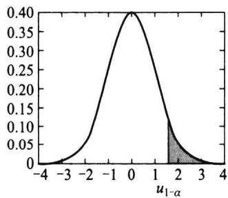

(7.2.6)

(a) $H _ { 1 } \colon \mu > \mu _ { 0 }$

$$
\smash {  { W _ { \mathrm { ~ l ~ } } } = \left\{ \ u \geq u _ { 1 - \alpha } \right\} . }
$$

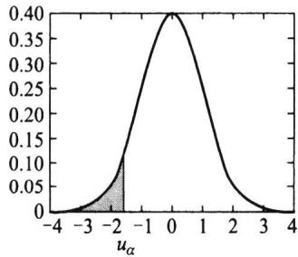  
(b) $H _ { 1 }$ μ<o

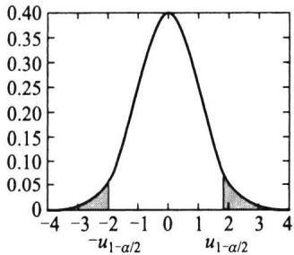  
(c） $H _ { 1 } ;$ μ  
图7.2.1u检验的拒绝域

该检验用的检验统计量是u统计量，故一般称为u检验.该检验的势函数是 $\mu$ 的函数，它可用正态分布写出，具体如下：对 $\mu \in \left( - \infty \mathrm { ~ , \infty ~ } \right)$

$$
\begin{array} { r l } & { g ( \mu ) = P _ { \mu } ( X \in \mathbb { V } _ { 1 } ) = P _ { \rho } ( u \geqslant u _ { 1 - \sigma } ) } \\ & { \qquad = P _ { \ * } \Bigg ( \frac { \overline { { x } } - \mu _ { 0 } } { \sigma _ { 0 } \sqrt { n } } \geqslant u _ { 1 - \sigma } \Bigg ) } \\ & { \qquad = P _ { \ * } \Bigg ( \frac { \overline { { x } } - \mu _ { 1 } + \mu - \mu _ { 0 } } { \sigma _ { 0 } \sqrt { n } } \geqslant u _ { 1 - \sigma } \Bigg ) } \\ & { \qquad = P _ { \ * } \Bigg ( \frac { \overline { { x } } - \mu _ { 0 } } { \sigma _ { 0 } \sqrt { n } } \geqslant \frac { \mu _ { 0 } - \mu } { \sigma _ { 0 } \sqrt { n } } + u _ { 1 - \sigma } \Bigg ) } \\ & { \qquad = P _ { \ * } \Bigg ( \frac { \overline { { x } } - \mu _ { 0 } } { \sigma _ { 0 } \sqrt { n } } \geqslant \frac { \mu _ { 0 } - \mu } { \sigma _ { 0 } \sqrt { n } } + u _ { 1 - \sigma } \Bigg ) } \\ & { \qquad = 1 - \phi ( \sqrt { n } ( \mu _ { 0 } - \mu ) / \sigma _ { 0 } + u _ { 1 - \sigma } ) , } \end{array}
$$

由此可见，势函数是 $\pmb { \mu }$ 的增函数，其图形见图7.2.2（a).由增函数性质知，只要$g ( \mu _ { 0 } ) = \alpha$ ，就可保证在 $\mu \leqslant \mu _ { 0 }$ 时有 $\begin{array} { r } { g \left( \mu \right) \leqslant \alpha } \end{array}$ 所以上述求出的检验是显著性水平为 $\pmb { \alpha }$ 的检验.

下面我们讲述用 $p$ 值进行检验的方法.

类似于7.1.3节的讲述，对给定的样本观测值，可以计算出相应的检验统计量u的值，记为 $u _ { 0 } = \frac { \sqrt { n } \left( \overline { { x } } - \mu _ { 0 } \right) } { \sigma _ { 0 } }$ ，这里的 $\overline { { x } }$ 是样本观测值.因在 $\mu = \mu _ { 0 }$ 时，u是服从标准正态分布

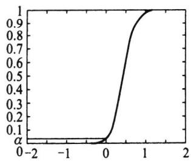  
(a) $H _ { 1 }$ $\mu { > } { \mu } _ { 0 }$

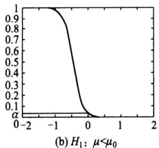  
图7.2.2 $\pmb { \mathstrut } _ { \pmb { \beta } } ( \mu )$ 的图形

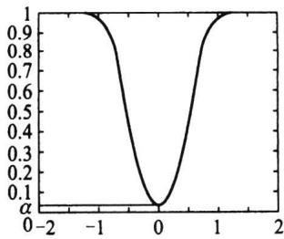  
（c） $H _ { 1 }$ μo

的随机变量，令

$$
p _ { \mathrm { ~ I ~ } } = P \left( \mathrm { ~ } u \geqslant u _ { \mathrm { 0 } } \right) = 1 - \phi \left( \mathrm { ~ } u _ { \mathrm { 0 } } \right) ,\tag{7.2.7}
$$

此即说明 $\boldsymbol { u } _ { 0 } = \boldsymbol { u } _ { 1 - p _ { \checkmark } }$ ，于是由正态分布函数的反函数的单调性有如下结论：

·当 $p _ { \mathrm { ~ I ~ } } \leqslant \alpha$ 时， $u _ { 1 - \alpha } \leqslant u _ { 0 }$ ，于是观测值落在拒绝域里，应拒绝原假设.

·当 $p _ { \mathrm { ~ I ~ } } { > } \alpha$ 时， $u _ { 1 - \alpha } > u _ { 0 }$ ，于是观测值不在拒绝域里，应接受原假设.

由此可以看出，（7.2.7)计算出的值就是该检验的 $p$ 值.

对检验问题(7.2.2)所示的单侧检验问题Ⅱ的讨论是完全类似的.仍选用u作为检验统计量，考虑到（7.2.2）的备择假设 $H _ { \mathfrak { r } }$ 在左侧，其拒绝域(见图7.2.1(b)）为

$$
{ \mathbb { W } } _ { \mathbb { I } } = \left\{ u \leqslant u _ { \alpha } \right\} .\tag{7.2.8}
$$

而检验的p值为

$$
p _ { \mathbb { I } } = P \left( \boldsymbol { u } \leqslant \boldsymbol { u } _ { 0 } \right) = \varPhi \left( \boldsymbol { u } _ { 0 } \right) ,\tag{7.2.9}
$$

$u _ { 0 }$ ,u的含义同上，后面还会用到就不再一一指出了.

对检验问题(7.2.3)所示的双侧检验问题Ⅲ，也可类似进行讨论，只不过检验的P值稍有不同.仍选用u作为检验统计量，考虑到（7.2.3）的备择假设 $H _ { \mathrm { 1 } }$ 分散在两侧，故其拒绝域亦应在两侧，即拒绝域应有如下形式

$$
\mathbb { W } _ { \mathbb { H } } = \left\{ \ \left| \ u \right| \geqslant c \right\} .
$$

对给定的显著性水平 $\alpha ( 0 < \alpha < 1 )$ ，由 $P _ { \mu _ { 0 } } ( \mid u \mid \geqslant c ) = \alpha$ 可定出 $c = u _ { 1 - \alpha / 2 }$ （见图7.2.1(c)），最后的拒绝域为

$$
\smash {  { W _ { \perp } } = \left\{ \begin{array} { r l } { \lvert u \rvert \geqslant u _ { 1 - \alpha / 2 } } \end{array} \right\} . }\tag{7.2.10}
$$

下面介绍双侧检验的p值的计算.在检验统计量分布对称场合，双侧检验的p值的计算与单侧检验是类似的，不对称场合我们在后面介绍.

仿上，令

$$
p _ { \mathbb { H } } = P \big ( \mid u \mid \geqslant \mid u _ { 0 } \mid \big ) = 2 \big ( 1 { - } \phi \big ( \mid u _ { 0 } \mid \big ) \big ) ,\tag{7.2.11}
$$

此即说明 $\vert u _ { 0 } \vert = u _ { 1 - p _ { \perp } / 2 }$ ，这里要用到 $u _ { 0 }$ 的绝对值是因为对双侧假设检验，观测值可能为正，也可能为负，二者机会相同，于是有类似的结论：

·当 ${ p _ { \mathtt { M } } } \leqslant \alpha$ 时， $u _ { 1 - \alpha / 2 } \leqslant | u _ { 0 } |$ ，于是观测值落在拒绝域里，应拒绝原假设.

·当 $p _ { \parallel } > \alpha$ 时， $u _ { 1 - \alpha / 2 } > | u _ { 0 } |$ ,于是观测值不在拒绝域里，应接受原假设.

由此可以看出，（7.2.11)计算出的值就是该检验的p值.

例7.2.1从甲地发送一个信号到乙地.设乙地接收到的信号值是一个服从正态分 $\textsf { Z }$ 布 $N ( \mu , 0 . 2 ^ { 2 } )$ 的随机变量，其中μ为甲地发送的真实信号值.现甲地重复发送同一信号 $\mu$

5次，乙地接收到的信号值为

$$
8 . 0 5 8 . 1 5 8 . 2 8 . 1 8 . 2 5 ,
$$

设接收方有理由猜测甲地发送的信号值为8,问能否接受这猜测？

解这是一个假设检验的问题,总体 $X \sim N ( \mu , 0 . 2 ^ { 2 } )$ ,待检验的原假设 $H _ { \mathrm { 0 } }$ 与备择假设 $H _ { \parallel }$ 分别为

$$
H _ { \scriptscriptstyle 0 } : \mu = 8 \quad \mathrm { ~ v s ~ } \quad H _ { \scriptscriptstyle 1 } : \mu \neq 8 .
$$

这是一个双侧检验问题，检验的拒绝域为 $\left\{ \begin{array} { l } { | \ u | \geqslant u _ { 1 - \alpha / 2 } } \end{array} \right\}$ .取显著性水平 $\alpha = 0 . 0 5$ ,则查表知 $u _ { 0 . 9 7 5 } = 1 . 9 6$ 由该例中观测值可计算得出

$$
\overline { { x } } = 8 . 1 5 , u _ { 0 } = \sqrt { 5 } \left( 8 . 1 5 - 8 \right) / 0 . 2 = 1 . 6 8 ,
$$

$u _ { 0 }$ 值未落入拒绝域 $\left\{ \begin{array} { l l }  \lvert \ u \rvert \geqslant 1 . 9 6 \right\} \quad \end{array}$ 内，故不能拒绝原假设，即接受原假设，可认为猜测成立.

我们也可以采用p值完成此次检验.此处 $u _ { 0 } = 1 . 6 8$ ，根据（7.2.11）式，

$$
p = 2 { \left( \ 1 - \phi \left( \ 1 . 6 8 \right) \ \right) } = 0 . 0 9 3 .
$$

由于 $p$ 值大于事先给定的水平0.05,故不能拒绝原假设,结论是相同的.

进一步，我们从p值还可以看到，只要事先给定的显著性水平不高于0.093，则都不 $p$ 能拒绝原假设；而若事先给定的显著性水平高于0.093，如事先给定的显著性水平为 0.10,则检验就会作出拒绝原假设的结论.

说明：在实际中也经常会遇到如下两个检验问题：

$$
\begin{array} { r l r } { \mathrm { ( N ) } } & { { } H _ { \mathrm { 0 } } : \mu = \mu _ { \mathrm { 0 } } \quad \mathrm { ~ v s ~ } } & { H _ { \mathrm { 1 } } : \mu > \mu _ { \mathrm { 0 } } , } \\ { \mathrm { V } } & { { } H _ { \mathrm { 0 } } : \mu = \mu _ { \mathrm { 0 } } } & { \mathrm { v s ~ } } & { H _ { \mathrm { 1 } } : \mu < \mu _ { \mathrm { 0 } } . } \end{array}
$$

它仍可用检验统计量u施行检验.检验问题IV的拒绝域与检验问题I的拒绝域相同，即$\mathbb { W } _ { \mathbb { N } } = \left\{ u \geq u _ { 1 - \alpha } \right\}$ .这是因为检验问题V与I的备择假设相同，而V的原假设是I的原假设的子集，由于此时u检验的势函数是μ的单调增函数，因此，检验问题V的显著性水 $\mu$ 平为α的检验与检验问题I的显著性水平为α的检验是相同的，从而拒绝域也相同，它们的检验的p值也相同.类似地，检验问题V与检验问题Ⅱ的拒绝域以及p值也是相 $p$ $p$ 同的.这个现象在以后其他检验中也会出现，结论是相似的.由此，本文中不再考虑诸如V,V的检验问题(若出现此类检验问题,可归结为检验问题I，Ⅱ处理).

## $\sigma$ 未知时的t检验

对检验问题I，由于σ未知，无法使用(7.2.4)式作检验.一个自然的想法是将 $\sigma$ （7.2.4)式中未知的σ替换成样本标准差s,这就形成t检验统计量 $\pmb { \sigma }$

$$
t = \frac { \sqrt { n } \left( \stackrel { - } { x } - \mu _ { 0 } \right) } { s } .\tag{7.2.12}
$$

由推论5.4.2知，在 ${ \boldsymbol { \mu } } = { \boldsymbol { \mu } } _ { 0 }$ 时， $t \sim t ( n - 1 )$ ，从而检验问题I的拒绝域为

$$
\smash  W _ { \mathrm { \perp } } = \left\{ \begin{array} { r l } { t \geq t _ { \perp - \alpha } ( n - 1 ) \right\} , } \end{array}\tag{7.2.13}
$$

检验的p值是类似的，对给定的样本观测值，可以计算出相应的检验统计量t的值,记为 $t _ { 0 } = \frac { \sqrt { n } \left( \overline { { x } } - \mu _ { 0 } \right) } { s }$ ,这里的 ${ \overline { { x } } } , s$ 可由样本观测值算得.因t是服从自由度是n-1的t分布的随机变量，则

$$
p _ { \mathrm { ~ I ~ } } = P ( t \geq t _ { 0 } ) .\tag{7.2.14}
$$

对另两组检验问题的讨论是完全类似于上一小节的，罗列结果如下：检验问题Ⅱ的拒绝域为

$$
\mathbb { W } _ { \mathbb { I } } = \left\{ \left. t \leqslant t _ { \alpha } ( n - 1 ) \right\} , \right.\tag{7.2.15}
$$

$p$ 值为

$$
p _ { \mathbb { I } } = P \left( t \leqslant t _ { 0 } \right) .\tag{7.2.16}
$$

检验问题Ⅲ的拒绝域为

$$
\mathbb { W } _ { \mathbb { H } } = \left\{ \begin{array} { l l }  | t | \geqslant t _ { 1 - \alpha / 2 } ( n - 1 ) \ \right\} , \end{array}\tag{7.2.17}
$$

p值为

$$
p _ { \parallel } = P ( \mid t \mid \geqslant \mid t _ { 0 }  | \mathit { \Omega } ) ,\tag{7.2.18}
$$

同样可证明这三个检验都是显著性水平为α的检验.

例7.2.2某厂生产的某种铝材的长度服从正态分布，其均值设定为240cm.现从该厂抽取5件 $\vec { J } ^ { \mathrm { s } }$ 品，测得其长度（单位：cm）为

$$
2 3 9 . 7 2 3 9 . 6 2 3 9 2 4 0 2 3 9 . 2 { \it \Omega }
$$

试判断该厂此类铝材的长度是否满足设定要求？

这是一个关于正态均值的双侧假设检验问题.原假设是 $H _ { \mathrm { 0 } } : \mu = 2 4 0$ ，备择假设是$H _ { \mathrm { 1 } } : \mu \neq 2 4 0$ 由于 $\sigma$ 未知，故采用t检验，其拒绝域为 $\left\{ \begin{array} { l } { { | t | \geqslant t _ { 1 - \alpha / 2 } \left( n - 1 \right) } } \end{array} \right\}$ ，若取 $\alpha = 0 . 0 5$ 则查表得 $t _ { 0 . 9 7 5 } ( 4 ) = 2 . 7 7 6 4$ 现由样本计算得到 $\overline { { x } } = 2 3 9 . 5 , s = 0 . 4$ ，故

$$
t _ { \scriptscriptstyle 0 } = \sqrt { 5 } ( 2 3 9 . 5 - 2 4 0 ) / 0 . 4 = - 2 . 7 9 5 ,
$$

由于 $\mid t _ { 0 } \mid = 2 . 7 9 5 > 2 . 7 7 6 4$ ，故拒绝原假设，认为该厂生产的铝材的长度不满足设定要求.

下面用p值再作一次检验.此处 $t _ { 0 } = - 2 . 7 9 5$ ，记t是服从自由度是4的t分布的随机变量，则根据（7.2.18），

$$
p = P \left( \mid t \mid \geqslant 2 . 7 9 5 \right) = 2 P \left( t \geqslant 2 . 7 9 5 \right) ,
$$

利用统计软件（如R或Excel)可计算出具体p值为0.0491，由于p值小于事先给定的 $p$ $p$ 显著性水平0.05，故拒绝原假设，结论是相同的.

综上，关于单个正态总体的均值的检验问题可汇总成表7.2.1.

表7.2.1单个正态总体均值的假设检验
<table><tr><td>检验法</td><td> $H _ { \mathfrak { o } }$ </td><td> $H _ { \mathfrak { r } }$ </td><td>检验统计量</td><td>拒绝域</td><td>p值</td></tr><tr><td rowspan="3">u检验  ${ \bf \Xi } ( \sigma = \sigma _ { 0 }$  已知）</td><td> $\mu \leqslant \mu _ { 0 }$ </td><td> $\mu > \mu _ { 0 }$ </td><td rowspan="3"> $u = \frac { \overline { { x } } - \mu _ { 0 } } { \sigma _ { 0 } / \sqrt { n } }$ </td><td> $\left\{ u \geqslant u _ { 1 - \alpha } \right\}$ </td><td> $1 - \phi ( \boldsymbol { u } _ { 0 } )$ </td></tr><tr><td> $\mu \geqslant \mu _ { 0 }$ </td><td> $\mu { < } \mu _ { 0 }$ </td><td> $\left\{ u \leqslant u _ { \alpha } \right\}$ </td><td> $\pmb { \phi } ( \boldsymbol { u } _ { 0 } )$ </td></tr><tr><td> ${ \boldsymbol { \mu } } = { \boldsymbol { \mu } } _ { 0 }$ </td><td> $\mu \neq \mu _ { \scriptscriptstyle 0 }$ </td><td> $\left\{ \begin{array} { l l } { | u | \geqslant u _ { 1 - \alpha / 2 } } \end{array} \right\}$ </td><td> $2 \big ( 1 - \Phi \big ( \mid u _ { 0 } \mid \big ) \big )$ </td></tr><tr><td rowspan="3">t检验 （σ未知）</td><td> $\mu \leqslant \mu _ { 0 }$ </td><td> $\mu > \mu _ { 0 }$ </td><td rowspan="3"> $t = { \frac { { \overline { { x } } } - \mu _ { 0 } } { s / { \sqrt { n } } } }$ </td><td> $\{ t \geqslant t _ { 1 - \alpha } ( n - 1 ) \}$ </td><td> $P ( t \geq t _ { 0 } )$ </td></tr><tr><td> $\mu \geqslant \mu _ { 0 }$ </td><td> $\mu { < } \mu _ { 0 }$ </td><td> $\left\{ t \leqslant t _ { \alpha } ( n - 1 ) \right\}$ </td><td> $P ( t \leqslant t _ { 0 } )$ </td></tr><tr><td> $\mu = \mu _ { \scriptscriptstyle 0 }$ </td><td> $\mu \neq \mu _ { 0 }$ </td><td> $\{ \mid t \mid \geqslant t _ { 1 - \alpha / 2 } ( n - 1 ) \ \}$ </td><td> $P ( \ | \ t | \geqslant | t _ { 0 } \stackrel { } { | } \ )$ </td></tr></table>

注 $: u _ { 0 } = \sqrt { n } \left( \overline { { x } } - \mu _ { 0 } \right) / \sigma _ { 0 } , t _ { 0 } = \sqrt { n } \left( \overline { { x } } - \mu _ { 0 } \right) / s , u$ 是服从N(0，1）的随机变量，t是服从t（n-1)的随机变量.

## 7.2.2假设检验与置信区间的关系

细心的读者可能会发现，这里用的检验统计量与6.6.3节中置信区间所用的枢轴量很相似，这不是偶然的，两者之间存在非常密切的关系，现以标准差未知场合为例叙述如下.

设 $x _ { 1 } , x _ { 2 } , \cdots , x _ { n }$ 是来自正态总体 $N ( \mu , \sigma ^ { 2 } )$ 的样本，现讨论在 $\pmb { \sigma }$ 未知场合关于均值$\pmb { \mu }$ 的检验问题.分三种情况：

首先考虑双侧检验问题ⅢI，显著性水平为α的检验的接受域为

$$
\overline { { \mathbb { W } } } _ { \mathbb { H } } = \{ \mathbf { \Pi } \big | \overline { { x } } { - } { \mu } _ { 0 } \big | { \leqslant } \frac { s } { \sqrt { n } } { t } _ { 1 - \alpha / 2 } ( n { - } 1 ) \mathbf { \Pi } \big \} ~ ,
$$

它可以改写为

$$
\overline { { { W } } } _ { \mathbb { H } } = \left\{ \overline { { { x } } } - \frac { s } { \sqrt { n } } t _ { 1 - \alpha / 2 } ( n - 1 ) \leqslant \mu _ { 0 } \leqslant \overline { { { x } } } + \frac { s } { \sqrt { n } } t _ { 1 - \alpha / 2 } ( n - 1 ) \right\} ,
$$

这里 $\scriptstyle \mu _ { 0 }$ 并无限制，若让 $\scriptstyle \mu _ { 0 }$ 在 $( - \infty , \infty )$ 内取值，就可得到 $\pmb { \mu }$ 的1-α置信区间$\left[ \overline { { { x } } } \pm \frac { s } { \sqrt { n } } t _ { 1 - \alpha / 2 } ( n - 1 ) \right]$ .反之,若有一个如上的1-α置信区间,也可获得关于 $H _ { \mathfrak { o } } : \mu = \mu _ { \mathfrak { o } }$ 的显著性水平为α的显著性检验.所以，“正态均值 $\mu$ 的1-α置信区间"与“关于 $H _ { 0 } : \mu = \mu _ { 0 }$ Vs$H _ { \mathrm { 1 } } : \mu \neq \mu _ { \mathrm { 0 } }$ 的双侧检验问题的显著性水平为α的检验"是一一对应的.

类似地考虑单侧检验问题I，显著性水平为α的检验的接受域为 $\pmb { \alpha }$

$$
\overline { { { W } } } _ { \mathrm { { I } } } \ = \left\{ \overline { { { x } } } - \mu _ { 0 } \leqslant \frac { s } { \sqrt { n } } t _ { 1 - \alpha } ( n - 1 ) \right\} = \left\{ \mu _ { 0 } \geqslant \overline { { { x } } } - \frac { s } { \sqrt { n } } t _ { 1 - \alpha } ( n - 1 ) \right\} ,
$$

这就给出了参数μ的1-α置信下限.反之，对上述给定的μ的1-α置信下限，我们也可 $\pmb { \mu }$ $_ { 1 - \alpha }$ $\pmb { \mu }$ $_ { 1 - \alpha }$ 以得到关于 $H _ { \mathfrak { o } } : \mu \leqslant \mu _ { 0 }$ 的单侧检验问题的显著性水平为α的检验，它们之间也是一一 $\pmb { \alpha }$ 对应的.同样，对单侧检验问题Ⅱ，其显著性水平为α的检验与参数μ的1-α置信上限 $\pmb { \alpha }$ $\pmb { \mu }$ $_ { 1 - \alpha }$ 也是一一对应的.

## 7.2.3两个正态总体均值差的检验

设 $x _ { 1 } , x _ { 2 } , \cdots , x _ { m }$ 是来自正态总体 $N ( \mu _ { 1 } , \sigma _ { 1 } ^ { 2 } )$ 的样本， $y _ { 1 } , y _ { 2 } , \cdots , y _ { n }$ 是来自另一个正态总体 $N ( \mu _ { 2 } , \sigma _ { 2 } ^ { 2 } )$ 的样本，两个样本相互独立.考虑如下三类检验问题：

$$
\mathrm { ~ I ~ } \quad H _ { \scriptscriptstyle 0 } : \mu _ { \scriptscriptstyle 1 } - \mu _ { \scriptscriptstyle 2 } \leqslant 0 \quad \mathrm { ~ v s ~ } \quad H _ { \scriptscriptstyle 1 } : \mu _ { \scriptscriptstyle 1 } - \mu _ { \scriptscriptstyle 2 } > 0 .\tag{7.2.19}
$$

$$
\begin{array} { r l } { \mathbb { I } } & { { } \ H _ { \scriptscriptstyle 0 } { : } \mu _ { \scriptscriptstyle 1 } { - } \mu _ { \scriptscriptstyle 2 } \geqslant 0 \quad \mathrm { ~ v s ~ } \quad H _ { \scriptscriptstyle 1 } { : } \mu _ { \scriptscriptstyle 1 } { - } \mu _ { \scriptscriptstyle 2 } { < } 0 . } \end{array}\tag{7.2.20}
$$

$$
\begin{array} { r l } { \mathbb { I } } & { { } H _ { 0 } : \mu _ { 1 } - \mu _ { 2 } = 0 \quad \mathrm { ~ v s ~ } \quad H _ { 1 } : \mu _ { 1 } - \mu _ { 2 } \neq 0 . } \end{array}\tag{7.2.21}
$$

这里对常用的两种情形进行讨论.

## $- , \sigma _ { 1 } , \sigma _ { 2 }$ 已知时的两样本u检验

此时 $\mu _ { 1 } - \mu _ { 2 }$ 的点估计 $\overline { { x } } - \overline { { y } }$ 的分布完全已知，

$$
\overline { { { x } } } - \overline { { { y } } } \sim N \left( \mu _ { 1 } - \mu _ { 2 } , \frac { \sigma _ { 1 } ^ { 2 } } { m } + \frac { \sigma _ { 2 } ^ { 2 } } { n } \right) .
$$

由此可采用u检验方法，检验统计量为

$$
u = \frac { \overline { { x } } - \overline { { y } } } { \sqrt { \frac { \sigma _ { 1 } ^ { 2 } } { m } + \frac { \sigma _ { 2 } ^ { 2 } } { n } } } .
$$

在 $\mu _ { 1 } = \mu _ { 2 }$ 时， $u \sim N ( 0 , 1 )$ .检验的拒绝域取决于备择假设的具体内容.对（7.2.19）所示的检验问题I，检验的拒绝域与p值分别为

$$
\boldsymbol { W } _ { \mathrm { ~ l ~ } } = \{ \vphantom { \sum _ { i } } u \geq u _ { { 1 } - \alpha } \} \mathrm { ~ , ~ } \quad p _ { \mathrm { ~ l ~ } } = 1 - \boldsymbol { \varPhi } (  u _ { 0 } ) \mathrm { ~ , ~ }
$$

其中 $u _ { 0 } = \frac { \overline { { x } } - \overline { { y } } } { \displaystyle { \sqrt { \frac { \sigma _ { 1 } ^ { 2 } } { m } + \frac { \sigma _ { 2 } ^ { 2 } } { n } } } }$ 是由样本计算得到的检验统计量的值.对（7.2.20)所示的检验问题

Ⅱ，检验的拒绝域与p值分别为

$$
\mathbb { W } _ { \textrm { \scriptsize \Pi } } = \left\{ \mathbf { \Pi } u \leqslant u _ { \alpha } \right\} , \quad p _ { \textrm { \scriptsize \Pi } } = \pmb { \mathcal { P } } \left( \mathbf { \Pi } u _ { 0 } \right) .
$$

对（7.2.21)所示的检验问题Ⅲ，检验的拒绝域与p值分别为

$$
\begin{array} { r } { W _ { \mathbb { n } } = \left\{ \mid u \mid \geqslant u _ { \scriptscriptstyle { 1 - \alpha / 2 } } \right\} , \quad p _ { \mathbb { n } } = 2 \big ( 1 - \phi \big ( \mid u _ { 0 } \mid \big ) \big ) . } \end{array}
$$

$= , \sigma _ { 1 } = \sigma _ { 2 } = \sigma$ 但未知时的两样本t检验

在 ${ \boldsymbol { \sigma } } _ { 1 } ^ { 2 } = { \boldsymbol { \sigma } } _ { 2 } ^ { 2 } = { \boldsymbol { \sigma } } ^ { 2 }$ 但未知时，首先

$$
\overline { { { x } } } - \overline { { { y } } } \sim N \left( \mu _ { 1 } - \mu _ { 2 } , \left( \frac { 1 } { m } + \frac { 1 } { n } \right) \sigma ^ { 2 } \right) ,
$$

其次，由于

$$
\frac { 1 } { \sigma ^ { 2 } } \sum _ { i = 1 } ^ { m } \left( x _ { i } - \overline { { x } } \right) ^ { 2 } \quad \sim \chi ^ { 2 } ( m - 1 ) , \quad \frac { 1 } { \sigma ^ { 2 } } \sum _ { i = 1 } ^ { n } \left( y _ { i } - \overline { { y } } \right) ^ { 2 } \quad \sim \chi ^ { 2 } ( n - 1 ) ,
$$

故 $\frac { 1 } { \sigma ^ { 2 } } ( \ \sum \left( \ \chi _ { i } - \overline { { x } } \right) ^ { 2 } + \ \sum \left( \ \gamma _ { i } - \overline { { y } } \right) ^ { 2 } ) \ \sim \chi ^ { 2 } ( \ m + n - 2 )$ ，记

$$
s _ { _ { w } } ^ { ^ 2 } = { \frac { 1 } { m + n - 2 } } \Big [ \sum _ { i = 1 } ^ { m } \big ( x _ { i } - \overline { { x } } \big ) ^ { 2 } + \sum _ { i = 1 } ^ { n } \big ( y _ { i } - \overline { { y } } \big ) ^ { 2 } \Big ] ,
$$

于是有

$$
t = { \frac { ( { \overline { { x } } } - { \overline { { y } } } ) - ( \mu _ { 1 } - \mu _ { 2 } ) } { \displaystyle s _ { w } { \sqrt { \frac { 1 } { m } } } + { \frac { 1 } { n } } } } { \sim } t ( m + n - 2 ) .
$$

当 $\mu _ { 1 } = \mu _ { 2 }$ 时，检验统计量为

$$
t = { \frac { { \overline { { x } } } - { \overline { { y } } } } { s _ { w } \displaystyle { \sqrt { \frac { 1 } { m } } } + { \frac { 1 } { n } } } } .
$$

对检验问题I，检验的拒绝域与p值分别为

$$
\begin{array} { r } { W _ { \mathrm { ~ l ~ } } = \big \{ t \geqslant t _ { 1 - \alpha } \big ( m + n - 2 \big ) \big \} \ , \quad p _ { \mathrm { ~ l ~ } } = P \big ( t \geqslant t _ { 0 } \big ) \ , } \end{array}
$$

其中 $t _ { 0 } = \frac { \overline { { x } } - \overline { { y } } } { s _ { w } \sqrt { \displaystyle { \frac { 1 } { m } } + { \frac { 1 } { n } } } }$ 是由样本计算得到的检验统计量的值，t是服从自由度是 $n + m - 2$

的t分布的随机变量.对检验问题Ⅱ，检验的拒绝域与p值分别为

$$
\begin{array} { r } { W _ { \parallel } = \big \{ t \leqslant t _ { \alpha } \big ( m + n - 2 \big ) \big \} \ , \quad p _ { \parallel } = P \big ( t \leqslant t _ { 0 } \big ) . } \end{array}
$$

对检验问题Ⅲ,检验的拒绝域与p值分别为

$$
W _ { \parallel } = \left\{ \mid t \mid \geqslant t _ { 1 - \alpha / 2 } \big ( m + n - 2 \big ) \right\} , \quad p _ { \parallel } = P \big ( \mid t \mid \geqslant \mid t _ { 0 } \mid \big ) .
$$

例7.2.3某厂铸造车间为提高铸件的耐磨性而试制了一种镍合金铸件以取代铜合金铸件，为此，从两种铸件中各抽取一个容量分别为8和9的样本，测得其硬度（一种耐磨性指标）为

镍合金：76.4376.2173.5869.6965.2970.8382.7572.34,

铜合金：73.6664.27 69.3471.3769.7768.1267.2768.07 62.61.

根据专业经验，硬度服从正态分布，且方差保持不变，试在显著性水平 $\alpha = 0 . 0 5$ 下判断镍合金的硬度是否有明显提高.

解用X表示镍合金的硬度，Y表示铜合金的硬度，则由假定， $X \sim \smash { N ( \mu _ { 1 } , \sigma ^ { 2 } ) }$ $Y \sim N ( \mu _ { 2 } , \sigma ^ { 2 } )$ ，要检验的假设是： $H _ { \mathrm { o } } : \mu _ { 1 } = \mu _ { 2 } \mathrm { v s } H _ { \mathrm { 1 } } : \mu _ { 1 } > \mu _ { 2 }$ .由于两者方差未知但相等,故采用两样本t检验，经计算，

$$
\overline { { { x } } } = 7 3 . \overset { ? } { \Rightarrow } 9 , \overline { { { y } } } = 6 8 . 2 7 5 \ 6 ,
$$

$$
\sum _ { i = 1 } ^ { 8 } \left( x _ { i } - { \overline { { x } } } \right) ^ { 2 } = 1 9 1 . 7 9 5 ~ 8 , ~ \sum _ { i = 1 } ^ { 9 } \left( y _ { i } - { \overline { { y } } } \right) ^ { 2 } = 9 1 . 1 5 4 ~ 8 ,
$$

从而 $s _ { w } = \sqrt { \frac { 1 } { 8 + 9 - 2 } ( 1 9 1 . 7 9 5 ~ 8 + 9 1 . 1 5 4 ~ 8 ) } = 4 . 3 4 3 ~ 2$

$$
\begin{array} { c } { { t _ { 0 } = \displaystyle \frac { 7 3 . 3 9 - 6 8 . 2 7 5 ~ 6 } { 4 . 3 4 3 ~ 2 \times \displaystyle \sqrt { \frac { 1 } { 8 } + \frac { 1 } { 9 } } } = 2 . 4 2 3 ~ 4 , } } \end{array}
$$

查表知 $t _ { 0 . 9 5 } ( 1 5 ) = 1 . 7 5 3 1$ ，由于 $t > t _ { 0 . 9 5 } \left( \mathrm { ~ l ~ } 5 \right)$ ，故拒绝原假设，可判断镍合金硬度有显著提高.

下面用p值再作一次检验.此处 $t _ { 0 } = 2 . 4 2 3 \ 4$ ，因t是服从自由度是15的t分布的随机变量，则

$$
p = P \left( \ t \geq 2 . 4 2 3 \ 4 \right) ,
$$

利用任一款统计软件(如Excel)可计算出具体p值为0.0142,由于p值小于事先给定的显著性水平0.05，故拒绝原假设，结论是相同的.

利用假设检验与置信区间的关系对其他情况下的检验问题可仿6.6.6节中两正态总体均值差的置信区间类似进行，我们下面以表格形式列出（见表7.2.2），而不作推导.

表7.2.2两个正态总体均值的假设检验
<table><tr><td>检验法</td><td> $H _ { \mathfrak { o } }$ </td><td> $H _ { \mathfrak { r } }$ </td><td>检验统计量</td><td>拒绝域</td><td>p值</td></tr><tr><td>u检验</td><td> $\mu _ { 1 } \leqslant \mu _ { 2 }$ </td><td> $\mu _ { 1 } > \mu _ { 2 }$ </td><td> $u = \frac { \overline { { { x } } } - \overline { { { y } } } } { \overline { { { x } } } \overline { { { \mathrm { ~ e ~ l ~ e ~ } } } } }$ </td><td> $\{ u \geqslant u _ { 1 - \alpha } \}$ </td><td> $1 - \phi ( u _ { \scriptscriptstyle 1 } )$ </td></tr><tr><td> ${ ( \sigma _ { 1 } , \sigma _ { 2 } }$ </td><td> $\mu _ { 1 } \geqslant \mu _ { 2 }$ </td><td> $\mu _ { 1 } < \mu _ { 2 }$ </td><td> $\sqrt { \frac { \pmb { \sigma } _ { 1 } ^ { 2 } } { m } + \frac { \pmb { \sigma } _ { 2 } ^ { 2 } } { n } }$ </td><td> $\{ u \leqslant u _ { \alpha } \}$ </td><td> $\pmb { \phi } ( \boldsymbol { u } _ { 1 } )$ </td></tr><tr><td>已知）</td><td> $\mu _ { 1 } = \mu _ { 2 }$ </td><td> $\mu _ { 1 } \neq \mu _ { 2 }$ </td><td></td><td> $\left\{ \begin{array} { l } { | \ u | \geqslant u _ { 1 - \alpha / 2 } } \end{array} \right\}$ </td><td> $2 ( \ 1 - \varPhi ( \ | \ u _ { \iota } \ | \ ) \ )$ </td></tr><tr><td>t检验</td><td> $\mu _ { 1 } \leqslant \mu _ { 2 }$ </td><td> $\mu _ { 1 } > \mu _ { 2 }$ </td><td> $t = - { \frac { { \overline { { x } } } - { \overline { { y } } } } { x - 1 } }$ </td><td> $\{ t \geq t _ { 1 - \alpha } ( m + n - 2 ) \}$ </td><td> $P ( \boldsymbol { T } _ { \mathrm { 1 } } \geqslant t _ { \mathrm { 1 } } )$ </td></tr><tr><td> $( \sigma _ { 1 } = \sigma _ { 2 }$ </td><td> $\mu _ { 1 } \geqslant \mu _ { 2 }$ </td><td> $\mu _ { 1 } < \mu _ { 2 }$ </td><td></td><td> $\{ t \leqslant t _ { a } ( m + n - 2 ) \}$ </td><td> $P ( T _ { \parallel } \leqslant t _ { \parallel } )$ </td></tr><tr><td>未知）</td><td> $\mu _ { 1 } = \mu _ { 2 }$ </td><td> $\mu _ { 1 } \neq \mu _ { 2 }$ </td><td> $s _ { \scriptscriptstyle { w } } \sqrt { \frac { 1 } { m } + \frac { 1 } { n } }$ </td><td> $\left\{ \begin{array} { l } { | t | \geqslant t _ { 1 - \alpha / 2 } ( m + n - 2 ) } \end{array} \right\}$ </td><td> $P ( \mid T _ { \ L _ { 1 } } \mid \geqslant \mid t _ { \ L _ { 1 } } \mid )$ </td></tr><tr><td>检验法</td><td> $H _ { \mathfrak { d } }$ </td><td> $H _ { \mathfrak { r } }$ </td><td>检验统计量</td><td>拒绝域</td><td>p值</td></tr><tr><td>大样本</td><td> $\mu _ { 1 } \leqslant \mu _ { 2 }$ </td><td> $\mu _ { 1 } > \mu _ { 2 }$ </td><td> $u = \frac { \bar { x } - \bar { y } } { 1 - \bar { y } }$ </td><td> $\left\{ u \geqslant u _ { 1 - \alpha } \right\}$ </td><td> $1 - \phi ( u _ { 2 } )$ </td></tr><tr><td>u检验</td><td> $\mu _ { 1 } \geqslant \mu _ { 2 }$ </td><td> $\mu _ { 1 } < \mu _ { 2 }$ </td><td></td><td> $\left\{ u \leqslant u _ { \alpha } \right\}$ </td><td> $\mathinner { \hat { \phi } \mathopen { \left( u _ { 2 } \right) } }$ </td></tr><tr><td>（m，n充 分大）</td><td> $\mu _ { 1 } = \mu _ { 2 }$ </td><td> $\mu _ { 1 } \neq \mu _ { 2 }$ </td><td> $\sqrt { \frac { s _ { x } ^ { 2 } } { m } + \frac { s _ { y } ^ { 2 } } { n } }$ </td><td> $\left\{ \begin{array} { l } { | \ u | \geqslant u _ { 1 - \alpha / 2 } } \end{array} \right\}$ </td><td> $2 \big ( 1 - \Phi \big ( \mid u _ { 2 } \mid \big ) \big )$ </td></tr><tr><td>近似</td><td></td><td></td><td></td><td></td><td></td></tr><tr><td>t检验</td><td> $\mu _ { 1 } \leqslant \mu _ { 2 }$ </td><td> $\mu _ { 1 } > \mu _ { 2 }$ </td><td> $t = { \frac { { \overline { { x } } } - { \overline { { y } } } } { \sqrt { { \frac { s _ { x } ^ { 2 } } { m } } + { \frac { s _ { y } ^ { 2 } } { n } } } } }$ </td><td> $\{ t \geqslant t _ { 1 - \alpha } ( l ) \}$ </td><td> $P ( \boldsymbol { T } _ { 2 } \geqslant t _ { 2 } )$ </td></tr><tr><td> $( ~ m ~ , n$  不</td><td> $\mu _ { 1 } \geqslant \mu _ { 2 }$ </td><td> $\mu , < \mu _ { 2 }$ </td><td></td><td> $\{ t \leqslant t _ { \alpha } ( l ) \}$ </td><td> $P ( \boldsymbol { T } _ { 2 } \leqslant t _ { 2 } )$ </td></tr><tr><td>很大）</td><td> $\mu _ { 1 } = \mu _ { 2 }$ </td><td> $\mu _ { 1 } \neq \mu _ { 2 }$ </td><td></td><td> $\{ \mid t \mid \geqslant t _ { 1 - \alpha / 2 } ( l ) \}$ </td><td> $P ( \mid T _ { 2 } \mid \geqslant \mid t _ { 2 } \mid )$ </td></tr></table>

注 $\tan = \frac { \overline { { x } } - \overline { { y } } } { \sqrt { \frac { \sigma _ { 1 } ^ { 2 } } { m } + \frac { \sigma _ { 2 } ^ { 2 } } { n } } } , u _ { 2 } = \frac { \overline { { x } } - \overline { { y } } } { \sqrt { \frac { s _ { x } ^ { 2 } } { m } + \frac { s _ { y } ^ { 2 } } { n } } } , t _ { 1 } = \frac { \overline { { x } } - \overline { { y } } } { s _ { x } \sqrt { \frac { 1 } { m } + \frac { 1 } { n } } } , t _ { 2 } = \frac { \overline { { x } } - \overline { { y } } } { \sqrt { \frac { s _ { x } ^ { 2 } } { m } + \frac { s _ { y } ^ { 2 } } { n } } } , T _ { 1 } = \sqrt { \frac { s _ { x } ^ { 2 } } { m } + \frac { s _ { y } ^ { 2 } } { n } } ,$ 是服从自由度为 $n + m - 2$ 的t分布  
的随机变量，T是服从自由度为l的t分布的随机变量，l与s的表达式见6.6.6节. $, T _ { 2 }$

## 7.2.4成对数据检验

在对两个总体均值进行比较时，有时数据是成对出现的，此时若采用二样本t检验所得出的结论有可能是不对的，下面看一个例子。

例7.2.4为了比较两种谷物种子的优劣，特选取10块土质不全相同的土地，并将每块土地分为面积相同的两部分，分别种植这两种种子，施肥与田间管理在20小块土地上都是一样，下面是各小块上的单位产量：

<table><tr><td>土地</td><td>1</td><td>2</td><td>3</td><td>4</td><td>5</td><td>6</td><td>7</td><td>8</td><td>9</td><td>10</td></tr><tr><td>种子一的单位产量x</td><td>23</td><td>35</td><td>29</td><td>42</td><td>39</td><td>29</td><td>37</td><td>34</td><td>35</td><td>28</td></tr><tr><td>种子二的单位产量y</td><td>30</td><td>39</td><td>35</td><td>40</td><td>38</td><td>34</td><td>36</td><td>33</td><td>41</td><td>31</td></tr><tr><td>差  $d = x - y$ </td><td>-7</td><td>-4</td><td>-6</td><td>2</td><td>1</td><td>-5</td><td>1</td><td>1</td><td>-6</td><td>-3</td></tr></table>

假定单位产量服从正态分布，试问：两种种子的平均单位产量在显著性水平 $\alpha = 0 . 0 5$ 上有无显著差异？

解假定 $x \sim N ( \mu _ { 1 } , \sigma _ { 1 } ^ { 2 } ) , y \sim N ( \mu _ { 2 } , \sigma _ { 2 } ^ { 2 } )$ ，且x与y独立，这里假定两个总体的方差相等是合理的.我们先用二样本t检验讨论此问题.为此，记两种种子的单位产量的样本均值分别为 $\overline { { x } } , \overline { { y } }$ ，样本方差分别为 $s _ { x } ^ { 2 } , s _ { y } ^ { 2 }$ 如今要对如下检验问题：

$$
H _ { 0 } : \mu _ { 1 } = \mu _ { 2 } \mathrm { ~ v s ~ } H _ { 1 } : \mu _ { 1 } \neq \mu _ { 2 }
$$

作出判断.在假定 ${ \boldsymbol { \sigma } } _ { 1 } ^ { 2 } = { \boldsymbol { \sigma } } _ { 2 } ^ { 2 } = { \boldsymbol { \sigma } } ^ { 2 }$ 下，采用二样本t检验，检验统计量 $t _ { 1 }$ 与拒绝域 $W _ { \parallel }$ 分别是

$$
\begin{array} { c } { { \displaystyle t _ { 1 } = \frac { \overline { { x } } - \overline { { y } } } { s _ { w } / \sqrt { n / 2 } } , } } \\ { { \displaystyle W _ { 1 } = \left\{ \mid t _ { 1 } \mid > t _ { 1 - \alpha / 2 } ( 2 n - 2 ) \mid , \right. , } }  \end{array}
$$

其中 $s _ { _ { w } } ^ { 2 } = \big ( s _ { _ x } ^ { 2 } + s _ { _ y } ^ { 2 } \big ) / 2$ ,α是给定的显著性水平.由给出的数据可算得

$$
\overline { { x } } = 3 3 . 1 , \quad \overline { { y } } = 3 5 . 7 , \quad s _ { x } ^ { 2 } = 3 3 . 2 1 1 1 , \quad s _ { y } ^ { 2 } = 1 4 . 2 3 3 3 , \quad s _ { w } ^ { 2 } = 2 3 . 7 2 2 2 , \quad \overline { { s } } = 3 3 . 1 4 . 1 3 3 ,
$$

从而可算得两样本的t检验统计量的值 $\left( s _ { _ w } = \sqrt { 2 3 . 7 2 2 ~ 2 } = 4 . 8 7 0 ~ 5 \right)$

$$
t _ { _ { 1 0 } } = { \frac { 3 3 . 1 - 3 5 . 7 } { 4 . 8 7 0 \ 5 / { \sqrt { 1 0 / 2 } } } } = - 1 . 1 9 3 \ 7 .\tag{7.2.22}
$$

若给定 $\alpha { = } 0 . 0 5$ ，查表得 $t _ { 0 . 9 7 5 } ( 1 8 ) = 2 . 1 0 0 9$ ，由于 $\mid t _ { 1 0 } \mid < 2 . 1 0 0 ~ 9$ ，故不应拒绝原假设，即认为两种种子的单位产量平均值没有显著差别.此处检验的p值为0.2480.

下面我们换一个角度来讨论此问题.在这个问题中出现了成对数据,同一块土地上用两种种子得两个产量，其差 $d _ { i } = x _ { i } - y _ { i } ( i = 1 , 2 , \cdots , 1 0 )$ 排除了土质差异这个不可控因素的影响，主要反映两种种子的优劣.对这种信息我们应加以利用.

在正态性假定下， $d = x - y \sim N ( \mu , \sigma _ { \it d } ^ { 2 } )$ ,其中 $\mu = \mu _ { 1 } - \mu _ { 2 } , \sigma _ { d } ^ { 2 } = \sigma _ { 1 } ^ { 2 } + \sigma _ { 2 } ^ { 2 }$ .原先要比较 $\pmb { \mu } _ { 1 }$ 与$\pmb { \mu } _ { 2 }$ 的大小，如今则转化为考察 $\mu$ 是否为零，即考察如下检验问题：

$$
H _ { \scriptscriptstyle 0 } : \mu = 0 \quad \mathrm { ~ v s ~ } \quad H _ { \scriptscriptstyle 1 } : \mu \neq 0 ,
$$

即把双样本的检验问题转化为单样本t检验问题.这时检验的t统计量为

$$
t _ { 2 } = \stackrel { \_ } { d } / \left( s _ { d } / \sqrt { n } \right) ,
$$

其中

$$
{ \overline { { d } } } = { \frac { 1 } { n } } \sum _ { i = 1 } ^ { n } d _ { i } , s _ { d } = { \left( { \frac { 1 } { n \mathrm { ~ - ~ } 1 } } \sum _ { i = 1 } ^ { n } { \bigl ( } d _ { i } \mathrm { ~ - ~ } { \overline { { d } } } { \bigr ) } ^ { 2 } \right) } ^ { 1 / 2 } .
$$

在给定显著性水平α下，该检验问题的拒绝域是

$$
\begin{array} { r }  \smash { W _ { 2 } = \left\{ \mid t _ { 2 } \mid \geqslant t _ { 1 - \alpha / 2 } \left( n - 1 \right) \right\} , } \end{array}
$$

这就是成对数据的t检验.

在本例中可算得

$$
n = 1 0 , \quad \overline { { d } } = - 2 . 6 , \ s _ { d } = 3 . 5 0 2 \ 4 ,
$$

于是

$$
t _ { 2 0 } = { \frac { - 2 . 6 } { 3 . 5 0 2 \ 4 / \ { \sqrt { 1 0 } } } } = { \frac { - 2 . 6 } { 1 . 1 0 7 \ 6 } } = - 2 . 3 4 7 \ 5 .\tag{7.2.23}
$$

对给定的显著性水平 $\alpha = 0 . 0 5$ ,可查表得 $t _ { 0 . 9 7 5 } ( 9 ) = 2 . 2 6 2 \ 2 .$ 由于 $\mid t _ { 2 0 } \mid > 2 . 2 6 2 \ 2$ ,故应拒绝原假设 $H _ { \mathrm { 0 } } : \mu = 0$ ，即可认为两种种子的平均单位产量有显著差异，此处检验的p值为0.0435.进一步，平均单位产量差的估计量为 $\widehat { \mu } = \overline { { x } } - \overline { { y } } = - 2 . 6$ ，可见种子y要比种子 $_ x$ 的平均单位产量高.

本问题中两种处理方法得到完全不同的结论，我们指出成对数据t检验方法更加合理.这是因为成对数据的差d已消除了试验单元（如土质)之间的差别，从而用于检 $d _ { i }$ 验的标准差 $s _ { d } = 3 . 5 0 2 \ 4$ （见（7.2.23））已排除土质差异的影响，只保留种子间的差异.而二样本t检验中用于检验的标准差 $s _ { { \scriptscriptstyle u } } = 4 . 8 7 0 ~ 5$ 还含有土质差异，从而使得标准差增大，导致因子不显著.所以成对数据场合化为单样本t检验所作的结论更可信些.假如上述问题中10块土地的土质完全一样，即参加比较的试验单元完全一样，则用二样本t检验会更好一些，因为它可提供更多的自由度去估计误差.

应注意，成对数据的获得事先要作周密的安排（即试验设计）.在获得成对数据时不能发生“错位”,从而准确获得“成对数据”的信息.

(b) $H _ { 1 } \colon \sigma ^ { 2 } < \sigma _ { 0 } ^ { 2 }$

## 7.2.5正态总体方差的检验

## 一、单个正态总体方差的 $\chi ^ { 2 }$ 检验

设 $x _ { 1 } , x _ { 2 } , \cdots , x _ { n }$ 是来自 $N ( \mu , \sigma ^ { 2 } )$ 的样本，对方差亦可考虑如下三个检验问题：

$$
\mathrm { ~ I ~ } \quad H _ { 0 } : \sigma ^ { 2 } \leqslant \sigma _ { 0 } ^ { 2 } \quad \mathrm { ~ v s ~ } \quad H _ { 1 } : \sigma ^ { 2 } > \sigma _ { 0 } ^ { 2 } ,\tag{7.2.24}
$$

$$
\begin{array} { r } { \mathbb { I } \quad H _ { 0 } : \sigma ^ { 2 } \geqslant \sigma _ { 0 } ^ { 2 } \quad \mathrm { ~ v s ~ } \quad H _ { 1 } : \sigma ^ { 2 } < \sigma _ { 0 } ^ { 2 } , } \end{array}\tag{7.2.25}
$$

$$
\ I I I _ { 0 } : \sigma ^ { 2 } = \sigma _ { 0 } ^ { 2 } \quad \mathrm { ~ v s ~ } \quad H _ { 1 } : \sigma ^ { 2 } \neq \sigma _ { 0 } ^ { 2 } ,\tag{7.2.26}
$$

其中o是已知常数.此处通常假定μ未知,它们采用的检验统计量是相同的,均为 $\sigma _ { 0 } ^ { 2 }$ $\pmb { \mu }$

$$
\chi ^ { 2 } = \left( n - 1 \right) s ^ { 2 } / \sigma _ { 0 } ^ { 2 } .\tag{7.2.27}
$$

在 $\sigma ^ { 2 } = { \sigma } _ { 0 } ^ { 2 }$ 时， $\chi ^ { 2 } \sim \chi ^ { 2 } ( n - 1 )$ ，于是，若取显著性水平为 $\pmb { \alpha }$ ，则对应三个检验问题的显著性水平为 $\pmb { \alpha }$ 的检验的拒绝域依次为

$$
\begin{array} { c } { { W _ { \scriptstyle \mathrm { \scriptstyle \mathrm { \scriptstyle \mathrm { \scriptstyle \cal ~ I } } } } = \left\{ \chi ^ { 2 } \geqslant \chi _ { _ { 1 - \alpha } } ^ { 2 } ( n - 1 ) \right\} , } } \\ { { W _ { \scriptstyle \mathrm { \scriptstyle \mathrm { \scriptstyle \mathbb { ~ I } } } } = \left\{ \chi ^ { 2 } \leqslant \chi _ { _ { \alpha } } ^ { 2 } ( n - 1 ) \right\} , } } \\ { { W _ { \scriptstyle \mathrm { \scriptstyle \mathrm { \scriptstyle \mathbb { ~ I } } } } = \left\{ \chi ^ { 2 } \leqslant \chi _ { _ { \alpha / 2 } } ^ { 2 } ( n - 1 ) \right\} . } } \end{array}
$$

$\chi ^ { 2 }$ 分布是偏态分布，三种拒绝域形式见图7.2.3.

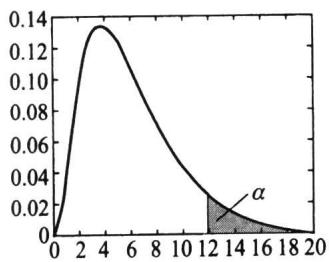  
(a) $H _ { 1 }$ $\sigma ^ { 2 } > \sigma _ { 0 } ^ { 2 }$

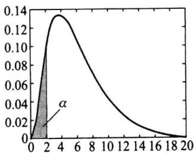

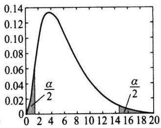  
（c） $H _ { 1 }$ $\sigma ^ { 2 } \neq \sigma _ { 0 } ^ { 2 }$  
图7.2.3三种 $\chi ^ { 2 }$ 检验的拒绝域(n-1=6，α=0.05）

我们亦可给出检验的p值.对单侧检验，想法是类似的，记 $\chi _ { _ 0 } ^ { 2 } = \left( n - 1 \right) s ^ { 2 } / \sigma _ { _ 0 } ^ { 2 }$ 是由样本计算得到的检验统计量的值，X表示服从自由度为n-1的X分布的随机变量，则检 $\chi ^ { 2 }$ $\chi ^ { 2 }$ 验问题I，Ⅱ的 $p$ 值分别为 $p _ { \mathrm { ~ l ~ } } = P ( \chi ^ { 2 } \geqslant \chi _ { _ 0 } ^ { 2 } ) \ , p _ { \mathrm { ~ l ~ } } = P ( \chi ^ { 2 } \leqslant \chi _ { _ 0 } ^ { 2 } )$ .对双侧检验则稍稍复杂一点，事实上，双侧检验的拒绝域在两侧，用x可算得两个尾部概率 $\chi _ { _ { 0 } } ^ { 2 }$ $P ( \chi ^ { 2 } \leqslant \chi _ { 0 } ^ { 2 } )$ 和 $P ( \chi ^ { 2 } \geqslant$ $\chi _ { _ { 0 } } ^ { 2 } )$ ，其和为1，其中必有一个 $\leqslant 0 . 5$ 5.检验的注意力总放在拒绝域上，故应从中选一个小的与 $\alpha / 2$ 比较，从而检验问题Ⅲ的p值为

$$
p _ { \mathtt { H } } = 2 \mathrm { m i n } \left\{ P ( \chi ^ { 2 } \geqslant \chi _ { _ 0 } ^ { 2 } ) , P ( \chi ^ { 2 } \leqslant \chi _ { _ 0 } ^ { 2 } ) \right\} .\tag{7.2.28}
$$

对这样定义的p值，不难发现下述结论仍然是成立的：

·当 $p _ { \perp } \leqslant \alpha$ 时，应拒绝原假设.

·当 $\rho _ { \parallel } > \alpha$ 时，应接受原假设.

最后说明一点，由于方差与标准差是一一对应关系，不等式 $\sigma ^ { 2 } \leqslant \sigma _ { 0 } ^ { 2 }$ 等价于 $\sigma \leqslant$ $\sigma _ { 0 }$ ，故上述讨论一样适用于对标准差的检验问题.

例7.2.5某类钢板每块的重量X服从正态分布，其一项质量指标是钢板重量（单位：N)的方差不得超过0.016.现从某天生产的钢板中随机抽取25块,得其样本方差

$s ^ { 2 } = 0 . 0 2 5$ ，问该天生产的钢板重量的方差是否满足要求？

解这是一个关于正态总体方差的单侧检验问题.原假设为 $H _ { 0 } : \sigma ^ { 2 } \leqslant 0 . 0 1 6$ ，备择假设为 $H _ { \mathrm { { } } ^ { 1 } } { : } \sigma ^ { 2 } > 0 . 0 1 6$ ，此处 $n = 2 5$ ，若取 $\alpha = 0 . 0 5$ ，则查表知 $\chi _ { _ { 0 . 9 5 } } ^ { 2 } ( 2 4 ) = 3 6 . 4 1 5$ ,现计算可得

$$
\chi _ { _ 0 } ^ { 2 } = \frac { \left( n - 1 \right) s ^ { 2 } } { \sigma _ { _ 0 } ^ { 2 } } = \frac { 2 4 \times 0 . 0 2 5 } { 0 . 0 1 6 } = 3 7 . 5 ~ > ~ 3 6 . 4 1 5 .
$$

由此,在显著性水平0.05下,我们拒绝原假设,认为该天生产的钢板重量不符合要求.

下面再用p值作此次检验.此处 $\chi _ { _ { 0 } } ^ { 2 } = 3 7 . 5$ ，记 $\chi ^ { 2 }$ 是自由度为24的 $\chi ^ { 2 }$ 分布的随机变量，则

$$
p = P ( \chi ^ { 2 } \geqslant 3 7 . 5 ) .
$$

利用任一款统计软件（如Excel)可计算出具体p值为0.0390,由于 $p$ 值小于事先给定的显著性水平0.05,故拒绝原假设，结论自然也是相同的.

## 二、两个正态总体方差比的F检验

设 $x _ { 1 } , x _ { 2 } , \cdots , x _ { m }$ 是来自 $N ( \mu _ { 1 } , { \sigma _ { 1 } ^ { 2 } } )$ 的样本， $y _ { 1 } , y _ { 2 } , \cdots , y _ { n }$ 是来自 $N ( \mu _ { 2 } , { \sigma } _ { 2 } ^ { 2 } )$ 的样本.考虑如下三个假设检验问题：

$$
\mathrm { ~ I ~ } \quad H _ { \circ } : \sigma _ { \iota } ^ { 2 } \leqslant \sigma _ { \iota } ^ { 2 } \quad \mathrm { ~ v s ~ } \quad H _ { \iota } : \sigma _ { \iota } ^ { 2 } \ > \ \sigma _ { \iota } ^ { 2 } ,\tag{7.2.29}
$$

$$
\mathbb { I } \quad H _ { 0 } : { \boldsymbol { \sigma } } _ { 1 } ^ { 2 } \geqslant { \boldsymbol { \sigma } } _ { 2 } ^ { 2 } \quad \mathrm { \ v { v s } } \quad H _ { 1 } : { \boldsymbol { \sigma } } _ { 1 } ^ { 2 } < { \boldsymbol { \sigma } } _ { 2 } ^ { 2 } ,\tag{7.2.30}
$$

$$
\mathbb { I } \quad H _ { _ 0 } { : } \pmb { \sigma } _ { _ 1 } ^ { 2 } = \pmb { \sigma } _ { _ 2 } ^ { 2 } \quad \mathrm { \bf { v s } } \quad H _ { _ 1 } { : } \pmb { \sigma } _ { _ 1 } ^ { 2 } \neq \pmb { \sigma } _ { _ 2 } ^ { 2 } .\tag{7.2.31}
$$

此处 $\mu _ { 1 } , \mu _ { 2 }$ 均未知，记 $s _ { x } ^ { 2 } , s _ { y } ^ { 2 }$ 分别是由 $x _ { 1 } , x _ { 2 } , \cdots , x _ { m }$ 算得的 $\boldsymbol { \sigma } _ { 1 } ^ { 2 }$ 的无偏估计和由 ${ \boldsymbol { y } } _ { 1 } , { \boldsymbol { y } } _ { 2 } , \cdots , { \boldsymbol { y } } _ { n }$ 算得的 $\boldsymbol { \sigma } _ { 2 } ^ { 2 }$ 的无偏估计(两个都是样本方差),则可建立如下的检验统计量：

$$
F = \frac { s _ { x } ^ { 2 } } { s _ { y } ^ { 2 } } .\tag{7.2.32}
$$

当 $\boldsymbol { \sigma } _ { 1 } ^ { 2 } = \boldsymbol { \sigma } _ { 2 } ^ { 2 }$ 时， $F \sim F ( m - 1 , n - 1 )$ ,由此给出三个检验问题对应的拒绝域依次为

$$
\begin{array} { c } { { W _ { \mathrm { { I } } } = \left\{ F \geqslant { \cal F } _ { \scriptscriptstyle 1 - \alpha } ( m - 1 , n - 1 ) \right\} , } } \\ { { W _ { \mathrm { { I } } } = \left\{ F \leqslant { \cal F } _ { \alpha } ( m - 1 , n - 1 ) \right\} , } } \\ { { W _ { \mathrm { { I I } } } = \left\{ F \leqslant { \cal F } _ { \scriptscriptstyle \alpha / 2 } ( m - 1 , n - 1 ) \ \forall \not \in { \cal F } _ { \scriptscriptstyle 1 - \alpha / 2 } ( m - 1 , n - 1 ) \right\} . } } \end{array}
$$

此时检验的p值的讨论与前述 $\chi ^ { 2 }$ 是相似的，记 $F _ { _ { 0 } } = { s _ { _ { x } } ^ { 2 } } / { s _ { _ y } ^ { 2 } }$ 是由样本计算得到的检验统计量的值，F表示服从 $F ( m - 1 , n - 1 )$ 分布的随机变量，则检验问题I，Ⅱ,Ⅲ的 $p$ 值分别为

$$
\begin{array} { r l } & { p _ { 1 } = P \left( F \geqslant { F _ { \circ } } \right) , } \\ & { p _ { \mathbb { I } } = P \left( F \leqslant { F _ { \circ } } \right) , } \\ & { p _ { \mathbb { I } } = 2 \ : \operatorname* { m i n } \left\{ P \left( F \geqslant { F _ { \circ } } \right) , P \left( F \leqslant { F _ { \circ } } \right) \right\} . } \end{array}
$$

例7.2.6甲、乙两台机床加工某种零件，零件的直径服从正态分布，总体方差反映 $\cdot \cal { Z }$ 了加工精度，为比较两台机床的加工精度有无差别，现从各自加工的零件中分别抽取7件产品和8件产品，测得其直径为

$$
X ( ~ \nmid [ \nmid \nmid \nmid \nmid ~ ; 1 6 . 2 ~ 1 6 . 8 ~ 1 5 . 8 ~ 1 5 . 5 ~ 1 6 . 7 ~ 1 5 . 6 ~ 1 5 . 8 ,
$$

$$
Y ( ~ { \nmid \nmid \nmid \nmid \nmid } ~ { \Zdot { \ Z } } ~ ) ~ : 1 5 . 9 ~ 1 6 . 0 ~ 1 6 . 4 ~ 1 6 . 1 ~ 1 6 . 5 ~ 1 5 . 8 ~ 1 5 . 7 ~ 1 5 . 0 .
$$

这就形成了一个双侧假设检验问题，原假设是 $H _ { \mathfrak { o } } : \sigma _ { \mathfrak { o } _ { 1 } } ^ { ^ 2 } = \sigma _ { ^ 2 } ^ { ^ 2 }$ ，备择假设为 $H _ { _ 1 } : \sigma _ { _ 1 } ^ { ^ 2 } \neq \sigma _ { _ 2 } ^ { ^ 2 } .$ 此处 $m = 7 , n = 8$ ,经计算 $s _ { _ x } ^ { ^ 2 } = 0 . 2 7 2 \ 9 \mathrm { ~ , ~ } s _ { _ y } ^ { ^ 2 } = 0 . 2 1 6 \ 4$ ，于是 $F _ { _ 0 } = \frac { 0 . 2 7 2 \ 9 } { 0 . 2 1 6 \ 4 } = 1 . 2 6 1$ ,若取 $\alpha = 0 . 0 5$ 查表知 $F _ { _ { 0 . 9 7 5 } } ( 6 , 7 ) = 5 . 1 2 , F _ { _ { 0 . 0 2 5 } } ( 6 , 7 ) = \frac { 1 } { F _ { _ { 0 . 9 7 5 } } ( 7 , 6 ) } = \frac { 1 } { 5 . 7 0 } = 0 . 1 7 5 .$ 其拒绝域为

$$
W = \left\{ F \leqslant 0 . 1 7 5 ~ { \stackrel { \mathrm { m i t } } { \approx } } ~ F \geqslant 5 . 1 2 \right\} .
$$

由此可见，样本未落入拒绝域，即在显著性水平0.05下可以认为两台机床的加工精度无显著差异.

下面再用p值做此次检验.此处 $F _ { \mathrm { 0 } } = 1 . 2 6 1$ ，记F为服从F（6,7)分布的随机变量，由于是双侧检验问题，故

$$
p = 2 \ \operatorname* { m i n } \left\{ P ( { F \mathord { \geqslant } 1 . 2 6 1 } ) , P ( { F \mathord { \leqslant } 1 . 2 6 1 } ) \right\} = 2 \ \operatorname* { m i n } \left\{ 0 . 3 8 0 \ 3 , 0 . 6 1 9 \ 7 \right\} = 0 . 7 6 0 \ 6 ,
$$

由于p值大于事先给定的显著性水平0.05，故不能拒绝原假设.

关于正态总体方差的假设检验汇总列于表7.2.3中.

表7.2.3正态总体方差的假设检验
<table><tr><td>检验法</td><td> $H _ { \mathfrak { o } }$   $H _ { _ { | } }$ </td><td>检验统计量</td><td>拒绝域</td><td>p值</td></tr><tr><td rowspan="3"> $\chi ^ { 2 }$  检验</td><td> $\sigma ^ { ^ 2 } \leqslant \sigma _ { _ 0 } ^ { ^ 2 }$   $\sigma ^ { 2 } > \sigma _ { 0 } ^ { 2 }$ </td><td></td><td> $\chi ^ { 2 } \geqslant \chi _ { _ { 1 - \alpha } } ^ { 2 } ( n - 1 )$ </td><td> $P ( \chi ^ { 2 } \geqslant \chi _ { 0 } ^ { 2 } )$ </td></tr><tr><td> $\sigma ^ { ^ 2 } \geqslant \sigma _ { _ 0 } ^ { ^ 2 }$   $\sigma ^ { 2 } < \sigma _ { _ 0 } ^ { 2 }$ </td><td> $\chi ^ { 2 } = \frac { \left( n - 1 \right) s ^ { 2 } } { \sigma _ { _ { 0 } } ^ { 2 } }$ </td><td> $\chi ^ { 2 } \leqslant \chi _ { _ { \alpha } } ^ { 2 } ( n - 1 )$ </td><td> $P ( \chi ^ { 2 } \leqslant \chi _ { 0 } ^ { 2 } )$ </td></tr><tr><td> $\sigma ^ { ^ 2 } = \sigma _ { _ 0 } ^ { ^ 2 }$   $\sigma ^ { ^ 2 } \neq \sigma _ { _ 0 } ^ { ^ 2 }$ </td><td></td><td> $\chi ^ { 2 } \leqslant \chi _ { _ { \alpha / 2 } } ^ { 2 } \left( n - 1 \right) \frac { \pi } { \lambda } $   $\chi ^ { 2 } \geqslant \chi _ { _ { 1 - \alpha / 2 } } ^ { 2 } ( n - 1 )$ </td><td> $2 \mathrm { m i n } \{ P ( \chi ^ { 2 } \leqslant \chi _ { _ { 0 } } ^ { 2 } )$   $P ( \chi ^ { 2 } \geqslant \chi _ { _ { 0 } } ^ { 2 } ) \}$ </td></tr><tr><td rowspan="4">F检验</td><td> $\sigma _ { _ 1 } ^ { ^ 2 } \leqslant \sigma _ { _ 2 } ^ { ^ 2 }$   $\sigma _ { 1 } ^ { 2 } > \sigma _ { 2 } ^ { 2 }$ </td><td></td><td> $F \geqslant F _ { _ { 1 - \alpha } } ( m - 1 , n - 1 )$ </td><td> $P ( F \geqslant F _ { 0 } )$ </td></tr><tr><td> $\sigma _ { _ 1 } ^ { ^ 2 } \geqslant \sigma _ { _ 2 } ^ { ^ 2 }$   $\sigma _ { 1 } ^ { 2 } < \sigma _ { 2 } ^ { 2 }$ </td><td> $F = \frac { s _ { x } ^ { 2 } } { s _ { y } ^ { 2 } }$ </td><td> $F \leqslant F _ { \alpha } \left( m - 1 , n - 1 \right)$ </td><td> $P ( F \leqslant F _ { 0 } )$ </td></tr><tr><td></td><td></td><td> $F \leqslant F _ { _ { \alpha / 2 } } ( m - 1 , n - 1 ) $ </td><td></td></tr><tr><td> ${ \boldsymbol { \sigma } } _ { 1 } ^ { 2 } = { \boldsymbol { \sigma } } _ { 2 } ^ { 2 }$   $\sigma _ { 1 } ^ { 2 } \neq \sigma _ { 2 } ^ { 2 }$ </td><td></td><td> $F \geqslant F _ { _ { 1 - \alpha / 2 } } ( m - 1 , n - 1 )$ </td><td> $2 \operatorname* { m i n } \left\{ P ( F \leqslant F _ { \mathrm { 0 } } ) \right.$   $P ( F \geqslant F _ { 0 } ) \big \}$ </td></tr></table>

## 习题7.2

说明：本节习题均采用拒绝域的形式完成，在可以计算检验的p值时要求计算出p值.

1.有一批枪弹，出厂时，其初速率v\~N(950，100）（单位 $: \mathsf { m } / \mathsf { s } \bigr )$ .经过较长时间储存，取9发进行测试，得样本值（单位：m/s）如下：

$$
9 1 4 9 2 0 9 1 0 9 3 4 9 5 3 9 4 5 9 1 2 9 2 4 9 4 0 .
$$

据经验，枪弹经储存后其初速率仍服从正态分布，且标准差保持不变，问是否可认为这批枪弹的初速率有显著降低 $\left( \alpha = 0 . 0 5 \right)$ 2

2.已知某炼铁厂铁水含碳量服从正态分布 $N ( 4 . 5 5 , 0 . 1 0 8 ^ { 2 } )$ .现在测定了9炉铁水，其平均含碳量为4.484，如果铁水含碳量的方差没有变化，可否认为现在生产的铁水平均含碳量仍为4.55（α=

0.05）？

3.由经验知某零件质量 $X \sim N ( \ 1 5 , 0 . 0 5 ^ { 2 } )$ （单 $\left\{ { \frac { \mathbf { \partial } } { \ln L } } : \mathbf { g } \right\}$ ，技术革新后，抽出6个零件，测得质量为14.715.114.815.015.214.6.

已知方差不变，问平均质量是否仍为 $1 5 \mathrm { \bf ~ g }$ （取 $\alpha = 0 . 0 5 ) \cdot$

4.化肥厂用自动包装机包装化肥，每包的质量服从正态分布，其平均质量为100kg，标准差为1.2kg.某日开工后，为了确定这天包装机工作是否正常，随机抽取9袋化肥，称得质量（单元：kg）如下：

$$
9 9 . 3 \quad 9 8 . 7 \quad 1 0 0 . 5 \quad 1 0 1 . 2 \quad 9 8 . 3 \quad 9 9 . 7 \quad 9 9 . 5 \quad 1 0 2 . 1 \quad 1 0 0 . 5 .
$$

设方差稳定不变，问这一天包装机的工作是否正常（取 $\alpha = 0 . 0 5 ) ?$

5.设需要对某正态总体的均值进行假设检验

$$
H _ { 0 } : \mu \ = \ 1 5 \ \mathrm { \ v s } H _ { 1 } : \mu \ < \ 1 5 .
$$

已知 $\sigma ^ { 2 } = 2 . 5$ ，取 $\alpha = 0 . 0 5$ ，若要求当 $H _ { \mathfrak { r } }$ 中的 $\mu \leqslant 1 3$ 时犯第二类错误的概率不超过0.05，求所需的样本容量

6.从一批钢管中抽取10根，测得其内径（单位：mm）为

$$
\begin{array} { l l l l l } { { 1 0 0 . 3 6 } } & { { 1 0 0 . 3 1 } } & { { 9 9 . 9 9 } } & { { 1 0 0 . 1 1 } } & { { 1 0 0 . 6 4 } } \\ { { 1 0 0 . 8 5 } } & { { 9 9 . 4 2 } } & { { 9 9 . 9 1 } } & { { 9 9 . 3 5 } } & { { 1 0 0 . 1 0 . } } \end{array}
$$

设这批钢管内径服从正态分布 $N ( \mu , \sigma ^ { 2 } )$ ，试分别在下列条件下：

（1）已知 $\sigma = 0 . 5$

（2）σ未知，

检验假设 $\left( \alpha = 0 . 0 5 \right)$

$$
H _ { \scriptscriptstyle 0 } : \mu = 1 0 0 \quad \mathrm { { v s } } \quad H _ { \scriptscriptstyle 1 } : \mu > 1 0 0 .
$$

7.假定考生成绩服从正态分布，在某地一次数学统考中，随机抽取了36位考生的成绩，算得平均成绩为66.5分，标准差为15分，问在显著性水平0.05下，是否可以认为这次考试全体考生的平均成绩为70分？

8.一位中学校长在报纸上看到这样的报道：“这一城市的初中学生平均每周看8h电视."她认为她所在学校的学生看电视的时间明显小于该数字.为此她在该校随机调查了100个学生，得知平均每周看电视的时间 $\overline { { x } } = 6 . 5$ h，样本标准差为s=2h.问是否可以认为这位校长的看法是对的（取 $\alpha =$ 0.05）？

9.设在木材中抽出100根，测其小头直径，得到样本平均数为 $\overline { { x } } = 1 1 . 2 \ \mathrm { c m }$ ，样本标准差 $s = 2 . 6 ~ \mathrm { c m }$ 问能否认为该批木材小头的平均直径不低于12cm（取 $\alpha = 0 . 0 5 ) \mathrm { ^ { \prime } }$ ？

10.考察一鱼塘中鱼的含汞量，随机地取10条鱼测得各条鱼的含汞量（单位：mg）为 0.81.60.90.81.20.40.71.01.21.1.

设鱼的含汞量服从正态分布 $N ( \mu , \sigma ^ { 2 } )$ ，试检验假设 $H _ { 0 } : \mu \leqslant 1 . 2 \quad \mathrm { ~ v s ~ } \quad H _ { \mathrm { ~ } ! } : \mu > 1 . 2$ （取 $\alpha = 0 . 1 0 )$

11.如果一个矩形的宽度w与长度l的比 $\frac { w } { l } = \frac { 1 } { 2 } ( \sqrt { 5 } - 1 ) \approx 0 . 6 1 8$ ，这样的矩形称为黄金矩形.下面列出从某工艺品工厂随机抽取的20个矩形宽度与长度的比值：

0.6930.7490.6540.6700.6620.6720.6150.6060.6900.628   
0.6680.6110.6060.6090.5530.5700.8440.5760.9330.630.

设这一工厂生 $\dot { \pi }$ 的矩形的宽度与长度的比值总体服从正态分布，其均值为 $\pmb { \mu }$ ，试检验假设（取 $\alpha =$ 0.05）

$$
H _ { 0 } : \mu \ = \ 0 . 6 1 8 \quad \mathrm { ~ v s ~ } \quad H _ { \scriptscriptstyle 1 } : \mu \neq 0 . 6 1 8 .
$$

12.下面给出两种型号的计算器充电以后所能使用的时间（单位：h)的观测值：

型号A：5.55.66.3 4.65.3 5.06.2 5.85.1 5.2 5.9，

型号B:3.84.34.24.04.94.55.24.84.53.93.74.6.

设两样本独立且数据所属的两总体的密度函数至多差一个平移量.试问能否认为型号A的计算器平均使用时间比型号B来得长（取α=0.01）？

13.从某锌矿的东、西两支矿脉中，各抽取样本容量分别为9与8的样本进行测试，得样本含锌平均数及样本方差如下：

$$
\ddagger { \ , } \ddagger : \quad \overline { { x } } _ { 1 } = 0 . 2 3 0 , \quad s _ { 1 } ^ { 2 } = 0 . 1 3 3 7 ,
$$

$$
\overline { { { \mit \oplus } } } \ : \ddagger : \quad \overline { { { \mit x } } } _ { 2 } = 0 . 2 6 9 , \quad { \textstyle s } _ { 2 } ^ { 2 } = 0 . 1 7 3 \ : 6 .
$$

若东、西两支矿脉的含锌量都服从正态分布且方差相同，问东、西两支矿脉含锌量的平均值是否可以看作一样（取α=0.05）？

14.在针织品漂白工艺过程中，要考察温度对针织品断裂强力（主要质量指标）的影响.为了比较70℃与80℃的影响有无差别，在这两个温度下，分别重复做了8次试验，得数据（单位：N）如下：

70℃时的强力：20.518.819.820.921.519.521.0 21.2，

80℃时的强力：17.720.320.018.819.020.1 20.019.1.

根据经验，温度对针织品断裂强度的波动没有影响.问在70℃时的平均断裂强力与 ${ } ^ { 8 0 \mathrm { ~ ‰ ~ } }$ 时的平均断裂强力间是否有显著差别（假定断裂强力服从正态分布，取 $\alpha = 0 . 0 5 )$ ?

15.一药厂生产一种新的止痛片，厂方希望验证服用新药片后至开始起作用的时间间隔较原有止痛片至少缩短一半，因此厂方提出需检验假设

$$
H _ { 0 } : \mu _ { 1 } = 2 \mu _ { 2 } \mathrm { ~ \textbf ~ { ~ v ~ s ~ } ~ } H _ { 1 } : \mu _ { 1 } > 2 \mu _ { 2 } .
$$

此处 $\mu _ { 1 } , \mu _ { 2 }$ 分别是服用原有止痛片和服用新止痛片后至开始起作用的时间间隔的总体的均值.设两总体均为正态分布且方差分别为已知值 $\sigma _ { 1 } ^ { 2 } , \sigma _ { 2 } ^ { 2 }$ ，现分别在两总体中取一样本 $x _ { 1 } , x _ { 2 } , \cdots , x _ { n }$ 和 $\boldsymbol { y } _ { 1 }$ ，$y _ { 2 } , \cdots , y _ { m }$ ，设两个样本独立.试给出上述假设检验问题的检验统计量及拒绝域.

16.对冷却到-0.72℃C的样品用A，B两种测量方法测量其融化到 $0 ~ \mathrm { ‰}$ 时的潜热，数据如下：

方法A：79.9880.0480.0280.0480.0380.0380.0479.9780.0580.0380.0280.0080.02，

方法B：80.0279.9479.9879.9780.0379.9579.9779.97.

假设它们服从正态分布，方差相等，试检验：两种测量方法的平均性能是否相等（取α=0.05）？

17.为了比较测定活水中氯气含量的两种方法，特在各种场合收集到8个污水水样，每个水样均用这两种方法测定氯气含量（单位：mg/l），具体数据如下：

<table><tr><td>水样号</td><td>方法一(x）</td><td>方法二(y) 差  $\scriptstyle ( d = x - y )$ </td></tr><tr><td>1</td><td>0.36</td><td>0.39 -0.03</td></tr><tr><td>2</td><td>1.35</td><td>0.84 0.51</td></tr><tr><td>3</td><td>2.56</td><td>1.76 0.80</td></tr><tr><td>4</td><td>3.92</td><td>3.35 0.57</td></tr><tr><td>5</td><td>5.35</td><td>4.69 0.66</td></tr><tr><td>6</td><td>8.33</td><td>7.70 0.63</td></tr><tr><td>7</td><td>10.70</td><td>10.52 0.18</td></tr><tr><td>8</td><td>10.91</td><td>10.92 -0.01</td></tr></table>

设总体为正态分布，试比较两种测定方法是否有显著差异，请写出检验的p值和结论（取 $\alpha = 0 . 0 5 )$

18.一工厂的两个化验室每天同时从工厂的冷却水取样，测量水中的含气量 $( 1 0 ^ { - 6 } )$ 一次，下面是7天的记录：

室甲：1.151.860.751.821.141.651.90,

室乙：1.001.900.901.801.201.701.95.

设每对数据的差 $d _ { i } = x _ { i } - y _ { i } ( i = 1 , 2 , \cdots , 7 )$ 来自正态总体，问两化验室测定结果之间有无显著差异（取$\alpha = 0 . 0 1 )$ ？

19.为比较正常成年男女所含红血球（单位： $1 0 ^ { 4 } / \mathbf { m m } ^ { 2 } )$ 的差异，对某地区156名成年男性进行测量，其红血球的样本均值为465.13，样本方差为 $5 4 . 8 0 ^ { 2 }$ ：对该地区74名成年女性进行测量，其红血球的样本均值为422.16，样本方差为 $4 9 . 2 0 \phantom { . 0 } ^ { 2 }$ 试检验：该地区正常成年男女所含红血球的平均值是否有差异（取 $\alpha = 0 . 0 5 )$ ？

20.为比较不同季节出生的女婴体重的方差，从某年12月和6月出生的女婴中分别随机地抽取6名及10名，测其体重（单位：g）如下：

12月：352029602560296032603960，

6月：3220322037603000292037403060308029403060.

假定新生女婴体重服从正态分布，问新生女婴体重的方差是否是冬季的比夏季的小（取 $\alpha = 0 . 0 5 ) ?$

21.已知维尼纶纤度在正常条件下服从正态分布，且标准差为0.048.从某天产品中抽取5根纤维，测得其纤度为

1.321.551.361.401.44,

问这一天纤度的总体标准差是否正常（取α=0.05）？

22.某电工器材厂生产一种保险丝.测量其熔化时间，依通常情况方差为400，今从某天产品中抽取容量为25的样本，测量其熔化时间并计算得 ${ \overline { { x } } } = 6 2 . 2 4 { , } s ^ { 2 } = 4 0 4 . 7 7$ ，问这天保险丝熔化时间分散度与通常有无显著差异（取α=0.05，假定熔化时间服从正态分布）？

23.某种导线的质量标准要求其电阻的标准差不得超过0.005Ω.今在一批导线中随机抽取样品9根，测得样本标准差为s=0.007Ω，设总体为正态分布.问在显著性水平 $\alpha = 0 . 0 5$ 下能否认为这批导线的标准差显著地偏大？

24.两台车床生产同一种滚珠，滚珠直径服从正态分布.从中分别抽取8个和9个产品，测得其直径为

甲车床：15.014.515.215.514.815.1 15.214.8；

乙车床：15.2 15.014.815.215.015.014.815.1 14.8.

比较两台车床生产的滚珠直径的方差是否有显著差异（取 $\alpha = 0 . 0 5 )$

25.有两台机器生产金属部件，分别在两台机器所生产的部件中各取一容量为m=14和n=12的样本，测得部件质量的样本方差分别为 $s _ { _ 1 } ^ { ^ 2 } = 1 5 . 4 6 , s _ { _ 2 } ^ { ^ 2 } = 9 . 6 6$ ，设两样本相互独立，试在显著性水平$\alpha = 0 . 0 5$ 下检验假设

$$
H _ { 0 } : \sigma _ { 1 } ^ { 2 } = \sigma _ { 2 } ^ { 2 } \mathrm { ~  ~ \ v s ~ \ } H _ { _ { 1 } } : \sigma _ { 1 } ^ { 2 } > \sigma _ { _ { 2 } } ^ { 2 } .
$$

26.测得两批电子器件的样品的电阻（单位：Ω）为

A批(x）：0.1400.1380.1430.1420.144 0.137;

B批(y）：0.1350.1400.1420.1360.1380.140.

设这两批器材的电阻值分别服从分布 $N ( \mu _ { _ 1 } , \sigma _ { _ 1 } ^ { 2 } ) , N ( \mu _ { _ 2 } , \sigma _ { _ 2 } ^ { 2 } )$ ，且两样本独立.

（1）试检验两个总体的方差是否相等（取 $\pmb { \alpha } = 0 . 0 5 )$

（2）试检验两个总体的均值是否相等（取 $\alpha = 0 . 0 5 )$

27.某厂使用两种不同的原料生产同一类型产品，随机选取使用原料A生产的样品22件，测得平均质量为2.36kg，样本标准差为0.57kg.取使用原料B生产的样品24件，测得平均质量为2.55kg，样本标准差为0.48kg.设产品质量服从正态分布，两个样本独立.问能否认为使用原料B生产的产品平均质量较使用原料A显著大（取 $\alpha = 0 . 0 5 ) \ ;$

## 7.3其他分布参数的假设检验

## 7.3.1指数分布参数的假设检验

指数分布是一类重要的分布，有广泛的应用.设 $x _ { 1 } , x _ { 2 } , \cdots , x _ { n }$ 是来自指数分布$E x p ( 1 / \theta )$ 的样本，θ为其均值，现考虑关于θ的如下检验问题：

$$
\mathrm { ~ I ~ } \quad H _ { 0 } : \theta \leqslant \theta _ { \ast } \quad \mathrm { ~ v s ~ } \quad H _ { \ast } : \theta > \theta _ { \ast } .\tag{7.3.1}
$$

为寻找检验统计量，我们考察参数θ的充分统计量x.在 $\theta = \theta _ { 0 }$ 时， $n { \stackrel { - } { x } } =$ $\sum _ { i \mathop { = } 1 } ^ { n } x _ { i } \sim G a ( n , 1 / \theta _ { 0 } )$ ，由伽马分布性质可知

$$
\chi ^ { 2 } = \frac { 2 n \overline { { { x } } } } { \theta _ { 0 } } \sim \chi ^ { 2 } ( 2 n ) ,\tag{7.3.2}
$$

于是可用 $\chi ^ { 2 }$ 作为检验统计量并利用 $\chi ^ { 2 } ( 2 n )$ 的分位数建立检验的拒绝域，对检验问题（7.3.1），拒绝域形式为 $\boldsymbol { W } _ { \mathrm { ~ l ~ } } = \left\{ \chi ^ { 2 } \geqslant c \right\}$ ，对给定的显著性水平α，可由 $P ( \mathcal { W } _ { \mathrm { ~ l ~ } } ) = \alpha$ 获得拒绝域如下：

$$
\begin{array} { r } { W _ { \mathrm { ~ l ~ } } = \left\{ \chi ^ { 2 } \geqslant \chi _ { _ { 1 - \alpha } } ^ { 2 } ( 2 n ) \right\} . } \end{array}\tag{7.3.3}
$$

类似本章前面关于检验的p值的讨论，记 $\chi _ { _ 0 } ^ { 2 } = \frac { 2 n \overline { { x } } } { \theta _ { 0 } }$ 为由样本算得的检验统计量值， $\chi ^ { 2 }$ 表示服从 $\chi ^ { 2 } ( 2 n )$ 分布的随机变量，则检验的p值为 $p _ { 1 } { = } P ( \chi ^ { 2 } \geqslant \chi _ { _ { 0 } } ^ { 2 } )$

关于θ的另两种检验问题处理方法类似.对检验问题

$$
\begin{array} { r } { \mathbb { I } \quad H _ { 0 } : \theta \geqslant \theta _ { 0 } \quad \mathrm { ~ v s ~ } \quad H _ { 1 } : \theta < \theta _ { 0 } \mathrm { ~ \# \mathbb { I } \mathbb { I } \mathbb { I } ~ } \quad H _ { 0 } : \theta = \theta _ { 0 } \quad \mathrm { ~ v s ~ } \quad H _ { 1 } : \theta \neq \theta _ { 0 } \mathrm { , ~ \theta ~ } } \end{array}
$$

检验统计量不变，拒绝域以及检验的p值分别为

$$
\begin{array} { r } { \mathbb { W } _ { \mathbb { I } } = \big \{ \chi ^ { 2 } \leqslant \chi _ { \alpha } ^ { 2 } ( 2 n ) \big \} \ , \quad p _ { \mathbb { I } } = P ( \chi ^ { 2 } \leqslant \chi _ { 0 } ^ { 2 } ) \ , } \end{array}
$$

$$
\begin{array} { r } { W _ { \parallel } = \left\{ \chi ^ { 2 } \leqslant \chi _ { \alpha / 2 } ^ { 2 } ( 2 n ) \frac { \ni \vec { \chi } } { \mathrm { g } \vec { \chi } } \chi ^ { 2 } \geqslant \chi _ { 1 - \alpha / 2 } ^ { 2 } ( 2 n ) \right\} , \quad p _ { \parallel } = 2 \operatorname* { m i n } \left\{ P ( \chi ^ { 2 } \geqslant \chi _ { 0 } ^ { 2 } ) , P ( \chi ^ { 2 } \leqslant \chi _ { 0 } ^ { 2 } ) \right\} . } \end{array}
$$

例7.3.1设我们要检验某种元件的平均寿命不小于6000h，假定元件寿命为指数分布，现取5个元件投入试验，观测到如下5个失效时间（h）：

$$
3 9 5 \quad 4 0 9 4 \quad 1 1 9 \quad 1 1 5 7 2 \quad 6 1 3 3 .
$$

这是一个假设检验问题，检验的假设为

$$
H _ { 0 } : \theta \geqslant 6 \ 0 0 0 \quad \mathrm { ~ v s ~ } \quad H _ { \scriptscriptstyle 1 } : \theta \ < \ 6 \ 0 0 0 .
$$

经计算， $\overline { { x } } = 4 ~ 4 6 2 . 6$ ,故检验统计量为

$$
\chi _ { _ 0 } ^ { 2 } = { \frac { 1 0 \overline { { x } } } { \theta _ { _ 0 } } } = { \frac { 1 0 \times 4 ~ 4 6 2 . 6 } { 6 ~ 0 0 0 } } = 7 . 4 3 7 ~ 7 ,
$$

若取 $\alpha = 0 . 0 5$ ,则查表知 $\chi _ { _ { 0 . 0 5 } } ^ { 2 } ( 1 0 ) = 3 . 9 4 0 \ 3$ ，由于 $7 . 4 3 7 7 > 3 . 9 4 0 3$ ，故接受原假设，可以认为平均寿命不低于6000h.该检验的p值为 $P ( \chi ^ { 2 } \leqslant 7 . 4 3 7 ~ 7 ) = 0 . 6 8 3 ~ 6 .$

## 7.3.2比率p的检验

比率p可看作某事件发生的概率，即可看作二点分布b(1,p)中的参数.作n次独

立试验，以x记该事件发生的次数，则 $\boldsymbol { x } \sim \boldsymbol { b } ( \boldsymbol { n } , \boldsymbol { p } )$ .我们可以根据x检验关于 $p$ 的一些假设.先考虑如下单边假设检验问题：

$$
\mathrm { I } \quad H _ { \scriptscriptstyle 0 } \colon p \leqslant p _ { \scriptscriptstyle 0 } \quad \mathrm { v s } \quad H _ { \scriptscriptstyle 1 } \colon p > p _ { \scriptscriptstyle 0 } .\tag{7.3.4}
$$

直观上看，一个显然的检验方法是取如下的拒绝域 $\mathbb { W } = \left\{ x \geq c \right\}$ ，由于x只取整数值，故c可限制在非负整数中.然而，一般情况下对给定的 $\pmb { \alpha }$ ,不一定能正好取到一个c,使得

$$
P ( x \geqslant c ; p _ { 0 } ) = \sum _ { i = c } ^ { n } { \binom { n } { i } } p _ { 0 } ^ { i } { ( 1 - p _ { 0 } ) } ^ { n - i } = \alpha ,\tag{7.3.5}
$$

能恰巧使得(7.3.5)成立的c值是罕见的.这是在对离散总体作假设检验中普遍会遇到的问题，在这种情况下，较常见的是找一个 $c _ { 0 }$ ,使得

$$
\sum _ { i = c _ { 0 } } ^ { n } { \binom { n } { i } } p _ { 0 } ^ { i } { \left( 1 - p _ { 0 } \right) } ^ { n - i } > \alpha > \sum _ { i = c _ { 0 } + 1 } ^ { n } { \binom { n } { i } } p _ { 0 } ^ { i } { \left( 1 - p _ { 0 } \right) } ^ { n - i } .
$$

于是，可取 $c = c _ { 0 } + 1$ ,此时相当于把显著性水平由α降低到 $\sum _ { i \ : = c _ { 0 } + 1 } ^ { n } { \binom { n } { i } } p _ { 0 } ^ { i } ( 1 \ : - \ : p _ { 0 } ) ^ { \ : n - i }$ ，因为它可保证(7.3.5)的左侧不大于 $\pmb { \alpha }$ ，从而是显著性水平为 $\pmb { \alpha }$ 的检验.

事实上,在离散场合使用 $p$ 值作检验较为简便,这时可以不用找 $c _ { 0 }$ ,而只需根据观测值 $\scriptstyle x = x _ { 0 }$ 计算检验的p值，即

$$
p = P \left( x \geqslant x _ { 0 } \right) ,
$$

并将之与事先给定的显著性水平比较大小即可,其中x为服从 $b \left( \boldsymbol { n } , \boldsymbol { p } _ { 0 } \right)$ 分布的随机变量.譬如， $n = 4 0 , p _ { \scriptscriptstyle 0 } = 0 . 1 , x _ { \scriptscriptstyle 0 } = 8$ ，则

$$
p = 1 - 0 . 9 ^ { 4 0 } - \left( \begin{array} { c } { { 4 0 } } \\ { { 1 } } \end{array} \right) 0 . 1 \times 0 . 9 ^ { 3 9 } - \cdots - \left( \begin{array} { c } { { 4 0 } } \\ { { 7 } } \end{array} \right) 0 . 1 ^ { 7 } \times 0 . 9 ^ { 3 3 } = 0 . 0 4 1 \ 9 .
$$

于是，若取 $\alpha = 0 . 0 5$ ，由于 $p { < } \alpha$ ，则应拒绝原假设.

对另两个检验问题的处理是类似的.检验问题Ⅱ $H _ { \scriptscriptstyle 0 } : p \geqslant p _ { \scriptscriptstyle 0 } \mathrm { ~ \quad ~ v s ~ \quad ~ } H _ { \scriptscriptstyle 1 } : p < p _ { \scriptscriptstyle 0 }$ 以及检验问题Ⅲ $H _ { 0 } : p = p _ { 0 } \mathrm { ~ \quad ~ v ~ s ~ \quad ~ } H _ { \mathrm { { 1 } } } : p \neq p _ { 0 }$ 的p值分别为

$$
p _ { \parallel } = P \left( x \leqslant x _ { 0 } \right) , \quad p _ { \parallel } = 2 \ \operatorname* { m i n } \left\{ P \left( x \leqslant x _ { 0 } \right) , P ( x \geqslant x _ { 0 } ) \right\} .
$$

例7.3.2某厂生产的产品优质品率一直保持在40%,近期对该厂生产的该类产品抽检20件，其中优质品7件，在 $\alpha = 0 . 0 5$ 下能否认为优质品率仍保持在40%？

这是一个假设检验问题,以 $p$ 表示优质品率,T表示20件产品中的优质品件数，则$T \sim b ( 2 0 , p )$ ,待检验的一对假设为

$$
H _ { \scriptscriptstyle 0 } : p = 0 . 4 \quad \mathrm { v s } \quad H _ { \scriptscriptstyle 1 } : p \neq 0 . 4 ,
$$

这是一个双侧检验问题， $n = 2 0 , t _ { 0 } = 7$ ,可计算检验的 $p$ 值为

$$
p = 2 \ \operatorname* { m i n } \left\{ P ( \ T \leqslant 7 ) , P ( \ T \geqslant 7 ) \ \right\} = 2 \ \operatorname* { m i n } \left\{ 0 . 4 1 5 \ 9 , 0 . 7 5 0 \ 0 \ \right\} = 0 . 8 3 1 \ 8 ,
$$

由于 $p$ 远大于 $\alpha$ ，故不能拒绝原假设，可以认为优质品率仍保持在40%。

## 7.3.3大样本检验

前一小节我们介绍了对二点分布参数p的检验问题（对泊松分布等离散总体的参 $p$ 数的检验是类似的），我们看到临界值的确定比较繁琐，使用不太方便.当然，使用检验的p值就方便多了.在实际使用中，如果样本量较大，人们还经常采用渐近正态分布构造检验统计量，获得大样本检验.其一般思路如下：设 $x _ { 1 } , x _ { 2 } , \cdots , x _ { n }$ 是来自某总体分布

$F ( x ; { \boldsymbol { \theta } } )$ 的样本，又设该总体均值为0，方差为θ的函数，记为 $\sigma ^ { ^ 2 } ( \theta )$ .譬如，对二点分布$b ( 1 , \theta )$ ，其方差 $\sigma ^ { 2 } ( \theta ) = \theta ( 1 - \theta )$ 是均值θ的函数.现要对下列三类假设检验问题：

$$
\begin{array} { r l r l } & { \mathrm { ~ I ~ } } & { H _ { \mathfrak { o } } : \theta \leqslant \theta _ { \mathfrak { o } } } & { \mathrm { ~ v s ~ } } & { H _ { \mathfrak { l } } : \theta > \theta _ { \mathfrak { o } } . } \\ & { \mathrm { ~ I ~ } } & { H _ { \mathfrak { o } } : \theta \geqslant \theta _ { \mathfrak { o } } } & { \mathrm { ~ v s ~ } } & { H _ { \mathfrak { \iota } } : \theta < \theta _ { \mathfrak { o } } . } \\ & { \mathrm { ~ I I ~ } } & { H _ { \mathfrak { o } } : \theta = \theta _ { \mathfrak { o } } } & { \mathrm { ~ v s ~ } } & { H _ { \mathfrak { \iota } } : \theta \neq \theta _ { \mathfrak { o } } . } \end{array}
$$

寻找大样本检验方法.在样本容量n充分大时，利用中心极限定理知 $\overline { { x } } ~ \overset { \cdot } { \sim } ~ N ( ~ \theta$ $\sigma ^ { 2 } ( \theta ) / n )$ ，故在 $\pmb { \theta } = \pmb { \theta } _ { 0 }$ 时，可采用如下检验统计量：

$$
u = \frac { \sqrt { n } \left( \overline { { { x } } } - \theta _ { 0 } \right) } { \sqrt { \sigma ^ { 2 } ( \hat { \theta } ) } } \overset { ^ { } } { \sim } N ( 0 , 1 ) ,\tag{7.3.6}
$$

其中θ为θ的MLE，并由此可近似地确定拒绝域.对应上述三类检验问题的拒绝域依 $\hat { \pmb { \theta } }$ $\pmb \theta$ 次为

$$
\begin{array} { r l } & { \mathbb { W } _ { \mathrm { ~ I ~ } } = \left\{ \ : u \geqslant u _ { 1 - \alpha } \right\} , } \\ & { \mathbb { W } _ { \mathrm { ~ I ~ } } = \left\{ \ : u \leqslant u _ { \alpha } \right\} , } \\ & { \mathbb { W } _ { \mathbb { H } } = \left\{ \ : \left| \ : u \right| \geqslant u _ { 1 - \alpha / 2 } \right\} . } \end{array}
$$

检验的近似的p值也是可以计算的，与单样本正态总体场合完全一样，此处从略. $p$

例7.3.3某厂生产的产品不合格品率不高于10%，在一次例行检查中，随机抽取80件,发现有11件不合格品，在 $\scriptstyle \alpha = 0 . 0 5$ 下能否认为不合格品率仍为10%？

解这是关于不合格品率θ的检验，假设为

$$
H _ { 0 } : \theta \leq 0 . 1 \quad \mathrm { v s } \quad H _ { 1 } : \theta > 0 . 1 ,
$$

我们可以仿例7.3.1的方法求拒绝域，但要把此拒绝域找出来是困难的，如今$\scriptstyle n = 8 0$ 比较大，因此可采用大样本检验方法.由(7.3.6)式， $\theta _ { 0 } = 0 . 1 , \sigma ^ { 2 } ( \hat { \theta } ) = \hat { \theta } ( 1 - \hat { \theta } ) = \frac { 1 1 } { 8 0 } \times \frac { 6 9 } { 8 0 } =$ 0.1186,检验统计量为

$$
u _ { \scriptscriptstyle 0 } = \frac { \sqrt { 8 0 } \left( \frac { 1 1 } { 8 0 } - 0 . 1 \right) } { \sqrt { 0 . 1 1 8 6 } } = 0 . 9 7 3 ~ 9 .
$$

若取 $\alpha = 0 . 0 5$ ，则 $u _ { 0 . 9 5 } = 1 . 6 4 5$ ,故拒绝域为 $\mathbb { W } = \left\{ u \geqslant 1 . 6 4 5 \right\}$ .如今 $u _ { 0 } = 0 . 9 7 3 \ 9$ 未落人拒绝域，故不能拒绝原假设，可以认为不合格品率仍为10%.

此处检验的近似的 $p$ 值为0.1651，而精确的 $p$ 值为0.1734，两者相差不大.

例7.3.4某建筑公司宣称其摩下建筑工地平均每天发生事故数不超过0.6起，现记录了该公司麾下建筑工地200天的安全生产情况，事故数记录如下：

<table><tr><td>一天发生的事故数</td><td>1 0</td><td>2</td><td>3</td><td>4</td><td>5</td><td> $\geqslant 6$ </td><td>合计</td></tr><tr><td>天数</td><td>102 59</td><td>30</td><td>8</td><td>0</td><td>1</td><td>0</td><td>200</td></tr></table>

试检验该建筑公司的宣称是否成立（取 $\alpha = 0 . 0 5 )$

解以X记该建筑公司麾下建筑工地一天发生的事故数，可认为 $X \sim P ( \boldsymbol { \lambda } )$ （见习题7.4第8题），现要检验的假设是

$$
H _ { 0 } { : } \lambda \leqslant 0 . 6 \quad \mathrm { v s } \quad H _ { \scriptscriptstyle 1 } { : } \lambda > 0 . 6 ,
$$

由于 $n = 2 0 0$ 很大，故可以采用大样本检验，泊松分布的均值和方差都是入，而入的

MLE为

$$
\hat { \lambda } \equiv \overline { { x } } = \frac { 1 } { 2 0 0 } ( 0 \times 1 0 2 + 1 \times 5 9 + 2 \times 3 0 + 3 \times 8 + 4 \times 0 + 5 \times 1 ) = 0 . 7 4 .
$$

由（7.3.6)式，检验统计量为 $\left( \lambda _ { 0 } = 0 . 6 \right)$

$$
u _ { 0 } = \frac { \sqrt { n } \left( \overline { { x } } - \lambda _ { 0 } \right) } { \sqrt { \widehat { \lambda } } } = \frac { \sqrt { 2 0 0 } \left( 0 . 7 4 - 0 . 6 \right) } { \sqrt { 0 . 7 4 } } = 2 . 3 0 2 .
$$

若取 $\alpha = 0 . 0 5$ ，则 $u _ { 0 . 9 5 } = 1 . 6 4 5$ ,拒绝域为 $\mathbb { W } = \left\{ u \geqslant 1 . 6 4 5 \right\}$ .如今 $u _ { 0 } = 2 . 3 0 2$ ，已落人拒绝域，故拒绝原假设 $\left( p = 0 . 0 1 0 \ 7 \right)$ ，认为该建筑公司的宣称明显不成立.

大样本检验是近似的.近似的含义是指检验的实际显著性水平与原先设定的显著性水平有差距,这是由于诸如(7.3.6)式中u的分布与 $N ( 0 , 1 )$ 有距离.如果n很大，则这种差异就很小.实用中我们一般并不清楚对一定的n,u的分布与 $N ( 0 , 1 )$ 的差异有多大，因而也就不能确定检验的实际水平与设定水平究竟差多少.在区间估计中也有类似问题.因此，使用大样本检验方法时要注意，尽量使样本足够大.

## 习题7.3

1.从一批服从指数分布的产品中抽取10个进行寿命试验，观测值(单位：h)如下：

$$
\begin{array} { r }  \begin{array} { c c c c c c c c c c c c c c c c c c c c c c c c c c c c c c c c c c c c c c c c } { { 1 } } & { { 6 4 3 } } & { { 1 } } & { { 6 2 9 } } & { { 4 2 6 } } & { { 1 3 2 } } & { { 1 } } & { { 5 2 2 } } & { { 4 3 2 } } & { { 1 } } & { { 7 5 9 } } & { { 1 } } & { { 0 7 4 } } & { { 5 2 8 } } & { { 2 8 3 } } & { { 0 } } & { { 0 } } & { { 0 } } & { { 0 } } & { { 0 } } & { { 0 } } & { { 0 } } & { { 0 } } & { { 0 } } & { { 0 } } & { { 0 } } & { { 0 } } & { { 0 } } & { { 0 } } & { { 0 } } & { { 0 } } & { { 0 } } & { { 0 } } & { { 0 } } & { { 0 } } & { { 0 } } & { { 0 } } & { { 0 } } & { { 0 } } & { { 0 } } & { { 0 } } & { { 0 } } & { { 0 } } & { { 0 } } & { { 0 } } & { { 0 } } & { { 0 } } & { { 0 } } & { { 0 } } & { { 0 } } & { { 0 } } & { { 0 } } & { { 0 } } & { { 0 } } & { { 0 } } & { { 0 } } & { { 0 } } & { { 0 } } & { { 0 } } & { { 0 } } & { { 0 } } & { { 0 } } & { { 0 } } & { { 0 } } & { { 0 } } & { { 0 } } & { { 0 } } & { { 0 } } & { { 0 } } & { { 0 } } & { { 0 } } & { { 0 } } & { { 0 } } & { { 0 } } & { { 0 } } & { { 0 } } & { { 0 } } & { { 0 } } & { { 0 } } & { { 0 } } & { { 0 } } & { { 0 } } & { { 0 } } & { { 0 } } & { { 0 } } & { { 0 } } & { { 0 } } &    \end{array} \end{array}
$$

根据这批数据能否认为其平均寿命不低于1100h（取α=0.05）？

2.某厂一种元件平均使用寿命为1200h（偏低），现厂里进行技术革新，革新后任选8个元件进行寿命试验，测得寿命数据如下：

$$
\begin{array} { r l r l r l r l } { { 2 } ~ 6 8 6 } & { { } 2 ~ 0 0 1 } & { 2 ~ 0 8 2 } & { 7 9 2 } & { 1 ~ 6 6 0 } & { { } 4 ~ 1 0 5 } & { 1 ~ 4 1 6 } & { { } 2 ~ 0 8 9 } & { { } } \end{array}
$$

假定元件寿命服从指数分布，取 $\alpha = 0 . 0 5$ ，问革新后元件的平均寿命是否有明显提高？

3.有人称某地成年人中大学毕业生比率不低于30%.为检验之，随机调查该地15名成年人，发现有3名大学毕业生，取 $\alpha = 0 . 0 5$ ，问该人看法是否成立？并给出检验的 $p$ 值.

4.某大学随机调查120名男同学，发现有50人非常喜欢看武侠小说，而随机调查的85名女同学中有23人喜欢，用大样本检验方法在 $\alpha = 0 . 0 5$ 下确认：男女同学在喜爱武侠小说方面有无显著差异？并给出检验的p值.

5.假定电话总机在单位时间内接到的呼叫次数服从泊松分布，现观测了40个单位时间，接到的呼叫次数如下：

$$
\begin{array} { c c c c c c c c c c c c c c c c c c c c c c c c c c c c c c c c c c c c c c c c c c c c c c c c c c c c c c c c c c c c c c c c c c c c c c c c c c c c c c c c c c c c c c c c c c c c c c c c c c c } { { 0 } } & { { 2 } } & { { 3 } } & { { 2 } } & { { 3 } } & { { 2 } } & { { 1 } } & { { 0 } } & { { 2 } } & { { 2 } } & { { 1 } } & { { 2 } } & { { 2 } } & { { 1 } } & { { 2 } } & { { 2 } } & { { 1 } } & { { 3 } } & { { 1 } } & { { 1 } } & { { 4 } } & { { 1 } } & { { 1 } } & { { 1 } } & { { 1 } } & { { 2 } } & { { 1 } } & { { 0 } } & { { 1 } } & { { 1 } } & { { 1 } } \\ { { 5 } } & { { 1 } } & { { 2 } } & { { 2 } } & { { 3 } } & { { 3 } } & { { 1 } } & { { 3 } } & { { 1 } } & { { 3 } } & { { 1 } } & { { 3 } } & { { 4 } } & { { 0 } } & { { 6 } } & { { 1 } } & { { 1 } } & { { 1 } } & { { 4 } } & { { 0 } } & { { 1 } } & { { 3 } } & { { 1 } } & { { 2 } } & { { 0 } } & { { 1 } } & { { 1 } } \end{array}
$$

在显著性水平0.05下能否认为单位时间内平均呼叫次数不低于2.5次？并给出检验的p值.

6.通常每平方米某种布上的疵点数服从泊松分布，现观测该种布 $1 0 0 \mathrm { ~ m ~ } ^ { 2 }$ ，发现有126个疵点，在显著性水平为0.05下能否认为该种布每平方米上平均疵点数不超过1个？并给出检验的p值.

7.某厂的一批电子产品，其寿命T服从指数分布，其密度函数为

$$
\begin{array} { r } { p ( \begin{array} { l } { t , \theta } \end{array} ) = \theta ^ { - 1 } \exp \{ \mathbf { \Sigma } - t / \theta \} I _ { | \mathbf { \Sigma } | > 0 | } \mathrm { ~ , ~ } } \end{array}
$$

从以往生产情况知平均寿命 $\scriptstyle \theta = 2 \ 0 0 0$ h.为检验当日生产是否稳定，任取10件产品进行寿命试验，到全部失效时试验停止，试验得失效寿命数据之和为30200.试在显著性水平 $\alpha = 0 . 0 5$ 下检验假设

$$
H _ { 0 } : \theta = 2 ~ 0 0 0 \quad \mathrm {  ~ v s ~ } \quad H _ { \scriptscriptstyle 1 } : \theta \neq 2 ~ 0 0 0 .
$$

8.设 $x _ { 1 } , x _ { 2 } , \cdots , x _ { n }$ 为取自两点分布 $b \left( \mid 1 , p \right)$ 的随机样本.

（1）试求单侧假设检验问题 $H _ { 0 } : p \leqslant 0 . 0 1 \quad \mathrm { ~ v s ~ } \quad H _ { 1 } : p > 0 . 0 1$ 的显著性水平 $\alpha = 0 . 0 5$ 的检验；

（2）若要这个检验在 $p { = } 0 . 0 8$ 时犯第二类错误的概率不超过0.10，样本容量n应为多大？

9.有一批电子产品共50台， $\vec { \cal J } ^ { \pm }$ 销双方协商同意找出一个检验方案，使得当次品率 $p \leqslant p _ { 0 } = 0 . 0 4$ 时拒绝的概率不超过0.05，而当 $p > p _ { 1 } = 0 . 3 0$ 时，接受的概率不超过0.10，请你帮助找出适当的检验方案.

10.若在猜硬币正反面游戏中，某人在100次试猜中共猜中60次，你认为他是否有诀窍（取 $\alpha =$ 0.05）？

11.设有两工厂生产的同一种产品，要检验假设 $H _ { 0 }$ ：它们的废品率 $P _ { 1 } , P _ { 2 }$ 相同，在第一、二工厂的$\vec { \cal J } ^ { \pm }$ 品中各抽取 $n _ { \scriptscriptstyle 1 } = 1 ~ 5 0 0$ 个及 $n _ { 2 } = 1 ~ 8 0 0$ 个，分别有废品300个及320个，问在5%显著性水平上应接受还是拒绝 $H _ { 0 } ?$

## §7.4似然比检验与分布拟合检验

## 7.4.1似然比检验的思想

我们在前几节讲述的内容均是关于费希尔提出的显著性检验，类似于在估计中存在着多种估计一样，在假设检验中，也有多种检验方法，如奈曼和E.皮尔逊于1928年提出的似然比检验，它是一种应用较广的检验方法，在假设检验中的地位有如MLE在点估计中的地位.

定义7.4.1设 $x _ { 1 } , x _ { 2 } , \cdots , x _ { n }$ 为来自密度函数为 $p ( \boldsymbol { x } ; \boldsymbol { \theta } ) , \boldsymbol { \theta } \in \boldsymbol { \Theta }$ 的总体的样本，考虑如下检验问题：

$$
H _ { 0 } : \theta \in \Theta _ { 0 } \quad \mathrm { ~ v s ~ } \quad H _ { \scriptscriptstyle 1 } : \theta \in \Theta _ { \scriptscriptstyle 1 } = \Theta - \Theta _ { \scriptscriptstyle 0 } .\tag{7.4.1}
$$

令

$$
\Lambda \left( x _ { _ 1 } , x _ { _ 2 } , \cdots , x _ { _ n } \right) = \frac { \underset { \theta \in \theta } { \operatorname* { s u p } } p \left( x _ { _ 1 } , x _ { _ 2 } , \cdots , x _ { _ n } ; \theta \right) } { \underset { \theta \in \theta _ { 0 } } { \operatorname* { s u p } } p \left( x _ { _ 1 } , x _ { _ 2 } , \cdots , x _ { _ n } ; \theta \right) } ,\tag{7.4.2}
$$

则我们称统计量 $\varLambda ( x _ { 1 } , x _ { 2 } , \cdots , x _ { n } )$ 为假设（7.4.1）的似然比（likelihoodratio），有时也称之为广义似然比.

（7.4.2）式的 $\varLambda ( x _ { 1 } , x _ { 2 } , \cdots , x _ { n } )$ 也可以写成如下形式：

$$
\Lambda \left( x _ { _ 1 } , x _ { _ 2 } , \cdots , x _ { n } \right) = \frac { p ( x _ { _ 1 } , x _ { _ 2 } , \cdots , x _ { n } ; \hat { \theta } ) } { p ( x _ { _ 1 } , x _ { _ 2 } , \cdots , x _ { n } ; \hat { \theta } _ { 0 } ) } ,\tag{7.4.3}
$$

其中θ表示在全参数空间上θ的最大似然估计，。表示在子参数空间。上θ的最 $\hat { \boldsymbol { \theta } }$ $\Theta$ $\widehat { \theta } _ { 0 }$ $\boldsymbol { \Theta } _ { 0 }$ $\theta$ 大似然估计.也就是说， $\varLambda ( x _ { 1 } , x _ { 2 } , \cdots , x _ { n } )$ 的分子表示没有假设时的似然函数最大值，分母表示在原假设成立条件下的似然函数最大值，不难看出，如果 $\varLambda ( x _ { 1 } , x _ { 2 } , \cdots , x _ { n } )$ 的值很大，则说明 $\theta \in \Theta _ { \mathfrak { o } }$ 的可能性要比 $\theta \in \Theta _ { \mathfrak { r } }$ 的可能性小，于是，我们有理由认为 $H _ { 0 }$ 不成立.这样，我们有如下的似然比检验.

定义7.4.2当采用（7.4.3）式的似然比统计量 $\Lambda \left( x _ { 1 } , x _ { 2 } , \cdots , x _ { n } \right)$ 作为检验问题

(7.4.1)的检验统计量，且取其拒绝域为 $\mathbb { W } = \left\{ \varLambda \left( x _ { 1 } , x _ { 2 } , \cdots , x _ { n } \right) \geqslant c \right\}$ ,其中临界值c满足

$$
P _ { \theta } ( \varLambda ( x _ { 1 } , x _ { 2 } , \cdots , x _ { n } ) \geqslant c ) \leqslant \alpha , \forall \theta \in \theta _ { 0 } ,\tag{7.4.4}
$$

则称此检验为显著性水平α的似然比检验(likelihood ratio test）,简记为LRT.

我们前面讲过的许多检验也可从似然比检验得到解释.

例7.4.1设 $x _ { 1 } , x _ { 2 } , \cdots , x _ { n }$ 是来自正态总体 $N ( \mu , \sigma ^ { 2 } )$ 的样本 ${ , \mu , \sigma } ^ { 2 }$ 均未知.试求检验问题

$$
H _ { 0 } : \mu = \mu _ { 0 } \mathrm { ~ \quad ~ v s ~ \quad ~ } H _ { 1 } : \mu \neq \mu _ { 0 }
$$

的显著性水平为α的似然比检验.

解记 $\theta = ( \mu , \sigma ^ { 2 } )$ ，样本联合密度函数为

$$
p \left( \boldsymbol { x } _ { 1 } , \boldsymbol { x } _ { 2 } , \cdots , \boldsymbol { x } _ { n } ; \boldsymbol { \theta } \right) = \left( 2 \pi \sigma ^ { 2 } \right) ^ { - \frac n 2 } \exp \Biggl \{ - \frac { 1 } { 2 \sigma ^ { 2 } } \sum _ { i = 1 } ^ { n } \left( \boldsymbol { x } _ { i } - \boldsymbol { \mu } \right) ^ { 2 } \Biggr \} ,
$$

两个参数空间分别为

$$
\Theta _ { 0 } = \left\{ \begin{array} { l }   \left( \mu _ { 0 } , \sigma ^ { 2 } \right) \left| \ \sigma ^ { 2 } > 0 \right. \right\} , \quad \Theta = \left\{ \begin{array} { l } { { \left( \mu , \sigma ^ { 2 } \right) \left| \ \mu \in \mathbf { R } , \sigma ^ { 2 } > 0 \right.} } \end{array}  \right\} . \end{array}
$$

利用微分法,我们容易求得在上 ${ \hat { \mu } } = { \overline { { x } } } , { \hat { \sigma } } ^ { 2 } = { \frac { 1 } { n } } \sum _ { i = 1 } ^ { n } \left( x _ { i } - { \overline { { x } } } \right) ^ { 2 }$ 分别为 $\pmb { \mu }$ 与 $\sigma ^ { 2 }$ 的MLE,在 $\Theta _ { \scriptscriptstyle 0 } \operatorname { \bot } \frac { 1 } { n } \sum _ { i = 1 } ^ { n } \big ( x _ { i } - \pmb { \mu } _ { 0 } \big ) ^ { 2 }$ 是 $\sigma ^ { 2 }$ 的MLE,代回各自似然函数后,可得

$$
\operatorname* { s u p } _ { \theta \in \Theta _ { 0 } } p \left( x _ { 1 } , x _ { 2 } , \cdots , x _ { n } ; \theta \right) = { \bigg [ } 2 \pi { \frac { 1 } { n } } \sum _ { i = 1 } ^ { n } \left( x _ { i } - \mu _ { 0 } \right) ^ { 2 } { \bigg ] } ^ { - n / 2 } \mathrm { e } ^ { - n / 2 } ,
$$

$$
\underset { \theta \in \Theta } { \operatorname* { s u p } } p \left( \boldsymbol { x } _ { 1 } , \boldsymbol { x } _ { 2 } , \cdots , \boldsymbol { x } _ { n } ; \theta \right) = \Bigg [ 2 \pi \frac { 1 } { n } \sum _ { i = 1 } ^ { n } \left( \boldsymbol { x } _ { i } - \overline { { \boldsymbol { x } } } \right) ^ { 2 } \Bigg ] ^ { - n / 2 } \mathrm { e } ^ { - n / 2 } ,
$$

于是,其似然比统计量为

$$
\begin{array} { l } { \displaystyle \operatorname* { s u p } _ { \boldsymbol { x } _ { 1 } , \boldsymbol { x } _ { 2 } , \cdots , \boldsymbol { x } _ { n } } ( \frac { \underset { s = 0 } { \operatorname* { s u p } } p ( \boldsymbol { x } _ { 1 } , \boldsymbol { x } _ { 2 } , \cdots , \boldsymbol { x } _ { n } ; \boldsymbol { \theta } ) } { \underset { \boldsymbol { \theta } \in \mathcal { B } _ { 0 } } p ( \boldsymbol { x } _ { 1 } , \boldsymbol { x } _ { 2 } , \cdots , \boldsymbol { x } _ { n } ; \boldsymbol { \theta } ) } = ( \frac { \underset { s = 1 } { \operatorname* { s u p } } ( \boldsymbol { x } _ { i } - \boldsymbol { \mu } _ { 0 } ) ^ { 2 } } { \underset { s = 1 } { \overset { n } { \sum } } ( \boldsymbol { x } _ { i } - \boldsymbol { \bar { x } } ) ^ { 2 } } ) ^ { \boldsymbol { n } / 2 } } \\ { \displaystyle = ( \frac { \underset { i = 1 } { \overset { n } { \sum } } ( \boldsymbol { x } _ { i } - \boldsymbol { \bar { x } } ) ^ { 2 } + \boldsymbol { n } ( \boldsymbol { \bar { x } } - \boldsymbol { \mu } _ { 0 } ) ^ { 2 } } { \underset { \ i = 1 } { \overset { n } { \sum } } ( \boldsymbol { x } _ { i } - \boldsymbol { \bar { x } } ) ^ { 2 } } ) ^ { \boldsymbol { n } / 2 } = ( 1 + \frac { t ^ { 2 } } { \boldsymbol { n } - 1 } ) ^ { \boldsymbol { n } / 2 } , } \end{array}
$$

其中 $t = \frac { \sqrt { n } \left( \mathit { \overline { { x } } - \mu _ { 0 } } \right) } { s }$ 就是7.2节中的t检验统计量.

从上式可知,此时的似然比统计量A是传统的t统计量平方的严增函数，于是，两个检验统计量的拒绝域有如下等价关系：

$$
\{  A ( x _ { 1 } , x _ { 2 } , \cdots , x _ { n } ) \geqslant c \} |  t | \geqslant d \} ,
$$

且由t的分位数可定出A的分位数.

又因为当 $H _ { 0 }$ 成立时， $t \sim t ( n - 1 )$ ，若我们取 $d = t _ { 1 - \alpha / 2 } \left( \mathfrak { n } - 1 \right)$ ，则用 $c = \left[ 1 + \frac { d ^ { 2 } } { n - 1 } \right] ^ { n / 2 }$ 就可控制用A犯第一类错误的概率不超过α.由此可见，此时的似然比检验与我们前面讲

过的双侧t检验完全等价.

似然比检验是寻找检验统计量的一种思路，它有很好的统计思想，由于本课程范围所限，我们不做更多的讲解，我们只是介绍该方法的思想，并指出如下事实：似然比检验有一个统一的检验统计量，遗憾的是该似然比检验统计量在一般场合至今尚没有统一的精确分布形式，但在很一般的条件下有一个统一的渐近分布[4]（对数似然比检验统计量的2倍近似服从X分布，其自由度为其独立参数个数），这为似然比检验的 $\chi ^ { 2 }$ 广泛使用奠定了基础.

## 7.4.2分类数据的 $\chi ^ { 2 }$ 拟合优度检验

在前面我们讨论的检验问题都是在总体分布形式已知的前提下对分布的参数建立假设并进行检验，它们都属于参数假设检验问题.下面我们对总体分布的形式建立假设并进行检验，这一类检验问题统称为分布的拟合检验，它们是一类非参数检验问题.

我们从一个在生物学中很有名的例子开始.

例7.4.2在19世纪，孟德尔（Mendel)按颜色与形状把豌豆分为四类：黄圆、绿圆、黄皱和绿皱.孟德尔根据遗传学原理判断这四类的比例应为9：3：3：1.为做验证，孟德尔在一次豌豆实验中收获了 $n = 5 5 6$ 个豌豆，其中这四类豌豆的个数分别为315，108，101，32.该数据是否与孟德尔提出的比例吻合？

这一例子是属于分类数据的检验问题，它的一般情形为：根据某项指标，总体被分成r类 $A _ { 1 } , A _ { 2 } , \cdots , A ,$ ..此时我们最关心的是关于各类元素在总体中所占的比率的假设

$$
H _ { 0 } : A _ { i } \xrightarrow [ ] { } \sharp { \vec { \jmath } } _ { \uparrow } \square { \vec { \mu } } \mathfrak { H } ^ { \prime } \cite [ ] { \geq 2 } \sharp \qquad \cong \qquad \ o _ { i 0 } , \quad i = 1 , 2 , \cdots , r ,\tag{7.4.5}
$$

其中 $p _ { i 0 }$ 已知，满足 $\sum _ { i \mathop { = } 1 } ^ { r } p _ { i \mathop { = } 1 } = 1$ .记 $x _ { 1 } , x _ { 2 } , \cdots , x _ { n }$ 为从此总体抽出的样本，且以 $n _ { i }$ 记这 $\pmb { n }$ 个样本中属于A的样本个数.由于当H。成立时,在n个样本中属于Ai类的“理论个数” $A _ { i }$ $H _ { 0 }$ $A _ { i }$ 或"期望个数"为npio，而我们实际观测到的值为ni,故当H。成立时,ni与npio应相差不 $n p _ { i 0 }$ $n _ { i }$ $H _ { \mathfrak { o } }$ ${ \mathbf { } } n _ { i }$ $n p _ { i 0 }$ 大.于是，K.皮尔逊提出用统计量

$$
\chi ^ { 2 } = \sum _ { i = 1 } ^ { r } { \frac { \left( n _ { i } - n p _ { i 0 } \right) ^ { 2 } } { n p _ { i 0 } } }\tag{7.4.6}
$$

来衡量“理论个数”与实际个数间的差异.

在(7.4.6)式中，分子 ${ \left( { { n } _ { i } } - { { n } _ { P _ { i 0 } } } \right) ^ { 2 } }$ 是实际观测数与期望观测数的偏差的平方，而$\displaystyle \frac { \left( n _ { i } - n p _ { i 0 } \right) ^ { 2 } } { n p _ { i 0 } }$ 可以看成是 $\left( { { n } _ { i } } \mathrm { - } { { n p } _ { i 0 } } \right) ^ { 2 }$ 的规范化，所以（7.4.6)式提供了实际观测数与期望观测数接近程度的一个度量，当 $H _ { 0 }$ 为真时，它的值应该比较小，所以，其拒绝域为$\left\{ \chi ^ { 2 } \geqslant c \right\}$ ,其中 $c$ 为待定的临界值.

为了控制上述检验的第一类错误,我们必须知道此检验统计量在原假设成立下的分布，为此，K.皮尔逊证明了如下定理：

定理7.4.1在前述各项假定下,在H。成立时，对(7.4.6)式的检验统计量有 $H _ { \mathfrak { o } }$

$$
\chi ^ { 2 } \stackrel { L } { \longrightarrow } \chi ^ { 2 } ( r - 1 ) .
$$

此定理的证明比较复杂，我们仅对最简单的 $r = 2$ 给出证明.当r=2时， $n _ { 1 } \sim b ( n$

$p _ { 1 0 } )$ ，且 $p _ { _ { 1 0 } } + p _ { _ { 2 0 } } = 1 , n _ { _ 1 } + n _ { _ 2 } = n , n _ { _ 1 } - n p _ { _ { 1 0 } } = \left( n - n _ { _ 2 } \right) - n \left( 1 - p _ { _ { 2 0 } } \right) = n p _ { _ { 2 0 } } - n _ { _ 2 } ,$ ，故

$$
\chi ^ { 2 } = \frac { \left(  { n _ { _ 1 } } -  { n p _ { _ { 1 0 } } } \right) ^ { 2 } } {  { n p _ { _ { 1 0 } } } } + \frac { \left(  { n _ { _ 2 } } -  { n p _ { _ { 2 0 } } } \right) ^ { 2 } } {  { n p _ { _ { 2 0 } } } } = \frac { \left(  { n _ { _ 1 } } -  { n p _ { _ { 1 0 } } } \right) ^ { 2 } } {  { n p _ { _ { 1 0 } } }  { p _ { _ { 2 0 } } } } .
$$

而由中心极限定理可知，

$$
\frac { n _ { 1 } { ^ { - n } { p } _ { 1 0 } } } { \sqrt { n { p } _ { 1 0 } { p } _ { 2 0 } } } \xrightarrow [ ] { L } N ( 0 , 1 ) ,
$$

故 $\chi ^ { 2 } \xrightarrow { L } \chi ^ { 2 } ( 1 )$ .一般场合的证明此处从略.

根据定理7.4.1,对于假设(7.4.5）,我们可以采取如下的显著性水平近似为α的显著性检验：检验统计量如(7.4.6)所示，拒绝域为

$$
{ \cal W } = \left\{ \chi ^ { 2 } \geqslant \chi _ { _ { 1 - \alpha } } ^ { 2 } ( r - 1 ) \ \right\} .
$$

这就是K.皮尔逊提出的最早的一个检验方法，通常称之为皮尔逊 $\chi ^ { 2 }$ 拟合优度检验.

对于例7.4.2中的数据,我们可以做如下的 $\chi ^ { 2 }$ 拟合优度检验.注意到，此时

$$
r = 4 , \quad n = 5 5 6 , \quad n _ { 1 } = 3 1 5 , \quad n _ { 2 } = 1 0 8 , \quad n _ { 3 } = 1 0 1 , \quad n _ { 4 } = 3 2 ,
$$

待检验的假设为

$$
H _ { 0 } : p _ { 1 0 } = \frac { 9 } { 1 6 } , \quad p _ { 2 0 } = \frac { 3 } { 1 6 } , \quad p _ { 3 0 } = \frac { 3 } { 1 6 } , \quad p _ { 4 0 } = \frac { 1 } { 1 6 } .
$$

由于 $n p _ { 1 0 } = 3 1 2 . 7 5 , n p _ { 2 0 } = n p _ { 3 0 } = 1 0 4 . 2 5 , n p _ { 4 0 } = 3 4 . 7 5$ ，故

$$
\chi ^ { 2 } = \frac { ( 3 1 5 - 3 1 2 . 7 5 ) ^ { 2 } } { 3 1 2 . 7 5 } + \frac { ( 1 0 8 - 1 0 4 . 2 5 ) ^ { 2 } } { 1 0 4 . 2 5 } + \frac { ( 1 0 1 - 1 0 4 . 2 5 ) ^ { 2 } } { 1 0 4 . 2 5 } + \frac { ( 3 2 - 3 4 . 7 5 ) ^ { 2 } } { 3 4 . 7 5 } = 0 . 4 7 .
$$

若取显著性水平 $\alpha = 0 . 0 5$ ，则 $\chi _ { _ { 0 . 9 5 } } ^ { 2 } ( 3 ) = 7 . 8 1 4 7 > 0 . 4 7$ ,故没有理由拒绝 $H _ { 0 }$ ,即认为孟德尔的结论是可接受的.

该检验的近似 $p$ 值也是可以计算的，为 $p = P \left\{ \chi ^ { 2 } \geqslant 0 . 4 7 \right\} = 0 . 9 2 5 \ 4$ ，其中 $\chi ^ { 2 }$ 表示服从 $\chi ^ { 2 } ( 3 )$ 分布的随机变量.从p值还可以清楚地看出，这批数据与孟德尔的理论吻合得很好.

顺便指出,在此场合,我们也可从似然比检验得到上述皮尔逊 $\chi ^ { 2 }$ 拟合优度检验统计量.事实上，此时样本联合分布为

$$
P _ { \phantom { } _ { \theta } } ( X _ { 1 } = x _ { 1 } , X _ { 2 } = x _ { 2 } , \cdots , X _ { n } = x _ { n } ) = p _ { 1 } ^ { n _ { 1 } } p _ { 2 } ^ { n _ { 2 } } \cdots p _ { r } ^ { n _ { r } } = \prod _ { i = 1 } ^ { r } p _ { i } ^ { n _ { i } } ,
$$

由此可求得

$$
\operatorname* { s u p } _ { \theta \in \theta } P _ { \theta } \big ( X _ { 1 } = x _ { 1 } , X _ { 2 } = x _ { 2 } , \cdots , X _ { n } = x _ { n } \big ) = \prod _ { i = 1 } ^ { r } \left( \frac { n _ { i } } { n } \right) ^ { n _ { i } } ,
$$

$$
\operatorname* { s u p } _ { \theta \in \Theta _ { 0 } } P _ { \theta } ( X _ { 1 } = x _ { 1 } , X _ { 2 } = x _ { 2 } , \cdots , X _ { n } = x _ { n } ) = \prod _ { i = 1 } ^ { r } p _ { i 0 } ^ { n _ { i } } ,
$$

于是，其似然比统计量为

$$
\Lambda \left( x _ { 1 } , x _ { 2 } , \cdots , x _ { n } \right) = \prod _ { i = 1 } ^ { r } { \left( \frac { n _ { i } } { n p _ { i 0 } } \right) } ^ { n _ { i } } .
$$

另外，由于

$$
\begin{array} { l } { { { \mathrm {  ~ { \cal ~ { \displaystyle ~ { \cal ~ { \displaystyle ~ { \cal ~ { \Lambda } ~ } } } } } } } \displaystyle } \mathrm { ~  ~ { \cal ~ { \Lambda } ~ } } \displaystyle } \Lambda \left( x _ { 1 } , x _ { 2 } , \cdots , x _ { n } \right)  \\ { = \displaystyle \sum _ { i = 1 } ^ { r } n _ { i } { \ln } \displaystyle \frac { n _ { i } } { n p _ { i 0 } } = \sum _ { i = 1 } ^ { r } \left[ n p _ { i 0 } + \left( n _ { i } - n p _ { i 0 } \right) \right] { \ln } \Biggl ( 1 + \frac { n _ { i } - n p _ { i 0 } } { n p _ { i 0 } } \Biggr ) } \\ { = \displaystyle \sum _ { i = 1 } ^ { r } \left[ n p _ { i 0 } + \left( n _ { i } - n p _ { i 0 } \right) \right] { \Biggl \{ \frac { n _ { i } - n p _ { i 0 } } { n p _ { i 0 } } - \frac { 1 } { 2 } { \left( \frac { n _ { i } - n p _ { i 0 } } { n p _ { i 0 } } \right) ^ { 2 } } + o \left( n ^ { - 2 } \right) \Biggr \} } } \\ { \displaystyle \approx \displaystyle \frac { 1 } { 2 } \sum _ { i = 1 } ^ { r } \frac { \left( n _ { i } - n p _ { i 0 } \right) ^ { 2 } } { n p _ { i 0 } } + o \left( n ^ { - 1 } \right) , } \end{array}
$$

所以，

$$
2 \mathrm { l n } { \cal A } \left( x _ { _ 1 } , x _ { _ 2 } , \cdots , x _ { n } \right) \approx \ \sum _ { i = 1 } ^ { r } \frac { \left( n _ { i } - n p _ { i 0 } \right) ^ { 2 } } { n p _ { i 0 } } ,
$$

由单调性，此处似然比检验与皮尔逊引进的 $\chi ^ { 2 }$ 拟合优度检验等价.

关于皮尔逊统计量的进一步应用，有下面几点值得注意：

（1）在上面的讨论中，我们假定第i类 $A _ { i }$ 出现的概率为 $p _ { i 0 }$ 都是已知的，但是，在实际问题中，有时诸pi还依赖于k个未知参数，而这k个未知参数需要利用样本来估计，这种 $p _ { i 0 }$ 情况下，K.皮尔逊建立的定理7.4.1不再成立.不过，1924年费希尔证明了，在同样的条件下，可以先用最大似然估计方法估计出这k个未知参数，然后再算出 $p _ { i 0 }$ 的估计值 $\hat { p } _ { i } ( i = 1$ ，$2 , \cdots , r )$ .这时，类似于(7.4.6)式的统计量

$$
\chi ^ { 2 } = \sum _ { i = 1 } ^ { r } \frac { ( n _ { i } - n \hat { p } _ { i } ) ^ { 2 } } { n \hat { p } _ { i } } ,\tag{7.4.7}
$$

当n→8时，还是渐近服从 $\chi ^ { 2 }$ 分布，不过自由度为 $r { - } k { - } 1$

（2）无论是(7.4.6)式还是(7.4.7）式，因为用的是渐近分布，所以，对样本大小n有一定要求.因此，这种X检验法主要用于大样本场合.这一要求体现在实际应用中， $\chi ^ { 2 }$ 一般要求各类的观测数均不小于5,因此，往往需要把一些相邻的类合并达到要求.

（3）上述拟合优度检验就是在大样本场合的多项分布检验，但对其他分布亦可提供一种分布检验方法.

## 7.4.3分布的 $\chi ^ { 2 }$ 拟合优度检验

设 $x _ { 1 } , x _ { 2 } , \cdots , x _ { n }$ 是来自总体 $F ( x )$ 的样本，有时，需要检验的原假设是

$$
H _ { 0 } : F ( { \boldsymbol { x } } ) = F _ { \boldsymbol { \mathfrak { o } } } ( { \boldsymbol { x } } ) ,
$$

其中 $F _ { 0 } ( x )$ 称为理论分布，它可以是一个完全已知的分布，也可以是一个仅依赖于有限个实参数且分布形式已知的分布函数.这个分布检验问题就是检验观测数据是否与理论分布相符合.在样本容量较大时，这类问题可以用X拟合优度检验来解决. $\chi ^ { 2 }$

这类问题可以分以下两种情况来讨论.

## 一、总体X为离散分布

设总体X为取有限或可列个值 $a _ { 1 } , a _ { 2 } , \cdots$ 的离散随机变量，我们把相邻的某些 $\pmb { a } _ { i }$ 合并为一类，使得 $a _ { 1 } , a _ { 2 } , \cdots$ 被分为有限个类 $A _ { 1 } , A _ { 2 } , \cdots , A _ { r }$ ，并使得样本观测值 $x _ { 1 }$ $x _ { 2 } , \cdots , x _ { r }$ 落入每一个 $A _ { i }$ 内的个数 $n _ { i }$ 不小于5.记 $P ( \boldsymbol { X } \in \boldsymbol { A } _ { i } ) = p _ { i } ( i = 1 , 2 , \cdots , r )$ ，那么，假设 $H _ { \mathfrak { o } }$ ：总体分布 $F ( x ) = F _ { _ 0 } ( x )$ 就转化为如下假设：

$H _ { 0 } : A _ { i }$ 所占的比例为 $p _ { i } ( i = 1 , 2 , \cdots , r )$

这样，离散分布的拟合检验与前述分类数据的检验问题就完全一样了.

例7.4.3我们来考察卢瑟福实验的数据.表7.4.1中数据，是卢瑟福以7.5s为时间单位所做的2608次观察得到的数据，观测的是一枚放射性α物质在单位时间内放射的质点数.

表7.4.1 $\star$ 瑟福实验数据
<table><tr><td>质点数k</td><td>0 1</td><td>2</td><td>3</td><td></td><td>4</td><td>5</td><td>6</td><td>7</td><td>8</td><td>9</td><td>10</td><td>11</td><td>12 13</td><td>14</td></tr><tr><td>观察数  $n _ { k }$ </td><td>57</td><td>203</td><td>383</td><td>525</td><td>532</td><td>408</td><td>273</td><td>139</td><td>45 27</td><td>10</td><td>4</td><td>2</td><td>0</td><td>0</td></tr></table>

现在要求检验假设

$H _ { \mathfrak { o } } : 7 . 5 \ \mathrm { ~ s ~ }$ 中放射出的α质点数服从泊松分布 $P ( \lambda )$

解首先估计泊松分布参数入,由最大似然估计法知道 $\hat { \lambda } = \overline { { x } }$ ,即

$$
{ \hat { \lambda } } = { \frac { 1 } { n } } \sum _ { k = 1 } ^ { n } x _ { i } = { \frac { \displaystyle \sum _ { k = 0 } ^ { 1 4 } k n _ { k } } { \displaystyle \sum _ { k = 0 } ^ { 1 4 } n _ { k } } } = { \frac { 0 \times 5 7 + 1 \times 2 0 3 + \cdots + 1 4 \times 0 } { 5 7 + 2 0 3 + \cdots + 0 } } = { \frac { 1 0 \ 0 9 4 } { 2 \ 6 0 8 } } = 3 . 8 7 .
$$

其次，计算泊松分布的概率的估计值

$$
\hat { p } _ { k } = \frac { \hat { \lambda } ^ { k } } { k ! } \mathrm { e } ^ { - \hat { \lambda } } , \quad k = 0 , 1 , 2 , \cdots .
$$

为了满足每一类出现的样本观测次数不小于5,我们把 $k \geqslant 1 1$ 作为一类，记为第12类,并将计算结果列在表7.4.2中.由表7.4.2可以看到检验统计量的值为

$$
\chi ^ { 2 } = \sum _ { i = 1 } ^ { 1 2 } ~ \frac { \bigl ( n _ { i } ~ - ~ n ~ \hat { p } _ { i } ~ \bigr ) ^ { 2 } } { n \hat { p } _ { i } } = 1 2 . 8 9 6 ~ 7 .
$$

此处分布自由度为 $1 2 - 1 - 1 = 1 0$ ，对 $\alpha = 0 . 0 5$ ，查表得临界值 $\chi _ { _ { 0 . 9 5 } } ^ { 2 } ( 1 0 ) = 1 8 . 3 0 7 \ 0$ ,拒绝域为 $\mathbb { W } = \left\{ \chi ^ { 2 } \geqslant 1 8 . 3 0 7 ~ 0 \right\}$ ,观察结果的 $\chi ^ { 2 }$ 不落在拒绝域,因此不能拒绝 $H _ { 0 }$ ，可以认为该放射性物质在长度为7.5秒的时间里放射出的α质点数与泊松分布吻合.使用Excel可以计算出此处检验的p值是0.229 5.

表7.4.2例7.4.3的分布拟合检验计算过程
<table><tr><td>序号i</td><td>质点数</td><td>观测数  $n _ { i }$ </td><td>概率估计  $\hat { \cdot } \hat { p } _ { i }$ </td><td>期望观测数  $n { \hat { p } } _ { i }$ </td><td> $( n _ { i } - n \hat { p } _ { i } ) ^ { 2 } / n \hat { p } _ { i }$ </td></tr><tr><td>1</td><td>0</td><td>57</td><td>0.0209</td><td>54.5</td><td>0.1147</td></tr><tr><td>2</td><td>1</td><td>203</td><td>0.0807</td><td>210.5</td><td>0.2672</td></tr><tr><td>3</td><td>2</td><td>383</td><td>0.1562</td><td>407.4</td><td>1.461 4</td></tr><tr><td>4</td><td>3</td><td>525</td><td>0.2015</td><td>525.5</td><td>0.0005</td></tr><tr><td>5</td><td>4</td><td>532</td><td>0.195</td><td>508.6</td><td>1.076 6</td></tr><tr><td>6</td><td>5</td><td>408</td><td>0.1509</td><td>393.5</td><td>0.5343</td></tr><tr><td>7</td><td>6</td><td>273</td><td>0.0973</td><td>253.8</td><td>1.452 5</td></tr><tr><td>8</td><td>7</td><td>139</td><td>0.0538</td><td>140.3</td><td>0.012</td></tr><tr><td>9</td><td>8</td><td>45</td><td>0.026</td><td>67.8</td><td>7.6673</td></tr><tr><td>序号i</td><td>质点数</td><td>观测数  $n _ { i }$ </td><td>概率估计  $\cdot \hat { p } _ { i }$ </td><td>期望观测数  $n \hat { p } _ { i }$ </td><td> $( n _ { i } - n \hat { p } _ { i } ) ^ { 2 } / n \hat { p } _ { i }$ </td></tr><tr><td>10</td><td>9</td><td>27</td><td>0.0112</td><td>29.2</td><td>0.1658</td></tr><tr><td>11</td><td>10</td><td>10</td><td>0.0043</td><td>11.2</td><td>0.1286</td></tr><tr><td>12</td><td>≥11</td><td>6</td><td>0.0022</td><td>5.7</td><td>0.0158</td></tr><tr><td>总和</td><td></td><td>2608</td><td>1</td><td>2608</td><td>12.8967</td></tr></table>

续表

## 二、总体X为连续分布

设总体X为连续随机变量，分布函数为 $\boldsymbol { F } _ { 0 } ( \boldsymbol { x } )$ ，这种情况略为复杂一些.一般采用下列方法：选r-1个实数 $a _ { 1 } < a _ { 2 } < \cdots < a _ { r - 1 }$ ，将实数族分为r个区间

$$
\left( { \bf - \infty _ { \nu } } , a _ { 1 } \right] , \quad \left( a _ { 1 } , a _ { 2 } \right] , \quad \cdots , \quad \left( a _ { r - 1 } , \infty \right) ,
$$

当观测值落入第i个区间内，就把它看作属于第i类，因此，这r个区间就相当于r个类.在 $H _ { \mathfrak { o } }$ 为真时，记

$$
p _ { i } = P ( a _ { i - 1 } < X \leqslant a _ { i } ) = F _ { 0 } ( a _ { i } ) - F _ { 0 } ( a _ { i - 1 } ) , \quad i = 1 , 2 , \cdots , r ,
$$

其中 $a _ { 0 } = - \infty , a _ { r } = \infty$ ，以 $n _ { i }$ 表示样本的观测值 $x _ { 1 } , x _ { 2 } , \cdots , x _ { n }$ 落入区间 $\left( a _ { i - 1 } , a _ { i } \right]$ 内的个数${ \bf \Phi } ( i = 1 , 2 , \cdots , r )$ ，接下来的做法就与总体只取有限个值的情况一样了，具体看下面例子.

例7.4.4某工厂生产一种滚珠，现随机地抽取了50件产品，测得其直径（单位：mm）为

<table><tr><td>15.0 15.8 15.2</td><td>15.1</td><td></td><td>15.9</td><td>14.7</td><td>14.8</td><td>15.5</td><td>15.6</td><td>15.3</td></tr><tr><td>15.0 15.6</td><td>15.7</td><td>15.8</td><td>14.5</td><td>15.1</td><td>15.3</td><td>14.9</td><td>14.9</td><td>15.2</td></tr><tr><td>15.9 15.0</td><td>15.3</td><td>15.6</td><td>15.1</td><td>14.9</td><td>14.2</td><td>14.6</td><td>15.8</td><td>15.2</td></tr><tr><td>15.2 15.0</td><td>14.9</td><td>14.8</td><td>15.1</td><td>15.5</td><td>15.5</td><td>15.1</td><td>15.1</td><td>15.0</td></tr><tr><td>15.3 14.7</td><td>14.5</td><td>15.5</td><td>15.0</td><td>14.71</td><td>14.6</td><td>514.21</td><td>14.2</td><td>14.5</td></tr></table>

问滚珠直径是否服从正态分布？

解设滚珠直径为X，其分布函数为F（x），现假设为

$$
H _ { 0 } : F ( x ) = \phi \left( { \frac { x - \mu } { \sigma } } \right) .
$$

对于此问题，我们首先由数据求得 $\mu , \sigma ^ { ^ 2 }$ 的MLE为 $\hat { \mu } = 1 5 . 1 , \hat { \sigma } ^ { 2 } = 0 . 4 3 7 \ 9 ^ { 2 }$ .根据数据特点并考虑到各组观测值个数不低于5，我们取分点为

$$
a _ { 0 } = - \infty \ , \quad a _ { 1 } = 1 4 . 5 5 , \quad a _ { 2 } = 1 4 . 9 5 , \quad a _ { 3 } = 1 5 . 3 5 , \quad a _ { 4 } = 1 5 . 7 5 , \quad a _ { 5 } = \infty \ ,
$$

由此把数据分为5组，各组数据个数分别为

$$
n _ { \scriptscriptstyle 1 } = 6 , \quad n _ { \scriptscriptstyle 2 } = 1 1 , \quad n _ { \scriptscriptstyle 3 } = 2 0 , \quad n _ { \scriptscriptstyle 4 } = 8 , \quad n _ { \scriptscriptstyle 5 } = 5 ,
$$

再利用公式

$$
\hat { p } _ { i } = \phi \left( \frac { a _ { i } - 1 5 . 1 } { 0 . 4 3 7 ~ 9 } \right) { - \phi \left( \frac { a _ { i - 1 } - 1 5 . 1 } { 0 . 4 3 7 ~ 9 } \right) } ~ , \quad i = 1 ~ , 2 ~ , 3 ~ , 4 ~ , 5
$$

求得

$$
\hat { p } _ { 1 } = 0 . 1 0 4 ~ 5 5 9 , \quad \hat { p } _ { 2 } = 0 . 2 6 1 ~ 4 1 2 , \quad \hat { p } _ { 3 } = 0 . 3 4 9 ~ 9 9 8 , \quad \hat { p } _ { 4 } = 0 . 2 1 5 ~ 1 7 4 , \quad \hat { p } _ { 5 } = 0 . 0 6 8 ~ 8 5 7 .
$$

仿例7.4.3，计算过程如下表所示：

<table><tr><td>组号</td><td>观测数  $n _ { k }$ </td><td>概率估计  $\hat { \boldsymbol p } _ { \boldsymbol k }$ </td><td>期望观测数  $\hat { n _ { P _ { k } } }$ </td><td> $( n _ { k } - n \hat { p } _ { k } ) ^ { 2 }$ </td></tr><tr><td>1</td><td>6</td><td>0.104559</td><td>5.2280</td><td> $\hat { n _ { P _ { k } } }$ </td></tr><tr><td>2</td><td>11</td><td>0.261412</td><td>13.070 6</td><td>0.1140 0.3280</td></tr><tr><td>3</td><td>20</td><td>0.349998</td><td>17.499 9</td><td>0.3572</td></tr><tr><td>4</td><td>8</td><td>0.215174</td><td>10.7587</td><td>0.707 4</td></tr><tr><td>5</td><td>5</td><td>0.068857</td><td>3.4429</td><td>0.704 3</td></tr><tr><td>总和</td><td>50</td><td>1</td><td>50</td><td>2.2109</td></tr></table>

这里分布自由度为5-2-1=2,若取显著性水平 $\alpha = 0 . 0 5$ ,则 $\chi _ { _ { 0 . 9 5 } } ^ { 2 } ( 2 ) = 5 . 9 9 1 \ 5 > 2 . 2 1 0 \ 9$ 故不能拒绝 $H _ { \mathfrak { o } }$

虽然上述的 $\chi ^ { 2 }$ 拟合优度检验可以用来检验一般的分布假设，但通过上面的分析不难看出，此时我们检验的假设仅为

$$
H _ { 0 } : p _ { i } = P ( a _ { i - 1 } < X \leqslant a _ { i } ) = F _ { 0 } ( a _ { i } ) - F _ { 0 } ( a _ { i - 1 } ) , \quad i = 1 , 2 , \cdots , r .
$$

两者是有着一定区别的，因为不同的分点可能会得到不同的结果（至少不同的分点计算出来的诸 $p _ { i }$ 值是不一样的),由此,对连续分布的这种拟合优度检验处理要慎重，如果对检验的结论有所怀疑时可用不同的分组进行尝试，由于显著性检验看重拒绝，只要有一组分组得到拒绝的结论即当引起重视.

## 7.4.4列联表的独立性检验

下面我们分析按两个或多个特征分类的频数数据，这种数据通常称为交叉分类数据，它们一般都以表格的形式给出，称为列联表.例如，在考察色盲与性别有无关联时，随机抽取1000人按性别(男或女）及色觉（正常或色盲)两个属性分类，得到如下二维列联表，又称2×2表或四格表.

<table><tr><td rowspan="2">性别</td><td colspan="2">视觉</td></tr><tr><td>正常</td><td>色盲</td></tr><tr><td>男</td><td>535</td><td>65</td></tr><tr><td>女</td><td>382</td><td>18</td></tr></table>

一般,若总体中的个体可按两个属性A与B分类,A有，个类 $A _ { 1 } , A _ { 2 } , \cdots , A _ { r } , B$ 有c个类 $B _ { 1 } , B _ { 2 } , \cdots , B _ { c }$ ,从总体中抽取容量大小为n的样本,设其中有 $n _ { i j }$ 个个体既属于类 $A _ { i }$ 又属于类 $B _ { j } , n _ { i j }$ 称为频数，将 $r { \times } c$ 个 $n _ { i j }$ 排列为一个r行c列的二维列联表，简称 $r \times c$ 列联表（表7.4.3）.

表7.4.3rxc列联表
<table><tr><td rowspan=2 colspan=1> $A$ </td><td rowspan=1 colspan=1>B</td><td rowspan=2 colspan=1>行和</td></tr><tr><td rowspan=1 colspan=1>1          …           $j$           …          C</td></tr><tr><td rowspan=1 colspan=1>1</td><td rowspan=1 colspan=1> $n _ { { \scriptscriptstyle 1 } { \scriptscriptstyle 1 } }$          …          $n _ { 1 j }$          …          $n _ { \scriptscriptstyle { 1 c } }$  $\vdots$                         $\vdots$                         $\vdots$ </td><td rowspan=1 colspan=1> $n _ { \scriptscriptstyle { 1 } }$  $\vdots$ </td></tr></table>

续表
<table><tr><td rowspan="2">A</td><td colspan="3">B</td><td rowspan="2">行和</td></tr><tr><td>1</td><td>j ：</td><td>C</td></tr><tr><td>i</td><td> $n _ { i 1 }$  …</td><td> $n _ { i j }$ </td><td>…  $n _ { i c }$ </td><td> $n _ { i \cdot }$ </td></tr><tr><td>…</td><td></td><td>…</td><td>·</td><td></td></tr><tr><td>r</td><td> $n _ { { } _ { r 1 } }$  …</td><td> $n _ { \eta }$ </td><td>…  $n _ { r c }$ </td><td> $n _ { r } .$ </td></tr><tr><td>列和</td><td> $n _ { \cdot \mid }$  …</td><td> $n _ { \mathbf { \nabla } \cdot \mathbf { \boldsymbol { j } } }$ </td><td>…  $n _ { \mathrm { ~ \cdot ~ c ~ } }$ </td><td>九</td></tr></table>

若所考虑的属性多于两个，也可按类似的方式作出列联表，称为多维列联表.本节只限于讨论二维列联表，列联表分析在应用统计，特别在医学、生物学及社会科学中，有着广泛的应用.

列联表分析的基本问题是，考察各属性之间有无关联，即判别两属性是否独立.如在前例中，问题是：色盲与其性别是否有关？在rXc列联表中，若以 $r { \times } c$ $p _ { i } , \boldsymbol { \cdot } , p _ { \cdot j }$ 和 $p _ { i j }$ 分别表示总体中的个体仅属于 $A _ { i }$ ，仅属于 $B _ { j }$ 和同时属于 $A _ { i }$ 与 $B _ { j }$ 的概率，可得一个二维离散分布表（表7.4.4），则“A，B两属性独立”的假设可以表述为

$$
H _ { 0 } : p _ { i j } = p _ { i \cdot } p _ { \cdot j } , \quad i = 1 , 2 , \cdots , r , j = 1 , 2 , \cdots , c .
$$

表7.4.4二维离散分布表
<table><tr><td rowspan="2">A</td><td colspan="4">B</td><td rowspan="2">行和</td></tr><tr><td>1 …</td><td>j</td><td>：</td><td>C</td></tr><tr><td>1</td><td> $p _ { 1 1 }$ </td><td>…</td><td> $p _ { 1 j }$ </td><td>…  $p _ { \mathfrak { l } _ { \mathfrak { c } } }$ </td><td> $p _ { 1 } .$ </td></tr><tr><td>：</td><td>…</td><td>…</td><td></td><td>·</td><td>…</td></tr><tr><td>i</td><td> $p _ { i 1 }$ </td><td> $p _ { i j }$ </td><td>…</td><td> $p _ { i c }$ </td><td> $\boldsymbol { p } _ { i } .$ </td></tr><tr><td>：</td><td>…</td><td></td><td></td><td></td><td></td></tr><tr><td>L</td><td> $\boldsymbol { p } _ { \scriptscriptstyle r 1 }$ </td><td> $p _ { \eta }$  …</td><td>…</td><td> $p _ { r c }$ </td><td> $\boldsymbol { p } _ { r } .$ </td></tr><tr><td>列和</td><td> $p _ { \cdot \cdot }$ </td><td></td><td> $\boldsymbol { p } _ { \mathbf { \delta } \cdot \mathbf { \delta } _ { j } }$  …</td><td> $\boldsymbol { p } _ { \cdot \cdot }$ </td><td>1</td></tr></table>

这就变为上一小节中诸Pu不完全已知时的分布拟合检验.这里诸Pu共有rc个参 $p _ { i j }$ $p _ { i j }$ 数，在原假设 $H _ { 0 }$ 成立时，这rc个参数 $p _ { i j }$ 由 $r + c$ 个参数 $p _ { 1 } . . , \cdots , p _ { r }$ 和 $\boldsymbol { p } _ { \cdot 1 } , \cdots , \boldsymbol { p } .$ 决定.在这后 $r + c$ 个参数中存在两个约束条件： $\sum _ { i \ : = 1 } ^ { r } p _ { i \cdot } = 1 , \sum _ { j \ : = 1 } ^ { c } p _ { \cdot j } = 1$ ，所以，此时 $p _ { i j }$ 实际上由 $r \mathrm { ~ + ~ }$ c-2个独立参数所确定.据此，检验统计量为

$$
\chi ^ { 2 } = \sum _ { i = 1 } ^ { r } \sum _ { j = 1 } ^ { c } \frac { ( n _ { i j } - n \hat { p } _ { i j } ) ^ { 2 } } { n \hat { p } _ { i j } } ,
$$

在原假设 $H _ { 0 }$ 成立时上式近似服从自由度为 $r c - \left( r + c { - } 2 \right) - 1 = \left( r { - } 1 \right) \left( c { - } 1 \right)$ 的 $\chi ^ { 2 }$ 分布.其中诸pi是在H。成立下得到的pi的最大似然估计，其表达式为 $\hat { p } _ { i j }$ $H _ { 0 }$ $p _ { i j }$

$$
\hat { p } _ { i j } ^ { \phantom { } } = \hat { p } _ { i \cdot } ^ { \phantom { } } \hat { p } _ { \cdot j } ^ { \phantom { } } = \frac { n _ { i \cdot } } { n } \cdot \frac { n _ { \cdot j } ^ { \phantom { } } } { n } ,
$$

对给定的显著性水平 $\alpha \ \left( \ : 0 < \alpha < 1 \right)$ ，检验的拒绝域为 $W { = } \left\{ \chi ^ { 2 } { \geqslant } \chi _ { _ { 1 - \alpha } } ^ { 2 } ( ( r { - } 1 ) ( c { - } 1 ) ) \right\}$

例7.4.5为研究儿童智力发展与营养的关系，某研究机构调查了1436名儿童，

得到如表7.4.5的数据,试在显著性水平0.05下判断智力发展与营养有无关系.

表7.4.5儿童智力与营养的调查数据
<table><tr><td rowspan="2"></td><td colspan="2">智 商</td><td rowspan="2">合计</td></tr><tr><td>&lt;80 80~89</td><td>90~99 ≥100</td></tr><tr><td>营养良好</td><td>367 342</td><td>266 329</td><td>1304</td></tr><tr><td>营养不良</td><td>56 40</td><td>20 16</td><td>132</td></tr><tr><td>合计</td><td>423 382</td><td>286 345</td><td>1436</td></tr></table>

解用A表示营养状况，它有两个水平：A，表示营养良好，A表示营养不良；B表 $: A _ { 1 }$ ${ } , A _ { 2 }$ 示儿童智商，它有四个水平， $B _ { \textsc { i } } , B _ { \textsc { i } } , B _ { \textsc { j } } , B _ { \textsc { i } }$ 分别表示表中四种情况.沿用前面的记号，首先建立假设 $H _ { \mathfrak { o } }$ ：营养状况与智商无关联，即A与B是独立的.统计表示如下：

$$
H _ { 0 } : p _ { i j } = p _ { i \cdot } p _ { \cdot j } , \quad i = 1 , 2 , j = 1 , 2 , 3 , 4 .
$$

在原假设 $H _ { \mathfrak { o } }$ 成立下,我们可以计算诸参数的最大似然估计值，

$$
\hat { p } _ { 1 . } = 1 3 0 4 / 1 4 3 6 = 0 . 9 0 8 1 , \quad \hat { p } _ { 2 . } = 1 3 2 / 1 4 3 6 = 0 . 0 9 1 9 ,
$$

$$
\hat { p } _ { \cdot \mathrm { \scriptscriptstyle ~ t \_ } } = 4 2 3 / 1 \ 4 3 6 = 0 . 2 9 4 \ 6 , \quad \hat { p } _ { \cdot \mathrm { \scriptscriptstyle ~ 2 } } = 3 8 2 / 1 \ 4 3 6 = 0 . 2 6 6 \ 0 ,
$$

$$
\hat { p } _ { \cdot 3 } = 2 8 6 / 1 ~ 4 3 6 = 0 . 1 9 9 ~ 2 , ~ \hat { p } _ { \cdot 4 } = 3 4 5 / 1 ~ 4 3 6 = 0 . 2 4 0 ~ 3 ,
$$

进而可给出诸 $\hat { n _ { p _ { i j } } } = \hat { n _ { p _ { i } . } } \hat { p } _ { \cdot j }$ ，如

$$
n \hat { p } _ { 1 1 } = 1 ~ 4 3 6 \times 0 . 9 0 8 ~ 1 \times 0 . 2 9 4 ~ 6 = 3 8 4 . 1 6 7 ~ 7 ,
$$

其他结果见表7.4.6.

表7.4.6诸 $\hat { \boldsymbol { n p } _ { i j } }$ 的计算结果
<table><tr><td></td><td>&lt;80</td><td>80~89</td><td>90~99</td><td>≥100</td><td> $\hat { p } _ { i } .$ </td></tr><tr><td>营养良好</td><td>384.167 7</td><td>346.872 4</td><td>259.7631</td><td>313.358 8</td><td>0.9081</td></tr><tr><td>营养不良</td><td>38.877 9</td><td>35.103 6</td><td>26.2881</td><td>31.712 0</td><td>0.0919</td></tr><tr><td> $\hat { p } .$  j</td><td>0.294 6</td><td>0.2660</td><td>0.1992</td><td>0.2403</td><td></td></tr></table>

由表7.4.5和表7.4.6可以计算检验统计量的值

$$
{ \boldsymbol { \chi } } ^ { 2 } = { \frac { ( 3 6 7 - 3 8 4 . 1 6 7 7 ) ^ { 2 } } { 3 8 4 . 1 6 7 7 } } + { \frac { ( 3 4 2 - 3 4 6 . 8 7 2 4 ) ^ { 2 } } { 3 4 6 . 8 7 2 4 } } + \cdots + { \frac { ( 1 6 - 3 1 . 7 1 2 \ 0 ) ^ { 2 } } { 3 1 . 7 1 2 \ 0 } } = 1 9 . 2 7 8 \ 5
$$

此处 $r = 2 , c = 4 , \left( r - 1 \right) \left( c - 1 \right) = 3$ ，若取 $\alpha = 0 . 0 5$ ,查表有 $\chi _ { _ { 0 . 9 5 } } ^ { 2 } \left( 3 \right) = 7 . 8 1 4 7$ ，由于 $1 9 . 2 7 8 ~ 5 >$ 7.8147,故拒绝原假设，认为营养状况对智商有影响.本例中检验的p值为0.0002,拒绝 $H _ { \mathfrak { o } }$ 的依据较为充足.

## 习题7.4

1.设 $x _ { 1 } , x _ { 2 } , \cdots , x _ { n }$ 为来自 $b ( \boldsymbol { \textbf { l } } , p )$ 的样本，试求假设 $H _ { 0 } : p = p _ { 0 } \mathrm { ~ \quad ~ v ~ s ~ \quad ~ } H _ { 1 } : p \neq p _ { 0 }$ 的似然比检验.

2.设 $x _ { 1 } , x _ { 2 } , \cdots , x _ { n }$ 为来自 $N ( \mu , \sigma ^ { 2 } )$ 的样本，试求假设 $H _ { 0 } : \boldsymbol { \sigma } ^ { 2 } = \boldsymbol { \sigma } _ { 0 } ^ { 2 }$ Vs $H _ { \mathrm { 1 } } : \sigma ^ { 2 } \neq \sigma _ { 0 } ^ { 2 }$ 的似然比检验.

3.设 $x _ { 1 } , x _ { 2 } , \cdots , x _ { n }$ 为来自指数分布 $E x p \left( \lambda _ { \mathfrak { n } } \right)$ 的样本 $, y _ { 1 } , y _ { 2 } , \cdots , y _ { m }$ 为来自指数分布 $E x p \left( \lambda _ { 2 } \right)$ 的样

本，且两组样本独立，其中 $\lambda _ { 1 } , \lambda _ { 2 }$ 是未知的正参数.

（1）求假设 $H _ { 0 } : \lambda _ { 1 } = \lambda _ { 2 } \mathrm { ~ \quad ~ v s ~ \quad ~ } H _ { 1 } : \lambda _ { 1 } \neq \lambda _ { 2 }$ 的似然比检验；

（2）证明上述检验法的拒绝域仅依赖于比值 $\sum _ { i \ = 1 } ^ { n } x _ { i } { \Bigg / } \sum _ { i \ = 1 } ^ { m }$ yi；

（3）求统计量 $\sum _ { i = 1 } ^ { n } x _ { i } { \Bigg / } \sum _ { i = 1 } ^ { m } y _ { i }$ 在原假设成立下的分布.

4.设 $x _ { 1 } , x _ { 2 } , \cdots , x _ { n }$ 为来自正态总体 $N ( \mu , \sigma ^ { 2 } )$ 的i.i.d.样本，其中 $\mu , \sigma ^ { 2 }$ 未知.证明关于假设 $H _ { 0 } : \mu \leqslant$ $\mu _ { 0 } \mathrm { ~ \quad ~ v s ~ \quad ~ } H _ { \mathrm { { 1 } } } : \mu > \mu _ { 0 }$ 的单侧t检验是似然比检验（显著性水平 $\alpha < 1 / 2 )$

5.按孟德尔遗传规律，让开淡红花的豌豆随机交配，子代可区分为红花、淡红花和白花三类，且其比例是1：2：1，为了验证这个理论，观察一次实验，得到红花、淡红花和白花的豌豆株数分别为26，66，28，这些数据与孟德尔定律是否一致 $\left( \alpha = 0 . 0 5 \right)$ ？

6.掷一颗骰子60次，结果如下：

<table><tr><td>点数</td><td>123456</td><td></td><td></td><td></td><td></td><td></td></tr><tr><td>次数</td><td>7</td><td>812</td><td></td><td></td><td></td><td>211913</td></tr></table>

试在显著性水平为0.05下检验这颗骰子是否均匀.

7.检查了一本书的100页，记录各页中的印刷错误的个数，其结果如下：

<table><tr><td>错误个数</td><td>012345≥6</td><td></td><td></td><td></td><td></td><td></td><td></td></tr><tr><td>页数</td><td></td><td>354019321</td><td></td><td></td><td></td><td></td><td>0</td></tr></table>

问能否认为一页的印刷错误个数服从泊松分布（取 $\alpha = 0 . 0 5 ) / ?$

8.某建筑工地每天发生事故数现场记录如下：

<table><tr><td>一天发生的事故数</td><td>0</td><td>1</td><td>2</td><td>3</td><td>4</td><td>5</td><td>≥6</td><td>合计</td></tr><tr><td>天数</td><td>102</td><td>59</td><td>30</td><td>8</td><td>0</td><td>1</td><td>0</td><td>200</td></tr></table>

试在显著性水平 $\alpha = 0 . 0 5$ 下检验这批数据是否服从泊松分布.

9.在一批灯泡中抽取300只作寿命试验，其结果如下：

<table><tr><td>寿命（h)</td><td>&lt;100</td><td>[100,200）</td><td>[200,300)</td><td>≥300</td></tr><tr><td>灯泡数</td><td>121</td><td>78</td><td>43</td><td>58</td></tr></table>

在显著性水平为0.05下能否认为灯泡寿命服从指数分布Exp(0.005）？

10.下表是上海1875年到1955年的81年间，根据其中63年观察到的一年中（5月到9月）下暴雨次数的整理资料

<table><tr><td>i</td><td>0</td><td>1 2</td><td>3</td><td>4</td><td></td><td>5</td><td>6</td><td>7</td><td>8</td><td> $\geqslant 9$ </td></tr><tr><td> $n _ { i }$ </td><td>4</td><td>8</td><td>14</td><td>19</td><td>10</td><td>4</td><td>2</td><td>1</td><td>1</td><td>0</td></tr></table>

试检验一年中暴雨次数是否服从泊松分布 $\big ( \alpha = 0 . 0 5 \big )$

11.某种配偶的后代按体格的属性分为三类，各类的数目分别是10，53，46.按照某种遗传模型其频率之比应为 $p ^ { 2 } : 2 p ( 1 - p ) : ( 1 - p ) ^ { 2 }$ ，问数据与模型是否相符 $\scriptstyle ( \alpha = 0 . 0 5 )$ ?

12.设按有无特性A与B将n个样品分成四类，组成 $2 \times 2$ 列联表：

<table><tr><td rowspan=1 colspan=1></td><td rowspan=1 colspan=1>B                   B</td><td rowspan=1 colspan=1>合计</td></tr><tr><td rowspan=1 colspan=1>A $\overset { - } { A }$ </td><td rowspan=1 colspan=1>a                    b $d$ c</td><td rowspan=1 colspan=1> $a + b$  $c + d$ </td></tr><tr><td rowspan=1 colspan=1>合计</td><td rowspan=1 colspan=1> $a { + } c$                   $b { + } d$ </td><td rowspan=1 colspan=1>九</td></tr></table>

其中 $n = a + b + c + d$ ，试证明此时列联表独立性检验的 $\chi ^ { 2 }$ 统计量可以表示成

$$
\chi ^ { 2 } = \frac { n \left( a d - b c \right) ^ { 2 } } { \left( a + b \right) \left( c + d \right) \left( a + c \right) \left( b + d \right) } .
$$

13.在研究某种新措施对猪白痢的防治效果问题时，获得了如下数据：
<table><tr><td></td><td>存活数</td><td>死亡数</td><td>合计</td><td>死亡率</td></tr><tr><td>对照</td><td>114</td><td>36</td><td>150</td><td>24%</td></tr><tr><td>新措施</td><td>132</td><td>18</td><td>150</td><td>12%</td></tr><tr><td>合计</td><td>246</td><td>54</td><td>300</td><td>18%</td></tr></table>

试问新措施对防治该种疾病是否有显著疗效 $\left( \alpha = 0 . 0 5 \right) ?$

14.某单位调查了520名中年以上的脑力劳动者，其中136人有高血压史，另外384人则无.在有高血压史的136人中，经诊断为冠心病及可疑者的有48人，在无高血压史的384人中，经诊断为冠心病及可疑者的有36人.从这个资料，对高血压与冠心病有无关系作检验（取α=0.01）.

15.一项是否应提高小学生的计算机课程的比例的调查结果如下：
<table><tr><td>年龄</td><td>同意</td><td>不同意</td><td>不知道</td></tr><tr><td>55岁以上</td><td>32</td><td>28</td><td>14</td></tr><tr><td>36~55岁</td><td>44</td><td>21</td><td>17</td></tr><tr><td>15~35岁</td><td>47</td><td>12</td><td>13</td></tr></table>

问年龄因素是否影响了对问题的回答 $\left( \alpha = 0 . 0 5 \right) ?$

## \$7.5正态性检验

正态分布是最常用的分布，用来判断总体分布是否为正态分布的检验方法称为正态性检验，它在实际问题中大量使用.接下来我们先叙述简单而又直观的正态性检验——正态概率图，然后介绍国家标准GB/T4882-2001中推荐的、并已被广泛应用的两种正态性检验方法——W检验和EP检验.

## 7.5.1正态概率纸

正态概率纸是一种特殊的坐标纸，其横坐标是等间隔的，纵坐标是按标准正态分布函数值给出的,见图7.5.1.

正态概率纸可用来作正态性检验，方法如下：利用样本数据在概率纸上描点，用目测方法看这些点是否在一条直线附近，若是的话，可以认为该数据来自的总体为正态分布，若明显不在一条直线附近，则认为该数据来自非正态总体.具体操作步骤见下面的例子.

例7.5.1随机选取10个零件，测得其直径与标准尺寸的偏差（单位：丝， $1 \ \underline { { { \dot { 4 } } \dot { 4 } } } =$ 0.01mm）如下：

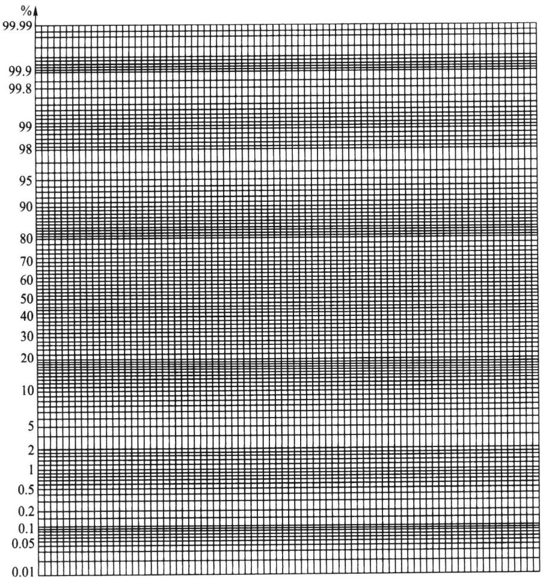  
图7.5.1正态概率纸

9.48.89.610.210.17.211.18.28.69.8

在正态概率纸上作图步骤如下：

（1）首先将数据按从小到大的次序排列 $\mathbf { \Phi } : x _ { ( \ 1 ) } \leqslant x _ { ( \ 2 ) } \leqslant \cdots \leqslant x _ { ( n ) }$ ,具体数据为7.28.28.68.89.49.69.810.110.211.1

（2）对每一个i,计算修正频率 $\frac { i - 0 . 3 7 5 } { n + 0 . 2 5 } ( \ i = 1 , 2 , \cdots n )$ ，结果见表7.5.1.

表7.5.1 $\boldsymbol { x } _ { \mathit { \Pi } _ { ( i ) } }$ 取值及其修正频率
<table><tr><td>i</td><td> $x _ { \scriptscriptstyle ( i ) }$ </td><td> $\frac { i - 0 . 3 7 5 } { n + 0 . 2 5 }$ </td><td>一</td><td> $\boldsymbol { x } _ { ( i ) }$ </td><td> $\frac { i - 0 . 3 7 5 } { n + 0 . 2 5 }$ </td></tr><tr><td>1</td><td>7.2</td><td>0.061</td><td>6</td><td>9.6</td><td>0.549</td></tr><tr><td>2</td><td>8.2</td><td>0.159</td><td>7</td><td>9.8</td><td>0.646</td></tr><tr><td>3</td><td>8.6</td><td>0.256</td><td>8</td><td>10.1</td><td>0.744</td></tr><tr><td>4</td><td>8.8</td><td>0.354</td><td>9</td><td>10.2</td><td>0.841</td></tr><tr><td>5</td><td>9.4</td><td>0.451</td><td>10</td><td>11.1</td><td>0.939</td></tr></table>

（3）将点 $\left( x _ { \left( i \right) } , \frac { i - 0 . 3 7 5 } { n + 0 . 2 5 } \right) \left( i = 1 , 2 , \cdots , n \right)$ 逐一描在正态概率图上（图7.5.2），

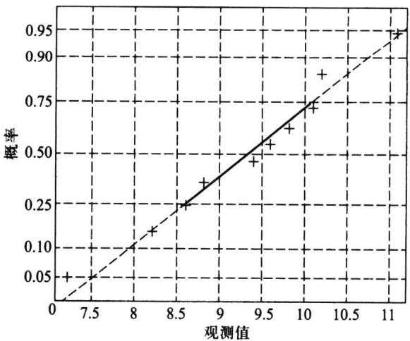  
图7.5.2例7.5.1的正态概率纸

（4）观察上述n个点的分布，作如下判断，

·若诸点在一条直线附近，则认为该批数据来自正态总体.

·若诸点明显不在一条直线附近,则认为该批数据的总体不是正态分布.

本例中，从图7.5.2上可以看到，10个点基本在一条直线附近，故可认为直径与标准尺寸的偏差服从正态分布.

这里对"修正频率”作一点说明.对应第i个观测值 $\boldsymbol { x } _ { ( i ) }$ 的累计分布函数值$F \big ( \boldsymbol { x } _ { ( i ) } \big ) = P \big ( \boldsymbol { X } \leqslant \boldsymbol { x } _ { ( i ) } \big )$ 是一个概率，可用频率作出估计，即

$$
{ \hat { F } } ( x _ { ( i ) } ) = { \frac { \# * \# \prime \jmath \backslash \mp \# / \mp \jmath x _ { ( i ) } \not \ \sharp / \uparrow \not \cdots \not \delta / \chi } { \# / \mp \# \ ! \not \equiv } } = { \frac { i } { n } } .
$$

这个频率有合理的一面,但也有一些缺陷，即当i=n时该频率为1,这意味着x的取值最大为×(n),不可能再超过x(n),这往往与实际不符,对此需要修正.常见的有如下两个 $\boldsymbol { x } _ { ( n ) }$ $\boldsymbol { x } _ { ( n ) }$ 修正频率：

$$
\hat { F } \big ( { x _ { } } _ { ( i ) } \big ) = \frac { i } { n + 1 } , \hat { F } \big ( { x _ { } } _ { ( i ) } \big ) = \frac { i - 3 / 8 } { n + 1 / 4 } ,
$$

国标GB/T4882-2001推荐使用后者,但并不反对使用前者.本节中使用后者.

如果从正态概率纸上确认总体是非正态分布时，可对原始数据进行变换后再在正态概率纸上描点，若变换后的点在正态概率纸上近似在一条直线附近，则可以认为变换后的数据来自正态分布，这样的变换称为正态性变换.常用的正态性变换有如下三个：对数变换 $y = \ln x$ 、倒数变换 $y = 1 / x$ 和根号变换 $y = { \sqrt { x } }$ ，它们都属于经典的博克斯-考克斯（Box-Cox)变换。

例7.5.2随机抽取某种电子元件10个，测得其寿命数据如下：

$$
1 1 0 . 4 7 9 9 . 1 6 9 7 . 0 4 3 2 . 6 2 2 6 9 . 8 2
$$

图7.5.3给出这10个点在正态概率纸上的图形，这10个点明显不在一条直线附近，所以可认为该电子元件的寿命的分布不是正态分布.对该10个寿命数据作对数变换，结果见表7.5.2.

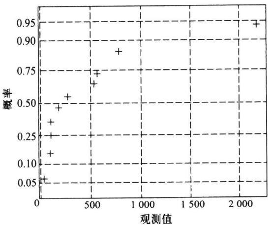  
图7.5.3例7.5.2的正态概率纸

表7.5.2对数变换后的数据
<table><tr><td>i</td><td> $\boldsymbol { x } _ { ( i ) }$ </td><td> $\mathrm { ~ l ~ n ~ } \boldsymbol { x } _ { ( i ) }$ </td><td>i-0.375  $n { + } 0 . 2 5$ </td><td>i</td><td> $\pmb { x } _ { ( i ) }$ </td><td> $\mathrm { ~ l n ~ } \pmb { x } _ { ( i ) }$ </td><td>i-0.375  $n \substack { + 0 . 2 5 }$ </td></tr><tr><td>1</td><td>32.62</td><td>3.4849</td><td>0.061</td><td>6</td><td>286.80</td><td>5.6588</td><td>0.549</td></tr><tr><td>2</td><td>97.04</td><td>4.5751</td><td>0.159</td><td>7</td><td>539.35</td><td>6.2904</td><td>0.646</td></tr><tr><td>3</td><td>99.16</td><td>4.5967</td><td>0.256</td><td>8</td><td>561.10</td><td>6.3299</td><td>0.744</td></tr><tr><td>4</td><td>110.47</td><td>4.7047</td><td>0.354</td><td>9</td><td>782.93</td><td>6.6630</td><td>0.841</td></tr><tr><td>5</td><td>179.49</td><td>5.1901</td><td>0.451</td><td>10</td><td>2269.82</td><td>7.727 5</td><td>0.939</td></tr></table>

利用表7.5.2中最后两列上的数据在正态概率纸上描点，结果见图7.5.4，从图上可以看到10个点近似在一条直线附近，说明对数变换后的数据可以看成来自正态分布.这也意味着，可认为原始数据服从对数正态分布.

## 7.5.2W检验

W检验是夏皮罗（Shapiro）和威尔克（Wilk）在1965年提出来的，这个检验当 $8 \leqslant$ $n \leqslant 5 0$ 时可以利用.过小样本(n<8)对偏离正态分布的检验不太有效，过大样本 $\textstyle ( n > 5 0 )$ 的一些辅助量计算麻烦.

设 $x _ { 1 } , x _ { 2 } , \cdots , x _ { n }$ 是来自正态总体 $N ( \mu , \sigma ^ { 2 } )$ 的样本 $, x _ { ( 1 ) } \leqslant x _ { ( 2 ) } \leqslant \cdots \leqslant x _ { ( n ) }$ 为其次序统 计量，W统计量定义为

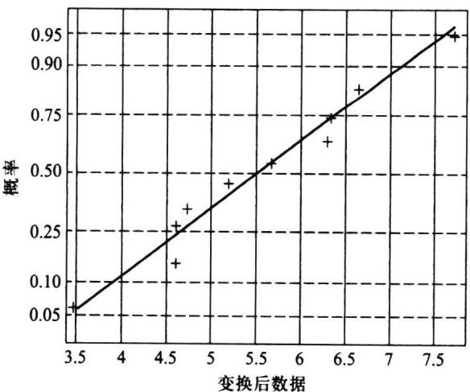  
图7.5.4变换后数据的正态概率纸

$$
W = \frac { \displaystyle { \Bigg [ \sum _ { i = 1 } ^ { n } \left( a _ { i } - \overline { { a } } \right) \left( x _ { ( i ) } - \overline { { x } } \right) \Bigg ] ^ { 2 } } } { \displaystyle { \sum _ { i = 1 } ^ { n } \left( a _ { i } - \overline { { a } } \right) ^ { 2 } \sum _ { i = 1 } ^ { n } \left( x _ { ( i ) } - \overline { { x } } \right) ^ { 2 } } } ,\tag{7.5.1}
$$

其中系数 $a _ { 1 } , a _ { 2 } , \cdots , a _ { n }$ 在样本容量为n时有特定的值，可查附表6.对于假设H。：总体 $H _ { 0 }$ 分布为 $N ( \mu , \sigma ^ { 2 } )$ ,其检验的拒绝域具有形式 $\left\{ \begin{array} { r l } \end{array} \right. \mathbb { W } \leqslant \mathbb { W } _ { \alpha } \left. \right\}$ ,其中α分位数 $\mathbb { W } _ { \alpha }$ 可查附表7.

我们下面介绍检验统计量的来历并给出另外的简化计算表达式，介绍过程中用到有关回归分析(见第八章)的一些知识.

我们分如下5步进行说明.

（1）W检验统计量是n个数对 $\left( x _ { \left( 1 \right) } , a _ { 1 } \right) , \left( x _ { \left( 2 \right) } , a _ { 2 } \right) , \cdots , \left( x _ { \left( n \right) } , a _ { n } \right)$ 的相关系数的平方,因此,对 $\boldsymbol { x } _ { \mathit { \Pi } _ { ( i ) } }$ 或对 $\pmb { a } _ { i }$ 作线性变换,该统计量值不变.例如,令 ${ \pmb u } _ { ( i ) } = \frac { { \pmb x } _ { ( i ) } - { \pmb \mu } } { \pmb \sigma } ( i = 1$ $2 , \cdots , n )$ ，则有

$$
W = \frac { \Bigg [ \sum _ { i = 1 } ^ { n } \big ( x _ { ( i ) } - \overline { { x } } \big ) \big ( a _ { i } - \overline { { a } } \big ) \Bigg ] ^ { 2 } } { \displaystyle \sum _ { i = 1 } ^ { n } \big ( x _ { ( i ) } - \overline { { x } } \big ) ^ { 2 } \sum _ { i = 1 } ^ { n } \big ( a _ { i } - \overline { { a } } \big ) ^ { 2 } } = \frac { \Bigg [ \sum _ { i = 1 } ^ { n } \big ( u _ { ( i ) } - \overline { { u } } \big ) \big ( a _ { i } - \overline { { a } } \big ) \Bigg ] ^ { 2 } } { \displaystyle \sum _ { i = 1 } ^ { n } \big ( u _ { ( i ) } - \overline { { u } } \big ) ^ { 2 } \sum _ { i = 1 } ^ { n } \big ( a _ { i } - \overline { { a } } \big ) ^ { 2 } } .\tag{7.5.2}
$$

这说明我们在利用W检验统计量时，可以对原始样本观测值作适当的线性变换，简化 $\pmb { W }$ 计算.

（2）设 $x _ { 1 } , x _ { 2 } , \cdots , x _ { n }$ 是来自正态总体 $N ( \mu , \sigma ^ { 2 } )$ 的样本， $x _ { ( \mathrm { ~ l ~ } ) } \leqslant x _ { ( 2 ) } \leqslant \cdots \leqslant x _ { ( n ) }$ 为其次序统计量，则由 $u _ { \left( i \right) } = \frac { x _ { \left( i \right) } - \mu } { \sigma }$ 得到的 $u _ { ( 1 ) } \leqslant u _ { ( 2 ) } \leqslant \cdots \leqslant u _ { ( n ) }$ 是来自标准正态分布N(O,1)的次序样本,显然，有

$$
\boldsymbol { x } _ { ( i ) } = \sigma \boldsymbol { u } _ { ( i ) } + \mu , \quad i = 1 , 2 , \cdots , n .\tag{7.5.3}
$$

由于N(0,1)不含任何未知参数，故其次序统计量u(i)的前二阶矩可算出，并且记 $\boldsymbol { u } _ { \mathit { \Pi } _ { ( i ) } }$

$$
\begin{array} { r l } & { E ( u _ { ( i ) } ) = m _ { i } , \quad i = 1 , 2 , \cdots , n } \\ & { \mathsf { C o v } \big ( u _ { ( i ) } , u _ { ( j ) } \big ) = v _ { i j } , \quad i , j = 1 , 2 , \cdots , n , } \end{array}
$$

$$
\begin{array} { r l } & { \boldsymbol { m } = \left( \begin{array} { l } { m _ { 1 } } \\ { m _ { 2 } } \\ { m _ { 2 } } \\ { \vdots } \\ { m _ { n } } \end{array} \right) = \left( \begin{array} { l } { \boldsymbol { m } _ { 1 } , } \\ { \phantom { m _ { 1 } } , } \end{array} \right) ^ { \top } , } \\ & { \boldsymbol { V } = \left( \begin{array} { l } { \boldsymbol { m } _ { 1 } } \\ { \boldsymbol { \bar { v } } _ { i j } } \end{array} \right) _ { n \times n } . } \end{array}
$$

当在(7.5.3)中用 $m _ { i }$ 代替 $\boldsymbol { u } _ { ( i ) }$ 时会引起误差，若记误差为 $\pmb { \varepsilon } _ { i }$ ，则可把(7.5.3)转化为

$$
x _ { _ { ( i ) } } = \sigma m _ { i } + \mu + \varepsilon _ { i } , \quad i = 1 , 2 , \cdots , n .\tag{7.5.4}
$$

其中 $\pmb { \varepsilon } = \left( \pmb { \varepsilon } _ { 1 } , \pmb { \varepsilon } _ { 2 } , \cdots , \pmb { \varepsilon } _ { n } \right) ^ { \top }$ 是均值为零、协方差矩阵为 $\sigma ^ { 2 } V$ 的n维随机向量.

作一个直角坐标系，横轴表示 $\pmb { x } _ { ( i ) }$ ,纵轴表示 $m _ { i }$ ，根据(7.5.4)式，在这个坐标系中，n个点 $( x _ { ( 1 ) } , m _ { ( 1 ) } ) , ( x _ { ( 2 ) } , m _ {  } ) , \cdots , ( x _ { ( n ) } , m _ { n } )$ 应该大致成一条直线，微小的误差是由 $\pmb { \varepsilon } _ { i }$ 引起的.怎样定量地衡量这些点接近直线的程度呢？这正是W检验的出发点.夏皮罗和威尔克首先研究了 $\pmb { x } = \big ( \pmb { x } _ { ( 1 ) } , \pmb { x } _ { ( 2 ) } , \cdots , \pmb { x } _ { ( n ) } \big ) ^ { \top }$ 与 $\pmb { m } = \left( m _ { 1 } ^ { \vphantom { \dagger } } , m _ { 2 } ^ { \vphantom { \dagger } } , \cdots , m _ { n } ^ { \vphantom { \dagger } } \right) ^ { \dagger }$ 的相关系数

$$
r ^ { 2 } = \frac { \Bigg [ \displaystyle \sum _ { i = 1 } ^ { n } \big ( { \displaystyle x _ { _ { ( i ) } } - \overline { { x } } } \big ) \big ( m _ { i } - \overline { { m } } \big ) \Bigg ] ^ { 2 } } { \displaystyle \sum _ { i = 1 } ^ { n } \big ( { \displaystyle x _ { _ { ( i ) } } - \overline { { x } } } \big ) ^ { 2 } \displaystyle \sum _ { i = 1 } ^ { n } \big ( m _ { i } - \overline { { m } } \big ) ^ { 2 } } .\tag{7.5.5}
$$

显然 $, r ^ { 2 }$ 越是接近 $\mathbf { \xi } _ { 1 } ^ { 1 } , \mathbf { \pmb { x } } = \left( \mathbf { \alpha } _ { x _ { \left( 1 \right) } } , \mathbf { \alpha } _ { x _ { \left( 2 \right) } } , \cdots , \mathbf { \alpha } _ { x _ { \left( n \right) } } \right) ^ { \top }$ 与 $\pmb { m } = \left( m _ { 1 } ^ { \phantom { } } , m _ { 2 } ^ { \phantom { } } , \cdots , m _ { n } ^ { \phantom { } } \right) ^ { \top }$ 的线性关系越是明显.所以，若用 $r ^ { 2 }$ 检验假设 $H _ { 0 }$ ：总体分布为 $N ( \mu , \sigma ^ { 2 } )$ ，那么该检验的拒绝域具有形式$\left\{ r ^ { 2 } \leqslant c \right\}$ ,其中c为某个常数.

（3）由于 $\pmb { m } = \left( \begin{array} { c } { m _ { 1 } ^ { } , m _ { 2 } ^ { } , \cdots , m _ { n _ { n } } ^ { } } \end{array} \right) ^ { \top }$ 完全确定，由标准正态分布的对称性可以证明$m _ { i } = - m _ { n + 1 - i }$ ,即

$$
m _ { 1 } = - m _ { n } , \quad m _ { 2 } = - m _ { n - 1 } , \quad \cdots , \quad m _ { _ { [ n / 2 ] } } = - m _ { n + 1 - [ n / 2 ] } ,
$$

且当n为奇数时， $\begin{array} { r } { m _ { \left( n + 1 \right) / 2 } = 0 . } \end{array}$ 由这一性质得

$$
\sum _ { i = 1 } ^ { n } m _ { i } = 0 , \quad \overline { { { m } } } = \frac { 1 } { n } \sum _ { i = 1 } ^ { n } m _ { i } = 0 .
$$

（4）根据3中结论，（7.5.5）式的分子部分可简化，注意到

$$
\sum _ { i = 1 } ^ { n } \left( x _ { _ { ( i ) } } \ - \overline { { x } } \right) \left( m _ { i } \ - \overline { { m } } \right) = \ \sum _ { i = 1 } ^ { n } m _ { i } x _ { _ { ( i ) } } = \ \sum _ { i = 1 } ^ { [ n / 2 ] } m _ { i } \big ( x _ { _ { ( i ) } } \ - \ x _ { _ { ( n + 1 - i ) } } \big ) \ ,
$$

若记 $b _ { i } = \frac { m _ { i } } { \displaystyle \sum _ { j = 1 } ^ { n } m _ { j } ^ { 2 } }$ ，则可验证： $\hat { \pmb { \sigma } } _ { 1 } = \sum _ { i = 1 } ^ { n } { \pmb { b } } _ { i } { \pmb { x } } _ { ( i ) }$ 是正态标准差 $\pmb { \sigma }$ 的线性无偏估计（LUE），若

把(7.5.5)式变为

$$
\begin{array} { r } { r ^ { 2 } = \frac { \displaystyle \Big [ \displaystyle \sum _ { i = 1 } ^ { [ n / 2 ] } b _ { i } \big ( { \pmb x } _ { ( i ) } - { \pmb x } _ { ( n + 1 - i ) } \big ) \Big ] ^ { 2 } \displaystyle \sum _ { i = 1 } ^ { n } m _ { i } ^ { 2 } } { \displaystyle \sum _ { i = 1 } ^ { n } \big ( { \pmb x } _ { ( i ) } - { \pmb x } _ { ( i ) } ^ { 2 } \big ) ^ { 2 } } = \frac { \displaystyle \sum _ { i = 1 } ^ { n } m _ { i } ^ { 2 } } { { n - 1 } } \cdot \frac { \hat { \pmb \sigma } _ { 1 } ^ { 2 } } { { \pmb s } ^ { 2 } } . } \end{array}\tag{7.5.6}
$$

若撇开与样本无关的常数，则在正态性假设 $H _ { 0 }$ 为真时，上式中分子与分母分别都是正

态方差 $\sigma ^ { 2 }$ 的无偏估计，相差不会很大.可当 $H _ { 0 }$ 为假时，其差别就大了.因为分子是在$H _ { \mathfrak { o } }$ 为真下构造，而分母 $s ^ { 2 }$ 是通用的.

（5）为了在正态性假设 $H _ { 0 }$ 为假时能扩大分子与分母的差异,加强区别非正态分布的能力，夏皮罗与威尔克把（7.5.6)的分子换用σ的最小方差线性无偏估计（BLUE），然后再正则化，使最后得到的如下检验统计量W位于0与1之间：

$$
W = \frac { \displaystyle \bigg [ \sum _ { i = 1 } ^ { [ n / 2 ] } a _ { i } \big ( { x _ { ( i ) } ~ - { x _ { ( n + 1 - i ) } } } \big ) \bigg ] ^ { 2 } } { \displaystyle \sum _ { i = 1 } ^ { n } \big ( { x _ { ( i ) } ~ - \bar { x } \big ) ^ { 2 } } } ,\tag{7.5.7}
$$

其中诸 $\pmb { a } _ { i }$ 可如下得到：

$$
\begin{array} { c } { { \displaystyle { C = \left( c _ { 1 } , c _ { 2 } , \cdots , c _ { n } \right) = \frac { m ^ { \top } V ^ { - 1 } } { m ^ { \top } V ^ { - 1 } m } , } } } \\ { { \displaystyle { a = \left( a _ { 1 } , a _ { 2 } , \cdots , a _ { n } \right) = \frac { C } { \sqrt { C C } } = \frac { m ^ { \top } V ^ { - 1 } } { \sqrt { m ^ { \top } V ^ { - 1 } V ^ { - 1 } m } } . } } } \end{array}
$$

（7.5.7)式就是最常用的W检验的计算公式，其中诸 $a _ { i }$ 可查附表6.

例7.5.3某气象站收集了44个独立的年降雨量数据，资料如下（已排序）：

$$
{ \begin{array} { l l l l l l l l l l l } { 5 2 0 } & { 5 5 6 } & { 5 6 1 } & { 6 1 6 } & { 6 3 5 } & { 6 6 9 } & { 6 8 6 } & { 6 9 2 } & { 7 0 4 } & { 7 0 7 } & { 7 1 1 } \\ { 7 1 3 } & { 7 1 4 } & { 7 1 9 } & { 7 2 7 } & { 7 3 5 } & { 7 4 0 } & { 7 4 4 } & { 7 4 5 } & { 7 5 0 } & { 7 7 6 } & { 7 7 7 } \\ { 7 8 6 } & { 7 8 6 } & { 7 9 1 } & { 7 9 4 } & { 8 2 1 } & { 8 2 2 } & { 8 2 6 } & { 8 3 4 } & { 8 3 7 } & { 8 5 1 } & { 8 6 2 } \\ { 8 7 3 } & { 8 7 9 } & { 8 8 9 } & { 9 0 0 } & { 9 0 4 } & { 9 2 2 } & { 9 2 6 } & { 9 5 2 } & { 9 6 3 } & { 1 0 5 6 } & { 1 0 7 4 } \end{array} }
$$

我们要根据这批数据作正态性检验.

为此,利用(7.5.7)式计算W值.首先由这批数据可算得

$$
\overline { { { x } } } = 7 8 5 . 1 1 4 , \quad \sum _ { i = 1 } ^ { 4 4 } \left( x _ { ( i ) } - \overline { { { x } } } \right) ^ { 2 } = 6 3 0 ~ 8 7 2 . 4 3 ,
$$

我们将计算W的过程列于表7.5.3中.为便于计算，值 ${ \pmb x } _ { ( k ) } \ , { \pmb x } _ { ( n + 1 - k ) }$ 和 $d _ { k } = x _ { \scriptscriptstyle ( n + 1 - k ) } - x _ { \scriptscriptstyle ( k ) }$ 安排在同一行.

表7.5.3某一气象站收集的年降雨量
<table><tr><td> $k$ </td><td> ${ \pmb x } _ { ( { \pmb k } ) }$ </td><td> $x _ { ( n + 1 - k ) }$ </td><td> $d _ { k }$ </td><td> $a _ { \scriptscriptstyle k } ( 4 4 )$ </td><td> $k$ </td><td> ${ \pmb x } _ { ( { \pmb k } ) }$ </td><td> $\pmb { x } _ { ( n + 1 - k ) }$ </td><td> $d _ { k }$ </td><td> $a _ { \scriptscriptstyle k } ( 4 4 )$ </td></tr><tr><td>1</td><td>520</td><td>1074</td><td>554</td><td>0.387 2</td><td>12</td><td>713</td><td>862</td><td>149</td><td>0.0943</td></tr><tr><td>2</td><td>556</td><td>1056</td><td>500</td><td>0.2667</td><td>13</td><td>714</td><td>851</td><td>137</td><td>0.0842</td></tr><tr><td>3</td><td>561</td><td>963</td><td>402</td><td>0.2323</td><td>14</td><td>719</td><td>837</td><td>118</td><td>0.0745</td></tr><tr><td>4</td><td>616</td><td>952</td><td>336</td><td>0.207 2</td><td>15</td><td>727</td><td>834</td><td>107</td><td>0.0651</td></tr><tr><td>5</td><td>635</td><td>926</td><td>291</td><td>0.1868</td><td>16</td><td>735</td><td>826</td><td>91</td><td>0.0560</td></tr><tr><td>6</td><td>669</td><td>922</td><td>253</td><td>0.169 5</td><td>17</td><td>740</td><td>822</td><td>82</td><td>0.047 1</td></tr><tr><td>7</td><td>686</td><td>904</td><td>218</td><td>0.1542</td><td>18</td><td>744</td><td>821</td><td>77</td><td>0.0383</td></tr><tr><td>8</td><td>692</td><td>900</td><td>208</td><td>0.1405</td><td>19</td><td>745</td><td>794</td><td>49</td><td>0.0296</td></tr><tr><td>9</td><td>704</td><td>889</td><td>185</td><td>0.1278</td><td>20</td><td>750</td><td>791</td><td>41</td><td>0.0211</td></tr><tr><td>10</td><td>707</td><td>879</td><td>172</td><td>0.1160</td><td>21</td><td>776</td><td>786</td><td>10</td><td>0.0126</td></tr><tr><td>11</td><td>711</td><td>873</td><td>162</td><td>0.1049</td><td>22</td><td>777</td><td>786</td><td>9</td><td>0.0042</td></tr></table>

从表7.5.3可以计算出W的值为

$$
W = { \frac { ( 0 . 3 8 7 \ 2 \times \ 5 5 4 \ + \ 0 . 2 6 6 \ 7 \times \ 5 0 0 \ + \ \cdots \ + \ 0 . 0 0 4 \ 2 \times 9 \ ) ^ { 2 } } { 6 3 0 \ 8 7 2 . 4 3 } } = 0 . 9 8 2 .
$$

若取 $\alpha = 0 . 0 5$ ，查附表7，在 $n = 4 4$ 时给出 $\pmb { { \cal W } } _ { _ { 0 , 0 5 } } = 0 . 9 4 4$ ，由于计算得到的W值大于该值，所以在显著性水平 $\alpha = 0 . 0 5$ 上不拒绝原假设，即可以认为该批数据服从正态分布.

## 7.5.3EP检验

EP检验即爱泼斯-普利（Epps-Pulley）检验 $\left( n \geqslant 8 \right)$

爱泼斯-普利检验对多种备择假设有较高的效率，其出发点是利用样本的特征函数与正态分布的特征函数的差的模的平方产生的一个加权积分得到的，我们这里简单地介绍该检验方法.

设 $x _ { 1 } , x _ { 2 } , \cdots , x _ { n }$ 是来自正态总体 $N ( \mu , \sigma ^ { 2 } )$ 的样本，EP检验统计量定义为

$$
T _ { \mathrm { { \tiny ~ E P } } } = 1 + \frac { n } { \sqrt { 3 } } + \frac { 2 } { n } \sum _ { i = 2 } ^ { n } \sum _ { j = 1 } ^ { i - 1 } \exp \biggr \{ \frac { - \big ( x _ { j } - x _ { i } \big ) ^ { 2 } } { 2 s _ { n } ^ { 2 } } \biggr \} - \sqrt { 2 } \sum _ { i = 1 } ^ { n } \exp \biggr \{ \frac { - \big ( x _ { i } - \overline { { x } } \big ) ^ { 2 } } { 4 s _ { n } ^ { 2 } } \biggr \} \ ,\tag{7.5.8}
$$

其中 ${ \overline { { x } } } , s _ { n } ^ { 2 }$ 就是前述的样本均值和（除以n的)样本方差.

(7.5.8)通常需要编程计算，其拒绝域为 $\{ T _ { \mathrm { E P } } \geqslant T _ { _ { 1 - \alpha , \mathrm { E P } } } ( n ) \} , T _ { _ { 1 - \alpha , \mathrm { E P } } } ( n )$ 是样本容量为n时EP检验统计量(在原假设下的分布)的1-α分位数.附表11给出了部分n和一些常用 $_ { 1 - \alpha }$ 对应的 $T _ { \mathrm { { \tt E P } } }$ 的分位数.由于 $n = 2 0 0$ 时统计量 $T _ { \mathrm { { \tt E P } } }$ 的分位数已经非常接近 $\pmb { n } =$ $\infty$ 时 $T _ { \mathrm { { { E P } } } }$ 的分位数，当 $n { > } 2 0 0$ 时，统计量 $T _ { \tt E P }$ 的分位数可以用 $n = 2 0 0$ 时的分位数代替.对小于200而不在表内的n，可采用线性插值的方法得到近似的分位数.

下面以国标中的一个例子说明该方法的应用.

例7.5.4现要考察某种人造丝纱线的断裂强度的分布类型，为此进行了25次试验，得到一个容量为25的样本，具体如下：

$$
\begin{array} { l l l l l l l l l l l } { { 1 4 7 } } & { { 1 8 6 } } & { { 1 4 1 } } & { { 1 8 3 } } & { { 1 9 0 } } & { { 1 2 3 } } & { { 1 5 5 } } & { { 1 6 4 } } & { { 1 8 3 } } & { { 1 5 0 } } & { { 1 3 4 } } & { { 1 7 0 } } \\ { { 1 4 4 } } & { { 9 9 } } & { { 1 5 6 } } & { { 1 7 6 } } & { { 1 6 0 } } & { { 1 7 4 } } & { { 1 5 3 } } & { { 1 6 2 } } & { { 1 6 7 } } & { { 1 7 9 } } & { { 7 8 } } & { { 1 7 3 } } & { { 1 6 8 } } \end{array}
$$

它们是在标准环境下采用适当单位得到的测量值.为检验总体分布是否是正态，采用EP检验，经过编程计算，得到

$$
T _ { \mathtt { E P } } = 0 . 6 1 2 .
$$

若取显著性水平 $\alpha = 0 . 0 1$ ，在附表11中通过线性插值得 $n = 2 5$ 时的0.99分位数约为$0 . 5 6 4 + { \frac { 0 . 5 6 9 - 0 . 5 6 4 } { 3 0 - 2 0 } } \times ( 2 5 - 2 0 ) = 0 . 5 6 6 5$ 计算得到的 $T _ { \tt E P }$ 大于该临界值.因此在显著性水平0.01下拒绝关于诸 $x _ { j }$ 服从正态分布的原假设.

进一步,有专家根据经验指出，该人造丝纱线的断裂强度可能服从对数正态分布，为此先计算对数变换 $y = \log \left( 2 0 4 - x \right)$ 得到的样本值如下：

$$
\begin{array} { r l } { 1 . 7 5 6 \quad 1 . 2 5 5 \quad 1 . 7 9 9 \quad 1 . 3 2 2 \quad 1 . 1 4 6 \quad 1 . 9 0 8 \quad 1 . 6 9 0 \quad 1 . 6 0 2 } \\ { 1 . 3 2 2 \quad 1 . 7 3 2 \quad 1 . 8 4 5 \quad 1 . 5 3 1 \quad 1 . 7 7 8 \quad 2 . 0 2 1 \quad 1 . 6 8 1 \quad 1 . 4 4 7 } \\ { 1 . 6 4 3 \quad 1 . 4 7 7 \quad 1 . 7 0 8 \quad 1 . 6 2 3 \quad 1 . 5 6 8 \quad 1 . 3 9 8 \quad 2 . 1 0 0 \quad 1 . 4 9 1 \quad 1 . 5 5 6 } \end{array}
$$

这些对数观测值在正态概率图上似乎散布在一条直线附近.再考虑采用EP检验，经编程计算，得基于对数变换观测值的检验统计量值为0.006，它远远小于0.5665的临界

值，这说明人造丝纱线的断裂强度服从对数正态分布.

## 习题7.5

1.在检验了一个车间生产的20个轴承外座圈的内径（单位：mm）后得到下面数据：

15.0415.3614.5714.5315.5714.6915.3714.6614.5215.41

15.3414.2815.0114.7614.3815.8713.6614.9715.2914.95

（1）作正态概率图，并作初步判断；

（2）请用W检验方法检验这组数据是否来自正态分布 $\left( \alpha = 0 . 0 5 \right)$

2.抽查克矽平治疗矽肺患者10名，得到他们治疗前后的血红蛋白量之差如下：

$$
\begin{array} { r l } { 2 . 7 } & { { } - 1 . 2 \quad - 1 . 0 \quad 0 \quad 0 . 7 \quad 2 . 0 \quad 3 . 7 \quad - 0 . 6 \quad 0 . 8 \quad - 0 . 3 } \end{array}
$$

（1）作正态概率图，并作初步判断；

（2）请用W检验方法检验治疗前后的血红蛋白量之差是否服从正态分布 $\left( \alpha = 0 . 0 5 \right)$

3.某种岩石中的一种元素的含量在25个样本中为

0.320.250.290.250.280.300.230.230.400.320.350.190.34

0.330.330.280.280.220.300.240.350.240.300.230.22

有人认为该样本来自对数正态分布总体，请设法用W检验方法作检验 $\left( \alpha = 0 . 0 5 \right)$

4.对第3题的数据，试用EP检验方法检验这些数据是否来自正态总体（取 $\alpha = 0 . 0 5 )$

## 7.6非参数检验

统计学的基本问题是利用观测到的样本推断总体.在统计推断中，我们对研究的总体常常要作一些假定，最常见的假定是假定总体分布为正态，这样的假定是比较强的.由于实际的总体与假定的总体往往会有差距，那么，这种做法将可能会引起推断结果的错误.这一问题促使人们去研究在总体分布假定比较弱的前提下，如何进行统计推断.非参数检验正是这样的一个领域.

本节,我们介绍几个常用的非参数检验方法.

## 7.6.1游程检验

所有的统计推断方法常常要求数据随机取自同一个总体，有时由于种种原因，我们可能怀疑数据不符合随机选取的原则，此时需对数据进行随机性检验.

设 $x _ { 1 } , x _ { 2 } , \cdots , x _ { n }$ 为依时间顺序连续得到的一组样本观测值序列.记样本中位数为$m _ { e }$ ，把序列中小于m的那些xi换成0,大于或等于m的那些x换成1.这样我们就得 $m _ { e }$ $x _ { i }$ $m _ { e }$ $x _ { i }$ 到一个由0和1两个元素组成的序列.我们把以0为界的一连串的1称为1游程，以1为界的一连串的0称为0游程，统称为游程.例如序列

$$
\begin{array} { r } { 0 } \\ { 1 } \end{array} \mapsto \{ 1 \mapsto 1 \mapsto 1 \mapsto 0 \} \mapsto 1 \mapsto 1 \mapsto 0 \mapsto 1 \tag{7.6.1}
$$

它有5个0游程和4个1游程.

设序列中0和1的个数分别为n，和n,其和为样本量n.一般来说，n $n _ { 1 }$ $n _ { 2 }$ $n _ { 1 } , n _ { 2 }$ 都大于0,设R表示序列的总游程数，则R的最小值是2,最大值为n,对于(7.6.1)式给出的序列， $R = 9$ 若游程总数R的值过大（即0和1呈周期性变化的趋势）,或游程总数R的值过小（即序列的前一部分0占多数，后一部分1占多数，或者前一部分1占多数，后一部分 $0$ 占多数），可以认为样本数据受到了某些非随机因素的干扰，它不符合随机抽取的原则.因此，对于原假设

$H _ { 0 }$ ：样本序列符合随机抽取的原则，

该检验的拒绝域应具有形式 $\{ R \leqslant c _ { 1 } \} \cup \{ R \geqslant c _ { 2 } \}$ ,其中临界值 $c _ { \textup { l } }$ 和 $c _ { 2 }$ 要根据 $H _ { \mathfrak { o } }$ 为真时R的分布确定.下面讨论 $H _ { 0 }$ 为真时R的分布，分R为偶数与奇数两种情况进行.

由于0游程和1游程是交替出现的，所以，当 $R = 2 k$ 时，必有0游程和1游程个数都是k；当 $R = 2 k + 1$ 时，要么0游程个数是k且1游程个数是k+1，要么1游程个数是k且0游程个数是k+1.

出现“k个0游程”意味着 $n _ { 1 }$ 个0被分成k组，这相当于将 $n _ { 1 }$ 个不可分辨的球放入k个盒中且没有一个盒子是空的，依重复组合公式，共有

$$
\binom { n _ { 1 } - 1 } { k - 1 }
$$

种可能.所以，在R=2k时，k个0游程共有 $\binom { n _ { 1 } - 1 } { k - 1 }$ 种不同方式的安排，类似地，k个1游程也共有 $\binom { n _ { 2 } - 1 } { k - 1 }$ 种不同方式的安排.把0游程和1游程合在一起有两种可能，一种是0游程在前面而1游程在后面，另一种则反过来，1游程在前面而0游程在后面.由此可知，出现R=2k的情况一共有

$$
2 { \binom { n _ { 1 } - 1 } { k - 1 } } { \binom { n _ { 2 } - 1 } { k - 1 } }
$$

种可能，而总的等可能结果一共有 $\left( { \begin{array} { c } { n _ { 1 } + n _ { 2 } } \\ { } \\ { n _ { 1 } } \end{array} } \right)$ 个，从而有

$$
P \left( R = 2 k \right) = { \frac { 2 { \binom { n _ { 1 } - 1 } { k - 1 } } { \binom { n _ { 2 } - 1 } { k - 1 } } } { { \binom { n _ { 1 } + n _ { 2 } } { n _ { 1 } } } } } , \quad k = 1 , 2 , \cdots , \left[ { \frac { n } { 2 } } \right] .\tag{7.6.2}
$$

类似地，在 $R = 2 k + 1$ 时，要么有k个0游程和k+1个1游程，要么有k+1个0游程和k个1游程.对前一种情况，一定是以1游程开始也以1游程收尾，共有$\binom { n _ { 1 } - 1 } { k - 1 } \left( \begin{array} { c } { { n _ { 2 } - 1 } } \\ { { } } \\ { { k } } \end{array} \right)$ 种可能，对后一种情况，共有 $\binom { n _ { 1 } - 1 } { k } \binom { n _ { 2 } - 1 } { k - 1 }$ 种可能，于是有

$$
P ( R = 2 k + 1 ) = \frac { \binom { n _ { 1 } - 1 } { k - 1 } \binom { n _ { 2 } - 1 } { k } + \binom { n _ { 1 } - 1 } { k } \binom { n _ { 2 } - 1 } { k - 1 } } { \binom { n _ { 1 } + n _ { 2 } } { n _ { 1 } } } , \quad k = 1 , 2 , \cdots , \left[ \frac { n - 1 } { 2 } \right] .\tag{7.6.3}
$$

由（7.6.2）、（7.6.3）两式，当 $n _ { 1 } , n _ { 2 }$ 都不太大时，对于给定的 $\alpha \ ( \ 0 < \alpha < 1 \ )$ ，可以计算出游程总数检验的临界值.为方便使用，人们编制了游程总数检验的临界值表（附表12).应用中由（7.6.2）、（7.6.3)两式计算检验的p值则更加方便.

例7.6.1对某型号的20根电缆依次进行耐压试验，测得数据如下：

$$
1 5 6 . 0 \quad 2 5 5 . 5 \quad 1 3 2 . 0 \quad 2 4 6 . 7 \quad 8 6 7 . 9 \quad 8 6 . 4 \quad 6 1 0 . 4 \quad 1 2 5 . 7 \quad 1 5 0 . 4 \quad 1 1 7 . 6
$$

$$
2 0 1 . 9 \quad 2 0 7 . 2 \quad 1 8 9 . 8 \quad 5 8 5 . 8 \quad 1 5 3 . 1 \quad 5 6 5 . 4 \quad 5 1 1 . 0 \quad 5 6 7 . 0 \quad 2 2 2 . 3 \quad 1 4 1 . 5 \quad
$$

这些数据能否认为受到非随机因素干扰？（例如测量仪器工作条件改变等的影响.）

解这些观测值的中位数是

$$
m _ { e } = \frac { 1 } { 2 } ( 2 0 1 . 9 + 2 0 7 . 2 ) = 2 0 4 . 6 .
$$

于是,将观测值小于204.6的数换成0,将大于204.6的数换成1,这样得到序列01011010000101011110

其中0与1的个数都是10,游程总数 $R = 1 3 .$ 若取 $\alpha = 0 . 0 5$ ,查附表12知， $P ( R \leqslant 6 ) \leqslant$ $0 . 0 2 5 \ : \left( \ : c _ { _ 1 } = 6 \right) , P ( \ : R \geqslant 1 6 ) \leqslant 0 . 0 2 5 \ : \left( \ : c _ { _ 2 } = 1 6 \right)$ ，故其拒绝域为 $W = \left\{ \begin{array} { r l r } \end{array} \right. R \leqslant 6$ 或 $R \geqslant 1 6 \}$ ，如今$6 < 1 3 < 1 6$ ,故可认为该批数据是随机选取的（若取 $\alpha = 0 . 1 0$ ，结果是相同的).

我们也可以计算该检验的p值从而加以判断.为此，利用(7.6.2)和(7.6.3)式，可计算出游程R的分布，具体结果如下表：

<table><tr><td>，</td><td> $P ( R = r )$ </td><td> $P ( R { \leqslant } r )$ </td><td>r</td><td> $P ( R = r )$ </td><td> $P ( R { \leqslant } r )$ </td></tr><tr><td>2</td><td>0.0000</td><td>0.0000</td><td>11</td><td>0.1719</td><td>0.5859</td></tr><tr><td>3</td><td>0.0001</td><td>0.0001</td><td>12</td><td>0.171 9</td><td>0.7578</td></tr><tr><td>4</td><td>0.0009</td><td>0.0010</td><td>13</td><td>0.114 6</td><td>0.872 4</td></tr><tr><td>5</td><td>0.0035</td><td>0.0045</td><td>14</td><td>0.076 4</td><td>0.9488</td></tr><tr><td>6</td><td>0.0140</td><td>0.0185</td><td>15</td><td>0.0327</td><td>0.9815</td></tr><tr><td>7</td><td>0.0327</td><td>0.051 2</td><td>16</td><td>0.0140</td><td>0.9955</td></tr><tr><td>8</td><td>0.0764</td><td>0.127 6</td><td>17</td><td>0.0035</td><td>0.9990</td></tr><tr><td>9</td><td>0.114 6</td><td>0.242 2</td><td>18</td><td>0.0009</td><td>0.999 9</td></tr><tr><td>10</td><td>0.1719</td><td>0.4141</td><td>19</td><td>0.0001</td><td>1.000 0</td></tr></table>

检验的p值为

$$
p = 2 \ \operatorname* { m i n } \left\{ P ( R \leqslant 1 3 ) , P ( R \geqslant 1 3 ) \right\} = 2 \ \operatorname* { m i n } \left\{ 0 . 8 7 2 4 , 1 - 0 . 7 5 7 8 \right\} = 0 . 4 8 4 4 ,
$$

若取显著性水平 $\alpha = 0 . 1$ ，可认为这批数据符合随机抽取的原则.

在计算程序越来越先进的今天,对比较大的 $n _ { 1 } , n _ { 2 }$ ,完全可以计算出R的分布，从而给出检验的拒绝域.在实际应用中，当 $n _ { 1 } , n _ { 2 }$ 很大时，也可以使用渐近分布，我们不加证明地给出如下结论：当样本随机地取自同一总体， $n _ { 1 } , n _ { 2 }$ 都趋于无穷且 $n _ { 1 } / n _ { 2 }$ 趋于常数c时，有

$$
\frac { R - \displaystyle \frac { 2 n _ { 1 } } { 1 + c } } { \sqrt { \displaystyle \frac { 4 c n _ { 1 } } { \left( 1 + c \right) ^ { 2 } } } } \xrightarrow { L } N ( 0 , 1 ) .
$$

当 $n _ { 1 } , n _ { 2 }$ 都比较大时，上式中的c可用 $n _ { ! } / n _ { ! }$ ，代替，从而对给定的显著性水平 $\pmb { \alpha }$ ，两个临界值可近似取为

$$
c _ { 1 } = \left[ \frac { 2 n _ { 1 } n _ { 2 } } { n _ { 1 } + n _ { 2 } } \Bigg ( 1 + \frac { u _ { \alpha / 2 } } { \sqrt { n _ { 1 } + n _ { 2 } } } \Bigg ) \right] ~ ,
$$

$$
c _ { 2 } = \left[ \frac { 2 n _ { 1 } n _ { 2 } } { n _ { 1 } + n _ { 2 } } \Bigg ( 1 + \frac { u _ { 1 - \alpha / 2 } } { \sqrt { n _ { 1 } + n _ { 2 } } } \Bigg ) ~ \right] + 1 .
$$

研究表明，当 $n _ { 1 } , n _ { 2 }$ 都大于20时，上式近似效果是足够好的.

游程检验还可以用于检验两个总体是否有相同分布.设 $x _ { 1 } , x _ { 2 } , \cdots , x _ { n }$ 是来自总体X的样本， $y _ { 1 } , y _ { 2 } , \cdots , y _ { m }$ 是来自总体Y的样本，将两组样本合并在一起，按由小到大的顺序排列为 $z _ { 1 } \leqslant z _ { 2 } \leqslant \cdots \leqslant z _ { m + n }$ 引人 $w _ { i }$ 如下：若 $\boldsymbol { z } _ { i }$ 是来自总体X的观察，则 ${ \boldsymbol { w } } _ { i } = 0$ ，否则（即$z _ { i }$ 是来自总体 $Y$ 的观察） $\boldsymbol { w } _ { i } = 1$ .这样，我们就得到一个由0与1两个元素组成的序列

$$
w _ { 1 } , w _ { 2 } , \cdots , w _ { m + n } .\tag{7.6.4}
$$

在X与Y有相同的分布时， $x _ { 1 } , x _ { 2 } , \cdots , x _ { n } , y _ { 1 } , y _ { 2 } , \cdots , y _ { m }$ 可以看作是从同一个总体中抽取的样本，因而，序列(7.6.4)的总游程数R将是较大的.而在X与Y的分布不相同时，序列(7.6.4)的总游程数R将是较小的.例如，若总体X与Y分得很开，以至于它们的样本观测值彼此不重叠时，R的值接近于2，这时就有把握认为“两个分布不相同”.在一般场合，对于原假设 $H _ { 0 }$ ：两个总体分布相同，混合样本的游程数越小就越倾向于拒绝原假设，故检验的拒绝域应具有形式 $\left\{ R \leqslant c \right\}$ ,其中 $c$ 为临界值，它可以由（7.6.2）和（7.6.3)两式算出，当然也可以据此算出检验的 $p$ 值

## 7.6.2符号检验

符号检验是一类重要的非参数检验，它主要用来对总体p分位数 $x _ { _ { p } }$ 进行检验.对任一连续总体X，其 $p$ 分位数 $x _ { p } \ \left( \ 0 < p < 1 \right)$ 是存在且唯一的，对 $x _ { _ p }$ 的检验可参看如下例子进行.

例7.6.2设总体X为连续随机变量，分布函数为 $F ( { \boldsymbol { x } } ) , x _ { 1 } , x _ { 2 } , \cdots , x _ { n }$ 是来自该总体的样本，试检验假设 $^ { * } F$ 的中位数为 $0 "$ ，即检验如下假设

$$
H _ { 0 } : F ( 0 ) = 0 . 5 \quad \mathrm { { v s } } \quad H _ { \mathrm { { \scriptscriptstyle 1 } } } : F ( 0 ) \ne 0 . 5 .
$$

解作符号函数

$$
y _ { i } = \left\{ { \begin{array} { l l } { 1 , } & { x _ { i } > 0 , } \\ { 0 , } & { x _ { i } \leqslant 0 , } \end{array} } \right. \quad S ^ { + } = \sum _ { i = 1 } ^ { n } y _ { i } .
$$

即 $S ^ { \ast }$ 为 $x _ { 1 } , x _ { 2 } , \cdots , x _ { n }$ 中取正数的个数.直观上看，在原假设成立时， $S ^ { + }$ 的取值不应过大也不应过小.在 $H _ { 0 }$ 为真时， $\boldsymbol { S } ^ { \ast }$ 服从二项分布 $b ( \ n , 0 . 5 )$ ,从而,可确定常数 $c _ { 1 } , c _ { 2 }$ ，使

$$
P ( S ^ { + } \leqslant c _ { 1 } ) \leqslant \alpha / 2 , \quad P ( S ^ { + } \geqslant c _ { 2 } ) \leqslant \alpha / 2 ,
$$

该检验的拒绝域为 $\{ 0 , 1 , 2 , \cdots , c _ { 1 } \} \cup \{ c _ { 2 } , c _ { 2 } + 1 , \cdots , n \}$ .当然，这时使用检验的p值进行检验将会比较简单.

上述检验问题的统计量 $S ^ { \ast }$ ，通常被称为符号统计量.一般场合， $S ^ { \ast }$ 还可用来检验总体分布 $F$ 的 $p$ 分位数，具体如下：设 $x _ { 1 } , x _ { 2 } , \cdots , x _ { n }$ 是来自总体X的样本，欲检验

$$
H _ { 0 } : x _ { p } \leqslant x _ { 0 } \quad \mathrm { ~ v s ~ } \quad H _ { 1 } : x _ { p } > x _ { 0 } ,\tag{7.6.5}
$$

其中 $F ( x _ { p } ) = p , x _ { 0 }$ 是某个给定常数.

与上面例子一样，记

$$
y _ { i } = \left\{ { \begin{array} { l l } { 1 , } & { x _ { i } > x _ { 0 } , } \\ { 0 , } & { x _ { i } \leqslant x _ { 0 } , } \end{array} } \right.
$$

记 $\theta = P ( \ \boldsymbol { y } _ { i } = 1 ) = P ( \ \boldsymbol { x } _ { i } - \boldsymbol { x } _ { 0 } > 0 )$ ，则 $y _ { 1 } , y _ { 2 } , \cdots , y _ { n }$ 可以看作是来自二点分布b(1，0)的样本，从而 $S ^ { + } = \sum _ { i = 1 } ^ { n } y _ { i } { \sim } b \left( n , \theta \right)$ ,在 $H _ { 0 }$ 为真时,有

$$
\theta = P ( \ y _ { i } = 1 ) = P ( \ x _ { i } - x _ { 0 } > 0 ) \leqslant P ( \ x _ { i } - x _ { p } > 0 ) = 1 - P ( \ x _ { i } - x _ { p } \leqslant 0 ) = 1 - F ( \ x _ { p } ) = 1 - p .
$$

反之，若 $\theta \leqslant 1 - p$ ,则 $\theta = P (  { \boldsymbol { x } } _ { i } { - }  { \boldsymbol { x } } _ { 0 } { > } 0 ) \leqslant P (  { \boldsymbol { x } } _ { i } { - }  { \boldsymbol { x } } _ { p } { > } 0 ) = 1 - p$ ，从而 $x _ { p } \leqslant x _ { 0 }$ ,亦即 $H _ { \mathfrak { o } }$ 为真.所以，检验问题(7.6.5）等价于检验问题

$$
H _ { 0 } : \theta \leqslant 1 - p \quad \mathrm { ~ v s ~ } \quad H _ { \mathrm { ~ \tiny ~ l ~ } } : \theta > 1 - p .\tag{7.6.6}
$$

检验问题(7.6.6)是二项分布参数的检验问题，由7.3节，该检验问题的统计量是 $S ^ { \prime } =$ $\sum _ { i \ = \ 1 } ^ { n } { { y } _ { i } }$ ，拒绝域形式为

$$
W = \left\{ S ^ { + } \geqslant c \right\} \mathrm { , } c = \operatorname* { i n f } _ { k } \left\{ k \colon \sum _ { i = k } ^ { n } { \binom { n } { i } } p _ { 0 } ^ { i } ( 1 - p _ { 0 } ) ^ { n - i } \leqslant \alpha \right\} \mathrm { , }
$$

不难看出， $S ^ { + } = \sum _ { i \ = \ 1 } ^ { n } \gamma _ { i }$ 就是差值

$$
x _ { 1 } - x _ { 0 } , \quad x _ { 2 } - x _ { 0 } , \quad \cdots , \quad x _ { n } - x _ { 0 }
$$

中取正号的个数.

上述统计量 $S ^ { + } = \sum _ { i \ = 1 } ^ { n } y _ { i }$ 亦称符号统计量.利用符号统计量所做的检验称作符号检验.

当然,对符号检验,使用检验的p值较为简便.记 $S _ { 0 } ^ { + }$ 为符号统计量的观测值，则检验问题(7.6.5）的检验的p值为

$$
p = P ( S ^ { + } \geqslant S _ { 0 } ^ { + } ) = \sum _ { i = S _ { 0 } ^ { + } } ^ { n } b ( i ; n , 1 - p ) ,
$$

其中 $b ( i ; n , 1 - p ) = { \binom { n } { i } } ( 1 - p ) ^ { i } p ^ { n - i }$ 表示二项分布的概率函数.

类似地，关于分位数其他类型假设检验问题的解详见表7.6.1,方便起见，我们用检验的 $p$ 值形式列出.

表7.6.1三种假设下的符号检验
<table><tr><td> $H _ { 0 }$   $H _ { \mathfrak { r } }$ </td><td>拒绝域形式</td><td>检验的p值</td></tr><tr><td> $x _ { _ p } \leqslant x _ { _ 0 }$   $\boldsymbol { x } _ { p } > \boldsymbol { x } _ { 0 }$ </td><td> ${ \pmb { W } } _ { 1 } = \left\{ \boldsymbol { S } ^ { * } \geqslant c \right\}$ </td><td> $\sum _ { i = s _ { 0 } ^ { + } } ^ { n } b ( i ; n , 1 - p )$ </td></tr><tr><td> $x _ { p } \geqslant x _ { 0 }$ </td><td> $\boldsymbol { x } _ { p } < \boldsymbol { x } _ { 0 }$   ${ \pmb { W } } _ { \parallel } = \left\{ \vphantom { \pmb { S } } \right.$ </td><td> $\sum _ { i \ : = 0 } ^ { s _ { 0 } ^ { + } } b ( \ : i ; n , 1 \ : - \ : p )$ </td></tr><tr><td> $\boldsymbol { x } _ { p } = \boldsymbol { x } _ { 0 }$   ${ \pmb x } _ { p } \not = { \pmb x } _ { 0 }$ </td><td> $\mathbb { W } _ { \mathbb { I } } = \left\{ S ^ { + } \leqslant c _ { 1 } \right.$  或  $S ^ { * } \geqslant c _ { 2 } \big \}$ </td><td> $2 \operatorname* { m i n } \Bigg \{ \sum _ { i = 0 } ^ { s _ { 0 } ^ { + } } b ( \ i ; n , 1 \ - \ p ) \ , \sum _ { i \ = s _ { 0 } ^ { + } } ^ { n } b ( \ i ; n , 1 \ - \ p ) \ \Bigg \}$ </td></tr></table>

例7.6.3以往的资料表明，某种圆钢的90%的产品的硬度（单位： $\mathbf { k g } / \mathbf { m m } ^ { 2 } )$ 不小

于103.为了检验这个结论是否仍旧属实，现在随机挑选20根圆钢进行硬度试验，测得其硬度分别是

<table><tr><td>142</td><td>134</td><td>119</td><td>98</td><td>131</td><td>102</td><td>154</td><td>122</td><td>93</td><td>137</td></tr><tr><td>86</td><td>119</td><td>161</td><td>144</td><td>158</td><td>165</td><td>81</td><td>117</td><td>128</td><td>113</td></tr></table>

试检验 $H _ { 0 } : x _ { 0 . 1 0 } \geqslant 1 0 3 \quad \mathrm { ~ v s ~ } \quad H _ { \scriptscriptstyle 1 } : x _ { 0 . 1 0 } < 1 0 3 ( \alpha = 0 . 0 5 )$

解作差值 $x _ { i } - 1 0 3$ ,得

$$
\begin{array} { r l } { 3 9 } & { 3 1 1 } & { 1 6 \quad - 5 \quad 2 8 \quad - 1 \quad 5 1 \quad 1 9 \quad - 1 0 \quad 3 4 } \\ { - 1 7 } & { 1 6 \quad 5 8 \quad 4 1 \quad 5 5 \quad 6 2 \quad - 2 2 \quad 1 4 \quad 2 5 \quad 1 0 } \end{array}
$$

其中正值个数 $S _ { 0 } ^ { + } = 1 5$ ，检验的 $p$ 值为

$$
p = P ( { S ^ { + } \leqslant 1 5 } ) = \sum _ { i = 0 } ^ { 1 5 } { \binom { 2 0 } { i } } 0 . 1 ^ { i } 0 . 9 ^ { 2 0 - i } = 0 . 0 4 3 < 0 . 0 5 ,
$$

故拒绝 $H _ { 0 }$ ，不能认为该种圆钢的10%分位数 ${ x _ { 0 . 1 0 } }$ 不小于 $1 0 3 \mathrm { ~ k g / m m } ^ { 2 }$

符号检验除了用于分位数的假设检验问题之外，还可用于成对数据的比较.

例7.6.4工厂有两个化验室，每天同时从工厂的冷却水中取样，测量水中的含氯量（单位： $1 0 ^ { - 6 } )$ 一次，记录如下：

<table><tr><td>i</td><td> ${ \pmb x } _ { i } ( $  化验室A）</td><td> $y _ { i } ($  化验室B）</td><td>差  $\pmb { x } _ { i } - \pmb { y } _ { i }$ </td></tr><tr><td>1</td><td>1.03</td><td>1</td><td>0.03</td></tr><tr><td>2</td><td>1.85</td><td>1.89</td><td>-0.04</td></tr><tr><td>3</td><td>0.74</td><td>0.9</td><td>-0.16</td></tr><tr><td>4</td><td>1.82</td><td>1.81</td><td>0.01</td></tr><tr><td>5</td><td>1.14</td><td>1.2</td><td>-0.06</td></tr><tr><td>6</td><td>1.65</td><td>1.7</td><td>-0.05</td></tr><tr><td>7</td><td>1.92</td><td>1.94</td><td>-0.02</td></tr><tr><td>8</td><td>1.01</td><td>1.11</td><td>-0.1</td></tr><tr><td>9</td><td>1.12</td><td>1.23</td><td>-0.11</td></tr><tr><td>10</td><td>0.9</td><td>0.97</td><td>-0.07</td></tr><tr><td>11</td><td>1.4</td><td>1.52</td><td>-0.12</td></tr></table>

问两个化验室测定的结果之间有无显著性差异？

分别记化验室A和B的测量误差为和n.并假设和η为连续随机变量，相应的 $\xi$ $\eta .$ $\xi$ $\pmb { \eta }$ 分布函数分别为F和G.本问题需要检验

$$
H _ { 0 } : F ( x ) = G ( x ) \quad { \mathrm { \bf ~ v s } } \quad H _ { \mathrm { 1 } } : F ( x ) \neq G ( x ) .
$$

显然，含氯量的测定值除了与化验室的不同有关外，还与当天的含氯量的多少有关，所以，我们可以认为 $\pmb { x } _ { i }$ 与 $\boldsymbol { y } _ { i }$ 具有下列结构

$$
x _ { i } = \mu _ { i } + \xi _ { i } , \quad y _ { i } = \mu _ { i } + \eta _ { i } , \quad i = 1 , 2 , \cdots , 1 1 ,
$$

其中未知参数μ：为第i天水中的含氯量， $\pmb { \mu } _ { i }$ $\xi _ { i }$ 与 $\eta _ { i }$ 为第i天的测量误差， $\xi _ { 1 } , \xi _ { 2 } , \cdots , \xi _ { 1 1 }$ 相

互独立，共同分布为 $F , \eta _ { 1 } , \eta _ { 2 } , \cdots , \eta _ { 1 1 }$ 相互独立，共同分布为 $G .$

不同日的两个数据 $\boldsymbol { x } _ { i }$ 与 $x _ { j }$ 以及 $y _ { i }$ 与 $\boldsymbol { y } _ { j }$ 不一定是同分布的，它们之间的差异不仅与测量误差有关,而且和 $\mu _ { i }$ 与 $\mu _ { j }$ 的差异有关，因此，它们之间缺乏可比性，很自然地，我们希望把 $\mu _ { i }$ 的影响去掉.由于 $\boldsymbol { x } _ { i }$ 与 $y _ { i }$ 是对应的，所以，我们考虑差

$$
z _ { i } = x _ { i } - y _ { i } = \xi _ { i } - \eta _ { i } , \quad i = 1 , 2 , \cdots , 1 1 .
$$

显然，在 $H _ { \mathfrak { o } } : F ( { \mathfrak { x } } ) = G ( { \mathfrak { x } } )$ 为真时，Z的分布关于原点对称.此时可使用符号检验法，以 $s ^ { * }$ 表示 $z _ { 1 } , z _ { 2 } , \cdots , z _ { 1 1 }$ 中正数的个数，此处 $S _ { 0 } ^ { + } = 2$ ，故检验的p值为

$$
p = 2 \ \operatorname* { m i n } \{ P ( S ^ { * } \leqslant 2 ) , P ( S ^ { * } \geqslant 2 ) \} = 2 \ \sum _ { i = 0 } ^ { 2 } { \binom { 1 1 } { i } } \ 0 . 5 ^ { 1 1 } = 0 . 0 6 5 \ 4 .
$$

若显著性水平为 $\alpha = 0 . 0 5$ ，则不能拒绝原假设.

## 7.6.3秩和检验

类似于例7.6.1的中位数检验以及例7.6.4的成对数据比较都可以采用符号检验.但有人指出符号检验的一个不足：它只利用了观测值与中心位置之差的正负号，而没有考虑到这些差的绝对值大小.事实上，这些差的绝对值大小度量了观测值距离中心的远近，如果把两者结合起来，自然可以期望检验效果更好，对此，威尔科克森（Wilcoxon)在1945年建立了符号秩和检验，下面我们简单介绍有关秩检验内容.

秩检验方法是建立在秩及秩统计量基础上的非参数方法，下面我们先介绍秩的概念.

定义7.6.1设 $x _ { 1 } , x _ { 2 } , \cdots , x _ { n }$ 是来自连续分布 $F \left( x \right)$ 的简单随机样本， $x _ { ( 1 ) } \leqslant$ $x _ { \scriptscriptstyle ( 2 ) } \leqslant \cdots \leqslant x _ { \scriptscriptstyle ( n ) }$ 是其观测值的有序样本,则观测值 $x _ { i }$ 在有序样本中的序号r称为 $x _ { i }$ 的秩，记为 $R _ { i } = r$

注：由于 $F ( x )$ 是连续函数，因此， $R _ { i }$ 不能唯一确定的概率为0.

例7.6.5设 $n = 6$ ,观测值（单位 $: \mathrm { c m } \big ) x _ { 1 } , x _ { 2 } , \cdots , x _ { 6 }$ 分别为

$$
\begin{array} { r r r r r r } { 1 9 6 } & { { } 2 2 4 } & { 1 7 1 } & { { } 2 4 1 } & { 1 6 2 } & { { } 1 9 3 } \end{array}
$$

则 $x _ { 1 } , x _ { 2 } , \cdots , x _ { 6 }$ 的秩 $R _ { 1 } , R _ { 2 } , \cdots , R _ { 6 }$ 分别是4,5,2,6,1,3.

定义7.6.2设 $x _ { 1 } , x _ { 2 } , \cdots , x _ { n }$ 是来自连续总体的样本， $R _ { i }$ 是 $x _ { i }$ 的秩，则 $R = { \bf \Xi } ( R _ { \bf r }$ ，$R _ { 2 } , \cdots , R _ { n } )$ 称为 ${ ( x _ { 1 } , x _ { 2 } , \cdots , x _ { n } ) }$ 的秩统计量.由R导出的统计量，也称为秩统计量.基于秩统计量的检验方法称为秩检验.

秩统计量最早由威尔科克森在1945年建立，其背景如下：设有一个连续总体（可以是单一的总体，也可以是成对数据的差)关于某个参数θ对称，其总体分布函数记为$F ( x { - } \theta )$ ，这里 $\theta$ 就是总体的中位数，要检验的假设为

$$
\begin{array} { r } { H _ { \mathfrak { o } } : \theta = 0 \quad \mathrm { ~ v s ~ } \quad H _ { \mathfrak { o } } : \theta \neq 0 . } \end{array}\tag{7.6.7}
$$

设 $x _ { 1 } , x _ { 2 } , \cdots , x _ { n }$ 是来自该总体的样本,前面已经指出,对此检验问题是可以采用符号检验的，只需要统计 $x _ { 1 } , x _ { 2 } , \cdots , x _ { n }$ 中大于0的个数即可.但威尔科克森建议采用如下符号秩和统计量.

定义7.6.3设 $x _ { 1 } , x _ { 2 } , \cdots , x _ { n }$ 是样本,记 $R _ { i }$ 为 $\mid x _ { i }$ |在 $( \mid x _ { 1 } \mid , \mid x _ { 2 } \mid , \cdots , \mid x _ { n } \mid )$ 中的秩,记

$$
I ( x _ { i } > 0 ) = \left\{ { \begin{array} { l l } { 1 , } & { x _ { i } > 0 , } \\ { 0 , } & { x _ { i } \leqslant 0 . } \end{array} } \right.
$$

则称

$$
\overline { { W } } ^ { + } = \sum _ { i \ = 1 } ^ { n } R _ { i } I ( x _ { i } \ > \ 0 )
$$

为符号秩和统计量.用这个统计量所作的检验称为符号秩和检验.

与符号检验类似，对（7.6.7）表示的双侧检验问题，检验拒绝域为

$$
\{ \mathbf { \Omega } \mathbb { W } ^ { + } \leqslant \mathbb { W } _ { \alpha / 2 } ^ { + } ( \mathfrak { n } ) \} \cup \{ \mathbf { \Omega } \mathbb { W } ^ { + } \geqslant \mathbb { W } _ { 1 - \alpha / 2 } ^ { + } ( \mathfrak { n } ) \} .
$$

附表13给出了 $n \leqslant 5 0$ 时满足条件 $P ( \mathbf { \delta W } ^ { + } \leqslant \mathbf { W } _ { \alpha } ^ { + } ( n ) \mathbf { \delta } ) \leqslant \alpha$ 的 $\mathbb { W } _ { \alpha } ^ { + } \left( { \mathfrak { n } } \right)$ ，至于满足条件$P ( \mathbb { W } ^ { + } \geqslant \mathbb { W } _ { 1 - \alpha } ^ { + } ( n ) ) \le \alpha$ 的 $\mathbb { W } _ { | - \alpha } ^ { + } ( n )$ ，它等于 $\frac { 1 } { 2 } n \left( n + 1 \right) - W _ { \alpha } ^ { + } \left( n \right)$

例7.6.6（例7.6.4续）对例7.6.4的资料，利用符号秩和检验法，检验假设

$$
H _ { 0 } : F \left( x \right) = G \left( x \right) \quad \mathrm { ~ v s ~ } \quad H _ { \mathrm { 1 } } : F \left( x \right) \ne G \left( x \right) .
$$

解将数据列表如下
<table><tr><td>i</td><td> ${ \boldsymbol { x } } _ { i } ( $  化验室A）</td><td> $y _ { i } ($  化验室B)</td><td>差  ${ \boldsymbol z } _ { i } = { \boldsymbol x } _ { i } - { \boldsymbol y } _ { i }$ </td><td>绝对值</td><td>秩</td></tr><tr><td>1</td><td>1.03</td><td>1</td><td>0.03</td><td>0.03</td><td>3</td></tr><tr><td>2</td><td>1.85</td><td>1.89</td><td>-0.04</td><td>0.04</td><td>4</td></tr><tr><td>3</td><td>0.74</td><td>0.9</td><td>-0.16</td><td>0.16</td><td>11</td></tr><tr><td>4</td><td>1.82</td><td>1.81</td><td>0.01</td><td>0.01</td><td>1</td></tr><tr><td>5</td><td>1.14</td><td>1.2</td><td>-0.06</td><td>0.06</td><td>6</td></tr><tr><td>6</td><td>1.65</td><td>1.7</td><td>-0.05</td><td>0.05</td><td>5</td></tr><tr><td>7</td><td>1.92</td><td>1.94</td><td>-0.02</td><td>0.02</td><td>2</td></tr><tr><td>8</td><td>1.01</td><td>1.11</td><td>-0.1</td><td>0.1</td><td>8</td></tr><tr><td>9</td><td>1.12</td><td>1.23</td><td>-0.11</td><td>0.11</td><td>9</td></tr><tr><td>10</td><td>0.9</td><td>0.97</td><td>-0.07</td><td>0.07</td><td>7</td></tr><tr><td>11</td><td>1.4</td><td>1.52</td><td>-0.12</td><td>0.12</td><td>10</td></tr></table>

于是 $W ^ { + } = \ \sum _ { i \ = 1 } ^ { 1 1 } R _ { i } I ( z _ { i } \ > \ 0 ) = 3 + 1 = 4$ 若取 $\alpha = 0 . 0 5$ ，查附表13，得 $P ( \ W ^ { + } \leqslant 1 0 ) \leqslant 0 . 0 2 5$ $\frac { 1 } { 2 } \times 1 1 \times ( 1 1 + 1 ) - 1 0 = 5 6$ ,所以，拒绝域为 $\left\{ \begin{array} { r l r } \end{array} \right. \boldsymbol { W } ^ { + } \leqslant 1 0 \left\{ \begin{array} { r l r } \end{array} \right. \cup \left\{ \begin{array} { r l r } { \boldsymbol { W } ^ { + } \geqslant 5 6 } \end{array} \right\}$ ，此处观测值为$\mathcal { W } ^ { * } = 4$ ,因此，拒绝原假设.这与符号检验结论不一致.事实上，此处即使取显著性水平为0.01，查附表13，得 $P ( \ W ^ { + } \leqslant 5 ) \leqslant 0 . 0 0 5$ ,仍然拒绝原假设.

本例中符号秩和检验与符号检验结论不同，其原因在于符号检验只使用了样本观测值的正负号信息，在这11个观测值中，虽然正的个数很少，只有2个，但还没有少到我们能够据之作出拒绝原假设的程度.而符号秩和检验不仅注意到11个观测值中正的个数很少，而且还关注如下事实：2个正的其绝对值也很小，在11个观测值的绝对值中排在第1和第3小的位置，由此，符号秩和检验就可以作出拒绝原假设的结论.通常认为，符号秩和检验比符号检验在此类场合更加有效.

关于符号秩和检验有以下几点说明：

（1）当总体分布为连续型时，样本 $x _ { 1 } , x _ { 2 } , \cdots , x _ { n }$ 中以概率1不会有相同的，但在处理实际数据时，仍会碰到有相同的情况，比如11,12,12,15四个观测值，习惯上称相同的几个变量值为一个“结”，这里“12”就是一个结，结外的秩是唯一的，结内的秩通常取这些相继秩数的算术平均值作为各个变量的秩.这样规定后，11，12,12,15四个观测值的秩就确定了，它们依次是1,2.5,2.5，4.

（2）我们这里以双侧检验为例给出了秩和检验，对两对单侧检验问题，处理是完全类似的，只是拒绝域为单侧而已.

（3）可以证明在 $H _ { 0 }$ 成立时，有

$$
E ( \mathbf { \nabla } W ^ { + } ) = \frac { n \left( n + 1 \right) } { 4 } , \quad \mathrm { V a r } \left( \mathbf { \nabla } W ^ { + } \right) = \frac { n \left( n + 1 \right) \left( 2 n + 1 \right) } { 2 4 } ,
$$

因此，当 $n { > } 5 0$ 时可采用正态近似 $\frac { W ^ { + } - \frac { n \left( n + 1 \right) } { 4 } } { \sqrt { \frac { n \left( n + 1 \right) \left( 2 n + 1 \right) } { 2 4 } } } \xrightarrow { L } N ( 0 , 1 )$ 计算检验临界值.

秩和检验是最常用的非参数检验方法，它的另一重要情形是：可用来对两个总体的位置进行比较.如比较两种工艺有无差别，比较某种方法有无效果等.一般提法如下：设有两个总体，其分布类型假定是一致的，但分布的中心位置可能不同.设一个总体的分布函数为 $F ( x - \theta _ { 1 } ) , x _ { 1 } , x _ { 2 } , \cdots , x _ { m }$ 为来自该总体的样本，另一个总体的分布函数为$F ( x { - } \theta _ { 2 } ) , y _ { 1 } , y _ { 2 } , \cdots , y _ { n }$ 为其样本，人们经常需要比较 $\theta _ { 1 } , \theta _ { 2 }$ 的大小，如检验如下假设：

$$
\begin{array} { r l } { \mathrm { ~ I ~ } } & { { } H _ { 0 } : \theta _ { 1 } \leqslant \theta _ { 2 } \quad \mathrm { ~ v s ~ } \quad H _ { 1 } : \theta _ { 1 } > \theta _ { 2 } . } \end{array}\tag{7.6.8}
$$

$$
\begin{array} { r l } { \mathbb { I } } & { { } H _ { 0 } : \theta _ { 1 } \geqslant \theta _ { 2 } \quad \mathrm { ~ v s ~ } \quad H _ { 1 } : \theta _ { 1 } < \theta _ { 2 } . } \end{array}\tag{7.6.9}
$$

$$
\begin{array} { r l } { \mathbb { I I } } & { { } H _ { 0 } : \theta _ { 1 } = \theta _ { 2 } \quad \mathrm { ~ v s ~ } \quad H _ { 1 } : \theta _ { 1 } \ne \theta _ { 2 } . } \end{array}\tag{7.6.10}
$$

正如前面多次提及，对上述三个检验问题，检验统计量是相同的，只是拒绝域不同.对此类检验问题，威尔科克森建立如下的秩和检验：将 $x _ { 1 } , x _ { 2 } , \cdots , x _ { m } , y _ { 1 } , y _ { 2 } , \cdots , y _ { n }$ 共$m { + } n$ 个观测值一起排序，产生对应的秩

$$
R = ( \ Q _ { \scriptscriptstyle 1 } , Q _ { \scriptscriptstyle 2 } , \cdots , Q _ { n } , R _ { \scriptscriptstyle 1 } , R _ { \scriptscriptstyle 2 } , \cdots , R _ { \scriptscriptstyle n } ) ,
$$

检验统计量定义为

$$
\boldsymbol { W } = \sum _ { i \mathrm { ~ } i } ^ { n } \boldsymbol { R } _ { i } ,
$$

此即 $y _ { 1 } , y _ { 2 } , \cdots , y _ { n }$ 在混合样本中的秩的和，通常称为威尔科克森秩和统计量.

对(7.6.8)表示的检验问题I，直观上看，当备择假设 $H _ { \parallel }$ 为真时， $\pmb { W }$ 的值应偏小，所以，拒绝域为

$$
{ \cal W } _ { _ { \scriptstyle 1 } } = \left\{ \frac { } { } { } { \cal W } { \leqslant } { \cal W } _ { _ { \alpha } } ( m , n ) \right\} ,
$$

临界值 $\mathbb { W } _ { \alpha }$ 可查附表14得到.类似地，检验问题Ⅱ，Ⅲ的拒绝域分别为

$$
{ \cal W } _ { _ { \parallel } } = \left\{ \frac { } { } { \cal W } \geqslant { \cal W } _ { _ { 1 - \alpha } } ( m , n ) \right\} ,
$$

$$
{ \cal W } _ { \perp } = \{  W \leqslant { \cal W } _ { \alpha / 2 } ( m , n ) \widehat { \sharp } \widehat { \chi }    W \geqslant { \cal W } _ { 1 - \alpha / 2 } ( m , n )  \} .
$$

例7.6.7对某种羊绒可利用先进的工艺处理其含脂率,为比较处理效果，特收集了6组处理前的羊绒和5组处理后的羊绒，测得其含脂率数据如下：

<table><tr><td>处理前</td><td>0.20 0.24 0.66 0.42</td></tr><tr><td>处理后 0.13 0.07</td><td>0.12 0.25 0.21 0.08 0.19</td></tr></table>

试问处理后的含脂率是否明显下降了 $? ( \alpha = 0 . 0 5 )$

解可以合理假定羊绒的含脂率在处理前后分布类型是一致的，设处理前后的含脂率分布的中心位置分别为 $\theta _ { 1 } , \theta _ { 2 }$ ，则要检验的假设为

$$
\begin{array} { r } { H _ { 0 } : \theta _ { 1 } \leqslant \theta _ { 2 } \quad \mathrm { ~ v s ~ } \quad H _ { \iota } : \theta _ { \iota } > \theta _ { 2 } . } \end{array}
$$

为完成检验，将两组样本混合后，从大到小排序，求出相应的秩如下表：

<table><tr><td>混合样本</td><td>秩 处理后√</td></tr><tr><td>1 0.07</td><td>√</td></tr><tr><td>2 0.08</td><td>√</td></tr><tr><td>0.12 3</td><td></td></tr><tr><td>0.13 4</td><td>√</td></tr><tr><td>0.19 5</td><td>√</td></tr><tr><td>0.20 6</td><td></td></tr><tr><td>0.21</td><td>√ 7</td></tr><tr><td>0.24 8</td><td></td></tr><tr><td>0.25 9</td><td></td></tr><tr><td>0.42 10</td><td></td></tr><tr><td>0.66 11</td><td></td></tr><tr><td></td><td> $W = 1 + 2 + 4 + 5 + 7 = 1 9$ </td></tr></table>

此处 $m = 6 , n = 5$ ,若取 $\alpha = 0 . 0 5$ ，查附表14知 $\ W _ { 0 . 0 5 } ( \theta , 5 ) = 2 0$ ，从而拒绝域为{ $W \leqslant$ 20}.此处检验统计量值为19,所以应拒绝原假设，即认为处理后的含脂率下降了.

关于秩和检验有如下几点说明：

（1）与符号秩和检验的第1点说明一样，若数据中有结，则取平均秩.

（2）若记 $W _ { \parallel }$ 和 $\mathbb { W } _ { 2 }$ 分别为两组样本 ${ ( x _ { 1 } , x _ { 2 } , \cdots , x _ { m } ) }$ 和 $( y _ { 1 } , y _ { 2 } , \cdots , y _ { n } )$ 在混合样本中的秩和，则

$$
W _ { 1 } + W _ { 2 } = 1 + 2 + \cdots + \left( m + n \right) = \frac { \left( m + n \right) \left( m + n + 1 \right) } { 2 }
$$

是一个常数.因此，在使用秩和检验法时，用W，与用W2作为检验的统计量是等价的. $\mathbb { W } _ { \mathbb { \lambda } }$ $\mathbb { W } _ { 2 }$ 为编表方便，不失一般性，假定 $m \geqslant n$ .此假定的含义是指使用观测值个数少的那组观测值对应的秩和作为检验统计量，在例7.6.7中，处理前的观测值是6个，处理后的观测值是5个，故采用处理后的羊绒含脂率对应的秩和作为检验统计量.反之，如果处理前的观测值是5个而处理后的观测值是6个的话，就应采用处理前的羊绒含脂率对应的秩和作为检验统计量.

（3）可以证明W的分布关于 $\frac { 1 } { 2 } n ( m + n + 1 )$ 是对称的，因此附表14仅给出了满足条件 $P \{ \ : W \leqslant W _ { \alpha } ( \boldsymbol { m } , \boldsymbol { n } ) \} \leqslant \alpha$ 的临界值 $\mathbb { W } _ { \alpha } ( m , n )$ ，如果需要满足条件 $P \{ \mathcal { W } \geqslant W _ { _ { 1 - \alpha } } ( m , n ) \}$ $\leqslant \alpha$ 的临界值 $\mathbb { W } _ { 1 - \alpha } ( \boldsymbol { m } , \boldsymbol { n } )$ ，它等于 $\tau \left( m + n + 1 \right) - W _ { \alpha } \left( m , n \right)$

（4）还可以证明

$$
E \left( \ W \right) = \frac { n \left( \ m + n + 1 \right) } { 2 } , \quad \mathrm { V a r } \left( \ W \right) = \frac { m n \left( \ m + n + 1 \right) } { 1 2 } .
$$

因此，在样本容量较大时，可以用大样本近似公式

$$
\mathcal { W } ^ { \star } = \frac { \mathcal { W } - \displaystyle \frac { n \big ( m + n + 1 \big ) } { 2 } } { \sqrt { \displaystyle \frac { m n \big ( m + n + 1 \big ) } { 1 2 } } } \prec N ( 0 , 1 ) .
$$

研究表明,在m,n都大于等于20时，这个近似效果已经很好.

## 习题7.6

说明：除非特别指出，以下检验的显著性水平均取为 $\alpha = 0 . 0 5 .$

1.在某保险种类中，一次关于2008年的索赔数额（单位：元）的随机抽样为（按升序排列）：

46324728505250645484697275969480

14 76015012 18720 21240 22836 52 788 67200

已知2007年的索赔数额的中位数为5063元.2008年索赔的中位数比前一年是否有所变化？请用双侧符号检验方法检验，求检验的 $p$ 值，并写出结论.

2.1984年一些国家每平方千米可开发水资源数据（单位：万度/年）如下表所示：

<table><tr><td>国家</td><td>每平方千米可开发水资源</td><td>国家</td><td>每平方千米可开发水资源</td></tr><tr><td>苏联</td><td>4.9</td><td>印度</td><td>8.5</td></tr><tr><td>巴西</td><td>4.1</td><td>哥伦比亚</td><td>26.3</td></tr><tr><td>美国</td><td>7.5</td><td>日本</td><td>34.9</td></tr><tr><td>加拿大</td><td>5.4</td><td>阿根廷</td><td>6.9</td></tr><tr><td>扎伊尔</td><td>28.1</td><td>印度尼西亚</td><td>7.9</td></tr><tr><td>墨西哥</td><td>4.9</td><td>瑞士</td><td>78.0</td></tr><tr><td>瑞典</td><td>22.3</td><td>罗马尼亚</td><td>10.1</td></tr><tr><td>意大利</td><td>16.8</td><td>西德</td><td>8.8</td></tr><tr><td>奥地利</td><td>58.6</td><td>英国</td><td>1.7</td></tr><tr><td>南斯拉夫</td><td>24.8</td><td>法国</td><td>11.5</td></tr><tr><td>挪威</td><td>37.4</td><td>西班牙</td><td>13.4</td></tr></table>

而当年中国的该项指标为20万度/年，请用符号检验方法检验：这22个国家每平方千米可开发的水

资源的中位数不高于中国.求检验的p值，并写出结论.

3.下面是亚洲十个国家1996年的每1000个新生儿中的死亡数（按从小到大的次序排列）：

日本以色列 韩国斯里兰卡中国 叙利亚 伊朗印度孟加拉国巴基斯坦4 6 9 15 23313665 77 88

以M表示1996年亚洲国家中1000个新生儿中的死亡数的中位数，试检验 $H _ { 0 } : M \geq 3 4 \\mathrm { ~ \quad ~ v s ~ \quad ~ } H _ { 1 } : M <$ 34.求检验的p值，并写出结论.

4.某烟厂称其生产的每支香烟的尼古丁含量在12mg以下.实验室测定的该烟厂的12支香烟的尼古丁含量（单位：mg）分别为

<table><tr><td>16.7</td><td>17.7</td><td>14.1</td><td>11.4</td><td>13.4</td><td>10.5</td></tr><tr><td>13.6</td><td>11.6</td><td>12.0</td><td>12.6</td><td>11.7</td><td>13.7</td></tr></table>

该烟厂所说的尼古丁含量是否比实际要少？求检验的p值，并写出结论.

5.9名学生到英语培训班学习，培训前后各进行了一次水平测验，成绩为
<table><tr><td>学生编号i</td><td>1</td><td>2</td><td>3</td><td>4</td><td>5</td><td>6</td><td>7</td><td>8</td><td>9</td></tr><tr><td>人学前成绩  $x _ { i }$ </td><td>76</td><td>71</td><td>70</td><td>57</td><td>49</td><td>69</td><td>65</td><td>26</td><td>59</td></tr><tr><td>人学后成绩  $y _ { i }$ </td><td>81</td><td>85</td><td>70</td><td>52</td><td>52</td><td>63</td><td>83</td><td>33</td><td>62</td></tr><tr><td> ${ \boldsymbol z } _ { i } = { \boldsymbol x } _ { i } - { \boldsymbol y } _ { i }$ </td><td>-5</td><td>-14</td><td>0</td><td>5</td><td>-3</td><td>6</td><td>-18</td><td>-7</td><td>-3</td></tr></table>

（1）假设测验成绩服从正态分布，问学生的培训效果是否显著？

（2）不假定总体分布，采用符号检验方法检验学生的培训效果是否显著；

（3）采用符号秩和检验方法检验学生的培训效果是否显著.三种检验方法结论相同吗？

6.为了比较用来做鞋子后跟的两种材料的质量，选取了15个男子（他们的生活条件各不相同），每人穿着一双新鞋，其中一只是以材料A做后跟，另一只以材料B做后跟，其厚度均为10mm，过了一个月再测量厚度，得到数据如下：

<table><tr><td>序号</td><td>1</td><td>2</td><td>3</td><td>4</td><td>5</td><td>6</td><td>7</td><td>8</td><td>9</td><td>10</td><td>11</td><td>12</td><td>13</td><td>14</td><td>15</td></tr><tr><td>材料A</td><td>6.6</td><td>7.0</td><td>8.3</td><td>8.2</td><td>5.2</td><td>9.3</td><td>7.9</td><td>8.5</td><td>7.8</td><td>7.5</td><td>6.1</td><td>8.9</td><td>6.1</td><td>9.4</td><td>9.1</td></tr><tr><td>材料B</td><td>7.4</td><td>5.4</td><td>8.8</td><td>8.0</td><td>6.8</td><td>9.1</td><td>6.3</td><td>7.5</td><td>7.0</td><td>6.5</td><td>4.4</td><td>7.7</td><td>4.2</td><td>9.4</td><td>9.1</td></tr></table>

问是否可以认定以材料A制成的后跟比材料B的耐穿？

（1）设 $d _ { i } = x _ { i } - y _ { i } ( i = 1 , 2 , \cdots , 1 5 )$ 来自正态总体，结论是什么？

（2）采用符号秩和检验方法检验，结论是什么？

7.某饮料商用两种不同配方推出了两种新的饮料，现抽取了10位消费者，让他们分别品尝两种饮料并加以评分，从不喜欢到喜欢，评分为1\~10，评分结果如下：

<table><tr><td>品尝者</td><td>1</td><td>2</td><td>3</td><td>4</td><td>5</td><td>6</td><td>7</td><td>8</td><td>9</td><td>10</td></tr><tr><td>A饮料</td><td>10</td><td>8</td><td>6</td><td>8</td><td>7</td><td>5</td><td>1</td><td>3</td><td>9</td><td>7</td></tr><tr><td>B饮料</td><td>6</td><td>5</td><td>2</td><td>2</td><td>4</td><td>6</td><td>4</td><td>5</td><td>9</td><td>8</td></tr></table>

问两种饮料评分是否有显著差异？

（1）采用符号检验方法作检验；

（2）采用符号秩和检验方法作检验.

8.测试在有精神压力和没有精神压力时血压的差别，10个志愿者进行了相应的试验.结果为（单位：mmHg）：

<table><tr><td>无精神压力</td><td>107</td><td>108</td><td>122</td><td>119</td><td>116</td><td>118</td><td>121</td><td>111</td><td>114</td><td>108</td></tr><tr><td>有精神压力</td><td>127</td><td>119</td><td>123</td><td>113</td><td>125</td><td>132</td><td>121</td><td>131</td><td>116</td><td>124</td></tr></table>

该数据是否表明有精神压力下的血压有所增加？

本章小结

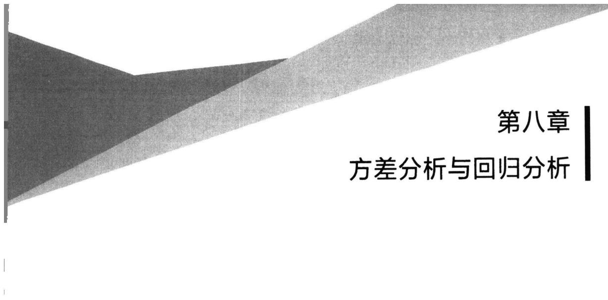

