## §8.1方差分析

## 8.1.1问题的提出

前面几章我们讨论的都是一个总体或两个总体的统计分析问题，在实际工作中我们还会经常碰到多个总体均值的比较问题，处理这类问题通常采用所谓的方差分析方法.本节将叙述这个方法，先看一个例子.

例8.1.1在饲料养鸡增肥的研究中，某研究所提出三种饲料配方：A，是以鱼粉为 $\ d _ { ; A _ { 1 } }$ 主的饲料，A是以槐米粉为主的饲料，A是以苜蓿粉为主的饲料.为比较三种饲料的效 ${ } , A _ { 2 }$ $A _ { 3 }$ 果，特选24只相似的雏鸡随机均分为三组，每组各喂一种饲料，60天后观察它们的质量.试验结果如表8.1.1所示：

表8.1.1鸡饲料试验数据  
单位：g
<table><tr><td>饲料A</td><td colspan="7">鸡的质量</td></tr><tr><td> $A _ { 1 }$ </td><td>1073 1009</td><td>1060</td><td>1001</td><td>1002</td><td>1012</td><td>1009</td><td>1028</td></tr><tr><td> $A _ { 2 }$ </td><td>1107 1092</td><td>990</td><td>1109</td><td>1090</td><td>1074</td><td>1122</td><td>1001</td></tr><tr><td> $A _ { 3 }$ </td><td>1093 1029</td><td>1080</td><td>1021</td><td>1022</td><td>1032</td><td>1029</td><td>1048</td></tr></table>

本例中，我们要比较的是三种饲料对鸡的增肥作用是否相同.为此，把饲料称为因子，记为A，三种不同的配方称为因子A的三个水平，记为 $A _ { 1 } , A _ { 2 } , A _ { 3 }$ ，使用配方 $A _ { i }$ 下第j只鸡60天后的质量用 $\boldsymbol { \mathscr { y } } _ { i j }$ 表示， $i = 1 , 2 , 3 , j = 1 , 2 , \cdots , 8 .$ 我们的目的是比较三种饲料配方下鸡的平均质量是否相等，为此，需要做一些基本假定，把所研究的问题归结为一个统计问题,然后用方差分析的方法进行分析.若相等，可任选一种饲料，特别可选廉价饲料；若不等，应选增肥效果好的饲料.

## 8.1.2单因子方差分析的统计模型

在例8.1.1中我们只考察了一个因子，称其为单因子试验.通常，在单因子试验中，记因子为A，设其有r个水平，记为 $A _ { 1 } , A _ { 2 } , \cdots , A ,$ ，在每一水平下考察的指标可以看成一

个总体,现有r个水平，故有r个总体，假定：

（1）每一总体均为正态总体，记为 $N ( \pmb { \mu } _ { i } , \pmb { \sigma } _ { i } ^ { 2 } ) , i = 1 , 2 , \cdots , r .$

（2）各总体的方差相同，记为 $\sigma _ { 1 } ^ { 2 } = \sigma _ { 2 } ^ { 2 } = \cdots = \sigma _ { , } ^ { 2 } = \sigma ^ { 2 }$

（3）从每一总体中抽取的样本是相互独立的,即所有的试验结果 $\boldsymbol { y } _ { i j }$ 都相互独立.

这三个假定都可以用统计方法进行验证.譬如，利用正态性检验（87.5节）验证（1)成立，利用后面&8.3的方差齐性检验验证(2)成立，而试验结果yi的独立性可由 $\boldsymbol { y } _ { i j }$ 随机化实现，这里的随机化是指所有试验按随机次序进行.

我们要做的工作是比较各水平下的均值是否相同，即要对如下的一个假设进行检验：

$$
H _ { 0 } : \mu _ { 1 } = \mu _ { 2 } = \cdots = \mu _ { r } ,\tag{8.1.1}
$$

其备择假设为

$H _ { 1 } : \mu _ { 1 } , \mu _ { 2 } , \cdots , \mu ,$ 不全相等，

在不会引起误解的情况下， $H _ { \mathfrak { r } }$ 通常可省略不写.

如果H。成立，因子A的r个水平均值相同，称因子A的r个水平间没有显著差异， $H _ { \mathfrak { o } }$ 简称因子A不显著；反之，当 $H _ { \mathfrak { o } }$ 不成立时,因子A的r个水平均值不全相同，这时称因子A的不同水平间有显著差异,简称因子A显著.

为对假设(8.1.1)进行检验,需要从每一水平下的总体抽取样本,设从第i个水平下的总体获得m个试验结果（简单起见，这里先假设各水平下试验的重复数相同，后面会看到，重复数不同时的处理方法与此基本一致，略有差异），用yi表示第i个总体的 $\boldsymbol { y } _ { i j }$ 第j次重复试验结果,共得如下 $r { \times } m$ 个试验结果：

$$
y _ { i j } , \quad i = 1 , 2 , \cdots , r , \quad j = 1 , 2 , \cdots , m ,
$$

其中r为水平数,m为重复数,i为水平编号 $, j$ 为重复序号.

水平 $A _ { i }$ 下的试验结果 $\boldsymbol { \mathscr { y } } _ { i j }$ 与该水平下的指标均值 $\mu _ { i }$ 总是有差距的，记 $\pmb { \varepsilon } _ { i j } = y _ { i j } - \pmb { \mu } _ { i } , \pmb { \varepsilon } _ { i j }$ 称为随机误差.于是有

$$
y _ { i j } = \mu _ { i } + \varepsilon _ { i j } .\tag{8.1.2}
$$

(8.1.2)式称为试验结果yi的数据结构式.把三个假定用于数据结构式就可以写出 $\boldsymbol { \mathscr { y } } _ { i j }$ 单因子方差分析的统计模型：

$$
\left\{ \begin{array} { l } { { \gamma _ { i j } = \mu _ { i } + \varepsilon _ { i j } , \quad i = 1 , 2 , \cdots , r , \quad j = 1 , 2 , \cdots , m , } } \\ { { \qquad \mathrm { i } \not \equiv \varepsilon _ { i j } \not \equiv \not \equiv \not \equiv \not \equiv \not \equiv \not \equiv \not \equiv \not \equiv \not \equiv \not \equiv \not \equiv \not \equiv \not \equiv \not \equiv \not \equiv \not \equiv \not . } } \\ { { \qquad \mathrm { i } \not \equiv \not \equiv \not \varepsilon _ { i j } \not \equiv \not \equiv \not { \equiv } \not { \equiv } \not { \equiv } \not { \equiv } } , } \end{array} \right.\tag{8.1.3}
$$

为了能更好地描述数据，常在方差分析中引入总均值与水平效应的概念.诸μ：的 $\mu _ { i }$ 平均（所有试验结果的均值的平均）

$$
\mu = \frac { 1 } { r } ( \mu _ { 1 } + \mu _ { 2 } + \cdots + \mu _ { r } ) = \frac { 1 } { r } \sum _ { i = 1 } ^ { r } \mu _ { i }\tag{8.1.4}
$$

称为总均值，也称一般平均.第i个水平下的均值μ：与总均值μ的差 $\mu _ { i }$ $\mu$

$$
a _ { i } { \mathrm { \Omega } } = \mu _ { i } { \mathrm { \Omega } } - \mu { \mathrm { , } } \quad i { \mathrm { \Omega } } = 1 { \mathrm { , } } 2 { \mathrm { , } } \cdots { } , r\tag{8.1.5}
$$

称为因子A的第i个水平的主效应,简称为 $A _ { i }$ 的水平效应.

容易看出

$$
\sum _ { i = 1 } ^ { r } a _ { i } = 0 ,\tag{8.1.6}
$$

$$
\mu _ { i } = \mu + a _ { i } ,\tag{8.1.7}
$$

这表明第i个总体的均值是由总均值与该水平的效应叠加而成的，从而模型（8.1.3）可以改写为

$$
\left\{ \begin{array} { l l } { \gamma _ { i j } = \mu + a _ { i } + \varepsilon _ { i j } , \qquad i = 1 , 2 , \cdots , r , j = 1 , 2 , \cdots , m , } \\ { \gamma } \\ { \displaystyle \sum _ { i = 1 } ^ { r } a _ { i } = 0 , } \\ { \displaystyle \operatorname* { i d } \varepsilon _ { i j } \neq \mathrm { / L } \mathrm { / L } \mathrm { / L } \mathrm { / L } \mathrm { / L } , \mathrm { E H W } \mathrm { / L } \mathrm { / k } \mathrm { / k } \mathrm { / L } \mathrm { / L } } \end{array} \right.\tag{8.1.8}
$$

假设（8.1.1）可改写为

$$
H _ { 0 } : a _ { 1 } = a _ { 2 } = \cdots = a _ { \scriptscriptstyle r } = 0 ,
$$

其备择假设为

$$
H _ { 1 } : a _ { 1 } , a _ { 2 } , \cdots , a _ { r } \not \equiv \not \exists \ 0 .\tag{8.1.9}
$$

## 8.1.3平方和分解

对两个正态总体均值间有无差异可用t检验，但对三个及以上正态总体均值间有无差异再用t检验就行不通了，费希尔等人另辟思路，改用数据的平方和及其分解导出F分布来进行显著性检验.下面我们介绍这个思想.

## 一、试验数据

通常在单因子方差分析中可将试验数据列成如下表格形式.

表8.1.2单因子方差分析试验数据
<table><tr><td>因子水平</td><td>试验数据</td><td>和</td><td>均值</td></tr><tr><td> $A _ { i }$ </td><td> $y _ { 1 2 }$   $\cdots$   $\boldsymbol { y } _ { 1 m }$   $\boldsymbol { y } _ { 1 1 }$ </td><td> $T _ { r }$ </td><td> ${ \overline { { y } } } _ { 1 } .$ </td></tr><tr><td> $A _ { 2 }$ </td><td> $\boldsymbol { y } _ { 2 m }$   $y _ { 2 1 }$   $y _ { 2 2 }$ </td><td> $T _ { \scriptscriptstyle 2 }$ </td><td> $y _ { 2 } .$ </td></tr><tr><td></td><td></td><td>·</td><td>·</td></tr><tr><td></td><td></td><td> $T ,$ </td><td> ${ \bar { y } } _ { r } .$ </td></tr><tr><td> $A _ { r }$ </td><td> $y _ { r m }$   $y _ { r 1 }$   $y _ { r 2 }$ </td><td> $\boldsymbol { \mathsf { \Pi } } ^ { T }$ </td><td> $\overline { { y } }$ </td></tr></table>

表8.1.2中的最后两列的和与均值的含义如下：

$$
\begin{array} { l } { \displaystyle T _ { i } = \sum _ { j = 1 } ^ { m } y _ { i j } , \quad \mathrm { ~ } \overline { { y } } _ { i \cdot } = \frac { T _ { i } } { m } , \qquad i = 1 , 2 , \cdots , r , } \\ { \displaystyle T = \sum _ { i = 1 } ^ { r } T _ { i } , \quad \overline { { y } } = \frac { T } { r \cdot m } = \frac { T } { n } , } \\ { \displaystyle n = r \cdot m = \frac { y _ { i } ^ { 2 } } { \nu ^ { 3 } } \frac { \partial \overline { { x } } } { \partial x ^ { 2 } } \frac { \partial \overline { { x } } } { \partial y } \frac { \partial \overline { { x } } } { \partial x } . } \end{array}
$$

## 二、组内偏差与组间偏差

数据间是有差异的.数据 $\boldsymbol { y } _ { i j }$ 与总均值 $\bar { y }$ 间的偏差可用 $y _ { i j } - \overline { { y } }$ 表示，它可分解为两个偏差之和

$$
y _ { i j } - \overline { { y } } = \big ( y _ { i j } - \overline { { y } } _ { i \cdot } \big ) + \big ( \overline { { y } } _ { i \cdot } - \overline { { y } } \big ) .\tag{8.1.10}
$$

记

$$
\overline { { \varepsilon } } _ { i \cdot } \ = \frac { 1 } { m } \sum _ { j = 1 } ^ { m } \varepsilon _ { i j } \ , \overline { { \varepsilon } } = \frac { 1 } { r } \sum _ { i = 1 } ^ { r } \ \overline { { \varepsilon } } _ { i \cdot } \ = \frac { 1 } { n } \sum _ { i = 1 } ^ { r } \ \sum _ { j = 1 } ^ { m } \varepsilon _ { i j } .
$$

由于

$$
y _ { i j } - \overline { { y } } _ { i \cdot } = ( \mu _ { i } + \varepsilon _ { i j } ) - ( \mu _ { i } + \overline { { \varepsilon } } _ { i \cdot } ) = \varepsilon _ { i j } - \overline { { \varepsilon } } _ { i \cdot } ,\tag{8.1.11}
$$

所以 $\boldsymbol { y } _ { i j } - \overline { { \boldsymbol { y } } } _ { i }$ .仅反映组内数据与组内均值的随机误差，称为组内偏差.而

$$
\overline { { { y } } } _ { i \cdot } - \overline { { { y } } } = ( \mu _ { i } + \overline { { { \varepsilon } } } _ { i \cdot } ) - ( \mu + \overline { { { \varepsilon } } } ) = a _ { i } + \overline { { { \varepsilon } } } _ { i \cdot } - \overline { { { \varepsilon } } } ,\tag{8.1.12}
$$

$\overline { { \boldsymbol { y } } } _ { i }$ .-y除了反映随机误差外,还反映了第i个水平效应,称为组间偏差.

## 三、偏差平方和及其自由度

在统计学中，把k个数据 $y _ { 1 } , y _ { 2 } , \cdots , y _ { k }$ 分别对其均值 ${ \overline { { y } } } = { \left( { { y } _ { 1 } } + { { y } _ { 2 } } + \cdots + { { y } _ { k } } \right) }$ /的偏差平方和

$$
Q = ( y _ { 1 } - { \overline { { y } } } ) ^ { 2 } + ( y _ { 2 } - { \overline { { y } } } ) ^ { 2 } + \cdots + ( y _ { k } - { \overline { { y } } } ) ^ { 2 } = \sum _ { i = 1 } ^ { k } ( y _ { i } - { \overline { { y } } } ) ^ { 2 }
$$

称为k个数据的偏差平方和，有时简称平方和.偏差平方和常用来度量若干个数据分散的程度，它是用来度量若干个数据间差异(即波动)的大小的一个重要的统计量.

在构成偏差平方和 $Q$ 的k个偏差 $y _ { 1 } - \overline { { y } } , y _ { 2 } - \overline { { y } } , \cdots , y _ { k } - \overline { { y } }$ 间有一个恒等式

$$
\sum _ { i \ : = 1 } ^ { k } { \ : \big ( } y _ { i } \ : - \ : { \bar { y } } { \big ) } = 0 ,
$$

这说明在Q中独立的偏差只有k-1个.在统计学中把平方和中独立偏差个数称为该平方和的自由度，常记为f,如 $Q$ 的自由度为 $f _ { Q } = k - 1$ .自由度是偏差平方和的一个重要参数.

## 四、总平方和分解公式

各 $\boldsymbol { \mathcal { Y } } _ { i j }$ 间总的差异大小可用总偏差平方和 $S _ { \tau }$ 表示

$$
S _ { \tau } = \sum _ { i = 1 } ^ { r } \sum _ { j = 1 } ^ { m } \big ( y _ { i j } - \overline { { y } } \big ) ^ { 2 } , \quad f _ { \tau } = n - 1 ,\tag{8.1.13}
$$

仅由随机误差引起的数据间的差异可以用组内偏差平方和表示，也称为误差偏差平方和，记为 $S _ { e }$ ,即

$$
S _ { e } = \sum _ { i = 1 } ^ { r } \sum _ { j = 1 } ^ { m } \big ( y _ { i j } - \overline { { y } } _ { i \cdot } \big ) ^ { 2 } , \quad f _ { e } = r \big ( m - 1 \big ) = n - r .\tag{8.1.14}
$$

由于组间差异除了随机误差外，还反映了效应间的差异，故效应不同引起的数据差异可用组间偏差平方和表示，也称为因子A的偏差平方和，记为 $S _ { \ / A }$ ,即

$$
S _ { \it 4 } = m \sum _ { i = 1 } ^ { r } \big ( \overline { { y } } _ { i \cdot } - \overline { { y } } \big ) ^ { 2 } , \quad f _ { \it A } = r - 1 .\tag{8.1.15}
$$

定理8.1.1 在上述符号下，总平方和 $S _ { r }$ 可以分解为因子平方和 $S _ { \scriptscriptstyle A }$ 与误差平方和$S _ { e }$ 之和，其自由度也有相应分解公式，具体为

$$
S _ { \tau } = S _ { \scriptscriptstyle A } + S _ { e } , \quad f _ { \tau } = f _ { \scriptscriptstyle A } + f _ { e } ,\tag{8.1.16}
$$

(8.1.16)式通常称为总平方和分解式.

证明注意到

$$
\sum _ { i = 1 } ^ { r } \sum _ { j = 1 } ^ { m } \left( y _ { i j } - { \overline { { y } } } _ { i \cdot } \right) ( { \overline { { y } } } _ { i \cdot } - { \overline { { y } } } ) = \sum _ { i = 1 } ^ { r } \left[ ( { \overline { { y } } } _ { i \cdot } - { \overline { { y } } } ) \sum _ { j = 1 } ^ { m } \left( y _ { i j } - { \overline { { y } } } _ { i \cdot } \right) \right] = 0 ,
$$

故有

$$
\begin{array} { c } { { S _ { \tau } = \displaystyle \sum _ { i = 1 } ^ { r } \displaystyle \sum _ { j = 1 } ^ { m } \left( y _ { i j } - \overline { { y } } \right) ^ { 2 } = \displaystyle \sum _ { i = 1 } ^ { r } \displaystyle \sum _ { j = 1 } ^ { m } \left[ \left( y _ { i j } - \overline { { y } } _ { i \cdot } \right) + \left( \overline { { y } } _ { i \cdot } - \overline { { y } } \right) \right] ^ { 2 } } } \\ { { = S _ { \epsilon } + S _ { A } + 2 \displaystyle \sum _ { i = 1 } ^ { r } \displaystyle \sum _ { j = 1 } ^ { m } \left( y _ { i j } - \overline { { y } } _ { i \cdot } \right) \left( \overline { { y } } _ { i \cdot } - \overline { { y } } \right) = S _ { \epsilon } + S _ { A } , } } \end{array}
$$

诸自由度间的等式是显然的.

## 8.1.4检验方法

偏差平方和Q的大小与数据个数(或自由度)有关，一般说来，数据越多，其偏差平方和越大.为了便于在诸偏差平方和间进行比较，统计上引入了均方的概念，它定义为

$$
M S = { \frac { Q } { f _ { Q } } } ,
$$

其意为平均每个自由度上有多少平方和.

如今要对因子平方和 $S _ { \scriptscriptstyle A }$ 与误差平方和 $S _ { e }$ 进行比较，用其均方

$$
M S _ { _ A } = { \frac { S _ { _ A } } { f _ { _ A } } } , \quad M S _ { _ e } = { \frac { S _ { e } } { f _ { e } } }
$$

进行比较更为合理，因为均方排除了自由度不同所产生的干扰.故用

$$
F = { \frac { M S _ { _ A } } { M S _ { _ c } } } = { \frac { S _ { _ A } / f _ { _ A } } { S _ { _ c } / f _ { _ c } } }\tag{8.1.17}
$$

作为检验 $H _ { \mathfrak { o } }$ 的统计量，为给出检验拒绝域，我们需要如下定理：

定理8.1.2在单因子方差分析模型(8.1.8)及前述符号下，有

(1） $S _ { e } / \sigma ^ { 2 } \sim \chi ^ { 2 } ( n - r )$ ，从而 $E ( S _ { e } ) = \left( n - r \right) \sigma ^ { 2 }$

(2) $E ( S _ { \cal A } ) = \left( r - 1 \right) \sigma ^ { 2 } + m \sum _ { i = 1 } ^ { r } a _ { i } ^ { 2 }$ ，进一步，若 $H _ { \mathfrak { o } }$ 成立，则有 $S _ { A } / \sigma ^ { 2 } \sim \chi ^ { 2 } ( r - 1 )$

(3） $S _ { \ / s }$ 与 $S _ { e }$ 独立.

证明由（8.1.11）式和（8.1.14）式， $S _ { \epsilon } = \sum _ { i = 1 } ^ { r } \sum _ { j = 1 } ^ { m } \big ( \pmb { \varepsilon } _ { i j } - \overline { { \pmb { \varepsilon } } } _ { i \cdot } \big ) ^ { 2 }$ ,在单因子方差分析模型(8.1.8）下,我们知道,诸 $\pmb { \varepsilon } _ { i j } ( i = \ 1 , 2 , \cdots , r , j = \ 1 , 2 , \cdots , m )$ 独立同分布于 $N ( 0 , \sigma ^ { 2 } )$ ，由定理5.4.1知 $, \frac { 1 } { \sigma ^ { 2 } } \sum _ { j = 1 } ^ { m } \big ( \pmb { \varepsilon } _ { i j } - \overline { { \pmb { \varepsilon } } } _ { i \cdot } \big ) ^ { 2 } \big ( i = 1 , 2 , \cdots , r \big )$ 相互独立，其共同分布为 $\chi ^ { 2 } ( m - 1 )$ ，由 $\chi ^ { 2 }$ 分布的可加性，有 $\frac { S _ { e } } { \sigma ^ { 2 } } { \sim } \chi ^ { 2 } ( n { - } r )$ ，这给出 $E ( S _ { e } / \sigma ^ { 2 } ) = n - r = f _ { e }$ ，(1)得证.

类似地，由(8.1.12)式和(8.1.15)式，有

$$
S _ { \lambda } = m \sum _ { i = 1 } ^ { r } \big ( a _ { i } + \overline { { \varepsilon } } _ { i \cdot } - \overline { { \varepsilon } } \big ) ^ { 2 } .
$$

由定理5.4.1知，对每个i,平方和 $\sum _ { j = 1 } ^ { m } \big ( \pmb { \varepsilon } _ { i j } - \overline { { \pmb { \varepsilon } } } _ { i \cdot } \big ) ^ { 2 }$ 与均值 $\overline { { \pmb { \varepsilon } } } _ { i \cdot }$ 独立，从而 $\overline { { \pmb { \varepsilon } } } _ { 1 \cdot } , \overline { { \pmb { \varepsilon } } } _ { 2 \cdot } , \cdots , \overline { { \pmb { \varepsilon } } } ,$ 与 $S _ { e }$ 独立，而 $S _ { \ / _ { A } }$ 只是 $\overline { { \pmb { \mathscr { E } } } } _ { 1 } . \mathrm { ~ , ~ } \overline { { \pmb { \mathscr { E } } } } _ { 2 } . \mathrm { ~ , ~ } ^ { \cdots } , \overline { { \pmb { \mathscr { E } } } } ,$ .的函数，由此(3)得证.

在模型(8.1.8)下,S的期望是

$$
E ( S _ { \cal A } ) = m \sum _ { i = 1 } ^ { r } a _ { i } ^ { 2 } + E \left[ m \sum _ { i = 1 } ^ { r } ( \overline { { { \varepsilon } } } _ { i \cdot } - \overline { { { \varepsilon } } } ) ^ { 2 } \right] ,
$$

由于诸误差均值 $\overline { { \pmb { \mathscr { E } } } } _ { 1 } . , \overline { { \pmb { \mathscr { E } } } } _ { 2 } . , \cdots , \overline { { \pmb { \mathscr { E } } } } ,$ .独立同分布于 $N ( 0 , \sigma ^ { 2 } / m )$ ，从而由诸误差均值组成的偏差平方和除以 $\sigma ^ { 2 } / m$ 服从 $\chi ^ { 2 }$ 分布，即

$$
\frac { 1 } { \sigma ^ { 2 } } \sum _ { i = 1 } ^ { r } m ( \overline { { \varepsilon } } _ { i \cdot } - \overline { { \varepsilon } } ) ^ { 2 } \ \sim \chi ^ { 2 } ( r - 1 ) ,
$$

于是

$$
E \Big [ \sum _ { i = 1 } ^ { r } m \big ( \overline { { \pmb { \varepsilon } } } _ { i \cdot } - \overline { { \pmb { \varepsilon } } } \big ) ^ { 2 } \Big ] = \big ( r - 1 \big ) \pmb { \sigma } ^ { 2 } .
$$

在 $H _ { 0 }$ 成立下 $S _ { A } / \sigma ^ { 2 } \sim \chi ^ { 2 } ( r - 1 )$ ，这就完成了(2)的证明.

由定理8.1.2知，若 $H _ { \mathfrak { o } }$ 成立，则(8.1.17)定义的检验统计量F服从自由度为 $f _ { A }$ 和$f _ { e }$ 的F分布，考虑到统计量F的值愈大愈倾向于拒绝原假设,故该检验的拒绝域为

$$
\begin{array} { r } { W = \left\{ \varsigma F \geqslant F _ { 1 - \alpha } ( f _ { A } , f _ { e } ) \right\} . } \end{array}\tag{8.1.18}
$$

通常将上述计算过程列成一张表格，称为方差分析表，见表8.1.3.

表8.1.3单因子方差分析表
<table><tr><td>来源</td><td>平方和</td><td>自由度</td><td>均方</td><td>F比</td><td>p值</td></tr><tr><td>因子</td><td> $S _ { \ A }$ </td><td> $f _ { A } = r - 1$ </td><td> $M S _ { _ A } { = } S _ { _ A } / f _ { _ A }$ </td><td> $F = M S _ { _ A } / M S _ { _ c }$ </td><td>P</td></tr><tr><td>误差</td><td> $s _ { e }$ </td><td> $f _ { e } = n - r$ </td><td> $M S _ { e } = S _ { e } / f _ { e }$ </td><td></td><td></td></tr><tr><td>总和</td><td> $S _ { \tau }$ </td><td> $f _ { \tau } = n - 1$ </td><td></td><td></td><td></td></tr></table>

对给定的α，可作如下判断：

·如果 $F \geqslant F _ { _ { 1 - \alpha } } ( f _ { _ { A } } , f _ { _ { e } } )$ ,则认为因子A显著.

·若 $F { < } F _ { _ { 1 - \alpha } } ( f _ { _ { A } } , f _ { _ { e } } )$ ,则说明因子A不显著.

该检验的p值也可利用统计软件求出，若以Y记服从 $F ( f _ { A } , f _ { e } )$ 的随机变量，则检验的 $p$ 值为 $p = P \left( \ Y \geqslant F \right)$ .利用 $p$ 值进行判断与第七章相同.

经过简单推导，可以给出常用的各偏差平方和的计算公式如下：

$$
\begin{array} { l } { S _ { T } = \displaystyle \sum _ { i = 1 } ^ { r } \sum _ { j = 1 } ^ { m } y _ { i j } ^ { 2 } - \frac { T ^ { 2 } } { n } , } \\ { S _ { A } = \displaystyle \frac { 1 } { m } \sum _ { i = 1 } ^ { r } T _ { i } ^ { 2 } - \frac { T ^ { 2 } } { n } , } \\ { S _ { e } = S _ { T } - S _ { A } . } \end{array}\tag{8.1.19}
$$

一般可将计算过程列表进行，见下例.

例8.1.2采用例8.1.1的数据，由偏差平方和的公式可以看出，对数据作一个线性变换是不影响方差分析的结果的，本例中，我们将原始数据同时减去1000，并用列表（如表8.1.4)的办法给出计算过程：

表8.1.4鸡饲料试验数据及计算表
<table><tr><td>水平</td><td></td><td></td><td>数据（原始数据-1000）</td><td></td><td></td><td></td><td></td><td></td><td> $T _ { _ i }$ </td><td> $T _ { _ i } ^ { 2 }$ </td><td> $\sum _ { j \ = \ 1 } ^ { m } { y _ { i j } ^ { 2 } }$ </td></tr><tr><td> $A _ { \parallel }$ </td><td>73</td><td>9</td><td>60</td><td>1</td><td>2</td><td>12</td><td>9</td><td>28</td><td>194</td><td>37 636</td><td>10024</td></tr><tr><td> $A _ { 2 }$ </td><td>107</td><td>92</td><td>-10</td><td>109</td><td>90</td><td>74</td><td>122</td><td>1</td><td>585</td><td>342225</td><td>60355</td></tr><tr><td> $A _ { 3 }$ </td><td>93</td><td>29</td><td>80</td><td>21</td><td>22</td><td>32</td><td>29</td><td>48</td><td>354</td><td>125316</td><td>20984</td></tr><tr><td>和</td><td></td><td></td><td></td><td></td><td></td><td></td><td></td><td></td><td>1133</td><td>505177</td><td>91363</td></tr></table>

利用（8.1.19），可算得各偏差平方和为：

$$
\begin{array} { l l } { { S _ { \tau } = 9 1 \ 3 6 3 \ - \ \frac { 1 \ 1 3 3 ^ { 2 } } { 2 4 } = 3 7 \ 8 7 5 . 9 6 , } } & { { f _ { \tau } = 2 4 \ - \ 1 = 2 3 , } } \\ { { } } & { { } } \\ { { S _ { \scriptscriptstyle A } = \frac { 5 0 5 \ 1 7 7 } { 8 } \ - \ \frac { 1 \ 1 \ 3 3 ^ { 2 } } { 2 4 } = 9 \ 6 6 0 . 0 8 , } } & { { f _ { \scriptscriptstyle A } = 3 \ - \ 1 \ = 2 , } } \\ { { } } & { { } } \\ { { S _ { \scriptscriptstyle c } = S _ { \scriptscriptstyle T } \ - S _ { \scriptscriptstyle A } = 3 7 \ 8 7 5 . 9 6 \ - \ 9 \ 6 6 0 . 0 8 = 2 8 \ 2 1 5 . 8 8 , } } & { { f _ { \scriptscriptstyle e } = 3 \left( 8 \ - \ 1 \right) = 2 1 . } } \end{array}
$$

把上述诸平方和及其自由度填入方差分析表，并继续计算得到各均方以及F比， ${ } _ { p }$ 值，见表8.1.5.

表8.1.5·鸡饲料试验的方差分析表
<table><tr><td>来源</td><td>平方和</td><td>自由度</td><td>均方</td><td>F比</td><td> $p$  值</td></tr><tr><td>因子A</td><td>9 660.08</td><td>2</td><td>4830.04</td><td>3.59</td><td>0.0456</td></tr><tr><td>误差e</td><td>28 215.88</td><td>21</td><td>1 343.61</td><td></td><td></td></tr><tr><td>总和T</td><td>37 875.96</td><td>23</td><td></td><td></td><td></td></tr></table>

若取 $\alpha = 0 . 0 5$ ，则 $F _ { _ { 0 . 9 5 } } ( 2 , 2 1 ) = 3 . 4 7$ ，由于 $F = 3 . 5 9 > 3 . 4 7$ ，故认为因子A（饲料）是显著的，即三种饲料对鸡的增肥作用有明显的差别.

本例中 $p$ 值为0.0456，由于 $p$ 值小于 $\pmb { \alpha }$ ,故拒绝原假设.

## 8.1.5参数估计

在检验结果为显著时，我们可进一步求出总均值 $\mu$ 、各水平效应 $a _ { i }$ 和误差方差 $\sigma ^ { 2 }$ 的估计.

## 一、点估计

由模型（8.1.8）知诸 $\boldsymbol { y } _ { i j }$ 相互独立，且 ${ \boldsymbol { y } } _ { i j } \sim N ( \mu + a _ { i } , \sigma ^ { 2 } )$ ，因此，可使用最大似然方法求出总均值 $\mu$ 、各水平效应 $a _ { i }$ 和误差方差 $\sigma ^ { 2 }$ 的估计.

首先，写出似然函数

$$
L ( \mu , a _ { 1 } , a _ { 2 } , \cdots , a _ { r } , \sigma ^ { 2 } ) = \prod _ { i = 1 } ^ { r } \prod _ { j = 1 } ^ { m } \left\{ \frac { 1 } { \sqrt { 2 \pi \sigma ^ { 2 } } } \mathrm { e x p } \Bigg \{ - \frac { ( \gamma _ { i j } - \mu - a _ { i } ) ^ { 2 } } { 2 \sigma ^ { 2 } } \Bigg \} \right\} ,
$$

其对数似然函数为

$$
l ( \mu , a _ { 1 } , a _ { 2 } , \cdots , a _ { r } , \sigma ^ { 2 } ) = - \frac { n } { 2 } \mathrm { l n } ( 2 \pi \sigma ^ { 2 } ) - \frac { 1 } { 2 \sigma ^ { 2 } } { \sum _ { i = 1 } ^ { r } \sum _ { j = 1 } ^ { n } \left( \gamma _ { i j } - \mu - a _ { i } \right) ^ { 2 } } ,
$$

求偏导，得似然方程为

$$
\left\{ \begin{array} { l } { \displaystyle \frac { \partial l } { \partial \mu } = \frac { 1 } { \sigma ^ { 2 } } \sum _ { i = 1 } ^ { r } \sum _ { j = 1 } ^ { m } \left( y _ { i j } - \mu - a _ { i } \right) = 0 , } \\ { \displaystyle \frac { \partial l } { \partial a _ { i } } = \frac { 1 } { \sigma ^ { 2 } } \sum _ { j = 1 } ^ { m } \left( y _ { i j } - \mu - a _ { i } \right) = 0 , \quad i = 1 , 2 , \cdots , r , } \\ { \displaystyle \frac { \partial l } { \partial \sigma ^ { 2 } } = - \frac { n } { 2 \sigma ^ { 2 } } + \frac { 1 } { 2 \sigma ^ { 4 } } \sum _ { i = 1 } ^ { r } \sum _ { j = 1 } ^ { m } \left( y _ { i j } - \mu - a _ { i } \right) ^ { 2 } = 0 . } \end{array} \right.
$$

考虑到约束条件(8.1.6)，可求出前述各参数的最大似然估计为

$$
\begin{array} { l } { { \displaystyle { \hat { \mu } } = \overline { { { y } } } \mathrm { , } } } \\ { { \displaystyle { \hat { a } } _ { i } = \overline { { { y } } } _ { i \mathrm { . } } - \overline { { { y } } } \mathrm { , } \quad i = 1 , 2 , \cdots , r \mathrm { , } } } \\ { { \displaystyle { \hat { \sigma } } _ { M } ^ { 2 } = \frac { 1 } { n } \sum _ { i = 1 } ^ { r } \sum _ { j = 1 } ^ { m } \big ( y _ { i j } - \overline { { { y } } } _ { i \mathrm { . } } \big ) ^ { 2 } = \frac { S _ { e } } { n } } . }  \end{array}\tag{8.1.20}
$$

由最大似然估计的不变性，各水平均值 $\mu _ { i }$ 的最大似然估计为

$$
\hat { \mu } _ { i } = \overline { { y } } _ { i \cdot } ,\tag{8.1.21}
$$

由于 $\cdot \hat { \sigma } _ { _ { M } } ^ { 2 }$ 不是 $\sigma ^ { 2 }$ 的无偏估计，实用中通常采用如下误差方差的无偏估计

$$
{ \hat { \sigma } } ^ { 2 } = M S _ { e } .\tag{8.1.22}
$$

## 二、置信区间

以下讨论各水平均值 $\pmb { \mu } _ { i }$ 的置信区间.由定理8.1.2知 $\mathcal { \overline { { Y } } } _ { i } . \sim N ( \mu _ { i } , \sigma ^ { 2 } / m ) , S _ { e } / \sigma ^ { 2 } \sim$ $\chi ^ { 2 } ( f _ { e } )$ ,且两者独立，故

$$
\frac { \sqrt { m } ( \bar { y } _ { i \cdot } - \mu _ { i } ) } { \sqrt { S _ { e } / f _ { e } } } \sim t ( f _ { e } ) ,
$$

由此给出 $A _ { i }$ 的水平均值 $\pmb { \mu } _ { i }$ 的1-α的置信区间为

$$
\left[ \begin{array} { l } { - } \\ { \mathcal { Y } _ { i \cdot } } \end{array} \pm t _ { 1 - \alpha / 2 } ( f _ { e } ) \hat { \sigma } / \sqrt { m } \right] ,\tag{8.1.23}
$$

其中 ${ \hat { \sigma } } ^ { 2 }$ 由（8.1.22）给出.

例8.1.3我们在例8.1.2中已经检验出饲料因子是显著的，此处我们给出诸水平均值的估计.因子A的三个水平均值的估计分别为

$$
\begin{array} { r l r } { \displaystyle } & { { } } & { \displaystyle \hat { \mu } _ { 1 } = 1 \ 0 0 0 + \frac { 1 9 4 } { 8 } = 1 \ 0 2 4 . 2 5 , } \\ { \displaystyle } & { { } } & { \displaystyle } \\ { \displaystyle } & { { \hat { \mu } _ { 2 } = 1 \ 0 0 0 + \frac { 5 8 5 } { 8 } = 1 \ 0 7 3 . 1 3 , } } \\ { \displaystyle } & { { } } & { \displaystyle } \\ { \displaystyle } & { { \hat { \mu } _ { 3 } = 1 \ 0 0 0 + \frac { 3 5 4 } { 8 } = 1 \ 0 4 4 . 2 5 , } } \end{array}
$$

从点估计来看，水平 $A _ { 2 }$ （以槐米粉为主的饲料)是最优的.误差方差的无偏估计为

$$
\hat { \sigma } ^ { 2 } = M S _ { \it e } = 1 ~ 3 4 3 . 6 1 .
$$

进一步,利用(8.1.23)可以给出诸水平均值的置信区间.此处， $\widehat { \sigma } = \sqrt { 1 ~ 3 4 3 . 6 1 } = 3 6 . 6 6$ ，若

取 $\alpha = 0 . 0 5$ ，则 $t _ { _ { 1 - \alpha \prime 2 } } ( f _ { \ e _ { e } } ) = t _ { _ { 0 . 9 7 5 } } ( 2 1 ) = 2 . 0 7 9 \ 6 , t _ { _ { 0 . 9 7 5 } } ( 2 1 ) \hat { \sigma } / \sqrt { 8 } = 2 6 . 9 5$ ，于是三个水平均值的0.95置信区间分别为

$$
\mu _ { 1 } : \quad \left[ 1 \ 0 2 4 . 2 5 \ \pm \ : 2 6 . 9 5 \ \right] \ = \ \left[ 9 9 7 . 3 0 \ : , 1 \ 0 5 1 . 2 0 \right] ,
$$

$$
\mu _ { 2 } : \quad \left[ 1 \ 0 7 3 . 1 3 \ \pm 2 6 . 9 5 \right] \ = \ \left[ \ 1 \ 0 4 6 . 1 8 , 1 \ 1 0 0 . 0 8 \right] ,
$$

$$
\mu _ { 3 } : \quad \left[ \ 1 \ 0 4 4 . 2 5 \ \pm 2 6 . 9 5 \ \right] \ = \ \left[ \ 1 \ 0 1 7 . 3 0 , 1 \ 0 7 1 . 2 0 \right] ,
$$

至此，我们可以看到：在单因子试验的数据分析中可得到如下三个结果：

·因子A是否显著.

·试验的误差方差 $\sigma ^ { 2 }$ 的估计.

·诸水平均值 $\pmb { \mu } _ { i }$ 的点估计与区间估计.

在因子A显著时，通常只需对较优的水平均值作参数估计，在因子A不显著场合，参数估计无需进行.

## 8.1.6重复数不等情形

有时，每个水平下重复试验次数不全相等，在此情况下进行方差分析与重复数相等情况下的方差分析极为相似，只在几处略有差别.下面我们指出差异之处.

## 一、数据

设从第i个水平下的总体获得 $m _ { i }$ 个试验结果，记为 $y _ { i 1 } , y _ { i 2 } , \cdots , y _ { i m _ { i } } , i = 1 , 2 , \cdots , r$ ，故总试验次数为 $n = m _ { 1 } + m _ { 2 } + \cdots + m _ { r }$ ,从而，其统计模型为

$$
\left\{ \begin{array} { l } { { \boldsymbol { y } } _ { i j } = { \boldsymbol { \mu } } _ { i } + { \boldsymbol { \varepsilon } } _ { i j } , \quad i = 1 , 2 , \cdots , r , \quad j = 1 , 2 , \cdots , m _ { i } , } \\ { \quad } \\ { \succeq { \boldsymbol { \varepsilon } } _ { i j } \niiint \frac { \chi } { 4 } \ncong \frac { \chi } { 4 } \ncong \mathrm { R } \ X , } \\ { \quad { \boldsymbol { \varepsilon } } _ { i j } \ncong { \boldsymbol { \varepsilon } } _ { i j } \iiint \frac { \chi } { 4 } \ncong \frac { \chi } { 4 } \ncong \mathrm { R } \ X \left( 0 , \sigma ^ { 2 } \right) . } \end{array} \right.\tag{8.1.24}
$$

## 二、总均值

诸 $\mu _ { i }$ 的加权平均（所有试验结果的均值的平均）

$$
\mu = { \frac { 1 } { n } } ( m _ { 1 } \mu _ { 1 } + m _ { 2 } \mu _ { 2 } + \cdots + m _ { \nu } \mu _ { \nu } ) = { \frac { 1 } { n } } \sum _ { i = 1 } ^ { r } m _ { i } \mu _ { i }\tag{8.1.25}
$$

称为总均值，它是所有观测值期望的平均.第i个水平下的均值 $\mu _ { i }$ 与总均值 $\mu$ 的差

$$
a _ { i } = \mu _ { i } - \mu , \quad i = 1 , 2 , \cdots , r\tag{8.1.26}
$$

称为因子A的第i个水平效应.

## 三、效应约束条件

由（8.1.25）和(8.1.26）容易看出关于效应的约束条件为

$$
\begin{array} { c } { { \displaystyle \sum _ { i = 1 } ^ { r } m _ { i } \ a _ { i } = 0 , } } \\ { { \mu _ { i } = \mu + a _ { i } , } } \end{array}
$$

这表明第i个总体的均值是由总均值与该水平的效应叠加而成的.类似于(8.1.8），有

$$
\left\{ \begin{array} { l l } { \boldsymbol { y } _ { i j } = \mu + \boldsymbol { a } _ { i } + \boldsymbol { \varepsilon } _ { i j } , \quad i = 1 , 2 , \cdots , r , j = 1 , 2 , \cdots , m _ { i } , } \\ { \quad } \\ { \displaystyle \sum _ { i = 1 } ^ { r } m _ { i } \boldsymbol { a } _ { i } = 0 , } \end{array} \right.\tag{8.1.27}
$$

诸 $\varepsilon _ { i j }$ 相互独立,且都服从 $N ( 0 , \sigma ^ { 2 } )$

## 四、各平方和的计算

要考虑的问题仍是检验(8.1.9）给出的假设.整个分析思路与方法基本一样，重要的区别是计算公式稍有不同，特别要注意 $S _ { \scriptscriptstyle A }$ 的计算公式.类似地记

$$
T _ { i } = \sum _ { j = 1 } ^ { m _ { i } } \gamma _ { i j } , \quad \quad \bar { \gamma } _ { i \cdot } = \frac { T _ { i } } { m _ { i } } , \nonumber
$$

$$
T = \sum _ { i = 1 } ^ { r } \sum _ { j = 1 } ^ { m _ { i } } y _ { i j } \nonumber = \sum _ { i = 1 } ^ { r } T _ { i } , \overline { { y } } = \frac { T } { n } ,
$$

则

$$
\begin{array} { l l } { { S _ { \tau } = \displaystyle \sum _ { i = 1 } ^ { r } \sum _ { j = 1 } ^ { m _ { i } } \big ( \displaystyle y _ { i j } - \overline { { y } } \big ) ^ { 2 } = \displaystyle \sum _ { i = 1 } ^ { r } \sum _ { j = 1 } ^ { m _ { i } } y _ { i j } ^ { 2 } - \frac { T ^ { 2 } } { n } , } } & { { f _ { \tau } = n - 1 , } } \\ { { \displaystyle S _ { A } = \sum _ { i = 1 } ^ { r } m _ { i } \big ( \overline { { y _ { i \cdot } } } - \overline { { y } } \big ) ^ { 2 } = \sum _ { i = 1 } ^ { r } \frac { T _ { i } ^ { 2 } } { m _ { i } } - \frac { T ^ { 2 } } { n } , } } & { { f _ { A } = r - 1 , } } \\ { { \displaystyle S _ { e } = \sum _ { i = 1 } ^ { r } \sum _ { j = 1 } ^ { m _ { i } } \big ( \displaystyle y _ { i j } - \overline { { y } } _ { i \cdot } \big ) ^ { 2 } = S _ { \tau } - S _ { A } , } } & { { f _ { e } = n - r . } } \end{array}\tag{8.1.28}
$$

方差分析表以及参数估计是一样的.

例8.1.4某食品公司对一种食品设计了四种新包装.为考察哪种包装最受顾客欢迎,选了10个地段繁华程度相似、规模相近的商店做试验，其中两种包装各指定两个商店销售，另两种包装各指定三个商店销售.在试验期内各店货架排放的位置、空间都相同，营业员的促销方法也基本相同，经过一段时间，记录其销售量数据，列于表8.1.6左侧，其相应的计算结果列于右侧.

表8.1.6销售量数据及计算表
<table><tr><td>包装类型</td><td>销售量数据</td><td></td><td> $m _ { i }$ </td><td> $T _ { i }$ </td><td> $T _ { i } ^ { 2 } / m _ { i }$ </td><td> $\sum _ { j \ = \ 1 } ^ { m _ { i } } { y _ { i j } ^ { 2 } }$ </td></tr><tr><td> $A _ { 1 }$ </td><td>12</td><td>18</td><td>2</td><td>30</td><td>450</td><td>468</td></tr><tr><td> $A _ { 2 }$ </td><td>14</td><td>12 13</td><td>3</td><td>39</td><td>507</td><td>509</td></tr><tr><td> $A _ { 3 }$ </td><td>19</td><td>17 21</td><td>3</td><td>57</td><td>1083</td><td>1091</td></tr><tr><td> $A _ { 4 }$ </td><td>24</td><td>30</td><td>2</td><td>54</td><td>1458</td><td>1 476</td></tr><tr><td></td><td>和</td><td></td><td>n=10</td><td>T=180</td><td>W 1 = 3498 mi</td><td>1 M r M 宝 =3544</td></tr></table>

由此可求得各类偏差平方和如 ${ \sf T } \bigg ($ 其中 $\frac { T ^ { 2 } } { n } = \frac { 1 8 0 ^ { 2 } } { 1 0 } = 3 ~ 2 4 0 \ /$

$$
S _ { T } = 3 ~ 5 4 4 - 3 ~ 2 4 0 = 3 0 4 , \quad f _ { T } = 1 0 - 1 = 9 ,
$$

$$
S _ { \scriptscriptstyle A } = 3 ~ 4 9 8 - 3 ~ 2 4 0 = 2 5 8 , ~ f _ { \scriptscriptstyle A } = 4 - 1 = 3 ,
$$

$$
S _ { e } = 3 0 4 - 2 5 8 = 4 6 , f _ { e } = 1 0 - 4 = 6 .
$$

方差分析表如表8.1.7所示.

表8.1.7销售量的方差分析表
<table><tr><td>来源</td><td>平方和</td><td>自由度</td><td>均方</td><td>F比</td><td>p值</td></tr><tr><td>因子A</td><td>258</td><td>3</td><td>86</td><td>11.21</td><td>0.0071</td></tr><tr><td>误差e</td><td>46</td><td>6</td><td>7.67</td><td></td><td></td></tr><tr><td>总和T</td><td>304</td><td>9</td><td></td><td></td><td></td></tr></table>

若取 $\alpha = 0 . 0 1$ ，由于 $p$ 值为0.0071,小于α,故我们可认为各水平间有显著差异.

由于因子显著，我们还可以给出诸水平均值的估计.因子A的四个水平均值的估计分别为

$$
\widehat { \mu } _ { 1 } = 3 0 / 2 = 1 5 , ~ \widehat { \mu } _ { 2 } = 3 9 / 3 = 1 3 ,
$$

$$
\hat { \mu } _ { 3 } = 5 7 / 3 = 1 9 , \hat { \mu } _ { 4 } = 5 4 / 2 = 2 7 ,
$$

由此可见，第四种包装方式效果最好.误差方差的无偏估计为

$$
\hat { \sigma } ^ { 2 } = M S _ { \it e } = 7 . 6 7 .
$$

进一步，利用(8.1.23)也可以给出诸水平均值的置信区间，只是在这里要用不同的 $m _ { i }$ 代替那里相同的m.此处， $\hat { \sigma } = \sqrt { 7 . 6 7 } = 2 . 7 6 9 \ 5$ ,若取 $\alpha = 0 . 0 5$ ，则 $t _ { _ { 1 - \alpha / 2 } } ( f _ { e } ) = t _ { _ { 0 . 9 7 5 } } ( 6 ) =$ $2 . 4 4 6 \ 9 , t _ { 0 . 9 7 5 } ( 6 ) \hat { \sigma } = 6 . 7 7 6 \ 7$ ，于是效果较好的第四个水平均值的0.95置信区间为

$$
\mu _ { 4 } \colon [ 2 7 \pm 6 . 7 7 6 7 / \sqrt { 2 } ] = [ 2 2 . 2 1 , 3 1 . 7 9 ] .
$$

## 习题8.1

1.在一个单因子试验中，因子A有三个水平，每个水平下各重复4次，具体数据如下：

<table><tr><td>水平</td><td colspan="4">数据</td></tr><tr><td>一水平</td><td>8</td><td>5</td><td>7 4</td><td></td></tr><tr><td>二水平</td><td>6</td><td>10</td><td>12</td><td>9</td></tr><tr><td>三水平</td><td>0</td><td>1</td><td>5</td><td>2</td></tr></table>

试计算误差平方和 $S _ { e }$ 因子A的平方和 $S _ { \scriptscriptstyle A }$ 总平方和 $S _ { \tau }$ 并指出它们各自的自由度.

2.在一个单因子试验中，因子A有4个水平，每个水平下重复次数分别为5，7，6，8.那么误差平方和、A的平方和及总平方和的自由度各是多少？

3.在单因子试验中，因子A有4个水平，每个水平下各重复3次试验，现已求得每个水平下试验结果的样本标准差分别为1.5，2.0，1.6，1.2，则其误差平方和为多少？误差的方差 $\sigma ^ { 2 }$ 的估计值是多少？

4.在单因子方差分析中，因子A有三个水平，每个水平各做4次重复试验，请完成下列方差分析表，并在显著性水平 $\alpha = 0 . 0 5$ 下对因子A是否显著作出检验.

方差分析表
<table><tr><td>来源</td><td>平方和</td><td>自由度</td><td>均方</td><td>F比 p值</td></tr><tr><td>因子A</td><td>4.2</td><td></td><td></td><td></td></tr><tr><td>误差e</td><td>2.5</td><td></td><td></td><td></td></tr><tr><td>总和T</td><td>6.7</td><td></td><td></td><td></td></tr></table>

5.用4种安眠药在兔子身上进行试验，特选24只健康的兔子，随机把它们均分为4组，每组各服一种安眠药，安眠时间（单位：h）如下所示.

安眠药试验数据
<table><tr><td>安眠药</td><td colspan="6">安眠时间</td></tr><tr><td> $A _ { \scriptscriptstyle 1 }$ </td><td>6.2</td><td>6.1</td><td>6.0</td><td>6.3</td><td>6.1</td><td>5.9</td></tr><tr><td> $A _ { 2 }$ </td><td>6.3</td><td>6.5</td><td>6.7</td><td>6.6</td><td>7.1</td><td>6.4</td></tr><tr><td> $A _ { 3 }$ </td><td>6.8</td><td>7.1</td><td>6.6</td><td>6.8</td><td>6.9</td><td>6.6</td></tr><tr><td> $A _ { * }$ </td><td>5.4</td><td>6.4</td><td>6.2</td><td>6.3</td><td>6.0</td><td>5.9</td></tr></table>

在显著性水平 $\alpha = 0 . 0 5$ 下对其进行方差分析，可以得到什么结果？

6.为研究咖啡因对人体功能的影响，随机选择30名体质大致相同的健康男大学生进行手指叩击训练，此外咖啡因选三个水平：

$$
A _ { 1 } \ = \ 0 \ \mathrm { m g } , \qquad A _ { 2 } \ = \ 1 0 0 \ \mathrm { m g } , \qquad A _ { 3 } \ = \ 2 0 0 \ \mathrm { m g } .
$$

每个水平下冲泡10杯水，外观无差别，并加以编号，然后让30名大学生每人从中任选一杯服下，2小时后，请每人做手指叩击，统计员记录其每分钟叩击次数，试验结果统计如下表：

<table><tr><td colspan="2">咖啡因剂量</td><td colspan="10">即击次数</td></tr><tr><td>：0mg  $A _ { \parallel }$ </td><td></td><td>242 245</td><td>244</td><td>248</td><td>247</td><td>248</td><td></td><td>242</td><td>244</td><td>246</td><td>242</td></tr><tr><td>100mg  $A _ { 2 } :$ </td><td></td><td>248</td><td>246</td><td>245</td><td>247</td><td>248</td><td>250</td><td>247</td><td>246</td><td>243</td><td>244</td></tr><tr><td>200mg  $A _ { 3 } :$ </td><td></td><td>246</td><td>248</td><td>250</td><td>252</td><td>248</td><td>250</td><td>246</td><td>248</td><td>245</td><td>250</td></tr></table>

请对上述数据进行方差分析，从中可得到什么结论？

7.某粮食加工厂试验三种储藏方法对粮食含水率有无显著影响.现取一批粮食分成若干份，分别用三种不同的方法储藏，过一段时间后测得的含水率（单位：%）如下表：

<table><tr><td>储藏方法</td><td colspan="5">含水率数据</td></tr><tr><td> $A _ { \scriptscriptstyle 1 }$ </td><td>7.3</td><td>8.3</td><td>7.6</td><td>8.4</td><td>8.3</td></tr><tr><td> $A _ { 2 }$ </td><td>5.4</td><td>7.4</td><td>7.1</td><td>6.8</td><td>5.3</td></tr><tr><td> $A _ { 3 }$ </td><td>7.9</td><td>9.5</td><td>10.0</td><td>9.8</td><td>8.4</td></tr></table>

（1）假定各种方法储藏的粮食的含水率服从正态分布，且方差相等，试在 $\alpha = 0 . 0 5$ 下检验这三种方法对含水率有无显著影响；

(2）对每种方法的平均含水率给出置信水平为0.95的置信区间.

8.在入户推销上有五种方法，某大公司想比较这五种方法有无显著的效果差异，设计了一项实

验：从应聘的且无推销经验的人员中随机挑选一部分人，将他们随机地分为五个组，每一组用一种推销方法进行培训，培训相同时间后观察他们在一个月内的推销额（单位：千元），数据如下：

<table><tr><td>组别</td><td colspan="6">推销额</td></tr><tr><td>第一组</td><td>20.0</td><td>16.8</td><td>17.9</td><td>21.2</td><td>23.9</td><td>26.8</td><td>22.4</td></tr><tr><td>第二组</td><td>24.9</td><td>21.3</td><td>22.6</td><td>30.2</td><td>29.9</td><td>22.5</td><td>20.7</td></tr><tr><td>第三组</td><td>16.0</td><td>20.1</td><td>17.3</td><td>20.9</td><td>22.0</td><td>26.8</td><td>20.8</td></tr><tr><td>第四组</td><td>17.5</td><td>18.2</td><td>20.2</td><td>17.7</td><td>19.1</td><td>18.4</td><td>16.5</td></tr><tr><td>第五组</td><td>25.2</td><td>26.2</td><td>26.9</td><td>29.3</td><td>30.4</td><td>29.7</td><td>28.2</td></tr></table>

（1）假定数据满足进行方差分析的假定，对数据进行分析，在 $\alpha = 0 . 0 5$ 下，这五种方法在平均月推销额上有无显著差异？

（2）哪种推销方法的效果最好？试对该种方法一个月的平均推销额求置信水平为0.95的置信区间

## §8.2多重比较

## 8.2.1水平均值差的置信区间

如果方差分析的结果是因子A显著，则等于说有充分理由认为因子A各水平的效应不全相同，但这并不是说它们中一定没有相同的.就指定的一对水平A：与A,我们可 $A _ { j }$ 通过求 $\mu _ { i } - \mu _ { j }$ 的区间估计来进行比较，方法如下：由(8.1.27)式可以推出

$$
\overline { { { y } } } _ { i \cdot } ~ - \overline { { { y } } } _ { j \cdot } ~ \sim ~ N \bigg ( \mu _ { i } ~ - \mu _ { j } , \bigg ( \frac { 1 } { m _ { i } } ~ + \frac { 1 } { m _ { j } } \bigg ) ~ \sigma ^ { 2 } \bigg ) ~ ,
$$

而定理8.1.2指出 $S _ { e } / \sigma ^ { 2 } \ – \chi ^ { 2 } ( f _ { e } )$ ，且两者独立，故

$$
\frac { ( \overline { { y } } _ { i \cdot } - \overline { { y } } _ { j \cdot } ) ~ - ~ ( \mu _ { i } ~ - \mu _ { j } ) } { \sqrt { \left( \frac { 1 } { m _ { i } } + \frac { 1 } { m _ { j } } \right) \frac { S _ { e } } { f _ { e } } } } \sim t ( f _ { e } ) .
$$

由此给出 $\mu _ { i } - \mu _ { j }$ 的置信水平为1-α的置信区间为

$$
\left[ \frac { \ d S } { \ d y _ { i \cdot } } - \frac { \ d S } { \ d y _ { j \cdot } } \pm \sqrt { \left( \frac { \ d S } { \ d m _ { i } } + \frac { \ d S } { \ d m _ { j } } \right) } \hat { \ d \sigma } \cdot \frac { \ d t _ { \hat { \imath } - \frac { \alpha } { 2 } } } { \ d t _ { 1 - \frac { \alpha } { 2 } } } ( f _ { e } ) \right] \ ,\tag{8.2.1}
$$

其中 $\hat { \sigma } ^ { 2 } = S _ { e } / f _ { e }$ 是 $\sigma ^ { 2 }$ 的无偏估计.根据置信区间与双侧假设检验间的对应关系（\$7.2.2)知：(8.2.1)式给出的置信区间就是两正态均值差的检验问题：

$$
H _ { \scriptscriptstyle 0 } : \mu _ { \scriptscriptstyle i } - \mu _ { \scriptscriptstyle j } = 0 \mathrm { \quad ~ v s \quad } H _ { \scriptscriptstyle 1 } : \mu _ { \scriptscriptstyle i } - \mu _ { \scriptscriptstyle j } \ne 0
$$

的接受域W.若该置信区间含有0,则可认为μ：与μ间无显著差异；若该区间不含有0， ${ \overline { { \mathbb { W } } } } .$ $\mu _ { i }$ $\mu _ { j }$ 则认为μ与μ间有显著差异.具体见下面例子. $\mu _ { i }$ $\mu _ { j }$

例8.2.1在例8.1.2中，我们已知饲料因子是显著的，此处 $m _ { 1 } = m _ { 2 } = m _ { 3 } = 8 , f _ { e } = 2 1$

$\widehat { \sigma } = \sqrt { 1 ~ 3 4 3 . 6 1 } = 3 6 . 6 6$ ,若取 $\alpha = 0 . 0 5$ ，则 $t _ { _ { 1 - \alpha / 2 } } \left( f _ { _ { e } } \right) = t _ { _ { 0 . 9 7 5 } } ( 2 1 ) = 2 . 0 7 9 ~ 6 , \sqrt { \frac { 1 } { 8 } + \frac { 1 } { 8 } }$ $t _ { 0 , 9 7 5 } \big ( 2 1 \big ) \hat { \sigma } = 3 8 . 1 2$ ，于是可算出3对均值差的置信区间为

$$
\begin{array} { r l } { \mu _ { \scriptscriptstyle 1 } - \mu _ { \scriptscriptstyle 2 } : } & { { } [ \phantom { - }  - 4 8 . 8 8 \pm 3 8 . 1 2 ] = [ \phantom { - } 8 7 , \phantom { - } - 1 0 . 7 6 ] , } \\ { \mu _ { \scriptscriptstyle 1 } - \mu _ { \scriptscriptstyle 3 } : } & { { } [ \phantom { - } - 2 0 \pm 3 8 . 1 2 ] = [ \phantom { - } 5 8 . 1 2 , 1 8 . 1 2 ] , } \\ { \mu _ { \scriptscriptstyle 2 } - \mu _ { \scriptscriptstyle 3 } : } & { { } [ 2 8 . 8 8 \pm 3 8 . 1 2 ] = [ \phantom { - } - 9 . 2 4 , 6 7 ] . } \end{array}
$$

这三个置信区间中只有 $\mu _ { 1 } - \mu _ { 2 }$ 的置信区间不含有0,故 $\mu _ { \parallel }$ 与 $\mu _ { 2 }$ 间有显著差别,其他 $\mu _ { \parallel }$ 与 $\pmb { \mu } _ { 3 }$ 或 $\pmb { \mu } _ { 2 }$ 与 $\pmb { \mu } _ { 3 }$ 间均无显著差别.

我们看到，(8.2.1)式给出的置信区间与第六章中的两样本的t区间基本一致，区别在于这里 $\sigma ^ { 2 }$ 的估计使用了全部样本而不仅仅是 $A _ { i } , A _ { j }$ 两个水平下的观测值.

## 8.2.2多重比较问题

这里遇到一个新的问题,对每一组(i,j)，(8.2.1)式给出的区间的置信水平都是1-$\pmb { \alpha }$ ，但对多个这样的区间，要求其同时成立，其联合置信水平就不再是1-α了.譬如，设 $1 - \alpha$ $E _ { 1 } , E _ { 2 } , \cdots , E _ { k }$ 是k个随机事件，且有 $P ( \mathbf { \delta } _ { E _ { i } } ) = 1 - \alpha , i = 1 , 2 , \cdots , k$ ,则其同时发生的概率

$$
P \Big ( \underset { i = 1 } { \overset { k } { \cap } } ~ E _ { i } \Big ) \ = 1 \ - { P \Big ( \underset { i = 1 } { \overset { k } { \bigcup } } ~ \overline { { E } } _ { i } \Big ) } \ \geqslant 1 \ - \ \sum _ { i = 1 } ^ { k } P ( \overline { { E } } _ { i } ) = 1 \ - k \alpha ,
$$

这说明它们同时发生的概率可能比 $1 - \alpha$ 小很多.为了使它们同时发生的概率不低于1-α,一个办法是把每个事件发生的概率提高到 $1 - \alpha / k .$ 比如，如果我们同时考虑所有的$k = r { \big ( } r - 1 { \big ) } / 2$ 组水平均值差 $\mu _ { i } - \mu _ { j }$ 的置信区间，则在（8.2.1）式中将 $t _ { 1 - \alpha / 2 } ( f _ { e } )$ 替换为$t _ { 1 - \alpha / ( 2 k ) } \left( f _ { e } \right)$ )即可.这将导致每个置信区间过长，联合置信区间的精度很差，一般人们不采用这种方法，而是采用我们下面介绍的多重比较来解决上述问题.

在方差分析中，如果经过F检验拒绝原假设，表明因子A是显著的，即r个水平对应的水平均值不全相等，此时，我们还需要进一步确认哪些水平均值间是确有差异的，哪些水平均值间无显著差异.

在 $r \ ( r { > } 2 )$ 个水平均值中同时比较任意两个水平均值间有无明显差异的问题称为多重比较,多重比较即要以显著性水平α同时检验如下 $r ( r { - } 1 ) / 2$ 个假设：

$$
H _ { \circ } ^ { i j } : \mu _ { i } = \mu _ { j } , \quad 1 \leqslant i < j \leqslant r .\tag{8.2.2}
$$

直观地看，当 $H _ { 0 } ^ { i j }$ 成立时， $| \overline { { y } } _ { i } . - \overline { { y } } _ { j }$ .|不应过大，过大就应拒绝 $H _ { 0 } ^ { i j }$ ，故在同时考察$\binom { r } { 2 }$ 个假设H时，诸H中至少有一个不成立就构成多重比较的拒绝域.因此，关于假 $H _ { _ { 0 } } ^ { i j }$ $H _ { 0 } ^ { i j }$ 设(8.2.2）的拒绝域应有如下形式

$$
W = \bigcup _ { 1 \leqslant i < j \leqslant r } \left\{ \mid \ { \overline { { y } } } _ { i \cdot } \ - { \overline { { y } } } _ { j \cdot } \mid \geqslant c _ { i j } \right\} ,
$$

诸临界值 $c _ { i j }$ 应在(8.2.2)成立时由 $P ( \mathbf { \delta W } ) = \alpha$ 确定.下面分重复数相等和不等分别介绍临界值的确定.

## 8.2.3重复数相等场合的T法

在重复数相等时，由对称性自然可以要求诸cij相等，记为c.记 $c _ { i j }$ $\hat { \sigma } ^ { 2 } = S _ { e } / f _ { e }$ ，则由给定

条件不难有

$$
t _ { i } = \frac { \overline { { y } } _ { i \cdot } - \mu _ { i } } { \hat { \sigma } / \sqrt { m } } \sim t ( f _ { e } ) ,
$$

于是当假设(8.2.2)成立时 ${ \bf \nabla } , \mu _ { 1 } = \mu _ { 2 } = \cdots = \mu _ { r } = \mu$ ,故有

$$
\begin{array} { r l } { P ( \mathcal { W } ) = P \underset { \{ 1 \leq i < j \leq r \} } { \bigcup } \left. \underset { \bar { y } _ { i } \leq - \frac { j } { \tilde { y } _ { i } } } { \bigcup } \left. \begin{array} { l l } { 1 } & { \overline { { y } } _ { i } < \overline { { y } } _ { j } , 1 \geq e } \end{array} \right. \right. } \\ & { = 1 - P \underset { \left( 1 , \ldots ; \rho \right) \leq j \leq r } { \bigcup } \left. \begin{array} { l l } { 1 } & { \overline { { y } } _ { i } < - \overline { { y } } _ { j } , 1 < e < 1 } \\ { 1 } & { \overline { { y } } _ { i } < - \overline { { y } } _ { i } , 1 < e < 1 } \end{array} \right. } \\ & { = 1 - P \underset { \{ 1 \leq i < j \leq r \} } { \prod } \ \frac { \overline { { y } } _ { i } } { \prod } - \overline { { y } } _ { i } , 1 < e < \emptyset } \\ & { = P \underset { \{ 1 \leq i < j \leq r \} } { \prod } \ \frac { \overline { { y } } _ { i } } { \prod } - \overline { { y } } _ { j } , 1 \geq e \end{array} \right. } \\ & { = P \Bigg ( \frac { \operatorname* { m a x } } { 1 \leq i < j \leq r \leq i } \ \biggr ) \underset { \bar { \mathcal { O } } ^ { \prime } \setminus \overline { { \mathcal { O } } } } { \prod } \ - \underset { \bar { \mathcal { O } } ^ { \prime } \setminus \overline { { \mathcal { O } } } } { \prod } \ \Rightarrow \ \frac { e } { \tilde { \mathcal { O } } ^ { \prime } \setminus \overline { { \mathcal { O } } } } \Bigg ) \ \geq \frac { e } { \tilde { \mathcal { O } } ^ { \prime } \setminus \overline { { \mathcal { O } } } } \Bigg ) } \\ &  = P \Bigg ( \frac { \operatorname* { m a x } } { 1 \land \tilde { \mathcal { O } } ^ { \prime } \setminus \overline { { \mathcal { O } } } } - \underset { \mathrm { i n } } { \operatorname* { m i n } } \ \frac  \left( \overline { { y } } _  i 
$$

这里 $q ( r , f _ { e } ) = \operatorname* { m a x } _ { i } \frac { ( \bar { y } _ { i } . - \mu ) } { \hat { \sigma } / \sqrt { m } } - \operatorname* { m i n } _ { j } \frac { ( \bar { y } _ { j } . - \mu ) } { \hat { \sigma } / \sqrt { m } }$ 一般称为t化极差统计量，这是因为它的结构类似于t统计量 $q ( r , f _ { e } )$ 的分布不易导出，但知它的分布只与自由度 $f _ { e }$ 和水平数r有关，而与参数 $\mu , \sigma ^ { ^ 2 }$ 无关，也与m无关，该分布可由随机模拟方法得到，方法如下（不妨设 $\mu = 0 , \sigma ^ { 2 } = 1 , m = 1 )$ ：对给定的r和 $f _ { e }$

（1）从标准正态分布N(0,1）产生r个随机数 $x _ { 1 } , x _ { 2 } , \cdots , x _ { r }$ ，将该r个随机数按从小到大排序得到 $\boldsymbol { x } _ { ( \mathrm { ~ l ~ } ) }$ 和 $\boldsymbol { x } _ { ( r ) }$ ；

（2）从自由度为 $f _ { e }$ 的 $\chi ^ { 2 }$ 分布 $\chi ^ { 2 } ( f _ { e } )$ 产生一个随机数y；

（3）计算 $q = \left( \smash { x _ { ( r ) } } - \smash { x _ { ( 1 ) } } \right) / \sqrt { y }$

（4）重复(1)到(3）N（例如 $1 0 ^ { 4 }$ 或 $1 0 ^ { 5 } )$ 次，即得 $q \left( r , f _ { e } \right)$ 的N个观测值，由此可获得 $q ( r , f _ { e } )$ 的各种分位数.于是，由

$$
P ( \ W ) = P ( \ q ( r , f _ { \epsilon } ) \ \geqslant \ \sqrt { m } c / \ \hat { \sigma } ) = \alpha\tag{8.2.3}
$$

可以得出

$$
c = q _ { 1 - \alpha } ( r , f _ { e } ) \ \hat { \sigma } / \ \sqrt { m } \ ,\tag{8.2.4}
$$

其中 $q _ { 1 - \alpha } ( r , f _ { e } )$ 表示 $q ( r , f _ { e } )$ 的1-α分位数，其值在附表8中给出.

至此，可将重复数相同时多重比较的步骤总结如下：对给定的显著性水平α，查t化极差统计量的分位数 $\boldsymbol { q } _ { 1 - \alpha } ( \boldsymbol { r } , f )$ 表，计算 $c = q _ { 1 - \alpha } ( r , f _ { e } ) \hat { \sigma } / \sqrt { m }$ ，比较诸 $| \overline { { \boldsymbol { y } } } _ { i \cdot } - \overline { { \boldsymbol { y } } } _ { j }$ 1与 $c$ 的大小，若

$$
| \ : \ : \overline { { { y } } } _ { i \cdot } \ : - \ : \overline { { { y } } } _ { j \cdot } \ : | \geqslant c ,
$$

则认为水平 $A _ { i }$ 与水平 $A _ { j }$ 间有显著差异，反之，则认为水平 $A _ { i }$ 与水平 $A _ { j }$ 间无明显差别.  
这一方法最早由图基(Tukey)提出，因此称为T法.

例8.2.2我们已在例8.1.2中指出饲料因子是显著的，下面进行多重比较.若取

$\alpha = 0 . 0 5$ ,则查表知 $q _ { \scriptscriptstyle { 1 - 0 . 0 5 } } ( 3 , 2 1 ) = 3 . 5 7$ ,而 $\hat { \sigma } = 3 6 . 6 6 .$ 所以 $c = 3 . 5 7 \times 3 6 . 6 6 / \sqrt { 8 } = 4 6 . 2 7$

$\mid \overline { { { y } } } _ { 1 . \ - \ - \overline { { { y } } } _ { 2 . \ . } } \mid \ = \mid 1 \ 0 2 4 . 2 5 - 1 \ 0 7 3 . 1 3 \mid \ = 4 8 . 8 8 > 4 6 . 2 7$ ，认为 $\mu _ { 1 }$ 与 $\pmb { \mu } _ { 2 }$ 有显著差别；

$\mid \overline { { { y } } } _ { 1 \ . \ . } - \overline { { { y } } } _ { 3 \ . \ } \mid \ = \mid \mid \ 0 2 4 . 2 5 - 1 \ 0 4 4 . 2 5 \mid \ = 2 0 < 4 6 . 2 7$ 认为 $\pmb { \mu } _ { 1 }$ 与 $\mu _ { 3 } \operatorname { \mathcal { X } }$ 显著差别；

$\mid \overline { { { y } } } _ { 2 . } - \overline { { { y } } } _ { 3 . } \mid \ = \mid \mid \ 0 7 3 . 1 3 - 1 \ 0 4 4 . 2 5 \mid \ = 2 8 . 8 8 < 4 6 . 2 7$ ，认为 $\pmb { \mu } _ { 2 }$ 与 $\pmb { \mu } _ { 3 }$ 无显著差别.

由此可见 $, \mu _ { 1 }$ 与 $\pmb { \mu } _ { 2 }$ 之间有显著差别,而它们与 $\pmb { \mu } _ { 3 }$ 之间都无显著差异，即以鱼粉为主的饲料与以槐米粉为主的饲料在鸡的增重方面有明显差异,但以苜蓿粉为主的饲料与另两种饲料间无显著差异.

## 8.2.4重复数不等场合的S法

在重复数不等时，沿用上面的记号，我们有

$$
\frac { ( \overline { { \boldsymbol { y } } } _ { i \cdot } - \overline { { \boldsymbol { y } } } _ { j \cdot } ) \ : - \ : ( \boldsymbol { \mu } _ { i \cdot } - \boldsymbol { \mu } _ { j } ) } { \sqrt { \frac { 1 } { m _ { i } } + \frac { 1 } { m _ { j } } } \widehat { \boldsymbol { \sigma } } } \sim t ( \boldsymbol { f } _ { e } ) ,
$$

在假设(8.2.2）成立时 ${ \bf \nabla } , \mu _ { 1 } = \mu _ { 2 } = \cdots = \mu _ { r } = \mu$ ,于是有

$$
t _ { i j } = \frac { ( \overline { { y } } _ { i \cdot } - \overline { { y } } _ { j \cdot } ) } { \sqrt { \frac { 1 } { m _ { i } } + \frac { 1 } { m _ { j } } } \hat { \sigma } } \sim t ( f _ { e } ) \frac { \overrightarrow { \mathbf { g } } \overrightarrow { \mathsf { X } } } { \overrightarrow { \mathbf { g } } } F _ { i j } = \frac { ( \overline { { y } } _ { i \cdot } - \overline { { y } } _ { j \cdot } ) ^ { 2 } } { \left( \frac { 1 } { m _ { i } } + \frac { 1 } { m _ { j } } \right) \hat { \sigma } ^ { 2 } } \sim F ( 1 , f _ { e } ) ,
$$

从而可以要求 $c _ { i j } = c \ \sqrt { \frac { 1 } { m _ { i } } + \frac { 1 } { m _ { j } } }$ ,类似于重复数相等时的推导,有

$$
\begin{array} { r l } { P \left( \mathcal { W } \right) = P \Bigg ( \underset { 1 \leqslant i \leqslant j \leqslant r } { \bigcup } \left\{ 1 \frac { \overline { { y } } _ { i } } { y _ { i } } , - \frac { \overline { { y } } _ { j } } { \overline { { y } } _ { i } } , 1 \geqslant \epsilon \sqrt { \frac { 1 } { m _ { i } } + \frac { 1 } { m _ { j } } } \right\} \Bigg ) } & { } \\ { = P \Bigg ( \underset { 1 \leqslant i \leqslant j \leqslant r } { \prod } \frac { 1 } { \sqrt { \frac { 1 } { m _ { i } } + \frac { 1 } { m _ { j } } } } \geq \frac { c } { \hat { \sigma } } \Bigg ) } & { \quad } \\ { = P \Bigg ( \underset { 1 \leqslant i \leqslant j \leqslant r } { \prod } \frac { \overline { { ( 1 - \frac { 1 } { m _ { i } } ) } } } { m _ { i } } \hat { \sigma } } & { \quad } \\ { = P \Bigg ( \underset { 1 \leqslant i \leqslant j \leqslant r } { \prod } \frac { ( 1 ) } { m _ { i } } + \frac { 1 } { m _ { j } } \Bigg ) \hat { \sigma } ^ { 2 } } & { \quad } \\ { = P ( \underset { 1 \leqslant i \leqslant r } { \prod } \frac { ( 1 ) } { m _ { i } } \neq ( c \hat { \sigma } ) ^ { 2 } ) . } \end{array}
$$

可以证明， $\frac { \underset { 1 \leqslant i < j \leqslant r } { \operatorname* { m a x } } F _ { i j } } { r - 1 } { \sim } F ( r - 1 , f _ { e } )$ ，从而由 $P ( \mathbf { \delta } \mathbf { \big | } \mathbf { \delta } \big ) = \alpha$ 可推出 $\left( \frac { c } { \hat { \sigma } } \right) ^ { 2 } = \left( r - 1 \right) F _ { _ { 1 - \alpha } } ( r - 1 , f _ { e } )$ 亦即

$$
c _ { i j } = \sqrt { \left( r - 1 \right) F _ { 1 - \alpha } { \left( r - 1 , f _ { e } \right) } \left( \frac { 1 } { m _ { i } } + \frac { 1 } { m _ { j } } \right) \hat { \sigma } ^ { 2 } } .
$$

例8.2.3在例8.1.4中，我们已指出包装方式对食品销量有显著影响，此处 $r = 4$ $f _ { e } = 6 , \hat { \sigma } ^ { 2 } = 7 . 6 7$ ,若取 $\alpha = 0 . 0 5$ ,则 $F _ { _ { 0 . 9 5 } } ( 3 , 6 ) = 4 . 7 6 .$ 注意到 $m _ { 1 } = m _ { 4 } = 2 , m _ { 2 } = m _ { 3 } = 3$ ,故

$$
c _ { 1 2 } = c _ { 1 3 } = c _ { 2 4 } = c _ { 3 4 } = \sqrt { 3 \times 4 . 7 6 \times ( \frac { 1 } { 2 } + \frac { 1 } { 3 } ) \times 7 . 6 7 } = 9 . 6 ,
$$

$$
c _ { 1 4 } = \sqrt { 3 \times 4 . 7 6 \times \left( \frac { 1 } { 2 } + \frac { 1 } { 2 } \right) \times 7 . 6 7 } = 1 0 . 5 ,
$$

$$
c _ { 2 3 } = \sqrt { 3 \times 4 . 7 6 \times \left( \frac { 1 } { 3 } + \frac { 1 } { 3 } \right) \times 7 . 6 7 } = 8 . 5 .
$$

由于

$$
| \bar { \ y } _ { 1 \cdot } - \bar { y } _ { 2 \cdot } \ | = 2 < c _ { 1 2 } ,
$$

$$
| \begin{array} { l } { \overline { { { y } } } _ { 1 . } ^ { - } - \overline { { { y } } } _ { 3 . } ^ { - } | = 4 < c _ { 1 3 } , } \end{array}
$$

$$
\mid \overline { { { y } } } _ { 1 . } - \overline { { { y } } } _ { 4 . } \mid = 1 2 > c _ { 1 4 } ,
$$

$$
| \ : \overline { { { y } } } _ { 2 . } \ : - \ : \overline { { { y } } } _ { 3 . } \ : | = 6 \ : < \ : c _ { 2 3 } ,
$$

$$
\mid \overline { { { y } } } _ { 2 \cdot } - \overline { { { y } } } _ { 4 \cdot } \mid = 1 4 > c _ { 2 4 } ,
$$

$$
\mid \overline { { { y } } } _ { 3 . } - \overline { { { y } } } _ { 4 . } \mid = 8 < c _ { 3 4 } ,
$$

这说明 $A _ { 1 } , A _ { 2 } , A _ { 3 }$ 间无显著差异 $, A _ { 1 } , A _ { 2 }$ 与 $A _ { 4 }$ 有显著差异，但 $A _ { 4 }$ 与 $A _ { 3 }$ 的差异尚未达到显著水平.综合上述，包装 $A _ { * }$ 销售量最佳.

## 习题8.2

1.采用习题8.1中第7题的数据，对三种储藏方法的平均含水率在 $\pmb { \alpha } = 0 . 0 5$ 下作多重比较.

2.采用习题8.1中第8题的数据，对五种推销方法在 $\alpha = 0 . 0 5$ 下作多重比较.

3.有七种人造纤维，每种抽4根测其强度，得每种纤维的平均强度及标准差如下：

<table><tr><td>i</td><td>1 2</td><td>3 4</td></tr><tr><td> $\overline { { \boldsymbol { y } } } _ { i }$  6.3</td><td>6.2</td></tr><tr><td>6.7 6.8 6.5 7.0 7.1</td></tr><tr><td>0.81 0.92  $s _ { i }$ </td></tr><tr><td></td></tr><tr><td>1.22 0.74 0.88 0.58 1.05</td></tr></table>

假定各种纤维的强度服从等方差的正态分布.

（1）试问七种纤维强度间有无显著差异？（取 $\alpha = 0 . 0 5 )$

（2）若各种纤维的强度间无显著差异，则给出平均强度的置信水平为0.95的置信区间；若各种纤维的强度间有显著差异，请进一步在 $\alpha = 0 . 0 5$ 下进行多重比较，并指出哪种纤维的平均强度最大，同时给出该种纤维平均强度的置信水平为0.95的置信区间.

4.一位经济学家对生产电子计算机设备的企业收集了在一年内生产力提高指数（用0到100内的数表示），并按过去三年间在科研和开发上的平均花费分为三类：

$A _ { 1 }$ ：花费少， $A _ { 2 }$ 花费中等， $A _ { 3 }$ ：花费多.

生产力提高的指数如下表所示：

<table><tr><td>水平</td><td colspan="16">生产力提高指数</td></tr><tr><td> $A _ { 1 }$ </td><td>7.6</td><td>8.2</td><td>6.8</td><td>5.8</td><td>6.9</td><td>6.6</td><td>6.3</td><td>7.7</td><td></td><td>6.0</td><td></td><td></td><td></td></tr><tr><td> $A _ { 2 }$ </td><td>6.7</td><td>8.1</td><td>9.4</td><td>8.6</td><td>7.8</td><td>7.7</td><td>8.9</td><td></td><td>7.9</td><td>8.3</td><td>8.7</td><td>7.1</td><td>8.4</td></tr><tr><td> $A _ { 3 }$ </td><td>8.5</td><td>9.7</td><td>10.1</td><td>7.8</td><td>9.6</td><td>9.5</td><td></td><td></td><td></td><td></td><td></td><td></td><td></td></tr></table>

请列出方差分析表，并进行多重比较（取 $\alpha = 0 . 0 5 )$

## 8.3方差齐性检验

在单因子试验中r个水平的指标可以用r个正态分布 $N ( \mu _ { i } , \sigma _ { i } ^ { 2 } ) \left( i = 1 , 2 , \cdots , r \right)$ 表示，在进行方差分析时要求r个方差相等，这称为方差齐性.而方差齐性不一定自然具有.理论研究表明，当正态性假定不满足时对均值相等的F检验影响较小，即F检验对正态性的偏离具有一定的稳健性，而F检验对方差齐性的偏离较为敏感.所以r个方差的齐性检验就显得十分必要.

所谓方差齐性检验是对如下一对假设作出检验：

$$
H _ { 0 } { : } \sigma _ { 1 } ^ { 2 } = \sigma _ { 2 } ^ { 2 } = \cdots = \sigma _ { r } ^ { 2 } \quad \mathrm { ~ v s ~ } \quad H _ { 1 } { : } \overrightarrow { \overrightarrow { k } } \notin \sigma _ { i } ^ { 2 } \mathrm { ~ } \mathrm { ~ } \mathrm { ~ } \mathrm { ~ } \mathrm { ~ } \mathrm { ~ } \mathrm { ~ } \mathrm { ~ } \mathrm { ~ } \mathrm { ~ } \mathrm { ~ } \mathrm { ~ } \mathrm { ~ } \mathrm { ~ } \mathrm { ~ } \mathrm { ~ } \mathrm { ~ } \mathrm { ~ } \mathrm { ~ } \mathrm { ~ } \mathrm { ~ } \mathrm { ~ } \mathrm { ~ }\tag{8.3.1}
$$

很多统计学家提出了一些很好的检验方法，这里介绍几个最常用的检验,它们是：·哈特利（Hartley）检验，仅适用于样本量相等的场合.

·巴特利特（Bartlett)检验,可用于样本量相等或不等的场合,但是每个样本量不得低于5.

·修正的巴特利特检验,在样本量较小或较大、相等或不等场合均可使用.

下面分别来叙述它们.

## 8.3.1哈特利检验

当各水平下试验重复次数相等时，即

$$
m _ { 1 } = m _ { 2 } = \cdots = m _ { r } = m ,
$$

哈特利提出检验方差相等的检验统计量

$$
H = \frac { \operatorname* { m a x } \left\{ s _ { 1 } ^ { 2 } , s _ { 2 } ^ { 2 } , \cdots , s _ { r } ^ { 2 } \right\} } { \operatorname* { m i n } \left\{ s _ { 1 } ^ { 2 } , s _ { 2 } ^ { 2 } , \cdots , s _ { r } ^ { 2 } \right\} } .\tag{8.3.2}
$$

它是r个样本方差的最大值与最小值之比.这个统计量的分布尚无明显的表达式，但在诸方差相等条件下，可通过随机模拟方法获得H分布的分位数,该分布依赖于水平数r和样本方差的自由度 $f = m - 1$ ，因此该分布可记为 $H ( r , f )$ ,其分位数表见附表10.

直观上看，当 $H _ { 0 }$ 成立，即诸方差相等 ${ \left( \sigma _ { 1 } ^ { 2 } = \sigma _ { 2 } ^ { 2 } = \cdots = \sigma _ { r } ^ { 2 } \right) }$ 时，H的值应接近于1,H愈大，诸方差间的差异就愈大，这时应拒绝(8.3.1)中的Ho.由此可知，对给定的显著性水 $H _ { 0 } .$ 平 $\pmb { \alpha }$ ，检验 $H _ { 0 }$ 的拒绝域为

$$
W = \left\{ H \geqslant H _ { \scriptscriptstyle 1 - \alpha } ( r , f ) \right\} ,\tag{8.3.3}
$$

其中 $H _ { \mathfrak { r } _ { \alpha } ( r , f ) }$ 为H分布的1-α分位数，见附表10.

例8.3.1有四种不同牌号的铁锈防护剂（简称防锈剂），现要比较其防锈能力.为此,制作40个大小形状相同的铁块（试验样品），然后把它们随机分为四组，每组10件样品.在每一组样品上涂上同一牌号的防锈剂，最后把40个样品放在一个广场上让其经受日晒、风吹和雨打.一段时间后再行观察其防锈能力.由于防锈能力无测量仪器，只能请专家评分.五位受聘专家对评分标准进行讨论，取得共识.样品上无锈迹的评100分，全锈了评0分.他们在不知牌号的情况下进行独立评分.最后把一个样品的5位专家所给分数的平均值作为该样品的防锈能力.数据列于表8.3.1上.

表8.3.1防锈能力数据及计算表
<table><tr><td colspan="2">因子A（防锈剂）</td><td> $A _ { \parallel }$ </td><td> $A _ { 2 }$ </td><td> $A _ { 3 }$ </td><td> $A _ { * }$ </td></tr><tr><td rowspan="6">数据</td><td>1</td><td>43.9</td><td>89.8</td><td>68.4</td><td>36.2</td></tr><tr><td>2</td><td>39.0</td><td>87.1</td><td>69.3</td><td>45.2</td></tr><tr><td>3</td><td>46.7</td><td>92.7</td><td>68.5</td><td>40.7</td></tr><tr><td>4</td><td>43.8</td><td>90.6</td><td>66.4</td><td>40.5</td></tr><tr><td>5</td><td>44.2</td><td>87.7</td><td>70.0</td><td>39.3</td></tr><tr><td>6</td><td>47.7</td><td>92.4</td><td>68.1</td><td>40.3</td></tr><tr><td rowspan="4"></td><td>7</td><td>43.6</td><td>86.1</td><td>70.6</td><td>43.2</td></tr><tr><td>8</td><td>38.9</td><td>88.1</td><td>65.2</td><td>38.7</td></tr><tr><td>9</td><td>43.6</td><td>90.8</td><td>63.8</td><td>40.9</td></tr><tr><td>10</td><td>40.0</td><td>89.1</td><td>69.2</td><td>39.7</td></tr><tr><td colspan="2">和  $T _ { _ i }$ </td><td>431.4</td><td>894.4</td><td>679.5</td><td>404.7</td></tr><tr><td colspan="2">均值  $\overline { { \boldsymbol { y } } } _ { \ast }$  组内平方和  $Q _ { i }$  81.00</td><td>43.14</td><td>89.44</td><td>67.95</td><td>40.47</td></tr></table>

这是一个重复次数相等的单因子试验.我们考虑用方差分析方法对之进行比较分析，为此，首先要进行方差齐性检验.

本例中，四个样本方差可由表8.3.1中诸 $Q _ { i }$ 求出，即

$$
s _ { 1 } ^ { 2 } = \frac { 8 1 . 0 0 } { 9 } = 9 . 0 0 , \quad s _ { 2 } ^ { 2 } = \frac { 4 4 . 2 8 } { 9 } = 4 . 9 2 ,
$$

$$
s _ { 3 } ^ { 2 } = \frac { 4 2 . 3 3 } { 9 } = 4 . 7 0 , \quad s _ { 4 } ^ { 2 } = \frac { 5 3 . 4 2 } { 9 } = 5 . 9 4 .
$$

由此可得统计量H的值

$$
H = \frac { 9 . 0 0 } { 4 . 7 0 } = 1 . 9 1 .
$$

在 $\alpha = 0 . 0 5$ 时，由附表10查得 $H _ { \scriptscriptstyle 0 , 9 5 } \left( \ 4 , 9 \right) = 6 . 3 1$ ，由于 $H < 6 . 3 1$ ，所以应该接受原假设$H _ { 0 }$ ，即认为四个总体方差间无显著差异.

进一步，在正态性检验通过(用正态概率图)的情况下，我们可用方差分析方法对四种不同牌号的防锈剂比较其防锈能力.由表8.3.1的数据可以算出 $T = T _ { _ 1 } + \cdots + T _ { _ 4 } =$ 2410，从而求得三个偏差平方和分别为

$$
S _ { \tau } = 4 3 . 9 ^ { 2 } + 3 9 . 0 ^ { 2 } + \cdots + 4 0 . 9 ^ { 2 } + 3 9 . 7 ^ { 2 } - { \frac { 2 \ 4 1 0 ^ { 2 } } { 4 0 } } = 1 6 \ 1 7 4 . 5 0 , f _ { \tau } = 3 9 ,
$$

$$
S _ { \lambda } = \frac { 1 } { 1 0 } ( 4 3 1 . 4 ^ { 2 } + 8 9 4 . 4 ^ { 2 } + 6 7 9 . 5 ^ { 2 } + 4 0 4 . 7 ^ { 2 } ) - \frac { 2 4 1 0 ^ { 2 } } { 4 0 } = 1 5 9 5 3 . 4 7 , f _ { A } = 3 ,
$$

$$
S _ { e } = S _ { \tau } - S _ { s } = 2 2 1 . 0 3 , \quad f _ { e } = 3 6 .
$$

把上述各项移到方差分析表上，可继续计算各均方与F比 $\boldsymbol { \cdot } \boldsymbol { p }$ 值，具体见表8.3.2.

表8.3.2防锈能力的方差分析表
<table><tr><td>来源</td><td>平方和</td><td>自由度</td><td>均方</td><td>F比</td><td>p值</td></tr><tr><td>因子A</td><td>15 953.47</td><td>3</td><td>5317.82</td><td>866.09</td><td>0.0000</td></tr><tr><td>误差e</td><td>221.03</td><td>36</td><td>6.14</td><td></td><td></td></tr><tr><td>总和T</td><td>16174.50</td><td>39</td><td></td><td></td><td></td></tr></table>

若给定显著性水平 $\alpha = 0 . 0 5$ ,查表可得 $F _ { _ { 0 . 9 5 } } ( 3 , 3 6 ) = 2 . 8 7$ ，由于 $F { > } 2 . 8 7$ ,故因子A显著，即四种防锈剂的防锈能力有显著差异.这里p值为0.0000表示 $p { \leqslant } 0 . 0 0 0 \ 1$

各种防锈剂的防锈能力均值估计分别为

$$
\hat { \mu } _ { 1 } = 4 3 . 1 4 , \quad \hat { \mu } _ { 2 } = 8 9 . 4 4 , \quad \hat { \mu } _ { 3 } = 6 7 . 9 5 , \quad \hat { \mu } _ { 4 } = 4 0 . 4 7 ,
$$

第二种牌号的防锈剂的防锈能力最强.

此外，试验误差的方差 $\sigma ^ { 2 }$ 的估计为 $\hat { \sigma } ^ { 2 } = 6 . 1 4 , \sigma$ 的估计为 $\hat { \sigma } = \sqrt { 6 . 1 4 } = 2 . 4 8 .$

由于第二种牌号的防锈剂的防锈能力最强，我们还可求出其均值 $\mu _ { 2 }$ 的95%的置信区间，此处 $t _ { _ { 1 - \alpha / 2 } } ( f _ { _ { e } } ) = t _ { 0 , 9 7 5 } ( 3 6 ) = 2 . 0 2 8 1 , \hat { \sigma } = 2 . 4 8 , m = 1 0 , \hat { \mu } _ { 2 } = \overline { { { y } } } _ { 2 } . = 8 9 . 4 4$ ，则

$$
\overline { { { y } } } _ { 2 \cdot } \ \pm t _ { _ { 1 - \alpha / 2 } } ( f _ { e } ) \ \hat { \sigma } ^ { \prime } \sqrt { m } \ = 8 9 . 4 4 \ \pm 1 . 5 9 ,
$$

即 $\mu _ { 2 }$ 的95%的置信区间为[87.85,91.03].

## 8.3.2巴特利特检验

在单因子方差分析中有r个样本，设第i个样本方差为

$$
s _ { i } ^ { 2 } = \frac { 1 } { m _ { i } - 1 } \sum _ { j = 1 } ^ { m _ { i } } \left( y _ { i j } - \overline { { y } } _ { i \cdot } \right) ^ { 2 } = \frac { Q _ { i } } { f _ { i } } , \quad i = 1 , 2 , \cdots , r ,
$$

其中 $m _ { i }$ 为第i个样本的容量（即试验重复次数）， $Q _ { i } = \sum _ { j = 1 } ^ { m _ { i } } { \left( y _ { i j } - { \overline { { y } } } _ { i \cdot } \right) ^ { 2 } }$ 与 $f _ { i } = m _ { i } \mathrm { ~ - ~ } 1$ 为该样本的偏差平方和及自由度.由于误差均方

$$
M S _ { e } = \frac { 1 } { f _ { e } } \sum _ { i = 1 } ^ { r } Q _ { i } = \sum _ { i = 1 } ^ { r } \frac { f _ { i } } { f _ { e } } s _ { i } ^ { 2 } ,
$$

它是r个样本方差 $s _ { 1 } ^ { 2 } , s _ { 2 } ^ { 2 } , \cdots , s _ { r } ^ { 2 }$ 的（加权)算术平均数.而相应的r个样本方差的几何平均数记为 $G M S _ { e }$ ，它是

$$
G M S _ { , \epsilon } = \Bigl [ \bigl ( s _ { 1 } ^ { 2 } \bigr ) ^ { f _ { 1 } } \bigl ( s _ { 2 } ^ { 2 } \bigr ) ^ { f _ { 2 } } \cdots \bigl ( s _ { r } ^ { 2 } \bigr ) ^ { f _ { r } } \Bigr ] ^ { 1 / f _ { e } } ,
$$

其中 $f _ { e } = f _ { 1 } + f _ { 2 } + \cdots + f _ { r } = \sum _ { i = 1 } ^ { r } \left( m _ { i } - 1 \right) = n - r .$

由于几何平均数总不会超过算术平均数，故有

$$
G M S _ { e } \leqslant M S _ { e } ,
$$

其中等号成立当且仅当诸 ${ s _ { i } ^ { 2 } }$ 彼此相等,若诸 ${ s _ { i } ^ { 2 } }$ 间的差异愈大,则此两个平均值相差也愈大.由此可见，当诸总体方差相等时，其样本方差间不应相差较大，从而比值MS/

GMS.接近于1.反之，在比值MS/GMS.较大时，就意味着诸样本方差差异较大，从而反映诸总体方差差异也较大.这个结论对此比值的对数也成立.从而检验(8.3.1)的拒绝域可以表示为

$$
W = \left\{ \ln ( M S _ { e } / G M S _ { e } ) ~ > ~ d \right\} .\tag{8.3.4}
$$

巴特利特证明了：在大样本场合， $\ln ( { M S } _ { e } / G M S _ { e } )$ 的某个函数近似服从自由度为 $r -$ 1的 $\chi ^ { 2 }$ 分布.具体是

$$
B = \frac { f _ { e } } { C } ( \ln M S _ { e } - \ln G M S _ { e } ) \ \div \chi ^ { 2 } ( r - 1 ) ,\tag{8.3.5}
$$

其中

$$
C = 1 + \frac { 1 } { 3 ( r - 1 ) } \Bigg ( \sum _ { i = 1 } ^ { r } \frac { 1 } { f _ { i } } - \frac { 1 } { f _ { e } } \Bigg ) ~ ,\tag{8.3.6}
$$

且C通常会大于1.

根据上述结论，可取

$$
B = \frac { 1 } { C } \left( f _ { e } \ln { M S _ { e } } - \sum _ { i = 1 } ^ { r } f _ { i } \ln { s _ { i } ^ { 2 } } \right)\tag{8.3.7}
$$

作为检验统计量，对给定的显著性水平 $\alpha$ ，检验的拒绝域为

$$
\begin{array} { r } { W = \{  B \geqslant \chi _ { _ { 1 - \alpha } } ^ { 2 } ( r - 1 ) \} . } \end{array}\tag{8.3.8}
$$

由于这里x分布是近似分布，使用上述检验通常要求诸样本量m；均不小于5. $\chi ^ { 2 }$ $m _ { i }$

例8.3.2茶是世界上最为广泛的一种饮料，但很少人知其营养价值.任一种茶叶都含有叶酸，它是一种维生素B.如今已有测定茶叶中叶酸含量的方法.为研究各产地的绿茶的叶酸含量是否有显著差异，特选四个产地的绿茶，其中用A，制作了7个 $A _ { \scriptscriptstyle 1 }$ 样品，用A制作了5个样品，用A,与A4各制作了6个样品，共有24个样品，按随机 $A _ { 2 }$ $A _ { 3 }$ $A _ { 4 }$ $6$ 次序测试其叶酸含量（单位： $\mathbf { m } \mathbf { g } )$ ，测试结果如表8.3.3所示.

表8.3.3绿茶的叶酸含量试验数据
<table><tr><td>水平</td><td colspan="5">重复数 数 据</td></tr><tr><td> $A _ { \scriptscriptstyle 1 }$ </td><td>7.9 6.2</td><td>6.6 8.6 8.9</td><td>9.6 7</td><td>和  $m _ { i }$  57.9</td><td>均值  ${ \bar { y } } _ { i \cdot } .$  组内平方和Q： 8.27</td><td>12.83</td></tr><tr><td> $A _ { 2 }$ </td><td>5.7</td><td>7.5 9.8</td><td>10.1 6.1 8.4</td><td>5</td><td>37.5</td><td>7.50 11.30</td></tr><tr><td> $A _ { 3 }$ </td><td>6.4</td><td>7.1 7.9</td><td>4.5 5.0 4.0</td><td>6</td><td>34.9 5.82</td><td>12.03</td></tr><tr><td> $A _ { * }$ </td><td>6.8</td><td>7.5 5.0 5.3</td><td>6.1 7.4</td><td>6</td><td>38.1 6.35</td><td>5.62</td></tr><tr><td colspan="7">n=24 T=168.4</td></tr></table>

平方和计算如下：

$$
S _ { \tau } = ( 7 . 9 ^ { 2 } + 6 . 2 ^ { 2 } + \cdots + 6 . 1 ^ { 2 } + 7 . 4 ^ { 2 } ) - { \frac { 1 6 8 . 4 ^ { 2 } } { 2 4 } } = 6 5 . 2 7 , f _ { \tau } = 2 3 ,
$$

$$
S _ { _ A } = { \frac { 5 7 . 9 ^ { 2 } } { 7 } } + { \frac { 3 7 . 5 ^ { 2 } } { 5 } } + { \frac { 3 4 . 9 ^ { 2 } } { 6 } } + { \frac { 3 8 . 1 ^ { 2 } } { 6 } } - { \frac { 1 6 8 . 4 ^ { 2 } } { 2 4 } } = 2 3 . 5 0 , ~ f _ { _ A } = 3 ,
$$

$$
S _ { e } = 6 5 . 2 7 - 2 3 . 5 0 = 4 1 . 7 7 , f _ { e } = 2 0 .
$$

方差分析表见表8.3.4.

表8.3.4绿茶叶酸含量的方差分析表
<table><tr><td>来源</td><td>平方和</td><td>自由度</td><td>均方</td><td>F比</td><td>p值</td></tr><tr><td>因子A</td><td>23.50</td><td>3</td><td>7.83</td><td>3.75</td><td>0.0275</td></tr><tr><td>误差e</td><td>41.77</td><td>20</td><td>2.09</td><td></td><td></td></tr><tr><td>总和  $T$ </td><td>65.27</td><td>23</td><td></td><td></td><td></td></tr></table>

若取显著性水平 $\alpha = 0 . 0 5$ 查表可得 $F _ { \scriptscriptstyle 0 . 9 5 } ( 3 , 2 0 ) = 3 . 1 0$ ，由于 $F = 3 . 7 5 > 3 . 1 0$ ，故应拒绝原假设H。,即认为四种绿茶的叶酸平均含量有显著差异.其p值为0.0275,小于α,故拒 $H _ { \mathfrak { o } }$ $\pmb { \alpha }$ 绝原假设.

为说明上述方差分析合理，需要对其作方差齐性检验.从表8.3.3中数据可查得

$$
Q _ { 1 } = 1 2 . 8 3 , \quad Q _ { 2 } = 1 1 . 3 0 , \quad Q _ { 3 } = 1 2 . 0 3 , \quad Q _ { 4 } = 5 . 6 2 ,
$$

$$
f _ { 1 } = 6 , \qquad f _ { 2 } = 4 , \qquad f _ { 3 } = 5 , \qquad f _ { 4 } = 5 .
$$

从而用公式 ${ s _ { i } ^ { 2 } = Q _ { i } / f _ { i } }$ 可求得

$$
s _ { 1 } ^ { 2 } = 2 . 1 4 , \quad s _ { 2 } ^ { 2 } = 2 . 8 3 , \quad s _ { 3 } ^ { 2 } = 2 . 4 1 , \quad s _ { 4 } ^ { 2 } = 1 . 1 2 .
$$

再从表8.3.4上查得 $M S _ { \mathrm { \Omega } _ { e } } = 2 . 0 9$ ,由(8.3.6)式，可求得

$$
C = 1 + \frac { 1 } { 3 ( 4 - 1 ) } \bigg [ \bigg ( \frac { 1 } { 6 } + \frac { 1 } { 4 } + \frac { 1 } { 5 } + \frac { 1 } { 5 } \bigg ) - \frac { 1 } { 2 0 } \bigg ] = 1 . 0 8 5 2 ,
$$

再由(8.3.7)式,还可求得巴特利特检验统计量的值

$$
\begin{array} { l } { { { \cal B } = \displaystyle \frac { 1 } { 1 . 0 8 5 2 } [ 2 0 \times \ln 2 . 0 9 - ( 6 \times \ln 2 . 1 4 + 4 \times \ln 2 . 8 3 + 5 \times \ln 2 . 4 1 + 5 \times \ln 1 . 1 2 ) ] } } \\ { { \phantom { \frac { 1 } { 1 . 0 8 5 2 } } } } \\ { { \phantom { \frac { 1 } { 1 . 0 8 5 2 } } = 0 . 9 7 0 . } } \end{array}
$$

对给定的显著性水平 $\alpha = 0 . 0 5$ ，查表知 $\chi _ { _ { 0 . 9 5 } } ^ { 2 } ( 4 - 1 ) = 7 . 8 1 4 7$ 由于 $B = 0 . 9 7 0 < 7 . 8 1 4 ~ 7$ ,故应接受原假设H。,即可认为诸水平下的方差间无显著差异. $H _ { \mathfrak { o } }$

## 8.3.3修正的巴特利特检验

针对样本量低于5时不能使用巴特利特检验的缺点，博克斯(Box)提出修正的巴特利特检验统计量

$$
B ^ { \prime } = { \frac { f _ { 2 } B C } { f _ { 1 } ( A - B C ) } } ,\tag{8.3.9}
$$

其中B与C如(8.3.7)与(8.3.6)所示，且

$$
f _ { 1 } = r - 1 , f _ { 2 } = \frac { r + 1 } { \left( C - 1 \right) ^ { 2 } } , A = \frac { f _ { 2 } } { 2 - C + 2 / f _ { 2 } } .
$$

在原假设 $H _ { 0 } : \sigma _ { 1 } ^ { 2 } = \sigma _ { 2 } ^ { 2 } = \cdots = \sigma _ { r } ^ { 2 }$ 成立下，博克斯还证明了统计量B'的近似分布是自由度 $B ^ { \prime }$ 为f和f的F分布，对给定的显著性水平α,该检验的拒绝域为 $f _ { 1 }$ $f _ { 2 }$

$$
\begin{array} { r } { W = \left\{ \ B ^ { \prime } \geqslant F _ { 1 - \alpha } ( f _ { 1 } , f _ { 2 } ) \right\} , } \end{array}\tag{8.3.10}
$$

其中 $f _ { 2 }$ 的值可能不是整数，这时可通过对F分布的分位数表施行内插法得到近似分位数.

例8.3.3对例8.3.2中的绿茶叶酸含量的数据，我们用修正的巴特利特检验再一次对方差齐性作出检验.

在例8.3.2中已求得

$$
C = 1 . 0 8 5 2 , \qquad B = 0 . 9 7 0 ,
$$

还可求得

$$
f _ { \scriptscriptstyle 1 } = 4 - 1 = 3 ,
$$

$$
f _ { 2 } = \frac { 4 + 1 } { \left( 1 . 0 8 5 2 - 1 \right) ^ { 2 } } = 6 8 8 . 8 ,
$$

$$
A = { \frac { 6 8 8 . 8 } { 2 \mathbin { \mathrm { ~ - ~ } } 1 . 0 8 5 \ 2 \mathbin { \mathrm { ~ + ~ } } 2 / 6 8 8 . 8 } } = 7 5 0 . 6 ,
$$

$$
B ^ { \prime } = \frac { 6 8 8 . 8 \times 0 . 9 7 0 \times 1 . 0 8 5 \ : 2 } { 3 ( 7 5 0 . 6 - 0 . 9 7 0 \times 1 . 0 8 5 \ : 2 ) } = 0 . 3 2 2 .
$$

对给定的显著性水平 $\alpha = 0 . 0 5$ ，在F分布的分位数表上可查得

$$
F _ { \scriptscriptstyle 0 . 9 5 } ( 3 , 6 8 8 . 8 ) = F _ { \scriptscriptstyle 0 . 9 5 } ( 3 , \infty ) = 2 . 6 1 ,
$$

由于 $B ^ { \prime } = 0 . 3 2 2 < 2 . 6 1$ ，故接受原假设 $H _ { \mathfrak { o } }$ ，即认为四个水平下的方差间无显著差异.

## 习题8.3

1.采用例8.1.1的数据，在显著性水平 $\alpha = 0 . 0 5$ 下用哈特利检验考察三个总体方差是否彼此相等.

2.在安眠药试验（见习题8.1第5题）中已求得四个样本方差

$$
s _ { 1 } ^ { 2 } \ = \ 0 . 0 2 , \quad s _ { 2 } ^ { 2 } \ = \ 0 . 0 8 , \quad s _ { 3 } ^ { 2 } \ = \ 0 . 0 3 6 , \quad s _ { 4 } ^ { 2 } \ = \ 0 . 1 3 0 \ 7 .
$$

请用哈特利检验在显著性水平 $\alpha = 0 . 0 5$ 下考察四个总体方差是否彼此相等.

3.在生产力提高的指数研究中（见习题8.2第4题）已求得三个样本方差，它们是

$$
s _ { 1 } ^ { 2 } ~ = ~ 0 . 6 6 3 , ~ s _ { 2 } ^ { 2 } ~ = ~ 0 . 5 7 4 , ~ s _ { 3 } ^ { 2 } ~ = ~ 0 . 7 5 2 .
$$

请用巴特利特检验在显著性水平 $\alpha = 0 . 0 5$ 下考察三个总体方差是否彼此相等.

4.在入户推销效果研究中（见习题8.1第8题），分别用哈特利检验和巴特利特检验在显著性水平 $\alpha = 0 . 0 5$ 下对五个总体作方差齐性检验.

5.在对粮食含水率的研究中（见习题8.1第7题）已求得3个水平下的组内平方和：

$$
Q _ { 1 } ~ = ~ 1 . 1 4 8 , ~ Q _ { 2 } ~ = ~ 2 . 2 3 7 , ~ Q _ { 3 } ~ = ~ 2 . 4 0 7 .
$$

请用修正的巴特利特检验在显著性水平 $\alpha = 0 . 0 5$ 下考察三个总体方差是否彼此相等.

6.针对食品包装研究的数据（见例8.1.4），请用修正的巴特利特检验在显著性水平 $\alpha = 0 . 0 5$ 下考察四个总体是否满足方差齐性假定.

## 8.4一元线性回归

## 8.4.1变量间的两类关系

早在19世纪，英国生物学家兼统计学家高尔顿(Galton)在研究父与子身高的遗传问题时，观察了1078对父与子，用x表示父亲身高，y表示成年儿子的身高，发现将（x,y)点在直角坐标系中，这1078个点基本在一条直线附近，并求出了该直线的方程（单位：英寸，1英寸=2.54cm）：

$$
\hat { y } = 3 3 . 7 3 + 0 . 5 1 6 x .
$$

这表明：

·父亲身高每增加1个单位，其儿子的身高平均增加0.516个单位.

·高个子父辈生的儿子平均身高也高，但子辈的身高间的差距低于父辈间的身高差距（为0.516倍）.

这便是子代的平均高度有向中心回归的趋势，使得一段时间内人的身高相对稳定.之后回归分析的思想渗透到了数理统计的其他分支中.随着计算机的发展，各种统计软件包的出现，回归分析的应用就越来越广泛.

回归分析处理的是变量与变量间的关系.变量间常见的关系有两类：一类称为确定性关系：这些变量间的关系是完全确定的，可以用函数y=f（x)来表示,x（可以是向量)给定后,y的值就唯一确定了.譬如正方形的面积S与边长a之间有关系 $S = { a } ^ { 2 }$ ，电路中有欧姆定律V=IR等.另一类称为相关关系：变量间有关系,但是不能用函数来表示.譬如，人的身高x与体重y两者间有相关关系，一般来讲，身高较高的人体重也较重，但是同样身高的人的体重可以是不同的，医学上就利用这两个变量间的相关关系，给出了一些经验公式来确定一个人是否过于“肥胖”或“瘦小”；人的脚掌的长度x与身高y两者间也有相关关系，一般来讲,脚掌较长的人身高也较高，但是同样脚掌长度的人的身高可以是不同的，早期公安机关在破案时，常常根据罪犯留下的脚印来推测罪犯的身高.

变量间的相关关系不能用完全确定的函数形式表示，但在平均意义下有一定的定量关系表达式，寻找这种定量关系表达式就是回归分析的主要任务.

回归分析便是研究变量间相关关系的一门学科.它通过对客观事物中变量的大量观察或试验获得的数据，去寻找隐藏在数据背后的相关关系，给出它们的表达形式——回归函数的估计.

## 8.4.2一元线性回归模型

设y与x间有相关关系,称x为自变量(预报变量）,y为因变量（响应变量），在知道x取值后,y的取值并不是确定的，它是一个随机变量,因此有一个分布，这个分布是在知道x的取值后Y的条件密度函数 $p ( \boldsymbol { y } \vert \boldsymbol { x } )$ ,我们关心的是y的均值E（YIx），它是x

的函数，这个函数是确定性的：

$$
f ( x ) = E ( Y \mid x ) = \int _ { - \infty } ^ { \infty } y p ( y \mid x ) \mathrm { d } y .\tag{8.4.1}
$$

这便是y关于x的回归函数—条件期望，也就是我们要寻找的相关关系的表达式.

以上的叙述是在x与y均为随机变量场合进行的，这是一类回归问题.实际中还有第二类回归问题，其自变量x是可控变量（一般变量），只有y是随机变量，它们之间的相关关系可用下式表示：

$$
y = f ( \boldsymbol { \textbf { \em x } } ) \ + \ \varepsilon ,
$$

其中ε是随机误差，一般假设 $\varepsilon \sim N ( 0 , \sigma ^ { 2 } )$ .由于ε的随机性，导致y是随机变量.本节主要研究第二类回归问题.

进行回归分析首先是回归函数形式的选择，当只有一个自变量时，通常可采用画散点图的方法进行选择，具体见下例.

例8.4.1由专业知识知道，合金钢的强度y（单位： $1 0 ^ { 7 } \mathrm { \ P a } )$ 与合金钢中碳的含量x（单位：%)有关.为了生产强度满足用户需要的合金钢，在冶炼时如何控制碳的含量？如果在冶炼过程中通过化验得知了碳的含量，能否预测这炉合金钢的强度？

为解决这类问题就需要研究两个变量间的关系.首先是收集数据，我们把收集到的数据记为 $\left( \boldsymbol { x } _ { i } , \boldsymbol { y } _ { i } \right) \left( i = 1 , 2 , \cdots , n \right)$ .本例中，我们收集到12组数据，列于表8.4.1中.

表8.4.1合金钢强度y与碳含量x的数据
<table><tr><td>序号</td><td>x</td><td>y</td><td>序号 x</td><td>y</td></tr><tr><td>1</td><td>0.10</td><td>42.0</td><td>7 0.16</td><td>49.0</td></tr><tr><td>2</td><td>0.11</td><td>43.0</td><td>8 0.17</td><td>53.0</td></tr><tr><td>3</td><td>0.12</td><td>45.0</td><td>9 0.18</td><td>50.0</td></tr><tr><td>4</td><td>0.13</td><td>45.0</td><td>10 0.20</td><td>55.0</td></tr><tr><td>5</td><td>0.14</td><td>45.0</td><td>11 0.21</td><td>55.0</td></tr><tr><td>6</td><td>0.15</td><td>47.5</td><td>12 0.23</td><td>60.0</td></tr></table>

为找出两个变量间存在的回归函数的形式，可以画一张图：把每一数对 $( x _ { i } , y _ { i } )$ 看成直角坐标系中的一个点，在图上画出n个点，称这张图为散点图，见图8.4.1.

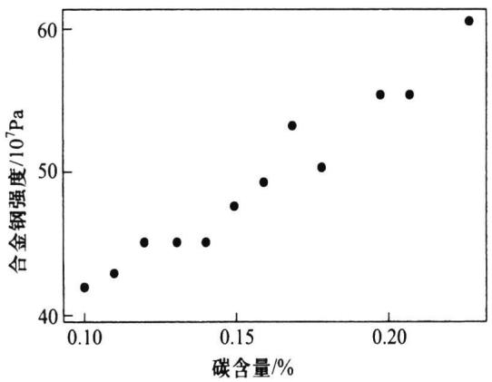  
图8.4.1合金钢强度及碳含量的散点图

从散点图我们可以看出，12个点基本在一条直线附近，这说明两个变量之间有一个线性相关关系，若记y轴方向上的误差为ε，这个相关关系可以表示为

$$
y = \beta _ { 0 } + \beta _ { 1 } x + \varepsilon .\tag{8.4.2}
$$

这便是y关于x的一元线性回归的数据结构式.这里总假定x为一般变量，是非随机变量，其值是可以精确测量或严格控制的， $\mathbf { \nabla } \beta _ { 0 } \mathbf { , } \beta _ { 1 }$ 为未知参数 ${ \mathcal { B } } _ { 1 }$ 是直线的斜率，它表示x每增加一个单位 $E ( y )$ 的增加量.ε是随机误差，通常假定

$$
E ( \varepsilon ) = 0 , \quad \mathrm { V a r } ( \varepsilon ) = \sigma ^ { 2 } ,\tag{8.4.3}
$$

在对未知参数作区间估计或假设检验时，还需要假定误差服从正态分布，即

$$
y \sim N ( \beta _ { 0 } \ + \beta _ { 1 } x , \sigma ^ { 2 } ) .\tag{8.4.4}
$$

显然，假定（8.4.4）比（8.4.3）要强.

由于 $\beta _ { 0 } , \beta _ { 1 }$ 均未知，需要我们从收集到的数据 $\left( \boldsymbol { x } _ { i } , \boldsymbol { y } _ { i } \right) \left( i = 1 , 2 , \cdots , n \right)$ 出发进行估计.在收集数据时，我们一般要求观测独立地进行，即假定 $y _ { 1 } , y _ { 2 } , \cdots , y _ { n }$ 相互独立.综合上述诸项假定，我们可以给出最简单、常用的一元线性回归的统计模型

$$
\left\{ \begin{array} { l l } { y _ { i } = \beta _ { 0 } + \beta _ { 1 } x _ { i } + \varepsilon _ { i } , \quad i = 1 , 2 , \cdots , n , } \\ { \varkappa _ { \varepsilon _ { i } } \varkappa _ { 1 } ^ { \sharp } \frac { \mathsf { i } } { \mathsf { i } } \frac { \mathsf { i } } { \mathsf { i } } \frac { \mathsf { i } } { \mathsf { i } } \frac { \mathsf { j } } { \mathsf { j } } \frac { \varkappa _ { \varepsilon _ { i } } } { \mathsf { j } \dag } \frac { \mathsf { j } } { \mathsf { i } } \frac { \varkappa _ { \varepsilon _ { i } } } { \mathsf { j } } \frac { \varkappa _ { \varepsilon _ { i } } } { \mathsf { j } \dag } \frac { \varkappa _ { \varepsilon _ { i } } } { \mathsf { j } } \frac { \varkappa _ { \varepsilon _ { i } } } { \mathsf { j } } N ( 0 , \sigma ^ { 2 } ) . } \end{array} \right.\tag{8.4.5}
$$

由数据 $\left( \boldsymbol { x } _ { i } , \boldsymbol { y } _ { i } \right) \left( i = 1 , 2 , \cdots , n \right)$ 可以获得 $\beta _ { 0 } , \beta _ { 1 }$ 的估计 $\hat { \mathcal { \beta } } _ { 0 } , \hat { \mathcal { \beta } } _ { 1 }$ ，称

$$
\hat { y } = \hat { \beta } _ { 0 } + \hat { \beta } _ { 1 } x\tag{8.4.6}
$$

为y关于x的经验回归函数,简称为回归方程,其图形称为回归直线.给定 ${ \boldsymbol { x } } = { \boldsymbol { x } } _ { 0 }$ 后，称$\hat { y } _ { 0 } = \hat { \beta } _ { 0 } + \hat { \beta } _ { 1 } x _ { 0 }$ 为回归值(在不同场合也称其为拟合值、预测值).

## 8.4.3回归系数的最小二乘估计

一般采用最小二乘方法估计模型(8.4.5）中的 $\beta _ { 0 } , \beta _ { \iota }$ 令

$$
Q ( \beta _ { 0 } , \beta _ { 1 } ) = \ \sum _ { i = 1 } ^ { n } \left( y _ { i } - \beta _ { 0 } - \beta _ { 1 } x _ { i } \right) ^ { 2 } ,
$$

$\hat { \beta } _ { 0 } , \hat { \beta } _ { 1 }$ 应该满足

$$
\big ( \hat { \beta } _ { \boldsymbol 0 } , \hat { \beta } _ { \boldsymbol 1 } \big ) = \operatorname* { m i n } _ { \beta _ { 0 } , \beta _ { 1 } } { Q ( \beta _ { 0 } , \beta _ { 1 } ) } ,
$$

这样得到的 $\hat { \beta } _ { 0 } , \hat { \beta } _ { 1 }$ 称为 $\beta _ { 0 } , \beta _ { 1 }$ 的最小二乘估计，记为LSE.

由于 $Q \geqslant 0$ ，且对 $\beta _ { 0 } , \beta _ { \iota }$ 的导数存在，因此最小二乘估计可以通过求偏导数并命其为0而得到

$$
\left\{ \begin{array} { l } { \displaystyle \frac { \partial Q } { \partial \beta _ { 0 } } = - \ 2 \sum _ { i = 1 } ^ { n } \left( y _ { i } - \beta _ { 0 } \ - \beta _ { 1 } x _ { i } \right) = 0 , } \\ { \displaystyle \frac { \partial Q } { \partial \beta _ { 1 } } = - \ 2 \sum _ { i = 1 } ^ { n } \left( y _ { i } \ - \beta _ { 0 } \ - \beta _ { 1 } x _ { i } \right) x _ { i } = 0 . } \end{array} \right.\tag{8.4.7}
$$

这组方程称为正规方程组，经过整理，可得

$$
\left\{ \begin{array} { l l } { n \beta _ { 0 } + n \overline { { x } } \beta _ { 1 } = n \overline { { y } } , } \\ { \qquad } \\ { n \overline { { x } } \beta _ { 0 } + \sum x _ { i } ^ { 2 } \beta _ { 1 } = \sum x _ { i } y _ { i } , } \end{array} \right.\tag{8.4.8}
$$

（今后凡是不作说明 $\ " \sum \ "$ 都表示 $\cdots \sum _ { i = 1 } ^ { n } \cdots )$ 记

$$
\overline { { { x } } } = \frac { 1 } { n } \sum x _ { i } , { \overline { { { y } } } } = \frac { 1 } { n } \sum y _ { i } ,
$$

$$
l _ { x y } = \sum \left( x _ { i } - { \overline { { x } } } \right) \left( y _ { i } - { \overline { { y } } } \right) = \ \sum x _ { i } y _ { i } - n \ { \overline { { x } } } \ \cdot \ { \overline { { y } } } = \ \sum x _ { i } y _ { i } - { \frac { 1 } { n } } \sum x _ { i } \sum y _ { i } ,
$$

$$
l _ { _ { x x } } = \sum \left( x _ { _ { i } } - { \overline { { x } } } \right) ^ { 2 } = \sum x _ { i } ^ { 2 } - n \ { \overline { { x } } } ^ { 2 } = \sum x _ { i } ^ { 2 } - { \frac { 1 } { n } } { \left( \ \sum x _ { i } \right) } ^ { 2 } ,
$$

$$
l _ { y y } = \sum { \left( y _ { i } - \overline { { y } } \right) ^ { 2 } } = \sum { y _ { i } ^ { 2 } - n } \ : \overline { { y } } ^ { 2 } = \sum { y _ { i } ^ { 2 } - \frac { 1 } { n } ( \sum y _ { i } ) \ : ^ { 2 } } .
$$

解（8.4.8）可得

$$
\begin{array} { r } { \left\{ \hat { \beta } _ { 1 } = \frac { l _ { x y } } { l _ { x x } } , \right. \qquad } \\ { \left. \hat { \beta } _ { 0 } = \overline { { y } } - \hat { \beta } _ { 1 } \stackrel { \_ } { x } \right. } \end{array}\tag{8.4.9}
$$

这就是参数的最小二乘估计，其计算通常可列表进行，见表8.4.2.

例8.4.2使用例8.4.1中合金钢强度和碳含量数据，我们可求得回归方程，见表8.4.2.

表8.4.2合金钢强度和碳含量数据的计算表
<table><tr><td> $\sum x _ { i } = 1 . 9 0$ </td><td> $n = 1 2$ </td><td> $\textstyle \sum y _ { i } = 5 8 9 . 5$ </td></tr><tr><td> $\overline { { x } } = 0 . 1 5 8 \ 3$   $\sum { x _ { i } ^ { 2 } } = 0 . 3 1 9 \ 4$ </td><td> $\sum x _ { i } y _ { i } = 9 5 . 8 0 5$ </td><td> $\overline { { y } } = 4 9 . 1 2 5$   $\sum { y } _ { i } ^ { 2 } = 2 9 ~ 3 0 4 . 2 5$ </td></tr><tr><td> $\scriptstyle n \ { \overline { { x } } } ^ { 2 } = 0 . 3 0 0 \ 8$ </td><td> $ { n x } = 9 3 . 3 3 7 5$ </td><td> $n \stackrel { - 2 } { y } ^ { 2 } = 2 8 9 5 9 . 1 9$ </td></tr><tr><td> $l _ { x x } = 0 . 0 1 8 \ 6$ </td><td> $l _ { x y } = 2 . 4 6 7 ~ 5$ </td><td> $l _ { y y } = 3 4 5 . 0 6$ </td></tr><tr><td></td><td> $\hat { \beta } _ { \scriptscriptstyle 1 } \ = \ l _ { _ { x y } } / l _ { _ { x x } } \ = \ 1 3 2 . 6 6$ </td><td></td></tr><tr><td></td><td> $\hat { \beta } _ { \scriptscriptstyle 0 } = \overline { { y } } - \hat { \beta } _ { \scriptscriptstyle 1 } \overline { { x } } = 2 8 . 1 2$ </td><td></td></tr></table>

$( l _ { y y }$ 在后面将会用到)由此给出回归方程为

$$
\hat { y } = 2 8 . 1 2 \ : + \ : 1 3 2 . 6 6 x .
$$

关于最小二乘估计的一些性质罗列在如下定理之中：

定理8.4.1在模型(8.4.5）下，有

(1） $\hat { \beta } _ { 0 } { \sim } N \bigg ( \beta _ { 0 } , \bigg ( \frac { 1 } { n } + \frac { \overline { { x } } ^ { 2 } } { l _ { x x } } \bigg ) \sigma ^ { 2 } \bigg ) , \quad \hat { \beta } _ { 1 } { \sim } N \bigg ( \beta _ { 1 } , \frac { \sigma ^ { 2 } } { l _ { x x } } \bigg )$

(2) $\mathrm { C o v } \big ( \hat { \beta } _ { 0 } , \hat { \beta } _ { 1 } \big ) = - \frac { \overline { { x } } } { l _ { x x } } \pmb { \sigma } ^ { 2 } ;$

（3）对给定的 $x _ { 0 } , \hat { y } _ { 0 } = \hat { \beta } _ { 0 } + \hat { \beta } _ { 1 } x _ { 0 } \sim N \bigg ( \beta _ { 0 } + \beta _ { 1 } x _ { 0 } , \bigg ( \frac { 1 } { n } + \frac { \big ( x _ { 0 } - \overline { { x } } \big ) ^ { 2 } } { l _ { x x } } \bigg ) \sigma ^ { 2 } \bigg )$

证明利用 $\left( x _ { i } - { \overline { { x } } } \right) = 0$ ,可把 $\hat { \beta } _ { 1 }$ 和 $\hat { \beta } _ { \mathfrak { o } }$ 改写为

$$
\widehat { \beta } _ { 1 } = \frac { l _ { x y } } { l _ { x x } } = \sum _ { l _ { x x } } ^ { x _ { i } - \overline { { x } } } y _ { i } ,
$$

$$
\widehat { \beta } _ { 0 } = \overline { { y } } - \widehat { \beta } _ { 1 } \ \overline { { x } } = \sum \left[ \frac { 1 } { n } - \frac { \left( x _ { i } - \overline { { x } } \right) \overline { { x } } } { l _ { x x } } \right] y _ { i } .
$$

它们是独立正态变量 $y _ { 1 } , y _ { 2 } , \cdots , y _ { n }$ 的线性组合,故都服从正态分布，下面分别求其期望与方差.

$$
E ( \hat { \beta } _ { 1 } ) = \sum \frac { x _ { i } - \overline { { x } } } { l _ { x x } } E ( y _ { i } ) = \sum \frac { x _ { i } - \overline { { x } } } { l _ { x x } } ( \beta _ { 0 } + \beta _ { 1 } x _ { i } ) = \beta _ { 1 } ,
$$

$$
\begin{array} { r } { \mathrm { V a r } ( \boldsymbol { \hat { \beta } } _ { 1 } ) = \ \sum \bigg ( \displaystyle \frac { x _ { i } - \overline { { x } } } { l _ { x x } } \bigg ) ^ { 2 } \mathrm { V a r } ( y _ { i } ) = \ \sum \frac { \big ( x _ { i } - \overline { { x } } \big ) ^ { 2 } } { l _ { x x } ^ { 2 } } \boldsymbol \sigma ^ { 2 } = \frac { \boldsymbol \sigma ^ { 2 } } { l _ { x x } } , } \end{array}
$$

$$
E ( \hat { \beta } _ { 0 } ) = E ( \stackrel { - } { y } ) - E ( \hat { \beta } _ { 1 } ) \stackrel { - } { x } = \beta _ { 0 } + \beta _ { 1 } \stackrel { - } { x } - \beta _ { 1 } \stackrel { - } { x } = \beta _ { 0 } ,
$$

$$
\mathrm { V a r } ( \hat { \beta } _ { 0 } ) = \ \sum \bigg [ \frac { 1 } { n } { - } \frac { \big ( x _ { i } { - } \overline { { x } } \big ) \overline { { x } } } { l _ { x x } } \bigg ] ^ { 2 } \mathrm { V a r } \big ( \ y _ { i } \big ) = \bigg ( \frac { 1 } { n } { + } \frac { \overline { { x } } ^ { 2 } } { l _ { x x } } \bigg ) \sigma ^ { 2 } ,
$$

这就证明了(1).进一步，考虑到诸 $\boldsymbol { y } _ { i }$ 之间的独立性，可得

$$
\mathrm { C o v } ( \hat { \beta } _ { 0 } , \hat { \beta } _ { 1 } ) = \mathrm { C o v } \Bigg ( \sum \Bigg [ \frac { 1 } { n } - \frac { ( x _ { i } - \overline { { x } } ) ^ { \overline { { x } } } } { l _ { \mathrm { { x r } } } } \Bigg ] y _ { i } , \sum \frac { x _ { i } - \overline { { x } } } { l _ { \mathrm { { x r } } } } y _ { i } \Bigg ) = \sum \Bigg [ \frac { 1 } { n } - \frac { ( x _ { i } - \overline { { x } } ) ^ { \overline { { x } } } } { l _ { \mathrm { { x r } } } } \Bigg ] \frac { x _ { i } - \overline { { x } } } { l _ { \mathrm { { x r } } } } \sigma ^ { 2 } = - \frac { \overline { { x } } } { l _ { \mathrm { { x r } } } } \sigma ^ { 2 } ,
$$

这就证明了（2).为证明(3），注意到 $\hat { \gamma } _ { 0 } = \hat { \beta } _ { 0 } + \hat { \beta } _ { 1 } x _ { 0 }$ 也是 $y _ { 1 } , y _ { 2 } , \cdots , y _ { n }$ 的线性组合，它也服从正态分布，只需求出其期望与方差即可.

$$
E \big ( \hat { \gamma } _ { _ 0 } \big ) = E \big ( \hat { \beta } _ { _ 0 } \big ) + E \big ( \hat { \beta } _ { _ 1 } \big ) x _ { _ 0 } = \beta _ { _ 0 } + \beta _ { _ 1 } x _ { _ 0 } = E \big ( \gamma _ { _ 0 } \big ) ,
$$

$$
\begin{array} { r l } & { \mathrm { V a r } \big ( \hat { \gamma } _ { \boldsymbol 0 } \big ) = \mathrm { V a r } \big ( \hat { \beta } _ { \boldsymbol 0 } \big ) \ + \ \mathrm { V a r } \big ( \hat { \beta } _ { \boldsymbol 1 } \big ) x _ { \boldsymbol 0 } ^ { 2 } \ + \ 2 \mathrm { C o v } \big ( \hat { \beta } _ { \boldsymbol 0 } , \hat { \beta } _ { \boldsymbol 1 } \big ) x _ { \boldsymbol 0 } } \\ & { \mathrm { ~ \ } = \Bigg [ \bigg ( \displaystyle \frac { 1 } { n } \ + \frac { \overline { { x } } ^ { 2 } } { l _ { x x } } \bigg ) \ + \frac { x _ { \boldsymbol 0 } ^ { 2 } } { l _ { x x } } - 2 \frac { x _ { \boldsymbol 0 } \overline { { x } } } { l _ { x x } } \Bigg ] \ \sigma ^ { 2 } = \Bigg [ \displaystyle \frac { 1 } { n } \ + \frac { \big ( x _ { \boldsymbol 0 } \ - \overline { { x } } \big ) ^ { 2 } } { l _ { x x } } \Bigg ] \ \sigma ^ { 2 } , } \end{array}
$$

证明完成.

定理8.4.1说明：

$\hat { \boldsymbol \beta } _ { 0 } , \hat { \boldsymbol \beta } _ { 1 }$ 分别是 $\beta _ { 0 } , \beta _ { \iota }$ 的无偏估计；

$\hat { y } _ { 0 }$ 是 $E ( \boldsymbol { y } _ { 0 } ) = \beta _ { 0 } + \beta _ { 1 } \boldsymbol { x } _ { 0 }$ 的无偏估计.

·除 $\stackrel { - } { x } = 0$ 外 $\hat { \mathcal { \beta } } _ { 0 }$ 与 $\hat { \beta } _ { 1 }$ 是相关的.

·要提高 $\hat { \beta } _ { 0 } , \hat { \beta } _ { 1 }$ 的估计精度（即降低它们的方差)就要求n大 $l _ { x x }$ 大（即要求 $x _ { 1 }$ ，$x _ { 2 } , \cdots , x _ { n }$ 较分散).

## 8.4.4回归方程的显著性检验

从回归系数的LSE可以看出,对任意给出的n对数据 $( x _ { i } , y _ { i } )$ ，都可以求出 $\hat { \beta } _ { \scriptscriptstyle 0 } , \hat { \beta } _ { \scriptscriptstyle 1 }$

从而可写出回归方程 $\hat { \gamma } = \hat { \beta } _ { 0 } + \hat { \beta } _ { 1 } x$ ，但是这样给出的回归方程不一定有意义.

在使用回归方程以前，首先应对回归方程是否有意义进行判断.什么叫回归方程有意义呢？我们知道，建立回归方程的目的是寻找y的均值随x变化的规律，即找出回归方程 $E \left( \boldsymbol { y } \right) = \beta _ { 0 } + \beta _ { 1 } \boldsymbol { x } .$ 如果 $\beta _ { \scriptscriptstyle 1 } = 0$ ，那么不管x如何变化， $E ( y )$ 不随x的变化作线性变化，那么这时求得的一元线性回归方程就没有意义，或称回归方程不显著.如果 $\beta _ { \imath } \neq$ 0,那么当x变化时， $E ( y )$ 随x的变化作线性变化，那么这时求得的回归方程就有意义，或称回归方程是显著的.

综上，对回归方程是否有意义作判断就是要对如下的检验问题作出判断：

$$
H _ { 0 } : \beta _ { \mathfrak { r } } = 0 \qquad \mathrm { ~ v s ~ } \qquad H _ { \mathfrak { r } } : \beta _ { \mathfrak { r } } \ne 0 ,\tag{8.4.10}
$$

拒绝 $H _ { 0 }$ 表示回归方程是显著的.

在一元线性回归中有三种等价的检验方法，使用中只要任选其中之一即可.下面分别加以介绍.

## 一、F检验

采用方差分析的思想，我们从数据出发研究各 $\boldsymbol { \mathscr { y } } _ { i }$ 不同的原因.首先引入记号并称$\hat { \gamma } _ { _ i } { = } \hat { \beta } _ { _ 0 } { + } \hat { \beta } _ { _ 1 } x _ { i }$ 为 $x _ { i }$ 处的回归值，又称 $\gamma _ { i } - \hat { y } _ { i }$ 为 $x _ { i }$ 处的残差.

数据总的波动用总偏差平方和

$$
S _ { \tau } { } ^ { } = \sum { } \left( \smash { y } _ { i } - \overline { { y } } _ { } \right) ^ { 2 } { } = l _ { y y }
$$

表示.引起各 $y _ { i }$ 不同的原因主要有两类因素：其一是 $H _ { 0 }$ 可能不真，即 $\beta _ { \mathrm { { l } } } \neq 0$ ，从而$E \left( \gamma \right) = \beta _ { 0 } + \beta _ { 1 } x$ 随x的变化而变化，即在每一个x的观测值处的回归值不同，其波动用回归平方和

$$
S _ { { \scriptscriptstyle R } } = \sum \big ( \hat { y } _ { { \scriptscriptstyle i } } - \overline { { y } } \big ) ^ { 2 }\tag{8.4.11}
$$

表示；其二是其他一切因素，包括随机误差、x对 $E ( y )$ 的非线性影响等，这样在得到回归值以后，y的观测值与回归值之间还有差距，这可用残差平方和

$$
\begin{array} { r } { \boldsymbol { S } _ { e } = \sum \left( \boldsymbol { y } _ { i } - \hat { \boldsymbol { y } } _ { i } \right) ^ { 2 } } \end{array}\tag{8.4.12}
$$

表示.

为对上述诸平方和实施方差分析，下面我们要证明重要的平方和分解式，为此首先注意到 $\hat { \beta } _ { 0 } , \hat { \beta } _ { 1 }$ 满足正规方程组（8.4.7），因此有

$$
\begin{array} { r l } & { \sum \big ( y _ { i } { - } \widehat { \beta } _ { 0 } { - } \widehat { \beta } _ { 1 } x _ { i } \big ) = 0 { \Rightarrow } \textstyle \sum \big ( y _ { i } { - } \widehat { y } _ { i } \big ) = 0 , } \\ & { \textstyle \sum \big ( y _ { i } { - } \widehat { \beta } _ { 0 } { - } \widehat { \beta } _ { 1 } x _ { i } \big ) x _ { i } = 0 { \Rightarrow } \textstyle \sum \big ( y _ { i } { - } \widehat { y } _ { i } \big ) x _ { i } = 0 . } \end{array}
$$

利用 $\hat { y } _ { i } = \hat { \beta } _ { 0 } + \hat { \beta } _ { 1 } x _ { i } = \overline { { y } } + \hat { \beta } _ { 1 } \left( x _ { i } - \overline { { x } } \right)$ ，可得

$$
\begin{array} { r } { \sum \left( y _ { i } - \hat { y _ { i } } \right) \left( \hat { y _ { i } } - \overline { { y } } \right) = \sum \left( y _ { i } - \hat { y _ { i } } \right) \left[ \hat { \beta } _ { 1 } ( x _ { i } - \overline { { x } } ) \right] = \hat { \beta } _ { 1 } \big [ \sum \left( y _ { i } - \hat { y _ { i } } \right) x _ { i } - \sum \left( y _ { i } - \hat { y _ { i } } \right) \overline { { x } } \big ] = 0 , } \end{array}
$$

从而

$$
\begin{array} { r } { S _ { \tau } = \sum \big ( y _ { i } { - } \overline { { y } } \big ) ^ { 2 } = \sum \big ( y _ { i } { - } \widehat { y } _ { i } { + } \widehat { y } _ { i } { - } \overline { { y } } \big ) ^ { 2 } = \sum \big ( y _ { i } { - } \widehat { y } _ { i } \big ) ^ { 2 } + \sum \big ( \widehat { y } _ { i } { - } \overline { { y } } \big ) ^ { 2 } , } \end{array}
$$

即

$$
S _ { \tau } = S _ { \scriptscriptstyle R } + S _ { \scriptscriptstyle e } ,\tag{8.4.13}
$$

上式就是一元线性回归场合下的平方和分解式.

关于 $S _ { R }$ 和 $S _ { e }$ 所含有的成分可由如下定理说明.

定理8.4.2设 $y _ { i } = \beta _ { 0 } + \beta _ { 1 } x _ { i } + \varepsilon _ { i }$ ,其中 $\varepsilon _ { 1 } , \varepsilon _ { 2 } , \cdots , \varepsilon _ { n }$ 相互独立，且

$$
\begin{array} { r } { E ( \varepsilon _ { i } ) = 0 , \quad \mathrm { V a r } ( \varepsilon _ { i } ) = \sigma ^ { 2 } , \quad i = 1 , 2 , \cdots , n , } \end{array}
$$

沿用上面的记号，有

$$
\begin{array} { l } { { E ( S _ { \kappa } ) = \sigma ^ { 2 } + \beta _ { 1 } ^ { 2 } l _ { x x } , } } \\ { { \ } } \\ { { E ( S _ { e } ) = ( n - 2 ) \sigma ^ { 2 } , } } \end{array}\tag{8.4.14}
$$

(8.4.15)

(8.4.15）式说明 $\hat { \sigma } ^ { 2 } = S _ { e } / ( n - 2 )$ 是 $\sigma ^ { 2 }$ 的无偏估计.

证明首先我们可以写出 $S _ { \scriptscriptstyle R }$ 的简化公式：

$$
S _ { R } = \textstyle \sum \big ( \hat { y } _ { i } { - } \overline { { y } } \big ) ^ { 2 } = \textstyle \sum \big [ \overline { { y } } { + } \hat { \beta } _ { 1 } \big ( \boldsymbol { x } _ { i } { - } \overline { { x } } \big ) { - } \overline { { y } } \big ] ^ { 2 } { = } \hat { \beta } _ { 1 } ^ { 2 } l _ { x x } ,\tag{8.4.16}
$$

从而

$$
E ( S _ { \boldsymbol { R } } ) = E ( \hat { \beta } _ { 1 } ^ { 2 } ) l _ { x x } = \big [ \mathrm { V a r } ( \hat { \beta } _ { 1 } ) + ( E ( \hat { \beta } _ { 1 } ) ) ^ { 2 } \big ] l _ { x x } = \left( \frac { \sigma ^ { 2 } } { l _ { x x } } + \beta _ { 1 } ^ { 2 } \right) l _ { x x } = \sigma ^ { 2 } + \beta _ { 1 } ^ { 2 } l _ { x x } ,
$$

这就证明了（8.4.14).另外

$$
\begin{array} { r l } & { S _ { \epsilon } = \sum \big ( y _ { i } { - } \widehat { \gamma } _ { i } \big ) ^ { 2 } = \sum \big ( \beta _ { 0 } { + } \beta _ { 1 } x _ { i } { + } \varepsilon _ { i } { - } \widehat { \beta } _ { 0 } { - } \widehat { \beta } _ { 1 } x _ { i } \big ) ^ { 2 } } \\ & { \qquad = \sum \big [ ( \widehat { \beta } _ { 0 } { - } \beta _ { 0 } ) ^ { 2 } { + } x _ { i } ^ { 2 } ( \widehat { \beta } _ { 1 } { - } \beta _ { 1 } ) ^ { 2 } { + } \varepsilon _ { i } ^ { 2 } { + } 2 ( \widehat { \beta } _ { 0 } { - } \beta _ { 0 } ) ( \widehat { \beta } _ { 1 } { - } \beta _ { 1 } ) x _ { i } { - } 2 ( \widehat { \beta } _ { 0 } { - } \beta _ { 0 } ) \varepsilon _ { i } { - } 2 ( \widehat { \beta } _ { 1 } { - } \beta _ { 1 } ) x _ { i } \varepsilon _ { i } \big ] , } \end{array}
$$

故

$$
\begin{array} { r l } & { E ( \mathrm { \boldsymbol { ~ S } } _ { \epsilon } ) = n \mathrm { V a r } ( \hat { \boldsymbol { \beta } } _ { 0 } ) + \sum x _ { i } ^ { 2 } \mathrm { V a r } ( \hat { \boldsymbol { \beta } } _ { 1 } ) + n \mathrm { V a r } ( \boldsymbol { \varepsilon } _ { i } ) + 2 n \mathrm { \Omega } \overline { { x } } \mathrm { C o v } ( \hat { \boldsymbol { \beta } } _ { 0 } , \hat { \boldsymbol { \beta } } _ { 1 } ) - } \\ & { } \\ & { \qquad 2 \sum E ( \hat { \boldsymbol { \beta } } _ { 0 } \boldsymbol { \varepsilon } _ { i } ) - 2 \sum x _ { i } E ( \hat { \boldsymbol { \beta } } _ { 1 } \boldsymbol { \varepsilon } _ { i } ) . } \end{array}
$$

将 $\hat { \cdot \beta } _ { 0 } , \hat { \beta } _ { 1 }$ 写成 $y _ { 1 } , y _ { 2 } , \cdots , y ,$ 的线性组合，利用 $\boldsymbol { y } _ { j }$ 与 $\pmb { \varepsilon } _ { i } ( i \neq j )$ 的独立性，有

$$
E ( \hat { \beta } _ { 0 } \varepsilon _ { i } ) = E \bigg [ \varepsilon _ { i } \sum _ { j } \left( \frac { 1 } { n } - \frac { \left( x _ { j } - \overline { { x } } \right) \overline { { x } } } { l _ { x x } } \right) y _ { j } \bigg ] = \left( \frac { 1 } { n } - \frac { \left( x _ { i } - \overline { { x } } \right) \overline { { x } } } { l _ { x x } } \right) \sigma ^ { 2 } ,
$$

$$
E ( \hat { \beta } _ { 1 } \pmb { \varepsilon } _ { i } ) = E \bigg [ \pmb { \varepsilon } _ { i } \sum _ { j } \frac { \pmb { x } _ { j } - \overline { { { x } } } } { l _ { x x } } \pmb { y } _ { j } \bigg ] = \frac { \pmb { x } _ { i } - \overline { { { x } } } } { l _ { x x } } \pmb { \sigma } ^ { 2 } ,
$$

由此即有

$$
\begin{array} { r } { \sum E ( \hat { \beta } _ { 0 } \pmb { \varepsilon } _ { i } ) = \pmb { \sigma } ^ { 2 } , \quad \sum \pmb { x } _ { i } E ( \hat { \beta } _ { 1 } \pmb { \varepsilon } _ { i } ) = \pmb { \sigma } ^ { 2 } . } \end{array}
$$

从而

$$
E ( \mathbf { \Phi } _ { S _ { e } } ) = n \Bigg ( \frac { 1 } { n } + \frac { \overline { { x } } ^ { 2 } } { l _ { x x } } \Bigg ) \thinspace \sigma ^ { 2 } + \sum _ { l _ { x x } } \frac { x _ { i } ^ { 2 } } { \sigma ^ { 2 } } + n \sigma ^ { 2 } - \frac { 2 n \mathrm { ~ } \overline { { x } } ^ { 2 } } { l _ { x x } } \sigma ^ { 2 } - 2 \sigma ^ { 2 } - 2 \sigma ^ { 2 }
$$

$$
= ( 1 + n - 4 ) \sigma ^ { 2 } + \frac { 1 } { l _ { x x } } \sum { ( x _ { i } - \overline { { x } } ) } ^ { 2 } \sigma ^ { 2 } = \left( n - 2 \right) \sigma ^ { 2 } ,
$$

这就完成了证明.

进一步，有关 $S _ { R }$ 和 $S _ { e }$ 的分布，有如下定理.

定理8.4.3设 $y _ { 1 } , y _ { 2 } , \cdots , y _ { n }$ 相互独立，且 $y _ { i } \sim N ( \beta _ { 0 } + \beta _ { 1 } x _ { i } , \sigma ^ { 2 } ) , i = 1 , 2 , \cdots , n$ ,则在上述记号下，有

(1) $S _ { \mathcal { I } } / \sigma ^ { 2 } \sim \chi ^ { 2 } ( n - 2 )$

（2）若 $H _ { \mathfrak { o } }$ 成立，则有 $S _ { R } / \sigma ^ { 2 } \sim \chi ^ { 2 } ( \mathrm { ~ l ~ } )$

(3) $S _ { R }$ 与 $S _ { e } , \bar { y }$ 独立（或 $\hat { \beta } _ { 1 }$ 与 $S _ { e } , \bar { y }$ 独立）.

证明取 $n { \times } n$ 正交矩阵A具有如下形式：

$$
A = \left( \begin{array} { l l l l } { a _ { 1 1 } } & { a _ { 1 2 } } & { \cdots } & { a _ { 1 n } } \\ { \vdots } & { \vdots } & & { \vdots } \\ { a _ { n - 2 , 1 } } & { a _ { n - 2 , 2 } } & { \cdots } & { a _ { n - 2 , n } } \\ { \underbrace { x _ { 1 } - \bar { x } } _ { \sqrt { l _ { \mathrm { m } } } } } & { \underbrace { x _ { 2 } - \bar { x } } _ { \sqrt { l _ { \mathrm { m } } } } } & { \cdots } & { \underbrace { x _ { n } - \bar { x } } _ { \sqrt { l _ { \mathrm { m } } } } } \\ { \underbrace { 1 } } & { \vdots } & { \cdots } & { \underbrace { 1 } } \end{array} \right) ,
$$

由正交性，可得如下一些约束条件：

$$
\begin{array} { r l } { \displaystyle \sum _ { j } a _ { i j } = 0 \mathrm { , } \quad \displaystyle \sum _ { j } a _ { i j } x _ { j } = 0 \mathrm { , } \quad } & { \displaystyle \sum _ { j } a _ { i j } ^ { 2 } = 1 \mathrm { , } \quad i = 1 , 2 , \cdots , n - 2 \mathrm { , } } \\ { \displaystyle \sum _ { k } a _ { i k } a _ { j k } = 0 \mathrm { , } \quad } & { 1 \leqslant i < j \leqslant n - 2 \mathrm { , } } \end{array}
$$

这里矩阵A共有 $n \left( n - 2 \right)$ 个未知参数，约束条件有 $3 \left( n - 2 \right) + \binom { n - 2 } { 2 } = \left( n - 2 \right) \left( n + 3 \right) / 2$ 个，只要 $n \geqslant 3$ ，未知参数个数就不少于约束条件数，因此正交矩阵A必存在.令

$$
\begin{array} { r } { Z = \left( \begin{array} { c } { z _ { 1 } } \\ { z _ { 2 } } \\ { \vdots } \\ { z _ { * } } \end{array} \right) = A Y = A \left( \begin{array} { c } { y _ { 1 } } \\ { y _ { 2 } } \\ { \vdots } \\ { \vdots } \\ { y _ { * } } \end{array} \right) = \left( \begin{array} { c } { \sum _ { j } a _ { 1 j } \gamma _ { j } } \\ { \vdots } \\ { \sum _ { i } a _ { * - 2 , j } \gamma _ { j } } \\ { \sum _ { j } \frac { x _ { i } - \tilde { x } } { \sqrt { l _ { \mathrm { a b } } } } \gamma _ { j } } \\ { \vdots } \\ { \sum _ { j } \frac { 1 } { \sqrt { n } } \gamma _ { j } } \end{array} \right) , } \end{array}
$$

其中

$$
z _ { n - 1 } = \frac { \sum \left( x _ { i } - \overline { { x } } \right) y _ { i } } { \sqrt { l _ { x x } } } { = } \frac { \sum \left( x _ { i } - \overline { { x } } \right) \left( y _ { i } - \overline { { y } } \right) } { \sqrt { l _ { x x } } } { = } \frac { l _ { x y } } { \sqrt { l _ { x x } } } { = } \sqrt { l _ { x x } } \widehat { \beta } _ { 1 } ,
$$

则Z仍然服从n维正态分布，且其期望与协方差阵分别为

$$
E ( { \pmb Z } ) = \left( \begin{array} { c } { { 0 } } \\ { { \vdots } } \\ { { 0 } } \\ { { \beta _ { 1 } \sqrt { l _ { x x } } } } \\ { { \sqrt { n } \left( \beta _ { 0 } + \beta _ { 1 } \stackrel { \bf - } { x } \right) } } \end{array} \right) , \quad \mathrm { V a r } ( { \pmb Z } ) = A \mathrm { V a r } ( { \pmb Y } ) A ^ { \top } = \sigma ^ { 2 } I _ { n } ,
$$

这表明 $z _ { 1 } , z _ { 2 } , \cdots , z _ { n }$ 相互独立， $z _ { 1 } , z _ { 2 } , \cdots , z _ { n - 2 }$ 的共同分布为 $N \left( 0 , \sigma ^ { 2 } \right) , z _ { n - 1 } \sim$ ${ \cal N } ( \beta _ { 1 } \sqrt { l _ { x x } } , \sigma ^ { 2 } ) , z _ { n } \sim { \cal N } ( \sqrt { n } ( \beta _ { 0 } + \beta _ { 1 } \stackrel { \_ } { x } ) , \sigma ^ { 2 } )$

由于 $\scriptstyle \sum z _ { i } ^ { 2 } = \ \sum y _ { i } ^ { 2 } = S _ { \tau } + n \ { \overline { { y } } } ^ { 2 } = S _ { \scriptscriptstyle R } + S _ { \scriptscriptstyle e } + n \ { \overline { { y } } } ^ { 2 }$ ,而 $z _ { n } = \sqrt { n } \overline { { { y } } } , z _ { n - 1 } = \sqrt { l _ { x x } } \hat { \beta } _ { 1 } = \sqrt { S _ { R } }$ ,于是有 $z _ { 1 } ^ { 2 } +$ $z _ { 2 } ^ { 2 } + \cdots + z _ { n - 2 } ^ { 2 } = S _ { e }$ ，所以 $S _ { e } , S _ { R } , \bar { y } .$ 三者相互独立.并有

$$
S _ { \epsilon } / \sigma ^ { 2 } = \sum _ { i = 1 } ^ { n - 2 } \left( z _ { i } / \sigma \right) ^ { 2 } \sim \chi ^ { 2 } ( n - 2 ) ,
$$

在 $\beta _ { \mathrm { 1 } } = 0$ 时，

$$
S _ { \scriptscriptstyle R } / \sigma ^ { 2 } = \left( \frac { z _ { { n - 1 } } } { \sigma } \right) ^ { 2 } \sim \chi ^ { 2 } ( 1 ) ,
$$

证明完成.

如同方差分析那样,我们可以考虑采用如下F作为检验问题(8.4.10)的检验统计量：

$$
F = \frac { S _ { R } } { S _ { e } / ( n - 2 ) } .
$$

在 $\beta _ { \mathrm { 1 } } = 0$ 时， $F \sim F ( f _ { R } , f _ { e } )$ ,其中 $f _ { \scriptscriptstyle R } = 1 { \mathrm { , } } f _ { e } = n - 2 .$ 对于给定的显著性水平 $\pmb { \alpha }$ ,其拒绝域为$F \geqslant F _ { _ { 1 - \alpha } } ( 1 , n - 2 ) .$

整个检验也可列成一张方差分析表.检验也可用 $p$ 值进行.

例8.4.3在合金钢强度的例8.4.2中，我们已求出了回归方程，这里我们考虑关于回归方程的显著性检验.经计算有

$$
\begin{array} { l l } { { S _ { \tau } = l _ { y \tau } = 3 4 5 . 0 6 , } } & { { f _ { \tau } = 1 1 , } } \\ { { } } & { { } } \\ { { S _ { _ R } = \widehat { \beta } _ { 1 } ^ { 2 } l _ { _ { x x } } = 1 3 2 . 6 6 ^ { 2 } \times 0 . 0 1 8 ~ 6 = 3 2 7 . 3 4 , } } & { { f _ { _ R } = 1 , } } \\ { { } } & { { } } \\ { { S _ { _ e } = S _ { _ T } - S _ { _ R } = 3 4 5 . 0 6 - 3 2 7 . 3 4 = 1 7 . 7 2 , } } & { { f _ { e } = 1 0 . } } \end{array}
$$

把各平方和与自由度移入方差分析表，继续进行计算，具体见表8.4.3.

表8.4.3合金钢强度与碳含量回归方程的方差分析表
<table><tr><td>来源</td><td>平方和</td><td>自由度</td><td>均方</td><td>F比</td><td>p值</td></tr><tr><td>回归</td><td> $S _ { _ R } = 3 2 7 . 3 4$ </td><td> $f _ { R } = 1$ </td><td> $M S _ { _ R } = 3 2 7 . 3 4$ </td><td>184.94</td><td>0.0000</td></tr></table>

续表
<table><tr><td>来源</td><td>平方和 自由度</td><td>均方</td><td>F比 p值</td></tr><tr><td>残差</td><td> $S _ { e } = 1 7 . 7 2$   $f _ { \mathrm { e } } = 1 0$   $M S _ { e } = 1 . 7 7$ </td></tr><tr><td> $S _ { \tau } = 3 4 5 . 0 6$ </td><td> $f _ { \tau } = 1 1$ </td></tr></table>

这里p值很小，因此，在显著性水平0.01下回归方程是显著的.

## 二、t检验

对 $H _ { \mathfrak { o } } : \beta _ { \mathfrak { r } } = 0$ 的检验也可基于t分布进行.由于 $\cdot \hat { \beta } _ { 1 } { \sim } N \Bigg ( \beta _ { 1 } , \frac { \sigma ^ { 2 } } { l _ { x x } } \Bigg ) , \frac { S _ { e } } { \sigma ^ { 2 } } { \sim } \chi ^ { 2 } ( n { - } 2 )$ ，且与 $\hat { \beta } _ { 1 }$ 相互独立，因此在 $H _ { \mathfrak { o } }$ 为真时，有

$$
t = \frac { \hat { \beta } _ { 1 } } { \hat { \sigma } / \sqrt { l _ { x x } } } \sim t ( n - 2 ) ,\tag{8.4.17}
$$

其中 $\hat { \sigma } = \sqrt { S _ { e } / \left( n - 2 \right) }$ ，由于 $\sigma _ { \hat { \beta } _ { 1 } } = \frac { \sigma } { \sqrt { l _ { x x } } }$ ，因此称 $\hat { \sigma } _ { \hat { \beta } _ { 1 } } = \frac { \hat { \sigma } } { \sqrt { l _ { x x } } }$ 为 $\hat { \beta } _ { 1 }$ 的标准误，即 $\hat { \beta } _ { 1 }$ 的标准差的估计.（8.4.17）式表示的t统计量可用来检验假设 $H _ { 0 } .$ 对给定的显著性水平α，拒绝域为

$$
W = \left\{ \mid t \mid > t _ { 1 - \alpha / 2 } ( n - 2 ) \right\} .
$$

注意到 $t ^ { 2 } = F$ ，因此，t检验与F检验是等同的.

以例8.4.2中数据为例，可以计算得到

$$
t = { \frac { 1 3 2 . 6 6 } { \sqrt { 1 . 7 7 } / \sqrt { 0 . 0 1 8 ~ 6 } } } = 1 3 . 5 9 9 ~ 1 .
$$

若取 $\alpha = 0 . 0 1$ ，则 $t _ { \scriptscriptstyle { 0 . 9 9 5 } } ( 1 0 ) = 3 . 1 6 9 3$ ，由于 $1 3 . 5 9 9 \ 1 > 3 . 1 6 9 \ 3$ ，因此，在显著性水平0.01下回归方程是显著的.

## 三、相关系数检验

考察一元线性回归方程能否反映两个随机变量x与y间的线性相关关系时，它的显著性检验还可通过对二维总体相关系数p的检验进行.它的一对假设是

$$
H _ { 0 } : \rho = 0 \quad \mathrm { ~ v s ~ } \quad H _ { 1 } : \rho \neq 0 .\tag{8.4.18}
$$

所用的检验统计量为样本相关系数

$$
r = \frac { \sum \left( x _ { i } - \overline { { x } } \right) \left( y _ { i } - \overline { { y } } \right) } { \sqrt { \sum \left( x _ { i } - \overline { { x } } \right) ^ { 2 } \sum \left( y _ { i } - \overline { { y } } \right) ^ { 2 } } } = \frac { l _ { x y } } { \sqrt { l _ { x x } l _ { y y } } } ,\tag{8.4.19}
$$

其中 $\left( \boldsymbol { x } _ { i } , \boldsymbol { y } _ { i } \right) \left( i = 1 , 2 , \cdots , n \right)$ 是容量为n的二维样本.

利用施瓦茨不等式可以证明：样本相关系数也满足 $| r | \leqslant 1$ ，其中等号成立的条件是存在两个实数a与b，使得对 $i = 1 , 2 , \cdots , n$ 几乎处处有 $y _ { i } = a + b x _ { i }$ 由此可见，n个点$\left( \boldsymbol { x } _ { i } , \boldsymbol { y } _ { i } \right) \left( i = 1 , 2 , \cdots , n \right)$ 在散点图上的位置与样本相关系数r有关，譬如：

$r = \pm 1 , n$ 个点完全在一条上升或下降的直线上.

$r { > } 0$ ,当x增加时，y有线性增加趋势，此时称正相关.

$r { < } 0$ ，当x增加时，y反而有线性减少趋势，此时称负相关.

$r = 0 , n$ 个点可能杂乱无章，也可能呈某种曲线趋势，此时称不相关.

根据样本相关系数的上述性质，检验（8.4.18)中原假设 $H _ { \mathrm { 0 } } : \rho = 0$ 的拒绝域为 $\pmb { W } =$ $\left\{ \begin{array} { l l }  | r | \geqslant c \right\} \end{array}$ ,其中临界值c可由 $H _ { 0 } : \rho = 0$ 成立时样本相关系数的分布定出，该分布与自由度n-2有关.

对给定的显著性水平α,由 $P ( \ W ) = P ( \ | \ r | \geqslant c ) = \alpha$ 知，临界值c应是 $H _ { 0 } : \rho = 0$ 成立下Irl的分布的1-α分位数,故可记为 $c = r _ { 1 - \alpha } ( n - 2 )$ .我们还可以用F分布来确定临界值c,下面加以叙述.

由样本相关系数的定义可以得到统计量r与F之间的关系

$$
r ^ { 2 } = \frac { l _ { x y } ^ { 2 } } { l _ { x x } l _ { y y } } = \frac { S _ { R } } { S _ { T } } = \frac { S _ { R } } { S _ { R } + S _ { e } } = \frac { S _ { R } / S _ { e } } { S _ { R } / S _ { e } + 1 } ,
$$

而

$$
F = \frac { M S _ { R } } { M S _ { e } } = \frac { S _ { R } } { S _ { e } / ( n - 2 ) } = \frac { \left( \displaystyle n - 2 \right) S _ { R } } { S _ { e } } .
$$

两者综合，可得

$$
r ^ { 2 } = \frac { F } { F + ( n - 2 ) } .
$$

这表明，Irl是F的严格单调增函数,故可以从F分布的1-α分位数 $F _ { _ { 1 - \alpha } } ( 1 , n - 2 )$ 得到Irl的1-α分位数为

$$
c = r _ { _ { 1 - \alpha } } ( \textit { n - 2 } ) = \sqrt { \frac { F _ { _ { 1 - \alpha } } ( 1 , \mathscr { n } - 2 ) } { F _ { _ { 1 - \alpha } } ( 1 , \mathscr { n } - 2 ) \mathscr { + } \mathscr { n } - 2 } } .
$$

譬如，对 $\alpha = 0 . 0 1 , n = 1 2$ ,查表知 $F _ { _ { 0 . 9 9 } } ( \mathrm { ~ l ~ } , 1 0 ) = 1 0 . 0 4$ ，于是

$$
r _ { \scriptscriptstyle 0 . 9 9 } ( 1 0 ) = \sqrt { \frac { 1 0 . 0 4 } { 1 0 . 0 4 + 1 0 } } = 0 . 7 0 7 8 .
$$

为实际使用方便，人们已对 $r _ { 1 - \alpha } ( n { - } 2 )$ 编制了专门的表，见附表9.

以例8.4.2中数据为例，可以计算得到

$$
r = { \frac { 2 . 4 6 7 \ 5 } { \sqrt { 0 . 0 1 8 \ 6 \ } \times \ 3 4 5 . 0 6 } } = 0 . 9 7 4 \ 0 .
$$

若取 $\alpha = 0 . 0 1$ ,查附表9知则 $r _ { 0 . 9 9 } ( 1 0 ) = 0 . 7 0 8$ ，由于 $0 . 9 7 4 \ 0 { > } 0 . 7 0 8$ ,因此，在显著性水平0.01下回归方程是显著的.

注：上述三个检验在考察一元线性回归时是等价的，但在多元线性回归场合，经推广F检验仍可用,另两个检验就无法使用了.

## 8.4.5估计与预测

当回归方程经过检验是显著的后，可用来作估计和预测.这是两个不同的问题：

·当 $\scriptstyle x = x _ { 0 }$ 时，寻求均值 $E ( \boldsymbol { y } _ { 0 } ) = \beta _ { 0 } + \beta _ { 1 } \boldsymbol { x } _ { 0 }$ 的点估计与区间估计（注意这里 $E ( \boldsymbol { y } _ { 0 } )$ 是常量），这是估计问题.

·当 $\scriptstyle x = x _ { 0 }$ 时， $\boldsymbol { y } _ { 0 }$ 的观测值在什么范围内？由于 $\boldsymbol { y } _ { 0 }$ 是随机变量，一般只求一个区间，使 $\boldsymbol { y } _ { 0 }$ 落在这一区间的概率为 $1 - \alpha$ ，即要求8,使 $P ( \mid y _ { 0 } - \hat { y } _ { 0 } \mid \leqslant \delta ) = 1 - \alpha$ ，称区间 $[ \hat { y } _ { 0 } -$

$\delta , \hat { y } _ { 0 } { + } \delta ]$ 为 $y _ { 0 }$ 的概率为1-α的预测区间，这是预测问题.

## $E ( y _ { 0 } )$ 的估计

在 $\scriptstyle x = x _ { 0 }$ 时，其对应的因变量y。是一个随机变量，有一个分布，我们经常需要对该 $\boldsymbol { y } _ { 0 }$ 分布的均值给出估计.我们知道，该分布的均值 $E ( \boldsymbol { y } _ { 0 } ) = \beta _ { 0 } + \beta _ { 1 } \boldsymbol { x } _ { 0 }$ ，因此，一个直观的估计应为

$$
\hat { E } \big ( y _ { 0 } \big ) = \hat { \beta } _ { 0 } + \hat { \beta } _ { 1 } x _ { 0 } .
$$

简单起见，我们习惯上将上述估计记为。（注意，作为估计这里y。表示的是 $\hat { y } _ { 0 }$ $\hat { y } _ { \mathfrak { o } }$ $E ( y _ { 0 } )$ 的估计，而不表示y。的估计，因为y。是随机变量，它不能被估计，但对其可以作预测.事 $\boldsymbol { y } _ { 0 }$ $\boldsymbol { \mathscr { y } } _ { 0 }$ 实上,若预测y。的最可能取值,则y。的点预测也是。).由于β。,β,分别是 $\boldsymbol { y } _ { 0 }$ $\boldsymbol { y } _ { 0 }$ $\hat { y } _ { 0 } )$ $\cdot \hat { \beta } _ { 0 } , \hat { \beta }$ $\beta _ { 0 } , \beta _ { 1 }$ 的无偏估计，因此， $\hat { y } _ { 0 }$ 也是 $E ( \boldsymbol { y } _ { 0 } )$ 的无偏估计.

为得到 $E ( \boldsymbol { y } _ { 0 } )$ 的区间估计，我们需要知道 $\hat { y } _ { \mathfrak { o } }$ 的分布.由定理8.4.1可得

$$
\hat { \gamma } _ { _ 0 } = \hat { \beta } _ { _ 0 } + \hat { \beta } _ { 1 } x _ { 0 } ~ \sim N \bigg ( \beta _ { _ 0 } + \beta _ { 1 } x _ { _ 0 } , \bigg ( \frac { 1 } { n } + \frac { ( x _ { _ 0 } - \overline { { x } } ) ^ { 2 } } { l _ { _ { x x } } } \bigg ) ~ \sigma ^ { 2 } \bigg ) ~ ,
$$

又由定理8.4.3知， $S _ { \prime } / \sigma ^ { 2 } \sim \chi ^ { 2 } ( n - 2 )$ ，且与 $\hat { y } _ { 0 } = \overline { y } + \hat { \beta } _ { 1 } ( x _ { 0 } - \overline { x } )$ 相互独立，记

$$
\hat { \sigma } ^ { 2 } = \frac { S _ { e } } { n - 2 } ,
$$

则

$$
\frac { \left( \hat { \gamma } _ { 0 } - E ( y _ { 0 } ) \right) \bigg / \sqrt { \frac { 1 } { n } + \frac { \left( x _ { 0 } - \bar { x } \right) ^ { 2 } } { l _ { x x } } } \sigma } { \sqrt { \frac { S _ { \epsilon } } { \sigma ^ { 2 } } \bigg / \left( n - 2 \right) } } = \frac { \hat { \gamma } _ { 0 } - E ( y _ { 0 } ) } { \hat { \sigma } \sqrt { \frac { 1 } { n } + \frac { \left( x _ { 0 } - \bar { x } \right) ^ { 2 } } { l _ { x x } } } } \sim t ( n - 2 ) .
$$

于是 $E ( \boldsymbol { y } _ { 0 } )$ 的1-α的置信区间是

$$
\bigl [ \hat { y } _ { _ 0 } - \delta _ { 0 } , \hat { y } _ { 0 } + \delta _ { 0 } \bigr ] ,\tag{8.4.20}
$$

其中

$$
\delta _ { 0 } = t _ { _ { 1 - \alpha / 2 } } ( n - 2 ) ~ \hat { \sigma } \sqrt { \frac { 1 } { n } + \frac { \big ( x _ { 0 } - \overline { { x } } \big ) ^ { 2 } } { l _ { x x } } } .\tag{8.4.21}
$$

## $\boldsymbol { y } _ { 0 }$ 的预测区间

（8.4.20）式给出了 $\scriptstyle x = x _ { 0 }$ 时对应的因变量的均值 $E ( \boldsymbol { y } _ { 0 } )$ 的区间估计，实用中往往更关心 ${ \boldsymbol x } = { \boldsymbol x } _ { 0 }$ 时对应的因变量y。的取值范围.我们举一个不是非常贴切的例子说明 $\boldsymbol { y } _ { 0 }$ 这两者之间的差别：设想你要去买一台某厂生产的某种型号的液晶电视，则你很关心液晶电视的寿命一它能正常使用多长时间，液晶电视的寿命是一个随机变量，该厂生产的该型号的液晶电视寿命有一个分布，其均值就是它的平均寿命，当然，这是一个重要的质量指标，我们可以对它给出估计，譬如，平均寿命的0.95置信区间为（3，7）（单位：万小时）.然而，作为消费者，我们更关心的可能是所购买的这台液晶电视的寿命在一个什么范围内，我们所购买的这台液晶电视的寿命是一个随机变量，能否对该随机变量的取值给出一个预测区间呢？这就是我们这里要讨论的预测问题.

事实上 ${ { y } _ { 0 } } = E \left( { { y } _ { 0 } } \right) + \varepsilon$ ，由于通常假定 $\varepsilon \sim N ( 0 , \sigma ^ { 2 } )$ ，因此， $\boldsymbol { y } _ { 0 }$ 的最可能取值仍然为$\hat { y } _ { 0 }$ ，于是,我们可以使用以 $\hat { y } _ { 0 }$ 为中心的一个区间

$$
\bigl [ \hat { y } _ { 0 } - \delta , \hat { y } _ { 0 } + \delta \bigr ]\tag{8.4.22}
$$

作为y。的取值范围,为确定δ的值,我们需要如下的结果：由于y。与。独立，故 $\boldsymbol { y } _ { 0 }$ $\boldsymbol { y } _ { 0 }$ $\hat { y } _ { 0 }$

$$
y _ { 0 } - \widehat { y } _ { 0 } \sim N \Bigg ( 0 , \bigg ( 1 + \frac { 1 } { n } + \frac { \big ( x _ { 0 } - \overline { { x } } \big ) ^ { 2 } } { l _ { x x } } \bigg ) \sigma ^ { 2 } \Bigg ) .
$$

因此有

$$
\frac { y _ { 0 } - \hat { y } _ { 0 } } { \hat { \sigma } \sqrt { 1 + \frac { 1 } { n } + \frac { \left( x _ { 0 } - \overline { { x } } \right) ^ { 2 } } { l _ { x x } } } } \sim t ( n - 2 ) ,
$$

从而(8.4.22)表示的预测区间中 $\delta$ 的表达式为

$$
\delta = \delta ( \ x _ { _ 0 } ) = t _ { _ { 1 - \alpha / 2 } } ( n - 2 ) \ \hat { \sigma } \sqrt { 1 + \frac { 1 } { n } + \frac { ( \ x _ { _ 0 } - \bar { x } ) ^ { 2 } } { l _ { _ { x x } } } } .\tag{8.4.23}
$$

上述预测区间与 $E ( y _ { 0 } )$ 的置信区间(8.4.21)的差别就在于根号里多个1,计算时要注意到这个差别，这个差别导致预测区间要比置信区间宽很多.

由（8.4.23)式可以看出预测区间的长度28与样本量n,x的偏差平方和 $l _ { x x } , x _ { 0 }$ 到 $\overline { { x } }$ 的距离 $\vert x _ { 0 } - \overline { { x } } \vert$ 有关 $\scriptstyle \mathbf { \boldsymbol { x } } _ { 0 }$ 愈远离 $\mathit { \Pi } _ { \overline { { x } } } ^ { - }$ ，预测精度就愈差.当 $\boldsymbol { x } _ { 0 } \not \in \left[ \begin{array} { l } { \boldsymbol { x } _ { \scriptscriptstyle { ( 1 ) } } , \boldsymbol { x } _ { \scriptscriptstyle { ( n ) } } } \end{array} \right]$ 时，预测精度可能变得很差，在这种情况下的预测称作外推，需要特别小心.另外，若 $x _ { 1 } , x _ { 2 } , \cdots , x _ { n }$ 较为集中时，那么l就较小，也会导致预测精度的降低.因此，在收集数据时要使 $l _ { x x }$ $x _ { 1 } , x _ { 2 } , \cdots , x _ { n }$ 尽量分散，这对提高精度有利.图8.4.2(a)给出在不同的x值上预测区间的示意图：在$x = { \overline { { x } } }$ 处预测区间最短，远离x的预测区间愈来愈长，两端呈喇叭状.

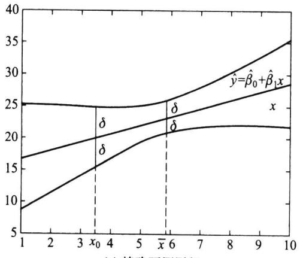  
(a)精确预测区间

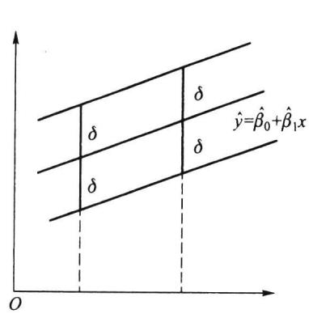  
图8.4.2预测区间示意图  
(b)近似预测区间

当n较大时（如 $\textstyle n > 3 0 )$ ,t分布可以用正态分布近似，进一步，若 $\scriptstyle { \boldsymbol { x } } _ { 0 }$ 与 $\overset { - } { x }$ 相差不大时,8可以近似取为

$$
\delta \approx u _ { 1 - \alpha / 2 } \hat { \sigma } ,\tag{8.4.24}
$$

其中 $u _ { 1 - \alpha / 2 }$ 是标准正态分布的 $1 - \alpha / 2$ 分位数，见图8.4.2（b）.

例8.4.4在例8.4.2中，如果 ${ x _ { 0 } } = 0 . 1 6$ ，则得预测值为

$$
\hat { \gamma } _ { \scriptscriptstyle 0 } = 2 8 . 1 2 + 1 3 2 . 6 6 \times 0 . 1 6 = 4 9 . 3 5 .
$$

若取 $\alpha = 0 . 0 5$ ,则 $t _ { 0 . 9 7 5 } ( 1 0 ) = 2 . 2 2 8 \ 1$ ，又 $\hat { \sigma } = \sqrt { 1 7 . 7 2 / \left( 1 2 - 2 \right) } = 1 . 3 3 1 \ 2$ ，应用（8.4.21）式，

$$
\delta _ { 0 } = 2 . 2 2 8 \ 1 \times 1 . 3 3 1 \ 2 \times \sqrt { \frac { 1 } { 1 2 } + \frac { \left( 0 . 1 6 \mathrm { ~ - ~ } 0 . 1 5 8 \mathrm { ~ 3 } \right) ^ { 2 } } { 0 . 0 1 8 \mathrm { ~ 6 ~ } } } = 0 . 8 6 .
$$

故 ${ x _ { 0 } } = 0 . 1 6$ 对应因变量 $\boldsymbol { y } _ { 0 }$ 的均值 $E ( \boldsymbol { y } _ { 0 } )$ 的0.95置信区间为

$$
{ \left[ 4 9 . 3 5 \ \pm 0 . 8 6 \right] = \left[ 4 8 . 4 9 , 5 0 . 2 1 \right] . }
$$

应用（8.4.23）式，

$$
\delta = 2 . 2 2 8 \ 1 \times 1 . 3 3 1 \ 2 \times \sqrt { 1 + \frac { 1 } { 1 2 } + \frac { \left( 0 . 1 6 \mathrm { ~ - ~ } 0 . 1 5 8 \mathrm { ~ 3 } \right) ^ { 2 } } { 0 . 0 1 8 \mathrm { ~ 6 ~ } } } = 3 . 0 9 ,
$$

从而 $\boldsymbol { y } _ { 0 }$ 的概率为0.95的预测区间为

$$
[ 4 9 . 3 5 \pm 3 . 0 9 ] = [ 4 6 . 2 6 , 5 2 . 4 4 ] .
$$

我们可以清楚地看到， $E ( \boldsymbol { y } _ { 0 } )$ 的0.95置信区间比 $\boldsymbol { y } _ { 0 }$ 的概率为0.95的预测区间窄很多，这是因为随机变量的均值相对于随机变量本身而言波动更小.

如果求近似预测区间，则可按（8.4.24）式计算，由于 $u _ { 0 . 9 7 5 } = 1 . 9 6$ ,故有 $\delta \approx 1 . 9 6 \times$ $1 . 3 3 1 2 = 2 . 6 1$ ，则所求区间为

$$
{ \bigl [ } 4 9 . 3 5 - 2 . 6 1 , 4 9 . 3 5 + 2 . 6 1 { \bigr ] } = { \bigl [ } 4 6 . 7 4 , 5 1 . 9 6 { \bigr ] } .
$$

此处近似预测区间与精确预测区间相差较大，主要是因为n较小的原因.

下面我们以一个完整的例子把本节内容重新梳理一遍.

例8.4.5在动物学研究中，有时需要找出某种动物的体积与质量的关系.因为动物的质量相对而言容易测量，而测量体积比较困难，因此，人们希望用动物的质量预测其体积.下面是18只某种动物的体积与质量数据，在这里，动物质量被看作自变量，用x表示，单位为 $\mathbf { k g }$ ，动物体积则作为因变量，用y表示，单位为 $\mathrm { d } \mathrm { m } ^ { 3 }$ ，18组数据列于表8.4.4中.

表8.4.418只某种动物的体积y与质量x数据
<table><tr><td>x</td><td>y x</td><td>y</td><td>x y</td></tr><tr><td>10.4</td><td>10.2 15.1</td><td>14.8</td><td>16.5 15.9</td></tr><tr><td>10.5</td><td>10.4 15.1</td><td>15.1</td><td>16.7 16.6</td></tr><tr><td>11.9</td><td>11.6 15.1</td><td>14.5</td><td>17.1 16.7</td></tr><tr><td>12.1</td><td>11.9 15.7</td><td>15.7</td><td>17.1 16.7</td></tr><tr><td>13.8</td><td>13.5 15.8</td><td>15.2</td><td>17.8 17.6</td></tr><tr><td>15.0</td><td>14.5 16.0</td><td>15.8</td><td>18.4 18.3</td></tr></table>

为能用动物质量估计动物体积，必须建立动物体积y关于动物质量x的回归方程.首先，我们用这18组数据画出散点图，见图8.4.3.

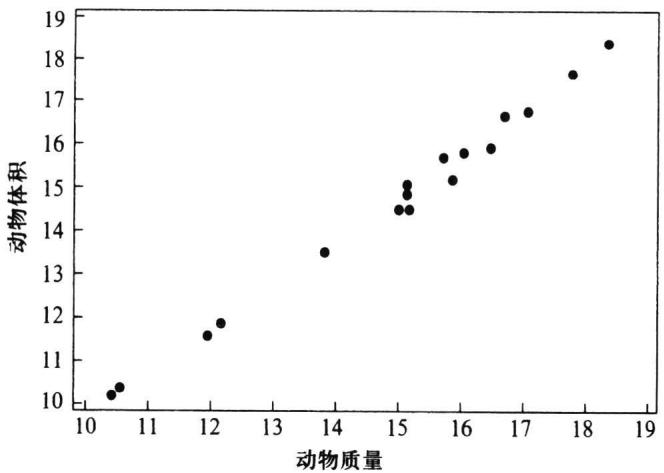  
图8.4.3动物体积与动物质量的散点图

从散点图我们发现18个点基本在一条直线附近,这说明两个变量之间在质量为10 $\mathbf { k } \mathbf { g }$ 到20 kg内有一个线性相关关系，下面求该线性回归方程，计算过程见表8.4.5.

表8.4.5动物体积与质量数据的计算表
<table><tr><td> $\textstyle \sum x _ { i } = 2 7 0 . 1$ </td><td>n=18</td><td> $\textstyle \sum y _ { i } = 2 6 5 . 0$ </td></tr><tr><td> $\overline { { x } } = 1 5 . 0 0 5 \mathrm { ~ 6 ~ }$ </td><td></td><td> $\overline { { y } } = 1 4 . 7 2 2 \ 2$ </td></tr><tr><td> $\sum x _ { i } ^ { 2 } = 4 1 4 9 . 3 9$ </td><td> $\textstyle \sum x _ { i } \ y _ { i } = 4 \ 0 7 1 . 7 1$ </td><td> $\textstyle \sum y _ { i } ^ { 2 } = 3 ~ 9 9 6 . 1 4$ </td></tr><tr><td> $n \ { \overline { { x } } } ^ { 2 } = 4 \ 0 5 3 . 0 0 0 \ 6$ </td><td> $n \ { \stackrel {  } { x } } \ { \stackrel {  } { y } } = 3 \ 9 7 6 . 4 7 2 \ 2$ </td><td> $n \stackrel { - 2 } { y } = 3 ~ 9 0 1 . 3 8 8 ~ 9$ </td></tr><tr><td> $l _ { x x } = 9 6 . 3 8 9 \ 4$ </td><td> $l _ { x y } = 9 5 . 2 3 7 ~ 8$ </td><td> $l _ { _ { y y } } = 9 4 . 7 5 1 \ 1$ </td></tr><tr><td>A</td><td>β,=l/=0.9881</td><td></td></tr><tr><td></td><td>A A</td><td></td></tr><tr><td></td><td>β。=y-β,x=-0.1048</td><td></td></tr></table>

由此给出回归方程为

$$
\hat { y } = - \ 0 . 1 0 4 \ 8 \ + \ 0 . 9 8 8 \ 1 x .\tag{8.4.25}
$$

接下来我们考虑关于回归方程的显著性检验.经计算有

$$
S _ { \tau } = l _ { _ { y y } } = 9 4 . 7 5 1 1 ,
$$

$$
f _ { \tau } = 1 7 ,
$$

$$
S _ { _ R } = \widehat { \beta } _ { 1 } ^ { 2 } l _ { _ { x x } } = 0 . 9 8 8 \ 1 ^ { 2 } \times 9 6 . 3 8 9 \ 4 = 9 4 . 1 0 9 \ 0 , \quad f _ { _ R } = 1 ,
$$

$$
S _ { e } = S _ { r } - S _ { R } = 0 . 6 4 2 \ 1 ,
$$

$$
f _ { e } = 1 6 .
$$

把诸平方和移人方差分析表上，继续计算，具体见表8.4.6.

表8.4.6动物体积与质量回归方程的方差分析表
<table><tr><td>来源</td><td>平方和</td><td>自由度</td><td>均方</td><td>F比</td><td>p值</td></tr><tr><td>回归</td><td> $S _ { { \scriptscriptstyle R } } = 9 4 . 1 0 9 ~ 0$ </td><td> $f _ { R } = 1$ </td><td> $M S _ { _ R } = 9 4 . 1 0 9 \ 0$ </td><td>2 346.9</td><td>0.0000</td></tr><tr><td>残差</td><td> $S _ { e } = 0 . 6 4 2 \ 1$ </td><td> $f _ { \mathrm { e } } = 1 6$ </td><td> $M S _ { \mathrm { e } } = 0 . 0 4 0 \ 1$ </td><td></td><td></td></tr><tr><td>总计</td><td> $S _ { \tau } = 9 4 . 7 5 1 1$ </td><td> $f _ { T } = 1 7$ </td><td></td><td></td><td></td></tr></table>

因 $P$ 值很小，在显著性水平0.01下回归方程是显著的.

如果测得某动物的质量为 $x _ { 0 } = 1 7 . 6 ~ \mathrm { k g }$ ，则由（8.4.25）式，该质量对应动物平均体积的估计值为

$$
\hat { \gamma } _ { \scriptscriptstyle 0 } = - \ 0 . 1 0 4 \ 8 \ + \ 0 . 9 8 8 \ 1 \times 1 7 . 6 = 1 7 . 2 8 5 \ 8 .
$$

若取α=0.05，则 $t _ { \scriptscriptstyle { 0 . 9 7 5 } } ( \mathrm { ~ } 1 6 ) = 2 . 1 1 9 \mathrm { ~ } 9$ ，又 $\hat { \sigma } = \sqrt { 0 . 0 4 0 \ 1 } = 0 . 2 0 0 \ 2$ ，应用（8.4.23）式，

$$
\delta = 2 . 1 1 9 ~ 9 \times ~ 0 . 2 0 0 ~ 2 ~ \times \sqrt { 1 ~ + \frac { 1 } { 1 8 } + \frac { ( 1 7 . 6 ~ - ~ 1 5 . 0 0 5 ~ 6 ) ^ { ~ 2 } } { 9 6 . 3 8 9 ~ 4 } } = 0 . 4 5 0 ~ 2 ,
$$

从而该质量对应动物体积的概率为0.95的预测区间为

$$
\big [ 1 7 . 2 8 5 ~ 8 ~ - ~ 0 . 4 5 0 ~ 2 , 1 7 . 2 8 5 ~ 8 ~ + ~ 0 . 4 5 0 ~ 2 \big ] ~ = \big [ ~ 1 6 . 8 3 5 ~ 6 , 1 7 . 7 3 6 ~ 0 \big ] .
$$

用（8.4.24）式可以求近似预测区间，由于 $u _ { 0 . 9 7 5 } = 1 . 9 6$ ，故有 $\delta \approx 1 . 9 6 \times 0 . 2 0 0 \ : 2 =$ 0.3924，则所求区间为

$$
{ \left[ \ 1 7 . 2 8 5 \ 8 \ - \ 0 . 3 9 2 \ 4 , 1 7 . 2 8 5 \ 8 \ + \ 0 . 3 9 2 \ 4 \ \right] \ = \ \left[ \ 1 6 . 8 9 3 \ 4 , 1 7 . 6 7 8 \ 2 \right] . }
$$

此处近似预测区间与精确预测区间差距已不大了，当n更大一些，两者差距会更小一些.

## 习题8.4

1.假设回归直线过原点，即一元线性回归模型为

$$
y _ { _ i } \ = \ \beta \ x _ { _ i } \ + \ \varepsilon _ { _ i } , \qquad i \ = \ 1 , 2 , \cdots , n ,
$$

$E ( \varepsilon _ { i } ) = 0 , \mathrm { V a r } ( \varepsilon _ { i } ) = \sigma ^ { 2 }$ ，诸观测值相互独立.

（1）写出β的最小二乘估计和 $\sigma ^ { 2 }$ 的无偏估计；

（2）对给定的x，其对应的因变量均值的估计为 $\boldsymbol { x } _ { \ u { 0 } }$ $\hat { y } _ { 0 }$ ，求 $\mathsf { V a r } ( \hat { y } _ { 0 } )$

2.设回归模型为

$$
\left\{ \begin{array} { l l } { { y _ { i } = \beta _ { \scriptscriptstyle 0 } + \beta _ { \scriptscriptstyle 1 } x _ { \scriptscriptstyle i } + \varepsilon _ { \scriptscriptstyle i } , i = 1 , 2 , \cdots , n , } } \\ { { { } } } \\ { { \succeq \varepsilon _ { \scriptscriptstyle i } \biggr \} \pounds _ { \scriptscriptstyle i } \frac { \dot { \lambda } } { \bot } \big \lbrack \overrightarrow { { \bf e } } \big \rbrack \varkappa _ { \scriptscriptstyle i } \phi _ { \scriptscriptstyle i } { \uparrow } \phi _ { \scriptscriptstyle i } , \sharp \big \rbrack \# _ { \scriptscriptstyle i } \phi _ { \scriptscriptstyle i } { \uparrow } \phi _ { \scriptscriptstyle N } ( 0 , \sigma ^ { 2 } ) . } } \end{array} \right.
$$

试求 $\beta _ { \circ } , \beta _ { \iota }$ 的最大似然估计，它们与其最小二乘估计一致吗？

3.在回归分析计算中，常对数据进行变换

$$
\widetilde { \boldsymbol { y } } _ { i } \ = \ \frac { \boldsymbol { y } _ { i } \ - \ \boldsymbol { c } _ { 1 } } { \boldsymbol { d } _ { 1 } } , \quad \widetilde { \boldsymbol { x } } _ { i } \ = \ \frac { \boldsymbol { x } _ { i } \ - \ \boldsymbol { c } _ { 2 } } { \boldsymbol { d } _ { 2 } } , \quad i \ = \ 1 , 2 , \cdots , n ,
$$

其中 $c _ { \scriptscriptstyle 1 } , c _ { \scriptscriptstyle 2 } , d _ { \scriptscriptstyle 1 } ( d _ { \scriptscriptstyle 1 } > 0 ) , d _ { \scriptscriptstyle 2 } ( d _ { \scriptscriptstyle 2 } > 0 )$ 是适当选取的常数.

（1）试建立由原始数据和变换后数据得到的最小二乘估计、总平方和、回归平方和以及残差平方和之间的关系；

(2）证明：由原始数据和变换后数据得到的F检验统计量的值保持不变.

4.对给定的n组数据 $( x _ { i } , y _ { i } ) \ , i = 1 , 2 , \cdots , n$ ，若我们关心的是y如何依赖x的取值而变动，则可以建立回归方程

$$
{ \widehat { \boldsymbol { y } } } { \mathrm { ~ } } = { \mathrm { ~ } } { \boldsymbol { a } } { \mathrm { ~ } } + { \boldsymbol { b } } { \boldsymbol { x } } { \mathrm { . ~ } }
$$

反之，若我们关心的是x如何依赖y的取值而变动，则可以建立另一个回归方程

$$
{ \widehat { x } } = c + d y .
$$

试问这两条直线在直角坐标系中是否重合？为什么？若不重合，它们有无交点？若有，试给出交点的坐标.

5.为考察某种维尼纶纤维的耐水性能，安排了一组试验，测得其甲醇浓度x及相应的"缩醇化度 $" y$ 数据如下：

<table><tr><td>x</td><td>18</td><td>20</td><td>22</td><td>24</td><td>26</td><td>28</td><td>30</td></tr><tr><td>y</td><td>26.86</td><td>28.35</td><td>28.75</td><td>28.87</td><td>29.75</td><td>30.00</td><td>30.36</td></tr></table>

（1）作散点图；

（2）求样本相关系数；

（3）建立一元线性回归方程；

（4）对建立的回归方程作显著性检验 $\big ( \alpha = 0 . 0 1 \big )$

6.测得一组弹簧形变x(单位：cm)和相应的外力y(单位：N)数据如下：

<table><tr><td>y</td><td>1</td><td>1.2</td><td>1.4</td><td>1.6</td><td>1.8</td><td>2.0</td><td>2.2</td><td>2.4</td><td>2.8</td><td>3.0</td></tr><tr><td>x</td><td>3.08</td><td>3.76</td><td>4.31</td><td>5.02</td><td>5.51</td><td>6.25</td><td>6.74</td><td>7.40</td><td>8.54</td><td>9.24</td></tr></table>

由胡克定律知 $\widehat { y } = k x$ ，试估计k，并在 $x = 2 . 6 ~ \mathrm { c m }$ 处给出相应的外力y的0.95预测区间.

7.设由 $\{ \mathbf { \Phi } _ { \mathfrak { x } _ { i } } , \mathbf { \Phi } _ { \mathfrak { y } _ { i } } \} \mid ( i = 1 , 2 , \cdots , n )$ 可建立一元线性回归方程 $, \hat { \boldsymbol { y } } _ { i }$ 是由回归方程得到的拟合值，证明：样本相关系数r满足关系

$$
r ^ { 2 } = \frac { \displaystyle \sum _ { i = 1 } ^ { n } { ( \hat { \boldsymbol { y } } _ { i } - \overline { { \boldsymbol { y } } } ) } ^ { 2 } } { \displaystyle \sum _ { i = 1 } ^ { n } { ( \boldsymbol { y } _ { i } - \overline { { \boldsymbol { y } } } ) } ^ { 2 } } ,
$$

上式也称为回归方程的决定系数.

8.现收集了16组合金钢中的碳含量x及强度y的数据，求得

$\overline { { x } } ~ = ~ 0 . 1 2 5$ $\overline { { y } } ~ = ~ 4 5 . 7 8 8 ~ 6$ ，l=0.3024，l，=25.5218, $l _ { _ { y y } } = 2 \ 4 3 2 . 4 5 6 \ 6 .$

（1）建立y关于x的一元线性回归方程 $\hat { \boldsymbol { y } } = \hat { \boldsymbol { \beta } } _ { 0 } + \hat { \boldsymbol { \beta } } _ { 1 }$ x；

（2）写出 $\hat { \beta } _ { \mathfrak { o } }$ 和 $\hat { | \beta | } _ { }$ 的分布；

（3）求 $\hat { \beta } _ { \mathfrak { o } }$ 和 $\hat { | \beta _ { 1 } }$ 的相关系数；

（4）列出对回归方程作显著性检验的方差分析表 $\big ( \alpha = 0 . 0 5 \big )$

（5）给出 $\beta _ { \iota }$ 的0.95置信区间；

(6）在 $x = 0 . 1 5$ 时求对应的y的0.95预测区间.

9.设回归模型为 $\left\{ \begin{array} { l } { { \gamma _ { _ i } = \beta _ { _ 0 } + \beta _ { _ 1 } x _ { _ i } + \varepsilon _ { _ i } } } \\ { { { } } } \\ { { \varepsilon _ { _ i } \sim N ( 0 , \sigma ^ { 2 } ) ~ , } } \end{array} \right.$ 现收集了15组数据，经计算有

$$
\overline { { x } } ~ = ~ 0 . 8 5 , ~ \overline { { y } } ~ = ~ 2 5 . 6 0 , ~ { l } _ { _ { x x } } ~ = ~ 1 9 . 5 6 , ~ { l } _ { _ { x y } } ~ = ~ 3 2 . 5 4 , ~ { l } _ { _ { y y } } ~ = ~ 4 6 . 7 4 ,
$$

后经核对，发现有一组数据记录错误，正确数据为（1.2，32.6），记录为（1.5，32.3）.

（1）求 $\beta _ { _ 0 } , \beta _ { _ 1 }$ 修正后的LSE；

（2）对回归方程作显著性检验（α=0.05）；

（3）若 ${ \boldsymbol x } _ { 0 } = 1 . 1$ ，给出对应响应变量的0.95预测区间.

10.在生 $\mathcal { F }$ 中积累了32组某种铸件在不同腐蚀时间x下腐蚀深度 $y$ 的数据，求得回归方程为

$$
\widehat { y } \ = \ - \ 0 . 4 4 4 \ 1 \ + \ 0 . 0 0 2 \ 2 6 3 x ,
$$

且误差方差的无偏估计为 $\hat { \sigma } ^ { 2 } = 0 . 0 0 1 \ 4 5 2$ ，总偏差平方和为0.1246.

（1）对回归方程作显著性检验 $\left( \alpha = 0 . 0 5 \right)$ ，列出方差分析表；

（2）求样本相关系数；

（3）若腐蚀时间 $\boldsymbol { x } = 8 7 0$ ，试给出y的0.95近似预测区间.

11.我们知道营业税税收总额y与社会商品零售总额x有关.为能从社会商品零售总额去预测税收总额，需要了解两者之间的关系.现收集了如下9组数据（单位：亿元）：

<table><tr><td>序号</td><td>社会商品零售总额</td><td>营业税税收总额</td></tr><tr><td>1</td><td>142.08</td><td>3.93</td></tr><tr><td>2</td><td>177.30</td><td>5.96</td></tr><tr><td>3</td><td>204.68</td><td>7.85</td></tr><tr><td>4</td><td>242.68</td><td>9.82</td></tr><tr><td>5</td><td>316.24</td><td>12.50</td></tr><tr><td>6</td><td>341.99</td><td>15.55</td></tr><tr><td>7</td><td>332.69</td><td>15.79</td></tr><tr><td>8</td><td>389.29</td><td>16.39</td></tr><tr><td>9</td><td>453.40</td><td>18.45</td></tr></table>

（1）画散点图；  
（2）建立一元线性回归方程，并作显著性检验（取α=0.05），列出方差分析表；  
（3）若已知某年社会商品零售总额为300亿元，试给出营业税税收总额的概率为0.95的预测区间；  
（4）若已知回归直线过原点，试求回归方程，并在显著性水平0.05下作显著性检验.

## §8.5一元非线性回归

有时，回归函数并非是自变量的线性函数，若通过变换可以将之化为线性函数，从而可用一元线性回归方法对其分析，这是处理非线性回归问题的一种常用方法.下面以一个例子说明上述非线性回归的分析步骤.

例8.5.1炼钢厂出钢水时用的钢包，在使用过程中由于钢水及炉渣对耐火材料的侵蚀，其容积不断增大.钢包的容积用盛满钢水时的质量y（单位：kg）表示，相应的使

用次数用x表示.数据见表8.5.1，要找出y与x的定量关系表达式.

表8.5.1钢包的质量y与使用次数x数据
<table><tr><td>序号</td><td>x</td><td>y</td><td>序号</td><td>x</td><td>y</td></tr><tr><td>1</td><td>2</td><td>106.42</td><td>8</td><td>11</td><td>110.59</td></tr><tr><td>2</td><td>3</td><td>108.20</td><td>9</td><td>14</td><td>110.60</td></tr><tr><td>3</td><td>4</td><td>109.58</td><td>10</td><td>15</td><td>110.90</td></tr><tr><td>4</td><td>5</td><td>109.50</td><td>11</td><td>16</td><td>110.76</td></tr><tr><td>5</td><td>7</td><td>110.00</td><td>12</td><td>18</td><td>111.00</td></tr><tr><td>6</td><td>8</td><td>109.93</td><td>13</td><td>19</td><td>111.20</td></tr><tr><td>7</td><td>10</td><td>110.49</td><td></td><td></td><td></td></tr></table>

下面我们分三步进行.

## 8.5.1确定可能的函数形式

为对数据进行分析，首先描出数据的散点图，判断两个变量之间可能的函数关系，图8.5.1是本例的散点图.

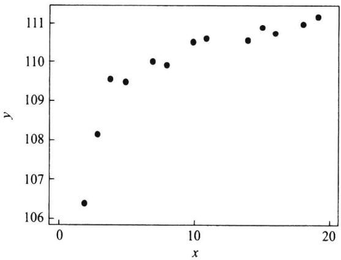  
图8.5.1钢包质量与使用次数散点图

观察这13个点形成的散点图,我们可以看到它们并不接近一条直线，用曲线拟合这些点应该是更恰当的.这里就涉及如何选择曲线函数形式的问题，首先,如果可由专业知识确定回归函数形式，则应尽可能利用专业知识.若不能由专业知识加以确定函数形式，则可将散点图与一些常见的函数关系的图形进行比较，选择几个可能的函数形式,然后使用统计方法在这些函数形式之间进行比较，最后确定合适的曲线回归方程.为此，必须了解常见的曲线函数的图形，见图8.5.2.

本例中，散点图呈现一个明显的向上且上凸的趋势，可能选择的函数关系有很多，比如，参照图8.5.2，我们可以给出如下四个曲线函数：

$$
\left( 1 \right) \frac { 1 } { y } = a + \frac { b } { x } ,\tag{8.5.1}
$$

(2) $\gamma = a + b \ln x .$

(8.5.2)

$$
( 3 ) \ y = a + b { \sqrt { x } } \ ,\tag{8.5.3}
$$

$$
( 4 ) \ y - 1 0 0 = a \mathrm { e } ^ { - b / x } \ ( \ b > 0 ) .\tag{8.5.4}
$$

<table><tr><td rowspan=1 colspan=1>函数名称</td><td rowspan=1 colspan=1>函数表达式</td><td rowspan=1 colspan=1>图  像</td><td rowspan=1 colspan=1>线性化方法</td></tr><tr><td rowspan=1 colspan=1>双曲线函数</td><td rowspan=1 colspan=1> ${ \frac { 1 } { y } } = a + { \frac { b } { x } }$ </td><td rowspan=1 colspan=1>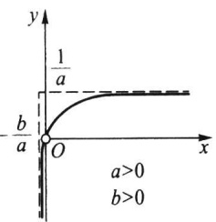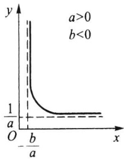</td><td rowspan=1 colspan=1> $v = { \frac { 1 } { y } }$  $u = { \frac { 1 } { x } }$ </td></tr><tr><td rowspan=1 colspan=1>幂函数</td><td rowspan=1 colspan=1> $\gamma = { a x } ^ { b }$ </td><td rowspan=1 colspan=1>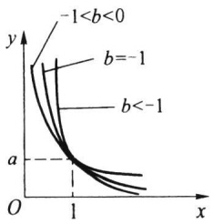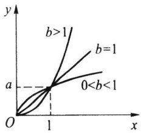</td><td rowspan=1 colspan=1> $\begin{array} { r } { \upsilon = \ln \ y } \\ { u = \ln \ x } \end{array}$ </td></tr><tr><td rowspan=2 colspan=1>指数函数</td><td rowspan=1 colspan=1> $\gamma = a \mathrm { e } ^ { b x }$ </td><td rowspan=1 colspan=1>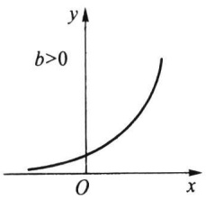                         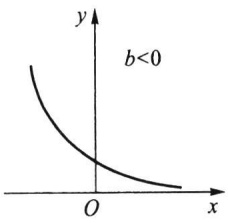</td><td rowspan=1 colspan=1> $\scriptstyle \upsilon = \ln \ y$  $u = x$ </td></tr><tr><td rowspan=1 colspan=1> $\scriptstyle \gamma = a \mathbf { e } ^ { b / x }$ </td><td rowspan=1 colspan=1>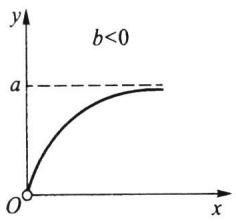                          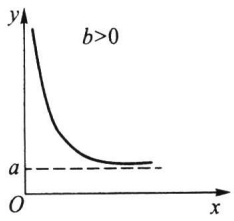</td><td rowspan=1 colspan=1> $v = \ln \ y$  $u = \frac { 1 } { x }$ </td></tr><tr><td rowspan=1 colspan=1>对数函数</td><td rowspan=1 colspan=1> $\scriptstyle y = a + b \ln x$ </td><td rowspan=1 colspan=1>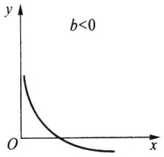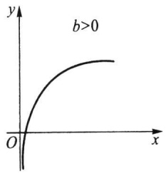</td><td rowspan=1 colspan=1> $\begin{array} { c } { { \upsilon = y } } \\ { { } } \\ { { u = \ln \ x } } \end{array}$ </td></tr><tr><td rowspan=1 colspan=1>S形曲线</td><td rowspan=1 colspan=1> $\gamma = \frac { 1 } { a + b \mathrm { e } ^ { - x } }$ </td><td rowspan=1 colspan=1>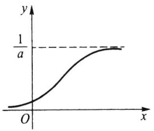</td><td rowspan=1 colspan=1> $v = \frac { 1 } { y }$  $u = \mathrm { e } ^ { - x }$ </td></tr></table>

图8.5.2部分常见的曲线函数的图形

在初步选出可能的函数关系（即方程)后，我们必须解决两个问题：

·如何估计所选方程中的参数？这在8.5.2中讨论.

·如何评价所选不同方程的优劣？这在8.5.3中介绍.

## 8.5.2参数估计

对形如(8.5.1)式至(8.5.4)式的非线性函数，参数估计最常用的方法是“线性化”方法，即通过某种变换，将方程化为一元线性方程的形式.

以（8.5.1)式为例，为了能采用一元线性回归分析方法，我们作如下变换：

$$
u = \frac { 1 } { x } , \qquad v = \frac { 1 } { y } ,
$$

则（8.5.1)的曲线函数就化为如下的直线：

$$
\upsilon = a \ + \ b u ,
$$

这是理论回归函数.对数据而言，回归方程为

$$
\boldsymbol { \upsilon } _ { _ i } = \boldsymbol { a } + b \boldsymbol { u } _ { _ i } + \boldsymbol { \varepsilon } _ { _ i } ,
$$

于是可用一元线性回归的方法估计出α,b.图8.5.3给出变换后的数据的散点图.

从图8.5.3上看出可以认为所有的点近似在一条直线上下波动，因此，建立一元线性回归方程是可行的.整个计算过程及估计列于表8.5.2和表8.5.3中.

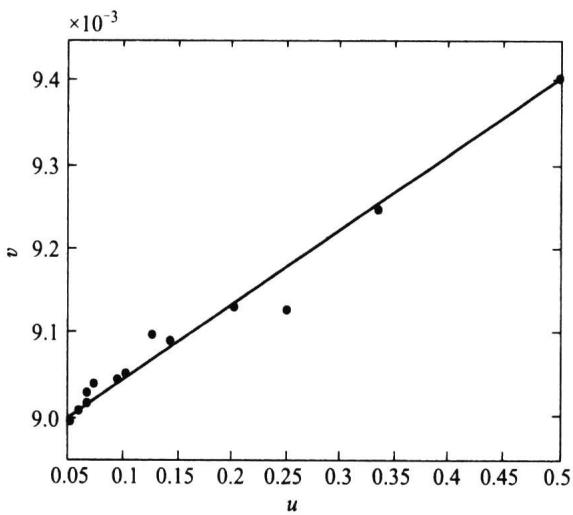  
图8.5.3变换后数据的散点图

表8.5.2钢包数据的变换值
<table><tr><td>x</td><td>y</td><td> $u = 1 / x$ </td><td> $\boldsymbol { v } = 1 / y$ </td><td> $u ^ { ^ { 2 } }$ </td><td>uv</td></tr><tr><td>2</td><td>106.42</td><td>0.500000</td><td>0.009397</td><td>0.250000</td><td>0.004 698</td></tr><tr><td>3</td><td>108.20</td><td>0.333333</td><td>0.009242</td><td>0.111111</td><td>0.003081</td></tr><tr><td>4</td><td>109.58</td><td>0.250 000</td><td>0.009126</td><td>0.062500</td><td>0.002 281</td></tr><tr><td>x</td><td>y</td><td> $u = 1 / x$ </td><td> $ \upsilon = 1 / y$ </td><td> $u ^ { ^ 2 }$ </td><td>uv</td></tr><tr><td>5</td><td>109.50</td><td>0.200000</td><td>0.009132</td><td>0.040000</td><td>0.001 826</td></tr><tr><td>7</td><td>110.00</td><td>0.142 857</td><td>0.009 091</td><td>0.020 408</td><td>0.001299</td></tr><tr><td>8</td><td>109.93</td><td>0.125000</td><td>0.009 097</td><td>0.015 625</td><td>0.001137</td></tr><tr><td>10</td><td>110.49</td><td>0.100 000</td><td>0.009 051</td><td>0.010000</td><td>0.000905</td></tr><tr><td>11</td><td>110.59</td><td>0.090909</td><td>0.009 042</td><td>0.008 264</td><td>0.000822</td></tr><tr><td>14</td><td>110.60</td><td>0.071 429</td><td>0.009 042</td><td>0.005102</td><td>0.000646</td></tr><tr><td>15</td><td>110.90</td><td>0.066 667</td><td>0.009 017</td><td>0.004 444</td><td>0.000 601</td></tr><tr><td>16</td><td>110.76</td><td>0.062 500</td><td>0.009 029</td><td>0.003906</td><td>0.000 564</td></tr><tr><td>18</td><td>111.00</td><td>0.055556</td><td>0.009 009</td><td>0.003086</td><td>0.000 501</td></tr><tr><td>19</td><td>111.20</td><td>0.052 632</td><td>0.008 993</td><td>0.002 770</td><td>0.000473</td></tr><tr><td></td><td>合计</td><td>2.050 881 94</td><td>0.118 266 72</td><td>0.537217 98</td><td>0.018 83495</td></tr><tr><td></td><td>均值</td><td>0.157 760 15</td><td>0.009 09744</td><td></td><td></td></tr></table>

注：为了下面的计算需要，表中合计与均值两行取8位小数.

表8.5.3参数估计计算表
<table><tr><td> $\textstyle \sum u _ { \scriptscriptstyle i } = 2 . 0 5 0 ~ 8 8 1 ~ 9 4$   $\overline { { u } } = 0 . 1 5 7 7 6 0 1 5$ </td><td> $n = 1 3$ </td><td> $\textstyle \sum v _ { _ i } = 0 . 1 1 8 \ 2 6 6 \ 7 2$   $\stackrel { - } { v } = 0 . 0 0 9 \ 0 9 7 \ 4 4$ </td></tr><tr><td> $\textstyle \sum u _ { i } ^ { 2 } = 0 . 5 3 7 \ 2 1 7 \ 9 8$ </td><td> $\begin{array} { r } { \sum u \ v { v } _ { i } = 0 . 0 1 8 \ 8 3 4 \ 9 5 } \end{array}$ </td><td></td></tr><tr><td> $n \stackrel { - 2 } { u } = 0 . 3 2 3 \ 5 4 7 \ 4 4$ </td><td> $n \stackrel { \_ } { u } \stackrel { \_ } { v } = 0 . 0 1 8 \ 6 5 7 \ 7 8$ </td><td></td></tr><tr><td> $l _ { _ { u u } } = 0 . 2 1 3 \ 6 7 0 \ 5 4$ </td><td> $l _ { _ { u v } } = 0 . 0 0 0 \ 1 7 7 \ 1 7$ </td><td></td></tr><tr><td></td><td> $\hat { b } = l _ { _ { u v } } / l _ { _ { u u } } = 0 . 0 0 0 \ 8 2 9 \ 1 7$ </td><td></td></tr><tr><td></td><td>@=-bu=0.008966 63</td><td></td></tr><tr><td></td><td></td><td></td></tr><tr><td></td><td> ${ \widehat { y } } = { \frac { x } { 0 . 0 0 0 \ 8 2 9 \ 1 7 + 0 . 0 0 8 \ 9 6 6 \ 6 3 x } }$ </td><td></td></tr><tr><td></td><td></td><td></td></tr></table>

用类似的方法可以得出其他三个曲线回归方程，它们分别是

$$
\hat { y } = 1 0 6 . 3 1 4 7 \ + \ 3 . 9 4 6 \ 6 \mathrm { l n } \ x ,
$$

$$
\hat { y } = 1 0 6 . 3 0 1 \ 3 \ + \ 1 . 1 9 4 \ 7 \sqrt { x } \ ,
$$

$$
\hat { y } = 1 0 0 + 1 1 . 7 5 0 6 \mathrm { e } ^ { - 1 . 1 2 5 6 / x } .
$$

## 8.5.3曲线回归方程的比较

我们上面得到了四个曲线回归方程，在这四个方程中，哪一个更好一点呢？通常

可采用如下两个指标进行选择.

（1）决定系数 $\boldsymbol { R } ^ { 2 }$ 类似于一元线性回归方程中相关系数，决定系数定义为

$$
R ^ { 2 } = 1 - \frac { \sum \left( y _ { _ { i } } - \hat { y } _ { _ { i } } \right) ^ { 2 } } { \sum \left( y _ { _ { i } } - \overline { { y } } \right) ^ { 2 } } .\tag{8.5.5}
$$

$R ^ { 2 }$ 越大，说明残差越小，回归曲线拟合越好， $R ^ { 2 }$ 从总体上给出一个拟合好坏程度的度量.

（2）剩余标准差s.类似于一元线性回归中标准差的估计公式，此剩余标准差可用平均残差平方和来获得，即

$$
s = \sqrt { \frac { \sum \left( \boldsymbol { y } _ { i } - \boldsymbol { \hat { y } } _ { i } \right) ^ { 2 } } { n - 2 } } .\tag{8.5.6}
$$

s为诸观测点 $\boldsymbol { y } _ { i }$ 与由曲线给出的拟合值 $\hat { \boldsymbol y } _ { i }$ 间的平均偏离程度的度量,s越小，方程越好.在观测数据给定后，不同的曲线选择不会影响 $\sum _ { i \mathop { = } 1 } ^ { n } { \bigl ( } y _ { i } - { \bar { y } } { \bigr ) } ^ { 2 }$ 的取值，但会影响到残差平方和 $\sum _ { i \ = 1 } ^ { n } { { { \left( { { y } _ { i \ } } - { { \hat { y } } _ { i \ } } \right) } ^ { 2 } } }$ 的取值.因此，对选择的曲线而言，决定系数和剩余标准差都取决于残差平方和 $\sum _ { i = 1 } ^ { n } { { { \left( { { y } _ { i } } - { \hat { y } } _ { i } \right) } ^ { 2 } } }$ ，从而两种选择准则是一致的，只是从两个不同侧面作出评价.

表8.5.4给出第一个曲线回归方程的残差平方和的计算过程.由于 $n = 1 3 , \sum _ { i = 1 } ^ { 1 3 } { (  y _ { i }  - }$ ${ \bar { y } } ) ^ { 2 } = 2 1 . 2 1 0 \ 5$ ，故其决定系数及剩余标准差分别为

$$
R ^ { 2 } = 1 - \frac { 0 . 5 7 4 3 } { 2 1 . 2 1 0 5 } = 0 . 9 7 2 9 , s = \sqrt { \frac { 0 . 5 7 4 3 } { 1 3 - 2 } } = 0 . 2 2 8 5 .
$$

其他三个方程的决定系数及剩余标准差可同样计算，我们将它们列在表8.5.5中.

表8.5.4第一个方程的残差平方和计算表
<table><tr><td> $\boldsymbol { \mathscr { Y } } _ { i }$ </td><td> $\hat { \boldsymbol { y } } _ { i }$ </td><td> $\hat { e } _ { { \scriptscriptstyle i } } = y _ { { \scriptscriptstyle i } } - \hat { y } _ { { \scriptscriptstyle i } }$ </td><td> $\hat { \boldsymbol e } _ { \scriptscriptstyle t } ^ { \scriptscriptstyle 2 }$ </td><td> $\boldsymbol { y } _ { i }$ </td><td> $\hat { \boldsymbol { y } } _ { i }$ </td><td> $\hat { e } _ { i } { = } y _ { i } { - } \hat { y } _ { i }$ </td><td> $\hat { e } _ { i } ^ { 2 }$ </td></tr><tr><td>106.42</td><td>106.596</td><td>-0.176001</td><td>0.030976</td><td>110.59</td><td>110.595</td><td>-0.004 890</td><td>0.000024</td></tr><tr><td>108.20</td><td>108.190</td><td>0.010252</td><td>0.000105</td><td>110.60</td><td>110.793</td><td>-0.192 810</td><td>0.037176</td></tr><tr><td>109.58</td><td>109.005</td><td>0.575373</td><td>0.331054</td><td>110.90</td><td>110.841</td><td>0.058701</td><td>0.003446</td></tr><tr><td>109.50</td><td>109.499</td><td>0.000 526</td><td>0.000000</td><td>110.76</td><td>110.884</td><td>-0.123 761</td><td>0.015317</td></tr><tr><td>110.00</td><td>110.071</td><td>-0.070 543</td><td>0.004976</td><td>111.00</td><td>110.955</td><td>0.045397</td><td>0.002061</td></tr><tr><td>109.93</td><td>110.250</td><td>-0.320225</td><td>0.102544</td><td>111.20</td><td>110.984</td><td>0.215541</td><td>0.046458</td></tr><tr><td>110.49</td><td>110.503</td><td>-0.012 769</td><td>0.000163</td><td></td><td>和</td><td></td><td>0.5743</td></tr></table>

注 $\cdot \hat { y } _ { i }$ 用3位小数，实际计算中用的是 $\cdot \hat { y } _ { i }$ 的6位小数.

表8.5.5四种曲线回归的决定系数及剩余标准差
<table><tr><td>模型编号</td><td>1</td><td>2</td><td>3</td><td>4</td></tr><tr><td> $R ^ { 2 }$ </td><td>0.9729</td><td>0.8773</td><td>0.7851</td><td>0.9623</td></tr><tr><td>S</td><td>0.2285</td><td>0.4864</td><td>0.6437</td><td>0.2696</td></tr></table>

从表8.5.5中可以看出，第一个曲线方程的决定系数最大，剩余标准差最小，在这四个曲线回归方程中，不论用哪个标准，都是第一个方程拟合得最好.因此，近似得比较好的定量关系式就是

$$
{ \hat { y } } = { \frac { x } { 0 . 0 0 0 \ 8 2 9 \ 1 7 \ + \ 0 . 0 0 8 \ 9 6 6 \ 6 3 x } } .
$$

## 习题8.5

1.设曲线函数形式为 $y = a + b \ln x$ ，试给出一个变换将之化为一元线性回归的形式.

2.设曲线函数形式为 $\gamma = a + b { \sqrt { x } }$ ，试给出一个变换将之化为一元线性回归的形式.

3.设曲线函数形式为 $\ y ^ { - } 1 0 0 = a \mathrm { e } ^ { - x / b }$ （b>0），试给出一个变换将之化为一元线性回归的形式.

4.设曲线函数形式为 $\boldsymbol { y } = \boldsymbol { a } + \mathbf { e } ^ { b x }$ ，问能否找到一个变换将之化为一元线性回归的形式？若能，试给出；若不能，说明理由.

5.设曲线函数形式为 $\gamma = \frac { 1 } { a + b \mathrm { e } ^ { - x } }$ ，问能否找到一个变换将之化为一元线性回归的形式？若能，试给出；若不能，说明理由.

6.设曲线函数形式为 $y = a \mathrm { e } ^ { b / x }$ ，问能否找到一个变换将之化为一元线性回归的形式？若能，试给出；若不能，说明理由.

7.为了检验X射线的杀菌作用，用200kV的X射线照射杀菌，每次照射6min，照射次数为x，照射后所剩细菌数为y，下表是一组试验结果：

<table><tr><td>x y</td><td>x</td><td>y</td><td>x</td><td>y</td></tr><tr><td>1</td><td>783</td><td>8 154</td><td>15</td><td>28</td></tr><tr><td>2</td><td>621</td><td>9</td><td>129</td><td>16 20</td></tr><tr><td>3</td><td>433</td><td>10 103</td><td>17</td><td>16</td></tr><tr><td>4</td><td>431</td><td>1 72</td><td>18</td><td>12</td></tr><tr><td>5</td><td>287</td><td>12 50</td><td>19</td><td>9</td></tr><tr><td>6</td><td>251</td><td>13</td><td>43 20</td><td>7</td></tr><tr><td>7</td><td>175</td><td>14</td><td>31</td><td></td></tr></table>

根据经验知道y关于x的曲线回归方程形如

$$
{ \hat { \boldsymbol { y } } } ^ { \prime } = a \operatorname { e } ^ { b x } ,
$$

试给出具体的回归方程，并求其对应的决定系数R和剩余标准差s. $R ^ { 2 }$

